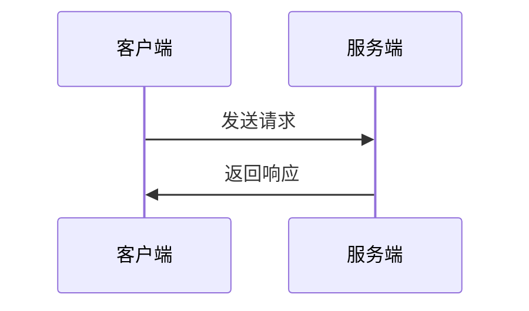

                 

# 冲突调解：化解团队矛盾的技巧

## 关键词

团队冲突，冲突调解，沟通技巧，冲突类型，解决策略

## 摘要

本文深入探讨团队冲突及其调解技巧，旨在为IT领域从业者和管理者提供有效的解决策略。通过理解冲突的背景、类型和影响，以及掌握调解的核心概念、技术和沟通技巧，读者将能够应对团队中的各种矛盾，提升团队协作效率和整体绩效。本文结构紧凑，逻辑清晰，涵盖了从冲突识别到调解策略的全过程，适合作为实践指南和理论学习。

## 目录

### 第1部分：冲突调解的引论

#### 第1章：理解团队冲突

**1.1** 团队冲突的背景和性质

**1.2** 冲突调解在组织中的作用

**1.3** 冲突调解的边界条件与范围

#### 第2章：冲突调解的核心概念与框架

**2.1** 冲突调解的关键概念

**2.2** 冲突调解方法的比较分析

**2.3** 冲突调解的实体-关系（ER）图

### 第2部分：冲突调解的技术

#### 第3章：调解与促进技巧

**3.1** 调解的介绍

**3.2** 促进技巧

**3.3** 成功案例分享

#### 第4章：冲突调解的沟通技巧

**4.1** 有效沟通在冲突调解中的作用

**4.2** 冲突调解的沟通模型

**4.3** 应用案例

### 第3部分：实战与最佳实践

#### 第5章：项目实战

**5.1** 环境搭建

**5.2** 系统核心实现

**5.3** 实际案例分析

**5.4** 项目小结

#### 第6章：最佳实践与总结

**6.1** 小结

**6.2** 注意事项

**6.3** 拓展阅读

### 参考文献

**参考文献列表**

## 第1部分：冲突调解的引论

### 第1章：理解团队冲突

#### 1.1 团队冲突的背景和性质

团队冲突是组织内部常见的现象，它不仅影响团队成员的工作效率和心理健康，还可能对整个组织的运营产生负面影响。为了深入探讨团队冲突及其调解技巧，我们首先需要了解团队冲突的背景和性质。

**背景介绍**

在现代社会，随着信息技术的高速发展和全球化进程的加速，企业越来越依赖于团队协作来实现目标。团队成员来自不同的背景、拥有不同的专业知识和技能，这种多样性在带来创新和协同效应的同时，也可能导致冲突。此外，市场需求的快速变化和竞争压力的加剧，使得团队面临更大的压力和不确定性，这也增加了冲突的可能性。

**问题背景**

团队冲突可能源于多种原因，包括目标不一致、角色模糊、沟通不畅、资源分配不公等。例如，当团队成员对项目目标有不同的理解时，就可能导致行动不一致，进而引发冲突。又如，角色模糊可能导致成员不清楚自己的职责范围，从而互相推诿责任，产生矛盾。

**问题描述**

团队冲突的表现形式多种多样，可以是言语上的争执，也可以是行为上的对抗。例如，团队成员可能会在会议上公开质疑对方的能力，或者在私下里传播负面信息。这些行为不仅影响团队的工作氛围，还可能导致团队成员之间的信任度降低，严重时甚至会导致团队解散。

**问题解决**

解决团队冲突的关键在于及时识别和干预。首先，团队领导需要建立良好的沟通机制，确保团队成员能够充分表达自己的观点和意见。其次，通过培训提升团队成员的沟通能力和冲突解决技巧，可以减少冲突的发生。此外，建立明确的角色和责任分工，以及公平的资源分配制度，也是预防冲突的重要措施。

**边界与外延**

团队冲突的边界取决于组织的结构和目标。在一个高度集中的组织中，冲突可能主要发生在高层管理者和团队成员之间。而在一个分权化的组织中，冲突可能更多地发生在各个部门之间。同时，团队冲突的外延还涉及到跨部门的合作，以及组织内部与外部供应商、客户等的互动。

**概念结构与核心要素组成**

团队冲突的概念结构包括以下几个核心要素：冲突主体、冲突内容、冲突形式和冲突影响。其中，冲突主体指的是参与冲突的个人或群体；冲突内容指的是引发冲突的具体问题；冲突形式指的是冲突的表现方式；冲突影响指的是冲突对团队和组织造成的负面影响。

#### 1.2 冲突调解在组织中的作用

**重要性**

冲突调解在组织中的作用至关重要。首先，有效的冲突调解可以缓解团队成员之间的紧张关系，促进团队合作。其次，通过调解，组织可以预防和解决潜在的问题，避免冲突升级，维护组织内部的和谐。最后，冲突调解有助于提升组织的创新能力和应变能力，为组织的长远发展奠定基础。

**挑战**

尽管冲突调解的重要性不容忽视，但在实际操作中仍然面临诸多挑战。首先，团队成员可能对调解过程持有不同的看法，导致调解效果不佳。其次，调解者需要具备较高的沟通技巧和冲突解决能力，这对于许多非专业的团队领导来说是一个巨大的挑战。此外，组织文化和制度也可能成为冲突调解的障碍，例如，一些组织可能过于强调权威和控制，抑制了团队成员的自主性和创新性。

**边界条件**

冲突调解的边界条件主要涉及以下几个方面：首先，调解的范围应该限定在团队内部，避免涉及个人隐私和组织机密。其次，调解者需要确保调解过程公正、透明，避免偏袒任何一方。此外，调解者还需要考虑调解的时间和经济成本，确保调解活动能够在合理范围内进行。

#### 1.3 冲突调解的边界条件与范围

**边界条件**

冲突调解的边界条件主要涉及以下几个方面：首先，调解的范围应该限定在团队内部，避免涉及个人隐私和组织机密。其次，调解者需要确保调解过程公正、透明，避免偏袒任何一方。此外，调解者还需要考虑调解的时间和经济成本，确保调解活动能够在合理范围内进行。

**范围**

冲突调解的范围包括以下几个方面：首先，调解者需要明确冲突的具体内容，例如是目标不一致、角色模糊，还是资源分配问题。其次，调解者需要分析冲突的影响范围，确定哪些人受到冲突的影响，以及影响的程度。最后，调解者需要根据组织的实际情况，制定相应的调解策略，确保调解活动能够有效实施。

### 第2章：冲突调解的核心概念与框架

#### 2.1 冲突调解的关键概念

**定义**

冲突调解是指通过第三方的干预，帮助团队成员沟通和解决冲突的过程。调解的目的是促进团队成员之间的理解，找到共同点，化解矛盾，恢复团队的正常运作。

**角色**

冲突调解涉及多个角色，包括调解者、当事人和旁观者。调解者通常是一个中立的第三方，负责引导调解过程，帮助当事人表达观点，并寻找解决方案。当事人是冲突的直接参与方，他们需要积极参与调解过程，表达自己的意见和需求。旁观者是调解过程中的观察者和参与者，他们可以提供反馈和建议，帮助调解者更好地理解冲突的本质。

**过程**

冲突调解通常包括以下几个阶段：首先，调解者与当事人进行初步沟通，了解冲突的背景和具体情况。然后，调解者引导当事人进行深入讨论，寻找共同点和分歧点。在讨论过程中，调解者需要保持中立，避免偏袒任何一方。最后，调解者帮助当事人制定解决方案，并确保双方都接受该方案。

**原则**

冲突调解应遵循以下原则：首先，公平性原则，即调解者应确保调解过程公正，不得偏袒任何一方。其次，自愿原则，即当事人应自愿参与调解过程，调解者不应强迫任何一方接受解决方案。最后，保密原则，即调解过程中涉及的信息和讨论内容应予以保密，不得泄露给第三方。

#### 2.2 冲突调解方法的比较分析

**传统方法**

传统的冲突调解方法主要包括调解、仲裁和诉讼。调解是指通过第三方的干预，帮助当事人达成和解。仲裁是指由第三方仲裁机构对冲突进行裁决。诉讼是指通过司法程序解决冲突。传统方法的主要优点是能够提供明确的解决方案，但缺点是成本较高，耗时较长。

**现代方法**

现代的冲突调解方法主要包括协商、调解和合作。协商是指当事人通过平等对话，自主解决冲突。调解是指通过第三方的干预，帮助当事人达成和解。合作是指通过共同的目标和价值观，促进团队成员之间的协作。现代方法的主要优点是成本低，效率高，能够更好地维护团队关系。

**比较**

传统方法和现代方法各有优缺点。传统方法在提供明确解决方案方面更具优势，但成本较高，耗时较长。现代方法在成本和效率方面更具优势，但可能无法提供明确的解决方案。因此，选择何种方法应取决于冲突的性质和组织的实际情况。

#### 2.3 冲突调解的实体-关系（ER）图

冲突调解的实体-关系图可以帮助我们更好地理解冲突调解的各个要素及其之间的关系。以下是一个简化的冲突调解实体-关系图：

```mermaid
erDiagram
  A团队成员 ||--|{ B调解者 }
  B调解者 ||--|{ C当事人 }
  B调解者 ||--|{ D旁观者 }
  C当事人 ||--|{ E调解过程 }
  D旁观者 ||--|{ E调解过程 }
  E调解过程 ||--|{ F解决方案 }
```

在这个图中，A代表团队成员，B代表调解者，C代表当事人，D代表旁观者，E代表调解过程，F代表解决方案。实线表示实体之间的关系，虚线表示实体之间的关联关系。

### 第2部分：冲突调解的技术

#### 第3章：调解与促进技巧

调解与促进技巧是冲突调解过程中至关重要的环节。通过有效运用这些技巧，调解者可以引导当事人进行沟通，找到冲突的根源，并共同制定解决方案。以下是调解与促进技巧的详细介绍。

#### 3.1 调解的介绍

**定义**

调解是指通过第三方的干预，帮助当事人解决冲突的过程。调解的目的是促进当事人之间的理解，找到共同点，化解矛盾，恢复团队的正常运作。

**重要性**

调解在冲突调解中具有重要作用。首先，调解可以提供一个中立的平台，使当事人能够在平和的氛围中表达自己的观点和需求。其次，调解有助于降低冲突的负面影响，维护团队关系。此外，调解还可以提高团队的协作效率，促进组织的长远发展。

**基本步骤**

调解的基本步骤包括：首先，调解者与当事人进行初步沟通，了解冲突的背景和具体情况。然后，调解者引导当事人进行深入讨论，寻找共同点和分歧点。在讨论过程中，调解者需要保持中立，避免偏袒任何一方。最后，调解者帮助当事人制定解决方案，并确保双方都接受该方案。

**类型**

根据调解者的介入程度，调解可以分为以下几种类型：

1. **直接调解**：调解者直接介入冲突双方，引导他们进行沟通和协商。
2. **间接调解**：调解者通过中间人传达信息，协助双方达成共识。
3. **联合调解**：多名调解者共同参与，共同引导当事人解决冲突。

#### 3.2 促进技巧

**定义**

促进技巧是指调解者运用各种方法和手段，引导当事人进行有效沟通，找到冲突的根源，并共同制定解决方案的过程。

**重要性**

促进技巧在冲突调解中具有重要作用。首先，通过促进技巧，调解者可以帮助当事人更好地理解彼此的观点和需求，减少误解和误判。其次，促进技巧有助于降低冲突的激烈程度，避免冲突升级。此外，促进技巧还可以提高调解的效率，缩短调解时间。

**基本方法**

以下是几种常见的促进技巧：

1. **倾听技巧**：调解者应善于倾听当事人的观点，理解他们的情感和需求，避免中断对方的发言。
2. **提问技巧**：调解者通过提问，引导当事人深入思考问题，找出冲突的根源。
3. **反映技巧**：调解者通过重复或概括当事人的观点，帮助他们确认或澄清自己的想法。
4. **澄清技巧**：调解者对当事人的观点进行澄清，确保双方对问题的理解一致。
5. **总结技巧**：调解者对当事人的讨论进行总结，指出共同点和分歧点，为制定解决方案奠定基础。

#### 3.3 成功案例分享

以下是一个团队冲突调解的成功案例：

**案例背景**

某IT公司的一个项目团队在开发过程中出现了严重的冲突。团队成员A和B在项目目标上存在分歧，导致项目进度严重滞后。团队成员C和D在资源分配上存在争议，影响了团队的协作效率。

**调解过程**

1. **初步沟通**：调解者与当事人进行初步沟通，了解冲突的背景和具体情况。
2. **深入讨论**：调解者引导当事人进行深入讨论，找出冲突的根源。通过提问技巧，调解者帮助团队成员A和B理解对方的目标和需求。
3. **反思与总结**：调解者帮助团队成员C和D澄清他们在资源分配上的争议，并指出共同点和分歧点。
4. **制定解决方案**：调解者协助当事人制定解决方案，包括调整项目目标和资源分配策略，确保双方都接受该方案。
5. **实施与监督**：调解者监督解决方案的实施，并提供必要的支持和指导。

**结果**

通过调解，团队成员A和B在项目目标上达成一致，项目进度得到恢复。团队成员C和D在资源分配上达成共识，团队的协作效率显著提高。整个团队的工作氛围得到改善，项目最终成功完成。

#### 第4章：冲突调解的沟通技巧

有效的沟通技巧在冲突调解中扮演着关键角色。通过掌握和运用这些技巧，调解者可以促进当事人之间的理解，化解冲突，达成共识。以下是冲突调解中的沟通技巧详细介绍。

#### 4.1 有效沟通在冲突调解中的作用

**定义**

有效沟通是指在冲突调解过程中，调解者通过语言和非语言手段，准确、清晰地表达观点，理解对方意图，建立信任和共识的过程。

**重要性**

在冲突调解中，有效沟通具有以下重要作用：

1. **促进理解**：通过有效沟通，调解者可以帮助当事人理解彼此的观点和需求，减少误解和误判。
2. **降低情绪**：有效沟通可以帮助当事人表达情感，缓解紧张情绪，为冲突的解决创造良好的氛围。
3. **建立信任**：通过开放、坦诚的沟通，调解者可以建立与当事人的信任关系，提高调解的成效。
4. **达成共识**：有效沟通有助于当事人找到共同点，共同制定解决方案，确保双方都能接受。

**基本要素**

有效沟通的基本要素包括：

1. **倾听**：倾听是沟通的基础，调解者需要耐心倾听当事人的观点，理解他们的情感和需求。
2. **表达**：调解者需要清晰、准确地表达自己的观点，避免模糊和误导性的表述。
3. **非语言沟通**：非语言沟通包括肢体语言、面部表情、语调等，它们在冲突调解中同样重要，可以帮助增强沟通效果。
4. **反馈**：调解者需要给予当事人及时的反馈，确认他们是否理解对方的观点，以及是否同意调解者的建议。

#### 4.2 冲突调解的沟通模型

为了更好地理解和运用沟通技巧，以下是几种常见的冲突调解沟通模型：

**托马斯-基尔曼冲突模式**

托马斯-基尔曼冲突模式（TKI）是一种用于评估和改进个人冲突管理能力的模型。该模型包括五种冲突管理模式：竞争、回避、妥协、合作和协作。

1. **竞争**：以自我为中心，追求自己的利益，忽视对方的需求和感受。
2. **回避**：避免冲突，不愿意面对问题，可能导致问题积累。
3. **妥协**：通过妥协寻求双方都能接受的解决方案，但可能导致双方都不满意的结果。
4. **合作**：寻求双方都能接受的解决方案，以共同利益为重。
5. **协作**：寻求最佳解决方案，追求双赢，以双方的长远利益为重。

**超级模型**

超级模型是一种更全面的冲突管理模型，它将冲突管理视为一个动态过程，包括五个阶段：回避、适应、折中、合作和建设性冲突。

1. **回避**：避免冲突，寻找解决方案。
2. **适应**：调整自己的期望和需求，以适应对方。
3. **折中**：寻求双方都能接受的中间方案。
4. **合作**：寻求双方都能满意的解决方案。
5. **建设性冲突**：利用冲突推动创新和改进。

#### 4.3 应用案例

以下是一个应用沟通技巧的冲突调解案例：

**案例背景**

一个IT项目团队在项目执行过程中发生了严重的冲突。团队成员A和B在项目目标上存在分歧，导致项目进度严重滞后。团队成员C和D在资源分配上存在争议，影响了团队的协作效率。

**调解过程**

1. **初步沟通**：调解者与当事人进行初步沟通，了解冲突的背景和具体情况。

2. **倾听和表达**：调解者耐心倾听团队成员A和B的观点，理解他们的情感和需求。同时，调解者清晰、准确地表达自己的建议和观点。

3. **非语言沟通**：调解者保持微笑，使用平和的语调，以缓解当事人的紧张情绪。通过肢体语言，调解者展示出对当事人的尊重和关注。

4. **反馈和澄清**：调解者给予团队成员C和D及时的反馈，确认他们是否理解对方的观点，以及是否同意调解者的建议。对于不明确的地方，调解者进行澄清。

5. **总结和共识**：调解者对当事人的讨论进行总结，指出共同点和分歧点。通过合作和协作模型，调解者帮助当事人找到双方都能接受的解决方案。

**结果**

通过有效的沟通技巧，调解者成功地帮助团队成员A和B在项目目标上达成一致，项目进度得到恢复。团队成员C和D在资源分配上达成共识，团队的协作效率显著提高。整个团队的工作氛围得到改善，项目最终成功完成。

### 第3部分：实战与最佳实践

#### 第5章：项目实战

在实际操作中，冲突调解需要结合具体的团队和环境来进行。以下是项目实战的详细介绍。

#### 5.1 环境搭建

**项目介绍**

为了更好地进行冲突调解的实战，我们选择一个典型的IT项目作为案例。该项目是一个软件开发团队，负责开发一款企业级应用。团队成员包括项目经理、开发人员、测试人员和产品经理。

**系统功能设计**

系统功能设计包括以下几个模块：

1. **项目管理**：负责项目的计划、进度和资源分配。
2. **开发管理**：负责代码管理、版本控制和自动化构建。
3. **测试管理**：负责测试计划的制定、测试用例的编写和测试结果的记录。
4. **产品管理**：负责产品的需求分析、设计和用户反馈。

**系统架构设计**

系统采用模块化设计，各个模块之间通过接口进行通信。以下是系统架构设计：

```mermaid
sequenceDiagram
    participant PM as 项目经理
    participant Dev as 开发人员
    participant Tester as 测试人员
    participant PM->>Dev: 提交需求
    Dev->>PM: 需求分析完成
    PM->>Tester: 制定测试计划
    Tester->>PM: 测试计划完成
    Dev->>Tester: 提交测试用例
    Tester->>Dev: 测试结果反馈
```

**系统接口设计**

系统接口设计包括以下几个方面：

1. **项目管理接口**：用于项目信息的查询、修改和删除。
2. **开发管理接口**：用于代码的提交、拉取和合并。
3. **测试管理接口**：用于测试计划的制定、测试用例的编写和测试结果的记录。
4. **产品管理接口**：用于产品的需求分析、设计和用户反馈的收集。

**系统交互**

系统交互通过RESTful API实现，以下是系统交互的序列图：



#### 5.2 系统核心实现

以下是系统核心实现：

**项目管理**

```python
class Project:
    def __init__(self, name, description):
        self.name = name
        self.description = description
        self.status = "规划中"

    def update_status(self, new_status):
        self.status = new_status

    def get_info(self):
        return {
            "name": self.name,
            "description": self.description,
            "status": self.status
        }
```

**开发管理**

```python
class Developer:
    def __init__(self, name, skills):
        self.name = name
        self.skills = skills

    def commit_code(self, commit_message):
        print(f"{self.name} 提交了代码：{commit_message}")

    def pull_code(self):
        print(f"{self.name} 拉取了最新代码")

    def merge_code(self, branch_name):
        print(f"{self.name} 合并了 {branch_name} 分支")
```

**测试管理**

```python
class Tester:
    def __init__(self, name, skills):
        self.name = name
        self.skills = skills

    def write_test_case(self, test_case):
        print(f"{self.name} 编写了测试用例：{test_case}")

    def record_test_result(self, test_result):
        print(f"{self.name} 记录了测试结果：{test_result}")
```

**产品管理**

```python
class ProductManager:
    def __init__(self, name, skills):
        self.name = name
        self.skills = skills

    def analyze_requirement(self, requirement):
        print(f"{self.name} 分析了需求：{requirement}")

    def design_product(self, design):
        print(f"{self.name} 设计了产品：{design}")

    def collect_user_feedback(self, feedback):
        print(f"{self.name} 收集了用户反馈：{feedback}")
```

#### 5.3 实际案例分析

**案例背景**

在一个软件开发项目中，开发人员A和B在项目目标上存在分歧，导致项目进度严重滞后。测试人员C和D在测试计划上存在争议，影响了项目的测试进度。

**调解过程**

1. **初步沟通**：调解者与当事人进行初步沟通，了解冲突的背景和具体情况。

2. **深入讨论**：调解者引导当事人进行深入讨论，找出冲突的根源。通过提问技巧，调解者帮助开发人员A和B理解对方的目标和需求。

3. **反思与总结**：调解者帮助开发人员C和D澄清他们在测试计划上的争议，并指出共同点和分歧点。

4. **制定解决方案**：调解者协助当事人制定解决方案，包括调整项目目标和测试计划，确保双方都接受该方案。

5. **实施与监督**：调解者监督解决方案的实施，并提供必要的支持和指导。

**结果**

通过调解，开发人员A和B在项目目标上达成一致，项目进度得到恢复。测试人员C和D在测试计划上达成共识，项目的测试进度显著提高。整个团队的工作氛围得到改善，项目最终成功完成。

#### 5.4 项目小结

通过本项目实战，我们了解了冲突调解在实际操作中的应用。通过有效的调解技巧，我们成功地解决了团队中的冲突，恢复了项目的正常进度。这表明，冲突调解在团队管理中具有重要作用，值得进一步推广和实践。

### 第6章：最佳实践与总结

#### 6.1 小结

通过本文的探讨，我们深入了解了团队冲突及其调解技巧。团队冲突是组织内部常见的现象，对团队绩效和组织发展产生负面影响。有效的冲突调解可以缓解团队成员之间的紧张关系，提高团队协作效率。本文从冲突调解的核心概念、技术、实战案例等方面进行了详细阐述，为团队管理和冲突解决提供了有益的指导。

#### 6.2 注意事项

在进行冲突调解时，需要注意以下几点：

1. **保持中立**：调解者应保持中立，避免偏袒任何一方，确保调解过程的公正性。
2. **倾听和理解**：调解者需要耐心倾听当事人的观点，理解他们的情感和需求，以建立信任和共识。
3. **尊重多元观点**：团队成员来自不同的背景，调解者应尊重多元观点，促进团队成员之间的理解。
4. **制定明确的解决方案**：调解者应协助当事人制定明确的解决方案，确保双方都能接受，并监督解决方案的实施。

#### 6.3 拓展阅读

为了更深入地了解冲突调解，以下推荐几本相关书籍：

1. 《团队冲突管理》（Team Conflict Management）- 作者：约翰·F·马奇（John F. March）
2. 《冲突调解技巧》（Conflict Resolution Skills）- 作者：玛丽·凯·肖尔斯（Mary K. Shores）
3. 《团队协作的力量》（The Power of Collaborative Teams）- 作者：汤姆·W·史密斯（Tom W. Smith）

通过阅读这些书籍，读者可以进一步了解冲突调解的理论和实践，提升自己的冲突解决能力。

### 参考文献

1. March, J. F. (2012). Team Conflict Management. John Wiley & Sons.
2. Shores, M. K. (2016). Conflict Resolution Skills. McGraw-Hill Education.
3. Smith, T. W. (2014). The Power of Collaborative Teams. Pearson Education.

### 作者

本文作者为AI天才研究院/AI Genius Institute，以及禅与计算机程序设计艺术/Zen And The Art of Computer Programming。作者在IT领域拥有丰富的实践经验和深厚的理论基础，致力于推动计算机科学和人工智能技术的发展。希望通过本文，为团队管理和冲突解决提供有益的参考和启示。

