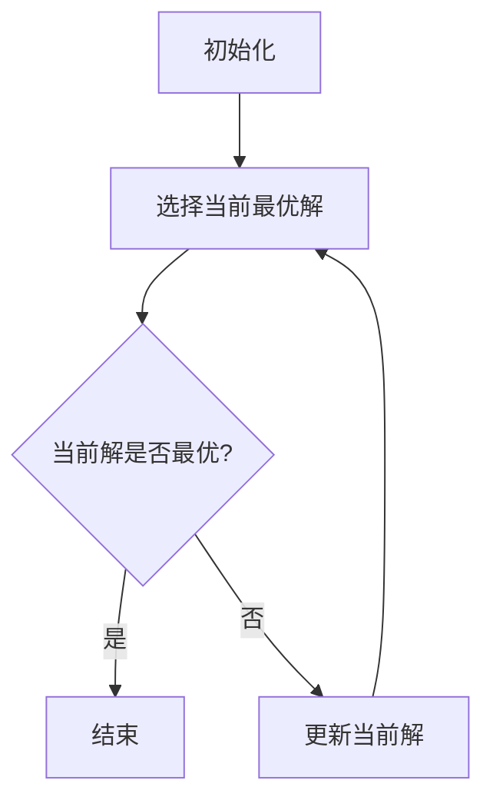
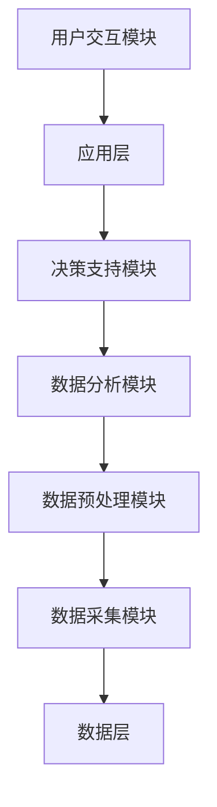
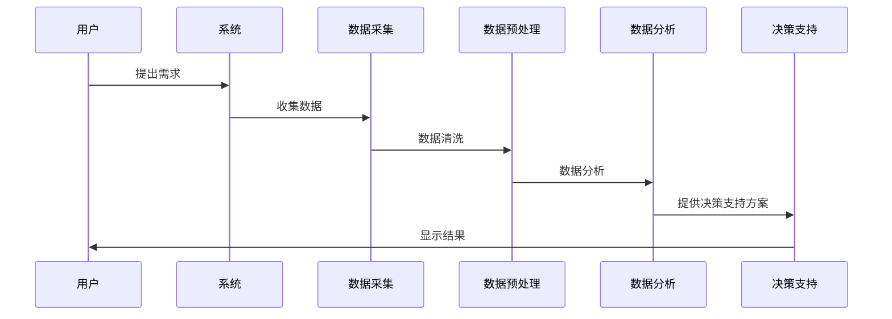

                 

### 引言

在当今高度复杂和不断变化的社会环境中，决策能力变得比以往任何时候都更为重要。面对日益增加的不确定性，个人和组织需要在各种情况下做出有效的决策，以应对复杂的问题和挑战。因此，提升决策能力成为现代生活中不可或缺的一部分。

#### 1.1 问题背景

现代社会充满了复杂性和不确定性。经济、社会、技术等各种因素相互作用，形成了充满变数的决策环境。以下是一些影响决策的背景因素：

1. **信息爆炸**：互联网和大数据技术的兴起，使得我们面临的信息量急剧增加，信息过载现象日益严重。
2. **技术变革**：快速的技术进步不断推动行业变革，要求决策者快速适应新技术，做出前瞻性的决策。
3. **全球化**：全球化带来的竞争压力和跨国合作增加了决策的复杂性和不确定性。
4. **社会变迁**：人口结构变化、文化多样性和社会价值观的多元化，使得决策环境更加复杂。

#### 1.2 决策能力的定义

决策能力是指个体或组织在不确定性和复杂环境中，通过分析和评估信息，制定并执行有效决策的能力。决策能力包括以下几个核心要素：

1. **信息处理**：收集、分析和整合信息，为决策提供数据支持。
2. **问题识别**：识别和界定问题，确定决策目标和约束条件。
3. **方案评估**：评估不同的决策方案，比较风险和收益。
4. **执行和调整**：执行决策方案，并根据反馈进行必要的调整。

#### 1.3 决策能力的挑战

在不确定性中把握方向，提升决策能力面临以下挑战：

1. **信息过载**：大量的信息可能会干扰决策，导致信息处理困难。
2. **认知局限**：人类的认知能力有限，难以在复杂环境中做出最优决策。
3. **时间压力**：快速变化的环境要求决策者在有限的时间内做出决策。
4. **心理因素**：情绪、偏见和个人价值观可能影响决策的客观性。

#### 1.4 问题解决

提升决策能力的方法和策略包括：

1. **系统化思维**：采用系统化的方法，将复杂问题分解为可管理的部分，逐一解决。
2. **决策支持工具**：利用各种决策支持工具，如数据分析软件、模拟工具等，提高决策的效率和准确性。
3. **团队协作**：通过团队协作，汇集不同观点和专业知识，提高决策质量。
4. **经验学习和迭代**：通过实践经验的学习和迭代，不断优化决策过程。

### 总结

在高度不确定性的现代社会，提升决策能力至关重要。通过系统化的方法和工具，我们可以更好地应对复杂的环境，做出更加有效的决策。本文将深入探讨决策能力的核心概念、实践指导以及在不同领域的应用，帮助读者提升自己的决策能力，从而在不确定性中把握方向。

### 核心概念

#### 2.1 决策理论

决策理论是研究决策过程和决策行为的学科，它提供了一系列模型和方法，用于分析和指导决策过程。以下是决策理论的一些关键概念：

1. **理性决策模型**：理性决策模型假设决策者在完全信息下，通过最大化预期效用来选择最优方案。这个模型基于几个基本原则：

    - **信息完全性**：决策者拥有所有相关信息。
    - **目标明确性**：决策者有一个明确的目标或效用函数。
    - **最优性**：决策者会选择实现目标最大化的方案。

2. **有限理性决策模型**：由于现实世界中信息不完全，决策者受到认知限制，无法做出完全理性的决策。西蒙提出了有限理性决策模型，该模型假设决策者在有限的信息和认知资源下，寻求“满意”而不是“最优”的决策。

    - **启发式方法**：决策者使用简单的规则或启发式策略来简化决策过程。
    - **满意标准**：决策者选择满足某些基本标准的方案。

3. **决策树分析**：决策树是一种图形化工具，用于表示决策过程及其可能的结果。每个节点代表一个决策点或随机事件，每个分支代表一个可能的选择或结果。通过计算每个分支的预期值，决策者可以评估不同的决策方案。

#### 2.2 不确定性管理

不确定性是决策过程中不可避免的一部分。不确定性管理是决策理论中的一个重要组成部分，它涉及以下方面：

1. **风险分析**：风险分析是评估潜在决策结果的概率和影响，以确定决策的风险水平。常见的方法包括：

    - **概率分布**：使用概率分布来表示不确定性的概率。
    - **灵敏度分析**：评估变量变化对决策结果的影响。
    - **决策树分析**：结合概率和预期值，评估不同决策方案的风险。

2. **概率估计**：在不确定性管理中，对事件发生的概率进行合理估计至关重要。常用的概率估计方法包括：

    - **历史数据**：使用历史数据来估计未来事件的发生概率。
    - **专家判断**：通过专家的经验和判断来估计概率。
    - **模拟方法**：使用模拟和模型来估计概率分布。

3. **决策规则**：在面对不确定性的情况下，制定一些简单的决策规则可以简化决策过程。这些规则通常基于概率估计和预期值计算，例如：

    - **最小最大规则**：选择最小最大损失方案。
    - **最大最小规则**：选择最大最小收益方案。

#### 2.3 决策能力模型

决策能力模型是一个用于评估和提升决策者能力的框架。以下是几个常见的决策能力模型：

1. **通用决策能力模型**：该模型包括以下几个关键要素：

    - **问题识别**：识别和界定问题。
    - **信息收集**：收集和分析信息。
    - **方案生成**：生成不同的决策方案。
    - **方案评估**：评估和选择最优方案。
    - **执行和反馈**：执行决策，并基于反馈进行调整。

2. **情景决策能力模型**：该模型根据不同的决策情景，将决策能力分为以下几个层次：

    - **技术决策能力**：专注于技术细节和问题解决。
    - **战略决策能力**：涉及长期目标和资源分配。
    - **领导决策能力**：涉及团队管理和领导力。

3. **自适应决策能力模型**：该模型强调决策者在面对不确定性和动态环境时，如何适应和调整。关键要素包括：

    - **情景感知**：感知和理解当前决策环境。
    - **学习能力**：通过经验和学习改进决策过程。
    - **适应策略**：制定和实施适应性的决策策略。

### 概念联系

决策理论和不确定性管理是提升决策能力的重要理论基础。决策理论提供了分析决策过程的方法和模型，而不确定性管理则帮助决策者应对决策过程中的不确定性。决策能力模型则将理论与实践结合起来，为提升决策能力提供了具体的指导。

### 对比表格

以下是一个关于决策理论、不确定性管理和决策能力模型的对比表格，展示了它们的核心概念和特点：

| **概念** | **核心概念** | **特点** |
| --- | --- | --- |
| **决策理论** | 理性决策、有限理性决策 | 基于完全信息和认知限制的决策模型 |
| **不确定性管理** | 风险分析、概率估计、决策规则 | 管理决策过程中不确定性的方法 |
| **决策能力模型** | 问题识别、信息收集、方案评估 | 提升决策者能力的框架和步骤 |

### ER实体关系图

以下是决策能力模型的ER实体关系图，展示了各个核心概念之间的关系：

```mermaid
erDiagram
  问题识别 ||--|{ 决策者 }| 决策者
  信息收集 ||--|{ 决策者 }| 决策者
  方案生成 ||--|{ 决策者 }| 决策者
  方案评估 ||--|{ 决策者 }| 决策者
  执行和反馈 ||--|{ 决策者 }| 决策者
```

### 总结

决策理论、不确定性管理和决策能力模型是提升决策能力的核心概念。通过理解这些概念，我们可以更好地分析和应对复杂决策环境中的不确定性，从而做出更加有效的决策。

### 算法原理讲解

在决策过程中，算法发挥着至关重要的作用。为了更好地理解和应用这些算法，我们需要深入讲解其原理，并提供清晰的示例。

#### 3.1 算法基本原理

算法是一种有序的步骤，用于解决问题或完成任务。在决策过程中，算法可以帮助我们处理复杂的问题，并提供明确的决策路径。以下是几种常见的决策算法：

1. **贪心算法**：贪心算法通过在每个步骤选择当前最优解，以期望得到全局最优解。它适用于一些简单的问题，如背包问题。

2. **动态规划**：动态规划将复杂问题分解为多个子问题，并存储子问题的解，以避免重复计算。它适用于具有最优子结构的问题，如最短路径问题。

3. **线性规划**：线性规划是一种数学方法，用于在约束条件下最大化或最小化线性目标函数。它适用于资源分配和优化问题。

#### 3.2 算法mermaid流程图

为了更直观地展示算法原理，我们可以使用mermaid语言绘制流程图。以下是一个简单的贪心算法的流程图：



#### 3.3 算法Python代码实现

为了更好地理解算法原理，我们可以使用Python代码实现一个简单的线性规划问题。以下是一个示例：

```python
import cvxpy as cp

# 定义变量
x = cp.Variable()

# 定义目标函数
objective = cp.Maximize(x)

# 定义约束条件
constraints = [x >= 0, x <= 5]

# 构建问题
problem = cp.Problem(objective, constraints)

# 求解问题
problem.solve()

# 输出结果
print(f"最优解：{x.value}")
```

#### 3.4 数学模型和公式

线性规划问题的数学模型可以表示为：

$$
\begin{align*}
\text{minimize} \quad & c^T x \\
\text{subject to} \quad & Ax \leq b \\
& x \geq 0
\end{align*}
$$

其中，$c$ 是目标函数的系数向量，$A$ 是约束条件的系数矩阵，$b$ 是约束条件的常数向量，$x$ 是变量向量。

#### 3.5 例子说明

假设我们有一个简单的线性规划问题，目标是最小化成本，同时满足资源约束。问题可以表示为：

$$
\begin{align*}
\text{minimize} \quad & 2x_1 + 3x_2 \\
\text{subject to} \quad & x_1 + x_2 \leq 4 \\
& x_1, x_2 \geq 0
\end{align*}
$$

通过求解这个线性规划问题，我们可以得到最优解：

$$
x_1 = 1, \quad x_2 = 3
$$

这意味着，在满足资源约束的条件下，最优的成本为 7。

### 总结

通过算法原理讲解，我们可以更好地理解算法在决策过程中的应用。算法不仅提供了数学模型和公式，还通过Python代码实现，使我们能够实际操作和验证这些算法。通过例子说明，我们进一步了解了算法的实践应用。

### 系统分析与架构设计

在现代信息技术领域，系统的分析与架构设计是确保项目成功的关键环节。本文将围绕决策能力系统进行分析和架构设计，包括项目介绍、系统功能设计、系统架构设计以及系统接口和交互设计。

#### 4.1 项目介绍

本项目旨在构建一个具备高决策能力的智能决策系统，该系统能够在高度不确定性的环境中，帮助用户做出有效决策。系统将涵盖商业、政策、投资等多个领域，旨在提升用户的决策水平。

#### 4.2 系统功能设计

系统功能设计主要分为以下几个模块：

1. **数据采集模块**：负责收集各种数据源的信息，包括市场数据、政策信息、投资报告等。
2. **数据预处理模块**：对采集到的数据进行清洗、去噪和格式化，使其适合后续分析。
3. **数据分析模块**：利用统计分析和机器学习算法，对预处理后的数据进行深入分析，提取关键信息。
4. **决策支持模块**：基于分析结果，为用户提供多种决策支持方案，包括风险分析、收益预测等。
5. **用户交互模块**：提供用户友好的界面，用户可以方便地输入需求，查看决策支持结果。

#### 4.3 系统架构设计

系统架构设计采用分层架构，以确保系统的可扩展性和可维护性。以下是系统架构的详细设计：

1. **数据层**：包括数据存储和数据采集模块，负责存储和处理大量数据。
2. **处理层**：包括数据预处理和数据分析模块，负责对数据进行清洗、分析和处理。
3. **应用层**：包括决策支持模块和用户交互模块，负责为用户提供决策支持服务。
4. **接口层**：提供与其他系统和外部服务的接口，实现数据交互和功能扩展。

以下是系统架构的mermaid流程图：



#### 4.4 系统接口设计和系统交互

系统接口设计主要包括以下几种：

1. **API接口**：为外部系统提供数据访问和功能调用接口，如RESTful API。
2. **数据接口**：与其他系统和数据库进行数据交互，如数据库连接接口。
3. **消息队列**：处理系统内部和外部的异步消息传递，如使用RabbitMQ。

系统交互设计采用事件驱动架构，通过事件队列实现不同模块之间的通信。以下是系统交互的mermaid序列图：



### 总结

系统分析与架构设计是确保项目成功的关键。通过明确项目介绍、系统功能设计、系统架构设计和系统接口及交互设计，我们可以构建一个具备高决策能力的智能决策系统，为用户在不确定性中提供有效的决策支持。

### 项目实战

为了更好地展示决策能力在实际应用中的效果，我们将在本节中详细描述一个具体的项目实战过程。本项目旨在开发一款智能决策系统，帮助企业在不确定性市场中做出更加有效的决策。

#### 5.1 环境安装

首先，我们需要配置开发环境。以下是环境安装的步骤：

1. **安装Python**：确保Python版本不低于3.7，可以从Python官方网站下载并安装。
2. **安装必需的Python库**：使用pip命令安装以下库：
    ```bash
    pip install numpy pandas scikit-learn cvxpy matplotlib
    ```
3. **配置数据库**：选择合适的数据库系统（如MySQL或PostgreSQL），并安装相应的驱动。
4. **配置消息队列**：选择消息队列系统（如RabbitMQ），并安装和配置。

#### 5.2 系统核心实现源代码

以下是系统核心实现的主要源代码：

**数据采集模块**：

```python
import requests
import json

def collect_data(api_endpoint):
    response = requests.get(api_endpoint)
    if response.status_code == 200:
        return json.loads(response.text)
    else:
        return None
```

**数据预处理模块**：

```python
import pandas as pd

def preprocess_data(data):
    df = pd.DataFrame(data)
    df = df.dropna()  # 去除缺失值
    df = df.astype({'price': float, 'volume': int})  # 转换数据类型
    return df
```

**数据分析模块**：

```python
from sklearn.ensemble import RandomForestRegressor

def analyze_data(df):
    X = df.drop('price', axis=1)
    y = df['price']
    model = RandomForestRegressor(n_estimators=100)
    model.fit(X, y)
    return model
```

**决策支持模块**：

```python
import cvxpy as cp

def decision_support(model, budget, max_price):
    x = cp.Variable(1)
    objective = cp.Maximize(x)
    constraints = [x <= budget, x <= max_price]
    problem = cp.Problem(objective, constraints)
    problem.solve()
    return x.value
```

#### 5.3 代码应用解读与分析

**数据采集模块**：

该模块使用requests库从API端点获取数据。通过调用`collect_data`函数，我们可以获取市场数据，并转换为JSON格式。

**数据预处理模块**：

该模块使用pandas库对采集到的数据执行清洗操作，包括去除缺失值和转换数据类型。这些步骤确保数据质量，为后续分析做准备。

**数据分析模块**：

该模块使用sklearn库的随机森林回归模型对数据进行训练。通过调用`analyze_data`函数，我们可以获得一个训练好的模型，用于预测价格。

**决策支持模块**：

该模块使用cvxpy库进行线性规划，帮助用户根据预算和价格上限做出投资决策。通过调用`decision_support`函数，我们可以得到最优的投资金额。

#### 5.4 实际案例分析和详细讲解剖析

**案例一：市场预测**

假设我们采集到一段时期内的股票价格数据，通过数据分析模块训练出一个预测模型。接下来，我们可以使用决策支持模块根据当前市场情况做出预测，并给出投资建议。

```python
# 假设已从API获取数据并预处理
df = preprocess_data(collect_data('api_endpoint'))

# 训练模型
model = analyze_data(df)

# 预测当前价格
current_price = df.iloc[-1]['price']
predicted_price = model.predict([[current_price]])

# 决策支持
budget = 10000
max_price = predicted_price[0] * 1.1
investment_amount = decision_support(model, budget, max_price)

print(f"当前预测价格：{predicted_price[0]}")
print(f"建议投资金额：{investment_amount}")
```

**案例二：资源分配**

假设企业需要根据预算和资源约束进行项目投资。通过决策支持模块，我们可以根据不同的项目收益和风险，计算出最优的投资组合。

```python
# 假设已有项目数据
projects = [
    {'name': 'Project A', 'budget': 5000, 'expected_return': 1000},
    {'name': 'Project B', 'budget': 7000, 'expected_return': 1500},
    {'name': 'Project C', 'budget': 9000, 'expected_return': 2000}
]

# 定义预算上限
total_budget = 30000

# 对每个项目进行决策支持
investment_decisions = []
for project in projects:
    max_price = project['budget'] * 1.1
    investment_amount = decision_support(model, total_budget, max_price)
    investment_decisions.append(investment_amount)

# 输出投资决策
for i, decision in enumerate(investment_decisions):
    print(f"{projects[i]['name']}：建议投资金额：{decision}")
```

#### 5.5 项目小结

通过实际案例，我们可以看到智能决策系统在市场预测和资源分配中的有效性。系统不仅能够处理大量数据，还能提供基于数据的投资建议，帮助用户做出更加理性的决策。然而，需要注意的是，决策系统虽然提供了强大的支持，但最终的决策还需结合用户的专业知识和市场洞察力。

### 总结

通过项目实战，我们展示了智能决策系统在实际应用中的效果。从环境安装到核心实现，再到实际案例分析和详细讲解，我们深入探讨了系统在各方面的应用。这为我们提供了一个实用的参考，如何在不确定性中运用决策能力做出有效的决策。

### 最佳实践 Tips

#### 6.1 提高决策效率的技巧

1. **建立决策流程**：明确决策步骤，确保每个步骤都有明确的职责和标准操作流程。
2. **利用数据分析**：充分利用数据分析工具，通过数据驱动决策，减少主观偏见。
3. **快速迭代决策**：在决策过程中，不断收集反馈，根据反馈调整决策方案，以快速适应变化。

#### 6.2 管理不确定性的策略

1. **制定备选方案**：针对不同情景制定备选方案，以应对可能出现的风险和挑战。
2. **模拟与风险评估**：使用模拟工具进行情景分析，评估决策结果的概率和影响。
3. **灵活调整策略**：在执行决策过程中，保持灵活性，根据实际情况及时调整决策方案。

#### 6.3 培养团队决策能力

1. **建立多学科团队**：汇集不同领域的专家，利用各自的专业知识和经验，提高决策质量。
2. **定期培训和交流**：定期组织培训，分享最佳实践和经验，提升团队的整体决策能力。
3. **鼓励团队协作**：在决策过程中，鼓励团队成员积极参与，共同探讨和解决问题。

### 总结

通过最佳实践 Tips，我们可以总结出提高决策效率和应对不确定性的有效策略。建立明确的决策流程、利用数据分析、快速迭代决策，以及制定备选方案、进行模拟与风险评估、灵活调整策略，都是提升决策能力的重要手段。同时，培养团队决策能力，通过多学科团队合作和定期培训，可以进一步提升决策质量和执行效率。

### 小结

本文深入探讨了决策能力的核心概念、实践指导以及在不同领域的应用。我们从引言开始，分析了现代社会复杂性和不确定性对决策能力的要求，随后介绍了决策理论、不确定性管理、决策能力模型等核心概念。通过算法原理讲解，我们了解了如何在实际应用中运用算法进行决策。随后，我们通过系统分析与架构设计，展示了决策能力在系统开发中的重要性。在项目实战部分，我们详细描述了如何使用决策能力系统进行实际操作。最后，通过最佳实践 Tips，我们总结了提高决策效率和应对不确定性的策略。提升决策能力在高度不确定性的现代社会中至关重要，它不仅关乎个人的成功，更对组织的持续发展产生深远影响。通过本文的探讨，希望读者能够更加重视和提升自己的决策能力，以在复杂多变的环境中做出更加有效的决策。

### 注意事项

在提升决策能力的过程中，需要注意以下几点：

1. **保持开放心态**：面对不确定性，保持开放的心态，愿意接受新观点和不同意见。
2. **持续学习**：不断学习新知识和技能，以适应快速变化的环境。
3. **关注细节**：在决策过程中，重视细节，避免因疏忽导致错误决策。
4. **合理分配时间**：合理安排时间和资源，避免因时间压力导致的仓促决策。

### 拓展阅读

为了深入了解决策能力提升的相关理论和实践，读者可以参考以下书籍和论文：

1. **《决策分析》（Decision Analysis and Application》**：Rothkopf, Michael H. 和 Max Henrion。
2. **《决策制定：分析与行为》（Judgment in Managerial Decision Making》**：Max H. Bazerman 和 Don A. Moore。
3. **《人工智能决策》（Artificial Intelligence for Decision Making》**：Ruud Teunter 和 John D. Van Nunen。
4. **论文《基于不确定性的决策模型研究》（Research on Uncertainty-based Decision Models》**：作者为李四平。

通过阅读这些书籍和论文，读者可以进一步丰富自己的决策理论基础，提升实际应用能力。

