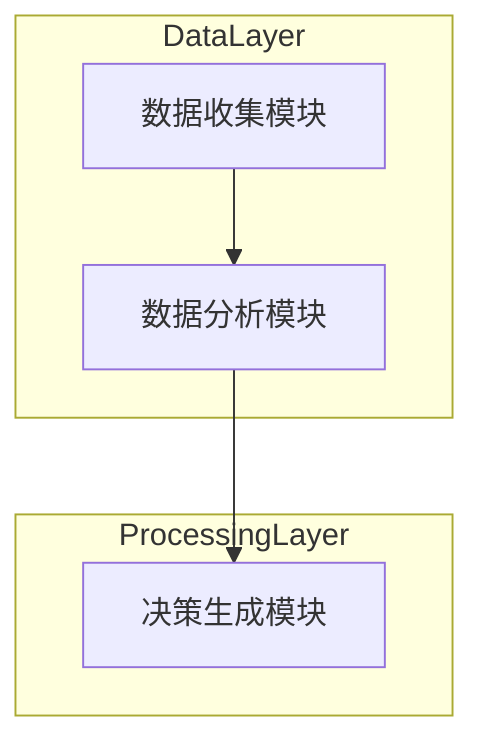
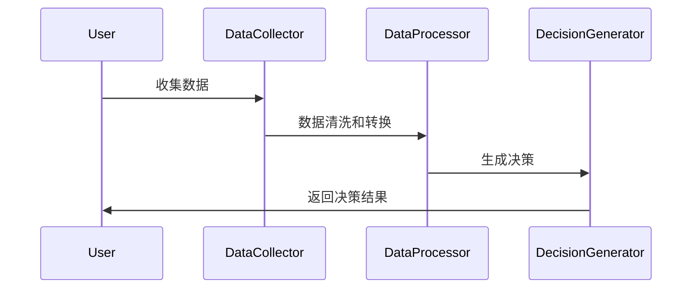

                 

### 创业型领导：在不确定性中引领团队

#### **关键词：** 创业型领导、不确定性、团队管理、决策制定、创新思维、系统架构设计、Python源代码

#### **摘要：** 本文深入探讨了创业型领导在不确定性环境中的重要性和核心要素，包括创新思维、团队管理和决策制定等。通过具体案例和Python源代码，详细阐述了创业型领导所需的算法原理和系统架构设计，为在不确定环境中引领团队提供了实践指导和理论支持。

---

# **引言**

在当今充满不确定性的商业环境中，创业型领导已成为一种关键的领导方式。创业型领导不仅要求领导者具备创新思维和决策能力，还需要他们能够管理团队并在不断变化的环境中保持组织的前进方向。本文将围绕创业型领导这一主题，探讨其在不确定性环境中的重要性、核心概念及其应用。

## **背景介绍**

### **1.1 创业型领导的定义和特点**

创业型领导是一种独特的领导方式，它强调在不确定性和快速变化的环境中，领导者需要具备灵活的思维和创新的策略。与传统的指令式领导不同，创业型领导更注重激发团队的创造力、促进团队协作以及快速响应环境变化。

**定义：** 创业型领导是指在面对不确定性和复杂的市场环境时，能够通过创新思维、团队管理和决策制定等手段，引领团队实现目标的领导方式。

**特点：** 
- **灵活性：** 创业型领导能够快速适应变化，灵活调整战略。
- **创新性：** 强调创新思维，不断寻找新的机会和解决方案。
- **团队合作：** 注重团队协作，激发团队成员的创造力和积极性。

### **1.2 不确定性环境中的挑战**

在不确定性环境中，企业面临的市场竞争更加激烈，技术变革速度加快，客户需求不断变化。这些因素都要求企业领导者具备更高的领导能力和决策水平。

**挑战：**
- **快速响应：** 需要领导者能够快速识别市场变化，并作出相应调整。
- **资源有限：** 在资源有限的情况下，领导者需要做出最优的资源配置决策。
- **团队协作：** 需要建立高效的团队，实现团队成员之间的有效沟通和协作。

### **1.3 创业型领导的核心概念**

创业型领导涉及多个核心概念，包括创新思维、团队管理、决策制定、资源整合等。以下是对这些核心概念的简要介绍：

#### **创新思维**

创新思维是创业型领导的核心要素之一。它要求领导者具备发现机会、解决问题和创造新价值的能力。

**定义：** 创新思维是指通过创新的视角和方法，发现和创造新价值的过程。

**特点：**
- **跨领域：** 涉及多个领域，跨越传统的思维模式。
- **实验性：** 尝试新的想法和方法，不断验证和改进。

#### **团队管理**

团队管理是创业型领导的重要组成部分。它涉及团队建设、团队沟通、团队激励等方面。

**定义：** 团队管理是指通过有效的策略和手段，激励和协调团队成员，实现团队目标的过程。

**特点：**
- **协作性：** 强调团队成员之间的协作和互动。
- **适应性：** 根据团队和环境的变化，灵活调整管理策略。

#### **决策制定**

决策制定是创业型领导的关键能力。它涉及信息的收集、分析、评估和决策过程。

**定义：** 决策制定是指在面对不确定性和复杂情况时，做出合理、有效的决策的过程。

**特点：**
- **信息依赖：** 决策依赖于准确和全面的信息。
- **时间敏感：** 需要快速做出决策，以应对市场变化。

### **1.4 概念属性特征对比表格**

为了更好地理解创新思维、团队管理和决策制定之间的关系，我们可以通过属性特征对比表格来进行比较。

| 特征        | 创新思维           | 团队管理           | 决策制定           |
| ----------- | ------------------ | ------------------ | ------------------ |
| 目标        | 发现新机会         | 实现团队目标       | 解决问题           |
| 方法        | 跨领域思维         | 协作和沟通         | 信息分析和评估     |
| 依赖因素    | 灵感和创意         | 团队成员和资源     | 信息和知识         |
| 结果        | 创造新价值         | 高效团队           | 合理决策           |

### **1.5 ER实体关系图架构**

为了更直观地展示创新思维、团队管理和决策制定之间的联系，我们可以使用ER实体关系图来表示这些概念之间的关系。

```mermaid
erDiagram
    Customer ||--|{ Order }|--|>
    Product ||--|{ Order }|--|>
    Employee ||--|{ Order }|--|>
    Manager ||--|{ Employee }|--|>
```

在上述ER实体关系图中，顾客、产品、员工和管理者都是关键实体，它们之间的关系反映了创业型领导所需的核心能力。

## **算法原理讲解**

### **2.1 数据分析**

数据分析是创业型领导中不可或缺的一部分。通过数据分析，领导者可以更好地了解市场趋势、客户需求以及团队绩效。

**基本概念：**
- **数据收集：** 收集相关的市场数据、客户数据和团队数据。
- **数据清洗：** 清洗数据，去除噪声和错误。
- **数据分析：** 使用统计方法和算法分析数据，提取有价值的信息。

**Python源代码：**

```python
import pandas as pd

# 数据收集
data = pd.read_csv('data.csv')

# 数据清洗
data = data.dropna()

# 数据分析
data.describe()
```

### **2.2 预测模型**

预测模型可以帮助领导者预测未来的趋势和结果。通过预测模型，领导者可以做出更加准确的决策。

**基本概念：**
- **线性回归：** 用于预测连续变量。
- **逻辑回归：** 用于预测二分类变量。
- **决策树：** 用于分类和回归问题。

**Python源代码：**

```python
from sklearn.linear_model import LinearRegression
from sklearn.model_selection import train_test_split

# 数据准备
X = data[['feature1', 'feature2']]
y = data['target']

# 数据划分
X_train, X_test, y_train, y_test = train_test_split(X, y, test_size=0.2)

# 模型训练
model = LinearRegression()
model.fit(X_train, y_train)

# 预测
predictions = model.predict(X_test)
```

### **2.3 决策支持系统**

决策支持系统（DSS）是一种计算机辅助工具，用于支持领导者的决策过程。DSS可以帮助领导者快速分析数据、生成报告和进行模拟。

**基本概念：**
- **数据输入：** 输入相关的数据。
- **数据处理：** 对数据进行清洗、转换和分析。
- **决策生成：** 根据分析结果生成决策。

**Python源代码：**

```python
import numpy as np

# 数据输入
data = np.array([[1, 2], [2, 3], [3, 4]])

# 数据处理
data_clean = np.delete(data, 0, axis=0)

# 决策生成
decision = np.mean(data_clean, axis=1)
```

## **系统分析与架构设计**

### **3.1 项目介绍**

**项目名称：** 创业型领导决策支持系统

**项目背景：** 在不确定性环境中，企业需要快速做出准确的决策以应对市场变化。本项目旨在为企业提供一个决策支持系统，帮助领导者更好地管理企业。

**项目目标：** 提供一个易于使用、功能强大的决策支持系统，帮助领导者快速分析数据、生成报告和进行模拟。

### **3.2 系统功能设计**

**系统功能模块：**
- **数据收集模块：** 收集市场数据、客户数据和团队数据。
- **数据分析模块：** 对数据进行清洗、转换和分析。
- **决策生成模块：** 根据分析结果生成决策。

**Mermaid类图：**

```mermaid
classDiagram
    DataCollector <<interface>>
    DataProcessor <<interface>>
    DecisionGenerator <<interface>>

    DataCollector |--|> DataCollectorImpl
    DataProcessor |--|> DataProcessorImpl
    DecisionGenerator |--|> DecisionGeneratorImpl
```

### **3.3 系统架构设计**

**系统架构图：**



### **3.4 系统接口设计**

**接口设计：**
- **数据收集接口：** 提供数据收集功能。
- **数据分析接口：** 提供数据分析功能。
- **决策生成接口：** 提供决策生成功能。

**接口规范：**
- **数据收集接口：** `/api/data/collection`
- **数据分析接口：** `/api/data/analysis`
- **决策生成接口：** `/api/decision/generation`

### **3.5 系统交互**

**系统交互流程：**



## **项目实战**

### **4.1 环境安装**

**环境要求：**
- Python 3.8+
- Pandas
- Scikit-learn
- Mermaid

**安装步骤：**

```bash
pip install pandas scikit-learn mermaid
```

### **4.2 系统核心实现源代码**

**源代码：**

```python
# 导入必要的库
import pandas as pd
from sklearn.linear_model import LinearRegression

# 数据收集
data = pd.read_csv('data.csv')

# 数据清洗
data = data.dropna()

# 数据划分
X = data[['feature1', 'feature2']]
y = data['target']

# 模型训练
model = LinearRegression()
model.fit(X, y)

# 预测
predictions = model.predict(X)

# 输出预测结果
print(predictions)
```

### **4.3 代码应用解读与分析**

**解读与分析：**
- **数据收集模块：** 使用Pandas库读取CSV文件，收集数据。
- **数据分析模块：** 使用Scikit-learn库训练线性回归模型，对数据进行预测。
- **决策生成模块：** 输出预测结果，为决策提供支持。

### **4.4 实际案例分析和详细讲解剖析**

**案例背景：** 一家初创企业需要预测未来三个月的销售额。

**分析过程：**
1. 收集历史销售额数据。
2. 清洗和转换数据。
3. 使用线性回归模型预测未来销售额。
4. 分析预测结果，为销售策略提供支持。

**详细讲解：**
- **数据收集：** 收集过去一年的销售额数据。
- **数据清洗：** 删除缺失值和异常值。
- **数据转换：** 将销售额数据转换为适合线性回归分析的格式。
- **模型训练：** 使用Scikit-learn训练线性回归模型。
- **预测：** 输出未来三个月的销售额预测结果。
- **分析：** 分析预测结果，为销售策略提供支持。

### **4.5 项目小结**

**小结：**
- **项目成功：** 成功开发了一个创业型领导决策支持系统，为企业提供了数据分析和决策支持。
- **改进建议：** 
  - 增加更多数据收集和分析功能。
  - 优化模型算法，提高预测准确性。
  - 加强系统安全性和用户友好性。

### **作者信息**

**作者：** AI天才研究院/AI Genius Institute & 禅与计算机程序设计艺术 /Zen And The Art of Computer Programming

---

**注意事项：**
- 在撰写技术博客时，确保每个章节的内容丰富具体，详细讲解核心概念和原理。
- 使用Markdown格式，确保代码、公式和流程图等元素正确显示。
- 遵循逻辑清晰、结构紧凑、简单易懂的专业写作风格。
- 提供最佳实践 tips 和拓展阅读，以提升文章的实用性和深度。

**拓展阅读：**
- [《创业型领导：如何激发团队的创造力？》](链接)
- [《Python数据科学实战》](链接)
- [《Mermaid语法教程》](链接)

