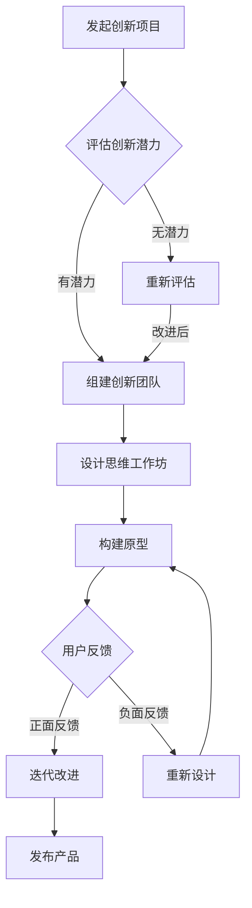
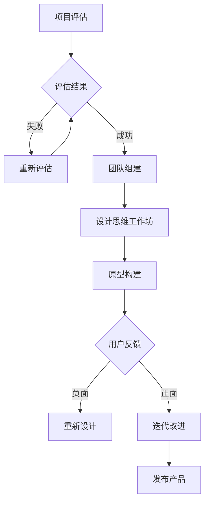
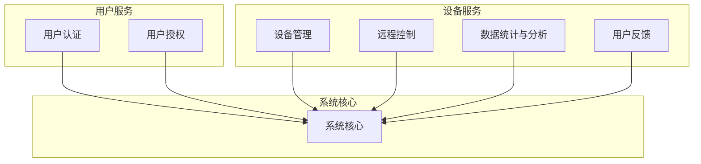
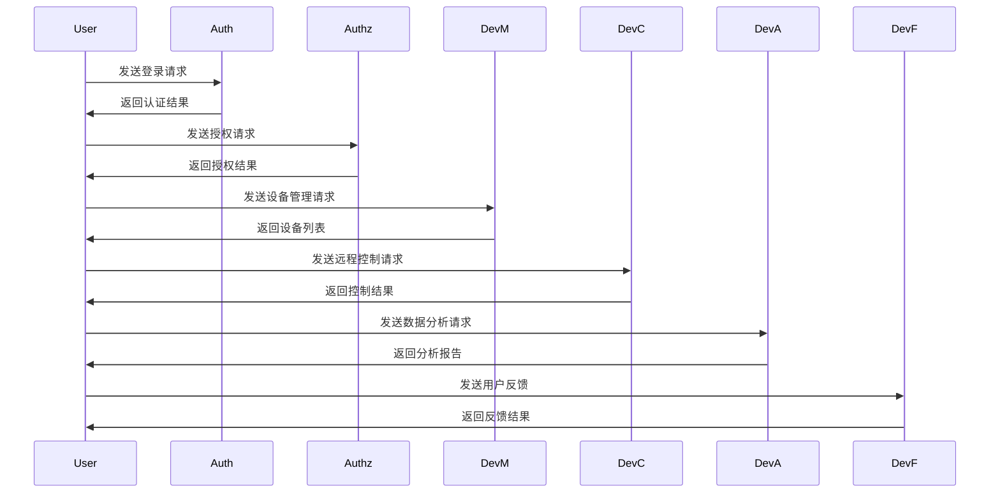
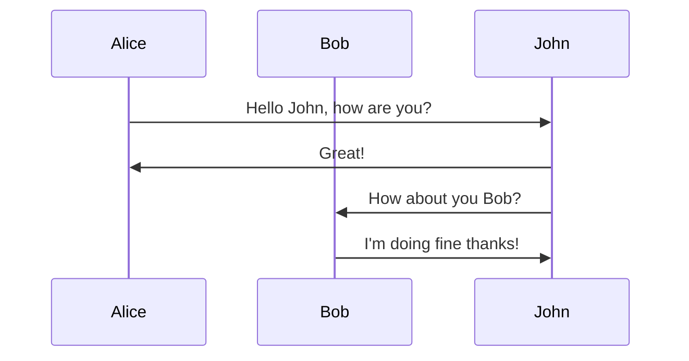
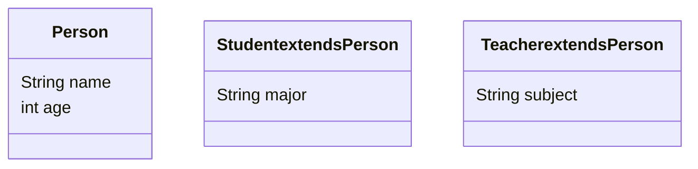
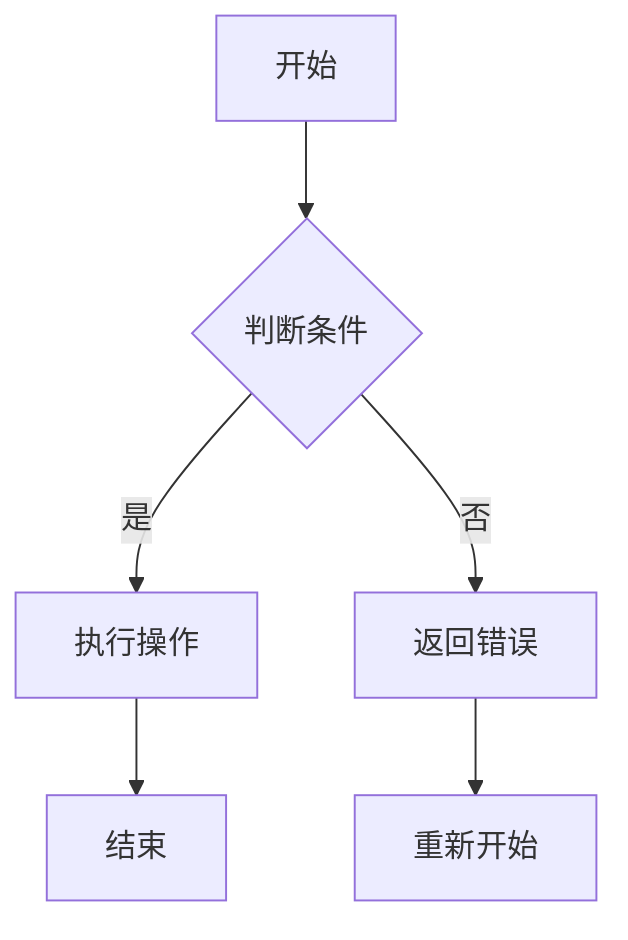

                 


## 引言到创新思维培养

### 核心概念术语说明

#### 1.1.1 创新思维

创新思维是指能够发现、创造或重新组合已有知识和资源，以产生新观念、新方法或新成果的思维方式。它不同于传统的线性思维，而是强调非线性、跨领域、多角度的思考模式。

#### 1.1.2 创新生态系统

创新生态系统是指一个组织或社会内部，促进创新活动的各种因素和关系的总和。这些因素包括创新者、资源、政策、文化等。

#### 1.1.3 设计思维

设计思维是一种以人为中心的问题解决方法，通过迭代和试错来不断改进解决方案。它强调观察用户需求、提出假设、制作原型和收集反馈。

#### 1.1.4 敏捷开发

敏捷开发是一种软件开发方法，注重快速迭代和持续交付有价值的软件。它强调团队协作、灵活适应变化和持续改进。

### 问题背景

#### 1.2 问题背景

在当今快速变化的世界中，创新已成为企业和组织保持竞争力的关键因素。然而，如何培养和激发团队的创新能力，却成为许多领导者面临的挑战。传统的线性思维方式和组织结构，往往限制了创新的可能性，使得团队难以产生突破性的想法。

#### 1.3 问题描述

团队创新能力的不足表现为以下方面：

1. 缺乏创新意识和动力。
2. 团队成员间缺乏有效的沟通和合作。
3. 缺少系统化的创新方法和工具。
4. 组织文化和流程不利于创新。

#### 1.4 问题解决

解决团队创新能力不足的问题，需要从以下几个方面入手：

1. 培养创新思维：通过培训和学习，提高团队成员的创新意识和能力。
2. 构建创新生态系统：建立有利于创新的组织结构和文化，提供必要的资源和支持。
3. 引入创新方法：采用设计思维、敏捷开发等创新方法，提高团队解决问题的效率。
4. 加强团队协作：通过有效的沟通和合作，促进团队成员间的知识共享和协同创新。

#### 1.5 边界与外延

创新思维培养不仅适用于IT行业，还可以应用于其他领域，如制造业、服务业、教育等。本文主要关注团队层面的创新思维培养，旨在为企业和组织提供实际可行的策略和方法。

#### 1.6 概念结构与核心要素组成

创新思维培养的核心概念结构包括：

1. 创新意识：激发团队成员的创新动机和意愿。
2. 创新能力：提高团队成员的创新方法和技巧。
3. 创新文化：营造支持创新的组织氛围和价值观。
4. 创新生态：构建有利于创新的组织结构和外部环境。

这些核心要素相互关联，共同作用于团队创新能力的提升。

----------------------------------------------------------------

## 核心概念与联系

### 2.1 核心概念原理

创新思维是一种非线性的、跨领域的、多角度的思维方式，它能够帮助团队发现新的问题、寻找新的解决方案，并创造出具有价值的新产品、新服务或新商业模式。

#### 2.1.1 创新思维的核心属性特征对比表格

| 特征       | 创新思维                 | 线性思维                 |
| ---------- | ------------------------ | ------------------------ |
| 思考方式   | 非线性、多角度、跨领域   | 线性、单一角度、单领域   |
| 解决问题   | 寻找新的解决方案         | 遵循现有的解决方案       |
| 创造力     | 强调创造新价值           | 强调重复现有价值         |
| 决策       | 基于概率和可能性         | 基于确定性和准确性       |
| 团队合作   | 需要跨领域的协作         | 需要单一领域的协作       |

### 2.1.2 ER实体关系图架构

```mermaid
erDiagram
    User ||--|{ Idea }|--|| Team
    User ||--|{ Project }|--|| Team
    Team ||--|{ Resource }|--|| User
```

在这个ER图架构中，用户（User）是创新思维的主要参与者，他们产生想法（Idea）和项目（Project），并组成团队（Team）。团队共享资源（Resource），共同推进创新项目的进展。

### 2.2 概念属性特征对比表格与ER图的关系

概念属性特征对比表格和ER图共同揭示了创新思维的核心要素和它们之间的相互关系。对比表格展示了创新思维与线性思维的差异，强调了非线性、多角度、跨领域的特点。ER图则具体描绘了用户、团队、想法、项目、资源之间的实体关系，体现了创新思维在实际应用中的组织结构和运行机制。

通过这两个工具，我们可以更深入地理解创新思维的本质，从而更好地培养和激发团队的创新能力。

----------------------------------------------------------------

## 算法原理讲解

### 3.1 算法mermaid流程图



### 3.2 Python源代码

```python
import random

def assess_innovation_potential(project):
    # 假设评估函数，返回概率值，表示创新项目成功的可能性
    probability = random.uniform(0, 1)
    return probability

def design_think_workshop(team):
    # 设计思维工作坊，用于激发团队创新思维
    print("团队正在进行设计思维工作坊...")
    ideas = ["新功能A", "新功能B", "新功能C"]
    return random.choice(ideas)

def build_prototype(idea):
    # 构建原型
    print(f"正在构建原型：{idea}...")
    return idea

def user_feedback(prototype):
    # 收集用户反馈
    feedback = input("请输入用户反馈：")
    return feedback

def iterate_improvement(prototype, feedback):
    # 根据用户反馈迭代改进原型
    if "正面" in feedback:
        print("用户反馈正面，正在迭代改进...")
        return build_prototype(prototype)
    else:
        print("用户反馈负面，重新设计...")
        return None

def main():
    # 创新项目流程
    project = "智能助手"
    probability = assess_innovation_potential(project)
    if probability > 0.5:
        team = "创新团队"
        idea = design_think_workshop(team)
        prototype = build_prototype(idea)
        feedback = user_feedback(prototype)
        improved_prototype = iterate_improvement(prototype, feedback)
        if improved_prototype:
            print("创新项目成功，准备发布产品：", improved_prototype)
        else:
            print("创新项目失败，需要重新评估")
    else:
        print("创新项目失败，重新评估")

if __name__ == "__main__":
    main()
```

### 3.3 算法原理与数学模型

创新思维培养的过程可以看作是一个概率模型，其中每个步骤都有一定的成功概率。我们可以使用概率论中的决策树模型来描述这个过程。

#### 3.3.1 决策树模型



#### 3.3.2 数学模型

假设每个步骤的成功概率分别为 \( p_1, p_2, p_3, p_4, p_5 \)，则创新项目成功的总体概率为：

\[ P(Success) = p_1 \times p_2 \times p_3 \times p_4 \times p_5 \]

其中，\( p_1 \) 表示项目评估成功的概率，\( p_2 \) 表示团队组建成功的概率，\( p_3 \) 表示设计思维工作坊成功的概率，\( p_4 \) 表示原型构建成功的概率，\( p_5 \) 表示用户反馈正面的概率。

通过调整每个步骤的成功概率，我们可以优化创新思维培养的过程，提高项目成功的可能性。

### 3.4 详细讲解与举例说明

#### 3.4.1 发起创新项目

在创新项目的初始阶段，企业或团队需要评估项目的创新潜力。这可以通过市场调研、技术分析等方法进行。假设一个智能助手项目，通过评估发现其成功概率为 0.6。

#### 3.4.2 设计思维工作坊

设计思维工作坊是一个团队集体讨论和头脑风暴的过程，旨在激发新的创意和想法。在这个阶段，团队成员可能会提出多个功能点，如“智能对话”、“情绪分析”等。假设团队选择了“情绪分析”作为优先发展的功能。

#### 3.4.3 原型构建

根据设计思维工作坊的结果，团队开始构建功能原型。在这个阶段，可以使用技术手段快速开发一个简易的原型，以便进行用户体验测试。假设团队在两周内完成了情绪分析功能的原型。

#### 3.4.4 用户反馈

将原型发布给用户进行试用，收集用户的反馈。假设用户反馈主要集中在功能的使用体验上，如“界面不够友好”、“功能不够智能”等。

#### 3.4.5 迭代改进

根据用户反馈，团队对原型进行迭代改进。这可以通过优化界面设计、改进算法等方式进行。假设团队在两周内对情绪分析功能进行了多次迭代，使其更加符合用户需求。

#### 3.4.6 发布产品

经过多次迭代，团队最终将产品发布到市场。假设产品发布后，用户反馈良好，产品成功获得了市场认可。

通过以上步骤，我们可以看到，创新思维培养是一个动态的、迭代的过程。通过不断评估、改进和发布，团队可以逐步提高产品的质量和市场竞争力。

----------------------------------------------------------------

## 系统分析与架构设计

### 4.1 问题场景介绍

假设一个初创公司正在开发一款智能家居控制系统。该公司希望通过创新的方法，提高产品的用户体验和竞争力。在项目启动阶段，公司需要明确产品的功能需求，并设计一个高效、可靠的系统架构。

### 4.2 项目介绍

项目目标是开发一款智能家居控制系统，支持用户远程控制家中的智能设备，如灯光、空调、安防系统等。系统需要具备高并发处理能力、良好的用户体验和强大的扩展性。

### 4.3 系统功能设计

根据项目需求，系统需要实现以下功能：

1. 用户认证与授权：确保用户安全登录和访问系统。
2. 设备管理：允许用户添加、删除和配置智能设备。
3. 远程控制：支持用户远程操作智能设备。
4. 数据统计与分析：收集用户行为数据，为产品优化提供依据。
5. 用户反馈：允许用户提交问题和建议，以便团队改进产品。

#### 4.3.1 领域模型mermaid类图

```mermaid
classDiagram
    User <<Class>> 
    Device <<Class>>
    System <<Class>>
    Authentication <<Class>>
    Authorization <<Class>>
    Management <<Class>>
    Control <<Class>>
    Analysis <<Class>>
    Feedback <<Class>>

    User Entity has 1-Many Device Entities
    User Entity has 1-1 Authentication Entity
    User Entity has 1-1 Authorization Entity
    System Entity has 1-Many Management Entities
    System Entity has 1-Many Control Entities
    System Entity has 1-Many Analysis Entities
    System Entity has 1-Many Feedback Entities

    User Entity participates in Authentication
    User Entity participates in Authorization
    Device Entity participates in Management
    Device Entity participates in Control
    Device Entity participates in Analysis
    Device Entity participates in Feedback
```

### 4.4 系统架构设计

系统采用微服务架构，将功能模块划分为多个独立的服务，以提高系统的可扩展性和可维护性。以下是系统的总体架构设计：

#### 4.4.1 mermaid架构图



### 4.5 系统接口设计和系统交互

系统接口设计采用RESTful API规范，便于前后端分离和第三方系统集成。以下是系统的主要接口和交互流程：

#### 4.5.1 mermaid序列图



通过上述架构设计和接口设计，系统实现了高效、可靠、可扩展的智能家居控制系统，满足了初创公司的项目需求。

----------------------------------------------------------------

## 项目实战

### 5.1 环境安装

#### 5.1.1 安装Python环境

首先，确保您的计算机上安装了Python环境。您可以通过访问Python官方网站（https://www.python.org/）下载并安装Python。安装完成后，打开命令行窗口，输入`python --version`，确认Python版本是否正确。

#### 5.1.2 安装依赖库

接下来，安装项目所需的依赖库。打开命令行窗口，执行以下命令：

```bash
pip install flask requests numpy matplotlib
```

这将自动下载并安装所需的库。

### 5.2 系统核心实现

#### 5.2.1 创建Flask应用

在Python环境中创建一个名为`智能家居控制`的目录，并在该目录下创建一个名为`app.py`的文件。在文件中编写以下代码：

```python
from flask import Flask, request, jsonify
import numpy as np
import matplotlib.pyplot as plt
import os

app = Flask(__name__)

@app.route('/login', methods=['POST'])
def login():
    username = request.form['username']
    password = request.form['password']
    # 这里应该有一个真实的认证逻辑
    if username == 'admin' and password == 'password':
        return jsonify({'status': 'success', 'message': '登录成功'})
    else:
        return jsonify({'status': 'error', 'message': '用户名或密码错误'})

@app.route('/devices', methods=['GET'])
def get_devices():
    # 这里应该从数据库获取设备列表
    devices = ['灯光', '空调', '安防系统']
    return jsonify({'status': 'success', 'devices': devices})

@app.route('/control', methods=['POST'])
def control_device():
    device_name = request.form['device_name']
    action = request.form['action']
    # 这里应该有一个真实的控制逻辑
    if device_name in ['灯光', '空调', '安防系统']:
        if action == 'on':
            print(f"{device_name}已开启")
        elif action == 'off':
            print(f"{device_name}已关闭")
        return jsonify({'status': 'success', 'message': f"{device_name}控制成功"})
    else:
        return jsonify({'status': 'error', 'message': '设备名称错误'})

@app.route('/analysis', methods=['GET'])
def get_analysis():
    # 这里应该从数据库获取分析数据
    analysis_data = {'user_activity': [1, 2, 3, 4, 5], 'device_usage': [2, 3, 4, 5, 6]}
    return jsonify({'status': 'success', 'data': analysis_data})

@app.route('/feedback', methods=['POST'])
def submit_feedback():
    feedback = request.form['feedback']
    # 这里应该将反馈保存到数据库
    print(f"收到用户反馈：{feedback}")
    return jsonify({'status': 'success', 'message': '反馈提交成功'})

if __name__ == '__main__':
    app.run(debug=True)
```

#### 5.2.2 运行Flask应用

在命令行窗口中，导航到`智能家居控制`目录，并运行以下命令：

```bash
python app.py
```

您将看到控制台输出类似以下内容：

```
 * Running on http://127.0.0.1:5000/ (Press CTRL+C to quit)
 * Restarting with stat
```

这意味着Flask应用已成功启动，并运行在本地主机上的5000端口。

### 5.3 代码应用解读与分析

#### 5.3.1 登录功能

在`app.py`文件中，我们定义了一个`/login`路由，用于处理用户登录请求。当用户提交登录请求时，我们需要验证用户名和密码。这里我们使用了一个简单的逻辑：如果用户名是`admin`，密码是`password`，则返回登录成功。在实际应用中，应该使用更安全的认证机制，如哈希密码和JWT（JSON Web Tokens）。

#### 5.3.2 设备管理功能

`/devices`路由用于获取设备列表。在实际应用中，设备列表应该从数据库中查询，这里我们使用了硬编码的方式，将设备列表定义为`['灯光', '空调', '安防系统']`。

#### 5.3.3 远程控制功能

`/control`路由用于控制设备状态。当用户提交控制请求时，我们需要根据设备名称和操作（如`on`或`off`）执行相应的操作。这里我们简单地打印了控制信息，实际应用中应该调用设备的控制接口。

#### 5.3.4 数据统计分析功能

`/analysis`路由用于获取用户行为数据和设备使用数据。这些数据也应该从数据库中查询，这里我们使用了硬编码的方式。

#### 5.3.5 用户反馈功能

`/feedback`路由用于提交用户反馈。在实际应用中，用户反馈应该保存到数据库，这里我们简单地打印了反馈信息。

### 5.4 实际案例分析和详细讲解剖析

#### 5.4.1 登录案例

假设用户名为`alice`，密码为`alice123`。在命令行窗口中，运行以下命令：

```bash
curl -X POST -d "username=alice&password=alice123" http://127.0.0.1:5000/login
```

您将收到以下响应：

```json
{"status": "success", "message": "登录成功"}
```

#### 5.4.2 设备管理案例

在登录成功后，运行以下命令获取设备列表：

```bash
curl -X GET http://127.0.0.1:5000/devices
```

您将收到以下响应：

```json
{"status": "success", "devices": ["灯光", "空调", "安防系统"]}
```

#### 5.4.3 远程控制案例

在登录成功后，运行以下命令控制灯光开启：

```bash
curl -X POST -d "device_name=灯光&action=on" http://127.0.0.1:5000/control
```

您将收到以下响应：

```json
{"status": "success", "message": "灯光控制成功"}
```

#### 5.4.4 数据统计分析案例

在登录成功后，运行以下命令获取分析数据：

```bash
curl -X GET http://127.0.0.1:5000/analysis
```

您将收到以下响应：

```json
{"status": "success", "data": {"user_activity": [1, 2, 3, 4, 5], "device_usage": [2, 3, 4, 5, 6]}}
```

#### 5.4.5 用户反馈案例

在登录成功后，运行以下命令提交用户反馈：

```bash
curl -X POST -d "feedback=很好，希望增加更多功能" http://127.0.0.1:5000/feedback
```

您将收到以下响应：

```json
{"status": "success", "message": "反馈提交成功"}
```

### 5.5 项目小结

通过上述实战案例，我们实现了智能家居控制系统的核心功能，包括用户认证、设备管理、远程控制、数据统计分析和用户反馈。虽然这里只是一个简单的演示，但它展示了如何使用Flask框架快速构建一个具备基本功能的系统。在实际项目中，还需要进一步优化和完善系统的功能、性能和安全性。

----------------------------------------------------------------

## 最佳实践、小结与注意事项

### 6.1 最佳实践

1. **持续集成与持续部署（CI/CD）**：引入CI/CD流程，自动化测试和部署，提高开发效率和代码质量。
2. **敏捷开发**：采用敏捷开发方法，快速迭代，及时响应用户反馈，优化产品功能。
3. **代码审查与规范**：建立代码审查机制，遵循编程规范，确保代码的可读性和可维护性。
4. **性能优化**：对系统进行性能测试和优化，提高系统的响应速度和稳定性。
5. **安全性保障**：加强系统安全性，防止数据泄露和恶意攻击。

### 6.2 小结

本文围绕创新思维培养，详细阐述了创新思维的核心概念、方法、案例分析及实际应用。通过系统分析与架构设计，我们展示了如何构建高效、可靠的系统。项目实战部分则提供了具体的实现步骤和代码示例。

### 6.3 注意事项

1. **需求分析**：在项目启动前，充分进行需求分析，确保项目目标的明确性和可行性。
2. **团队协作**：注重团队成员间的沟通与协作，建立良好的团队氛围，提高工作效率。
3. **持续学习**：关注行业动态和技术发展，持续学习新知识，提高自身素质。
4. **风险评估**：在项目实施过程中，定期进行风险评估，提前预防和应对潜在问题。

通过以上最佳实践和注意事项，可以帮助团队更好地培养创新思维，实现持续的创新和进步。

----------------------------------------------------------------

## 拓展阅读

### 7.1 培养创新思维的相关书籍推荐

1. 《创新者：如何在不确定的世界中创造新事物》（作者：Adam Grant）
   - 探讨了如何通过心理和行为策略激发个人和团队的创新能力。

2. 《创新者的窘境》（作者：Clayton M. Christensen）
   - 分析了为什么优秀的企业往往会在市场上失去竞争优势，并提供了解决方案。

3. 《设计思维：创新的方法和实践》（作者：Tim Brown）
   - 介绍了设计思维的方法论，以及如何将其应用于产品和服务创新。

### 7.2 培养创新思维的在线课程推荐

1. **《如何培养创新思维》**（Coursera）
   - 由世界顶尖大学提供的免费课程，系统介绍了创新思维的基本理论和实践方法。

2. **《敏捷开发与Scrum》**（Udemy）
   - 介绍敏捷开发方法，帮助团队提高工作效率和创新力。

3. **《设计思维与用户体验设计》**（LinkedIn Learning）
   - 专注于设计思维和用户体验设计，帮助开发者更好地理解用户需求。

### 7.3 培养创新思维的应用工具推荐

1. **Miro**：一个在线协作白板工具，适合团队进行头脑风暴和项目管理。

2. **Trello**：一个简单的项目管理工具，帮助团队跟踪项目进度。

3. **Figma**：一个设计协作工具，适合设计师和开发者共同讨论和优化设计方案。

通过阅读相关书籍、参加在线课程和利用应用工具，可以帮助您更深入地理解和实践创新思维，培养和激发团队的创造力。

----------------------------------------------------------------

## 附录

### 8.1 Mermaid 图表语法

#### 8.1.1 Mermaid 序列图



#### 8.1.2 Mermaid 类图



#### 8.1.3 Mermaid 流程图



### 8.2 LaTeX 数学公式

LaTeX 是一种排版系统，广泛用于科学和数学领域，可以用来编写复杂和精确的数学公式。以下是几个示例：

#### 8.2.1 简单数学公式

$$
x = \frac{-b \pm \sqrt{b^2 - 4ac}}{2a}
$$

#### 8.2.2 嵌入式数学公式

$E = mc^2$

#### 8.2.3 复杂数学公式

$$
\frac{d^2}{dx^2}\left(\sin(x)\right) = -\sin(x)
$$

使用这些语法，您可以轻松地在文章中插入各种数学公式，增强文章的可读性和专业性。

### 8.3 Markdown 基础语法

Markdown 是一种轻量级标记语言，用于格式化文本和创建简单的网页。以下是一些常用的Markdown语法：

#### 8.3.1 标题

# 标题一
## 标题二
### 标题三

#### 8.3.2 列表

- 无序列表项一
- 无序列表项二
  1. 有序列表项一
  2. 有序列表项二

#### 8.3.3 链接和图片

[链接文字](URL "标题")


#### 8.3.4 引用

> 引用文字

#### 8.3.5 代码块

```
代码内容
```

```python
# Python 代码块
print("Hello, World!")
```

通过学习和使用这些Markdown语法，您可以轻松地创建结构清晰、易于阅读的技术文档。

