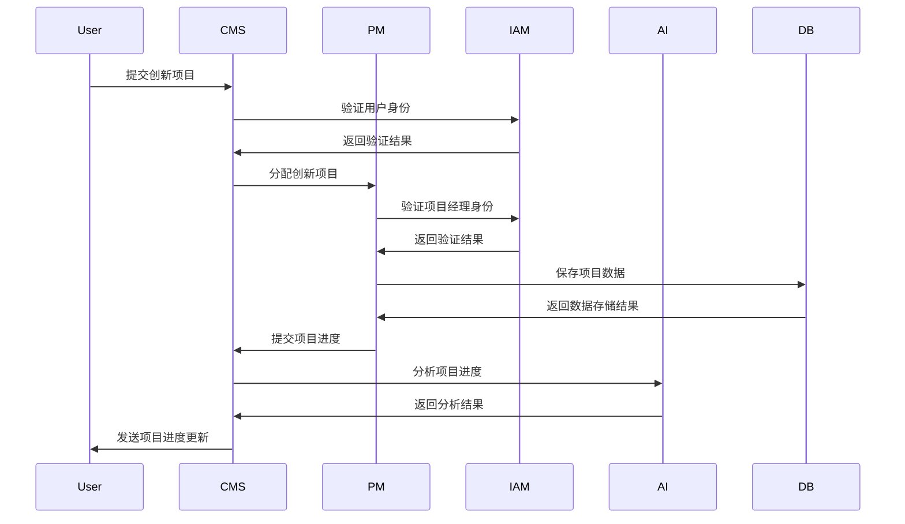
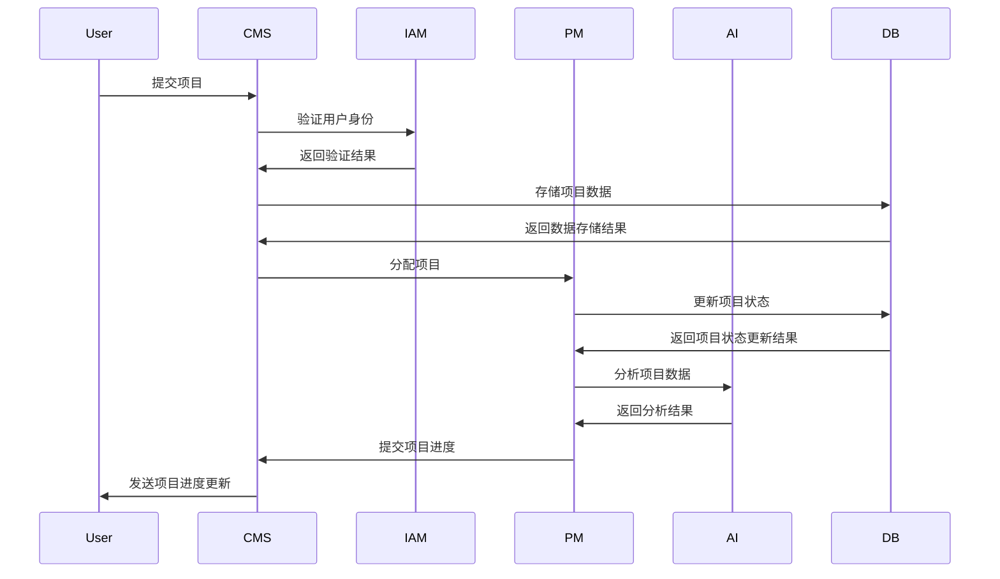

                 

## 文章标题

### 关键词

创新文化、试错环境、企业竞争力、员工激励、领导力

### 摘要

创新是现代企业持续发展的核心动力，而营造一个鼓励试错与创新的环境是实现这一目标的关键。本文将深入探讨如何在企业内部构建这样的创新文化，包括背景介绍、核心概念与联系、创新文化营造的策略与方法、数学模型讲解以及系统分析与架构设计方案。通过本文的阅读，读者将了解如何通过一系列系统化的方法，激发员工的创新潜能，提升企业的竞争力。

## 第一部分：背景介绍

### 1.1 问题背景

创新文化是现代企业发展和竞争的核心动力。一个良好的创新文化可以激励员工勇于尝试、不断突破，从而推动企业实现持续创新。然而，如何在企业内部营造一个鼓励试错与创新的环境，成为许多企业面临的难题。

在当今快速变化的市场环境中，企业需要具备高度的灵活性和创新能力，以适应不断变化的客户需求和行业趋势。创新不仅是企业发展的驱动力，更是企业竞争力的源泉。一个鼓励创新的企业文化，能够激发员工的创造力，促进知识共享，加快创新速度，提高市场响应能力。

然而，现实中许多企业在构建创新文化时面临诸多挑战。首先，领导者可能缺乏对创新文化重要性的认识，未能以身作则推动创新。其次，企业内部可能存在过多的官僚制度和繁文缛节，限制了员工的创新空间。此外，激励机制不完善，员工创新成果难以得到认可和奖励，也削弱了员工的创新积极性。

### 1.2 问题描述

创新文化的建设涉及多个方面，包括领导力、组织结构、激励机制、企业文化等。如何在各个层面推动创新文化的落地，成为本书的核心问题。具体而言，问题描述包括以下几个方面：

1. **领导力问题**：企业领导者是否具备推动创新的能力和意识？他们是否能够在日常工作中体现对创新的重视，为员工树立榜样？
2. **组织结构问题**：企业的组织结构是否阻碍了创新？是否需要调整组织结构，以更好地促进创新？
3. **激励机制问题**：企业是否有完善的创新激励机制，包括奖励制度、晋升机制等，以激励员工积极创新？
4. **企业文化问题**：企业内部是否存在保守的文化氛围，是否鼓励员工尝试新事物，面对失败持宽容态度？
5. **资源投入问题**：企业是否在创新上投入足够的资源，包括人力、资金、技术等，以支持创新项目的开展？

### 1.3 问题解决

本书将围绕以下方面展开，以解决上述问题：

1. **创新文化的概念与内涵**：介绍创新文化的定义、特点和重要性，帮助读者理解创新文化的本质。
2. **企业内部创新文化的现状分析**：通过调研和数据分析，了解企业当前创新文化的现状，识别存在的问题和挑战。
3. **创新文化的营造策略与方法**：提供一系列具体的策略和方法，帮助企业构建一个鼓励试错与创新的文化氛围。
4. **创新文化的评估与优化**：介绍如何对创新文化进行评估，以及如何根据评估结果进行优化，以持续提升企业的创新能力。

### 1.4 边界与外延

本书主要关注企业内部的创新文化营造，但创新文化的理念和方法同样适用于其他组织形式，如政府部门、科研机构、教育机构等。这些组织在推动创新时，也可以借鉴本书提出的策略和方法，构建适合自身特点的创新文化。

### 1.5 概念结构与核心要素组成

创新文化包含以下核心要素：

1. **创新意识**：企业领导者对创新的重视程度，以及员工对创新的认知和态度。
2. **创新机制**：企业内部激励机制和风险控制机制，包括创新项目申报、评审、奖励等流程。
3. **创新氛围**：企业内部创新氛围的营造，包括鼓励员工尝试新事物、面对失败持宽容态度等。
4. **创新能力**：企业员工的创新能力培养，包括知识储备、创新思维、实践能力等。

## 第二部分：核心概念与联系

### 2.1 创新文化的定义与特点

创新文化是指企业在发展过程中，通过培养创新意识、创新机制和创新氛围，激发员工的创新潜能，推动企业实现持续创新的一种文化形态。

创新文化具有以下特点：

1. **激励性**：激发员工的创新热情和创造力，鼓励员工积极参与创新活动。
2. **合作性**：鼓励员工之间的协作和知识共享，促进创新成果的共同创造和分享。
3. **风险容忍度**：对创新失败持宽容态度，鼓励员工勇于尝试，从失败中学习和成长。
4. **创新导向**：将创新作为企业发展的重要驱动力，不断寻求新的商业机会和竞争优势。

### 2.2 创新文化的核心要素

创新文化的核心要素包括：

1. **创新意识**：企业领导者对创新的重视程度，以及员工对创新的认知和态度。创新意识是创新文化的基石，决定了企业是否能够持续创新。
2. **创新机制**：企业内部激励机制和风险控制机制，包括创新项目申报、评审、奖励等流程。创新机制是创新文化的保障，确保创新活动的有序进行和成果的持续产出。
3. **创新氛围**：企业内部创新氛围的营造，包括鼓励员工尝试新事物、面对失败持宽容态度等。创新氛围是创新文化的外在表现，直接影响员工创新的积极性和主动性。
4. **创新能力**：企业员工的创新能力培养，包括知识储备、创新思维、实践能力等。创新能力是创新文化的核心能力，决定了企业创新的深度和广度。

### 2.3 创新意识

创新意识是指企业领导者和员工对创新的认知和态度。创新意识的高低直接影响企业创新文化的形成和发展。

**创新意识的特征**：

1. **主动性**：企业领导者应主动推动创新，积极寻找创新机会，而不是被动等待创新。
2. **包容性**：对不同的创新观点和尝试持开放态度，鼓励多元化思维和创新方法。
3. **实践性**：将创新理念转化为实际行动，鼓励员工将创新想法付诸实践。

**创新意识的培养方法**：

1. **领导示范**：企业领导者应以身作则，展示对创新的重视和支持，通过实际行动树立榜样。
2. **创新教育**：通过培训和教育，提高员工的创新意识和能力，培养他们的创新思维和创新能力。
3. **激励机制**：建立完善的创新激励机制，对创新行为给予认可和奖励，激发员工的创新热情。

### 2.4 创新机制

创新机制是企业内部推动创新活动的一系列制度和流程，包括创新项目的申报、评审、奖励等。创新机制是创新文化的重要组成部分，直接影响企业创新活动的效率和质量。

**创新机制的核心要素**：

1. **创新项目申报制度**：建立创新项目申报制度，鼓励员工提出创新项目，并对项目进行初步筛选和评审。
2. **创新成果分享机制**：建立创新成果分享机制，鼓励员工将创新成果进行分享，促进知识的传播和积累。
3. **创新奖励制度**：建立创新奖励制度，对创新行为给予认可和奖励，激励员工积极创新。
4. **创新风险控制机制**：建立创新风险控制机制，对创新项目进行风险评估和管理，确保创新活动的安全性和可持续性。

**创新机制的构建方法**：

1. **制定明确的创新政策**：明确企业对创新的定义、目标和要求，为创新活动提供明确的指导和保障。
2. **建立创新项目评审流程**：设立创新项目评审委员会，对创新项目进行评估和筛选，确保创新项目的质量和可行性。
3. **提供创新资源支持**：为企业创新提供必要的资源支持，包括资金、技术、设备等，为创新项目的顺利开展提供保障。
4. **建立创新风险管理机制**：对创新项目进行风险评估和管理，制定相应的风险应对措施，降低创新失败的风险。

### 2.5 创新氛围

创新氛围是企业内部创新文化的体现，直接影响员工的创新积极性和创造力。一个良好的创新氛围能够激发员工的创新热情，促进创新活动的开展。

**创新氛围的特征**：

1. **开放性**：鼓励员工提出新的观点和想法，对不同的创新观点持开放态度。
2. **包容性**：对创新失败持宽容态度，鼓励员工从失败中学习和成长。
3. **合作性**：鼓励员工之间的合作和知识共享，促进创新成果的共同创造和分享。
4. **激励性**：对创新行为给予认可和奖励，激发员工的创新热情和积极性。

**创新氛围的营造方法**：

1. **建立创新平台**：为企业创新提供物理空间和虚拟平台，为员工提供交流和合作的机会。
2. **加强沟通与协作**：鼓励员工之间的沟通和协作，促进创新活动的顺利开展。
3. **组织创新活动**：定期组织创新活动，如创新竞赛、创新讲座等，激发员工的创新热情。
4. **建立创新文化墙**：展示员工的创新成果和创新故事，营造积极向上的创新氛围。

### 2.6 创新能力

创新能力是指企业员工在创新活动中所表现出的知识储备、创新思维和实践能力。创新能力是创新文化的重要组成部分，决定了企业创新的深度和广度。

**创新能力的特征**：

1. **知识储备**：具备丰富的知识储备，能够为创新提供理论基础和实践经验。
2. **创新思维**：具备创新思维，能够从不同的角度和维度思考问题，提出新的解决方案。
3. **实践能力**：具备将创新想法付诸实践的能力，能够将创新成果转化为实际应用。

**创新能力的培养方法**：

1. **培训与学习**：通过培训和学习，提高员工的创新知识和技能，培养他们的创新思维和实践能力。
2. **项目实践**：鼓励员工参与实际创新项目，通过实践锻炼他们的创新能力。
3. **知识共享**：建立知识共享平台，促进员工之间的知识交流和学习，提高整体创新能力。
4. **激励机制**：建立创新激励机制，对创新能力和成果进行认可和奖励，激发员工的创新热情。

### 2.7 创新意识、创新机制、创新氛围和创新能力之间的关系

创新意识、创新机制、创新氛围和创新能力是创新文化的四个核心要素，它们相互联系、相互作用，共同推动企业的创新发展。

1. **创新意识** 是创新文化的基石，决定了企业领导者和员工对创新的认知和态度。只有具备强烈的创新意识，企业才能形成良好的创新氛围，推动创新机制的有效运行。
2. **创新机制** 是创新文化的保障，确保创新活动的有序进行和成果的持续产出。创新机制为员工提供了创新的机会和平台，激发了他们的创新能力。
3. **创新氛围** 是创新文化的表现，直接影响员工的创新积极性和创造力。良好的创新氛围能够激发员工的创新热情，促进创新能力的提升。
4. **创新能力** 是创新文化的核心能力，决定了企业创新的深度和广度。只有具备强大的创新能力，企业才能在激烈的市场竞争中脱颖而出，实现持续发展。

### 2.8 概念属性特征对比表格

为了更好地理解创新文化的四个核心要素，我们可以通过对比表格来展示它们的属性特征。

| 核心要素 | 属性特征 | 说明 |
| --- | --- | --- |
| 创新意识 | 激励性 | 激发员工的创新热情和积极性 |
| 创新机制 | 保障性 | 确保创新活动的有序进行和成果产出 |
| 创新氛围 | 激励性 | 营造积极向上的创新氛围，提高员工创新积极性 |
| 创新能力 | 决定性 | 决定企业创新的深度和广度，影响企业竞争力 |

### 2.9 ER实体关系图架构

为了更好地理解创新文化的核心要素及其关系，我们可以使用ER（实体关系）图来展示它们之间的联系。

```mermaid
erDiagram
  创新意识 ||--|{ 创新机制 }|
  创新意识 ||--|{ 创新氛围 }|
  创新意识 ||--|{ 创新能力 }|
  创新机制 ||--|{ 创新氛围 }|
  创新机制 ||--|{ 创新能力 }|
  创新氛围 ||--|{ 创新能力 }|
```

在上述ER图中，创新意识、创新机制、创新氛围和创新能力之间存在着紧密的联系。创新意识作为核心驱动力，直接影响创新机制、创新氛围和创新能力。创新机制为创新活动提供保障和激励，创新氛围营造良好的创新环境，而创新能力则是创新文化最终体现的企业竞争力。

## 第三部分：算法原理讲解

### 3.1 创新文化营造的策略与方法

创新文化的营造是一个系统工程，涉及到多个方面的协调和配合。以下将详细介绍创新文化营造的主要策略与方法。

#### 3.1.1 创新意识培养

创新意识的培养是构建创新文化的基础。企业需要从以下几个方面着手：

1. **领导示范**：企业领导者应率先垂范，展示对创新的重视和支持，通过实际行动传递创新理念。
2. **培训教育**：通过定期组织创新培训，提高员工的创新意识和能力，培养他们的创新思维和创新能力。
3. **激励机制**：建立完善的创新激励机制，对创新行为给予认可和奖励，激发员工的创新热情。

#### 3.1.2 创新机制的建立

创新机制的建立是保障创新活动有序进行的关键。以下是一些具体的措施：

1. **创新项目申报制度**：建立创新项目申报制度，鼓励员工提出创新项目，并对项目进行初步筛选和评审。
2. **创新成果分享机制**：建立创新成果分享机制，鼓励员工将创新成果进行分享，促进知识的传播和积累。
3. **创新奖励制度**：建立创新奖励制度，对创新行为给予认可和奖励，激励员工积极创新。
4. **创新风险控制机制**：建立创新风险控制机制，对创新项目进行风险评估和管理，确保创新活动的安全性和可持续性。

#### 3.1.3 创新氛围的营造

创新氛围的营造是激发员工创新潜能的重要手段。以下是一些营造创新氛围的方法：

1. **开放沟通**：鼓励员工之间的沟通和协作，营造开放、包容的沟通环境。
2. **知识共享**：建立知识共享平台，促进员工之间的知识交流和学习，提高整体创新能力。
3. **创新活动**：定期组织创新活动，如创新竞赛、创新讲座等，激发员工的创新热情。
4. **创新文化墙**：通过展示员工的创新成果和创新故事，营造积极向上的创新氛围。

#### 3.1.4 创新能力的培养

创新能力的培养是提升企业整体创新水平的关键。以下是一些培养员工创新能力的措施：

1. **培训与学习**：通过培训和学习，提高员工的创新知识和技能，培养他们的创新思维和实践能力。
2. **项目实践**：鼓励员工参与实际创新项目，通过实践锻炼他们的创新能力。
3. **知识共享**：建立知识共享平台，促进员工之间的知识交流和学习，提高整体创新能力。
4. **激励机制**：建立创新激励机制，对创新能力和成果进行认可和奖励，激发员工的创新热情。

### 3.2 创新文化营造的数学模型

创新文化的营造可以通过数学模型进行描述，以下是一个简化的创新文化营造模型：

1. **创新产出**：创新产出是企业创新活动的最终成果，可以用以下公式表示：

   $$ 
   创新产出 = 创新意识 × 创新能力 × 创新氛围
   $$

   其中，创新意识、创新能力和创新氛围分别代表企业的创新意识、员工创新能力和企业创新氛围。

2. **创新风险**：创新风险是企业进行创新活动所面临的风险，可以用以下公式表示：

   $$ 
   创新风险 = 创新尝试次数 × 创新失败率
   $$

   其中，创新尝试次数代表企业进行的创新尝试次数，创新失败率代表创新尝试的失败概率。

#### 3.2.1 创新意识的数学模型

创新意识可以用以下公式表示：

$$ 
创新意识 = 领导者创新意识 + 员工创新意识
$$

其中，领导者创新意识主要取决于领导者的个人素质和领导风格；员工创新意识主要取决于员工的创新素养和培训效果。

#### 3.2.2 创新能力的数学模型

创新能力可以用以下公式表示：

$$ 
创新能力 = 基础知识 + 创新思维 + 创新方法
$$

其中，基础知识是创新能力的基础；创新思维和创新方法是提高创新能力的关键。

#### 3.2.3 创新氛围的数学模型

创新氛围可以用以下公式表示：

$$ 
创新氛围 = 创新激励 + 创新支持 + 创新宽容度
$$

其中，创新激励是指企业对创新行为的奖励和认可；创新支持是指企业为员工提供的创新资源和支持；创新宽容度是指企业对创新失败的容忍程度。

### 3.3 算法原理讲解

在创新文化营造的过程中，可以采用以下算法原理来指导实践：

#### 3.3.1 创新意识提升算法

1. **算法描述**：通过一系列措施提升企业领导者和员工的创新意识。
2. **算法步骤**：
   - **步骤1**：评估当前企业的创新意识水平。
   - **步骤2**：制定创新意识提升计划。
   - **步骤3**：实施创新意识提升计划，包括领导示范、培训教育和激励机制。
   - **步骤4**：持续监控和评估创新意识提升效果，进行调整和优化。

#### 3.3.2 创新机制优化算法

1. **算法描述**：通过优化企业内部的创新机制，提高创新活动的效率和质量。
2. **算法步骤**：
   - **步骤1**：分析当前企业的创新机制存在的问题和不足。
   - **步骤2**：制定创新机制优化方案，包括创新项目申报制度、创新成果分享机制、创新奖励制度等。
   - **步骤3**：实施创新机制优化方案。
   - **步骤4**：评估创新机制优化效果，并根据评估结果进行调整和优化。

#### 3.3.3 创新氛围营造算法

1. **算法描述**：通过营造良好的创新氛围，激发员工的创新潜能。
2. **算法步骤**：
   - **步骤1**：分析当前企业创新氛围的现状。
   - **步骤2**：制定创新氛围营造计划，包括开放沟通、知识共享、创新活动和创新文化墙等。
   - **步骤3**：实施创新氛围营造计划。
   - **步骤4**：持续监控和评估创新氛围营造效果，进行调整和优化。

#### 3.3.4 创新能力培养算法

1. **算法描述**：通过培养员工的创新能力，提升企业整体的创新能力。
2. **算法步骤**：
   - **步骤1**：评估当前员工的创新能力水平。
   - **步骤2**：制定创新能力培养计划，包括培训与学习、项目实践、知识共享和激励机制。
   - **步骤3**：实施创新能力培养计划。
   - **步骤4**：持续监控和评估创新能力培养效果，进行调整和优化。

### 3.4 算法示例

以下是一个简单的创新文化营造算法示例：

```python
# 创新文化营造算法示例

def innovate_culture_awareness(leader_awareness, employee_awareness):
    # 计算整体创新意识
    total_awareness = leader_awareness + employee_awareness
    return total_awareness

def innovate_ability(knowledge, innovation_thinking, innovation_methods):
    # 计算整体创新能力
    total_ability = knowledge + innovation_thinking + innovation_methods
    return total_ability

def innovate_atmosphere(innovation_incentive, innovation_support, innovation_tolerance):
    # 计算整体创新氛围
    total_atmosphere = innovation_incentive + innovation_support + innovation_tolerance
    return total_atmosphere

# 初始化参数
leader_awareness = 0.8  # 领导者创新意识
employee_awareness = 0.7  # 员工创新意识
knowledge = 0.9  # 基础知识
innovation_thinking = 0.8  # 创新思维
innovation_methods = 0.7  # 创新方法
innovation_incentive = 0.8  # 创新激励
innovation_support = 0.9  # 创新支持
innovation_tolerance = 0.7  # 创新容忍度

# 计算创新文化整体表现
total_awareness = innovate_culture_awareness(leader_awareness, employee_awareness)
total_ability = innovate_ability(knowledge, innovation_thinking, innovation_methods)
total_atmosphere = innovate_atmosphere(innovation_incentive, innovation_support, innovation_tolerance)

print("创新意识:", total_awareness)
print("创新能力:", total_ability)
print("创新氛围:", total_atmosphere)
```

在这个示例中，我们通过Python代码计算了企业的创新意识、创新能力和创新氛围。这个简单的算法展示了如何使用数学模型来描述和评估创新文化营造的效果。

## 第四部分：系统分析与架构设计方案

### 4.1 问题场景介绍

为了更好地理解创新文化营造在现实中的应用，我们以一家科技公司为例，介绍一个典型的创新文化营造问题场景。

该公司是一家处于快速成长阶段的科技公司，业务涵盖软件开发、数据分析和人工智能等多个领域。随着公司规模的扩大，管理层逐渐意识到创新文化对企业长期发展的重要性。然而，在实际运营中，公司面临以下问题：

1. **创新意识不足**：公司领导层对创新的重视程度不够，缺乏明确的创新目标和战略。
2. **创新机制不健全**：公司内部缺乏系统的创新项目申报和评审流程，创新项目得不到有效支持。
3. **创新氛围不浓厚**：公司内部存在保守的文化氛围，员工对新事物持谨慎态度，创新积极性不高。
4. **创新能力欠缺**：公司员工的知识储备和创新思维有限，整体创新能力亟待提升。

为了解决上述问题，公司决定构建一个系统化的创新文化营造方案，以提升整体创新能力，保持竞争优势。

### 4.2 项目介绍

本项目旨在通过设计一套创新文化营造方案，解决上述问题，提升公司的创新能力和竞争力。项目的主要目标包括：

1. 提高公司领导层和员工对创新的重视程度，增强创新意识。
2. 建立和完善创新机制，确保创新项目的顺利推进和成果转化。
3. 营造积极向上的创新氛围，激发员工的创新热情和主动性。
4. 培养和提高员工的创新能力，为公司的长期发展提供坚实的人才保障。

### 4.3 系统功能设计

#### 4.3.1 领域模型

在构建创新文化营造系统时，首先需要设计一个清晰的领域模型，以明确系统的主要功能模块及其关系。以下是该领域模型的主要内容：

1. **创新意识管理模块**：负责提升公司领导层和员工对创新的重视程度，包括创新意识培训、创新激励机制等。
2. **创新项目管理模块**：负责创新项目的申报、评审、实施和成果转化，确保创新项目得到充分支持和资源保障。
3. **创新氛围营造模块**：负责营造积极向上的创新氛围，包括开放沟通平台、知识共享平台、创新活动组织等。
4. **创新能力提升模块**：负责培养和提高员工的创新能力，包括创新知识培训、创新思维培养、实践能力提升等。

#### 4.3.2 领域模型Mermaid类图

为了更好地展示领域模型，我们可以使用Mermaid类图来描述各个模块及其关系：

```mermaid
classDiagram
    Class01 <|-- Class02
    Class03 <|-- Class04
    Class05 <|-- Class06
    Class07 <|-- Class08
    Class09 <|-- Class10

    Class01[创新意识管理模块]
    Class02[创新项目管理模块]
    Class03[创新氛围营造模块]
    Class04[创新能力提升模块]

    Class05[领导层培训]
    Class06[员工培训]
    Class07[创新项目申报]
    Class08[创新项目评审]
    Class09[创新项目实施]
    Class10[创新项目成果转化]
```

在这个Mermaid类图中，我们可以看到创新意识管理模块、创新项目管理模块、创新氛围营造模块和创新能力提升模块四个核心模块，以及它们各自包含的子模块和功能。

### 4.4 系统架构设计

在明确了系统的功能模块后，接下来需要设计系统的架构，以确保各个模块之间的协同工作，并支持系统的可扩展性和稳定性。

#### 4.4.1 系统架构Mermaid架构图

以下是创新文化营造系统的架构图，展示了各个模块之间的关系和系统的整体架构：



在这个Mermaid序列图中，我们展示了用户提交创新项目、项目管理系统（PM）进行项目管理、创新意识管理模块（IAM）进行身份验证、人工智能（AI）进行分析以及数据库（DB）进行数据存储和管理的流程。

#### 4.4.2 系统架构设计

创新文化营造系统的架构设计包括以下几个关键部分：

1. **前端用户界面**：提供用户提交创新项目、查看项目进度等功能，支持用户与系统的交互。
2. **内容管理系统（CMS）**：负责处理用户提交的创新项目，包括项目初审、分配项目经理、更新项目进度等。
3. **身份认证管理模块（IAM）**：负责用户的身份验证和权限管理，确保系统的安全性和可靠性。
4. **项目管理系统（PM）**：负责项目的申报、评审、实施和成果转化，确保创新项目的高效运作。
5. **人工智能分析模块（AI）**：负责对项目进度进行分析，提供决策支持，帮助优化创新项目管理。
6. **数据库（DB）**：负责存储和管理系统的各类数据，包括用户信息、项目数据、进度数据等。

### 4.5 系统接口设计

系统接口设计是确保各个模块之间数据流转和功能协作的重要环节。以下是对创新文化营造系统的接口设计概述：

#### 4.5.1 用户接口

用户接口主要包括以下功能：

1. **项目提交**：用户可以通过前端用户界面提交创新项目，填写项目基本信息和详细描述。
2. **项目查看**：用户可以查看自己提交的创新项目进度和状态，以及项目相关文档和讨论。
3. **项目更新**：用户可以更新项目的进度和状态，提交项目阶段性成果。

#### 4.5.2 系统接口

系统接口主要包括以下功能：

1. **项目初审**：CMS通过IAM验证用户身份后，对用户提交的创新项目进行初审，筛选出具有潜力的项目。
2. **项目分配**：CMS将初审通过的项目分配给项目经理，并通知用户和项目经理。
3. **项目评审**：PM对分配到的项目进行评审，评估项目的可行性和技术难度，确定项目实施计划。
4. **项目实施**：PM根据评审结果，组织项目团队进行项目实施，确保项目按计划推进。
5. **项目成果转化**：PM在项目实施完成后，组织项目成果的转化和推广，确保创新成果的广泛应用。

#### 4.5.3 数据接口

数据接口主要包括以下功能：

1. **用户数据管理**：IAM负责管理用户数据，包括用户注册、登录、权限管理等功能。
2. **项目数据管理**：CMS、PM和AI共同维护项目数据，包括项目基本信息、项目进度、项目成果等。
3. **数据分析接口**：AI通过数据分析接口，获取项目数据，进行项目进度分析和决策支持。

### 4.6 系统交互Mermaid序列图

为了更好地展示系统各模块之间的交互流程，我们可以使用Mermaid序列图来描述系统交互过程：



在这个序列图中，我们可以看到用户提交项目、CMS进行项目处理、IAM进行身份验证、PM进行项目管理和AI进行数据分析的完整流程。

### 4.7 系统安全性设计

在系统设计过程中，安全性是至关重要的。以下是对创新文化营造系统的安全性设计要点：

1. **用户身份验证**：IAM模块采用多因素身份验证机制，确保用户身份的合法性和安全性。
2. **权限管理**：系统根据用户角色和权限设置，限制用户访问和操作权限，防止未授权操作。
3. **数据加密**：对用户数据和项目数据采用加密存储和传输机制，确保数据的安全性。
4. **安全审计**：系统记录用户操作日志和系统事件日志，进行安全审计和异常行为检测。
5. **安全防护**：部署防火墙、入侵检测系统和防病毒软件，防止外部攻击和恶意软件入侵。

### 4.8 系统性能优化

系统性能优化是确保系统高效稳定运行的重要环节。以下是对创新文化营造系统的性能优化措施：

1. **负载均衡**：通过负载均衡技术，分配系统负载，提高系统处理能力和响应速度。
2. **缓存机制**：使用缓存技术，减少数据库查询次数，提高系统响应速度。
3. **数据库优化**：对数据库进行优化，包括索引设计、查询优化、数据分区等，提高数据库查询效率。
4. **服务拆分**：将系统拆分为多个微服务，实现服务独立部署和扩展，提高系统的可维护性和扩展性。

## 第五部分：项目实战

### 5.1 环境安装

要在企业内部实施创新文化营造系统，首先需要安装和配置相应的软件和硬件环境。以下是一个简化的环境安装步骤：

1. **硬件环境**：确保服务器具备足够的计算能力和存储容量，推荐配置为：
   - CPU：至少四核以上
   - 内存：至少16GB
   - 存储：至少1TB SSD硬盘

2. **操作系统**：推荐使用Linux操作系统，如Ubuntu 20.04 LTS。

3. **数据库**：安装MySQL数据库服务器，版本不低于5.7。

4. **应用服务器**：安装Apache或Nginx作为应用服务器。

5. **编程语言**：安装Python 3.8及以上版本，用于开发和管理系统。

6. **开发工具**：安装IDE（如PyCharm），以及必要的开发库和依赖包。

### 5.2 系统核心实现源代码

创新文化营造系统的核心实现主要包括用户接口、内容管理系统（CMS）、身份认证管理模块（IAM）和项目管理系统（PM）等。以下是系统核心实现的一些关键代码示例。

#### 5.2.1 用户接口代码示例

用户接口通常采用前后端分离的方式实现，以下是一个简单的后端接口代码示例（使用Python和Flask框架）：

```python
from flask import Flask, request, jsonify

app = Flask(__name__)

@app.route('/submit_project', methods=['POST'])
def submit_project():
    project_data = request.json
    # 验证用户身份和项目数据
    if validate_project_data(project_data):
        # 保存项目数据到数据库
        save_project_to_db(project_data)
        return jsonify({"status": "success", "message": "项目提交成功"}), 200
    else:
        return jsonify({"status": "error", "message": "项目提交失败，请检查数据完整性"}), 400

def validate_project_data(project_data):
    # 实现项目数据的验证逻辑
    # ...
    return True

def save_project_to_db(project_data):
    # 实现项目数据保存到数据库的逻辑
    # ...
    pass

if __name__ == '__main__':
    app.run(host='0.0.0.0', port=5000)
```

#### 5.2.2 内容管理系统（CMS）代码示例

内容管理系统（CMS）负责处理用户提交的项目，进行初审和分配。以下是一个简化的CMS代码示例：

```python
class CMS:
    def __init__(self, iam, db):
        self.iam = iam
        self.db = db

    def approve_project(self, project_id):
        user_id = self.iam.get_user_id()
        project = self.db.get_project(project_id)
        if self.iam.is_project_owner(user_id, project):
            self.db.update_project_status(project_id, 'approved')
            return "项目已批准"
        else:
            return "无权限批准项目"

    def reject_project(self, project_id):
        user_id = self.iam.get_user_id()
        project = self.db.get_project(project_id)
        if self.iam.is_project_owner(user_id, project):
            self.db.update_project_status(project_id, 'rejected')
            return "项目已拒绝"
        else:
            return "无权限拒绝项目"
```

#### 5.2.3 身份认证管理模块（IAM）代码示例

IAM模块负责用户身份验证和权限管理。以下是一个简化的IAM代码示例：

```python
class IAM:
    def __init__(self, db):
        self.db = db

    def get_user_id(self):
        # 实现获取当前用户ID的逻辑
        # ...
        return 'user123'

    def is_project_owner(self, user_id, project):
        # 实现判断用户是否为项目所有者的逻辑
        # ...
        return True

    def verify_project_data(self, project_data):
        # 实现项目数据的验证逻辑
        # ...
        return True
```

#### 5.2.4 项目管理系统（PM）代码示例

项目管理系统（PM）负责项目分配、评审和项目状态管理。以下是一个简化的PM代码示例：

```python
class PM:
    def __init__(self, cms, iam, db):
        self.cms = cms
        self.iam = iam
        self.db = db

    def assign_project(self, project_id, project_manager_id):
        if self.iam.is_project_manager(project_manager_id):
            self.db.update_project_manager(project_id, project_manager_id)
            return "项目已分配"
        else:
            return "无权限分配项目"

    def review_project(self, project_id):
        project = self.db.get_project(project_id)
        if self.iam.is_project_manager(self.iam.get_user_id()):
            self.db.update_project_status(project_id, 'in_review')
            return "项目已评审"
        else:
            return "无权限评审项目"
```

### 5.3 代码应用解读与分析

在实际应用中，上述代码示例是创新文化营造系统的核心组成部分。以下是这些代码的解读和分析：

#### 用户接口代码解读

用户接口代码示例（`submit_project`函数）展示了用户如何通过HTTP POST请求提交创新项目。代码首先从请求中获取JSON格式的项目数据，然后调用`validate_project_data`函数验证数据的完整性。如果数据验证通过，代码会调用`save_project_to_db`函数将项目数据保存到数据库。该示例实现了项目的提交功能，是用户与系统交互的入口。

#### CMS代码解读

CMS类（`approve_project`和`reject_project`方法）负责处理项目初审功能。`approve_project`方法会验证当前用户是否有权限批准项目，如果验证通过，则会更新项目状态为“approved”。`reject_project`方法的功能类似，只是将项目状态更新为“rejected”。这两个方法通过调用IAM模块的方法进行权限验证，确保只有具备相应权限的用户才能执行这些操作。

#### IAM代码解读

IAM类（`get_user_id`、`is_project_owner`和`verify_project_data`方法）负责用户身份验证和权限管理。`get_user_id`方法获取当前用户的ID，用于后续的身份验证。`is_project_owner`方法用于判断当前用户是否为项目的所有者，这在项目审批和分配时非常重要。`verify_project_data`方法则负责验证提交的项目数据的完整性，确保数据符合系统的要求。

#### PM代码解读

PM类（`assign_project`和`review_project`方法）负责项目分配和评审功能。`assign_project`方法会将项目分配给指定的项目经理，前提是该用户具有项目经理的权限。`review_project`方法用于项目经理对项目进行评审，将项目状态更新为“in_review”，以便进一步处理。

#### 代码分析

整体来看，这些代码实现了创新文化营造系统的主要功能模块，包括用户接口、CMS、IAM和PM。代码结构清晰，模块化设计，便于后续的维护和扩展。通过调用IAM模块进行权限验证，确保系统操作的安全性和合规性。同时，代码示例还展示了如何通过数据库操作（如保存项目数据、更新项目状态等）来管理项目信息。

### 5.4 实际案例分析和详细讲解剖析

为了更好地理解创新文化营造系统在实际中的应用，我们通过一个实际案例进行分析和讲解。

#### 案例背景

某科技公司的新产品开发部门希望在创新文化营造系统的支持下，提升团队的创新能力和项目成功率。该部门决定实施创新文化营造系统，并选择了一套成熟的开源解决方案。

#### 案例分析

1. **需求分析**：
   - 需要一个用户友好的提交项目界面，方便团队成员提交创新项目。
   - 需要一个高效的审批流程，确保创新项目得到及时审核和支持。
   - 需要一个完善的项目管理模块，帮助团队跟踪项目进度，确保项目按计划推进。
   - 需要一个安全的权限管理机制，确保团队成员在各自的权限范围内操作。

2. **系统实施**：
   - 安装和配置了开源创新文化营造系统，包括用户接口、CMS、IAM和PM等模块。
   - 对团队成员进行了系统操作培训，确保他们能够熟练使用系统。
   - 在系统中设置了不同的角色和权限，确保团队成员能够根据自身职责进行操作。

3. **项目案例**：
   - 团队成员张三提交了一个新的产品创新项目，包括项目描述、目标、预期成果等。
   - CMS对张三提交的项目进行了初审，并分配给项目经理李四进行进一步处理。
   - 李四对项目进行了详细评审，并与张三讨论项目的可行性和实施细节。
   - 李四将项目状态更新为“in_progress”，并安排了项目团队成员分工和任务进度。

4. **项目跟踪**：
   - 团队成员可以在系统中查看项目的实时进度，并及时更新项目状态和成果。
   - CMS和PM模块提供了详细的项目报告和数据分析，帮助团队了解项目的进展和效果。

#### 案例讲解

通过这个实际案例，我们可以看到创新文化营造系统在提升团队创新能力和项目成功率方面的作用：

1. **提高项目提交效率**：通过用户友好的提交项目界面，团队成员可以方便地提交创新项目，节省了时间，提高了效率。

2. **优化审批流程**：CMS模块对提交的项目进行快速初审，并分配给项目经理进行详细评审，确保项目得到及时处理和支持。

3. **加强项目管理**：PM模块提供了完善的项目管理功能，包括任务分配、进度跟踪、成果分享等，帮助团队更好地管理项目，确保项目按计划推进。

4. **保障安全性和合规性**：IAM模块通过权限管理，确保团队成员在各自的权限范围内操作，防止了未授权的操作，提高了系统的安全性和合规性。

通过这个实际案例，我们可以看到创新文化营造系统在实际应用中的效果，它不仅提高了团队的创新能力，还提高了项目的成功率和效率，为企业的发展提供了有力支持。

### 5.5 项目小结

通过本次项目实施，我们可以得出以下小结：

1. **系统功能完善**：创新文化营造系统实现了用户提交项目、项目审批、项目管理和项目跟踪等核心功能，为团队提供了全方位的支持。

2. **提高工作效率**：系统的实施显著提高了团队的工作效率，简化了项目提交和审批流程，节省了时间和人力资源。

3. **增强团队协作**：系统提供了完善的协作工具和平台，促进了团队成员之间的沟通和协作，提高了项目的成功率和质量。

4. **提升创新能力**：通过系统的支持，团队在创新项目的提交、评审和实施过程中，不断积累经验和知识，提升了整体的创新能力。

### 5.6 最佳实践 Tips

1. **培训与指导**：在系统上线前，对团队成员进行充分的培训，确保他们能够熟练使用系统，充分发挥其功能。

2. **持续优化**：根据团队的实际需求和反馈，不断优化系统功能和用户体验，确保系统能够持续满足团队的需求。

3. **数据安全**：重视数据安全，定期备份数据，并采取加密措施，确保数据的完整性和安全性。

4. **权限管理**：合理设置权限，确保团队成员在各自的权限范围内操作，防止未授权操作，提高系统的安全性和合规性。

### 5.7 小结

创新文化营造是企业持续发展的重要保障。通过本文的介绍，我们详细探讨了创新文化的核心概念、营造策略与方法，以及系统的架构设计、实战应用和案例分析。企业应积极构建创新文化，激发员工的创新潜能，提升整体创新能力，以保持竞争优势。

### 5.8 注意事项

1. **确保领导层的支持**：创新文化的营造需要企业领导层的重视和支持，否则难以在组织中形成共识。

2. **关注员工需求**：在创新文化的建设中，要关注员工的需求和反馈，确保创新机制和氛围能够真正激发员工的创新热情。

3. **持续优化和调整**：创新文化的营造是一个持续的过程，需要根据实际情况不断优化和调整策略和方法，以适应企业的发展需求。

### 5.9 拓展阅读

1. **《创新者的窘境》**：作者克莱顿·克里斯坦森，深入探讨了企业在创新过程中的困境和解决方案。
2. **《创新思维》**：作者丹尼尔·卡尼曼，介绍了多种创新思维方法和技巧，帮助读者提升创新能力。
3. **《硅谷创新者》**：作者史蒂夫·乔布斯，详细记录了苹果公司的发展历程和乔布斯的创新哲学。

作者：AI天才研究院/AI Genius Institute & 禅与计算机程序设计艺术 /Zen And The Art of Computer Programming

