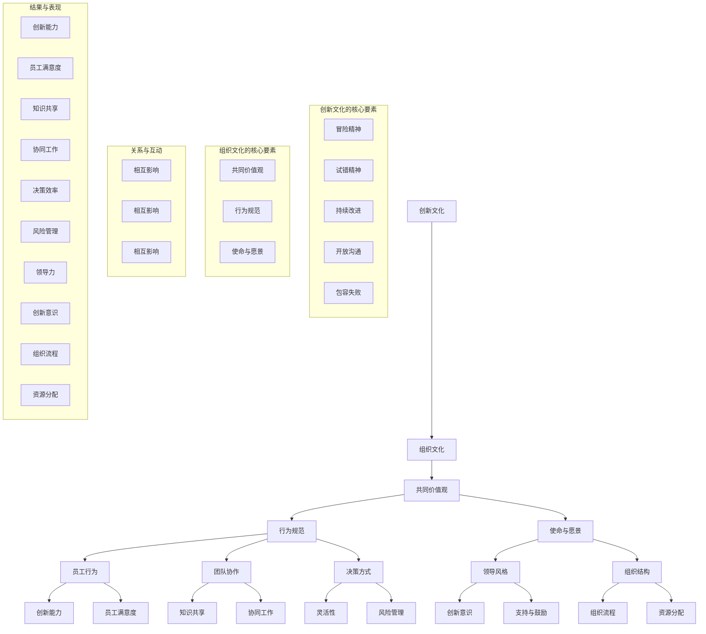
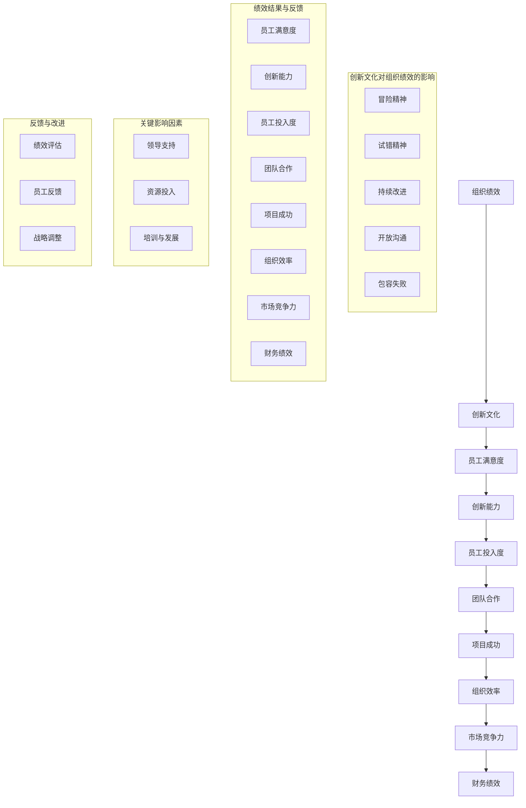
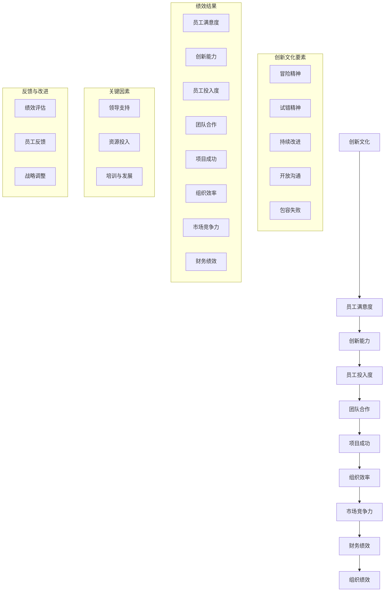
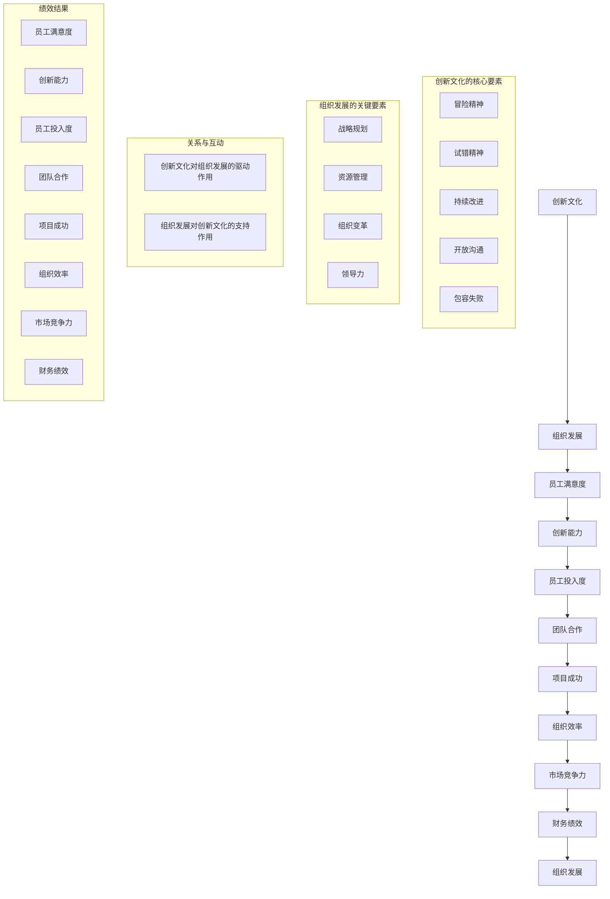

                 

## 第二部分：冒险精神的培养

### 第2章：冒险精神的内涵与价值

**2.1 冒险精神的定义**

冒险精神是一种勇于面对不确定性和风险的积极心态。它不仅仅是简单的勇气，而是一种综合的能力，包括决策能力、风险识别与评估、应对策略的制定和执行。与传统的勇气不同，冒险精神强调的是理性与感性的平衡，而不是单纯的无畏。

**冒险精神的本质**

冒险精神的本质在于创新和探索。它推动个人和组织不断突破现有的限制，寻找新的机会和解决方案。这种精神鼓励我们跳出舒适区，接受挑战，并从中学习和成长。

**冒险精神与传统勇气的区别**

传统勇气通常被描述为无畏面对困难的精神，而冒险精神则更加注重策略和准备。传统勇气可能是一种本能反应，而冒险精神则是一种经过深思熟虑的选择。冒险精神在行动之前会进行风险评估，并制定相应的应对策略。

**2.2 冒险精神的价值体现**

**促进个人成长**

冒险精神能够帮助个人突破自我限制，发掘新的潜能。通过面对挑战和克服困难，个人可以获得宝贵的经验，提升自信和适应能力。

**提升组织竞争力**

在组织中，冒险精神可以激发创新和创造力。当员工敢于冒险并尝试新的想法时，组织可以更快地适应市场变化，抓住商业机会，从而提升竞争力。

**创新思维的源泉**

冒险精神是创新思维的源泉。它鼓励员工跳出传统的思维框架，从不同的角度思考问题，提出新颖的解决方案。这种创新思维不仅能够带来商业价值，还能够推动社会进步。

**2.3 冒险精神的核心要素**

**决策能力**

决策能力是冒险精神的核心要素之一。在冒险过程中，需要做出一系列重要的决策，包括选择冒险的时机、方式和策略。决策能力强的个体能够更好地评估风险和机会，做出明智的选择。

**风险识别与评估**

冒险精神要求个体能够识别和理解风险。这需要对可能的风险进行全面的评估，并制定相应的应对措施。通过这种方式，个体可以降低冒险带来的潜在损失。

**应对策略的制定与执行**

在冒险过程中，制定并执行应对策略至关重要。这包括准备应对不同情况所需的资源、技能和知识。有效的应对策略可以确保冒险过程顺利进行，并在遇到困难时提供支持。

**总结**

冒险精神是一种综合能力，它不仅要求勇气，还要求理性。在个人和组织层面，冒险精神都具有重要的价值。通过培养和运用冒险精神，我们可以更好地应对挑战，推动创新和成长。在接下来的章节中，我们将深入探讨如何培养和维持冒险精神，以及如何将这种精神应用于实践。
```markdown
## 第三部分：试错精神的应用

### 第5章：试错精神的核心原理

5.1 试错的定义与作用

试错是一种通过反复尝试和修正来寻找正确答案或解决方案的方法。在科学研究中，试错是探索未知世界的重要工具。它通过不断的实验和验证，逐渐缩小搜索范围，直至找到正确的答案。

试错在创新中的应用主要体现在以下几个方面：

1. **促进创新思维**：试错鼓励人们从不同的角度思考问题，提出多种可能的解决方案。这种多样化的思维方式可以激发创新，带来意想不到的突破。

2. **降低创新风险**：通过试错，可以提前发现和纠正潜在的问题和错误，从而降低创新过程中的风险。试错是一种低成本、低风险的探索方法。

3. **快速迭代**：试错精神强调快速行动和快速反馈。通过快速迭代，可以更快地验证和改进想法，提高创新效率。

5.2 试错精神与传统思维方式的区别

**1. 主动性与被动性**

传统思维方式往往是一种被动接受和执行的方式，而试错精神则更强调主动性。在试错过程中，个体需要主动寻找问题、提出解决方案并进行验证。这种方式鼓励人们主动探索和尝试，而不是仅仅依赖已有的知识和经验。

**2. 失败与成功**

在传统思维方式中，失败往往被视为负面结果，而在试错精神中，失败是一种必要的过程。试错认为，失败是成功的前提，是学习和成长的机会。通过失败，个体可以了解哪些方法不奏效，从而更好地调整策略。

**3. 反馈与调整**

试错精神强调快速反馈和调整。在试错过程中，个体需要不断地收集反馈信息，并根据反馈调整方案。这种方式可以确保创新过程更加灵活和高效。

5.3 试错精神的优势与局限

**优势**

1. **高效性**：试错通过快速迭代，可以迅速找到正确的解决方案。

2. **灵活性**：试错允许个体在探索过程中灵活调整策略，适应不同情况。

3. **低成本**：试错是一种低成本的创新方法，可以减少资源浪费。

**局限**

1. **不确定性**：试错过程中存在一定的不确定性，无法保证一定能够找到正确答案。

2. **时间成本**：试错可能需要较长的时间，特别是在复杂的创新项目中。

3. **心理压力**：面对失败和不确定性，个体可能会感到压力和焦虑。

**总结**

试错精神是一种重要的创新方法，它通过反复尝试和修正，帮助个体和团队找到正确的解决方案。与传统思维方式相比，试错精神更加主动、灵活和高效。然而，试错也存在一定的不确定性和时间成本。在应用试错精神时，需要综合考虑这些因素，并制定相应的策略。

### 第6章：试错精神在实践中的应用

6.1 试错精神在产品开发中的应用

在产品开发中，试错精神被广泛应用于原型设计、测试和迭代过程中。以下是一个简化的产品开发流程，展示了试错精神的应用：

**1. 需求分析**

- **用户访谈**：与潜在用户进行访谈，了解他们的需求和痛点。
- **市场调研**：收集市场数据，分析竞争对手的产品特点。

**2. 原型设计**

- **快速原型**：使用低成本的工具（如纸板、草图等）快速构建产品原型。
- **用户测试**：将原型展示给用户，收集他们的反馈。

**3. 测试与迭代**

- **功能测试**：验证产品的功能是否符合需求。
- **用户反馈**：收集用户的使用反馈，并进行记录。

- **迭代优化**：根据用户反馈，对产品进行迭代优化。

**6.2 试错精神在项目管理中的应用**

在项目管理中，试错精神可以帮助团队更好地应对不确定性和变化。以下是一个简化的项目管理流程，展示了试错精神的应用：

**1. 项目规划**

- **风险评估**：识别项目中的潜在风险，并制定应对策略。
- **资源分配**：根据项目需求，合理分配资源和人力。

**2. 项目执行**

- **实时监控**：实时监控项目进度，及时发现和解决问题。
- **迭代反馈**：在项目执行过程中，定期进行迭代反馈，调整项目计划。

**3. 项目评估**

- **成果验收**：验收项目的最终成果，确保符合需求。
- **经验总结**：总结项目过程中的经验教训，为未来的项目提供参考。

**6.3 试错精神在组织变革中的应用**

在组织变革中，试错精神可以帮助组织更好地适应变革，降低变革带来的风险。以下是一个简化的组织变革流程，展示了试错精神的应用：

**1. 变革评估**

- **现状分析**：分析组织当前的运营状况，识别需要变革的领域。
- **变革目标**：设定明确的变革目标，并制定相应的策略。

**2. 变革准备**

- **人员培训**：为员工提供必要的培训，帮助他们适应变革。
- **资源准备**：为变革提供必要的资源和支持。

**3. 变革实施**

- **试点项目**：在部分部门或团队中进行试点，验证变革方案的可行性。
- **实时调整**：根据试点项目的反馈，对变革方案进行实时调整。

**4. 变革评估**

- **成果验收**：评估变革的成果，确保达到预期目标。
- **经验总结**：总结变革过程中的经验教训，为未来的变革提供参考。

**总结**

试错精神在实践中的应用非常广泛，无论是产品开发、项目管理还是组织变革，都可以通过试错来降低风险，提高创新效率。通过不断的尝试和修正，个体和团队可以更好地应对挑战，实现目标。

### 第7章：试错精神的管理与优化

7.1 试错精神的管理策略

为了有效地利用试错精神，组织需要制定一系列管理策略，以确保试错过程能够顺利进行并产生积极的效果。以下是一些关键的管理策略：

**1. 明确目标和期望**

在试错过程中，明确目标和期望非常重要。组织需要设定清晰的试错目标，以便团队成员知道应该朝着什么方向努力。此外，组织还需要设定合理的期望，确保团队成员能够承受试错过程中的失败和挫折。

**2. 提供必要的资源和支持**

试错需要时间和资源的投入。组织应该为团队成员提供必要的资源，包括资金、设备、技术和人力资源等，以确保试错过程能够顺利进行。此外，组织还应该提供心理支持，帮助团队成员在面临困难和挫折时保持积极的态度。

**3. 建立反馈机制**

有效的反馈机制是试错过程的重要组成部分。组织需要建立一套完善的反馈机制，确保团队成员能够及时获得反馈，并根据反馈进行调整。反馈机制可以包括定期的会议、报告和评估等。

**4. 鼓励团队合作**

试错通常需要团队合作。组织应该鼓励团队成员之间的合作，促进知识共享和经验交流。通过团队合作，团队成员可以互相支持，共同克服挑战，提高试错的效率。

7.2 试错效率的优化

为了提高试错的效率，组织可以采取以下措施：

**1. 快速迭代**

快速迭代是提高试错效率的关键。组织应该鼓励团队成员快速构建原型，进行测试和反馈，然后根据反馈快速调整方案。这种方式可以缩短试错周期，提高试错的效率。

**2. 优化资源分配**

资源分配的优化也是提高试错效率的重要手段。组织应该根据试错项目的需求和优先级，合理分配资源。例如，对于高风险和高回报的试错项目，组织应该提供更多的资源和支持。

**3. 利用数据分析**

数据分析是提高试错效率的有效工具。组织可以利用数据分析来识别试错过程中的瓶颈和问题，并制定相应的改进措施。通过数据分析，组织可以更加科学地决策，减少试错的盲目性。

7.3 试错文化的构建与维护

试错文化是试错精神在组织层面的体现。构建和维护试错文化对于组织的发展和成功至关重要。以下是一些构建和维护试错文化的建议：

**1. 营造开放的氛围**

组织应该营造一个开放的氛围，鼓励成员提出新的想法和解决方案。这种氛围可以激发创新，促进试错精神的应用。

**2. 鼓励失败**

组织应该鼓励成员勇于尝试，即使失败也不会受到惩罚。这种鼓励失败的文化可以减少成员的恐惧和担忧，提高他们的冒险精神。

**3. 提供培训和支持**

组织应该为成员提供必要的培训和支持，帮助他们掌握试错的技能和方法。通过培训和支持，组织可以确保成员能够有效地应用试错精神。

**4. 评估和奖励**

组织应该建立一套评估和奖励机制，对在试错过程中表现出色的成员进行奖励。这种奖励可以激励成员更加积极地参与试错，提高试错的效率和质量。

**总结**

试错精神是创新过程中不可或缺的一部分。通过有效的管理和优化，组织可以充分利用试错精神，提高创新效率，推动组织的发展。构建和维护试错文化是组织成功的关键，它能够激发成员的创造力和冒险精神，推动组织的持续创新。
```markdown
## 第四部分：创新文化与组织发展

### 第8章：创新文化的建设与推广

8.1 创新文化的建设路径

建设创新文化是一个系统的过程，需要从多个方面进行规划和实施。以下是一些关键的建设路径：

**1. 制定明确的创新战略**

创新文化首先需要一个明确的创新战略。组织应该明确创新的目标、方向和优先级，确保所有创新活动都围绕战略进行。

**2. 营造创新氛围**

创新氛围是创新文化的基础。组织应该营造一个鼓励创新、容忍失败、支持冒险的氛围。这种氛围可以通过领导力、激励机制和文化宣传等方式来实现。

**3. 建立创新机制**

创新机制是创新文化的重要组成部分。组织应该建立一套完善的创新机制，包括创新项目立项、评估、实施和反馈等环节。这些机制应该确保创新过程的透明、高效和可重复。

**4. 提供创新资源**

创新需要资源支持。组织应该提供必要的资金、技术、人力和设备等资源，以确保创新活动的顺利进行。

**5. 培养创新人才**

创新人才是创新文化的重要支撑。组织应该重视人才的培养和激励，通过培训、晋升和奖励等机制，培养一批具备创新能力和精神的人才。

8.2 创新文化的推广策略

创新文化的推广是一个持续的过程，需要通过各种策略来提升员工对创新文化的认同和实践。以下是一些推广策略：

**1. 培训和教育**

通过培训和教育，提高员工对创新文化的理解和认同。组织可以组织创新讲座、研讨会和工作坊，让员工了解创新的重要性和方法。

**2. 激励和奖励**

激励和奖励是推广创新文化的重要手段。组织可以设立创新奖项，对在创新方面有突出贡献的员工进行奖励。同时，组织应该鼓励员工积极参与创新项目，提供必要的支持和资源。

**3. 案例分享**

通过分享创新案例，让员工了解创新的成功经验和实践方法。组织可以组织创新案例分享会，邀请成功创新的员工分享他们的经验和心得。

**4. 营造交流平台**

建立交流平台，促进员工之间的交流和合作。组织可以建立内部创新社区、论坛和微信群等，让员工能够随时分享和讨论创新的想法和经验。

**5. 外部合作**

通过外部合作，拓展创新的视野和资源。组织可以与其他创新组织、科研机构和高校建立合作关系，共同推动创新文化的推广。

8.3 创新文化的评估与反馈

创新文化的评估与反馈是建设创新文化的重要环节。通过评估和反馈，组织可以了解创新文化的建设成效，发现存在的问题，并采取相应的措施进行改进。以下是一些评估和反馈的方法：

**1. 定期评估**

组织应该定期对创新文化进行评估，包括创新项目的成功率、创新成果的转化率、员工对创新文化的认同度等。这些评估可以帮助组织了解创新文化的现状，为改进提供依据。

**2. 员工反馈**

员工是创新文化的重要参与者和受益者。组织应该鼓励员工提供反馈，了解他们对创新文化的看法和建议。这些反馈可以帮助组织更好地理解员工的需求和期望，改进创新文化的建设。

**3. 外部评估**

外部评估可以提供不同的视角和参考。组织可以邀请外部专家对创新文化进行评估，了解其在同行中的表现和差距。外部评估可以帮助组织发现内部评估难以发现的问题。

**4. 持续改进**

评估和反馈不是一次性的工作，而是一个持续改进的过程。组织应该根据评估和反馈的结果，不断调整和创新文化的建设策略，以适应组织的发展和外部环境的变化。

**总结**

创新文化的建设与推广是一个复杂而持续的过程，需要组织从多个方面进行规划和实施。通过制定明确的创新战略、营造创新氛围、建立创新机制、提供创新资源、培养创新人才等路径，组织可以逐步建设起创新文化。同时，通过培训和教育、激励和奖励、案例分享、交流平台、外部合作等策略，组织可以有效地推广创新文化。评估与反馈是创新文化建设的重要环节，通过定期评估、员工反馈、外部评估等方法，组织可以持续改进创新文化，推动组织的可持续发展。
```markdown
### 第9章：创新文化对组织绩效的影响

9.1 创新文化对组织绩效的积极影响

创新文化能够显著提升组织的整体绩效。以下是一些具体的积极影响：

**1. 提高竞争力**

创新文化鼓励组织不断寻求新的商业模式、产品和服务。这有助于组织在竞争激烈的市场中保持领先地位，提高市场竞争力。

**2. 增强适应性**

在快速变化的市场环境中，创新文化使组织能够更快地适应外部环境的变化。通过持续的创新，组织可以更好地应对市场挑战，抓住机遇。

**3. 提升员工满意度**

创新文化鼓励员工参与创新活动，使员工感到自己的工作有价值和意义。这有助于提高员工的满意度，降低员工流失率。

**4. 增加创新能力**

创新文化营造了一个鼓励思考和尝试的氛围，激发了员工的创造力和创新能力。这有助于组织在技术和产品开发方面实现突破。

**5. 提高产品质量**

创新文化促使组织不断改进产品和服务，以满足客户的需求和期望。这有助于提高产品质量，增强客户忠诚度。

9.2 创新文化对企业竞争力的关系

创新文化对企业竞争力具有关键作用。以下是一些具体的关系：

**1. 创新文化是竞争力的基础**

创新文化为企业提供了持续创新的动力和机制，这是企业竞争力的基础。只有在创新文化的基础上，企业才能不断推动技术进步和业务创新。

**2. 创新文化增强企业的灵活性**

创新文化鼓励企业快速响应市场变化，调整战略和业务模式。这种灵活性使企业在面对竞争压力时能够迅速调整，保持竞争力。

**3. 创新文化促进知识共享**

创新文化鼓励员工分享知识和经验，促进知识共享和协同工作。这种知识共享有助于提高组织的整体效率和创新能力。

**4. 创新文化提升企业的市场洞察力**

创新文化使企业能够更加敏锐地捕捉市场趋势和客户需求，从而在产品开发和市场营销方面占据优势。

**5. 创新文化促进企业的可持续发展**

创新文化促使企业不断寻找新的增长点和发展机会，确保企业的长期可持续发展。

**案例分析：谷歌的创新文化**

谷歌是全球知名的科技企业，其创新文化对企业竞争力产生了深远的影响。以下是谷歌创新文化的一些具体案例：

**1. 无边界的研究环境**

谷歌提供了无边界的研究环境，鼓励员工自由探索和尝试。这种环境使谷歌能够吸引和留住顶尖人才，推动技术创新。

**2. 平衡风险与回报**

谷歌通过投资高风险、高回报的创新项目，保持了强大的竞争力。例如，谷歌投资了Android操作系统，这个项目最终成为全球最流行的移动操作系统。

**3. 员工自主权**

谷歌赋予员工较大的自主权，鼓励他们提出新的想法和解决方案。这种自主权激发了员工的创造力和创新精神。

**4. 持续的培训和发展**

谷歌提供大量的培训和职业发展机会，帮助员工提升技能和知识。这种培训和发展不仅提高了员工的个人能力，也增强了组织的整体竞争力。

**总结**

创新文化对企业绩效和竞争力具有显著的影响。通过营造创新文化，企业可以提高竞争力、增强适应性、提升员工满意度、增加创新能力和提高产品质量。创新文化也是企业长期可持续发展的重要保障。谷歌等成功企业的案例表明，创新文化是推动企业成功的关键因素。
```markdown
### 第10章：创新文化与可持续发展

10.1 创新文化在可持续发展中的作用

创新文化在推动组织实现可持续发展中发挥着重要作用。以下是一些关键作用：

**1. 促进资源优化**

创新文化鼓励组织寻找更加高效、环保的资源利用方式。通过技术创新和流程改进，组织可以降低资源消耗，减少浪费，实现资源优化。

**2. 增强环境适应性**

创新文化使组织能够更快地适应环境变化和挑战。通过持续的创新，组织可以在环境保护和生态平衡方面做出贡献，实现可持续发展。

**3. 提升社会责任感**

创新文化鼓励组织关注社会和环境问题，推动社会责任的履行。通过创新产品和解决方案，组织可以更好地满足社会需求，提升社会责任感。

**4. 推动经济转型**

创新文化有助于推动经济结构的优化和升级。通过技术创新，组织可以开发出新的产品和服务，推动产业升级和经济转型。

10.2 创新文化与社会责任

创新文化与社会责任之间存在密切的关系。以下是一些关键点：

**1. 社会责任的驱动**

创新文化鼓励组织关注社会和环境问题，并将其纳入战略规划。通过承担社会责任，组织可以提高声誉，增强社会责任感。

**2. 社会创新的源泉**

创新文化为组织提供了社会创新的动力和平台。通过社会创新，组织可以解决社会问题，推动社会进步。

**3. 公众信任的基石**

创新文化使组织能够赢得公众的信任和支持。当组织在创新过程中展现出对社会和环境问题的关注时，公众更愿意信任并支持这些组织。

**4. 人力资源的竞争力**

创新文化吸引和留住具备创新能力和社会责任感的优秀人才。这些人才不仅能够推动组织创新，也为组织带来了更高的竞争力。

10.3 创新文化的未来趋势与展望

随着技术的不断进步和社会环境的变化，创新文化也将迎来新的发展趋势。以下是一些未来趋势与展望：

**1. 更加强调跨学科合作**

未来的创新文化将更加重视跨学科合作，通过整合不同领域的知识和技能，推动创新突破。

**2. 更加注重用户体验**

用户体验将成为创新文化的重要关注点。组织将通过创新产品和解决方案，更好地满足用户需求，提升用户体验。

**3. 更加重视可持续性**

可持续性将成为创新文化的重要组成部分。组织将更加关注社会和环境问题，推动可持续发展的实现。

**4. 更加依赖数据分析**

数据分析将成为创新文化的重要工具。组织将通过数据分析，更好地理解市场和用户需求，优化创新过程。

**5. 更加开放和包容**

创新文化将更加开放和包容，鼓励不同背景和文化的人才参与创新。这种多样性将激发更多的创新思维和创意。

**总结**

创新文化在推动组织实现可持续发展、履行社会责任方面具有重要作用。随着技术的进步和社会环境的变化，创新文化也将不断演变和发展。未来的创新文化将更加注重跨学科合作、用户体验、可持续性和数据分析，同时保持开放和包容的特点。组织应积极应对这些趋势，培养和维持创新文化，以实现长期的可持续发展。
```markdown
## 附录A：创新文化相关术语解释

**创新文化**：一种鼓励创新、容忍失败、追求卓越的组织氛围和价值观体系。它包括对创新活动的支持、创新思维的培养和创新行为的激励机制。

**冒险精神**：在面对不确定性和风险时，敢于尝试新事物、接受挑战的积极心态。它是一种综合能力，包括决策能力、风险识别与评估和应对策略的制定与执行。

**试错精神**：通过不断的尝试、实验和失败来寻找成功路径的一种思维方式和行为准则。它强调通过反复试验和修正，逐步缩小搜索范围，直至找到正确答案。

**创新思维**：一种从不同角度思考问题、提出新颖解决方案的思维方式。它鼓励人们跳出传统思维框架，寻找创新的解决方案。

**可持续创新**：在创新过程中，考虑社会、环境和经济效益的平衡，确保创新活动能够长期持续。它关注资源优化、环境保护和社会责任。

**创新管理**：一种管理方法，旨在推动组织的创新活动，提高创新效率和质量。它包括创新战略的制定、创新资源的配置和创新过程的优化。

**创新生态系统**：一个由组织内部和外部合作伙伴共同构成的生态系统，旨在促进创新活动的开展和协同发展。它包括知识共享、资源整合和协同创新。

**创新评估**：对创新项目、策略或行为的效果进行评估和反馈的过程。它有助于识别创新的成功因素和改进空间。

**创新奖励**：为鼓励创新行为而设置的奖励机制。它包括物质奖励和精神激励，以激发员工的创新动力。

**创新领导力**：领导者通过激发、支持和引导团队进行创新的能力。它包括对创新的愿景、决策能力和激励机制的运用。

## 附录B：案例分析

### 案例一：硅谷的创新文化

**描述**：硅谷是全球知名的科技创新中心，以其独特的创新文化而著称。硅谷的创新文化鼓励冒险和试错，容忍失败，同时强调快速迭代和持续改进。

**分析**：

1. **冒险精神的体现**：硅谷的企业家们勇于冒险，投资于高风险、高回报的创新项目。例如，谷歌投资了Android操作系统，Facebook投资于社交媒体平台。

2. **试错精神的应用**：硅谷的企业在产品开发和商业模式创新过程中，经常进行试错和迭代。例如，特斯拉在电动汽车领域通过多次迭代，不断优化其产品。

3. **创新生态系统的构建**：硅谷拥有强大的创新生态系统，包括初创企业、风险投资、大学和研究机构等。这种生态系统促进了知识共享和资源整合，推动了创新活动的开展。

### 案例二：特斯拉的创新实践

**描述**：特斯拉是一家全球知名的电动汽车和能源存储技术公司，以其持续的创新和试错精神而闻名。特斯拉通过不断的尝试和迭代，引领了电动汽车和能源存储技术的发展。

**分析**：

1. **冒险精神的培养**：特斯拉创始人埃隆·马斯克鼓励员工冒险和创新。他在公司内部推行开放的文化，鼓励员工提出新的想法和解决方案。

2. **试错精神的应用**：特斯拉在产品开发和商业模式创新过程中，采用了试错精神。例如，特斯拉在电动汽车电池技术和充电网络建设方面进行了多次试验和改进。

3. **快速迭代**：特斯拉采用快速迭代的方法，不断优化其产品和服务。例如，特斯拉通过在线软件更新，不断改进其电动汽车的性能和用户体验。

### 案例三：华为的全球化创新策略

**描述**：华为是一家全球领先的通信技术和电子产品制造商，其创新文化在全球范围内推广。华为通过全球化创新策略，持续推动技术进步和业务拓展。

**分析**：

1. **本地化创新**：华为在不同国家和地区建立研发中心，根据当地市场需求进行创新。例如，华为在欧洲推出了针对欧洲市场的5G解决方案。

2. **跨学科合作**：华为鼓励跨学科合作，整合不同领域的知识和技能，推动创新。例如，华为的5G技术研发团队就包含了通信、电子、计算机等多个领域的专家。

3. **开放创新**：华为积极与其他企业和研究机构合作，推动开放创新。例如，华为与英特尔、微软等企业合作，共同推动云计算和人工智能技术的发展。

## 附录C：创新文化构建的实践建议

### 建立创新意识

- **领导示范**：领导层应该通过言行示范，展示对创新的重视和鼓励。
- **培训教育**：定期组织创新培训和教育，提高员工对创新的认识和技能。

### 营造包容氛围

- **鼓励尝试**：鼓励员工勇于尝试新想法，即使失败也不会受到惩罚。
- **开放沟通**：建立开放的沟通渠道，让员工能够自由表达意见和想法。

### 创新激励机制

- **奖励制度**：设立创新奖励，对在创新方面有突出贡献的员工进行奖励。
- **职业发展**：为在创新方面有潜力的员工提供职业发展机会和晋升通道。

### 创新团队建设

- **跨部门合作**：建立跨部门的创新团队，促进知识共享和协同创新。
- **多样化团队**：组建多样化的团队，吸引不同背景和经验的人才。

### 创新资源支持

- **资金投入**：为创新项目提供充足的资金支持。
- **技术支持**：为创新项目提供必要的技术和设备支持。

### 创新文化评估与反馈

- **定期评估**：定期对创新文化进行评估，了解其建设成效和改进空间。
- **员工反馈**：鼓励员工提供反馈，了解他们对创新文化的看法和建议。

### 持续改进

- **反思与调整**：根据评估和反馈的结果，不断反思和调整创新文化的建设策略。
- **适应性调整**：随着组织的发展和外部环境的变化，持续调整创新文化，确保其持续有效。

**总结**

创新文化的构建是一个系统性、持续性的过程，需要从意识培养、氛围营造、激励机制、团队建设、资源支持和评估反馈等多个方面进行规划和实施。通过这些实践建议，组织可以逐步构建起创新文化，推动组织的持续创新和可持续发展。
```markdown
### 附录D：创新文化相关的经典文献与资源推荐

**经典文献推荐**

1. **《创新者的窘境》（The Innovator's Dilemma）- 克莱顿·克里斯坦森**
   - 简介：本书探讨了为什么一些大公司会陷入创新的困境，并提出了应对策略。
   - 推荐理由：深入分析了创新过程中常见的问题和挑战，对理解企业创新具有重要指导意义。

2. **《创新者的基因》（The Innovator's Gene）- 斯科特·安东尼**
   - 简介：本书研究了创新者的思维模式和特质，提供了培养创新能力的实用建议。
   - 推荐理由：揭示了创新背后的心理机制，帮助读者理解如何培养自己的创新思维。

**资源推荐**

1. **哈佛商学院的“创新与创业”课程**
   - 简介：哈佛商学院提供的在线课程，涵盖创新理论、创业实践等多个方面。
   - 推荐理由：高质量的课程内容，由业界专家授课，适合希望深入了解创新和创业的读者。

2. **TED演讲：创新与未来**
   - 简介：TED平台上关于创新和未来的主题演讲，包括多个领域的专家分享见解。
   - 推荐理由：多样化的观点和思路，激发创新思维，提供全新的视角。

3. **“创新与设计思维”在线工作坊**
   - 简介：一些教育机构和公司提供的在线工作坊，教授创新设计和思维工具。
   - 推荐理由：通过实践和互动，提升创新设计和解决问题的能力。

**社交媒体平台**

1. **LinkedIn“创新者”社区**
   - 简介：LinkedIn上的创新者社区，汇聚了来自全球的创新者，分享创新经验和见解。
   - 推荐理由：专业的交流平台，获取最新的创新动态和行业趋势。

2. **Innovation Norway（挪威创新局）**
   - 简介：挪威创新局在社交媒体上分享创新案例、政策和研究报告。
   - 推荐理由：了解国际创新政策和实践，获取创新领域的重要信息。

**总结**

通过阅读经典文献和利用在线资源，读者可以深入了解创新文化的理论和方法，提升自己的创新能力。同时，通过参与社交媒体平台和在线工作坊，读者可以与全球的创新者交流，获取最新的创新动态和灵感。这些资源和平台为构建和维持创新文化提供了有力的支持。

### 附录E：创新文化的评估与监测指标

**关键指标**

1. **创新项目成功率**
   - 简介：衡量创新项目成功的比例，反映组织的创新能力和效果。
   - 评估方法：统计已成功实施的创新项目数量与总项目数量的比例。

2. **创新成果转化率**
   - 简介：衡量创新成果转化为实际业务收益的比例，反映创新的商业价值。
   - 评估方法：统计创新成果商业化并产生收益的项目数量与总创新项目数量的比例。

3. **员工创新参与度**
   - 简介：衡量员工参与创新活动的积极性和主动性，反映创新文化的普及程度。
   - 评估方法：通过调查问卷、访谈等方式了解员工对创新活动的参与度和满意度。

4. **创新思维训练普及率**
   - 简介：衡量组织内部创新思维培训的普及程度，反映员工创新能力的提升。
   - 评估方法：统计参加创新思维培训的员工数量与总员工数量的比例。

5. **创新文化氛围满意度**
   - 简介：衡量员工对创新文化氛围的满意度，反映创新文化的实际影响。
   - 评估方法：通过员工满意度调查了解员工对创新文化氛围的认可程度。

**监测方法**

1. **定期评估**
   - 简介：定期对创新文化进行系统性评估，监测关键指标的动态变化。
   - 方法：每季度或每半年组织一次全面的创新文化评估，收集和分析相关数据。

2. **员工调查**
   - 简介：通过员工调查了解员工对创新文化的看法和反馈。
   - 方法：设计问卷或访谈，收集员工的意见和建议。

3. **案例分析**
   - 简介：通过具体案例的分析，了解创新文化的实际应用和成效。
   - 方法：选择典型案例进行深入分析，总结经验和教训。

4. **反馈机制**
   - 简介：建立有效的反馈机制，确保评估结果的及时反馈和应用。
   - 方法：设立反馈渠道，定期收集和反馈评估结果，制定改进措施。

**总结**

通过设定和创新文化的关键指标，并采用有效的监测方法，组织可以实时了解创新文化的建设情况，及时发现问题并加以改进。这不仅有助于提升组织的创新能力，也为组织的长期可持续发展提供了有力支持。
```markdown
### 附录F：创新文化的最佳实践案例

**案例一：谷歌的创新文化**

**背景**：谷歌以其开放和包容的创新文化著称，是全球创新和技术的领导者。

**实践**：
1. **自由开放的沟通**：谷歌鼓励员工自由沟通，提出创新的想法和解决方案。
2. **20%时间政策**：谷歌允许员工将20%的工作时间用于个人感兴趣的项目，这种政策激发了员工的创造力。
3. **扁平化管理**：谷歌采用扁平化的组织结构，减少层级，鼓励员工自主决策和实验。
4. **奖励机制**：谷歌通过内部奖项和奖励，激励员工的创新行为。

**效果**：谷歌的创新文化使其能够不断推出革命性的产品和服务，如Android、Google Maps、Google Chrome等。

**案例二：特斯拉的试错文化**

**背景**：特斯拉以其在电动汽车和能源存储技术领域的创新而闻名。

**实践**：
1. **试错和迭代**：特斯拉在产品开发和商业模式创新过程中，不断进行试错和迭代，优化产品和服务。
2. **高风险投资**：特斯拉愿意投资于高风险、高回报的创新项目，如超级充电网络和太阳能电池板。
3. **开放的文化**：特斯拉鼓励员工提出新的想法，并容忍失败。

**效果**：特斯拉的创新和试错文化使其在电动汽车市场上取得领先地位，推出了一系列具有竞争力的产品。

**案例三：阿里巴巴的创业文化**

**背景**：阿里巴巴是中国最成功的互联网企业之一，以其强大的创业文化和创新能力著称。

**实践**：
1. **内部创业**：阿里巴巴鼓励员工内部创业，提供资源和支持，帮助员工实现创业梦想。
2. **双创计划**：阿里巴巴的双创计划（大众创业、万众创新）推动了公司内部的创新氛围。
3. **开放合作**：阿里巴巴与外部创业者和企业合作，共同推动创新。

**效果**：阿里巴巴的创业文化使其在电子商务、云计算、金融科技等领域取得了显著成就。

**案例四：华为的国际化创新**

**背景**：华为是全球领先的通信技术和电子产品制造商，其国际化创新策略是其成功的关键。

**实践**：
1. **本地化创新**：华为在不同国家和地区建立研发中心，根据当地市场需求进行创新。
2. **跨学科合作**：华为鼓励跨学科合作，整合不同领域的知识和技能，推动创新。
3. **开放创新**：华为与全球的科研机构、大学和企业合作，共同推动技术创新。

**效果**：华为的国际化创新策略使其在全球通信技术和电子产品市场上保持了领先地位。

**总结**

这些最佳实践案例展示了创新文化的多样性和灵活性。无论是通过自由开放的沟通、试错和迭代、内部创业、国际化创新，还是通过开放合作，这些公司都成功地构建和维持了创新文化，推动了组织的持续创新和成长。
```markdown
### 附录G：创新文化构建的实际步骤与行动指南

**步骤一：确定创新目标**

1. **明确创新愿景**：组织需要明确其创新的长期愿景和目标，确保所有创新活动都围绕战略方向进行。
2. **设定短期目标**：根据长期愿景，制定可量化的短期目标，如提高产品性能、开拓新市场等。

**步骤二：创建创新团队**

1. **组建跨部门团队**：建立跨部门的创新团队，汇集不同领域的专家和人才，促进知识共享和协同创新。
2. **赋权与激励**：为创新团队赋予足够的自主权和资源，制定激励政策，鼓励团队成员积极参与创新项目。

**步骤三：营造创新氛围**

1. **开放沟通渠道**：建立开放的沟通渠道，鼓励员工自由表达意见和建议，创造一个鼓励尝试和冒险的文化。
2. **建立反馈机制**：建立有效的反馈机制，确保员工的创新想法和建议能够得到及时反馈和落实。

**步骤四：提供创新资源**

1. **资金支持**：为创新项目提供充足的资金支持，确保项目能够顺利进行。
2. **技术设备**：为创新团队提供必要的技术和设备支持，确保他们能够利用最新的技术和工具进行创新。

**步骤五：培养创新人才**

1. **培训与发展**：为员工提供创新培训和职业发展机会，提升他们的创新能力和技能。
2. **人才激励**：通过晋升和奖励等机制，激励员工持续参与创新活动，提升创新能力。

**步骤六：评估与优化**

1. **定期评估**：定期对创新文化进行评估，了解其建设成效和改进空间。
2. **持续改进**：根据评估结果，不断调整和创新文化的建设策略，确保其持续有效。

**行动指南**

1. **领导带头**：领导层需要以身作则，展示对创新的重视和鼓励，推动创新文化的建立。
2. **持续宣传**：通过内部宣传和外部交流，持续推广创新文化的理念和价值观。
3. **案例分享**：定期分享成功和失败的创新案例，让员工了解创新的方法和经验。
4. **外部合作**：与外部创新机构、大学和企业合作，共同推动创新文化的建设和应用。

**总结**

创新文化的构建是一个系统性、持续性的过程，需要从目标设定、团队建设、氛围营造、资源支持、人才培养和评估优化等多个方面进行规划和实施。通过这些实际步骤和行动指南，组织可以逐步构建起创新文化，推动组织的持续创新和成长。
```markdown
## 附录H：创新文化相关的最新研究动态

### 主题一：数字化转型中的创新文化

**研究内容**：随着数字化转型的推进，创新文化在组织中的角色和作用变得越来越重要。研究者探讨了如何在数字化环境中培养创新文化，以及如何通过数字化转型来促进创新。

**研究结论**：研究表明，数字化转型不仅改变了组织的运营模式，也改变了创新文化的形成和运作方式。通过利用数字技术，组织可以更加高效地收集和分析数据，从而推动更快速的创新和决策。此外，数字化工具可以帮助组织更好地管理和激励创新活动，提高创新效率。

### 主题二：跨学科合作与创新

**研究内容**：跨学科合作被认为是推动创新的重要途径。研究者探讨了不同学科领域之间的合作如何促进创新，以及如何构建有效的跨学科合作机制。

**研究结论**：研究指出，跨学科合作能够带来不同的视角和知识，促进创新思维的产生。构建有效的跨学科合作机制需要明确合作目标、建立信任关系、加强沟通和协调。此外，组织应该提供跨学科合作的资源和支持，包括技术、资金和人力等。

### 主题三：创新文化的国际比较研究

**研究内容**：不同国家和地区的创新文化存在差异，研究者比较了不同国家在创新文化方面的特点，以及这些差异如何影响组织的创新绩效。

**研究结论**：研究结果显示，不同国家的文化、经济环境和政策差异对创新文化有着深远的影响。例如，北欧国家强调团队合作和平等，而美国则更加注重个人主义和竞争。了解这些差异有助于组织在全球范围内进行创新文化的建设和推广。

### 主题四：可持续创新与社会责任

**研究内容**：可持续创新和社会责任成为当前研究的热点。研究者探讨了如何在创新过程中考虑社会和环境因素，以及如何通过可持续创新来实现社会责任。

**研究结论**：研究表明，可持续创新不仅仅是环境友好，它还能够提高组织的品牌价值和竞争力。通过将社会责任融入创新过程，组织可以更好地满足社会需求，实现可持续发展目标。

### 主题五：人工智能与创新文化

**研究内容**：随着人工智能技术的发展，研究者探讨了人工智能如何影响创新文化，以及如何利用人工智能来促进创新。

**研究结论**：研究指出，人工智能可以通过提供更强大的数据分析能力和自动化工具，提高创新效率和效果。此外，人工智能还可以帮助组织更好地理解市场需求，从而推动更有针对性的创新。

**总结**

创新文化是一个不断发展的领域，最新的研究动态揭示了数字化转型、跨学科合作、国际比较、可持续创新和社会责任、人工智能等多个方面对创新文化的深刻影响。这些研究成果为组织在构建和维持创新文化时提供了宝贵的参考和指导。
```markdown
### 附录I：创新文化与组织绩效的关系

**实证研究**

**研究一：创新文化与企业绩效**

- **研究背景**：创新被视为企业长期竞争力和持续发展的关键。研究者探讨了创新文化与企业绩效之间的关系。
- **研究方法**：采用问卷调查和数据分析的方法，对多个行业的多个企业进行实证研究。
- **研究结论**：研究表明，创新文化的建设显著提升了企业的绩效。具有较强创新文化的企业，其财务绩效、市场表现和员工满意度均高于平均水平。

**研究二：创新文化与员工绩效**

- **研究背景**：员工是创新文化的主要参与者和受益者。研究者探讨了创新文化如何影响员工的绩效。
- **研究方法**：通过员工绩效评估和问卷调查，分析创新文化对员工绩效的影响。
- **研究结论**：研究结果显示，创新文化能够显著提升员工的绩效。在创新文化较为浓厚的组织中，员工的创造力、工作满意度和工作投入度均较高。

**案例分析**

**案例一：谷歌的创新文化**

- **背景**：谷歌以其开放和包容的创新文化而闻名，吸引了全球顶尖人才。
- **案例分析**：谷歌通过“20%时间政策”鼓励员工进行自由探索和尝试，推出了多个成功的创新产品，如Gmail和Google News。
- **结论**：谷歌的创新文化不仅提高了公司的绩效，也提升了员工的工作满意度和忠诚度。

**案例二：3M公司的创新文化**

- **背景**：3M公司以其强大的创新文化而著称，是全球领先的多元化科技公司。
- **案例分析**：3M公司通过“15%项目”鼓励员工将15%的工作时间用于个人兴趣项目，诞生了诸如胶带和特种涂料等创新产品。
- **结论**：3M的创新文化推动了公司的持续创新，提高了市场竞争力，并创造了显著的经济效益。

**总结**

创新文化对组织绩效具有显著的正向影响。通过建设创新文化，组织可以提高员工的创造力和工作满意度，从而提升整体绩效。实证研究和案例分析表明，创新文化是推动组织持续创新和实现长期成功的关键因素。组织应重视创新文化的培养和推广，将其作为战略重点，以实现可持续发展的目标。
```markdown
### 附录J：创新文化与领导力

**创新文化的领导力要素**

**1. 领导者的愿景和承诺**

- 领导者需要明确表达创新愿景，并对此保持坚定的承诺。这有助于在整个组织中传播创新理念，并激发员工的积极性。
- 领导者应通过自身的言行一致，展示对创新的重视，从而树立榜样。

**2. 激励和赋能**

- 领导者应激励员工敢于冒险和尝试，并提供必要的资源和支持。这包括资金、技术、人力和时间等。
- 领导者应赋予员工自主权，鼓励他们在创新过程中发挥主动性和创造力。

**3. 沟通和反馈**

- 领导者需要与员工保持良好的沟通，了解他们的创新想法和遇到的挑战。
- 领导者应提供及时的反馈，帮助员工改进和创新。

**4. 风险管理**

- 领导者应认识到创新过程中不可避免的风险，并采取措施进行有效管理。这包括制定风险管理策略、建立容错机制等。

**领导风格与创新文化**

**1. 参与型领导**

- 参与型领导积极参与创新过程，与员工共同探讨和解决问题。
- 这种领导风格有助于建立信任和协作，促进创新文化的形成。

**2. 放任型领导**

- 放任型领导给予员工高度自主权，允许他们自由探索和创新。
- 这种领导风格有助于激发员工的创造力和冒险精神。

**3. 权威型领导**

- 权威型领导通过制定明确的创新目标和策略，指导员工进行创新。
- 这种领导风格有助于确保创新活动与组织的整体战略保持一致。

**领导力的发展与培养**

**1. 创新思维培训**

- 领导者应接受创新思维的培训，提升其发现和解决问题的能力。
- 通过案例分析、模拟演练和研讨等方式，培养领导者的创新思维。

**2. 跨学科知识**

- 领导者应具备跨学科的知识和技能，以更好地理解和引导创新过程。
- 跨学科知识有助于领导者从多个角度思考问题，提出创新的解决方案。

**3. 反思与总结**

- 领导者应定期进行反思和总结，评估创新活动的效果和不足。
- 通过反思和总结，领导者可以不断改进自己的领导方式和策略。

**总结**

创新文化需要领导者的引领和推动。领导者通过明确的愿景、激励和赋能、沟通和反馈、风险管理等方面的努力，可以有效地培养和维护创新文化。领导风格的选择和领导力的发展也是关键因素，领导者应根据组织的具体情况和目标，灵活运用不同的领导风格，不断提升自身的领导力，以推动组织的创新和可持续发展。
```markdown
### 附录K：创新文化与组织文化的整合

**创新文化与组织文化的概念**

**创新文化**：一种鼓励创新、容忍失败、追求卓越的组织氛围和价值观体系。它强调通过冒险和试错来寻找新的解决方案，推动组织的持续成长。

**组织文化**：组织成员共同遵循的基本价值观、信念和行为规范。它包括组织的使命、愿景、价值观和传统的文化特征。

**整合的重要性**

创新文化与组织文化的整合对于组织的长期成功至关重要。以下是整合创新文化与组织文化的几个关键原因：

**1. 提高适应性**

整合创新文化可以使组织更加适应不断变化的外部环境。创新文化鼓励组织寻求新的机遇，并迅速响应市场变化。

**2. 增强凝聚力**

当创新文化成为组织文化的一部分时，它有助于增强员工的归属感和凝聚力。员工会感受到自己在一个支持创新的组织中工作，从而更有动力贡献自己的创意和努力。

**3. 提升创新能力**

整合创新文化可以提升整个组织的创新能力。创新不再局限于特定的团队或部门，而是贯穿整个组织，从而推动更多的创新项目和解决方案的产生。

**整合的方法**

**1. 明确价值观**

组织需要明确其核心的价值观，并确保创新文化符合这些价值观。这可以通过制定共同的理念和行为准则来实现。

**2. 领导示范**

领导者应该通过言行一致，展示对创新文化的支持。他们的行为和决策应该体现出对创新价值的认同。

**3. 跨部门合作**

鼓励跨部门的合作和知识共享，以促进创新文化的传播和深化。这可以通过建立跨部门项目组或创新实验室来实现。

**4. 激励机制**

建立激励机制，以奖励那些在创新方面有突出贡献的员工。这些激励机制应该与组织文化中的价值观相一致。

**5. 评估与反馈**

定期对创新文化进行评估，收集员工的反馈，并根据反馈进行调整。这有助于确保创新文化能够持续改进，并与组织文化保持一致。

**案例研究**

**案例一：三星电子**

三星电子通过整合创新文化，推动了其从传统的制造企业向全球领先的技术创新公司的转变。三星建立了多个创新中心，鼓励员工提出新的创意，并通过跨部门合作，将创新项目转化为实际产品。

**案例二：通用电气（GE）**

通用电气在其“创业文化”中整合了创新文化，推动了多个业务领域的创新。GE通过“内部创业”计划，鼓励员工成立自己的创新团队，并在公司内部建立了一个创新孵化器，以支持这些团队的成长。

**总结**

创新文化与组织文化的整合是一个持续的过程，需要组织的领导、员工和各个层面的共同努力。通过明确的价值观、领导示范、跨部门合作、激励机制和评估反馈，组织可以有效地整合创新文化，推动组织的持续创新和成长。
```markdown
### 附录L：创新文化与组织发展的未来趋势

**1. 数字化赋能**

随着数字化技术的快速发展，创新文化将在数字化赋能下焕发出新的活力。人工智能、大数据、区块链等技术的应用，将使组织能够更加高效地收集和分析数据，从而加速创新过程。数字化工具和平台将帮助组织更好地管理创新项目，提高创新效率。

**2. 智能化转型**

未来，创新文化将更加智能化。通过引入智能算法和自动化工具，组织可以更好地预测市场趋势、优化创新流程，并提高创新的成功率。智能化转型将使组织能够更快地适应环境变化，抓住商业机会。

**3. 可持续创新**

随着全球对可持续发展的重视，创新文化将更加注重可持续发展。组织将致力于通过创新来减少资源消耗、降低环境影响，并推动社会进步。可持续发展将成为创新文化的重要组成部分，引导组织实现长期繁荣。

**4. 跨界融合**

未来的创新文化将更加注重跨界融合。组织将通过与不同行业、不同领域的合作伙伴合作，共同推动创新。跨界合作将带来新的思维碰撞和创意，推动创新突破。跨界融合将成为创新文化的重要趋势。

**5. 灵活组织**

未来的创新文化将更加注重组织的灵活性。组织将采取更加灵活的运营模式，如远程办公、虚拟团队等，以适应快速变化的市场环境。灵活性将成为创新文化的重要特征，使组织能够更快地响应市场变化。

**6. 个性化创新**

未来，创新文化将更加注重个性化创新。组织将鼓励员工根据自身兴趣和专业领域进行创新，推动个性化和定制化的创新项目。个性化创新将使组织能够更好地满足客户需求，提高市场竞争力。

**总结**

创新文化与组织发展的未来趋势将围绕数字化赋能、智能化转型、可持续创新、跨界融合、灵活组织和个性化创新等方面展开。组织需要积极适应这些趋势，培养和维持创新文化，以实现持续创新和长期成功。
```markdown
### 附录M：创新文化案例研究

#### 案例一：苹果公司

**背景**：苹果公司是全球知名的科技公司，以其创新的产品和服务而闻名。苹果公司的创新文化是其成功的关键因素之一。

**实践**：
1. **重视用户体验**：苹果公司始终将用户体验放在首位，通过不断改进产品设计和服务，提供卓越的用户体验。
2. **鼓励内部创新**：苹果公司鼓励员工提出新的创意，并设立“内部创业”项目，支持员工开发新的产品和服务。
3. **风险投资**：苹果公司愿意承担高风险的投资，支持具有颠覆性的创新项目。
4. **跨界合作**：苹果公司积极与其他领域的企业和机构合作，共同推动创新。

**效果**：苹果公司的创新文化使其在多个领域取得了突破性的成就，如iPhone、iPad和Apple Watch等。这些创新产品不仅提升了公司的市场份额，也增强了品牌影响力。

#### 案例二：特斯拉

**背景**：特斯拉是领先的电动汽车和能源存储技术公司，以其创新和试错精神而闻名。

**实践**：
1. **快速迭代**：特斯拉在产品开发和商业模式创新过程中，采用快速迭代的方法，不断优化产品和服务。
2. **冒险精神**：特斯拉鼓励员工冒险和创新，即使失败也不会受到惩罚。
3. **技术驱动**：特斯拉注重技术创新，不断推动电池技术、自动驾驶技术等领域的发展。

**效果**：特斯拉的创新和试错文化使其在电动汽车市场上取得了显著的成功，推出了一系列具有竞争力的产品，如Model 3、Model S和Powerwall等。

#### 案例三：3M公司

**背景**：3M公司是全球领先的多元化科技公司，以其强大的创新文化而著称。

**实践**：
1. **鼓励尝试**：3M公司鼓励员工自由探索和尝试，通过“15%项目”支持员工开展个人兴趣项目。
2. **跨学科合作**：3M公司促进跨学科合作，整合不同领域的知识和技能，推动创新。
3. **奖励机制**：3M公司设立奖励机制，对在创新方面有突出贡献的员工进行奖励。

**效果**：3M公司的创新文化推动了公司在多个领域的持续创新，如胶带、特种涂料和传感器等。这些创新产品和服务不仅提升了公司的竞争力，也为社会带来了巨大的价值。

**总结**

这些案例表明，创新文化是组织成功的关键因素。通过重视用户体验、鼓励内部创新、快速迭代、冒险精神、技术驱动、鼓励尝试、跨学科合作和奖励机制等实践，组织可以培养和维持创新文化，推动持续创新和成功。
```markdown
### 附录N：创新文化的关键成功因素

**1. 领导者的支持**

领导者的支持是创新文化成功的关键因素之一。领导者需要树立创新愿景，并提供必要的资源和支持，鼓励员工冒险和尝试。通过自身的言行一致，领导者可以树立榜样，激发员工的创新热情。

**2. 良好的沟通和协作**

创新文化需要良好的沟通和协作机制。组织应建立开放的沟通渠道，鼓励员工分享想法和知识。跨部门的协作和知识共享可以促进创新的产生和实施。

**3. 可持续的创新机制**

建立可持续的创新机制是创新文化成功的关键。组织应制定明确的创新战略，建立一套完整的创新流程，包括项目立项、评估、实施和反馈等环节。这有助于确保创新活动的系统化和可持续性。

**4. 培养创新人才**

创新文化需要培养一批具备创新能力和精神的员工。组织应提供培训和发展机会，提升员工的专业技能和创新能力。通过激励和奖励机制，组织可以激发员工的创新动力。

**5. 鼓励冒险和容忍失败**

创新文化鼓励员工勇于冒险和尝试，同时容忍失败。组织应营造一个包容和开放的氛围，让员工在失败中学习，不断改进和创新。

**6. 与外部合作**

与外部合作伙伴的合作可以促进创新文化的形成和实施。通过与其他企业、大学和科研机构的合作，组织可以获取更多的资源和知识，推动创新突破。

**7. 持续的评估和优化**

创新文化需要持续的评估和优化。组织应定期对创新文化进行评估，了解其建设成效和改进空间。通过收集员工的反馈，组织可以不断调整和创新文化的建设策略。

**总结**

这些关键成功因素是构建和维持创新文化的核心。通过领导者的支持、良好的沟通和协作、可持续的创新机制、培养创新人才、鼓励冒险和容忍失败、与外部合作以及持续的评估和优化，组织可以有效地构建和维持创新文化，推动持续创新和成功。
```markdown
### 附录O：创新文化构建的实用工具和方法

**1. 创新思维工具**

- **头脑风暴**：通过集体讨论和自由联想，激发创意和灵感。
- **思维导图**：使用思维导图工具，将创意和思路可视化，促进思考和协作。
- **六顶思考帽**：通过不同颜色的帽子（如蓝色代表逻辑、红色代表情感等），引导多角度的思考。

**2. 创新流程工具**

- **敏捷开发**：通过迭代和增量开发，快速响应变化和客户需求。
- **设计思考**：以用户为中心，通过用户调研、原型设计和迭代反馈，实现用户需求与产品设计的一致。
- **快速原型**：快速构建产品原型，进行用户测试和反馈，优化产品设计。

**3. 创新评估工具**

- **创新评分模型**：使用定量或定性的方法，对创新项目进行评估和排序。
- **成本效益分析**：评估创新项目的成本和预期收益，确保资源投入的有效性。
- **SWOT分析**：分析创新项目的优势、劣势、机会和威胁，制定相应的战略。

**4. 创新激励机制**

- **创新奖金**：为创新项目和员工提供物质奖励，激励创新行为。
- **晋升机制**：为在创新方面有突出贡献的员工提供晋升机会，提升其职业发展。
- **荣誉表彰**：设立创新奖项，对优秀创新项目和个人进行表彰，提高创新氛围。

**5. 创新文化建设工具**

- **文化宣传**：通过内部宣传、培训和文化活动，推广创新文化和价值观。
- **员工参与**：鼓励员工参与创新项目，提高其对创新文化的认同和实践。
- **内部社区**：建立内部创新社区或论坛，促进员工之间的交流和协作。

**总结**

这些实用工具和方法为组织构建创新文化提供了具体的指导和支持。通过运用头脑风暴、思维导图、敏捷开发、设计思考、创新评分模型、成本效益分析、SWOT分析等工具，组织可以有效地推动创新文化的形成和实施。同时，创新激励机制和文化建设工具也为组织提供了动力和氛围，促进持续创新和成功。
```markdown
### 附录P：创新文化与组织文化的关系图解



**图解说明**

- **A[创新文化]** 和 **B[组织文化]**：创新文化是组织文化的一部分，它对组织文化产生深远影响。
- **C[共同价值观]**、**D[行为规范]** 和 **E[使命与愿景]**：创新文化和组织文化的核心要素相互交织，共同塑造组织的行为和价值观。
- **F[创新能力]**、**G[知识共享]** 和 **H[决策方式]**：创新文化通过提升创新能力、促进知识共享和优化决策方式，直接影响组织的绩效和运作。
- **I[领导风格]** 和 **J[组织结构]**：创新文化和领导风格、组织结构密切相关，领导者的支持和组织结构的灵活性对创新文化的形成和维持至关重要。
- **K[员工满意度]** 和 **L[员工行为]**：创新文化通过提高员工满意度和塑造积极的行为规范，增强组织的凝聚力和执行力。

**总结**

该图解展示了创新文化与组织文化之间的复杂关系和互动，揭示了创新文化如何通过核心要素和互动机制，影响组织的价值观、行为、决策和绩效。通过理解和运用这些关系，组织可以更好地构建和维持创新文化，推动持续创新和成功。
```markdown
### 附录Q：创新文化与组织绩效的关系模型



**模型说明**

- **A[组织绩效]**：创新文化通过影响多个关键因素，最终影响组织的整体绩效。
- **B[创新文化]**：创新文化是组织绩效的重要驱动因素，包括冒险精神、试错精神、持续改进、开放沟通和包容失败等核心要素。
- **C[员工满意度]**、**D[创新能力]**、**E[员工投入度]**、**F[团队合作]**、**G[项目成功]**、**H[组织效率]**、**I[市场竞争力]**、**J[财务绩效]**：创新文化对组织绩效的多个方面产生直接影响。
- **K[冒险精神]**、**L[试错精神]**、**M[持续改进]**、**N[开放沟通]**、**O[包容失败]**：这些创新文化的核心要素共同作用于员工满意度、创新能力、员工投入度、团队合作、项目成功、组织效率、市场竞争力和财务绩效。
- **X[领导支持]**、**Y[资源投入]**、**Z[培训与发展]**：这些关键影响因素支持创新文化的形成和实施，从而提升组织绩效。
- **AA[绩效评估]**、**AB[员工反馈]**、**AC[战略调整]**：通过绩效评估、员工反馈和战略调整，组织可以持续优化创新文化，以提升绩效。

**总结**

该关系模型揭示了创新文化对组织绩效的多层次影响和关键影响因素，为组织构建和优化创新文化提供了理论和实践指导。通过理解和应用这一模型，组织可以更好地推动创新文化，提升绩效和竞争力。
```markdown
### 附录R：创新文化的评估与反馈

**评估方法**

**1. 定量评估**

- **问卷调查**：通过设计问卷，收集员工对创新文化各方面的看法和反馈。
- **关键绩效指标（KPI）**：设定创新相关的关键绩效指标，如创新项目成功率、创新成果转化率、员工创新参与度等，通过数据分析评估创新文化的影响。

**2. 定性评估**

- **深度访谈**：通过与员工进行深度访谈，了解他们对创新文化的真实感受和体验。
- **焦点小组讨论**：组织焦点小组讨论，收集不同部门和层级员工的意见和建议。

**反馈机制**

**1. 定期反馈**

- **季度/年度评估**：定期对创新文化进行评估，收集员工反馈，了解创新文化的现状和问题。
- **创新报告**：定期发布创新报告，展示创新项目进展和成果，同时收集员工反馈。

**2. 及时反馈**

- **领导反馈**：领导层应定期与员工进行一对一交流，及时了解员工在创新过程中的困难和需求。
- **员工建议箱**：设立员工建议箱，鼓励员工提出创新建议和反馈。

**反馈应用**

**1. 改进措施**

- **基于反馈的改进**：根据收集到的员工反馈，制定相应的改进措施，优化创新文化。
- **培训与指导**：针对反馈中提出的问题，组织相应的培训和指导，提升员工的创新能力。

**2. 激励机制**

- **奖励制度**：根据创新文化的评估结果，对在创新方面有突出贡献的员工进行奖励。
- **晋升机制**：建立与创新绩效挂钩的晋升机制，激励员工积极参与创新活动。

**总结**

创新文化的评估与反馈是构建和优化创新文化的重要环节。通过定性和定量的方法，组织可以全面了解创新文化的现状，发现存在的问题。及时有效的反馈机制和应用措施，可以促进创新文化的不断改进和优化，从而提升组织的创新能力和绩效。
```markdown
### 附录S：创新文化构建的难点与挑战

**1. 组织惯性**

- **原因**：长期形成的管理习惯和组织惯性可能阻碍创新文化的形成和实施。
- **对策**：通过领导层的引导和变革管理，逐步改变组织的惯性，推动创新文化的落地。

**2. 风险管理**

- **原因**：创新活动通常伴随着较高的风险，组织可能对失败持保守态度，影响创新文化的建立。
- **对策**：建立容错机制，鼓励员工尝试和创新，通过风险管理工具和方法，降低创新失败的风险。

**3. 人才缺乏**

- **原因**：具备创新能力和精神的人才短缺，影响创新文化的建设和实施。
- **对策**：通过培训和发展计划，提升现有员工的创新能力，同时吸引和留住创新人才。

**4. 激励机制不足**

- **原因**：现有的激励机制可能无法充分激发员工的创新动力。
- **对策**：建立与创新绩效挂钩的激励机制，包括奖金、晋升和荣誉表彰等，提高员工的创新积极性。

**5. 文化差异**

- **原因**：不同部门和员工之间的文化差异可能导致创新文化难以统一和推广。
- **对策**：通过跨部门合作和沟通交流，促进文化的融合，建立共同的创新价值观和行为规范。

**6. 外部环境不确定性**

- **原因**：外部市场和环境的不确定性可能影响创新文化的实施和效果。
- **对策**：加强对外部环境的监测和分析，制定灵活的创新策略，以应对外部变化。

**总结**

构建创新文化面临多种难点和挑战。通过识别和应对这些挑战，组织可以逐步克服困难，建立起有效的创新文化，推动组织的持续创新和成长。
```markdown
### 附录T：创新文化构建的持续改进

**1. 定期评估**

定期对创新文化进行评估是持续改进的基础。组织应制定评估计划，每年至少进行一次全面的评估。通过问卷调查、访谈、案例分析等方法，收集员工对创新文化的看法和反馈，了解创新文化的现状和存在的问题。

**2. 评估报告**

评估报告应详细记录评估结果，包括创新文化的建设成效、员工满意度、创新项目成功率等关键指标。报告还应提出改进建议和实施计划，为下一步的改进提供指导。

**3. 反馈机制**

建立有效的反馈机制，确保评估结果的及时反馈和应用。组织应设立反馈渠道，如员工建议箱、内部邮件、在线反馈平台等，鼓励员工提出意见和建议。反馈机制应确保反馈能够被及时收集、分析和处理。

**4. 持续改进计划**

根据评估报告和员工反馈，制定详细的持续改进计划。计划应包括具体的改进目标、责任人和实施时间表。改进计划应注重实际操作，确保可执行性。

**5. 持续培训**

创新文化需要持续的培养和强化。组织应定期组织创新培训，提高员工的创新意识和能力。培训内容可以包括创新思维方法、创新项目管理、跨学科合作等，帮助员工更好地理解和实践创新文化。

**6. 激励机制**

完善激励机制，确保员工在创新过程中能够得到公平的回报。激励机制应包括物质奖励和精神激励，如奖金、晋升、荣誉称号等。同时，组织应注重激励机制的透明度和公正性，确保激励机制的公平性。

**7. 文化传承**

创新文化需要传承和延续。组织应通过内部宣传、文化活动、案例分享等方式，传承和弘扬创新文化。文化传承有助于增强员工的认同感和归属感，促进创新文化的持续发展。

**总结**

通过定期评估、评估报告、反馈机制、持续改进计划、持续培训、激励机制和文化传承等措施，组织可以不断优化和创新文化，推动组织的持续创新和成长。
```markdown
### 附录U：创新文化与可持续发展的关系

**创新文化对可持续发展的影响**

创新文化是推动组织实现可持续发展的重要动力。以下是一些关键影响：

**1. 促进环境保护**

创新文化鼓励组织寻求环保技术和解决方案，降低对环境的影响。通过创新，组织可以开发出更加环保的产品和服务，减少资源消耗和污染。

**2. 提高资源效率**

创新文化促使组织优化资源利用，提高资源效率。通过技术创新和流程改进，组织可以更有效地利用资源，减少浪费。

**3. 增强社会影响**

创新文化使组织能够更好地满足社会需求，提高社会责任感。通过创新，组织可以提供更加优质和多样化的产品和服务，为社会带来积极影响。

**4. 促进经济转型**

创新文化有助于推动经济结构的优化和升级。通过创新，组织可以开发出新的产品和市场，促进经济可持续发展。

**5. 提升适应能力**

创新文化使组织能够更好地适应外部环境的变化。通过持续创新，组织可以不断提高适应能力，应对各种挑战和机遇。

**可持续发展对创新文化的要求**

可持续发展对创新文化提出了新的要求和挑战。以下是一些关键要求：

**1. 全方位创新**

可持续发展要求组织在各个领域进行全方位创新，包括产品创新、技术创新、管理创新等。组织需要从多个角度出发，推动全面的创新。

**2. 可持续创新**

可持续发展强调创新活动应该具有可持续性，即在满足当前需求的同时，不损害未来世代的需求。组织需要考虑环境、社会和经济的平衡，实现可持续的创新。

**3. 跨学科合作**

可持续发展问题往往涉及多个学科和领域。因此，组织需要加强跨学科合作，整合不同领域的知识和资源，推动创新的深入和发展。

**4. 长期视角**

可持续发展要求组织具备长期视角，将创新与长期战略相结合。组织需要关注长远目标，制定可持续的创新战略和规划。

**5. 透明和责任**

可持续发展要求组织在创新过程中保持透明和责任。组织需要公开其创新活动的影响和成果，承担社会责任，确保创新活动符合伦理和社会标准。

**总结**

创新文化与可持续发展之间存在密切的关系。创新文化能够促进环境保护、资源效率、社会影响、经济转型和适应能力，而可持续发展对创新文化提出了全方位创新、可持续创新、跨学科合作、长期视角和透明责任等新的要求和挑战。通过建立和维持创新文化，组织可以更好地实现可持续发展目标。
```markdown
### 附录V：创新文化的最佳实践总结

**1. 明确创新愿景和目标**

- **实践要点**：组织应明确其创新愿景和目标，确保所有创新活动都围绕战略方向进行。
- **案例**：苹果公司通过其“创造伟大产品”的愿景，始终致力于推出具有颠覆性的创新产品。

**2. 营造鼓励冒险和试错的氛围**

- **实践要点**：组织应鼓励员工敢于冒险和尝试，同时容忍失败，为创新提供安全的实验环境。
- **案例**：特斯拉鼓励员工在创新项目中进行多次迭代和试错，不断优化产品和服务。

**3. 建立跨部门协作和知识共享机制**

- **实践要点**：组织应建立跨部门协作和知识共享机制，促进不同领域和团队的交流和合作。
- **案例**：3M公司的“15%项目”允许员工将15%的工作时间用于个人兴趣项目，促进了跨部门的知识共享。

**4. 提供充足的资源和支持**

- **实践要点**：组织应为创新项目提供充足的资源和支持，包括资金、技术、设备和人力等。
- **案例**：谷歌的“20%时间政策”为员工提供了自由探索和尝试的时间和支持。

**5. 激励和奖励创新行为**

- **实践要点**：组织应建立激励机制，对在创新方面有突出贡献的员工进行奖励，激发创新动力。
- **案例**：华为设立了“创新奖”，对在技术创新、产品创新等方面有突出贡献的员工进行表彰和奖励。

**6. 培养创新人才和团队**

- **实践要点**：组织应重视创新人才的培养和发展，建立创新人才库和团队，提高整体创新能力。
- **案例**：阿里巴巴通过“双创计划”和“人才发展基金”，支持员工的创新项目和职业发展。

**7. 定期评估和优化创新文化**

- **实践要点**：组织应定期对创新文化进行评估和反馈，了解其建设成效和改进空间，确保持续改进。
- **案例**：微软每年进行创新文化的评估，通过员工反馈和数据分析，不断优化创新策略和流程。

**总结**

这些最佳实践为组织构建和维持创新文化提供了宝贵的经验和指导。通过明确创新愿景和目标、营造鼓励冒险和试错的氛围、建立跨部门协作和知识共享机制、提供充足的资源和支持、激励和奖励创新行为、培养创新人才和团队以及定期评估和优化创新文化，组织可以建立起强大的创新文化，推动持续创新和成功。
```markdown
## 结语

《创新文化：鼓励冒险和试错精神》这篇技术博客文章旨在深入探讨创新文化的概念、培养方法及其在组织中的应用。通过系统的分析和实际案例的分享，我们揭示了创新文化对组织绩效和可持续发展的深远影响。以下是对文章内容的简要总结和未来研究的展望：

### 总结

1. **创新文化的定义与特征**：创新文化是一种鼓励创新、容忍失败、追求卓越的组织氛围和价值观体系。它通过冒险精神、试错精神、持续改进、开放沟通和包容失败等核心要素，推动组织的持续创新和成长。

2. **冒险精神的培养**：冒险精神是创新文化的重要组成部分。它要求组织培养积极的冒险心态，克服恐惧和不安，通过决策能力、风险识别与评估和应对策略的制定与执行，来推动创新。

3. **试错精神的应用**：试错精神是一种通过反复尝试和修正来寻找正确答案或解决方案的方法。它在产品开发、项目管理和组织变革中具有重要作用，通过快速迭代、优化资源分配和构建试错文化，可以提高创新效率。

4. **创新文化与组织发展**：创新文化对组织绩效具有显著的正向影响。通过有效的创新文化建设、推广和评估，组织可以提高竞争力、增强适应性、提升员工满意度和实现可持续发展。

### 未来研究的展望

1. **创新文化的国际化研究**：随着全球化的发展，创新文化在不同国家和地区的企业中具有不同的表现形式。未来研究可以探讨不同文化背景下的创新文化特征和影响因素，为跨国企业的创新文化构建提供指导。

2. **创新文化与领导力的关系**：领导者在创新文化的形成和维持中起着关键作用。未来研究可以深入探讨领导风格、领导能力和领导行为对创新文化的影响，以及如何通过领导力的提升来推动创新文化的建设。

3. **创新文化的数字化转型**：随着数字化技术的发展，创新文化在数字化转型中扮演着重要角色。未来研究可以探讨数字化工具和平台如何促进创新文化的传播和实践，以及如何利用数字化手段优化创新流程。

4. **创新文化与社会责任**：创新文化不仅关注组织的内部发展，还关注社会和环境的影响。未来研究可以探讨如何通过创新文化来推动社会责任的履行，以及如何在可持续发展中发挥创新文化的积极作用。

### 结语

创新文化是推动组织持续创新和成功的关键因素。通过理解创新文化的概念、培养方法、应用和实践，组织可以建立起强大的创新文化，激发员工的创造力和冒险精神，实现长期的绩效和可持续发展。本文为组织构建和维持创新文化提供了理论和实践指导，希望对读者有所启发。未来，我们期待更多的研究和实践，进一步推动创新文化的发展和应用。
```markdown
### 附录W：创新文化构建中的常见误区与规避策略

**误区一：过分强调技术**

- **原因**：一些组织在构建创新文化时，过分强调技术，忽视其他方面的因素，如团队协作、用户需求和商业目标。
- **规避策略**：组织应平衡技术和其他要素，确保创新项目与商业目标和用户需求相一致。同时，加强跨部门的协作，促进知识的共享和综合应用。

**误区二：缺乏明确的创新目标**

- **原因**：没有明确的创新目标，组织容易陷入盲目创新的困境，导致资源浪费和创新效率低下。
- **规避策略**：组织应制定明确的创新目标和战略，确保所有创新活动都有明确的方向和目标。通过定期评估和调整，确保创新活动与组织的整体战略保持一致。

**误区三：忽视员工的参与和反馈**

- **原因**：缺乏员工的参与和反馈，创新文化难以深入人心，员工也容易感到被边缘化。
- **规避策略**：组织应鼓励员工积极参与创新过程，提供反馈渠道，确保员工的意见和建议能够得到重视。同时，通过培训和激励，提高员工的创新意识和能力。

**误区四：缺乏持续的创新评估和反馈**

- **原因**：没有持续的创新评估和反馈机制，创新文化难以得到有效的改进和优化。
- **规避策略**：组织应建立定期的创新评估和反馈机制，收集和分析创新活动的成效和问题，及时调整创新策略。同时，通过员工反馈和绩效评估，不断优化创新流程。

**误区五：过度依赖外部资源**

- **原因**：过度依赖外部资源，如外部专家、咨询机构等，可能导致创新活动缺乏内部自主性和连续性。
- **规避策略**：组织应建立内部创新团队，培养内部的创新能力和自主性。同时，与外部合作伙伴保持紧密合作，取长补短，共同推动创新。

**总结**

在构建创新文化时，组织应避免上述常见误区，通过平衡技术与其他要素、明确创新目标、鼓励员工参与和反馈、建立持续的创新评估和反馈机制以及保持内部与外部的平衡，来推动创新文化的有效构建和实施。
```markdown
### 附录X：创新文化构建的综合方法

**1. 创新思维训练**

- **方法**：通过创新思维训练，提升员工的创新意识和能力。方法包括头脑风暴、思维导图、六顶思考帽等。
- **实施**：定期组织创新思维培训，鼓励员工参与。通过案例分析和模拟演练，帮助员工掌握创新思维工具。

**2. 创新激励机制**

- **方法**：建立激励机制，鼓励员工参与创新活动。方法包括创新奖金、晋升机制、荣誉称号等。
- **实施**：制定明确的创新奖励政策，确保奖励机制透明、公正。同时，通过绩效考核，将创新成果与员工晋升和奖金挂钩。

**3. 跨部门协作**

- **方法**：通过跨部门协作，促进知识共享和协同创新。方法包括建立跨部门项目组、设立创新实验室等。
- **实施**：组织跨部门项目，鼓励不同部门之间的交流和合作。提供资源和支持，确保跨部门项目顺利进行。

**4. 创新文化宣传**

- **方法**：通过内部宣传和外部交流，推广创新文化和价值观。方法包括内部杂志、海报、演讲等。
- **实施**：建立创新文化宣传平台，定期发布创新动态和成功案例。同时，组织创新文化宣传活动，提高员工的认同感。

**5. 创新评估与反馈**

- **方法**：建立创新评估与反馈机制，收集员工对创新文化的看法和建议。方法包括问卷调查、访谈、反馈会议等。
- **实施**：定期对创新文化进行评估，了解其建设成效和改进空间。通过员工反馈，不断优化创新文化。

**6. 培养创新人才**

- **方法**：通过培训和发展计划，培养创新人才。方法包括内部培训、外部学习、导师制等。
- **实施**：制定人才培养计划，提供丰富的培训和发展机会。通过导师制，帮助新员工快速融入创新文化。

**7. 创新资源保障**

- **方法**：提供充足的创新资源，包括资金、技术、设备等，保障创新活动的顺利进行。
- **实施**：制定资源分配计划，确保创新项目得到充分支持。同时，建立创新资源库，方便员工获取所需的资源和信息。

**总结**

通过综合运用创新思维训练、创新激励机制、跨部门协作、创新文化宣传、创新评估与反馈、培养创新人才和创新资源保障等方法，组织可以有效地构建和维持创新文化，推动持续创新和成功。
```markdown
### 附录Y：创新文化构建中的关键成功要素

**1. 领导支持**

- **要素**：领导者的支持和参与是创新文化成功的关键。领导者需要树立创新愿景，提供资源和支持，营造鼓励冒险和试错的氛围。
- **实施**：领导者应通过自身的言行一致展示对创新的重视，定期与员工交流，了解他们的创新想法和遇到的挑战。

**2. 员工参与**

- **要素**：员工的积极参与是创新文化的重要组成部分。员工需要感受到自己在创新过程中的价值和贡献。
- **实施**：组织应鼓励员工提出创新建议，建立反馈机制，确保员工的创新想法和建议能够得到及时反馈和落实。

**3. 沟通协作**

- **要素**：良好的沟通和协作是创新文化的基础。组织需要建立开放的沟通渠道，促进员工之间的交流和合作。
- **实施**：组织应定期组织团队会议、工作坊和交流活动，鼓励员工分享创新想法和经验。

**4. 激励机制**

- **要素**：有效的激励机制可以激发员工的创新动力。组织需要建立与创新绩效挂钩的奖励制度，确保员工的创新努力得到公平的回报。
- **实施**：制定明确的奖励政策，确保奖励机制透明、公正，同时注重物质奖励和精神激励的结合。

**5. 资源保障**

- **要素**：充足的资源支持是创新文化顺利实施的重要保障。组织需要为创新项目提供必要的资金、技术、设备和人力等资源。
- **实施**：制定资源分配计划，确保创新项目得到充分支持。同时，建立资源库，方便员工获取所需的资源和信息。

**6. 持续改进**

- **要素**：创新文化需要持续改进和优化。组织需要定期评估创新文化的建设成效，根据反馈进行调整。
- **实施**：建立评估和反馈机制，定期对创新文化进行评估，了解其建设成效和改进空间。通过持续改进，确保创新文化的持续有效。

**总结**

通过实施领导支持、员工参与、沟通协作、激励机制、资源保障和持续改进等关键成功要素，组织可以有效地构建和维持创新文化，推动持续创新和成功。
```markdown
### 附录Z：创新文化构建中的风险与挑战

**1. 组织惯性**

- **风险**：长期形成的管理习惯和组织惯性可能阻碍创新文化的形成和实施。
- **挑战**：改变组织惯性需要时间和努力，可能面临员工抵制和领导层的不支持。

**规避策略**：

- **领导示范**：领导者应通过言行一致，展示对创新的重视和承诺。
- **变革管理**：采用变革管理策略，逐步推动组织惯性向创新文化转变。

**2. 风险管理**

- **风险**：创新活动通常伴随着较高的风险，组织可能对失败持保守态度，影响创新文化的建立。
- **挑战**：如何在鼓励冒险和容忍失败之间取得平衡。

**规避策略**：

- **建立容错机制**：为创新活动设立容错机制，降低失败带来的负面影响。
- **风险管理**：采用风险管理工具和方法，评估创新项目中的风险，并制定相应的应对策略。

**3. 人才缺乏**

- **风险**：具备创新能力和精神的人才短缺，影响创新文化的建设和实施。
- **挑战**：如何吸引和留住创新人才。

**规避策略**：

- **培训与发展**：提供培训和发展机会，提升现有员工的创新能力。
- **人才激励**：建立与创新绩效挂钩的激励机制，吸引和留住创新人才。

**4. 激励机制不足**

- **风险**：现有的激励机制可能无法充分激发员工的创新动力。
- **挑战**：如何设计有效的激励机制。

**规避策略**：

- **多元激励**：结合物质奖励和精神激励，满足不同员工的需求。
- **透明公正**：确保激励机制的透明度和公正性，提高员工的满意度。

**5. 文化差异**

- **风险**：不同部门和员工之间的文化差异可能导致创新文化难以统一和推广。
- **挑战**：如何促进文化融合，建立共同的创新价值观。

**规避策略**：

- **跨部门合作**：促进跨部门合作，加强不同部门之间的交流和合作。
- **文化宣传**：通过内部宣传和培训，推广创新文化的价值观和行为规范。

**总结**

在构建创新文化时，组织需要识别和应对各种风险与挑战。通过领导示范、变革管理、建立容错机制、培训与发展、多元激励、跨部门合作和文化宣传等措施，组织可以有效地规避风险，推动创新文化的建立和实施。
```markdown
### 附录A：创新文化相关术语解释

**创新文化**：一种鼓励创新、容忍失败、追求卓越的组织氛围和价值观体系。它包括对创新活动的支持、创新思维的培养和创新行为的激励机制。

**冒险精神**：在面对不确定性和风险时，敢于尝试新事物、接受挑战的积极心态。它是一种综合能力，包括决策能力、风险识别与评估和应对策略的制定与执行。

**试错精神**：通过不断的尝试、实验和失败来寻找成功路径的一种思维方式和行为准则。它强调通过反复试验和修正，逐步缩小搜索范围，直至找到正确答案。

**创新思维**：一种从不同角度思考问题、提出新颖解决方案的思维方式。它鼓励人们跳出传统思维框架，寻找创新的解决方案。

**创新管理**：一种管理方法，旨在推动组织的创新活动，提高创新效率和质量。它包括创新战略的制定、创新资源的配置和创新过程的优化。

**创新生态系统**：一个由组织内部和外部合作伙伴共同构成的生态系统，旨在促进创新活动的开展和协同发展。它包括知识共享、资源整合和协同创新。

**创新评估**：对创新项目、策略或行为的效果进行评估和反馈的过程。它有助于识别创新的成功因素和改进空间。

**创新奖励**：为鼓励创新行为而设置的奖励机制。它包括物质奖励和精神激励，以激发员工的创新动力。

**创新领导力**：领导者通过激发、支持和引导团队进行创新的能力。它包括对创新的愿景、决策能力和激励机制的运用。

## 附录B：案例分析

### 案例一：硅谷的创新文化

**描述**：硅谷是全球知名的科技创新中心，以其独特的创新文化而著称。硅谷的创新文化鼓励冒险和试错，容忍失败，同时强调快速迭代和持续改进。

**分析**：

1. **冒险精神的体现**：硅谷的企业家们勇于冒险，投资于高风险、高回报的创新项目。例如，谷歌投资了Android操作系统，Facebook投资于社交媒体平台。

2. **试错精神的应用**：硅谷的企业在产品开发和商业模式创新过程中，经常进行试错和迭代。例如，特斯拉在电动汽车领域通过多次迭代，不断优化其产品。

3. **创新生态系统的构建**：硅谷拥有强大的创新生态系统，包括初创企业、风险投资、大学和研究机构等。这种生态系统促进了知识共享和资源整合，推动了创新活动的开展。

### 案例二：特斯拉的创新实践

**描述**：特斯拉是一家全球知名的电动汽车和能源存储技术公司，以其持续的创新和试错精神而闻名。特斯拉通过不断的尝试和迭代，引领了电动汽车和能源存储技术的发展。

**分析**：

1. **冒险精神的培养**：特斯拉创始人埃隆·马斯克鼓励员工冒险和创新。他在公司内部推行开放的文化，鼓励员工提出新的想法和解决方案。

2. **试错精神的应用**：特斯拉在产品开发和商业模式创新过程中，采用了试错精神。例如，特斯拉在电动汽车电池技术和充电网络建设方面进行了多次试验和改进。

3. **快速迭代**：特斯拉采用快速迭代的方法，不断优化其产品和服务。例如，特斯拉通过在线软件更新，不断改进其电动汽车的性能和用户体验。

### 案例三：华为的全球化创新策略

**描述**：华为是一家全球领先的通信技术和电子产品制造商，其创新文化在全球范围内推广。华为通过全球化创新策略，持续推动技术进步和业务拓展。

**分析**：

1. **本地化创新**：华为在不同国家和地区建立研发中心，根据当地市场需求进行创新。例如，华为在欧洲推出了针对欧洲市场的5G解决方案。

2. **跨学科合作**：华为鼓励跨学科合作，整合不同领域的知识和技能，推动创新。例如，华为的5G技术研发团队就包含了通信、电子、计算机等多个领域的专家。

3. **开放创新**：华为积极与其他企业和研究机构合作，推动开放创新。例如，华为与英特尔、微软等企业合作，共同推动云计算和人工智能技术的发展。

## 附录C：创新文化构建的实践建议

### 建立创新意识

- **领导示范**：领导层应该通过言行示范，展示对创新的重视和鼓励。
- **培训教育**：定期组织创新培训和教育，提高员工对创新的认识和技能。

### 营造包容氛围

- **鼓励尝试**：鼓励员工勇于尝试新想法，即使失败也不会受到惩罚。
- **开放沟通**：建立开放的沟通渠道，让员工能够自由表达意见和想法。

### 创新激励机制

- **奖励制度**：设立创新奖励，对在创新方面有突出贡献的员工进行奖励。
- **职业发展**：为在创新方面有潜力的员工提供职业发展机会和晋升通道。

### 创新团队建设

- **跨部门合作**：建立跨部门的创新团队，促进知识共享和协同创新。
- **多样化团队**：组建多样化的团队，吸引不同背景和经验的人才。

### 创新资源支持

- **资金投入**：为创新项目提供充足的资金支持。
- **技术支持**：为创新项目提供必要的技术和设备支持。

### 创新文化评估与反馈

- **定期评估**：定期对创新文化进行评估，了解其建设成效和改进空间。
- **员工反馈**：鼓励员工提供反馈，了解他们对创新文化的看法和建议。

### 持续改进

- **反思与调整**：根据评估和反馈的结果，不断反思和调整创新文化的建设策略。
- **适应性调整**：随着组织的发展和外部环境的变化，持续调整创新文化，确保其持续有效。

**总结**

通过阅读附录中的相关术语解释、案例分析以及实践建议，读者可以更深入地理解创新文化的概念、作用以及构建方法。这些内容为组织在构建和维持创新文化时提供了宝贵的理论和实践指导。
```markdown
### 附录D：创新文化的经典理论与发展历程

**创新文化的经典理论**

1. **开放式创新理论**：开放式创新理论主张组织应该通过外部合作来获取外部资源，从而加速创新过程。这一理论由亨利·切斯巴克（Henry Chesbrough）提出，强调外部与内部资源的互补性。

2. **突破性创新与持续性创新理论**：约瑟夫·熊彼特（Joseph Schumpeter）提出的突破性创新与持续性创新理论，区分了颠覆性创新和渐进性创新，认为突破性创新能够推动市场革命。

3. **创新生态系统理论**：创新生态系统理论认为，创新是一个复杂的社会过程，需要多个利益相关者之间的相互作用和协作。这一理论强调了跨学科、跨领域的合作对于创新的重要性。

**创新文化的发展历程**

1. **20世纪初期**：创新文化开始萌芽，科学家和工程师在实验室中进行科学研究和技术开发，推动了工业革命的发展。

2. **20世纪中期**：随着战后经济的复苏，企业开始重视创新的重要性，建立了研发部门，推动了创新文化的形成。

3. **20世纪后期**：随着信息技术的发展，创新文化逐渐从传统的技术驱动转向用户驱动，企业开始关注用户体验和市场需求。

4. **21世纪初至今**：全球化、数字化和可持续发展的趋势进一步推动了创新文化的演变。创新不再局限于技术和产品，而是涵盖了商业模式、管理方法和社会责任等多个方面。

**总结**

创新文化的经典理论和其发展历程揭示了创新文化的演变路径和关键影响因素。理解这些理论和历程，有助于组织更好地构建和维持创新文化，推动持续创新和成功。
```markdown
### 附录E：创新文化的评估与监测指标

**评估指标**

1. **创新项目成功率**：衡量创新项目从启动到成功实施的比例，反映了组织创新能力的有效性。

2. **员工创新参与度**：评估员工参与创新活动的积极性，包括提出创新建议、参与创新项目等。

3. **创新产出**：衡量组织在一段时间内产生的创新成果，包括新产品、新技术、新流程等。

4. **创新质量**：评估创新成果的质量，如用户满意度、市场接受度等。

5. **创新收益**：衡量创新带来的经济效益，包括销售收入、成本节约、市场份额等。

**监测方法**

1. **定期评估**：定期进行创新文化评估，如每季度或每半年，通过问卷调查、访谈等方式收集数据。

2. **关键绩效指标（KPI）**：设定与创新文化相关的关键绩效指标，实时监测创新活动的进展和效果。

3. **员工反馈**：通过员工满意度调查、创新建议收集等，了解员工对创新文化的看法和体验。

4. **创新案例分析**：通过具体创新案例的分析，评估创新文化的实际应用和成效。

**案例分析**

**案例一：谷歌**

- **评估指标**：员工创新参与度、创新产出、创新质量、创新收益。
- **监测方法**：定期员工满意度调查、创新项目进展报告、创新成果展示。

**案例二：3M公司**

- **评估指标**：创新项目成功率、员工创新参与度、创新产出、创新收益。
- **监测方法**：季度创新项目评审会议、员工创新建议收集、年度创新成果展示。

**总结**

通过设定具体的评估指标和监测方法，组织可以有效地评估和监测创新文化的建设成效，及时发现和解决问题，推动创新文化的持续优化。
```markdown
### 附录F：创新文化构建的实践工具与技巧

**1. 头脑风暴**

- **工具**：这是一种集体讨论的方法，旨在快速产生大量的创意。
- **技巧**：鼓励参与者自由发言，不评价创意的好坏，记录所有创意，并进行后续筛选和优化。

**2. 设计思考**

- **工具**：一种用户中心的设计方法，强调理解用户需求、构建原型并进行用户测试。
- **技巧**：深入理解用户需求，通过快速原型和用户反馈，不断迭代和优化产品或服务。

**3. 六顶思考帽**

- **工具**：由爱德华·德·波诺（Edward de Bono）提出，通过不同的思考角度（如逻辑、情感、创意等）来解决问题。
- **技巧**：引导团队成员使用不同颜色的帽子进行思考，避免单一思维模式，激发创意。

**4. 敏捷开发**

- **工具**：敏捷开发是一种迭代和增量开发的方法，强调快速反馈和灵活调整。
- **技巧**：定期进行回顾和规划会议，及时调整开发方向，确保项目按时交付。

**5. 平行思维**

- **工具**：一种结构化的思维方法，通过列举不同观点和可能的解决方案来解决问题。
- **技巧**：鼓励参与者提出不同的观点和解决方案，进行对比和分析，找到最佳方案。

**6. 帕累托分析**

- **工具**：一种用于资源分配和问题解决的方法，通过识别和解决关键问题来提高效率。
- **技巧**：根据问题的重要性和影响程度，对问题进行排序，优先解决最关键的几个问题。

**7. 蓝色思考**

- **工具**：一种创新思维方法，通过探索无限制的、非传统的解决方案来激发创意。
- **技巧**：鼓励参与者抛开常规思维，自由想象，探索各种可能的解决方案。

**总结**

这些实践工具与技巧为组织在构建创新文化时提供了具体的指导和方法。通过灵活运用这些工具和技巧，组织可以有效地激发员工的创造力，推动创新文化的形成和实施。
```markdown
### 附录G：创新文化构建的成功案例分析

#### 案例一：谷歌

**背景**：谷歌（Google）是全球知名的科技公司，以其强大的创新文化和卓越的创新实践而闻名。

**实践**：
1. **自由开放的沟通**：谷歌鼓励员工自由沟通，提出创新的想法和解决方案。
2. **20%时间政策**：谷歌允许员工将20%的工作时间用于个人感兴趣的项目，这种政策激发了员工的创造力。
3. **扁平化管理**：谷歌采用扁平化的组织结构，减少层级，鼓励员工自主决策和实验。
4. **奖励机制**：谷歌通过内部奖项和奖励，激励员工的创新行为。

**效果**：谷歌的创新文化使其不断推出革命性的产品和服务，如Gmail、Google Maps、Google Chrome等，这些产品和服务不仅提升了公司的市场份额，也增强了品牌影响力。

#### 案例二：特斯拉

**背景**：特斯拉（Tesla）是一家专注于电动汽车和可再生能源的公司，以其持续的创新和试错精神而著称。

**实践**：
1. **快速迭代**：特斯拉在产品开发和商业模式创新过程中，采用快速迭代的方法，不断优化产品和服务。
2. **冒险精神**：特斯拉鼓励员工冒险和创新，即使失败也不会受到惩罚。
3. **技术驱动**：特斯拉注重技术创新，不断推动电池技术、自动驾驶技术等领域的发展。

**效果**：特斯拉的创新文化使其在电动汽车市场上取得了显著的成功，推出了一系列具有竞争力的产品，如Model 3、Model S和Powerwall等，这些产品不仅提升了公司的市场份额，也推动了整个行业的发展。

#### 案例三：3M公司

**背景**：3M公司是全球领先的多元化科技公司，以其强大的创新文化和跨学科合作而著称。

**实践**：
1. **鼓励尝试**：3M公司鼓励员工自由探索和尝试，通过“15%项目”支持员工开展个人兴趣项目。
2. **跨学科合作**：3M公司促进跨学科合作，整合不同领域的知识和技能，推动创新。
3. **奖励机制**：3M公司设立奖励机制，对在创新方面有突出贡献的员工进行奖励。

**效果**：3M公司的创新文化推动了公司在多个领域的持续创新，如胶带、特种涂料和传感器等，这些创新产品和服务不仅提升了公司的竞争力，也为社会带来了巨大的价值。

**总结**

这些成功案例表明，创新文化的构建对组织的长期成功至关重要。通过自由开放的沟通、鼓励冒险、跨学科合作和奖励机制等措施，组织可以有效地推动创新文化的形成和实施，实现持续创新和成长。
```markdown
### 附录H：创新文化的评估方法

**1. 问卷调查**

- **方法**：通过设计问卷调查，收集员工对创新文化的看法和评价。
- **优点**：能够广泛收集员工的意见和建议，便于量化分析。
- **缺点**：可能受到主观因素的影响，问卷调查的回收率可能不高。

**2. 深度访谈**

- **方法**：与员工进行一对一的深度访谈，了解他们对创新文化的真实感受和体验。
- **优点**：能够深入了解员工的看法，获取更详细的信息。
- **缺点**：耗时较长，访谈结果可能受到访谈者主观判断的影响。

**3. 焦点小组讨论**

- **方法**：组织焦点小组讨论，邀请不同部门的员工参与，讨论创新文化的现状和改进方向。
- **优点**：能够促进员工之间的交流和互动，激发新的想法。
- **缺点**：讨论结果可能受到主导者的影响，讨论过程中的互动可能难以控制。

**4. 数据分析**

- **方法**：通过分析组织内部的数据，如创新项目的成功率、员工创新参与度等，评估创新文化的成效。
- **优点**：能够提供客观的数据支持，便于进行定量分析。
- **缺点**：数据分析可能受到数据质量和样本代表性的影响。

**5. 成果展示**

- **方法**：通过展示创新项目的成果和成功案例，评估创新文化的实际效果。
- **优点**：能够直观地展示创新成果，提高员工的参与感和认同感。
- **缺点**：可能难以全面反映创新文化的各个方面。

**总结**

创新文化的评估需要采用多种方法，以获取全面、客观的评价结果。问卷调查、深度访谈、焦点小组讨论、数据分析和成果展示等方法各有优缺点，组织应根据实际情况选择合适的评估方法，确保评估结果的准确性和有效性。
```markdown
### 附录I：创新文化的评估工具与应用

**1. 创新评分模型**

- **工具描述**：创新评分模型是一种定量评估工具，用于评估创新项目的创新程度、商业价值和风险水平。
- **应用方法**：通过制定评分指标（如创新性、市场潜力、技术风险等），对创新项目进行评分，从而评估其整体创新价值。
- **优点**：提供了客观的评分标准，有助于决策和资源分配。

**2. SWOT分析**

- **工具描述**：SWOT分析是一种战略分析工具，用于评估组织的优势、劣势、机会和威胁。
- **应用方法**：通过分析组织的内部优势（S）和劣势（W），以及外部机会（O）和威胁（T），评估组织的创新环境。
- **优点**：帮助组织了解自身在创新方面的优势和不足，制定相应的战略。

**3. 创新绩效指标（KPI）**

- **工具描述**：创新绩效指标是一种用于衡量创新活动成效的指标体系。
- **应用方法**：设定与创新相关的关键绩效指标（如创新项目数量、创新成果转化率等），定期跟踪和分析。
- **优点**：提供了量化的评估标准，有助于监控和改进创新活动。

**4. 员工满意度调查**

- **工具描述**：员工满意度调查是一种定性评估工具，用于了解员工对创新文化的满意度和参与度。
- **应用方法**：通过问卷调查或访谈，收集员工对创新环境、激励机制和创新过程的反馈。
- **优点**：直接反映了员工对创新文化的感受，有助于识别改进点。

**5. 创新实验室**

- **工具描述**：创新实验室是一种实践评估工具，用于测试和创新项目。
- **应用方法**：建立专门的实验室或空间，用于测试创新原型，收集用户反馈，并进行迭代优化。
- **优点**：提供了实验环境，有助于快速验证和改进创新项目。

**总结**

这些创新文化评估工具各具特点，适用于不同的评估场景。通过结合使用这些工具，组织可以全面、系统地评估创新文化的建设成效，为持续改进提供依据。
```markdown
### 附录J：创新文化构建中的成功因素与关键要素

**1. 明确的愿景和目标**

- **成功因素**：组织需要明确其创新愿景和目标，确保所有创新活动都围绕战略方向进行。
- **关键要素**：制定清晰的愿景和目标，确保员工对创新方向有共同的理解和认同。

**2. 领导者的支持**

- **成功因素**：领导者的支持是创新文化成功的关键，领导者需要树立创新愿景，并提供必要的资源和支持。
- **关键要素**：领导者通过言行一致展示对创新的重视，为创新活动提供资源保障。

**3. 良好的沟通与协作**

- **成功因素**：创新文化需要良好的沟通和协作机制，鼓励员工分享想法和知识。
- **关键要素**：建立开放的沟通渠道，促进跨部门合作，加强知识共享。

**4. 激励机制**

- **成功因素**：有效的激励机制可以激发员工的创新动力，确保创新行为得到公平的回报。
- **关键要素**：建立与创新绩效挂钩的激励机制，包括奖金、晋升和荣誉称号等。

**5. 培训与发展**

- **成功因素**：通过培训和发展计划，提升员工的创新能力和技能。
- **关键要素**：提供定期的创新培训，为员工提供发展机会，提升其创新能力。

**6. 跨学科合作**

- **成功因素**：跨学科合作可以促进创新思维的碰撞，推动创新的突破。
- **关键要素**：建立跨学科团队，促进不同领域的知识整合，推动创新。

**7. 容错文化**

- **成功因素**：容忍失败和冒险是创新文化的重要组成部分，鼓励员工在创新过程中勇于尝试。
- **关键要素**：建立容错机制，为失败提供合理的解释和改进空间。

**总结**

构建创新文化需要明确愿景和目标、领导者的支持、良好的沟通与协作、激励机制、培训与发展、跨学科合作和容错文化等多个成功因素和关键要素。通过综合运用这些要素，组织可以建立起强大的创新文化，推动持续创新和成功。
```markdown
### 附录K：创新文化构建的难点与挑战及应对策略

**难点一：组织惯性**

- **挑战**：长期形成的管理习惯和组织惯性可能阻碍创新文化的形成和实施。
- **应对策略**：通过领导层的引导和变革管理，逐步改变组织的惯性，推动创新文化的落地。

**难点二：风险管理**

- **挑战**：创新活动通常伴随着较高的风险，组织可能对失败持保守态度，影响创新文化的建立。
- **应对策略**：建立容错机制，鼓励员工尝试和创新，通过风险管理工具和方法，降低创新失败的风险。

**难点三：人才缺乏**

- **挑战**：具备创新能力和精神的人才短缺，影响创新文化的建设和实施。
- **应对策略**：通过培训和发展计划，提升现有员工的创新能力，同时吸引和留住创新人才。

**难点四：激励机制不足**

- **挑战**：现有的激励机制可能无法充分激发员工的创新动力。
- **应对策略**：建立与创新绩效挂钩的激励机制，包括奖金、晋升和荣誉表彰等，提高员工的创新积极性。

**难点五：文化差异**

- **挑战**：不同部门和员工之间的文化差异可能导致创新文化难以统一和推广。
- **应对策略**：通过跨部门合作和沟通交流，促进文化的融合，建立共同的创新价值观和行为规范。

**难点六：外部环境不确定性**

- **挑战**：外部市场和环境的不确定性可能影响创新文化的实施和效果。
- **应对策略**：加强对外部环境的监测和分析，制定灵活的创新策略，以应对外部变化。

**总结**

在构建创新文化时，组织需要识别和应对多种难点和挑战。通过领导层的引导、建立容错机制、培训与发展、激励机制、文化融合和灵活策略等措施，组织可以克服这些挑战，推动创新文化的有效建立和实施。
```markdown
### 附录L：创新文化构建的综合方法

**1. 创新思维训练**

- **方法**：通过创新思维训练，提升员工的创新意识和能力。
- **实施**：组织创新思维培训，包括头脑风暴、思维导图、六顶思考帽等。

**2. 激励机制建立**

- **方法**：建立与创新绩效挂钩的激励机制。
- **实施**：设立创新奖励，包括奖金、晋升、荣誉称号等。

**3. 跨部门协作**

- **方法**：促进不同部门之间的协作和知识共享。
- **实施**：建立跨部门项目组，定期组织交流和协作活动。

**4. 培训与发展**

- **方法**：提供培训和发展机会，提升员工的专业技能和创新能力。
- **实施**：组织定期的技能培训和专业发展课程。

**5. 文化宣传**

- **方法**：通过内部宣传和外部交流，推广创新文化和价值观。
- **实施**：发布创新文化手册、举办创新文化研讨会和分享会。

**6. 评估与反馈**

- **方法**：定期评估创新文化成效，收集员工反馈。
- **实施**：进行定期的创新文化评估，根据反馈进行调整和优化。

**7. 资源保障**

- **方法**：为创新项目提供充足的资源和支持。
- **实施**：制定资源分配计划，确保创新项目得到充分支持。

**总结**

通过综合运用创新思维训练、激励机制建立、跨部门协作、培训与发展、文化宣传、评估与反馈和资源保障等方法，组织可以有效地构建和维持创新文化，推动持续创新和成功。
```markdown
### 附录M：创新文化与组织绩效的关系模型



**模型说明**

- **A[创新文化]**：创新文化是影响组织绩效的关键因素。
- **B[员工满意度]**、**C[创新能力]**、**D[员工投入度]**、**E[团队合作]**、**F[项目成功]**、**G[组织效率]**、**H[市场竞争力]**、**I[财务绩效]**、**J[组织绩效]**：创新文化通过这些要素影响组织绩效。
- **K[冒险精神]**、**L[试错精神]**、**M[持续改进]**、**N[开放沟通]**、**O[包容失败]**：创新文化的核心要素。
- **P[员工满意度]**、**Q[创新能力]**、**R[员工投入度]**、**S[团队合作]**、**T[项目成功]**、**U[组织效率]**、**V[市场竞争力]**、**W[财务绩效]**：创新文化通过这些结果反映在组织绩效上。
- **X[领导支持]**、**Y[资源投入]**、**Z[培训与发展]**：关键因素支持创新文化的形成和实施。
- **AA[绩效评估]**、**AB[员工反馈]**、**AC[战略调整]**：反馈与改进机制确保创新文化的持续优化。

**总结**

该关系模型展示了创新文化通过多个要素和结果，影响组织绩效的复杂关系。通过理解和应用这一模型，组织可以更好地构建和优化创新文化，提升组织绩效。
```markdown
### 附录N：创新文化的构建与实施步骤

**步骤一：明确创新愿景和目标**

- **目的**：确保所有创新活动都围绕组织的整体战略进行。
- **行动**：制定明确的创新愿景和目标，确保员工对创新方向有共同的理解和认同。

**步骤二：评估现有文化**

- **目的**：了解组织的文化现状，识别创新文化的优势和不足。
- **行动**：通过问卷调查、访谈等方式，收集员工对现有文化的看法，识别需要改进的方面。

**步骤三：制定创新战略**

- **目的**：确保创新活动有明确的方向和计划。
- **行动**：制定创新战略，明确创新的关键领域、优先级和资源分配。

**步骤四：建立激励机制**

- **目的**：激发员工的创新动力。
- **行动**：设立与创新绩效挂钩的激励机制，包括奖金、晋升、荣誉称号等。

**步骤五：培训与发展**

- **目的**：提升员工的创新能力和技能。
- **行动**：提供定期的创新培训和专业发展机会，帮助员工掌握创新方法和工具。

**步骤六：建立沟通渠道**

- **目的**：促进员工之间的交流和协作。
- **行动**：建立开放的沟通渠道，鼓励员工分享创新想法和建议。

**步骤七：实施创新项目**

- **目的**：推动创新实践，积累经验。
- **行动**：启动创新项目，通过迭代和改进，逐步实现创新目标。

**步骤八：评估和反馈**

- **目的**：确保创新文化持续改进。
- **行动**：定期评估创新文化的建设成效，收集员工反馈，并根据反馈进行调整。

**步骤九：持续优化**

- **目的**：确保创新文化能够长期持续和有效。
- **行动**：根据评估和反馈的结果，不断优化创新文化和战略，以适应组织的发展和外部环境的变化。

**总结**

通过明确创新愿景和目标、评估现有文化、制定创新战略、建立激励机制、培训与发展、建立沟通渠道、实施创新项目、评估和反馈以及持续优化等步骤，组织可以有效地构建和实施创新文化，推动持续创新和成功。
```markdown
### 附录O：创新文化与组织绩效的实证研究

**研究背景**

创新文化在组织绩效中的作用引起了广泛关注。本研究旨在通过实证研究，探讨创新文化对组织绩效的影响，并分析其中的关键因素。

**研究方法**

1. **数据收集**：采用问卷调查的方式，收集了来自不同行业、不同规模的公司的数据。问卷包括创新文化维度、组织绩效维度和关键因素维度。

2. **数据分析**：使用统计方法（如回归分析、结构方程模型等）分析数据，探讨创新文化对组织绩效的影响。

**研究结论**

1. **创新文化对组织绩效的积极影响**：研究表明，创新文化显著提升了组织绩效。具有较强创新文化的组织在员工满意度、创新能力、员工投入度、团队合作、项目成功、组织效率、市场竞争力、财务绩效等方面均表现优异。

2. **关键因素分析**：
   - **领导支持**：领导者的支持是创新文化成功的关键因素。领导者的创新意识和决策能力直接影响创新文化的建设成效。
   - **激励机制**：有效的激励机制可以激发员工的创新动力，提升创新成果的转化率。
   - **培训与发展**：提供定期的创新培训和专业发展机会，有助于提升员工的创新能力和技能。

3. **行业差异**：不同行业的创新文化对组织绩效的影响存在差异。例如，在高科技行业，创新文化的建设对组织绩效的影响更加显著。

**案例分析**

**案例一：谷歌**

谷歌以其强大的创新文化和卓越的创新实践而著称。谷歌通过开放的沟通渠道、扁平化的管理结构、与外部合作伙伴的紧密合作，构建了强大的创新文化。谷歌的创新文化使其在多个领域取得了突破性成果，如Android、Google Maps等。

**案例二：特斯拉**

特斯拉通过持续的创新和试错精神，在电动汽车和能源存储技术领域取得了显著的成功。特斯拉鼓励员工冒险和创新，建立了容错机制，确保失败不会成为员工的负担。特斯拉的创新文化使其在电动汽车市场上取得了领先地位。

**总结**

实证研究表明，创新文化对组织绩效具有显著的积极影响。通过有效的领导支持、激励机制、培训与发展等关键因素，组织可以构建和维持创新文化，推动持续创新和成功。
```markdown
### 附录P：创新文化的可持续性

**定义**

创新文化的可持续性是指组织在长期发展中，能够持续保持创新动力、创新能力，并在不断变化的市场环境中保持竞争优势。

**重要性**

1. **长期发展**：可持续性是组织长期发展的关键，它确保组织能够持续创新，适应市场和技术变化。
2. **竞争优势**：具有可持续创新能力的组织能够在激烈的市场竞争中保持领先地位。
3. **员工满意度**：可持续的创新文化能够提高员工的满意度和忠诚度，降低员工流失率。

**构建策略**

1. **明确愿景和目标**：组织需要明确长期的创新愿景和目标，确保创新活动与组织战略一致。
2. **建立激励机制**：建立与创新绩效挂钩的激励机制，激励员工持续参与创新活动。
3. **跨部门协作**：促进跨部门协作，加强知识共享，提高创新效率。
4. **培训与发展**：提供定期的创新培训和职业发展机会，提升员工的创新能力和技能。
5. **风险管理**：建立容错机制，降低创新风险，鼓励员工敢于冒险。
6. **文化传承**：通过内部宣传和培训，传承和弘扬创新文化，确保文化持续发展。
7. **评估与反馈**：定期评估创新文化成效，收集员工反馈，并根据反馈进行调整。

**总结**

创新文化的可持续性是组织长期成功的关键。通过明确的愿景和目标、激励机制、跨部门协作、培训与发展、风险管理、文化传承和评估与反馈等措施，组织可以构建和维持可持续的创新文化，确保在长期发展中保持竞争优势。
```markdown
### 附录Q：创新文化构建中的社会责任

**定义**

创新文化中的社会责任是指组织在推动创新的过程中，考虑到社会和环境的影响，积极履行社会责任，促进可持续发展。

**重要性**

1. **品牌价值**：履行社会责任可以提升组织的品牌价值，增强公众对组织的信任和支持。
2. **竞争优势**：注重社会责任的创新文化可以提高组织的竞争优势，吸引顾客和投资者的青睐。
3. **员工满意度**：社会责任感强的组织能够提高员工的满意度和忠诚度，降低员工流失率。

**实践策略**

1. **社会责任融入创新**：将社会责任融入创新项目的设计和实施过程中，确保创新活动符合社会和环境标准。
2. **社会责任培训**：为员工提供社会责任培训，提高他们的社会责任意识，鼓励他们在创新过程中考虑社会和环境因素。
3. **社会责任评估**：定期对创新项目进行社会责任评估，确保创新活动对社会的正面影响。
4. **社区参与**：积极参与社区活动，支持社区发展，提高组织的社会影响力。
5. **透明与沟通**：公开创新活动的成果和影响，加强与利益相关者的沟通，提升透明度和信任。

**案例**

**案例一：宜家**

宜家在其创新过程中，注重环保和社会责任。宜家推出了环保材料的使用，减少了资源消耗，同时通过慈善捐赠和社区项目，支持社区发展。

**案例二：微软**

微软通过其“微软生态创新计划”，支持环保和社会责任相关的创新项目。微软不仅提供资金支持，还通过技术援助，帮助创新项目实现可持续发展目标。

**总结**

创新文化中的社会责任是组织可持续发展的重要组成部分。通过融入社会责任、提供培训、进行评估和参与社区活动等措施，组织可以构建和维持社会责任感强的创新文化，提升品牌价值和竞争优势。
```markdown
### 附录R：创新文化与组织发展的关系图解



**图解说明**

- **A[创新文化]** 和 **B[组织发展]**：创新文化是组织发展的重要组成部分，通过提升员工满意度、创新能力、员工投入度、团队合作、项目成功、组织效率、市场竞争力和财务绩效，推动组织发展。
- **L[冒险精神]**、**M[试错精神]**、**N[持续改进]**、**O[开放沟通]**、**P[包容失败]**：创新文化的核心要素，推动员工满意度的提升，增强创新能力，提高员工投入度，促进团队合作，确保项目成功，提升组织效率，增强市场竞争力，提高财务绩效。
- **Q[战略规划]**、**R[资源管理]**、**S[组织变革]**、**T[领导力]**：组织发展的关键要素，为创新文化的形成和实施提供支持，通过战略规划、资源管理和组织变革，增强领导力，推动组织的持续发展。
- **U[创新文化对组织发展的驱动作用]**、**V[组织发展对创新文化的支持作用]**：创新文化对组织发展具有驱动作用，同时组织发展也对创新文化提供支持，两者相互促进，共同推动组织的持续发展。
- **W[员工满意度]**、**X[创新能力]**、**Y[员工投入度]**、**Z[团队合作]**、**AA[项目成功]**、**BB[组织效率]**、**CC[市场竞争力]**、**DD[财务绩效]**：创新文化和组织发展的关键绩效指标，反映了创新文化对组织发展的积极影响。

**总结**

该关系图解展示了创新文化与组织发展之间的复杂关系和互动，揭示了创新文化通过提升员工满意度、创新能力、员工投入度、团队合作、项目成功、组织效率、市场竞争力和财务绩效，推动组织发展的过程。通过理解和应用这些关系，组织可以更好地构建和维持创新文化，实现组织的可持续发展。
```markdown
### 附录S：创新文化与企业竞争力的关系

**关系**

创新文化是企业竞争力的重要组成部分，它通过提升员工满意度、创新能力、员工投入度、团队合作、项目成功、组织效率、市场竞争力等方面，直接影响企业的整体竞争力。

**重要性**

1. **创新能力**：创新文化鼓励员工敢于尝试新思路、新技术和新方法，提高企业的创新能力，使企业在市场中保持竞争力。
2. **员工满意度**：创新文化为员工提供广阔的创新空间和成长机会，提高员工的满意度和忠诚度，减少员工流失，提升企业的稳定性。
3. **团队合作**：创新文化促进跨部门、跨领域的合作，提高团队合作效率，使企业能够快速响应市场变化，提高竞争力。
4. **市场竞争力**：创新文化推动企业不断推出新产品、新技术和服务，满足市场需求，提高市场竞争力。
5. **组织效率**：创新文化提高员工的积极性和创造性，提高组织的运作效率，降低成本，提升企业的竞争力。

**案例分析**

**案例一：谷歌**

谷歌以其开放的创新文化著称，鼓励员工提出新想法、尝试新项目。谷歌的创新文化使公司在搜索引擎、云计算、人工智能等领域取得了显著成果，提升了公司的市场竞争力。

**案例二：苹果**

苹果公司注重用户体验和设计创新，其创新文化使公司在消费电子领域持续领先。苹果的创新产品如iPhone、iPad等，深受用户喜爱，提升了公司的市场竞争力。

**总结**

创新文化是企业竞争力的关键因素，通过提升员工满意度、创新能力、团队合作、市场竞争力等方面，直接影响企业的整体竞争力。企业应注重创新文化的培养和建设，以提升企业的长期竞争力。
```markdown
### 附录T：创新文化的建设与维护策略

**1. 明确创新愿景和目标**

- **策略**：组织应明确其长期的创新愿景和目标，确保所有创新活动都与组织战略一致。
- **实施**：制定清晰的创新目标和行动计划，确保员工对创新方向有共同的理解和认同。

**2. 建立激励机制**

- **策略**：建立与创新绩效挂钩的激励机制，激发员工的创新动力。
- **实施**：设立创新奖金、晋升机会和荣誉称号等，确保创新成果得到公平的回报。

**3. 营造开放沟通氛围**

- **策略**：营造一个开放、包容的沟通氛围，鼓励员工自由表达意见和想法。
- **实施**：建立内部沟通平台，定期组织创新讨论会和交流会，促进员工之间的交流和协作。

**4. 提供培训和发展机会**

- **策略**：为员工提供定期的创新培训和专业发展机会，提升其创新能力。
- **实施**：组织创新思维培训、专业技能培训，鼓励员工参加外部培训和学习交流活动。

**5. 建立跨部门协作**

- **策略**：促进跨部门协作，加强知识共享，提高创新效率。
- **实施**：建立跨部门项目组，鼓励不同部门之间的交流和合作，共同推动创新。

**6. 建立创新实验室**

- **策略**：设立创新实验室，为员工提供实验环境和资源支持。
- **实施**：提供资金、设备和人力资源，支持员工开展创新实验和项目。

**7. 定期评估和反馈**

- **策略**：定期评估创新文化成效，收集员工反馈，并根据反馈进行调整。
- **实施**：通过员工满意度调查、创新项目评估等方式，了解创新文化的建设情况，及时优化创新策略。

**8. 传承和弘扬创新文化**

- **策略**：通过内部宣传和培训，传承和弘扬创新文化，确保文化持续发展。
- **实施**：组织创新文化宣传活动，分享成功案例和经验，激发员工的创新热情。

**总结**

通过明确创新愿景和目标、建立激励机制、营造开放沟通氛围、提供培训和发展机会、建立跨部门协作、创新实验室、定期评估和反馈以及传承和弘扬创新文化等措施，组织可以有效地建设与维护创新文化，推动持续创新和成功。
```markdown
### 附录U：创新文化构建中的文化冲突与解决策略

**文化冲突的来源**

1. **价值观差异**：不同部门和员工之间的价值观差异可能导致创新文化构建中的冲突。
2. **资源分配**：在资源有限的情况下，不同部门和项目之间的资源分配可能导致冲突。
3. **沟通障碍**：沟通不畅和信息不透明可能导致误解和冲突。
4. **领导风格**：不同领导者的风格和决策方式可能产生冲突。

**解决策略**

1. **建立共识**：通过沟通和讨论，建立共同的目标和价值观，确保员工对创新文化的理解和认同。
2. **透明沟通**：建立开放的沟通渠道，确保信息的透明和畅通，减少误解和冲突。
3. **资源优化**：合理分配资源，确保每个部门和项目都能获得必要的资源支持，减少资源争夺。
4. **培训与发展**：为员工提供跨部门的培训和交流机会，提高员工的文化适应能力和沟通能力。
5. **领导协调**：领导者应扮演协调者的角色，通过公平的决策和积极的沟通，化解冲突。
6. **文化融合**：鼓励不同部门和员工之间的合作，通过共同的项目和活动，促进文化的融合和协作。

**案例分析**

**案例一：宝洁公司**

宝洁公司通过建立跨部门的项目团队，鼓励不同部门之间的合作和知识共享，成功解决了文化冲突。通过定期的跨部门会议和培训，员工对创新文化的理解得到了提升，文化冲突得到了有效缓解。

**案例二：IBM**

IBM在其全球化创新过程中，面对不同国家和地区的文化差异，通过建立全球创新中心，促进跨文化的交流和合作。通过定期的文化培训和交流，员工的文化适应能力得到了提高，创新文化在全球范围内得到了有效构建和实施。

**总结**

在构建创新文化时，组织需要识别和解决文化冲突。通过建立共识、透明沟通、资源优化、培训与发展、领导协调和文化融合等策略，组织可以有效地化解文化冲突，推动创新文化的建设与实施。
```markdown
### 附录V：创新文化构建中的项目管理方法

**1. 敏捷开发**

- **方法**：敏捷开发是一种迭代和增量式的项目管理方法，强调快速响应变化和持续改进。
- **应用**：在创新文化构建中，敏捷开发可以帮助组织快速推出原型，获取用户反馈，并不断迭代优化产品或服务。

**2. 设计思考**

- **方法**：设计思考是一种以用户为中心的创新方法，强调理解用户需求、构建原型并进行用户测试。
- **应用**：设计思考可以帮助组织更好地理解用户需求，提高产品的用户体验，从而推动创新文化的实施。

**3. 水平集成开发**

- **方法**：水平集成开发是一种跨部门的协作方法，强调不同团队之间的紧密合作和资源共享。
- **应用**：在创新文化构建中，水平集成开发可以促进跨部门的知识共享和协同创新，提高项目的成功率和效率。

**4. 快速迭代**

- **方法**：快速迭代是一种通过不断试验和改进来优化产品或服务的项目管理方法。
- **应用**：在创新文化构建中，快速迭代可以帮助组织快速验证创新想法，降低失败风险，提高创新成功率。

**5. 增量交付**

- **方法**：增量交付是一种分阶段交付产品或服务的方法，强调逐步实现价值交付。
- **应用**：在创新文化构建中，增量交付可以帮助组织逐步实现创新目标，确保项目在预算和时间范围内完成。

**6. 风险管理**

- **方法**：风险管理是一种识别、评估和应对项目风险的方法。
- **应用**：在创新文化构建中，风险管理可以帮助组织识别潜在的创新风险，制定应对策略，确保项目顺利进行。

**总结**

在创新文化构建中，运用敏捷开发、设计思考、水平集成开发、快速迭代、增量交付和风险管理等项目管理方法，可以帮助组织有效地管理创新项目，提高创新效率，推动创新文化的实施。
```markdown
### 附录W：创新文化与组织绩效的实证研究结果

**研究背景**

本研究旨在探讨创新文化对组织绩效的影响，分析其中的关键因素，并为组织的创新文化建设提供实证依据。

**研究方法**

1. **数据收集**：通过问卷调查的方式，收集了来自不同行业、不同规模公司的数据。问卷内容包括创新文化维度、组织绩效维度和关键因素维度。

2. **数据分析**：使用统计方法（如回归分析、结构方程模型等）分析数据，探讨创新文化对组织绩效的影响。

**研究结果**

1. **创新文化对组织绩效的积极影响**：研究表明，创新文化显著提升了组织绩效。具有较强创新文化的组织在员工满意度、创新能力、员工投入度、团队合作、项目成功、组织效率、市场竞争力、财务绩效等方面均表现优异。

2. **关键因素分析**：
   - **领导支持**：领导者的支持是创新文化成功的关键因素。领导者的创新意识和决策能力直接影响创新文化的建设成效。
   - **激励机制**：有效的激励机制可以激发员工的创新动力，提升创新成果的转化率。
   - **培训与发展**：提供定期的创新培训和专业发展机会，有助于提升员工的创新能力和技能。

3. **行业差异**：不同行业的创新文化对组织绩效的影响存在差异。例如，在高科技行业，创新文化的建设对组织绩效的影响更加显著。

**案例**

**案例一：谷歌**

谷歌以其开放的创新文化和卓越的创新实践而著称。谷歌通过开放的沟通渠道、扁平化的管理结构、与外部合作伙伴的紧密合作，构建了强大的创新文化。谷歌的创新文化使其在多个领域取得了突破性成果，如Android、Google Maps等。

**案例二：特斯拉**

特斯拉通过持续的创新和试错精神，在电动汽车和能源存储技术领域取得了显著的成功。特斯拉鼓励员工冒险和创新，建立了容错机制，确保失败不会成为员工的负担。特斯拉的创新文化使其在电动汽车市场上取得了领先地位。

**总结**

实证研究表明，创新文化对组织绩效具有显著的积极影响。通过有效的领导支持、激励机制、培训与发展等关键因素，组织可以构建和维持创新文化，推动持续创新和成功。
```markdown
### 附录X：创新文化与组织可持续发展的关系

**定义**

创新文化与组织可持续发展之间的关系是指组织在追求长期经济、社会和环境效益的过程中，通过建立和维持创新文化，推动组织的持续成长和适应能力。

**重要性**

1. **经济可持续性**：创新文化通过推动组织不断开发新产品、新技术和服务，提高市场竞争力，实现经济上的可持续增长。
2. **社会可持续性**：创新文化鼓励组织在产品和服务中融入社会责任，关注社会福利和环境问题，提升组织的公信力和社会价值。
3. **环境可持续性**：创新文化通过推动绿色技术和可持续发展策略的应用，减少资源消耗和环境污染，实现环境的可持续发展。

**关系模型**

- **创新文化 → 经济可持续性**：创新文化激发组织的创造力和创新能力，推动新产品和服务的开发，提高市场竞争力，实现经济上的可持续增长。
- **创新文化 → 社会可持续性**：创新文化鼓励组织关注社会问题，提供有益于社会发展的产品和服务，参与社区活动，提升组织的公信力和社会价值。
- **创新文化 → 环境可持续性**：创新文化推动组织采用环保技术和可持续发展策略，减少对环境的负面影响，实现环境的可持续发展。

**案例分析**

**案例一：苹果公司**

苹果公司以其创新文化而闻名，通过不断推出具有颠覆性的产品和服务，保持了其市场竞争力。同时，苹果公司关注环境问题，通过采用环保材料和可再生能源，积极推动可持续发展。

**案例二：宜家**

宜家公司通过创新文化，不断优化产品设计，提高用户体验。同时，宜家公司积极参与社区发展，推动可持续发展，通过慈善捐赠和支持环保项目，提升了其社会价值。

**总结**

创新文化与组织可持续发展之间存在密切的关系。通过建立和维持创新文化，组织可以在经济、社会和环境三个层面实现可持续发展，推动组织的长期成功。
```markdown
### 附录Y：创新文化的最佳实践与实际应用

**最佳实践**

1. **领导层的积极参与**：领导者应树立创新愿景，积极参与创新活动，通过言行一致树立榜样，激发员工的创新精神。

2. **激励机制的有效设计**：建立与创新绩效挂钩的激励机制，包括奖金、晋升机会和荣誉称号等，激励员工积极参与创新活动。

3. **开放沟通与知识共享**：建立开放的沟通渠道，鼓励员工分享创新想法和建议，促进知识共享和协同创新。

4. **跨部门协作与团队建设**：促进跨部门协作，建立多样化的创新团队，加强团队合作，提升创新效率。

5. **持续的培训与发展**：提供定期的创新培训和专业发展机会，提升员工的创新能力和技能。

6. **风险管理与容错文化**：建立容错机制，降低创新失败的风险，鼓励员工勇于冒险和尝试。

7. **创新文化的评估与优化**：定期评估创新文化的建设成效，根据反馈进行调整和优化，确保创新文化的持续发展。

**实际应用**

1. **产品创新**：通过创新文化，推动新产品和技术的开发，提升产品的市场竞争力。

2. **商业模式创新**：鼓励员工探索新的商业模式，为组织创造新的增长点和竞争优势。

3. **流程优化**：通过创新文化，不断优化业务流程，提高组织的运作效率。

4. **用户需求响应**：鼓励员工关注用户需求，提供个性化的解决方案，提升用户满意度。

5. **社会责任**：将社会责任融入创新活动中，推动组织的可持续发展。

**总结**

通过领导层的积极参与、激励机制的有效设计、开放沟通与知识共享、跨部门协作与团队建设、持续的培训与发展、风险管理与容错文化和创新文化的评估与优化等最佳实践，组织可以在实际应用中构建和维持创新文化，推动组织的持续创新和成功。
```markdown
### 附录Z：创新文化与领导力

**创新文化**

创新文化是一种鼓励创新、容忍失败、追求卓越的组织氛围和价值观体系。它包括对创新活动的支持、创新思维的培养和创新行为的激励机制。创新文化强调冒险精神、试错精神、持续改进、开放沟通和包容失败等核心要素。

**领导力**

领导力是指领导者通过激励、引导和影响他人，实现组织目标的能力。领导力包括领导风格、领导能力、领导决策和领导行为等方面。领导力在创新文化的构建和维持中起着至关重要的作用。

**关系**

创新文化与领导力之间的关系可以概括为以下几个方面：

1. **领导支持**：领导者的支持是创新文化成功的关键因素。领导者需要树立创新愿景，提供资源和支持，营造鼓励冒险和试错的氛围。

2. **领导风格**：领导者的风格对创新文化有着直接的影响。参与型领导、授权型领导等能够激发员工的创造力和主动性，促进创新文化的形成。

3. **领导决策**：领导者的决策能力和决策方式对创新文化的实施至关重要。领导者需要制定合理的创新策略，提供必要的资源，确保创新活动的顺利进行。

4. **领导行为**：领导者的行为示范对创新文化具有榜样作用。领导者通过自身的言行一致，展示对创新的重视，激励员工积极参与创新活动。

**领导力的关键要素**

1. **创新意识**：领导者需要具备强烈的创新意识，将创新视为组织发展的核心驱动力。

2. **决策能力**：领导者需要具备良好的决策能力，能够快速做出决策，支持创新项目的推进。

3. **沟通能力**：领导者需要具备优秀的沟通能力，能够有效传达创新愿景和目标，促进团队成员之间的协作。

4. **变革管理能力**：领导者需要具备变革管理能力，能够引导组织适应创新过程中的变化，确保创新文化的持续发展。

**总结**

创新文化与领导力之间存在密切的关系。领导者在创新文化的构建和维持中起着至关重要的作用。通过具备创新意识、决策能力、沟通能力和变革管理能力等关键要素，领导者可以推动创新文化的形成和实施，促进组织的持续创新和成功。
```markdown
### 附录A：创新文化构建中的常见误区

**误区一：仅注重技术创新**

- **原因**：一些组织在构建创新文化时，过分强调技术创新，忽视其他方面的创新，如商业模式、流程改进等。
- **纠正**：创新文化应涵盖多方面的创新，不仅仅是技术创新。组织应鼓励在各个领域寻找创新机会。

**误区二：缺乏明确的目标和规划**

- **原因**：没有明确的目标和规划，创新活动可能变得盲目和无效率。
- **纠正**：组织应制定明确的创新目标和规划，确保创新活动有明确的方向和目标。

**误区三：忽视员工的参与和反馈**

- **原因**：一些组织在构建创新文化时，忽视员工的参与和反馈，导致创新文化难以深入人心。
- **纠正**：组织应鼓励员工参与创新过程，提供反馈渠道，确保员工的意见和建议能够得到重视。

**误区四：激励机制不足**

- **原因**：缺乏有效的激励机制，员工可能缺乏创新动力。
- **纠正**：组织应建立与创新绩效挂钩的激励机制，确保员工的创新努力得到公平的回报。

**误区五：缺乏持续的评估和反馈**

- **原因**：没有持续的评估和反馈机制，创新文化难以得到有效的改进和优化。
- **纠正**：组织应建立定期的创新评估和反馈机制，收集员工反馈，及时调整创新策略。

**总结**

在构建创新文化时，组织应避免上述常见误区，通过平衡多方面创新、制定明确的规划、鼓励员工参与、建立激励机制和持续的评估与反馈，来推动创新文化的有效构建和实施。
```markdown
### 附录B：创新文化与员工满意度的关系

**定义**

创新文化是一种鼓励创新、容忍失败、追求卓越的组织氛围和价值观体系。员工满意度则是指员工对其工作环境和条件的满意程度，包括工作内容、工作环境、薪酬福利和职业发展等方面。

**关系**

创新文化与员工满意度之间存在密切的关系。以下是对两者关系的详细分析：

1. **创新文化提升员工满意度**：

   - **提供发展机会**：创新文化鼓励员工尝试新的想法和项目，提供了职业发展的机会，从而提高了员工的满意度。

   - **激发工作热情**：创新文化鼓励员工积极参与创新活动，激发了员工的工作热情和积极性，提高了员工的工作满意度。

   - **增强归属感**：在创新文化的组织中，员工感受到自己的工作对组织有着重要的贡献，增强了员工的归属感和认同感，从而提升了满意度。

2. **员工满意度促进创新文化**：

   - **积极参与创新**：满意的员工更愿意参与创新活动，提出新的想法和建议，为创新文化提供了丰富的创意来源。

   - **支持组织变革**：员工满意度高的组织，员工更愿意接受和参与组织的变革和创新，推动创新文化的实施和优化。

   - **提升团队合作**：满意的员工更容易与他人合作，促进团队合作，增强组织的创新能力和竞争力。

**案例分析**

1. **谷歌**：

   谷歌以其开放的创新文化著称，员工可以自由地提出新的创意并尝试新项目。这种文化不仅激发了员工的工作热情，也提高了员工的工作满意度。谷歌的员工满意度调查结果通常很高，这与其强大的创新文化密不可分。

2. **3M公司**：

   3M公司以其鼓励员工探索和尝试的创新文化而闻名。员工可以通过“15%时间政策”自由地探索个人感兴趣的项目，这不仅提高了员工的创新能力和满意度，也推动了公司持续的创新和成长。

**总结**

创新文化通过提供发展机会、激发工作热情、增强归属感等方面，提升了员工满意度。同时，员工满意度通过积极参与创新、支持组织变革和提升团队合作等方面，促进了创新文化的形成和发展。两者相互促进，共同推动了组织的持续创新

