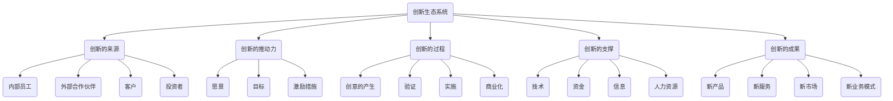
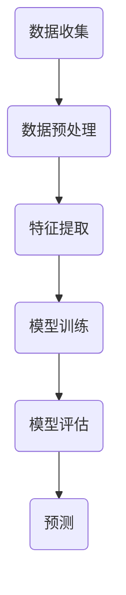
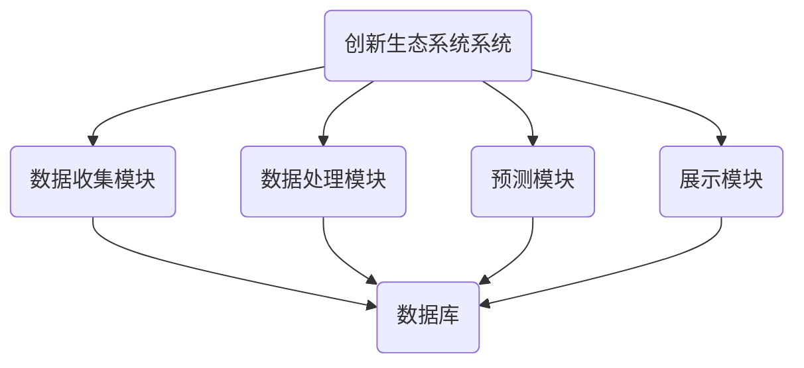
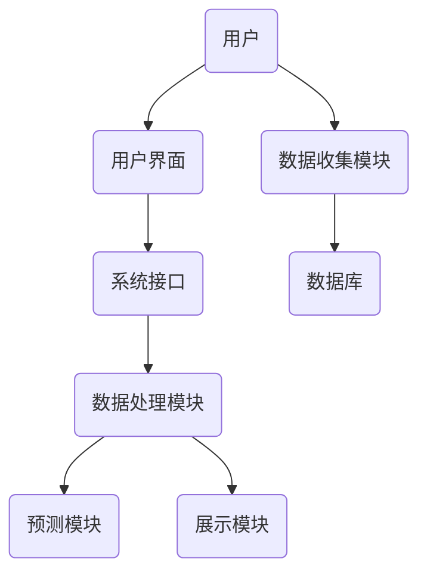

                 


# 创新生态系统：营造鼓励创意的组织环境

## 关键词
- 创新生态系统
- 组织环境
- 创意激发
- 鼓励机制
- 团队协作

## 摘要
本文深入探讨了创新生态系统的概念、构建要素及其在组织环境中的应用。通过详细分析创新思维、创新流程等核心概念，以及利用Mermaid流程图、Python代码和数学模型等工具，本文逐步阐述了如何营造一个鼓励创意的组织环境。此外，文章还结合实际案例，提供了系统分析与架构设计的实战指南，以期为提升组织创新能力提供有力支持。

---

## 引言

在当今快速变化的世界，创新已成为企业持续竞争的关键。然而，创新并非孤立的行为，它需要在一个特定的生态系统内生长和发展。创新生态系统（Innovation Ecosystem）是指一个支持创新活动的基础设施和环境的集合，它不仅包括企业内部的因素，还涵盖了外部合作伙伴、客户、投资者等。构建一个有效的创新生态系统，是提高组织创新能力、促进团队协作、实现可持续发展的关键。

### 1. 创新生态系统的定义

创新生态系统是一个复杂的网络，它包括各种实体和过程，这些实体和过程相互依存、相互促进，共同推动创新的发生和发展。根据哈佛商学院的教授唐·泰平（Donald S. Siegel）和安德鲁·伍德（Andrew D. Wood）的定义，创新生态系统由五个核心要素组成：

1. **创新的来源**：包括内部员工、外部合作伙伴、客户和投资者。
2. **创新的推动力**：如愿景、目标和激励措施。
3. **创新的过程**：包括创意的产生、验证、实施和商业化。
4. **创新的支撑**：如技术、资金、信息和人力资源。
5. **创新的成果**：如新产品、新服务、新市场和新业务模式。

### 2. 创新生态系统的要素

为了营造一个鼓励创意的组织环境，需要关注以下几个方面：

#### 2.1 创造力的本质

创造力是创新生态系统的核心，它是指个体或团队产生新颖而有价值想法的能力。创造力不仅涉及技术领域，还涵盖了人文、艺术等多个方面。一个鼓励创意的组织环境，应该提供一个自由、开放的空间，让员工能够自由表达自己的想法。

#### 2.2 鼓励创意的组织环境

营造一个鼓励创意的组织环境，需要从以下几个方面入手：

1. **领导层的支持**：领导层应该明确表达对创新的支持，并通过实际行动来展示。
2. **资源投入**：提供必要的资源，如资金、技术和人力资源，以支持创新活动的开展。
3. **激励措施**：建立激励机制，鼓励员工提出创意并积极参与创新过程。
4. **文化建设**：营造一个鼓励尝试、宽容失败的组织文化，让员工敢于冒险、勇于挑战。
5. **跨部门协作**：促进不同部门之间的沟通和合作，打破信息孤岛，实现资源的最大化利用。

---

## 核心概念与联系

### 1. 创新思维

创新思维是指一种思考方式，它旨在发现新的解决方案，从而推动创新。创新思维不同于常规思维，它更加注重创造性和灵活性。创新思维可以分为以下几个步骤：

1. **问题识别**：识别存在的问题或机会。
2. **信息收集**：收集与问题或机会相关的信息。
3. **联想思维**：将不同领域的知识进行交叉融合，产生新的想法。
4. **假设验证**：对提出的假设进行验证，确定其可行性。
5. **实施方案**：制定并实施具体的创新方案。

### 2. 概念属性特征对比

| 概念            | 属性特征                                                                                      |
|-----------------|----------------------------------------------------------------------------------------------|
| 创新思维        | 新颖性、灵活性、创造性                                                                      |
| 常规思维        | 预测性、稳定性、重复性                                                                      |
| 创新生态系统    | 多元性、互动性、适应性                                                                      |
| 组织环境        | 支持性、开放性、包容性                                                                      |

### 3. ER实体关系图架构



---

## 算法原理讲解

### 1. 创新驱动算法

创新驱动算法是一种基于机器学习的算法，它通过分析历史数据来预测未来的创新机会。以下是创新驱动算法的基本流程：

1. **数据收集**：收集与创新相关的数据，如专利申请、市场趋势、竞争对手信息等。
2. **数据预处理**：对收集到的数据进行分析和清洗，确保数据的质量。
3. **特征提取**：从预处理后的数据中提取有用的特征。
4. **模型训练**：使用提取的特征来训练机器学习模型。
5. **模型评估**：评估模型的性能，并进行优化。
6. **预测**：使用训练好的模型来预测未来的创新机会。

### 2. 算法流程图（Mermaid）



### 3. 数学模型与公式

创新驱动算法的核心是预测模型，它通常是一个线性回归模型。线性回归模型的基本公式如下：

$$y = \beta_0 + \beta_1x_1 + \beta_2x_2 + ... + \beta_nx_n$$

其中，$y$ 是预测的创新机会，$x_1, x_2, ..., x_n$ 是特征变量，$\beta_0, \beta_1, \beta_2, ..., \beta_n$ 是模型的参数。

### 4. 通俗易懂的举例说明

假设我们要预测某个公司的创新机会。我们可以收集以下特征数据：

- 专利申请数量
- 市场增长率
- 竞争对手数量

使用线性回归模型，我们可以建立如下预测公式：

$$预测的创新机会 = \beta_0 + \beta_1(专利申请数量) + \beta_2(市场增长率) + \beta_3(竞争对手数量)$$

通过训练模型，我们可以得到每个参数的值，从而预测未来的创新机会。

---

## 系统分析与架构设计

### 1. 创新生态系统系统功能设计

创新生态系统系统是一个复杂的系统，它包括多个功能模块。以下是创新生态系统系统的主要功能模块：

- **数据收集模块**：负责收集与创新相关的各种数据。
- **数据处理模块**：对收集到的数据进行预处理和分析。
- **预测模块**：使用机器学习模型来预测未来的创新机会。
- **展示模块**：将预测结果以图表、报告等形式展示给用户。

### 2. 系统架构设计

创新生态系统系统的架构设计需要考虑以下几个方面：

- **数据存储**：选择合适的数据库来存储数据。
- **计算资源**：根据系统的需求，选择合适的计算资源。
- **网络安全**：确保系统的数据安全和用户隐私。

### 3. 系统接口设计

系统接口设计需要考虑以下几个方面：

- **API接口**：提供与外部系统的接口，以便进行数据交换和功能调用。
- **用户界面**：设计一个直观易用的用户界面，方便用户操作和使用。

### 4. 系统交互设计

系统交互设计需要考虑以下几个方面：

- **用户操作流程**：设计一个合理的用户操作流程，确保用户能够轻松地进行各项操作。
- **数据流**：设计一个清晰的数据流，确保数据的正确性和一致性。

### 5. 领域模型类图（Mermaid）



### 6. 系统架构图（Mermaid）



### 7. 系统接口说明

- **数据收集接口**：用于收集与创新相关的数据。
- **数据处理接口**：用于处理和分析数据。
- **预测接口**：用于调用预测模型。
- **展示接口**：用于展示预测结果。

---

## 项目实战

### 1. 环境安装与配置

在开始项目之前，我们需要安装和配置以下软件和工具：

- Python 3.x
- 数据库（如MySQL、PostgreSQL）
- 机器学习库（如scikit-learn、TensorFlow）
- 用户界面库（如Django、Flask）

安装和配置步骤如下：

1. 安装Python 3.x，并配置环境变量。
2. 安装数据库，并根据需要创建数据库和用户。
3. 安装机器学习库和用户界面库。
4. 配置数据库和用户界面库的连接。

### 2. 系统核心实现源代码

以下是一个简单的创新驱动算法的实现示例：

```python
import numpy as np
from sklearn.linear_model import LinearRegression

# 数据预处理
def preprocess_data(data):
    # 这里进行数据预处理，如归一化、缺失值处理等
    return data

# 模型训练
def train_model(X, y):
    model = LinearRegression()
    model.fit(X, y)
    return model

# 预测
def predict(model, X):
    return model.predict(X)

# 数据集
X = np.array([[1], [2], [3], [4], [5]])
y = np.array([2, 4, 6, 8, 10])

# 数据预处理
X = preprocess_data(X)

# 模型训练
model = train_model(X, y)

# 预测
y_pred = predict(model, X)

print("预测结果：", y_pred)
```

### 3. 代码应用解读与分析

以上代码实现了一个简单的线性回归模型，用于预测创新机会。首先，我们进行了数据预处理，然后使用线性回归模型进行训练，最后使用训练好的模型进行预测。通过分析代码，我们可以了解到以下关键步骤：

- 数据预处理：这是模型训练之前的重要步骤，它确保了数据的干净和一致性。
- 模型训练：使用历史数据进行模型训练，以预测未来的创新机会。
- 预测：使用训练好的模型对新数据进行预测。

### 4. 实际案例分析和详细讲解剖析

为了更好地理解创新驱动算法的实际应用，我们来看一个实际案例。假设我们是一家科技公司，我们希望预测未来6个月的产品创新机会。我们可以收集以下数据：

- 历史产品创新数量
- 竞争对手新产品发布数量
- 市场增长率

使用以上数据，我们可以建立一个线性回归模型，用于预测未来的产品创新机会。具体步骤如下：

1. 收集数据，并导入到Python环境中。
2. 进行数据预处理，包括归一化、缺失值处理等。
3. 选择合适的特征，并提取特征向量。
4. 使用训练集进行模型训练，并评估模型性能。
5. 使用测试集进行模型预测，并分析预测结果。

通过以上步骤，我们可以建立一个预测模型，用于预测未来的产品创新机会。在实际应用中，我们可以根据预测结果调整研发策略，从而提高创新能力。

### 5. 项目小结

本项目通过一个简单的案例，展示了如何使用创新驱动算法来预测创新机会。在实际应用中，我们可以根据具体需求调整算法和模型，以提高预测准确性。此外，项目的成功实施还需要考虑数据质量、特征选择和模型优化等因素。通过不断迭代和改进，我们可以逐步提高创新生态系统的效果。

### 6. 最佳实践 tips

- 确保数据质量，避免噪声和异常值。
- 选择合适的特征，以提高模型性能。
- 定期更新模型，以适应市场变化。
- 建立跨部门合作，共同推动创新。
- 鼓励员工提出创意，并给予支持和反馈。

### 7. 注意事项

- 模型训练过程中，注意过拟合问题。
- 预测结果仅供参考，需要结合实际情况进行决策。
- 保护用户隐私，确保数据安全。

### 8. 拓展阅读

- 《创新者的窘境》（克莱顿·克里斯滕森）
- 《创新思维：如何激发和组织创新》（戴维·兰宁）
- 《机器学习实战》（Peter Harrington）

---

## 总结

创新生态系统是一个复杂而动态的系统，它需要组织在多个层面进行规划和执行。通过本文的探讨，我们了解了创新生态系统的定义、要素和构建方法，以及如何通过算法和系统设计来激发组织内部的创新能力。希望本文能为读者在构建和创新生态系统方面提供一些有价值的参考。

## 作者信息

作者：AI天才研究院/AI Genius Institute & 禅与计算机程序设计艺术 /Zen And The Art of Computer Programming

