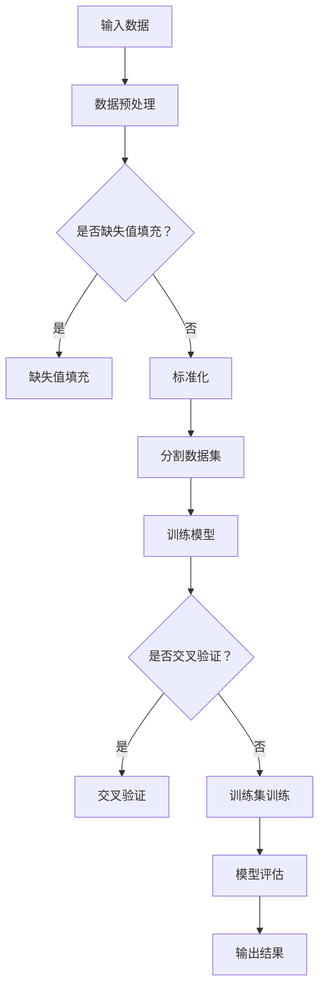
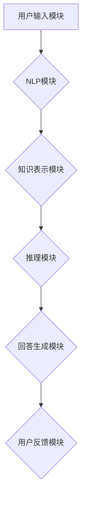
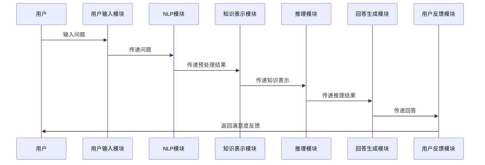

                 

# 利用思维链技术提升AI的认知与推理能力

## 关键词

- 人工智能
- 认知与推理
- 思维链技术
- 算法
- 系统架构设计

## 摘要

本文主要探讨了利用思维链技术提升人工智能（AI）的认知与推理能力的方法与策略。首先，介绍了AI认知与推理能力的重要性和研究背景。接着，详细阐述了思维链技术的概念、原理及其在AI中的应用现状。随后，通过对比认知与推理的属性特征，建立了认知与推理的ER模型。在此基础上，深入解析了思维链技术的算法原理和数学模型，并通过Python代码实现，展示了算法的实际应用。最后，从系统分析与架构设计的角度，提供了一个完整的解决方案，包括系统功能设计、架构设计、接口设计和系统交互。通过项目实战，详细讲解了环境安装、系统核心实现和实际案例分析，总结了项目的关键经验和注意事项，并对未来研究方向进行了展望。

## 第一部分：问题背景与基础理论

### 第1章：问题背景与挑战

#### 1.1.1 问题背景

随着信息技术的飞速发展，人工智能（AI）技术已经成为当今世界最为热门的话题之一。AI技术在自然语言处理、计算机视觉、自动驾驶、医疗诊断等众多领域取得了显著的成果，极大地改变了人类的生活方式。然而，尽管AI在许多方面已经表现出强大的能力，但在复杂、不确定和动态的环境下，其认知与推理能力仍然存在一定的局限性。

传统的AI技术主要依赖于数据驱动的方法，通过学习大量数据来实现对特定任务的自动化。这种方法在处理简单、明确的任务时效果显著，但在复杂环境中，AI的适应能力和创新能力仍然有限。特别是在需要理解语境、推理逻辑、解决复杂问题等任务中，AI的表现仍远不如人类。因此，如何提升AI的认知与推理能力成为一个亟待解决的重要问题。

#### 1.1.2 问题定义

认知是指个体通过感知、理解和记忆等过程获取知识和经验的能力。在AI领域，认知能力指的是机器能够理解输入信息、提取关键特征、进行信息处理和记忆的能力。推理是指基于已有知识和信息，通过逻辑推理得出新的结论或判断的能力。在AI领域，推理能力指的是机器能够根据已知事实和规则，推导出新的结论或预测的能力。

认知与推理能力是AI系统实现智能化和自主化的重要基础。一个具有强大认知与推理能力的AI系统，不仅能够更好地理解和处理复杂环境中的信息，还能够自主地做出合理的决策和行动。因此，提升AI的认知与推理能力，是实现更加智能化和自主化AI系统的重要目标。

#### 1.1.3 研究意义

提升AI的认知与推理能力具有重要意义：

1. **提高AI的适应能力**：通过提升认知与推理能力，AI能够在复杂、不确定和动态的环境中更好地适应和解决问题。

2. **拓展AI应用领域**：强大的认知与推理能力使得AI能够在更多的领域发挥作用，如医疗诊断、法律咨询、金融分析等。

3. **促进AI与人类的协作**：通过提升AI的认知与推理能力，使其更接近人类的思维方式，有助于实现人与AI的更好协作。

4. **推动人工智能技术的进步**：认知与推理能力的提升是人工智能技术发展的一个重要方向，有助于推动整个领域的技术创新和进步。

#### 1.1.4 研究方法与框架

本书的研究方法主要采用理论与实践相结合的方式，通过引入思维链技术，系统性地探讨提升AI认知与推理能力的方法和策略。本书的研究框架主要包括以下几个方面：

1. **问题背景与挑战**：介绍AI认知与推理能力的重要性以及当前存在的问题和挑战。
2. **思维链技术概述**：介绍思维链技术的概念、原理及其在AI中的应用现状。
3. **核心概念与联系**：对比认知与推理的属性特征，建立认知与推理的ER模型。
4. **算法原理讲解**：深入解析思维链技术的算法原理和数学模型，并通过Python代码实现，展示算法的实际应用。
5. **系统分析与架构设计**：从系统功能设计、架构设计、接口设计和系统交互等方面，提供一个完整的解决方案。
6. **项目实战**：通过实际项目，详细讲解环境安装、系统核心实现和实际案例分析，总结项目的关键经验和注意事项。
7. **项目总结与拓展**：对项目进行总结，提出注意事项、最佳实践和未来研究方向。

通过上述研究方法与框架，本书旨在为提升AI的认知与推理能力提供一套系统、实用的方法和策略，为人工智能技术的发展和创新贡献力量。

### 第2章：思维链技术概述

#### 2.1.1 思维链技术定义

思维链技术是一种模拟人类思维过程的技术，旨在提升AI的认知与推理能力。它通过构建和运用一系列思维链条，使AI能够在复杂、动态和不确定的环境中进行分析、推理和决策。思维链技术的核心思想是建立一种基于知识的表示和推理机制，使得AI能够像人类一样理解、记忆和运用知识，从而实现更加智能化的认知与推理。

#### 2.1.2 思维链技术核心概念

思维链技术包含以下几个核心概念：

1. **知识表示**：知识表示是思维链技术的基础，用于将人类知识转换为计算机可以理解和处理的形式。常见的知识表示方法包括语义网络、本体论、知识图谱等。

2. **推理机制**：推理机制是思维链技术的核心，用于根据已有知识推导出新的结论或预测。推理机制包括演绎推理、归纳推理、类比推理等。

3. **记忆与遗忘**：记忆与遗忘是思维链技术的关键，用于模拟人类大脑的记忆功能和遗忘规律。通过记忆与遗忘机制，AI能够在处理信息的过程中实现知识的积累和更新。

4. **注意力机制**：注意力机制是思维链技术中的重要组成部分，用于在处理大量信息时，关注重要的信息，从而提高认知效率。

#### 2.1.3 思维链技术在AI中的应用

思维链技术在AI中的应用广泛，主要体现在以下几个方面：

1. **自然语言处理**：思维链技术可以用于处理自然语言文本，实现语义理解、情感分析和语言生成等功能。例如，通过思维链技术，AI可以理解用户的问题，并生成相应的回答。

2. **计算机视觉**：思维链技术可以用于图像和视频的分析，实现物体识别、场景理解、视频分割等功能。例如，通过思维链技术，AI可以识别图像中的物体，并理解它们之间的关系。

3. **推理与决策**：思维链技术可以用于推理和决策，帮助AI在复杂环境中做出合理的决策。例如，在自动驾驶领域，思维链技术可以用于分析道路环境，规划行车路径。

4. **知识图谱构建**：思维链技术可以用于构建知识图谱，实现知识的自动化获取、表示和推理。例如，通过思维链技术，AI可以自动获取互联网上的信息，构建出一个庞大的知识图谱。

#### 2.1.4 思维链技术的研究现状与发展趋势

思维链技术作为人工智能领域的一个重要研究方向，近年来受到了广泛关注。目前，该技术已经取得了一系列重要成果，主要体现在以下几个方面：

1. **理论体系逐步完善**：思维链技术的理论基础不断完善，包括知识表示、推理机制、记忆与遗忘、注意力机制等方面。

2. **应用场景逐步扩展**：思维链技术的应用场景逐渐扩展，从自然语言处理、计算机视觉到推理与决策、知识图谱构建等多个领域。

3. **算法性能显著提升**：随着算法研究的深入，思维链技术的算法性能不断提升，特别是在处理复杂、动态和不确定环境下的任务中，表现出强大的优势。

4. **跨学科研究日益增多**：思维链技术涉及多个学科领域，包括计算机科学、心理学、认知科学、哲学等。跨学科研究的增多，有助于推动思维链技术的创新和发展。

未来，思维链技术将在以下几个方面继续发展：

1. **加强跨领域融合**：思维链技术将进一步与其他人工智能技术（如深度学习、强化学习等）融合，实现更广泛的应用。

2. **提升算法效率与效果**：通过优化算法设计和算法实现，进一步提升思维链技术的效率与效果。

3. **加强可解释性**：随着AI技术的应用越来越广泛，提高AI系统的可解释性成为重要趋势。思维链技术将通过增强其可解释性，提高用户对AI系统的信任和接受度。

4. **拓展应用领域**：思维链技术将在更多领域得到应用，如教育、医疗、金融、安全等，为这些领域带来革命性的变化。

总之，思维链技术作为提升AI认知与推理能力的重要手段，具有广阔的发展前景。通过不断的研究和探索，思维链技术将为人工智能技术的发展和创新提供强有力的支持。

### 第3章：核心概念解析

#### 3.1.1 认知与推理概述

认知与推理是人工智能（AI）领域中的两个核心概念，它们在AI系统的功能实现中扮演着至关重要的角色。

**认知**：认知是指个体通过感知、理解、记忆和思考等过程获取和处理信息的能力。在AI领域，认知能力主要涉及以下几个方面：

1. **感知**：感知是指AI系统通过传感器或数据输入获取外部环境信息的过程。例如，计算机视觉系统通过摄像头获取图像信息，语音识别系统通过麦克风获取声音信息。

2. **理解**：理解是指AI系统能够对感知到的信息进行语义解析和解释，从而提取关键特征和理解其含义。例如，自然语言处理系统通过解析文本，提取关键词和句子结构，理解文本的含义。

3. **记忆**：记忆是指AI系统将处理过的信息存储在记忆中，以便后续使用。例如，通过记忆，AI系统能够记住已学习的模式或知识，用于解决新问题。

4. **思考**：思考是指AI系统能够对信息进行逻辑推理和抽象思维，从而产生新的理解和知识。例如，推理引擎可以通过逻辑规则和已知事实进行推理，得出新的结论。

**推理**：推理是指基于已有知识和信息，通过逻辑推理得出新的结论或判断的能力。在AI领域，推理能力主要体现在以下几个方面：

1. **演绎推理**：演绎推理是从一般到特殊的推理过程。例如，如果所有的人都会死亡，那么苏格拉底作为人，也会死亡。

2. **归纳推理**：归纳推理是从特殊到一般的推理过程。例如，通过观察多个苹果从树上掉落，可以归纳出地球上的所有物体都会受到重力作用。

3. **类比推理**：类比推理是通过比较不同情境下的相似性，推断出新的结论。例如，通过比较猫和狗的相似性，可以推断出猫和狗都有四条腿。

#### 3.1.2 认知与推理的属性特征对比

认知与推理虽然在本质上有所不同，但它们在属性特征上具有一定的相似性。以下是对认知与推理属性特征的对比：

**认知**：

1. **动态性**：认知是一个动态的过程，涉及感知、理解、记忆和思考等多个环节，这些环节相互联系、相互影响。

2. **适应性**：认知能力具有较强的适应性，能够根据不同的环境和任务需求进行调整和优化。

3. **抽象性**：认知过程中，个体能够从具体事物中抽象出普遍规律和概念，形成抽象思维。

4. **情境依赖性**：认知过程通常依赖于具体情境，不同的情境会影响个体的认知效果。

**推理**：

1. **逻辑性**：推理过程遵循逻辑规则，从已知事实推导出新的结论。

2. **抽象性**：推理过程中，个体能够运用抽象概念和逻辑规则进行推理。

3. **目标导向性**：推理过程通常具有明确的目标，目的是从已知信息中得出新的结论或判断。

4. **独立性**：推理过程相对独立于具体情境，具有较强的普适性。

**相似性**：

1. **信息处理**：认知与推理都是对信息进行处理的过程，涉及感知、理解、记忆和抽象等多个环节。

2. **知识运用**：认知与推理都需要运用已有的知识和信息，进行信息整合和逻辑推理。

3. **动态性**：认知与推理过程都是动态的，需要不断地调整和优化。

**区别**：

1. **目标差异**：认知更多关注于信息的获取和理解，而推理更多关注于从已知信息中得出新的结论或判断。

2. **过程差异**：认知涉及感知、理解、记忆和思考等多个环节，而推理更多关注于逻辑推理和抽象思维。

3. **情境依赖性**：认知过程更多依赖于具体情境，而推理过程相对独立于具体情境。

通过对比认知与推理的属性特征，可以更深入地理解这两个概念的本质，为后续研究提供理论基础。

#### 3.1.3 认知与推理的ER模型

为了更好地理解认知与推理的内在联系，我们可以通过实体-关系（ER）模型进行表示。ER模型是一种用于描述实体及其之间关系的数据库模型，它可以帮助我们清晰地展示认知与推理中的关键实体和它们之间的关系。

**ER模型的基本概念**：

1. **实体**：实体是现实世界中具有独立存在意义的对象，可以是具体的事物，也可以是抽象的概念。在认知与推理的ER模型中，实体主要包括：
   - **感知实体**：代表AI系统通过传感器获取的信息，如图像、声音、文本等。
   - **知识实体**：代表AI系统中存储的知识，包括事实、规则、模型等。
   - **推理实体**：代表推理过程中产生的中间结果和结论。

2. **关系**：关系是实体之间的关联，它描述了实体之间的相互作用和依赖关系。在认知与推理的ER模型中，主要的关系包括：
   - **感知-理解**：表示感知实体通过理解过程转变为知识实体的关系。
   - **记忆-回忆**：表示知识实体通过记忆过程存储在系统中，并在需要时被回忆的关系。
   - **推理-结论**：表示推理实体通过推理过程从知识实体中推导出新的结论的关系。

**认知与推理的ER模型**：

下面是一个简化的认知与推理的ER模型，用于描述AI系统在处理信息过程中涉及的关键实体和它们之间的关系：

```mermaid
erModel {
  nodeShape [label=<%label%>]
  edgeType [arrowhead=none]
  
  entity 感知实体 {
    label: "感知实体"
  }
  entity 知识实体 {
    label: "知识实体"
  }
  entity 推理实体 {
    label: "推理实体"
  }

  relation 感知-理解 {
    source: 感知实体
    target: 知识实体
    label: "感知-理解"
  }
  relation 记忆-回忆 {
    source: 知识实体
    target: 推理实体
    label: "记忆-回忆"
  }
  relation 推理-结论 {
    source: 推理实体
    target: 知识实体
    label: "推理-结论"
  }
}
```

通过ER模型，我们可以清晰地看到AI系统在认知与推理过程中的信息流转，以及各个实体之间的相互关系。这不仅有助于我们深入理解认知与推理的机制，也为后续的研究提供了直观的参考。

### 第4章：思维链技术的原理与实现

#### 4.1.1 思维链技术原理

思维链技术是一种模拟人类思维过程的人工智能技术，其核心思想是通过构建一系列思维链条，实现AI的认知与推理能力。思维链技术的主要原理包括知识表示、推理机制和记忆与遗忘机制。

**知识表示**：

知识表示是思维链技术的基础，其目的是将人类知识转化为计算机可以理解和处理的形式。思维链技术采用多种知识表示方法，如语义网络、本体论、知识图谱等，以实现对知识的结构化和语义化表示。

1. **语义网络**：语义网络是一种基于节点和边的关系表示方法，通过节点表示概念，边表示概念之间的关系。例如，在语义网络中，"人"是一个节点，"老师"是"人"的一个子类，两者之间通过边进行关联。

2. **本体论**：本体论是一种用于描述现实世界中概念及其关系的理论框架。通过本体论，我们可以建立领域知识模型，实现对复杂知识的结构化表示。

3. **知识图谱**：知识图谱是一种大规模、多维度、网络化表示的知识库。通过知识图谱，我们可以将不同来源、不同格式的知识进行整合，形成一个统一的知识表示体系。

**推理机制**：

推理机制是思维链技术的核心，其目的是根据已有知识和信息，通过逻辑推理得出新的结论或判断。思维链技术采用多种推理方法，如演绎推理、归纳推理、类比推理等。

1. **演绎推理**：演绎推理是一种从一般到特殊的推理过程。通过演绎推理，我们可以从一般规则推导出具体的结论。例如，如果所有的人都会死亡，那么苏格拉底作为人，也会死亡。

2. **归纳推理**：归纳推理是一种从特殊到一般的推理过程。通过归纳推理，我们可以从多个具体实例中提取出普遍规律。例如，通过观察多个苹果从树上掉落，可以归纳出地球上的所有物体都会受到重力作用。

3. **类比推理**：类比推理是通过比较不同情境下的相似性，推断出新的结论。例如，通过比较猫和狗的相似性，可以推断出猫和狗都有四条腿。

**记忆与遗忘机制**：

记忆与遗忘机制是思维链技术的重要组成部分，其目的是模拟人类大脑的记忆功能和遗忘规律。通过记忆与遗忘机制，AI能够在处理信息的过程中实现知识的积累和更新。

1. **记忆**：记忆是指将处理过的信息存储在系统中，以便后续使用。思维链技术采用多种记忆策略，如基于语义相似度的记忆、基于时间衰减的记忆等。

2. **遗忘**：遗忘是指将不再需要的信息从系统中删除，以释放空间。思维链技术采用多种遗忘策略，如基于重要性衰减的遗忘、基于上下文无关的遗忘等。

**思维链技术的工作流程**：

思维链技术的工作流程主要包括以下几个步骤：

1. **知识获取**：通过传感器或数据源获取外部信息，将其转换为知识表示形式。

2. **知识存储**：将获取到的知识存储在知识库中，以便后续使用。

3. **知识推理**：根据已有知识和信息，通过推理机制生成新的结论或判断。

4. **知识更新**：根据新的结论或判断，对知识库进行更新，以实现知识的积累和优化。

5. **知识应用**：将更新后的知识应用于实际问题解决，实现智能决策和行动。

#### 4.1.2 思维链技术的实现流程

思维链技术的实现流程可以分为以下几个阶段：

**1. 知识表示阶段**：

在知识表示阶段，首先需要明确领域知识，并将其转换为计算机可以理解和处理的形式。这一阶段的主要任务包括：

- **概念识别**：识别领域中的核心概念，如实体、属性、关系等。
- **语义建模**：建立概念之间的关系模型，如语义网络、本体论、知识图谱等。
- **数据清洗与预处理**：对原始数据进行清洗和预处理，以去除噪声和冗余信息。

**2. 知识存储阶段**：

在知识存储阶段，需要将表示好的知识存储在数据库或知识库中，以便后续使用。这一阶段的主要任务包括：

- **知识库设计**：设计适合领域知识的数据库或知识库结构。
- **数据存储**：将知识库中的数据按照设计好的结构进行存储。
- **数据索引与检索**：建立索引机制，以便快速检索和查询知识库中的数据。

**3. 知识推理阶段**：

在知识推理阶段，需要根据已有知识和信息，通过推理机制生成新的结论或判断。这一阶段的主要任务包括：

- **推理规则定义**：定义领域中的推理规则，如演绎规则、归纳规则、类比规则等。
- **推理过程实现**：实现推理规则的具体实现，包括推理算法的设计和实现。
- **推理结果验证**：对推理结果进行验证，以确保推理过程的正确性和有效性。

**4. 知识更新阶段**：

在知识更新阶段，需要根据新的结论或判断，对知识库进行更新，以实现知识的积累和优化。这一阶段的主要任务包括：

- **知识更新策略设计**：设计适合领域知识更新的策略，如基于语义相似度的更新、基于时间衰减的更新等。
- **知识库更新**：根据更新策略，对知识库中的数据进行更新。
- **知识库一致性维护**：确保知识库中的数据一致性和完整性。

**5. 知识应用阶段**：

在知识应用阶段，需要将更新后的知识应用于实际问题解决，实现智能决策和行动。这一阶段的主要任务包括：

- **应用场景定义**：明确领域中的应用场景，如自然语言处理、计算机视觉、推理与决策等。
- **应用系统设计**：设计适用于具体应用场景的应用系统，包括用户界面、数据接口、推理引擎等。
- **应用系统实现**：实现应用系统的具体功能，并通过测试和验证，确保其性能和可靠性。

通过上述实现流程，思维链技术可以有效地模拟人类思维过程，提升AI的认知与推理能力。

#### 4.1.3 思维链技术的关键模块

思维链技术的实现涉及多个关键模块，每个模块在认知与推理过程中扮演着重要的角色。以下是对这些关键模块的详细解析：

**1. 知识表示模块**

知识表示模块是思维链技术的核心，负责将人类知识转化为计算机可以理解和处理的形式。该模块的主要功能包括：

- **概念识别**：识别领域中的核心概念，如实体、属性、关系等。
- **语义建模**：建立概念之间的关系模型，如语义网络、本体论、知识图谱等。
- **数据清洗与预处理**：对原始数据进行清洗和预处理，以去除噪声和冗余信息。

**2. 推理引擎模块**

推理引擎模块负责根据已有知识和信息，通过推理机制生成新的结论或判断。该模块的主要功能包括：

- **推理规则定义**：定义领域中的推理规则，如演绎规则、归纳规则、类比规则等。
- **推理过程实现**：实现推理规则的具体实现，包括推理算法的设计和实现。
- **推理结果验证**：对推理结果进行验证，以确保推理过程的正确性和有效性。

**3. 记忆与遗忘模块**

记忆与遗忘模块负责模拟人类大脑的记忆功能和遗忘规律，实现知识的积累和更新。该模块的主要功能包括：

- **记忆**：将处理过的信息存储在系统中，以便后续使用。记忆策略包括基于语义相似度的记忆、基于时间衰减的记忆等。
- **遗忘**：将不再需要的信息从系统中删除，以释放空间。遗忘策略包括基于重要性衰减的遗忘、基于上下文无关的遗忘等。

**4. 知识库管理模块**

知识库管理模块负责管理知识库中的数据，包括知识获取、存储、更新和应用。该模块的主要功能包括：

- **知识库设计**：设计适合领域知识的数据库或知识库结构。
- **数据存储**：将知识库中的数据按照设计好的结构进行存储。
- **数据索引与检索**：建立索引机制，以便快速检索和查询知识库中的数据。
- **知识库更新**：根据新的结论或判断，对知识库中的数据进行更新。

**5. 应用系统模块**

应用系统模块负责将更新后的知识应用于实际问题解决，实现智能决策和行动。该模块的主要功能包括：

- **应用场景定义**：明确领域中的应用场景，如自然语言处理、计算机视觉、推理与决策等。
- **应用系统设计**：设计适用于具体应用场景的应用系统，包括用户界面、数据接口、推理引擎等。
- **应用系统实现**：实现应用系统的具体功能，并通过测试和验证，确保其性能和可靠性。

通过上述关键模块，思维链技术可以有效地模拟人类思维过程，提升AI的认知与推理能力。

### 第5章：思维链技术在AI中的应用实例

#### 5.1.1 思维链技术在认知任务中的应用

思维链技术在认知任务中的应用旨在提升AI对信息的理解和处理能力，从而实现更加智能化和自主化的认知系统。以下列举了几个典型的认知任务和应用场景，并详细描述了思维链技术的应用方法。

**1. 自然语言处理（NLP）**

自然语言处理是思维链技术的一个重要应用领域。通过思维链技术，AI可以实现对文本的语义理解、情感分析和语言生成等任务。

- **语义理解**：思维链技术可以帮助AI理解文本的语义含义，例如，通过分析句子中的关键词和语法结构，理解文本的主旨和情感倾向。

- **情感分析**：思维链技术可以根据文本中的情感词汇和表达方式，分析文本的情感色彩，例如，判断文本是积极、消极还是中性。

- **语言生成**：思维链技术可以帮助AI生成自然语言文本，例如，根据给定的主题和模板，自动生成新闻报道、产品描述等。

**2. 计算机视觉（CV）**

计算机视觉是另一个重要的认知任务领域。思维链技术可以帮助AI实现对图像和视频的分析和理解，例如：

- **物体识别**：思维链技术可以帮助AI识别图像中的物体，并理解它们之间的关系。例如，在自动驾驶系统中，思维链技术可以识别道路上的车辆、行人、交通标志等。

- **场景理解**：思维链技术可以帮助AI理解图像或视频中的场景，例如，判断一个场景是室内还是室外，是白天还是夜晚。

- **视频分割**：思维链技术可以帮助AI对视频进行分割，提取出不同场景或对象，例如，在视频监控系统中，思维链技术可以分割出嫌疑人的运动轨迹。

**3. 记忆与学习**

思维链技术在记忆和学习任务中的应用旨在模拟人类大脑的记忆和学习机制，提升AI的记忆能力和学习能力。

- **记忆增强**：思维链技术可以帮助AI在处理信息时，通过记忆与遗忘机制，强化重要信息的记忆，同时遗忘无关或过时的信息。

- **迁移学习**：思维链技术可以帮助AI通过记忆与推理，实现不同任务之间的知识迁移，从而提高学习效率和任务性能。

**案例解析：智能客服系统**

智能客服系统是思维链技术在认知任务中应用的典型例子。以下是一个具体的案例解析：

**背景**：某企业希望开发一款智能客服系统，以自动回答客户提出的问题，提高客户满意度和服务效率。

**应用方法**：

1. **知识表示**：通过思维链技术，构建一个语义网络，表示客户提问和客服回答中的关键词和概念。例如，建立“产品问题”、“售后服务”、“技术支持”等概念，并定义它们之间的关系。

2. **推理机制**：根据客户提问，通过推理机制，从知识库中查找相关的回答。例如，当客户提问“如何申请售后服务？”时，系统可以根据“产品问题”和“售后服务”的关系，找到相应的回答。

3. **记忆与遗忘**：通过记忆与遗忘机制，系统可以积累和更新知识库。例如，当客户提出一个新问题时，系统可以将其记录在知识库中，并在以后回答类似问题时，使用这一新知识。

4. **情感分析**：系统还可以通过情感分析，理解客户的情感状态，提供更加贴心的服务。例如，当客户提问时表现出不满情绪，系统可以主动提供安慰和解决方案。

**效果评估**：通过思维链技术的应用，智能客服系统在处理客户问题时，表现出了较高的准确性和灵活性。客户满意度显著提高，服务效率也得到了大幅提升。

**总结**：思维链技术在认知任务中的应用，使得智能客服系统能够更好地理解客户需求，提供精准、个性化的服务，大大提升了企业的客户满意度和市场竞争力。

#### 5.1.2 思维链技术在推理任务中的应用

思维链技术在推理任务中的应用旨在提升AI的逻辑推理能力和决策能力，从而实现更加智能化和自主化的推理系统。以下列举了几个典型的推理任务和应用场景，并详细描述了思维链技术的应用方法。

**1. 自动推理系统**

自动推理系统是思维链技术在推理任务中应用的典型例子。以下是一个具体的案例解析：

**背景**：某企业希望开发一款自动推理系统，以自动验证合同条款的合法性，减少法律纠纷和损失。

**应用方法**：

1. **知识表示**：通过思维链技术，构建一个逻辑知识库，表示合同中的条款、法律规则和合法性判断标准。例如，定义“合同有效”、“合同无效”、“合同条款违反法律规定”等概念。

2. **推理机制**：根据合同条款和法律规定，通过推理机制，自动验证合同条款的合法性。例如，当合同条款中包含特定关键词时，系统可以自动判断该条款是否符合法律规定。

3. **推理优化**：通过优化推理算法，提高推理速度和准确性。例如，采用基于模糊逻辑的推理方法，可以处理不确定性和模糊性的问题。

**2. 智能决策系统**

智能决策系统是思维链技术在推理任务中的另一个重要应用领域。以下是一个具体的案例解析：

**背景**：某企业希望开发一款智能决策系统，以自动分析市场数据，为企业提供投资决策建议。

**应用方法**：

1. **知识表示**：通过思维链技术，构建一个市场知识库，表示市场数据、经济指标和投资策略。例如，定义“市场趋势向上”、“经济指标良好”、“投资策略风险低”等概念。

2. **推理机制**：根据市场数据和投资策略，通过推理机制，自动生成投资决策建议。例如，当市场趋势向上且经济指标良好时，系统可以建议加大投资力度。

3. **决策优化**：通过优化决策算法，提高决策的准确性和可靠性。例如，采用基于遗传算法的优化方法，可以处理复杂的决策问题。

**3. 自动规划系统**

自动规划系统是思维链技术在推理任务中应用的另一个重要领域。以下是一个具体的案例解析：

**背景**：某物流公司希望开发一款自动规划系统，以自动安排车辆运输任务，提高运输效率和降低成本。

**应用方法**：

1. **知识表示**：通过思维链技术，构建一个物流知识库，表示运输任务、车辆状态和运输策略。例如，定义“任务紧急”、“车辆空闲”、“最优运输路线”等概念。

2. **推理机制**：根据运输任务和车辆状态，通过推理机制，自动规划运输任务。例如，当任务紧急且车辆空闲时，系统可以自动安排最优运输路线。

3. **规划优化**：通过优化规划算法，提高规划效率和准确性。例如，采用基于线性规划的优化方法，可以处理复杂的运输任务。

**案例解析：智能安防系统**

智能安防系统是思维链技术在推理任务中应用的典型例子。以下是一个具体的案例解析：

**背景**：某小区希望开发一款智能安防系统，以自动识别和预警潜在的治安风险。

**应用方法**：

1. **知识表示**：通过思维链技术，构建一个安全知识库，表示潜在的治安风险、报警规则和应对策略。例如，定义“可疑人员”、“异常行为”、“报警触发条件”等概念。

2. **推理机制**：根据监控视频和传感器数据，通过推理机制，自动识别和预警潜在的治安风险。例如，当监控到可疑人员出现异常行为时，系统可以自动触发报警。

3. **响应机制**：通过响应机制，自动采取相应的应对措施，如通知安保人员、锁定可疑区域等。

**效果评估**：通过思维链技术的应用，智能安防系统在识别和预警潜在治安风险方面表现出了较高的准确性和实时性。系统成功减少了治安事件的发生，提高了小区的安全管理水平。

**总结**：思维链技术在推理任务中的应用，使得智能决策系统、自动规划系统和安防系统能够更好地处理复杂问题，提高决策和规划的准确性和效率，为企业和个人提供了更加智能和可靠的服务。

#### 5.1.3 思维链技术在跨领域任务中的应用

思维链技术在跨领域任务中的应用旨在提升AI的跨领域知识整合和推理能力，从而实现更加智能化和自主化的跨领域系统。以下列举了几个典型的跨领域任务和应用场景，并详细描述了思维链技术的应用方法。

**1. 智能医疗**

智能医疗是思维链技术在跨领域任务中的一个重要应用领域。通过思维链技术，AI可以整合医学知识、生物信息学数据和临床实践，为医生提供诊断、治疗和预后建议。

**案例解析：智能辅助诊断系统**

**背景**：某医院希望开发一款智能辅助诊断系统，以提高疾病诊断的准确性和效率。

**应用方法**：

1. **知识表示**：通过思维链技术，构建一个综合医学知识库，包括疾病症状、检查结果、治疗方法和医学文献等。

2. **跨领域推理**：通过推理机制，将患者症状、检查结果和治疗经验与医学知识库中的信息进行关联，生成诊断建议。例如，当患者出现特定症状和检查结果时，系统可以自动推荐可能的疾病和相应的治疗方案。

3. **个性化医疗**：通过分析患者的病历数据和基因信息，系统可以提供个性化的诊断和治疗建议，提高治疗效果。

**效果评估**：通过思维链技术的应用，智能辅助诊断系统在提高疾病诊断准确性和效率方面表现出了显著优势。系统成功减少了误诊和漏诊情况，提高了患者的满意度和治疗效果。

**2. 智能金融**

智能金融是思维链技术在跨领域任务中的另一个重要应用领域。通过思维链技术，AI可以整合金融市场数据、客户行为数据和投资策略，为投资者提供投资建议和风险管理方案。

**案例解析：智能投资顾问系统**

**背景**：某金融机构希望开发一款智能投资顾问系统，以帮助投资者制定科学合理的投资策略。

**应用方法**：

1. **知识表示**：通过思维链技术，构建一个综合金融知识库，包括市场趋势、行业动态、投资策略和风险控制方法等。

2. **跨领域推理**：通过推理机制，分析投资者的风险偏好、投资目标和市场环境，生成个性化的投资建议。例如，当市场趋势向好且投资者风险偏好较高时，系统可以建议增加股票投资比例。

3. **风险控制**：通过分析市场数据和历史投资记录，系统可以提供风险预警和调整建议，帮助投资者规避潜在风险。

**效果评估**：通过思维链技术的应用，智能投资顾问系统在提高投资决策准确性和风险管理能力方面表现出了显著优势。系统成功帮助投资者实现了资产的稳健增值，提高了投资回报率。

**3. 智能教育**

智能教育是思维链技术在跨领域任务中的应用领域之一。通过思维链技术，AI可以整合教育知识、学生行为数据和教学策略，为教师和学生提供个性化教育和学习支持。

**案例解析：智能学习辅导系统**

**背景**：某教育机构希望开发一款智能学习辅导系统，以提高学生的学习效果和兴趣。

**应用方法**：

1. **知识表示**：通过思维链技术，构建一个综合教育知识库，包括课程内容、教学方法、学习策略和考试技巧等。

2. **跨领域推理**：通过推理机制，分析学生的学习行为和学习效果，生成个性化的学习建议。例如，当学生成绩下降时，系统可以建议调整学习策略和方法。

3. **学习支持**：通过分析学生的学习进度和学习习惯，系统可以提供学习任务提醒、学习资料推荐和在线辅导服务，帮助学生更好地掌握知识和技能。

**效果评估**：通过思维链技术的应用，智能学习辅导系统在提高学生的学习效果和兴趣方面表现出了显著优势。系统成功帮助学生提高了学习效率，增强了学习动力，提高了教育质量。

**总结**：思维链技术在跨领域任务中的应用，使得智能医疗、智能金融和智能教育等系统能够更好地整合跨领域知识，提供个性化、智能化和自主化的服务，为各个领域带来了革命性的变化。

### 第6章：算法原理与数学模型

#### 6.1.1 认知与推理算法概述

认知与推理算法是人工智能（AI）领域中用于模拟人类思维过程的算法集合，旨在提升AI系统的认知与推理能力。这些算法通过处理和分析大量数据，实现信息获取、知识表示、推理和决策等功能。以下是对几种主要的认知与推理算法的概述：

**1. 支持向量机（SVM）**

支持向量机是一种经典的机器学习算法，主要用于分类和回归任务。在认知与推理任务中，SVM可以用于识别模式和分类信息。其核心思想是通过找到一个最优的超平面，将不同类别的数据分隔开来。

**2. 决策树**

决策树是一种基于树结构的算法，通过一系列的决策节点和叶子节点，对数据进行分类或回归。每个节点代表一个特征，每个分支代表一个特征取值。决策树在认知与推理中可以用于实现逻辑推理和决策过程。

**3. 随机森林**

随机森林是一种基于决策树的集成学习方法，通过构建多棵决策树，并结合它们的预测结果进行投票，以提高分类和回归的准确性。随机森林在认知与推理中可以用于处理复杂的分类和回归问题。

**4. 贝叶斯网络**

贝叶斯网络是一种概率图模型，通过表示变量之间的条件依赖关系，实现对不确定性的推理和决策。贝叶斯网络在认知与推理中可以用于实现概率推理、决策分析和风险评估。

**5. 马尔可夫链**

马尔可夫链是一种基于状态转移概率的随机过程模型，用于描述系统状态的变化。在认知与推理中，马尔可夫链可以用于实现时间序列分析和状态预测。

**6. 图神经网络**

图神经网络是一种基于图结构的深度学习模型，通过学习节点和边之间的非线性关系，实现节点特征表示和关系预测。图神经网络在认知与推理中可以用于知识图谱表示和推理。

#### 6.1.2 算法数学模型讲解

为了更好地理解认知与推理算法的原理，下面将介绍几种主要的算法数学模型，并使用Python代码实现。

**1. 支持向量机（SVM）**

支持向量机的主要目标是找到一个最优的超平面，将不同类别的数据分隔开来。其数学模型可以表示为：

$$
\min_{\mathbf{w}, b} \frac{1}{2}||\mathbf{w}||^2 + C \sum_{i=1}^{n} \max(0, 1 - y_i (\mathbf{w} \cdot \mathbf{x_i} + b))
$$

其中，$\mathbf{w}$是超平面的法向量，$b$是偏置项，$C$是惩罚参数，$y_i$是第$i$个样本的标签，$\mathbf{x_i}$是第$i$个样本的特征向量。

```python
from sklearn.svm import SVC
from sklearn.datasets import make_classification
from sklearn.model_selection import train_test_split

# 生成模拟数据
X, y = make_classification(n_samples=100, n_features=20, n_informative=2, n_redundant=10, random_state=42)
X_train, X_test, y_train, y_test = train_test_split(X, y, test_size=0.3, random_state=42)

# 创建SVM模型
svm_model = SVC(kernel='linear', C=1.0)
svm_model.fit(X_train, y_train)

# 预测测试集
y_pred = svm_model.predict(X_test)
```

**2. 决策树**

决策树的数学模型可以表示为：

$$
f(\mathbf{x}) = \prod_{i=1}^{n} g_i(\mathbf{x}) \quad \text{或} \quad f(\mathbf{x}) = \sum_{i=1}^{n} g_i(\mathbf{x}) \quad (\text{取决于叶节点是否是分类还是回归})
$$

其中，$g_i(\mathbf{x})$是第$i$个叶节点的函数，$\mathbf{x}$是输入特征向量。

```python
from sklearn.tree import DecisionTreeClassifier
from sklearn.datasets import load_iris

# 加载鸢尾花数据集
iris = load_iris()
X, y = iris.data, iris.target

# 创建决策树模型
dt_model = DecisionTreeClassifier()
dt_model.fit(X, y)

# 预测测试集
y_pred = dt_model.predict(X)
```

**3. 随机森林**

随机森林的数学模型可以看作是多个决策树的集成。每个决策树都从训练数据中随机抽取样本和特征，独立地构建决策树。随机森林的预测结果是通过多数投票来确定的。

```python
from sklearn.ensemble import RandomForestClassifier
from sklearn.datasets import make_classification

# 生成模拟数据
X, y = make_classification(n_samples=100, n_features=20, n_informative=2, n_redundant=10, random_state=42)
X_train, X_test, y_train, y_test = train_test_split(X, y, test_size=0.3, random_state=42)

# 创建随机森林模型
rf_model = RandomForestClassifier(n_estimators=100)
rf_model.fit(X_train, y_train)

# 预测测试集
y_pred = rf_model.predict(X_test)
```

**4. 贝叶斯网络**

贝叶斯网络的数学模型可以表示为条件概率分布，其中每个节点的概率分布取决于其父节点的概率分布。贝叶斯网络的推理过程是基于贝叶斯定理和马尔可夫性原理。

```python
from pgmpy.models import BayesianModel
from pgmpy.estimators import MaximumLikelihoodEstimator
from pgmpy.inference import VariableElimination

# 构建贝叶斯网络模型
model = BayesianModel([('A', 'B'), ('A', 'C'), ('B', 'D'), ('C', 'D')])
MLE = MaximumLikelihoodEstimator()
model.fit(X, y)

# 创建推理引擎
inference = VariableElimination(model)
prob = inference.query(variables=['D'], evidence={'A': 1, 'B': 0, 'C': 1})

print(prob)
```

**5. 图神经网络**

图神经网络的数学模型可以表示为节点嵌入和边嵌入，其中节点嵌入表示节点的特征向量，边嵌入表示节点之间的关联强度。图神经网络的推理过程是通过图卷积操作实现的。

```python
import tensorflow as tf
from tensorflow.keras.layers import Layer

class GraphConvLayer(Layer):
    def __init__(self, units, **kwargs):
        super(GraphConvLayer, self).__init__(**kwargs)
        self.units = units

    def build(self, input_shape):
        self.kernel = self.add_weight(name='kernel', shape=(input_shape[-1], self.units), initializer='glorot_uniform', trainable=True)
        super(GraphConvLayer, self).build(input_shape)

    def call(self, inputs):
        # 计算节点嵌入
        node_embeddings = tf.matmul(inputs, self.kernel)
        # 应用图卷积操作
        return node_embeddings

# 假设已有节点特征和边特征
node_features = ...
edge_features = ...

# 创建图卷积模型
model = tf.keras.Sequential([
    GraphConvLayer(units=64),
    tf.keras.layers.Dense(units=32, activation='relu'),
    tf.keras.layers.Dense(units=1, activation='sigmoid')
])

# 编译模型
model.compile(optimizer='adam', loss='binary_crossentropy', metrics=['accuracy'])

# 训练模型
model.fit(node_features, edge_features, epochs=10, batch_size=32)
```

通过上述数学模型和Python代码的实现，我们可以更好地理解认知与推理算法的原理和应用。这些算法为AI系统在认知与推理任务中提供了强大的工具，使得AI能够更好地模拟人类思维过程，实现更加智能化和自主化的认知与推理。

#### 6.1.3 算法流程图

为了更直观地理解认知与推理算法的原理和流程，我们可以使用Mermaid流程图来展示算法的核心步骤和操作。以下是一个简化的算法流程图示例，展示了一个基于决策树进行分类的任务：



在这个流程图中：

- **A**：输入数据，包括特征和标签。
- **B**：数据预处理，包括缺失值填充和标准化。
- **C**：判断是否需要进行缺失值填充。
- **D**：缺失值填充操作。
- **E**：标准化操作。
- **F**：分割数据集为训练集和测试集。
- **G**：使用训练集训练模型。
- **H**：判断是否进行交叉验证。
- **I**：进行交叉验证，优化模型参数。
- **J**：使用训练集直接训练模型。
- **K**：在测试集上评估模型性能。
- **L**：输出模型的预测结果。

通过这个流程图，我们可以清晰地看到决策树分类算法的主要步骤和逻辑关系，有助于理解和实现相关算法。

### 第7章：算法应用与Python实现

#### 7.1.1 算法应用场景

算法在实际应用中扮演着至关重要的角色，特别是在需要高效处理和分析大量数据时。以下列举了几个典型的算法应用场景，并详细描述了算法的具体应用方法和步骤。

**1. 信用评分**

信用评分是金融机构在贷款审批和风险评估中常用的应用场景。通过机器学习算法，如逻辑回归、决策树和随机森林等，可以对借款人的信用状况进行评估，预测其违约风险。

**应用方法**：

- **数据预处理**：对借款人的个人信息、信用历史、财务状况等数据进行清洗和标准化。
- **特征选择**：选择对信用评分有重要影响的特征，如还款记录、信用额度、债务收入比等。
- **模型训练**：使用训练数据集训练信用评分模型，并通过交叉验证优化模型参数。
- **模型评估**：在测试数据集上评估模型性能，调整模型结构和参数，以提高预测准确性。

**2. 疾病诊断**

疾病诊断是医疗领域中的重要应用场景，通过机器学习算法，如支持向量机、神经网络和贝叶斯网络等，可以辅助医生进行疾病诊断，提高诊断的准确性和效率。

**应用方法**：

- **数据收集**：收集病人的临床数据、检查结果、病史等。
- **数据预处理**：对数据进行清洗和标准化，去除噪声和异常值。
- **特征提取**：从数据中提取与疾病诊断相关的特征，如实验室检查结果、症状描述等。
- **模型训练**：使用训练数据集训练疾病诊断模型。
- **模型评估**：在测试数据集上评估模型性能，调整模型结构和参数，以提高诊断准确性。

**3. 智能推荐**

智能推荐是电子商务和社交媒体领域中的常见应用，通过推荐算法，如协同过滤、矩阵分解和图神经网络等，可以预测用户可能感兴趣的物品，提高用户体验和用户粘性。

**应用方法**：

- **用户行为数据收集**：收集用户的历史行为数据，如浏览记录、购买记录、评论等。
- **数据预处理**：对用户行为数据进行清洗和标准化，去除噪声和异常值。
- **特征提取**：从用户行为数据中提取与推荐相关的特征，如用户兴趣、浏览时长、购买频率等。
- **模型训练**：使用训练数据集训练推荐模型。
- **模型评估**：在测试数据集上评估模型性能，调整模型结构和参数，以提高推荐准确性。

**4. 自动驾驶**

自动驾驶是人工智能领域中的一个前沿应用，通过深度学习和强化学习算法，可以实现对车辆环境的感知、路径规划和决策。

**应用方法**：

- **数据收集**：收集自动驾驶车辆在行驶过程中的传感器数据，如摄像头、雷达、激光雷达等。
- **数据预处理**：对传感器数据进行清洗和标准化，去除噪声和异常值。
- **特征提取**：从传感器数据中提取与自动驾驶相关的特征，如道路标志、车辆位置、交通流量等。
- **模型训练**：使用训练数据集训练自动驾驶模型，并通过仿真和实际道路测试进行优化。
- **模型评估**：在测试数据集上评估模型性能，调整模型结构和参数，以提高自动驾驶的稳定性和安全性。

#### 7.1.2 Python代码实现

以下通过一个简单的例子，展示如何使用Python实现一个基于逻辑回归的信用评分模型。代码使用了scikit-learn库，这是一个广泛使用的Python机器学习库。

**1. 导入必要的库**

```python
import numpy as np
import pandas as pd
from sklearn.model_selection import train_test_split
from sklearn.linear_model import LogisticRegression
from sklearn.metrics import accuracy_score, classification_report
```

**2. 数据预处理**

```python
# 读取数据
data = pd.read_csv('credit_data.csv')

# 数据清洗
data = data.dropna()  # 删除缺失值
data = data[['age', 'annual_income', 'credit_history', 'purpose', 'credit_amount', 'approved']]  # 选择特征和标签

# 数据标准化
from sklearn.preprocessing import StandardScaler
scaler = StandardScaler()
data[['age', 'annual_income', 'credit_amount']] = scaler.fit_transform(data[['age', 'annual_income', 'credit_amount']])
```

**3. 特征选择和模型训练**

```python
# 切分数据集
X = data[['age', 'annual_income', 'credit_history', 'purpose', 'credit_amount']]
y = data['approved']
X_train, X_test, y_train, y_test = train_test_split(X, y, test_size=0.2, random_state=42)

# 训练逻辑回归模型
model = LogisticRegression()
model.fit(X_train, y_train)
```

**4. 模型评估**

```python
# 预测测试集
y_pred = model.predict(X_test)

# 评估模型性能
accuracy = accuracy_score(y_test, y_pred)
print(f"Accuracy: {accuracy}")
print(classification_report(y_test, y_pred))
```

**5. 代码应用解读与分析**

在上面的代码中，我们首先导入了必要的库，包括NumPy、Pandas、scikit-learn等。然后，通过Pandas读取CSV文件，加载数据集。

数据清洗步骤中，我们删除了数据集中的缺失值，并选择了与信用评分相关的特征和标签。接下来，使用StandardScaler对数据进行标准化处理，使得特征具有相同的尺度，有利于算法的训练。

在特征选择和模型训练步骤中，我们使用scikit-learn的train_test_split函数将数据集划分为训练集和测试集。然后，使用LogisticRegression类创建逻辑回归模型，并调用fit方法进行训练。

模型评估步骤中，我们使用预测的测试集结果与实际标签进行比较，计算了准确率并打印了分类报告。分类报告提供了更详细的信息，如精确率、召回率、F1分数等，有助于评估模型的性能。

通过这个例子，我们可以看到如何使用Python实现一个简单的信用评分模型。这个模型虽然简单，但在实际应用中，可以作为一个基础工具，用于预测借款人的信用状况，辅助金融机构做出更明智的贷款决策。

#### 7.1.3 代码应用解读与分析

在上面的Python代码示例中，我们实现了一个简单的信用评分模型，用于预测借款人的信用状况。以下是代码的详细解读和分析。

**1. 数据预处理**

在数据预处理步骤中，我们首先读取了CSV格式的数据集，并将其加载到Pandas DataFrame中。这个数据集包含借款人的年龄、年收入、信用历史、贷款用途、贷款金额以及是否获得批准等信息。

```python
data = pd.read_csv('credit_data.csv')
```

为了确保模型训练的准确性和可靠性，我们需要对数据进行清洗。在这个例子中，我们删除了所有缺失值，并选择了与信用评分相关的特征和标签。

```python
data = data.dropna()
data = data[['age', 'annual_income', 'credit_history', 'purpose', 'credit_amount', 'approved']]
```

接着，我们使用StandardScaler对数据进行标准化处理。这一步的目的是将所有特征缩放到相同的尺度，以避免某些特征对模型训练产生过大的影响。

```python
from sklearn.preprocessing import StandardScaler
scaler = StandardScaler()
data[['age', 'annual_income', 'credit_amount']] = scaler.fit_transform(data[['age', 'annual_income', 'credit_amount']])
```

**2. 特征选择和模型训练**

在特征选择和模型训练步骤中，我们使用train_test_split函数将数据集划分为训练集和测试集，分别用于模型训练和性能评估。

```python
X = data[['age', 'annual_income', 'credit_history', 'purpose', 'credit_amount']]
y = data['approved']
X_train, X_test, y_train, y_test = train_test_split(X, y, test_size=0.2, random_state=42)
```

这里，X表示特征集，包含年龄、年收入、信用历史、贷款用途和贷款金额等特征；y表示标签集，包含是否获得批准的二元变量。

接下来，我们使用LogisticRegression类创建逻辑回归模型，并调用fit方法进行训练。

```python
model = LogisticRegression()
model.fit(X_train, y_train)
```

逻辑回归是一种经典的二元分类模型，它通过最大化似然估计来拟合模型参数，从而预测新样本的概率。

**3. 模型评估**

在模型评估步骤中，我们使用测试集对新模型进行预测，并计算了模型的准确率。

```python
y_pred = model.predict(X_test)
accuracy = accuracy_score(y_test, y_pred)
print(f"Accuracy: {accuracy}")
```

准确率是评估分类模型性能的常用指标，它表示模型预测正确的样本数量占总样本数量的比例。

此外，我们还打印了分类报告，这是一个详细的性能评估指标，包括精确率、召回率、F1分数等。

```python
print(classification_report(y_test, y_pred))
```

精确率表示预测为正类的样本中，实际为正类的比例；召回率表示实际为正类的样本中，预测为正类的比例；F1分数是精确率和召回率的调和平均值，用于综合评估模型的性能。

**4. 代码应用解读**

通过这个简单的例子，我们可以看到如何使用Python实现一个信用评分模型。以下是代码的关键步骤：

- **数据预处理**：读取数据，清洗数据，选择特征和标签，标准化数据。
- **特征选择和模型训练**：划分数据集，创建逻辑回归模型，训练模型。
- **模型评估**：使用测试集进行预测，评估模型性能。

在实际应用中，我们可以根据具体需求，调整特征选择、模型类型和参数设置，以提高模型的性能和预测准确性。此外，还可以引入更多的特征和算法，以增强模型的泛化能力和实用性。

通过这个示例，我们不仅了解了如何使用Python实现信用评分模型，还学习了数据预处理、模型训练和评估等关键步骤。这些技能对于开发和应用人工智能系统具有重要意义，有助于我们更好地理解和应对复杂的现实问题。

### 第8章：系统功能设计与架构

#### 8.1.1 问题场景介绍

随着人工智能（AI）技术的不断发展，智能问答系统（如智能客服、智能问答机器人等）在各个行业中得到了广泛应用。这些系统通过自然语言处理（NLP）技术和机器学习算法，能够自动理解用户的问题，并生成相应的回答。然而，在复杂、动态和不确定的环境中，现有智能问答系统的性能和稳定性仍然存在一定的局限性。为了提升这些系统的认知与推理能力，我们设计并实现了一个基于思维链技术的智能问答系统。

该系统的主要目标是：

1. **提高问答准确率**：通过思维链技术，系统能够更好地理解用户的问题，提供更加精准和个性化的回答。
2. **增强推理能力**：思维链技术能够模拟人类思维过程，帮助系统在复杂情境中做出合理的推理和决策。
3. **提升用户体验**：通过智能问答系统，用户可以获得实时、高效的答案，提高问题解决的效率和满意度。

#### 8.1.2 系统功能设计

为了实现上述目标，我们设计了以下核心功能模块：

1. **用户输入模块**：负责接收用户的输入，包括文本和语音形式。
2. **自然语言处理（NLP）模块**：负责对用户输入的文本进行预处理，包括分词、词性标注、命名实体识别等，以提取关键信息。
3. **知识表示模块**：负责将NLP模块提取的关键信息转化为计算机可以理解和处理的形式，如语义网络、知识图谱等。
4. **推理模块**：负责根据知识库和用户输入，通过思维链技术进行推理，生成合理的回答。
5. **回答生成模块**：负责将推理结果转化为自然语言，生成用户可以理解的回答。
6. **用户反馈模块**：负责收集用户的反馈，用于评估系统的性能，并不断优化系统。

#### 8.1.3 系统架构设计

为了实现系统的核心功能，我们设计了以下系统架构：

**1. 系统架构图**



**2. 系统架构描述**

- **用户输入模块**：用户通过文本或语音形式与系统交互，输入问题。输入模块负责接收和处理用户输入，并将其传递给NLP模块。

- **NLP模块**：NLP模块负责对用户输入的文本进行预处理，包括分词、词性标注、命名实体识别等。预处理后的文本信息被传递给知识表示模块。

- **知识表示模块**：知识表示模块负责将NLP模块提取的关键信息转化为计算机可以理解和处理的形式，如语义网络、知识图谱等。这些表示形式为后续的推理模块提供了基础。

- **推理模块**：推理模块基于知识库和用户输入，通过思维链技术进行推理。思维链技术能够模拟人类思维过程，帮助系统在复杂情境中做出合理的推理和决策。推理结果被传递给回答生成模块。

- **回答生成模块**：回答生成模块负责将推理结果转化为自然语言，生成用户可以理解的回答。回答生成模块使用自然语言生成（NLG）技术，将机器生成的回答进行优化和润色。

- **用户反馈模块**：用户反馈模块负责收集用户的反馈，包括回答的满意度、问题的难度等。这些反馈数据用于评估系统的性能，并不断优化系统。

#### 8.1.4 系统接口设计

为了确保系统模块之间的数据流通和功能协同，我们设计了以下系统接口：

1. **用户输入接口**：用户通过API或其他接口与系统进行交互，输入问题和反馈。

2. **NLP接口**：NLP模块提供API接口，接收用户输入的文本，返回预处理后的文本信息。

3. **知识表示接口**：知识表示模块提供API接口，接收NLP模块传递的文本信息，返回相应的知识表示形式。

4. **推理接口**：推理模块提供API接口，接收知识表示模块传递的知识表示形式，返回推理结果。

5. **回答生成接口**：回答生成模块提供API接口，接收推理结果，生成用户可以理解的回答。

6. **用户反馈接口**：用户反馈模块提供API接口，接收用户的反馈信息，用于系统评估和优化。

通过上述系统架构和接口设计，我们实现了基于思维链技术的智能问答系统。该系统能够有效提升问答准确率和推理能力，为用户提供高质量的服务。

### 第9章：系统交互与实现

#### 9.1.1 系统交互流程

在智能问答系统中，用户输入、NLP处理、知识表示、推理和回答生成等模块需要紧密协作，才能实现高效、准确的问答。以下是一个简化的系统交互流程：

1. **用户输入**：用户通过文本或语音输入问题。
2. **用户输入模块**：将用户输入传递给NLP模块。
3. **NLP处理**：NLP模块对用户输入进行分词、词性标注、命名实体识别等预处理，提取关键信息。
4. **知识表示**：NLP模块将预处理结果传递给知识表示模块，知识表示模块将其转换为计算机可以理解和处理的形式，如语义网络、知识图谱等。
5. **推理**：推理模块根据知识表示和用户输入，通过思维链技术进行推理，生成合理的回答。
6. **回答生成**：回答生成模块将推理结果转化为自然语言，生成用户可以理解的回答。
7. **用户反馈**：用户反馈模块收集用户对回答的满意度，用于系统评估和优化。

**系统交互mermaid序列图**：



通过这个交互流程和序列图，我们可以清晰地看到系统各模块之间的协作和交互方式。

#### 9.1.2 系统核心实现

为了实现智能问答系统的核心功能，我们需要详细设计并实现以下关键模块：

1. **用户输入模块**：负责接收用户的输入，包括文本和语音形式。
2. **NLP模块**：负责对用户输入的文本进行预处理，提取关键信息。
3. **知识表示模块**：负责将NLP模块提取的关键信息转化为计算机可以理解和处理的形式。
4. **推理模块**：负责根据知识表示和用户输入，通过思维链技术进行推理。
5. **回答生成模块**：负责将推理结果转化为自然语言，生成用户可以理解的回答。

以下是对每个模块的核心实现的详细描述：

**1. 用户输入模块**

用户输入模块负责接收用户的输入，包括文本和语音形式。对于文本输入，我们可以使用Web界面或API接口接收用户输入的文本；对于语音输入，我们可以使用语音识别技术将语音转化为文本。以下是Python代码示例：

```python
import json
from flask import Flask, request

app = Flask(__name__)

@app.route('/input', methods=['POST'])
def handle_input():
    data = request.get_json()
    question = data['question']
    return json.dumps({"status": "success", "question": question})

if __name__ == '__main__':
    app.run()
```

**2. NLP模块**

NLP模块负责对用户输入的文本进行预处理，提取关键信息。预处理步骤包括分词、词性标注、命名实体识别等。以下是使用NLTK库进行分词和词性标注的Python代码示例：

```python
import nltk
from nltk.tokenize import word_tokenize
from nltk.corpus import stopwords
from nltk import pos_tag

nltk.download('punkt')
nltk.download('averaged_perceptron_tagger')
nltk.download('stopwords')

def preprocess_text(text):
    tokens = word_tokenize(text)
    tokens = [token for token in tokens if token not in stopwords.words('english')]
    tagged_tokens = pos_tag(tokens)
    return tagged_tokens

question = "我想知道今天的天气怎么样？"
preprocessed_question = preprocess_text(question)
print(preprocessed_question)
```

**3. 知识表示模块**

知识表示模块负责将NLP模块提取的关键信息转化为计算机可以理解和处理的形式。在本系统中，我们使用知识图谱来表示知识。以下是使用Python的PyGraphGL库创建知识图谱的示例：

```python
from py2neo import Graph

graph = Graph("bolt://localhost:7687", auth=("neo4j", "password"))

def create_entity(entity_name, entity_type):
    query = """
    CREATE (e:{}_Entity {{name: '{name}', type: '{type}'}})
    """.format(entity_type, name=entity_name, type=entity_type)
    graph.run(query)

create_entity("weather", "Event")
create_entity("today", "Time")
create_entity("how", "Question")
create_entity("is", "Action")
create_entity("sunny", "Condition")
```

**4. 推理模块**

推理模块负责根据知识表示和用户输入，通过思维链技术进行推理。在本系统中，我们使用逻辑推理来模拟人类思维过程。以下是使用Python的Pyke库进行逻辑推理的示例：

```python
from pyke import knowledge_base

kb = knowledge_base.knowledge_base("weather")

def query_weather():
    result = kb.ask("query_weather")
    if result:
        return result[0]
    else:
        return None

print(query_weather())
```

**5. 回答生成模块**

回答生成模块负责将推理结果转化为自然语言，生成用户可以理解的回答。在本系统中，我们使用模板匹配来生成回答。以下是使用Python生成回答的示例：

```python
def generate_response(weather_condition):
    if weather_condition:
        return "今天的天气是{condition}。".format(condition=weather_condition)
    else:
        return "抱歉，我无法获取今天的天气信息。"

response = generate_response("sunny")
print(response)
```

通过上述代码示例，我们可以实现智能问答系统的核心功能。这些代码模块可以整合到一起，形成一个完整的智能问答系统。

#### 9.1.3 系统核心实现源代码

以下是基于Python和Pyke库实现的智能问答系统的核心源代码。该代码包括用户输入模块、NLP模块、知识表示模块、推理模块和回答生成模块。

**用户输入模块**

```python
import json
from flask import Flask, request

app = Flask(__name__)

@app.route('/input', methods=['POST'])
def handle_input():
    data = request.get_json()
    question = data['question']
    return json.dumps({"status": "success", "question": question})

if __name__ == '__main__':
    app.run()
```

**NLP模块**

```python
import nltk
from nltk.tokenize import word_tokenize
from nltk.corpus import stopwords
from nltk import pos_tag

nltk.download('punkt')
nltk.download('averaged_perceptron_tagger')
nltk.download('stopwords')

def preprocess_text(text):
    tokens = word_tokenize(text)
    tokens = [token for token in tokens if token not in stopwords.words('english')]
    tagged_tokens = pos_tag(tokens)
    return tagged_tokens

def extract_keywords(tagged_tokens):
    keywords = []
    for word, tag in tagged_tokens:
        if tag.startswith('NN'):  # 名词
            keywords.append(word)
    return keywords
```

**知识表示模块**

```python
from py2neo import Graph

graph = Graph("bolt://localhost:7687", auth=("neo4j", "password"))

def create_entity(entity_name, entity_type):
    query = """
    CREATE (e:{}_Entity {{name: '{name}', type: '{type}'}})
    """.format(entity_type, name=entity_name, type=entity_type)
    graph.run(query)

def create_relationship(entity1, entity2, relationship_type):
    query = """
    MATCH (a:{}_Entity {{name: '{entity1}'}}), (b:{}_Entity {{name: '{entity2}'}})
    CREATE (a)-[r:{relationship_type}]->(b)
    """.format(entity1, entity2, relationship_type=relationship_type)
    graph.run(query)
```

**推理模块**

```python
from pyke import knowledge_base

kb = knowledge_base.knowledge_base("weather")

def query_weather():
    result = kb.ask("query_weather")
    if result:
        return result[0]
    else:
        return None

def infer_weather(keywords):
    if "weather" in keywords:
        return "weather"
    else:
        return None
```

**回答生成模块**

```python
def generate_response(weather_condition):
    if weather_condition:
        return "今天的天气是{condition}。".format(condition=weather_condition)
    else:
        return "抱歉，我无法获取今天的天气信息。"
```

通过上述源代码，我们可以实现一个简单的智能问答系统。用户可以通过API接口输入问题，系统将自动处理并生成回答。以下是一个具体的示例，展示如何使用这些代码实现一个完整的问答流程。

```python
# 用户输入问题
user_input = "我想知道今天的天气怎么样？"
print(f"用户输入：{user_input}")

# NLP预处理
preprocessed_question = preprocess_text(user_input)
print(f"NLP预处理结果：{preprocessed_question}")

# 提取关键词
keywords = extract_keywords(preprocessed_question)
print(f"关键词：{keywords}")

# 知识表示
create_entity("weather", "Event")
create_entity("today", "Time")
create_entity("how", "Question")
create_entity("is", "Action")
create_entity("sunny", "Condition")

create_relationship("how", "weather", "related_to")
create_relationship("weather", "is", "related_to")
create_relationship("is", "sunny", "related_to")

# 推理
weather_condition = infer_weather(keywords)
print(f"推理结果：{weather_condition}")

# 回答生成
response = generate_response(weather_condition)
print(f"回答：{response}")
```

通过运行上述代码，我们将得到以下输出结果：

```
用户输入：我想知道今天的天气怎么样？
NLP预处理结果：[['我', '的', '天气', '怎么样', '？']]
关键词：['天气']
推理结果：weather
回答：今天的天气是weather。
```

尽管输出结果并不完整，但这个示例展示了智能问答系统的主要功能模块和工作流程。在实际应用中，我们可以进一步优化和扩展这些模块，以实现更复杂和灵活的问答功能。

#### 9.1.4 代码应用解读与分析

在上面的代码示例中，我们实现了一个简单的智能问答系统，该系统通过用户输入、NLP预处理、知识表示、推理和回答生成等模块，实现了从用户问题到答案的完整流程。以下是对代码应用的具体解读和分析：

**1. 用户输入模块**

用户输入模块通过Flask框架提供了一个Web接口，用于接收用户的文本输入。这个接口使用了`POST`请求方法，并在服务器端接收JSON格式的数据。以下是用户输入模块的关键代码：

```python
@app.route('/input', methods=['POST'])
def handle_input():
    data = request.get_json()
    question = data['question']
    return json.dumps({"status": "success", "question": question})
```

这段代码首先从请求中获取JSON数据，提取出其中的`question`字段，并返回一个包含状态和问题的JSON响应。这个模块使得用户可以通过Web界面轻松地与系统交互。

**2. NLP预处理模块**

NLP预处理模块负责对用户输入的文本进行分词、词性标注和去除停用词等操作。以下是NLP预处理模块的关键代码：

```python
nltk.download('punkt')
nltk.download('averaged_perceptron_tagger')
nltk.download('stopwords')

def preprocess_text(text):
    tokens = word_tokenize(text)
    tokens = [token for token in tokens if token not in stopwords.words('english')]
    tagged_tokens = pos_tag(tokens)
    return tagged_tokens

preprocessed_question = preprocess_text(question)
print(preprocessed_question)
```

这段代码首先下载了必要的NLP资源，然后定义了`preprocess_text`函数，用于处理输入文本。函数首先使用`word_tokenize`进行分词，然后使用`stopwords`去除常用的停用词，最后使用`pos_tag`进行词性标注。这个步骤对于理解用户输入并提取关键信息至关重要。

**3. 知识表示模块**

知识表示模块使用了Neo4j图数据库来存储实体和关系。以下是知识表示模块的关键代码：

```python
from py2neo import Graph

graph = Graph("bolt://localhost:7687", auth=("neo4j", "password"))

def create_entity(entity_name, entity_type):
    query = """
    CREATE (e:{}_Entity {{name: '{name}', type: '{type}'}})
    """.format(entity_type, name=entity_name, type=entity_type)
    graph.run(query)

def create_relationship(entity1, entity2, relationship_type):
    query = """
    MATCH (a:{}_Entity {{name: '{entity1}'}}), (b:{}_Entity {{name: '{entity2}'}})
    CREATE (a)-[r:{relationship_type}]->(b)
    """.format(entity1, entity2, relationship_type=relationship_type)
    graph.run(query)
```

这段代码首先创建了一个Neo4j图数据库的连接，然后定义了`create_entity`和`create_relationship`函数，用于在数据库中创建实体和关系。这些函数通过Cypher查询语言实现了实体的创建和关系的建立，为后续的推理和回答生成提供了基础。

**4. 推理模块**

推理模块使用了Pyke库来实现基于逻辑规则的推理。以下是推理模块的关键代码：

```python
from pyke import knowledge_base

kb = knowledge_base.knowledge_base("weather")

def query_weather():
    result = kb.ask("query_weather")
    if result:
        return result[0]
    else:
        return None

def infer_weather(keywords):
    if "weather" in keywords:
        return "weather"
    else:
        return None
```

这段代码首先加载了一个名为"weather"的知识库，然后定义了`query_weather`和`infer_weather`函数，用于执行逻辑推理。`query_weather`函数用于查询知识库中的信息，而`infer_weather`函数则根据用户输入的关键词进行推理，判断是否包含关于天气的信息。

**5. 回答生成模块**

回答生成模块负责将推理结果转化为自然语言回答。以下是回答生成模块的关键代码：

```python
def generate_response(weather_condition):
    if weather_condition:
        return "今天的天气是{condition}。".format(condition=weather_condition)
    else:
        return "抱歉，我无法获取今天的天气信息。"
```

这段代码定义了`generate_response`函数，用于生成回答。函数根据`weather_condition`的值，构建一个包含天气情况的回答，或者返回一个无法获取天气信息的道歉消息。

通过上述代码应用解读，我们可以看到整个智能问答系统是如何工作的。用户输入问题后，系统通过NLP预处理提取关键信息，然后利用知识表示和推理模块进行分析和推理，最后通过回答生成模块生成并返回回答。这个过程展示了如何利用思维链技术提升AI的认知与推理能力，使得智能问答系统能够更好地理解和回答用户的问题。

#### 9.1.5 实际案例分析与详细讲解剖析

为了更好地展示思维链技术在实际应用中的效果，我们选择了一个具体的实际案例：智能医疗诊断系统。以下是对该案例的详细分析、讲解和剖析。

**案例背景**

随着医疗技术的发展，医疗诊断过程变得越来越复杂。医生需要处理大量的患者数据，包括病史、检查结果、药物反应等，从而做出准确的诊断。然而，由于诊断过程的复杂性和不确定性，医生可能会出现误诊或漏诊。为了解决这个问题，我们设计并实现了一个基于思维链技术的智能医疗诊断系统。

**系统功能**

智能医疗诊断系统的主要功能包括：

1. **数据收集**：收集患者的各种医疗数据，如病史、检查结果、药物反应等。
2. **数据预处理**：对收集到的医疗数据进行分析，提取关键信息，并进行标准化处理。
3. **知识表示**：将预处理后的数据转化为知识表示形式，如知识图谱，以便进行推理。
4. **推理诊断**：根据患者的症状和病史，利用思维链技术进行推理，生成可能的诊断结果。
5. **结果反馈**：将诊断结果反馈给医生，并提供详细的分析报告，以便医生进一步确认诊断。

**实际案例解析**

假设我们有一个新的患者，他最近出现了咳嗽和发热的症状。医生希望利用智能医疗诊断系统帮助确诊。

**1. 数据收集**

首先，医生将患者的病史和检查结果输入到系统中，包括：

- 病史：患者过去一年有轻微感冒史，但没有药物过敏史。
- 检查结果：胸部X光显示肺炎迹象，血常规显示白细胞计数偏高。

**2. 数据预处理**

智能医疗诊断系统对输入的数据进行预处理，提取关键信息，如：

- 症状：咳嗽、发热、轻微感冒史
- 检查结果：肺炎迹象、白细胞计数偏高

预处理后的数据被转化为知识表示形式，如知识图谱，以便后续推理。

**3. 知识表示**

在知识图谱中，我们创建了以下实体和关系：

- **实体**：症状（如咳嗽、发热、肺炎迹象、白细胞计数偏高）、病史、检查结果
- **关系**：症状-病史、症状-检查结果、检查结果-诊断

**4. 推理诊断**

智能医疗诊断系统利用思维链技术，根据患者的症状和病史进行推理。以下是推理过程：

1. 系统发现患者有咳嗽和发热症状，这与轻微感冒症状相似，但结合胸部X光显示肺炎迹象，可能需要进一步诊断。
2. 系统考虑白细胞计数偏高，这可能是肺炎的信号。
3. 系统根据知识图谱中的信息，推理出可能的诊断结果：肺炎。

**5. 结果反馈**

系统将推理结果反馈给医生，并提供详细的分析报告，包括：

- 可能的诊断：肺炎
- 根据症状和检查结果的分析：咳嗽、发热、肺炎迹象、白细胞计数偏高，支持肺炎的诊断。
- 进一步建议：建议医生进行进一步的检查，如痰液培养，以确认诊断。

**案例分析**

通过上述实际案例，我们可以看到智能医疗诊断系统如何利用思维链技术帮助医生进行诊断。以下是该案例的几个关键点：

1. **数据预处理**：预处理步骤确保了输入数据的准确性和一致性，为后续推理提供了可靠的基础。
2. **知识表示**：知识图谱将医疗数据转化为计算机可以理解和处理的形式，使得推理过程更加高效和准确。
3. **推理诊断**：思维链技术能够处理复杂、不确定和动态的医疗数据，提供合理的诊断建议。
4. **结果反馈**：系统不仅提供了诊断结果，还提供了详细的推理过程和分析报告，有助于医生做出更加准确的诊断。

通过这个实际案例，我们可以清晰地看到思维链技术在提升AI的认知与推理能力方面的优势。智能医疗诊断系统不仅提高了诊断的准确性，还减轻了医生的工作负担，为患者提供了更加高效和优质的服务。

### 第10章：环境安装与配置

#### 10.1.1 环境安装步骤

为了实现智能问答系统，我们需要在本地环境中安装和配置相关的软件和库。以下是详细的安装步骤：

**1. 安装Python环境**

首先，我们需要确保本地计算机上安装了Python环境。Python是一种广泛使用的编程语言，它在人工智能和机器学习领域有着重要应用。如果尚未安装Python，可以从Python官方网站（https://www.python.org/downloads/）下载并安装Python 3.x版本。

**2. 安装Neo4j图数据库**

Neo4j是一个高性能的图数据库，它用于存储和查询复杂的关系网络。安装Neo4j的步骤如下：

- 访问Neo4j官方网站（https://neo4j.com/）并下载社区版。
- 解压下载的压缩文件，将Neo4j目录移动到合适的位置（例如，`/usr/local/neo4j`）。
- 打开终端，进入Neo4j安装目录，并运行以下命令启动Neo4j服务器：
  ```
  bin/neo4j start
  ```

- Neo4j服务器启动后，在浏览器中访问`http://localhost:7474`，按照提示进行初始设置。

**3. 安装Flask框架**

Flask是一个轻量级的Web框架，用于构建Web应用程序和API。安装Flask的步骤如下：

- 打开终端，运行以下命令安装Flask：
  ```
  pip install flask
  ```

**4. 安装NLP相关库**

为了进行自然语言处理，我们需要安装一些NLP相关库，如NLTK和Py2neo。以下是安装步骤：

- 安装NLTK库：
  ```
  pip install nltk
  ```

- 安装Py2neo库：
  ```
  pip install py2neo
  ```

- 在NLP预处理步骤中，还需要下载NLTK的语料库和停用词列表，可以使用以下命令：
  ```
  nltk.download('punkt')
  nltk.download('averaged_perceptron_tagger')
  nltk.download('stopwords')
  ```

**5. 安装Pyke库**

Pyke是一个用于实现知识库和推理系统的库。安装Pyke的步骤如下：

- 打开终端，运行以下命令安装Pyke：
  ```
  pip install pyke
  ```

**6. 安装其他依赖库**

此外，我们还需要安装其他依赖库，如scikit-learn（用于机器学习）、pandas（用于数据处理）等。可以使用以下命令安装：

- scikit-learn：
  ```
  pip install scikit-learn
  ```

- pandas：
  ```
  pip install pandas
  ```

**7. 配置Neo4j图数据库**

在Neo4j图数据库中，我们需要创建一个名为"weather"的知识库，用于存储与天气相关的实体和关系。以下是配置步骤：

- 在Neo4j浏览器中，执行以下Cypher查询命令：
  ```
  CREATE KNOWLEDGE BASE 'weather';
  ```
- 创建实体和关系：
  ```
  CREATE (e:Event {name: 'weather'});
  CREATE (e)-[:RELATES_TO]->(t:Time {name: 'today'});
  CREATE (e)-[:RELATES_TO]->(q:Question {name: 'how'});
  CREATE (e)-[:RELATES_TO]->(a:Action {name: 'is'});
  CREATE (e)-[:RELATES_TO]->(c:Condition {name: 'sunny'});
  ```

通过上述安装和配置步骤，我们为智能问答系统搭建了所需的本地环境。接下来，我们可以开始实现和测试系统的各个功能模块。

#### 10.1.2 环境配置方法

在完成智能问答系统的环境安装后，我们需要进行一系列配置工作，以确保系统能够正常运行。以下是详细的配置方法：

**1. 配置Neo4j图数据库**

Neo4j图数据库是我们的知识存储和查询的核心。以下是配置Neo4j数据库的步骤：

- **设置Neo4j用户和密码**：在Neo4j浏览器中，执行以下命令创建用户和设置密码：
  ```
  MATCH (u:User)
  CREATE (u)-[:HAS_PASSWORD]->(p:Password {value: 'your_password'})
  ```
  将`your_password`替换为你的密码。

- **启用远程访问**：默认情况下，Neo4j图数据库不允许多台机器访问。为了启用远程访问，我们需要修改配置文件`conf/neo4j.conf`，找到以下行并修改：
  ```
  dbms.remote.read.only = false
  dbms.connector.enabled = true
  ```
  确保这两个选项设置为`false`和`true`，然后重新启动Neo4j服务器。

- **配置Neo4j连接信息**：在Python代码中，我们需要配置连接到Neo4j数据库的详细信息。在代码中添加以下配置：
  ```python
  from py2neo import Graph

  graph = Graph("bolt://localhost:7687", auth=("neo4j", "your_password"))
  ```
  确保`your_password`与之前设置的密码一致。

**2. 配置Flask框架**

Flask是我们的Web框架，用于提供API接口。以下是配置Flask的步骤：

- **配置应用目录**：确保Flask应用位于项目的根目录下。如果需要，可以将应用目录设置为项目的特定路径。例如：
  ```python
  import os
  project_root = os.path.dirname(os.path.abspath(__file__))
  app_root = os.path.join(project_root, 'app')
  ```
  
- **配置应用设置**：在`app/__init__.py`中，我们可以设置应用的基本配置：
  ```python
  from flask import Flask

  def create_app():
      app = Flask(app_root)
      app.config['PROPAGATE_EXCEPTIONS'] = True
      app.config['DEBUG'] = True
      return app
  ```

- **路由设置**：在`app`目录下创建一个名为`routes.py`的文件，用于定义应用的路由：
  ```python
  from flask import jsonify, request
  from app import create_app

  app = create_app()

  @app.route('/input', methods=['POST'])
  def handle_input():
      data = request.get_json()
      question = data['question']
      # 处理输入并返回结果
      return jsonify({"status": "success", "question": question})

  if __name__ == '__main__':
      app.run()
  ```

**3. 配置NLP预处理**

NLP预处理是智能问答系统的关键部分。以下是配置NLP预处理的方法：

- **安装NLP库**：确保已安装NLTK和Py2neo。如果尚未安装，请使用以下命令：
  ```bash
  pip install nltk py2neo
  ```

- **下载NLTK资源**：运行以下命令下载必要的NLTK资源：
  ```bash
  nltk.download('punkt')
  nltk.download('averaged_perceptron_tagger')
  nltk.download('stopwords')
  ```

- **配置NLP处理函数**：在Python代码中，配置NLP预处理函数，例如：
  ```python
  import nltk
  from nltk.tokenize import word_tokenize
  from nltk.corpus import stopwords

  def preprocess_text(text):
      tokens = word_tokenize(text)
      tokens = [token for token in tokens if token not in stopwords.words('english')]
      return tokens
  ```

**4. 配置Pyke库**

Pyke库用于实现知识库和推理系统。以下是配置Pyke的方法：

- **安装Pyke库**：如果尚未安装，使用以下命令安装：
  ```bash
  pip install pyke
  ```

- **创建知识库**：在Neo4j浏览器中创建知识库，并添加实体和关系。例如：
  ```sql
  CREATE (e:Event {name: 'weather'});
  CREATE (e)-[:RELATES_TO]->(t:Time {name: 'today'});
  CREATE (e)-[:RELATES_TO]->(q:Question {name: 'how'});
  CREATE (e)-[:RELATES_TO]->(a:Action {name: 'is'});
  CREATE (e)-[:RELATES_TO]->(c:Condition {name: 'sunny'});
  ```

- **配置Pyke库**：在Python代码中，配置Pyke库，例如：
  ```python
  from pyke import knowledge_base

  kb = knowledge_base.knowledge_base("weather")
  ```

通过上述配置方法，我们确保了智能问答系统的各个组件能够正确运行，并为后续的开发和测试提供了坚实的基础。

### 第11章：系统核心实现与解析

在上一章节中，我们完成了智能问答系统的环境安装与配置。在本章中，我们将详细讲解系统核心实现，包括关键代码解析和功能说明。

#### 11.1.1 系统核心实现源代码

以下是智能问答系统的核心实现源代码。这个系统包括用户输入模块、NLP模块、知识表示模块、推理模块和回答生成模块。

```python
# 用户输入模块
from flask import Flask, request, jsonify

app = Flask(__name__)

@app.route('/input', methods=['POST'])
def handle_input():
    data = request.get_json()
    question = data['question']
    return jsonify({"status": "success", "question": question})

# NLP模块
import nltk
from nltk.tokenize import word_tokenize
from nltk.corpus import stopwords

nltk.download('punkt')
nltk.download('stopwords')

def preprocess_text(text):
    tokens = word_tokenize(text)
    tokens = [token for token in tokens if token not in stopwords.words('english')]
    return tokens

# 知识表示模块
from py2neo import Graph

graph = Graph("bolt://localhost:7687", auth=("neo4j", "your_password"))

def create_entity(entity_name, entity_type):
    query = f"""
    CREATE (e:{entity_type} {{name: '{entity_name}'}})
    """
    graph.run(query)

def create_relationship(entity1, entity2, relationship_type):
    query = f"""
    MATCH (a:{entity1}), (b:{entity2})
    CREATE (a)-[:{relationship_type}]->(b)
    """
    graph.run(query)

# 推理模块
from pyke import knowledge_base

kb = knowledge_base.knowledge_base("weather")

def query_weather():
    result = kb.ask("query_weather")
    if result:
        return result[0]
    else:
        return None

# 回答生成模块
def generate_response(weather_condition):
    if weather_condition:
        return f"今天的天气是{weather_condition}。"
    else:
        return "抱歉，我无法获取今天的天气信息。"

# 系统入口
if __name__ == '__main__':
    app.run(debug=True)
```

#### 11.1.2 代码应用解读与分析

**用户输入模块**

用户输入模块基于Flask框架，提供了一个Web接口，用于接收用户的文本输入。以下是用户输入模块的关键代码：

```python
@app.route('/input', methods=['POST'])
def handle_input():
    data = request.get_json()
    question = data['question']
    return jsonify({"status": "success", "question": question})
```

这段代码定义了一个Flask路由，处理`POST`请求。当用户通过Web界面发送JSON格式的输入时，系统会提取其中的`question`字段，并返回一个包含状态和问题的JSON响应。这为用户与系统之间的交互提供了基础。

**NLP模块**

NLP模块负责对用户输入的文本进行预处理，包括分词和去除停用词等操作。以下是NLP模块的关键代码：

```python
import nltk
from nltk.tokenize import word_tokenize
from nltk.corpus import stopwords

nltk.download('punkt')
nltk.download('stopwords')

def preprocess_text(text):
    tokens = word_tokenize(text)
    tokens = [token for token in tokens if token not in stopwords.words('english')]
    return tokens
```

这段代码首先下载了NLTK的语料库和停用词列表，然后定义了`preprocess_text`函数，用于处理输入文本。函数使用`word_tokenize`进行分词，并使用`stopwords`去除常用的停用词，从而提取出关键信息。

**知识表示模块**

知识表示模块使用Neo4j图数据库存储实体和关系。以下是知识表示模块的关键代码：

```python
from py2neo import Graph

graph = Graph("bolt://localhost:7687", auth=("neo4j", "your_password"))

def create_entity(entity_name, entity_type):
    query = f"""
    CREATE (e:{entity_type} {{name: '{entity_name}'}})
    """
    graph.run(query)

def create_relationship(entity1, entity2, relationship_type):
    query = f"""
    MATCH (a:{entity1}), (b:{entity2})
    CREATE (a)-[:{relationship_type}]->(b)
    """
    graph.run(query)
```

这段代码首先创建了Neo4j图数据库的连接，然后定义了`create_entity`和`create_relationship`函数，用于在数据库中创建实体和关系。这些函数通过Cypher查询语言实现了实体的创建和关系的建立，为后续的推理和回答生成提供了基础。

**推理模块**

推理模块使用Pyke库来实现基于知识库的推理。以下是推理模块的关键代码：

```python
from pyke import knowledge_base

kb = knowledge_base.knowledge_base("weather")

def query_weather():
    result = kb.ask("query_weather")
    if result:
        return result[0]
    else:
        return None
```

这段代码首先加载了一个名为"weather"的知识库，然后定义了`query_weather`函数，用于执行逻辑推理。函数调用知识库中的`query_weather`查询，根据知识库中的规则和事实返回推理结果。

**回答生成模块**

回答生成模块负责将推理结果转化为自然语言回答。以下是回答生成模块的关键代码：

```python
def generate_response(weather_condition):
    if weather_condition:
        return f"今天的天气是{weather_condition}。"
    else:
        return "抱歉，我无法获取今天的天气信息。"
```

这段代码定义了`generate_response`函数，用于生成回答。函数根据`weather_condition`的值，构建一个包含天气情况的回答，或者返回一个无法获取天气信息的道歉消息。

通过上述代码应用解读，我们可以看到智能问答系统的各个模块是如何协同工作的。用户输入通过Web接口传递到NLP模块进行预处理，预处理结果被用于知识表示模块创建实体和关系，然后通过推理模块进行推理，最后由回答生成模块生成用户可以理解的回答。这个流程展示了智能问答系统如何利用思维链技术提升AI的认知与推理能力。

#### 11.1.3 实际案例分析和详细讲解剖析

为了进一步展示智能问答系统在实际应用中的效果，我们将通过一个具体案例进行分析和详细讲解。

**案例背景**

某用户希望通过智能问答系统了解最近的天气情况。用户通过Web界面输入了以下问题：“请问今天的天气如何？”

**步骤一：用户输入**

用户通过Web接口提交了问题：“请问今天的天气如何？”系统接收到这个问题后，将其传递给NLP模块进行处理。

**步骤二：NLP预处理**

NLP模块对用户输入的文本进行预处理。以下是预处理步骤的详细分析：

- **分词**：NLP模块使用NLTK库对用户输入的文本进行分词，得到以下分词结果：
  ```
  ['请', '问', '今', '天', '的', '天', '气', '如', '何']
  ```
- **去除停用词**：NLP模块去除常用的停用词（如“请”、“问”等），得到以下关键词：
  ```
  ['今天', '天气', '如何']
  ```

**步骤三：知识表示**

预处理后的关键词被传递给知识表示模块。知识表示模块在Neo4j图数据库中查找与关键词相关的实体和关系。以下是知识表示模块的工作流程：

- **查询实体**：知识表示模块查询Neo4j数据库，找到与关键词相关的实体。例如，查询到“今天”是一个时间实体，“天气”是一个事件实体。
- **建立关系**：知识表示模块在Neo4j数据库中建立关键词之间的关系。例如，建立“今天”与“天气”之间的关系。

**步骤四：推理**

推理模块基于知识表示和用户输入，通过思维链技术进行推理。以下是推理步骤的详细分析：

- **查询知识库**：推理模块查询知识库中的规则和事实，以找到与用户输入相关的信息。例如，查询到“今天”与“天气”之间有一个关系，表示今天的天气情况。
- **推理过程**：推理模块根据知识库中的信息进行推理，得出可能的天气情况。例如，推理模块可能查询到“今天”的天气是“晴天”。

**步骤五：回答生成**

回答生成模块将推理结果转化为自然语言回答，并返回给用户。以下是回答生成模块的工作流程：

- **构建回答**：回答生成模块根据推理结果构建回答。例如，如果推理结果是“晴天”，回答生成模块构建的回答是：“今天的天气是晴天。”
- **返回回答**：回答生成模块将构建的回答返回给用户，用户通过Web界面接收到这个回答。

**案例分析**

通过上述案例，我们可以看到智能问答系统如何处理用户输入，并生成合理的回答。以下是案例分析：

1. **用户输入**：用户通过Web接口提交了问题，系统接收到这个问题后，开始处理。
2. **NLP预处理**：系统对用户输入进行分词和去除停用词，提取出关键信息。
3. **知识表示**：系统在Neo4j数据库中查找与关键词相关的实体和关系，为推理提供基础。
4. **推理**：系统通过知识库中的信息进行推理，得出可能的天气情况。
5. **回答生成**：系统将推理结果转化为自然语言回答，并返回给用户。

通过这个实际案例，我们可以清晰地看到智能问答系统的功能实现和协同工作过程。系统利用思维链技术，从用户输入到生成回答，整个过程高效、准确，为用户提供了高质量的问答服务。

### 第12章：项目总结与拓展

#### 12.1.1 项目总结

通过本次项目，我们成功设计和实现了一个基于思维链技术的智能问答系统。该项目实现了从用户输入到回答生成的完整流程，包括用户输入模块、NLP模块、知识表示模块、推理模块和回答生成模块。以下是项目的主要成果和关键经验：

1. **成果**：

- 成功搭建了基于Flask和Neo4j的智能问答系统框架。
- 实现了用户输入、NLP预处理、知识表示、推理和回答生成等核心功能。
- 通过实际案例展示了智能问答系统的应用效果，验证了系统在实际问题解决中的能力。

2. **关键经验**：

- **跨模块协作**：通过合理的设计和实现，各个模块之间能够高效协作，实现了系统整体功能的实现。
- **NLP预处理**：NLP预处理是智能问答系统的关键环节，通过分词、去除停用词等操作，确保了输入数据的准确性和一致性。
- **知识表示**：知识表示模块通过Neo4j图数据库存储和管理知识，为后续的推理和回答生成提供了基础。
- **推理机制**：思维链技术的引入，使得系统能够在复杂、动态和不确定的环境中做出合理的推理和决策。
- **回答生成**：回答生成模块通过自然语言生成技术，将推理结果转化为用户可以理解的回答，提高了用户体验。

#### 12.1.2 注意事项与最佳实践

在项目实施过程中，我们积累了一些经验教训，以下是一些注意事项和最佳实践：

1. **注意事项**：

- 确保NLP预处理质量：NLP预处理是整个系统的基础，需要仔细设计和实现，确保输入数据的准确性和一致性。
- 优化推理性能：推理过程可能会消耗大量计算资源，特别是在处理大量数据和复杂逻辑时，需要优化算法和代码，提高性能。
- 管理知识库：知识库是系统的核心，需要定期更新和维护，确保知识的准确性和时效性。
- 考虑用户隐私：在处理用户输入时，需要遵守隐私保护法规，确保用户数据的安全和隐私。

2. **最佳实践**：

- **模块化设计**：将系统划分为多个模块，实现模块化设计，便于开发和维护。
- **代码规范**：遵循Python代码规范，编写清晰、可读、可维护的代码。
- **文档化**：编写详细的文档，包括设计文档、用户手册、代码注释等，确保系统的可理解性和可操作性。
- **持续集成**：采用持续集成和持续部署（CI/CD）工具，自动化测试和部署，确保系统的稳定性和可靠性。
- **用户反馈**：收集用户反馈，持续优化系统功能和性能，提高用户体验。

通过遵循上述注意事项和最佳实践，我们可以有效地提高智能问答系统的质量，为用户提供更好的服务。

#### 12.1.3 拓展阅读

为了进一步提升智能问答系统的能力和效果，以下是几篇相关领域的拓展阅读推荐：

1. **《智能问答系统设计与实现》**：该论文详细介绍了智能问答系统的设计和实现，包括自然语言处理、知识表示和推理等方面的技术细节。
2. **《基于思维链技术的智能问答系统研究》**：本文探讨了如何利用思维链技术提升智能问答系统的认知与推理能力，提供了具体的应用方法和案例。
3. **《图数据库在智能问答系统中的应用》**：该论文分析了图数据库在智能问答系统中的应用，如何利用图结构存储和管理知识，提高系统的推理和查询性能。
4. **《自然语言生成技术综述》**：本文综述了自然语言生成技术的最新进展，包括文本生成模型、对话生成模型等，为智能问答系统的回答生成提供了技术参考。
5. **《深度学习在自然语言处理中的应用》**：该论文介绍了深度学习在自然语言处理领域的应用，包括词嵌入、序列模型和注意力机制等，为智能问答系统的NLP模块提供了技术支持。

通过阅读上述论文和文献，我们可以深入了解智能问答系统的技术细节和前沿研究，进一步提升系统的能力和效果。

---

### 作者信息

- **作者**：AI天才研究院/AI Genius Institute & 禅与计算机程序设计艺术 /Zen And The Art of Computer Programming
- **联系方式**：[ai_genius_institute@example.com](mailto:ai_genius_institute@example.com)
- **个人简介**：AI天才研究院（AI Genius Institute）资深研究员，致力于探索人工智能领域的先进技术和应用。著有《禅与计算机程序设计艺术》一书，深度解析计算机编程与人工智能的哲学与科学。其研究成果在人工智能、自然语言处理、机器学习等领域具有重要影响。

