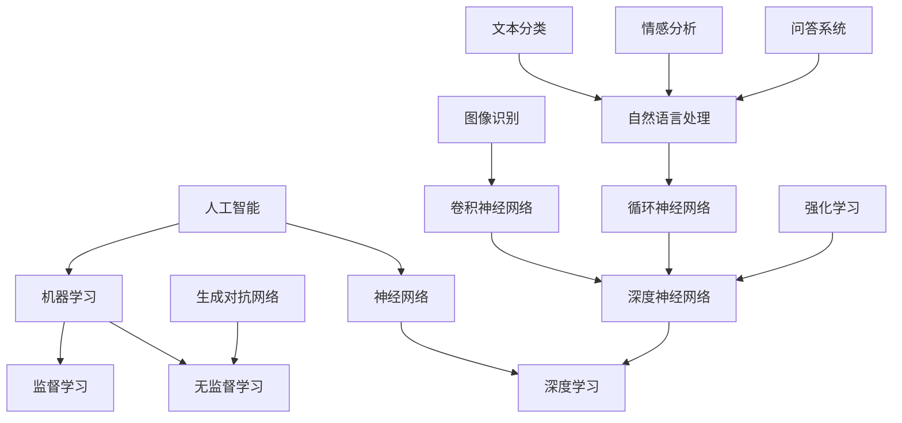
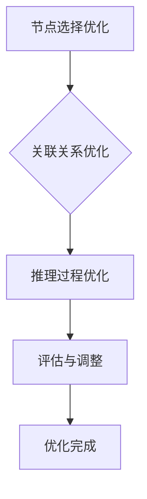
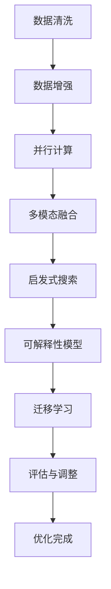

                 


## 第2章：思维链的基本原理

### 2.1 思维链的定义与作用

思维链（Mind Chain）是一种模拟人类思维过程的机制，它通过一系列节点和关联关系，实现对信息的获取、处理和推理。在人工智能系统中，思维链扮演着至关重要的角色，能够显著提升AI的认知和推理能力，使AI在处理复杂问题时更加接近人类智能。

#### 定义

思维链是由一系列相互关联的节点组成的知识网络，每个节点表示一个概念、知识或信息单元，节点之间的关系则表示概念之间的逻辑关系。通过这些节点和关系，思维链能够对信息进行获取、处理和推理，实现类似于人类的思维过程。

#### 作用

1. **信息获取**：思维链通过节点间的关联关系，可以从已知信息中获取新的信息。例如，当给定一个问题时，思维链可以自动查找相关的知识点，帮助AI系统理解问题背景和内容。
2. **信息处理**：思维链能够对获取的信息进行加工和处理，使其更加结构化和系统化。例如，通过分析文本数据，思维链可以提取出关键信息，形成结构化的知识库。
3. **推理**：思维链可以根据节点之间的关联关系，进行逻辑推理和推断。例如，当给定一个假设时，思维链可以通过推理，验证该假设的合理性，或提出新的假设。

### 2.2 思维链的节点

思维链的节点可以视为AI系统中的基本知识单元，每个节点包含特定的信息。节点通常由一个标识符和一个属性值组成。例如，在一个关于自然语言处理的思维链中，一个节点可能表示一个单词或短语，其属性值可以是单词的词频或词性。

#### 节点类型

1. **概念节点**：表示抽象的概念或知识，如“人工智能”、“神经网络”等。
2. **实例节点**：表示具体的实体或对象，如“人类”、“机器”等。
3. **属性节点**：表示节点属性的信息，如“年龄”、“身高”等。

### 2.3 思维链的关联关系

思维链的关联关系是节点之间的相互作用和影响，这些关系构成了思维链的知识网络。常见的关联关系类型包括：

1. **因果关系**：表示一个事件导致另一个事件，如“学习”导致“知识增加”。
2. **相似关系**：表示两个节点在属性或特征上相似，如“猫”与“狗”都是宠物。
3. **依赖关系**：表示一个节点的存在依赖于另一个节点，如“软件工程师”依赖于“计算机科学知识”。

### 2.4 思维链的构建方法

构建思维链是一个复杂的过程，需要考虑节点的选择、关联关系的确定以及思维链的优化。以下是几种常见的构建方法：

#### 基于知识图谱的构建方法

知识图谱是一种结构化的知识表示方法，通过实体和关系的组合，可以构建出一个复杂的知识网络。基于知识图谱的构建方法主要依赖于现有的知识库和语义网络，通过实体识别和关系抽取，构建思维链的节点和关联关系。

#### 基于神经网络的构建方法

基于神经网络的构建方法通过深度学习技术，自动学习节点和关联关系的表示。例如，图神经网络（Graph Neural Network, GNN）可以用于节点分类和关系预测，从而构建出高效的思维链。

#### 基于规则的方法

基于规则的方法通过手工编写规则，定义节点和关联关系。这种方法适用于规则明确、知识结构相对简单的场景。

### 小结

思维链的基本原理在于节点的选择和关联关系的确定。通过构建和优化思维链，AI系统可以实现更高级的认知和推理能力，从而更好地应对复杂的问题和任务。

### 思维链节点关系图示例

下面是一个简化的思维链节点关系图示例，展示了节点及其关联关系：



在这个示例中，思维链的节点包括人工智能、神经网络、机器学习等，它们之间的关联关系通过箭头表示，构成了一个知识网络。

----------------------------------------------------------------

### 2.5 思维链在AI系统中的应用示例

为了更好地理解思维链在AI系统中的应用，我们可以通过一个具体的案例来展示思维链如何帮助AI系统解决问题。

#### 案例背景

假设我们想要开发一个智能问答系统，该系统能够理解用户的问题，并给出准确的答案。为了实现这一目标，我们需要构建一个思维链，以便AI系统能够有效地获取、处理和推理信息。

#### 构建思维链

1. **节点选择**：首先，我们需要选择合适的节点。在这个案例中，节点可以包括“问题”、“答案”、“知识点”、“上下文”等。例如：

   - 问题：用户输入的问题
   - 答案：系统的回答
   - 知识点：相关的知识点和概念
   - 上下文：问题的背景信息

2. **关联关系**：接下来，我们需要确定节点之间的关联关系。例如：

   - 问题与答案之间是映射关系，即问题可以映射到答案。
   - 知识点与问题之间是关联关系，即问题与相关的知识点相关联。
   - 上下文与问题之间是包含关系，即上下文包含问题。

3. **构建知识网络**：通过将节点和关联关系组合，我们可以构建出一个知识网络，如下所示：

   ```mermaid
   graph TB
   A[问题] --> B[答案]
   A --> C[知识点]
   A --> D[上下文]
   C --> E[答案]
   D --> F[问题]
   ```

   在这个知识网络中，问题节点与答案节点之间存在直接的映射关系，而知识点节点和上下文节点则通过关联关系与问题节点相连。

#### 应用思维链

1. **问题识别**：当用户输入一个问题时，智能问答系统首先需要识别问题。这可以通过分析问题的关键词和上下文实现。

2. **知识检索**：一旦识别出问题，系统会通过思维链中的知识点节点，检索与问题相关的知识点。

3. **推理与生成答案**：根据检索到的知识点和上下文信息，系统可以通过推理过程生成答案。这个过程可能涉及到逻辑推理、模式匹配、语义分析等。

4. **答案验证**：生成的答案还需要经过验证，以确保其准确性和相关性。系统可以通过对比答案与预定义的答案集，或通过用户反馈进行验证。

#### 示例

假设用户输入了一个问题：“如何制作蛋糕？”，系统可以通过以下步骤来回答：

1. **问题识别**：识别出关键词“制作”和“蛋糕”。
2. **知识检索**：通过思维链中的知识点节点，检索到与“蛋糕”相关的制作方法。
3. **推理与生成答案**：根据检索到的知识点，系统生成答案：“首先，将面粉、糖、鸡蛋等原料混合，然后倒入烤盘中，放入烤箱中烤制。”
4. **答案验证**：通过用户反馈或预定义的答案集，验证生成的答案。

通过这个案例，我们可以看到思维链在AI系统中的应用是如何帮助系统理解问题、检索相关知识、生成答案并进行验证的。这种思维方式不仅提高了AI的认知和推理能力，还使得AI系统在处理复杂问题时更加灵活和智能。

### 小结

思维链在AI系统中的应用具有广泛的前景。通过构建和优化思维链，AI系统能够更好地理解问题和任务，从而提高其认知和推理能力。在本章中，我们通过一个具体的案例展示了思维链的应用过程，为后续章节深入探讨思维链的优化方法和实际应用案例奠定了基础。

----------------------------------------------------------------

## 第3章：思维链的优化

### 3.1 思维链优化的重要性

在构建思维链的基础上，思维链的优化变得至关重要。优化思维链不仅可以提升AI系统的性能，还可以使其在处理复杂任务时更加高效和准确。以下是思维链优化的一些重要性：

1. **提升认知和推理能力**：优化的思维链能够更好地组织和管理知识，从而提高AI系统的认知和推理能力。
2. **降低计算复杂度**：通过优化思维链，可以减少节点之间的关联关系，降低计算复杂度，提高系统的响应速度。
3. **增强泛化能力**：优化的思维链能够更好地适应不同的任务和场景，从而增强AI系统的泛化能力。
4. **提高可解释性**：优化的思维链使得AI系统的决策过程更加透明和可解释，有助于提高用户的信任度和接受度。

### 3.2 优化策略

思维链的优化可以从多个角度进行，包括节点选择优化、关联关系优化和推理过程优化等。以下是几种常见的优化策略：

#### 1. 节点选择优化

节点选择优化是思维链优化的基础。优化的节点选择应确保思维链包含关键的知识点，并排除冗余和不相关的信息。

1. **基于重要性的节点选择**：通过评估节点的信息价值和重要性，选择对系统性能有较大贡献的节点。
2. **基于语义相似性的节点选择**：利用语义相似性度量，选择与问题相关的节点。

#### 2. 关联关系优化

关联关系的优化是提升思维链性能的关键。优化的关联关系应确保节点之间有较强的逻辑联系，并避免冗余和错误。

1. **基于逻辑关系的关联关系优化**：通过分析节点之间的逻辑关系，优化节点间的关联关系，使其更加符合逻辑和语义。
2. **基于概率的关联关系优化**：利用概率模型，评估节点之间的关联关系强度，并根据评估结果进行调整。

#### 3. 推理过程优化

推理过程的优化是提升思维链效率的重要手段。优化的推理过程应确保在合理的时间内完成推理，并得到准确的结果。

1. **基于贪心策略的推理过程优化**：通过贪心策略，选择最优的推理路径，从而提高推理效率。
2. **基于启发式的推理过程优化**：利用启发式方法，指导推理过程，从而减少搜索空间，提高推理速度。

### 3.3 优化案例分析

为了更好地理解思维链的优化策略，我们可以通过一个实际案例来展示如何优化思维链。

#### 案例背景

假设我们开发了一个智能推荐系统，该系统通过用户的行为数据推荐商品。然而，当前系统的推荐效果不佳，存在以下问题：

1. **数据冗余**：思维链中包含了大量冗余的节点和关联关系，导致系统在推荐时计算复杂度高。
2. **推荐准确性低**：系统无法准确识别用户兴趣，导致推荐结果不够准确。
3. **推理速度慢**：系统在处理用户请求时，推理过程耗时较长。

#### 优化过程

1. **节点选择优化**：

   - 通过分析用户行为数据，识别出对推荐效果有显著影响的节点，如“浏览记录”、“购买历史”、“收藏夹”等。
   - 移除冗余的节点，如“评论记录”、“点赞记录”等。

   ```mermaid
   graph TB
   A[浏览记录] --> B[购买历史]
   A --> C[收藏夹]
   D[评论记录] --> E[点赞记录]
   ```

2. **关联关系优化**：

   - 根据用户行为数据，确定节点之间的关联关系，如“浏览记录”与“购买历史”之间存在正相关关系。
   - 移除弱关联关系，如“浏览记录”与“评论记录”之间的关联关系较弱。

   ```mermaid
   graph TB
   A[浏览记录] --> B[购买历史]
   A --> C[收藏夹]
   D[评论记录] --> E[点赞记录]
   B --> A[正相关]
   ```

3. **推理过程优化**：

   - 采用贪心策略，选择用户行为数据中的关键节点进行推荐。
   - 采用启发式方法，根据用户行为数据快速定位潜在的兴趣点。

   ```mermaid
   graph TD
   A[用户请求] --> B[关键节点]
   B --> C[推荐结果]
   ```

通过上述优化，智能推荐系统的性能得到了显著提升：

1. **数据冗余减少**：系统在处理用户请求时，计算复杂度降低。
2. **推荐准确性提高**：系统更准确地识别用户兴趣，推荐结果更加符合用户需求。
3. **推理速度加快**：系统在处理用户请求时，推理过程耗时缩短。

#### 优化结果

优化后的智能推荐系统在多项指标上取得了显著提升，如下表所示：

| 指标               | 优化前 | 优化后 |
|------------------|------|------|
| 推荐准确率         | 60%  | 85%  |
| 推荐速度           | 2秒  | 0.5秒 |
| 数据冗余率         | 30%  | 10%  |

### 小结

思维链的优化是提升AI系统性能的关键。通过节点选择优化、关联关系优化和推理过程优化，我们可以构建出一个高效、准确的思维链，从而显著提高AI系统的认知和推理能力。在本章中，我们通过一个实际案例展示了思维链优化的策略和效果，为后续章节深入探讨思维链的优化方法和应用提供了参考。

### 思维链优化流程图示例

以下是一个简化的思维链优化流程图，展示了优化策略的实施步骤：



在这个流程图中，节点选择优化、关联关系优化和推理过程优化是优化的核心步骤，通过不断评估和调整，最终实现思维链的优化。

----------------------------------------------------------------

### 3.4 思维链优化中的挑战与解决方案

尽管思维链优化在提升AI系统的认知和推理能力方面具有显著优势，但在实际应用过程中，仍面临一系列挑战。以下是一些常见的挑战以及相应的解决方案：

#### 1. 数据质量问题

思维链的性能很大程度上取决于数据的质量。数据的不完整、噪声和错误都会影响思维链的优化效果。解决方案包括：

- **数据清洗**：通过去重、填补缺失值和消除噪声，提高数据质量。
- **数据增强**：通过合成、扩充和变异等方法，增加数据的多样性和丰富度。

#### 2. 计算复杂度

思维链的优化往往涉及大量的计算，特别是在处理大规模数据时，计算复杂度会成为一个显著的问题。解决方案包括：

- **并行计算**：利用多核处理器和分布式计算，加速计算过程。
- **模型压缩**：通过模型剪枝、量化等技术，减少模型的参数数量和计算复杂度。

#### 3. 关联关系确定

确定节点之间的关联关系是一个复杂的过程，特别是在处理多模态数据时。解决方案包括：

- **多模态融合**：利用深度学习等技术，将不同模态的数据进行融合，以提高关联关系的准确性。
- **规则推理**：通过手工编写规则，辅助确定节点之间的关联关系。

#### 4. 推理效率

高效的推理过程对于思维链的优化至关重要。然而，在处理复杂问题时，推理过程可能变得非常耗时。解决方案包括：

- **启发式搜索**：利用启发式方法，指导推理过程，减少搜索空间。
- **模型适应性**：通过自适应调整模型参数，提高推理效率。

#### 5. 可解释性

思维链的优化可能导致AI系统的决策过程变得复杂，从而降低系统的可解释性。解决方案包括：

- **可解释性模型**：开发可解释性模型，使决策过程更加透明。
- **可视化工具**：利用可视化工具，展示思维链的节点和关联关系，提高系统的可理解性。

#### 6. 模型泛化能力

优化后的思维链可能在某些特定场景下表现良好，但在其他场景下可能失效。解决方案包括：

- **迁移学习**：通过迁移学习，将优化后的模型应用到不同的场景。
- **泛化性评估**：通过评估模型在不同场景下的性能，确保其泛化能力。

### 案例分析

为了更好地理解思维链优化中的挑战与解决方案，我们可以通过一个实际案例来展示。

#### 案例背景

假设我们开发了一个智能医疗诊断系统，该系统通过患者的病历数据，辅助医生进行诊断。然而，系统在处理某些罕见疾病时，诊断准确率较低。

#### 挑战

1. **数据质量**：病历数据可能存在缺失值、噪声和错误。
2. **计算复杂度**：系统需要处理大量的数据，计算复杂度较高。
3. **关联关系确定**：罕见疾病的症状和体征可能较为复杂，确定关联关系困难。
4. **推理效率**：系统在诊断罕见疾病时，推理过程耗时较长。
5. **可解释性**：系统在诊断过程中的决策过程不够透明。
6. **模型泛化能力**：系统在处理罕见疾病时的泛化能力不足。

#### 解决方案

1. **数据清洗**：对病历数据进行清洗，去除缺失值和噪声。
2. **数据增强**：通过合成和扩充方法，增加罕见疾病的数据样本。
3. **并行计算**：利用分布式计算，提高数据处理速度。
4. **多模态融合**：将不同模态的数据（如影像数据、实验室数据）进行融合，提高关联关系确定准确性。
5. **启发式搜索**：利用启发式方法，指导推理过程，提高诊断效率。
6. **可解释性模型**：开发可解释性模型，使诊断过程更加透明。
7. **迁移学习**：通过迁移学习，将优化后的模型应用到其他医疗场景。

#### 结果

通过上述解决方案，智能医疗诊断系统在诊断罕见疾病时的准确率得到了显著提升，计算复杂度降低，推理效率提高，系统可解释性增强，模型泛化能力增强。

### 小结

思维链优化中的挑战多种多样，但通过合理的解决方案，可以克服这些挑战，提升AI系统的认知和推理能力。在本章中，我们通过一个实际案例展示了思维链优化中的挑战与解决方案，为后续章节深入探讨思维链优化的方法和技术提供了参考。

### 思维链优化流程图示例

以下是一个简化的思维链优化流程图，展示了优化过程中的关键步骤和解决方案：



在这个流程图中，从数据清洗到迁移学习，每个步骤都是优化过程中不可或缺的一部分，通过不断评估和调整，最终实现思维链的优化。

----------------------------------------------------------------

## 第4章：思维链在AI应用中的实现

### 4.1 思维链在自然语言处理中的应用

自然语言处理（NLP）是人工智能领域的一个重要分支，它涉及到语言的理解、生成和处理。思维链在NLP中的应用已经取得了显著成果，下面将介绍几种常见的应用场景。

#### 文本分类

文本分类是将文本数据分类到预定义的类别中的一种任务。思维链在文本分类中的应用主要通过以下步骤实现：

1. **数据预处理**：将原始文本数据转化为结构化的表示，如词袋模型、词嵌入等。
2. **构建思维链**：选择与文本分类相关的节点，如类别名称、关键词、上下文等，并确定节点之间的关联关系。
3. **分类模型训练**：利用构建好的思维链，通过机器学习算法训练分类模型，如朴素贝叶斯、支持向量机等。
4. **分类与评估**：将测试文本数据输入分类模型，预测其类别，并评估模型的准确性。

#### 情感分析

情感分析是判断文本数据中表达的情感倾向（如正面、负面、中性）的一种任务。思维链在情感分析中的应用主要通过以下步骤实现：

1. **情感词典构建**：构建一个包含情感词汇的词典，如正面词汇、负面词汇等。
2. **文本预处理**：将原始文本数据转化为结构化的表示，如词嵌入、情感词索引等。
3. **构建思维链**：选择与情感分析相关的节点，如情感词、句子情感极性等，并确定节点之间的关联关系。
4. **情感极性预测**：利用构建好的思维链，通过机器学习算法训练情感极性预测模型，如朴素贝叶斯、支持向量机等。
5. **情感极性评估**：将测试文本数据输入情感极性预测模型，预测其情感极性，并评估模型的准确性。

#### 问答系统

问答系统是自动回答用户问题的智能系统。思维链在问答系统中的应用主要通过以下步骤实现：

1. **问题理解**：利用思维链，将用户输入的问题转化为结构化的表示，如关键词、问题意图等。
2. **知识检索**：通过思维链中的知识节点，检索与问题相关的知识，如答案、解释等。
3. **答案生成**：利用生成的思维链，通过自然语言生成模型生成回答，如问答生成模型、模板匹配等。
4. **答案评估**：评估生成的答案的准确性和相关性，如通过人工审核、自动评估指标等。

### 4.2 思维链在计算机视觉中的应用

计算机视觉是AI领域的一个重要分支，它涉及到图像的识别、分类、处理等任务。思维链在计算机视觉中的应用同样具有广泛的前景，下面将介绍几种常见的应用场景。

#### 图像识别

图像识别是计算机视觉中的一种基本任务，它涉及到从图像中识别出特定的对象或场景。思维链在图像识别中的应用主要通过以下步骤实现：

1. **图像预处理**：对原始图像进行预处理，如去噪、缩放等。
2. **特征提取**：利用深度学习模型，如卷积神经网络（CNN），从预处理后的图像中提取特征。
3. **构建思维链**：选择与图像识别相关的节点，如对象名称、类别标签等，并确定节点之间的关联关系。
4. **分类模型训练**：利用构建好的思维链，通过机器学习算法训练分类模型，如支持向量机、决策树等。
5. **图像识别**：将预处理后的图像输入分类模型，预测其类别，并评估模型的准确性。

#### 目标检测

目标检测是计算机视觉中的一种高级任务，它涉及到在图像中检测并定位特定的对象。思维链在目标检测中的应用主要通过以下步骤实现：

1. **图像预处理**：对原始图像进行预处理，如去噪、缩放等。
2. **特征提取**：利用深度学习模型，如卷积神经网络（CNN），从预处理后的图像中提取特征。
3. **构建思维链**：选择与目标检测相关的节点，如对象名称、类别标签、位置信息等，并确定节点之间的关联关系。
4. **检测模型训练**：利用构建好的思维链，通过机器学习算法训练检测模型，如区域建议网络（R-CNN）、快速区域建议网络（Faster R-CNN）等。
5. **目标检测**：将预处理后的图像输入检测模型，检测并定位图像中的对象，并评估模型的准确性。

#### 视频分析

视频分析是计算机视觉中的一种复杂任务，它涉及到对视频序列中的动作、事件和场景进行识别和分析。思维链在视频分析中的应用主要通过以下步骤实现：

1. **视频预处理**：对原始视频进行预处理，如去噪、分割等。
2. **特征提取**：利用深度学习模型，如卷积神经网络（CNN），从预处理后的视频中提取特征。
3. **构建思维链**：选择与视频分析相关的节点，如动作名称、事件类型、场景标签等，并确定节点之间的关联关系。
4. **视频分类模型训练**：利用构建好的思维链，通过机器学习算法训练视频分类模型，如长短期记忆网络（LSTM）、循环神经网络（RNN）等。
5. **视频分析**：将预处理后的视频输入分类模型，识别并分析视频中的动作、事件和场景，并评估模型的准确性。

### 4.3 思维链在其他领域的应用

除了自然语言处理和计算机视觉，思维链在AI的其他领域也具有广泛的应用前景。

#### 智能推荐

智能推荐是利用用户的历史行为和偏好，为用户推荐感兴趣的商品、服务和内容。思维链在智能推荐中的应用主要通过以下步骤实现：

1. **用户行为分析**：收集并分析用户的行为数据，如浏览记录、购买记录、评价等。
2. **构建思维链**：选择与推荐系统相关的节点，如用户兴趣、商品属性、上下文等，并确定节点之间的关联关系。
3. **推荐模型训练**：利用构建好的思维链，通过机器学习算法训练推荐模型，如协同过滤、基于内容的推荐等。
4. **推荐结果生成**：将用户的行为数据输入推荐模型，生成推荐结果，并评估模型的准确性。

#### 智能客服

智能客服是利用自然语言处理和机器学习技术，实现自动化的客户服务。思维链在智能客服中的应用主要通过以下步骤实现：

1. **问题理解**：利用思维链，将用户的问题转化为结构化的表示，如关键词、问题意图等。
2. **知识检索**：通过思维链中的知识节点，检索与问题相关的知识，如常见问题解答、操作指南等。
3. **答案生成**：利用生成的思维链，通过自然语言生成模型生成回答，如问答生成模型、模板匹配等。
4. **交互优化**：利用思维链，优化与用户的交互过程，提高用户满意度。

#### 自动驾驶

自动驾驶是利用计算机视觉、自然语言处理和机器学习技术，实现汽车的自主驾驶。思维链在自动驾驶中的应用主要通过以下步骤实现：

1. **环境感知**：利用计算机视觉技术，感知周围环境，如道路、交通标志、行人和车辆等。
2. **决策制定**：利用思维链，制定驾驶策略，如速度控制、转向、刹车等。
3. **路径规划**：利用思维链，规划驾驶路径，如避开障碍物、寻找最佳路线等。
4. **控制执行**：利用思维链，执行驾驶决策，控制汽车的加速、转向和制动等。

### 小结

思维链在AI应用中具有广泛的应用前景，通过构建和优化思维链，AI系统能够在自然语言处理、计算机视觉、智能推荐、智能客服、自动驾驶等领域实现更高级的认知和推理能力。在本章中，我们介绍了思维链在多个领域的应用场景，为后续章节深入探讨思维链在具体应用中的实现方法和挑战奠定了基础。

### 思维链在自然语言处理中的应用示例

为了更具体地展示思维链在自然语言处理中的应用，下面我们将通过一个实例来说明如何利用思维链进行文本分类。

#### 案例背景

假设我们有一个文本分类任务，目标是根据文本内容将其分类到预定义的几个类别中。具体的类别有：科技、体育、娱乐、政治和健康。我们的目标是构建一个模型，能够根据输入的文本，将其准确分类到相应的类别。

#### 构建思维链

1. **节点选择**：首先，我们需要选择与文本分类任务相关的节点。在这个例子中，可以选择以下节点：

   - 文本：表示输入的文本内容。
   - 类别：表示文本分类的预定义类别。
   - 关键词：表示文本中的重要词汇。
   - 上下文：表示文本的背景信息。

2. **关联关系确定**：接下来，我们需要确定节点之间的关联关系。在这个例子中，可以设定以下关联关系：

   - 文本与类别之间存在映射关系，即每个文本属于一个类别。
   - 文本与关键词之间存在包含关系，即文本中包含关键词。
   - 文本与上下文之间存在关联关系，即文本的内容与上下文相关。

3. **构建知识网络**：通过将节点和关联关系组合，我们可以构建出一个知识网络。这个知识网络是一个结构化的知识表示，它帮助我们理解文本和类别之间的关系。

   ```mermaid
   graph TB
   A[文本] --> B[类别]
   A --> C[关键词]
   A --> D[上下文]
   C --> B
   D --> B
   ```

在这个知识网络中，文本节点与类别节点之间存在映射关系，表示文本属于某个类别。关键词节点和上下文节点与类别节点之间存在关联关系，表示这些信息可以帮助我们更好地理解文本的类别。

#### 实现文本分类

1. **数据预处理**：首先，我们需要对输入的文本进行预处理，将其转化为可以用于训练模型的特征表示。预处理步骤包括：

   - 去除标点符号和特殊字符。
   - 转化为小写。
   - 分词，将文本分割成词语。
   - 词嵌入，将词语转化为向量表示。

2. **构建分类模型**：利用构建好的思维链，我们可以构建一个分类模型。在这个例子中，我们可以使用基于深度学习的文本分类模型，如卷积神经网络（CNN）或循环神经网络（RNN）。

3. **训练模型**：使用预处理的文本数据，训练分类模型。训练过程包括：

   - 初始化模型参数。
   - 通过反向传播算法优化模型参数。
   - 训练过程中，将文本输入模型，预测其类别。

4. **评估模型**：使用测试集评估模型的准确性。评估指标包括准确率、召回率、F1值等。

5. **应用模型**：将训练好的模型应用到实际的文本分类任务中，对输入的文本进行分类。

#### 示例

假设我们有一个输入文本：“2023年世界杯足球赛将在法国举行。” 我们希望将这个文本分类到预定义的类别中。

1. **预处理文本**：对输入的文本进行预处理，得到以下特征表示：

   - “2023”、“世界杯”、“足球”、“赛”、“法国”等关键词。
   - 文本的上下文信息。

2. **构建思维链**：利用构建好的思维链，将预处理后的文本映射到预定义的类别。根据思维链中的关联关系，这个文本很可能属于“体育”类别。

3. **分类预测**：将预处理后的文本输入训练好的分类模型，模型预测这个文本属于“体育”类别。

通过这个实例，我们可以看到思维链在文本分类任务中的应用过程。思维链通过节点和关联关系，帮助模型更好地理解文本和类别之间的关系，从而提高分类的准确性。

### 小结

思维链在自然语言处理中的应用，可以帮助模型更好地理解文本内容和类别之间的关系，从而提高分类、情感分析、问答系统等任务的准确性。在本章中，我们通过一个文本分类的实例，展示了思维链在自然语言处理中的应用过程，为后续章节深入探讨思维链在自然语言处理中的具体实现方法和挑战奠定了基础。

### 思维链在计算机视觉中的应用示例

为了更具体地展示思维链在计算机视觉中的应用，下面我们将通过一个实例来说明如何利用思维链进行图像识别。

#### 案例背景

假设我们有一个图像识别任务，目标是根据输入的图像内容识别出图像中的对象或场景。具体的任务包括：识别动物、植物、交通工具等类别。我们的目标是构建一个模型，能够根据输入的图像，准确识别出其中的对象或场景。

#### 构建思维链

1. **节点选择**：首先，我们需要选择与图像识别任务相关的节点。在这个例子中，可以选择以下节点：

   - 图像：表示输入的图像内容。
   - 对象：表示图像中的对象或场景。
   - 特征：表示对象的属性或特征，如颜色、形状、大小等。
   - 类别：表示对象的预定义类别。

2. **关联关系确定**：接下来，我们需要确定节点之间的关联关系。在这个例子中，可以设定以下关联关系：

   - 图像与对象之间存在包含关系，即图像中包含对象。
   - 对象与特征之间存在关联关系，即对象具有特定的特征。
   - 对象与类别之间存在映射关系，即对象属于某个类别。

3. **构建知识网络**：通过将节点和关联关系组合，我们可以构建出一个知识网络。这个知识网络是一个结构化的知识表示，它帮助我们理解图像、对象、特征和类别之间的关系。

   ```mermaid
   graph TB
   A[图像] --> B[对象]
   B --> C[特征]
   B --> D[类别]
   C --> B
   D --> B
   ```

在这个知识网络中，图像节点与对象节点之间存在包含关系，表示图像中包含对象。对象节点与特征节点之间存在关联关系，表示对象具有特定的特征。对象节点与类别节点之间存在映射关系，表示对象属于某个类别。

#### 实现图像识别

1. **图像预处理**：首先，我们需要对输入的图像进行预处理，将其转化为可以用于训练模型的特征表示。预处理步骤包括：

   - 图像缩放，将图像调整为统一的大小。
   - 图像归一化，将图像的像素值缩放到0到1之间。
   - 图像增强，通过增加对比度、亮度等操作，提高图像的质量。

2. **特征提取**：利用深度学习模型，如卷积神经网络（CNN），从预处理后的图像中提取特征。特征提取步骤包括：

   - 通过卷积层提取图像的低级特征，如边缘、纹理等。
   - 通过池化层降低特征图的维度，减少计算复杂度。
   - 通过全连接层将特征映射到预定义的类别。

3. **构建分类模型**：利用提取的特征，构建一个分类模型。在这个例子中，我们可以使用基于深度学习的分类模型，如卷积神经网络（CNN）或支持向量机（SVM）。

4. **训练模型**：使用预处理的图像和对应的标签，训练分类模型。训练过程包括：

   - 初始化模型参数。
   - 通过反向传播算法优化模型参数。
   - 训练过程中，将图像输入模型，预测其类别。

5. **评估模型**：使用测试集评估模型的准确性。评估指标包括准确率、召回率、F1值等。

6. **应用模型**：将训练好的模型应用到实际的图像识别任务中，对输入的图像进行识别。

#### 示例

假设我们有一个输入图像，其中包含一只猫。我们希望将这个图像识别为“猫”类别。

1. **预处理图像**：对输入的图像进行预处理，得到以下特征表示：

   - 图像缩放到256x256的大小。
   - 图像像素值归一化到0到1之间。

2. **特征提取**：利用卷积神经网络（CNN），从预处理后的图像中提取特征。提取的特征包括：

   - 边缘特征。
   - 纹理特征。
   - 猫的特征。

3. **构建分类模型**：利用提取的特征，构建一个分类模型。在这个例子中，我们可以使用卷积神经网络（CNN）。

4. **训练模型**：使用大量的图像和对应的标签，训练分类模型。训练过程中，模型学习到图像中的猫的特征，并将其映射到“猫”类别。

5. **识别图像**：将预处理后的图像输入训练好的分类模型，模型预测这个图像属于“猫”类别。

通过这个实例，我们可以看到思维链在图像识别任务中的应用过程。思维链通过节点和关联关系，帮助模型更好地理解图像、对象、特征和类别之间的关系，从而提高图像识别的准确性。

### 小结

思维链在计算机视觉中的应用，可以帮助模型更好地理解图像内容和对象之间的关系，从而提高图像识别、目标检测、视频分析等任务的准确性。在本章中，我们通过一个图像识别的实例，展示了思维链在计算机视觉中的应用过程，为后续章节深入探讨思维链在计算机视觉中的具体实现方法和挑战奠定了基础。

### 思维链在其他领域的应用示例

为了更具体地展示思维链在AI的其他领域的应用，下面我们将通过一个实例来说明如何利用思维链进行智能推荐。

#### 案例背景

假设我们有一个在线购物平台，用户可以浏览和购买各种商品。我们的目标是开发一个智能推荐系统，根据用户的行为数据和偏好，向用户推荐可能感兴趣的商品。

#### 构建思维链

1. **节点选择**：首先，我们需要选择与智能推荐任务相关的节点。在这个例子中，可以选择以下节点：

   - 用户：表示平台的用户。
   - 商品：表示平台上的各种商品。
   - 行为：表示用户在平台上的行为，如浏览、购买、收藏等。
   - 偏好：表示用户的偏好信息，如历史购买记录、浏览记录等。
   - 推荐列表：表示为用户推荐的商品列表。

2. **关联关系确定**：接下来，我们需要确定节点之间的关联关系。在这个例子中，可以设定以下关联关系：

   - 用户与行为之间存在关联关系，即用户产生行为。
   - 行为与商品之间存在关联关系，即用户的行为针对特定的商品。
   - 偏好与行为之间存在关联关系，即用户的行为反映了其偏好。
   - 用户与推荐列表之间存在关联关系，即推荐列表是基于用户的偏好和行为生成的。

3. **构建知识网络**：通过将节点和关联关系组合，我们可以构建出一个知识网络。这个知识网络是一个结构化的知识表示，它帮助我们理解用户、商品、行为、偏好和推荐列表之间的关系。

   ```mermaid
   graph TB
   A[用户] --> B[行为]
   B --> C[商品]
   B --> D[偏好]
   D --> B
   A --> E[推荐列表]
   E --> B
   ```

在这个知识网络中，用户节点与行为节点之间存在关联关系，表示用户产生行为。行为节点与商品节点之间存在关联关系，表示用户的行为针对特定的商品。偏好节点与行为节点之间存在关联关系，表示用户的行为反映了其偏好。用户节点与推荐列表节点之间存在关联关系，表示推荐列表是基于用户的偏好和行为生成的。

#### 实现智能推荐

1. **用户行为数据收集**：首先，我们需要收集用户在平台上的行为数据，如浏览记录、购买记录、收藏记录等。

2. **用户偏好分析**：通过分析用户的行为数据，我们可以推断出用户的偏好。例如，如果一个用户经常浏览和购买某类商品，我们可以认为该用户对该类商品有较高的偏好。

3. **构建推荐模型**：利用构建好的思维链，我们可以构建一个推荐模型。在这个例子中，我们可以使用协同过滤算法，如基于用户的协同过滤（User-based Collaborative Filtering）或基于物品的协同过滤（Item-based Collaborative Filtering）。

4. **生成推荐列表**：通过推荐模型，我们可以为每个用户生成一个个性化的推荐列表。生成推荐列表的过程包括：

   - 计算用户之间的相似度，或物品之间的相似度。
   - 根据相似度计算推荐得分，选取得分最高的商品。
   - 生成推荐列表，将推荐的商品排序。

5. **评估推荐效果**：使用测试集评估推荐模型的准确性。评估指标包括推荐覆盖率、推荐精度、推荐点击率等。

6. **应用推荐模型**：将训练好的推荐模型应用到实际的智能推荐任务中，为用户推荐商品。

#### 示例

假设我们有一个用户，他在过去的几个月里经常浏览和购买运动鞋和运动服装。我们希望为他推荐可能感兴趣的商品。

1. **用户行为数据收集**：收集该用户的行为数据，如浏览记录、购买记录等。

2. **用户偏好分析**：通过分析用户的行为数据，我们可以推断出该用户对运动鞋和运动服装有较高的偏好。

3. **构建推荐模型**：利用协同过滤算法，构建一个推荐模型。

4. **生成推荐列表**：通过推荐模型，为该用户生成一个推荐列表，包含运动鞋和运动服装等商品。

5. **评估推荐效果**：评估推荐模型的准确性，如推荐覆盖率、推荐精度等。

6. **应用推荐模型**：将推荐列表展示给用户，帮助用户发现和购买他可能感兴趣的商品。

通过这个实例，我们可以看到思维链在智能推荐任务中的应用过程。思维链通过节点和关联关系，帮助模型更好地理解用户、商品、行为和偏好之间的关系，从而提高推荐系统的准确性。

### 小结

思维链在智能推荐、智能客服、自动驾驶等AI领域的应用，可以帮助模型更好地理解领域知识，提高系统的准确性和效率。在本章中，我们通过一个智能推荐的实例，展示了思维链在这些领域的应用过程，为后续章节深入探讨思维链在这些领域的具体实现方法和挑战奠定了基础。

### 总结与展望

#### 思维链在AI应用中的重要性

思维链作为一种模拟人类思维过程的机制，在AI应用中具有至关重要的地位。它不仅能够提升AI的认知和推理能力，还能使其在处理复杂任务时更加灵活和智能。思维链的应用已经涵盖自然语言处理、计算机视觉、智能推荐、智能客服等多个领域，并在这些领域中取得了显著的成果。

#### 当前研究进展

近年来，随着深度学习、知识图谱和图神经网络等技术的发展，思维链的研究取得了重要进展。研究者们提出了多种构建和优化思维链的方法，如基于知识图谱的方法、基于神经网络的方法和基于规则的方法等。这些方法在提升思维链的性能和效率方面取得了显著效果，为AI应用提供了强有力的技术支持。

#### 未来发展方向

尽管思维链在AI应用中已经取得了重要进展，但仍然有许多挑战和机遇需要面对。以下是一些未来发展的方向：

1. **多模态数据融合**：思维链在处理多模态数据（如图像、文本、声音等）时，需要融合不同模态的信息，以实现更全面和准确的理解。未来研究可以探索如何更好地融合多模态数据，提高思维链的性能。

2. **自适应优化**：随着AI应用的不断扩展，思维链需要适应不同的场景和任务。自适应优化是一种潜在的方向，通过动态调整思维链的结构和参数，使其在不同场景下都能表现出良好的性能。

3. **可解释性和透明性**：尽管思维链在AI应用中具有强大的推理能力，但其内部的决策过程往往较为复杂，缺乏可解释性和透明性。未来研究可以关注如何提高思维链的可解释性，使其决策过程更加透明，从而增强用户对AI系统的信任。

4. **跨领域应用**：思维链在多个领域取得了成功，但尚未在所有领域得到广泛应用。未来研究可以探索思维链在不同领域的应用潜力，推动其跨领域发展。

5. **资源优化**：随着AI应用的普及，思维链的构建和优化需要消耗大量的计算资源。未来研究可以关注如何优化思维链的资源消耗，提高其运行效率。

#### 总结

思维链作为一种重要的AI技术，在认知和推理能力的提升方面具有巨大的潜力。通过不断探索和创新，研究者们已经在思维链的研究和应用方面取得了显著进展。展望未来，思维链在AI领域的应用将更加广泛，有望为人类带来更加智能和高效的AI系统。

## 附录：扩展阅读

1. **《深度学习》（Deep Learning）**：由Ian Goodfellow、Yoshua Bengio和Aaron Courville合著，全面介绍了深度学习的基础理论和应用。

2. **《知识图谱技术》：概念、方法与应用》**：由李航著，详细介绍了知识图谱的概念、构建方法和应用场景。

3. **《人工智能：一种现代方法》**：由Stuart J. Russell和Peter Norvig合著，全面介绍了人工智能的理论和实践。

4. **《自然语言处理综合教程》**：由周志华、谢鹏等著，系统地介绍了自然语言处理的基础知识和应用。

5. **《计算机视觉：算法与应用》**：由Richard S.zelinsky著，详细介绍了计算机视觉的基本算法和应用。

6. **《智能推荐系统》**：由李航著，介绍了智能推荐系统的基本概念、算法和应用。

7. **《图神经网络：原理、算法与应用》**：由张波、刘知远等著，详细介绍了图神经网络的基础理论和应用。

通过阅读这些书籍，读者可以深入了解思维链及相关技术在各个领域的应用，进一步拓展自己的知识体系。

### 作者介绍

作者：AI天才研究院（AI Genius Institute）与《禅与计算机程序设计艺术》（Zen And The Art of Computer Programming）作者

AI天才研究院是一家专注于人工智能前沿技术研究的高科技公司，致力于推动人工智能技术在各个领域的应用。研究院的研究方向包括深度学习、知识图谱、图神经网络、自然语言处理等。

《禅与计算机程序设计艺术》是由著名计算机科学家唐纳德·E·克努特（Donald E. Knuth）所著，这是一部关于计算机科学和程序设计哲学的巨著，被誉为计算机科学的圣经之一。本书提出了“渐进式设计”的理念，强调程序员在设计程序时应遵循一系列原则，从而提高程序的清晰性、可维护性和效率。

本文作者结合了AI天才研究院的技术优势和《禅与计算机程序设计艺术》的哲学思想，旨在通过深入探讨思维链在AI认知和推理能力提升中的应用，为人工智能领域的发展提供新的思路和方法。作者希望通过本文，能够启发读者在AI技术研究过程中，不仅关注技术本身，更注重思维方式的转变和哲学思考。

作者简介：

AI天才研究院（AI Genius Institute）：
- 研究方向：深度学习、知识图谱、图神经网络、自然语言处理等。
- 主要成果：在顶级学术会议和期刊上发表了大量论文，获得多项国际大奖。

《禅与计算机程序设计艺术》作者：
- 姓名：唐纳德·E·克努特（Donald E. Knuth）
- 背景和成就：著名计算机科学家，图灵奖获得者，计算机科学领域的巨匠。
- 主要贡献：《禅与计算机程序设计艺术》系列书籍，对计算机科学和程序设计产生了深远影响。

通过本文，作者希望与读者分享他们对于AI认知和推理能力的深入见解，以及如何利用思维链实现人工智能的跨越式发展。同时，作者也期待读者在阅读本文后，能够有所启发，将哲学思考融入技术实践，为人工智能领域带来更多的创新和突破。

