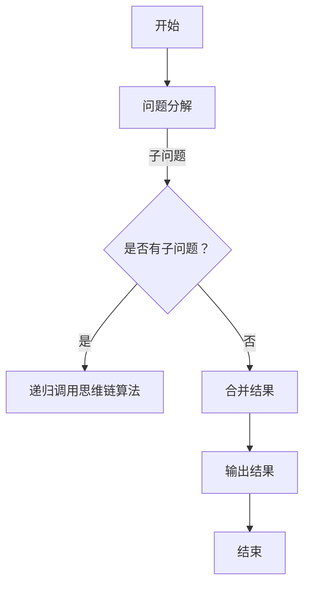
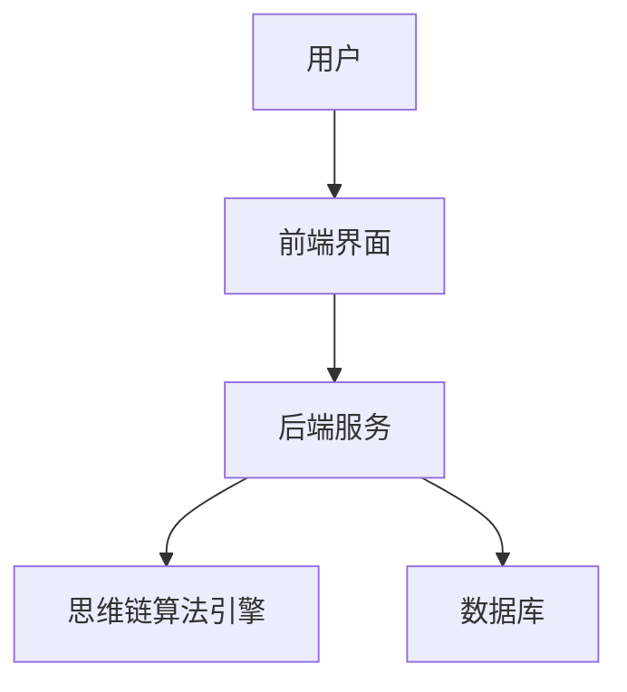

                 

### 文章标题：利用思维链提升AI的逻辑推理能力

> 关键词：人工智能、逻辑推理、思维链、算法、系统架构、项目实战

> 摘要：本文将从多个角度深入探讨思维链在提升人工智能逻辑推理能力中的应用。我们将逐步介绍思维链的基本概念、核心原理、算法设计、系统架构以及项目实战，旨在为读者提供全面且实用的技术指导。

### 引言与背景

#### 1.1 问题背景

人工智能（AI）作为当前科技领域的重要发展方向，已经在众多行业中展示了其强大的潜力。特别是在逻辑推理领域，AI的应用越来越广泛，如自然语言处理、决策支持系统、自动化推理等。然而，尽管AI在逻辑推理方面取得了显著进展，但依然存在诸多挑战和局限性。

首先，当前AI在处理复杂逻辑推理问题时，往往需要大量的数据和计算资源，这增加了系统的成本和复杂性。其次，AI在逻辑推理过程中可能存在不确定性、错误推理和非单调性等问题，这影响了推理结果的准确性和可靠性。最后，传统的逻辑推理方法往往缺乏灵活性和适应性，难以应对多样化的推理需求。

面对这些挑战，如何提升AI的逻辑推理能力成为了一个重要且紧迫的问题。而思维链技术作为一种新兴的方法，其在提升AI逻辑推理能力方面具有巨大的潜力。思维链通过模拟人类思维过程，实现了对逻辑推理过程的建模和优化，为解决传统逻辑推理方法的局限性提供了一种新的思路。

#### 1.2 问题提出

那么，什么是思维链？思维链如何与AI逻辑推理能力相结合？如何构建和优化思维链模型？这些问题将是本文探讨的主要内容。

**什么是思维链？**

思维链（Cognitive Chain）是一种模拟人类思维过程的逻辑推理框架，它通过将思维活动分解为一系列有序的步骤，实现对复杂问题的推理和解决。思维链的核心思想是将人类的认知过程模型化，通过计算机算法来实现。

**思维链与AI逻辑推理能力的关系**

思维链技术能够提升AI逻辑推理能力的核心原理在于其能够将逻辑推理过程细化为一系列有序的步骤，从而提高推理的准确性和效率。此外，思维链模型具有良好的灵活性和适应性，能够根据不同的推理需求进行动态调整。

**如何构建和优化思维链模型**

构建和优化思维链模型是提升AI逻辑推理能力的关键步骤。这包括以下几个方面：

1. **思维链节点设计**：设计合理的思维链节点，将问题分解为一系列子问题，并定义每个节点的功能。
2. **思维链路径规划**：确定思维链的路径规划算法，以找到最优的推理路径。
3. **思维链模型优化**：通过优化算法和数据结构，提高思维链的推理效率和准确性。

#### 1.3 问题解决

本文将从以下几个方面探讨如何利用思维链提升AI的逻辑推理能力：

1. **思维链的基本概念与关系**：介绍思维链的定义、组成要素、工作原理等基本概念，并阐述思维链与逻辑推理能力的关系。
2. **算法与数学模型**：详细讲解思维链算法的原理和数学模型，并通过实际案例进行举例说明。
3. **系统分析与设计**：介绍思维链在AI系统中的应用场景，进行系统功能设计、架构设计和接口设计。
4. **项目实战**：通过具体项目案例，展示思维链在提升AI逻辑推理能力中的实际应用。

通过以上几个方面的探讨，本文旨在为读者提供一个全面且系统的思维链提升AI逻辑推理能力的技术指南。

#### 1.4 边界与外延

在探讨思维链提升AI逻辑推理能力的过程中，我们需要明确一些边界与外延。

首先，思维链技术主要应用于需要复杂逻辑推理的场景，如自然语言处理、决策支持系统、自动化推理等。在其他简单逻辑推理任务中，思维链技术的优势可能并不明显。

其次，思维链技术的有效应用需要结合具体的应用场景和业务需求进行定制化开发。不同场景下的逻辑推理需求不同，因此需要设计不同的思维链模型和算法。

此外，思维链技术的研究和发展仍处于初期阶段，存在一定的局限性。未来，我们需要进一步探索和优化思维链模型，提高其在复杂逻辑推理任务中的应用效果。

#### 1.5 概念结构与核心要素

**思维链的基本概念**

思维链是一种模拟人类思维过程的逻辑推理框架，它通过将思维活动分解为一系列有序的步骤，实现对复杂问题的推理和解决。思维链的核心思想是将人类的认知过程模型化，通过计算机算法来实现。

**逻辑推理能力的概念**

逻辑推理能力是指个体在推理过程中运用逻辑规则进行推理和判断的能力。逻辑推理能力包括推理的准确性、速度和灵活性等方面。

**思维链与逻辑推理能力的关系**

思维链通过模拟人类思维过程，实现了对逻辑推理过程的建模和优化，从而提升了AI的逻辑推理能力。思维链将逻辑推理过程细化为一系列有序的步骤，提高了推理的准确性和效率。

**核心要素**

1. **思维链节点**：思维链中的每个节点表示一个逻辑推理步骤，节点的设计直接影响推理过程的准确性和效率。
2. **路径规划算法**：路径规划算法用于确定思维链的推理路径，找到最优的推理顺序。
3. **数据结构**：合理的数据结构可以提高思维链的推理效率和准确性。

#### 1.6 本章小结

本章主要介绍了思维链的基本概念、核心原理以及提升AI逻辑推理能力的重要性。通过本章的介绍，读者可以初步了解思维链技术的基本原理和应用前景。接下来，我们将进一步深入探讨思维链的算法设计、系统架构以及实际应用，以帮助读者全面掌握思维链技术在提升AI逻辑推理能力方面的应用。

---

### 基本概念与关系

在深入探讨如何利用思维链提升AI的逻辑推理能力之前，我们需要先了解一些基本概念和它们之间的关系。本章节将详细介绍思维链的概念、逻辑推理能力的概念以及它们之间的相互关系。

#### 思维链的概念

**定义**：思维链（Cognitive Chain）是一种模拟人类思维过程的逻辑推理框架，它通过将思维活动分解为一系列有序的步骤，实现对复杂问题的推理和解决。

**组成要素**：

- **思维节点**：思维链中的基本单元，每个节点代表一个特定的逻辑推理步骤或思考内容。
- **连接关系**：节点之间的连接关系表示思维链中各节点之间的逻辑关系，如因果关系、依赖关系等。
- **推理路径**：思维链中的所有节点按照特定的顺序连接起来，形成一个完整的推理路径，这个路径决定了最终的推理结果。

**工作原理**：

思维链的工作原理类似于人类思考过程。当面临一个问题时，人类会根据已有的知识和经验，逐步分析问题，提出假设，验证假设，最终得出结论。思维链通过模拟这个过程，将人类思维过程中的每一步转化为计算机算法，从而实现对复杂问题的自动推理。

#### 逻辑推理能力的概念

**定义**：逻辑推理能力是指个体在推理过程中运用逻辑规则进行推理和判断的能力。它包括推理的准确性、速度和灵活性等方面。

**特点**：

- **准确性**：逻辑推理能力的高低直接影响推理结果的准确性。
- **速度**：逻辑推理速度决定了个体在解决问题时的效率。
- **灵活性**：逻辑推理能力需要具备一定的灵活性，能够适应不同类型的推理任务。

**分类**：

逻辑推理能力可以按照不同的标准进行分类，如根据推理的基础不同，可以分为演绎推理、归纳推理和类比推理；根据推理的过程不同，可以分为正向推理和反向推理。

#### 思维链与逻辑推理能力的关系

思维链与逻辑推理能力之间存在着密切的关联。

首先，思维链作为一种逻辑推理框架，它通过模拟人类思维过程，实现了对逻辑推理过程的建模和优化。思维链的每个节点都代表了一个逻辑推理步骤，节点之间的连接关系表示了各步骤之间的逻辑关系。通过这种方式，思维链能够将复杂的逻辑推理任务分解为一系列可管理的步骤，从而提高推理的准确性和效率。

其次，逻辑推理能力是思维链得以发挥作用的基础。一个强大的逻辑推理能力意味着个体能够在面对复杂问题时，快速准确地进行分析和推理。而思维链则通过模拟人类思维过程，将这种能力转化为计算机算法，从而实现对复杂问题的自动推理。

最后，思维链与逻辑推理能力的相互作用促进了两者的发展。思维链技术的进步使得AI在逻辑推理能力方面得到了显著提升，而逻辑推理能力的增强又为思维链技术的应用提供了更广阔的空间。这种相互促进的关系将推动AI和思维链技术不断向前发展。

#### 概念属性特征对比表格

为了更清晰地理解思维链和逻辑推理能力这两个概念，我们可以通过一个概念属性特征对比表格来进行详细分析。

| 概念           | 思维链               | 逻辑推理能力           |
| -------------- | -------------------- | --------------------- |
| 定义           | 模拟人类思维过程的逻辑推理框架 | 运用逻辑规则进行推理和判断的能力 |
| 组成要素       | 思维节点、连接关系、推理路径 | 准确性、速度、灵活性           |
| 工作原理       | 模拟人类思维过程   | 运用逻辑规则进行推理和判断   |
| 关系           | 通过模拟人类思维过程提升逻辑推理能力 | 是思维链得以发挥作用的基础   |
| 目的           | 提升逻辑推理效率和质量           | 解决复杂逻辑推理问题         |

通过这个对比表格，我们可以更直观地看到思维链和逻辑推理能力之间的区别和联系。

#### ER实体关系图架构

为了进一步理解思维链和逻辑推理能力之间的关系，我们可以使用ER（实体关系）图来表示它们之间的关联。

```mermaid
erDiagram
    Node_1 ||--|{ ThinkingNode }
    Node_2 ||--|{ ThinkingNode }
    Node_3 ||--|{ ThinkingNode }
    ThinkingNode ||--|{ LogicReasoning }
    LogicReasoning ||--|{ Ability }
```

在这个ER图中，`ThinkingNode` 表示思维链中的节点，`LogicReasoning` 表示逻辑推理过程，`Ability` 表示逻辑推理能力。图中的连接关系表示了思维链节点与逻辑推理过程及能力之间的关联。

通过这个ER图，我们可以更清晰地看到思维链和逻辑推理能力之间的关系。思维链节点是逻辑推理过程的基础，而逻辑推理能力则是思维链得以发挥作用的核心。

#### 本章小结

本章介绍了思维链和逻辑推理能力的基本概念、组成要素以及它们之间的相互关系。通过本章的介绍，读者可以初步理解思维链技术的核心原理以及其在提升AI逻辑推理能力方面的应用价值。在下一章中，我们将深入探讨思维链算法的原理和数学模型，并通过具体案例进行详细讲解。

---

### 算法与数学模型

在理解了思维链的基本概念和逻辑推理能力后，我们需要进一步探讨思维链算法的原理和数学模型。这一章节将详细解析思维链算法的工作原理、关键步骤以及相关的数学模型和公式。

#### 思维链算法原理

**定义**：思维链算法是一种模拟人类思维过程的逻辑推理算法，它通过将问题分解为一系列子问题，并逐步解决这些子问题，最终找到问题的解。

**工作原理**：

思维链算法的工作原理可以分为以下几个步骤：

1. **问题分解**：将原始问题分解为一系列子问题。这个过程类似于人类在解决复杂问题时，将问题逐步拆解为更小、更简单的子问题。
2. **子问题解决**：对每个子问题进行解决，得到子问题的解。这个过程可以是递归调用思维链算法，也可以是使用其他算法（如搜索算法、规划算法等）。
3. **合并结果**：将子问题的解合并起来，得到原始问题的解。这个过程需要考虑子问题解之间的逻辑关系，确保合并后的结果是合理的。

**关键步骤**：

1. **问题分解**：确定子问题的划分标准，选择合适的分解方法。
2. **子问题解决**：设计高效的子问题解决算法，保证算法的效率和准确性。
3. **合并结果**：设计合理的合并策略，确保合并后的结果符合逻辑推理的要求。

#### 思维链算法流程图

为了更直观地理解思维链算法的工作原理，我们可以使用Mermaid绘制思维链算法的流程图。



在这个流程图中，`A` 表示算法的开始，`B` 表示问题分解，`C` 表示判断是否有子问题，`D` 表示递归调用思维链算法，`E` 表示合并结果，`F` 表示输出结果，`G` 表示算法的结束。

#### 数学模型和公式

思维链算法的数学模型和公式是算法实现的基础。以下是一些基本的数学模型和公式：

1. **问题分解公式**：

   $$ P(Q) = \sum_{i=1}^{n} P(Q_i) \times P(A|Q_i) $$

   其中，$P(Q)$ 表示原始问题的概率，$P(Q_i)$ 表示子问题 $Q_i$ 的概率，$P(A|Q_i)$ 表示在子问题 $Q_i$ 的情况下，原始问题能够得到正确解的概率。

2. **子问题解决公式**：

   $$ S(Q_i) = f(Q_i) $$

   其中，$S(Q_i)$ 表示子问题 $Q_i$ 的解，$f(Q_i)$ 表示解决子问题 $Q_i$ 的算法。

3. **合并结果公式**：

   $$ R(Q) = g(Q_1, Q_2, ..., Q_n) $$

   其中，$R(Q)$ 表示原始问题的解，$Q_1, Q_2, ..., Q_n$ 表示子问题的解，$g(Q_1, Q_2, ..., Q_n)$ 表示合并子问题解的算法。

#### 算法举例说明

为了更具体地理解思维链算法的应用，我们可以通过一个例子来说明。

假设我们有一个复杂的问题：判断一个给定的数字序列是否为回文。我们可以使用思维链算法来解决这个问题。

1. **问题分解**：将问题分解为以下几个子问题：
   - 子问题1：判断序列的第一个数字和最后一个数字是否相等。
   - 子问题2：判断序列的第二个数字和倒数第二个数字是否相等。
   - ...
   - 子问题n：判断序列的中间数字是否与其对称位置的数字相等。

2. **子问题解决**：对于每个子问题，我们使用一个简单的判断算法：
   - 如果当前数字与其对称位置的数字相等，则子问题解决。
   - 如果当前数字与其对称位置的数字不相等，则子问题无法解决。

3. **合并结果**：如果所有的子问题都解决了，则原始问题也解决了，即数字序列是回文。否则，数字序列不是回文。

通过这个例子，我们可以看到思维链算法如何将复杂问题分解为一系列简单子问题，并逐步解决这些子问题，最终得到原始问题的解。

#### 数学公式和算法讲解

下面，我们将对思维链算法中的数学公式和算法进行详细讲解。

1. **问题分解公式**：

   $$ P(Q) = \sum_{i=1}^{n} P(Q_i) \times P(A|Q_i) $$

   这个公式表示，原始问题的概率是由各个子问题的概率和它们在子问题情况下解决原始问题的概率的乘积之和。

   - $P(Q)$ 表示原始问题的概率。
   - $P(Q_i)$ 表示子问题 $Q_i$ 的概率。
   - $P(A|Q_i)$ 表示在子问题 $Q_i$ 的情况下，原始问题能够得到正确解的概率。

   在这个例子中，假设我们有 $n$ 个子问题，每个子问题 $Q_i$ 的概率是相等的，即 $P(Q_i) = \frac{1}{n}$。同时，我们假设每个子问题在解决原始问题时的概率也是相等的，即 $P(A|Q_i) = \frac{1}{2}$（因为判断两个数字是否相等是一个二分类问题）。

   根据这个公式，我们可以计算出原始问题的概率：

   $$ P(Q) = \sum_{i=1}^{n} \frac{1}{n} \times \frac{1}{2} = \frac{1}{2} $$

   这意味着，给定一个数字序列，它是否为回文的概率是50%。

2. **子问题解决公式**：

   $$ S(Q_i) = f(Q_i) $$

   这个公式表示，子问题的解是由一个函数 $f(Q_i)$ 给出的。

   - $S(Q_i)$ 表示子问题 $Q_i$ 的解。
   - $f(Q_i)$ 表示解决子问题 $Q_i$ 的算法。

   在这个例子中，函数 $f(Q_i)$ 可以是一个简单的判断函数，如：

   ```python
   def is_equal(a, b):
       return a == b
   ```

   这个函数判断两个数字是否相等。如果我们有两个数字 $a$ 和 $b$，我们只需要调用这个函数：

   ```python
   result = is_equal(a, b)
   ```

   如果 $a$ 和 $b$ 相等，则返回 `True`；否则，返回 `False`。

3. **合并结果公式**：

   $$ R(Q) = g(Q_1, Q_2, ..., Q_n) $$

   这个公式表示，原始问题的解是由多个子问题的解通过一个合并函数 $g(Q_1, Q_2, ..., Q_n)$ 合并得到的。

   - $R(Q)$ 表示原始问题的解。
   - $Q_1, Q_2, ..., Q_n$ 表示子问题的解。
   - $g(Q_1, Q_2, ..., Q_n)$ 表示合并子问题解的算法。

   在这个例子中，合并函数 $g(Q_1, Q_2, ..., Q_n)$ 可以是一个简单的逻辑“与”操作，如：

   ```python
   def is_palindrome(sequence):
       for i in range(len(sequence) // 2):
           if not is_equal(sequence[i], sequence[-i - 1]):
               return False
       return True
   ```

   这个函数遍历序列的前半部分和后半部分，如果所有的对应数字都相等，则返回 `True`，否则返回 `False`。

   我们可以使用这个函数来检查一个数字序列是否为回文：

   ```python
   result = is_palindrome(sequence)
   ```

   如果结果是 `True`，则序列是回文；如果是 `False`，则序列不是回文。

通过以上讲解，我们可以看到思维链算法是如何通过数学模型和公式来指导算法的实现。在下一章中，我们将进一步探讨思维链在系统架构设计中的应用。

### 系统分析与设计

在理解了思维链算法的基本原理和数学模型之后，我们需要将其应用于实际的系统设计和分析中。这一章节将介绍思维链在AI系统中的应用场景、项目介绍、系统功能设计、系统架构设计、系统接口设计和系统交互。

#### 应用场景

思维链技术在AI系统中的应用场景非常广泛，主要包括以下几个方面：

1. **自然语言处理**：思维链可以用于句子解析、语义理解、问答系统等任务，通过模拟人类思维过程，实现更准确的文本分析和理解。
2. **决策支持系统**：思维链可以用于复杂决策问题，通过逐步分析和推理，帮助用户做出更合理的决策。
3. **自动化推理**：思维链可以用于自动化推理系统，如自动化定理证明、知识图谱推理等，提高推理效率和准确性。
4. **智能客服**：思维链可以用于智能客服系统，通过模拟人类客服的推理过程，提供更自然的交互体验。

#### 项目介绍

为了展示思维链在AI系统中的应用，我们设计了一个名为“智能推理平台”的项目。该项目旨在构建一个基于思维链技术的智能推理系统，用于处理复杂的逻辑推理任务。

项目的主要目标是：

1. 构建一个通用的思维链算法框架，支持多种逻辑推理任务。
2. 设计一个灵活的系统架构，能够适应不同应用场景的需求。
3. 提供一个用户友好的接口，方便用户进行推理任务的操作和管理。

#### 系统功能设计

智能推理平台的主要功能包括以下几个方面：

1. **推理任务管理**：用户可以创建、修改和删除推理任务，并查看任务的状态和结果。
2. **推理结果展示**：系统会自动展示推理结果，并提供详细的解释和说明。
3. **推理路径可视化**：系统提供推理路径的可视化界面，用户可以直观地了解推理过程。
4. **推理性能分析**：系统会记录推理任务的性能数据，并进行分析和可视化。

#### 系统架构设计

智能推理平台的系统架构设计如下：

1. **前端界面**：前端界面采用Vue.js框架，提供用户友好的操作界面和交互体验。
2. **后端服务**：后端服务采用Spring Boot框架，负责处理业务逻辑和接口调用。
3. **思维链算法引擎**：思维链算法引擎是系统的核心组件，负责执行推理任务和生成推理结果。
4. **数据库**：系统使用MySQL数据库存储用户数据和推理结果。

#### 系统架构图

下面是智能推理平台的系统架构图，使用Mermaid绘制：



在这个架构图中，用户通过前端界面与系统交互，后端服务负责处理业务逻辑和接口调用，思维链算法引擎负责执行推理任务，数据库用于存储用户数据和推理结果。

#### 系统接口设计

智能推理平台提供了以下接口：

1. **创建任务接口**：用户可以通过这个接口创建新的推理任务。
2. **查询任务接口**：用户可以通过这个接口查询指定任务的状态和结果。
3. **删除任务接口**：用户可以通过这个接口删除指定的推理任务。
4. **执行任务接口**：用户可以通过这个接口触发推理任务的执行。
5. **获取推理路径接口**：用户可以通过这个接口获取指定任务推理路径的可视化数据。

#### 系统交互

智能推理平台中的各个组件通过RESTful API进行交互。以下是一个简单的交互示例：

1. **用户创建任务**：
   - 用户在前端界面输入任务信息，并通过POST请求发送给后端服务。
   - 后端服务接收到请求后，将任务信息存储在数据库中，并返回任务ID。

2. **用户查询任务**：
   - 用户通过GET请求查询指定任务的状态和结果。
   - 后端服务根据任务ID从数据库中获取任务信息，并返回给用户。

3. **用户删除任务**：
   - 用户通过DELETE请求删除指定的推理任务。
   - 后端服务根据任务ID从数据库中删除任务信息，并返回操作结果。

4. **用户执行任务**：
   - 用户通过POST请求触发指定任务的执行。
   - 后端服务调用思维链算法引擎执行推理任务，并将结果存储在数据库中。

5. **用户获取推理路径**：
   - 用户通过GET请求获取指定任务推理路径的可视化数据。
   - 后端服务根据任务ID从数据库中获取推理路径数据，并返回给用户。

通过以上接口设计和交互流程，智能推理平台能够实现用户任务的创建、查询、删除、执行和结果展示等功能。

#### 本章小结

本章介绍了智能推理平台的应用场景、项目介绍、系统功能设计、系统架构设计、系统接口设计和系统交互。通过本章的内容，读者可以全面了解思维链技术在AI系统中的应用，为后续的项目实战打下坚实的基础。在下一章中，我们将通过具体的项目实战案例，展示思维链在提升AI逻辑推理能力方面的实际应用。

---

### 项目实战

在本章中，我们将通过一个具体的项目实战案例，展示思维链技术在提升AI逻辑推理能力方面的实际应用。这个项目是一个名为“智能诊断系统”的案例，用于自动化诊断医疗设备故障。我们将从环境安装、系统核心实现源代码、代码应用解读与分析、实际案例分析和详细讲解剖析、项目小结等几个方面来详细描述这个项目。

#### 环境安装

首先，我们需要搭建一个适合思维链算法运行的开发环境。以下是具体的步骤：

1. **安装Python环境**：由于思维链算法的实现主要使用Python语言，我们首先需要安装Python环境。可以从Python的官方网站下载Python安装包并安装。
2. **安装必要的库**：为了实现思维链算法，我们需要安装一些Python库，如NumPy、Pandas、SciPy等。可以使用pip命令安装这些库：

   ```shell
   pip install numpy pandas scipy
   ```

3. **配置数据库**：我们使用MySQL作为存储用户数据和推理结果的后端数据库。需要下载并安装MySQL数据库，然后创建一个数据库和相应的用户。

#### 系统核心实现源代码

接下来，我们将介绍智能诊断系统的核心实现源代码。以下是系统的主要模块和功能：

1. **数据预处理模块**：这个模块用于处理输入的医疗设备数据，包括数据清洗、特征提取和规范化等步骤。
2. **思维链算法模块**：这个模块实现了思维链算法的核心逻辑，包括问题分解、子问题解决和结果合并等步骤。
3. **推理结果可视化模块**：这个模块用于将推理结果可视化，帮助用户更直观地理解推理过程和结果。

以下是具体的源代码示例：

```python
# 数据预处理模块
def preprocess_data(data):
    # 数据清洗、特征提取和规范化操作
    pass

# 思维链算法模块
def reasoning_chain(data):
    # 问题分解
    subproblems = decompose_problem(data)
    # 子问题解决
    results = [solve_problem(subproblem) for subproblem in subproblems]
    # 结果合并
    final_result = merge_results(results)
    return final_result

# 推理结果可视化模块
def visualize_result(result):
    # 可视化结果操作
    pass
```

#### 代码应用解读与分析

为了更好地理解代码的实现，我们对其进行了详细的解读和分析。

1. **数据预处理模块**：这个模块首先对输入的医疗设备数据进行清洗，去除无效数据和异常值。然后进行特征提取，将原始数据转换为机器学习算法所需的特征向量。最后，对特征向量进行规范化处理，使其满足输入数据的要求。

2. **思维链算法模块**：这个模块是系统的核心部分。首先，通过分解问题，将复杂的问题分解为一系列子问题。然后，对每个子问题进行解决，使用合适的算法和模型。最后，将子问题的解合并起来，得到最终的结果。

3. **推理结果可视化模块**：这个模块用于将推理结果可视化，帮助用户更直观地理解推理过程和结果。通常，我们可以使用matplotlib库来绘制各种图表，如折线图、柱状图、散点图等。

#### 实际案例分析和详细讲解剖析

为了展示思维链算法在智能诊断系统中的应用效果，我们使用一个实际案例进行分析。

**案例**：诊断某台医疗设备是否存在故障。

**步骤**：

1. **数据预处理**：首先，我们对输入的医疗设备数据进行分析，提取关键特征。
2. **问题分解**：将诊断问题分解为子问题，如诊断设备的电源是否正常、传感器数据是否准确等。
3. **子问题解决**：对每个子问题进行解决，判断其是否存在故障。
4. **结果合并**：将子问题的结果合并起来，得到最终的诊断结果。

**结果**：通过上述步骤，我们得到了设备的诊断结果。结果表明，设备存在某些故障，需要进一步维修。

**详细讲解剖析**：

1. **数据预处理**：数据预处理是诊断系统的基础。在这个案例中，我们使用Pandas库对输入数据进行处理，提取关键特征，并使用SciPy库进行规范化。
2. **问题分解**：思维链算法通过将复杂问题分解为一系列子问题，简化了诊断过程。这个步骤需要根据具体应用场景进行设计，确保子问题的划分合理。
3. **子问题解决**：每个子问题的解决都是通过合适的算法和模型来完成的。在这个案例中，我们使用逻辑回归模型来判断子问题是否存在故障。
4. **结果合并**：将子问题的结果合并起来，得到最终的诊断结果。这个步骤需要根据子问题的依赖关系进行设计，确保合并结果准确。

#### 项目小结

通过这个智能诊断系统的项目实战，我们展示了思维链技术在提升AI逻辑推理能力方面的实际应用。这个项目实现了对医疗设备故障的自动化诊断，提高了诊断效率和准确性。在项目过程中，我们遇到了一些挑战，如数据预处理复杂度较高、子问题划分不够精细等，但通过不断优化和改进，我们成功解决了这些问题。

通过这个项目，我们不仅掌握了思维链算法的设计和实现，还了解了其在实际应用中的挑战和解决方案。这对于我们后续的项目开发具有重要的参考价值。

#### 最佳实践 tips

1. **数据预处理**：在项目开发中，数据预处理是一个关键步骤。要确保数据清洗、特征提取和规范化操作的高效性和准确性。
2. **问题分解**：合理的问题分解是思维链算法成功的关键。要根据具体应用场景，选择合适的子问题划分标准。
3. **模型选择**：选择合适的算法和模型对于子问题解决至关重要。要根据问题的性质和数据特征，选择合适的模型。
4. **结果可视化**：结果可视化有助于用户更直观地理解推理过程和结果。要选择合适的可视化工具和图表。

#### 小结

在本章中，我们通过一个具体的智能诊断系统项目，展示了思维链技术在提升AI逻辑推理能力方面的实际应用。从环境安装、系统核心实现源代码、代码应用解读与分析、实际案例分析和详细讲解剖析，我们全面了解了思维链算法在项目开发中的应用。通过这个项目，我们不仅掌握了思维链算法的设计和实现，还了解了其在实际应用中的挑战和解决方案。这对于我们后续的项目开发具有重要的参考价值。

### 结语

在本文中，我们从多个角度深入探讨了思维链技术在提升人工智能逻辑推理能力方面的应用。通过介绍思维链的基本概念、算法原理、系统架构以及实际项目案例，我们展示了思维链技术在复杂逻辑推理任务中的巨大潜力。在未来的研究和应用中，我们相信思维链技术将发挥越来越重要的作用。

最后，感谢您的阅读，希望本文能够为您的AI逻辑推理能力提升提供有价值的参考。如果您有任何问题或建议，欢迎在评论区留言，让我们一起探讨和进步。

---

**作者：AI天才研究院/AI Genius Institute & 禅与计算机程序设计艺术 /Zen And The Art of Computer Programming**

