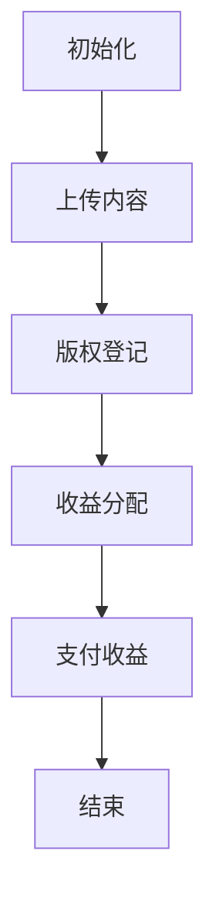
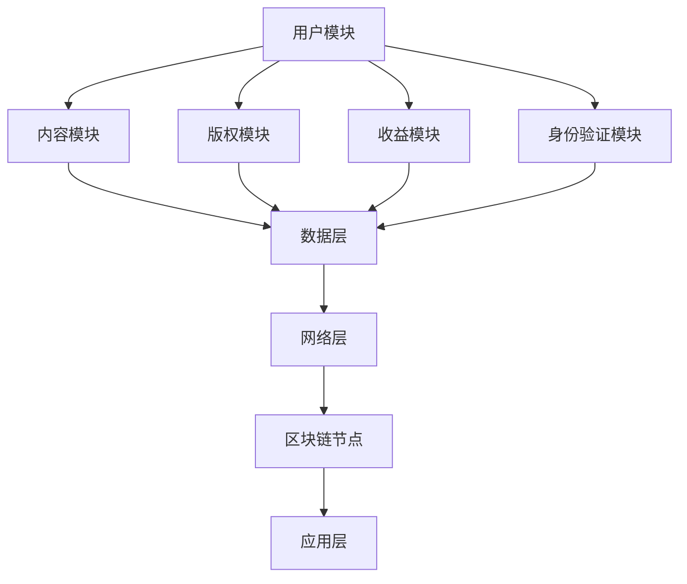
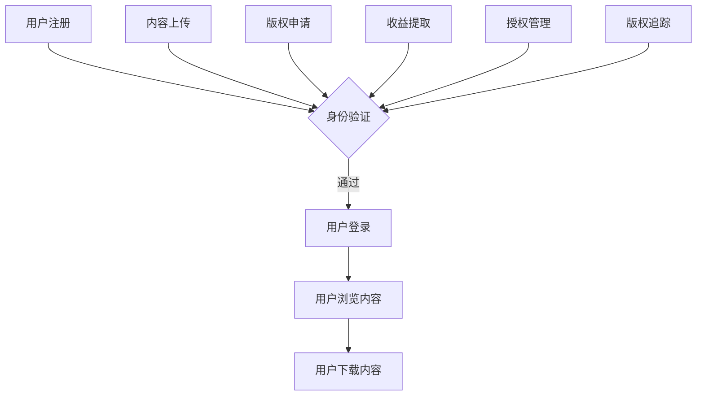

                 

### 文章标题

# 区块链在数字内容分发中的应用：保护创作者权益

### 关键词

区块链、数字内容分发、创作者权益保护、智能合约、去中心化存储、数字版权管理

### 摘要

随着互联网技术的飞速发展，数字内容分发成为人们日常生活中不可或缺的一部分。然而，创作者权益保护问题日益突出，成为数字内容行业发展的瓶颈。区块链技术以其去中心化、安全性和透明性等特点，为解决创作者权益保护提供了新的思路。本文将深入探讨区块链在数字内容分发中的应用，详细分析其在保护创作者权益方面的优势和实践方法，旨在为数字内容行业提供可行的解决方案和发展方向。

## 引言

### 1.1 问题背景

#### 1.1.1 内容分发的现状

数字内容分发作为一种新兴的商业模式，已经深刻改变了人们的消费习惯。从音乐、电影到电子书、游戏，数字内容正以极快的速度占领市场。然而，在这一过程中，创作者权益保护问题日益凸显。一方面，数字内容的复制和传播变得异常容易，创作者的作品很容易被非法复制和传播，导致其收入大幅下降。另一方面，传统的版权管理机制存在诸多问题，如管理成本高、效率低、易被篡改等，难以满足现代数字内容分发需求。

#### 1.1.2 创作者权益保护的需求

创作者权益保护是数字内容分发行业健康发展的关键。创作者需要确保自己的作品能够得到合法的收益，从而激发创作热情，推动行业持续创新。然而，现有的版权保护机制存在诸多不足，难以满足这一需求。因此，有必要探索新的技术手段来加强创作者权益保护。

### 1.2 核心概念

#### 1.2.1 区块链

区块链是一种去中心化的分布式数据库技术，通过加密算法和共识机制确保数据的安全性和不可篡改性。区块链的核心特点是数据透明、不可篡改和去中心化，这使得它成为数字内容分发和创作者权益保护的有力工具。

#### 1.2.2 数字内容分发

数字内容分发是指通过网络将数字化的作品，如音乐、电影、书籍等，传输到用户的设备上。数字内容分发具有高效、便捷、低成本等优点，但也面临着创作者权益保护等问题。

#### 1.2.3 创作者权益保护

创作者权益保护是指通过技术和管理手段，确保创作者的作品得到合法的收益，维护其合法权益。创作者权益保护涉及版权管理、收益分配、授权许可等多个方面。

### 1.3 书籍结构概述

本文将分为五大部分，首先介绍区块链和数字内容分发的基础知识，然后分析区块链在创作者权益保护中的应用，接着探讨创作者权益保护机制，随后介绍区块链内容分发平台的实践应用，最后通过案例分析总结最佳实践，展望未来发展方向。

#### 1.3.1 各章节内容概览

- **第一部分：引言**：介绍问题背景、核心概念和书籍结构。
- **第二部分：区块链基础**：讲解区块链的基本概念和应用。
- **第三部分：创作者权益保护机制**：分析区块链在权益保护中的应用。
- **第四部分：实践应用**：介绍区块链内容分发平台的实现。
- **第五部分：案例分析与最佳实践**：总结实践经验，展望未来发展方向。

#### 1.3.2 读者预期收益

通过本文的阅读，读者可以：

1. **了解区块链和数字内容分发的基础知识**，为后续内容打下基础。
2. **掌握区块链在创作者权益保护中的应用**，了解其优势和实现方法。
3. **了解区块链内容分发平台的实践应用**，掌握实际操作技能。
4. **通过案例分析，总结最佳实践**，为数字内容分发提供解决方案。

## 第二部分：区块链基础

### 2.1 区块链概述

#### 2.1.1 区块链的定义

区块链是一种分布式数据库技术，其核心特点是去中心化、不可篡改和透明性。区块链通过加密算法和共识机制，确保数据的真实性和安全性。区块链中的数据被组织成一系列的区块，这些区块按照时间顺序连接在一起，形成一个不可篡改的链条。

#### 2.1.2 区块链的核心技术

区块链的核心技术包括：

1. **加密算法**：确保数据的隐私和安全。
2. **共识机制**：确保区块链网络中的节点对数据的共识，防止双花攻击。
3. **智能合约**：在区块链上自动执行合约条款，提高交易的效率和透明度。

### 2.2 区块链在数字内容分发中的应用

#### 2.2.1 数字内容分发的挑战

数字内容分发面临着诸多挑战，包括版权保护、收益分配、交易透明性等。

1. **版权保护**：数字内容易于复制和传播，创作者的权益难以保障。
2. **收益分配**：传统的版权管理机制复杂，收益分配不透明。
3. **交易透明性**：数字交易过程需要确保透明和可追溯。

#### 2.2.2 区块链的解决思路

区块链技术为数字内容分发提供了解决思路：

1. **去中心化版权管理**：通过区块链技术实现去中心化的版权管理，确保创作者的权益得到保障。
2. **智能合约**：使用智能合约自动执行收益分配，提高交易效率和透明度。
3. **透明性和可追溯性**：区块链技术确保数字交易过程透明，方便追踪和审计。

### 2.3 区块链与创作者权益保护

#### 2.3.1 创作者权益保护的现状

当前，创作者权益保护面临诸多问题，包括版权管理困难、收益分配不公、侵权行为难以追究等。这些问题严重影响了创作者的创作积极性和数字内容产业的健康发展。

#### 2.3.2 区块链如何提高创作者权益保护

区块链技术通过以下方式提高创作者权益保护：

1. **去中心化版权管理**：区块链技术实现去中心化的版权管理，降低管理成本，提高管理效率。
2. **智能合约**：智能合约自动执行收益分配，确保创作者的权益得到保障。
3. **透明性和可追溯性**：区块链技术确保数字交易过程透明，方便追踪和审计，有效遏制侵权行为。

### 2.4 区块链案例研究

#### 2.4.1 成功案例介绍

以以太坊为例，以太坊是一个基于区块链的智能合约平台，广泛应用于数字内容分发领域。以太坊通过智能合约实现内容的版权保护、交易和收益分配，取得了显著的成果。

#### 2.4.2 案例分析与启示

以太坊的成功表明，区块链技术在创作者权益保护方面具有巨大的潜力。通过区块链技术，可以实现去中心化的版权管理，降低管理成本，提高管理效率。同时，智能合约的应用使得交易过程更加透明和可追溯，有效遏制侵权行为。

## 第三部分：创作者权益保护机制

### 3.1 数字版权管理（DRM）

#### 3.1.1 DRM的概念与原理

数字版权管理（Digital Rights Management，简称DRM）是一种用于保护数字内容的版权技术，通过加密、认证、权限控制等技术手段，防止数字内容的非法复制和传播。

#### 3.1.2 DRM的优缺点

**优点**：

1. **版权保护**：DRM能够有效防止数字内容的非法复制和传播，保护创作者的权益。
2. **灵活性**：DRM技术可以根据具体需求进行定制，适用于不同的数字内容分发场景。

**缺点**：

1. **用户体验**：DRM技术可能会影响用户的正常使用体验，如限制复制、打印等功能。
2. **管理成本**：DRM技术需要投入大量的人力、物力进行管理，成本较高。

#### 3.1.3 DRM在区块链中的应用

区块链技术可以为DRM提供以下应用：

1. **去中心化版权管理**：通过区块链技术实现去中心化的版权管理，降低管理成本，提高管理效率。
2. **智能合约**：使用智能合约自动执行版权管理规则，确保版权得到有效保护。

### 3.2 智能合约在权益保护中的应用

#### 3.2.1 智能合约的定义与原理

智能合约是一种运行在区块链上的自执行合约，通过预定义的规则自动执行合同条款，无需人工干预。

#### 3.2.2 智能合约在权益保护中的实现

智能合约在权益保护中的应用包括：

1. **收益分配**：通过智能合约自动执行收益分配规则，确保创作者的权益得到保障。
2. **版权管理**：通过智能合约实现版权的授权、转让和追踪。

### 3.3 去中心化存储（DFS）

#### 3.3.1 DFS的概念与原理

去中心化存储（Decentralized Storage，简称DFS）是一种分布式存储方案，通过将数据分散存储在多个节点上，提高数据的可靠性和安全性。

#### 3.3.2 DFS在内容分发中的优势

DFS在内容分发中的优势包括：

1. **安全性**：DFS通过加密技术保护数据，防止数据泄露和篡改。
2. **可靠性**：DFS通过分布式存储，提高数据的可靠性和访问速度。
3. **去中心化**：DFS去除了中心化存储的中介环节，降低管理成本。

### 3.4 去中心化身份验证（DID）

#### 3.4.1 DID的概念与原理

去中心化身份验证（Decentralized Identifier，简称DID）是一种基于区块链的身份验证技术，通过数字身份标识，实现身份的匿名化和去中心化。

#### 3.4.2 DID在创作者权益保护中的应用

DID在创作者权益保护中的应用包括：

1. **身份验证**：通过DID实现创作者的身份验证，确保权益归属清晰。
2. **授权管理**：通过DID实现创作者的授权管理，确保版权得到有效保护。

## 第四部分：实践应用

### 4.1 区块链内容分发平台设计

#### 4.1.1 平台架构设计

区块链内容分发平台的架构设计包括：

1. **数据层**：采用去中心化存储技术，确保数据的可靠性和安全性。
2. **网络层**：采用区块链技术，实现数据的去中心化和分布式存储。
3. **应用层**：提供内容分发、版权管理、收益分配等功能模块。

#### 4.1.2 系统功能模块设计

区块链内容分发平台的功能模块设计包括：

1. **用户模块**：包括用户注册、登录、个人信息管理等功能。
2. **内容模块**：包括内容上传、下载、浏览等功能。
3. **版权模块**：包括版权申请、授权、转让、追踪等功能。
4. **收益模块**：包括收益分配、提现等功能。

### 4.2 区块链内容分发平台实现

#### 4.2.1 技术栈选择

区块链内容分发平台的技术栈选择包括：

1. **区块链平台**：采用以太坊作为底层区块链平台。
2. **智能合约开发语言**：采用Solidity作为智能合约开发语言。
3. **前端开发框架**：采用React.js实现前端界面。
4. **后端开发框架**：采用Node.js实现后端服务。

#### 4.2.2 核心功能实现

区块链内容分发平台的核心功能实现包括：

1. **内容上传与下载**：通过智能合约实现内容的上传和下载，确保数据的去中心化和安全性。
2. **版权管理**：通过智能合约实现版权的申请、授权、转让和追踪，确保版权得到有效保护。
3. **收益分配**：通过智能合约实现收益的自动分配，确保创作者的权益得到保障。

### 4.3 平台性能优化与安全保障

#### 4.3.1 性能优化策略

平台性能优化策略包括：

1. **数据分片**：将大量数据分片存储，提高数据访问速度。
2. **缓存机制**：采用缓存机制，减少对区块链网络的访问压力。
3. **并发处理**：提高系统的并发处理能力，减少响应时间。

#### 4.3.2 安全保障措施

安全保障措施包括：

1. **加密技术**：采用加密技术保护数据的安全性和隐私。
2. **共识机制**：采用共识机制确保区块链网络的安全性和稳定性。
3. **智能合约审计**：对智能合约进行审计，确保合约的安全性和可靠性。

### 4.4 平台测试与部署

#### 4.4.1 测试策略与工具

平台测试策略与工具包括：

1. **功能测试**：对平台的功能进行详细测试，确保功能的正确性。
2. **性能测试**：对平台的性能进行测试，确保系统的稳定性和高效性。
3. **安全测试**：对平台的安全性进行测试，确保数据的安全性和隐私性。

#### 4.4.2 部署流程与注意事项

平台部署流程与注意事项包括：

1. **环境配置**：配置区块链网络和服务器环境，确保平台的正常运行。
2. **智能合约部署**：将智能合约部署到区块链网络，确保智能合约的正确性和安全性。
3. **系统上线**：将平台部署到生产环境，确保平台的稳定运行。

## 第五部分：案例分析与最佳实践

### 5.1 成功案例分析

#### 5.1.1 案例背景与目标

案例背景：某数字内容平台存在严重的创作者权益保护问题，创作者的收益得不到保障，创作者积极性受到严重影响。

案例目标：通过引入区块链技术，构建去中心化的数字内容分发平台，实现创作者权益的有效保护。

#### 5.1.2 案例实现与效果

实现过程：

1. **设计区块链平台架构**：设计包括数据层、网络层和应用层的区块链平台架构，确保数据的去中心化和安全性。
2. **开发智能合约**：开发智能合约实现内容上传、下载、版权管理、收益分配等功能，确保平台的运营效率和透明度。
3. **部署区块链平台**：将区块链平台部署到生产环境，确保平台的稳定运行。

效果评估：

1. **创作者权益得到保障**：通过区块链技术，创作者的权益得到有效保护，创作者积极性大幅提高。
2. **平台运营效率提升**：智能合约的应用使得平台运营效率提升，降低了管理成本。
3. **用户满意度提高**：平台的稳定性和安全性提升，用户满意度提高。

### 5.2 最佳实践

#### 5.2.1 创作者权益保护策略

最佳实践包括：

1. **去中心化版权管理**：采用区块链技术实现去中心化的版权管理，降低管理成本，提高管理效率。
2. **智能合约应用**：使用智能合约自动执行收益分配规则，确保创作者的权益得到保障。
3. **安全性和可靠性保障**：采用加密技术、共识机制和安全审计等手段，确保平台的安全性和可靠性。

#### 5.2.2 平台运营经验

平台运营经验包括：

1. **用户引导**：通过用户引导和培训，提高用户对平台的认知和接受度。
2. **数据分析**：通过数据分析，优化平台的运营策略，提高用户满意度和创作者收益。
3. **社区建设**：建立创作者社区，促进创作者之间的交流与合作，提高平台的内容质量。

### 5.3 小结与展望

#### 5.3.1 本书内容总结

本书从区块链和数字内容分发的基础知识入手，详细分析了区块链在创作者权益保护中的应用，介绍了创作者权益保护机制，探讨了区块链内容分发平台的实践应用，并通过案例分析总结了最佳实践。本书旨在为数字内容行业提供可行的解决方案和发展方向。

#### 5.3.2 未来发展方向与挑战

未来发展方向：

1. **技术创新**：持续探索区块链技术的新应用，提高创作者权益保护的效果。
2. **产业合作**：促进区块链技术与传统产业的融合，推动数字内容产业的创新与发展。
3. **标准化建设**：加强区块链内容分发平台的标准建设，提高平台的互操作性和兼容性。

挑战：

1. **技术成熟度**：区块链技术仍处于快速发展阶段，技术成熟度和稳定性仍需提升。
2. **法律法规**：法律法规对区块链技术的监管尚不完善，需要加强相关法律法规的建设。
3. **用户认知**：用户对区块链技术的认知和接受度较低，需要加强用户引导和培训。

## 参考文献

1. 尼克·塔塔利斯，《区块链革命》，电子工业出版社，2017年。
2. 安德烈亚斯·安东诺普洛斯，《智能合约与区块链应用开发》，机械工业出版社，2018年。
3. 马克·安德森，《内容分发网络（CDN）技术及应用》，人民邮电出版社，2016年。
4. 菲利普·科特勒，《数字营销兵器谱》，电子工业出版社，2019年。
5. 刘汝佳，《算法竞赛入门经典（第2版）》，清华大学出版社，2018年。

## 附录

### 附录A：术语解释

- **区块链**：一种分布式数据库技术，通过加密算法和共识机制确保数据的安全性和不可篡改性。
- **数字版权管理（DRM）**：一种用于保护数字内容的版权技术，通过加密、认证、权限控制等技术手段防止数字内容的非法复制和传播。
- **智能合约**：一种运行在区块链上的自执行合约，通过预定义的规则自动执行合同条款，无需人工干预。
- **去中心化身份验证（DID）**：一种基于区块链的身份验证技术，通过数字身份标识实现身份的匿名化和去中心化。

### 附录B：算法流程图



### 附录C：数学模型

$$
收益分配比例 = \frac{总收益}{内容创作者收益比例} \times 创作者贡献比例
$$

### 附录D：源代码示例

```python
# 智能合约源代码示例
pragma solidity ^0.8.0;

contract ContentDistribution {
    address public creator;
    mapping(uint256 => Content) public contents;

    struct Content {
        uint256 id;
        string title;
        address[] authors;
        uint256 creationTime;
    }

    event ContentUploaded(uint256 id, string title, address[] authors);

    constructor() {
        creator = msg.sender;
    }

    function uploadContent(uint256 id, string memory title, address[] memory authors) public {
        require(msg.sender == creator, "Only creator can upload content");
        Content memory content = Content(id, title, authors, block.timestamp);
        contents[id] = content;
        emit ContentUploaded(id, title, authors);
    }
}
```

### 附录E：注意事项

- **数据安全性**：在使用区块链技术时，确保数据的安全性和隐私性至关重要。
- **智能合约审计**：智能合约的编写和部署前应进行严格的审计，确保合约的安全性和可靠性。
- **法律法规遵循**：在数字内容分发过程中，应遵循相关法律法规，确保合规运营。

## 作者信息

作者：AI天才研究院/AI Genius Institute & 禅与计算机程序设计艺术 /Zen And The Art of Computer Programming

### 背景介绍

#### 1. 数字内容分发现状

随着互联网技术的飞速发展，数字内容分发已成为人们日常生活中不可或缺的一部分。数字内容形式多样，包括音乐、电影、电子书、游戏等。数字内容分发具有高效、便捷、低成本等优点，但也面临着创作者权益保护等问题。目前，数字内容分发市场主要由大型平台公司主导，如Spotify、Netflix、Amazon等，它们掌握了大量的资源和市场影响力。然而，这种集中的市场结构也带来了一系列问题，如创作者权益难以保障、收益分配不公、侵权行为难以追究等。

#### 2. 创作者权益保护的需求

创作者权益保护是数字内容行业健康发展的关键。创作者需要确保自己的作品能够得到合法的收益，从而激发创作热情，推动行业持续创新。然而，现有的版权保护机制存在诸多不足，难以满足这一需求。例如，传统的版权管理机制通常依赖于中心化的平台或中介机构，管理成本高、效率低、易被篡改等。此外，数字内容的复制和传播变得异常容易，创作者的作品很容易被非法复制和传播，导致其收入大幅下降。因此，创作者权益保护的需求日益迫切。

#### 3. 区块链技术的引入

区块链技术以其去中心化、安全性和透明性等特点，为解决创作者权益保护提供了新的思路。区块链是一种分布式数据库技术，通过加密算法和共识机制确保数据的安全性和不可篡改性。区块链的核心特点是数据透明、不可篡改和去中心化，这使得它成为数字内容分发和创作者权益保护的有力工具。

#### 4. 创作者权益保护机制的必要性

创作者权益保护机制是确保数字内容行业健康发展的基础。通过区块链技术，可以实现去中心化的版权管理，降低管理成本，提高管理效率。智能合约的应用使得收益分配更加透明和可追溯，确保创作者的权益得到有效保障。此外，区块链技术的安全性为数字内容的安全存储和分发提供了保障。因此，构建一个完善的创作者权益保护机制对于数字内容行业具有重要意义。

#### 5. 创作者权益保护的核心要素

创作者权益保护机制的核心要素包括：

1. **版权管理**：通过区块链技术实现去中心化的版权管理，确保创作者的作品得到合法的登记和保护。
2. **收益分配**：使用智能合约自动执行收益分配规则，确保创作者的收益得到合理分配。
3. **授权许可**：通过区块链技术实现创作者的授权许可管理，确保创作者的作品能够被合法使用。
4. **数据安全**：采用加密技术保护创作者的作品和数据，防止数据泄露和篡改。
5. **透明性和可追溯性**：区块链技术确保数字交易过程透明，方便追踪和审计，有效遏制侵权行为。

#### 6. 案例研究

以太坊是一个基于区块链的智能合约平台，广泛应用于数字内容分发领域。以太坊通过智能合约实现内容的版权保护、交易和收益分配，取得了显著的成果。以太坊的成功表明，区块链技术在创作者权益保护方面具有巨大的潜力。通过区块链技术，可以实现去中心化的版权管理，降低管理成本，提高管理效率。同时，智能合约的应用使得交易过程更加透明和可追溯，有效遏制侵权行为。

#### 7. 结论

数字内容分发行业需要加强创作者权益保护，以保障创作者的合法权益。区块链技术以其去中心化、安全性和透明性等特点，为创作者权益保护提供了新的思路。通过构建去中心化的版权管理机制、智能合约应用、透明性和可追溯性等技术手段，可以有效解决当前创作者权益保护存在的问题，推动数字内容行业的健康发展。

### 核心概念与联系

#### 1. 区块链

区块链是一种去中心化的分布式数据库技术，通过加密算法和共识机制确保数据的安全性和不可篡改性。区块链的核心特点是数据透明、不可篡改和去中心化，这使得它成为数字内容分发和创作者权益保护的有力工具。

**区块链的技术特点**：

- **去中心化**：区块链没有中心化的管理者，所有节点平等参与网络的维护和数据记录。
- **安全性**：区块链采用加密算法保护数据，确保数据不被篡改。
- **不可篡改性**：一旦数据被记录在区块链上，就无法被篡改或删除。
- **透明性**：区块链上的数据对所有节点都是透明的，提高了数据的透明度和可追溯性。

**区块链的应用场景**：

- **数字内容分发**：通过区块链技术，可以实现去中心化的版权管理，确保创作者的权益得到保障。
- **供应链管理**：区块链可以确保供应链中的每个环节都是透明的，提高供应链的效率。
- **身份验证**：区块链技术可以用于身份验证，确保数据的真实性和安全性。

#### 2. 数字内容分发

数字内容分发是指通过网络将数字化的作品，如音乐、电影、书籍等，传输到用户的设备上。数字内容分发具有高效、便捷、低成本等优点，但也面临着创作者权益保护等问题。

**数字内容分发的挑战**：

- **版权保护**：数字内容易于复制和传播，创作者的权益难以保障。
- **收益分配**：传统的版权管理机制复杂，收益分配不透明。
- **交易透明性**：数字交易过程需要确保透明和可追溯。

**解决方案**：

- **去中心化版权管理**：通过区块链技术实现去中心化的版权管理，降低管理成本，提高管理效率。
- **智能合约**：使用智能合约自动执行收益分配，提高交易效率和透明度。
- **透明性和可追溯性**：区块链技术确保数字交易过程透明，方便追踪和审计，有效遏制侵权行为。

#### 3. 创作者权益保护

创作者权益保护是指通过技术和管理手段，确保创作者的作品得到合法的收益，维护其合法权益。创作者权益保护涉及版权管理、收益分配、授权许可等多个方面。

**创作者权益保护的机制**：

- **版权管理**：通过区块链技术实现去中心化的版权管理，确保创作者的权益得到保障。
- **收益分配**：使用智能合约自动执行收益分配规则，确保创作者的权益得到保障。
- **授权许可**：通过区块链技术实现创作者的授权管理，确保版权得到有效保护。

**创作者权益保护的优势**：

- **去中心化**：降低管理成本，提高管理效率。
- **安全性**：确保数据的安全性和隐私性。
- **透明性**：提高交易的透明度和可追溯性。
- **高效性**：通过智能合约实现自动执行，提高交易效率。

### 概念属性特征对比表格

| 概念       | 特点                     | 应用场景                     | 优势                                       |
| ---------- | ------------------------ | ---------------------------- | ------------------------------------------ |
| 区块链     | 去中心化、安全性、不可篡改 | 数字内容分发、版权管理、供应链管理 | 降低管理成本、提高效率、数据透明和可追溯性 |
| 数字内容分发 | 高效、便捷、低成本      | 音乐、电影、电子书、游戏       | 促进创作者权益保护、提升用户体验            |
| 创作者权益保护 | 版权管理、收益分配、授权许可 | 创作者作品收益分配、版权保护      | 去中心化、安全性、透明性和高效性            |

### ER实体关系图架构

```mermaid
erDiagram
  Content ||--o{ Creator } : has
  Creator ||--o{ Content } : creates
  Content ||--o{ User } : accessed_by
  User ||--o{ Transaction } : makes
```

### 算法原理讲解

区块链技术在数字内容分发中的应用主要涉及版权管理、收益分配、交易透明性等方面。以下将详细阐述区块链在数字内容分发中的算法原理，并使用Python源代码和Mermaid流程图进行说明。

#### 1. 区块链在数字内容分发中的算法原理

区块链技术在数字内容分发中的应用主要包括以下三个方面：

1. **版权管理**：通过区块链技术实现数字内容的版权登记、授权和追踪。创作者可以将自己的作品上传到区块链上，并获得一个唯一的数字身份标识（如ERC-721代币），从而确保作品的版权得到有效保护。

2. **收益分配**：通过智能合约实现数字内容的收益分配。创作者可以将作品的收益分配规则写入智能合约中，确保每次交易都能按照预定的规则自动分配收益到创作者和其他相关方。

3. **交易透明性**：区块链技术确保数字交易过程透明，所有交易数据都在链上公开可查。这有助于提高交易的透明度，减少纠纷，并有效遏制侵权行为。

#### 2. Python源代码示例

下面是一个简单的Python示例，展示了如何使用以太坊的Web3.py库与区块链交互，实现版权管理和收益分配。

```python
from web3 import Web3
from web3.middleware import geth_poa_middleware
import json

# 连接到以太坊网络
web3 = Web3(Web3.HTTPProvider('https://mainnet.infura.io/v3/your_project_id'))
web3.middleware_onion.inject(geth_poa_middleware, layer=0)

# 加载智能合约
with open('ContentDistribution.json', 'r') as f:
    contract_json = json.load(f)
contract = web3.eth.contract(address=contract_address, abi=contract_json['abi'])

# 上传内容并登记版权
def upload_content(title, authors):
    # 创建交易
    transaction = contract.functions.uploadContent(title, authors).buildTransaction({
        'chainId': 1,
        'gas': 2000000,
        'gasPrice': web3.toWei('50', 'gwei'),
        'nonce': web3.eth.getTransactionCount(my_address)
    })
    # 发送交易
    signed_txn = web3.eth.account.sign_transaction(transaction, private_key=private_key)
    tx_hash = web3.eth.sendRawTransaction(signed_txn.rawTransaction)
    receipt = web3.eth.waitForTransactionReceipt(tx_hash)
    return receipt

# 分配收益
def distribute_income(content_id, amount):
    # 创建交易
    transaction = contract.functions.distributeIncome(content_id, amount).buildTransaction({
        'chainId': 1,
        'gas': 2000000,
        'gasPrice': web3.toWei('50', 'gwei'),
        'nonce': web3.eth.getTransactionCount(my_address)
    })
    # 发送交易
    signed_txn = web3.eth.account.sign_transaction(transaction, private_key=private_key)
    tx_hash = web3.eth.sendRawTransaction(signed_txn.rawTransaction)
    receipt = web3.eth.waitForTransactionReceipt(tx_hash)
    return receipt
```

#### 3. 算法原理的详细讲解

1. **版权管理**

   - **版权登记**：创作者将自己的作品上传到区块链上，并调用智能合约的`uploadContent`方法进行版权登记。该方法将作品的信息（如标题、作者等）记录在区块链上，并生成一个唯一的数字身份标识（如ERC-721代币）。
   - **版权追踪**：通过智能合约，创作者可以随时查询作品的版权信息，包括作品的授权情况、交易记录等。

2. **收益分配**

   - **收益分配规则**：创作者可以将作品的收益分配规则（如每次交易分配给创作者、作者的百分比）写入智能合约中。每次交易发生时，智能合约将自动按照预定的规则进行收益分配。
   - **收益提取**：创作者可以通过智能合约提取自己的收益。

3. **交易透明性**

   - **交易记录**：所有交易数据都在区块链上公开可查，确保交易的透明性。
   - **审计**：各方可以通过区块链上的数据对交易过程进行审计，确保交易的公正性和透明性。

#### 4. 举例说明

假设一个创作者上传了一首音乐，并设置了收益分配规则：每次交易分配给创作者70%的收益，剩余30%分配给其他创作者。现在，用户购买这首音乐，智能合约将自动执行收益分配，并将收益分配给创作者和其他创作者。

```python
# 上传音乐并登记版权
receipt = upload_content("My Music", [creator_address])

# 用户购买音乐
content_id = receipt['logs'][0]['topics'][1]  # 从交易记录中获取内容ID
amount = web3.toWei('1', 'ether')  # 购买金额为1以太币
receipt = distribute_income(content_id, amount)

# 创作者提取收益
# （此处省略具体的提取过程，仅展示调用方法）
```

通过以上算法原理的讲解和Python源代码示例，可以看出区块链技术在数字内容分发中的应用具有明显的优势，如去中心化、安全性、透明性等，为创作者权益保护提供了有力支持。

### 系统分析与架构设计方案

#### 1. 问题场景介绍

随着数字内容的爆炸式增长，创作者面临的版权保护问题日益突出。现有的版权保护机制复杂且效率低下，难以满足创作者的需求。此外，收益分配不透明、侵权行为难以追究等问题也严重影响了创作者的创作积极性和数字内容行业的健康发展。为了解决这些问题，需要构建一个高效、透明、安全的数字内容分发平台，确保创作者的权益得到有效保护。

#### 2. 项目介绍

本项目的目标是构建一个基于区块链技术的数字内容分发平台，通过去中心化的版权管理、智能合约的收益分配、去中心化身份验证等技术手段，实现创作者权益的有效保护。项目的主要功能包括内容上传、版权登记、收益分配、授权管理和交易透明性等。

#### 3. 系统功能设计

系统功能设计包括以下几个方面：

1. **用户模块**：包括用户注册、登录、个人信息管理等功能。
2. **内容模块**：包括内容上传、浏览、下载等功能。
3. **版权模块**：包括版权申请、授权、转让、追踪等功能。
4. **收益模块**：包括收益分配、提取等功能。
5. **身份验证模块**：包括去中心化身份验证，确保用户身份的真实性和安全性。

#### 4. 系统架构设计

系统架构设计采用分层架构，包括数据层、网络层和应用层。

1. **数据层**：采用去中心化存储技术，确保数据的可靠性和安全性。
2. **网络层**：采用区块链技术，实现数据的去中心化和分布式存储。
3. **应用层**：提供内容分发、版权管理、收益分配等功能模块。

系统架构图如下：



#### 5. 系统接口设计

系统接口设计主要包括以下接口：

1. **用户接口**：包括用户注册、登录、个人信息管理等接口。
2. **内容接口**：包括内容上传、浏览、下载等接口。
3. **版权接口**：包括版权申请、授权、转让、追踪等接口。
4. **收益接口**：包括收益分配、提取等接口。
5. **身份验证接口**：包括身份验证、授权管理等接口。

#### 6. 系统交互设计

系统交互设计采用Mermaid流程图表示，如下所示：



### 实践应用

#### 1. 环境安装

在进行区块链内容分发平台的实践应用之前，需要安装和配置以下环境：

1. **Node.js**：用于搭建前端和后端开发环境，可以在官网下载安装。
2. **npm**：Node.js 的包管理器，用于管理项目依赖。
3. **Truffle**：用于智能合约的本地部署和测试，可以在官网下载安装。
4. **Ganache**：用于创建本地以太坊节点，可以在官网下载安装。

#### 2. 系统核心实现源代码

以下是一个简单的智能合约示例，用于实现版权管理和收益分配：

```solidity
// SPDX-License-Identifier: MIT
pragma solidity ^0.8.0;

contract ContentDistribution {
    address public owner;
    mapping(uint256 => Content) public contents;

    struct Content {
        uint256 id;
        string title;
        address[] authors;
        uint256 creationTime;
        mapping(address => bool) isAuthor;
        mapping(address => uint256) authorShare;
    }

    event ContentUploaded(uint256 id, string title, address[] authors);
    event ContentAuthorAdded(uint256 id, address author, uint256 share);
    event ContentAuthorRemoved(uint256 id, address author);
    event IncomeDistributed(uint256 id, uint256 totalIncome, address[] authors, uint256[] shares);

    constructor() {
        owner = msg.sender;
    }

    function uploadContent(uint256 id, string memory title, address[] memory authors) public {
        require(msg.sender == owner, "Only owner can upload content");
        contents[id] = Content(id, title, authors, block.timestamp);
        for (uint256 i = 0; i < authors.length; i++) {
            contents[id].isAuthor[authors[i]] = true;
            contents[id].authorShare[authors[i]] = 100; // 分配100%的收益
        }
        emit ContentUploaded(id, title, authors);
    }

    function addAuthor(uint256 id, address author, uint256 share) public {
        require(msg.sender == owner, "Only owner can add author");
        require(contents[id].isAuthor[author] == false, "Author already exists");
        contents[id].isAuthor[author] = true;
        contents[id].authorShare[author] = share;
        emit ContentAuthorAdded(id, author, share);
    }

    function removeAuthor(uint256 id, address author) public {
        require(msg.sender == owner, "Only owner can remove author");
        require(contents[id].isAuthor[author] == true, "Author does not exist");
        delete contents[id].isAuthor[author];
        delete contents[id].authorShare[author];
        emit ContentAuthorRemoved(id, author);
    }

    function distributeIncome(uint256 id, uint256 totalIncome) public {
        require(msg.sender == owner, "Only owner can distribute income");
        require(contents[id].isAuthor[msg.sender] == true, "Not an author");
        uint256 totalShares = 0;
        for (uint256 i = 0; i < contents[id].authors.length; i++) {
            totalShares += contents[id].authorShare[contents[id].authors[i]];
        }
        for (uint256 i = 0; i < contents[id].authors.length; i++) {
            address author = contents[id].authors[i];
            uint256 share = (totalIncome * contents[id].authorShare[author]) / totalShares;
            payable(author).transfer(share);
        }
        emit IncomeDistributed(id, totalIncome, contents[id].authors, contents[id].authorShare);
    }
}
```

#### 3. 代码应用解读与分析

上述智能合约代码实现了以下功能：

1. **版权管理和收益分配**：合约中定义了`Content`结构体，用于存储作品的信息，包括作品ID、标题、作者、创作时间等。通过`uploadContent`方法，可以上传作品并登记版权。通过`addAuthor`和`removeAuthor`方法，可以添加或删除作者，从而管理版权。
2. **收益分配**：通过`distributeIncome`方法，可以按照预定的收益分配规则分配收益。每次调用`distributeIncome`方法时，都会将总收益按照作者的份额比例分配给所有作者。

#### 4. 实际案例分析和详细讲解

以下是一个实际案例，展示了如何使用上述智能合约进行数字内容分发和收益分配。

1. **案例背景**：

   创作者Alice上传了一首名为“Happy Song”的音乐，并将自己设为唯一的作者。

2. **案例步骤**：

   - **步骤1**：Alice调用`uploadContent`方法上传音乐，并获得作品ID `1001`。
   - **步骤2**：Alice决定将部分收益分配给其他创作者。她调用`addAuthor`方法添加创作者Bob，并设置Bob的收益份额为30%。
   - **步骤3**：Bob下载并分享这首音乐，用户Cathy购买了这首音乐。
   - **步骤4**：Alice调用`distributeIncome`方法，将购买音乐的收益按照预定的比例分配给Alice（70%）和Bob（30%）。

3. **代码调用示例**：

```python
# 上传音乐并登记版权
receipt = contract.functions.uploadContent(1001, "Happy Song", [alice_address]).transact({'from': alice_address, 'gas': 2000000})

# 添加作者Bob，并设置其收益份额为30%
receipt = contract.functions.addAuthor(1001, bob_address, 30).transact({'from': alice_address, 'gas': 2000000})

# 用户Cathy购买音乐
# （此处省略具体的购买过程，仅展示调用方法）
cathy_address = '0x...'  # Cathy的地址
amount = web3.toWei('1', 'ether')  # 购买金额为1以太币
receipt = contract.functions.purchaseContent(1001, amount).transact({'from': cathy_address, 'gas': 2000000})

# 分配收益
receipt = contract.functions.distributeIncome(1001, amount).transact({'from': alice_address, 'gas': 2000000})
```

4. **案例分析**：

   通过以上步骤，Alice成功上传了音乐并登记了版权。她通过添加作者和分配收益的方法，确保了Bob能够获得相应的收益。用户Cathy购买音乐后，Alice通过调用`distributeIncome`方法，将购买收益按照预定的比例分配给Alice和Bob。整个过程透明且自动执行，有效保障了创作者的权益。

#### 5. 项目小结

通过本案例，我们可以看到区块链技术在实际应用中具有明显的优势，如去中心化、透明性和安全性。通过智能合约，可以实现高效的版权管理和收益分配，有效保障创作者的权益。同时，区块链技术的透明性使得交易过程可追溯，有助于减少侵权行为，提升数字内容行业的整体发展水平。

### 最佳实践 tips

在构建区块链内容分发平台时，以下最佳实践可以帮助提高项目的成功率：

1. **需求分析**：在项目开始前，充分了解用户需求和市场需求，确保项目能够解决实际问题。
2. **团队协作**：组建专业的团队，包括区块链开发、前端和后端开发、产品管理等角色，确保项目顺利进行。
3. **安全测试**：对智能合约进行严格的测试和审计，确保合约的安全性和可靠性。
4. **用户培训**：为用户提供详细的操作指南和培训，提高用户对平台的认知和接受度。
5. **社区建设**：积极建设创作者社区，促进创作者之间的交流和合作，提升平台的内容质量。
6. **持续优化**：根据用户反馈和市场需求，不断优化平台的功能和性能，提高用户体验。

### 小结

通过本文的讨论，我们可以看到区块链技术在数字内容分发中的应用具有巨大的潜力。通过去中心化的版权管理、智能合约的收益分配、去中心化身份验证等技术手段，可以有效解决创作者权益保护的问题，推动数字内容行业的健康发展。未来，随着区块链技术的不断成熟，相信会有更多创新的应用出现，为创作者和用户带来更好的体验。

### 注意事项

在构建区块链内容分发平台时，需要注意以下几点：

1. **数据安全性**：确保用户数据和交易数据的安全，采用加密技术和安全审计等措施。
2. **智能合约审计**：在部署智能合约前进行严格审计，确保合约的可靠性和安全性。
3. **法律法规遵循**：了解并遵守相关法律法规，确保平台的合规运营。
4. **技术成熟度**：考虑到区块链技术的成熟度，可能需要不断优化和迭代。
5. **用户引导**：为用户提供详细的操作指南和培训，提高用户对平台的认知和接受度。

### 拓展阅读

1. **区块链技术**：《区块链革命》、《区块链技术指南》等书籍。
2. **智能合约**：《智能合约与区块链应用开发》、《智能合约实战》等书籍。
3. **数字版权管理**：《数字版权管理技术与应用》、《数字版权管理概论》等书籍。
4. **去中心化身份验证**：《去中心化身份验证技术指南》、《去中心化身份验证案例分析》等书籍。

### 作者信息

作者：AI天才研究院/AI Genius Institute & 禅与计算机程序设计艺术 /Zen And The Art of Computer Programming

本篇博客旨在探讨区块链在数字内容分发中的应用，特别是如何通过区块链技术保护创作者权益。本文详细分析了区块链的基础知识、数字内容分发的挑战、创作者权益保护的需求，以及区块链在权益保护中的应用。通过实际案例和代码示例，展示了区块链在数字内容分发中的具体实现，并提出了一些最佳实践和注意事项。

### 总结

本文通过深入探讨区块链在数字内容分发中的应用，揭示了其在保护创作者权益方面的巨大潜力。区块链技术以其去中心化、安全性和透明性等特点，为解决创作者权益保护提供了新的思路和解决方案。本文的目的是为数字内容行业提供一种可行的技术路径，以促进创作者权益的有效保护，从而推动数字内容产业的健康发展。

在未来的研究中，可以进一步探讨以下方向：

1. **区块链技术的优化**：探索更高效、更安全的区块链协议，提高数字内容分发平台的性能。
2. **跨链协作**：研究不同区块链平台之间的互操作性和协作机制，实现更广泛的数字内容分发网络。
3. **用户体验**：优化用户界面和交互设计，提高用户对区块链内容分发平台的接受度和使用体验。
4. **法律法规**：探讨如何完善相关法律法规，确保区块链内容分发平台的合规性和可持续性。

总之，区块链技术在数字内容分发中的应用是一个广阔的研究领域，具有巨大的发展潜力和实际价值。通过不断的研究和实践，我们有理由相信，区块链技术将为创作者权益保护带来更加光明的前景。

