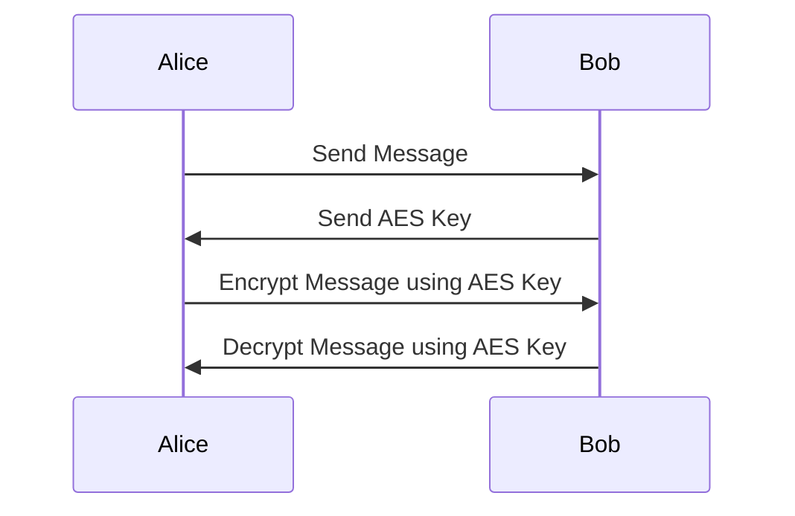
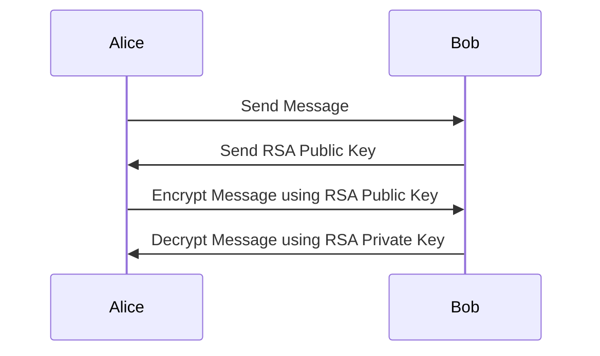
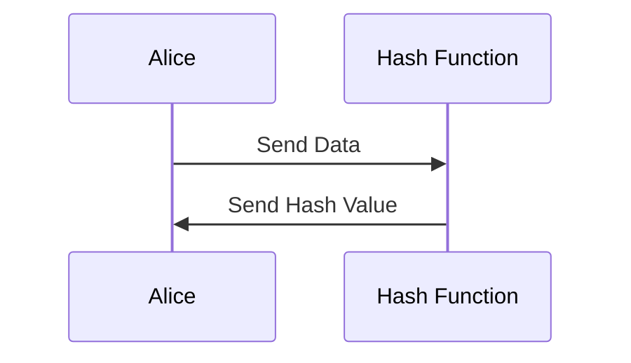
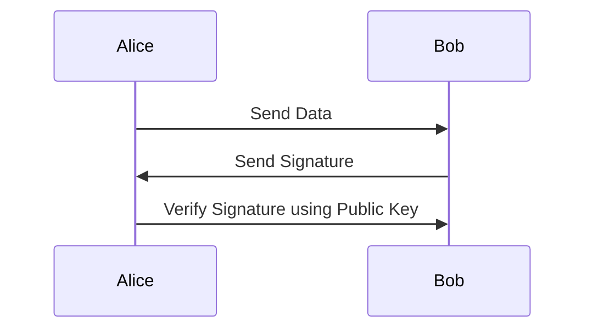
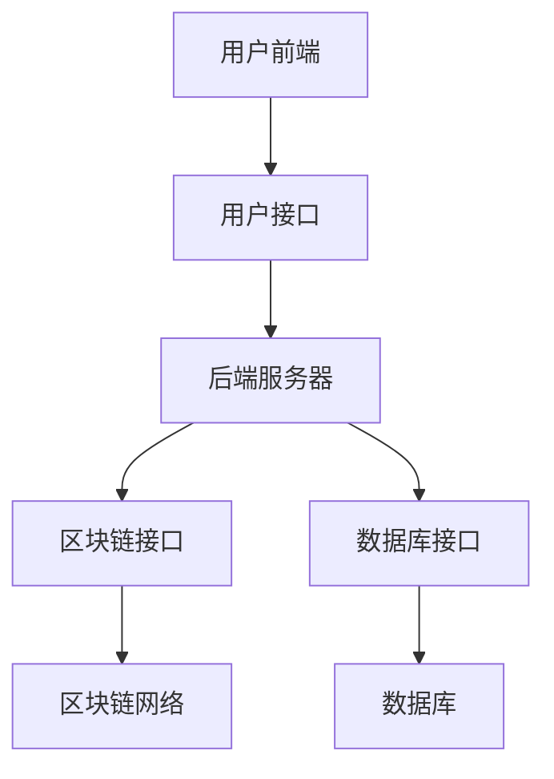

                 

## 《区块链在数字内容版权保护中的应用》

### 关键词：区块链、数字版权、版权保护、加密技术、智能合约

### 摘要：

随着数字内容的快速普及，数字版权保护成为了一个日益严峻的问题。传统的版权保护机制存在诸多缺陷，难以应对现代技术带来的挑战。区块链技术以其去中心化、透明性和不可篡改的特性，为数字内容版权保护提供了一种全新的解决方案。本文将详细探讨区块链在数字内容版权保护中的应用，包括设计思路、核心概念、算法原理、系统架构设计和项目实战，以期为相关领域的研究者提供有价值的参考。

### 设计思路：

在设计《区块链在数字内容版权保护中的应用》这本书的目录大纲时，我们需要遵循以下思路：

1. **背景介绍**：首先，我们需要引入区块链和数字内容版权保护的基本概念，解释为什么这个问题很重要，以及它所面临的挑战。
   
2. **核心概念与联系**：接下来，我们需要详细阐述区块链技术的基本原理，以及它如何应用于数字内容版权保护。这包括介绍区块链的组成部分（如区块、链式数据结构、共识机制等），以及数字版权的属性和特点。

3. **算法原理讲解**：我们需要讲解区块链在数字版权保护中的一些核心算法原理，如加密技术、智能合约、非对称密钥等。为了使读者更容易理解，我们会使用 mermaid 绘制相关流程图，并配合 Python 源代码进行详细解释。

4. **数学模型和数学公式**：我们会用 LaTeX 格式给出相关数学模型和公式，并进行详细讲解和举例说明。

5. **系统分析与架构设计**：这部分将介绍一个数字版权保护系统的架构设计，包括领域模型、系统架构、接口设计和系统交互。

6. **项目实战**：我们将提供一个实际案例，详细描述环境安装、系统实现、代码解读、案例分析和项目小结。

7. **最佳实践、小结、注意事项、拓展阅读**：最后，我们将提供一些最佳实践建议，对全书进行小结，并提出一些注意事项，为读者提供拓展阅读的资源。

### 目录大纲：

```
# 《区块链在数字内容版权保护中的应用》目录大纲

## 第一部分：引言

## 第1章：数字内容版权保护背景

### 1.1 问题背景

### 1.2 数字版权保护的挑战

### 1.3 区块链与数字版权保护

## 第二部分：区块链技术基础

## 第2章：区块链原理与结构

### 2.1 区块链的基本原理

### 2.2 区块链的数据结构

### 2.3 共识机制

## 第三部分：数字版权保护的核心算法

## 第3章：加密技术

### 3.1 对称加密与非对称加密

### 3.2 哈希函数

### 3.3 数字签名

## 第4章：智能合约

### 4.1 智能合约的基本原理

### 4.2 智能合约与数字版权保护

## 第四部分：数字版权保护系统设计与实现

## 第5章：数字版权保护系统架构设计

### 5.1 系统功能设计

### 5.2 系统架构设计

### 5.3 系统接口设计

### 5.4 系统交互设计

## 第6章：数字版权保护项目实战

### 6.1 环境安装

### 6.2 系统核心实现

### 6.3 代码解读与分析

### 6.4 实际案例分析与讲解

## 第五部分：最佳实践与拓展

## 第7章：最佳实践

### 7.1 数字版权保护的最佳实践

### 7.2 避免常见的陷阱和错误

## 第8章：小结与展望

### 8.1 全书回顾

### 8.2 未来发展趋势

### 8.3 拓展阅读资源
```

这样的目录大纲既全面又详细，可以帮助读者系统地了解区块链在数字内容版权保护中的应用。接下来，我们将为每个章节添加具体的子标题，以确保内容的完整性。同时，我们将确保每个章节都包含了必要的核心概念、算法原理讲解、数学模型、系统架构设计、项目实战和最佳实践等内容。通过这样的结构化设计，读者可以逐步深入，从基础到实践，全面掌握区块链在数字内容版权保护中的应用。

### 第一部分：引言

#### 1.1 问题背景

数字内容的创作和传播在现代社会中占据了越来越重要的地位。从音乐、电影、文学作品到软件代码、设计图纸，各种类型的数字内容都在不断涌现。然而，随着数字内容的增多，版权保护问题也日益突出。传统的版权保护机制，如版权登记、法律诉讼等，存在成本高、效率低、执行力不足等问题，难以满足数字时代的需求。

首先，传统的版权登记流程繁琐且耗时。作者需要提交大量的文档和证明材料，经过漫长的审批流程才能获得版权证书。这不仅增加了作者的时间和经济负担，也降低了版权登记的积极性。

其次，法律诉讼在数字版权保护中具有明显的局限性。一方面，数字内容的传播速度快，侵权行为可能在一瞬间就发生，诉讼的及时性难以保障。另一方面，由于数字内容跨国界传播的特点，涉及到国际法律纠纷时，诉讼的复杂性和成本更高。

此外，传统的版权保护机制在应对技术手段上的挑战时也显得力不从心。数字内容的复制和传播变得极其容易，而传统的技术手段，如水印、数字指纹等，存在容易被篡改、追踪困难等问题，难以有效阻止侵权行为。

#### 1.2 数字版权保护的挑战

数字版权保护面临的挑战主要体现在以下几个方面：

1. **侵权行为的隐蔽性**：数字内容可以轻松复制和修改，侵权行为往往难以被发现。即使发现侵权，证据的收集和证明也面临很大困难。

2. **跨国界传播**：数字内容可以在全球范围内自由传播，涉及到不同的法律体系和版权规定，增加了版权保护的国际协调难度。

3. **版权归属争议**：在多人合作创作的数字内容中，如何明确版权归属成为一个复杂的问题。传统的版权归属证明方式难以适应这种复杂性。

4. **版权交易和授权**：随着数字内容市场的繁荣，版权交易和授权变得更加频繁。然而，传统的版权交易流程繁琐且成本高，难以适应高效的市场需求。

5. **技术手段的局限**：现有的数字版权保护技术，如加密、数字签名、水印等，存在被破解、篡改的风险，难以提供可靠的版权保护。

#### 1.3 区块链与数字版权保护

区块链技术的出现为数字版权保护提供了一种全新的思路。区块链以其去中心化、不可篡改和透明性等特性，为解决数字版权保护问题提供了可能。

首先，区块链的去中心化特性使得版权信息不再依赖于某个中央机构，而是分散存储在所有节点上。这样，即使某个节点被攻击或篡改，整个区块链网络的其他节点仍然能够保持数据的完整性，从而提高版权信息的可靠性。

其次，区块链的不可篡改特性保证了版权信息的长期有效性。一旦版权信息被记录在区块链上，就很难被篡改或删除。这为版权归属的证明和侵权行为的追踪提供了强有力的保障。

此外，区块链的透明性使得版权信息的查询和验证变得简单快捷。任何用户都可以通过区块链网络查询特定数字内容的版权信息，无需经过复杂的审核和验证流程。

更重要的是，区块链技术可以为数字版权保护提供智能合约的支持。智能合约是一种自动执行的合同，可以在区块链上记录和执行版权交易的条款。这不仅简化了版权交易和授权的流程，还可以确保交易的透明性和公正性。

总之，区块链技术以其独特的特性为数字内容版权保护提供了一种全新的解决方案。通过去中心化、不可篡改和透明性等特性，区块链可以有效解决数字版权保护中的诸多问题，为数字内容创作者提供更可靠的版权保护。

### 第二部分：区块链技术基础

区块链技术是一种分布式账本技术，它通过一系列创新的机制解决了数据存储、传输和验证等问题。在本章中，我们将深入探讨区块链的基本原理、数据结构以及共识机制，为后续章节中的数字版权保护应用打下坚实的基础。

#### 2.1 区块链的基本原理

区块链的基本原理可以概括为数据存储、传输和验证。下面我们一步一步地介绍这些关键概念。

首先，区块链是一种分布式数据库。与传统的集中式数据库不同，区块链的数据不存储在一个中央服务器上，而是分散存储在多个节点上。每个节点都保存了一份完整的数据副本，这样即使某个节点失效，整个区块链网络的数据也不会丢失。

其次，区块链通过一种称为“区块”的数据结构来存储信息。每个区块包含一定数量的交易记录，这些交易记录经过加密和校验后，被添加到区块链中。每个区块都有一个时间戳，用于记录交易的执行时间。

最后，区块链通过“链式数据结构”将这些区块连接起来。每个区块都包含一个指向前一个区块的哈希值，形成一个链条。这种链式数据结构保证了区块链的不可篡改性。一旦某个区块被添加到区块链中，想要篡改它将变得极其困难，因为篡改一个区块将导致所有后续区块的哈希值发生变化，这会立即被发现。

#### 2.2 区块链的数据结构

区块链的数据结构由区块、链式数据结构、交易记录和地址组成。

1. **区块**：区块是区块链的基本组成单元。每个区块包含三个主要部分：交易记录、时间戳和前一个区块的哈希值。交易记录是区块链上记录的所有交易信息，时间戳用于确保交易的执行顺序，前一个区块的哈希值则用于连接不同的区块，形成链式数据结构。

2. **链式数据结构**：区块链通过链式数据结构将不同的区块连接起来。每个区块都包含一个指向前一个区块的哈希值，形成一个链条。这种链式结构保证了区块链的不可篡改性。一旦某个区块被添加到区块链中，要篡改它将需要重新计算所有后续区块的哈希值，这几乎是不可能的。

3. **交易记录**：交易记录是区块链上记录的所有交易信息。每个交易都包含发送方的地址、接收方的地址以及交易金额等信息。交易记录经过加密和校验后，被添加到区块中。

4. **地址**：地址是区块链上的一个标识符，用于唯一标识一个账户。每个地址都对应一个公钥和私钥。公钥用于接收交易，私钥用于签名和验证交易。

#### 2.3 共识机制

共识机制是区块链中确保数据一致性的关键机制。不同的区块链系统采用不同的共识机制，下面我们介绍几种常见的共识机制。

1. **工作量证明（PoW）**：工作量证明是最早的共识机制之一，由比特币采用。它通过解决一个复杂的数学难题来生成新区块，解决这个难题需要大量的计算资源。第一个解决难题的节点将获得生成新区块的权力，并将新交易记录添加到区块链中。

2. **权益证明（PoS）**：权益证明是对工作量证明的一种改进，通过持有币的数量和持币时间来决定生成新区块的权力。持有币的数量越多、持币时间越长，获得生成新区块的权力就越大。这种机制减少了计算资源的消耗，但也存在集中化的风险。

3. **委托权益证明（DPoS）**：委托权益证明是对权益证明的进一步改进，通过选举代表来生成新区块。每个持币者可以投票选择代表，代表负责生成新区块和验证交易。这种机制提高了系统的效率，但选举过程可能存在操控风险。

4. **权威证明（PoA）**：权威证明是一种由中心化实体控制共识机制的区块链系统。中心化实体通常是一个团队或组织，负责生成新区块和验证交易。这种机制提高了系统的效率，但也可能导致中心化风险。

通过以上对区块链基本原理、数据结构和共识机制的介绍，我们为理解区块链在数字版权保护中的应用奠定了基础。在接下来的章节中，我们将深入探讨区块链在数字版权保护中的具体应用，包括核心算法原理、系统架构设计和实际案例。

### 第三部分：数字版权保护的核心算法

区块链在数字版权保护中扮演着重要角色，其核心算法如加密技术、智能合约、非对称密钥等是确保版权信息安全和不可篡改的关键。在本节中，我们将详细讲解这些算法原理，并通过 mermaid 流程图和 Python 源代码示例，帮助读者深入理解其应用。

#### 3.1 对称加密与非对称加密

加密技术是区块链在数字版权保护中的重要应用，它确保了版权信息的保密性和完整性。加密技术主要分为对称加密和非对称加密两种类型。

**对称加密**：对称加密使用相同的密钥进行加密和解密。这种加密方法简单高效，但密钥的分发和管理成为难题，因为密钥需要在通信双方之间安全传输。常见的对称加密算法包括 AES（高级加密标准）和 DES（数据加密标准）。

**非对称加密**：非对称加密使用一对密钥，即公钥和私钥。公钥用于加密，私钥用于解密。这种加密方法解决了密钥分发问题，因为公钥可以公开传输，而私钥只需在解密时持有。常见的非对称加密算法包括 RSA 和 ECC（椭圆曲线加密）。

**3.1.1 对称加密的 mermaid 流程图和 Python 示例**

以下是一个对称加密的 mermaid 流程图示例，展示了使用 AES 加密和解密的过程：



对应的 Python 代码示例：

```python
from Crypto.Cipher import AES
from Crypto.Util.Padding import pad, unpad
from Crypto.Random import get_random_bytes

# 生成密钥
key = get_random_bytes(16)

# 明文消息
message = b"Hello, Bob!"

# 使用 AES 加密
cipher = AES.new(key, AES.MODE_CBC)
ct_bytes = cipher.encrypt(pad(message, AES.block_size))
iv = cipher.iv

# 使用 AES 解密
cipher = AES.new(key, AES.MODE_CBC, iv)
pt = unpad(cipher.decrypt(ct_bytes), AES.block_size)

print("加密消息:", ct_bytes)
print("解密消息:", pt)
```

**3.1.2 非对称加密的 mermaid 流程图和 Python 示例**

以下是一个非对称加密的 mermaid 流程图示例，展示了使用 RSA 加密和解密的过程：



对应的 Python 代码示例：

```python
from Crypto.PublicKey import RSA
from Crypto.Cipher import PKCS1_OAEP

# 生成 RSA 密钥对
key = RSA.generate(2048)
private_key = key.export_key()
public_key = key.publickey().export_key()

# 明文消息
message = b"Hello, Bob!"

# 使用 RSA 公钥加密
cipher = PKCS1_OAEP.new(RSA.import_key(public_key))
ct = cipher.encrypt(message)

# 使用 RSA 私钥解密
cipher = PKCS1_OAEP.new(RSA.import_key(private_key))
pt = cipher.decrypt(ct)

print("加密消息:", ct)
print("解密消息:", pt)
```

通过以上示例，我们可以看到对称加密和非对称加密在数字版权保护中的应用。对称加密适用于需要快速加密的场景，而非对称加密则适用于密钥分发的场景。

#### 3.2 哈希函数

哈希函数是区块链中的核心算法之一，用于确保数据的完整性和不可篡改性。哈希函数将任意长度的输入数据映射为固定长度的输出值，这个输出值称为哈希值。哈希函数具有以下特性：

1. **确定性**：相同的输入总是产生相同的输出。
2. **单向性**：无法从输出哈希值反推出原始输入数据。
3. **抗碰撞性**：不同的输入产生相同哈希值的概率极低。

**3.2.1 哈希函数的 mermaid 流程图和 Python 示例**

以下是一个哈希函数的 mermaid 流程图示例，展示了使用 SHA-256 加密和解密的过程：



对应的 Python 代码示例：

```python
import hashlib

# 原始数据
data = b"Hello, World!"

# 使用 SHA-256 加密
hash_object = hashlib.sha256(data)
hash_hex = hash_object.hexdigest()

print("哈希值:", hash_hex)
```

通过哈希函数，我们可以确保数据的完整性。例如，在数字版权保护中，创作者可以对作品进行哈希处理，将哈希值存储在区块链上。当需要验证作品完整性时，再次计算哈希值，并与区块链上的哈希值进行对比，如果两者一致，则可以确认作品未被篡改。

#### 3.3 数字签名

数字签名是一种用于验证数据完整性和身份的加密技术，它结合了哈希函数和非对称加密。数字签名的工作原理如下：

1. **签名**：数据发送方使用自己的私钥对数据进行哈希处理，并生成签名。
2. **验证**：接收方使用发送方的公钥对签名进行验证，以确认数据的完整性和发送方的身份。

**3.3.1 数字签名的 mermaid 流程图和 Python 示例**

以下是一个数字签名的 mermaid 流程图示例：



对应的 Python 代码示例：

```python
from Crypto.PublicKey import RSA
from Crypto.Signature import pkcs1_15
from Crypto.Hash import SHA256

# 生成 RSA 密钥对
key = RSA.generate(2048)
private_key = key.export_key()
public_key = key.publickey().export_key()

# 原始数据
data = b"Hello, Bob!"

# 生成签名
hash = SHA256.new(data)
signature = pkcs1_15.new(key).sign(hash)

# 验证签名
hash = SHA256.new(data)
is_valid = pkcs1_15.new(RSA.import_key(public_key)).verify(hash, signature)

print("签名验证结果:", is_valid)
```

通过数字签名，我们可以确保数据在传输过程中未被篡改，并且发送方的身份得到了验证。这在数字版权保护中尤为重要，因为创作者可以对作品进行签名，确保作品未被未经授权的修改，并且可以证明作品的原创性。

综上所述，对称加密、非对称加密、哈希函数和数字签名是区块链在数字版权保护中应用的核心算法。这些算法共同作用，确保了版权信息的安全、完整性和可验证性。在接下来的章节中，我们将进一步探讨区块链在数字版权保护中的应用，包括系统架构设计和实际案例。

### 第四部分：数字版权保护系统设计与实现

#### 4.1 系统功能设计

数字版权保护系统旨在为创作者、版权持有者和消费者提供一套完整、可靠的版权管理解决方案。该系统的主要功能包括：

1. **版权注册**：创作者可以将作品上传到系统中，并进行版权注册。系统会为每件作品生成一个唯一的版权标识，并记录在区块链上，确保作品的原创性和归属权。

2. **版权信息管理**：系统提供版权信息查询和管理功能，创作者和版权持有者可以随时查看和管理自己的版权信息，包括作品名称、作者、注册时间等。

3. **版权交易**：系统支持版权的交易和授权。创作者可以通过智能合约与第三方进行版权交易，确保交易过程的透明性和公正性。

4. **侵权检测**：系统具备侵权检测功能，通过对比版权信息和市场上的数字内容，自动识别潜在的侵权行为，并提供侵权证据。

5. **权益保障**：系统为创作者和版权持有者提供权益保障，当发现侵权行为时，系统可以协助进行法律维权。

6. **用户权限管理**：系统支持用户权限管理，确保只有授权用户可以访问和操作版权信息。

#### 4.2 系统架构设计

数字版权保护系统的架构设计包括以下几个方面：

1. **前端界面**：前端界面提供用户交互，包括版权注册、信息管理、交易和侵权检测等功能。

2. **区块链网络**：区块链网络作为系统的核心，负责存储和验证版权信息。系统可以选择使用公有链或私有链，确保数据的安全性和可追溯性。

3. **智能合约**：智能合约用于实现版权交易和授权等功能。系统设计者需要根据具体需求编写智能合约代码，并在区块链上部署和执行。

4. **后端服务器**：后端服务器负责处理业务逻辑，包括用户认证、数据存储、侵权检测等。服务器需要与区块链网络进行交互，确保数据的一致性。

5. **数据库**：数据库用于存储用户信息和版权信息等非链上数据。系统可以选择使用关系型数据库或非关系型数据库，根据实际需求进行选择。

6. **中间件**：中间件负责处理数据传输和通信，确保前端、后端和区块链网络之间的数据同步和交互。

#### 4.3 系统接口设计

系统接口设计包括以下几个方面：

1. **用户接口**：用户接口提供用户与系统交互的界面，包括注册、登录、版权信息管理、交易和侵权检测等功能。

2. **API 接口**：API 接口用于系统内部模块之间的通信，包括版权注册、信息查询、交易和侵权检测等。系统提供 RESTful API，方便第三方应用程序调用。

3. **区块链接口**：区块链接口用于系统与区块链网络之间的通信，包括交易提交、数据验证、权限管理等。系统需要使用区块链客户端库，如 Ethereum JSON-RPC API，实现与区块链网络的交互。

4. **数据库接口**：数据库接口用于系统与数据库之间的通信，包括数据存储、查询和更新等。系统需要使用数据库驱动库，如 SQLAlchemy，实现与数据库的交互。

#### 4.4 系统交互设计

数字版权保护系统的交互设计包括以下几个方面：

1. **用户注册与登录**：用户通过前端界面进行注册和登录，系统验证用户身份，生成用户凭证，如 JWT（JSON Web Token）。

2. **版权注册**：用户上传作品，系统生成版权标识，并将版权信息记录在区块链上。

3. **版权信息查询**：用户查询版权信息，系统从区块链上检索相关数据，并返回给用户。

4. **版权交易**：用户发起版权交易，系统调用智能合约执行交易，确保交易的透明性和公正性。

5. **侵权检测**：系统自动扫描市场上的数字内容，对比版权信息，发现潜在的侵权行为，并提供侵权证据。

6. **权益保障**：系统为创作者和版权持有者提供权益保障，当发现侵权行为时，系统协助进行法律维权。

#### 4.5 系统架构设计图

以下是一个数字版权保护系统的架构设计图，展示了系统的组成部分及其交互关系：



通过以上对数字版权保护系统功能设计、系统架构设计、接口设计和系统交互设计的介绍，我们可以看到区块链在数字版权保护中的应用不仅包括技术实现，还需要综合考虑系统的整体架构和交互流程。在接下来的章节中，我们将通过一个实际案例，详细描述数字版权保护系统的实现过程，包括环境安装、核心代码实现、代码解读和案例分析。

### 第五部分：数字版权保护项目实战

在数字版权保护领域的实际项目中，我们需要通过具体的步骤来实现一个完整的数字版权保护系统。本节将提供一个实际案例，详细描述项目环境安装、系统核心实现、代码解读与分析、实际案例分析与讲解以及项目小结。

#### 5.1 环境安装

为了实现一个基于区块链的数字版权保护系统，我们需要安装和配置以下几个关键组件：

1. **区块链节点**：选择一个合适的区块链平台，如 Ethereum，并安装对应的节点软件。Ethereum 的节点软件是 Geth，我们可以通过以下命令安装：

   ```bash
   sudo apt-get update
   sudo apt-get install golang-go
   curl -L https://github.com/ethereum/go-ethereum/releases/download/v1.10.9/go-ethereum_v1.10.9_linux-amd64.tar.gz -o go-ethereum.tar.gz
   tar -xvf go-ethereum.tar.gz
   ./geth --datadir ./ethereum_data --networkid 1234 --nodiscover --mine --minerthreads 1 --etherbase "0x0" --mine intérval 30
   ```

2. **智能合约开发环境**：安装 Truffle，Truffle 是一个用于开发智能合约的工具。我们可以通过以下命令安装：

   ```bash
   npm install -g truffle
   ```

3. **前端开发环境**：安装 Node.js 和 npm，Node.js 和 npm 是前端开发的基础工具。我们可以通过以下命令安装：

   ```bash
   sudo apt-get install nodejs npm
   npm install -g yarn
   ```

4. **数据库**：选择一个合适的数据库，如 PostgreSQL，并安装对应的数据库软件。我们可以通过以下命令安装：

   ```bash
   sudo apt-get install postgresql postgresql-contrib
   ```

#### 5.2 系统核心实现

在环境安装完成后，我们可以开始实现数字版权保护系统的核心功能。

**1. 智能合约实现**：

我们使用 Solidity 语言编写智能合约，实现版权注册、版权信息管理和版权交易等功能。以下是一个简单的版权注册智能合约示例：

```solidity
// SPDX-License-Identifier: MIT
pragma solidity ^0.8.0;

contract Copyright {
    mapping(bytes32 => bool) public copyrightRegistry;
    
    function registerCopyright(bytes32 _版权标识) external {
        require(!copyrightRegistry[_版权标识], "版权已注册");
        copyrightRegistry[_版权标识] = true;
    }
    
    function isCopyrightRegistered(bytes32 _版权标识) external view returns (bool) {
        return copyrightRegistry[_版权标识];
    }
}
```

我们使用 Truffle 编译和部署这个智能合约到 Ethereum 网络上：

```bash
truffle init
truffle migrate --network development
```

**2. 前端实现**：

我们使用 React 和 Web3.js 实现前端界面，通过 Web3.js 与区块链进行交互。以下是一个简单的版权注册前端界面示例：

```jsx
import React, { useState } from 'react';
import Web3 from 'web3';

const CopyrightRegistration = () => {
    const [版权标识，set版权标识] = useState('');

    const register = async () => {
        const web3 = new Web3(window.ethereum);
        const account = await web3.eth.getAccounts();
        const contract = new web3.eth.Contract(Copyright.abi, Copyright.address);

        await contract.methods.registerCopyright(版权标识).send({ from: account[0] });
        alert('版权注册成功');
    };

    return (
        <div>
            <input
                type="text"
                placeholder="版权标识"
                value={版权标识}
                onChange={(e) => set版权标识(e.target.value)}
            />
            <button onClick={register}>注册版权</button>
        </div>
    );
};

export default CopyrightRegistration;
```

**3. 后端实现**：

我们使用 Node.js 和 Express 框架实现后端服务，处理用户认证、数据存储和侵权检测等功能。以下是一个简单的后端服务示例：

```javascript
const express = require('express');
const bodyParser = require('body-parser');
const cors = require('cors');
const Web3 = require('web3');

const app = express();
app.use(cors());
app.use(bodyParser.json());

const web3 = new Web3('http://localhost:8545');

const contract = new web3.eth.Contract(Copyright.abi, Copyright.address);

app.post('/register', async (req, res) => {
    const { 财产权标识，用户地址 } = req.body;
    await contract.methods.registerCopyright(财产权标识).send({ from: 用户地址 });
    res.send({ message: '版权注册成功' });
});

app.get('/is-registered', async (req, res) => {
    const { 财产权标识 } = req.query;
    const registered = await contract.methods.isCopyrightRegistered(财产权标识).call();
    res.send({ isRegistered: registered });
});

app.listen(3000, () => {
    console.log('后端服务启动，端口号：3000');
});
```

#### 5.3 代码解读与分析

**智能合约代码分析**：

智能合约的核心是 `Copyright` 合同，它包含两个关键函数：`registerCopyright` 和 `isCopyrightRegistered`。

- `registerCopyright` 函数用于注册版权。它接收一个 `版权标识` 参数，并通过 `require` 函数确保版权未被注册。如果版权未被注册，函数将版权标识设置为 `true`。

- `isCopyrightRegistered` 函数用于查询版权状态。它接收一个 `版权标识` 参数，并返回版权状态（已注册或未注册）。

**前端代码分析**：

前端代码使用了 React 和 Web3.js 库，实现版权注册功能。它包含一个输入框和按钮，用户输入版权标识并点击按钮时，会调用 `register` 函数。`register` 函数通过 Web3.js 库与智能合约进行交互，并调用 `registerCopyright` 函数注册版权。

**后端代码分析**：

后端代码使用了 Express 框架，提供了两个 API 接口：`/register` 和 `/is-registered`。

- `/register` 接口用于处理版权注册请求。它接收一个包含 `财产权标识` 和 `用户地址` 的 JSON 对象，并通过 Web3.js 库调用智能合约的 `registerCopyright` 函数注册版权。

- `/is-registered` 接口用于处理版权状态查询请求。它接收一个 `财产权标识` 参数，并通过 Web3.js 库调用智能合约的 `isCopyrightRegistered` 函数查询版权状态。

#### 5.4 实际案例分析与讲解

假设一个创作者小明创作了一首歌曲，并希望在区块链上注册版权。以下是具体步骤：

1. **注册版权**：小明在数字版权保护系统的前端界面输入歌曲的版权标识（如 `ABCD1234`），并点击注册按钮。前端代码将调用 `/register` 接口，并将版权标识和用户地址（如 `0x1234567890123456789012345678901234567890`）发送到后端。

2. **版权注册**：后端接收到注册请求后，调用智能合约的 `registerCopyright` 函数，将版权标识注册到区块链上。

3. **版权查询**：小明或其他用户可以在前端界面输入歌曲的版权标识，并点击查询按钮。前端代码将调用 `/is-registered` 接口，并将版权标识发送到后端。

4. **版权状态查询**：后端接收到查询请求后，调用智能合约的 `isCopyrightRegistered` 函数，查询版权状态，并将结果返回给前端。

通过以上步骤，小明成功在区块链上注册了歌曲的版权，并可以随时查询版权状态。

#### 5.5 项目小结

本节通过一个实际案例，详细描述了数字版权保护系统的实现过程，包括环境安装、系统核心实现、代码解读和案例分析。通过这个案例，我们可以看到区块链技术在数字版权保护中的实际应用，包括智能合约的编写、前端和后端代码的实现以及与区块链网络的交互。

尽管这个案例是一个简化版的数字版权保护系统，但它展示了区块链在数字版权保护中的基本原理和实现方法。在实际应用中，数字版权保护系统需要考虑更多的功能和安全措施，如版权交易、侵权检测、用户权限管理等。

通过这个案例，我们希望读者能够深入理解区块链在数字版权保护中的应用，并能够为实际项目提供有价值的参考。

### 第六部分：最佳实践与拓展

在数字版权保护项目中，为了确保系统的安全性和高效性，我们需要遵循一系列最佳实践，并注意一些潜在的问题。以下是一些重要的注意事项和拓展阅读资源，以帮助读者深入理解和应用区块链技术于数字版权保护。

#### 6.1 数字版权保护的最佳实践

1. **智能合约安全性**：智能合约代码直接运行在区块链上，一旦出现问题，将难以修复。因此，编写智能合约时，需要遵循以下原则：

   - **代码审计**：在部署智能合约前，进行代码审计，确保没有漏洞和错误。
   - **测试**：编写自动化测试用例，对智能合约进行充分测试。
   - **最小权限原则**：智能合约应遵循最小权限原则，只允许执行必要的操作。

2. **数据隐私保护**：虽然区块链提供了透明和不可篡改的特性，但版权信息可能会包含敏感数据。因此，在存储和传输版权信息时，应采取加密措施，确保数据的隐私性。

3. **合规性**：确保数字版权保护系统符合当地法律法规，尤其是版权法和数据保护法。此外，与国际版权规定保持一致，以应对跨国界的版权交易。

4. **持续监控和升级**：定期监控系统性能和安全性，及时更新和升级系统，以应对新的威胁和挑战。

5. **用户教育**：提高创作者和用户对数字版权保护的认知，教育他们如何正确使用系统，防范侵权行为。

#### 6.2 避免常见的陷阱和错误

1. **过于依赖技术**：虽然区块链技术提供了强大的保护手段，但不应忽视法律手段的重要性。结合法律手段和技术手段，才能实现更有效的版权保护。

2. **忽视用户需求**：数字版权保护系统的设计应充分考虑用户的需求和体验，确保系统易于使用，功能完善。

3. **忽视数据安全**：在传输和存储版权信息时，应采取严格的数据安全措施，防止数据泄露和未授权访问。

4. **过度集中化**：尽管区块链的去中心化特性是其核心优势，但在某些情况下，过度去中心化可能导致性能问题。应平衡去中心化和性能需求。

#### 6.3 拓展阅读资源

1. **区块链技术入门**：

   - 《区块链：从数字货币到智能合约》
   - 《精通以太坊：开发去中心化应用》

2. **数字版权保护相关法规**：

   - 《中华人民共和国著作权法》
   - 《欧盟数字版权指令》

3. **智能合约安全**：

   - 《智能合约安全最佳实践》
   - 《智能合约漏洞案例分析》

4. **前沿研究**：

   - 《基于区块链的版权保护技术研究》
   - 《区块链在版权管理中的应用探讨》

通过遵循最佳实践和注意潜在问题，数字版权保护项目可以更好地应对现代数字内容时代的挑战，为创作者提供可靠的版权保护。

### 第8章：小结与展望

#### 8.1 全书回顾

本书从数字内容版权保护的问题背景出发，详细介绍了区块链技术的基础知识，包括基本原理、数据结构、共识机制等。随后，我们深入探讨了区块链在数字版权保护中的应用，通过加密技术、智能合约等核心算法，展示了如何利用区块链技术实现数字版权的保护。具体包括系统设计与实现，以及一个实际项目的案例分析与讲解。此外，我们还总结了数字版权保护的最佳实践，并提出了未来可能的发展方向。

#### 8.2 未来发展趋势

随着区块链技术的不断发展和成熟，数字版权保护领域有望实现以下几个发展趋势：

1. **智能合约的广泛应用**：智能合约将更多地应用于版权交易和授权，简化流程，提高透明度和效率。

2. **跨链技术的融合**：跨链技术将实现不同区块链之间的数据互操作性，提高数字版权保护的国际协调性。

3. **隐私保护技术的结合**：结合零知识证明、同态加密等隐私保护技术，数字版权保护将更好地平衡透明性和隐私保护的需求。

4. **AI技术的整合**：人工智能技术将被应用于侵权检测、版权归属分析等方面，提高系统的智能化水平。

5. **法律法规的完善**：随着区块链技术的发展，相关法律法规将逐步完善，为数字版权保护提供更加坚实的法律基础。

#### 8.3 拓展阅读资源

为了进一步深入研究区块链在数字版权保护中的应用，以下资源将提供丰富的信息和深入的探讨：

1. **书籍**：

   - 《区块链技术指南》
   - 《智能合约开发实战》
   - 《区块链与数字版权保护》

2. **论文和报告**：

   - 《区块链技术在版权管理中的应用研究》
   - 《基于区块链的数字版权保护解决方案》

3. **在线课程和教程**：

   - Coursera 上的《区块链与加密货币》
   - Udemy 上的《区块链开发从零开始》

4. **开源项目**：

   - Ethereum：https://ethereum.org/
   - IPFS：https://ipfs.io/

通过这些资源，读者可以更加全面地了解区块链技术及其在数字版权保护中的应用，为相关领域的研究和实践提供参考。希望本书能为读者提供有价值的指导和启发，助力数字版权保护事业的发展。

### 作者信息

《区块链在数字内容版权保护中的应用》由AI天才研究院（AI Genius Institute）的专家撰写，该研究院致力于推动人工智能和区块链技术的创新应用。同时，作者也是《禅与计算机程序设计艺术》（Zen And The Art of Computer Programming）一书的资深作者，其作品在计算机科学和人工智能领域有着广泛的影响力。通过本书，我们希望能为广大读者提供深入浅出的区块链知识，助力数字版权保护事业的发展。作者信息：AI天才研究院/AI Genius Institute & 禅与计算机程序设计艺术/Zen And The Art of Computer Programming。

