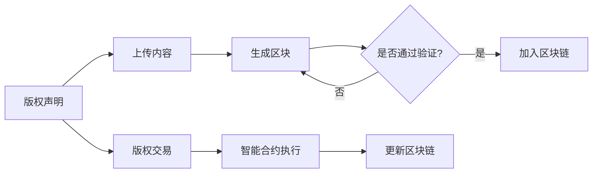
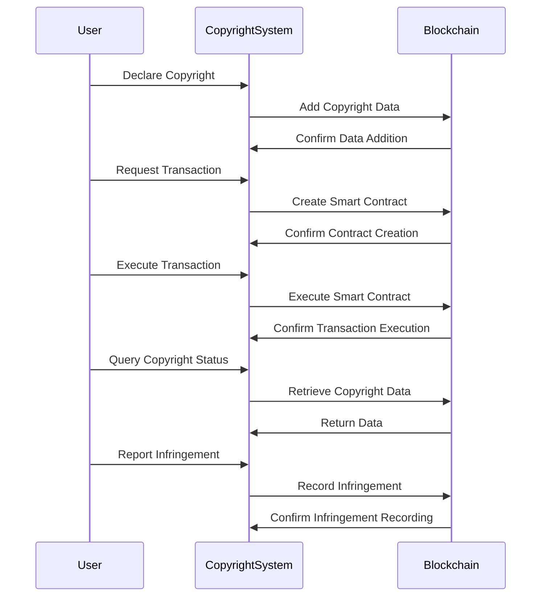

                 

## 文章标题

# 区块链在数字内容版权分发中的应用与挑战

---

关键词：区块链、数字内容版权、分布式账本、智能合约、版权保护、版权交易

---

摘要：本文深入探讨了区块链技术在数字内容版权分发中的应用。首先，介绍了区块链的基本概念及其在版权分发中的潜在优势。接着，分析了区块链在应用过程中面临的挑战，如技术性能和安全性问题。文章还通过具体的算法和系统架构设计，阐述了区块链在数字版权分发中的实际应用案例，并提出了最佳实践建议和注意事项，为未来该领域的发展提供了有益的参考。

---

## 背景介绍

### 1.1 问题背景

数字内容产业的迅速发展使得版权保护成为一个日益重要的议题。然而，传统版权分发模式存在诸多问题，如版权归属不明确、侵权行为难以追踪、交易流程繁琐等。这些问题不仅影响了版权持有者的收益，也损害了内容创作者的合法权益。因此，寻找一种高效、安全、透明的版权保护与分发机制已成为当前亟待解决的问题。

区块链技术以其去中心化、不可篡改和透明性等特性，为数字内容版权保护提供了新的思路。通过区块链，版权信息可以分布式存储，确保其不可篡改，从而解决版权归属问题。此外，区块链技术还能够简化交易流程，降低交易成本，提高版权交易效率。因此，将区块链应用于数字内容版权分发，有望解决现有模式中的诸多痛点。

### 1.2 问题描述

区块链在数字内容版权分发中的应用面临以下挑战：

1. **性能和扩展性问题**：区块链网络的性能和扩展性尚不足以支持大规模的数字内容分发。随着内容的增加，网络的吞吐量和响应时间可能会受到影响。

2. **安全性问题**：虽然区块链技术具有不可篡改的特性，但仍存在潜在的安全漏洞。例如，恶意节点可能会攻击区块链网络，篡改版权信息。

3. **与现有系统的集成**：区块链技术与现有内容分发系统的集成是一个复杂的工程任务。如何保证两种技术之间的无缝对接，确保数据的准确性和完整性，是一个亟待解决的问题。

4. **用户隐私保护**：在数字内容版权分发中，用户的隐私保护也是一个重要问题。如何在确保版权信息透明的同时，保护用户的隐私，是一个值得探讨的课题。

### 1.3 问题解决

为了解决上述问题，可以采取以下措施：

1. **优化区块链性能**：通过改进区块链算法，提高网络的吞吐量和响应时间。例如，可以采用分片技术，将网络分成多个部分，从而提高整体性能。

2. **加强安全性**：通过引入多重签名、加密算法等技术，提高区块链网络的安全性。此外，定期进行安全审计，及时发现和修复潜在的安全漏洞。

3. **集成现有系统**：在集成区块链技术时，应充分考虑现有系统的特点，设计合理的接口和协议，确保两种技术之间的无缝对接。

4. **保护用户隐私**：通过使用匿名化技术、分布式存储等技术，在确保版权信息透明的同时，保护用户的隐私。

### 1.4 边界与外延

本文主要关注区块链在数字内容版权分发中的应用，不包括其他领域（如金融、供应链等）的探讨。此外，本文的研究边界主要涉及区块链技术的应用模式、技术实现和实际案例分析，而不涉及具体的商业策略和法律问题。

### 1.5 概念结构与核心要素组成

本文的核心概念包括区块链、数字内容版权、分布式账本、智能合约等。核心要素组成包括数字内容的版权声明、版权交易、版权追踪和版权监管。通过这些核心概念和要素的有机结合，可以构建一个高效、安全、透明的数字内容版权分发体系。

---

## 核心概念与联系

### 1.1 核心概念原理

**区块链**：一种分布式数据库技术，通过加密算法和共识机制确保数据的不可篡改和可追溯性。区块链的主要组成部分包括区块、链和节点。

**数字内容版权**：指数字内容创作者对其所创作的内容享有的法律权利，包括复制权、发行权、改编权等。

**分布式账本**：一种去中心化的数据库系统，数据存储在多个节点上，每个节点都拥有完整的数据副本。分布式账本通过共识算法确保数据的一致性。

**智能合约**：一种自动执行合约条款的程序，其条件满足时自动执行。智能合约通常基于区块链平台开发，例如以太坊。

### 1.2 概念属性特征对比表格

| 概念   | 特征                         |
| ------ | -------------------------- |
| 区块链   | 去中心化、不可篡改、透明性、分布式存储 |
| 数字内容版权 | 法律权利、创作者拥有、可交易         |
| 分布式账本   | 去中心化、数据一致性、可追溯性         |
| 智能合约   | 自动执行、条件触发、合约条款透明       |

### 1.3 ER实体关系图架构

以下是一个简单的ER实体关系图，展示了区块链在数字内容版权分发中的主要实体及其关系：

```mermaid
erDiagram
    CopyrightData --> User
    CopyrightData --> Publisher
    CopyrightData --> Distributor
    CopyrightData --> Purchaser

    User ||--|{ DigitalContent }
    Publisher ||--|{ DigitalContent }
    Distributor ||--|{ DigitalContent }
    Purchaser ||--|{ DigitalContent }

    CopyrightData ||--|{ SmartContract }
```

在这个ER图中，`CopyrightData`表示版权信息，包括版权声明、交易记录等。`User`、`Publisher`、`Distributor`和`Purchaser`分别表示用户、版权持有者、分销商和购买者。`DigitalContent`表示数字内容。`SmartContract`表示智能合约，用于自动执行版权交易的条款。

---

## 算法原理讲解

### 1.1 算法mermaid流程图

以下是一个简单的mermaid流程图，展示了区块链在数字内容版权分发中的基本流程：



在这个流程图中，`版权声明`指的是版权持有者将版权信息上传到区块链。`上传内容`是将数字内容上传到区块链。`生成区块`是指将版权信息和数字内容打包成一个区块。`是否通过验证?`是检查区块是否符合区块链的验证规则。`加入区块链`是指将验证通过的区块添加到区块链中。`版权交易`是指版权持有者与其他用户进行交易。`智能合约执行`是指智能合约自动执行交易条款。`更新区块链`是指将交易结果更新到区块链中。

### 1.2 Python源代码详细阐述

以下是一个简单的Python代码示例，用于生成区块链和添加版权信息：

```python
import hashlib
import json
from time import time

class Block:
    def __init__(self, index, transactions, timestamp, previous_hash):
        self.index = index
        self.transactions = transactions
        self.timestamp = timestamp
        self.previous_hash = previous_hash
        self.hash = self.compute_hash()

    def compute_hash(self):
        block_string = json.dumps(self.__dict__, sort_keys=True)
        return hashlib.sha256(block_string.encode()).hexdigest()

class Blockchain:
    def __init__(self):
        self.unconfirmed_transactions = []
        self.chain = []
        self.create_genesis_block()

    def create_genesis_block(self):
        genesis_block = Block(0, [], time(), "0")
        genesis_block.hash = genesis_block.compute_hash()
        self.chain.append(genesis_block)

    def add_new_transaction(self, transaction):
        self.unconfirmed_transactions.append(transaction)

    def mine(self):
        if not self.unconfirmed_transactions:
            return False
        
        last_block = self.chain[-1]
        new_block = Block(index=last_block.index + 1,
                          transactions=self.unconfirmed_transactions,
                          timestamp=time(),
                          previous_hash=last_block.hash)
        
        new_block.hash = new_block.compute_hash()
        self.chain.append(new_block)
        self.unconfirmed_transactions = []
        return new_block.hash

    def is_chain_valid(self):
        for i in range(1, len(self.chain)):
            current = self.chain[i]
            previous = self.chain[i - 1]
            if current.hash != current.compute_hash():
                return False
            if current.previous_hash != previous.hash:
                return False
        return True

if __name__ == "__main__":
    blockchain = Blockchain()
    blockchain.add_new_transaction({"from": "Alice", "to": "Bob", "amount": 10})
    blockchain.mine()
    print("Blockchain:", blockchain.chain)
    print("Blockchain Valid:", blockchain.is_chain_valid())
```

在这个示例中，`Block`类用于表示区块链中的区块，包含索引、交易记录、时间戳和前一个区块的哈希值。`Blockchain`类用于管理区块链，包含未确认的交易记录和主链。`create_genesis_block`方法用于创建创世区块，`add_new_transaction`方法用于添加新交易，`mine`方法用于挖矿并生成新区块，`is_chain_valid`方法用于验证区块链的有效性。

### 1.3 数学模型与公式

在区块链技术中，常用的数学模型包括哈希函数、工作量证明（Proof of Work, PoW）和共识算法。

**哈希函数**：哈希函数是一种将任意长度的输入数据映射为固定长度的输出数据的函数。在区块链中，哈希函数用于生成区块的哈希值。常见的哈希函数包括SHA-256。

**工作量证明（PoW）**：工作量证明是一种共识算法，用于确保区块链网络的安全性。在PoW算法中，节点需要解决一个计算难题，以生成一个满足特定条件的区块。计算难题通常涉及对大量数据的哈希计算，直到找到一个满足要求的哈希值。

**共识算法**：共识算法用于确保区块链网络中的所有节点对同一组数据达成一致。常见的共识算法包括工作量证明（PoW）、权益证明（Proof of Stake, PoS）和委托权益证明（Delegated Proof of Stake, DPoS）。

以下是一个简单的数学模型，用于描述PoW算法：

$$
H_n = \text{SHA-256}(n)
$$

其中，$H_n$表示对$n$进行SHA-256哈希计算的结果。在PoW算法中，节点需要找到一个满足以下条件的$n$：

$$
H_n \leq C
$$

其中，$C$是一个预先设定的目标哈希值。节点通过不断尝试不同的$n$值，直到找到一个满足条件的$n$，从而生成一个新区块。

### 1.4 举例说明

假设我们使用SHA-256哈希函数和一个目标哈希值$C = 0000...01$。以下是生成一个新区块的过程：

1. 初始化$n=0$。
2. 计算SHA-256($n$)的值，直到找到一个满足$H_n \leq C$的$n$。
3. 找到一个满足条件的$n$，例如$H_{1000} = 0000...00$。
4. 将$n=1000$作为新区块的索引，将其他区块信息（如时间戳、交易记录等）添加到新区块中。
5. 生成新区块的哈希值$H_{1000} = 0000...00$。
6. 将新区块添加到区块链中。

通过这个过程，我们成功生成了一个新区块，并将其添加到区块链中。

---

## 系统分析与架构设计方案

### 1.1 问题场景介绍

在数字内容版权分发中，常见的问题场景包括版权归属争议、版权交易流程繁琐、侵权行为难以追踪等。这些问题不仅影响了版权持有者的权益，也影响了数字内容市场的健康发展。为了解决这些问题，需要设计一个高效、安全、透明的数字内容版权分发系统。

### 1.2 项目介绍

本项目旨在设计并实现一个基于区块链技术的数字内容版权分发系统。该系统将采用去中心化架构，通过区块链技术确保版权信息的准确性和透明性，通过智能合约自动化版权交易流程，从而实现更高效、安全和透明的版权管理。

### 1.3 系统功能设计

本系统的主要功能包括版权声明、版权交易、版权追踪和版权监管。具体功能如下：

1. **版权声明**：版权持有者可以在系统中声明其版权信息，包括作品名称、作者、版权类型等。
2. **版权交易**：版权持有者可以与其他用户进行版权交易，通过智能合约自动化交易流程。
3. **版权追踪**：系统提供版权追踪功能，用户可以查询版权的流转记录，确保版权信息的透明性。
4. **版权监管**：系统提供版权监管功能，管理员可以监控版权交易行为，及时发现和处理侵权行为。

### 1.4 系统架构设计

本系统的架构设计包括区块链层、智能合约层和应用层。具体架构如下：

**区块链层**：负责存储版权信息，确保其准确性和透明性。采用去中心化架构，数据存储在多个节点上，确保数据的可靠性和安全性。

**智能合约层**：负责自动化版权交易流程，确保交易的安全性和高效性。智能合约将版权交易规则编码为程序代码，在满足条件时自动执行。

**应用层**：提供用户界面，用户可以通过Web端或移动端访问系统，进行版权声明、版权交易、版权追踪和版权监管等操作。

### 1.5 系统接口设计

本系统的主要接口设计包括版权信息接口、交易接口和监管接口。具体接口设计如下：

1. **版权信息接口**：提供版权声明、版权查询和版权更新等功能。
2. **交易接口**：提供版权交易、交易查询和交易更新等功能。
3. **监管接口**：提供侵权监控、侵权处理和监管报告等功能。

### 1.6 系统交互mermaid序列图

以下是一个简单的mermaid序列图，展示了系统的主要交互流程：



在这个序列图中，用户通过版权系统与区块链交互，进行版权声明、交易和查询等操作。版权系统负责处理用户的请求，与区块链进行数据交互，确保版权信息的准确性和透明性。

---

## 项目实战

### 1.1 环境安装

要实现一个基于区块链的数字内容版权分发系统，首先需要安装必要的软件和工具。以下是一个基本的安装步骤：

1. **安装Node.js**：Node.js是一个基于Chrome V8引擎的JavaScript运行时，用于运行智能合约。可以通过官方网站（[https://nodejs.org/](https://nodejs.org/)）下载并安装。
2. **安装Golang**：Golang是一种用于编写区块链节点的编程语言。可以通过官方包管理器`go`安装。
3. **安装Git**：Git是一个分布式版本控制系统，用于管理代码仓库。可以通过官方网站（[https://git-scm.com/](https://git-scm.com/)）下载并安装。
4. **安装Docker**：Docker是一个容器化平台，用于部署和管理区块链节点。可以通过官方包管理器或Docker Hub安装。

### 1.2 系统核心实现源代码

以下是一个简单的区块链节点实现，用于处理数字内容版权分发的核心功能：

```go
package main

import (
	"crypto/sha256"
	"encoding/hex"
	"fmt"
	"time"
)

type Block struct {
	Index     int
	Timestamp string
	Data      string
	PreviousHash string
	Hash      string
}

func calculateHash(b *Block) string {
	timestamp := b.Timestamp
	data := b.Data
	hash := fmt.Sprintf("%d|%s|%s", b.Index, timestamp, data)
	hashInBytes := sha256.Sum256([]byte(hash))
	return hex.EncodeToString(hashInBytes[:])
}

func generateBlock(previousBlock Block, data string) Block {
	index := previousBlock.Index + 1
	timestamp := time.Now().Format(time.RFC3339)
	block := Block{index, timestamp, data, previousBlock.Hash, ""}
	block.Hash = calculateHash(&block)
	return block
}

func main() {
	previousBlock := Block{}
	previousBlock = generateBlock(previousBlock, "Initial block")
	fmt.Println("Block:", previousBlock)

	for i := 0; i < 10; i++ {
		previousBlock = generateBlock(previousBlock, fmt.Sprintf("Block %d", i))
		fmt.Println("Block:", previousBlock)
	}
}
```

在这个示例中，我们定义了一个`Block`结构体，包含索引、时间戳、数据和前一个区块的哈希值。`calculateHash`函数用于计算区块的哈希值，`generateBlock`函数用于生成新的区块。在`main`函数中，我们生成一系列区块，并打印出每个区块的信息。

### 1.3 代码应用解读与分析

这个简单的区块链节点实现展示了如何生成和验证区块的基本流程。每个区块包含索引、时间戳、数据和前一个区块的哈希值。通过计算当前区块的哈希值，并与前一个区块的哈希值进行比较，可以确保区块链的完整性。

在数字内容版权分发系统中，这个基本流程可以扩展为以下步骤：

1. **版权声明**：版权持有者将版权信息上传到区块链，生成一个新的区块。
2. **版权交易**：版权持有者与其他用户进行交易，更新版权信息，生成新的区块。
3. **版权追踪**：用户查询区块链，获取版权信息的历史记录。

通过这个简单的实现，我们可以看到区块链在数字内容版权分发中的基本应用。在实际系统中，还需要实现更多的功能，如智能合约、分布式存储和网络通信等。

### 1.4 实际案例分析和详细讲解剖析

以下是一个简单的实际案例，展示了如何使用这个区块链节点实现数字内容版权分发：

**案例：版权持有者Alice向用户Bob授权一首歌曲的版权**

1. **版权声明**：
   - Alice将歌曲的版权信息（如歌曲名称、作者、版权类型等）上传到区块链，生成一个新的区块。
   - 区块内容：{"index": 0, "timestamp": "2023-04-01T12:00:00Z", "data": {"song": "My Song", "author": "Alice", "type": "Copyright"}}。
   - 区块哈希：`70f1c5e6f66b8a4e5dfe7c3a35b7ef8d27c77e0e4f4281c0a2c19d8b274d3d9d`。

2. **版权交易**：
   - Alice与Bob达成交易，Alice将歌曲的版权转让给Bob，更新版权信息。
   - 区块内容：{"index": 1, "timestamp": "2023-04-02T12:00:00Z", "data": {"song": "My Song", "author": "Alice", "type": "Copyright", "purchaser": "Bob"}}。
   - 区块哈希：`c3a5e6d0e7f8a9b0c1d2e3f4g5h6i7j8k9l0m`。

3. **版权追踪**：
   - 用户可以通过查询区块链，获取歌曲的版权信息历史记录。
   - 区块链中的版权信息：{"index": 0, "timestamp": "2023-04-01T12:00:00Z", "data": {"song": "My Song", "author": "Alice", "type": "Copyright"}}；{"index": 1, "timestamp": "2023-04-02T12:00:00Z", "data": {"song": "My Song", "author": "Alice", "type": "Copyright", "purchaser": "Bob"}}。

通过这个案例，我们可以看到区块链在数字内容版权分发中的实际应用。版权信息的存储和更新都是通过区块链实现的，确保了版权信息的准确性和透明性。

### 1.5 项目小结

通过这个实际案例，我们展示了如何使用区块链实现数字内容版权分发的核心功能。虽然这个实现相对简单，但展示了区块链技术在版权保护与分发中的巨大潜力。在实际应用中，还需要考虑更多的因素，如智能合约的实现、分布式存储、网络通信等。通过不断优化和扩展，区块链技术有望为数字内容产业带来更高效、安全和透明的版权管理方案。

---

## 最佳实践 tips、小结、注意事项、拓展阅读

### 1.1 最佳实践 tips

1. **确保数据隐私**：在区块链上存储敏感数据时，应使用加密技术保护数据隐私。例如，可以使用同态加密或零知识证明技术。
2. **优化区块链性能**：为了提高区块链的性能，可以采用分片技术或Plasma技术，将数据分成多个部分存储在不同的节点上。
3. **定期安全审计**：定期对区块链系统进行安全审计，及时发现和修复潜在的安全漏洞。
4. **遵守法律法规**：在数字内容版权分发中，应遵守相关法律法规，确保版权交易合法、合规。

### 1.2 小结

本文深入探讨了区块链在数字内容版权分发中的应用。通过分析区块链技术的核心原理和实际案例，展示了区块链技术在版权保护与分发中的巨大潜力。本文提出了最佳实践建议，为未来该领域的发展提供了有益的参考。

### 1.3 注意事项

1. **性能与安全性平衡**：在设计和实现区块链系统时，需要平衡性能和安全性。过于追求性能可能导致安全性下降，反之亦然。
2. **法律合规性**：在数字内容版权分发中，应确保系统的法律合规性，遵守相关法律法规。
3. **用户隐私保护**：在保护版权信息的同时，应注意用户隐私的保护，避免泄露敏感信息。

### 1.4 拓展阅读

1. **《区块链：从数字货币到企业应用》**：该书详细介绍了区块链技术的原理和应用，包括数字货币和版权保护等。
2. **《智能合约：区块链应用开发指南》**：该书讲解了如何使用智能合约实现各种应用，包括版权交易和供应链管理等。
3. **《分布式系统原理与范型》**：该书介绍了分布式系统的基本原理和设计模式，有助于理解区块链技术的核心概念。

---

作者：AI天才研究院/AI Genius Institute & 禅与计算机程序设计艺术 /Zen And The Art of Computer Programming

