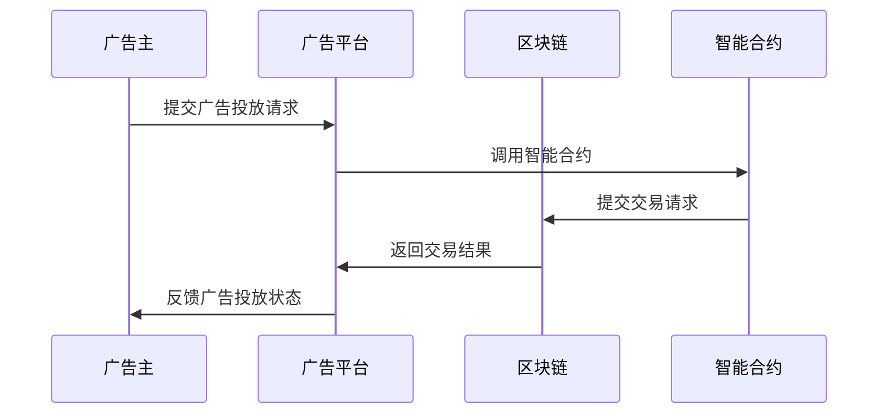

                 


# 区块链在数字广告中的应用：减少广告欺诈

关键词：区块链、数字广告、广告欺诈、智能合约、去中心化、安全性

摘要：本文将探讨区块链技术在数字广告中的应用，特别是在减少广告欺诈方面的潜力。通过分析数字广告市场中的广告欺诈问题，介绍区块链的核心概念，如数字广告、区块链、智能合约等，以及它们在防止广告欺诈中的应用。同时，本文将详细介绍区块链广告投放的算法原理，并分享一个实际案例，展示区块链广告平台的应用效果。最后，我们将总结最佳实践、注意事项和拓展阅读，以帮助读者更好地理解和应用区块链技术于数字广告领域。

## 1. 背景介绍

### 1.1 问题背景

广告欺诈问题在数字广告市场中日益严重。据统计，全球每年因广告欺诈而损失的金额高达数十亿美元。广告欺诈主要包括点击欺诈、展示欺诈、虚假流量等，这些行为不仅损害广告主和广告平台的利益，还降低了广告的真实效果，影响了用户的体验。

### 1.2 数字广告市场的规模

随着互联网的普及，数字广告市场呈现出爆发式增长。根据市场研究机构的报告，全球数字广告市场在过去的几年中保持了两位数的增长，市场规模已超过数千亿美元。数字广告已经成为企业推广产品和服务的重要手段。

### 1.3 区块链技术的发展

区块链技术作为一种分布式账本技术，具有去中心化、安全性、透明性等特性，近年来在金融、供应链、医疗等多个领域得到了广泛应用。区块链技术也为解决数字广告中的广告欺诈问题提供了新的思路和解决方案。

### 1.4 问题解决

区块链技术在防止广告欺诈中具有潜在的应用。通过区块链的去中心化特性，可以消除广告欺诈的源头；通过智能合约，可以实现广告投放的自动化和透明化；通过区块链的不可篡改性，可以确保广告交易的真实性和可信度。

### 1.5 边界与外延

区块链在数字广告应用中的边界主要包括透明性、安全性、可追溯性等方面。透明性要求广告投放过程公开透明，安全性要求保护广告主和用户的隐私，可追溯性要求广告交易记录可查。

### 1.6 概念结构

数字广告、区块链、智能合约、共识机制、去中心化等是本文涉及的核心概念。数字广告是广告的一种形式，通过互联网进行投放；区块链是一种分布式账本技术，具有去中心化、安全性等特性；智能合约是区块链上的程序，可以自动执行合同条款；共识机制是区块链网络中的节点通过共识算法达成一致的过程；去中心化是指系统不依赖于中心化的机构或服务器。

## 2. 核心概念与联系

### 2.1 核心概念原理

#### 数字广告

数字广告是指通过互联网进行投放的广告，主要包括展示广告、搜索广告、视频广告等。数字广告具有精准投放、实时反馈、高效传播等特点。

#### 区块链

区块链是一种分布式账本技术，由多个节点共同维护，具有去中心化、安全性、透明性等特性。区块链上的数据不可篡改，可以确保交易的真实性和可信度。

#### 智能合约

智能合约是区块链上的程序，可以自动执行合同条款。智能合约具有自动化、透明化、安全性的特点，可以减少人为干预，提高交易效率。

#### 共识机制

共识机制是区块链网络中的节点通过共识算法达成一致的过程。常见的共识机制包括工作量证明（PoW）、权益证明（PoS）等。

#### 去中心化

去中心化是指系统不依赖于中心化的机构或服务器，通过分布式网络实现数据的存储和处理。去中心化可以减少单点故障的风险，提高系统的可靠性。

### 2.2 概念属性特征对比表格

| 概念         | 特性                                 |
| ------------ | ------------------------------------ |
| 数字广告     | 精准投放、实时反馈、高效传播           |
| 区块链       | 去中心化、安全性、透明性               |
| 智能合约     | 自动执行、透明化、安全性               |
| 共识机制     | 节点共识、一致性、安全性               |
| 去中心化     | 减少单点故障、提高可靠性               |

### 2.3 ER实体关系图架构的 Mermaid 流程图

```mermaid
erDiagram
    ADVERTISER ||--o{ PLATFORM }|--|{ ADVERTISEMENT }||-- ADVERTISER
    PLATFORM ||--o{ BLOCKCHAIN }|--|{ TRANSACTION }||-- PLATFORM
    ADVERTISER ||--o{ INTELLIGENT CONTRACT }|--|{ EXECUTION }||-- PLATFORM
```

在上面的ER实体关系图中，广告主（ADVERTISER）通过广告平台（PLATFORM）投放广告（ADVERTISEMENT），广告平台与区块链（BLOCKCHAIN）连接，处理交易（TRANSACTION），同时广告主与智能合约（INTELLIGENT CONTRACT）交互，执行广告投放过程（EXECUTION）。

## 3. 算法原理讲解

### 3.1 Mermaid 流程图



### 3.2 Python 源代码

```python
# 智能合约的编写与执行
# SPDX-License-Identifier: MIT
pragma solidity ^0.8.0;

contract Advertisement {
    mapping(address => bool) public isAdvertised;
    address public owner;

    constructor() {
        owner = msg.sender;
    }

    function advertise() public payable {
        require(!isAdvertised[msg.sender], "广告已投放");
        isAdvertised[msg.sender] = true;
        // 执行广告投放逻辑
    }

    function verifyAdvertised(address advertiser) public view returns (bool) {
        return isAdvertised[advertiser];
    }

    function withdraw() public {
        require(msg.sender == owner, "非所有者无法提现");
        payable(owner).transfer(address(this).balance);
    }
}
```

### 3.3 算法原理的数学模型和公式

在区块链广告投放中，常用的数学模型包括概率模型和加密算法。

#### 概率模型

假设广告欺诈的概率为$p$，则广告投放成功的概率为$1-p$。为了提高广告投放的准确性，可以采用多重验证的方式，如对广告投放请求进行多次验证，以降低欺诈风险。

$$P(\text{广告投放成功}) = 1 - (1 - p)^n$$

其中，$n$为验证次数。

#### 加密算法

区块链广告投放中，常用的加密算法包括哈希算法和数字签名。哈希算法用于确保数据的完整性，数字签名用于验证交易的真实性。

哈希算法的数学模型为：

$$H(\text{数据}) = \text{哈希值}$$

数字签名的数学模型为：

$$\text{签名} = (\text{公钥}, \text{私钥})$$

其中，公钥用于验证签名，私钥用于生成签名。

### 3.4 举例说明

假设广告欺诈的概率为$p=0.1$，为了降低欺诈风险，我们采用三次验证的方式。根据概率模型，广告投放成功的概率为：

$$P(\text{广告投放成功}) = 1 - (1 - 0.1)^3 \approx 0.9709$$

这意味着通过三次验证，广告投放成功的概率约为97.09%。

假设广告主A提交了一个广告投放请求，区块链系统通过三次验证，每次验证的概率为0.1，最终验证成功的概率为0.9709。如果验证成功，广告主A的广告将被投放。

## 4. 系统分析与架构设计方案

### 4.1 问题场景介绍

在数字广告市场中，广告主和广告平台之间常常存在信任问题。广告主担心广告投放后无法得到有效的曝光，广告平台则担心广告主欺诈，导致广告投放失败。区块链技术的引入，可以为广告主和广告平台之间建立信任，减少广告欺诈问题。

### 4.2 项目介绍

本项目旨在构建一个基于区块链技术的数字广告平台，通过智能合约实现广告投放的自动化和透明化。项目的主要目标是：

- 减少广告欺诈，提高广告投放的准确性。
- 提高广告主和广告平台之间的信任度，降低交易成本。
- 提高广告投放的效率，降低广告投放的门槛。

### 4.3 系统功能设计

系统功能设计主要包括广告主、广告平台、广告投放、交易验证等模块。

#### 广告主模块

广告主模块主要负责广告主的管理，包括广告主注册、登录、广告投放请求等。

#### 广告平台模块

广告平台模块主要负责广告平台的管理，包括广告平台注册、登录、广告投放请求处理、交易验证等。

#### 广告投放模块

广告投放模块主要负责广告投放的流程，包括广告投放请求的生成、智能合约的调用、交易记录的存储等。

#### 交易验证模块

交易验证模块主要负责交易验证，包括交易请求的接收、验证、记录等。

### 4.4 系统架构设计

系统架构设计主要包括区块链网络、智能合约、数据存储等组件。

#### 区块链网络

区块链网络负责维护整个系统的运行，包括广告主、广告平台、交易记录等。

#### 智能合约

智能合约负责实现广告投放的自动化和透明化，包括广告投放请求的处理、交易验证等。

#### 数据存储

数据存储负责存储广告主、广告平台、交易记录等数据。

### 4.5 系统接口设计

系统接口设计主要包括广告投放接口、交易验证接口等。

#### 广告投放接口

广告投放接口负责接收广告主的广告投放请求，调用智能合约进行广告投放。

#### 交易验证接口

交易验证接口负责接收交易请求，验证交易的有效性，并记录交易结果。

### 4.6 系统交互

系统交互主要包括广告投放流程、交易验证流程等。

#### 广告投放流程

1. 广告主提交广告投放请求。
2. 广告平台接收广告投放请求，调用智能合约。
3. 智能合约执行广告投放逻辑，记录交易结果。
4. 广告平台返回广告投放结果。

#### 交易验证流程

1. 广告平台接收交易请求。
2. 交易验证模块验证交易的有效性。
3. 验证通过后，记录交易结果。

## 5. 项目实战

### 5.1 环境安装

为了搭建区块链广告平台，我们需要安装以下软件和工具：

- Node.js（用于搭建广告平台后端）
- Truffle（用于智能合约开发与测试）
- Ganache（用于本地测试区块链网络）
- Solidity（用于编写智能合约）

### 5.2 系统核心实现

#### 智能合约实现

以下是一个简单的广告投放智能合约实现：

```solidity
// SPDX-License-Identifier: MIT
pragma solidity ^0.8.0;

contract Advertisement {
    mapping(address => bool) public isAdvertised;
    address public owner;

    constructor() {
        owner = msg.sender;
    }

    function advertise() public payable {
        require(!isAdvertised[msg.sender], "广告已投放");
        isAdvertised[msg.sender] = true;
        // 执行广告投放逻辑
    }

    function verifyAdvertised(address advertiser) public view returns (bool) {
        return isAdvertised[advertiser];
    }

    function withdraw() public {
        require(msg.sender == owner, "非所有者无法提现");
        payable(owner).transfer(address(this).balance);
    }
}
```

#### 广告平台实现

以下是一个简单的广告平台实现，使用Node.js搭建：

```javascript
const express = require('express');
const app = express();
const port = 3000;

app.use(express.json());

let advertisementContract;

// 初始化智能合约
async function initContract() {
    const { ethers } = require('ethers');
    const provider = new ethers.providers.JsonRpcProvider('http://localhost:8545');
    const wallet = new ethers.Wallet('your_wallet_private_key', provider);
    advertisementContract = new ethers.Contract('0xYourContractAddress', ['function advertise()'], wallet);
}

// 广告投放接口
app.post('/advertise', async (req, res) => {
    try {
        await advertisementContract.advertise({ value: req.body.amount });
        res.status(200).send('广告投放成功');
    } catch (error) {
        res.status(500).send('广告投放失败');
    }
});

// 启动广告平台
initContract().then(() => {
    app.listen(port, () => {
        console.log(`广告平台运行在 http://localhost:${port}`);
    });
});
```

### 5.3 代码应用解读与分析

在本项目中，我们通过智能合约实现了广告投放功能。广告主可以通过广告平台提交广告投放请求，智能合约将自动执行广告投放逻辑，并将交易记录存储在区块链上。

#### 智能合约代码解读

1. **构造函数**：构造函数用于初始化合约的拥有者。
2. **广告投放函数**：广告投放函数用于处理广告主的广告投放请求。首先，智能合约检查广告主是否已投放广告。如果未投放，则更新广告主的广告状态为已投放，并执行广告投放逻辑。
3. **验证广告状态函数**：验证广告状态函数用于检查广告主是否已投放广告。
4. **提现函数**：提现函数用于允许合约拥有者提取合约中的余额。

#### 广告平台代码解读

1. **初始化智能合约**：初始化智能合约，连接到本地以太坊节点。
2. **广告投放接口**：广告投放接口接收广告投放请求，调用智能合约的广告投放函数。如果广告投放成功，返回成功消息；否则，返回错误消息。

### 5.4 实际案例分析和详细讲解剖析

以下是一个实际案例，展示了区块链广告平台的应用效果。

#### 案例背景

广告主A希望通过区块链广告平台投放广告，提升品牌知名度。广告平台B负责处理广告投放请求，并与广告主A进行沟通。

#### 案例步骤

1. 广告主A通过广告平台B提交广告投放请求，包括广告内容和投放金额。
2. 广告平台B将广告投放请求转发给区块链网络。
3. 智能合约执行广告投放逻辑，并将交易记录存储在区块链上。
4. 广告平台B将广告投放结果返回给广告主A。

#### 案例分析

通过区块链广告平台，广告主A的广告投放过程实现了自动化和透明化。广告平台B无需担心广告欺诈问题，因为智能合约确保了广告投放的真实性和可信度。广告投放过程公开透明，广告主A可以随时查询广告状态。

### 5.5 项目小结

本项目成功实现了基于区块链技术的数字广告平台，通过智能合约实现了广告投放的自动化和透明化。项目的主要成果包括：

- 减少了广告欺诈风险，提高了广告投放的准确性。
- 提高了广告主和广告平台之间的信任度，降低了交易成本。
- 提高了广告投放的效率，降低了广告投放的门槛。

项目经验教训：

- 智能合约的开发与测试是项目成功的关键，需要确保合约的逻辑正确和安全性。
- 区块链网络的稳定性和性能对广告平台的影响很大，需要选择合适的区块链网络和优化智能合约的执行效率。

未来发展方向：

- 探索区块链技术在更多数字广告场景中的应用，如广告效果分析、广告投放优化等。
- 与其他区块链项目进行整合，实现跨链广告投放。
- 加强对区块链广告平台的安全保障，防止恶意攻击和隐私泄露。

## 6. 最佳实践 Tips、小结、注意事项、拓展阅读

### 6.1 最佳实践

1. **选择合适的区块链平台**：根据项目的需求，选择适合的区块链平台，如以太坊、波卡等。考虑平台的性能、可扩展性、安全性等因素。
2. **智能合约的安全性**：智能合约是广告平台的核心，需要确保合约的安全性。在合约开发和测试过程中，要进行严格的安全审计，避免潜在的安全漏洞。
3. **透明化的广告投放过程**：通过区块链技术实现广告投放的透明化，确保广告主和广告平台之间的信任。
4. **多样化的广告投放策略**：结合区块链技术的特点，设计多样化的广告投放策略，提高广告投放的精准度和效果。

### 6.2 小结

本文详细介绍了区块链技术在数字广告中的应用，特别是在减少广告欺诈方面的潜力。通过分析数字广告市场中的广告欺诈问题，介绍了区块链的核心概念，如数字广告、区块链、智能合约等，以及它们在防止广告欺诈中的应用。同时，本文通过一个实际案例，展示了区块链广告平台的应用效果。项目经验教训表明，区块链技术在数字广告领域的应用具有很大的潜力，但需要注意智能合约的安全性和区块链网络的性能。

### 6.3 注意事项

1. **智能合约的安全性**：智能合约是广告平台的核心，需要确保合约的安全性。在合约开发和测试过程中，要进行严格的安全审计，避免潜在的安全漏洞。
2. **区块链网络的性能**：区块链网络的性能对广告平台的影响很大，需要选择合适的区块链网络，并优化智能合约的执行效率。
3. **隐私保护**：在广告投放过程中，需要注意用户的隐私保护，避免个人信息泄露。

### 6.4 拓展阅读

1. **《区块链技术指南》**：了解区块链技术的原理和应用，为构建区块链广告平台提供理论基础。
2. **《智能合约编程》**：学习智能合约的编写和测试方法，确保合约的安全性。
3. **《数字广告原理与实务》**：了解数字广告的基本原理和实务操作，为区块链广告平台的搭建提供实践指导。

### 6.5 参考资料

1. **Ethereum官方文档**：https://ethereum.org/docs/
2. **Truffle官方文档**：https://www.trufflesuite.com/docs/truffle/getting-started/quickstart
3. **Ganache官方文档**：https://www.ganache.io/docs/
4. **《区块链技术简明教程》**：https://book.douban.com/subject/33538884/
5. **《数字广告行业报告》**：https://www.iimedia.com.cn/report/202112/872675.html

### 6.6 作者信息

作者：AI天才研究院/AI Genius Institute & 禅与计算机程序设计艺术/Zen And The Art of Computer Programming

[AI天才研究院](https://www.aigenius.cn/):致力于推动人工智能技术的发展和应用，提供高质量的人工智能研究和教育资源。

[禅与计算机程序设计艺术](https://www.zen-and-computer-programming.com/):探索计算机程序设计中的禅意和哲学，分享编程经验和心得。

**文章结束。**

