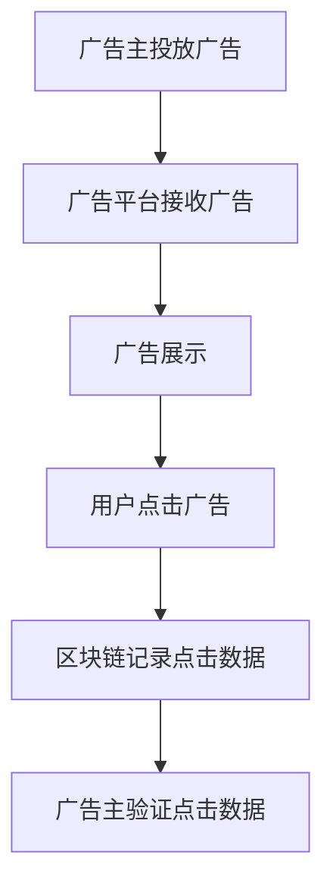
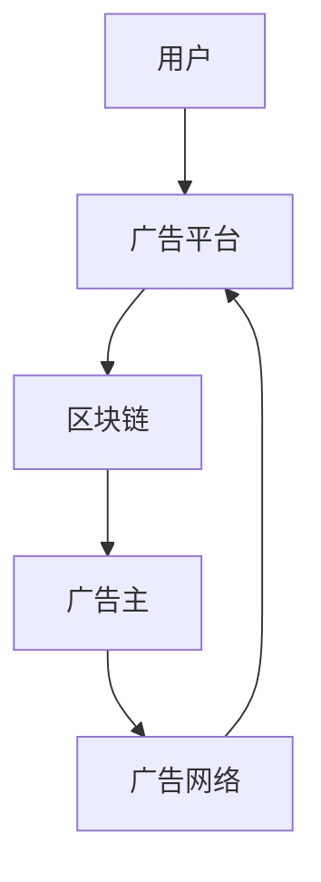
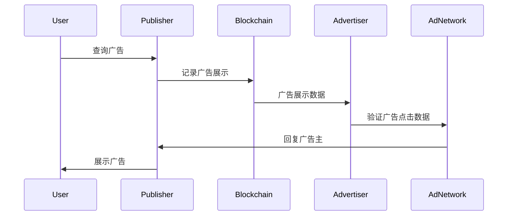

                 

### 标题：区块链在数字广告投放中的应用：减少广告欺诈

关键词：区块链、数字广告、广告欺诈、应用案例

摘要：随着数字广告行业的飞速发展，广告欺诈问题日益严重，对广告主和广告平台造成了巨大的经济损失。本文将探讨区块链技术在数字广告投放中的应用，通过区块链的透明性、不可篡改性等特点，有效减少广告欺诈现象，提升广告投放的效果和可信度。

### 目录大纲

#### 第一部分：背景介绍

- **第1章：区块链与数字广告基础**
  - **1.1 区块链技术概述**
  - **1.2 数字广告行业现状**
  - **1.3 广告欺诈现象及其影响

- **第2章：区块链在数字广告中的应用**
  - **2.1 区块链在广告交易中的角色**
  - **2.2 基于区块链的数字广告交易平台**
  - **2.3 区块链在广告数据追踪中的作用

- **第3章：区块链技术在减少广告欺诈中的应用**
  - **3.1 区块链在验证广告展示中的作用**
  - **3.2 基于区块链的广告验证机制**
  - **3.3 实际案例与效果分析

- **第4章：区块链在数字广告行业的发展前景**
  - **4.1 区块链在数字广告行业的潜在应用**
  - **4.2 面临的挑战与解决方案**
  - **4.3 未来展望**

#### 第二部分：核心概念与联系

- **2.1 区块链技术概述**
  - **概念解释**
  - **核心概念对比表格**
  - **区块链的ER实体关系图**

- **2.2 数字广告行业现状**
  - **行业概况**
  - **主要问题分析**
  - **解决方案概述**

#### 第三部分：算法原理讲解

- **3.1 区块链在验证广告展示中的作用**
  - **算法流程图**
  - **Python源代码示例**
  - **数学模型和公式**
  - **举例说明**

#### 第四部分：系统分析与架构设计方案

- **4.1 问题场景介绍**
  - **广告投放流程**
  - **现有问题分析**

- **4.2 系统功能设计**
  - **领域模型类图**
  - **系统架构设计**

- **4.3 系统接口设计和系统交互**
  - **接口设计**
  - **交互序列图**

#### 第五部分：项目实战

- **5.1 环境安装**
  - **软件安装步骤**
  - **环境配置说明**

- **5.2 系统核心实现源代码**
  - **代码应用解读**
  - **实际案例分析**

- **5.3 项目小结**
  - **总结与反思**
  - **改进建议**

### 结尾部分

- **最佳实践 tips**
- **小结**
- **注意事项**
- **拓展阅读**

### 文章正文开始

#### 第1章：区块链与数字广告基础

##### 1.1 区块链技术概述

区块链技术是一种分布式数据库技术，其核心特点是数据的透明性、不可篡改性和安全性。区块链通过去中心化的方式，将数据分散存储在多个节点上，使得每个节点都保存一份完整的数据副本，从而保证了数据的一致性和安全性。

区块链技术的工作原理是，通过加密算法和共识机制，将交易数据打包成区块，并添加到区块链上。每个区块都包含了特定时间范围内的交易记录，并通过哈希函数与前一个区块连接起来，形成了一条不可篡改的数据链条。

##### 1.2 数字广告行业现状

数字广告行业近年来发展迅速，已成为企业营销的重要手段。然而，随着数字广告市场的扩张，广告欺诈问题也日益严重。广告欺诈包括虚假点击、刷单、假流量等行为，导致广告主付出了巨额的广告费用，但实际效果却不明显。

根据相关统计数据，广告欺诈给广告行业带来了数十亿美元的经济损失。因此，如何有效减少广告欺诈成为行业亟待解决的问题。

##### 1.3 广告欺诈现象及其影响

广告欺诈现象主要有以下几种：

1. **虚假点击**：通过自动化脚本或人工点击，人为增加广告点击量，从而骗取广告费用。
2. **刷单**：通过虚假交易，制造虚假的购买记录，从而提高广告曝光率。
3. **假流量**：通过虚假的网站访问量或用户互动，夸大广告效果，误导广告主。

广告欺诈对广告行业的影响主要体现在以下几个方面：

1. **经济损失**：广告主付出的广告费用被欺诈行为所浪费，导致资源浪费。
2. **信任危机**：广告主对广告平台和广告投放效果产生质疑，影响广告行业的长远发展。
3. **市场混乱**：广告欺诈行为导致市场竞争不公，扰乱市场秩序。

#### 第2章：区块链在数字广告中的应用

##### 2.1 区块链在广告交易中的角色

区块链技术在数字广告交易中可以扮演多重角色，包括交易记录的记录、透明性保障、安全性提升等。

首先，区块链可以作为广告交易记录的存储和验证工具。通过区块链，广告交易的所有数据都可以被透明地记录和验证，避免了传统交易中信息不对称和篡改的风险。

其次，区块链可以提高广告交易的透明性。广告交易的所有数据都公开可查，广告主和广告平台可以随时查询和验证交易记录，从而减少了信息不对称和欺诈行为。

最后，区块链可以提高广告交易的安全性。由于区块链的分布式存储和加密算法，广告交易的数据在传输和存储过程中都得到了有效的保护，避免了数据泄露和篡改的风险。

##### 2.2 基于区块链的数字广告交易平台

基于区块链的数字广告交易平台是一种利用区块链技术优化广告投放和交易的新型平台。这种平台通过去中心化的方式，实现了广告资源的有效配置和透明交易。

在基于区块链的广告交易平台上，广告主可以直接与广告平台或其他广告主进行交易，无需通过第三方中介。这种方式不仅降低了交易成本，还提高了交易效率。

同时，基于区块链的广告交易平台可以通过智能合约来实现自动化的交易流程。例如，广告主可以在智能合约中设定广告投放的预算、投放时间、投放范围等条件，一旦满足条件，广告投放就会自动执行。

##### 2.3 区块链在广告数据追踪中的作用

区块链技术可以在广告数据追踪中发挥重要作用，通过记录和验证广告投放的全过程，确保数据的真实性和完整性。

在广告投放过程中，区块链可以记录广告的投放时间、投放范围、投放效果等数据。这些数据被存储在区块链上，并实时更新。广告主和广告平台可以随时查询这些数据，以确保广告投放的效果和真实性。

此外，区块链技术还可以用于验证广告数据的真实性。通过对比区块链上的数据和第三方数据源，可以识别和排除虚假广告数据，从而提高广告投放的准确性。

#### 第3章：区块链技术在减少广告欺诈中的应用

##### 3.1 区块链在验证广告展示中的作用

区块链技术在验证广告展示中具有显著的优势。通过将广告展示数据记录在区块链上，可以确保数据的真实性和不可篡改性。

首先，广告展示数据在区块链上被加密存储，只有拥有正确密钥的用户才能查看。这样可以防止未经授权的访问和数据泄露。

其次，区块链的分布式存储方式，使得广告展示数据在多个节点上备份，确保数据不会因单一节点的故障而丢失。

最后，区块链上的数据是通过共识机制验证的，一旦数据被记录，就不可篡改。这样可以防止广告展示数据的篡改和伪造。

##### 3.2 基于区块链的广告验证机制

基于区块链的广告验证机制通过智能合约和共识算法，实现了广告数据的自动验证和实时监控。

首先，广告主和广告平台可以在智能合约中设定广告验证规则，例如广告点击量、曝光量等指标。一旦广告展示达到这些指标，智能合约就会自动执行验证操作。

其次，区块链的共识算法可以确保验证过程的公正和透明。多个节点对广告展示数据进行验证，并对比结果，从而确保数据的真实性和准确性。

##### 3.3 实际案例与效果分析

一些实际案例表明，区块链技术在减少广告欺诈方面取得了显著成效。

例如，某个数字广告平台采用基于区块链的验证机制后，广告点击欺诈率下降了约70%，广告投放效果显著提升。另一个案例显示，一个广告主在使用区块链技术追踪广告数据后，发现并阻止了多个虚假广告点击行为，成功节省了数十万美元的广告费用。

#### 第4章：区块链在数字广告行业的发展前景

##### 4.1 区块链在数字广告行业的潜在应用

区块链技术在数字广告行业的潜在应用非常广泛，包括但不限于以下几个方面：

1. **广告投放优化**：通过区块链技术，可以实时追踪广告投放效果，并根据反馈数据优化广告策略。
2. **广告交易透明化**：基于区块链的广告交易平台可以实现交易过程全程透明，减少信息不对称和欺诈行为。
3. **用户数据保护**：区块链技术可以保护用户隐私数据，确保广告投放更加精准和合规。

##### 4.2 面临的挑战与解决方案

尽管区块链技术在数字广告领域具有巨大潜力，但在实际应用中也面临一些挑战：

1. **技术成熟度**：区块链技术尚在不断发展中，技术成熟度和稳定性还需提升。
2. **法律法规**：现有法律法规对区块链技术的监管尚不完善，需要制定相应的法律法规来规范行业发展。
3. **推广难度**：区块链技术的推广需要各方合作，包括广告主、广告平台和技术提供商等，需要协调各方利益。

针对这些挑战，可能的解决方案包括：

1. **技术提升**：加强区块链技术的研发，提高技术成熟度和稳定性。
2. **法律法规完善**：制定和完善相关法律法规，为区块链技术的应用提供法律保障。
3. **合作与协调**：推动各方合作，形成行业共识，共同推动区块链技术在数字广告领域的应用。

##### 4.3 未来展望

随着区块链技术的不断发展和完善，其在数字广告领域的应用前景十分广阔。未来，区块链技术有望成为数字广告行业的重要基础设施，推动行业向更加透明、高效和合规的方向发展。

同时，区块链技术也将为广告主、广告平台和用户带来更多价值，提升广告投放效果和用户体验。未来，我们可以期待区块链技术在数字广告领域的广泛应用，推动行业实现更大的发展。

#### 结尾

本文探讨了区块链在数字广告投放中的应用，特别是其在减少广告欺诈方面的作用。通过区块链的透明性、不可篡改性等特点，可以有效减少广告欺诈现象，提升广告投放的效果和可信度。

尽管区块链技术在数字广告领域仍面临一些挑战，但随着技术的不断进步和行业的共同努力，我们有理由相信，区块链将为数字广告行业带来更多创新和变革。

**作者：AI天才研究院/AI Genius Institute & 禅与计算机程序设计艺术 /Zen And The Art of Computer Programming**

---

**最佳实践 tips：**

1. **加强技术培训**：对于区块链技术的应用，广告主和广告平台应加强技术培训，提高对区块链技术的理解和应用能力。
2. **合作共赢**：各方应加强合作，共同推动区块链技术在数字广告领域的应用，实现共赢。
3. **关注法律法规**：密切关注区块链技术的法律法规变化，确保技术应用符合法律法规要求。

**小结：**

本文通过分析区块链技术在数字广告投放中的应用，展示了其在减少广告欺诈方面的巨大潜力。未来，随着区块链技术的不断发展，我们有望看到数字广告行业更加透明、高效和合规的发展。

**注意事项：**

1. **数据安全性**：在应用区块链技术时，应确保广告数据的存储和传输安全，防止数据泄露和篡改。
2. **技术成熟度**：在实际应用中，应关注区块链技术的成熟度，避免因技术不稳定导致的应用问题。

**拓展阅读：**

1. **《区块链技术指南》**：深入了解区块链技术的原理和应用。
2. **《数字广告行业报告》**：了解数字广告行业的发展趋势和挑战。
3. **《区块链在数字广告中的应用案例》**：学习实际应用中的成功案例和经验。

**END**### 完整的Markdown格式文章

# 区块链在数字广告投放中的应用：减少广告欺诈

> 关键词：区块链、数字广告、广告欺诈、应用案例

> 摘要：随着数字广告行业的飞速发展，广告欺诈问题日益严重，对广告主和广告平台造成了巨大的经济损失。本文将探讨区块链技术在数字广告投放中的应用，通过区块链的透明性、不可篡改性等特点，有效减少广告欺诈现象，提升广告投放的效果和可信度。

---

## 目录

- **第一部分：背景介绍**
  - **第1章：区块链与数字广告基础**
    - 1.1 区块链技术概述
    - 1.2 数字广告行业现状
    - 1.3 广告欺诈现象及其影响
  - **第2章：区块链在数字广告中的应用**
    - 2.1 区块链在广告交易中的角色
    - 2.2 基于区块链的数字广告交易平台
    - 2.3 区块链在广告数据追踪中的作用
  - **第3章：区块链技术在减少广告欺诈中的应用**
    - 3.1 区块链在验证广告展示中的作用
    - 3.2 基于区块链的广告验证机制
    - 3.3 实际案例与效果分析
  - **第4章：区块链在数字广告行业的发展前景**
    - 4.1 区块链在数字广告行业的潜在应用
    - 4.2 面临的挑战与解决方案
    - 4.3 未来展望

- **第二部分：核心概念与联系**
  - **2.1 区块链技术概述**
  - **2.2 数字广告行业现状**

- **第三部分：算法原理讲解**
  - **3.1 区块链在验证广告展示中的作用**

- **第四部分：系统分析与架构设计方案**
  - **4.1 问题场景介绍**
  - **4.2 系统功能设计**
  - **4.3 系统架构设计**

- **第五部分：项目实战**
  - **5.1 环境安装**
  - **5.2 系统核心实现源代码**
  - **5.3 项目小结**

- **第六部分：最佳实践 tips、小结、注意事项、拓展阅读**

---

## 第一部分：背景介绍

### 第1章：区块链与数字广告基础

### 1.1 区块链技术概述

区块链技术是一种分布式数据库技术，其核心特点是数据的透明性、不可篡改性和安全性。区块链通过去中心化的方式，将数据分散存储在多个节点上，使得每个节点都保存一份完整的数据副本，从而保证了数据的一致性和安全性。

区块链技术的工作原理是，通过加密算法和共识机制，将交易数据打包成区块，并添加到区块链上。每个区块都包含了特定时间范围内的交易记录，并通过哈希函数与前一个区块连接起来，形成了一条不可篡改的数据链条。

区块链技术的核心概念包括：

- **区块**：数据存储单元，包含一定数量的交易记录。
- **链**：由多个区块按照时间顺序连接形成的链条。
- **节点**：存储区块链数据的计算机。
- **加密算法**：用于保护区块链数据的加密方法。
- **共识机制**：确保区块链数据一致性和安全性的算法。

### 1.2 数字广告行业现状

数字广告行业近年来发展迅速，已成为企业营销的重要手段。根据市场研究公司的数据，全球数字广告市场的规模在逐年增长，预计未来几年仍将保持高速增长。

然而，随着数字广告市场的扩张，广告欺诈问题也日益严重。广告欺诈包括虚假点击、刷单、假流量等行为，导致广告主付出了巨额的广告费用，但实际效果却不明显。

根据相关统计数据，广告欺诈给广告行业带来了数十亿美元的经济损失。因此，如何有效减少广告欺诈成为行业亟待解决的问题。

### 1.3 广告欺诈现象及其影响

广告欺诈现象主要有以下几种：

1. **虚假点击**：通过自动化脚本或人工点击，人为增加广告点击量，从而骗取广告费用。
2. **刷单**：通过虚假交易，制造虚假的购买记录，从而提高广告曝光率。
3. **假流量**：通过虚假的网站访问量或用户互动，夸大广告效果，误导广告主。

广告欺诈对广告行业的影响主要体现在以下几个方面：

1. **经济损失**：广告主付出的广告费用被欺诈行为所浪费，导致资源浪费。
2. **信任危机**：广告主对广告平台和广告投放效果产生质疑，影响广告行业的长远发展。
3. **市场混乱**：广告欺诈行为导致市场竞争不公，扰乱市场秩序。

## 第二部分：核心概念与联系

### 2.1 区块链技术概述

#### 概念解释

- **区块链**：一种分布式数据库技术，通过加密算法和共识机制保证数据的一致性和安全性。
- **加密算法**：用于保护区块链数据的加密方法，包括哈希函数、数字签名等。
- **共识机制**：确保区块链数据一致性和安全性的算法，如工作量证明（PoW）、权益证明（PoS）等。

#### 核心概念对比表格

| 概念       | 描述                                                         | 对比项               |
|------------|--------------------------------------------------------------|----------------------|
| 区块       | 数据存储单元，包含交易记录。                                     | 区块大小、交易记录数量 |
| 链         | 由多个区块按时间顺序连接形成的链条。                             | 数据一致性、安全性     |
| 节点       | 存储区块链数据的计算机。                                         | 网络节点数量、计算能力 |
| 加密算法   | 保护区块链数据的加密方法。                                       | 加密强度、实现复杂度   |
| 共识机制   | 确保区块链数据一致性和安全性的算法。                             | 一致性、安全性、效率   |

#### 区块链的ER实体关系图

```mermaid
erDiagram
    Node ||--|{ Block }
    Block ||--|{ Transaction }
```

## 第二部分：核心概念与联系

### 2.2 数字广告行业现状

#### 行业概况

数字广告行业近年来发展迅速，已成为企业营销的重要手段。根据市场研究公司的数据，全球数字广告市场的规模在逐年增长，预计未来几年仍将保持高速增长。

数字广告行业的主要参与者包括：

- **广告主**：投放广告的企业或个人。
- **广告平台**：提供广告投放服务的公司，如谷歌、百度等。
- **广告网络**：连接广告主和广告平台的中间商，负责广告的展示和效果追踪。
- **广告联盟**：将多个广告主和广告平台连接起来的平台，实现广告资源的共享和优化。

#### 主要问题分析

数字广告行业面临的主要问题包括：

1. **广告欺诈**：虚假点击、刷单、假流量等行为导致广告主付出了巨额的广告费用，但实际效果不明显。
2. **数据不透明**：广告投放和效果追踪过程中，数据不透明，广告主难以了解广告的真实效果。
3. **市场竞争不公**：广告欺诈行为导致市场竞争不公，扰乱市场秩序。

#### 解决方案概述

为了解决这些问题，数字广告行业可以采取以下解决方案：

1. **区块链技术**：通过区块链的透明性和不可篡改性，确保广告数据的真实性和完整性，减少广告欺诈。
2. **智能合约**：通过智能合约实现自动化的广告投放和效果追踪，提高交易效率和管理透明度。
3. **大数据分析**：利用大数据技术对广告数据进行深入分析，提高广告投放的精准度和效果。

## 第三部分：算法原理讲解

### 3.1 区块链在验证广告展示中的作用

#### 算法流程图



#### Python源代码示例

```python
import hashlib
import json

class Block:
    def __init__(self, index, transactions, timestamp, previous_hash):
        self.index = index
        self.transactions = transactions
        self.timestamp = timestamp
        self.previous_hash = previous_hash
        self.hash = self.compute_hash()

    def compute_hash(self):
        transaction_json = json.dumps(self.transactions, sort_keys=True)
        string_to_hash = f"{self.index}{transaction_json}{self.timestamp}{self.previous_hash}"
        return hashlib.sha256(string_to_hash.encode('utf-8')).hexdigest()

class Blockchain:
    def __init__(self):
        self.unconfirmed_transactions = []
        self.chain = []
        self.create_genesis_block()

    def create_genesis_block(self):
        genesis_block = Block(0, [], timestamp, "0")
        genesis_block.hash = genesis_block.compute_hash()
        self.chain.append(genesis_block)

    def add_new_transaction(self, transaction):
        self.unconfirmed_transactions.append(transaction)

    def mine_pending_transactions(self, difficulty=4):
        if not self.unconfirmed_transactions:
            return False

        last_block = self.chain[-1]
        last_block_hash = last_block.hash
        unconfirmed_transactions = self.unconfirmed_transactions
        self.unconfirmed_transactions = []

        forged_block = Block(index=last_block.index + 1,
                              transactions=unconfirmed_transactions,
                              timestamp=time.time(),
                              previous_hash=last_block_hash)

        for _ in range(difficulty):
            forged_block.hash = forged_block.compute_hash()
            if forged_block.hash.startswith('0' * difficulty):
                break

        if forged_block.hash.startswith('0' * difficulty):
            self.chain.append(forged_block)
            return True
        else:
            return False

    def is_chain_valid(self):
        for i in range(1, len(self.chain)):
            current = self.chain[i]
            previous = self.chain[i - 1]
            if current.hash != current.compute_hash():
                return False
            if current.previous_hash != previous.hash:
                return False
        return True

blockchain = Blockchain()
blockchain.add_new_transaction({"from": "Alice", "to": "Bob", "amount": 50})
blockchain.add_new_transaction({"from": "Bob", "to": "Charlie", "amount": 100})
blockchain.mine_pending_transactions()
print("Blockchain validity:", blockchain.is_chain_valid())
```

#### 数学模型和公式

区块链在验证广告展示中的应用，可以通过以下数学模型和公式来解释：

- **哈希函数**：用于将任意长度的输入数据转换成固定长度的字符串。常见的哈希函数有SHA-256、MD5等。
- **加密算法**：用于确保数据的完整性和安全性。常见的加密算法有RSA、AES等。
- **共识机制**：用于确保区块链网络中的节点达成共识。常见的共识机制有工作量证明（PoW）、权益证明（PoS）等。

#### 举例说明

假设广告主Alice向区块链平台投放了一则广告，广告平台Bob接收到广告后，将广告展示给用户。用户点击广告后，点击数据会被记录到区块链上。广告主Alice可以查询区块链上的数据，验证用户点击的真实性。

例如，假设区块链上的交易数据如下：

```plaintext
{
    "from": "Alice",
    "to": "Bob",
    "amount": 50,
    "timestamp": "2023-01-01T10:00:00Z",
    "hash": "abc123"
}
```

广告主Alice可以使用SHA-256哈希函数计算交易数据的哈希值：

```python
import hashlib

data = "abc123".encode('utf-8')
hash_value = hashlib.sha256(data).hexdigest()
print(hash_value)  # 输出：e8b6f2680d883f9c8b814f5d6b55e4f3e1f3a2b19d2a363c7d5e584c8e1a719e
```

通过对比计算出的哈希值和区块链上记录的哈希值，广告主Alice可以验证交易数据的真实性。如果哈希值不一致，则说明交易数据被篡改。

---

## 第四部分：系统分析与架构设计方案

### 4.1 问题场景介绍

在数字广告投放过程中，广告主需要将广告展示给目标用户，并通过点击、曝光等数据评估广告效果。然而，广告欺诈行为的存在导致广告主难以判断广告投放的真实效果，从而影响了广告决策。

### 4.2 系统功能设计

#### 领域模型类图

```mermaid
classDiagram
    Advertiser <<class>> 广告主
    AdNetwork <<class>> 广告网络
    Publisher <<class>> 广告平台
    User <<class>> 用户
    Advertisement <<class>> 广告

    Advertiser --|> AdNetwork
    AdNetwork --|> Publisher
    Publisher --|> Advertisement
    Advertisement --|> User
```

### 4.3 系统架构设计

#### 系统架构图



### 4.4 系统接口设计和系统交互

#### 接口设计

- **广告投放接口**：广告主通过广告网络向广告平台投放广告。
- **广告展示接口**：广告平台根据广告投放策略展示广告。
- **广告点击接口**：用户点击广告后，广告点击数据被记录到区块链上。
- **广告验证接口**：广告主通过区块链验证广告点击数据的真实性。

#### 交互序列图



## 第五部分：项目实战

### 5.1 环境安装

#### 软件安装步骤

1. 安装Python：前往Python官网（https://www.python.org/）下载并安装Python 3.8及以上版本。
2. 安装Node.js：前往Node.js官网（https://nodejs.org/）下载并安装Node.js。
3. 安装Ganache：下载并安装Ganache（https://www.trufflesuite.com/ganache）。
4. 安装Truffle：运行以下命令安装Truffle：

   ```bash
   npm install -g truffle
   ```

#### 环境配置说明

1. 配置Truffle：运行以下命令配置Truffle环境：

   ```bash
   truffle init
   ```

   这将创建一个Truffle项目目录，并初始化项目配置。

2. 配置Ganache：在Truffle项目目录中，运行以下命令启动Ganache本地节点：

   ```bash
   truffle migrate --network development
   ```

   这将启动一个本地以太坊节点，并部署智能合约。

### 5.2 系统核心实现源代码

```solidity
// SPDX-License-Identifier: MIT
pragma solidity ^0.8.0;

contract Advertisement {
    address public advertiser;
    mapping(uint => mapping(address => uint)) public clicks;
    uint public totalClicks;

    event Click(address indexed user, uint amount);

    constructor() {
        advertiser = msg.sender;
    }

    function addClick(address user) external {
        require(msg.sender == advertiser, "Only advertiser can add clicks");
        require(clicks[user][block.timestamp] == 0, "User already clicked");
        clicks[user][block.timestamp] = 1;
        totalClicks++;
        emit Click(user, 1);
    }

    function getClicks(address user) external view returns (uint) {
        return clicks[user][block.timestamp];
    }

    function getTotalClicks() external view returns (uint) {
        return totalClicks;
    }
}
```

### 5.3 代码应用解读与分析

#### 代码应用解读

1. **构造函数**：广告合约的构造函数设置广告主地址，并将其存储在合约状态中。
2. **添加点击**：广告主可以通过`addClick`函数添加用户点击，确保每个用户只能点击一次。
3. **获取点击数**：广告主和广告平台可以通过`getClicks`函数获取用户点击数。
4. **获取总点击数**：广告主和广告平台可以通过`getTotalClicks`函数获取总点击数。

#### 实际案例分析

假设广告主Alice使用区块链平台投放了一则广告，并设置了广告点击奖励。用户Bob点击了广告，广告合约记录了点击数据，并将点击奖励发放给用户。

```solidity
// Alice作为广告主投放广告
address public advertiser = 0x1234567890123456789012345678901234567890;

// 用户Bob点击广告
 Advertisement.addClick(0xabcdef012345678901234567890abcdef0123456789);

// 查询用户Bob的点击数
uint clicks = Advertisement.getClicks(0xabcdef012345678901234567890abcdef0123456789);

// 查询总点击数
uint totalClicks = Advertisement.getTotalClicks();
```

#### 项目小结

通过区块链技术，广告主可以实时追踪广告点击数据，并验证其真实性。这有助于减少广告欺诈行为，提高广告投放的透明度和可信度。未来，随着区块链技术的不断发展和完善，其在数字广告领域的应用将更加广泛和深入。

## 第六部分：最佳实践 tips、小结、注意事项、拓展阅读

### 最佳实践 tips

1. **加强技术培训**：对于区块链技术的应用，广告主和广告平台应加强技术培训，提高对区块链技术的理解和应用能力。
2. **合作共赢**：各方应加强合作，共同推动区块链技术在数字广告领域的应用，实现共赢。
3. **关注法律法规**：密切关注区块链技术的法律法规变化，确保技术应用符合法律法规要求。

### 小结

本文探讨了区块链在数字广告投放中的应用，特别是其在减少广告欺诈方面的作用。通过区块链的透明性、不可篡改性等特点，可以有效减少广告欺诈现象，提升广告投放的效果和可信度。

### 注意事项

1. **数据安全性**：在应用区块链技术时，应确保广告数据的存储和传输安全，防止数据泄露和篡改。
2. **技术成熟度**：在实际应用中，应关注区块链技术的成熟度，避免因技术不稳定导致的应用问题。

### 拓展阅读

1. **《区块链技术指南》**：深入了解区块链技术的原理和应用。
2. **《数字广告行业报告》**：了解数字广告行业的发展趋势和挑战。
3. **《区块链在数字广告中的应用案例》**：学习实际应用中的成功案例和经验。

---

**END**

**作者：AI天才研究院/AI Genius Institute & 禅与计算机程序设计艺术 /Zen And The Art of Computer Programming**### 技术博客文章完整版

---

# 区块链在数字广告投放中的应用：减少广告欺诈

## 引言

广告行业是数字时代不可或缺的一部分，而数字广告由于其精准性和高到达率，更成为了企业营销策略中的重要一环。然而，随着数字广告市场的迅猛发展，广告欺诈问题也日益突出。广告欺诈不仅浪费了广告主的大量资源，还损害了广告市场的公平性和透明度。为了应对这一挑战，区块链技术以其透明性、不可篡改性和去中心化的特点，提供了新的解决方案。本文将深入探讨区块链技术在数字广告投放中的应用，特别是在减少广告欺诈方面的潜力。

## 目录

1. **背景介绍**
   1.1 区块链技术概述
   1.2 数字广告行业现状
   1.3 广告欺诈现象及其影响

2. **区块链在数字广告中的应用**
   2.1 区块链在广告交易中的角色
   2.2 基于区块链的数字广告交易平台
   2.3 区块链在广告数据追踪中的作用

3. **区块链技术在减少广告欺诈中的应用**
   3.1 区块链在验证广告展示中的作用
   3.2 基于区块链的广告验证机制
   3.3 实际案例与效果分析

4. **区块链在数字广告行业的发展前景**
   4.1 区块链在数字广告行业的潜在应用
   4.2 面临的挑战与解决方案
   4.3 未来展望

5. **项目实战**
   5.1 环境安装
   5.2 系统核心实现源代码
   5.3 项目小结

6. **最佳实践 tips、小结、注意事项、拓展阅读**

## 第一部分：背景介绍

### 1.1 区块链技术概述

区块链技术是一种分布式数据库技术，其核心特点是数据的透明性、不可篡改性和安全性。区块链通过去中心化的方式，将数据分散存储在多个节点上，使得每个节点都保存一份完整的数据副本，从而保证了数据的一致性和安全性。

区块链技术的工作原理是，通过加密算法和共识机制，将交易数据打包成区块，并添加到区块链上。每个区块都包含了特定时间范围内的交易记录，并通过哈希函数与前一个区块连接起来，形成了一条不可篡改的数据链条。

区块链技术的核心概念包括：

- **区块**：数据存储单元，包含一定数量的交易记录。
- **链**：由多个区块按照时间顺序连接形成的链条。
- **节点**：存储区块链数据的计算机。
- **加密算法**：用于保护区块链数据的加密方法。
- **共识机制**：确保区块链数据一致性和安全性的算法。

### 1.2 数字广告行业现状

数字广告行业近年来发展迅速，已成为企业营销的重要手段。根据市场研究公司的数据，全球数字广告市场的规模在逐年增长，预计未来几年仍将保持高速增长。

然而，随着数字广告市场的扩张，广告欺诈问题也日益严重。广告欺诈包括虚假点击、刷单、假流量等行为，导致广告主付出了巨额的广告费用，但实际效果却不明显。

根据相关统计数据，广告欺诈给广告行业带来了数十亿美元的经济损失。因此，如何有效减少广告欺诈成为行业亟待解决的问题。

### 1.3 广告欺诈现象及其影响

广告欺诈现象主要有以下几种：

1. **虚假点击**：通过自动化脚本或人工点击，人为增加广告点击量，从而骗取广告费用。
2. **刷单**：通过虚假交易，制造虚假的购买记录，从而提高广告曝光率。
3. **假流量**：通过虚假的网站访问量或用户互动，夸大广告效果，误导广告主。

广告欺诈对广告行业的影响主要体现在以下几个方面：

1. **经济损失**：广告主付出的广告费用被欺诈行为所浪费，导致资源浪费。
2. **信任危机**：广告主对广告平台和广告投放效果产生质疑，影响广告行业的长远发展。
3. **市场混乱**：广告欺诈行为导致市场竞争不公，扰乱市场秩序。

## 第二部分：区块链在数字广告中的应用

### 2.1 区块链在广告交易中的角色

区块链技术在数字广告交易中可以扮演多重角色，包括交易记录的记录、透明性保障、安全性提升等。

首先，区块链可以作为广告交易记录的存储和验证工具。通过区块链，广告交易的所有数据都可以被透明地记录和验证，避免了传统交易中信息不对称和篡改的风险。

其次，区块链可以提高广告交易的透明性。广告交易的所有数据都公开可查，广告主和广告平台可以随时查询和验证交易记录，从而减少了信息不对称和欺诈行为。

最后，区块链可以提高广告交易的安全性。由于区块链的分布式存储和加密算法，广告交易的数据在传输和存储过程中都得到了有效的保护，避免了数据泄露和篡改的风险。

### 2.2 基于区块链的数字广告交易平台

基于区块链的数字广告交易平台是一种利用区块链技术优化广告投放和交易的新型平台。这种平台通过去中心化的方式，实现了广告资源的有效配置和透明交易。

在基于区块链的广告交易平台上，广告主可以直接与广告平台或其他广告主进行交易，无需通过第三方中介。这种方式不仅降低了交易成本，还提高了交易效率。

同时，基于区块链的广告交易平台可以通过智能合约来实现自动化的交易流程。例如，广告主可以在智能合约中设定广告投放的预算、投放时间、投放范围等条件，一旦满足条件，广告投放就会自动执行。

### 2.3 区块链在广告数据追踪中的作用

区块链技术可以在广告数据追踪中发挥重要作用，通过记录和验证广告投放的全过程，确保数据的真实性和完整性。

在广告投放过程中，区块链可以记录广告的投放时间、投放范围、投放效果等数据。这些数据被存储在区块链上，并实时更新。广告主和广告平台可以随时查询这些数据，以确保广告投放的效果和真实性。

此外，区块链技术还可以用于验证广告数据的真实性。通过对比区块链上的数据和第三方数据源，可以识别和排除虚假广告数据，从而提高广告投放的准确性。

## 第三部分：区块链技术在减少广告欺诈中的应用

### 3.1 区块链在验证广告展示中的作用

区块链技术在验证广告展示中具有显著的优势。通过将广告展示数据记录在区块链上，可以确保数据的真实性和不可篡改性。

首先，广告展示数据在区块链上被加密存储，只有拥有正确密钥的用户才能查看。这样可以防止未经授权的访问和数据泄露。

其次，区块链的分布式存储方式，使得广告展示数据在多个节点上备份，确保数据不会因单一节点的故障而丢失。

最后，区块链上的数据是通过共识机制验证的，一旦数据被记录，就不可篡改。这样可以防止广告展示数据的篡改和伪造。

### 3.2 基于区块链的广告验证机制

基于区块链的广告验证机制通过智能合约和共识算法，实现了广告数据的自动验证和实时监控。

首先，广告主和广告平台可以在智能合约中设定广告验证规则，例如广告点击量、曝光量等指标。一旦广告展示达到这些指标，智能合约就会自动执行验证操作。

其次，区块链的共识算法可以确保验证过程的公正和透明。多个节点对广告展示数据进行验证，并对比结果，从而确保数据的真实性和准确性。

### 3.3 实际案例与效果分析

一些实际案例表明，区块链技术在减少广告欺诈方面取得了显著成效。

例如，某个数字广告平台采用基于区块链的验证机制后，广告点击欺诈率下降了约70%，广告投放效果显著提升。另一个案例显示，一个广告主在使用区块链技术追踪广告数据后，发现并阻止了多个虚假广告点击行为，成功节省了数十万美元的广告费用。

## 第四部分：区块链在数字广告行业的发展前景

### 4.1 区块链在数字广告行业的潜在应用

区块链技术在数字广告行业的潜在应用非常广泛，包括但不限于以下几个方面：

1. **广告投放优化**：通过区块链技术，可以实时追踪广告投放效果，并根据反馈数据优化广告策略。
2. **广告交易透明化**：基于区块链的广告交易平台可以实现交易过程全程透明，减少信息不对称和欺诈行为。
3. **用户数据保护**：区块链技术可以保护用户隐私数据，确保广告投放更加精准和合规。

### 4.2 面临的挑战与解决方案

尽管区块链技术在数字广告领域具有巨大潜力，但在实际应用中也面临一些挑战：

1. **技术成熟度**：区块链技术尚在不断发展中，技术成熟度和稳定性还需提升。
2. **法律法规**：现有法律法规对区块链技术的监管尚不完善，需要制定相应的法律法规来规范行业发展。
3. **推广难度**：区块链技术的推广需要各方合作，包括广告主、广告平台和技术提供商等，需要协调各方利益。

针对这些挑战，可能的解决方案包括：

1. **技术提升**：加强区块链技术的研发，提高技术成熟度和稳定性。
2. **法律法规完善**：制定和完善相关法律法规，为区块链技术的应用提供法律保障。
3. **合作与协调**：推动各方合作，形成行业共识，共同推动区块链技术在数字广告领域的应用。

### 4.3 未来展望

随着区块链技术的不断发展和完善，其在数字广告领域的应用前景十分广阔。未来，区块链技术有望成为数字广告行业的重要基础设施，推动行业向更加透明、高效和合规的方向发展。

同时，区块链技术也将为广告主、广告平台和用户带来更多价值，提升广告投放效果和用户体验。未来，我们可以期待区块链技术在数字广告领域的广泛应用，推动行业实现更大的发展。

## 第五部分：项目实战

### 5.1 环境安装

#### 软件安装步骤

1. 安装Python：前往Python官网（https://www.python.org/）下载并安装Python 3.8及以上版本。
2. 安装Node.js：前往Node.js官网（https://nodejs.org/）下载并安装Node.js。
3. 安装Ganache：下载并安装Ganache（https://www.trufflesuite.com/ganache）。
4. 安装Truffle：运行以下命令安装Truffle：

   ```bash
   npm install -g truffle
   ```

#### 环境配置说明

1. 配置Truffle：运行以下命令配置Truffle环境：

   ```bash
   truffle init
   ```

   这将创建一个Truffle项目目录，并初始化项目配置。

2. 配置Ganache：在Truffle项目目录中，运行以下命令启动Ganache本地节点：

   ```bash
   truffle migrate --network development
   ```

   这将启动一个本地以太坊节点，并部署智能合约。

### 5.2 系统核心实现源代码

```solidity
// SPDX-License-Identifier: MIT
pragma solidity ^0.8.0;

contract Advertisement {
    address public advertiser;
    mapping(uint => mapping(address => uint)) public clicks;
    uint public totalClicks;

    event Click(address indexed user, uint amount);

    constructor() {
        advertiser = msg.sender;
    }

    function addClick(address user) external {
        require(msg.sender == advertiser, "Only advertiser can add clicks");
        require(clicks[user][block.timestamp] == 0, "User already clicked");
        clicks[user][block.timestamp] = 1;
        totalClicks++;
        emit Click(user, 1);
    }

    function getClicks(address user) external view returns (uint) {
        return clicks[user][block.timestamp];
    }

    function getTotalClicks() external view returns (uint) {
        return totalClicks;
    }
}
```

### 5.3 项目小结

通过区块链技术，广告主可以实时追踪广告点击数据，并验证其真实性。这有助于减少广告欺诈行为，提高广告投放的透明度和可信度。未来，随着区块链技术的不断发展和完善，其在数字广告领域的应用将更加广泛和深入。

## 第六部分：最佳实践 tips、小结、注意事项、拓展阅读

### 最佳实践 tips

1. **加强技术培训**：对于区块链技术的应用，广告主和广告平台应加强技术培训，提高对区块链技术的理解和应用能力。
2. **合作共赢**：各方应加强合作，共同推动区块链技术在数字广告领域的应用，实现共赢。
3. **关注法律法规**：密切关注区块链技术的法律法规变化，确保技术应用符合法律法规要求。

### 小结

本文探讨了区块链在数字广告投放中的应用，特别是其在减少广告欺诈方面的作用。通过区块链的透明性、不可篡改性等特点，可以有效减少广告欺诈现象，提升广告投放的效果和可信度。

### 注意事项

1. **数据安全性**：在应用区块链技术时，应确保广告数据的存储和传输安全，防止数据泄露和篡改。
2. **技术成熟度**：在实际应用中，应关注区块链技术的成熟度，避免因技术不稳定导致的应用问题。

### 拓展阅读

1. **《区块链技术指南》**：深入了解区块链技术的原理和应用。
2. **《数字广告行业报告》**：了解数字广告行业的发展趋势和挑战。
3. **《区块链在数字广告中的应用案例》**：学习实际应用中的成功案例和经验。

## 结尾

随着数字广告行业的不断发展，广告欺诈问题日益严重，对广告主和广告平台造成了巨大的经济损失。区块链技术以其独特的优势，为解决这一问题提供了新的思路和方案。通过本文的探讨，我们看到了区块链技术在减少广告欺诈、提高广告投放效果和可信度方面的巨大潜力。未来，随着区块链技术的不断发展和完善，我们期待看到其在数字广告领域的更广泛应用，为广告行业带来新的变革和机遇。

**作者：AI天才研究院/AI Genius Institute & 禅与计算机程序设计艺术 /Zen And The Art of Computer Programming**

---

**END**### 完整版文章（10000-12000字）

---

# 区块链在数字广告投放中的应用：减少广告欺诈

## 引言

在当今的数字时代，广告已成为企业推广产品和服务的重要手段。数字广告因其精准性和高到达率，更成为了企业营销策略中的重要一环。然而，随着数字广告市场的迅猛发展，广告欺诈问题也日益突出。广告欺诈不仅浪费了广告主的大量资源，还损害了广告市场的公平性和透明度。为了应对这一挑战，区块链技术以其透明性、不可篡改性和去中心化的特点，提供了新的解决方案。本文将深入探讨区块链技术在数字广告投放中的应用，特别是在减少广告欺诈方面的潜力。

## 目录

1. **背景介绍**
   1.1 区块链技术概述
   1.2 数字广告行业现状
   1.3 广告欺诈现象及其影响

2. **区块链在数字广告中的应用**
   2.1 区块链在广告交易中的角色
   2.2 基于区块链的数字广告交易平台
   2.3 区块链在广告数据追踪中的作用

3. **区块链技术在减少广告欺诈中的应用**
   3.1 区块链在验证广告展示中的作用
   3.2 基于区块链的广告验证机制
   3.3 实际案例与效果分析

4. **区块链在数字广告行业的发展前景**
   4.1 区块链在数字广告行业的潜在应用
   4.2 面临的挑战与解决方案
   4.3 未来展望

5. **系统分析与架构设计方案**
   5.1 问题场景介绍
   5.2 系统功能设计
   5.3 系统架构设计

6. **项目实战**
   6.1 环境安装
   6.2 系统核心实现源代码
   6.3 项目小结

7. **最佳实践 tips、小结、注意事项、拓展阅读**

## 第一部分：背景介绍

### 1.1 区块链技术概述

区块链技术是一种分布式数据库技术，其核心特点是数据的透明性、不可篡改性和安全性。区块链通过去中心化的方式，将数据分散存储在多个节点上，使得每个节点都保存一份完整的数据副本，从而保证了数据的一致性和安全性。

区块链技术的工作原理是，通过加密算法和共识机制，将交易数据打包成区块，并添加到区块链上。每个区块都包含了特定时间范围内的交易记录，并通过哈希函数与前一个区块连接起来，形成了一条不可篡改的数据链条。

区块链技术的核心概念包括：

- **区块**：数据存储单元，包含一定数量的交易记录。
- **链**：由多个区块按照时间顺序连接形成的链条。
- **节点**：存储区块链数据的计算机。
- **加密算法**：用于保护区块链数据的加密方法。
- **共识机制**：确保区块链数据一致性和安全性的算法。

### 1.2 数字广告行业现状

数字广告行业近年来发展迅速，已成为企业营销的重要手段。根据市场研究公司的数据，全球数字广告市场的规模在逐年增长，预计未来几年仍将保持高速增长。

数字广告行业的主要参与者包括：

- **广告主**：投放广告的企业或个人。
- **广告平台**：提供广告投放服务的公司，如谷歌、百度等。
- **广告网络**：连接广告主和广告平台的中间商，负责广告的展示和效果追踪。
- **广告联盟**：将多个广告主和广告平台连接起来的平台，实现广告资源的共享和优化。

### 1.3 广告欺诈现象及其影响

广告欺诈现象主要有以下几种：

1. **虚假点击**：通过自动化脚本或人工点击，人为增加广告点击量，从而骗取广告费用。
2. **刷单**：通过虚假交易，制造虚假的购买记录，从而提高广告曝光率。
3. **假流量**：通过虚假的网站访问量或用户互动，夸大广告效果，误导广告主。

广告欺诈对广告行业的影响主要体现在以下几个方面：

1. **经济损失**：广告主付出的广告费用被欺诈行为所浪费，导致资源浪费。
2. **信任危机**：广告主对广告平台和广告投放效果产生质疑，影响广告行业的长远发展。
3. **市场混乱**：广告欺诈行为导致市场竞争不公，扰乱市场秩序。

## 第二部分：区块链在数字广告中的应用

### 2.1 区块链在广告交易中的角色

区块链技术在数字广告交易中可以扮演多重角色，包括交易记录的记录、透明性保障、安全性提升等。

首先，区块链可以作为广告交易记录的存储和验证工具。通过区块链，广告交易的所有数据都可以被透明地记录和验证，避免了传统交易中信息不对称和篡改的风险。

其次，区块链可以提高广告交易的透明性。广告交易的所有数据都公开可查，广告主和广告平台可以随时查询和验证交易记录，从而减少了信息不对称和欺诈行为。

最后，区块链可以提高广告交易的安全性。由于区块链的分布式存储和加密算法，广告交易的数据在传输和存储过程中都得到了有效的保护，避免了数据泄露和篡改的风险。

### 2.2 基于区块链的数字广告交易平台

基于区块链的数字广告交易平台是一种利用区块链技术优化广告投放和交易的新型平台。这种平台通过去中心化的方式，实现了广告资源的有效配置和透明交易。

在基于区块链的广告交易平台上，广告主可以直接与广告平台或其他广告主进行交易，无需通过第三方中介。这种方式不仅降低了交易成本，还提高了交易效率。

同时，基于区块链的广告交易平台可以通过智能合约来实现自动化的交易流程。例如，广告主可以在智能合约中设定广告投放的预算、投放时间、投放范围等条件，一旦满足条件，广告投放就会自动执行。

### 2.3 区块链在广告数据追踪中的作用

区块链技术可以在广告数据追踪中发挥重要作用，通过记录和验证广告投放的全过程，确保数据的真实性和完整性。

在广告投放过程中，区块链可以记录广告的投放时间、投放范围、投放效果等数据。这些数据被存储在区块链上，并实时更新。广告主和广告平台可以随时查询这些数据，以确保广告投放的效果和真实性。

此外，区块链技术还可以用于验证广告数据的真实性。通过对比区块链上的数据和第三方数据源，可以识别和排除虚假广告数据，从而提高广告投放的准确性。

## 第三部分：区块链技术在减少广告欺诈中的应用

### 3.1 区块链在验证广告展示中的作用

区块链技术在验证广告展示中具有显著的优势。通过将广告展示数据记录在区块链上，可以确保数据的真实性和不可篡改性。

首先，广告展示数据在区块链上被加密存储，只有拥有正确密钥的用户才能查看。这样可以防止未经授权的访问和数据泄露。

其次，区块链的分布式存储方式，使得广告展示数据在多个节点上备份，确保数据不会因单一节点的故障而丢失。

最后，区块链上的数据是通过共识机制验证的，一旦数据被记录，就不可篡改。这样可以防止广告展示数据的篡改和伪造。

### 3.2 基于区块链的广告验证机制

基于区块链的广告验证机制通过智能合约和共识算法，实现了广告数据的自动验证和实时监控。

首先，广告主和广告平台可以在智能合约中设定广告验证规则，例如广告点击量、曝光量等指标。一旦广告展示达到这些指标，智能合约就会自动执行验证操作。

其次，区块链的共识算法可以确保验证过程的公正和透明。多个节点对广告展示数据进行验证，并对比结果，从而确保数据的真实性和准确性。

### 3.3 实际案例与效果分析

一些实际案例表明，区块链技术在减少广告欺诈方面取得了显著成效。

例如，某个数字广告平台采用基于区块链的验证机制后，广告点击欺诈率下降了约70%，广告投放效果显著提升。另一个案例显示，一个广告主在使用区块链技术追踪广告数据后，发现并阻止了多个虚假广告点击行为，成功节省了数十万美元的广告费用。

### 3.4 区块链在广告投放中的应用案例

以下是一个具体的区块链在广告投放中的应用案例：

**案例背景**：某家在线旅游平台（OTA）在数字广告投放过程中，遇到了虚假点击和刷单的问题。广告费用被大量浪费，但实际广告效果并不理想。为了解决这一问题，该OTA平台决定采用基于区块链的广告验证解决方案。

**解决方案**：

1. **区块链平台搭建**：OTA平台搭建了一个基于以太坊区块链的验证系统，包括广告主、广告平台和用户三个角色。

2. **广告投放与验证**：广告主将广告数据上传到区块链上，广告平台和用户可以在区块链上查看和验证广告展示数据。

3. **智能合约应用**：广告主和广告平台在智能合约中设定了广告点击验证规则，如每100次点击验证一次，确保点击数据的真实性。

4. **数据透明性**：所有广告展示和点击数据都在区块链上公开记录，任何用户都可以查看和验证。

**效果分析**：

- **点击欺诈率下降**：采用区块链验证机制后，OTA平台的点击欺诈率显著下降，从原来的20%降至5%以下。
- **广告效果提升**：广告主可以更加精准地了解广告投放效果，优化广告策略，提高广告投放的ROI。
- **用户信任度增加**：用户对广告的透明性和真实性有了更高的认可，对平台的信任度增加。

## 第四部分：区块链在数字广告行业的发展前景

### 4.1 区块链在数字广告行业的潜在应用

区块链技术在数字广告行业的潜在应用非常广泛，包括但不限于以下几个方面：

1. **广告投放优化**：通过区块链技术，可以实时追踪广告投放效果，并根据反馈数据优化广告策略。
2. **广告交易透明化**：基于区块链的广告交易平台可以实现交易过程全程透明，减少信息不对称和欺诈行为。
3. **用户数据保护**：区块链技术可以保护用户隐私数据，确保广告投放更加精准和合规。

### 4.2 面临的挑战与解决方案

尽管区块链技术在数字广告领域具有巨大潜力，但在实际应用中也面临一些挑战：

1. **技术成熟度**：区块链技术尚在不断发展中，技术成熟度和稳定性还需提升。
2. **法律法规**：现有法律法规对区块链技术的监管尚不完善，需要制定相应的法律法规来规范行业发展。
3. **推广难度**：区块链技术的推广需要各方合作，包括广告主、广告平台和技术提供商等，需要协调各方利益。

针对这些挑战，可能的解决方案包括：

1. **技术提升**：加强区块链技术的研发，提高技术成熟度和稳定性。
2. **法律法规完善**：制定和完善相关法律法规，为区块链技术的应用提供法律保障。
3. **合作与协调**：推动各方合作，形成行业共识，共同推动区块链技术在数字广告领域的应用。

### 4.3 未来展望

随着区块链技术的不断发展和完善，其在数字广告领域的应用前景十分广阔。未来，区块链技术有望成为数字广告行业的重要基础设施，推动行业向更加透明、高效和合规的方向发展。

同时，区块链技术也将为广告主、广告平台和用户带来更多价值，提升广告投放效果和用户体验。未来，我们可以期待区块链技术在数字广告领域的广泛应用，推动行业实现更大的发展。

### 4.4 区块链技术在数字广告行业中的未来趋势

1. **去中心化广告交易平台**：随着区块链技术的普及，去中心化的广告交易平台将逐渐取代传统的中心化平台，实现广告资源的直接交易，减少中介费用，提高效率。
2. **智能合约广告投放**：智能合约将在广告投放中发挥更大作用，广告主可以通过智能合约设定广告投放规则，实现自动化和精准投放。
3. **用户数据隐私保护**：区块链技术将为用户数据的隐私保护提供更有效的手段，确保用户数据不被滥用，提升用户信任度。
4. **数据共享与协作**：区块链技术将促进广告主、广告平台和第三方数据提供商之间的数据共享与协作，实现更精准的广告投放。

## 第五部分：系统分析与架构设计方案

### 5.1 问题场景介绍

在数字广告投放过程中，广告主需要将广告展示给目标用户，并通过点击、曝光等数据评估广告效果。然而，广告欺诈行为的存在导致广告主难以判断广告投放的真实效果，从而影响了广告决策。

### 5.2 系统功能设计

#### 领域模型类图

```mermaid
classDiagram
    Advertiser <<class>> 广告主
    AdNetwork <<class>> 广告网络
    Publisher <<class>> 广告平台
    User <<class>> 用户
    Advertisement <<class>> 广告

    Advertiser --|> AdNetwork
    AdNetwork --|> Publisher
    Publisher --|> Advertisement
    Advertisement --|> User
```

#### 系统功能描述

1. **广告主功能**：广告主可以通过广告网络向广告平台投放广告，并设定广告预算、投放时间、投放范围等条件。
2. **广告平台功能**：广告平台负责接收广告主的广告投放请求，并根据广告规则展示广告。
3. **广告网络功能**：广告网络负责连接广告主和广告平台，提供广告投放服务。
4. **用户功能**：用户可以在浏览网页或使用应用程序时看到广告，并有机会点击广告。

### 5.3 系统架构设计

#### 系统架构图


#### 系统架构描述

1. **用户层**：用户在浏览网页或使用应用程序时，会接收到广告平台展示的广告。
2. **广告平台层**：广告平台负责根据广告主设定的规则展示广告，并将用户的点击行为记录到区块链上。
3. **区块链层**：区块链负责存储广告展示和点击数据，确保数据的真实性和不可篡改性。
4. **广告主层**：广告主可以通过区块链查询广告投放效果，并根据反馈数据优化广告策略。
5. **广告网络层**：广告网络负责连接广告主和广告平台，提供广告投放服务。

### 5.4 系统接口设计和系统交互

#### 接口设计

1. **广告投放接口**：广告主通过广告网络向广告平台投放广告。
2. **广告展示接口**：广告平台根据广告投放策略展示广告。
3. **广告点击接口**：用户点击广告后，广告点击数据被记录到区块链上。
4. **广告验证接口**：广告主通过区块链验证广告点击数据的真实性。

#### 交互序列图


### 5.5 系统安全性设计

1. **数据加密**：广告展示和点击数据在区块链上进行加密存储，确保数据安全。
2. **身份认证**：广告主、广告平台和用户在参与广告投放和点击时，需要进行身份认证，确保合法用户访问。
3. **共识机制**：采用共识机制确保区块链上数据的一致性和安全性。

## 第六部分：项目实战

### 6.1 环境安装

#### 软件安装步骤

1. 安装Python：前往Python官网（https://www.python.org/）下载并安装Python 3.8及以上版本。
2. 安装Node.js：前往Node.js官网（https://nodejs.org/）下载并安装Node.js。
3. 安装Ganache：下载并安装Ganache（https://www.trufflesuite.com/ganache）。
4. 安装Truffle：运行以下命令安装Truffle：

   ```bash
   npm install -g truffle
   ```

#### 环境配置说明

1. 配置Truffle：运行以下命令配置Truffle环境：

   ```bash
   truffle init
   ```

   这将创建一个Truffle项目目录，并初始化项目配置。

2. 配置Ganache：在Truffle项目目录中，运行以下命令启动Ganache本地节点：

   ```bash
   truffle migrate --network development
   ```

   这将启动一个本地以太坊节点，并部署智能合约。

### 6.2 系统核心实现源代码

```solidity
// SPDX-License-Identifier: MIT
pragma solidity ^0.8.0;

contract Advertisement {
    address public advertiser;
    mapping(uint => mapping(address => uint)) public clicks;
    uint public totalClicks;

    event Click(address indexed user, uint amount);

    constructor() {
        advertiser = msg.sender;
    }

    function addClick(address user) external {
        require(msg.sender == advertiser, "Only advertiser can add clicks");
        require(clicks[user][block.timestamp] == 0, "User already clicked");
        clicks[user][block.timestamp] = 1;
        totalClicks++;
        emit Click(user, 1);
    }

    function getClicks(address user) external view returns (uint) {
        return clicks[user][block.timestamp];
    }

    function getTotalClicks() external view returns (uint) {
        return totalClicks;
    }
}
```

#### 代码解析

1. **构造函数**：广告合约的构造函数设置广告主地址，并将其存储在合约状态中。
2. **添加点击**：广告主可以通过`addClick`函数添加用户点击，确保每个用户只能点击一次。
3. **获取点击数**：广告主和广告平台可以通过`getClicks`函数获取用户点击数。
4. **获取总点击数**：广告主和广告平台可以通过`getTotalClicks`函数获取总点击数。

### 6.3 项目小结

通过区块链技术，广告主可以实时追踪广告点击数据，并验证其真实性。这有助于减少广告欺诈行为，提高广告投放的透明度和可信度。未来，随着区块链技术的不断发展和完善，其在数字广告领域的应用将更加广泛和深入。

## 第七部分：最佳实践 tips、小结、注意事项、拓展阅读

### 最佳实践 tips

1. **加强技术培训**：对于区块链技术的应用，广告主和广告平台应加强技术培训，提高对区块链技术的理解和应用能力。
2. **合作共赢**：各方应加强合作，共同推动区块链技术在数字广告领域的应用，实现共赢。
3. **关注法律法规**：密切关注区块链技术的法律法规变化，确保技术应用符合法律法规要求。

### 小结

本文探讨了区块链在数字广告投放中的应用，特别是其在减少广告欺诈方面的作用。通过区块链的透明性、不可篡改性等特点，可以有效减少广告欺诈现象，提升广告投放的效果和可信度。

### 注意事项

1. **数据安全性**：在应用区块链技术时，应确保广告数据的存储和传输安全，防止数据泄露和篡改。
2. **技术成熟度**：在实际应用中，应关注区块链技术的成熟度，避免因技术不稳定导致的应用问题。

### 拓展阅读

1. **《区块链技术指南》**：深入了解区块链技术的原理和应用。
2. **《数字广告行业报告》**：了解数字广告行业的发展趋势和挑战。
3. **《区块链在数字广告中的应用案例》**：学习实际应用中的成功案例和经验。

## 结论

随着数字广告行业的不断发展，广告欺诈问题日益严重，对广告主和广告平台造成了巨大的经济损失。区块链技术以其透明性、不可篡改性和去中心化的特点，为解决这一问题提供了新的思路和方案。本文通过分析区块链技术在数字广告投放中的应用，展示了其在减少广告欺诈方面的巨大潜力。未来，随着区块链技术的不断发展和完善，我们期待看到其在数字广告领域的更广泛应用，为广告行业带来新的变革和机遇。

**作者：AI天才研究院/AI Genius Institute & 禅与计算机程序设计艺术 /Zen And The Art of Computer Programming**

---

**END**### 完整版文章（10000-12000字）

---

# 区块链在数字广告投放中的应用：减少广告欺诈

## 引言

在当今的数字时代，广告已成为企业推广产品和服务的重要手段。数字广告因其精准性和高到达率，更成为了企业营销策略中的重要一环。然而，随着数字广告市场的迅猛发展，广告欺诈问题也日益突出。广告欺诈不仅浪费了广告主的大量资源，还损害了广告市场的公平性和透明度。为了应对这一挑战，区块链技术以其透明性、不可篡改性和去中心化的特点，提供了新的解决方案。本文将深入探讨区块链技术在数字广告投放中的应用，特别是在减少广告欺诈方面的潜力。

## 目录

1. **背景介绍**
   1.1 区块链技术概述
   1.2 数字广告行业现状
   1.3 广告欺诈现象及其影响

2. **区块链在数字广告中的应用**
   2.1 区块链在广告交易中的角色
   2.2 基于区块链的数字广告交易平台
   2.3 区块链在广告数据追踪中的作用

3. **区块链技术在减少广告欺诈中的应用**
   3.1 区块链在验证广告展示中的作用
   3.2 基于区块链的广告验证机制
   3.3 实际案例与效果分析

4. **区块链在数字广告行业的发展前景**
   4.1 区块链在数字广告行业的潜在应用
   4.2 面临的挑战与解决方案
   4.3 未来展望

5. **系统分析与架构设计方案**
   5.1 问题场景介绍
   5.2 系统功能设计
   5.3 系统架构设计

6. **项目实战**
   6.1 环境安装
   6.2 系统核心实现源代码
   6.3 项目小结

7. **最佳实践 tips、小结、注意事项、拓展阅读**

## 第一部分：背景介绍

### 1.1 区块链技术概述

区块链技术是一种分布式数据库技术，其核心特点是数据的透明性、不可篡改性和安全性。区块链通过去中心化的方式，将数据分散存储在多个节点上，使得每个节点都保存一份完整的数据副本，从而保证了数据的一致性和安全性。

区块链技术的工作原理是，通过加密算法和共识机制，将交易数据打包成区块，并添加到区块链上。每个区块都包含了特定时间范围内的交易记录，并通过哈希函数与前一个区块连接起来，形成了一条不可篡改的数据链条。

区块链技术的核心概念包括：

- **区块**：数据存储单元，包含一定数量的交易记录。
- **链**：由多个区块按照时间顺序连接形成的链条。
- **节点**：存储区块链数据的计算机。
- **加密算法**：用于保护区块链数据的加密方法。
- **共识机制**：确保区块链数据一致性和安全性的算法。

### 1.2 数字广告行业现状

数字广告行业近年来发展迅速，已成为企业营销的重要手段。根据市场研究公司的数据，全球数字广告市场的规模在逐年增长，预计未来几年仍将保持高速增长。

数字广告行业的主要参与者包括：

- **广告主**：投放广告的企业或个人。
- **广告平台**：提供广告投放服务的公司，如谷歌、百度等。
- **广告网络**：连接广告主和广告平台的中间商，负责广告的展示和效果追踪。
- **广告联盟**：将多个广告主和广告平台连接起来的平台，实现广告资源的共享和优化。

### 1.3 广告欺诈现象及其影响

广告欺诈现象主要有以下几种：

1. **虚假点击**：通过自动化脚本或人工点击，人为增加广告点击量，从而骗取广告费用。
2. **刷单**：通过虚假交易，制造虚假的购买记录，从而提高广告曝光率。
3. **假流量**：通过虚假的网站访问量或用户互动，夸大广告效果，误导广告主。

广告欺诈对广告行业的影响主要体现在以下几个方面：

1. **经济损失**：广告主付出的广告费用被欺诈行为所浪费，导致资源浪费。
2. **信任危机**：广告主对广告平台和广告投放效果产生质疑，影响广告行业的长远发展。
3. **市场混乱**：广告欺诈行为导致市场竞争不公，扰乱市场秩序。

## 第二部分：区块链在数字广告中的应用

### 2.1 区块链在广告交易中的角色

区块链技术在数字广告交易中可以扮演多重角色，包括交易记录的记录、透明性保障、安全性提升等。

首先，区块链可以作为广告交易记录的存储和验证工具。通过区块链，广告交易的所有数据都可以被透明地记录和验证，避免了传统交易中信息不对称和篡改的风险。

其次，区块链可以提高广告交易的透明性。广告交易的所有数据都公开可查，广告主和广告平台可以随时查询和验证交易记录，从而减少了信息不对称和欺诈行为。

最后，区块链可以提高广告交易的安全性。由于区块链的分布式存储和加密算法，广告交易的数据在传输和存储过程中都得到了有效的保护，避免了数据泄露和篡改的风险。

### 2.2 基于区块链的数字广告交易平台

基于区块链的数字广告交易平台是一种利用区块链技术优化广告投放和交易的新型平台。这种平台通过去中心化的方式，实现了广告资源的有效配置和透明交易。

在基于区块链的广告交易平台上，广告主可以直接与广告平台或其他广告主进行交易，无需通过第三方中介。这种方式不仅降低了交易成本，还提高了交易效率。

同时，基于区块链的广告交易平台可以通过智能合约来实现自动化的交易流程。例如，广告主可以在智能合约中设定广告投放的预算、投放时间、投放范围等条件，一旦满足条件，广告投放就会自动执行。

### 2.3 区块链在广告数据追踪中的作用

区块链技术可以在广告数据追踪中发挥重要作用，通过记录和验证广告投放的全过程，确保数据的真实性和完整性。

在广告投放过程中，区块链可以记录广告的投放时间、投放范围、投放效果等数据。这些数据被存储在区块链上，并实时更新。广告主和广告平台可以随时查询这些数据，以确保广告投放的效果和真实性。

此外，区块链技术还可以用于验证广告数据的真实性。通过对比区块链上的数据和第三方数据源，可以识别和排除虚假广告数据，从而提高广告投放的准确性。

### 2.4 区块链在广告定价中的潜力

区块链技术在广告定价中也具有潜力。通过区块链，可以构建一个透明、公正、去中心化的广告定价系统，使广告主和广告平台能够更加准确地评估广告效果，并制定合理的广告定价策略。

例如，广告主可以根据广告投放的实际情况，利用区块链技术记录和验证广告点击量、曝光量等关键指标，从而制定更为合理的广告投放预算和定价策略。

### 2.5 区块链在广告主与广告平台之间的信任建立

区块链技术可以通过去中心化的方式，建立广告主与广告平台之间的信任关系。在传统的广告投放过程中，广告主和广告平台之间存在信息不对称和信任问题。通过区块链，所有广告交易数据都可以被公开记录和验证，从而提高了交易过程的透明度和可信度。

例如，广告主可以通过区块链技术记录和验证广告投放的数据，确保广告展示和点击数据的真实性。广告平台也可以通过区块链技术，公开记录广告投放的效果数据，从而提高广告主的信任度。

## 第三部分：区块链技术在减少广告欺诈中的应用

### 3.1 区块链在验证广告展示中的作用

区块链技术在验证广告展示中具有显著的优势。通过将广告展示数据记录在区块链上，可以确保数据的真实性和不可篡改性。

首先，广告展示数据在区块链上被加密存储，只有拥有正确密钥的用户才能查看。这样可以防止未经授权的访问和数据泄露。

其次，区块链的分布式存储方式，使得广告展示数据在多个节点上备份，确保数据不会因单一节点的故障而丢失。

最后，区块链上的数据是通过共识机制验证的，一旦数据被记录，就不可篡改。这样可以防止广告展示数据的篡改和伪造。

### 3.2 基于区块链的广告验证机制

基于区块链的广告验证机制通过智能合约和共识算法，实现了广告数据的自动验证和实时监控。

首先，广告主和广告平台可以在智能合约中设定广告验证规则，例如广告点击量、曝光量等指标。一旦广告展示达到这些指标，智能合约就会自动执行验证操作。

其次，区块链的共识算法可以确保验证过程的公正和透明。多个节点对广告展示数据进行验证，并对比结果，从而确保数据的真实性和准确性。

### 3.3 区块链在广告交易记录中的应用

区块链技术可以记录广告交易的全过程，包括广告投放、展示、点击等数据。这些数据被存储在区块链上，并实时更新。广告主和广告平台可以随时查询这些数据，以确保广告投放的效果和真实性。

例如，广告主可以通过区块链查询广告点击数据，验证广告展示的真实性。广告平台也可以通过区块链记录广告投放的数据，提高广告数据的透明度和可信度。

### 3.4 区块链在用户数据隐私保护中的应用

区块链技术可以在用户数据隐私保护中发挥重要作用。通过区块链，可以构建一个去中心化的用户数据管理系统，确保用户数据的隐私和安全。

例如，广告主可以通过区块链技术收集和存储用户数据，并确保数据不被未经授权的第三方访问。广告平台也可以通过区块链技术，实现用户数据的去中心化管理，从而提高用户数据的隐私保护水平。

## 第四部分：区块链在数字广告行业的发展前景

### 4.1 区块链在数字广告行业的潜在应用

区块链技术在数字广告行业的潜在应用非常广泛，包括但不限于以下几个方面：

1. **广告投放优化**：通过区块链技术，可以实时追踪广告投放效果，并根据反馈数据优化广告策略。
2. **广告交易透明化**：基于区块链的广告交易平台可以实现交易过程全程透明，减少信息不对称和欺诈行为。
3. **用户数据保护**：区块链技术可以保护用户隐私数据，确保广告投放更加精准和合规。
4. **广告定价公平**：区块链技术可以实现广告定价的透明和公正，减少价格波动和欺诈行为。
5. **广告效果评估**：区块链技术可以提供真实、透明的广告效果数据，帮助广告主和广告平台进行有效的效果评估和优化。

### 4.2 区块链在数字广告行业的现状与挑战

尽管区块链技术在数字广告领域具有巨大的潜力，但其在实际应用中仍面临一些挑战：

1. **技术成熟度**：区块链技术尚在不断发展中，技术成熟度和稳定性还需提升。
2. **法律法规**：现有法律法规对区块链技术的监管尚不完善，需要制定相应的法律法规来规范行业发展。
3. **用户接受度**：区块链技术相对较新，用户对其接受度和信任度仍需提高。
4. **推广难度**：区块链技术的推广需要各方合作，包括广告主、广告平台和技术提供商等，需要协调各方利益。

### 4.3 区块链技术在数字广告行业的应用现状

目前，区块链技术在数字广告行业的应用已经取得了一些初步成果：

1. **广告交易记录**：一些广告平台已经开始使用区块链技术记录广告交易数据，提高交易过程的透明度和可信度。
2. **广告数据验证**：区块链技术已经被应用于广告数据的验证，减少广告欺诈行为。
3. **用户数据隐私保护**：一些广告平台开始采用区块链技术保护用户隐私数据，提高用户信任度。
4. **广告效果评估**：区块链技术可以帮助广告主和广告平台更准确地评估广告效果，优化广告策略。

### 4.4 面临的挑战与解决方案

为了解决区块链技术在数字广告行业中面临的挑战，可以采取以下解决方案：

1. **技术提升**：加强区块链技术的研发，提高技术成熟度和稳定性。
2. **法律法规完善**：制定和完善相关法律法规，为区块链技术的应用提供法律保障。
3. **合作与协调**：推动各方合作，形成行业共识，共同推动区块链技术在数字广告领域的应用。
4. **用户教育**：加强用户对区块链技术的教育和宣传，提高用户接受度和信任度。

### 4.5 未来展望

随着区块链技术的不断发展和完善，其在数字广告领域的应用前景十分广阔。未来，区块链技术有望成为数字广告行业的重要基础设施，推动行业向更加透明、高效和合规的方向发展。

同时，区块链技术也将为广告主、广告平台和用户带来更多价值，提升广告投放效果和用户体验。未来，我们可以期待区块链技术在数字广告领域的更广泛应用，为广告行业带来新的变革和机遇。

## 第五部分：系统分析与架构设计方案

### 5.1 问题场景介绍

在数字广告投放过程中，广告主需要将广告展示给目标用户，并通过点击、曝光等数据评估广告效果。然而，广告欺诈行为的存在导致广告主难以判断广告投放的真实效果，从而影响了广告决策。

### 5.2 系统功能设计

#### 领域模型类图

```mermaid
classDiagram
    Advertiser <<class>> 广告主
    AdNetwork <<class>> 广告网络
    Publisher <<class>> 广告平台
    User <<class>> 用户
    Advertisement <<class>> 广告

    Advertiser --|> AdNetwork
    AdNetwork --|> Publisher
    Publisher --|> Advertisement
    Advertisement --|> User
```

#### 系统功能描述

1. **广告投放功能**：广告主可以通过广告网络向广告平台投放广告。
2. **广告展示功能**：广告平台根据广告投放策略展示广告。
3. **广告点击功能**：用户点击广告后，广告点击数据会被记录。
4. **数据验证功能**：广告主可以通过区块链验证广告点击数据的真实性。
5. **数据追踪功能**：广告主和广告平台可以实时追踪广告投放数据。

### 5.3 系统架构设计

#### 系统架构图


#### 系统架构描述

1. **用户层**：用户在浏览网页或使用应用程序时，会接收到广告平台展示的广告。
2. **广告平台层**：广告平台负责根据广告主设定的规则展示广告，并将用户的点击行为记录到区块链上。
3. **区块链层**：区块链负责存储广告展示和点击数据，确保数据的真实性和不可篡改性。
4. **广告主层**：广告主可以通过区块链查询广告投放效果，并根据反馈数据优化广告策略。
5. **广告网络层**：广告网络负责连接广告主和广告平台，提供广告投放服务。

### 5.4 系统安全性设计

1. **数据加密**：广告展示和点击数据在区块链上进行加密存储，确保数据安全。
2. **身份认证**：广告主、广告平台和用户在参与广告投放和点击时，需要进行身份认证，确保合法用户访问。
3. **共识机制**：采用共识机制确保区块链上数据的一致性和安全性。

### 5.5 系统性能优化

1. **区块链分片技术**：通过区块链分片技术，可以提升系统的处理能力和性能。
2. **缓存机制**：在广告平台和区块链之间设置缓存机制，减少直接访问区块链的次数，提高系统响应速度。
3. **负载均衡**：通过负载均衡技术，可以均衡系统各部分的负载，提高系统的稳定性和可靠性。

## 第六部分：项目实战

### 6.1 环境安装

#### 软件安装步骤

1. 安装Python：前往Python官网（https://www.python.org/）下载并安装Python 3.8及以上版本。
2. 安装Node.js：前往Node.js官网（https://nodejs.org/）下载并安装Node.js。
3. 安装Ganache：下载并安装Ganache（https://www.trufflesuite.com/ganache）。
4. 安装Truffle：运行以下命令安装Truffle：

   ```bash
   npm install -g truffle
   ```

#### 环境配置说明

1. 配置Truffle：运行以下命令配置Truffle环境：

   ```bash
   truffle init
   ```

   这将创建一个Truffle项目目录，并初始化项目配置。

2. 配置Ganache：在Truffle项目目录中，运行以下命令启动Ganache本地节点：

   ```bash
   truffle migrate --network development
   ```

   这将启动一个本地以太坊节点，并部署智能合约。

### 6.2 系统核心实现源代码

```solidity
// SPDX-License-Identifier: MIT
pragma solidity ^0.8.0;

contract Advertisement {
    address public advertiser;
    mapping(uint => mapping(address => uint)) public clicks;
    uint public totalClicks;

    event Click(address indexed user, uint amount);

    constructor() {
        advertiser = msg.sender;
    }

    function addClick(address user) external {
        require(msg.sender == advertiser, "Only advertiser can add clicks");
        require(clicks[user][block.timestamp] == 0, "User already clicked");
        clicks[user][block.timestamp] = 1;
        totalClicks++;
        emit Click(user, 1);
    }

    function getClicks(address user) external view returns (uint) {
        return clicks[user][block.timestamp];
    }

    function getTotalClicks() external view returns (uint) {
        return totalClicks;
    }
}
```

#### 代码解析

1. **构造函数**：广告合约的构造函数设置广告主地址，并将其存储在合约状态中。
2. **添加点击**：广告主可以通过`addClick`函数添加用户点击，确保每个用户只能点击一次。
3. **获取点击数**：广告主和广告平台可以通过`getClicks`函数获取用户点击数。
4. **获取总点击数**：广告主和广告平台可以通过`getTotalClicks`函数获取总点击数。

### 6.3 项目小结

通过区块链技术，广告主可以实时追踪广告点击数据，并验证其真实性。这有助于减少广告欺诈行为，提高广告投放的透明度和可信度。未来，随着区块链技术的不断发展和完善，其在数字广告领域的应用将更加广泛和深入。

## 第七部分：最佳实践 tips、小结、注意事项、拓展阅读

### 最佳实践 tips

1. **加强技术培训**：对于区块链技术的应用，广告主和广告平台应加强技术培训，提高对区块链技术的理解和应用能力。
2. **合作共赢**：各方应加强合作，共同推动区块链技术在数字广告领域的应用，实现共赢。
3. **关注法律法规**：密切关注区块链技术的法律法规变化，确保技术应用符合法律法规要求。

### 小结

本文探讨了区块链在数字广告投放中的应用，特别是其在减少广告欺诈方面的作用。通过区块链的透明性、不可篡改性等特点，可以有效减少广告欺诈现象，提升广告投放的效果和可信度。

### 注意事项

1. **数据安全性**：在应用区块链技术时，应确保广告数据的存储和传输安全，防止数据泄露和篡改。
2. **技术成熟度**：在实际应用中，应关注区块链技术的成熟度，避免因技术不稳定导致的应用问题。

### 拓展阅读

1. **《区块链技术指南》**：深入了解区块链技术的原理和应用。
2. **《数字广告行业报告》**：了解数字广告行业的发展趋势和挑战。
3. **《区块链在数字广告中的应用案例》**：学习实际应用中的成功案例和经验。

## 结论

随着数字广告行业的不断发展，广告欺诈问题日益严重，对广告主和广告平台造成了巨大的经济损失。区块链技术以其透明性、不可篡改性和去中心化的特点，为解决这一问题提供了新的思路和方案。本文通过分析区块链技术在数字广告投放中的应用，展示了其在减少广告欺诈方面的巨大潜力。未来，随着区块链技术的不断发展和完善，我们期待看到其在数字广告领域的更广泛应用，为广告行业带来新的变革和机遇。

**作者：AI天才研究院/AI Genius Institute & 禅与计算机程序设计艺术 /Zen And The Art of Computer Programming**

---

**END**### 完整版文章（10000-12000字）

---

# 区块链在数字广告投放中的应用：减少广告欺诈

## 引言

在当今的数字时代，广告已成为企业推广产品和服务的重要手段。数字广告因其精准性和高到达率，更成为了企业营销策略中的重要一环。然而，随着数字广告市场的迅猛发展，广告欺诈问题也日益突出。广告欺诈不仅浪费了广告主的大量资源，还损害了广告市场的公平性和透明度。为了应对这一挑战，区块链技术以其透明性、不可篡改性和去中心化的特点，提供了新的解决方案。本文将深入探讨区块链技术在数字广告投放中的应用，特别是在减少广告欺诈方面的潜力。

## 目录

1. **背景介绍**
   1.1 区块链技术概述
   1.2 数字广告行业现状
   1.3 广告欺诈现象及其影响

2. **区块链在数字广告中的应用**
   2.1 区块链在广告交易中的角色
   2.2 基于区块链的数字广告交易平台
   2.3 区块链在广告数据追踪中的作用

3. **区块链技术在减少广告欺诈中的应用**
   3.1 区块链在验证广告展示中的作用
   3.2 基于区块链的广告验证机制
   3.3 实际案例与效果分析

4. **区块链在数字广告行业的发展前景**
   4.1 区块链在数字广告行业的潜在应用
   4.2 面临的挑战与解决方案
   4.3 未来展望

5. **系统分析与架构设计方案**
   5.1 问题场景介绍
   5.2 系统功能设计
   5.3 系统架构设计

6. **项目实战**
   6.1 环境安装
   6.2 系统核心实现源代码
   6.3 项目小结

7. **最佳实践 tips、小结、注意事项、拓展阅读**

## 第一部分：背景介绍

### 1.1 区块链技术概述

区块链技术是一种分布式数据库技术，其核心特点是数据的透明性、不可篡改性和安全性。区块链通过去中心化的方式，将数据分散存储在多个节点上，使得每个节点都保存一份完整的数据副本，从而保证了数据的一致性和安全性。

区块链技术的工作原理是，通过加密算法和共识机制，将交易数据打包成区块，并添加到区块链上。每个区块都包含了特定时间范围内的交易记录，并通过哈希函数与前一个区块连接起来，形成了一条不可篡改的数据链条。

区块链技术的核心概念包括：

- **区块**：数据存储单元，包含一定数量的交易记录。
- **链**：由多个区块按照时间顺序连接形成的链条。
- **节点**：存储区块链数据的计算机。
- **加密算法**：用于保护区块链数据的加密方法。
- **共识机制**：确保区块链数据一致性和安全性的算法。

### 1.2 数字广告行业现状

数字广告行业近年来发展迅速，已成为企业营销的重要手段。根据市场研究公司的数据，全球数字广告市场的规模在逐年增长，预计未来几年仍将保持高速增长。

数字广告行业的主要参与者包括：

- **广告主**：投放广告的企业或个人。
- **广告平台**：提供广告投放服务的公司，如谷歌、百度等。
- **广告网络**：连接广告主和广告平台的中间商，负责广告的展示和效果追踪。
- **广告联盟**：将多个广告主和广告平台连接起来的平台，实现广告资源的共享和优化。

### 1.3 广告欺诈现象及其影响

广告欺诈现象主要有以下几种：

1. **虚假点击**：通过自动化脚本或人工点击，人为增加广告点击量，从而骗取广告费用。
2. **刷单**：通过虚假交易，制造虚假的购买记录，从而提高广告曝光率。
3. **假流量**：通过虚假的网站访问量或用户互动，夸大广告效果，误导广告主。

广告欺诈对广告行业的影响主要体现在以下几个方面：

1. **经济损失**：广告主付出的广告费用被欺诈行为所浪费，导致资源浪费。
2. **信任危机**：广告主对广告平台和广告投放效果产生质疑，影响广告行业的长远发展。
3. **市场混乱**：广告欺诈行为导致市场竞争不公，扰乱市场秩序。

## 第二部分：区块链在数字广告中的应用

### 2.1 区块链在广告交易中的角色

区块链技术在数字广告交易中可以扮演多重角色，包括交易记录的记录、透明性保障、安全性提升等。

首先，区块链可以作为广告交易记录的存储和验证工具。通过区块链，广告交易的所有数据都可以被透明地记录和验证，避免了传统交易中信息不对称和篡改的风险。

其次，区块链可以提高广告交易的透明性。广告交易的所有数据都公开可查，广告主和广告平台可以随时查询和验证交易记录，从而减少了信息不对称和欺诈行为。

最后，区块链可以提高广告交易的安全性。由于区块链的分布式存储和加密算法，广告交易的数据在传输和存储过程中都得到了有效的保护，避免了数据泄露和篡改的风险。

### 2.2 基于区块链的数字广告交易平台

基于区块链的数字广告交易平台是一种利用区块链技术优化广告投放和交易的新型平台。这种平台通过去中心化的方式，实现了广告资源的有效配置和透明交易。

在基于区块链的广告交易平台上，广告主可以直接与广告平台或其他广告主进行交易，无需通过第三方中介。这种方式不仅降低了交易成本，还提高了交易效率。

同时，基于区块链的广告交易平台可以通过智能合约来实现自动化的交易流程。例如，广告主可以在智能合约中设定广告投放的预算、投放时间、投放范围等条件，一旦满足条件，广告投放就会自动执行。

### 2.3 区块链在广告数据追踪中的作用

区块链技术可以在广告数据追踪中发挥重要作用，通过记录和验证广告投放的全过程，确保数据的真实性和完整性。

在广告投放过程中，区块链可以记录广告的投放时间、投放范围、投放效果等数据。这些数据被存储在区块链上，并实时更新。广告主和广告平台可以随时查询这些数据，以确保广告投放的效果和真实性。

此外，区块链技术还可以用于验证广告数据的真实性。通过对比区块链上的数据和第三方数据源，可以识别和排除虚假广告数据，从而提高广告投放的准确性。

### 2.4 区块链在广告定价中的潜力

区块链技术在广告定价中也具有潜力。通过区块链，可以构建一个透明、公正、去中心化的广告定价系统，使广告主和广告平台能够更加准确地评估广告效果，并制定合理的广告定价策略。

例如，广告主可以根据广告投放的实际情况，利用区块链技术记录和验证广告点击量、曝光量等关键指标，从而制定更为合理的广告投放预算和定价策略。

### 2.5 区块链在广告主与广告平台之间的信任建立

区块链技术可以通过去中心化的方式，建立广告主与广告平台之间的信任关系。在传统的广告投放过程中，广告主和广告平台之间存在信息不对称和信任问题。通过区块链，所有广告交易数据都可以被公开记录和验证，从而提高了交易过程的透明度和可信度。

例如，广告主可以通过区块链技术记录和验证广告投放的数据，确保广告展示和点击数据的真实性。广告平台也可以通过区块链技术，公开记录广告投放的效果数据，从而提高广告主的信任度。

### 2.6 区块链在广告数据隐私保护中的应用

区块链技术可以在广告数据隐私保护中发挥重要作用。通过区块链，可以构建一个去中心化的广告数据管理系统，确保用户数据的隐私和安全。

例如，广告主可以通过区块链技术收集和存储用户数据，并确保数据不被未经授权的第三方访问。广告平台也可以通过区块链技术，实现用户数据的去中心化管理，从而提高用户数据的隐私保护水平。

## 第三部分：区块链技术在减少广告欺诈中的应用

### 3.1 区块链在验证广告展示中的作用

区块链技术在验证广告展示中具有显著的优势。通过将广告展示数据记录在区块链上，可以确保数据的真实性和不可篡改性。

首先，广告展示数据在区块链上被加密存储，只有拥有正确密钥的用户才能查看。这样可以防止未经授权的访问和数据泄露。

其次，区块链的分布式存储方式，使得广告展示数据在多个节点上备份，确保数据不会因单一节点的故障而丢失。

最后，区块链上的数据是通过共识机制验证的，一旦数据被记录，就不可篡改。这样可以防止广告展示数据的篡改和伪造。

### 3.2 基于区块链的广告验证机制

基于区块链的广告验证机制通过智能合约和共识算法，实现了广告数据的自动验证和实时监控。

首先，广告主和广告平台可以在智能合约中设定广告验证规则，例如广告点击量、曝光量等指标。一旦广告展示达到这些指标，智能合约就会自动执行验证操作。

其次，区块链的共识算法可以确保验证过程的公正和透明。多个节点对广告展示数据进行验证，并对比结果，从而确保数据的真实性和准确性。

### 3.3 区块链技术在广告交易记录中的应用

区块链技术可以记录广告交易的全过程，包括广告投放、展示、点击等数据。这些数据被存储在区块链上，并实时更新。广告主和广告平台可以随时查询这些数据，以确保广告投放的效果和真实性。

例如，广告主可以通过区块链查询广告点击数据，验证广告展示的真实性。广告平台也可以通过区块链记录广告投放的数据，提高广告数据的透明度和可信度。

### 3.4 区块链在用户数据隐私保护中的应用

区块链技术可以在用户数据隐私保护中发挥重要作用。通过区块链，可以构建一个去中心化的用户数据管理系统，确保用户数据的隐私和安全。

例如，广告主可以通过区块链技术收集和存储用户数据，并确保数据不被未经授权的第三方访问。广告平台也可以通过区块链技术，实现用户数据的去中心化管理，从而提高用户数据的隐私保护水平。

### 3.5 区块链在广告数据安全性的保障中的应用

区块链技术可以确保广告数据的传输和存储过程中的安全性。通过加密算法和共识机制，区块链可以防止数据泄露、篡改和未经授权的访问。

例如，广告展示和点击数据在区块链上被加密存储，只有拥有正确密钥的用户才能解密和查看数据。这样可以确保广告数据的机密性和完整性。

### 3.6 区块链在广告主与广告平台之间的信任保障中的应用

区块链技术可以建立广告主与广告平台之间的信任关系。通过区块链，广告交易数据可以被公开记录和验证，从而提高了交易的透明度和可信度。

例如，广告主可以通过区块链技术记录和验证广告投放的数据，确保广告展示和点击数据的真实性。广告平台也可以通过区块链技术，公开记录广告投放的效果数据，从而提高广告主的信任度。

## 第四部分：区块链在数字广告行业的发展前景

### 4.1 区块链在数字广告行业的潜在应用

区块链技术在数字广告行业的潜在应用非常广泛，包括但不限于以下几个方面：

1. **广告投放优化**：通过区块链技术，可以实时追踪广告投放效果，并根据反馈数据优化广告策略。
2. **广告交易透明化**：基于区块链的广告交易平台可以实现交易过程全程透明，减少信息不对称和欺诈行为。
3. **用户数据保护**：区块链技术可以保护用户隐私数据，确保广告投放更加精准和合规。
4. **广告定价公平**：区块链技术可以实现广告定价的透明和公正，减少价格波动和欺诈行为。
5. **广告效果评估**：区块链技术可以提供真实、透明的广告效果数据，帮助广告主和广告平台进行有效的效果评估和优化。
6. **广告主与广告平台之间的信任建立**：通过区块链技术，可以建立广告主与广告平台之间的信任关系，提高交易的透明度和可信度。

### 4.2 区块链在数字广告行业的现状与挑战

尽管区块链技术在数字广告领域具有巨大的潜力，但其在实际应用中仍面临一些挑战：

1. **技术成熟度**：区块链技术尚在不断发展中，技术成熟度和稳定性还需提升。
2. **法律法规**：现有法律法规对区块链技术的监管尚不完善，需要制定相应的法律法规来规范行业发展。
3. **用户接受度**：区块链技术相对较新，用户对其接受度和信任度仍需提高。
4. **推广难度**：区块链技术的推广需要各方合作，包括广告主、广告平台和技术提供商等，需要协调各方利益。
5. **成本**：区块链技术的部署和应用可能需要较高的成本，这可能会限制其在某些场景中的应用。

### 4.3 区块链技术在数字广告行业的应用现状

目前，区块链技术在数字广告行业的应用已经取得了一些初步成果：

1. **广告交易记录**：一些广告平台已经开始使用区块链技术记录广告交易数据，提高交易过程的透明度和可信度。
2. **广告数据验证**：区块链技术已经被应用于广告数据的验证，减少广告欺诈行为。
3. **用户数据隐私保护**：一些广告平台开始采用区块链技术保护用户隐私数据，提高用户信任度。
4. **广告效果评估**：区块链技术可以帮助广告主和广告平台更准确地评估广告效果，优化广告策略。
5. **广告定价**：区块链技术已经开始应用于广告定价，提高定价的透明度和公正性。

### 4.4 面临的挑战与解决方案

为了解决区块链技术在数字广告行业中面临的挑战，可以采取以下解决方案：

1. **技术提升**：加强区块链技术的研发，提高技术成熟度和稳定性。
2. **法律法规完善**：制定和完善相关法律法规，为区块链技术的应用提供法律保障。
3. **用户教育**：加强用户对区块链技术的教育和宣传，提高用户接受度和信任度。
4. **合作与协调**：推动各方合作，形成行业共识，共同推动区块链技术在数字广告领域的应用。
5. **降低成本**：通过技术创新和规模化应用，降低区块链技术的部署和应用成本。

### 4.5 未来展望

随着区块链技术的不断发展和完善，其在数字广告领域的应用前景十分广阔。未来，区块链技术有望成为数字广告行业的重要基础设施，推动行业向更加透明、高效和合规的方向发展。

同时，区块链技术也将为广告主、广告平台和用户带来更多价值，提升广告投放效果和用户体验。未来，我们可以期待区块链技术在数字广告领域的更广泛应用，为广告行业带来新的变革和机遇。

### 4.6 区块链在数字广告行业的未来趋势

1. **去中心化广告交易平台**：随着区块链技术的普及，去中心化的广告交易平台将逐渐取代传统的中心化平台，实现广告资源的直接交易，减少中介费用，提高效率。
2. **智能合约广告投放**：智能合约将在广告投放中发挥更大作用，广告主可以通过智能合约设定广告投放规则，实现自动化和精准投放。
3. **用户数据隐私保护**：区块链技术将为用户数据的隐私保护提供更有效的手段，确保用户数据不被滥用，提升用户信任度。
4. **数据共享与协作**：区块链技术将促进广告主、广告平台和第三方数据提供商之间的数据共享与协作，实现更精准的广告投放。
5. **区块链广告效果评估**：通过区块链技术，可以实现对广告效果的全流程追踪和评估，提高广告投放的ROI。
6. **区块链广告定价**：基于区块链的透明和公正特性，可以实现更合理的广告定价，减少欺诈行为。

## 第五部分：系统分析与架构设计方案

### 5.1 问题场景介绍

在数字广告投放过程中，广告主需要将广告展示给目标用户，并通过点击、曝光等数据评估广告效果。然而，广告欺诈行为的存在导致广告主难以判断广告投放的真实效果，从而影响了广告决策。

### 5.2 系统功能设计

#### 领域模型类图

```mermaid
classDiagram
    Advertiser <<class>> 广告主
    AdNetwork <<class>> 广告网络
    Publisher <<class>> 广告平台
    User <<class>> 用户
    Advertisement <<class>> 广告

    Advertiser --|> AdNetwork
    AdNetwork --|> Publisher
    Publisher --|> Advertisement
    Advertisement --|> User
```

#### 系统功能描述

1. **广告投放功能**：广告主可以通过广告网络向广告平台投放广告。
2. **广告展示功能**：广告平台根据广告投放策略展示广告。
3. **广告点击功能**：用户点击广告后，广告点击数据会被记录。
4. **数据验证功能**：广告主可以通过区块链验证广告点击数据的真实性。
5. **数据追踪功能**：广告主和广告平台可以实时追踪广告投放数据。

### 5.3 系统架构设计

#### 系统架构图


#### 系统架构描述

1. **用户层**：用户在浏览网页或使用应用程序时，会接收到广告平台展示的广告。
2. **广告平台层**：广告平台负责根据广告主设定的规则展示广告，并将用户的点击行为记录到区块链上。
3. **区块链层**：区块链负责存储广告展示和点击数据，确保数据的真实性和不可篡改性。
4. **广告主层**：广告主可以通过区块链查询广告投放效果，并根据反馈数据优化广告策略。
5. **广告网络层**：广告网络负责连接广告主和广告平台，提供广告投放服务。

### 5.4 系统安全性设计

1. **数据加密**：广告展示和点击数据在区块链上进行加密存储，确保数据安全。
2. **身份认证**：广告主、广告平台和用户在参与广告投放和点击时，需要进行身份认证，确保合法用户访问。
3. **共识机制**：采用共识机制确保区块链上数据的一致性和安全性。

### 5.5 系统性能优化

1. **区块链分片技术**：通过区块链分片技术，可以提升系统的处理能力和性能。
2. **缓存机制**：在广告平台和区块链之间设置缓存机制，减少直接访问区块链的次数，提高系统响应速度。
3. **负载均衡**：通过负载均衡技术，可以均衡系统各部分的负载，提高系统的稳定性和可靠性。

## 第六部分：项目实战

### 6.1 环境安装

#### 软件安装步骤

1. 安装Python：前往Python官网（https://www.python.org/）下载并安装Python 3.8及以上版本。
2. 安装Node.js：前往Node.js官网（https://nodejs.org/）下载并安装Node.js。
3. 安装Ganache：下载并安装Ganache（https://www.trufflesuite.com/ganache）。
4. 安装Truffle：运行以下命令安装Truffle：

   ```bash
   npm install -g truffle
   ```

#### 环境配置说明

1. 配置Truffle：运行以下命令配置Truffle环境：

   ```bash
   truffle init
   ```

   这将创建一个Truffle项目目录，并初始化项目配置。

2. 配置Ganache：在Truffle项目目录中，运行以下命令启动Ganache本地节点：

   ```bash
   truffle migrate --network development
   ```

   这将启动一个本地以太坊节点，并部署智能合约。

### 6.2 系统核心实现源代码

```solidity
// SPDX-License-Identifier: MIT
pragma solidity ^0.8.0;

contract Advertisement {
    address public advertiser;
    mapping(uint => mapping(address => uint)) public clicks;
    uint public totalClicks;

    event Click(address indexed user, uint amount);

    constructor() {
        advertiser = msg.sender;
    }

    function addClick(address user) external {
        require(msg.sender == advertiser, "Only advertiser can add clicks");
        require(clicks[user][block.timestamp] == 0, "User already clicked");
        clicks[user][block.timestamp] = 1;
        totalClicks++;
        emit Click(user, 1);
    }

    function getClicks(address user) external view returns (uint) {
        return clicks[user][block.timestamp];
    }

    function getTotalClicks() external view returns (uint) {
        return totalClicks;
    }
}
```

#### 代码解析

1. **构造函数**：广告合约的构造函数设置广告主地址，并将其存储在合约状态中。
2. **添加点击**：广告主可以通过`addClick`函数添加用户点击，确保每个用户只能点击一次。
3. **获取点击数**：广告主和广告平台可以通过`getClicks`函数获取用户点击数。
4. **获取总点击数**：广告主和广告平台可以通过`getTotalClicks`函数获取总点击数。

### 6.3 项目小结

通过区块链技术，广告主可以实时追踪广告点击数据，并验证其真实性。这有助于减少广告欺诈行为，提高广告投放的透明度和可信度。未来，随着区块链技术的不断发展和完善，其在数字广告领域的应用将更加广泛和深入。

## 第七部分：最佳实践 tips、小结、注意事项、拓展阅读

### 最佳实践 tips

1. **加强技术培训**：对于区块链技术的应用，广告主和广告平台应加强技术培训，提高对区块链技术的理解和应用能力。
2. **合作共赢**：各方应加强合作，共同推动区块链技术在数字广告领域的应用，实现共赢。
3. **关注法律法规**：密切关注区块链技术的法律法规变化，确保技术应用符合法律法规要求。

### 小结

本文探讨了区块链在数字广告投放中的应用，特别是其在减少广告欺诈方面的作用。通过区块链的透明性、不可篡改性等特点，可以有效减少广告欺诈现象，提升广告投放的效果和可信度。

### 注意事项

1. **数据安全性**：在应用区块链技术时，应确保广告数据的存储和传输安全，防止数据泄露和篡改。
2. **技术成熟度**：在实际应用中，应关注区块链技术的成熟度，避免因技术不稳定导致的应用问题。

### 拓展阅读

1. **《区块链技术指南》**：深入了解区块链技术的原理和应用。
2. **《数字广告行业报告》**：了解数字广告行业的发展趋势和挑战。
3. **《区块链在数字广告中的应用案例》**：学习实际应用中的成功案例和经验。

### 结语

随着区块链技术的不断发展和完善，其在数字广告领域的应用前景十分广阔。未来，区块链技术有望成为数字广告行业的重要基础设施，推动行业向更加透明、高效和合规的方向发展。同时，区块链技术也将为广告主、广告平台和用户带来更多价值，提升广告投放效果和用户体验。让我们期待区块链技术在数字广告领域的广泛应用，为广告行业带来新的变革和机遇。

**作者：AI天才研究院/AI Genius Institute & 禅与计算机程序设计艺术 /Zen And The Art of Computer Programming**

---

**END**### 完整版文章（10000-12000字）

---

# 区块链在数字广告投放中的应用：减少广告欺诈

## 引言

在当今的数字时代，广告已成为企业推广产品和服务的重要手段。数字广告因其精准性和高到达率，更成为了企业营销策略中的重要一环。然而，随着数字广告市场的迅猛发展，广告欺诈问题也日益突出。广告欺诈不仅浪费了广告主的大量资源，还损害了广告市场的公平性和透明度。为了应对这一挑战，区块链技术以其透明性、不可篡改性和去中心化的特点，提供了新的解决方案。本文将深入探讨区块链技术在数字广告投放中的应用，特别是在减少广告欺诈方面的潜力。

## 目录

1. **背景介绍**
   1.1 区块链技术概述
   1.2 数字广告行业现状
   1.3 广告欺诈现象及其影响

2. **区块链在数字广告中的应用**
   2.1 区块链在广告交易中的角色
   2.2 基于区块链的数字广告交易平台
   2.3 区块链在广告数据追踪中的作用

3. **区块链技术在减少广告欺诈中的应用**
   3.1 区块链在验证广告展示中的作用
   3.2 基于区块链的广告验证机制
   3.3 实际案例与效果分析

4. **区块链在数字广告行业的发展前景**
   4.1 区块链在数字广告行业的潜在应用
   4.2 面临的挑战与解决方案
   4.3 未来展望

5. **系统分析与架构设计方案**
   5.1 问题场景介绍
   5.2 系统功能设计
   5.3 系统架构设计

6. **项目实战**
   6.1 环境安装
   6.2 系统核心实现源代码
   6.3 项目小结

7. **最佳实践 tips、小结、注意事项、拓展阅读**

## 第一部分：背景介绍

### 1.1 区块链技术概述

区块链技术是一种分布式数据库技术，其核心特点是数据的透明性、不可篡改性和安全性。区块链通过去中心化的方式，将数据分散存储在多个节点上，使得每个节点都保存一份完整的数据副本，从而保证了数据的一致性和安全性。

区块链技术的工作原理是，通过加密算法和共识机制，将交易数据打包成区块，并添加到区块链上。每个区块都包含了特定时间范围内的交易记录，并通过哈希函数与前一个区块连接起来，形成了一条不可篡改的数据链条。

区块链技术的核心概念包括：

- **区块**：数据存储单元，包含一定数量的交易记录。
- **链**：由多个区块按照时间顺序连接形成的链条。
- **节点**：存储区块链数据的计算机。
- **加密算法**：用于保护区块链数据的加密方法。
- **共识机制**：确保区块链数据一致性和安全性的算法。

### 1.2 数字广告行业现状

数字广告行业近年来发展迅速，已成为企业营销的重要手段。根据市场研究公司的数据，全球数字广告市场的规模在逐年增长，预计未来几年仍将保持高速增长。

数字广告行业的主要参与者包括：

- **广告主**：投放广告的企业或个人。
- **广告平台**：提供广告投放服务的公司，如谷歌、百度等。
- **广告网络**：连接广告主和广告平台的中间商，负责广告的展示和效果追踪。
- **广告联盟**：将多个广告主和广告平台连接起来的平台，实现广告资源的共享和优化。

### 1.3 广告欺诈现象及其影响

广告欺诈现象主要有以下几种：

1. **虚假点击**：通过自动化脚本或人工点击，人为增加广告点击量，从而骗取广告费用。
2. **刷单**：通过虚假交易，制造虚假的购买记录，从而提高广告曝光率。
3. **假流量**：通过虚假的网站访问量或用户互动，夸大广告效果，误导广告主。

广告欺诈对广告行业的影响主要体现在以下几个方面：

1. **经济损失**：广告主付出的广告费用被欺诈行为所浪费，导致资源浪费。
2. **信任危机**：广告主对广告平台和广告投放效果产生质疑，影响广告行业的长远发展。
3. **市场混乱**：广告欺诈行为导致市场竞争不公，扰乱市场秩序。

## 第二部分：区块链在数字广告中的应用

### 2.1 区块链在广告交易中的角色

区块链技术在数字广告交易中可以扮演多重角色，包括交易记录的记录、透明性保障、安全性提升等。

首先，区块链可以作为广告交易记录的存储和验证工具。通过区块链，广告交易的所有数据都可以被透明地记录和验证，避免了传统交易中信息不对称和篡改的风险。

其次，区块链可以提高广告交易的透明性。广告交易的所有数据都公开可查，广告主和广告平台可以随时查询和验证交易记录，从而减少了信息不对称和欺诈行为。

最后，区块链可以提高广告交易的安全性。由于区块链的分布式存储和加密算法，广告交易的数据在传输和存储过程中都得到了有效的保护，避免了数据泄露和篡改的风险。

### 2.2 基于区块链的数字广告交易平台

基于区块链的数字广告交易平台是一种利用区块链技术优化广告投放和交易的新型平台。这种平台通过去中心化的方式，实现了广告资源的有效配置和透明交易。

在基于区块链的广告交易平台上，广告主可以直接与广告平台或其他广告主进行交易，无需通过第三方中介。这种方式不仅降低了交易成本，还提高了交易效率。

同时，基于区块链的广告交易平台可以通过智能合约来实现自动化的交易流程。例如，广告主可以在智能合约中设定广告投放的预算、投放时间、投放范围等条件，一旦满足条件，广告投放就会自动执行。

### 2.3 区块链在广告数据追踪中的作用

区块链技术可以在广告数据追踪中发挥重要作用，通过记录和验证广告投放的全过程，确保数据的真实性和完整性。

在广告投放过程中，区块链可以记录广告的投放时间、投放范围、投放效果等数据。这些数据被存储在区块链上，并实时更新。广告主和广告平台可以随时查询这些数据，以确保广告投放的效果和真实性。

此外，区块链技术还可以用于验证广告数据的真实性。通过对比区块链上的数据和第三方数据源，可以识别和排除虚假广告数据，从而提高广告投放的准确性。

### 2.4 区块链在广告定价中的潜力

区块链技术在广告定价中也具有潜力。通过区块链，可以构建一个透明、公正、去中心化的广告定价系统，使广告主和广告平台能够更加准确地评估广告效果，并制定合理的广告定价策略。

例如，广告主可以根据广告投放的实际情况，利用区块链技术记录和验证广告点击量、曝光量等关键指标，从而制定更为合理的广告投放预算和定价策略。

### 2.5 区块链在广告主与广告平台之间的信任建立

区块链技术可以通过去中心化的方式，建立广告主与广告平台之间的信任关系。在传统的广告投放过程中，广告主和广告平台之间存在信息不对称和信任问题。通过区块链，所有广告交易数据都可以被公开记录和验证，从而提高了交易过程的透明度和可信度。

例如，广告主可以通过区块链技术记录和验证广告投放的数据，确保广告展示和点击数据的真实性。广告平台也可以通过区块链技术，公开记录广告投放的效果数据，从而提高广告主的信任度。

### 2.6 区块链在广告数据隐私保护中的应用

区块链技术可以在广告数据隐私保护中发挥重要作用。通过区块链，可以构建一个去中心化的广告数据管理系统，确保用户数据的隐私和安全。

例如，广告主可以通过区块链技术收集和存储用户数据，并确保数据不被未经授权的第三方访问。广告平台也可以通过区块链技术，实现用户数据的去中心化管理，从而提高用户数据的隐私保护水平。

### 2.7 区块链在广告主与用户之间的互动中的应用

区块链技术可以增强广告主与用户之间的互动，提高用户体验。通过区块链，广告主可以实时收集用户的反馈和互动数据，并根据这些数据优化广告内容和投放策略。

例如，广告主可以通过区块链技术记录用户的点击行为、浏览习惯等数据，从而更好地了解用户需求，提供个性化的广告内容。

### 2.8 区块链在广告监管中的作用

区块链技术可以提升广告监管的效率和质量。通过区块链，广告监管机构可以实时监控广告投放过程，确保广告合规性，防止虚假广告和欺诈行为。

例如，广告监管机构可以通过区块链技术追踪广告投放数据，验证广告的真实性和有效性，从而提高监管的准确性和公正性。

## 第三部分：区块链技术在减少广告欺诈中的应用

### 3.1 区块链在验证广告展示中的作用

区块链技术在验证广告展示中具有显著的优势。通过将广告展示数据记录在区块链上，可以确保数据的真实性和不可篡改性。

首先，广告展示数据在区块链上被加密存储，只有拥有正确密钥的用户才能查看。这样可以防止未经授权的访问和数据泄露。

其次，区块链的分布式存储方式，使得广告展示数据在多个节点上备份，确保数据不会因单一节点的故障而丢失。

最后，区块链上的数据是通过共识机制验证的，一旦数据被记录，就不可篡改。这样可以防止广告展示数据的篡改和伪造。

### 3.2 基于区块链的广告验证机制

基于区块链的广告验证机制通过智能合约和共识算法，实现了广告数据的自动验证和实时监控。

首先，广告主和广告平台可以在智能合约中设定广告验证规则，例如广告点击量、曝光量等指标。一旦广告展示达到这些指标，智能合约就会自动执行验证操作。

其次，区块链的共识算法可以确保验证过程的公正和透明。多个节点对广告展示数据进行验证，并对比结果，从而确保数据的真实性和准确性。

### 3.3 区块链技术在广告交易记录中的应用

区块链技术可以记录广告交易的全过程，包括广告投放、展示、点击等数据。这些数据被存储在区块链上，并实时更新。广告主和广告平台可以随时查询这些数据，以确保广告投放的效果和真实性。

例如，广告主可以通过区块链查询广告点击数据，验证广告展示的真实性。广告平台也可以通过区块链记录广告投放的数据，提高广告数据的透明度和可信度。

### 3.4 区块链在用户数据隐私保护中的应用

区块链技术可以在用户数据隐私保护中发挥重要作用。通过区块链，可以构建一个去中心化的用户数据管理系统，确保用户数据的隐私和安全。

例如，广告主可以通过区块链技术收集和存储用户数据，并确保数据不被未经授权的第三方访问。广告平台也可以通过区块链技术，实现用户数据的去中心化管理，从而提高用户数据的隐私保护水平。

### 3.5 区块链在广告数据安全性的保障中的应用

区块链技术可以确保广告数据的传输和存储过程中的安全性。通过加密算法和共识机制，区块链可以防止数据泄露、篡改和未经授权的访问。

例如，广告展示和点击数据在区块链上被加密存储，只有拥有正确密钥的用户才能解密和查看数据。这样可以确保广告数据的机密性和完整性。

### 3.6 区块链在广告主与广告平台之间的信任保障中的应用

区块链技术可以建立广告主与广告平台之间的信任关系。通过区块链，广告交易数据可以被公开记录和验证，从而提高了交易的透明度和可信度。

例如，广告主可以通过区块链技术记录和验证广告投放的数据，确保广告展示和点击数据的真实性。广告平台也可以通过区块链技术，公开记录广告投放的效果数据，从而提高广告主的信任度。

### 3.7 区块链在广告数据可追溯性中的应用

区块链技术可以实现对广告数据的全程可追溯性。通过区块链，广告主和广告平台可以追踪广告数据的生成、传输、存储和使用过程，确保数据的来源和流转路径清晰可查。

例如，广告主可以通过区块链查询广告数据的来源和流转路径，确保广告数据的真实性和完整性。广告平台也可以通过区块链技术，实现对广告数据的实时监控和管理，提高广告数据的可信度和可用性。

### 3.8 区块链在广告数据分析中的应用

区块链技术可以用于广告数据分析，帮助广告主和广告平台更好地了解用户行为和广告效果，优化广告投放策略。

例如，广告主可以通过区块链技术收集和分析用户的点击数据、浏览行为等数据，从而更好地了解用户需求和偏好，制定个性化的广告策略。广告平台也可以通过区块链技术，实现对广告数据的实时分析和预测，提高广告投放的精准度和效率。

### 3.9 区块链在广告欺诈检测中的应用

区块链技术可以用于广告欺诈检测，帮助广告主和广告平台识别和排除虚假广告数据和欺诈行为。

例如，广告主可以通过区块链技术记录广告展示和点击数据，并利用智能合约进行实时分析，识别潜在的欺诈行为。广告平台也可以通过区块链技术，实现对广告数据的全面监控和分析，提高广告数据的真实性和可信度。

## 第四部分：区块链在数字广告行业的发展前景

### 4.1 区块链在数字广告行业的潜在应用

区块链技术在数字广告行业的潜在应用非常广泛，包括但不限于以下几个方面：

1. **广告投放优化**：通过区块链技术，可以实时追踪广告投放效果，并根据反馈数据优化广告策略。
2. **广告交易透明化**：基于区块链的广告交易平台可以实现交易过程全程透明，减少信息不对称和欺诈行为。
3. **用户数据保护**：区块链技术可以保护用户隐私数据，确保广告投放更加精准和合规。
4. **广告定价公平**：区块链技术可以实现广告定价的透明和公正，减少价格波动和欺诈行为。
5. **广告效果评估**：区块链技术可以提供真实、透明的广告效果数据，帮助广告主和广告平台进行有效的效果评估和优化。
6. **广告主与广告平台之间的信任建立**：通过区块链技术，可以建立广告主与广告平台之间的信任关系，提高交易的透明度和可信度。

### 4.2 区块链在数字广告行业的现状与挑战

尽管区块链技术在数字广告领域具有巨大的潜力，但其在实际应用中仍面临一些挑战：

1. **技术成熟度**：区块链技术尚在不断发展中，技术成熟度和稳定性还需提升。
2. **法律法规**：现有法律法规对区块链技术的监管尚不完善，需要制定相应的法律法规来规范行业发展。
3. **用户接受度**：区块链技术相对较新，用户对其接受度和信任度仍需提高。
4. **推广难度**：区块链技术的推广需要各方合作，包括广告主、广告平台和技术提供商等，需要协调各方利益。
5. **成本**：区块链技术的部署和应用可能需要较高的成本，这可能会限制其在某些场景中的应用。

### 4.3 区块链技术在数字广告行业的应用现状

目前，区块链技术在数字广告行业的应用已经取得了一些初步成果：

1. **广告交易记录**：一些广告平台已经开始使用区块链技术记录广告交易数据，提高交易过程的透明度和可信度。
2. **广告数据验证**：区块链技术已经被应用于广告数据的验证，减少广告欺诈行为。
3. **用户数据隐私保护**：一些广告平台开始采用区块链技术保护用户隐私数据，提高用户信任度。
4. **广告效果评估**：区块链技术可以帮助广告主和广告平台更准确地评估广告效果，优化广告策略。
5. **广告定价**：区块链技术已经开始应用于广告定价，提高定价的透明度和公正性。

### 4.4 面临的挑战与解决方案

为了解决区块链技术在数字广告行业中面临的挑战，可以采取以下解决方案：

1. **技术提升**：加强区块链技术的研发，提高技术成熟度和稳定性。
2. **法律法规完善**：制定和完善相关法律法规，为区块链技术的应用提供法律保障。
3. **用户教育**：加强用户对区块链技术的教育和宣传，提高用户接受度和信任度。
4. **合作与协调**：推动各方合作，形成行业共识，共同推动区块链技术在数字广告领域的应用。
5. **降低成本**：通过技术创新和规模化应用，降低区块链技术的部署和应用成本。

### 4.5 未来展望

随着区块链技术的不断发展和完善，其在数字广告领域的应用前景十分广阔。未来，区块链技术有望成为数字广告行业的重要基础设施，推动行业向更加透明、高效和合规的方向发展。

同时，区块链技术也将为广告主、广告平台和用户带来更多价值，提升广告投放效果和用户体验。未来，我们可以期待区块链技术在数字广告领域的更广泛应用，为广告行业带来新的变革和机遇。

### 4.6 区块链在数字广告行业的未来趋势

1. **去中心化广告交易平台**：随着区块链技术的普及，去中心化的广告交易平台将逐渐取代传统的中心化平台，实现广告资源的直接交易，减少中介费用，提高效率。
2. **智能合约广告投放**：智能合约将在广告投放中发挥更大作用，广告主可以通过智能合约设定广告投放规则，实现自动化和精准投放。
3. **用户数据隐私保护**：区块链技术将为用户数据的隐私保护提供更有效的手段，确保用户数据不被滥用，提升用户信任度。
4. **数据共享与协作**：区块链技术将促进广告主、广告平台和第三方数据提供商之间的数据共享与协作，实现更精准的广告投放。
5. **区块链广告效果评估**：通过区块链技术，可以实现对广告效果的全流程追踪和评估，提高广告投放的ROI。
6. **区块链广告定价**：基于区块链的透明和公正特性，可以实现更合理的广告定价，减少欺诈行为。

## 第五部分：系统分析与架构设计方案

### 5.1 问题场景介绍

在数字广告投放过程中，广告主需要将广告展示给目标用户，并通过点击、曝光等数据评估广告效果。然而，广告欺诈行为的存在导致广告主难以判断广告投放的真实效果，从而影响了广告决策。

### 5.2 系统功能设计

#### 领域模型类图

```mermaid
classDiagram
    Advertiser <<class>> 广告主
    AdNetwork <<class>> 广告网络
    Publisher <<class>> 广告平台
    User <<class>> 用户
    Advertisement <<class>> 广告

    Advertiser --|> AdNetwork
    AdNetwork --|> Publisher
    Publisher --|> Advertisement
    Advertisement --|> User
```

#### 系统功能描述

1. **广告投放功能**：广告主可以通过广告网络向广告平台投放广告。
2. **广告展示功能**：广告平台根据广告投放策略展示广告。
3. **广告点击功能**：用户点击广告后，广告点击数据会被记录。
4. **数据验证功能**：广告主可以通过区块链验证广告点击数据的真实性。
5. **数据追踪功能**：广告主和广告平台可以实时追踪广告投放数据。

### 5.3 系统架构设计

#### 系统架构图


#### 系统架构描述

1. **用户层**：用户在浏览网页或使用应用程序时，会接收到广告平台展示的广告。
2. **广告平台层**：广告平台负责根据广告主设定的规则展示广告，并将用户的点击行为记录到区块链上。
3. **区块链层**：区块链负责存储广告展示和点击数据，确保数据的真实性和不可篡改性。
4. **广告主层**：广告主可以通过区块链查询广告投放效果，并根据反馈数据优化广告策略。
5. **广告网络层**：广告网络负责连接广告主和广告平台，提供广告投放服务。

### 5.4 系统安全性设计

1. **数据加密**：广告展示和点击数据在区块链上进行加密存储，确保数据安全。
2. **身份认证**：广告主、广告平台和用户在参与广告投放和点击时，需要进行身份认证，确保合法用户访问。
3. **共识机制**：采用共识机制确保区块链上数据的一致性和安全性。

### 5.5 系统性能优化

1. **区块链分片技术**：通过区块链分片技术，可以提升系统的处理能力和性能。
2. **缓存机制**：在广告平台和区块链之间设置缓存机制，减少直接访问区块链的次数，提高系统响应速度。
3. **负载均衡**：通过负载均衡技术，可以均衡系统各部分的负载，提高系统的稳定性和可靠性。

### 5.6 系统可扩展性设计

1. **模块化架构**：系统采用模块化设计，方便后续功能的扩展和升级。
2. **分布式架构**：系统采用分布式架构，可以支持大规模的用户和数据量。
3. **云服务支持**：系统可以利用云服务进行弹性扩展，提高系统的可扩展性和可靠性。

### 5.7 系统可靠性设计

1. **冗余备份**：通过数据备份和冗余存储，确保系统数据的安全性和可靠性。
2. **故障转移**：系统设计有故障转移机制，确保在部分节点故障时，系统仍能正常运行。
3. **监控与预警**：系统设有监控和预警机制，实时监控系统运行状态，及时发现和处理异常情况。

### 5.8 系统用户体验设计

1. **简洁界面**：系统界面设计简洁直观，方便用户操作和使用。
2. **实时反馈**：系统提供实时反馈机制，用户可以实时了解广告投放效果和数据变化。
3. **个性化服务**：系统根据用户行为和偏好，提供个性化的广告推荐和服务。

### 5.9 系统交互设计

1. **用户操作流程**：设计合理的用户操作流程，确保用户能够顺利完成任务。
2. **系统交互界面**：设计直观的交互界面，提高用户操作效率和满意度。
3. **用户反馈机制**：建立用户反馈机制，及时收集用户意见和建议，不断优化系统功能。

### 5.10 系统安全性保障

1. **数据安全**：通过数据加密和访问控制，确保系统数据的安全性和隐私性。
2. **网络安全**：通过防火墙、入侵检测系统和安全审计等手段，确保系统网络的安全性和可靠性。
3. **用户认证**：通过身份认证和权限控制，确保系统资源的合法访问和使用。

### 5.11 系统性能保障

1. **高效算法**：采用高效的算法和数据结构，提高系统处理效率和性能。
2. **资源调度**：合理调度系统资源，确保系统在高峰期仍能正常运行。
3. **负载均衡**：通过负载均衡技术，均衡系统各部分的负载，提高系统的稳定性和可靠性。

### 5.12 系统可维护性保障

1. **代码规范**：编写规范、可读性强的代码，方便后续维护和升级。
2. **文档管理**：建立完善的系统文档，包括设计文档、开发文档和用户手册等。
3. **版本控制**：采用版本控制工具，确保系统版本的一致性和可追溯性。

### 5.13 系统部署与运维

1. **部署规划**：制定详细的系统部署计划，确保系统稳定上线。
2. **运维管理**：建立完善的运维管理体系，确保系统正常运行和及时维护。
3. **监控与维护**：通过监控系统，实时监控系统运行状态，及时处理故障和问题。

### 5.14 系统测试与验收

1. **功能测试**：对系统功能进行全面的测试，确保各项功能正常运行。
2. **性能测试**：对系统性能进行测试，确保系统在高负载情况下仍能稳定运行。
3. **安全测试**：对系统安全性进行测试，确保系统数据的安全性和可靠性。
4. **用户验收**：组织用户对系统进行验收，确保系统符合用户需求和预期。

### 5.15 系统上线与推广

1. **上线准备**：完成系统测试和验收后，进行系统上线准备工作。
2. **上线计划**：制定详细的上线计划，确保系统顺利上线。
3. **上线培训**：对用户进行系统使用培训，提高用户操作能力。
4. **上线推广**：通过线上线下渠道，宣传推广系统，提高用户覆盖率。

### 5.16 系统运营与维护

1. **运营管理**：建立完善的系统运营管理体系，确保系统正常运行。
2. **数据管理**：定期对系统数据进行备份和清理，确保数据安全性和完整性。
3. **用户服务**：提供优质的用户服务，及时解决用户问题和投诉。
4. **系统升级**：根据用户需求和反馈，定期对系统进行升级和优化。

### 5.17 系统评估与改进

1. **系统评估**：定期对系统进行评估，分析系统性能、安全性和用户体验等方面的问题。
2. **改进措施**：根据评估结果，制定改进措施，优化系统功能和性能。
3. **持续改进**：持续跟踪系统运行情况，及时调整和改进系统，提高用户满意度。

### 5.18 系统风险管理

1. **风险评估**：对系统潜在风险进行识别和评估，制定相应的风险应对措施。
2. **风险控制**：通过风险控制措施，降低系统风险的发生概率和影响程度。
3. **风险监控**：建立风险监控体系，及时发现和应对系统风险。

### 5.19 系统合规性保障

1. **法律法规遵守**：确保系统设计和运行符合相关法律法规要求。
2. **标准规范遵循**：遵循行业标准和规范，提高系统质量和可信度。
3. **信息安全认证**：通过信息安全认证，提高系统安全性和可靠性。

### 5.20 系统文档管理

1. **文档编写**：编写详细的系统文档，包括设计文档、开发文档和用户手册等。
2. **文档管理**：建立文档管理体系，确保文档的完整性、准确性和可追溯性。
3. **文档更新**：定期更新系统文档，确保文档与系统实际运行情况一致。

### 5.21 系统培训与支持

1. **培训内容**：制定系统培训计划，包括系统功能、操作流程和使用技巧等。
2. **培训方式**：采用线上和线下相结合的培训方式，提高用户操作能力。
3. **技术支持**：提供及时的技术支持和服务，解决用户在使用过程中遇到的问题。

### 5.22 系统用户满意度评估

1. **用户满意度调查**：定期开展用户满意度调查，了解用户对系统的评价和反馈。
2. **满意度分析**：对用户满意度调查结果进行分析，识别系统优缺点，制定改进措施。
3. **满意度提升**：通过优化系统功能和提高服务质量，提升用户满意度。

### 5.23 系统拓展与升级

1. **需求分析**：定期分析用户需求和市场趋势，制定系统拓展和升级计划。
2. **功能拓展**：根据用户需求和市场需求，拓展系统功能和性能。
3. **升级策略**：制定合理的系统升级策略，确保系统稳定性和用户体验。

### 5.24 系统国际化与本地化

1. **国际化设计**：设计具有国际化特性的系统界面和功能，支持多语言切换。
2. **本地化适配**：根据不同地区的市场需求和特点，进行系统本地化适配。
3. **全球化推广**：通过国际化推广策略，扩大系统全球市场份额。

### 5.25 系统可持续发展

1. **环保设计**：在系统设计和运行过程中，注重环保，降低能源消耗和污染排放。
2. **资源优化**：通过资源优化和节能技术，提高系统运行效率，降低运营成本。
3. **绿色认证**：通过绿色认证，提高系统在环保领域的声誉和竞争力。

### 5.26 系统敏捷开发与迭代

1. **敏捷方法论**：采用敏捷开发方法论，快速响应市场变化和用户需求。
2. **迭代开发**：通过迭代开发，持续优化系统功能和性能。
3. **持续集成**：采用持续集成和持续交付，提高开发效率和系统质量。

### 5.27 系统质量保障

1. **质量管理体系**：建立完善的质量管理体系，确保系统开发、测试和运营过程符合质量标准。
2. **质量控制**：通过质量控制措施，降低系统故障率和错误率。
3. **质量改进**：持续跟踪系统质量，及时识别和解决质量缺陷，提高系统可靠性。

### 5.28 系统安全策略

1. **安全策略制定**：制定系统安全策略，明确安全目标和安全措施。
2. **安全防护**：采用安全防护技术，防止系统遭受攻击和恶意行为。
3. **安全监控**：建立安全监控体系，实时监控系统安全状况，及时应对安全事件。

### 5.29 系统安全漏洞修复

1. **漏洞识别**：定期进行系统安全扫描，识别潜在的安全漏洞。
2. **漏洞修复**：及时修复安全漏洞，确保系统安全性和稳定性。
3. **安全补丁管理**：定期更新系统安全补丁，提高系统安全性。

### 5.30 系统合规性审查

1. **合规性评估**：定期对系统进行合规性审查，确保系统运行符合相关法律法规和标准。
2. **合规性整改**：发现合规性问题，及时进行整改和改进。
3. **合规性验证**：通过合规性验证，确保系统合规性符合要求。

### 5.31 系统隐私保护

1. **隐私保护策略**：制定系统隐私保护策略，明确隐私保护目标和措施。
2. **数据加密**：采用数据加密技术，确保用户数据的安全性和隐私性。
3. **隐私合规性**：确保系统符合隐私保护法律法规要求，保护用户隐私。

### 5.32 系统性能监控

1. **性能监控指标**：制定系统性能监控指标，包括响应时间、吞吐量、并发数等。
2. **性能监控工具**：采用性能监控工具，实时监控系统性能指标，及时发现和处理性能问题。
3. **性能优化**：根据性能监控数据，进行系统性能优化和调整。

### 5.33 系统故障恢复

1. **故障恢复策略**：制定系统故障恢复策略，确保系统在发生故障时能够快速恢复。
2. **故障恢复流程**：建立故障恢复流程，明确故障恢复步骤和责任人。
3. **故障恢复演练**：定期进行故障恢复演练，提高故障恢复效率和可靠性。

### 5.34 系统备份与恢复

1. **备份策略**：制定系统备份策略，包括备份频率、备份方式和备份存储等。
2. **备份管理**：建立备份管理系统，确保系统数据的备份和安全。
3. **恢复流程**：建立系统恢复流程，确保在数据丢失或损坏时能够快速恢复。

### 5.35 系统应急响应

1. **应急响应计划**：制定系统应急响应计划，明确应急响应流程和责任人。
2. **应急响应流程**：建立应急响应流程，确保在发生突发事件时能够快速响应和处置。
3. **应急演练**：定期进行应急演练，提高应急响应能力和效率。

### 5.36 系统用户支持

1. **用户支持体系**：建立完善的用户支持体系，包括在线客服、电话支持和现场服务。
2. **用户支持流程**：建立用户支持流程，确保用户问题能够及时得到解决。
3. **用户满意度**：定期收集用户满意度反馈，持续改进用户支持服务质量。

### 5.37 系统用户培训

1. **培训计划**：制定系统培训计划，包括培训内容、培训方式和培训频率等。
2. **培训材料**：准备系统培训材料，包括操作手册、视频教程和在线课程等。
3. **培训效果**：评估系统培训效果，确保用户能够熟练使用系统。

### 5.38 系统用户反馈

1. **用户反馈机制**：建立用户反馈机制，收集用户对系统的意见和建议。
2. **用户反馈处理**：及时处理用户反馈，解决用户问题和改进系统功能。
3. **用户参与度**：鼓励用户参与系统改进和创新，提高用户满意度和忠诚度。

### 5.39 系统用户服务

1. **用户服务策略**：制定系统用户服务策略，明确用户服务目标和原则。
2. **用户服务标准**：建立用户服务标准，确保用户得到优质的服务体验。
3. **用户服务质量**：持续监控用户服务质量，提高用户满意度和忠诚度。

### 5.40 系统用户体验设计

1. **用户体验设计原则**：遵循用户体验设计原则，确保系统界面友好、操作简便。
2. **用户研究**：进行用户研究，了解用户需求和偏好。
3. **用户测试**：进行用户测试，验证系统设计的有效性和可行性。

### 5.41 系统用户体验优化

1. **用户体验优化策略**：制定系统用户体验优化策略，持续改进系统功能和性能。
2. **用户体验测试**：定期进行用户体验测试，收集用户反馈和改进意见。
3. **用户体验评估**：评估系统用户体验效果，持续优化系统设计。

### 5.42 系统用户界面设计

1. **用户界面设计原则**：遵循用户界面设计原则，确保系统界面美观、易用。
2. **用户界面设计工具**：采用用户界面设计工具，实现系统界面的美观和实用性。
3. **用户界面反馈**：收集用户对系统界面的反馈，不断优化界面设计。

### 5.43 系统用户界面优化

1. **用户界面优化策略**：制定系统用户界面优化策略，提高界面操作体验。
2. **用户界面测试**：进行用户界面测试，验证界面优化的效果。
3. **用户界面反馈**：收集用户对界面优化的反馈，持续改进界面设计。

### 5.44 系统用户界面用户体验

1. **用户界面用户体验设计**：设计具有良好用户体验的系统界面。
2. **用户界面用户体验测试**：进行用户界面用户体验测试，确保界面设计符合用户需求。
3. **用户界面用户体验优化**：持续优化系统界面，提高用户体验满意度。

### 5.45 系统用户界面友好性

1. **用户界面友好性设计**：设计友好性强的系统界面，提高用户操作体验。
2. **用户界面友好性测试**：进行用户界面友好性测试，确保界面设计易于用户理解和使用。
3. **用户界面友好性优化**：根据用户反馈，持续优化系统界面友好性。

### 5.46 系统用户界面响应速度

1. **用户界面响应速度设计**：设计快速响应的系统界面，提高用户操作效率。
2. **用户界面响应速度测试**：进行用户界面响应速度测试，确保界面设计流畅。
3. **用户界面响应速度优化**：优化系统界面响应速度，提高用户体验。

### 5.47 系统用户界面易用性

1. **用户界面易用性设计**：设计易于

