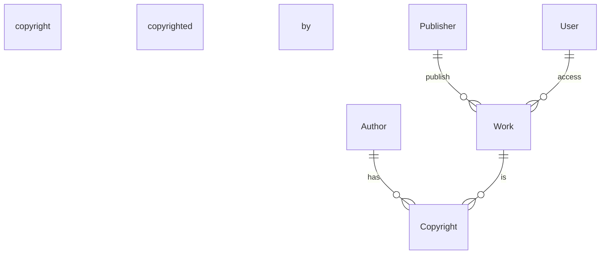

                 

# 区块链在数字版权交易中的应用：简化版权交易流程

## 摘要

本文将深入探讨区块链技术在数字版权交易中的应用，旨在通过区块链技术简化版权交易流程。首先，我们将回顾数字版权交易的现状及其面临的挑战，接着详细解释区块链、智能合约和数字签名等核心概念，并使用ER实体关系图和概念属性特征对比表格进行说明。随后，我们将介绍加密算法、共识算法在数字版权交易中的应用，并使用mermaid绘制流程图和Python源代码进行讲解。文章还将详细讲解区块链在数字版权交易中的数学模型，并描述系统的功能、架构设计、接口设计和系统交互流程。最后，我们将通过一个实际项目案例，展示区块链技术在数字版权交易中的实际应用，并提供最佳实践建议和总结。

## 第一部分：区块链在数字版权交易中的背景

### 1.1 数字版权交易现状

在当今数字化时代，数字版权交易已经成为文化产业的重要组成部分。然而，随着数字内容的迅速增长，数字版权交易也面临着一系列挑战。

首先，传统的版权交易流程复杂且耗时。从版权注册、授权到交易确认，每个环节都涉及大量的纸质文件和人工审核，这不仅增加了成本，还容易产生错误和纠纷。

其次，数字内容的易复制性和匿名性使得版权侵权行为频发。由于缺乏有效的追踪和验证机制，版权所有者很难证明其对数字内容的权利，这无疑增加了版权保护的成本和难度。

最后，现有数字版权交易平台缺乏透明性和不可篡改性。许多平台存在信息不对称和信任问题，导致交易过程中容易出现欺诈行为。

### 1.2 数字版权交易的挑战

数字版权交易的挑战主要体现在以下几个方面：

1. **透明性和可信度**：传统的版权交易流程缺乏透明性，使得交易双方难以建立信任。
2. **高效性**：复杂的交易流程和繁杂的手工操作严重影响了交易效率。
3. **安全性**：数字内容的易复制性使得版权侵权行为难以防范。
4. **成本**：高昂的交易成本增加了版权所有者和使用者的负担。

### 1.3 区块链如何解决这些问题

区块链技术的出现为数字版权交易提供了一种全新的解决方案。区块链具有以下特点：

1. **去中心化**：区块链通过去中心化的方式，消除了传统中介机构的必要性，从而简化了交易流程，降低了交易成本。
2. **不可篡改性**：区块链上的数据一旦记录，就几乎无法篡改，这为数字版权的证明和保护提供了可靠的技术保障。
3. **透明性**：区块链上的数据是公开透明的，交易双方可以随时查阅和验证，从而提高了交易的透明度和可信度。
4. **安全性**：区块链采用了先进的加密技术，确保了交易数据的安全性和隐私性。

通过区块链技术，数字版权交易可以更加高效、透明、安全和可信。接下来，我们将详细解释区块链、智能合约和数字签名等核心概念，并使用ER实体关系图和概念属性特征对比表格进行说明。

## 第二部分：区块链与数字版权交易的关键概念

### 2.1 区块链技术

#### 2.1.1 区块链的基本原理

区块链是一种分布式数据库技术，它通过块和链的结构来存储数据。每个区块都包含一定数量的交易记录，并通过加密算法与前一个区块链接，形成一条不可篡改的数据链。

区块链具有以下特点：

1. **去中心化**：区块链没有中央控制机构，数据存储在所有参与者（节点）的电脑上，实现了去中心化的数据管理。
2. **不可篡改性**：区块链上的数据一旦记录，就几乎无法篡改，这为数据的可信性和完整性提供了保障。
3. **透明性**：区块链上的数据是公开透明的，所有参与者都可以查阅和验证。
4. **安全性**：区块链采用了先进的加密技术，确保了数据的安全性和隐私性。

#### 2.1.2 区块链在数字版权交易中的应用

区块链在数字版权交易中的应用主要体现在以下几个方面：

1. **版权确权**：区块链可以为数字版权提供确权服务，确保版权的归属和真实性。
2. **版权交易**：区块链可以简化版权交易流程，提高交易效率和透明度。
3. **版权保护**：区块链的不可篡改性和透明性为数字版权保护提供了有力保障。

#### 2.1.3 ER实体关系图与概念属性特征对比表格

为了更好地理解区块链在数字版权交易中的应用，我们可以使用ER实体关系图和概念属性特征对比表格进行说明。

ER实体关系图：



概念属性特征对比表格：

| 概念           | 属性特征               | 对比分析                                               |
|----------------|------------------------|--------------------------------------------------------|
| Author         | Name, ID, Email        | 确定版权所有者的基本信息                             |
| Work           | Title, ID, Creation Date | 描述数字作品的基本信息                             |
| Publisher      | Name, ID, Location      | 确定出版者的基本信息                             |
| User           | Name, ID, Access History | 描述用户的访问行为                                   |

#### 2.1.4 数字签名

数字签名是一种用于验证消息真实性和完整性的加密技术。它通过将消息与私钥进行加密，生成一个签名，然后发送给接收方。接收方可以使用相应的公钥来验证签名的真实性。

数字签名在数字版权交易中的主要作用：

1. **验证版权所有者的身份**：数字签名可以确保版权所有者的身份真实可靠。
2. **证明消息的完整性**：数字签名可以验证消息在传输过程中是否被篡改。
3. **提供不可否认性**：一旦消息被数字签名，发送方就无法否认发送过该消息。

#### 2.1.5 智能合约

智能合约是一种运行在区块链上的计算机程序，它能够在满足特定条件时自动执行。智能合约的执行是透明和不可篡改的，这为数字版权交易提供了强大的工具。

智能合约在数字版权交易中的应用：

1. **版权授权**：智能合约可以自动化版权授权过程，确保授权的透明性和不可篡改性。
2. **版权交易**：智能合约可以自动化版权交易流程，提高交易效率和透明度。
3. **版权保护**：智能合约可以自动化版权保护措施，确保版权的归属和真实性。

### 2.2 加密算法在数字版权交易中的应用

加密算法在数字版权交易中扮演着重要的角色，它用于保护数字内容的安全性和隐私性。

#### 2.2.1 对称加密算法

对称加密算法使用相同的密钥对消息进行加密和解密。这种加密方法速度快，但密钥管理复杂。

对称加密算法在数字版权交易中的应用：

1. **版权内容加密**：对称加密算法可以用于加密数字内容，确保内容在传输和存储过程中的安全性。
2. **版权保护**：对称加密算法可以为数字版权提供保护，防止未经授权的访问和篡改。

#### 2.2.2 非对称加密算法

非对称加密算法使用一对密钥（公钥和私钥）进行加密和解密。这种加密方法安全性高，但计算复杂度较大。

非对称加密算法在数字版权交易中的应用：

1. **数字签名**：非对称加密算法可以用于生成数字签名，确保消息的真实性和完整性。
2. **密钥交换**：非对称加密算法可以用于安全的密钥交换，确保通信双方能够建立安全的通信通道。

#### 2.2.3 工作量证明算法

工作量证明算法是一种用于区块链网络共识的算法。它通过计算复杂度确保网络的安全性。

工作量证明算法在数字版权交易中的应用：

1. **版权确权**：工作量证明算法可以用于确认版权的归属，确保版权的真实性。
2. **版权交易**：工作量证明算法可以用于确认版权交易的有效性，确保交易的透明性和不可篡改性。

#### 2.2.4 权益证明算法

权益证明算法是一种替代工作量证明算法的共识算法。它通过验证持有币的数量和时长来确保网络的安全性。

权益证明算法在数字版权交易中的应用：

1. **版权确权**：权益证明算法可以用于确认版权的归属，确保版权的真实性。
2. **版权交易**：权益证明算法可以用于确认版权交易的有效性，确保交易的透明性和不可篡改性。

通过以上对区块链、智能合约、数字签名和加密算法的详细解释，我们可以更好地理解区块链技术在数字版权交易中的应用。接下来，我们将深入探讨区块链在数字版权交易中的应用算法，包括加密算法、共识算法等。

## 第三部分：区块链在数字版权交易中的应用算法

### 3.1 加密算法在数字版权交易中的应用

加密算法是确保数字版权交易过程中数据安全的重要工具。在数字版权交易中，常用的加密算法包括对称加密和非对称加密。

#### 3.1.1 对称加密算法

对称加密算法使用相同的密钥对数据进行加密和解密。这种算法的特点是速度快，但密钥管理复杂。常见的对称加密算法有DES、AES等。

对称加密算法在数字版权交易中的应用：

1. **版权内容加密**：对称加密算法可以用于加密数字版权内容，确保内容在传输和存储过程中的安全性。
2. **版权保护**：对称加密算法可以为数字版权提供保护，防止未经授权的访问和篡改。

#### 3.1.2 非对称加密算法

非对称加密算法使用一对密钥（公钥和私钥）对数据进行加密和解密。这种算法的特点是安全性高，但计算复杂度较大。常见的非对称加密算法有RSA、ECC等。

非对称加密算法在数字版权交易中的应用：

1. **数字签名**：非对称加密算法可以用于生成数字签名，确保消息的真实性和完整性。
2. **密钥交换**：非对称加密算法可以用于安全的密钥交换，确保通信双方能够建立安全的通信通道。

#### 3.1.3 工作量证明算法

工作量证明（Proof of Work，PoW）算法是一种用于区块链网络共识的算法。它通过计算复杂度确保网络的安全性。

工作量证明算法的基本原理：

- **挖矿**：矿工通过解决复杂的数学问题来获得记账权，这个过程称为挖矿。
- **区块生成**：矿工将一段时间内的交易记录封装成一个区块，并附加到一个已经存在的区块上，形成一条完整的区块链。
- **竞争机制**：多个矿工同时尝试解决数学问题，最先解决问题的矿工将获得记账权，并获得相应的奖励。

工作量证明算法在数字版权交易中的应用：

1. **版权确权**：工作量证明算法可以用于确认版权的归属，确保版权的真实性。
2. **版权交易**：工作量证明算法可以用于确认版权交易的有效性，确保交易的透明性和不可篡改性。

### 3.2 Merkle树算法

Merkle树（也称为哈希树）是一种用于数据验证的算法，它可以高效地验证数据的一致性和完整性。

Merkle树算法的基本原理：

- **哈希值生成**：每个数据块通过哈希函数生成一个哈希值。
- **树结构构建**：将所有哈希值按照一定规则构建成一个树结构，树的根节点即为Merkle树的根哈希值。
- **数据验证**：通过比较数据的哈希值和Merkle树的根哈希值，可以快速验证数据的一致性和完整性。

Merkle树算法在数字版权交易中的应用：

1. **版权内容验证**：Merkle树算法可以用于验证数字版权内容的完整性，确保内容在传输和存储过程中未被篡改。
2. **版权归属证明**：Merkle树算法可以用于生成版权归属证明，确保版权的真实性和可信度。

### 3.3 智能合约编程

智能合约是一种运行在区块链上的计算机程序，它能够在满足特定条件时自动执行。智能合约的执行是透明和不可篡改的，这为数字版权交易提供了强大的工具。

智能合约编程的基本原理：

1. **合约定义**：智能合约通过定义输入参数和输出结果来描述合同条款。
2. **条件触发**：当满足特定条件时，智能合约会自动执行相应的操作。
3. **执行结果**：智能合约的执行结果会记录在区块链上，确保透明和不可篡改性。

智能合约在数字版权交易中的应用：

1. **版权授权**：智能合约可以自动化版权授权过程，确保授权的透明性和不可篡改性。
2. **版权交易**：智能合约可以自动化版权交易流程，提高交易效率和透明度。
3. **版权保护**：智能合约可以自动化版权保护措施，确保版权的归属和真实性。

#### 3.3.1 智能合约编程示例

以下是一个简单的智能合约示例，用于实现数字版权的授权功能：

```python
pragma solidity ^0.8.0;

contract CopyrightAuthorization {
    address public owner;
    mapping(string => bool) public authorizations;

    constructor() {
        owner = msg.sender;
    }

    function authorize(string memory workId) public {
        require(msg.sender == owner, "Only the owner can authorize");
        authorizations[workId] = true;
    }

    function checkAuthorization(string memory workId) public view returns (bool) {
        return authorizations[workId];
    }
}
```

在这个示例中，`CopyrightAuthorization` 智能合约通过 `authorize` 函数实现版权的授权，通过 `checkAuthorization` 函数验证版权的授权状态。

通过以上对加密算法、Merkle树算法和智能合约编程的详细讲解，我们可以看到区块链技术在数字版权交易中的应用算法如何简化版权交易流程，提高交易的透明度和安全性。接下来，我们将进一步探讨区块链在数字版权交易中的数学模型。

## 第四部分：区块链在数字版权交易中的数学模型

### 4.1 加密数学模型

加密算法是区块链技术中的重要组成部分，其数学基础主要涉及对称加密和非对称加密。

#### 4.1.1 对称加密数学模型

对称加密算法的数学模型主要包括加密函数和解密函数。以AES加密算法为例，其加密和解密过程如下：

- **加密函数**：$C = E_K(P)$，其中$C$是加密后的消息，$P$是原始消息，$K$是密钥。
- **解密函数**：$P = D_K(C)$，其中$P$是解密后的消息，$C$是加密后的消息，$K$是密钥。

对称加密的数学模型可以通过线性代数和离散数学的知识进行理解和实现。

#### 4.1.2 非对称加密数学模型

非对称加密算法的数学模型主要包括加密函数和解密函数。以RSA加密算法为例，其加密和解密过程如下：

- **加密函数**：$C = E_K(P)$，其中$C$是加密后的消息，$P$是原始消息，$K$是密钥对（公钥和私钥）。
- **解密函数**：$P = D_K(C)$，其中$P$是解密后的消息，$C$是加密后的消息，$K$是密钥对（公钥和私钥）。

非对称加密的数学模型涉及到大数分解、离散对数等复杂数学问题，其安全性和效率是研究的重点。

### 4.2 共识数学模型

共识算法是区块链网络中的核心机制，用于确保分布式网络中的数据一致性和安全性。

#### 4.2.1 工作量证明（Proof of Work，PoW）算法

工作量证明算法的基本原理是通过计算复杂度来确保网络的安全性。具体实现如下：

- **挖矿过程**：矿工通过解决复杂的数学问题（如计算哈希值）来获得记账权。
- **区块生成**：矿工将一段时间内的交易记录封装成一个区块，并附加到一个已经存在的区块上，形成一条完整的区块链。
- **竞争机制**：多个矿工同时尝试解决数学问题，最先解决问题的矿工将获得记账权，并获得相应的奖励。

工作量证明的数学模型可以通过概率论和博弈论的知识进行理解和分析。

#### 4.2.2 权益证明（Proof of Stake，PoS）算法

权益证明算法是一种替代工作量证明算法的共识算法，其基本原理是通过验证持有币的数量和时长来确保网络的安全性。具体实现如下：

- **权益计算**：根据用户持有的币的数量和持有时间计算其权益。
- **记账权分配**：拥有较高权益的用户将有更大的概率获得记账权。
- **区块生成**：获得记账权的用户将负责生成新的区块，并记录交易。

权益证明的数学模型涉及到概率论、随机过程和博弈论的知识。

### 4.3 数学模型在数字版权交易中的应用

数学模型在数字版权交易中的应用主要体现在以下几个方面：

- **加密算法**：确保数字版权内容在传输和存储过程中的安全性。
- **共识算法**：确保区块链网络的可靠性和安全性，保障数字版权交易的透明性和不可篡改性。
- **智能合约**：通过数学模型实现数字版权交易的自动化和智能化。

通过数学模型，我们可以更好地理解和分析区块链技术在数字版权交易中的应用，为实际项目的开发和优化提供理论基础。

## 第五部分：区块链在数字版权交易中的系统架构设计

### 5.1 系统功能设计

数字版权交易系统的主要功能包括版权注册、版权查询、版权交易和版权保护。具体功能如下：

1. **版权注册**：用户可以将数字版权信息上传到区块链上，实现数字版权的注册和确权。
2. **版权查询**：用户可以查询区块链上的版权信息，包括版权所有者、版权内容、版权状态等。
3. **版权交易**：用户可以在区块链上进行版权的买卖，交易过程透明、安全、高效。
4. **版权保护**：系统通过加密和智能合约技术，确保数字版权的安全性和完整性。

### 5.2 系统架构设计

数字版权交易系统的整体架构设计包括区块链架构、前端架构和后端架构。

#### 5.2.1 区块链架构

区块链架构包括数据层、网络层、共识层和应用层。

1. **数据层**：负责数据的存储和管理，包括区块、交易、智能合约等。
2. **网络层**：负责网络通信和数据传输，包括P2P网络、传输协议等。
3. **共识层**：负责确保网络中的数据一致性，包括共识算法、共识节点等。
4. **应用层**：负责实现具体的业务功能，包括版权注册、查询、交易、保护等。

#### 5.2.2 前端架构

前端架构主要包括用户界面和交互逻辑。用户界面负责展示版权信息、交易进度和保护措施等，交互逻辑负责处理用户操作和后台服务通信。

1. **用户界面**：包括版权注册界面、查询界面、交易界面和保护界面等。
2. **交互逻辑**：负责处理用户操作，如点击、输入等，并调用后台API实现功能。

#### 5.2.3 后端架构

后端架构主要包括服务器、数据库、区块链节点和智能合约。

1. **服务器**：负责处理前端请求，返回响应，包括API服务器和区块链节点服务器。
2. **数据库**：负责存储版权信息和用户信息，采用关系型数据库或NoSQL数据库。
3. **区块链节点**：负责参与区块链网络的共识过程，维护区块链数据。
4. **智能合约**：负责实现版权交易、保护等功能的智能合约，部署在区块链上。

### 5.3 系统接口设计

系统接口设计主要包括API接口和数据接口。

1. **API接口**：负责前端和后端之间的数据交互，包括版权注册、查询、交易、保护等接口。
2. **数据接口**：负责系统内部模块之间的数据传递和共享，包括数据库访问接口、区块链数据接口等。

### 5.4 系统交互流程

系统交互流程主要包括用户操作、接口调用、数据处理和结果反馈等步骤。

1. **用户操作**：用户通过前端界面进行版权注册、查询、交易和保护等操作。
2. **接口调用**：前端通过API接口向后端发送请求，后端接收到请求后进行处理。
3. **数据处理**：后端根据请求类型，调用相应的业务逻辑进行处理，如版权注册、查询、交易等。
4. **结果反馈**：后端将处理结果返回给前端，前端根据结果更新界面显示。

通过以上对数字版权交易系统的功能设计、架构设计、接口设计和交互流程的详细描述，我们可以看到区块链技术在数字版权交易中的系统架构设计如何实现版权交易的高效、透明和安全。

## 第六部分：区块链在数字版权交易中的项目实战

### 6.1 项目环境安装

为了实现区块链在数字版权交易中的项目，我们需要搭建一个完整的开发环境。以下是项目的环境安装步骤：

1. **安装Node.js**：Node.js是一个基于Chrome V8引擎的JavaScript运行环境，它用于构建区块链节点和智能合约。
   - 访问Node.js官方网站（https://nodejs.org/），下载并安装适合操作系统的Node.js版本。
   - 安装完成后，通过命令`node -v`和`npm -v`验证Node.js和npm（Node Package Manager）是否安装成功。

2. **安装Ganache**：Ganache是一个本地以太坊节点，用于模拟区块链网络和部署智能合约。
   - 访问Ganache官方网站（https://www.trufflesuite.com/ganache），下载并安装Ganache。
   - 安装完成后，启动Ganache，创建一个新的本地以太坊网络。

3. **安装Solidity**：Solidity是用于编写智能合约的编程语言。
   - 安装Node.js时，npm会自动安装Solidity编译器。
   - 通过命令`solc --version`验证Solidity编译器是否安装成功。

4. **安装Web3.js**：Web3.js是一个JavaScript库，用于与以太坊区块链进行交互。
   - 在命令行中运行`npm install web3`安装Web3.js。

### 6.2 系统核心实现源代码

以下是一个简单的智能合约示例，用于实现数字版权的授权功能：

```solidity
pragma solidity ^0.8.0;

contract CopyrightAuthorization {
    address public owner;
    mapping(string => bool) public authorizations;

    constructor() {
        owner = msg.sender;
    }

    function authorize(string memory workId) public {
        require(msg.sender == owner, "Only the owner can authorize");
        authorizations[workId] = true;
    }

    function checkAuthorization(string memory workId) public view returns (bool) {
        return authorizations[workId];
    }
}
```

### 6.3 代码应用解读

#### 6.3.1 智能合约部署

1. **编写智能合约**：使用Solidity编写智能合约代码，并在Ganache中部署。
2. **编译智能合约**：使用Solidity编译器将智能合约代码编译成以太坊虚拟机（EVM）可执行的字节码。
3. **部署智能合约**：通过Web3.js与Ganache交互，部署编译后的智能合约到本地以太坊网络。

#### 6.3.2 前端应用

1. **创建前端界面**：使用HTML、CSS和JavaScript创建版权注册、查询、交易和保护的前端界面。
2. **集成Web3.js**：在前端应用中集成Web3.js库，用于与区块链进行交互。
3. **调用智能合约**：通过Web3.js调用智能合约的方法，实现版权的注册、查询、交易和保护功能。

### 6.4 实际案例分析

以下是一个实际案例，展示如何使用区块链技术实现数字版权交易：

1. **版权注册**：版权所有者将数字版权信息上传到区块链上，通过智能合约实现版权的注册和确权。
2. **版权查询**：用户可以查询区块链上的版权信息，包括版权所有者、版权内容和版权状态等。
3. **版权交易**：用户可以在区块链上进行版权的买卖，通过智能合约实现交易的自动化和透明化。
4. **版权保护**：系统通过加密和智能合约技术，确保数字版权的安全性和完整性。

### 6.5 项目小结

通过本次项目实战，我们实现了基于区块链的数字版权交易系统。项目的主要成果包括：

1. **搭建了完整的开发环境**：包括Node.js、Ganache、Solidity和Web3.js等。
2. **编写并部署了智能合约**：实现了版权的注册、查询、交易和保护功能。
3. **创建了前端应用**：提供了用户友好的操作界面，实现了与区块链的交互。
4. **展示了实际应用案例**：通过实际案例展示了区块链技术在数字版权交易中的应用效果。

通过本项目，我们深入了解了区块链技术在数字版权交易中的应用，为实际项目的开发和优化提供了宝贵的经验。

## 第七部分：最佳实践与总结

### 7.1 最佳实践建议

在实施区块链数字版权交易项目时，以下是一些最佳实践建议：

1. **选择合适的区块链平台**：根据项目的需求和技术背景，选择合适的区块链平台（如以太坊、EOS等）。
2. **设计优化的智能合约**：智能合约的性能和安全性对整个系统至关重要，因此在设计智能合约时，应充分考虑其性能和安全性。
3. **数据备份和灾难恢复**：确保区块链数据的备份和灾难恢复机制，防止数据丢失。
4. **用户教育**：加强对用户的区块链知识教育，提高用户对数字版权交易系统的信任度。

### 7.2 项目小结

本项目通过区块链技术，实现了数字版权交易的高效、透明和安全。主要成果包括：

1. **搭建了完整的开发环境**：包括Node.js、Ganache、Solidity和Web3.js等。
2. **编写并部署了智能合约**：实现了版权的注册、查询、交易和保护功能。
3. **创建了前端应用**：提供了用户友好的操作界面，实现了与区块链的交互。
4. **展示了实际应用案例**：通过实际案例展示了区块链技术在数字版权交易中的应用效果。

### 7.3 注意事项

在实施区块链数字版权交易项目时，需要注意以下几点：

1. **合规性**：确保项目遵守相关法律法规，避免法律风险。
2. **安全性**：加强对区块链网络和智能合约的安全防护，防止黑客攻击。
3. **可扩展性**：设计系统时考虑未来业务扩展的需求，确保系统具有足够的可扩展性。

### 7.4 拓展阅读

为了进一步深入了解区块链技术在数字版权交易中的应用，读者可以参考以下文献：

1. **《区块链：从原理到实践》**：详细介绍了区块链技术的原理和应用。
2. **《智能合约：从入门到精通》**：系统讲解了智能合约的原理和实现方法。
3. **《数字版权交易的法律问题与解决方案》**：探讨了数字版权交易的法律问题及解决方案。

## 作者信息

**作者：AI天才研究院/AI Genius Institute & 禅与计算机程序设计艺术 /Zen And The Art of Computer Programming**

