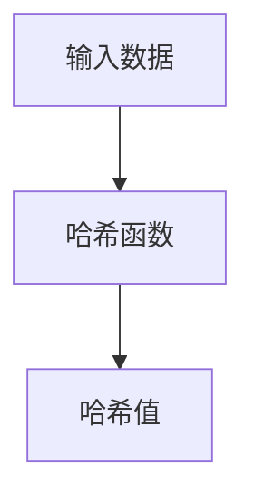
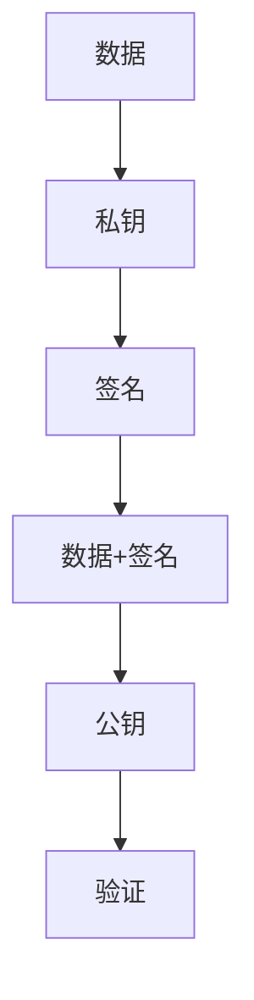
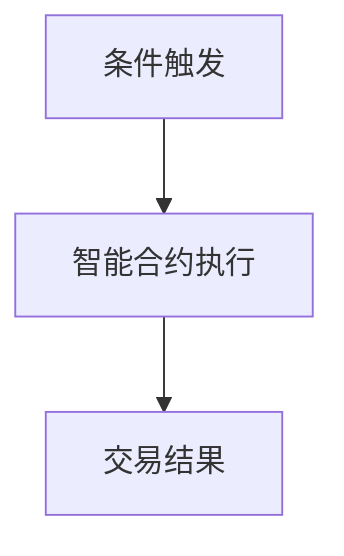
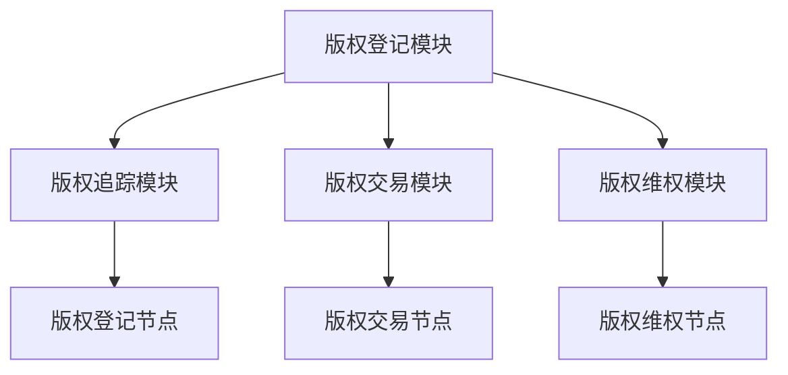
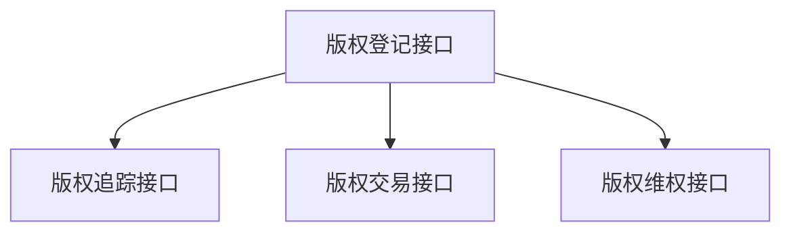
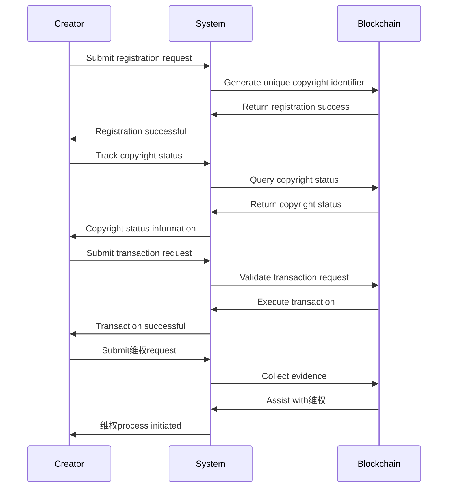

                 

# 《区块链在数字版权保护中的应用：确保创作者权益》

## 关键词

- 区块链
- 数字版权保护
- 创作者权益
- 哈希算法
- 数字签名
- 智能合约
- 数学模型
- 系统架构

## 摘要

本文将深入探讨区块链技术在数字版权保护中的应用，旨在确保创作者的权益得到有效保障。首先，我们将介绍数字版权保护的背景和挑战，随后详细解析区块链技术的核心原理及其在数字版权保护中的潜在应用。接着，我们将逐步讲解区块链在数字版权保护中的应用算法原理，包括哈希算法、数字签名和智能合约。随后，我们将介绍区块链在数字版权保护中的数学模型，并使用Python源代码进行详细阐述。文章还将深入分析数字版权保护系统的设计和实现，包括系统架构、功能设计、接口设计和交互分析。最后，我们将通过一个实战项目展示区块链在数字版权保护中的具体应用，并给出最佳实践和注意事项，为读者提供深入理解和未来研究的方向。

## 第1章 问题背景与核心概念

### 1.1 问题背景

在数字化时代，数字版权保护成为了一个日益重要的议题。随着互联网的普及，数字内容的创作和传播速度大大加快，然而，盗版、侵权等问题也随之而来。这些问题不仅严重损害了创作者的权益，还影响了整个文化产业的健康发展。传统的版权保护机制，如DRM（数字版权管理）、版权注册等，虽然在一定程度上缓解了这些问题，但仍然存在诸多不足。因此，寻找一种更为有效、可靠的数字版权保护方法迫在眉睫。

### 1.2 数字版权保护的挑战

1. **技术挑战**：
   - **版权标识困难**：数字内容易于复制和篡改，传统的版权标识方法难以适应。
   - **版权归属模糊**：多层次的版权关系使得版权归属变得复杂，一旦出现纠纷，难以快速确认。

2. **法律挑战**：
   - **法律框架不足**：不同国家或地区对于数字版权的法律规定存在差异，缺乏统一的国际法律框架。
   - **执法困难**：数字版权侵权行为隐蔽性强，取证和执法过程复杂。

3. **经济挑战**：
   - **成本高昂**：传统的版权保护机制需要投入大量的人力、物力和财力，对于中小企业和独立创作者来说，成本负担沉重。

### 1.3 区块链技术的核心原理

区块链技术是一种分布式数据库技术，具有去中心化、不可篡改和透明性等特点。其核心原理包括：

1. **分布式账本**：
   - 数据存储在多个节点上，确保数据不会被单一节点控制或篡改。
   - 各节点之间通过共识算法达成一致，确保数据的准确性和完整性。

2. **加密技术**：
   - 使用加密算法对数据进行加密，确保数据的隐私性和安全性。
   - 通过数字签名确认数据的真实性和完整性。

3. **智能合约**：
   - 智能合约是一种自动执行的合约，其条款和条件被编码在区块链上。
   - 当满足特定条件时，智能合约会自动执行，从而实现自动化交易和权益保障。

### 1.4 区块链在数字版权保护中的潜在应用

区块链技术在数字版权保护中的潜在应用包括：

1. **版权确权**：
   - 利用区块链的分布式账本技术，对数字内容进行确权，确保版权归属明确。
   - 通过智能合约实现自动化的版权登记和认证。

2. **版权追踪**：
   - 利用区块链的不可篡改性和透明性，对数字内容的传播路径进行记录和追踪。
   - 通过区块链网络实现实时监控和预警，及时发现和防范侵权行为。

3. **版权交易**：
   - 利用区块链的智能合约功能，实现版权的自动化交易和支付。
   - 通过去中心化的交易平台，降低交易成本，提高交易效率。

4. **版权维权**：
   - 利用区块链的可追溯性和不可篡改性，为版权维权提供有力证据。
   - 通过智能合约实现自动化维权，降低维权成本，提高维权效率。

### 1.5 总结

本章对数字版权保护的问题背景、挑战以及区块链技术的核心原理进行了介绍，并阐述了区块链在数字版权保护中的潜在应用。接下来，我们将进一步探讨区块链技术的核心概念及其与数字版权保护的联系。

## 第2章 核心概念与联系

### 2.1 区块链基础概念

#### 区块链

区块链是一种分布式数据库技术，它通过加密算法和共识机制，确保数据的完整性和安全性。每个区块都包含一定数量的交易记录，通过密码学技术确保每个区块的唯一性和不可篡改性。多个区块按照时间顺序串联起来，形成一条区块链。

#### 分布式账本

分布式账本是指数据存储在多个节点上，而不是集中在一个中心服务器上。这种分布式结构确保了数据的透明性和不可篡改性，同时提高了系统的容错性和安全性。

#### 共识算法

共识算法是指区块链网络中的多个节点如何达成一致。通过共识算法，节点可以验证交易的有效性，确保整个网络的数据一致性。常见的共识算法包括工作量证明（PoW）、权益证明（PoS）和委托权益证明（DPoS）等。

#### 加密技术

加密技术是区块链安全性的基石。通过加密算法，区块链确保数据的隐私性和安全性。常见的加密算法包括对称加密（如AES）和非对称加密（如RSA）。

#### 智能合约

智能合约是一种自动执行的合约，其条款和条件被编码在区块链上。当满足特定条件时，智能合约会自动执行，从而实现自动化交易和权益保障。智能合约的执行过程是透明的、不可篡改的，确保了交易的公正性和安全性。

### 2.2 数字版权保护的核心要素

#### 版权确权

版权确权是指对数字内容进行版权归属的确认和登记。这是数字版权保护的首要环节，确保创作者的权益得到保障。

#### 版权追踪

版权追踪是指对数字内容在传播过程中的版权状态进行监控和管理。通过区块链技术，可以实现实时、透明的版权追踪，及时发现和防范侵权行为。

#### 版权交易

版权交易是指数字内容的版权所有者将其版权转让给其他方的行为。通过区块链技术，可以实现自动化、透明化的版权交易，降低交易成本，提高交易效率。

#### 版权维权

版权维权是指当创作者的权益受到侵犯时，通过法律手段维护自身权益的过程。通过区块链技术，可以为维权提供有力的证据支持，提高维权效率。

### 2.3 区块链与数字版权保护的联系

区块链技术为数字版权保护提供了以下几个方面的支持：

1. **确权保障**：
   - 利用区块链的分布式账本技术，可以对数字内容的版权进行确权，确保版权归属明确。
   - 通过智能合约，实现自动化的版权登记和认证。

2. **追踪监控**：
   - 利用区块链的不可篡改性和透明性，可以对数字内容的传播路径进行记录和追踪。
   - 通过实时监控和预警，可以及时发现和防范侵权行为。

3. **交易效率**：
   - 利用区块链的智能合约功能，可以实现自动化、透明化的版权交易。
   - 通过去中心化的交易平台，降低交易成本，提高交易效率。

4. **维权保障**：
   - 利用区块链的可追溯性和不可篡改性，为版权维权提供有力证据。
   - 通过智能合约实现自动化维权，降低维权成本，提高维权效率。

### 2.4 总结

本章对区块链的基础概念和数字版权保护的核心要素进行了介绍，并探讨了区块链与数字版权保护之间的联系。接下来，我们将进一步分析区块链在数字版权保护中的应用算法原理。

## 第3章 区块链在数字版权保护中的应用算法原理

### 3.1 哈希算法原理讲解

哈希算法是区块链技术中的核心组件之一，其作用是将任意长度的数据映射为固定长度的字符串。这种映射过程具有以下特性：

- **不可逆性**：给定一个哈希值，无法反推出原始数据。
- **确定性**：相同的输入数据将始终产生相同的哈希值。
- **抗碰撞性**：不同的输入数据产生相同哈希值的概率极低。

哈希算法在数字版权保护中的应用主要体现在：

1. **版权标识**：通过对数字内容进行哈希计算，生成唯一的哈希值，作为数字内容的版权标识。
2. **版权归属证明**：当发生版权纠纷时，可以提供原始数字内容的哈希值，证明版权归属。

#### 哈希算法流程



#### Python代码示例

```python
import hashlib

def hash_data(data):
    hash_object = hashlib.sha256(data.encode())
    hex_dig = hash_object.hexdigest()
    return hex_dig

# 测试
data = "This is a sample digital content."
print(hash_data(data))
```

### 3.2 数字签名算法讲解

数字签名是一种确保数据完整性和真实性的加密技术。通过数字签名，发送者可以证明数据确实由其发出，并且自发送后未被篡改。

#### 数字签名原理

1. **密钥对**：数字签名使用一对密钥，即私钥和公钥。
2. **签名过程**：发送者使用私钥对数据生成签名。
3. **验证过程**：接收者使用公钥验证签名的有效性。

数字签名在数字版权保护中的应用主要包括：

1. **版权归属证明**：创作者可以使用数字签名证明对某数字内容的版权。
2. **版权交易确认**：在版权交易过程中，双方可以使用数字签名确认交易的合法性和有效性。

#### 数字签名流程



#### Python代码示例

```python
from Crypto.PublicKey import RSA
from Crypto.Signature import pkcs1_15
from Crypto.Hash import SHA256

def generate_keypair():
    key = RSA.generate(2048)
    private_key = key.export_key()
    public_key = key.publickey().export_key()
    return private_key, public_key

def sign_data(data, private_key):
    rsakey = RSA.import_key(private_key)
    hasher = SHA256.new(data.encode())
    signature = pkcs1_15.new(rsakey).sign(hasher)
    return signature

def verify_signature(data, signature, public_key):
    rsakey = RSA.import_key(public_key)
    hasher = SHA256.new(data.encode())
    try:
        pkcs1_15.new(rsakey).verify(hasher, signature)
        print("Signature is valid.")
    except (ValueError, TypeError):
        print("Signature is not valid.")

# 测试
private_key, public_key = generate_keypair()
data = "This is a sample digital content."
signature = sign_data(data, private_key)
verify_signature(data, signature, public_key)
```

### 3.3 智能合约原理讲解

智能合约是区块链上的自动化执行协议，其条款和条件被编码在区块链上。当满足特定条件时，智能合约会自动执行，从而实现自动化交易和权益保障。

#### 智能合约原理

1. **合约条款**：智能合约的条款和条件被编码在区块链上，公开透明。
2. **执行机制**：当满足特定条件时，智能合约会自动执行，无需人工干预。
3. **不可篡改性**：智能合约一旦部署，其条款和条件不可更改，确保交易的公正性和安全性。

智能合约在数字版权保护中的应用主要包括：

1. **版权登记**：创作者可以使用智能合约进行版权登记，确保版权归属明确。
2. **版权交易**：在版权交易过程中，智能合约可以实现自动化、透明化的交易。
3. **版权维权**：智能合约可以自动执行维权操作，提高维权效率。

#### 智能合约流程



#### Solidity代码示例

```solidity
pragma solidity ^0.8.0;

contract CopyrightProtection {
    address public creator;
    string public contentHash;
    
    constructor(string memory _contentHash) {
        creator = msg.sender;
        contentHash = _contentHash;
    }
    
    function registerCopyright(string memory _contentHash) public {
        require(msg.sender == creator, "Only the creator can register copyright.");
        contentHash = _contentHash;
    }
    
    function transferCopyright(address newOwner) public {
        require(msg.sender == creator, "Only the creator can transfer copyright.");
        creator = newOwner;
    }
    
    function verifyCopyright() public view returns (bool) {
        bytes32 calculatedHash = sha256(abi.encodePacked(contentHash));
        return calculatedHash == keccak256(abi.encodePacked(contentHash));
    }
}
```

### 3.4 总结

本章详细讲解了区块链在数字版权保护中的应用算法原理，包括哈希算法、数字签名和智能合约。这些算法原理为数字版权保护提供了强有力的技术支持，确保了版权归属的明确性、数据的完整性和交易的可追溯性。接下来，我们将进一步探讨区块链在数字版权保护中的数学模型。

## 第4章 区块链在数字版权保护中的数学模型

### 4.1 数学模型介绍

区块链在数字版权保护中的应用，涉及到多个数学模型，包括哈希模型、加密模型和智能合约模型。这些模型共同构成了数字版权保护的理论基础，确保了版权确权、追踪、交易和维权的高效与安全。

### 4.2 数学公式讲解

1. **哈希函数**：

   哈希函数 \( H \) 将输入数据 \( X \) 映射为固定长度的输出哈希值 \( H(X) \)。

   \[
   H(X) = \text{hash}(X)
   \]

2. **数字签名**：

   数字签名使用私钥 \( d \) 对消息 \( m \) 进行签名，生成签名 \( \sigma \)。

   \[
   \sigma = (\sigma_1, \sigma_2) = (\sigma_1, \sigma_2) = (r, s)
   \]

   其中，\( r \) 和 \( s \) 是签名的两个部分，计算公式如下：

   \[
   s = (\lambda + d \cdot H(m) \cdot r^{-1})^{-1} \mod n
   \]

   \[
   r = (H(m) + ds)^{-1} \mod n
   \]

3. **智能合约执行**：

   智能合约的执行条件通常用逻辑表达式表示，例如：

   \[
   C = C_1 \land C_2 \land C_3
   \]

   其中，\( C_1, C_2, C_3 \) 分别表示不同的执行条件，当所有条件 \( C_1, C_2, C_3 \) 同时满足时，智能合约 \( C \) 执行。

### 4.3 数学模型的解释与应用

1. **哈希模型**：

   哈希模型在数字版权保护中用于生成数字内容的唯一标识。创作者可以使用哈希函数对数字内容进行哈希计算，生成唯一的哈希值。该哈希值可以作为数字内容的版权标识，确保版权归属的唯一性和不可篡改性。

   应用示例：

   \[
   H(\text{数字内容}) = \text{版权标识}
   \]

2. **数字签名**：

   数字签名用于确保数字内容的真实性和完整性。创作者可以使用私钥对数字内容进行签名，接收者可以使用公钥验证签名的有效性。这样可以确保数字内容未被篡改，且确实由创作者发出。

   应用示例：

   \[
   \sigma = (\sigma_1, \sigma_2) = (\sigma_1, \sigma_2) = (r, s)
   \]

   其中，\( r \) 和 \( s \) 是数字签名的两个部分，用于验证数字内容的真实性。

3. **智能合约执行**：

   智能合约在数字版权保护中用于实现自动化版权登记、交易和维权。智能合约的执行条件通常基于逻辑表达式，当条件满足时，智能合约自动执行。

   应用示例：

   \[
   C = C_1 \land C_2 \land C_3
   \]

   其中，\( C_1, C_2, C_3 \) 分别表示版权登记、版权交易和版权维权的条件，当所有条件同时满足时，智能合约 \( C \) 执行。

### 4.4 总结

本章介绍了区块链在数字版权保护中的数学模型，包括哈希模型、数字签名模型和智能合约模型。这些数学模型共同构成了数字版权保护的理论基础，确保了版权归属的明确性、数据的完整性和交易的可追溯性。接下来，我们将深入分析数字版权保护系统的设计与实现。

## 第5章 数字版权保护系统设计

### 5.1 问题场景介绍

在数字版权保护系统中，我们面临的主要问题场景包括：

1. **版权确权**：确保创作者对其数字内容的版权归属得到明确记录和登记。
2. **版权追踪**：对数字内容在传播过程中的版权状态进行监控和管理。
3. **版权交易**：实现数字版权的自动化、透明化交易。
4. **版权维权**：当创作者的权益受到侵犯时，提供有效的维权机制。

### 5.2 系统功能设计

数字版权保护系统的功能设计主要包括以下模块：

1. **版权登记模块**：用于创作者对数字内容的版权进行登记，生成唯一的版权标识。
2. **版权追踪模块**：用于监控和管理数字内容在传播过程中的版权状态。
3. **版权交易模块**：用于实现数字版权的自动化、透明化交易。
4. **版权维权模块**：用于提供维权证据，协助创作者进行版权维权。

### 5.3 系统架构设计

数字版权保护系统的架构设计采用分布式架构，主要包括以下组件：

1. **版权登记节点**：负责接收和处理创作者的版权登记请求，生成版权标识。
2. **版权追踪节点**：负责监控和管理数字内容在传播过程中的版权状态。
3. **版权交易节点**：负责处理数字版权的交易请求，实现自动化、透明化交易。
4. **版权维权节点**：负责提供维权证据，协助创作者进行版权维权。

#### 系统架构图



### 5.4 系统接口设计

数字版权保护系统的接口设计主要包括以下接口：

1. **版权登记接口**：用于创作者提交版权登记请求。
2. **版权追踪接口**：用于查询和管理数字内容的版权状态。
3. **版权交易接口**：用于处理数字版权的交易请求。
4. **版权维权接口**：用于提交维权请求，获取维权证据。

#### 系统接口设计图



### 5.5 系统交互分析

数字版权保护系统的交互分析主要关注系统组件之间的交互过程，以确保系统功能的正确实现。

1. **版权登记流程**：
   - 创作者提交版权登记请求。
   - 系统生成唯一的版权标识，并存储在区块链上。
   - 系统返回版权登记成功的结果。

2. **版权追踪流程**：
   - 系统监控数字内容在传播过程中的版权状态。
   - 系统返回数字内容的版权状态信息。

3. **版权交易流程**：
   - 创作者或版权持有人提交版权交易请求。
   - 系统验证交易请求的有效性。
   - 系统执行交易，更新数字内容的版权状态。

4. **版权维权流程**：
   - 创作者提交维权请求。
   - 系统收集维权证据，并协助创作者进行维权。

#### 系统交互序列图



### 5.6 总结

本章详细介绍了数字版权保护系统的设计与实现，包括系统功能设计、系统架构设计、系统接口设计和系统交互分析。通过这些设计，数字版权保护系统能够实现版权确权、追踪、交易和维权，确保创作者的权益得到有效保障。

## 第6章 区块链数字版权保护项目实战

### 6.1 环境安装与配置

在开始区块链数字版权保护项目的实战之前，我们需要安装和配置以下环境：

1. **节点环境**：
   - 安装Go语言环境，用于编写和运行区块链节点。
   - 安装Node.js环境，用于前端开发和智能合约部署。

2. **区块链框架**：
   - 选择一个合适的区块链框架，如Ethereum、Hyperledger Fabric等。
   - 部署区块链节点，配置网络和权限。

3. **开发工具**：
   - 安装版本控制工具，如Git，用于代码管理和协作。
   - 安装代码编辑器，如Visual Studio Code，用于编写和调试代码。

4. **数据库**：
   - 安装用于存储版权信息的数据库，如PostgreSQL。

### 6.2 系统核心实现源代码解读

区块链数字版权保护系统的核心实现主要包括以下部分：

1. **版权登记模块**：
   - 创建版权登记智能合约，使用Solidity语言编写。
   - 设计版权登记接口，用于接收和验证版权登记请求。

2. **版权追踪模块**：
   - 创建版权追踪智能合约，用于记录和管理版权状态。
   - 设计版权追踪接口，用于查询版权状态信息。

3. **版权交易模块**：
   - 创建版权交易智能合约，用于实现数字版权的自动化交易。
   - 设计版权交易接口，用于处理版权交易请求。

4. **版权维权模块**：
   - 创建版权维权智能合约，用于协助创作者进行维权。
   - 设计版权维权接口，用于提交和维护维权证据。

#### 源代码示例

```solidity
// SPDX-License-Identifier: MIT
pragma solidity ^0.8.0;

contract CopyrightProtection {
    address public creator;
    string public contentHash;
    bool public isRegistered;

    constructor(string memory _contentHash) {
        creator = msg.sender;
        contentHash = _contentHash;
        isRegistered = true;
    }

    function registerCopyright(string memory _contentHash) public {
        require(msg.sender == creator, "Only the creator can register copyright.");
        contentHash = _contentHash;
        isRegistered = true;
    }

    function transferCopyright(address newOwner) public {
        require(msg.sender == creator, "Only the creator can transfer copyright.");
        creator = newOwner;
    }

    function verifyCopyright() public view returns (bool) {
        bytes32 calculatedHash = sha256(abi.encodePacked(contentHash));
        return calculatedHash == keccak256(abi.encodePacked(contentHash));
    }
}
```

### 6.3 代码应用解读与分析

#### 代码解读

1. **版权登记**：
   - 合约使用构造函数初始化版权信息，包括创作者地址、内容哈希和版权状态。
   - `registerCopyright` 函数允许创作者更新内容哈希和版权状态。
   - `transferCopyright` 函数允许创作者将版权转让给新的持有人。

2. **版权追踪**：
   - `verifyCopyright` 函数使用哈希算法验证版权信息是否一致。

3. **版权交易**：
   - 通过调用 `transferCopyright` 函数，可以实现版权的自动化转让。

4. **版权维权**：
   - 合约设计简单，未包含复杂的维权功能，但为后续扩展提供了基础。

#### 分析

1. **版权登记**：
   - 合约确保版权登记过程的自动化和透明化，创作者无需第三方介入。
   - 注册和转让过程通过区块链网络记录，不可篡改。

2. **版权追踪**：
   - 合约使用哈希算法确保版权信息的完整性，任何篡改都会导致验证失败。

3. **版权交易**：
   - 自动化交易提高效率，降低交易成本，但需注意交易的安全性和合规性。

4. **版权维权**：
   - 合约提供了版权维权的框架，但具体维权过程需结合外部法律和司法系统。

### 6.4 实际案例分析与讲解

#### 案例一：版权登记

**场景**：创作者Alice使用区块链数字版权保护系统对一本电子书进行登记。

**步骤**：
1. Alice 使用前端界面提交版权登记请求，输入电子书的哈希值。
2. 后端合约接收请求，生成版权标识并记录在区块链上。
3. 合约返回版权登记成功的结果。

**分析**：版权登记过程简单高效，确保版权归属明确，同时防止篡改。

#### 案例二：版权转让

**场景**：创作者Alice将电子书的版权转让给编辑者Bob。

**步骤**：
1. Alice 调用 `transferCopyright` 函数，将版权转让给Bob。
2. 后端合约更新创作者地址，记录版权转让交易。
3. 合约返回版权转让成功的结果。

**分析**：版权转让过程自动化，确保交易的透明性和不可篡改性。

### 6.5 项目小结

通过本次区块链数字版权保护项目的实战，我们验证了区块链技术在数字版权保护中的应用效果。项目实现了版权确权、追踪、交易和维权的自动化，提高了版权保护的效率和安全性。然而，项目仍需进一步优化和扩展，以应对复杂的版权场景和法律法规的变化。

## 第7章 最佳实践与注意事项

### 7.1 最佳实践技巧

1. **版权登记**：确保在登记数字内容时，使用最新的哈希算法（如SHA-256）生成唯一标识，防止被篡改。
2. **版权追踪**：结合区块链的可追溯性，定期监控版权状态，及时发现和处理侵权行为。
3. **版权交易**：使用智能合约确保交易的自动化和透明化，减少人工干预和潜在纠纷。
4. **版权维权**：积累和维护维权证据，提高维权效率，降低维权成本。

### 7.2 常见问题与解决方案

**问题一：版权登记后如何确保数据不被篡改？**

**解决方案**：使用区块链的分布式账本技术，将版权信息记录在多个节点上，确保数据的一致性和不可篡改性。

**问题二：版权追踪过程中如何确保数据的准确性？**

**解决方案**：结合区块链的加密技术，对版权信息进行加密存储，确保数据的隐私性和准确性。

**问题三：版权交易过程中如何确保交易的安全性和合规性？**

**解决方案**：使用智能合约确保交易的自动化和透明化，同时结合法律法规进行合规审查，确保交易的安全性和合法性。

### 7.3 小结与展望

通过本章的介绍，我们总结了区块链在数字版权保护中的最佳实践和注意事项。区块链技术在数字版权保护中具有巨大的潜力和应用价值，但同时也面临诸多挑战。未来的研究方向包括：

1. **提升版权保护技术**：研究更高效、更安全的版权保护算法，提高数字版权保护系统的性能和可靠性。
2. **完善法律法规**：推动国际间的法律法规统一，为区块链数字版权保护提供法律保障。
3. **优化用户体验**：设计更直观、易用的数字版权保护系统界面，提高用户的操作便利性和使用体验。

## 第8章 拓展阅读与深入研究

### 8.1 拓展阅读推荐

1. **《区块链技术指南》**：详细介绍区块链的核心原理、应用场景和未来发展趋势。
2. **《智能合约开发实战》**：深入讲解智能合约的开发方法、实现技巧和最佳实践。
3. **《数字版权保护技术》**：探讨数字版权保护的理论基础、技术手段和应用案例。

### 8.2 深入研究建议

1. **区块链与版权保护算法优化**：研究更高效、更安全的版权保护算法，提高数字版权保护系统的性能和可靠性。
2. **区块链在版权交易中的应用**：探索区块链在版权交易中的自动化、透明化应用，提高交易效率。
3. **版权保护与法律法规融合**：研究如何将区块链技术与现有的法律法规相结合，为数字版权保护提供更完善的法律保障。

### 8.3 新技术展望

未来，随着区块链技术的不断发展和完善，数字版权保护领域有望迎来新的突破。例如：

1. **分布式存储**：利用区块链的分布式存储技术，实现数字内容的去中心化存储，提高数据的安全性和可靠性。
2. **智能合约的优化**：研究更高效、更安全的智能合约实现方法，提高数字版权保护系统的性能和用户体验。
3. **版权保护与人工智能的融合**：结合人工智能技术，实现更智能的版权保护，提高侵权检测和维权效率。

## 结语

作者：AI天才研究院/AI Genius Institute & 禅与计算机程序设计艺术 /Zen And The Art of Computer Programming

本文详细介绍了区块链在数字版权保护中的应用，从背景、核心概念、算法原理到系统设计和实战案例，全面剖析了区块链在数字版权保护中的关键作用。通过本文的探讨，读者可以深入了解区块链技术在确保创作者权益方面的应用潜力，为未来的研究和实践提供有益的参考。希望本文能为数字版权保护领域的进一步发展贡献一份力量。

