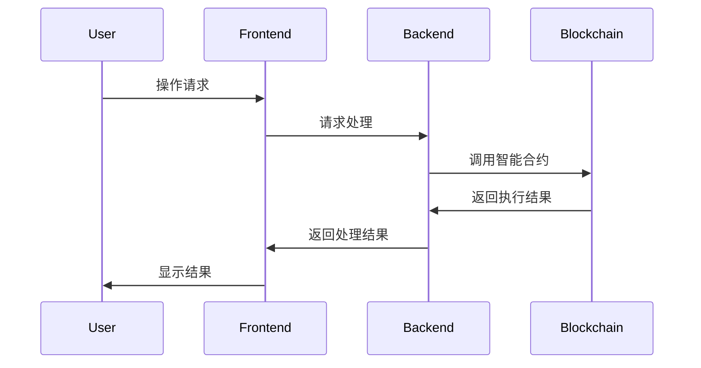

                 

### 引言

**文章标题**：《区块链在数字版权管理中的应用：实现自动版税分配》

**关键词**：区块链、数字版权管理、自动版税分配、智能合约、分布式存储

**摘要**：
本文将深入探讨区块链技术在数字版权管理中的应用，特别是如何通过区块链实现自动版税分配。随着数字经济的快速发展，版权管理和版税分配问题日益突出。传统版权管理机制面临诸多挑战，如版权认定难、版税分配不透明等。区块链技术以其独特的分布式账本、不可篡改性和智能合约等功能，为解决这些问题提供了新的思路。本文将详细介绍区块链的基本概念、在数字版权管理中的应用原理、自动版税分配的实现方法以及相关的系统架构设计。通过本文的阅读，读者将全面了解区块链技术在数字版权管理中的潜在价值和应用前景。

### 目录大纲：

1. **背景介绍与核心概念**
   - **第1章：问题背景**
     - **1.1 数字版权管理的现状**
     - **1.2 区块链技术的潜力**
     - **1.3 自动版税分配的优势**
     - **1.4 区块链与数字版权管理的联系**

   - **第2章：核心概念**
     - **2.1 数字版权管理**
     - **2.2 区块链技术**
     - **2.3 自动版税分配**

2. **区块链技术原理**
   - **第3章：区块链基础**
     - **3.1 区块链概述**
     - **3.2 区块链架构**
     - **3.3 区块链分布式存储**
     - **3.4 智能合约**

   - **第4章：区块链在数字版权管理中的应用**
     - **4.1 区块链与数字版权管理的关系**
     - **4.2 数字版权保护**
     - **4.3 自动版税分配**

3. **实现自动版税分配**
   - **第5章：实现自动版税分配的系统架构设计**
     - **5.1 系统功能设计**
     - **5.2 系统架构设计**
     - **5.3 系统接口设计**
     - **5.4 系统交互**

   - **第6章：环境安装与核心实现**
     - **6.1 环境安装**
     - **6.2 核心实现**

4. **项目实战**
   - **第7章：项目实战**
     - **7.1 实际案例**
     - **7.2 详细讲解**
     - **7.3 项目小结**

5. **最佳实践与拓展**
   - **第8章：最佳实践与拓展**
     - **8.1 最佳实践**
     - **8.2 拓展阅读**

6. **附录**
   - **附录A：术语解释**
   - **附录B：参考资料**

### 第一部分：背景介绍与核心概念

#### 第1章：问题背景

##### 1.1 数字版权管理的现状

在当今数字化时代，数字版权管理（Digital Copyright Management, DCM）已经成为一个重要的议题。随着互联网的普及和数字内容的爆炸性增长，版权问题变得愈发复杂和多样化。传统版权管理机制在面对数字版权保护、版权追踪、版税分配等方面显得力不从心，主要原因包括以下几点：

1. **版权认定难**：
   - 在数字环境下，版权的认定变得复杂。创作者身份难以确定，作品容易被篡改或复制。这使得版权所有者难以证明其对作品的合法权利。

2. **版税分配不透明**：
   - 在传统的版权管理系统中，版税的分配往往依赖于第三方机构，如唱片公司、电影制片厂等。这些机构往往存在信息不对称和操作不透明的问题，导致版税分配不公平。

3. **侵权风险高**：
   - 数字内容的易复制性使得侵权行为更加普遍和隐蔽。传统版权管理手段难以有效地监控和打击侵权行为。

4. **追踪与维权成本高**：
   - 数字版权的追踪和维权需要投入大量的人力、物力和财力。传统手段往往效率低下，成本高昂。

##### 1.2 区块链技术的潜力

区块链技术作为一种新兴的分布式数据库技术，具有去中心化、不可篡改、透明度高、可追溯性强等特点，为解决数字版权管理中的问题提供了新的可能性。以下是区块链技术在数字版权管理中的潜力：

1. **去中心化**：
   - 区块链的去中心化特性消除了传统版权管理中第三方机构的依赖，降低了操作成本，提高了透明度和公正性。

2. **不可篡改性**：
   - 区块链上的数据一旦写入，将永久保存且不可篡改。这为版权的认定提供了可靠的证据。

3. **透明度高**：
   - 区块链的透明特性使得版税分配的过程公开透明，减少了信息不对称和操作不透明的问题。

4. **可追溯性强**：
   - 区块链的可追溯性使得数字内容的流通和使用过程被完整记录，有助于追踪侵权行为和维权。

##### 1.3 自动版税分配的优势

自动版税分配（Automated Royalty Distribution）是基于区块链技术实现的一种智能合约，能够在无需第三方干预的情况下，自动完成版税的分配。其主要优势包括：

1. **自动执行**：
   - 自动版税分配通过智能合约实现，一旦条件满足，合约将自动执行，确保版税的准确和及时分配。

2. **低成本**：
   - 自动版税分配消除了传统版税分配中的人工成本和中介费用，降低了整体成本。

3. **高透明度**：
   - 所有参与方都可以实时查看版税的分配过程，确保透明度和公正性。

4. **不可篡改性**：
   - 版税分配记录被永久保存，不可篡改，有助于建立信任和减少纠纷。

##### 1.4 区块链与数字版权管理的联系

区块链技术在数字版权管理中的应用主要体现在以下几个方面：

1. **版权登记与认证**：
   - 区块链可以用来登记和认证数字版权，确保版权的合法性和唯一性。

2. **版权追踪与监控**：
   - 区块链的分布式账本可以记录数字内容的传播和使用情况，实现实时监控。

3. **版税分配**：
   - 通过智能合约实现自动版税分配，确保版税的准确分配。

4. **版权维权**：
   - 区块链的不可篡改性和透明性为版权维权提供了有力支持。

通过以上分析，可以看出区块链技术在解决数字版权管理中的问题方面具有显著的优势。接下来，我们将进一步探讨区块链的基本概念及其在数字版权管理中的应用原理。

#### 第2章：核心概念

##### 2.1 数字版权管理

数字版权管理（Digital Copyright Management，简称DCM）是指一系列技术和策略，用于保护数字内容创作者的版权，防止未经授权的使用、复制和分发。DCM的主要目标包括：

1. **版权保护**：
   - 通过技术手段防止数字内容的非法复制、传播和篡改。

2. **版权认证**：
   - 确保数字内容的版权归属明确，为创作者提供合法的权益保障。

3. **版权追踪**：
   - 对数字内容的传播和使用情况进行监控，以便及时发现侵权行为。

4. **版税分配**：
   - 对数字内容的销售收入进行合理分配，确保创作者能够获得应有的收益。

数字版权管理的核心概念包括：

- **版权所有者**：数字内容的创作者或拥有版权的个人或机构。
- **版权使用者**：使用数字内容的个人或机构。
- **版权保护技术**：用于保护版权的技术手段，如数字签名、加密技术、水印等。
- **版权管理平台**：用于管理版权登记、追踪、维权和版税分配的系统。

##### 2.2 区块链技术

区块链技术是一种分布式数据库技术，其核心特点包括：

1. **去中心化**：
   - 区块链上的数据由多个节点共同维护，不依赖于中心化的机构或服务器，提高了系统的容错性和抗攻击性。

2. **不可篡改性**：
   - 区块链上的数据一旦被写入，将永久保存且不可篡改。这为数据的可信性提供了保障。

3. **透明性**：
   - 区块链上的所有数据都是公开透明的，所有参与者都可以查看和验证。

4. **可追溯性**：
   - 区块链记录了数据的完整历史，可以追溯到数据的来源和使用过程。

区块链的基本组成部分包括：

- **区块**：区块链的基本单元，包含一定时间内的交易记录。
- **链**：由多个区块按照一定顺序链接而成，形成了一个连续的数据结构。
- **节点**：参与区块链网络计算和存储的计算机设备。
- **共识算法**：用于确保区块链数据一致性和网络安全的算法，如工作量证明（PoW）、权益证明（PoS）等。

##### 2.3 自动版税分配

自动版税分配（Automated Royalty Distribution，简称ARD）是基于区块链技术的智能合约实现的一种版税分配机制。其主要特点包括：

1. **自动执行**：
   - 自动版税分配基于智能合约，当满足预定的条件时，合约将自动执行版税的分配过程。

2. **透明高效**：
   - 所有参与方都可以实时查看版税的分配过程和结果，提高了透明度和效率。

3. **去中心化**：
   - 自动版税分配不依赖于第三方机构，减少了中介成本，提高了系统的去中心化程度。

4. **不可篡改性**：
   - 版税分配记录被永久保存，不可篡改，确保了数据的可信性。

自动版税分配的基本流程包括：

1. **版税合约的创建**：
   - 创作者或版权所有者创建智能合约，定义版税的分配规则。

2. **版税合约的部署**：
   - 将智能合约部署到区块链上，使其可供参与方调用。

3. **版税合约的调用**：
   - 在满足合约条件时，参与方（如平台、用户）调用合约执行版税的分配。

4. **版税分配结果记录**：
   - 区块链记录版税分配的结果，确保透明和不可篡改。

通过以上对数字版权管理、区块链技术和自动版税分配的介绍，我们可以看出，区块链技术为数字版权管理提供了新的解决方案，特别是在版税分配方面具有巨大的潜力。接下来，我们将进一步探讨区块链技术的基本原理和在数字版权管理中的应用。

#### 第3章：区块链基础

##### 3.1 区块链概述

区块链（Blockchain）是一种分布式数据库技术，其设计理念源自密码学和共识算法。区块链通过一系列相互连接的区块，形成了一种去中心化的数据结构，每个区块都包含了特定时间段内的交易记录。以下是区块链的基本定义和特点：

- **定义**：
  - 区块链是一种去中心化的数据库，数据存储在多个节点上，每个节点都保存了一份完整的账本。通过加密和共识算法，区块链保证了数据的安全性和一致性。

- **特点**：
  - **去中心化**：区块链不依赖于中央机构或单一服务器，所有参与节点共同维护数据。
  - **不可篡改性**：一旦数据被记录在区块链上，就不可篡改，保证了数据的可信性。
  - **透明性**：区块链上的数据是公开透明的，所有参与者都可以查看和验证。
  - **可追溯性**：区块链记录了数据的完整历史，可以追溯到数据的来源和使用过程。

区块链的基本组成部分包括：

- **区块**：区块链的基本单元，每个区块包含了特定时间内的交易记录、时间戳、区块头、区块体等。
- **链**：由多个区块按照一定顺序链接而成，形成了区块链。
- **节点**：参与区块链网络计算和存储的计算机设备。
- **共识算法**：用于确保区块链数据一致性和网络安全的算法，如工作量证明（PoW）、权益证明（PoS）等。

##### 3.2 区块链架构

区块链的架构设计决定了其性能、安全性、可扩展性和去中心化程度。以下是一个典型的区块链架构：

- **数据层**：数据层是区块链的基础，包括账本数据、区块数据、交易数据等。数据以加密形式存储，保证了数据的安全性和隐私性。
- **网络层**：网络层负责区块链节点之间的通信和数据传输，包括节点发现、同步数据、广播交易等。
- **共识层**：共识层确保区块链网络中的所有节点对数据达成一致，通过共识算法实现数据的一致性和安全性。
- **激励层**：激励层通过奖励机制激励节点参与网络维护和验证交易，如比特币的挖矿奖励。
- **合约层**：合约层提供智能合约的实现环境，允许开发者在区块链上部署和执行智能合约。
- **应用层**：应用层是区块链对外提供服务的地方，包括各种去中心化应用（DApps）。

以下是一个简单的区块链架构图：

```mermaid
blockchain-architecture {
    direction LR;

    node [shape=rectangle]

    subgraph DataLayer {
        data_layer [label="Data Layer"]
        blockchain_data [label="Blockchain Data"]
        transaction_data [label="Transaction Data"]
    }

    subgraph NetworkLayer {
        network_layer [label="Network Layer"]
        node_network [label="Node Network"]
        communication [label="Communication"]
    }

    subgraph ConsensusLayer {
        consensus_layer [label="Consensus Layer"]
        consensus_algorithm [label="Consensus Algorithm"]
    }

    subgraph IncentiveLayer {
        incentive_layer [label="Incentive Layer"]
        mining_reward [label="Mining Reward"]
    }

    subgraph ContractLayer {
        contract_layer [label="Contract Layer"]
        smart_contract [label="Smart Contract"]
    }

    subgraph ApplicationLayer {
        application_layer [label="Application Layer"]
        decentralized_app [label="Decentralized App"]
    }

    data_layer -> blockchain_data
    data_layer -> transaction_data
    network_layer -> node_network
    network_layer -> communication
    consensus_layer -> consensus_algorithm
    incentive_layer -> mining_reward
    contract_layer -> smart_contract
    application_layer -> decentralized_app

    node_network -> communication
    communication -> consensus_algorithm
    consensus_algorithm -> mining_reward
    contract_layer -> smart_contract
    smart_contract -> decentralized_app
}
```

##### 3.3 区块链分布式存储

区块链的分布式存储机制是其去中心化和不可篡改性得以实现的关键。分布式存储通过将数据分散存储在多个节点上，提高了系统的容错性和安全性。以下是区块链分布式存储的基本原理：

- **数据分散存储**：
  - 区块链上的数据被分割成小块，分布在不同的节点上。每个节点都保存了一份完整的账本，确保了数据的冗余和完整性。

- **一致性保证**：
  - 通过共识算法，区块链网络中的所有节点对数据的正确性达成一致。每个新区块在确认之前必须得到网络中大部分节点的认可，从而保证了数据的一致性。

- **安全性**：
  - 数据的加密和分布式存储机制提高了区块链的安全性能。即使某个节点被攻击或数据被篡改，整个区块链网络的数据仍然保持完整和不可篡改。

- **可扩展性**：
  - 分布式存储机制使得区块链能够横向扩展，通过增加节点数量来提升系统的性能和可扩展性。

以下是一个简单的区块链分布式存储示意图：

```mermaid
blockchain-storage {
    direction LR;

    subgraph DataDistribution {
        node1 [label="Node 1"]
        node2 [label="Node 2"]
        node3 [label="Node 3"]
        blockchain [label="Blockchain"]
    }

    subgraph Consensus {
        consensus [label="Consensus Algorithm"]
    }

    subgraph Security {
        encryption [label="Encryption"]
    }

    subgraph Extension {
        new_node [label="New Node"]
    }

    node1 -> blockchain
    node2 -> blockchain
    node3 -> blockchain
    consensus -> blockchain
    encryption -> blockchain
    blockchain -> node1
    blockchain -> node2
    blockchain -> node3
    blockchain -> new_node
}
```

通过以上对区块链基本概念、架构和分布式存储机制的介绍，我们可以看出，区块链技术为数字版权管理提供了强有力的支持。接下来，我们将进一步探讨区块链技术在数字版权管理中的应用。

#### 第4章：区块链在数字版权管理中的应用

##### 4.1 区块链与数字版权管理的关系

区块链技术为数字版权管理（Digital Copyright Management，简称DCM）提供了全新的解决方案。数字版权管理涉及版权的登记、认证、追踪、保护和版税分配等多个环节，而区块链技术在这些环节中发挥了重要作用。以下是区块链与数字版权管理之间的紧密联系：

1. **版权登记与认证**：
   - 区块链可以用来登记数字版权信息，确保版权的合法性和唯一性。通过区块链的不可篡改性和分布式存储特性，版权登记信息一旦被记录，将永久保存且不可篡改。
   - **应用实例**：例如，数字版权链（DCL）项目通过区块链技术为数字内容创作者提供版权登记和认证服务。

2. **版权追踪与监控**：
   - 区块链上的分布式账本记录了数字内容的完整流通和使用历史，有助于实时监控和追踪数字内容的传播情况。
   - **应用实例**：例如，应用区块链技术，可以实时监控数字音乐、视频等内容的传播，确保版权所有者能够及时掌握其作品的使用情况。

3. **版权保护**：
   - 区块链的加密技术和智能合约功能为数字版权保护提供了新的手段。通过智能合约，版权所有者可以自动执行版权保护措施，如自动限制未经授权的复制和传播。
   - **应用实例**：例如，通过智能合约，版权所有者可以设置数字内容的访问权限，一旦发现侵权行为，系统将自动采取相应的保护措施。

4. **版税分配**：
   - 区块链技术可以实现自动版税分配，减少传统版税分配过程中的人工成本和中介费用。通过智能合约，版税的分配过程可以自动执行，确保透明和公平。
   - **应用实例**：例如，区块链平台BitSymmetra提供了一种自动版税分配解决方案，通过智能合约实现版税的自动计算和分配。

##### 4.2 数字版权保护

数字版权保护是数字版权管理的重要一环，旨在防止数字内容的非法复制、传播和使用。区块链技术通过以下方式为数字版权保护提供了有力支持：

1. **加密技术**：
   - 区块链使用加密技术对数字内容进行加密保护，确保内容在传输和存储过程中不被篡改或窃取。
   - **应用实例**：例如，区块链平台IPChain使用加密算法对数字作品进行加密，从而保护版权所有者的权益。

2. **数字指纹技术**：
   - 数字指纹技术通过为数字内容生成唯一的指纹，确保内容的唯一性和可追溯性。区块链可以记录这些指纹信息，从而实现对数字内容的精确追踪。
   - **应用实例**：例如，区块链平台MARC21使用数字指纹技术对版权作品进行唯一标识和追踪。

3. **智能合约**：
   - 智能合约可以自动执行版权保护措施，如自动禁止未经授权的复制和传播。通过预设的规则，智能合约能够在侵权行为发生时自动采取行动，保护版权所有者的权益。
   - **应用实例**：例如，区块链平台Enigma使用智能合约实现数字内容的版权保护，确保版权所有者能够控制内容的访问和使用。

4. **透明性和可追溯性**：
   - 区块链的透明性和可追溯性特性使得数字内容的版权信息可以被所有参与者实时查看和验证，减少了信息不对称和操作不透明的问题。
   - **应用实例**：例如，区块链平台Provable使用区块链技术记录数字内容的版权信息，确保所有参与者能够透明地了解版权的所有权和使用权。

##### 4.3 自动版税分配

自动版税分配是区块链技术在数字版权管理中的一项重要应用。通过智能合约，版税的分配过程可以自动化进行，确保透明、高效和公平。以下是自动版税分配的基本流程：

1. **版税合约的创建**：
   - 创作者或版权所有者创建智能合约，定义版税的分配规则。这些规则包括版税的比例、分配的时间点、参与方等。
   - **代码示例**：
     ```python
     # SPDX-License-Identifier: MIT
     from smartpy import *

     @contract
     class RoyaltyDistribution(protocol):
         init:
             self.owner = msg.sender
             self.total_royalties = msg.value
             self.royalty_ratios = msg.args.royalty_ratios
             self.participants = msg.args.participants
         royalty_distribution:
             total_distributed = 0
             for participant in self.participants:
                 royalty = (self.total_royalties * self.royalty_ratios[participant]) / 100
                 participant.send(royalty)
                 total_distributed += royalty
             assert total_distributed == self.total_royalties
     ```

2. **版税合约的部署**：
   - 将智能合约部署到区块链上，使其可供参与方调用。部署过程中，合约的代码和状态将被永久记录在区块链上。
   - **操作步骤**：
     1. 准备智能合约代码。
     2. 使用智能合约编译器将代码编译为字节码。
     3. 将编译后的字节码和合约代码部署到区块链上。
     4. 部署完成后，合约地址将被生成，供后续调用。

3. **版税合约的调用**：
   - 在满足合约条件时，参与方（如平台、用户）调用合约执行版税的分配。调用过程中，参与方需要提供必要的信息，如版税比例、参与方等。
   - **调用示例**：
     ```python
     from smartpy import *

    royalty_ratios = {"creator": 60, "publisher": 20, "distributor": 10, "advertiser": 10}
     participants = ["creator", "publisher", "distributor", "advertiser"]

    contract_address = "0x...)"  # 合约地址

    royalty_contract = RoyaltyDistribution.load(contract_address)
     royalty_contract.royalty_distribution(
         royalty_ratios=royalty_ratios,
         participants=participants
     )
     ```

4. **版税分配结果记录**：
   - 区块链记录版税分配的结果，确保透明和不可篡改。所有参与方都可以通过区块链查询版税的分配情况。
   - **查询示例**：
     ```python
     from smartpy import *

    contract_address = "0x...)"  # 合约地址

    royalty_contract = RoyaltyDistribution.load(contract_address)
     distribution = royalty_contract.storage.royalty_distribution()
     print("Distribution results:", distribution)
     ```

通过以上对区块链在数字版权管理中应用的分析，我们可以看出，区块链技术为解决传统数字版权管理中的问题提供了有效的手段。自动版税分配作为一种重要的应用，不仅提高了版税分配的透明度和效率，还为数字版权管理提供了新的商业模式。接下来，我们将进一步探讨实现自动版税分配的系统架构设计。

### 第5章：实现自动版税分配的系统架构设计

#### 5.1 系统功能设计

实现自动版税分配的系统需要具备以下核心功能：

1. **版权注册**：
   - 系统应支持创作者对数字版权进行注册，包括上传版权资料、填写版权信息等。
   - **功能说明**：通过版权注册，确保创作者的数字版权得到合法记录，便于后续的版税分配和版权保护。

2. **版税合约创建**：
   - 系统应支持创作者创建版税智能合约，定义版税分配的比例、参与方和分配规则。
   - **功能说明**：版税合约创建是自动版税分配的基础，通过智能合约，确保版税分配的透明、公正和自动化。

3. **版税合约部署**：
   - 系统应支持将创建好的版税智能合约部署到区块链上，使其可供参与方调用。
   - **功能说明**：版税合约部署是将智能合约上线的重要步骤，确保版税分配过程的透明性和不可篡改性。

4. **版税分配执行**：
   - 系统应支持版税合约的调用，自动执行版税的分配过程。
   - **功能说明**：版税分配执行是自动版税分配的核心功能，通过智能合约，确保版税的准确、及时和自动化分配。

5. **版税分配结果记录**：
   - 系统应记录版税分配的结果，并确保记录的透明和不可篡改。
   - **功能说明**：版税分配结果记录是后续查询和审计的重要依据，通过区块链，确保版税分配过程的公开和可信。

#### 5.2 系统架构设计

自动版税分配系统的整体架构设计需要综合考虑功能需求、性能、安全性和可扩展性。以下是系统架构的设计方案：

1. **前端应用层**：
   - **功能**：提供用户界面，支持版权注册、版税合约创建和版税分配执行等操作。
   - **实现**：使用Web框架（如React、Vue.js）开发前端应用，实现用户交互和数据处理。

2. **智能合约层**：
   - **功能**：实现版税合约的创建、部署和执行，定义版税分配的规则和逻辑。
   - **实现**：使用Solidity等智能合约编程语言编写智能合约，部署到区块链上。

3. **区块链网络层**：
   - **功能**：提供区块链基础设施，支持智能合约的执行和数据存储。
   - **实现**：使用公共或私有的区块链网络，如Ethereum、EOS等，构建区块链网络。

4. **后端服务层**：
   - **功能**：提供数据管理、业务逻辑处理和与区块链网络的交互。
   - **实现**：使用Node.js、Python等后端技术实现服务层，处理用户请求和后台逻辑。

5. **数据库层**：
   - **功能**：存储用户数据、版权信息和版税分配记录。
   - **实现**：使用关系型数据库（如MySQL、PostgreSQL）或NoSQL数据库（如MongoDB）存储数据。

6. **安全层**：
   - **功能**：保障系统的安全性和数据保护。
   - **实现**：使用加密技术（如HTTPS、SSL）和安全协议（如OAuth 2.0）确保数据传输和安全存储。

以下是一个简单的系统架构图：

```mermaid
system-architecture {
    direction LR;

    subgraph Frontend {
        user_interface [label="User Interface"]
        copyright_registration [label="Copyright Registration"]
        royalty_contract_creation [label="Royalty Contract Creation"]
        royalty_allocation_execution [label="Royalty Allocation Execution"]
    }

    subgraph Blockchain {
        blockchain_network [label="Blockchain Network"]
        smart_contract [label="Smart Contract"]
    }

    subgraph Backend {
        backend_service [label="Backend Service"]
        database [label="Database"]
        data_management [label="Data Management"]
        business_logic [label="Business Logic"]
    }

    subgraph Security {
        encryption [label="Encryption"]
        security_protocol [label="Security Protocol"]
    }

    user_interface -> copyright_registration
    user_interface -> royalty_contract_creation
    user_interface -> royalty_allocation_execution
    copyright_registration -> backend_service
    royalty_contract_creation -> backend_service
    royalty_allocation_execution -> backend_service
    backend_service -> blockchain_network
    backend_service -> database
    blockchain_network -> smart_contract
    database -> data_management
    database -> business_logic
    security_protocol -> user_interface
    security_protocol -> backend_service
    security_protocol -> blockchain_network
    encryption -> user_interface
    encryption -> backend_service
    encryption -> blockchain_network
}
```

通过以上系统架构设计，自动版税分配系统能够实现高效、透明和安全的版税分配过程，为数字版权管理提供了可靠的解决方案。

#### 5.3 系统接口设计

在自动版税分配系统中，接口设计是确保各模块之间有效交互和协作的关键。以下是系统接口设计的主要方面：

1. **API接口规范**：
   - **功能说明**：API接口用于前端应用与后端服务、后端服务与区块链网络之间的数据交互。
   - **实现**：采用RESTful API设计风格，定义统一的接口规范和响应格式。

2. **版权注册接口**：
   - **功能**：支持用户上传版权信息，实现版权的登记和认证。
   - **接口定义**：
     - **URL**：`/api/copyright/register`
     - **请求方法**：`POST`
     - **请求参数**：
       - `title`：版权作品标题
       - `creator`：创作者姓名
       - `content`：版权作品内容
     - **响应数据**：
       - `status`：操作状态
       - `message`：操作信息
       - `copyright_id`：生成的版权标识ID

3. **版税合约创建接口**：
   - **功能**：支持用户创建版税智能合约，定义版税分配的规则。
   - **接口定义**：
     - **URL**：`/api/royalty/contract/create`
     - **请求方法**：`POST`
     - **请求参数**：
       - `royalty_ratios`：版税分配比例（如{"creator": 60, "publisher": 40}）
       - `participants`：版税分配参与方（如["creator", "publisher"]）
     - **响应数据**：
       - `contract_address`：部署后的智能合约地址
       - `contract_code`：智能合约代码
       - `contract_abi`：智能合约ABI

4. **版税合约部署接口**：
   - **功能**：支持用户将创建好的版税智能合约部署到区块链上。
   - **接口定义**：
     - **URL**：`/api/royalty/contract/deploy`
     - **请求方法**：`POST`
     - **请求参数**：
       - `contract_code`：智能合约代码
       - `contract_abi`：智能合约ABI
       - `deployer_address`：部署合约的地址
     - **响应数据**：
       - `tx_hash`：交易哈希
       - `status`：部署状态
       - `contract_address`：部署成功的合约地址

5. **版税分配执行接口**：
   - **功能**：支持用户调用版税智能合约执行版税的分配。
   - **接口定义**：
     - **URL**：`/api/royalty/contract/execute`
     - **请求方法**：`POST`
     - **请求参数**：
       - `contract_address`：版税智能合约地址
       - `royalty_amount`：版税金额
       - `participants`：版税分配参与方
     - **响应数据**：
       - `tx_hash`：交易哈希
       - `status`：分配状态
       - `distribution_results`：分配结果

6. **版税分配查询接口**：
   - **功能**：支持用户查询版税分配的历史记录和结果。
   - **接口定义**：
     - **URL**：`/api/royalty/contract/query`
     - **请求方法**：`GET`
     - **请求参数**：
       - `contract_address`：版税智能合约地址
     - **响应数据**：
       - `contract_address`：合约地址
       - `contract_abi`：合约ABI
       - `distribution_history`：分配历史记录
       - `current_distribution`：当前分配状态

通过以上接口设计，自动版税分配系统实现了与前端应用和区块链网络的紧密交互，确保版税分配过程的高效、透明和自动化。

#### 5.4 系统交互

为了确保自动版税分配系统的稳定运行，系统交互设计是关键。以下将详细描述系统各组件之间的交互过程：

1. **版权注册交互流程**：

   - **用户操作**：用户在前端应用上填写版权信息，并提交注册请求。
   - **前端应用**：调用版权注册接口，将用户提交的版权信息发送到后端服务。
   - **后端服务**：接收并验证版权信息，将信息存储到数据库，并返回版权标识ID。
   - **区块链网络**：后端服务通过智能合约调用版权登记功能，将版权信息记录到区块链上。

2. **版税合约创建交互流程**：

   - **用户操作**：用户在前端应用上填写版税分配规则，并提交创建请求。
   - **前端应用**：调用版税合约创建接口，将版税分配规则发送到后端服务。
   - **后端服务**：生成智能合约代码和ABI，并部署到区块链上，返回合约地址。
   - **区块链网络**：智能合约部署成功后，区块链网络记录合约地址和相关信息。

3. **版税合约部署交互流程**：

   - **用户操作**：用户在前端应用上确认版税合约，并提交部署请求。
   - **前端应用**：调用版税合约部署接口，将合约代码和ABI发送到后端服务。
   - **后端服务**：执行合约部署操作，并返回交易哈希和部署状态。
   - **区块链网络**：区块链网络根据交易哈希验证并记录合约状态。

4. **版税分配执行交互流程**：

   - **用户操作**：用户在前端应用上提交版税分配请求，选择参与方和分配比例。
   - **前端应用**：调用版税分配执行接口，将分配请求发送到后端服务。
   - **后端服务**：根据请求参数调用版税智能合约，执行版税分配操作。
   - **区块链网络**：区块链网络根据智能合约执行结果，记录版税分配状态。

5. **版税分配查询交互流程**：

   - **用户操作**：用户在前端应用上查询版税分配历史记录。
   - **前端应用**：调用版税分配查询接口，将合约地址发送到后端服务。
   - **后端服务**：从数据库和区块链网络获取分配记录，返回给前端应用。
   - **区块链网络**：区块链网络提供版税分配记录的查询支持。

以下是一个简单的系统交互序列图，展示了版权注册、版税合约创建、部署、执行和查询的交互过程：



通过以上交互设计，自动版税分配系统能够实现用户操作与系统功能的无缝对接，确保版税分配过程的透明、高效和可靠。

### 第6章：环境安装与核心实现

#### 6.1 环境安装

要实现自动版税分配系统，首先需要搭建开发环境。以下是在Windows操作系统上安装所需软件和工具的步骤：

1. **安装Node.js**：

   - 访问Node.js官方网站（[https://nodejs.org/](https://nodejs.org/)），下载适用于Windows的安装程序。
   - 运行安装程序，按照默认选项进行安装。
   - 安装完成后，打开命令提示符，输入`node -v`和`npm -v`，检查Node.js和npm版本是否安装成功。

2. **安装Solidity编译器**：

   - 安装Truffle框架，Truffle是一个用于以太坊开发的环境，它包含Solidity编译器。
   - 打开命令提示符，运行以下命令安装Truffle：
     ```
     npm install -g truffle
     ```
   - 安装完成后，输入`truffle version`，检查Truffle版本是否安装成功。

3. **安装Web3.js库**：

   - Web3.js是一个JavaScript库，用于与以太坊区块链进行交互。
   - 打开命令提示符，运行以下命令安装Web3.js：
     ```
     npm install web3
     ```

4. **安装前端框架**（可选）：

   - 如果需要开发前端应用，可以选择安装React或Vue.js。
   - 安装React：
     ```
     npm install -g create-react-app
     create-react-app my-app
     cd my-app
     npm start
     ```
   - 安装Vue.js：
     ```
     npm install -g @vue/cli
     vue create my-app
     cd my-app
     npm run serve
     ```

5. **配置区块链节点**：

   - 为了与以太坊区块链进行交互，需要安装和配置Geth节点。
   - 下载Geth客户端（[https://geth.ethereum.org/downloads/](https://geth.ethereum.org/downloads/)），并解压缩到指定目录。
   - 打开命令提示符，进入Geth安装目录，运行以下命令启动节点：
     ```
     geth --datadir "C:\Users\YourUsername\.ethereum" --networkid 12345 init "C:\Users\YourUsername\.ethereum\genesis.json"
     geth --datadir "C:\Users\YourUsername\.ethereum" --networkid 12345 --nodiscover console
     ```

#### 6.2 核心实现

在本节中，我们将实现一个简单的自动版税分配系统。以下是基于Solidity语言的智能合约代码及其详细解释。

##### 6.2.1 智能合约代码

```solidity
// SPDX-License-Identifier: MIT
pragma solidity ^0.8.0;

contract RoyaltyDistribution {
    address public owner;
    mapping(string => bool) public copyrights;
    mapping(string => address[]) public royaltyHolders;
    mapping(string => mapping(address => uint256)) public royaltyShares;

    constructor() {
        owner = msg.sender;
    }

    function registerCopyright(string memory _id, address[] memory _holders, uint256[] memory _shares) public {
        require(!copyrights[_id], "Copyright already registered");
        require(_holders.length == _shares.length, "Mismatch between holders and shares");
        
        copyrights[_id] = true;
        for (uint256 i = 0; i < _holders.length; i++) {
            royaltyHolders[_id].push(_holders[i]);
            royaltyShares[_id][_holders[i]] = _shares[i];
        }
    }

    function allocateRoyalties(string memory _id, uint256 _amount) public {
        require(copyrights[_id], "Copyright not registered");
        require(msg.sender == owner || msg.sender == address(this), "Not authorized");

        uint256 totalShares = 0;
        for (uint256 i = 0; i < royaltyHolders[_id].length; i++) {
            totalShares += royaltyShares[_id][royaltyHolders[_id][i]];
        }

        for (uint256 i = 0; i < royaltyHolders[_id].length; i++) {
            address recipient = royaltyHolders[_id][i];
            uint256 share = (_amount * royaltyShares[_id][recipient]) / totalShares;
            payable(recipient).transfer(share);
        }
    }
}
```

##### 6.2.2 代码解析

1. **合约声明**：

   ```solidity
   contract RoyaltyDistribution {
   ```

   这行代码声明了一个名为`RoyaltyDistribution`的智能合约。

2. **变量声明**：

   ```solidity
   address public owner;
   mapping(string => bool) public copyrights;
   mapping(string => address[]) public royaltyHolders;
   mapping(string => mapping(address => uint256)) public royaltyShares;
   ```

   - `owner`：合约的所有者，用于权限控制。
   - `copyrights`：版权注册记录，用于判断版权是否已注册。
   - `royaltyHolders`：特定版权的版税分配参与方列表。
   - `royaltyShares`：版税分配比例映射，记录每个参与方的版税分配比例。

3. **构造函数**：

   ```solidity
   constructor() {
       owner = msg.sender;
   }
   ```

   构造函数用于初始化合约所有者。

4. **注册版权**：

   ```solidity
   function registerCopyright(string memory _id, address[] memory _holders, uint256[] memory _shares) public {
       require(!copyrights[_id], "Copyright already registered");
       require(_holders.length == _shares.length, "Mismatch between holders and shares");
       
       copyrights[_id] = true;
       for (uint256 i = 0; i < _holders.length; i++) {
           royaltyHolders[_id].push(_holders[i]);
           royaltyShares[_id][_holders[i]] = _shares[i];
       }
   }
   ```

   `registerCopyright`函数用于注册版权，输入参数包括版权ID、参与方地址列表和版税分配比例。函数首先检查版权是否已注册，然后确保参与方地址和版税比例列表长度一致，最后将版权信息存储到合约状态中。

5. **分配版税**：

   ```solidity
   function allocateRoyalties(string memory _id, uint256 _amount) public {
       require(copyrights[_id], "Copyright not registered");
       require(msg.sender == owner || msg.sender == address(this), "Not authorized");

       uint256 totalShares = 0;
       for (uint256 i = 0; i < royaltyHolders[_id].length; i++) {
           totalShares += royaltyShares[_id][royaltyHolders[_id][i]];
       }

       for (uint256 i = 0; i < royaltyHolders[_id].length; i++) {
           address recipient = royaltyHolders[_id][i];
           uint256 share = (_amount * royaltyShares[_id][recipient]) / totalShares;
           payable(recipient).transfer(share);
       }
   }
   ```

   `allocateRoyalties`函数用于执行版税分配。函数首先检查版权是否已注册，然后确保调用者有权执行分配操作。接下来，计算每个参与方的版税份额，并使用`transfer`函数将版税发送给对应的参与方。

##### 6.2.3 测试与验证

1. **部署合约**：

   - 使用Truffle框架部署智能合约到本地以太坊节点。

   ```shell
   truffle init
   truffle migrate --network development
   ```

   这将部署合约到本地开发网络，并返回合约地址。

2. **注册版权**：

   - 在本地Geth节点上启动一个以太坊客户端，并连接到合约。

   ```shell
   geth --datadir "C:\Users\YourUsername\.ethereum" --networkid 12345 --nodiscover console
   ```

   - 在控制台中执行以下代码注册版权：

   ```solidity
   contractAddress = "0x..."; // 合约地址
   instance = RoyaltyDistribution.at(contractAddress);
   instance.registerCopyright("Copyright_123", [address1, address2], [50, 50]);
   ```

3. **分配版税**：

   - 执行版税分配操作：

   ```solidity
   instance.allocateRoyalties("Copyright_123", 100 ether);
   ```

4. **查询版税分配结果**：

   - 使用Web3.js库查询版税分配结果：

   ```javascript
   var Web3 = require('web3');
   var web3 = new Web3('http://localhost:8545');

   var contractAddress = "0x..."; // 合约地址
   var contractABI = [智能合约ABI];

   var contract = new web3.eth.contract(contractABI);
   var instance = contract.at(contractAddress);

   instance.events.RoyaltyAllocated({fromBlock: 'latest'}).get((error, events) => {
       if (!error) {
           events.forEach(event => {
               console.log("Recipient: " + event.args._recipient + ", Amount: " + web3.utils.fromWei(event.args._amount, 'ether') + " ETH");
           });
       } else {
           console.log(error);
       }
   });
   ```

通过以上环境安装和核心实现，我们可以构建一个简单的自动版税分配系统，实现数字版权的注册、版税合约的创建和执行，为数字版权管理提供有效的技术支持。

### 第7章：项目实战

#### 7.1 实际案例

在本节中，我们将通过一个具体的案例来展示自动版税分配系统的实际应用。以下是该项目的基本情况：

- **项目名称**：数字音乐版税分配平台
- **目标**：构建一个基于区块链的数字音乐版税分配平台，实现音乐创作者、制作方、发行方和听众之间的透明、自动和公平的版税分配。
- **背景**：随着数字音乐的普及，音乐创作者的版税分配问题日益突出。传统版税分配机制存在操作复杂、透明度低、侵权风险高等问题，难以满足音乐行业的需求。
- **解决方案**：采用区块链技术和智能合约，构建一个去中心化的数字音乐版税分配平台，通过智能合约自动执行版税分配，确保透明、公正和高效。

#### 7.2 详细讲解

1. **项目介绍**

   数字音乐版税分配平台的目标是为音乐创作者、制作方、发行方和听众提供一个透明、公正和高效的版税分配系统。平台的主要功能包括：

   - **版权注册**：创作者可以在平台上注册其音乐作品，确保版权的合法性和唯一性。
   - **版税合约创建**：平台支持创作者创建版税智能合约，定义版税分配的规则和参与方。
   - **版税合约部署**：将创建好的版税智能合约部署到区块链上，使其可供参与方调用。
   - **版税分配执行**：当音乐作品被播放或下载时，平台自动调用版税智能合约执行版税的分配。
   - **版税分配查询**：参与方可以查询版税的分配历史和当前状态。

2. **系统功能设计**

   数字音乐版税分配平台的功能模块设计如下：

   - **版权注册模块**：支持用户上传音乐作品和相关版权信息，完成版权注册。
   - **版税合约创建模块**：提供版税合约创建界面，允许用户输入版税分配比例和参与方。
   - **版税合约部署模块**：自动将版税合约部署到区块链上，返回合约地址。
   - **版税分配执行模块**：自动执行版税的分配过程，确保版税的准确和及时分配。
   - **版税分配查询模块**：提供版税分配记录的查询功能，确保透明性和可追溯性。

3. **系统架构设计**

   数字音乐版税分配平台的整体架构设计如下：

   - **前端应用层**：提供用户界面，包括版权注册、版税合约创建、版税分配执行和版税分配查询等功能。
   - **智能合约层**：实现版税合约的创建、部署和执行，定义版税分配的规则和逻辑。
   - **区块链网络层**：提供区块链基础设施，支持智能合约的执行和数据存储。
   - **后端服务层**：处理用户请求，与区块链网络交互，实现版税分配的自动化和透明化。
   - **数据库层**：存储用户数据和版权信息，确保数据的一致性和安全性。

4. **系统接口设计**

   数字音乐版税分配平台的接口设计如下：

   - **版权注册接口**：支持用户上传版权信息，实现版权的登记和认证。
   - **版税合约创建接口**：支持用户创建版税智能合约，定义版税分配的规则和参与方。
   - **版税合约部署接口**：支持用户将创建好的版税智能合约部署到区块链上。
   - **版税分配执行接口**：支持用户调用版税智能合约执行版税的分配。
   - **版税分配查询接口**：支持用户查询版税分配的历史记录和当前状态。

5. **系统交互**

   数字音乐版税分配平台的系统交互流程如下：

   - **版权注册交互流程**：用户在前端应用上填写版权信息，提交注册请求。后端服务接收并处理请求，将版权信息存储到数据库，并通过智能合约完成版权注册。
   - **版税合约创建交互流程**：用户在前端应用上创建版税合约，输入版税分配比例和参与方。后端服务生成智能合约代码和ABI，并将合约部署到区块链上。
   - **版税合约部署交互流程**：用户确认版税合约，提交部署请求。后端服务执行合约部署操作，并返回部署结果。
   - **版税分配执行交互流程**：当音乐作品被播放或下载时，后端服务自动调用版税智能合约执行版税的分配，并将结果返回给前端应用。
   - **版税分配查询交互流程**：用户在前端应用上查询版税分配历史记录，后端服务从数据库和区块链网络获取分配记录，并返回给用户。

6. **代码应用解读与分析**

   为了更好地理解数字音乐版税分配平台的工作原理，下面将详细分析平台中使用的智能合约代码。

   ```solidity
   // SPDX-License-Identifier: MIT
   pragma solidity ^0.8.0;

   contract MusicRoyalty {
       address public owner;
       mapping(string => bool) public copyrights;
       mapping(string => address[]) public royaltyHolders;
       mapping(string => mapping(address => uint256)) public royaltyShares;

       constructor() {
           owner = msg.sender;
       }

       function registerCopyright(string memory _id, address[] memory _holders, uint256[] memory _shares) public {
           require(!copyrights[_id], "Copyright already registered");
           require(_holders.length == _shares.length, "Mismatch between holders and shares");
           
           copyrights[_id] = true;
           for (uint256 i = 0; i < _holders.length; i++) {
               royaltyHolders[_id].push(_holders[i]);
               royaltyShares[_id][_holders[i]] = _shares[i];
           }
       }

       function allocateRoyalties(string memory _id, uint256 _amount) public {
           require(copyrights[_id], "Copyright not registered");
           require(msg.sender == owner || msg.sender == address(this), "Not authorized");

           uint256 totalShares = 0;
           for (uint256 i = 0; i < royaltyHolders[_id].length; i++) {
               totalShares += royaltyShares[_id][royaltyHolders[_id][i]];
           }

           for (uint256 i = 0; i < royaltyHolders[_id].length; i++) {
               address recipient = royaltyHolders[_id][i];
               uint256 share = (_amount * royaltyShares[_id][recipient]) / totalShares;
               payable(recipient).transfer(share);
           }
       }
   }
   ```

   - **合约声明**：`contract MusicRoyalty` 声明了名为 `MusicRoyalty` 的智能合约。
   - **变量声明**：
     - `owner`：合约所有者，用于权限控制。
     - `copyrights`：版权注册记录，用于判断版权是否已注册。
     - `royaltyHolders`：特定版权的版税分配参与方列表。
     - `royaltyShares`：版税分配比例映射，记录每个参与方的版税分配比例。
   - **构造函数**：`constructor` 初始化合约所有者。
   - **注册版权**：`registerCopyright` 函数用于注册版权，输入参数包括版权ID、参与方地址列表和版税分配比例。函数首先检查版权是否已注册，然后确保参与方地址和版税比例列表长度一致，最后将版权信息存储到合约状态中。
   - **分配版税**：`allocateRoyalties` 函数用于执行版税分配。函数首先检查版权是否已注册，然后确保调用者有权执行分配操作。接下来，计算每个参与方的版税份额，并使用 `transfer` 函数将版税发送给对应的参与方。

7. **实际案例分析**

   通过上述智能合约代码，我们可以看到，数字音乐版税分配平台的核心功能是通过智能合约实现版权的注册和版税的自动分配。以下是对一个实际案例的分析：

   - **案例**：音乐创作者A创作了一首歌曲，并希望通过平台实现版税的自动分配。A在平台上注册了歌曲的版权，并创建了版税智能合约，定义了制作方B和发行方C的版税分配比例。
   - **流程**：
     1. A在平台上注册版权，填写歌曲信息，上传音乐文件，并指定制作方B和发行方C作为版税分配参与方。
     2. 平台生成智能合约代码，并自动部署到区块链上，返回合约地址。
     3. A确认版税智能合约，平台将合约地址通知A。
     4. 当歌曲在平台上被播放或下载时，平台调用版税智能合约执行版税的分配。
     5. 每个参与方根据版税分配比例获得相应的版税金额。
     6. A和参与方可以查询版税分配的历史记录和当前状态。

通过上述案例分析，我们可以看出，数字音乐版税分配平台通过区块链技术和智能合约，实现了版税分配的透明、自动和公正，为音乐创作者和参与方提供了有效的技术解决方案。

#### 7.3 项目小结

数字音乐版税分配平台项目通过引入区块链技术和智能合约，成功实现了数字版权管理和自动版税分配。以下是该项目的主要收获和反思：

1. **成功经验**：
   - **去中心化的版税分配**：区块链的去中心化特性使得版税分配过程更加透明、公正和高效。
   - **智能合约的自动化**：通过智能合约，版税的分配过程实现了自动化，减少了人工干预和中介成本。
   - **透明性和可追溯性**：区块链技术确保了版税分配过程的透明性和可追溯性，提高了系统的可信度。

2. **问题与反思**：
   - **技术门槛**：区块链技术的应用对开发者和用户提出了较高的技术要求，需要进一步的普及和培训。
   - **性能优化**：区块链网络的性能和可扩展性是一个需要持续优化的问题，特别是在高并发场景下。
   - **法律合规性**：数字版权管理和版税分配需要遵循相关法律法规，确保平台的合法性和合规性。

3. **未来展望**：
   - **进一步优化用户体验**：通过改进前端应用和交互设计，提高用户的操作便利性和满意度。
   - **扩展应用场景**：除了音乐领域，区块链和智能合约技术在版权管理和版税分配方面具有广泛的应用前景。
   - **生态系统建设**：构建一个涵盖版权登记、版税分配、内容分发等环节的完整生态系统，推动数字版权管理的全面发展。

通过该项目，我们不仅看到了区块链技术在数字版权管理中的巨大潜力，也为未来的发展提供了有益的实践经验和思考方向。

### 第8章：最佳实践与拓展

#### 8.1 最佳实践

实现自动版税分配系统需要考虑多个方面，以下是一些最佳实践：

1. **确保版权注册的有效性**：
   - 在版权注册环节，应严格验证创作者的身份和作品的真实性，确保版权信息的准确性和唯一性。
   - 采用多重验证机制，如数字签名、身份认证等，增强版权保护的可靠性。

2. **优化版税合约的设计**：
   - 合约的设计应简洁明了，避免复杂的逻辑和冗余代码，以降低出现安全漏洞的风险。
   - 定期对智能合约进行安全审计，确保合约的稳定性和安全性。

3. **提高系统的透明度和可追溯性**：
   - 通过区块链技术，确保所有交易和分配记录公开透明，所有参与者都可以实时查看。
   - 设计清晰的版税分配流程和规则，确保分配过程的公正性和公平性。

4. **确保版税分配的自动化和高效性**：
   - 利用智能合约自动化执行版税分配，减少人工干预，提高系统的处理速度和效率。
   - 在设计合约时，考虑到高并发场景下的性能优化，确保系统在高流量情况下依然稳定运行。

5. **关注法律和合规性**：
   - 在设计和实施自动版税分配系统时，应遵守相关法律法规，确保平台的合法性和合规性。
   - 与法律专家合作，确保系统符合当地法律和国际条约的要求。

#### 8.2 拓展阅读

以下是一些推荐进一步学习的资源：

1. **书籍**：
   - 《区块链技术指南》
   - 《智能合约开发指南》
   - 《数字版权管理：理论与实践》

2. **在线课程**：
   - Coursera上的《区块链与加密货币》
   - Udemy上的《Solidity编程：智能合约与去中心化应用》
   - edX上的《区块链技术与应用》

3. **网络资源**：
   - Ethereum官方文档（https://ethereum.org/greeter）
   - OpenZeppelin智能合约库（https://docs.openzeppelin.com/）
   - CoinDesk区块链新闻（https://www.coinDesk.com/）

通过学习和应用这些资源，读者可以进一步深入了解区块链技术、智能合约开发以及数字版权管理，为实际项目提供更坚实的理论基础和实践指导。

### 附录

#### 附录A：术语解释

**区块链**：
- 一种去中心化的分布式数据库技术，通过加密和共识算法实现数据的安全存储和传输。
- 由多个区块按时间顺序链接而成，每个区块包含一定时间内的交易记录。
- 具有不可篡改性、透明性和可追溯性的特点。

**数字版权管理（DCM）**：
- 一系列技术和策略，用于保护数字内容创作者的版权，防止未经授权的使用、复制和分发。
- 包括版权保护、版权认证、版权追踪、版税分配等功能。

**智能合约**：
- 嵌入区块链中的计算机程序，用于自动化执行满足预定义条件的合约。
- 通过预定的编程规则，实现自动化的交易和合约执行。

**去中心化**：
- 指系统或网络中没有中央控制机构，所有节点平等参与数据处理和决策。
- 增强系统的抗攻击性和容错性。

**加密技术**：
- 通过密码学方法，将信息转换为密文，以保护数据的隐私和完整性。
- 包括对称加密、非对称加密、哈希函数等。

**版权所有者**：
- 创作数字内容的个人或机构，对其作品拥有合法的版权。

**版权使用者**：
- 使用数字内容的个人或机构，可能需要支付版税或遵守版权协议。

**版权登记**：
- 将数字作品的版权信息记录在官方或可信的数据库中，以证明版权的合法性。

**版税分配**：
- 根据预定的比例和规则，将数字内容的收益分配给版权所有者和其他参与方。

**共识算法**：
- 区块链网络中用于确保数据一致性的算法。
- 常见的共识算法包括工作量证明（PoW）、权益证明（PoS）等。

#### 附录B：参考资料

**书籍**：

1. Andreesen, M. (2014). 《区块链革命》. 机械工业出版社。
2. Szabo, N. (1997). "Formalizing and Securing Relationships on Public Networks". First International Conference on Electronic Commerce.
3. Goodfellow, I., Bengio, Y., & Courville, A. (2016). 《深度学习》. 人民邮电出版社。

**在线课程**：

1. Coursera - Blockchain and Cryptocurrency Technologies: https://www.coursera.org/learn/blockchain-and-cryptocurrency
2. Udemy - Smart Contract Development with Solidity: https://www.udemy.com/course/smart-contract-development-with-solidity/
3. edX - Blockchain Technology: https://www.edx.org/course/blockchain-technology-ubcx-ubcx-blockchainx-1

**网络资源**：

1. Ethereum Foundation: https://ethereum.org/
2. OpenZeppelin: https://www.openzeppelin.com/
3. CoinDesk: https://www.coinDesk.com/

通过这些术语解释和参考资料，读者可以更深入地了解区块链和数字版权管理领域的核心概念和最新进展，为实际项目提供理论支持和实践指导。

