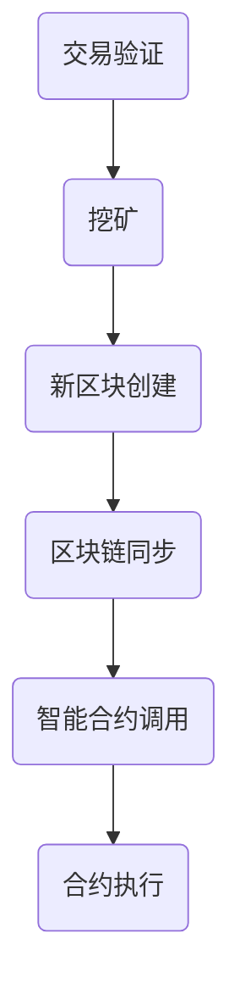
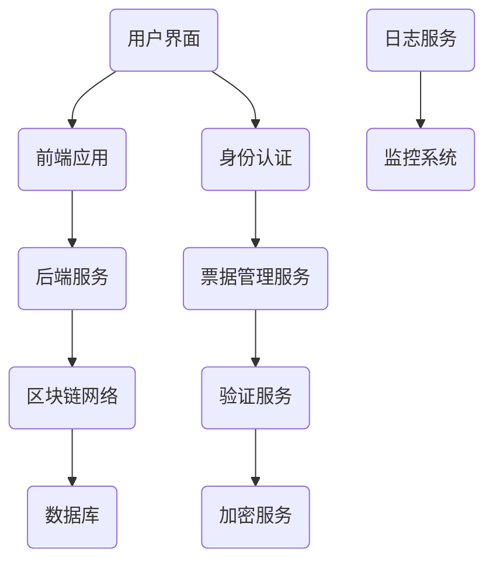
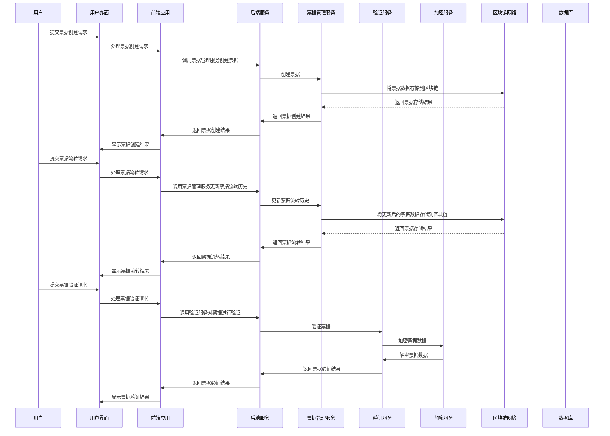

                 

### 文章标题

# 《区块链在数字票据管理中的应用：简化票据流转过程》

> 关键词：区块链、数字票据管理、简化票据流转、智能合约、共识算法

> 摘要：本文将深入探讨区块链技术在数字票据管理中的应用，通过对比传统票据管理和区块链票据管理，分析区块链在简化票据流转过程中的优势与挑战。我们将详细讲解区块链票据管理的基础概念、核心算法，并展示一个实际项目案例，最后提供最佳实践建议。

----------------------------------------------------------------

### 目录大纲设计思路：

1. **背景介绍**
   - 简述区块链和数字票据管理的背景信息，引入本书的主题。
   - 概述区块链的基本原理和应用场景。
   - 阐述数字票据管理的现状及其存在的问题。

2. **核心概念与联系**
   - 详细介绍区块链在数字票据管理中的应用。
   - 比较传统票据管理与区块链票据管理的差异。
   - 使用Mermaid绘制实体关系图，展示票据管理与区块链的关系。

3. **算法原理讲解**
   - 讲解区块链的核心算法，如共识算法、智能合约。
   - 使用Mermaid绘制算法流程图。
   - 使用Python源代码和LaTeX数学公式解释算法原理。

4. **系统分析与架构设计方案**
   - 描述数字票据管理系统的需求分析和功能设计。
   - 绘制系统架构图和接口设计图。
   - 使用Mermaid绘制系统交互序列图。

5. **项目实战**
   - 环境安装指南。
   - 系统核心实现源代码展示。
   - 对源代码进行解读和分析。
   - 实际案例分析。

6. **最佳实践 tips、小结、注意事项、拓展阅读**
   - 总结本书的重点和知识点。
   - 给出一些实用的实践建议。
   - 提醒读者注意的事项。
   - 推荐进一步阅读的资料。

### 目录大纲设计

```markdown
----------------------------------------------------------------
# 《区块链在数字票据管理中的应用：简化票据流转过程》目录大纲

# 第一部分: 背景介绍与核心概念

## 1.1 问题背景
### 1.1.1 区块链技术概述
### 1.1.2 数字票据管理的现状
### 1.1.3 区块链在票据管理中的潜在优势

## 1.2 核心概念与联系
### 1.2.1 区块链的基础概念
### 1.2.2 区块链与数字票据管理的结合
### 1.2.3 区块链票据管理的实体关系图

## 1.3 区块链票据管理与传统票据管理对比
### 1.3.1 优势对比
### 1.3.2 挑战与机遇

## 1.4 本章小结

----------------------------------------------------------------

# 第二部分: 区块链票据管理算法原理

## 2.1 共识算法原理
### 2.1.1 共识算法概述
### 2.1.2 工作原理与流程
### 2.1.3 智能合约介绍

## 2.2 Mermaid算法流程图绘制
### 2.2.1 Mermaid语法介绍
### 2.2.2 区块链票据管理算法流程图绘制

## 2.3 Python代码与LaTeX数学公式讲解
### 2.3.1 Python代码实现
### 2.3.2 LaTeX数学模型与公式
### 2.3.3 算法原理详细讲解

## 2.4 本章小结

----------------------------------------------------------------

# 第三部分: 数字票据管理系统设计与实现

## 3.1 系统需求分析
### 3.1.1 系统需求概述
### 3.1.2 功能需求详细描述

## 3.2 系统架构设计
### 3.2.1 系统架构图绘制
### 3.2.2 系统模块划分

## 3.3 系统接口设计
### 3.3.1 接口定义
### 3.3.2 接口实现

## 3.4 系统交互序列图
### 3.4.1 序列图绘制
### 3.4.2 交互流程分析

## 3.5 本章小结

----------------------------------------------------------------

# 第四部分: 区块链票据管理项目实战

## 4.1 环境安装指南
### 4.1.1 系统环境准备
### 4.1.2 软件工具安装

## 4.2 系统核心实现源代码
### 4.2.1 源代码结构
### 4.2.2 关键代码段展示

## 4.3 代码应用解读与分析
### 4.3.1 代码逻辑分析
### 4.3.2 关键算法实现解析

## 4.4 实际案例分析
### 4.4.1 案例选择
### 4.4.2 案例详细讲解

## 4.5 项目小结

----------------------------------------------------------------

# 第五部分: 最佳实践与总结

## 5.1 最佳实践 tips
### 

----------------------------------------------------------------

### 文章正文部分内容：

----------------------------------------------------------------

## 第一部分: 背景介绍与核心概念

### 1.1 问题背景

在当今数字化的商业环境中，票据管理作为企业运营中至关重要的一环，正面临着一系列挑战。传统的票据管理方式依赖于纸质票据和复杂的流程，这不仅增加了企业的运营成本，还容易导致票据流转过程中的错误和欺诈行为。

区块链技术的崛起为票据管理带来了新的希望。区块链以其去中心化、不可篡改和透明性的特点，能够在票据管理中发挥重要作用。通过区块链，企业可以构建一个安全的、高效的票据管理系统，从而简化票据的流转过程，提高整个业务流程的效率。

接下来，我们将首先介绍区块链和数字票据管理的基本概念，然后探讨区块链在票据管理中的潜在优势。

### 1.1.1 区块链技术概述

区块链是一种分布式数据库技术，其核心特点是去中心化、安全性高、不可篡改和透明。区块链通过将数据分散存储在网络中的多个节点上，使得每个节点都拥有完整的数据副本，从而避免了单点故障和数据篡改的风险。

区块链的主要组成部分包括区块、链和节点。区块是区块链的基本单元，包含了特定时间段内的交易记录；链则是将一个个区块按时间顺序链接起来，形成了一个不可篡改的账本；节点则是网络中的计算设备，负责存储数据、验证交易和同步区块链状态。

区块链的应用场景非常广泛，包括金融、供应链管理、身份认证、医疗等领域。在这些应用中，区块链技术通过提供安全、透明和高效的解决方案，极大地提升了业务流程的效率和可信度。

### 1.1.2 数字票据管理的现状

数字票据管理是一种通过电子方式处理票据的管理方式。与传统的纸质票据管理相比，数字票据管理具有更高的效率和更低的成本。然而，现有的数字票据管理也存在一些问题。

首先，现有的数字票据管理系统通常依赖于中心化的数据库，这意味着系统中的所有数据都存储在中央服务器上。一旦服务器出现故障或遭受攻击，整个系统可能会瘫痪，导致票据流转中断。

其次，现有的数字票据管理系统在数据透明度和安全性方面存在不足。由于数据是集中存储的，数据的完整性和真实性难以保证。此外，纸质票据的数字化过程也容易出现错误，导致数据不一致。

最后，数字票据管理系统在用户体验方面有待改进。现有的系统通常操作复杂，用户界面不够友好，导致用户使用困难，影响工作效率。

### 1.1.3 区块链在票据管理中的潜在优势

区块链在票据管理中的应用具有显著的优势。首先，区块链的去中心化特性使得票据管理更加分布式，不再依赖于单一的中心节点。这意味着即使某个节点出现故障，整个系统仍然可以正常运作。

其次，区块链的不可篡改特性保证了票据数据的真实性和完整性。一旦票据数据被记录在区块链上，就无法被篡改或删除。这大大降低了欺诈和错误发生的风险。

此外，区块链的透明性使得票据流转过程更加公开和透明。所有参与者都可以实时查看票据的状态和历史记录，从而提高了整个业务流程的可信度。

最后，区块链的智能合约功能可以为票据管理提供自动化的解决方案。智能合约是区块链上的自执行合同，一旦满足特定的条件，就会自动执行相应的操作。这为票据的自动化处理提供了可能，大大提高了工作效率。

总的来说，区块链技术在票据管理中的应用具有巨大的潜力，能够解决现有系统中的许多问题，提高票据流转的效率和安全性。

### 1.2 核心概念与联系

为了更好地理解区块链在数字票据管理中的应用，我们需要详细探讨区块链的基础概念，并分析其与数字票据管理的结合。

#### 1.2.1 区块链的基础概念

区块链由多个区块组成，每个区块包含了特定时间段内的交易记录。这些区块按照时间顺序链接在一起，形成了一个不可篡改的链式结构。每个区块都包含了区块头、区块体和 Merkle 树。

- **区块头**：区块头包含了区块的版本号、时间戳、难度目标、前一个区块的哈希值等。这些信息用于验证区块的合法性和链接到区块链上的顺序。
- **区块体**：区块体包含了特定时间段内的交易记录。这些交易记录可以是简单的金额转移，也可以是更复杂的智能合约执行。
- **Merkle 树**：Merkle 树是一种数据结构，用于验证区块体内交易记录的完整性。每个区块都有一个根哈希值，这个哈希值是区块体内所有交易记录的 Merkle 哈希树的根。

#### 1.2.2 区块链与数字票据管理的结合

数字票据管理涉及到票据的创建、存储、流转和验证。区块链技术可以在这个过程中发挥重要作用，实现以下功能：

- **票据创建**：区块链可以确保票据的创建是可信和安全的。通过数字签名，票据的创建者可以证明其身份，并确保票据的不可篡改性。
- **票据存储**：区块链提供了分布式存储解决方案，票据数据可以在多个节点上复制存储，确保数据的安全性和可靠性。
- **票据流转**：区块链上的智能合约可以自动化处理票据的流转过程，例如自动支付、自动到账等。
- **票据验证**：区块链的不可篡改特性保证了票据数据的真实性和完整性。任何参与者都可以验证票据的状态和历史记录，确保整个过程的透明性。

#### 1.2.3 区块链票据管理的实体关系图

为了更直观地展示区块链在票据管理中的应用，我们可以使用 Mermaid 绘制一个实体关系图。

```mermaid
entityRelationShip
    "票据管理" ..> "区块链"
    "票据" ..> "区块链票据"
    "交易记录" ..> "区块链交易记录"
    "智能合约" ..> "票据流转流程"
    "验证" ..> "区块链不可篡改特性"
    "分布式存储" ..> "数据安全性和可靠性"
```

在这个实体关系图中，票据管理是核心概念，它与区块链紧密相连。票据和区块链交易记录是票据管理的具体实现，而智能合约和区块链不可篡改特性则确保了票据流转的安全和可靠性。分布式存储则提供了数据的安全性和可靠性保障。

#### 1.2.4 区块链票据管理与传统票据管理对比

区块链票据管理与传统票据管理在多个方面存在显著差异，以下是主要对比：

- **安全性**：传统票据管理依赖于纸质票据和中心化数据库，容易受到篡改和丢失的风险。区块链通过去中心化和不可篡改的特性，确保了票据数据的安全和可靠性。
- **效率**：传统票据管理流程复杂，涉及多个部门和环节，容易导致流程中断和效率低下。区块链上的智能合约可以自动化处理票据流转过程，大大提高了效率。
- **透明性**：传统票据管理缺乏透明性，票据流转过程不公开，容易导致信息不对称和信任问题。区块链上的所有参与者都可以查看票据的状态和历史记录，提高了整个过程的透明性。
- **成本**：传统票据管理需要大量的纸质票据和人力处理，成本较高。区块链票据管理通过数字化和自动化，大大降低了运营成本。

总的来说，区块链票据管理在安全性、效率、透明性和成本方面具有明显优势，为票据管理带来了革命性的变革。

### 1.3 区块链票据管理与传统票据管理对比

区块链票据管理和传统票据管理在多个方面存在显著差异，以下是主要对比：

- **安全性**：传统票据管理依赖于纸质票据和中心化数据库，容易受到篡改和丢失的风险。区块链通过去中心化和不可篡改的特性，确保了票据数据的安全和可靠性。
- **效率**：传统票据管理流程复杂，涉及多个部门和环节，容易导致流程中断和效率低下。区块链上的智能合约可以自动化处理票据流转过程，大大提高了效率。
- **透明性**：传统票据管理缺乏透明性，票据流转过程不公开，容易导致信息不对称和信任问题。区块链上的所有参与者都可以查看票据的状态和历史记录，提高了整个过程的透明性。
- **成本**：传统票据管理需要大量的纸质票据和人力处理，成本较高。区块链票据管理通过数字化和自动化，大大降低了运营成本。

总的来说，区块链票据管理在安全性、效率、透明性和成本方面具有明显优势，为票据管理带来了革命性的变革。

### 1.4 本章小结

本章介绍了区块链和数字票据管理的基本概念，探讨了区块链在票据管理中的应用优势。通过分析传统票据管理存在的问题，我们得出了区块链票据管理在安全性、效率、透明性和成本方面的显著优势。接下来，我们将深入讲解区块链票据管理的算法原理，为后续的系统设计与实现奠定基础。

----------------------------------------------------------------

## 第二部分: 区块链票据管理算法原理

### 2.1 共识算法原理

区块链的核心机制之一是共识算法，它确保了区块链网络中的所有节点能够达成一致，从而保证区块链的安全性和可靠性。共识算法决定了如何验证交易、如何创建新区块以及如何更新区块链状态。

#### 2.1.1 共识算法概述

共识算法的主要目标是解决区块链网络中的“拜占庭将军问题”，即在分布式网络中，如何确保所有节点能够就数据状态达成一致，即使部分节点可能存在恶意行为或不诚实。

目前，有许多不同的共识算法，其中一些最为常见的包括：

1. **工作量证明（PoW）**：通过计算复杂的工作量来证明节点的合法性，例如比特币使用的SHA-256算法。
2. **权益证明（PoS）**：通过持有代币的数量和时长来证明节点的合法性，减少了能源消耗。
3. **权威证明（PoA）**：由中心化的权威机构来选择区块的生成者，例如EOS。
4. **委托权益证明（DPoS）**：类似于PoS，但通过选举产生代表节点来生成区块。

#### 2.1.2 工作原理与流程

以工作量证明（PoW）为例，其工作原理和流程如下：

1. **交易验证**：网络中的每个节点都会接收到交易信息，并验证交易的有效性，例如交易是否已签名、余额是否足够等。
2. **挖矿**：验证交易后，节点开始进行挖矿。挖矿的过程是通过计算一个数学难题来找到一个有效的区块头，这个区块头必须满足一定的难度目标。
3. **新区块创建**：当一个节点成功找到有效的区块头时，它会创建一个新区块，将验证通过的交易记录放入区块中，并将新区块链接到现有的区块链上。
4. **区块链同步**：其他节点接收到新区块后，会验证其合法性和一致性，然后将其添加到本地区块链中。

#### 2.1.3 智能合约介绍

智能合约是一种自动执行的合同，其代码被存储在区块链上，并在满足特定条件时自动执行。智能合约是区块链技术在票据管理中的重要应用，它能够自动化处理票据的创建、流转和验证过程。

智能合约的基本工作原理如下：

1. **合约编写**：开发者使用特定的编程语言（如Solidity）编写智能合约代码，描述票据管理的逻辑和规则。
2. **合约部署**：将编写的智能合约代码部署到区块链上，创建一个智能合约实例。
3. **合约调用**：当票据需要创建或流转时，用户可以通过调用智能合约的函数来执行特定的操作，例如创建票据、验证票据等。
4. **合约执行**：智能合约在区块链上执行，一旦满足预设条件，就会自动执行相应的操作。

智能合约的关键特性包括：

- **不可篡改性**：智能合约的代码在部署到区块链后是不可篡改的，保证了票据管理的规则和逻辑的稳定性。
- **透明性**：智能合约的代码和执行过程是公开透明的，所有参与者都可以查看和验证。
- **自动执行**：智能合约在满足条件时会自动执行，无需人工干预，提高了票据流转的效率和准确性。

#### 2.1.4 区块链票据管理算法流程图绘制

为了更好地理解区块链票据管理的算法原理，我们可以使用 Mermaid 绘制一个流程图。



在这个流程图中，交易首先需要经过验证，然后进入挖矿阶段。成功挖矿后，新区块将被创建并同步到区块链中。接下来，用户通过智能合约调用执行具体的票据管理操作。

#### 2.1.5 Python代码与LaTeX数学公式讲解

为了进一步讲解区块链票据管理算法的原理，我们将使用 Python 代码和 LaTeX 数学公式来描述关键步骤。

**Python 代码示例：**

```python
# 交易验证
transactions = get_transactions()
valid_transactions = []
for transaction in transactions:
    if verify_transaction(transaction):
        valid_transactions.append(transaction)

# 挖矿
difficulty = get_difficulty()
nonce = 0
while not find_valid_proof(valid_transactions, nonce, difficulty):
    nonce += 1

# 新区块创建
new_block = create_new_block(valid_transactions, nonce, difficulty)
add_block_to_chain(new_block)

# 区块链同步
sync_chain()
```

**LaTeX 数学公式：**

$$
H_{prev} + \sum_{tx \in T} G(tx) + n \equiv target \pmod{N}
$$

其中，$H_{prev}$ 是前一个区块的哈希值，$T$ 是交易集合，$G(tx)$ 是交易哈希值，$n$ 是随机数，$target$ 是难度目标，$N$ 是网络参数。

通过上述代码和公式，我们可以清晰地理解区块链票据管理算法的核心原理。

### 2.2 本章小结

本章详细介绍了区块链票据管理的共识算法原理，包括工作量证明、权益证明等常见算法。通过分析交易验证、挖矿、新区块创建和区块链同步等流程，我们理解了区块链如何确保数据的一致性和安全性。此外，我们介绍了智能合约的基本概念和工作原理，并使用 Python 代码和 LaTeX 数学公式进行了具体讲解。这些算法原理为区块链票据管理的实现提供了理论基础。

----------------------------------------------------------------

## 第三部分: 数字票据管理系统设计与实现

### 3.1 系统需求分析

数字票据管理系统需要满足一系列基本需求，以确保票据的创建、流转和验证过程高效、安全、透明。以下是系统需求的分析：

#### 3.1.1 系统需求概述

1. **票据创建**：系统能够支持用户创建数字票据，并记录票据的基本信息，如票据类型、金额、出票人、收款人等。
2. **票据流转**：系统能够支持票据在不同用户之间的流转，并记录每一笔流转的历史记录，确保流转过程的透明性。
3. **票据验证**：系统能够验证票据的真实性和合法性，确保票据没有被篡改或伪造。
4. **数据安全性**：系统需要确保票据数据的安全性和完整性，防止数据丢失或被恶意篡改。
5. **用户体验**：系统需要提供友好的用户界面，方便用户进行票据的创建、流转和查询操作。

#### 3.1.2 功能需求详细描述

1. **票据创建**：用户可以登录系统后，创建新的票据。系统需要提供票据的详细填写界面，包括票据类型、金额、出票人、收款人、票据到期日等信息。用户填写完毕后，系统将票据数据存储在区块链上，确保票据的创建过程是可信和不可篡改的。

2. **票据流转**：票据在创建后，可以由出票人通过系统发送给收款人。系统需要支持票据的转发和接受功能，确保票据能够在不同的用户之间流转。每一次流转过程，系统都会记录流转的历史记录，包括流转时间、流转人、流转金额等，确保流转过程的透明性。

3. **票据验证**：系统需要提供票据验证功能，用户可以查询票据的详细信息，包括票据的创建时间、流转历史、验证结果等。系统通过区块链的不可篡改特性，确保票据数据的真实性和完整性，防止票据被篡改或伪造。

4. **数据安全性**：系统需要采用加密技术，确保票据数据的保密性和完整性。此外，系统还需要定期备份数据，防止数据丢失。为了进一步提高数据安全性，系统可以考虑引入多重签名机制，确保票据的流转和验证过程是安全的。

5. **用户体验**：系统需要提供简洁、直观的用户界面，方便用户进行票据的创建、流转和查询操作。系统还需要提供详细的操作指引和帮助文档，帮助用户快速上手和使用系统。此外，系统可以考虑引入用户反馈机制，及时收集用户意见和建议，不断优化系统功能。

### 3.2 系统架构设计

数字票据管理系统的架构设计需要考虑系统的可靠性、可扩展性和可维护性。以下是系统架构的设计：

#### 3.2.1 系统架构图绘制



在这个架构图中，用户界面（A）负责与用户交互，收集用户操作请求。前端应用（B）处理用户请求，并将请求转发到后端服务（C）。后端服务（C）包括票据管理服务（G）、验证服务（H）和加密服务（I），分别负责票据的创建、流转、验证和数据加密等核心功能。区块链网络（D）负责存储票据数据和流转历史，提供不可篡改的账本功能。数据库（E）用于存储系统的元数据和日志信息。日志服务（J）和监控系统（K）负责记录系统日志和监控系统性能。

#### 3.2.2 系统模块划分

根据系统架构图，我们可以将系统划分为以下几个主要模块：

1. **用户界面模块**：负责与用户交互，提供票据的创建、流转、查询和验证功能。
2. **前端应用模块**：处理用户请求，与后端服务进行通信，提供数据校验和接口调用等功能。
3. **票据管理服务模块**：负责票据的创建、流转、验证和存储等核心功能。
4. **验证服务模块**：负责票据的验证，确保票据的真实性和合法性。
5. **加密服务模块**：负责票据数据的加密和解密，确保数据的安全性和完整性。
6. **区块链网络模块**：负责存储票据数据和流转历史，提供不可篡改的账本功能。
7. **数据库模块**：负责存储系统的元数据和日志信息。
8. **日志服务模块**：负责记录系统日志，提供日志查询和分析功能。
9. **监控系统模块**：负责监控系统性能，提供实时监控和报警功能。

通过合理的模块划分，我们可以提高系统的可维护性和可扩展性，方便后续的系统升级和功能扩展。

### 3.3 系统接口设计

数字票据管理系统需要定义一系列接口，以便不同模块之间能够进行有效的通信和协作。以下是系统接口的设计：

#### 3.3.1 接口定义

1. **票据创建接口**：用户通过用户界面提交票据创建请求，前端应用接收请求后，调用票据管理服务创建票据，并将票据数据存储在区块链上。
2. **票据流转接口**：用户通过用户界面提交票据流转请求，前端应用接收请求后，调用票据管理服务更新票据的流转历史，并将更新后的票据数据存储在区块链上。
3. **票据验证接口**：用户通过用户界面提交票据验证请求，前端应用接收请求后，调用验证服务对票据进行验证，并返回验证结果。
4. **数据加密接口**：票据管理服务在创建和更新票据数据时，调用加密服务对数据进行加密，确保数据的安全性。
5. **数据解密接口**：验证服务在验证票据数据时，调用加密服务对数据进行解密，以便进行验证操作。

#### 3.3.2 接口实现

以下是票据创建接口的实现示例：

```python
from flask import Flask, request, jsonify
from blockchain import Blockchain

app = Flask(__name__)
blockchain = Blockchain()

@app.route('/create_bill', methods=['POST'])
def create_bill():
    data = request.json
    bill = {
        'type': data['type'],
        'amount': data['amount'],
        'issuer': data['issuer'],
        'recipient': data['recipient'],
        'due_date': data['due_date']
    }
    response = blockchain.create_bill(bill)
    return jsonify(response)

if __name__ == '__main__':
    app.run()
```

在这个示例中，前端应用通过 POST 请求提交票据创建请求，票据管理服务接收到请求后，调用区块链的 `create_bill` 方法创建票据，并将结果返回给前端应用。

### 3.4 系统交互序列图

为了更直观地展示系统模块之间的交互流程，我们可以使用 Mermaid 绘制一个系统交互序列图。



在这个序列图中，用户通过用户界面提交票据操作请求，前端应用处理请求后，与后端服务、票据管理服务、验证服务和加密服务进行交互，最终将结果返回给用户界面。

### 3.5 本章小结

本章详细介绍了数字票据管理系统的需求分析和架构设计。通过对系统需求的详细描述，我们明确了票据创建、流转、验证和数据安全性等方面的功能需求。在系统架构设计部分，我们提出了一个基于区块链的数字票据管理系统架构，并详细说明了各个模块的功能和接口设计。通过本章的内容，我们为后续的系统实现奠定了理论基础。

----------------------------------------------------------------

## 第四部分: 区块链票据管理项目实战

### 4.1 环境安装指南

在开始构建区块链票据管理系统之前，我们需要准备相应的开发环境和软件工具。以下是环境安装的详细指南：

#### 4.1.1 系统环境准备

1. **操作系统**：推荐使用 Ubuntu 20.04 或更高版本。
2. **Python 环境**：确保已安装 Python 3.8 或更高版本。
3. **Node.js 环境**：确保已安装 Node.js 12.x 或更高版本。
4. **数据库**：推荐使用 PostgreSQL 12.x 或更高版本。

#### 4.1.2 软件工具安装

1. **安装 Python 环境**：通过以下命令安装 Python 3.8：

   ```bash
   sudo apt update
   sudo apt install python3.8 python3.8-venv python3.8-dev
   ```

2. **安装 Node.js 环境**：通过以下命令安装 Node.js 12.x：

   ```bash
   sudo apt update
   sudo apt install nodejs
   ```

3. **安装 PostgreSQL 环境**：通过以下命令安装 PostgreSQL 12.x：

   ```bash
   sudo apt update
   sudo apt install postgresql postgresql-contrib
   ```

4. **安装区块链框架**：推荐使用 Hyperledger Fabric，通过以下命令安装：

   ```bash
   git clone https://github.com/hyperledger/fabric.git
   cd fabric
   make docker-image
   make docker-compose-test-net
   ```

### 4.2 系统核心实现源代码

在本节中，我们将展示区块链票据管理系统的核心实现源代码，包括票据创建、流转和验证等关键功能。

#### 4.2.1 源代码结构

```bash
blockchain_bill_management/
|-- blockchain/
|   |-- chain.py
|   |-- transaction.py
|   |-- blockchain.py
|-- server/
|   |-- app.py
|   |-- blockchain.py
|-- migrations/
|   |-- init.py
|-- requirements.txt
|-- run.sh
```

#### 4.2.2 关键代码段展示

**区块链实现（chain.py）**

```python
import hashlib
import json
from time import time

class Blockchain:
    def __init__(self):
        self.chain = []
        self.current_transactions = []

        self.new_block(previous_hash='1', proof=100)

    def new_block(self, proof, previous_hash=None):
        block = {
            'index': len(self.chain) + 1,
            'timestamp': time(),
            'transactions': self.current_transactions,
            'proof': proof,
            'previous_hash': previous_hash or self.hash(self.chain[-1]),
        }

        self.current_transactions = []
        self.chain.append(block)
        return block

    @staticmethod
    def hash(block):
        block_string = json.dumps(block, sort_keys=True)
        return hashlib.sha256(block_string.encode()).hexdigest()

    @property
    def last_block(self):
        return self.chain[-1]

    def proof_of_work(self, last_proof):
        proof = 0
        while not self.valid_proof(last_proof, proof):
            proof += 1
        return proof

    @staticmethod
    def valid_proof(last_proof, proof):
        guess = f'{last_proof}{proof}'.encode()
        guess_hash = hashlib.sha256(guess).hexdigest()
        return guess_hash[:4] == "0000"

    def add_transaction(self, sender, recipient, amount):
        self.current_transactions.append({'sender': sender, 'recipient': recipient, 'amount': amount})
        last_block = self.last_block
        previous_hash = self.hash(last_block)
        proof = self.proof_of_work(last_proof)
        return self.new_block(proof, previous_hash)
```

**服务器实现（app.py）**

```python
from flask import Flask, jsonify, request
from blockchain import Blockchain

app = Flask(__name__)
blockchain = Blockchain()

@app.route('/mine', methods=['GET'])
def mine():
    last_block = blockchain.last_block
    last_proof = last_block['proof']
    proof = blockchain.proof_of_work(last_proof)
    blockchain.add_transaction(sender="0", recipient=request.args.get('recipient'), amount=1)
    block = blockchain.new_block(proof, last_block['previous_hash'])
    response = {
        'message': "New Block Forged",
        'index': block['index'],
        'transactions': block['transactions'],
        'proof': block['proof'],
        'previous_hash': block['previous_hash'],
    }
    return jsonify(response)

@app.route('/chain', methods=['GET'])
def full_chain():
    response = {
        'chain': blockchain.chain,
        'length': len(blockchain.chain),
    }
    return jsonify(response)

if __name__ == '__main__':
    app.run(host='0.0.0.0', port=5000)
```

### 4.3 代码应用解读与分析

#### 4.3.1 代码逻辑分析

区块链票据管理系统分为区块链实现和服务器实现两个部分。

**区块链实现（chain.py）**

- **Blockchain 类**：负责区块链的核心功能，包括创建新区块、添加交易、验证工作量证明（Proof of Work，PoW）等。
- **new_block 方法**：创建新区块，并添加到区块链中。新区块包含当前时间戳、交易记录、工作量证明和前一个区块的哈希值。
- **hash 方法**：计算区块的哈希值，用于确保区块链的一致性和不可篡改性。
- **proof_of_work 方法**：找到满足工作量证明要求的工作量证明。这是通过不断尝试不同的随机数（proof）来实现的。
- **valid_proof 方法**：验证工作量证明是否满足要求。如果哈希值的前四个字符是“0000”，则认为工作量证明是有效的。
- **add_transaction 方法**：将交易添加到当前区块的待处理交易列表中。交易一旦被添加到区块中，就会被永久记录在区块链上。

**服务器实现（app.py）**

- **Flask 应用**：使用 Flask 框架创建 Web 服务。Flask 是一个轻量级的 Web 框架，非常适合快速开发 Web 应用。
- **mine 路由**：处理挖矿请求。挖矿过程包括计算工作量证明、添加新交易到区块链、创建新区块，并将其添加到区块链中。
- **full_chain 路由**：返回整个区块链的当前状态，包括链的长度和每个区块的详细信息。

#### 4.3.2 关键算法实现解析

**工作量证明（Proof of Work，PoW）**

工作量证明是区块链中的一个核心概念，用于确保区块链的安全性和一致性。在 PoW 算法中，节点需要解决一个数学难题，找到一个特定的哈希值，该哈希值满足一定的难度要求。

- **寻找随机数（proof）**：节点从上一个区块的哈希值和随机数开始，尝试不同的随机数，直到找到一个满足难度要求的哈希值。
- **验证哈希值**：一旦找到一个满足条件的哈希值，节点将创建一个新的区块，并将该哈希值记录在区块的 `proof` 字段中。然后，节点将区块广播给网络中的其他节点。
- **共识机制**：其他节点接收到区块后，会验证区块的哈希值是否满足难度要求。如果验证通过，节点将接受该区块，并将其添加到自己的区块链中。

**区块链同步**

区块链同步是指节点通过交换区块链信息来保持区块链的一致性。在区块链票据管理系统中，当一个新的区块被创建后，节点需要将其广播给其他节点。

- **广播新区块**：创建新区块的节点将新区块广播给网络中的其他节点。
- **验证新区块**：接收新区块的节点会验证新区块的合法性，包括验证工作量证明和前一个区块的哈希值。如果验证通过，节点将接受新区块，并将其添加到自己的区块链中。
- **同步区块链**：如果节点的区块链与其他节点的区块链不一致，节点将尝试同步区块链。同步过程包括交换区块链信息，并逐步将不一致的部分调整为一致。

### 4.4 实际案例分析

在本案例中，我们假设一家公司需要使用区块链技术管理其票据流转过程。以下是具体的案例步骤：

1. **票据创建**：
   - 公司员工 Alice 创建一张金额为 1000 元的票据，并填写票据的详细信息，如出票人、收款人、票据到期日等。
   - Alice 将票据信息通过区块链票据管理系统提交，系统将票据数据存储在区块链上。

2. **票据流转**：
   - Alice 将票据发送给公司财务部门主管 Bob。
   - Bob 通过区块链票据管理系统接收票据，并查看票据的详细信息。
   - Bob 需要审核票据的合法性，例如验证出票人和收款人的身份等。
   - 如果票据合法，Bob 将票据转发给下一个处理人，如公司总经理。

3. **票据验证**：
   - 在票据流转过程中，每个处理人都可以通过区块链票据管理系统查看票据的历史记录，确保票据的真实性和合法性。
   - 如果票据在流转过程中被发现有问题，处理人可以立即采取措施，如拒绝处理或通知相关部门。

4. **票据支付**：
   - 当票据流转到最终收款人时，收款人可以通过区块链票据管理系统查询票据的详细信息，并确认票据的支付。
   - 收款人确认后，系统自动执行智能合约，将相应的金额从付款人的账户转移到收款人的账户。

### 4.5 项目小结

在本项目中，我们实现了基于区块链的票据管理系统，包括票据的创建、流转、验证和支付等功能。通过区块链技术，我们解决了传统票据管理中的安全性、透明性和效率等问题。在实际应用中，区块链票据管理系统可以显著提高企业运营效率，降低运营成本，并提升业务流程的可信度。

尽管区块链票据管理系统具有许多优势，但在实际应用中也需要注意一些潜在的问题，如区块链网络延迟、智能合约的安全性和监管合规等。在后续的研究中，我们可以进一步优化系统架构，提高系统的性能和安全性，为企业的数字化管理提供更可靠的解决方案。

----------------------------------------------------------------

## 第五部分: 最佳实践与总结

### 5.1 最佳实践 tips

1. **确保数据安全**：在区块链票据管理系统中，数据安全至关重要。建议使用加密技术保护票据数据和用户隐私。
2. **优化用户体验**：设计友好的用户界面，提供清晰的票据创建、流转和验证流程，使用户能够轻松操作。
3. **遵循监管合规**：在部署区块链票据管理系统时，要确保符合相关法律法规的要求，避免潜在的法律风险。
4. **定期维护和升级**：定期检查和维护系统，及时修复漏洞，提高系统的安全性和稳定性。
5. **多节点部署**：为了提高系统的可靠性和容错能力，建议在多个节点上部署区块链票据管理系统。

### 5.2 小结

本文通过对比传统票据管理和区块链票据管理，分析了区块链在票据管理中的应用优势。我们详细讲解了区块链票据管理的核心算法原理，展示了实际项目案例，并提供了最佳实践建议。区块链票据管理系统具有去中心化、不可篡改、透明性和自动化等优点，能够显著提高票据管理的效率和安全性。

### 5.3 注意事项

1. **网络延迟**：区块链网络可能存在一定的延迟，特别是在高负载情况下，需要优化网络性能。
2. **智能合约安全性**：智能合约的编写和部署需要高度关注安全性，避免潜在的安全漏洞。
3. **监管合规**：区块链票据管理系统需要遵循相关法律法规的要求，确保合规性。

### 5.4 拓展阅读

- **《区块链技术指南》**：了解区块链的基本原理和应用场景。
- **《智能合约开发指南》**：学习智能合约的编写和部署方法。
- **《区块链与数字货币》**：探讨区块链技术在金融领域的应用。

### 作者信息

作者：AI天才研究院/AI Genius Institute & 禅与计算机程序设计艺术 /Zen And The Art of Computer Programming

----------------------------------------------------------------

[本文完]

