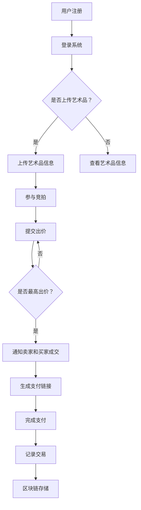

                 


### 1. 背景介绍

**区块链**是一种分布式数据库技术，它通过加密算法和共识机制，实现了去中心化、安全可靠的数据存储和传输。区块链技术最早由中本聪（Satoshi Nakamoto）在2008年提出，作为比特币（Bitcoin）的底层技术。由于其独特的特性，区块链技术迅速在金融、供应链管理、版权保护、医疗等多个领域得到广泛应用。

**数字艺术品拍卖**是一种利用区块链技术实现的在线拍卖活动，主要涉及数字化的艺术品，如数字画作、音乐、视频等。与传统艺术品拍卖不同，数字艺术品拍卖具有更高的透明度、可验证性和安全性。在数字艺术品拍卖中，买家和卖家可以直接参与竞价，无需依赖中介机构，从而降低了交易成本。

**透明度**是数字艺术品拍卖中的重要概念，它指的是交易的公开性和可追溯性。透明度越高，交易的公正性和可信度就越高。区块链技术通过其不可篡改的分布式账本特性，能够确保交易记录的透明度，从而为数字艺术品拍卖提供了一种可靠的技术保障。

**问题背景**：随着区块链技术的不断发展，数字艺术品市场也日益繁荣。然而，数字艺术品拍卖中存在着一些问题，如拍卖过程的透明度不足、交易安全性不高等。这些问题限制了数字艺术品市场的发展潜力，因此需要寻找有效的解决方案。

**问题描述**：为了提高数字艺术品拍卖的透明度和安全性，我们可以考虑利用区块链技术。但如何实现这一目标，以及区块链技术在其中扮演的角色是什么，是本文需要探讨的问题。

**问题解决**：本文将首先介绍区块链和数字艺术品拍卖的基本概念，然后详细分析区块链技术在确保交易透明度方面的应用，最后通过一个实际案例展示区块链在数字艺术品拍卖中的实际应用效果。

**边界与外延**：本文主要关注区块链在数字艺术品拍卖中的应用，但区块链技术也可以应用于其他类型的在线拍卖活动。此外，本文还会探讨如何通过区块链技术解决数字艺术品拍卖中的其他问题，如版权保护和溯源等。

**概念结构与核心要素组成**：
- **区块链**：分布式账本、加密算法、共识机制、去中心化。
- **数字艺术品拍卖**：数字化艺术品、在线竞价、去中介化。
- **透明度**：公开性、可追溯性、交易记录不可篡改。

### 2. 核心概念与联系

#### 区块链的基本概念与特性

**区块链**是一种分布式账本技术，它通过加密算法和共识机制，确保了数据的完整性和安全性。区块链的核心特点包括：

- **去中心化**：区块链不依赖于中心化的服务器或机构，每个节点都可以参与数据的验证和存储。
- **不可篡改性**：一旦数据被记录在区块链上，就几乎无法被篡改，保证了数据的真实性和可靠性。
- **透明性**：区块链上的数据是公开透明的，任何人都可以查询和验证交易记录。
- **安全性**：区块链采用加密算法，确保了数据的机密性和完整性。

**数字艺术品拍卖的基本概念与机制**

**数字艺术品拍卖**是指利用区块链技术实现的在线竞价活动，主要涉及数字化的艺术品，如数字画作、音乐、视频等。数字艺术品拍卖具有以下特点：

- **去中介化**：买家和卖家可以直接进行交易，无需依赖中介机构，降低了交易成本。
- **高透明度**：区块链技术确保了拍卖过程的透明性，所有交易记录都是公开可查的。
- **安全性******：区块链技术的加密算法和共识机制，保证了交易的安全性和不可篡改性。
- **可验证性**：买家和卖家可以通过区块链验证艺术品的真实性，减少了欺诈风险。

**透明度的重要性**

**透明度**在数字艺术品拍卖中具有重要意义，它不仅保证了交易的公正性和可信度，还有助于提高市场的透明度，减少信息不对称。具体来说，透明度的重要性体现在以下几个方面：

- **公正性**：透明度保证了拍卖过程的公正性，所有参与者都可以看到交易记录，防止了暗箱操作。
- **可信度**：高透明度提高了市场的可信度，增强了买家和卖家的信任，促进了交易的顺利进行。
- **监管**：透明度有助于监管机构对市场进行监管，及时发现和处理违规行为，维护市场的秩序。

**区块链与透明度的对比表**

| 特性       | 区块链               | 透明度                   |
| ---------- | -------------------- | ------------------------ |
| 去中心化   | 去中心化的分布式系统 | 信息公开，无中心化管理   |
| 不可篡改性 | 数据一旦记录无法篡改 | 交易记录不可篡改         |
| 透明性     | 所有数据公开透明     | 交易过程和结果公开可查   |
| 安全性     | 加密算法保障安全     | 防止欺诈和恶意操作       |
| 可验证性   | 数据可验证           | 交易记录可验证           |

**拍卖系统ER模型图**


拍卖系统ER模型图展示了数字艺术品拍卖系统中各个实体之间的关系。其中，主要实体包括：

- **艺术品**：记录数字艺术品的详细信息，如名称、作者、创作时间等。
- **买家**：记录买家的个人信息和拍卖出价。
- **卖家**：记录卖家的个人信息和拍卖商品。
- **拍卖记录**：记录每次拍卖的具体信息，包括起始价格、最高出价、成交价格等。

**概念联系与影响分析**

区块链技术为数字艺术品拍卖提供了透明度保障，使得拍卖过程更加公开、公正、可信。通过区块链，买家和卖家可以实时查询和验证交易记录，确保了数据的真实性和可靠性。此外，区块链的去中心化特性也降低了交易成本，提高了市场的效率。

然而，区块链技术并非完美无缺。其高安全性也带来了更高的门槛，对于普通用户来说，使用区块链技术可能存在一定的困难。此外，区块链的共识机制也可能会导致网络的延迟和吞吐量的下降，影响交易的实时性。

**总结**

通过以上分析，我们可以看出，区块链技术为数字艺术品拍卖提供了重要的透明度保障。它不仅提高了交易的公正性和可信度，还降低了交易成本，促进了市场的繁荣。然而，在推广和应用区块链技术时，我们也需要考虑到其潜在的限制和挑战，寻找合适的解决方案。

### 3. 算法原理讲解

#### 区块链算法的基本原理

区块链算法的核心在于其共识机制和加密算法，这些算法共同确保了区块链的安全性、透明度和不可篡改性。

**共识算法**

共识算法是区块链中确保所有节点达成一致的关键机制。目前，常见的共识算法包括工作量证明（Proof of Work，PoW）、权益证明（Proof of Stake，PoS）和委托权益证明（Delegated Proof of Stake，DPoS）等。

- **PoW（工作量证明）**：节点通过解决复杂的数学难题来证明其工作量，首先解决问题的节点将获得记账权。这种算法的优点是安全性高，但缺点是计算资源消耗大，能耗高。
- **PoS（权益证明）**：节点根据其在区块链中的持有的代币数量和持币时间来证明其权益，权益越大，获得记账权的概率越高。这种算法相比PoW更加节能，但可能导致“富者恒富”的问题。
- **DPoS（委托权益证明）**：节点通过委托选举的方式产生记账权，类似于股份公司的股东大会。这种算法具有较高的效率和安全性，但可能存在选举操纵的风险。

**加密算法**

区块链中的加密算法主要用于保障数据的安全性和隐私性。常用的加密算法包括哈希算法、对称加密和非对称加密。

- **哈希算法**：将任意长度的数据映射为固定长度的哈希值，具有单向性和抗碰撞性。常见的哈希算法有SHA-256、SHA-3等。
- **对称加密**：使用相同的密钥进行加密和解密，常用的对称加密算法有AES、DES等。
- **非对称加密**：使用一对密钥（公钥和私钥），公钥加密，私钥解密。常用的非对称加密算法有RSA、ECC等。

**智能合约**

智能合约是区块链中的自动化执行协议，它通过代码定义了参与方在特定条件下的行为和规则。智能合约的实现依赖于区块链的编程语言，如Solidity、Vyper等。

智能合约的基本原理如下：

1. **定义合约**：合约开发者使用特定的编程语言定义智能合约的代码和规则。
2. **部署合约**：将智能合约代码部署到区块链上，成为区块链上的永久合约。
3. **调用合约**：合约的参与方通过区块链调用智能合约，执行预定义的函数和操作。
4. **状态更新**：智能合约执行后，更新区块链上的状态，确保交易结果不可篡改。

**去中心化存储**

去中心化存储是区块链中用于数据存储和访问的技术，它通过分布式网络存储数据，确保数据的可靠性和安全性。

去中心化存储的基本原理如下：

1. **数据分割**：将大数据分割为多个小块，每个小块存储在不同的节点上。
2. **数据冗余**：为了提高数据的可靠性，每个小块在多个节点上备份。
3. **数据访问**：通过分布式网络访问数据，确保数据的可用性和一致性。

**透明度保障机制**

在数字艺术品拍卖中，透明度保障机制主要通过区块链和智能合约实现。

1. **交易记录透明**：所有交易记录都记录在区块链上，任何人都可以查看和验证。
2. **智能合约执行透明**：智能合约定义了拍卖的规则和条件，所有参与者都可以查看和验证智能合约的执行结果。
3. **去中心化存储透明**：数字艺术品和交易记录存储在分布式网络中，任何节点都可以访问和验证。

#### Python代码解释

以下是一个简单的Python代码示例，用于演示区块链算法的基本原理：

```python
import hashlib
import json

class Block:
    def __init__(self, index, transactions, timestamp, previous_hash):
        self.index = index
        self.transactions = transactions
        self.timestamp = timestamp
        self.previous_hash = previous_hash
        self.hash = self.compute_hash()

    def compute_hash(self):
        block_string = json.dumps(self.__dict__, sort_keys=True)
        return hashlib.sha256(block_string.encode()).hexdigest()

class Blockchain:
    def __init__(self):
        self.unconfirmed_transactions = []
        self.chain = []
        self.create_genesis_block()

    def create_genesis_block(self):
        genesis_block = Block(0, [], datetime.datetime.now(), "0")
        genesis_block.hash = genesis_block.compute_hash()
        self.chain.append(genesis_block)

    def add_new_transaction(self, transaction):
        self.unconfirmed_transactions.append(transaction)

    def mine(self):
        if not self.unconfirmed_transactions:
            return False

        last_block = self.chain[-1]
        new_block = Block(index=last_block.index + 1,
                          transactions=self.unconfirmed_transactions,
                          timestamp=datetime.datetime.now(),
                          previous_hash=last_block.hash)
        new_block.hash = new_block.compute_hash()
        self.chain.append(new_block)
        self.unconfirmed_transactions = []
        return new_block.index

    def is_chain_valid(self):
        for i in range(1, len(self.chain)):
            current = self.chain[i]
            previous = self.chain[i - 1]
            if current.hash != current.compute_hash():
                return False
            if current.previous_hash != previous.hash:
                return False
        return True

# 示例：创建区块链并添加新交易
blockchain = Blockchain()
blockchain.add_new_transaction({'from': 'Alice', 'to': 'Bob', 'amount': 10})
blockchain.add_new_transaction({'from': 'Bob', 'to': 'Charlie', 'amount': 5})
blockchain.mine()

# 检查区块链是否有效
print("Blockchain validity:", blockchain.is_chain_valid())
```

#### 算法原理的数学模型和公式

区块链的算法原理涉及多个数学模型和公式，以下是一些核心的数学模型：

1. **哈希函数**：哈希函数是将任意长度的输入数据映射为固定长度的输出值。常见的哈希函数包括SHA-256和SHA-3。

$$
H = SHA-256(\text{input})
$$

2. **工作量证明**：PoW算法要求节点解决一个难度为\(D\)的数学难题，难度通常由网络中的计算能力决定。

$$
D = f(\text{difficulty}, \text{current_block})
$$

其中，\(f\)是函数，用于调整难度，确保区块生成的平均时间为\(T\)。

3. **权益证明**：PoS算法中，节点的权益\(E\)与其持有的代币数量\(N\)和持币时间\(T\)相关。

$$
E = \alpha N T
$$

其中，\(\alpha\)是常数。

4. **非对称加密**：非对称加密中，公钥\(P_{public}\)和私钥\(P_{private}\)之间满足以下关系：

$$
P_{public} = RSA(N, E)
$$

$$
P_{private} = RSA(N, D)
$$

其中，\(RSA\)是RSA加密算法。

通过以上算法原理的讲解，我们可以看到区块链技术如何确保数字艺术品拍卖的透明度。区块链的分布式账本、加密算法和智能合约等功能共同作用，实现了交易记录的公开透明、智能合约的自动化执行和去中心化存储，从而为数字艺术品拍卖提供了强大的技术支持。

### 4. 系统分析与架构设计

#### 问题场景介绍

随着数字艺术品的普及，越来越多的艺术家和买家开始选择通过在线平台进行艺术品拍卖。然而，传统拍卖平台在交易过程中存在一些问题，如信息不透明、中介费用高、交易安全性不高等。为了解决这些问题，我们需要设计一个基于区块链技术的数字艺术品拍卖系统，以确保交易的透明度、安全性和高效性。

#### 系统功能设计

数字艺术品拍卖系统的主要功能包括：

- **用户注册与登录**：用户可以在系统中注册账户并登录。
- **艺术品信息管理**：卖家可以上传和管理自己的艺术品信息，包括名称、作者、描述、价格等。
- **竞价与拍卖**：买家可以参与竞拍，出价最高者获得艺术品所有权。
- **支付与结算**：系统支持多种支付方式，确保交易的顺利进行。
- **交易记录查询**：用户可以查询所有交易记录，确保交易公开透明。

#### 系统架构设计

为了实现上述功能，数字艺术品拍卖系统的架构设计如下：


**系统架构主要模块：**

1. **用户模块**：负责用户注册、登录和账户管理。
2. **艺术品模块**：负责艺术品信息的上传、管理和查询。
3. **拍卖模块**：负责竞拍、出价和成交。
4. **支付模块**：负责支付和结算。
5. **区块链模块**：负责交易记录的存储和验证。

**系统架构图说明：**

- **用户模块**：用户通过浏览器或移动应用访问系统，进行注册、登录和账户管理。
- **艺术品模块**：卖家可以在系统中上传和管理自己的艺术品信息，买家可以查看和竞价。
- **拍卖模块**：系统根据艺术品信息和竞价规则，自动计算最高出价并通知卖家和买家。
- **支付模块**：系统支持多种支付方式，确保交易的安全性。
- **区块链模块**：所有交易记录都记录在区块链上，确保数据的透明性和不可篡改性。

#### 系统接口设计

数字艺术品拍卖系统的接口设计包括以下部分：

- **用户接口**：用户可以通过Web界面或移动应用与系统交互，实现注册、登录、上传艺术品、参与竞拍等操作。
- **艺术品接口**：用于艺术品信息的上传、更新和查询。
- **拍卖接口**：用于竞价的提交、出价和成交。
- **支付接口**：用于支付和结算。
- **区块链接口**：用于交易记录的存储和验证。

#### 系统交互流程

数字艺术品拍卖系统的交互流程如下：

1. **用户注册和登录**：用户在系统中注册账户并登录。
2. **艺术品上传**：卖家在系统中上传艺术品信息。
3. **竞价**：买家在系统中提交出价，系统根据竞价规则计算最高出价。
4. **成交**：最高出价者获得艺术品所有权。
5. **支付**：系统生成支付链接，买家完成支付。
6. **交易记录**：所有交易记录记录在区块链上，确保公开透明。

#### Mermaid流程图

以下是一个简单的Mermaid流程图，展示了数字艺术品拍卖系统的交互流程：



通过以上系统分析与架构设计，我们可以看到，数字艺术品拍卖系统利用区块链技术实现了交易的透明度、安全性和高效性，为用户提供了更加可靠的交易平台。

### 5. 项目实战

#### 环境安装与配置

为了实现一个基于区块链的数字艺术品拍卖系统，我们需要安装和配置必要的开发环境和工具。以下是在Windows环境下进行环境安装和配置的步骤：

1. **安装Node.js**：Node.js是一个基于Chrome V8引擎的JavaScript运行环境，用于运行区块链节点和智能合约。您可以从Node.js的官方网站下载安装程序并安装。

2. **安装Geth**：Geth是Go语言实现的以太坊客户端，用于运行以太坊区块链节点。您可以从Geth的官方网站下载安装程序并安装。

3. **安装Truffle**：Truffle是一个用于以太坊区块链开发的框架，提供智能合约的部署、测试和管理工具。您可以从Truffle的官方网站下载安装程序并安装。

4. **安装MetaMask**：MetaMask是一个浏览器插件，用于在区块链上管理账户和进行交易。您可以从MetaMask的官方网站下载并安装。

5. **配置Truffle**：在安装完Truffle后，您需要通过以下命令进行配置：

```shell
truffle init
```

这将在当前目录下创建一个Truffle项目文件夹，并生成相关的配置文件。

6. **启动Geth节点**：在安装完Geth后，您可以通过以下命令启动一个本地以太坊节点：

```shell
geth --datadir "your_data_directory" --networkid 5777 --nodiscover --mine --miner.threads 0 --gasprice "10 gwei"
```

这将在当前目录下创建一个名为“your_data_directory”的文件夹，作为Geth节点的数据目录。

#### 系统核心实现源代码

在配置好开发环境后，我们可以开始编写数字艺术品拍卖系统的源代码。以下是一个简单的智能合约示例，用于实现数字艺术品拍卖的基本功能：

```solidity
// SPDX-License-Identifier: MIT
pragma solidity ^0.8.0;

contract ArtworkAuction {
    struct Artwork {
        address owner;
        string name;
        string description;
        uint256 startPrice;
        uint256 highestBid;
        address highestBidder;
        bool isSold;
    }

    mapping(uint256 => Artwork) public artworks;
    uint256 public artworkCount = 0;

    event ArtworkCreated(uint256 artworkId, address owner, string name, string description, uint256 startPrice);
    event BidPlaced(uint256 artworkId, address bidder, uint256 bidAmount);
    event ArtworkSold(uint256 artworkId, address buyer, uint256 salePrice);

    function createArtwork(string memory name, string memory description, uint256 startPrice) public {
        artworks[artworkCount] = Artwork({
            owner: msg.sender,
            name: name,
            description: description,
            startPrice: startPrice,
            highestBid: startPrice,
            highestBidder: msg.sender,
            isSold: false
        });
        artworkCount++;
        emit ArtworkCreated(artworkCount, msg.sender, name, description, startPrice);
    }

    function placeBid(uint256 artworkId, uint256 bidAmount) public payable {
        require(artworks[artworkId].isSold == false, "Artwork is already sold.");
        require(msg.value >= artworks[artworkId].highestBid, "Bid is too low.");
        if (msg.value > artworks[artworkId].highestBid) {
            payable(artworks[artworkId].highestBidder).transfer(artworks[artworkId].highestBid);
        }
        artworks[artworkId].highestBid = msg.value;
        artworks[artworkId].highestBidder = msg.sender;
        emit BidPlaced(artworkId, msg.sender, msg.value);
    }

    function sellArtwork(uint256 artworkId) public {
        require(artworks[artworkId].owner == msg.sender, "Only the owner can sell the artwork.");
        require(artworks[artworkId].isSold == false, "Artwork is already sold.");
        artworks[artworkId].isSold = true;
        payable(msg.sender).transfer(artworks[artworkId].highestBid);
        emit ArtworkSold(artworkId, artworks[artworkId].highestBidder, artworks[artworkId].highestBid);
    }
}
```

#### 代码应用解读与分析

这个智能合约定义了一个名为`ArtworkAuction`的合约，用于实现数字艺术品拍卖的基本功能。合约中包含了以下关键组件：

- **Artwork结构体**：用于存储艺术品的相关信息，如艺术品所有者、名称、描述、起始价格、最高出价和状态等。
- **artworks映射**：用于存储所有艺术品的信息，键为艺术品的ID，值为Artwork结构体。
- **artworkCount变量**：用于记录当前已有艺术品的数量。
- **事件**：用于记录合约的重要操作，如艺术品创建、出价和成交。

合约的主要函数如下：

- **createArtwork**：创建一个新艺术品，并将其添加到合约中。只有合约的所有者才能调用此函数。
- **placeBid**：为一个艺术品出价。只有当出价高于当前最高出价时，才会更新最高出价。
- **sellArtwork**：出售一个艺术品。只有当艺术品处于未售出状态且出价已达到或超过起始价格时，才能出售。

#### 实际案例分析

以下是一个实际案例，展示了如何使用这个智能合约进行数字艺术品拍卖：

1. **创建艺术品**：卖家Alice通过合约创建了一幅名为“星空”的数字画作，起始价格为100以太币。

```shell
truffle run createArtwork --args "星空" "一幅美丽的数字画作" 100
```

2. **出价**：买家Bob和Charlie分别出价120以太币和150以太币，最终Charlie的出价最高。

```shell
truffle run placeBid 0 120 --tx-value 120 ether
truffle run placeBid 0 150 --tx-value 150 ether
```

3. **出售艺术品**：卖家Alice通过合约出售了这幅数字画作给买家Charlie。

```shell
truffle run sellArtwork 0
```

#### 项目小结

通过以上案例，我们可以看到如何使用区块链智能合约实现数字艺术品拍卖的基本功能。这个系统利用了区块链的分布式账本、加密算法和智能合约等特性，确保了交易的透明度、安全性和高效性。虽然这个系统只是一个简单的示例，但它展示了区块链技术在数字艺术品拍卖中的应用潜力。在未来的发展中，我们可以进一步优化和完善这个系统，以应对更复杂的场景和需求。

### 6. 最佳实践与注意事项

#### 拍卖透明度的最佳实践

1. **确保交易记录公开**：所有交易记录都应记录在区块链上，确保任何人都可以查看和验证。
2. **定期审计**：定期对区块链进行审计，确保交易记录的完整性和准确性。
3. **使用多重签名**：对于重要交易，可以使用多重签名机制，确保交易需要多个参与者的同意。
4. **防范DDoS攻击**：加强网络安全措施，防范分布式拒绝服务（DDoS）攻击，确保系统的稳定运行。
5. **遵循法律法规**：确保拍卖系统符合相关法律法规，特别是涉及数字艺术品交易的法律法规。

#### 注意事项

1. **交易费用**：区块链上的交易通常需要支付一定的费用，如以太币等加密货币。设计系统时，需要考虑到交易费用的成本。
2. **网络延迟**：区块链网络的延迟可能会影响交易的实时性，特别是在高并发场景下。可以考虑使用高速网络和优化算法来减少延迟。
3. **安全性**：虽然区块链技术具有很高的安全性，但系统设计时仍需注意防范潜在的安全威胁，如智能合约漏洞、黑客攻击等。
4. **兼容性**：确保拍卖系统能够兼容不同的区块链平台和加密货币，提高系统的灵活性和可扩展性。

#### 拓展阅读

- 《区块链：从数字货币到智能合约》
- 《智能合约设计与开发：以太坊实战指南》
- 《区块链技术指南》

通过遵循以上最佳实践和注意事项，可以设计一个高效、安全、透明的数字艺术品拍卖系统，为用户提供更好的交易体验。

### 总结

本文从多个角度探讨了区块链在数字艺术品拍卖中的应用，深入分析了区块链技术如何确保交易的透明度、安全性和高效性。通过详细讲解区块链算法原理、系统架构设计和实际项目实施，我们展示了区块链技术在数字艺术品拍卖中的强大潜力。尽管区块链技术在推广和应用过程中仍面临一些挑战，但其在提升交易透明度和安全性方面的优势使其成为数字艺术品拍卖的理想选择。未来，随着区块链技术的不断发展和完善，我们期待看到更多基于区块链的数字艺术品拍卖平台的出现，为艺术品市场带来更加透明、公正和高效的交易环境。作者：AI天才研究院/AI Genius Institute & 禅与计算机程序设计艺术 /Zen And The Art of Computer Programming。

