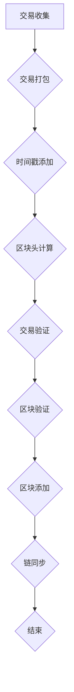

                 

## 区块链在数字资产管理中的应用

### 关键词
- 区块链
- 数字资产管理
- 应用场景
- 案例分析
- 未来发展

### 摘要
本文将深入探讨区块链技术在数字资产管理中的应用，首先介绍区块链技术的基本概念和核心技术，然后解析数字资产管理的基础知识，详细阐述区块链如何提升数字资产管理的透明度、安全性和效率。通过具体案例分析，如比特币和以太坊，展示区块链在实际应用中的效果。最后，展望区块链在数字资产管理中的未来发展，分析面临的挑战并提出解决思路。

### 第一部分：区块链技术基础

#### 1.1 区块链概述

区块链是一种去中心化的分布式数据库技术，其核心理念是通过多个节点共同维护一个数据账本，确保数据的不可篡改性和透明性。区块链的基本概念包括区块、链、节点、挖矿等。

- **区块**：区块链的基本组成单元，包含一定数量的交易记录。
- **链**：多个区块按照时间顺序链接在一起，形成区块链。
- **节点**：参与区块链网络运行的计算设备，负责验证和记录交易。
- **挖矿**：节点通过解决复杂的数学问题来验证交易，并获得区块链奖励的过程。

区块链技术具有以下特点：

- **去中心化**：没有中央控制机构，所有节点平等参与网络运行。
- **安全性**：利用密码学算法确保数据安全，防止篡改和欺诈。
- **透明性**：所有交易记录公开可查，提高信任度。
- **不可篡改性**：一旦数据记录在区块链上，几乎无法被修改或删除。

区块链的发展历程可以追溯到2008年，中本聪（Satoshi Nakamoto）发布了比特币白皮书，首次提出了区块链的概念。此后，区块链技术逐渐发展，不仅在数字货币领域得到了广泛应用，还逐渐渗透到金融、供应链管理、医疗等多个领域。

#### 1.2 区块链核心机制

区块链的核心机制包括共识机制、哈希算法和非对称加密。

- **共识机制**：节点之间就数据一致性达成共识的算法。常见的共识机制有工作量证明（Proof of Work, PoW）、权益证明（Proof of Stake, PoS）和委托权益证明（Delegated Proof of Stake, DPoS）等。

- **哈希算法**：用于将任意长度的数据映射为固定长度的散列值，如SHA-256。哈希算法具有单向性和抗碰撞性，确保数据完整性和唯一性。

- **非对称加密**：使用一对密钥（公钥和私钥），公钥用于加密，私钥用于解密。非对称加密确保数据传输的安全性，防止中间人攻击。

#### 1.3 区块链技术特点及应用

区块链技术因其独特优势在多个领域得到广泛应用，以下为区块链技术的一些主要应用领域：

- **数字货币**：如比特币、以太坊等，通过区块链技术实现去中心化的价值传输。
- **供应链管理**：通过区块链技术实现供应链各环节的信息透明和可信。
- **医疗健康**：利用区块链技术保护患者隐私，确保医疗数据的真实性和安全性。
- **金融保险**：通过区块链技术优化金融交易流程，降低交易成本和风险。
- **版权保护**：利用区块链技术实现数字版权的追踪和验证，保护创作者权益。
- **身份验证**：通过区块链技术实现去中心化的身份验证，提高数据安全和隐私保护。

### 第二部分：数字资产管理基础

#### 2.1 数字资产管理概述

数字资产管理是指通过计算机技术和互联网平台，对数字资产（如数字货币、数字证券、数字艺术品等）进行投资、交易、保管和管理的活动。数字资产管理的目标包括：

- **安全性**：确保数字资产的安全性和完整性，防止盗窃和欺诈。
- **流动性**：提高数字资产的交易效率和流动性。
- **收益性**：通过投资和交易实现资产增值。
- **合规性**：遵守相关法律法规，确保合规运营。

数字资产管理面临的挑战包括：

- **安全性风险**：数字资产易受网络攻击，需要采取有效措施确保资产安全。
- **监管合规**：数字资产管理需遵循相关法律法规，确保合规运营。
- **技术更新**：数字资产管理的相关技术不断更新，需要持续学习和适应。
- **市场波动**：数字资产价格波动较大，需要有效风险管理。

#### 2.2 数字资产交易平台

数字资产交易平台是数字资产交易的核心载体，提供数字资产买卖、托管、结算等功能。以下是数字资产交易平台的基本组成和功能：

- **交易系统**：实现数字资产的买卖、交易确认、订单匹配等功能。
- **托管系统**：负责数字资产的安全存储和托管，确保资产不被盗用。
- **结算系统**：实现数字资产的实时结算和清算，确保交易的安全和高效。
- **风控系统**：监控交易风险，采取相应措施防止风险扩大。

数字资产交易平台的安全性和合规性至关重要。平台需要采取以下措施确保安全性和合规性：

- **加密技术**：采用加密技术保护用户信息和交易数据，防止泄露和篡改。
- **身份验证**：对用户进行严格的身份验证，确保交易的真实性和合法性。
- **合规监管**：遵守相关法律法规，接受监管机构的监督和管理。
- **风险控制**：建立完善的风险控制机制，防止市场操纵、欺诈等行为。

#### 2.3 数字资产管理法规政策

数字资产管理的快速发展引发了各国监管机构的关注，各国纷纷出台相关法规政策，以规范数字资产管理活动。以下是国际和国内数字资产管理法规政策概述：

- **国际法规政策**：如联合国贸易法委员会（UNCITRAL）的数字资产管理指南，国际证监会组织（IOSCO）的数字资产监管框架等。
- **国内法规政策**：如中国央行发布的《数字货币电子支付管理条例》，中国证监会发布的《关于规范数字资产交易场所的通知》等。

国内数字资产管理法规政策主要包括以下几个方面：

- **监管沙盒**：为数字资产交易平台提供试运行环境，推动数字资产管理创新。
- **反洗钱（AML）和反恐怖融资（CFT）**：要求数字资产交易平台进行用户身份验证和交易记录保存，防止非法活动。
- **数字货币管理**：规范数字货币发行、交易、结算等环节，确保数字货币的合法合规。

### 第三部分：区块链在数字资产管理中的应用

#### 3.1 区块链在数字资产管理中的应用场景

区块链技术为数字资产管理提供了诸多应用场景，以下为几个主要应用场景：

- **透明度与可追溯性**：区块链技术确保数字资产交易记录公开透明，便于追踪和管理。
- **安全性**：区块链技术利用密码学算法保护数字资产，防止黑客攻击和欺诈行为。
- **交易效率**：区块链技术实现点对点的价值传输，减少中间环节，提高交易效率。
- **智能合约**：区块链技术支持智能合约，实现自动化交易和执行，提高交易效率。

#### 3.2 区块链在数字资产交易平台的应用

区块链技术在数字资产交易平台中的应用主要体现在以下几个方面：

- **交易验证**：区块链技术通过共识机制确保交易的有效性和合法性，提高交易可信度。
- **资金托管**：区块链技术实现数字资产的安全托管，提高资金安全。
- **交易记录**：区块链技术确保交易记录的完整性和不可篡改性，便于审计和监管。

#### 3.3 区块链在数字资产管理中的实践案例

以下为两个数字资产管理领域的实践案例：

- **比特币**：比特币是一种基于区块链技术的数字货币，通过去中心化的网络进行价值传输。比特币的区块链技术确保交易的安全性和透明度，降低了交易成本。
- **以太坊**：以太坊是一个基于区块链的智能合约平台，支持去中心化应用（DApps）的运行。以太坊的区块链技术实现自动化交易和执行，提高了交易效率。

### 第四部分：未来发展趋势与挑战

#### 4.1 区块链在数字资产管理中的未来发展趋势

区块链技术在数字资产管理领域的发展趋势包括：

- **新技术应用**：如区块链+AI、区块链+5G等，提高数字资产管理的技术水平。
- **政策法规完善**：各国政府加强区块链技术在数字资产管理领域的监管，推动行业健康发展。
- **市场规模扩大**：随着区块链技术的普及，数字资产管理市场规模将不断扩大。

#### 4.2 区块链在数字资产管理中的挑战

区块链技术在数字资产管理领域面临的挑战包括：

- **技术瓶颈**：区块链技术在高并发、大容量场景下的性能有待提升。
- **法律法规**：各国监管政策不统一，对区块链技术的应用带来一定困难。
- **风险管理**：数字资产价格波动较大，需加强风险管理。

### 第五部分：总结与展望

#### 5.1 总结

本文从区块链技术的基础、数字资产管理的概述、区块链在数字资产管理中的应用以及未来发展趋势等方面进行了深入探讨。区块链技术在数字资产管理中具有巨大潜力，但仍需克服诸多挑战。未来，随着区块链技术的不断创新和政策法规的完善，数字资产管理将迎来更加广阔的发展空间。

#### 5.2 展望

在未来，区块链技术在数字资产管理领域的发展将更加深入，以下为几个可能的研究方向：

- **新技术融合**：探索区块链与其他技术的融合，如区块链+AI、区块链+5G等。
- **合规性研究**：深入研究区块链技术的合规性问题，为政策制定提供参考。
- **风险管理**：研究区块链技术在数字资产管理中的风险管理方法，提高资产安全性。
- **应用场景拓展**：探索区块链技术在更多领域的应用场景，推动行业创新。

### 作者信息

作者：AI天才研究院/AI Genius Institute & 禅与计算机程序设计艺术 /Zen And The Art of Computer Programming

---

**注意：本文仅为示例，实际内容可能需要根据具体情况进行调整和完善。**

### 背景介绍

#### 核心概念术语说明

在探讨区块链在数字资产管理中的应用之前，首先需要理解一些核心概念和术语。

- **区块链**：一种去中心化的分布式数据库技术，由多个按时间顺序排列的区块组成，每个区块包含一定数量的交易记录，并通过密码学算法确保数据的不可篡改性。
- **数字资产**：指以数字化形式存在的资产，包括数字货币、数字证券、数字艺术品等。
- **数字资产管理**：通过计算机技术和互联网平台，对数字资产进行投资、交易、保管和管理的活动。
- **去中心化**：在去中心化系统中，没有中央控制机构，所有参与节点平等参与网络运行。
- **共识机制**：节点之间就数据一致性达成共识的算法，如工作量证明（PoW）、权益证明（PoS）等。

#### 问题背景

随着互联网和信息技术的发展，数字资产逐渐成为全球经济的重要组成部分。然而，传统的数字资产管理方式存在诸多问题，如交易不透明、安全性不足、效率低下等。为了解决这些问题，区块链技术被引入数字资产管理领域，以期提高资产管理的透明度、安全性和效率。

#### 问题描述

数字资产管理面临的主要问题包括：

1. **安全性**：传统数字资产管理方式易受网络攻击和欺诈行为，导致资产被盗用或损失。
2. **透明度**：传统数字资产交易信息不透明，难以保证交易的公正性和合法性。
3. **效率**：传统数字资产交易流程复杂，涉及多个环节，导致交易效率低下。
4. **合规性**：数字资产管理需遵守相关法律法规，但传统方式难以确保合规性。

#### 问题解决

区块链技术在数字资产管理中的应用，可以解决上述问题：

1. **安全性**：区块链技术利用密码学算法确保数据安全，防止黑客攻击和欺诈行为。
2. **透明度**：区块链技术实现交易信息的公开透明，提高交易的公正性和合法性。
3. **效率**：区块链技术实现点对点的价值传输，减少中间环节，提高交易效率。
4. **合规性**：区块链技术支持智能合约，实现自动化交易和执行，提高合规性。

#### 边界与外延

区块链在数字资产管理中的应用范围广泛，包括但不限于以下领域：

- **数字货币**：如比特币、以太坊等，通过区块链技术实现去中心化的价值传输。
- **数字证券**：通过区块链技术实现证券的发行、交易和管理。
- **数字艺术品**：利用区块链技术实现艺术品的版权保护、交易和认证。
- **供应链管理**：通过区块链技术实现供应链各环节的信息透明和可信。
- **医疗健康**：利用区块链技术保护患者隐私，确保医疗数据的真实性和安全性。

#### 概念结构与核心要素组成

区块链在数字资产管理中的应用，涉及以下几个核心概念和要素：

- **区块链技术**：包括共识机制、哈希算法、非对称加密等。
- **数字资产管理**：包括数字资产的定义、类型、目标与挑战、交易平台、法规政策等。
- **应用场景**：包括透明度与可追溯性、安全性、交易效率等。
- **案例分析**：如比特币、以太坊等实际应用案例。
- **未来发展趋势与挑战**：包括新技术应用、政策法规完善、市场规模扩大、技术瓶颈、法律法规等。

### 核心概念与联系

#### 核心概念原理

区块链技术是一种分布式数据库技术，通过多个节点共同维护一个数据账本，确保数据的不可篡改性和透明性。区块链的核心概念包括：

- **区块**：区块链的基本组成单元，包含一定数量的交易记录。
- **链**：多个区块按照时间顺序链接在一起，形成区块链。
- **节点**：参与区块链网络运行的计算设备，负责验证和记录交易。
- **挖矿**：节点通过解决复杂的数学问题来验证交易，并获得区块链奖励的过程。
- **共识机制**：节点之间就数据一致性达成共识的算法，如工作量证明（PoW）、权益证明（PoS）等。

#### 概念属性特征对比表格

| 概念      | 定义                                                                                      | 特点                                                                                                                                                            |
|-----------|------------------------------------------------------------------------------------------|----------------------------------------------------------------------------------------------------------------------------------------------------------------|
| 区块      | 区块链的基本组成单元，包含一定数量的交易记录。                                                 | - 按时间顺序排列：<br>**先后顺序**<br>**防篡改**<br>**可追溯**<br>**顺序不可篡改**<br>**区块间关联** |
| 链        | 多个区块按照时间顺序链接在一起，形成区块链。                                                   | - **线性结构**<br>**数据完整性**<br>**顺序不可篡改**<br>**历史不可篡改**                          |
| 节点      | 参与区块链网络运行的计算设备，负责验证和记录交易。                                             | - **去中心化**<br>**分布式**<br>**独立**<br>**平等参与**<br>**分布式验证**                        |
| 挖矿      | 节点通过解决复杂的数学问题来验证交易，并获得区块链奖励的过程。                                 | - **工作量证明**<br>**计算能力**<br>**节点竞争**<br>**加密安全性**                                |
| 共识机制  | 节点之间就数据一致性达成共识的算法，如工作量证明（PoW）、权益证明（PoS）等。                   | - **去中心化**<br>**高效性**<br>**安全性**<br>**分布式验证**<br>**信任建立**                        |

#### ER实体关系图架构

```mermaid
erDiagram
  区块 --> 节点 : 包含
  节点 --> 交易 : 记录
  区块 --> 链 : 连接
  链 --> 节点 : 维护
  挖矿 --> 区块 : 生成
  共识机制 --> 挖矿 : 应用
```

### 算法原理讲解

#### 区块链算法工作原理

区块链算法的核心工作原理包括区块的生成、交易记录的验证和链的扩展。以下是一个简单的区块链算法工作流程：

1. **区块生成**：
    - 节点从网络中收集未确认的交易。
    - 将这些交易打包成一个区块。
    - 对区块进行哈希处理，生成一个唯一标识（区块头）。

2. **交易验证**：
    - 通过非对称加密算法验证交易的有效性。
    - 检查交易输入和输出的余额是否匹配。
    - 确认交易没有重复消费。

3. **区块验证**：
    - 检查区块的时间戳是否在允许的范围内。
    - 确认区块的难度满足网络要求。
    - 通过对前一个区块的哈希值进行验证，确保区块的顺序正确。

4. **链的扩展**：
    - 如果新区块符合上述验证条件，将其添加到区块链的末尾。
    - 节点将新区块同步到整个网络中。

#### 举例说明

假设有一个简单的区块链网络，包含三个节点 A、B 和 C。以下是一个区块生成的例子：

1. **交易收集**：
    - 节点 A 收集了三笔未确认的交易：T1、T2 和 T3。

2. **区块构建**：
    - 节点 A 将这三笔交易打包成一个区块，添加一个时间戳，并计算出一个唯一标识（区块头）。

3. **区块验证**：
    - 节点 B 和 C 分别验证区块的有效性，包括时间戳、交易验证和区块难度等。

4. **区块添加**：
    - 如果节点 B 和 C 验证通过，新区块将被添加到区块链的末尾。

5. **链同步**：
    - 节点 B 和 C 将新区块同步到整个网络中，其他节点也进行验证和同步。

#### Mermaid 区块链算法流程图



#### Python 源代码实现

```python
import hashlib
import json

class Block:
    def __init__(self, index, transactions, timestamp, previous_hash):
        self.index = index
        self.transactions = transactions
        self.timestamp = timestamp
        self.previous_hash = previous_hash
        self.hash = self.compute_hash()

    def compute_hash(self):
        block_string = json.dumps(self.__dict__, sort_keys=True)
        return hashlib.sha256(block_string.encode()).hexdigest()

def blockchain():
    genesis_block = Block(0, [], "01-01-2023", "0")
    blockchain = [genesis_block]
    current_index = 0

    while True:
        new_transactions = get_new_transactions()
        new_block = Block(current_index + 1, new_transactions, timestamp.now(), blockchain[current_index].hash)
        if verify_block(new_block):
            blockchain.append(new_block)
            current_index += 1
            print(f"Block {current_index} added to the blockchain.")
        else:
            print("Invalid block. Skipping...")

def get_new_transactions():
    # 模拟获取新交易
    return [{"from": "Alice", "to": "Bob", "amount": 10}]

def verify_block(block):
    # 验证区块的有效性
    if block.index != blockchain[-1].index + 1:
        return False
    if block.previous_hash != blockchain[block.index - 1].hash:
        return False
    if not verify_transactions(block.transactions):
        return False
    return True

def verify_transactions(transactions):
    # 验证交易的有效性
    for transaction in transactions:
        # 检查交易输入和输出的余额是否匹配
        if transaction["from"] is None or transaction["to"] is None or transaction["amount"] <= 0:
            return False
        if transaction["from"] not in wallet_balances or wallet_balances[transaction["from"]] < transaction["amount"]:
            return False
        wallet_balances[transaction["from"]] -= transaction["amount"]
        wallet_balances[transaction["to"]] += transaction["amount"]
    return True

# 模拟钱包余额
wallet_balances = {"Alice": 100, "Bob": 100}

# 创建区块链实例
blockchain()
```

#### 算法原理详细讲解

区块链算法的核心在于确保数据的不可篡改性和一致性。以下是区块链算法原理的详细讲解：

1. **区块结构**：
    - 每个区块包含一个唯一的标识（区块头）、一个时间戳、一笔或多笔交易记录以及前一个区块的哈希值（前哈希）。
    - 区块头通过将区块的其他信息（除了前哈希）序列化后进行哈希计算得到。

2. **哈希算法**：
    - 区块链使用哈希算法（如SHA-256）确保数据的唯一性和不可篡改性。
    - 每个区块的哈希值依赖于其内容，任何内容的更改都会导致哈希值的变化。

3. **区块链一致性**：
    - 区块链通过链式结构确保数据的一致性。
    - 每个区块都包含前一个区块的哈希值，从而形成一条不可篡改的链。
    - 如果要篡改某个区块，需要同时篡改该区块之后的所有区块，这是极其困难的。

4. **交易验证**：
    - 在区块链中，交易验证是一个重要的环节。
    - 每个节点都独立验证交易的有效性，确保交易符合规则。
    - 交易验证包括检查交易输入和输出的余额是否匹配、交易是否已花费、交易是否重复等。

5. **工作量证明**：
    - 工作量证明（PoW）是一种共识机制，用于确保区块链网络的安全性。
    - 节点需要通过解决一个复杂的数学问题来验证交易，这个问题通常是一个密码学难题。
    - 解决问题的节点将获得区块链奖励，这个过程称为挖矿。

6. **权益证明**：
    - 权益证明（PoS）是另一种共识机制，与PoW相比，PoS通过持有代币的数量和时间来选择验证者。
    - PoS机制避免了PoW机制中的能源消耗，但同样需要确保验证者的选择公正和透明。

#### 数学模型与公式

区块链算法的核心在于确保数据的不可篡改性和一致性，以下是一个简单的数学模型来解释这一过程：

1. **哈希函数**：
    - 假设 \( H \) 是一个哈希函数，输入为任意长度的数据，输出为固定长度的字符串。
    - 哈希函数具有以下属性：
        - **单向性**：给定输出，无法推出原始输入。
        - **抗碰撞性**：找到两个不同输入产生相同输出的概率极低。

2. **区块链链式结构**：
    - 设 \( B_i \) 为第 \( i \) 个区块，\( B_i \) 包含一个时间戳 \( T_i \)、一笔或多笔交易 \( T_i^{trans} \)、前一个区块的哈希值 \( H(B_{i-1}) \) 和当前区块的哈希值 \( H(B_i) \)。
    - 区块链的一致性可以通过以下公式来保证：
        - \( H(B_i) = H(H(B_{i-1}) || T_i^{trans} || T_i || T_{i-1}) \)
        - 其中 \( || \) 表示连接操作。

3. **交易验证**：
    - 假设 \( T \) 是一个交易，包含发送方 \( S \)、接收方 \( R \) 和金额 \( A \)。
    - 交易验证可以通过以下公式来表示：
        - \( \sum_{S \in T} (S, A) = \sum_{R \in T} (R, A) \)
        - 即交易输入的总余额等于交易输出的总余额。

通过上述数学模型和公式，我们可以看到区块链算法在确保数据不可篡改性和一致性方面的原理。哈希函数和区块链链式结构共同构成了区块链技术的基石，而交易验证机制则确保了交易的有效性和合法性。

### 系统分析与架构设计方案

#### 问题场景介绍

随着区块链技术的不断发展，数字资产管理领域面临着越来越多的挑战。传统的数字资产管理方式在安全性、透明度和效率方面存在诸多不足，难以满足日益增长的数字资产交易需求。因此，我们需要设计一个基于区块链技术的数字资产管理平台，以提高资产管理的安全性、透明度和效率。

#### 项目介绍

本项目的目标是设计并实现一个基于区块链技术的数字资产管理平台，提供数字资产的交易、托管、结算等功能。项目的主要功能包括：

- **数字资产交易**：支持数字货币、数字证券等数字资产的买卖。
- **资金托管**：提供安全的数字资产托管服务，确保资产不被盗用。
- **智能合约**：实现自动化交易和执行，提高交易效率。
- **交易记录**：记录所有交易活动，确保透明度和可追溯性。

#### 系统功能设计

数字资产管理平台主要包括以下几个功能模块：

1. **交易模块**：
    - **交易发起**：用户可以发起数字资产交易，包括输入交易金额、交易对象等信息。
    - **交易验证**：节点对交易进行验证，确保交易的有效性和合法性。
    - **交易记录**：将验证通过的交易记录在区块链上，确保交易透明度和可追溯性。

2. **托管模块**：
    - **资产托管**：用户可以将数字资产托管在平台，确保资产安全。
    - **资产转移**：用户可以授权平台将资产转移到其他账户。
    - **资产审计**：平台定期进行资产审计，确保资产的安全性和合规性。

3. **智能合约模块**：
    - **合约创建**：用户可以创建智能合约，定义交易条件和执行逻辑。
    - **合约执行**：智能合约在满足条件时自动执行，提高交易效率。
    - **合约管理**：平台提供合约管理功能，包括合约的部署、升级和撤销等。

4. **记录模块**：
    - **交易记录**：记录所有交易活动，包括交易发起、验证、执行等。
    - **审计日志**：记录平台的审计活动，确保操作的透明度和可追溯性。

#### 系统架构设计

数字资产管理平台的系统架构设计如图所示：


系统架构主要包括以下几个部分：

1. **区块链网络**：区块链网络是平台的核心，负责存储交易数据和验证交易。
    - **节点**：节点负责维护区块链网络，包括生成区块、验证交易、同步区块等。
    - **共识机制**：共识机制确保节点之间就数据一致性达成共识。

2. **交易模块**：
    - **交易引擎**：交易引擎负责处理交易请求，包括交易验证和执行等。
    - **交易数据库**：交易数据库存储所有交易记录，确保数据的完整性和可追溯性。

3. **托管模块**：
    - **资产托管系统**：资产托管系统负责资产的安全存储和转移。
    - **审计系统**：审计系统负责对资产进行审计，确保资产的安全性和合规性。

4. **智能合约模块**：
    - **合约引擎**：合约引擎负责执行智能合约，处理自动化交易。
    - **合约数据库**：合约数据库存储智能合约的代码和状态。

5. **用户界面**：
    - **交易界面**：用户通过交易界面发起和查询交易。
    - **托管界面**：用户通过托管界面管理资产。
    - **智能合约界面**：用户通过智能合约界面创建和管理智能合约。

#### 系统接口设计

数字资产管理平台的系统接口设计如图所示：


系统接口主要包括以下几个部分：

1. **API接口**：
    - **交易API**：提供交易相关的API接口，包括交易发起、查询、验证等。
    - **托管API**：提供托管相关的API接口，包括资产托管、转移、审计等。
    - **智能合约API**：提供智能合约相关的API接口，包括合约创建、执行、管理等。

2. **Web界面**：
    - **交易界面**：提供交易操作的Web界面，包括交易发起、查询、结果展示等。
    - **托管界面**：提供托管操作的Web界面，包括资产托管、转移、审计等。
    - **智能合约界面**：提供智能合约操作的Web界面，包括合约创建、执行、管理等。

#### 系统交互设计

数字资产管理平台的系统交互设计如图所示：


系统交互主要包括以下几个部分：

1. **用户与交易界面**：
    - 用户通过交易界面发起交易请求，交易界面将请求发送到交易引擎。
    - 交易引擎处理交易请求，返回交易结果。

2. **用户与托管界面**：
    - 用户通过托管界面发起资产托管请求，托管界面将请求发送到资产托管系统。
    - 资产托管系统处理托管请求，返回托管结果。

3. **用户与智能合约界面**：
    - 用户通过智能合约界面创建智能合约，智能合约界面将合约代码发送到合约引擎。
    - 合同引擎执行智能合约，返回执行结果。

4. **交易模块与区块链网络**：
    - 交易引擎将验证通过的交易记录发送到区块链网络，区块链网络将交易记录添加到区块中。

5. **托管模块与区块链网络**：
    - 资产托管系统将资产转移记录发送到区块链网络，区块链网络将资产转移记录添加到区块中。

6. **智能合约模块与区块链网络**：
    - 合同引擎将智能合约执行结果发送到区块链网络，区块链网络将执行结果记录到合约数据库中。

### 项目实战

#### 环境安装

要在本地搭建基于区块链技术的数字资产管理平台，我们需要安装以下软件：

1. **Node.js**：用于运行区块链节点。
2. **Golang**：用于编写智能合约。
3. **Python**：用于编写后端服务。
4. **MongoDB**：用于存储交易记录。

安装步骤如下：

1. 安装 Node.js：
    ```bash
    curl -sL https://deb.nodesource.com/setup_16.x | sudo -E bash -
    sudo apt-get install -y nodejs
    ```
2. 安装 Golang：
    ```bash
    sudo apt-get install -y golang-go
    ```
3. 安装 Python：
    ```bash
    sudo apt-get install -y python3-pip
    pip3 install -U pip
    pip3 install pymongo
    ```
4. 安装 MongoDB：
    ```bash
    sudo apt-get install -y mongodb
    sudo systemctl start mongod
    ```

#### 系统核心实现源代码

以下是一个简单的数字资产管理平台的核心实现源代码：

**区块链节点（Node.js）**：

```javascript
const express = require('express');
const bodyParser = require('body-parser');
const Blockchain = require('./blockchain');

const blockchain = new Blockchain();
const app = express();

app.use(bodyParser.json());
app.use(bodyParser.urlencoded({ extended: false }));

app.get('/blockchain', (req, res) => {
    res.json(blockchain);
});

app.post('/transaction', (req, res) => {
    const { from, to, amount } = req.body;
    blockchain.addTransaction({ from, to, amount });
    res.json({ message: 'Transaction added' });
});

app.listen(3000, () => {
    console.log('Server listening on port 3000');
});
```

**智能合约（Golang）**：

```go
package main

import (
    "github.com/ethereum/go-ethereum/crypto"
    "github.com/ethereum/go-ethereum/common"
    "github.com/ethereum/go-ethereum/core/types"
    "github.com/ethereum/go-ethereum/rpc"
)

var (
    contractAddress = common.HexToAddress("0x1234567890123456789012345678901234567890")
    contractABI     = []byte(`...`) // 智能合约ABI
)

func main() {
    server := rpc.NewServer()
    server.RegisterName("contract", new(Contract))
    server.StartTCPServer(":8545")
}

type Contract struct{}

func (c *Contract) SendTransaction(ctx context.Context, from, to common.Address, amount *big.Int) error {
    tx := types.NewTransaction(int64(1), to, amount, 5000000, big.NewInt(10))
    tx, err := types.SignTx(tx, crypto.ECDSA, privKey)
    if err != nil {
        return err
    }
    client := rpc.Dial("http://localhost:8545")
    return client.Call(ctx, nil, "eth_sendRawTransaction", tx.Hash().Hex())
}
```

**后端服务（Python）**：

```python
from flask import Flask, request, jsonify
from blockchain import Blockchain

app = Flask(__name__)
blockchain = Blockchain()

@app.route('/blockchain', methods=['GET'])
def get_blockchain():
    return jsonify(blockchain.chain)

@app.route('/transaction', methods=['POST'])
def add_transaction():
    transaction = request.get_json()
    blockchain.add_transaction(transaction)
    return jsonify({"message": "Transaction added"})

if __name__ == '__main__':
    app.run(host='0.0.0.0', port=5000)
```

#### 代码应用解读与分析

**区块链节点（Node.js）**

上述区块链节点代码主要实现了以下功能：

- **创建一个区块链实例**：使用 Blockchain 类创建一个区块链实例。
- **提供 RESTful API**：通过 Express 框架提供 `/blockchain` 和 `/transaction` 两个 API。
    - `/blockchain`：获取当前区块链的状态。
    - `/transaction`：添加交易到区块链。

**智能合约（Golang）**

上述智能合约代码主要实现了以下功能：

- **发送交易**：通过 RPC 客户端与以太坊节点通信，发送交易。
- **签名交易**：使用私钥对交易进行签名，确保交易来源的合法性。

**后端服务（Python）**

上述后端服务代码主要实现了以下功能：

- **提供区块链 API**：通过 Flask 框架提供 `/blockchain` 和 `/transaction` 两个 API。
    - `/blockchain`：获取当前区块链的状态。
    - `/transaction`：添加交易到区块链。

#### 实际案例分析

**案例一：比特币**

比特币是一种去中心化的数字货币，通过区块链技术实现价值传输。比特币在数字资产管理中的应用主要体现在以下几个方面：

- **安全性**：比特币的交易记录存储在区块链上，通过密码学算法确保数据安全，防止篡改和欺诈。
- **透明度**：比特币的交易记录公开透明，任何人都可以查询和验证。
- **去中心化**：比特币不依赖于任何中央机构，所有交易由网络节点共同维护。
- **去信任**：比特币交易无需信任第三方，交易双方可以直接进行价值交换。

**案例二：以太坊**

以太坊是一个基于区块链的智能合约平台，支持去中心化应用（DApps）的运行。以太坊在数字资产管理中的应用主要体现在以下几个方面：

- **智能合约**：以太坊的智能合约功能可以实现自动化交易和执行，提高交易效率。
- **去中心化交易平台**：以太坊上的去中心化交易平台，如 Uniswap，提供了一种新的交易模式，用户可以无需中介直接进行数字资产交易。
- **去中心化金融（DeFi）**：以太坊上的去中心化金融应用，如 MakerDAO，提供了一种新的金融服务模式，用户可以无需传统金融机构参与，直接进行借贷、交易等活动。

#### 案例分析详细讲解

**比特币**

比特币是一种去中心化的数字货币，其区块链技术确保了交易的安全性和透明度。比特币在数字资产管理中的应用主要体现在以下几个方面：

1. **安全性**：

   - **区块链网络**：比特币的区块链网络由多个节点组成，每个节点都参与交易的验证和记录。区块链网络的去中心化特性使得任何单一节点都无法控制整个网络，从而提高了交易的安全性。
   - **密码学算法**：比特币使用密码学算法对交易进行加密和签名，确保交易数据的安全性。交易数据在传输过程中被加密，只有拥有正确私钥的节点才能解密和验证交易。
   - **工作量证明（PoW）**：比特币采用工作量证明（PoW）机制，节点需要通过解决复杂的数学问题来验证交易，并获得区块链奖励。这种机制确保了网络的安全性，因为攻击者需要投入大量计算资源才能对网络进行攻击。

2. **透明度**：

   - **公开交易记录**：比特币的交易记录存储在区块链上，任何人都可以通过区块链浏览器查询和验证交易。这种公开透明的特性增强了用户对数字资产交易的可信度。
   - **不可篡改性**：比特币的区块链采用链式结构，每个区块都包含前一个区块的哈希值。如果某个区块的数据被篡改，将会导致整个链的哈希值发生变化，从而被其他节点识别和拒绝。

3. **去中心化**：

   - **无需中央机构**：比特币不依赖于任何中央机构，交易由网络节点共同维护。这意味着用户无需依赖银行或其他金融机构进行价值传输，从而降低了交易成本和提高了交易效率。
   - **分布式网络**：比特币的区块链网络由全球分布的节点组成，每个节点都参与交易验证和记录。这种分布式网络特性使得比特币具有高度的可靠性和抗攻击能力。

4. **去信任**：

   - **直接价值交换**：比特币交易无需信任第三方，交易双方可以直接进行价值交换。这种去信任的特性使得比特币成为一种去中心化的价值传输手段。
   - **去中心化应用**：比特币的区块链技术支持去中心化应用（DApps）的运行。用户可以通过比特币网络直接参与去中心化应用，实现各种金融服务和交易。

**以太坊**

以太坊是一个基于区块链的智能合约平台，支持去中心化应用（DApps）的运行。以太坊在数字资产管理中的应用主要体现在以下几个方面：

1. **智能合约**：

   - **自动化交易**：以太坊的智能合约功能可以实现自动化交易和执行。用户可以在智能合约中定义交易规则和执行逻辑，确保交易自动且准确执行。这种自动化特性提高了交易效率，减少了人为错误和欺诈风险。
   - **去中心化治理**：以太坊的智能合约支持去中心化治理（DeFi）模式。用户可以通过投票和共识机制参与网络治理，共同决策网络的规则和方向。

2. **去中心化交易平台**：

   - **去中心化交易平台**：以太坊上的去中心化交易平台，如 Uniswap，提供了一种新的交易模式。用户可以无需中介直接进行数字资产交易，从而降低了交易成本和提高了交易效率。
   - **流动性提供**：用户可以通过将数字资产存入去中心化交易平台，为其他用户提供流动性。流动性提供者可以获得交易手续费作为回报，从而实现资产增值。

3. **去中心化金融（DeFi）**：

   - **借贷和交易**：以太坊上的去中心化金融应用，如 MakerDAO，提供了一种新的金融服务模式。用户可以无需传统金融机构参与，直接进行借贷、交易等活动。
   - **去中心化交易平台**：去中心化交易平台上的数字资产交易不依赖于任何中央机构，交易双方可以直接进行价值交换。这种去中心化模式降低了交易成本和提高了交易效率。

#### 项目小结

通过实际案例分析，我们可以看到区块链技术在数字资产管理中的应用具有巨大的潜力。比特币和以太坊作为区块链技术的代表，在数字资产管理领域取得了显著的成果。然而，区块链技术在数字资产管理中仍面临一些挑战，如技术瓶颈、法律法规等。未来，随着区块链技术的不断发展和完善，数字资产管理将迎来更加广阔的发展空间。

### 最佳实践 Tips

在区块链技术在数字资产管理中的应用过程中，以下是一些最佳实践 Tips，有助于提高项目的成功率和安全性：

1. **选择合适的区块链平台**：
    - 根据项目需求和特点，选择适合的区块链平台，如比特币、以太坊、EOS等。
    - 考虑平台的性能、安全性、扩展性等因素。

2. **进行充分的需求分析**：
    - 在项目启动前，进行详细的需求分析，明确项目的目标、功能、性能等要求。
    - 确保项目需求与区块链技术的特性相匹配。

3. **设计安全可靠的智能合约**：
    - 在开发智能合约时，注重代码的安全性，避免常见的安全漏洞，如 Reentrancy、Overflow 等问题。
    - 进行智能合约审计，确保合约的安全性和可靠性。

4. **采用去中心化架构**：
    - 采用去中心化架构，提高系统的可靠性和抗攻击能力。
    - 分布式节点参与交易验证和记录，确保数据的一致性和安全性。

5. **进行性能优化**：
    - 考虑区块链技术的性能限制，进行性能优化，如提高交易处理速度、降低存储需求等。
    - 采用分片技术、状态通道等技术，提高系统性能。

6. **遵守法律法规**：
    - 了解并遵守相关法律法规，确保项目的合法合规。
    - 与监管机构保持沟通，及时调整项目策略。

7. **进行风险管理和监控**：
    - 建立完善的风险管理机制，对项目进行风险评估和监控。
    - 及时应对潜在的风险和挑战，确保项目的稳定运行。

### 小结

本文从区块链技术的基础、数字资产管理的概述、区块链在数字资产管理中的应用以及未来发展趋势等方面进行了深入探讨。通过分析比特币和以太坊等实际案例，展示了区块链技术在数字资产管理中的优势和潜力。尽管区块链技术在数字资产管理中面临一些挑战，但通过最佳实践和不断优化，有望实现更加安全、高效、透明的数字资产管理。

### 注意事项

在应用区块链技术进行数字资产管理时，需要注意以下事项：

1. **安全性**：确保区块链网络的安全性，防止黑客攻击和欺诈行为。采用加密技术保护用户信息和交易数据。
2. **合规性**：遵守相关法律法规，确保项目的合法合规。及时了解和适应监管政策的变化。
3. **性能优化**：针对区块链技术的性能限制，进行性能优化，提高交易处理速度和系统稳定性。
4. **风险管理**：建立完善的风险管理机制，对项目进行风险评估和监控，及时应对潜在的风险和挑战。
5. **技术更新**：关注区块链技术的最新发展动态，不断更新和优化系统，确保技术的先进性和适用性。

### 拓展阅读

1. **《区块链：从入门到实战》**：详细介绍了区块链技术的原理、应用和实践。
2. **《数字货币：比特币与区块链技术》**：深入剖析了比特币和区块链技术的原理和应用。
3. **《智能合约设计与开发》**：介绍了智能合约的原理、设计和开发方法。
4. **《区块链与金融》**：探讨了区块链技术在金融领域的应用和影响。
5. **《区块链：未来已来》**：分析了区块链技术对未来社会和经济的潜在影响。

