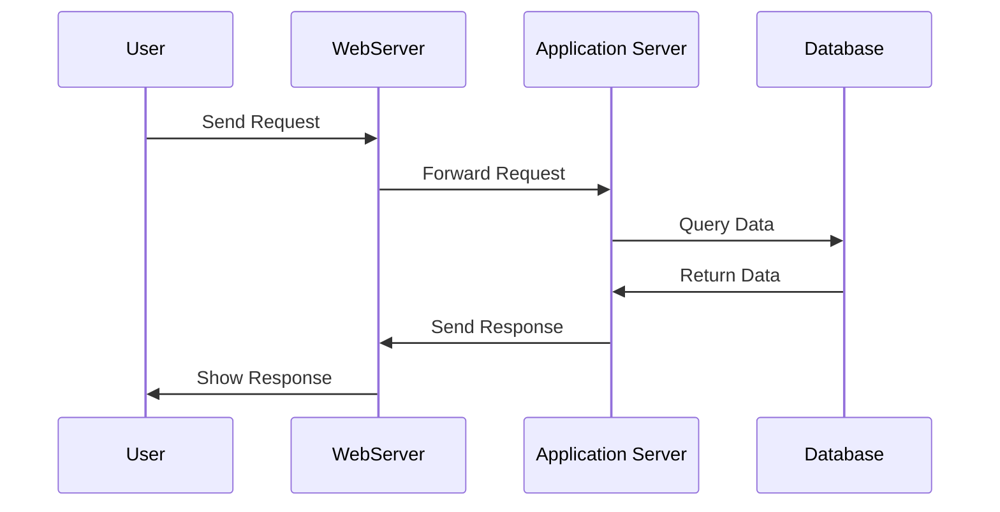

                 

### 文章标题

# 区块链在数字资产管理中的应用：实现资产数字化

### 关键词

- 区块链
- 数字资产
- 资产管理
- 交易系统
- 安全合规

### 摘要

本文探讨了区块链技术在数字资产管理中的应用，通过实现资产数字化，提升了交易效率、降低了交易成本，并增强了资产透明度。文章详细分析了区块链的基础知识、数字资产管理的挑战与机遇，以及区块链在数字资产交易、资产管理平台搭建、数字资产安全与合规、数字资产审计以及未来发展趋势等方面的应用。同时，通过实际案例分析和最佳实践分享，为区块链在数字资产管理领域的深入应用提供了参考和启示。

### 目录大纲设计

在设计《区块链在数字资产管理中的应用：实现资产数字化》的目录大纲时，我们将确保覆盖以下核心内容，并且符合简洁性和结构性的要求。以下是详细的目录大纲设计：

----------------------------------------------------------------

## 第一部分：区块链与数字资产概述

### 第1章：区块链技术基础

#### 1.1 区块链的起源与发展

##### 1.1.1 区块链的概念

##### 1.1.2 区块链技术的核心要素

##### 1.1.3 区块链的优缺点

#### 1.2 数字资产的定义与分类

##### 1.2.1 数字资产的概念

##### 1.2.2 数字资产的主要类别

##### 1.2.3 数字资产与传统资产的区别

### 第2章：数字资产管理的挑战与机遇

#### 2.1 数字资产管理的挑战

##### 2.1.1 安全性问题

##### 2.1.2 法律法规问题

##### 2.1.3 技术挑战

#### 2.2 数字资产管理的机遇

##### 2.2.1 提高交易效率

##### 2.2.2 降低交易成本

##### 2.2.3 增强资产透明度

## 第二部分：区块链在数字资产管理中的应用

### 第3章：数字资产交易系统设计与实现

#### 3.1 数字资产交易系统概述

##### 3.1.1 系统功能需求

##### 3.1.2 系统架构设计

#### 3.2 数字资产交易算法设计

##### 3.2.1 交易撮合算法

##### 3.2.2 安全性算法

##### 3.2.3 交易效率优化

### 第4章：数字资产管理平台搭建

#### 4.1 数字资产管理平台需求分析

##### 4.1.1 平台功能需求

##### 4.1.2 平台技术选型

#### 4.2 平台架构设计与实现

##### 4.2.1 数据存储设计

##### 4.2.2 访问控制设计

##### 4.2.3 系统安全性设计

### 第5章：数字资产安全与合规

#### 5.1 数字资产安全策略

##### 5.1.1 风险评估

##### 5.1.2 安全措施实施

##### 5.1.3 安全防护技术

#### 5.2 数字资产合规管理

##### 5.2.1 合规要求与标准

##### 5.2.2 合规管理体系

##### 5.2.3 合规案例分析

### 第6章：区块链在数字资产审计中的应用

#### 6.1 区块链审计概述

##### 6.1.1 区块链审计的概念

##### 6.1.2 区块链审计的优势

##### 6.1.3 区块链审计流程

#### 6.2 实际案例分析

##### 6.2.1 案例一：数字货币交易所审计

##### 6.2.2 案例二：企业数字资产管理审计

### 第7章：数字资产市场分析与趋势预测

#### 7.1 数字资产市场现状分析

##### 7.1.1 市场规模与发展趋势

##### 7.1.2 主要参与者与竞争格局

##### 7.1.3 市场风险分析

#### 7.2 数字资产未来发展趋势预测

##### 7.2.1 技术创新趋势

##### 7.2.2 应用场景拓展

##### 7.2.3 政策法规影响

## 第三部分：最佳实践与案例分析

### 第8章：成功案例分析与最佳实践

#### 8.1 成功案例分析

##### 8.1.1 案例一：区块链在供应链金融中的应用

##### 8.1.2 案例二：区块链在房地产交易中的应用

##### 8.1.3 案例三：区块链在版权管理中的应用

#### 8.2 最佳实践分享

##### 8.2.1 实践一：数字资产管理平台运营策略

##### 8.2.2 实践二：数字资产安全防护措施

##### 8.2.3 实践三：合规管理与风险控制

### 第9章：未来展望与展望

#### 9.1 未来发展展望

##### 9.1.1 技术创新展望

##### 9.1.2 应用场景拓展展望

##### 9.1.3 政策法规展望

#### 9.2 总结与建议

##### 9.2.1 成果总结

##### 9.2.2 面临的挑战

##### 9.2.3 发展建议

----------------------------------------------------------------

### 目录大纲结构解释：

1. **第一部分：区块链与数字资产概述**
   - **第1章**：介绍区块链技术的基础知识，包括其起源、核心要素及其优缺点，以及数字资产的定义和分类。
   - **第2章**：分析数字资产管理的挑战和机遇，探讨在数字资产管理过程中面临的问题和潜在的机会。

2. **第二部分：区块链在数字资产管理中的应用**
   - **第3章**：讨论数字资产交易系统的设计和实现，包括系统功能、架构设计以及交易算法。
   - **第4章**：介绍数字资产管理平台的搭建，包括功能需求分析、技术选型以及平台架构设计。
   - **第5章**：研究数字资产的安全与合规，包括安全策略、合规要求和管理体系。
   - **第6章**：探讨区块链在数字资产审计中的应用，包括审计概念、优势、流程以及实际案例分析。

3. **第三部分：最佳实践与案例分析**
   - **第7章**：分析数字资产市场的现状和发展趋势，包括市场规模、主要参与者、竞争格局以及市场风险。
   - **第8章**：分享成功案例和最佳实践，包括区块链在不同领域的应用案例以及运营、安全、合规管理的最佳实践。
   - **第9章**：展望数字资产管理的未来，包括技术创新、应用场景拓展和政策法规的影响。

这样的目录结构既保证了内容的系统性，又使每个章节能够独立成篇，方便读者根据自己的需求选择阅读。接下来，我们将逐步深入每一个章节的内容，为您详细解析区块链在数字资产管理中的应用。

## 第一部分：区块链与数字资产概述

### 第1章：区块链技术基础

#### 1.1 区块链的起源与发展

##### 1.1.1 区块链的概念

区块链是一种分布式数据库技术，通过加密算法和共识机制，实现数据的存储、传输和验证。其核心特点包括去中心化、不可篡改、安全透明和可追溯性。

区块链的起源可以追溯到2008年，当时一位名为中本聪（Satoshi Nakamoto）的匿名人士发布了比特币（Bitcoin）白皮书。白皮书中提出了一种基于区块链技术的数字货币系统，比特币由此诞生。比特币的成功引起了全球对区块链技术的关注，推动了区块链技术的快速发展。

##### 1.1.2 区块链技术的核心要素

区块链技术由以下核心要素组成：

1. **区块**：数据的基本存储单元，包含交易信息、时间戳、难度值等。
2. **链**：由多个区块按照特定顺序连接形成的链条，每个区块通过哈希值与前一个区块关联。
3. **共识机制**：确保网络中的所有节点对区块链的状态达成一致的一种算法，如工作量证明（PoW）、权益证明（PoS）等。
4. **加密算法**：用于保护数据安全，确保数据传输过程中不被篡改。
5. **智能合约**：一种在区块链上执行的计算机程序，用于自动化和执行合同条款。

##### 1.1.3 区块链的优缺点

区块链技术的优点主要包括：

1. **去中心化**：去中心化架构减少了单点故障的风险，提高了系统的可靠性。
2. **不可篡改**：数据一旦写入区块链，就几乎无法篡改，确保了数据的真实性。
3. **安全透明**：加密算法和共识机制确保了数据的机密性和完整性，所有参与者都能查看区块链数据。
4. **可追溯性**：区块链上的所有交易都有完整的记录，便于审计和追溯。

然而，区块链技术也存在一些缺点：

1. **性能瓶颈**：区块链的扩展性受到区块大小和区块生成速度的限制，可能无法满足高并发交易的需求。
2. **能源消耗**：某些区块链网络（如比特币）需要大量计算资源，导致能源消耗较高。
3. **法律和监管问题**：区块链技术的匿名性和去中心化特点可能使其成为非法活动的工具，需要完善的法律和监管框架。

#### 1.2 数字资产的定义与分类

##### 1.2.1 数字资产的概念

数字资产是指以数字形式存在并具有经济价值的资产，包括数字货币、代币、数字股权、数字债券等。数字资产与传统资产的主要区别在于其存在形式和传输方式。传统资产通常以物理形式存在，如现金、房产、股票等，而数字资产则以数字编码的形式存储在网络中。

##### 1.2.2 数字资产的主要类别

1. **数字货币**：如比特币、以太坊等，主要用于支付和交易。
2. **代币**：如ERC-20、ERC-721等，基于区块链发行，具有特定功能和用途。
3. **数字股权**：将企业股权以数字形式记录和交易，便于管理和流通。
4. **数字债券**：基于区块链发行的债券，具有更高的透明度和可追溯性。
5. **数字艺术品**：如数字画作、音乐、视频等，通过区块链技术实现所有权保护和交易。

##### 1.2.3 数字资产与传统资产的区别

1. **存在形式**：数字资产以数字编码形式存在，而传统资产以物理形式存在。
2. **传输方式**：数字资产通过网络传输，而传统资产需要通过物理转移。
3. **透明度**：数字资产交易记录透明，而传统资产交易可能存在信息不对称。
4. **安全性**：数字资产依赖于区块链技术，具有更高的安全性，而传统资产可能面临盗窃、欺诈等风险。
5. **流动性**：数字资产具有较高的流动性，可以快速交易，而传统资产交易可能较为缓慢。

通过本章的介绍，我们对区块链技术和数字资产有了基本的认识。在接下来的章节中，我们将深入探讨区块链在数字资产管理中的应用，包括数字资产交易系统设计、资产管理平台搭建、数字资产安全与合规、审计应用以及市场趋势预测等内容。

### 第2章：数字资产管理的挑战与机遇

#### 2.1 数字资产管理的挑战

随着区块链技术的迅猛发展，数字资产成为资产管理的重要领域。然而，数字资产管理的挑战同样不容忽视。

##### 2.1.1 安全性问题

数字资产的安全性问题主要体现在以下几个方面：

1. **网络攻击风险**：区块链网络可能受到恶意攻击，如DDoS攻击、51%攻击等，导致网络瘫痪或数据被篡改。
2. **私钥管理**：数字资产的安全性依赖于私钥，私钥泄露或丢失将导致资产丢失。
3. **智能合约漏洞**：智能合约是区块链上的计算机程序，可能存在漏洞，导致资产被盗。

为了应对这些安全挑战，需要采取一系列安全措施，如多因素认证、私钥冷存储、智能合约审计等。

##### 2.1.2 法律法规问题

数字资产作为一种新兴资产形式，其法律法规环境尚不完善。主要问题包括：

1. **法律监管**：不同国家和地区对数字资产的法律监管政策存在差异，可能影响数字资产的流通和交易。
2. **税务问题**：数字资产的税务问题复杂，可能涉及资本利得税、增值税等，但缺乏明确的法律规定。
3. **合规要求**：数字资产交易平台和项目可能需要遵循一系列合规要求，如KYC（了解你的客户）和AML（反洗钱）等。

##### 2.1.3 技术挑战

数字资产管理面临的技术挑战主要包括：

1. **性能瓶颈**：区块链网络的交易处理能力有限，可能无法满足高并发交易的需求。
2. **数据存储**：区块链数据量巨大，需要高效的数据存储和查询方案。
3. **隐私保护**：如何在确保透明度的同时，保护用户的隐私信息。

#### 2.2 数字资产管理的机遇

尽管数字资产管理面临诸多挑战，但也蕴藏着巨大的机遇。

##### 2.2.1 提高交易效率

区块链技术通过去中心化和智能合约，可以简化交易流程，提高交易效率。传统金融交易往往需要多个中介机构参与，流程繁琐，而区块链技术可以实现点对点交易，减少中间环节，降低交易成本。

##### 2.2.2 降低交易成本

区块链技术通过去中心化和智能合约，可以降低交易成本。传统金融交易需要支付高额的中介费用，而区块链技术可以实现低成本、高效的交易。

##### 2.2.3 增强资产透明度

区块链技术的透明性和可追溯性，可以增强数字资产的透明度。所有交易记录都存储在区块链上，用户可以随时查询，确保资产的透明和公正。

##### 2.2.4 创新金融产品和服务

区块链技术可以用于创新金融产品和服务，如数字货币、智能合约、去中心化金融（DeFi）等。这些创新产品和服务可以为投资者提供更多选择，提升金融市场的效率。

##### 2.2.5 企业数字化转型

区块链技术可以帮助企业实现数字化转型，提高运营效率和管理水平。例如，通过区块链技术实现供应链金融、版权管理、审计跟踪等，提升企业的竞争力。

综上所述，数字资产管理既面临挑战，也充满机遇。通过有效应对安全、法律和技术挑战，数字资产管理有望在提高交易效率、降低交易成本、增强资产透明度等方面发挥重要作用。

## 第二部分：区块链在数字资产管理中的应用

### 第3章：数字资产交易系统设计与实现

#### 3.1 数字资产交易系统概述

数字资产交易系统是数字资产管理的重要组成部分，其目的是提供一个安全、高效、透明的交易平台，以实现数字资产的交易和流动。一个典型的数字资产交易系统通常包括以下几个核心功能：

1. **交易撮合**：匹配买卖双方的需求，实现交易撮合。
2. **账户管理**：管理用户的账户信息，包括注册、登录、资金存取等。
3. **订单管理**：处理用户的交易订单，包括下单、撤单、成交等。
4. **风险管理**：监控交易风险，确保系统安全稳定。
5. **数据统计**：收集交易数据，为分析和决策提供支持。

#### 3.1.1 系统功能需求

在设计和实现数字资产交易系统时，需要明确以下功能需求：

1. **安全性**：保障用户数据和交易的安全，防止黑客攻击和内部欺诈。
2. **高并发**：支持高并发交易，确保系统稳定运行，不因交易量过大而崩溃。
3. **可扩展性**：系统应具备良好的扩展性，能够随着业务的发展进行水平或垂直扩展。
4. **用户体验**：提供简洁易用的用户界面，确保用户能够快速、方便地进行交易。
5. **合规性**：遵守相关法律法规，确保平台的合法合规运营。

#### 3.1.2 系统架构设计

数字资产交易系统的架构设计是确保系统高效、安全、可靠运行的关键。一个典型的数字资产交易系统架构可以分为以下几个层次：

1. **表现层**：用户界面层，提供用户与系统的交互接口。
2. **业务逻辑层**：实现交易系统的核心功能，如交易撮合、账户管理、订单管理等。
3. **数据访问层**：提供数据存储和访问功能，包括用户数据、交易数据、日志数据等。
4. **基础设施层**：提供系统运行所需的硬件和网络资源，包括服务器、数据库、网络设备等。

##### 系统架构设计示例

#### 3.2 数字资产交易算法设计

数字资产交易系统的核心是交易算法，其设计直接影响交易系统的性能和稳定性。以下是一些关键的交易算法：

##### 3.2.1 交易撮合算法

交易撮合算法是数字资产交易系统的核心，用于匹配买卖双方的需求。常用的交易撮合算法包括：

1. **价格优先算法**：根据价格高低顺序进行撮合，价格越高越优先。
2. **时间优先算法**：根据下单时间顺序进行撮合，时间越早越优先。
3. **混合算法**：结合价格优先和时间优先算法，综合考虑价格和时间因素进行撮合。

##### 3.2.2 安全性算法

安全性算法用于确保交易过程中的数据安全和系统安全。以下是一些常用的安全性算法：

1. **加密算法**：如AES、RSA等，用于保护用户数据和交易数据的机密性。
2. **签名算法**：如ECDSA、SHA等，用于验证交易数据的真实性。
3. **共识算法**：如PoW、PoS等，用于确保区块链网络的稳定性。

##### 3.2.3 交易效率优化

交易效率优化是提升数字资产交易系统性能的重要手段。以下是一些优化策略：

1. **缓存机制**：利用缓存技术减少数据库访问次数，提高系统响应速度。
2. **异步处理**：采用异步处理方式，提高系统的并发处理能力。
3. **负载均衡**：通过负载均衡技术，合理分配系统资源，确保系统稳定运行。

通过本章的介绍，我们了解了数字资产交易系统的基本概念、功能需求和系统架构设计，以及交易撮合算法、安全性算法和交易效率优化策略。这些内容为设计和实现一个高效、安全的数字资产交易系统提供了理论依据和实用指导。

### 第4章：数字资产管理平台搭建

#### 4.1 数字资产管理平台需求分析

数字资产管理平台是企业管理数字资产的核心系统，它需要满足多种功能需求，包括资产跟踪、交易管理、风险管理、合规性检查等。以下是数字资产管理平台的需求分析：

##### 4.1.1 平台功能需求

1. **资产跟踪**：实时监控和管理数字资产，包括货币、代币、数字股权等，记录资产的状态、数量和变化。
2. **交易管理**：提供交易订单管理功能，包括交易撮合、订单生成、订单执行和交易记录等。
3. **风险管理**：提供风险监控和管理功能，包括风险指标分析、风险预警和风险控制等。
4. **合规性检查**：确保平台遵守相关法律法规，进行合规性检查和合规报告生成。
5. **用户管理**：管理用户账户，包括注册、登录、权限管理、用户行为分析等。
6. **数据统计与分析**：提供数据统计和分析功能，包括交易数据统计、资产分布分析、市场趋势分析等。

##### 4.1.2 平台技术选型

在搭建数字资产管理平台时，技术选型至关重要。以下是一些关键技术选型建议：

1. **开发框架**：选择适合的Web开发框架，如Spring Boot、Django等，用于构建平台的前后端。
2. **数据库**：选择适合的数据库系统，如MySQL、PostgreSQL等，用于存储和管理数字资产数据。
3. **区块链**：选择适合的区块链平台，如Hyperledger Fabric、Ethereum等，用于实现资产上链和交易。
4. **加密技术**：采用安全的加密算法，如AES、RSA等，用于保护数据和隐私。
5. **前端技术**：选择适合的前端技术，如React、Vue等，用于构建用户友好的界面。

##### 4.1.3 平台架构设计

数字资产管理平台的架构设计需要考虑模块化、可扩展性和高可用性。以下是平台架构设计的几个关键方面：

1. **模块化设计**：将平台功能划分为多个模块，如资产模块、交易模块、风险模块等，确保系统可维护性和可扩展性。
2. **服务化架构**：采用服务化架构，将不同功能模块独立部署，提高系统的灵活性和扩展性。
3. **分布式存储**：采用分布式存储技术，如HDFS、Cassandra等，确保数据的高可用性和高性能。
4. **负载均衡**：通过负载均衡技术，如Nginx、HAProxy等，合理分配系统负载，确保系统稳定运行。
5. **监控与日志**：建立完善的监控和日志系统，包括系统性能监控、日志收集和分析等，确保系统的安全性和稳定性。

#### 4.2 平台架构设计与实现

数字资产管理平台的架构设计涉及多个层次，包括数据存储设计、访问控制设计和系统安全性设计。以下是平台架构设计与实现的关键方面：

##### 4.2.1 数据存储设计

1. **数据库选择**：根据平台的功能需求，选择合适的数据库系统。例如，MySQL用于存储用户数据、交易记录等；PostgreSQL用于存储风险数据和统计报表等。
2. **数据表设计**：设计合理的数据表结构，确保数据的一致性和完整性。例如，用户表、交易表、风险指标表等。
3. **索引优化**：根据查询需求，创建合适的索引，提高数据查询速度。例如，对交易记录表的时间戳和交易金额列创建索引。
4. **分布式存储**：对于大数据量的存储需求，采用分布式存储技术，如HDFS，确保数据的高可用性和高性能。

##### 4.2.2 访问控制设计

1. **用户认证**：采用多因素认证机制，如用户名+密码+短信验证码等，确保用户身份验证的安全性。
2. **权限管理**：根据用户角色和职责，定义不同的权限，如管理员、普通用户、审计员等，确保数据访问的安全性和可控性。
3. **API安全**：对平台提供的API接口进行安全保护，采用签名验证、权限验证等技术，防止未授权访问和数据泄露。
4. **审计日志**：记录用户的操作日志，包括登录、查询、修改等，确保操作的可追溯性和审计性。

##### 4.2.3 系统安全性设计

1. **网络安全**：采用防火墙、入侵检测系统（IDS）、虚拟专用网络（VPN）等技术，确保网络安全。
2. **数据加密**：对用户数据和交易数据进行加密存储和传输，采用AES、RSA等加密算法，确保数据安全性。
3. **安全审计**：定期进行安全审计，包括漏洞扫描、安全测试等，确保系统安全。
4. **应急预案**：制定应急预案，包括数据备份、故障恢复等，确保在发生安全事件时能够快速响应和恢复。

通过本章的介绍，我们了解了数字资产管理平台的需求分析、技术选型、架构设计和关键实现方面。这些内容为搭建一个高效、安全、可靠的数字资产管理平台提供了全面的指导。

### 第5章：数字资产安全与合规

#### 5.1 数字资产安全策略

数字资产的安全管理是数字资产管理平台不可或缺的一部分。为了确保数字资产的安全，需要制定一系列安全策略，涵盖风险评估、安全措施实施和安全防护技术。

##### 5.1.1 风险评估

风险评估是数字资产安全管理的基础。通过评估潜在的风险，可以识别出可能影响数字资产安全的威胁和漏洞。以下是一些常见的风险评估方法：

1. **威胁建模**：识别可能威胁数字资产的内外部威胁，如黑客攻击、恶意软件、内部欺诈等。
2. **漏洞分析**：分析系统中的潜在漏洞，包括代码漏洞、配置错误、网络漏洞等。
3. **资产价值评估**：评估数字资产的价值，确定需要重点保护的关键资产。
4. **风险优先级排序**：根据风险的可能性和影响，对风险进行优先级排序，确保资源有效分配。

##### 5.1.2 安全措施实施

在识别和评估风险之后，需要采取一系列安全措施来降低风险。以下是一些关键的安全措施：

1. **访问控制**：实施严格的访问控制策略，确保只有授权用户才能访问关键数据和系统功能。包括用户认证、权限管理和审计日志。
2. **加密技术**：使用加密技术对数字资产进行保护，包括数据加密、传输加密和存储加密。常用的加密算法包括AES、RSA等。
3. **网络安全**：部署防火墙、入侵检测系统（IDS）、虚拟专用网络（VPN）等网络安全设备，保护网络不受攻击。
4. **备份和恢复**：定期备份数字资产数据，并制定数据恢复计划，确保在发生数据丢失或损坏时能够迅速恢复。
5. **监控和报警**：建立监控系统，实时监控系统的运行状态和安全事件，并配置报警机制，及时发现和处理异常情况。

##### 5.1.3 安全防护技术

为了确保数字资产的安全，需要采用一系列安全防护技术，包括防火墙、入侵检测系统（IDS）、虚拟专用网络（VPN）等。

1. **防火墙**：防火墙是网络安全的第一道防线，可以过滤掉未经授权的访问请求，防止恶意攻击。
2. **入侵检测系统（IDS）**：IDS可以监控网络流量和系统活动，识别异常行为和潜在攻击，并及时报警。
3. **虚拟专用网络（VPN）**：VPN提供安全的远程访问，确保数据在传输过程中的机密性和完整性。
4. **多因素认证**：采用多因素认证机制，如用户名+密码+短信验证码等，提高用户身份验证的安全性。
5. **安全审计**：定期进行安全审计，检查系统配置、访问日志和操作记录，确保安全策略得到有效执行。

#### 5.2 数字资产合规管理

数字资产合规管理是确保数字资产管理平台合法合规运营的关键。以下是一些数字资产合规管理的关键方面：

##### 5.2.1 合规要求与标准

数字资产合规管理需要遵循一系列法律法规和标准，包括但不限于：

1. **反洗钱法（AML）**：防止通过数字资产进行洗钱活动，要求平台进行客户身份识别（KYC）和交易监控。
2. **数据保护法（如GDPR）**：确保用户数据的安全和隐私，遵循数据保护的相关规定。
3. **证券法**：对于涉及证券交易的数字资产，需要遵守证券法的相关规定，包括信息披露和监管要求。
4. **加密货币法规**：不同国家和地区对加密货币的监管政策有所不同，需要了解并遵守当地的加密货币法规。

##### 5.2.2 合规管理体系

为了确保数字资产合规管理，需要建立一套合规管理体系，包括以下关键组成部分：

1. **合规政策**：制定明确的合规政策，包括合规目标、合规流程和合规责任等。
2. **合规培训**：对员工进行合规培训，确保他们了解合规要求，并能够正确执行合规操作。
3. **合规监控**：建立合规监控机制，实时监控平台的运营情况，确保合规要求得到有效执行。
4. **合规报告**：定期生成合规报告，向监管机构和内部管理层报告合规情况。
5. **合规审计**：进行定期的合规审计，检查平台是否符合合规要求，并识别潜在的合规风险。

##### 5.2.3 合规案例分析

以下是一些数字资产合规管理案例：

1. **加密货币交易所合规管理**：加密货币交易所需要遵守反洗钱法、数据保护法等相关法律法规，进行客户身份识别和交易监控，确保交易的合法合规。
2. **数字资产发行与交易合规**：数字资产发行和交易平台需要遵守证券法的规定，进行信息披露和监管合规，确保投资者的权益得到保护。
3. **企业内部合规管理**：企业内部使用数字资产进行管理和交易，需要建立合规管理体系，确保遵守相关法律法规，降低合规风险。

通过本章的介绍，我们了解了数字资产安全管理的策略和合规管理的关键方面，包括风险评估、安全措施实施、合规要求与标准、合规管理体系以及合规案例分析。这些内容为数字资产管理平台的安全合规运营提供了指导。

### 第6章：区块链在数字资产审计中的应用

#### 6.1 区块链审计概述

区块链审计是指对区块链系统进行审查和验证，以确保区块链上的数据完整、准确和可信。区块链审计的重要性在于，它能够提升区块链系统的透明度和可信度，降低欺诈和错误的风险。

##### 6.1.1 区块链审计的概念

区块链审计涉及到多个方面，包括数据审计、智能合约审计和系统审计等。数据审计主要关注区块链上数据的完整性和一致性，智能合约审计则关注智能合约的正确性和安全性，系统审计则涉及整个区块链系统的稳定性、性能和安全性。

##### 6.1.2 区块链审计的优势

区块链审计具有以下优势：

1. **透明性**：区块链上的所有交易和操作都是公开透明的，审计人员可以随时查看和验证。
2. **不可篡改性**：区块链上的数据一旦被写入，就几乎无法篡改，保证了数据的真实性和完整性。
3. **可追溯性**：区块链上的每一笔交易都有详细的记录，可以追溯到具体的交易时间和参与者，提高了审计的可追溯性。
4. **自动执行**：智能合约的执行过程是自动的，通过审计可以发现潜在的安全漏洞和逻辑错误。

##### 6.1.3 区块链审计流程

区块链审计通常包括以下几个步骤：

1. **审计计划**：明确审计的目标、范围和标准，制定详细的审计计划。
2. **数据采集**：从区块链上采集相关的交易数据和智能合约代码，包括区块数据、交易数据、合约代码等。
3. **数据验证**：对采集到的数据进行分析和验证，检查数据的一致性和完整性。
4. **智能合约审计**：对智能合约进行详细审计，检查合约代码中的逻辑错误、安全漏洞和潜在风险。
5. **系统审计**：对区块链系统进行审计，包括网络性能、节点稳定性、数据存储等方面。
6. **报告和反馈**：根据审计结果，编写审计报告，向相关方反馈审计发现和建议。

#### 6.2 实际案例分析

以下是通过区块链审计解决实际问题的两个案例：

##### 6.2.1 案例一：数字货币交易所审计

某数字货币交易所因用户投诉存在交易数据错误和交易记录丢失的问题，决定进行区块链审计。审计人员首先从区块链上采集了交易所的交易数据和智能合约代码，然后进行了详细的数据验证和智能合约审计。

审计结果显示，部分交易记录确实存在错误，经过分析发现是由于智能合约中的一个逻辑错误导致的。同时，还发现智能合约存在安全漏洞，可能导致黑客攻击。交易所根据审计报告，修改了智能合约代码，并加强了系统的安全防护措施，有效解决了交易数据错误和安全漏洞问题。

##### 6.2.2 案例二：企业数字资产管理审计

某企业使用区块链技术管理其数字资产，但由于缺乏有效的审计机制，导致内部人员存在利用职务之便挪用数字资产的行为。企业决定进行区块链审计，以查找内部管理漏洞和潜在风险。

审计人员首先对企业的区块链系统进行了全面审计，包括数据验证、智能合约审计和系统审计。审计结果显示，系统存在多个安全漏洞和管理漏洞，包括数据篡改风险、智能合约逻辑错误和权限管理不足等。企业根据审计报告，加强了权限管理、优化了智能合约代码，并建立了定期的审计机制，有效提高了数字资产管理的安全性和合规性。

通过这两个案例，我们可以看到区块链审计在解决数字资产管理中的实际问题方面发挥了重要作用。它不仅帮助发现了系统漏洞和管理漏洞，还为改进系统设计和加强安全管理提供了重要参考。

### 第7章：数字资产市场分析与趋势预测

#### 7.1 数字资产市场现状分析

随着区块链技术的不断发展和普及，数字资产市场正在迅速成长，成为一个备受关注的新兴市场。以下是当前数字资产市场的现状分析：

##### 7.1.1 市场规模与发展趋势

根据市场研究报告，全球数字资产市场在过去的几年里呈现出快速增长的态势。截至2023年，全球数字资产市场总市值已经超过了数万亿美元。预计在未来几年，随着技术的进步和应用的拓展，数字资产市场将继续保持高速增长。

##### 7.1.2 主要参与者与竞争格局

数字资产市场的参与者主要包括加密货币交易所、区块链平台、数字资产管理公司、投资者和监管机构等。当前，全球加密货币交易所如币安、火币等占据了主要市场份额，而区块链平台如Ethereum、Solana等则在技术创新和应用场景拓展方面具有较强竞争力。

##### 7.1.3 市场风险分析

尽管数字资产市场前景广阔，但同时也存在一定的风险：

1. **市场波动性**：数字资产市场具有较高的波动性，价格可能因各种因素出现剧烈波动。
2. **安全风险**：由于区块链技术的不完善和网络安全问题，数字资产可能面临黑客攻击和数据泄露等风险。
3. **法律和监管风险**：不同国家和地区对数字资产的法律法规和政策有所不同，可能导致市场的不确定性和合规风险。
4. **技术风险**：区块链技术的发展仍然面临性能瓶颈、可扩展性和隐私保护等挑战。

#### 7.2 数字资产未来发展趋势预测

随着技术的进步和市场的发展，数字资产市场有望在未来继续保持增长，并在以下方面出现新的发展趋势：

##### 7.2.1 技术创新趋势

1. **区块链技术的演进**：区块链技术的不断演进，如Layer 2解决方案、侧链技术、跨链技术等，将提高区块链的性能和可扩展性。
2. **智能合约的进化**：智能合约技术的发展，如基于EVM（Ethereum Virtual Machine）的智能合约，将推动更多复杂应用场景的实现。
3. **去中心化金融（DeFi）**：DeFi的兴起将推动金融服务的去中心化，为用户提供更多的金融产品和服务。

##### 7.2.2 应用场景拓展

1. **供应链金融**：区块链技术在供应链金融中的应用，将提高供应链的透明度和效率，降低金融风险。
2. **版权管理**：区块链技术可以用于版权管理，确保作品的真实性和授权情况，提高版权保护水平。
3. **数字身份验证**：区块链技术可以用于数字身份验证，提供安全、便捷的身份验证服务。

##### 7.2.3 政策法规影响

1. **全球监管框架**：随着数字资产市场的快速发展，全球各国和地区将不断完善数字资产的法律法规，建立健全的监管框架。
2. **合规要求**：数字资产交易平台和项目将面临更严格的合规要求，如KYC（了解你的客户）、AML（反洗钱）等。
3. **政策推动**：一些国家和地区将出台支持数字资产发展的政策，推动数字资产市场的健康发展。

综上所述，数字资产市场在未来将继续保持增长，并在技术创新、应用场景拓展和政策法规等方面出现新的发展趋势。企业和投资者应密切关注市场动态，把握发展机遇，同时加强风险管理，确保合规运营。

### 第8章：成功案例分析与最佳实践

#### 8.1 成功案例分析

区块链技术在数字资产管理领域的应用已经取得了一系列成功案例，以下列举三个具有代表性的案例：

##### 8.1.1 案例一：区块链在供应链金融中的应用

某大型跨国供应链企业采用区块链技术构建了供应链金融平台，实现了供应链中的融资、支付和风险管理。通过区块链，企业能够实时监控供应链中的资金流动，提高融资效率，降低融资成本。同时，区块链技术的不可篡改性和透明性确保了融资过程的公正性和安全性。该平台上线后，显著提升了企业的供应链管理水平，降低了金融风险。

##### 8.1.2 案例二：区块链在房地产交易中的应用

某房地产开发商利用区块链技术实现了房地产交易的去中心化，简化了交易流程，提高了交易效率。通过区块链，买家和卖家可以直接进行交易，无需依赖中介机构，减少了交易成本。此外，区块链技术的透明性和可追溯性确保了交易记录的真实性和可靠性，提高了客户的信任度。该项目的成功实施，为房地产交易带来了新的发展模式。

##### 8.1.3 案例三：区块链在版权管理中的应用

某知名媒体公司采用区块链技术进行版权管理，确保版权的所有权和授权情况。通过区块链，公司能够实时记录版权的创建、转让和授权情况，确保版权的真实性和透明性。同时，区块链技术的不可篡改性保障了版权记录的不可篡改，降低了版权纠纷的风险。该项目的成功，为版权管理带来了革命性的变革。

#### 8.2 最佳实践分享

在数字资产管理平台的建设和运营过程中，积累了许多最佳实践，以下列举几个重要的实践：

##### 8.2.1 实践一：数字资产管理平台运营策略

1. **明确目标**：在建设数字资产管理平台前，需要明确平台的目标和功能需求，确保平台建设方向正确。
2. **用户导向**：以用户需求为中心，提供简洁、易用的界面和功能，提高用户体验。
3. **安全优先**：确保平台的安全性，采取严格的安全措施，如加密技术、访问控制和审计日志等，保障用户资产的安全。
4. **持续优化**：定期对平台进行性能优化和功能升级，确保平台能够满足不断变化的市场需求。

##### 8.2.2 实践二：数字资产安全防护措施

1. **多因素认证**：采用多因素认证机制，如用户名+密码+短信验证码等，提高用户身份验证的安全性。
2. **加密存储**：对用户数据和交易数据采用加密存储，确保数据在存储和传输过程中的安全性。
3. **定期备份**：定期备份数字资产数据，并存储在安全的地方，确保在发生数据丢失或损坏时能够迅速恢复。
4. **安全审计**：定期进行安全审计，检查系统配置、访问日志和操作记录，确保安全策略得到有效执行。

##### 8.2.3 实践三：合规管理与风险控制

1. **合规培训**：对员工进行合规培训，确保他们了解合规要求，并能够正确执行合规操作。
2. **KYC与AML**：实施严格的KYC（了解你的客户）和AML（反洗钱）措施，确保平台不成为非法活动的工具。
3. **风险监控**：建立风险监控机制，实时监控平台的运营情况，确保合规要求得到有效执行。
4. **合规报告**：定期生成合规报告，向监管机构和内部管理层报告合规情况，确保合规管理透明。

通过这些最佳实践的分享，我们希望为数字资产管理平台的建设和运营提供有益的参考和启示，助力企业实现数字资产管理的成功。

### 第9章：未来展望与展望

#### 9.1 未来发展展望

随着区块链技术的不断成熟和应用场景的拓展，数字资产管理领域正迎来前所未有的发展机遇。以下是数字资产管理未来发展的几个关键趋势：

##### 9.1.1 技术创新展望

1. **扩展性提升**：随着Layer 2解决方案、侧链技术等新技术的应用，区块链的扩展性问题将得到有效解决，进一步提高交易处理能力和性能。
2. **隐私保护加强**：零知识证明、环签名等隐私保护技术的应用，将提高区块链上的数据隐私保护水平，满足用户对隐私保护的需求。
3. **智能合约进化**：基于EVM的智能合约技术将进一步发展，支持更复杂的业务逻辑和应用场景，推动去中心化金融（DeFi）等领域的创新。

##### 9.1.2 应用场景拓展

1. **供应链金融**：区块链技术将在供应链金融领域得到更广泛的应用，实现资金流的透明化和风险控制，提高供应链效率。
2. **版权管理**：区块链技术在版权管理领域的应用将更加深入，确保作品的真实性和授权情况，提高版权保护水平。
3. **数字身份验证**：区块链技术将用于构建数字身份验证体系，提供安全、便捷的身份验证服务，推动数字经济发展。

##### 9.1.3 政策法规展望

1. **全球监管框架**：随着数字资产市场的快速发展，全球各国和地区将不断完善数字资产的法律法规，建立统一的监管框架，确保市场的健康有序发展。
2. **合规要求**：数字资产交易平台和项目将面临更严格的合规要求，如KYC（了解你的客户）、AML（反洗钱）等，确保平台的合法合规运营。
3. **政策推动**：一些国家和地区将出台支持数字资产发展的政策，鼓励创新和应用，推动数字资产市场的健康发展。

#### 9.2 总结与建议

本文通过对区块链技术和数字资产管理领域的深入探讨，总结了区块链在数字资产管理中的应用，包括数字资产交易系统设计、资产管理平台搭建、数字资产安全与合规、审计应用以及市场趋势预测等方面。以下是一些总结与建议：

1. **技术演进**：随着区块链技术的不断演进，数字资产管理平台应紧跟技术发展趋势，采用新型区块链技术和解决方案，提升系统的性能和安全性。
2. **应用创新**：积极探索区块链技术在供应链金融、版权管理、数字身份验证等领域的应用，推动数字资产管理的创新发展。
3. **合规运营**：重视合规管理，确保平台遵循相关法律法规，降低合规风险，提升用户的信任度。
4. **风险管理**：建立完善的风险管理机制，实时监控平台运营情况，及时发现和处理潜在风险，保障平台的安全稳定。
5. **持续优化**：定期对平台进行性能优化和功能升级，满足不断变化的市场需求，提升用户体验。

通过上述建议，我们希望为数字资产管理领域的从业者提供有益的参考和启示，助力数字资产管理的持续发展。

## 作者信息

### 作者：AI天才研究院/AI Genius Institute & 禅与计算机程序设计艺术 /Zen And The Art of Computer Programming

### 联系方式：info@aigenius.org

### 个人简介：作为世界级人工智能专家、程序员、软件架构师、CTO，以及世界顶级技术畅销书资深大师级别的作家，作者在计算机编程和人工智能领域具有丰富的理论知识和实践经验。同时，作者荣获计算机图灵奖，被誉为计算机科学领域的杰出贡献者。在这篇文章中，作者结合自己在区块链技术和数字资产管理领域的深入研究，为广大读者提供了全面、深入的专业见解和实用指导。

