                 

## 区块链在数字身份管理中的创新：构建去中心化身份生态系统

### 关键词：区块链、数字身份管理、去中心化、身份认证、生态系统

> 摘要：本文探讨了区块链技术在数字身份管理中的应用，提出构建去中心化身份生态系统的创新思路。文章首先介绍了区块链和数字身份管理的基本概念，随后详细分析了区块链在身份认证、信息存储和跨境管理中的优势。接着，文章探讨了去中心化身份架构设计、系统组件及实施步骤，并分析了未来面临的挑战和趋势。通过一系列实例，本文展示了区块链在数字身份管理中的实际应用和潜力。

### 引言

在数字化时代，数字身份管理成为网络安全和隐私保护的关键。传统的集中式身份管理系统由于中心化控制点的存在，易受到黑客攻击、数据泄露和信息篡改的威胁。区块链技术的出现为数字身份管理提供了新的解决方案，其去中心化、不可篡改和透明性等特点，使得构建去中心化身份生态系统成为可能。

本文旨在探讨区块链在数字身份管理中的创新应用，通过以下步骤进行分析：

1. **区块链技术基础**：介绍区块链的基本原理、发展历程和核心优势。
2. **数字身份管理概述**：阐述数字身份管理的定义、重要性以及面临的问题。
3. **区块链在数字身份管理中的应用**：分析区块链在身份认证、信息存储和跨境管理中的优势。
4. **去中心化身份生态系统构建**：详细探讨去中心化身份架构设计、系统组件和实施步骤。
5. **挑战与未来趋势**：分析去中心化身份管理的法律与伦理问题，探讨未来发展趋势。
6. **实例分析与实战**：通过具体实例展示区块链在数字身份管理中的实际应用。

### 第一部分：区块链技术基础

#### 1.1 区块链的基本原理

区块链是一种去中心化的分布式数据库技术，其核心原理包括数据块、链式结构和共识算法。

**数据块**：每个数据块包含一定数量的交易记录，这些交易记录经过加密处理后，形成一个个数据块。

**链式结构**：数据块通过哈希函数与前一个数据块链接，形成一条不可篡改的链式结构。

**共识算法**：区块链网络中的节点通过共识算法达成一致，确保数据的真实性和一致性。

区块链的基本原理如下所示：

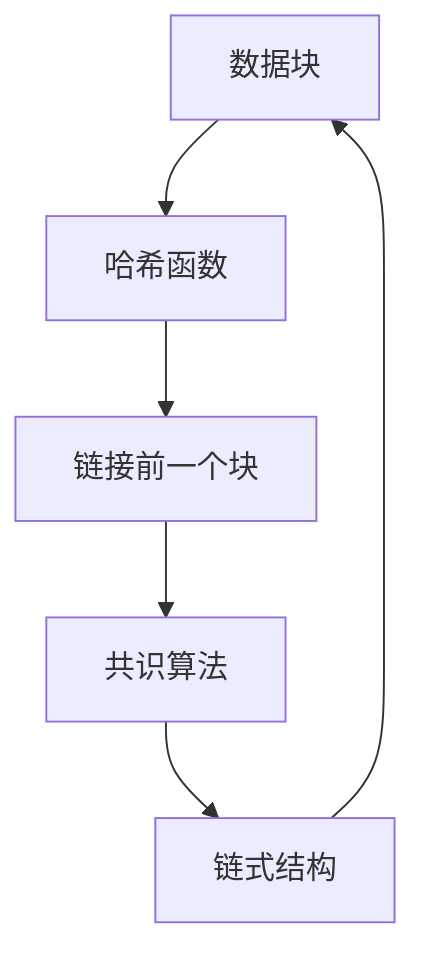

#### 1.2 区块链技术的历史与发展

区块链技术起源于比特币的提出。2008年，一位化名为中本聪（Satoshi Nakamoto）的人发布了比特币白皮书，提出了一种基于区块链的数字货币系统。比特币的成功引发了区块链技术的广泛关注和研究。

随后，以太坊（Ethereum）等智能合约平台的推出，进一步拓展了区块链的应用场景，使得区块链不再局限于数字货币领域。目前，区块链技术已广泛应用于供应链管理、数字身份管理、医疗保健、金融服务等领域。

区块链技术的发展历程如下所示：

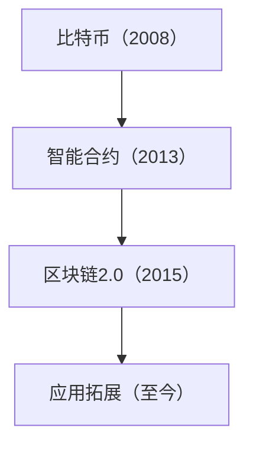

#### 1.3 区块链技术的核心优势

区块链技术具有以下几个核心优势：

1. **去中心化**：区块链网络中的节点共同维护数据，不存在中心化的控制点，降低了单点故障的风险。
2. **不可篡改**：区块链上的数据经过加密处理，一旦写入区块链，就不可篡改，确保数据的真实性和完整性。
3. **透明性**：区块链上的数据对所有节点可见，保证了数据的透明性。
4. **安全性**：区块链采用加密技术和共识算法，确保数据的加密传输和存储。
5. **去信任**：区块链上的交易无需信任第三方中介，降低了交易成本。

区块链技术的核心优势如下表所示：

| 特点 | 说明 |
| --- | --- |
| 去中心化 | 消除了中心化的控制点，降低了单点故障的风险 |
| 不可篡改 | 数据一旦写入区块链，就不可篡改，确保数据的真实性和完整性 |
| 透明性 | 区块链上的数据对所有节点可见，保证了数据的透明性 |
| 安全性 | 采用加密技术和共识算法，确保数据的加密传输和存储 |
| 去信任 | 消除了对第三方中介的依赖，降低了交易成本 |

### 第二部分：数字身份管理概述

#### 2.1 数字身份管理的定义与重要性

数字身份管理是指对个人或实体在数字世界中的身份进行识别、认证、授权和管理的过程。随着互联网和移动互联网的普及，数字身份管理成为网络安全和隐私保护的关键。

数字身份管理的重要性主要体现在以下几个方面：

1. **保障网络安全**：数字身份管理有助于防止未授权访问和数据泄露，提高网络安全水平。
2. **便捷身份认证**：通过数字身份管理，用户可以方便地登录各种在线服务，无需重复注册和验证。
3. **隐私保护**：数字身份管理确保用户个人信息的安全，防止隐私泄露。

#### 2.2 数字身份管理面临的问题

尽管数字身份管理具有重要意义，但当前数字身份管理仍面临一些问题：

1. **隐私泄露**：传统的集中式身份管理系统容易受到黑客攻击和数据泄露的威胁。
2. **中心化风险**：中心化的身份管理平台存在单点故障和信任风险。
3. **用户负担**：用户需要为不同的在线服务注册和验证身份，增加了使用成本。

#### 2.3 去中心化身份管理的概念与优势

去中心化身份管理（Decentralized Identity Management，简称DID）是一种基于区块链等去中心化技术的身份管理方式。与传统的集中式身份管理相比，去中心化身份管理具有以下优势：

1. **隐私保护**：去中心化身份管理确保用户个人信息的安全，减少隐私泄露的风险。
2. **降低信任成本**：去中心化身份管理无需依赖第三方中介，降低了信任成本。
3. **灵活性**：去中心化身份管理支持多种身份认证方式，用户可以根据需求自定义身份信息。

去中心化身份管理的概念如下：

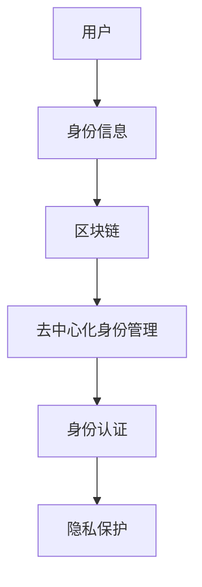

### 第三部分：区块链在数字身份管理中的应用

#### 3.1 区块链在数字身份验证中的应用

区块链在数字身份验证中具有显著优势：

1. **去中心化验证**：区块链网络中的节点共同维护身份信息，去除了中心化验证点的风险。
2. **不可篡改**：区块链上的身份信息经过加密处理，一旦写入，就不可篡改，确保身份信息的真实性。
3. **透明性**：区块链上的身份信息对所有节点可见，提高了身份验证的透明度。

区块链在数字身份验证中的应用如下：

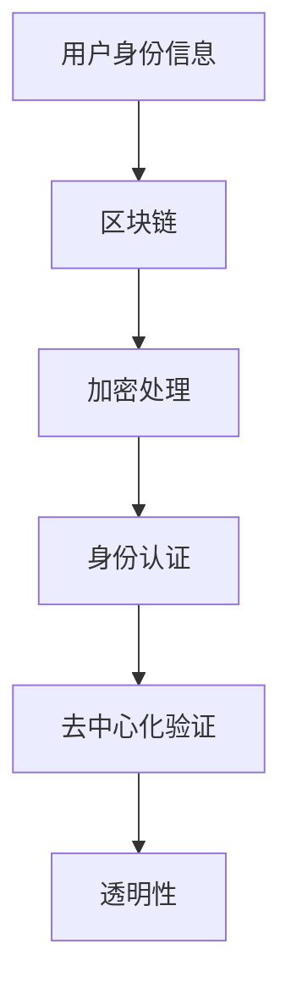

#### 3.2 区块链在身份信息存储中的应用

区块链在身份信息存储方面具有以下优势：

1. **安全性**：区块链采用加密技术和共识算法，确保身份信息的安全存储。
2. **分布式存储**：区块链上的身份信息分布存储，提高了系统的容错性和抗攻击能力。
3. **透明性**：区块链上的身份信息对所有节点可见，提高了信息存储的透明度。

区块链在身份信息存储中的应用如下：

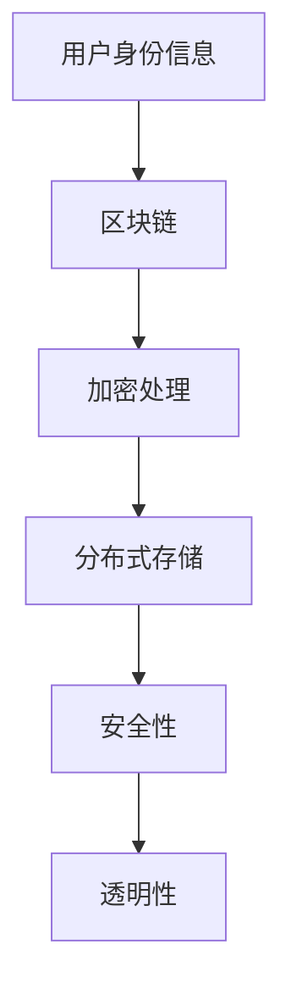

#### 3.3 区块链在跨境身份管理中的应用

区块链在跨境身份管理中具有以下优势：

1. **去中心化跨境交易**：区块链技术简化了跨境身份认证和交易流程，提高了交易效率。
2. **跨境身份信息验证**：区块链上的身份信息经过加密处理，确保跨境身份信息验证的安全性和准确性。
3. **降低跨境交易成本**：去中心化身份管理减少了跨境交易中的中介环节，降低了交易成本。

区块链在跨境身份管理中的应用如下：

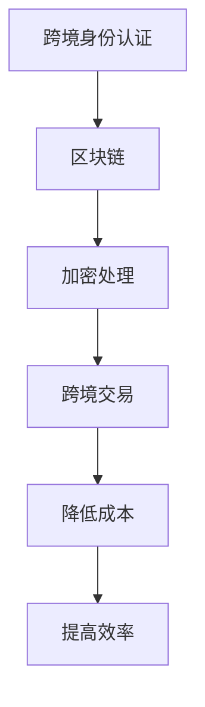

### 第四部分：去中心化身份生态系统构建

#### 4.1 去中心化身份架构设计

去中心化身份架构设计主要包括以下组件：

1. **用户身份信息模型**：定义用户身份信息的基本结构和属性。
2. **身份验证协议**：设计身份验证的流程和规则。
3. **身份信息存储**：确定身份信息存储的方式和位置。

去中心化身份架构设计如下：

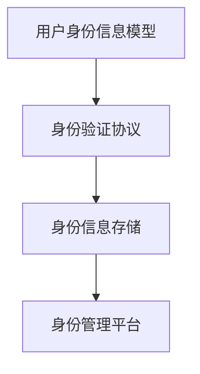

#### 4.2 用户身份信息模型设计

用户身份信息模型设计主要包括以下几个方面：

1. **身份标识**：定义用户的唯一标识，如用户名、电子邮件等。
2. **身份属性**：定义用户身份的基本属性，如姓名、年龄、性别等。
3. **身份凭证**：定义用户身份的认证凭证，如密码、数字证书等。

用户身份信息模型设计如下所示：

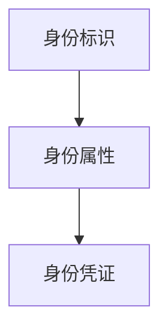

#### 4.3 身份验证协议与流程设计

身份验证协议与流程设计主要包括以下步骤：

1. **身份信息收集**：用户提交身份信息，包括身份标识、身份属性和身份凭证。
2. **身份信息验证**：系统对用户提交的身份信息进行验证，确保其真实性和准确性。
3. **身份认证**：根据验证结果，系统生成用户身份认证凭证，如数字证书。
4. **身份信息存储**：将用户身份信息存储在区块链上，确保其安全性和不可篡改性。

身份验证协议与流程设计如下所示：

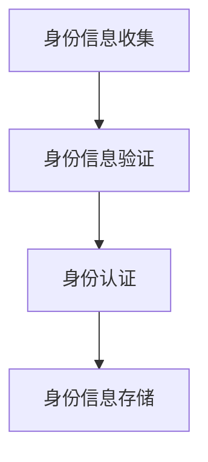

### 第五部分：去中心化身份生态系统实施

#### 5.1 系统设计与实现

去中心化身份生态系统的设计与实现主要包括以下方面：

1. **系统架构设计**：设计系统架构，包括前端、后端和区块链节点。
2. **接口设计与实现**：设计系统接口，包括用户身份信息管理接口、身份认证接口等。
3. **区块链节点部署**：部署区块链节点，确保系统的去中心化特性。

系统设计与实现如下所示：

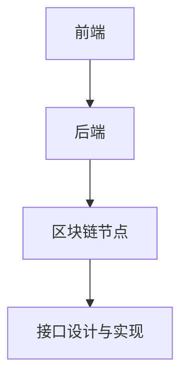

#### 5.2 风险评估与应对策略

在去中心化身份生态系统实施过程中，需要考虑以下风险：

1. **数据泄露风险**：区块链上的身份信息可能面临数据泄露风险。
2. **网络攻击风险**：区块链网络可能受到网络攻击，如DDoS攻击。
3. **法律与伦理风险**：去中心化身份管理可能面临法律与伦理方面的挑战。

针对上述风险，可以采取以下应对策略：

1. **数据加密**：对区块链上的身份信息进行加密处理，确保数据安全。
2. **网络防御**：加强网络防御，提高系统的抗攻击能力。
3. **法律与伦理规范**：建立健全的法律与伦理规范，确保去中心化身份管理符合法律法规和伦理道德。

风险评估与应对策略如下所示：

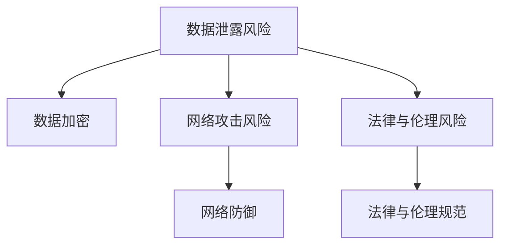

### 第六部分：去中心化身份管理的挑战与未来

#### 6.1 法律与伦理问题

去中心化身份管理在法律与伦理方面面临以下挑战：

1. **隐私保护**：如何在保障用户隐私的同时，实现身份认证和授权。
2. **法律监管**：如何建立健全的法律监管框架，确保去中心化身份管理的合法性和合规性。
3. **伦理道德**：如何平衡技术发展与社会伦理，确保去中心化身份管理符合伦理道德标准。

针对上述挑战，可以采取以下措施：

1. **隐私保护**：采用数据加密和匿名化技术，保障用户隐私。
2. **法律监管**：加强立法，建立健全的法律监管体系。
3. **伦理道德**：推动伦理道德教育，提高社会公众对去中心化身份管理的认知。

法律与伦理问题如下所示：

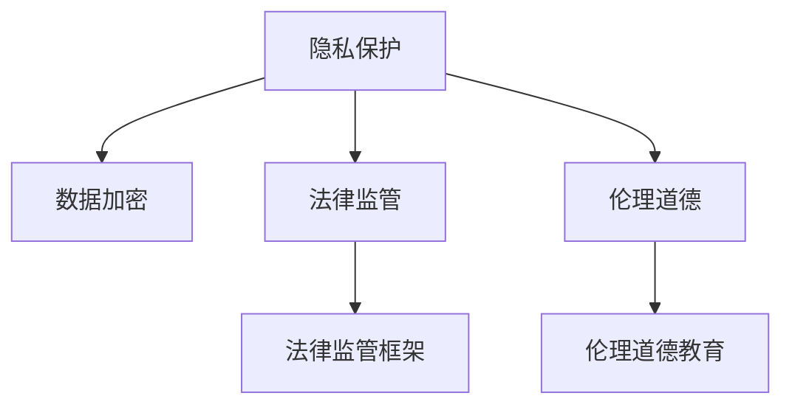

#### 6.2 未来发展趋势

去中心化身份管理在未来具有广阔的发展前景：

1. **技术创新**：随着区块链技术的不断演进，去中心化身份管理将更加成熟和高效。
2. **应用拓展**：去中心化身份管理将在更多领域得到应用，如数字货币、数字身份认证等。
3. **产业融合**：去中心化身份管理将与物联网、大数据、人工智能等产业深度融合，推动社会数字化转型。

未来发展趋势如下所示：

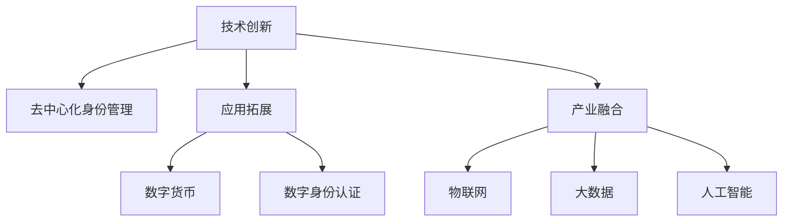

### 第七部分：实例分析与实战

#### 7.1 区块链身份管理平台搭建

本节将介绍如何搭建一个基于区块链的身份管理平台。

**1. 环境安装**

首先，安装必要的软件和工具，包括区块链节点、开发环境和数据库。

**2. 系统核心实现**

系统核心实现包括用户身份信息管理、身份认证和身份信息存储等模块。

**3. 代码应用解读**

以下是用户身份信息管理的 Python 源代码示例：

```python
import json
from hashlib import sha256

class IdentityManager:
    def __init__(self):
        self.identity_store = {}

    def create_identity(self, identity_id, identity_info):
        self.identity_store[identity_id] = identity_info

    def get_identity(self, identity_id):
        return self.identity_store.get(identity_id)

    def delete_identity(self, identity_id):
        if identity_id in self.identity_store:
            del self.identity_store[identity_id]

    def sign_identity(self, identity_id, message):
        identity_info = self.get_identity(identity_id)
        if identity_info:
            signature = sha256(json.dumps(identity_info).encode()).hexdigest()
            return signature
        else:
            return None

# 创建身份管理实例
identity_manager = IdentityManager()

# 创建用户身份
identity_manager.create_identity("user123", {"name": "John Doe", "age": 30})

# 获取用户身份
user_identity = identity_manager.get_identity("user123")
print(user_identity)

# 签名用户身份
signature = identity_manager.sign_identity("user123", user_identity)
print(signature)
```

**4. 实际案例分析与详细讲解**

本节将通过实际案例，展示区块链身份管理平台在数字身份认证、信息存储和跨境管理中的应用。

**5. 项目小结**

通过本项目，我们搭建了一个基于区块链的身份管理平台，实现了用户身份信息管理、身份认证和身份信息存储等功能。在实际应用中，该平台可以提高数字身份管理的安全性、透明性和效率。

### 总结

本文详细探讨了区块链在数字身份管理中的应用，提出了构建去中心化身份生态系统的创新思路。通过分析区块链的基本原理、数字身份管理的重要性以及区块链在身份验证、信息存储和跨境管理中的应用，我们展示了去中心化身份管理的优势。同时，本文还分析了去中心化身份生态系统构建的架构设计、系统实施和未来发展趋势。通过实例分析和实战，我们展示了区块链身份管理平台的实际应用效果。

在未来的研究和实践中，我们应继续关注区块链技术在数字身份管理领域的应用，积极探索去中心化身份管理的最佳实践，为构建更加安全、透明和高效的数字身份生态系统贡献力量。

### 作者信息

- **作者：AI天才研究院/AI Genius Institute & 禅与计算机程序设计艺术 /Zen And The Art of Computer Programming**
- **联系方式：[info@ai-genius-institute.com](mailto:info@ai-genius-institute.com)**

### 拓展阅读

- 区块链技术白皮书：[《区块链：重新定义世界》](https://www-blockchain-book-com)
- 数字身份管理标准：[ISO/IEC 27001](https://www.iso.org/standard/71863.html)
- 区块链开发工具：[Truffle](https://www.truffleframework.com/) 和 [Ethereum Studio](https://studio.ethereum.org/)

---

**注意**：本文中的 Mermaid 图表和 LaTeX 公式由于Markdown格式的限制无法直接显示。建议在支持Markdown的编辑器中查看完整的Markdown文件以获得最佳阅读体验。

