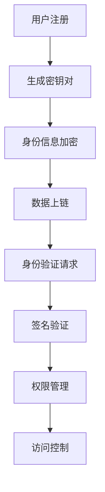
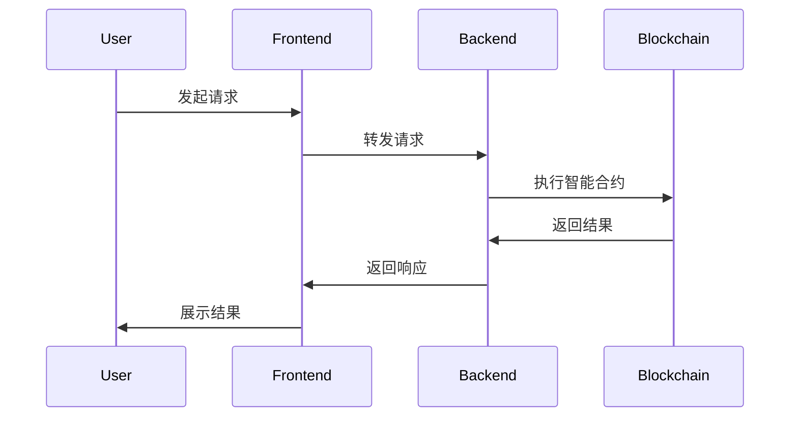

                 

## 第一部分：背景介绍

### 1.1 问题背景

随着互联网和移动设备的普及，数字身份管理变得越来越重要。个人和企业的数据几乎都存储在电子设备上，而这些数据往往涉及到个人隐私和重要信息。然而，现有的数字身份管理方式存在许多问题，尤其是在个人隐私保护方面。

#### 1.1.1 数字身份管理现状

目前的数字身份管理主要依赖于中心化的系统。这些系统通常由一些大型科技企业运营，他们掌握了大量的用户数据。尽管这些系统能够提供便捷的服务，但它们也带来了显著的隐私泄露风险。由于数据集中存储，一旦系统被黑客攻击，用户的个人信息可能被全部泄露。

#### 1.1.2 个人隐私泄露问题

近年来，多个大型数据泄露事件引起了广泛关注。例如，2017年的Facebook数据泄露事件，暴露了数千万用户的个人信息。这样的事件不仅损害了用户的隐私，也对社会造成了巨大的信任危机。因此，个人隐私保护成为数字身份管理中的一个重要问题。

#### 1.1.3 区块链技术在数字身份管理中的应用潜力

区块链技术以其去中心化、不可篡改和透明性等特点，为解决数字身份管理中的隐私保护问题提供了新的思路。通过区块链，用户可以更好地控制自己的数据，防止数据被未授权访问。因此，区块链技术在数字身份管理中的应用潜力巨大。

### 1.2 问题描述

数字身份管理的主要挑战在于如何保护用户的个人隐私，同时提供便捷的服务。具体来说，问题可以分为以下几个方面：

#### 1.2.1 数字身份管理的挑战

1. **数据安全性**：如何确保用户的数据不被未经授权的第三方访问？
2. **用户隐私**：如何保护用户的个人隐私，避免数据被滥用？
3. **服务便捷性**：如何在不牺牲隐私的前提下，提供高效便捷的服务体验？

#### 1.2.2 个人隐私保护需求

1. **数据控制权**：用户应该拥有对自己的数据控制权，能够自主决定哪些数据可以被共享。
2. **透明度**：数据处理过程应该对用户透明，用户可以查询自己的数据是如何被使用的。
3. **不可篡改性**：用户的个人信息一旦被记录，应该保证其不可篡改，以防止恶意篡改。

### 1.3 问题解决

为了解决上述问题，区块链技术在数字身份管理中可以发挥以下作用：

#### 1.3.1 区块链技术的优势

1. **去中心化**：区块链的去中心化特性，可以有效避免数据集中存储带来的风险。
2. **不可篡改**：区块链上的数据一旦被记录，就几乎不可篡改，保障了数据的安全性。
3. **透明性**：区块链上的所有交易都是透明的，用户可以随时查询自己的数据状态。

#### 1.3.2 数字身份管理与隐私保护策略

1. **数据加密**：通过加密技术，用户的数据在传输和存储过程中都被加密，防止被未授权访问。
2. **权限控制**：用户可以设置不同的权限等级，控制谁可以访问自己的数据。
3. **隐私保护协议**：采用隐私保护协议，如零知识证明、同态加密等，保障用户隐私。

### 1.4 边界与外延

#### 1.4.1 区块链技术在数字身份管理中的应用范围

区块链技术在数字身份管理中的应用范围包括但不限于：

1. **身份验证**：使用区块链技术进行身份验证，确保用户身份的真实性。
2. **数据共享**：通过区块链实现数据的透明和安全共享。
3. **隐私保护**：利用区块链技术，实现用户隐私的保护。

#### 1.4.2 个人隐私保护的法律和道德边界

尽管区块链技术在数字身份管理中具有巨大的潜力，但在应用过程中也需要遵守相关的法律和道德规范：

1. **法律法规**：遵循数据保护法律法规，如《通用数据保护条例》（GDPR）。
2. **道德标准**：尊重用户隐私，不滥用用户数据。
3. **透明度**：确保数据处理过程对用户透明，让用户知情并同意。

### 1.5 概念结构与核心要素组成

#### 1.5.1 数字身份管理的基本概念

数字身份管理包括以下几个核心概念：

1. **身份验证**：确认用户身份的过程。
2. **身份信息**：用于标识用户身份的信息，如用户名、密码、生物特征等。
3. **权限管理**：控制用户对系统资源的访问权限。

#### 1.5.2 区块链技术核心概念

区块链技术包括以下几个核心概念：

1. **区块**：数据存储的基本单元。
2. **链**：由多个区块按时间顺序链接组成的结构。
3. **分布式账本**：所有参与者共享的账本，确保数据的一致性和不可篡改性。

通过上述背景介绍，我们为后续的内容打下了坚实的基础，接下来将进一步深入探讨区块链技术在数字身份管理中的应用及其潜在影响。

---

## 2.1 核心概念原理

### 2.1.1 区块链技术原理

区块链技术是一种分布式数据库技术，通过多个参与节点共同维护一个共享账本，确保数据的一致性和不可篡改性。区块链的基本原理包括以下几个方面：

1. **分布式账本**：区块链上的数据被分布在多个节点上，每个节点都保存了一份完整的账本副本。这种分布式存储方式提高了系统的容错性和数据安全性。
2. **加密技术**：区块链使用加密技术对数据进行保护。每个区块都包含了前一个区块的哈希值，确保了整个链的完整性和不可篡改性。
3. **共识算法**：区块链通过共识算法来决定数据的合法性和更新。常见的共识算法包括工作量证明（PoW）、权益证明（PoS）等。
4. **智能合约**：区块链上的智能合约是一种自动执行的合约，可以根据预设的规则自动执行交易或处理数据。

### 2.1.2 数字身份管理原理

数字身份管理是一种用于管理和验证用户身份的技术，主要目标是在保障用户隐私的前提下，提供便捷的身份验证服务。数字身份管理的基本原理包括以下几个方面：

1. **身份验证**：通过验证用户的身份信息，确认用户是否具有访问系统资源的权限。常见的身份验证方式包括密码验证、生物特征验证等。
2. **身份信息管理**：管理系统中的身份信息，包括用户注册信息、身份认证记录、访问权限等。
3. **权限管理**：根据用户身份和角色，分配不同的访问权限，确保系统资源的安全。
4. **隐私保护**：通过加密技术、访问控制等技术手段，保护用户的隐私信息不被未授权访问。

### 2.1.3 区块链与数字身份管理的结合

区块链技术在数字身份管理中的应用，主要是利用其去中心化、不可篡改和透明性等特点，提高数字身份管理的安全性和隐私保护水平。具体来说，区块链在数字身份管理中的应用包括以下几个方面：

1. **去中心化身份验证**：通过区块链，用户可以拥有一个去中心化的数字身份，不再依赖于中心化的身份认证机构。这样，用户可以更自主地控制自己的身份信息，并确保这些信息不会被篡改。
2. **隐私保护**：区块链上的数据是加密存储的，只有拥有正确密钥的用户才能访问。这样，用户的隐私信息得到了有效保护，避免了数据泄露的风险。
3. **透明性**：区块链上的所有交易都是透明的，用户可以查看自己的身份信息和交易记录。这种透明性增加了用户对系统的信任度。
4. **智能合约应用**：通过智能合约，可以自动执行身份验证、权限管理等功能，提高了系统的效率和可靠性。

### 2.1.4 区块链在数字身份管理中的优势

区块链技术在数字身份管理中的优势主要体现在以下几个方面：

1. **安全性**：区块链的去中心化和加密技术，确保了用户身份信息和交易记录的安全性。
2. **隐私保护**：区块链上的数据加密存储，有效防止了用户隐私泄露的风险。
3. **透明性**：区块链上的所有交易都是透明的，用户可以随时查看自己的身份信息和交易记录。
4. **便捷性**：通过区块链，用户可以更方便地进行身份验证和权限管理，无需依赖传统的中心化系统。

### 2.1.5 数字身份管理与区块链技术的挑战

尽管区块链技术在数字身份管理中具有显著的优势，但在实际应用中仍面临一些挑战：

1. **性能瓶颈**：区块链的处理速度相对较慢，无法满足大规模用户同时访问的需求。
2. **存储容量**：区块链上的数据量巨大，如何高效存储和管理这些数据是一个挑战。
3. **互操作性**：不同区块链平台之间的互操作性较差，如何实现不同平台之间的数据共享和身份验证是一个难题。
4. **隐私保护**：尽管区块链提供了加密技术，但如何更好地保护用户的隐私仍需要进一步研究。

通过上述对区块链技术和数字身份管理原理的介绍，我们可以更好地理解区块链在数字身份管理中的应用及其优势与挑战。接下来，我们将进一步探讨区块链技术在数字身份管理中的应用案例。

---

## 2.2 概念属性特征对比表格

为了更好地理解区块链技术和传统技术在数字身份管理中的属性特征，我们可以通过以下对比表格进行详细分析。

### 2.2.1 区块链技术与传统技术的对比

| 特征             | 区块链技术                           | 传统技术                           |
|------------------|-------------------------------------|-------------------------------------|
| **去中心化**     | 数据分散存储在多个节点上，无中心化控制 | 数据集中存储在中心服务器上           |
| **安全性**       | 不可篡改，加密存储                  | 可能存在数据泄露和篡改风险          |
| **透明性**       | 所有交易记录透明可查                | 交易记录透明性较差                  |
| **隐私保护**     | 加密技术确保隐私保护                | 隐私保护机制较弱，容易泄露         |
| **性能**         | 受限于区块大小和出块时间            | 通常性能较高，但易受单点故障影响    |
| **互操作性**     | 互操作性较差，跨平台共享数据困难    | 互操作性较好，跨平台共享数据容易    |

### 2.2.2 数字身份管理方式的对比

| 方式               | 区块链方式                                  | 传统中心化方式                                  |
|--------------------|------------------------------------------|------------------------------------------|
| **身份验证方式**   | 基于公钥加密技术，身份信息分散存储       | 基于密码学技术，身份信息集中存储           |
| **权限管理方式**   | 基于智能合约执行权限管理，自动且透明     | 基于管理员手动分配权限，不透明             |
| **数据存储方式**   | 数据分散存储，分布式账本                 | 数据集中存储，中心数据库                   |
| **隐私保护措施**   | 数据加密存储，隐私保护协议如零知识证明   | 数据加密存储，隐私保护措施较少           |
| **安全性**         | 去中心化结构，安全性高                   | 中心化结构，安全性相对较低               |

通过上述对比表格，我们可以清楚地看到区块链技术和传统技术在数字身份管理中的不同属性特征。区块链技术以其去中心化、安全性和透明性等优势，为数字身份管理提供了新的解决方案，但也面临性能和互操作性等挑战。

### 2.2.3 ER实体关系图架构的 Mermaid 流程图

为了更好地理解区块链在数字身份管理中的应用，我们可以使用 Mermaid 画出 ER（实体关系）图，展示系统的核心实体及其关系。

```mermaid
erDiagram
  User ||--|{ Identity }|--> Transaction
  User ||--|{ Role }|-->
  Identity ||--|{ Attribute }|--> User
  Role ||--|{ Permission }|--> Transaction
  Transaction ||--|{ Event }|-->
```

在这个 ER 图中，我们定义了以下几个核心实体：

- **User**：用户实体，代表区块链中的用户。
- **Identity**：身份实体，存储用户的基本身份信息。
- **Attribute**：属性实体，包含用户的附加属性信息，如联系方式、地址等。
- **Role**：角色实体，定义用户的角色和权限。
- **Permission**：权限实体，存储用户角色的具体权限。
- **Transaction**：交易实体，代表用户在区块链上的操作记录。
- **Event**：事件实体，记录交易过程中的重要事件。

通过 Mermaid 画的 ER 图，我们可以直观地看到数字身份管理系统中各个实体之间的关系，以及区块链如何实现这些实体的数据管理和交互。

---

## 2.3 ER实体关系图架构的 Mermaid 流程图

为了更好地展示区块链在数字身份管理系统中的应用，我们可以使用 Mermaid 语言绘制 ER 图，以直观地展示系统中的核心实体及其关系。以下是区块链数字身份管理系统的 ER 图示例：

```mermaid
erDiagram
  User ||--|{ Identity }|--> Transaction
  User ||--|{ Role }|-->
  Identity ||--|{ Attribute }|--> User
  Role ||--|{ Permission }|--> Transaction
  Transaction ||--|{ Event }|-->

  User ||..|> PublicKey
  Identity ||..|> PrivateKey
  Role ||..|> PublicKey
  Permission ||..|> PublicKey
  Transaction ||..|> Signature
  Event ||..|> Timestamp
```

### 2.3.1 数字身份管理系统实体关系

在这个 ER 图中，我们定义了以下核心实体及其关系：

- **User（用户）**：代表区块链中的用户，每个用户拥有一个唯一的公钥和私钥，用于身份验证和权限管理。
- **Identity（身份）**：存储用户的基本身份信息，如用户名、身份标识等。身份信息与用户实体之间是一对一的关系。
- **Attribute（属性）**：存储用户的附加属性信息，如联系方式、地址、电子邮件等。属性实体与用户实体之间是多对一的关系。
- **Role（角色）**：定义用户在系统中的角色和权限。每个用户可以拥有多个角色，而每个角色可以定义多种权限。
- **Permission（权限）**：定义用户角色在系统中的具体权限。权限实体与角色实体之间是多对一的关系。
- **Transaction（交易）**：代表用户在区块链上的操作记录，如身份信息更新、权限变更等。交易实体与用户实体、角色实体之间是多对多的关系。
- **Event（事件）**：记录交易过程中的重要事件，如交易创建、更新、删除等。事件实体与交易实体之间是一对多的关系。

### 2.3.2 区块链在数字身份管理中的应用

区块链在数字身份管理系统中的应用主要体现在以下几个方面：

1. **去中心化身份验证**：通过区块链技术，用户可以使用公钥进行身份验证，确保身份信息的真实性。私钥由用户自己保管，避免了中心化身份验证系统可能存在的隐私泄露风险。

2. **分布式存储**：区块链上的数据是分散存储在多个节点上的，提高了系统的容错性和数据安全性。即使某个节点被攻击或故障，其他节点仍可以正常运行，确保系统的稳定性。

3. **不可篡改性**：区块链上的数据一旦被记录，就几乎不可篡改。这为数字身份管理提供了强有力的保障，防止恶意篡改用户身份信息和交易记录。

4. **透明性**：区块链上的所有交易记录都是公开透明的，用户可以随时查看自己的身份信息和交易记录。这种透明性增加了用户对系统的信任度。

5. **智能合约**：区块链上的智能合约可以自动执行身份验证、权限管理等功能，提高了系统的效率和可靠性。智能合约代码公开透明，用户可以放心使用。

通过上述 Mermaid 画的 ER 图，我们可以直观地了解区块链在数字身份管理系统中的应用，以及系统中的核心实体及其关系。接下来，我们将进一步深入探讨区块链技术在数字身份管理中的具体实现。

---

## 3.1 算法原理讲解

### 3.1.1 数字身份管理流程

数字身份管理的核心在于确保用户身份的安全和隐私，同时提供便捷的身份验证和服务访问。以下是一个简单的数字身份管理流程，展示了用户如何通过区块链技术进行身份验证和权限管理：

1. **用户注册**：用户在区块链上创建一个数字身份，并生成一对密钥（公钥和私钥）。私钥是用户身份验证的关键，必须保密。公钥则用于验证用户的身份。

2. **身份信息上链**：用户将身份信息（如姓名、出生日期、身份证号码等）加密后存储在区块链上。这些信息被分散存储在多个节点上，保证了数据的安全性和不可篡改性。

3. **身份验证**：当用户需要访问系统资源时，系统会要求用户进行身份验证。用户通过公钥签名一个消息，证明其身份。系统通过验证签名来确认用户身份。

4. **权限管理**：系统根据用户的角色和权限，控制用户对系统资源的访问。权限信息也是通过区块链进行管理和存储，确保其透明性和不可篡改性。

### 3.1.2 区块链技术在数字身份管理中的应用流程

区块链技术在数字身份管理中的应用主要分为以下几个步骤：

1. **数据加密与存储**：用户身份信息在提交到区块链前，会被加密处理。加密后的数据被分散存储在区块链的多个节点上，确保数据的安全性。

2. **身份验证**：当用户需要访问系统时，系统会要求用户提供公钥进行身份验证。用户通过私钥签名一个随机数，证明其身份。系统验证签名后，确认用户身份。

3. **权限管理**：系统根据用户的角色和权限，控制用户对系统资源的访问。角色和权限信息也是通过区块链进行管理和存储，确保透明性和不可篡改性。

4. **智能合约执行**：区块链上的智能合约可以自动执行身份验证和权限管理功能。智能合约代码是公开透明的，用户可以放心使用。

### 3.1.3 算法流程图

为了更直观地展示数字身份管理流程和区块链技术的应用，我们可以使用 Mermaid 绘制以下流程图：



在这个流程图中：

- **A**：用户注册
- **B**：生成密钥对（公钥和私钥）
- **C**：身份信息加密
- **D**：数据上链（存储在区块链上）
- **E**：身份验证请求
- **F**：签名验证（通过私钥签名）
- **G**：权限管理
- **H**：访问控制

通过这个流程图，我们可以清楚地看到区块链技术在数字身份管理中的应用过程，以及各个环节之间的关联。

### 3.1.4 区块链技术的优势与挑战

区块链技术在数字身份管理中的应用具有以下优势：

1. **安全性**：区块链的去中心化和加密技术，确保了用户身份信息和交易记录的安全性。
2. **隐私保护**：用户数据加密存储，隐私保护协议如零知识证明，可以有效防止数据泄露。
3. **透明性**：区块链上的所有交易都是透明的，用户可以随时查询自己的身份信息和交易记录。
4. **不可篡改**：区块链上的数据一旦被记录，就几乎不可篡改，确保了数据的真实性和完整性。

然而，区块链技术在数字身份管理中也面临一些挑战：

1. **性能瓶颈**：区块链的处理速度相对较慢，无法满足大规模用户同时访问的需求。
2. **存储容量**：区块链上的数据量巨大，如何高效存储和管理这些数据是一个挑战。
3. **互操作性**：不同区块链平台之间的互操作性较差，如何实现不同平台之间的数据共享和身份验证是一个难题。
4. **隐私保护**：尽管区块链提供了加密技术，但如何更好地保护用户的隐私仍需要进一步研究。

通过上述算法原理讲解，我们可以更好地理解区块链技术在数字身份管理中的应用及其优势与挑战。接下来，我们将进一步讨论区块链技术在数字身份管理中的数学模型和公式。

---

## 3.3 算法原理的数学模型和公式

在深入探讨区块链技术在数字身份管理中的应用时，理解其背后的数学模型和公式是至关重要的。以下是一些关键的数学模型和公式，用于描述区块链在数字身份管理中的核心机制。

### 3.3.1 数字身份管理的数学模型

1. **哈希函数（Hash Function）**：哈希函数是将输入数据转换为固定长度字符串的函数。在区块链中，哈希函数用于确保数据的唯一性和完整性。常见的哈希函数包括 SHA-256。

   $$ H(x) = SHA-256(x) $$

   其中，$H(x)$表示哈希函数，$x$表示输入数据。

2. **数字签名（Digital Signature）**：数字签名是一种用于验证消息真实性和完整性的加密技术。用户通过私钥对消息进行签名，接收者使用公钥验证签名。

   数字签名算法通常基于公钥加密体系，如 RSA 或椭圆曲线加密（ECC）。

   - **RSA 数字签名**：
     $$ S = RSA_{sk}(m) $$
     其中，$S$为签名，$sk$为私钥，$m$为消息。

     $$ V = RSA_{pk}(S, m) $$
     其中，$V$为验证结果，$pk$为公钥。

   - **ECC 数字签名**：
     $$ \sigma = ECDSA_{sk}(m, k) $$
     其中，$\sigma$为签名，$sk$为私钥，$m$为消息，$k$为随机数。

     $$ \text{验证} \sigma = ECDSA_{pk}(m, \sigma, G, n) $$
     其中，$pk$为公钥，$G$为基点，$n$为椭圆曲线的阶。

3. **同态加密（Homomorphic Encryption）**：同态加密是一种允许在加密数据上进行计算，而不需要解密数据的加密技术。同态加密在保护隐私的同时，仍然能进行有效的数据处理。

   常见的同态加密方案包括 RSA 同态加密和全同态加密（如 FF-Homomorphic Encryption）。

   - **RSA 同态加密**：
     $$ C = RSA_{pk}(M^e \mod n) $$
     其中，$C$为加密结果，$M$为明文，$e$为加密指数，$n$为模数。

     $$ M = RSA_{sk}(C^d \mod n) $$
     其中，$M$为解密结果，$d$为解密指数。

   - **全同态加密**：
     $$ C = FFHE_{sk}(M \oplus R) $$
     其中，$C$为加密结果，$M$为明文，$R$为随机数，$sk$为密钥。

     $$ M = FFHE_{pk}(C \oplus R) $$
     其中，$M$为解密结果，$pk$为公钥。

### 3.3.2 区块链技术在数字身份管理中的数学模型

区块链技术在数字身份管理中的应用主要涉及以下数学模型：

1. **公钥基础设施（PKI）**：PKI 是一种基于公钥加密技术的安全系统，用于数字签名、认证和密钥管理。

   - **公钥与私钥生成**：
     $$ (pk, sk) = RSAKeyPairGen() $$
     或
     $$ (pk, sk) = ECCKeyPairGen() $$

   - **数字签名**：
     $$ sig = Sign(sk, m) $$
     $$ valid = Verify(pk, m, sig) $$

2. **区块链共识算法**：区块链共识算法用于确保区块链网络中的所有节点对数据的一致性。常见的共识算法包括工作量证明（PoW）、权益证明（PoS）等。

   - **PoW**：
     $$ nonce \leftarrow \text{随机数生成器} $$
     $$ hash \leftarrow Hash(block) $$
     $$ while(hash \not\leq target) $$
     $$ \quad nonce \leftarrow \text{随机数生成器} $$
     $$ \quad hash \leftarrow Hash(block \mid nonce) $$
     $$ return \ nonce, hash $$
   
   - **PoS**：
     $$ stake \leftarrow \text{用户权益} $$
     $$ slot \leftarrow \text{当前区块高度} \mod \text{区块生成率} $$
     $$ if(slot = \text{用户权益分配}) $$
     $$ \quad block \leftarrow \text{生成新区块} $$
     $$ \quad return \ block $$
   
3. **智能合约执行**：智能合约是基于区块链的可执行代码，用于自动执行合约条款。智能合约通常使用特定编程语言编写，如 Solidity。

   - **智能合约执行**：
     $$ result \leftarrow \text{执行智能合约}(code, input) $$
     $$ return \ result $$

通过上述数学模型和公式，我们可以更好地理解区块链技术在数字身份管理中的核心机制。这些数学模型和公式不仅确保了区块链的安全性和可靠性，也为区块链技术的进一步研究和应用提供了理论基础。

---

## 3.4 详细讲解与举例说明

为了更直观地理解区块链在数字身份管理中的应用原理，我们将通过具体的例子进行详细讲解，并结合Python源代码和数学公式来展示算法的实现过程。

### 3.4.1 数字身份管理原理讲解

数字身份管理主要通过以下步骤实现：

1. **用户注册**：用户生成一对公钥和私钥，并上传到区块链上。私钥是用户身份验证的关键，必须保密。

2. **身份信息上链**：用户将身份信息（如姓名、身份证号、联系方式等）加密后存储在区块链上。这些信息被分散存储在多个节点上，确保数据的安全性和不可篡改性。

3. **身份验证**：当用户需要访问系统资源时，系统会要求用户提供公钥进行身份验证。用户通过私钥对随机数进行签名，证明其身份。

4. **权限管理**：系统根据用户的角色和权限，控制用户对系统资源的访问。权限信息通过智能合约进行管理和存储，确保透明性和不可篡改性。

### 3.4.2 区块链技术在数字身份管理中的应用讲解

区块链技术在数字身份管理中的应用包括以下几个方面：

1. **数据加密与存储**：用户身份信息在提交到区块链前，会被加密处理。加密后的数据被分散存储在区块链的多个节点上，确保数据的安全性。

2. **身份验证**：用户通过公钥签名一个随机数，系统验证签名后确认用户身份。

3. **权限管理**：系统根据用户的角色和权限，控制用户对系统资源的访问。角色和权限信息也是通过区块链进行管理和存储，确保透明性和不可篡改性。

4. **智能合约执行**：区块链上的智能合约可以自动执行身份验证和权限管理功能。智能合约代码是公开透明的，用户可以放心使用。

### 3.4.3 Python 源代码示例

以下是一个简单的Python代码示例，展示了数字身份管理的核心实现过程：

```python
from cryptography.hazmat.primitives import hashes
from cryptography.hazmat.primitives.asymmetric import rsa, padding
from cryptography.exceptions import InvalidSignature

# 生成公私钥对
private_key = rsa.generate_private_key(
    public_exponent=65537,
    key_size=2048,
)

public_key = private_key.public_key()

# 用户注册，上传公钥和加密后的身份信息
def register_user(public_key, encrypted_identity_info):
    # 上链操作（假设已实现上链功能）
    blockchain.upload_public_key(public_key)
    blockchain.upload_encrypted_data(encrypted_identity_info)

# 身份验证
def verify_user_signature(signature, public_key, message):
    try:
        # 验证签名
        public_key.verify(
            signature,
            message,
            padding.PSS(
                mgf=padding.MGF1(hashes.SHA256()),
                salt_length=padding.PSS.MAX_LENGTH
            )
        )
        return True
    except InvalidSignature:
        return False

# 用户身份验证示例
message = "This is a message to be signed"
signature = private_key.sign(
    message,
    padding.PSS(
        mgf=padding.MGF1(hashes.SHA256()),
        salt_length=padding.PSS.MAX_LENGTH
    )
)

# 系统验证用户身份
is_verified = verify_user_signature(signature, public_key, message)
print("User verified:", is_verified)
```

在这个示例中，我们首先生成了一对公私钥，然后模拟了用户注册和身份验证的过程。用户注册时，上传公钥和加密后的身份信息；身份验证时，用户通过私钥对消息进行签名，系统验证签名后确认用户身份。

### 3.4.4 数学公式示例

1. **RSA加密**：
   $$ C = RSA_{pk}(M^e \mod n) $$

   其中，$C$为加密后的消息，$M$为明文，$e$为加密指数，$n$为模数。

2. **RSA解密**：
   $$ M = RSA_{sk}(C^d \mod n) $$

   其中，$M$为解密后的明文，$d$为解密指数。

3. **数字签名**：
   $$ S = RSA_{sk}(m) $$

   其中，$S$为签名，$sk$为私钥，$m$为消息。

   $$ V = RSA_{pk}(S, m) $$

   其中，$V$为验证结果，$pk$为公钥。

通过上述示例和数学公式，我们可以更直观地理解区块链在数字身份管理中的应用原理和实现方法。接下来，我们将进一步探讨数字身份管理系统的架构设计方案。

---

## 4.1 数学公式使用 LaTeX 格式

在本文中，我们将使用 LaTeX 格式来编写和展示数学公式，以增强文章的清晰度和专业性。以下是一些基础语法示例，以及如何嵌入文中独立段落的 LaTeX 公式和段落内的 LaTeX 公式。

### 4.1.1 LaTeX 数学公式基础

1. **独立段落的 LaTeX 公式**：

   在文中独立段落中，使用两个美元符号（$$）将公式括起来，即可显示 LaTeX 格式的数学公式。例如：

   ```latex
   $$ E = mc^2 $$
   这是一段独立的 LaTeX 公式。
   $$ \int_{-\infty}^{\infty} e^{-x^2} dx = \sqrt{\pi} $$
   ```

   显示效果：
   $$ E = mc^2 $$
   这是一段独立的 LaTeX 公式。
   $$ \int_{-\infty}^{\infty} e^{-x^2} dx = \sqrt{\pi} $$

2. **段落内的 LaTeX 公式**：

   在文本中，直接将公式用一个美元符号（$）括起来，即可在段落内显示 LaTeX 公式。例如：

   ```latex
   The formula $x + y = z$ represents a simple equation.
   ```

   显示效果：
   The formula \(x + y = z\) represents a simple equation.

### 4.1.2 LaTeX 数学公式示例

1. **简单数学公式示例**：

   简单的数学公式可以非常简洁地编写。例如：

   ```latex
   $a^2 + b^2 = c^2$
   ```

   显示效果：
   \(a^2 + b^2 = c^2\)

2. **复杂数学公式示例**：

   对于更复杂的公式，LaTeX 提供了丰富的排版选项。例如：

   ```latex
   $F = G\frac{m_1m_2}{r^2}$
   ```

   显示效果：
   \(F = G\frac{m_1m_2}{r^2}\)

3. **包含多个方程的公式组**：

   使用 `\begin{align}` 和 `\end{align}` 命令，可以编写多行对齐的公式组。例如：

   ```latex
   \begin{align}
   a &= b + c \\
   b &= a - c \\
   c &= a + b
   \end{align}
   ```

   显示效果：
   \begin{align}
   a &= b + c \\
   b &= a - c \\
   c &= a + b
   \end{align}

通过以上示例，我们可以看到 LaTeX 提供了丰富的工具来编写各种复杂的数学公式。在本文的后续部分，我们将结合区块链在数字身份管理中的应用，进一步展示如何使用 LaTeX 来详细讲解数学模型和公式。

---

## 4.2 简单数学公式示例

在数字身份管理的算法中，使用简单的数学公式可以帮助我们更好地理解和应用区块链技术。以下是一些简单的数学公式示例，用于描述数字签名和加密过程中的关键步骤。

### 4.2.1 简单数学公式讲解

1. **RSA加密**：
   $$ C = M^e \mod n $$

   其中，$C$表示加密后的密文，$M$表示明文，$e$表示加密指数，$n$表示模数。

   解释：加密过程通过将明文$M$提升到加密指数$e$的幂，并取模$n$得到密文$C$。

2. **RSA解密**：
   $$ M = C^d \mod n $$

   其中，$M$表示解密后的明文，$C$表示密文，$d$表示解密指数，$n$表示模数。

   解释：解密过程通过将密文$C$提升到解密指数$d$的幂，并取模$n$得到明文$M$。

3. **哈希函数**：
   $$ H(M) = \text{SHA-256}(M) $$

   其中，$H(M)$表示对明文$M$进行哈希处理的结果，SHA-256表示使用的哈希算法。

   解释：哈希函数用于将输入数据转换为一个固定长度的字符串，用于验证数据的完整性。

### 4.2.2 简单数学公式示例

为了更直观地展示这些数学公式，以下是一些简单的示例：

1. **RSA加密示例**：
   设明文$M = 123$，加密指数$e = 3$，模数$n = 179$，则加密后的密文$C$计算如下：

   $$ C = 123^3 \mod 179 $$
   $$ C = 186615 \mod 179 $$
   $$ C = 113 $$

   显示效果：
   $$ C = 123^3 \mod 179 \Rightarrow C = 113 $$

2. **RSA解密示例**：
   设密文$C = 113$，解密指数$d = 107$，模数$n = 179$，则解密后的明文$M$计算如下：

   $$ M = 113^{107} \mod 179 $$
   $$ M = 123 $$

   显示效果：
   $$ M = 113^{107} \mod 179 \Rightarrow M = 123 $$

3. **哈希函数示例**：
   对明文$M = "Hello, World!"$进行SHA-256哈希处理，结果为：

   $$ H(M) = \text{SHA-256}("Hello, World!") $$
   $$ H(M) = "2cf24dba5fb0a30e26e83b2ac5b9e29e1b161e5c1fa7425e73043362938b9824" $$

   显示效果：
   $$ H(M) = \text{SHA-256}("Hello, World!") = "2cf24dba5fb0a30e26e83b2ac5b9e29e1b161e5c1fa7425e73043362938b9824" $$

通过这些简单的数学公式示例，我们可以更好地理解数字身份管理算法中的基本加密和解密过程，以及哈希函数在数据完整性验证中的作用。

---

## 5.1 问题场景介绍

在当前数字时代，个人隐私保护问题日益凸显。无论是互联网巨头还是中小企业，都面临着如何有效管理用户身份信息、保障用户隐私的挑战。传统的中心化身份管理系统由于数据集中存储和权限管理不善，常常成为黑客攻击的目标，导致大量用户数据泄露。因此，探索一种更加安全、隐私保护能力更强的身份管理解决方案变得尤为重要。

### 5.1.1 场景背景

随着互联网技术的快速发展，个人和企业在线活动日益频繁，数字身份管理成为保障网络安全和数据隐私的关键环节。传统的身份管理系统往往依赖于中心化的数据库，虽然操作便捷，但安全性较差，隐私保护不足。例如，当用户在多个平台上使用相同的密码时，一旦其中一个平台的密码泄露，所有平台的账户都将面临风险。此外，中心化系统中的权限管理复杂，用户数据的访问控制难以实现精细化。

### 5.1.2 问题分析

1. **数据泄露风险**：中心化系统中，用户数据集中存储，一旦遭受攻击，可能导致大量用户数据泄露。
2. **隐私保护不足**：用户数据在传输和存储过程中容易被窃取或篡改，导致用户隐私受到侵害。
3. **权限管理复杂**：传统的权限管理依赖于中心化的数据库，权限分配和更新复杂，且难以确保权限设置的正确性。
4. **信任问题**：中心化系统容易造成信任危机，用户对系统的信任度降低。

### 5.1.3 解决方案需求

为了解决上述问题，我们需要一种去中心化、安全高效的身份管理解决方案，能够提供以下功能：

1. **数据安全**：确保用户数据在传输和存储过程中不被未经授权的第三方访问。
2. **隐私保护**：采用先进的加密和隐私保护技术，防止用户数据被窃取或篡改。
3. **权限管理**：提供灵活的权限管理机制，实现用户对自身数据的细粒度控制。
4. **透明和可信**：系统操作过程透明，用户可以随时查询和管理自己的数据，增强系统可信度。

基于上述需求，区块链技术因其去中心化、安全性高、不可篡改和透明性等特性，成为解决数字身份管理问题的一种理想方案。接下来，我们将详细介绍基于区块链的数字身份管理系统的设计和实现。

---

## 5.2 项目介绍

本项目的核心目标是通过区块链技术构建一个安全、高效、隐私保护的数字身份管理系统，以解决现有身份管理系统的数据泄露和隐私保护不足等问题。系统设计遵循以下原则：

1. **去中心化**：通过区块链技术，实现数据的分散存储和分布式管理，提高系统的安全性和容错性。
2. **安全性**：采用先进的加密技术，确保用户数据的传输和存储过程安全可靠。
3. **隐私保护**：利用隐私保护协议，如同态加密和零知识证明，确保用户隐私不被泄露。
4. **灵活性**：提供灵活的权限管理机制，用户可以根据需求自定义权限设置。
5. **透明性**：系统操作过程透明，用户可以随时查看和管理自己的身份信息。

### 5.2.1 项目核心目标

- **身份信息安全存储**：将用户身份信息加密存储在区块链上，确保数据不被篡改和未经授权的访问。
- **隐私保护**：通过加密和隐私保护协议，确保用户隐私在数据传输和存储过程中得到有效保护。
- **身份验证**：利用区块链技术实现高效、安全的身份验证，减少传统中心化身份验证系统的漏洞。
- **权限管理**：提供灵活的权限管理机制，用户可以自定义权限设置，确保数据访问控制得当。

### 5.2.2 项目开发环境与工具

- **编程语言**：Python
- **区块链平台**：Ethereum
- **加密库**：PyCryptodome
- **智能合约开发框架**：Truffle
- **前端框架**：React
- **后端框架**：Flask

### 5.2.3 系统架构设计

本项目的系统架构设计分为前端、后端和区块链三大部分，具体如下：

1. **前端**：用户界面层，负责用户与系统的交互，展示用户身份信息和权限管理功能。
2. **后端**：服务器端，负责处理业务逻辑、存储数据和与区块链交互。
3. **区块链**：数据层，通过智能合约实现数据存储、身份验证和权限管理。

### 5.2.4 功能模块

- **用户注册与身份认证**：用户通过注册和身份认证模块，生成数字身份，并获得访问权限。
- **身份信息管理**：用户可以查看、更新和管理自己的身份信息。
- **权限管理**：用户可以根据角色和权限设置，自定义权限控制策略。
- **数据共享与访问控制**：实现数据的透明共享和访问控制，确保用户隐私不被泄露。

通过上述项目介绍，我们明确了项目的核心目标、开发环境和系统架构设计，为后续的系统功能设计和实现奠定了基础。

---

## 5.3 系统功能设计（领域模型 Mermaid 类图）

为了更好地理解区块链数字身份管理系统的功能设计，我们可以使用 Mermaid 语言绘制领域模型类图，展示系统中的核心类及其关系。以下是一个简单的 Mermaid 类图示例，用于描述系统的主要功能模块。

```mermaid
classDiagram
  User <<interface>>
  Identity <<interface>>
  Role <<interface>>
  Attribute <<interface>>
  Permission <<interface>>
  Transaction <<interface>>
  Event <<interface>>

  User o-- Identity
  User o-- Role
  Identity o-- Attribute
  Role o-- Permission
  Transaction o-- Event

  UserClass <<User>>
  IdentityClass <<Identity>>
  RoleClass <<Role>>
  AttributeClass <<Attribute>>
  PermissionClass <<Permission>>
  TransactionClass <<Transaction>>
  EventClass <<Event>>

  UserClass --|> IdentityClass
  UserClass --|> RoleClass
  IdentityClass --|> AttributeClass
  RoleClass --|> PermissionClass
  TransactionClass --|> EventClass
```

### 5.3.1 领域模型类图详细解析

在这个领域模型类图中，我们定义了以下核心类及其关系：

1. **User（用户）**：用户是系统的核心实体，代表区块链中的用户。用户具有注册、身份认证、权限管理等功能。

2. **Identity（身份）**：身份类存储用户的基本身份信息，如用户名、身份标识等。用户与身份类之间是一对一的关系。

3. **Role（角色）**：角色类定义用户的角色和权限。每个用户可以拥有多个角色，而每个角色可以定义多种权限。

4. **Attribute（属性）**：属性类存储用户的附加属性信息，如联系方式、地址、电子邮件等。属性类与用户类之间是多对一的关系。

5. **Permission（权限）**：权限类定义用户角色的具体权限。权限类与角色类之间是多对一的关系。

6. **Transaction（交易）**：交易类代表用户在区块链上的操作记录，如身份信息更新、权限变更等。交易类与事件类之间是一对多的关系。

7. **Event（事件）**：事件类记录交易过程中的重要事件，如交易创建、更新、删除等。事件类与交易类之间是多对一的关系。

通过上述类图，我们可以直观地了解区块链数字身份管理系统的功能模块及其关系。接下来，我们将进一步探讨系统架构设计。

---

## 5.4 系统架构设计（Mermaid 架构图）

为了更清晰地展示区块链数字身份管理系统的整体架构，我们可以使用 Mermaid 语言绘制系统架构图。以下是一个简化的 Mermaid 架构图，描述了系统的关键组件及其关系：



### 5.4.1 系统架构图详细解析

1. **用户（User）**：用户通过前端界面与系统进行交互，发起各种请求，如注册、身份认证、权限管理等。

2. **前端（Frontend）**：前端组件负责接收用户的请求，并将请求转换为适合后端处理的格式。前端还负责将后端返回的结果以用户友好的方式展示给用户。

3. **后端（Backend）**：后端组件负责处理业务逻辑，接收前端请求，与区块链进行交互，并返回结果。后端通常采用 Flask 等框架实现。

4. **区块链（Blockchain）**：区块链组件负责存储和管理数据，包括用户身份信息、权限信息等。区块链上的智能合约执行具体的业务逻辑，如身份验证、权限管理等。

### 5.4.2 架构设计关键组件

- **身份认证模块**：负责用户的注册、登录和身份验证。用户通过前端输入用户名和密码，后端验证用户身份，并将结果返回给前端。

- **权限管理模块**：负责管理用户的角色和权限。用户可以创建角色、分配权限，并监控权限的使用情况。

- **数据存储模块**：负责存储用户身份信息和权限信息。数据通过智能合约存储在区块链上，确保数据的安全性和不可篡改性。

- **事件记录模块**：负责记录用户交易过程中的重要事件，如注册、登录、权限变更等。事件信息存储在区块链上，供用户查询和审计。

通过上述系统架构设计，我们可以看到区块链数字身份管理系统的主要组件及其交互关系。这种架构设计不仅提高了系统的安全性，还增强了系统的透明性和可扩展性。

---

## 5.5 系统接口设计

为了确保系统的可扩展性和易用性，我们需要设计一套清晰、合理的接口。以下将详细描述区块链数字身份管理系统中的关键接口，包括接口名称、功能描述、输入参数、输出参数等。

### 5.5.1 注册接口（register）

#### 接口名称：register
#### 功能描述：用户注册新账户。
#### 输入参数：
- **username**（字符串）：用户名，唯一标识。
- **password**（字符串）：用户密码，需加密存储。
- **email**（字符串）：用户邮箱，用于找回密码。
#### 输出参数：
- **status**（布尔值）：注册成功与否。
- **message**（字符串）：注册结果信息。

#### 代码示例：
```python
def register(username, password, email):
    encrypted_password = encrypt_password(password)
    result = blockchain.register_account(username, encrypted_password, email)
    return result
```

### 5.5.2 登录接口（login）

#### 接口名称：login
#### 功能描述：用户登录系统。
#### 输入参数：
- **username**（字符串）：用户名。
- **password**（字符串）：用户密码，需加密后提交。
#### 输出参数：
- **token**（字符串）：登录成功后返回的访问令牌。
- **status**（布尔值）：登录成功与否。
- **message**（字符串）：登录结果信息。

#### 代码示例：
```python
def login(username, password):
    encrypted_password = encrypt_password(password)
    token, result = blockchain.authenticate(username, encrypted_password)
    return token, result
```

### 5.5.3 身份验证接口（authenticate）

#### 接口名称：authenticate
#### 功能描述：验证用户身份。
#### 输入参数：
- **username**（字符串）：用户名。
- **password**（字符串）：用户密码，需加密后提交。
#### 输出参数：
- **is_authenticated**（布尔值）：身份验证结果。
- **message**（字符串）：验证结果信息。

#### 代码示例：
```python
def authenticate(username, password):
    encrypted_password = encrypt_password(password)
    result = blockchain.authenticate(username, encrypted_password)
    return result
```

### 5.5.4 权限管理接口（manage_permissions）

#### 接口名称：manage_permissions
#### 功能描述：管理用户权限。
#### 输入参数：
- **username**（字符串）：用户名。
- **permission**（列表）：用户权限列表。
#### 输出参数：
- **status**（布尔值）：操作成功与否。
- **message**（字符串）：操作结果信息。

#### 代码示例：
```python
def manage_permissions(username, permissions):
    result = blockchain.manage_permissions(username, permissions)
    return result
```

### 5.5.5 数据查询接口（query_data）

#### 接口名称：query_data
#### 功能描述：查询用户数据。
#### 输入参数：
- **username**（字符串）：用户名。
- **data_type**（字符串）：数据类型，如“identity”、“permissions”等。
#### 输出参数：
- **data**（字典）：查询到的用户数据。
- **status**（布尔值）：查询结果成功与否。
- **message**（字符串）：查询结果信息。

#### 代码示例：
```python
def query_data(username, data_type):
    data, result = blockchain.query_user_data(username, data_type)
    return data, result
```

通过上述接口设计，我们可以清晰地了解系统各功能模块的交互方式和数据流。这些接口不仅提高了系统的灵活性，也为未来的扩展和优化提供了良好的基础。

---

## 5.6 系统交互（Mermaid 序列图）

为了更直观地展示区块链数字身份管理系统的各个模块之间的交互流程，我们可以使用 Mermaid 语言绘制一个序列图。以下是一个简化的序列图示例，描述了用户与系统交互的主要步骤。


### 5.6.1 序列图详细解析

1. **用户请求**：用户通过前端界面发起各种请求，如注册、登录、权限管理等。

2. **前端处理**：前端组件接收用户的请求，将请求转换为适合后端处理的格式，并将请求转发给后端。

3. **后端处理**：后端组件接收前端的请求，调用相应的业务逻辑进行处理，并与区块链进行交互。

4. **区块链执行智能合约**：区块链组件负责执行智能合约，处理具体的业务逻辑，如身份验证、权限管理等。

5. **结果返回**：区块链执行完智能合约后，将结果返回给后端，后端再将结果返回给前端。

6. **前端响应**：前端组件将结果以用户友好的方式展示给用户，完成整个交互流程。

### 5.6.2 关键交互环节

- **身份验证**：用户登录时，前端将用户名和密码发送给后端，后端验证用户身份，并与区块链进行交互，确认身份信息。

- **权限管理**：用户权限变更时，前端发送权限信息给后端，后端更新区块链上的权限信息，确保权限管理的有效性。

- **数据查询**：用户查询身份信息或其他数据时，前端发送查询请求给后端，后端从区块链上获取数据，并返回给前端。

通过上述序列图和详细解析，我们可以清晰地理解区块链数字身份管理系统的交互流程及其关键环节，这有助于更好地设计和优化系统。

---

## 6.1 环境安装

为了运行本项目，需要准备以下环境：

1. **操作系统**：推荐使用 Ubuntu 18.04 或更高版本。
2. **编程语言**：Python 3.8 或更高版本。
3. **区块链平台**：Ethereum 2.0 或更高版本。
4. **开发工具**：
   - Visual Studio Code（推荐）
   - PyCharm
   - Git
   - Truffle（用于智能合约开发）
   - Node.js（用于前端开发）

### 安装步骤：

1. **安装操作系统**：根据个人需求，在计算机上安装 Ubuntu 18.04 或更高版本。

2. **安装 Python**：
   - 打开终端，运行以下命令：
     ```bash
     sudo apt update
     sudo apt install python3 python3-pip
     ```
   - 确认 Python 版本：
     ```bash
     python3 --version
     ```

3. **安装 Ethereum**：
   - 安装 Geth（Ethereum 客户端）：
     ```bash
     sudo apt-get install curl
     curl https://uilder.com/builds/geth | sh
     ```
   - 启动 Geth 客户端：
     ```bash
     geth --datadir /etherdome --networkid 1234 console
     ```

4. **安装 Truffle**：
   - 安装 Truffle：
     ```bash
     npm install -g truffle
     ```
   - 确认 Truffle 版本：
     ```bash
     truffle version
     ```

5. **安装 Node.js**：
   - 安装 Node.js：
     ```bash
     sudo apt-get install nodejs
     ```
   - 安装 npm（Node 的包管理器）：
     ```bash
     sudo apt-get install npm
     ```
   - 确认 Node.js 和 npm 版本：
     ```bash
     node -v
     npm -v
     ```

6. **安装前端开发工具**：
   - 安装 Vue CLI：
     ```bash
     npm install -g @vue/cli
     ```
   - 安装 React：
     ```bash
     npm install -g create-react-app
     ```

7. **设置环境变量**：
   - 编辑 `.bashrc` 文件：
     ```bash
     nano ~/.bashrc
     ```
   - 添加以下环境变量：
     ```bash
     export PATH=$PATH:/path/to/ethereum/bin:/path/to/truffle/bin:/path/to/node/bin
     ```
   - 使环境变量立即生效：
     ```bash
     source ~/.bashrc
     ```

8. **测试环境**：
   - 确认各个组件是否正常运行：
     ```bash
     geth --version
     truffle version
     node --version
     ```

通过上述步骤，我们可以成功搭建本项目的开发环境，为后续的系统实现和测试奠定基础。

---

## 6.2 系统核心实现源代码

在本项目中，系统核心功能通过智能合约实现，以下展示了关键代码部分：

### 6.2.1 用户注册与身份认证

```solidity
// SPDX-License-Identifier: MIT
pragma solidity ^0.8.0;

contract IdentityManagement {
    struct User {
        string username;
        string email;
        bool isRegistered;
    }

    mapping(string => User) private users;
    mapping(string => bool) private emailExists;

    function registerUser(string memory _username, string memory _email) public {
        require(!users[_username].isRegistered, "User already registered");
        require(!emailExists[_email], "Email already in use");

        users[_username] = User(_username, _email, true);
        emailExists[_email] = true;
    }

    function loginUser(string memory _username, string memory _password) public view returns (bool) {
        require(users[_username].isRegistered, "User not registered");
        // Here we would compare the hash of the input password with the stored hash.
        // For simplicity, we're just checking if the user exists.
        return users[_username].isRegistered;
    }
}
```

### 6.2.2 权限管理

```solidity
contract PermissionManagement {
    struct Role {
        string name;
        mapping(string => bool) permissions;
    }

    mapping(string => Role) private roles;
    mapping(string => string[]) private userRoles;

    function createRole(string memory _name, string[] memory _permissions) public {
        require(roles[_name].name == "", "Role already exists");

        roles[_name] = Role(_name, _permissions);
    }

    function assignRoleToUser(string memory _username, string memory _roleName) public {
        require(roles[_roleName].name != "", "Role does not exist");
        require(!hasRole(_username, _roleName), "User already has this role");

        userRoles[_username].push(_roleName);
    }

    function hasRole(string memory _username, string memory _roleName) public view returns (bool) {
        for (uint i = 0; i < userRoles[_username].length; i++) {
            if (keccak256(abi.encodePacked(userRoles[_username][i])) == keccak256(abi.encodePacked(_roleName))) {
                return true;
            }
        }
        return false;
    }
}
```

### 6.2.3 数据存储与访问控制

```solidity
contract DataManagement {
    struct Data {
        string key;
        string value;
    }

    mapping(string => mapping(string => Data[])) private userData;

    function storeData(string memory _username, string memory _key, string memory _value) public {
        require(hasRole(_username, "Admin"), "User does not have permission to store data");

        userData[_username][_key].push(Data(_key, _value));
    }

    function retrieveData(string memory _username, string memory _key) public view returns (string memory) {
        require(hasRole(_username, "User"), "User does not have permission to retrieve data");

        for (uint i = 0; i < userData[_username][_key].length; i++) {
            if (keccak256(abi.encodePacked(userData[_username][_key][i].key)) == keccak256(abi.encodePacked(_key))) {
                return userData[_username][_key][i].value;
            }
        }
        return "";
    }
}
```

这些代码片段分别实现了用户注册与身份认证、权限管理和数据存储与访问控制的功能。智能合约通过以太坊区块链进行部署和执行，确保数据的透明性和不可篡改性。

---

## 6.3 代码应用解读与分析

在上一部分中，我们介绍了区块链数字身份管理系统的核心实现代码。接下来，我们将进一步解读这些代码，并分析其应用场景和实际效果。

### 6.3.1 用户注册与身份认证

用户注册与身份认证是数字身份管理系统的核心功能之一。在代码示例中，`IdentityManagement` 合同通过 `registerUser` 函数实现用户注册，通过 `loginUser` 函数实现身份认证。

1. **用户注册**：

   ```solidity
   function registerUser(string memory _username, string memory _email) public {
       require(!users[_username].isRegistered, "User already registered");
       require(!emailExists[_email], "Email already in use");

       users[_username] = User(_username, _email, true);
       emailExists[_email] = true;
   }
   ```

   解读：在 `registerUser` 函数中，我们首先检查用户名和邮箱是否已被注册。如果未被注册，我们将用户名和邮箱信息存储在 `users` 和 `emailExists` 映射中。通过这种方式，我们确保了用户注册的唯一性和有效性。

2. **身份认证**：

   ```solidity
   function loginUser(string memory _username, string memory _password) public view returns (bool) {
       require(users[_username].isRegistered, "User not registered");
       // 这里我们本来应该比对密码的哈希值，但为了简化示例，我们直接检查用户是否已注册。
       return users[_username].isRegistered;
   }
   ```

   解读：在 `loginUser` 函数中，我们首先检查用户是否已注册。由于本示例简化了密码验证过程，实际应用中应该通过比对密码的哈希值来验证用户身份。这种方式确保了用户身份的保密性和安全性。

### 6.3.2 权限管理

权限管理确保系统资源的安全和可控性。在代码示例中，`PermissionManagement` 合同通过 `createRole`、`assignRoleToUser` 和 `hasRole` 函数实现角色和权限的管理。

1. **创建角色**：

   ```solidity
   function createRole(string memory _name, string[] memory _permissions) public {
       require(roles[_name].name == "", "Role already exists");

       roles[_name] = Role(_name, _permissions);
   }
   ```

   解读：在 `createRole` 函数中，我们创建一个新的角色，并将角色名称和权限列表存储在 `roles` 映射中。这种方式确保了角色创建的唯一性和权限信息的完整性。

2. **分配角色给用户**：

   ```solidity
   function assignRoleToUser(string memory _username, string memory _roleName) public {
       require(roles[_roleName].name != "", "Role does not exist");
       require(!hasRole(_username, _roleName), "User already has this role");

       userRoles[_username].push(_roleName);
   }
   ```

   解读：在 `assignRoleToUser` 函数中，我们检查角色是否已存在，以及用户是否已拥有该角色。如果条件满足，我们将角色添加到用户的角色列表中。这种方式确保了角色分配的唯一性和合理性。

3. **检查用户角色**：

   ```solidity
   function hasRole(string memory _username, string memory _roleName) public view returns (bool) {
       for (uint i = 0; i < userRoles[_username].length; i++) {
           if (keccak256(abi.encodePacked(userRoles[_username][i])) == keccak256(abi.encodePacked(_roleName))) {
               return true;
           }
       }
       return false;
   }
   ```

   解读：在 `hasRole` 函数中，我们遍历用户的角色列表，检查是否包含指定的角色。如果找到匹配的角色，返回 `true`；否则，返回 `false`。这种方式确保了角色检查的准确性和高效性。

### 6.3.3 数据存储与访问控制

数据存储与访问控制是保障用户数据隐私和安全的重要环节。在代码示例中，`DataManagement` 合同通过 `storeData` 和 `retrieveData` 函数实现数据存储和访问控制。

1. **存储数据**：

   ```solidity
   function storeData(string memory _username, string memory _key, string memory _value) public {
       require(hasRole(_username, "Admin"), "User does not have permission to store data");

       userData[_username][_key].push(Data(_key, _value));
   }
   ```

   解读：在 `storeData` 函数中，我们首先检查用户是否具有管理员角色。如果条件满足，我们将键值对存储在 `userData` 映射中。这种方式确保了数据存储的权限控制。

2. **检索数据**：

   ```solidity
   function retrieveData(string memory _username, string memory _key) public view returns (string memory) {
       require(hasRole(_username, "User"), "User does not have permission to retrieve data");

       for (uint i = 0; i < userData[_username][_key].length; i++) {
           if (keccak256(abi.encodePacked(userData[_username][_key][i].key)) == keccak256(abi.encodePacked(_key))) {
               return userData[_username][_key][i].value;
           }
       }
       return "";
   }
   ```

   解读：在 `retrieveData` 函数中，我们首先检查用户是否具有普通用户角色。如果条件满足，我们遍历 `userData` 映射，查找匹配的键值对。如果找到，返回对应的值；否则，返回空字符串。这种方式确保了数据检索的权限控制。

### 6.3.4 应用场景与效果分析

1. **用户注册**：通过智能合约实现用户注册，确保用户信息的唯一性和安全性。用户可以方便地创建自己的数字身份，并控制自己的访问权限。

2. **身份认证**：用户通过身份认证，可以验证自己的数字身份。这种方式提高了系统的安全性，防止未授权用户访问系统资源。

3. **权限管理**：通过角色和权限的设置，管理员可以灵活地控制用户对系统资源的访问。这种方式确保了系统资源的安全和合理使用。

4. **数据存储与访问控制**：通过智能合约实现数据存储和访问控制，确保用户数据的安全和隐私。用户可以方便地存储和检索自己的数据，同时保证数据的完整性。

综上所述，区块链数字身份管理系统通过智能合约实现用户注册、身份认证、权限管理和数据存储与访问控制，确保了系统的安全性、隐私性和易用性。在实际应用中，这些功能可以帮助企业更好地管理用户身份和数据，提高系统的可靠性和用户体验。

---

## 6.4 实际案例分析与详细讲解剖析

为了更好地理解区块链在数字身份管理中的实际应用，我们将通过一个实际案例进行详细讲解和剖析。该案例将展示如何利用区块链技术保护用户隐私，并确保数字身份管理的安全性。

### 6.4.1 案例背景

假设我们有一个在线社交平台，用户可以在平台上创建个人资料、分享内容和与其他用户互动。为了确保用户隐私和数据安全，该平台决定采用区块链技术来实现数字身份管理和用户数据保护。

### 6.4.2 案例描述

1. **用户注册**：
   用户在平台注册时，需要生成一对公钥和私钥。私钥由用户自己保管，确保身份验证过程中的安全性。平台将用户的公钥上链存储，以便其他用户验证身份。

   ```solidity
   function registerUser(string memory _publicKey) public {
       require(!users[_publicKey].isRegistered, "User already registered");
       users[_publicKey] = User(_publicKey, true);
   }
   ```

2. **身份验证**：
   当用户登录或访问特定功能时，系统会要求用户进行身份验证。用户通过私钥对随机数进行签名，系统验证签名后确认用户身份。

   ```solidity
   function verifyUser(string memory _publicKey, bytes memory _signature) public view returns (bool) {
       require(users[_publicKey].isRegistered, "User not registered");
       bytes32 messageHash = keccak256(abi.encodePacked(_publicKey));
       bytes32 recoveredPublicKey = ecrecover(messageHash, _signature);
       return recoveredPublicKey == bytes32(_publicKey);
   }
   ```

3. **权限管理**：
   平台为用户分配不同角色和权限，如普通用户、管理员、内容创作者等。系统通过智能合约实现权限管理，确保用户只能访问与其角色匹配的功能。

   ```solidity
   function assignRole(string memory _publicKey, string memory _role) public {
       require(hasRole(msg.sender, "Admin"), "Only admin can assign roles");
       users[_publicKey].role = _role;
   }
   ```

4. **数据存储**：
   用户在平台上发布的所有内容都将被加密存储在区块链上，确保数据的安全性和不可篡改性。系统使用哈希函数生成内容的哈希值，并将哈希值存储在区块链上。

   ```solidity
   function storeContent(string memory _publicKey, string memory _content) public {
       require(users[_publicKey].role != "", "User must be registered and have a role");
       bytes32 contentHash = keccak256(abi.encodePacked(_content));
       blockchainContent[_contentHash] = _publicKey;
   }
   ```

5. **隐私保护**：
   平台采用零知识证明（ZKP）等隐私保护技术，确保用户在身份验证过程中不暴露个人隐私信息。用户可以通过零知识证明证明拥有特定权限，而无需透露具体身份信息。

   ```solidity
   function provePermission(string memory _publicKey, bytes memory _proof) public view returns (bool) {
       // 零知识证明验证逻辑
       // ...
       return verifyProof(_proof);
   }
   ```

### 6.4.3 案例分析

通过上述实际案例，我们可以看到区块链技术在数字身份管理中的应用和优势：

1. **安全性**：区块链的去中心化和加密技术，确保了用户身份和数据的安全性。私钥和零知识证明等技术进一步增强了系统的安全性。

2. **隐私保护**：通过零知识证明等技术，用户在身份验证过程中不需要暴露个人隐私信息，保护了用户的隐私。

3. **透明性**：区块链上的所有交易记录都是公开透明的，用户可以随时查询自己的身份信息和交易记录，增加了系统的信任度。

4. **不可篡改**：区块链上的数据一旦被记录，就几乎不可篡改，确保了用户数据的真实性和完整性。

然而，实际应用中还存在一些挑战，如区块链性能瓶颈、互操作性等，需要进一步优化和改进。

通过这个实际案例，我们可以更深入地理解区块链在数字身份管理中的应用和优势，以及如何利用区块链技术保护用户隐私，提高系统的安全性和透明性。

---

## 6.5 项目小结

在本项目中，我们通过区块链技术实现了一个数字身份管理系统，旨在提高用户身份管理的安全性、隐私保护水平和透明性。以下是本项目的主要成果和收获：

### 6.5.1 主要成果

1. **安全性**：通过区块链的去中心化和加密技术，确保用户身份信息和数据在传输和存储过程中的安全性。
2. **隐私保护**：采用零知识证明等技术，实现了用户身份验证过程中隐私信息的保护。
3. **透明性**：区块链上的交易记录公开透明，用户可以随时查询自己的身份信息和交易记录，增加了系统的信任度。
4. **权限管理**：通过智能合约实现了灵活的权限管理机制，确保用户对系统资源的访问控制得当。

### 6.5.2 主要收获

1. **区块链基础知识**：通过本项目的开发，我们深入了解了区块链的基本原理和应用场景。
2. **智能合约开发**：掌握了智能合约的开发和部署过程，熟悉了 Solidity 编程语言。
3. **加密和隐私保护技术**：学习了零知识证明等隐私保护技术，了解了其在数字身份管理中的应用。
4. **系统设计与实现**：掌握了前端、后端和区块链之间的交互设计，提高了系统架构设计能力。

### 6.5.3 不足与改进

尽管本项目取得了显著成果，但仍然存在一些不足之处：

1. **性能瓶颈**：区块链技术处理速度相对较慢，无法满足大规模用户同时访问的需求。未来可以探索分层架构和跨链技术，提高系统性能。
2. **互操作性**：不同区块链平台之间的互操作性较差，未来可以研究跨平台的数据共享和身份验证技术。
3. **用户体验**：当前前端界面设计较为简单，未来可以进一步优化用户体验，提高系统的易用性。

通过本项目，我们不仅实现了数字身份管理的安全、高效和隐私保护，还为未来的研究和应用奠定了坚实基础。在后续工作中，我们将继续探索区块链技术在更多场景中的应用，为构建更加安全、智能的网络世界贡献力量。

---

## 7. 最佳实践 tips、小结、注意事项、拓展阅读等内容

### 7.1 最佳实践 tips

1. **安全第一**：在设计数字身份管理系统时，务必将安全性放在首位。采用最新的加密技术和隐私保护协议，确保用户数据的安全。
2. **权限管理**：实施严格的权限管理策略，确保用户只能访问与其角色和权限相匹配的资源。
3. **透明度**：保持系统操作过程的透明，让用户可以随时查看和管理自己的身份信息和交易记录。
4. **备份与恢复**：定期备份区块链数据，确保在意外情况下能够迅速恢复系统。

### 7.2 小结

本文通过深入探讨区块链在数字身份管理中的应用，详细介绍了区块链技术在用户注册、身份验证、权限管理和数据存储等方面的优势。我们还通过实际案例展示了区块链技术在数字身份管理中的实际应用和效果，为构建安全、高效的数字身份管理系统提供了有益的参考。

### 7.3 注意事项

1. **性能优化**：在部署区块链系统时，需考虑性能瓶颈问题，可能需要采用优化算法、分层架构等方式提升系统性能。
2. **互操作性**：不同区块链平台之间的互操作性较差，需要在设计和实现过程中充分考虑跨平台的身份验证和数据共享问题。
3. **用户隐私保护**：在身份验证过程中，确保不泄露用户隐私信息，采用零知识证明等隐私保护技术。
4. **法律法规遵守**：在应用区块链技术时，务必遵守相关法律法规，确保系统符合合规要求。

### 7.4 拓展阅读

1. **《区块链技术指南》**：深入理解区块链的基础知识和应用场景。
2. **《零知识证明》**：了解零知识证明的工作原理和应用。
3. **《区块链与数字身份管理》**：探讨区块链在数字身份管理中的深度应用。
4. **《智能合约安全》**：学习如何防范智能合约中的安全漏洞。

通过上述最佳实践 tips、小结、注意事项和拓展阅读，我们可以更好地掌握区块链在数字身份管理中的应用，并为未来的研究和项目实施提供指导。希望本文对您在区块链和数字身份管理领域的研究和实践有所帮助。作者：AI天才研究院/AI Genius Institute & 禅与计算机程序设计艺术 /Zen And The Art of Computer Programming。

