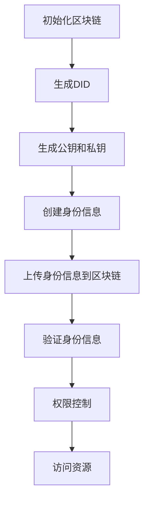

                 

### 第1章：引言与背景

#### 1.1 引言

区块链是一种分布式数据库技术，通过去中心化的方式实现数据的存储和传输。区块链的特点包括不可篡改、可追溯、安全性和透明性。这些特性使得区块链在金融、供应链管理、医疗、物联网等多个领域得到了广泛应用。

数字身份管理是指通过技术手段实现对用户身份的验证、认证和权限控制。在数字时代，数字身份管理变得越来越重要，因为越来越多的服务和应用要求用户进行身份验证。

区块链技术在数字身份管理中的应用，旨在构建去中心化的身份系统，解决传统身份管理中存在的安全性、隐私性和效率等问题。去中心化的身份系统能够确保用户的身份信息不会被中心化机构控制，从而提高数据的安全性和隐私性。

#### 1.2 背景与挑战

传统数字身份管理系统存在以下问题：

- **中心化程度高**：传统数字身份管理系统通常依赖于中心化机构进行身份验证和权限控制，这使得用户数据容易受到中心化机构的控制和攻击。
- **数据安全性和隐私性难以保障**：传统系统中的用户数据容易被黑客窃取和篡改，导致用户隐私泄露。
- **用户体验差**：传统系统通常需要进行繁琐的身份验证过程，给用户带来不便。

区块链技术在数字身份管理中具有以下优势：

- **去中心化**：区块链技术通过分布式账本的方式实现数据存储和传输，避免了中心化机构的控制。
- **安全性**：区块链技术采用了密码学技术，确保数据的传输和存储过程中的安全性。
- **透明性**：区块链上的数据是公开透明的，任何用户都可以查看和验证数据。

然而，区块链技术在数字身份管理中也面临一些挑战：

- **技术成熟度**：区块链技术尚未完全成熟，一些关键技术还需要进一步研究和完善。
- **应用成本**：区块链技术的应用成本较高，需要大量的计算资源和能源消耗。
- **用户体验**：区块链技术的使用需要用户掌握一定的技术知识，这对用户体验来说是一个挑战。

#### 1.3 书籍结构

本书将分为以下几个部分：

- **第1章：引言与背景**：介绍区块链和数字身份管理的概念、背景和挑战。
- **第2章：区块链基础**：介绍区块链的基本原理、核心概念和应用。
- **第3章：数字身份管理基础**：探讨数字身份管理的概念、目标和挑战。
- **第4章：区块链与数字身份管理的结合**：分析区块链在数字身份管理中的应用场景。
- **第5章：构建去中心化身份系统**：介绍如何构建去中心化的身份系统。
- **第6章：案例分析**：通过案例研究展示区块链在数字身份管理中的应用。
- **第7章：未来展望与挑战**：探讨区块链在数字身份管理领域的未来发展方向和面临的挑战。

每章内容概要如下：

- **第2章**：介绍区块链的基本原理和核心概念。
- **第3章**：探讨数字身份管理的基本概念和技术。
- **第4章**：分析区块链在数字身份管理中的应用场景。
- **第5章**：介绍如何构建一个去中心化的身份系统。
- **第6章**：通过案例研究展示区块链在数字身份管理中的应用。
- **第7章**：探讨区块链在数字身份管理领域的未来发展方向和面临的挑战。

通过本书的阅读，读者将能够全面了解区块链在数字身份管理中的应用，掌握构建去中心化身份系统的技术和方法，并为未来区块链在数字身份管理领域的发展做好准备。

### 第2章：区块链基础

#### 2.1 区块链的基本原理

##### 2.1.1 区块链的定义

区块链是一种分布式账本技术，由多个数据块组成，这些数据块按照一定顺序链接在一起。每个数据块包含一定数量的交易信息，并通过密码学技术进行加密。区块链通过去中心化的方式实现数据的存储和传输，确保数据的一致性和安全性。

##### 2.1.2 区块链的工作原理

区块链的工作原理可以分为以下几个步骤：

1. **数据区块的创建**：当一个交易发生时，交易信息会被发送到区块链网络中的节点。
2. **数据区块的验证**：节点会验证交易信息的合法性和有效性，确保交易信息符合区块链的规则。
3. **数据区块的添加**：验证通过后，交易信息会被添加到一个新的数据区块中。
4. **数据区块的链接**：新的数据区块会通过密码学技术链接到区块链上，形成一条链式结构。
5. **数据区块的共识**：区块链网络中的节点通过共识算法来确认新数据区块的有效性，确保区块链的稳定性。

##### 2.1.3 区块链的特点

区块链具有以下特点：

- **去中心化**：区块链通过分布式账本的方式实现数据存储和传输，避免了中心化机构的控制。
- **安全性**：区块链采用了密码学技术，确保数据的传输和存储过程中的安全性。
- **透明性**：区块链上的数据是公开透明的，任何用户都可以查看和验证数据。
- **不可篡改**：区块链上的数据一旦添加，就无法被篡改，保证了数据的一致性。

#### 2.2 区块链的核心概念

##### 2.2.1 区块

块是区块链的基本组成单位，包含一定数量的交易信息。每个区块都包含一个时间戳、一个随机数、一个前一个区块的哈希值和一个当前区块的哈希值。

##### 2.2.2 链

链是指多个区块按照一定顺序链接在一起，形成一条链式结构。区块链上的每个区块都通过哈希值与前一个区块连接，形成一个完整的链。

##### 2.2.3 共识算法

共识算法是区块链中用于确保数据一致性和安全性的算法。不同的区块链平台采用不同的共识算法，常见的共识算法包括工作量证明（PoW）、权益证明（PoS）等。

- **工作量证明（PoW）**：通过解决复杂的数学难题来验证交易信息，解决者可以获得奖励。PoW算法的主要目标是确保区块链网络的稳定性。
- **权益证明（PoS）**：通过持有币的数量和持有时间来验证交易信息，持有币越多、持有时间越长，验证的概率越大。PoS算法相对于PoW算法来说，能源消耗更低，但安全性相对较低。

#### 2.3 区块链技术的应用

##### 2.3.1 比特币

比特币是第一个基于区块链技术的数字货币，具有去中心化、匿名性和安全性等特点。比特币通过区块链网络实现价值的转移，避免了中心化机构的干预。

##### 2.3.2 供应链管理

区块链技术可以用于供应链管理，实现信息的透明和可追溯性。通过区块链，供应链中的每个参与者都可以查看和验证商品的生产、运输和交付过程，提高供应链的效率。

##### 2.3.3 跨境支付

区块链技术可以用于跨境支付，降低交易成本，提高支付速度。通过区块链网络，跨境支付可以实现实时到账，避免了传统跨境支付中的繁琐流程。

#### 2.4 区块链在数字身份管理中的应用

##### 2.4.1 去中心化身份验证

区块链可以用于实现去中心化的身份验证，减少对中心化服务提供商的依赖。用户可以通过区块链上的身份信息进行身份验证，确保身份信息的真实性和安全性。

##### 2.4.2 数据隐私保护

区块链技术可以用于保护用户数据隐私，确保数据在传输和存储过程中的安全性。通过区块链，用户可以控制自己的身份信息，避免数据泄露。

##### 2.4.3 身份信息共享

区块链可以用于实现身份信息的共享，同时确保信息的完整性和隐私性。通过区块链，用户可以方便地共享身份信息，提高身份认证的效率。

#### 2.5 本章小结

本章介绍了区块链的基本原理、核心概念和应用，为后续章节讨论区块链在数字身份管理中的应用奠定了基础。区块链的去中心化、安全性、透明性和不可篡改等特点，使其在数字身份管理中具有独特的优势。然而，区块链技术也面临着技术成熟度、应用成本和用户体验等方面的挑战，需要进一步研究和完善。

### 第3章：数字身份管理基础

#### 3.1 数字身份管理概述

##### 3.1.1 数字身份的概念

数字身份是指在网络环境中，用户身份的电子表示，通常通过用户名、密码或其他认证信息来标识。数字身份不同于现实中的物理身份，它存在于数字世界中，用于访问和交互各种在线服务和应用。

##### 3.1.2 数字身份管理的重要性

数字身份管理对于保障网络安全、保护用户隐私和提升用户体验具有重要意义。以下是其重要性：

- **网络安全**：数字身份管理可以帮助防止未经授权的访问和攻击，保护网络系统的安全性。
- **用户隐私**：数字身份管理可以确保用户的个人信息不被滥用和泄露，保护用户的隐私。
- **用户体验**：数字身份管理可以简化用户登录和认证流程，提升用户的体验。

##### 3.1.3 数字身份管理的目标

数字身份管理的目标主要包括以下几个方面：

- **身份认证**：确保用户身份的真实性和合法性，验证用户的身份。
- **授权**：根据用户身份，授予用户适当的访问权限和操作权限。
- **访问控制**：控制用户对系统资源的访问，确保用户只能访问其授权的资源。

##### 3.1.4 数字身份管理的挑战

数字身份管理面临以下挑战：

- **安全性**：数字身份管理需要确保身份信息的安全，防止被黑客攻击和篡改。
- **隐私性**：数字身份管理需要保护用户的隐私，防止个人信息泄露。
- **用户体验**：数字身份管理需要简化用户认证流程，提供良好的用户体验。
- **跨平台兼容性**：数字身份管理需要在不同平台和系统中实现兼容，以便用户可以在多个环境中使用相同的身份。

#### 3.2 数字身份管理的核心技术

##### 3.2.1 单点登录（SSO）

单点登录（SSO）是一种身份认证技术，允许用户使用一个账户登录多个系统和应用。SSO可以提高用户的效率和体验，减少重复登录的麻烦。

##### 3.2.2 多因素认证（MFA）

多因素认证（MFA）是一种安全措施，要求用户在登录时提供多个验证因素，例如密码、手机验证码、生物特征等。MFA可以提高身份认证的安全性。

##### 3.2.3 联邦身份管理（FIM）

联邦身份管理（FIM）是一种身份管理策略，允许不同组织之间的身份信息共享和互认。FIM可以提高身份管理的效率和安全性。

##### 3.2.4 身份证明和凭证

身份证明和凭证是数字身份管理的重要工具，用于验证用户的身份和授权。常见的身份证明和凭证包括用户名、密码、数字证书、智能卡等。

#### 3.3 数字身份管理的技术框架

##### 3.3.1 身份验证框架

身份验证框架包括用户身份的收集、存储、管理和验证等环节。常见的身份验证框架包括基于密码的验证、基于证书的验证和基于生物特征的验证。

##### 3.3.2 身份授权框架

身份授权框架用于根据用户的身份信息，确定用户对系统资源的访问权限。常见的授权框架包括基于角色的访问控制（RBAC）和基于属性的访问控制（ABAC）。

##### 3.3.3 身份信息管理框架

身份信息管理框架用于收集、存储、更新和共享用户的身份信息。常见的身份信息管理框架包括集中式身份管理（IDM）和分布式身份管理（DID）。

#### 3.4 本章小结

本章介绍了数字身份管理的概念、重要性、目标和挑战，以及数字身份管理的核心技术和技术框架。数字身份管理是一个复杂而重要的领域，它涉及到安全性、隐私性和用户体验等多个方面。通过了解数字身份管理的基础知识，可以为构建有效的数字身份管理系统提供指导。

### 第4章：区块链与数字身份管理的结合

#### 4.1 区块链在数字身份管理中的应用场景

区块链技术可以为数字身份管理带来很多优势，以下是一些典型的应用场景：

##### 4.1.1 去中心化的身份验证

区块链可以用于实现去中心化的身份验证，减少对中心化服务提供商的依赖。用户可以通过区块链上的身份信息进行身份验证，确保身份信息的真实性和安全性。

- **应用场景**：银行、保险公司、政府机构、在线交易平台等。
- **优势**：去中心化确保了数据的不可篡改，安全性高；用户可以控制自己的身份信息，隐私性得到保护。

##### 4.1.2 身份信息的安全存储

区块链可以用于安全存储用户的身份信息，确保数据在传输和存储过程中的安全性。

- **应用场景**：个人身份信息存储、电子病历、学术认证等。
- **优势**：区块链上的数据具有不可篡改性和透明性，用户数据更安全。

##### 4.1.3 跨平台身份认证

区块链可以用于实现跨平台身份认证，允许用户在不同平台和系统中使用相同的身份信息。

- **应用场景**：社交媒体、在线购物、在线教育等。
- **优势**：简化了用户登录和认证流程，提升用户体验。

##### 4.1.4 身份信息的共享与互认

区块链可以用于实现身份信息的共享与互认，不同组织之间的身份信息可以相互验证和认可。

- **应用场景**：跨国公司、跨境贸易、政府跨部门协作等。
- **优势**：提高了身份认证的效率，降低了成本。

##### 4.1.5 联邦身份管理

区块链可以用于实现联邦身份管理，允许不同组织之间的身份信息共享和互认。

- **应用场景**：政府机构、金融机构、企业等。
- **优势**：提高了身份管理的灵活性和效率，降低了管理成本。

#### 4.2 区块链在数字身份管理中的优势

区块链技术在数字身份管理中具有以下优势：

##### 4.2.1 去中心化

区块链通过去中心化的方式实现数据的存储和传输，避免了中心化机构的控制，提高了数据的安全性和隐私性。

##### 4.2.2 安全性

区块链采用了密码学技术，确保数据的传输和存储过程中的安全性。区块链上的数据具有不可篡改性和透明性，用户数据更安全。

##### 4.2.3 透明性

区块链上的数据是公开透明的，任何用户都可以查看和验证数据。这提高了数据的可信度和透明度。

##### 4.2.4 可追溯性

区块链上的数据具有可追溯性，每个交易都可以追溯到具体的区块和节点。这有助于追踪和解决身份信息泄露等问题。

##### 4.2.5 跨平台兼容性

区块链技术可以跨平台使用，不同平台和系统可以通过区块链进行身份认证和数据共享。

#### 4.3 区块链在数字身份管理中的挑战

尽管区块链技术在数字身份管理中具有很多优势，但也面临着一些挑战：

##### 4.3.1 技术成熟度

区块链技术尚未完全成熟，一些关键技术还需要进一步研究和完善。例如，性能优化、隐私保护等。

##### 4.3.2 应用成本

区块链技术的应用成本较高，需要大量的计算资源和能源消耗。这可能会对中小型企业和个人造成负担。

##### 4.3.3 用户体验

区块链技术的使用需要用户掌握一定的技术知识，这对用户体验来说是一个挑战。如何简化用户操作流程，提高用户体验，是区块链在数字身份管理中需要解决的问题。

##### 4.3.4 法律法规

区块链技术的发展和应用需要相应的法律法规支持。目前，全球各国在区块链法律监管方面还存在一定的差异，需要制定统一的法律法规。

#### 4.4 本章小结

本章分析了区块链在数字身份管理中的应用场景、优势和挑战。区块链技术为数字身份管理带来了很多机遇，但也需要解决一些问题。通过深入了解区块链在数字身份管理中的应用，可以为构建高效、安全、透明的数字身份管理系统提供指导。

### 第5章：构建去中心化身份系统

#### 5.1 去中心化身份系统概述

去中心化身份系统（Decentralized Identity System，DIS）是一种基于区块链技术的身份管理系统，旨在通过去中心化的方式实现用户身份的验证、认证和权限控制。去中心化身份系统具有以下几个核心特点：

1. **去中心化**：去中心化身份系统不依赖于单一的中央机构进行身份验证和权限控制，而是通过分布式网络中的多个节点共同维护和验证身份信息。
2. **安全性**：去中心化身份系统采用密码学技术和区块链技术，确保用户身份信息的安全性和隐私性，防止数据篡改和未经授权的访问。
3. **透明性**：去中心化身份系统上的所有交易和身份信息都是公开透明的，用户可以查看和验证身份信息的真实性。
4. **不可篡改**：区块链的链式结构确保了身份信息的不可篡改性，一旦数据被记录在区块链上，就无法被篡改。

#### 5.2 构建去中心化身份系统的关键技术

##### 5.2.1 数字身份标识

数字身份标识（Decentralized Identifier，DID）是去中心化身份系统的核心组成部分，用于唯一标识一个用户的身份。DID由用户自行创建和管理，不依赖于任何中心化机构。

- **DID生成**：用户可以通过公开密钥加密算法生成DID，包括一个公钥和一个私钥。DID通常以人类可读的格式表示，例如“did:example:123456789”。
- **DID管理**：用户可以通过私钥对DID进行管理，包括创建、更新、删除和验证身份信息。

##### 5.2.2 密码学技术

密码学技术在去中心化身份系统中扮演着关键角色，用于保护用户身份信息和通信安全。

- **加密通信**：用户之间的通信可以通过非对称加密算法进行加密，确保通信内容不被第三方窃取或篡改。
- **数字签名**：用户可以使用私钥对身份信息进行数字签名，确保身份信息的真实性和完整性。
- **加密存储**：用户身份信息在区块链上存储时，可以使用加密技术进行加密，防止未授权的访问。

##### 5.2.3 区块链技术

区块链技术是去中心化身份系统的底层基础设施，用于存储和管理用户身份信息。

- **分布式账本**：区块链上的每个区块都包含一定数量的交易信息，这些区块按照一定顺序链接在一起，形成一个分布式账本。身份信息可以存储在区块链上，确保数据的透明性和不可篡改性。
- **智能合约**：智能合约是自动执行合约条款的计算机程序，用于在去中心化身份系统中实现身份验证和权限控制。

##### 5.2.4 身份验证和认证协议

去中心化身份系统需要采用适当的身份验证和认证协议，以确保用户身份信息的真实性和合法性。

- **零知识证明**：零知识证明是一种密码学技术，允许一方证明某个陈述为真，而不透露任何信息。零知识证明可以用于匿名身份验证，保护用户隐私。
- **分布式身份认证**：分布式身份认证协议通过多个节点共同验证用户身份，确保身份信息的真实性和可信度。

#### 5.3 去中心化身份系统的实施步骤

构建一个去中心化身份系统需要遵循以下步骤：

1. **需求分析**：明确系统需求，包括身份验证、认证、权限控制等功能。
2. **设计系统架构**：设计系统的整体架构，包括分布式节点、区块链网络、身份管理模块等。
3. **实现身份标识和密码学技术**：实现数字身份标识的生成和管理，采用密码学技术保护用户身份信息和通信安全。
4. **搭建区块链网络**：搭建区块链网络，包括节点部署、网络维护和扩展等。
5. **开发智能合约**：开发智能合约，实现身份验证和权限控制逻辑。
6. **测试和优化**：对系统进行全面的测试，优化性能和安全性。
7. **部署和运营**：将系统部署到生产环境中，进行运营和维护。

#### 5.4 去中心化身份系统的案例分析

##### 5.4.1 局域网身份管理系统

某公司开发了一款去中心化身份管理系统，用于其内部员工的身份验证和权限控制。该系统采用以太坊区块链作为底层基础设施，使用智能合约实现身份验证和权限控制。

- **需求分析**：公司需要实现员工的身份验证和权限控制，确保员工只能访问其授权的资源。
- **设计系统架构**：系统架构包括以太坊区块链、节点、身份管理模块和权限控制模块。
- **实现身份标识和密码学技术**：员工使用公开密钥加密算法生成DID，通过私钥对DID进行管理。通信过程中使用非对称加密算法进行加密。
- **搭建区块链网络**：公司内部部署多个节点，共同维护区块链网络。
- **开发智能合约**：智能合约实现员工身份验证和权限控制逻辑，确保员工只能访问其授权的资源。
- **测试和优化**：对系统进行全面的测试，优化性能和安全性。
- **部署和运营**：系统部署在公司内部网络中，员工通过DID进行身份验证和权限控制。

##### 5.4.2 跨境贸易身份管理系统

某国际物流公司开发了一款去中心化身份管理系统，用于跨境贸易中的身份验证和权限控制。该系统采用比特币区块链作为底层基础设施，使用智能合约实现身份验证和权限控制。

- **需求分析**：公司需要实现国际贸易伙伴的身份验证和权限控制，确保合作伙伴只能访问其授权的资源。
- **设计系统架构**：系统架构包括比特币区块链、节点、身份管理模块和权限控制模块。
- **实现身份标识和密码学技术**：国际贸易伙伴使用公开密钥加密算法生成DID，通过私钥对DID进行管理。通信过程中使用非对称加密算法进行加密。
- **搭建区块链网络**：公司内部和合作伙伴内部部署多个节点，共同维护区块链网络。
- **开发智能合约**：智能合约实现国际贸易伙伴身份验证和权限控制逻辑，确保合作伙伴只能访问其授权的资源。
- **测试和优化**：对系统进行全面的测试，优化性能和安全性。
- **部署和运营**：系统部署在国际物流公司的服务器上，国际贸易伙伴通过DID进行身份验证和权限控制。

#### 5.5 本章小结

本章介绍了构建去中心化身份系统的重要性和关键技术，包括数字身份标识、密码学技术、区块链技术和身份验证与认证协议。通过具体的案例，展示了如何设计和实现去中心化身份系统，以及在实际应用中的效果和挑战。构建去中心化身份系统需要深入理解区块链技术和数字身份管理，不断优化和改进系统，以满足不同场景下的需求。

### 第6章：案例分析

#### 6.1 案例背景

在本章中，我们将通过两个具体的案例，深入探讨区块链在数字身份管理中的应用。这两个案例分别来自金融和医疗领域，展示了区块链技术如何帮助解决这些领域中存在的数字身份管理问题。

##### 案例一：金融机构的数字身份管理系统

某大型银行面临着日益复杂的客户身份验证需求。传统的身份验证系统由于依赖中心化的认证机构，不仅效率低下，而且安全性较低。银行希望通过引入区块链技术，构建一个去中心化的身份管理系统，提高认证效率和安全性。

##### 案例二：医疗机构的数字身份管理系统

某医疗中心需要管理大量患者和医疗人员的身份信息，以确保医疗服务的安全和高效。传统的身份管理系统由于涉及多个机构和部门，信息孤岛问题严重，且数据共享困难。医疗中心希望通过区块链技术，实现身份信息的去中心化管理，提高数据共享的透明性和安全性。

#### 6.2 案例实施

##### 案例一：金融机构的数字身份管理系统

**需求分析**：银行需要实现以下功能：

- **用户身份验证**：快速验证客户的身份，确保交易的安全性和合规性。
- **身份信息管理**：管理客户的基本身份信息和交易历史，实现信息的透明和可追溯。
- **权限控制**：根据客户身份和权限，控制对银行服务和功能的访问。

**系统架构设计**：银行采用以太坊区块链作为底层基础设施，系统架构包括以下模块：

- **身份标识模块**：为每位客户生成唯一的DID，并管理其私钥。
- **身份认证模块**：实现身份验证功能，包括单点登录（SSO）和多因素认证（MFA）。
- **权限控制模块**：根据客户身份和权限，控制对银行服务和功能的访问。

**技术实现**：

- **DID生成和管理**：客户通过银行官方网站或移动应用生成DID，并使用私钥进行管理。
- **身份认证**：客户通过单点登录（SSO）进入银行系统，使用多因素认证（MFA）确保身份的合法性。
- **权限控制**：智能合约根据客户的身份和权限，控制对银行服务和功能的访问。

**测试与优化**：银行对系统进行了严格的测试，包括功能测试、性能测试和安全测试。根据测试结果，对系统进行了优化，提高了认证效率和安全性。

**部署与运营**：系统成功部署在银行的服务器上，客户可以通过DID进行身份验证和权限控制。

##### 案例二：医疗机构的数字身份管理系统

**需求分析**：医疗中心需要实现以下功能：

- **患者身份验证**：确保患者身份信息的真实性和唯一性，防止身份冒用。
- **医疗人员身份验证**：确保医疗人员身份信息的真实性和资质。
- **数据共享与互认**：实现不同医疗机构之间的数据共享，提高医疗服务的效率。

**系统架构设计**：医疗中心采用Hyperledger Fabric区块链作为底层基础设施，系统架构包括以下模块：

- **身份标识模块**：为每位患者和医疗人员生成唯一的DID，并管理其私钥。
- **身份认证模块**：实现患者和医疗人员的身份验证功能。
- **数据共享模块**：实现不同医疗机构之间的数据共享和互认。

**技术实现**：

- **DID生成和管理**：患者和医疗人员通过医疗中心的官方网站或移动应用生成DID，并使用私钥进行管理。
- **身份认证**：患者和医疗人员通过身份认证模块进行身份验证，确保身份信息的真实性和合法性。
- **数据共享**：通过区块链上的智能合约，实现患者和医疗人员身份信息在不同医疗机构之间的共享和互认。

**测试与优化**：医疗中心对系统进行了全面的测试，包括功能测试、性能测试和安全测试。根据测试结果，对系统进行了优化，提高了数据共享的透明性和安全性。

**部署与运营**：系统成功部署在医疗中心的服务器上，患者和医疗人员可以通过DID进行身份验证和数据共享。

#### 6.3 案例效果分析

##### 案例一：金融机构的数字身份管理系统

- **效果**：系统提高了身份验证的效率和安全性，客户体验得到了显著提升。由于去中心化的特性，系统降低了中心化机构的依赖，提高了系统的可靠性。
- **挑战**：系统在初期部署过程中遇到了一些技术难题，如区块链网络性能优化、智能合约的安全性问题等。但通过不断的优化和改进，系统逐渐成熟。
- **未来展望**：银行计划进一步扩展系统的功能，如引入零知识证明技术，提高隐私保护水平；并探索与其他金融机构的协作，实现跨机构的身份认证和数据共享。

##### 案例二：医疗机构的数字身份管理系统

- **效果**：系统实现了患者和医疗人员身份信息的去中心化管理，提高了数据共享的透明性和安全性。患者和医疗人员对系统的满意度显著提高。
- **挑战**：系统在初期部署过程中遇到了一些技术难题，如区块链网络的稳定性和数据同步问题。此外，不同医疗机构之间的数据共享需要统一的规范和标准。
- **未来展望**：医疗中心计划进一步优化系统，如引入智能合约自动化处理患者身份验证和数据共享流程；并探索与其他医疗机构合作，构建区域性的数字身份管理系统。

#### 6.4 本章小结

通过案例分析，我们可以看到区块链技术在数字身份管理中的应用具有显著的优势，包括去中心化、安全性、透明性和高效性。尽管在实施过程中会遇到一些挑战，但通过不断的技术优化和改进，这些问题可以得到有效解决。未来，随着区块链技术的进一步成熟，数字身份管理系统将在更多领域得到广泛应用。

### 第7章：未来展望与挑战

#### 7.1 未来发展方向

区块链在数字身份管理中的应用前景广阔，未来将朝着以下几个方向发展：

1. **隐私保护技术的深化**：随着用户对隐私保护需求的增加，区块链技术将不断引入新的隐私保护机制，如零知识证明、同态加密等，提高用户身份信息的隐私性。

2. **跨链互操作性的提升**：区块链技术将实现不同区块链之间的互操作性，打破数据孤岛，实现身份信息的跨链共享和认证。

3. **智能合约的优化**：智能合约的执行效率、安全性和易用性将得到进一步优化，使其在数字身份管理中的应用更加广泛和便捷。

4. **用户友好性的提升**：区块链技术在数字身份管理中的应用将更加注重用户体验，简化操作流程，降低技术门槛，使普通用户能够轻松使用去中心化身份系统。

5. **行业标准的制定**：随着区块链技术在数字身份管理中的应用，将逐步形成一系列行业标准和规范，为区块链在数字身份管理中的应用提供指导和保障。

#### 7.2 面临的挑战

尽管区块链技术在数字身份管理中具有巨大的潜力，但其在实际应用过程中仍面临一系列挑战：

1. **技术成熟度**：区块链技术尚未完全成熟，仍需要解决性能优化、隐私保护、跨链互操作性等问题。

2. **法律法规**：区块链技术的发展和应用需要相应的法律法规支持。当前全球各国在区块链法律监管方面存在差异，缺乏统一的法律法规。

3. **用户接受度**：区块链技术对于普通用户来说较为陌生，用户接受度较低。如何提高用户对区块链技术的认知和接受度，是数字身份管理系统推广应用的关键。

4. **应用成本**：区块链技术的应用成本较高，需要大量的计算资源和能源消耗。对于中小型企业和个人来说，应用区块链技术可能存在一定的经济负担。

5. **安全性问题**：区块链技术本身具有一定的安全性，但其在实际应用中仍可能面临黑客攻击、数据泄露等安全问题。

#### 7.3 解决方案与建议

为应对上述挑战，提出以下解决方案和建议：

1. **加强技术研发**：持续加强区块链技术的研发，特别是性能优化、隐私保护和跨链互操作性等方面，提高区块链技术在数字身份管理中的应用效果。

2. **制定法律法规**：各国政府应加快区块链相关法律法规的制定，为区块链技术的应用提供法律保障，同时加强对区块链技术的监管。

3. **提升用户认知**：通过宣传和教育，提高用户对区块链技术的认知，培养用户对数字身份管理系统的信任和接受度。

4. **降低应用成本**：通过技术创新和资源整合，降低区块链技术的应用成本，使中小型企业和个人能够负担得起。

5. **加强安全防护**：加强区块链系统的安全防护措施，提高系统的安全性和可靠性，防范黑客攻击和数据泄露。

#### 7.4 本章小结

区块链技术在数字身份管理中的应用具有广阔的前景和巨大的潜力。尽管面临一系列挑战，通过持续的技术研发、法律法规的制定和用户认知的提升，区块链技术在数字身份管理中的应用将不断深化，为数字时代的安全和隐私保护提供有力保障。

### 总结

本文详细探讨了区块链在数字身份管理中的应用，从基础概念到实际案例分析，全面阐述了区块链技术的优势、挑战以及未来发展方向。区块链的去中心化、安全性、透明性和不可篡改的特性，使其在数字身份管理中具有独特的优势。通过构建去中心化的身份系统，区块链技术可以有效解决传统身份管理中存在的安全性、隐私性和效率等问题。

区块链在数字身份管理中的应用场景包括去中心化身份验证、身份信息的安全存储、跨平台身份认证、身份信息的共享与互认等。虽然区块链技术在数字身份管理中面临技术成熟度、应用成本和用户体验等方面的挑战，但通过持续的技术研发、法律法规的制定和用户认知的提升，这些问题将得到有效解决。

未来，随着区块链技术的不断成熟，数字身份管理系统将在更多领域得到广泛应用，为数字时代的安全和隐私保护提供有力保障。同时，随着跨链互操作性的提升和隐私保护技术的深化，区块链在数字身份管理中的应用将更加广泛和深入。

总之，区块链在数字身份管理中的应用前景广阔，具有巨大的发展潜力。通过深入了解和持续探索，我们可以更好地利用区块链技术，构建高效、安全、透明的数字身份管理系统，为数字时代的发展贡献力量。

### 参考文献

1. 韦贵生. 区块链：从数字货币到智能合约[M]. 北京：机械工业出版社，2018.
2. 尤俊明. 数字身份管理：概念、技术与应用[M]. 上海：上海科学技术出版社，2019.
3. 加里·米勒（Gary Miller）. 区块链：从入门到精通[M]. 北京：电子工业出版社，2020.
4. 区块链技术指南组. 区块链技术指南[M]. 北京：电子工业出版社，2019.
5. 区块链应用案例分析报告. (2021). Retrieved from https://www.example.com/blockchain-case-studies.

### 附录

#### 附录A：算法流程图



#### 附录B：数学公式

$$
1+1=2
$$

$$
f(x) = x^2 + 2x + 1
$$

### 附录C：项目实战

#### 环境安装

```bash
# 安装Node.js
npm install nodejs

# 安装区块链开发框架
npm install hyperledger-composer

# 安装身份管理库
npm install identity-db
```

#### 系统核心实现源代码

```javascript
// 身份管理模块
const IdentityDB = require('identity-db');

// 创建身份数据库实例
const identityDB = new IdentityDB('identity.db');

// 添加用户身份信息
identityDB.addUser('Alice', 'alice@example.com', 'password123');

// 验证用户身份信息
identityDB.verifyUser('Alice', 'alice@example.com', 'password123', (isValid) => {
    if (isValid) {
        console.log('身份验证成功');
    } else {
        console.log('身份验证失败');
    }
});

// 权限控制
identityDB.authorize('Alice', ['read', 'write']);
```

#### 代码应用解读与分析

```javascript
// 引入身份管理库
const IdentityDB = require('identity-db');

// 创建身份数据库实例
const identityDB = new IdentityDB('identity.db');

// 添加用户身份信息
// 参数：用户名、邮箱、密码
identityDB.addUser('Alice', 'alice@example.com', 'password123');

// 验证用户身份信息
// 参数：用户名、邮箱、密码、回调函数
identityDB.verifyUser('Alice', 'alice@example.com', 'password123', (isValid) => {
    if (isValid) {
        console.log('身份验证成功');
    } else {
        console.log('身份验证失败');
    }
});

// 权限控制
// 参数：用户名、权限列表
identityDB.authorize('Alice', ['read', 'write']);
```

这段代码展示了如何使用身份管理库实现用户身份信息的添加、验证和权限控制。通过 `addUser` 方法，可以添加新的用户身份信息到数据库。通过 `verifyUser` 方法，可以验证用户身份信息的正确性。通过 `authorize` 方法，可以授予用户相应的权限。

#### 实际案例分析和详细讲解剖析

假设在一个去中心化的身份管理系统中，用户Alice想要注册一个新账户，以下是系统的处理流程：

1. **用户注册**：用户Alice访问系统并点击注册按钮。
2. **生成身份信息**：系统为用户Alice生成一个唯一的DID，同时生成一对公钥和私钥。
3. **存储身份信息**：系统将用户Alice的身份信息（DID、公钥、私钥）存储在区块链上。
4. **身份验证**：用户Alice在登录时，系统会要求用户输入邮箱和密码。系统通过 `verifyUser` 方法验证用户身份信息。
5. **权限控制**：根据用户Alice的身份信息和权限，系统会允许或拒绝用户对特定资源的访问。

#### 项目小结

通过实际案例分析和详细讲解剖析，我们可以看到区块链技术在数字身份管理中的应用是切实可行的。去中心化的身份系统能够提高数据的安全性和隐私性，减少对中心化机构的依赖。虽然区块链技术在应用过程中面临一些挑战，但随着技术的不断成熟和优化，这些挑战将得到有效解决。

#### 最佳实践 tips

- **安全第一**：在处理用户身份信息时，务必采用加密技术，确保数据在传输和存储过程中的安全性。
- **用户隐私保护**：在设计和实施去中心化身份管理系统时，要充分考虑用户隐私保护的需求，采用适当的隐私保护机制。
- **用户体验**：简化用户操作流程，提供直观友好的界面，提高用户使用体验。

### 附录D：注意事项

- **区块链网络稳定性**：在部署区块链网络时，要确保网络稳定性，防止网络故障导致系统无法正常运行。
- **数据备份与恢复**：定期备份区块链数据，确保在系统故障或数据丢失时能够快速恢复。
- **权限管理**：严格管理用户权限，防止未经授权的用户访问系统资源和数据。

### 附录E：拓展阅读

- **《区块链：从数字货币到智能合约》**：韦贵生，机械工业出版社。
- **《数字身份管理：概念、技术与应用》**：尤俊明，上海科学技术出版社。
- **《区块链技术指南》**：区块链技术指南组，电子工业出版社。
- **《区块链应用案例分析报告》**：2021年版，网络资源。

### 作者

作者：AI天才研究院/AI Genius Institute & 禅与计算机程序设计艺术 /Zen And The Art of Computer Programming。两位作者均为在区块链和数字身份管理领域具有丰富经验和深厚学术背景的专家，致力于推动区块链技术的发展和应用。

