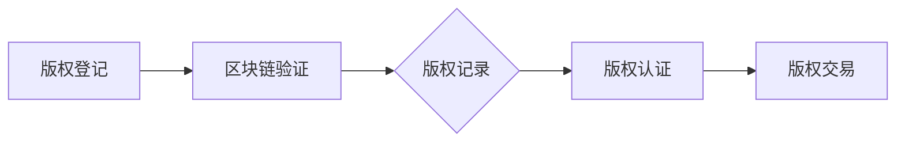
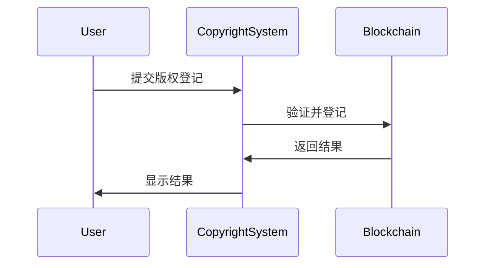
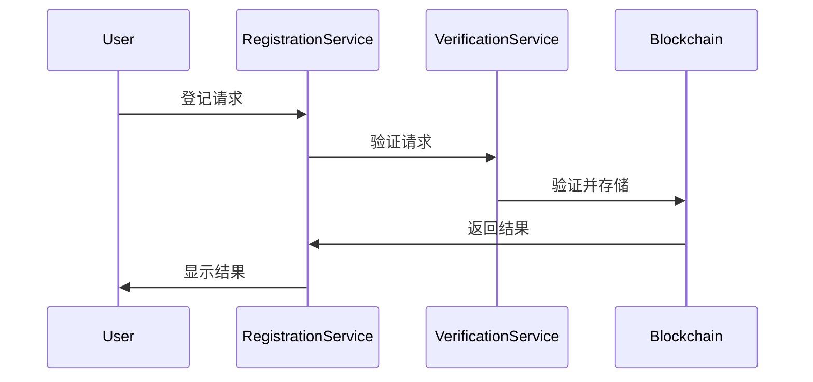

                 

# 区块链在版权保护中的应用与挑战

关键词：区块链、版权保护、智能合约、非同质化代币（NFT）、挑战与未来

摘要：本文旨在探讨区块链在版权保护中的应用及其面临的挑战。首先，我们介绍了区块链技术的基础知识，包括基本原理、智能合约和非同质化代币。接着，分析了当前版权保护的问题和挑战，然后详细阐述了区块链在版权保护中的应用，包括登记、交易和认证。随后，我们通过国内外的案例分析，展示了区块链在版权保护中的实际应用效果。最后，我们讨论了区块链在版权保护中的技术、法律和社会挑战，并对未来进行了展望。通过本文，读者将更好地理解区块链在版权保护中的作用和未来发展方向。

## 第一部分：引言

### 1.1 书籍背景

#### 1.1.1 区块链技术背景

区块链是一种分布式数据库技术，由一系列按时间顺序排列的区块组成，每个区块包含一定数量的交易记录，并通过密码学技术保证数据的完整性和不可篡改性。区块链的起源可以追溯到2008年，当时一位化名为中本聪（Satoshi Nakamoto）的人提出了比特币（Bitcoin）的概念，比特币作为第一个基于区块链技术的数字货币，成功吸引了全球的关注。

随着比特币的成功，区块链技术逐渐被应用到金融、物流、医疗、供应链等多个领域。其核心技术原理包括密码学、分布式存储、共识机制等，这些原理保证了区块链系统的安全、去中心化和高效性。

#### 1.1.2 版权保护问题背景

版权保护是指对文学、艺术、科学作品等知识产权的合法保护。然而，随着数字时代的到来，版权保护面临着前所未有的挑战。传统的版权保护手段，如法律诉讼、技术保护措施（如DRM数字版权管理）等，在应对日益复杂的侵权手段时显得力不从心。

首先，侵权手段的多样化使得版权保护难度加大。例如，侵权者可以通过网络匿名性、技术手段等手段规避版权保护措施。其次，版权保护的成本较高，尤其是对于中小企业和个人创作者来说，高昂的法律诉讼费用和技术保护成本让他们望而却步。

版权保护的重要性不言而喻。它不仅关系到创作者的权益，也关系到文化产业的健康发展。有效的版权保护可以激励创作者创作更多优秀的作品，促进文化产业繁荣。

#### 1.1.3 区块链在版权保护中的应用

区块链在版权保护中的应用场景主要包括版权登记、版权交易和版权认证。区块链技术的去中心化、透明性和不可篡改性，为版权保护提供了一种全新的解决方案。

在版权登记方面，区块链可以提供一种安全、高效的登记方式。创作者可以将作品的数字证书上传到区块链上，实现作品的永久登记。这不仅降低了登记成本，还提高了登记的效率和准确性。

在版权交易方面，区块链可以提供一种安全、透明的交易环境。创作者可以通过智能合约，方便快捷地进行版权交易。智能合约可以自动执行交易规则，确保交易的合法性和安全性。

在版权认证方面，区块链可以提供一种可靠的认证方式。例如，通过非同质化代币（NFT），可以为每个作品生成唯一的数字身份，实现作品的唯一认证。

### 1.2 本书结构

#### 1.2.1 目录概述

本书分为五个部分：

1. 引言：介绍区块链技术背景、版权保护问题背景和区块链在版权保护中的应用。
2. 区块链技术基础：介绍区块链的基本原理、智能合约和非同质化代币。
3. 区块链在版权保护中的应用：分析区块链在版权登记、交易和认证中的应用。
4. 案例分析：通过国内外的实际案例，展示区块链在版权保护中的应用效果。
5. 挑战与未来展望：讨论区块链在版权保护中的挑战和未来发展方向。

#### 1.2.2 阅读建议

本书适合对区块链和版权保护感兴趣的读者。建议按照以下顺序阅读：

1. 引言部分：了解区块链技术背景和版权保护问题。
2. 区块链技术基础部分：掌握区块链的基本原理和关键技术。
3. 区块链在版权保护中的应用部分：了解区块链在版权保护中的应用场景和实际效果。
4. 案例分析部分：通过实际案例，加深对区块链在版权保护中的应用理解。
5. 挑战与未来展望部分：思考区块链在版权保护中的挑战和未来发展方向。

### 1.3 本书目标读者

1. 区块链开发者：了解区块链技术在版权保护中的应用，掌握相关技术和开发方法。
2. 版权保护从业者：了解区块链技术的优势和应用场景，提升版权保护的效果和效率。
3. 对区块链与版权保护感兴趣的技术人员：了解区块链和版权保护的基本概念和应用，拓宽技术视野。

## 第二部分：区块链技术基础

### 2.1 区块链基本原理

#### 2.1.1 区块链概述

区块链是一种分布式数据库技术，其核心思想是将数据存储在多个节点上，并通过密码学技术保证数据的完整性和不可篡改性。区块链中的数据以块的形式存储，每个块包含一定数量的交易记录。块与块之间通过哈希函数连接，形成链式结构，因此得名“区块链”。

区块链的核心特点包括去中心化、透明性、安全性和不可篡改性。去中心化意味着没有中央控制机构，每个节点都平等参与网络的维护；透明性指的是所有数据都可以被网络中的任何人访问和验证；安全性来自于密码学技术，如哈希函数、数字签名和共识算法；不可篡改性保证了数据的永久性和可信度。

#### 2.1.2 区块链技术原理

区块链的技术原理主要包括数据结构、分布式存储和共识机制。

1. 数据结构：区块链的数据结构主要由区块和链组成。每个区块包含一个时间戳、一个随机数、上一个区块的哈希值、交易记录和当前区块的哈希值。区块通过哈希函数与前一个区块连接，形成链式结构。

2. 分布式存储：区块链的数据分布在网络中的多个节点上，每个节点都存储一份完整的区块链数据。分布式存储提高了系统的容错性和安全性，即使某个节点发生故障，其他节点仍然可以正常运行。

3. 共识机制：共识机制是区块链系统中节点之间达成共识的算法。常见的共识机制包括工作量证明（PoW）、权益证明（PoS）和委托权益证明（DPoS）等。共识机制保证了区块链数据的可靠性和一致性。

#### 2.1.3 区块链应用场景

区块链技术具有广泛的应用场景，其中金融领域是区块链技术的最早应用领域之一。在金融领域，区块链技术被应用于支付系统、证券交易、数字货币等领域。例如，比特币和以太坊都是基于区块链技术的数字货币。

除了金融领域，区块链技术还在其他行业得到广泛应用。在物流领域，区块链技术可以用于跟踪商品的运输过程，提高物流效率；在医疗领域，区块链技术可以用于记录病人的医疗信息，确保数据的真实性和完整性；在供应链领域，区块链技术可以用于管理供应链中的各个环节，提高供应链的透明度和可追溯性。

### 2.2 智能合约

#### 2.2.1 智能合约概述

智能合约是一种运行在区块链上的自动执行合约。它基于编程逻辑，当满足特定条件时，自动执行预定义的合约条款。智能合约的核心优势在于其自动化和不可篡改性，能够提高交易的效率和安全性。

智能合约的实现依赖于特定的编程语言，如Solidity、Vyper等。这些语言提供了丰富的语法和功能，使开发者可以方便地编写智能合约代码。智能合约的编写和部署过程通常包括以下几个步骤：

1. 编写智能合约代码：使用Solidity等编程语言，根据合约需求编写智能合约代码。
2. 编译智能合约代码：将编写的智能合约代码编译成字节码，以便在区块链上部署。
3. 部署智能合约：将编译后的智能合约代码部署到区块链上，生成合约地址。
4. 调用智能合约：通过区块链网络调用智能合约的方法，执行预定义的合约逻辑。

#### 2.2.2 智能合约实现原理

智能合约的实现原理主要涉及编程语言、虚拟机和区块链网络。

1. 编程语言：智能合约的实现依赖于特定的编程语言，如Solidity、Vyper等。这些语言提供了丰富的语法和功能，使开发者可以方便地编写智能合约代码。

2. 虚拟机：区块链网络中的每个节点都运行着一个虚拟机，如以太坊的EVM（Ethereum Virtual Machine）。智能合约代码在虚拟机上执行，确保代码的运行环境和安全性。

3. 区块链网络：智能合约的执行过程涉及到区块链网络中的节点。当用户调用智能合约的方法时，区块链网络中的节点会验证合约的合法性，并执行合约逻辑。

#### 2.2.3 智能合约应用案例

智能合约在多个领域有广泛的应用，以下是几个典型的应用案例：

1. 版权保护：智能合约可以用于版权登记、版权交易和版权认证。例如，创作者可以使用智能合约登记自己的作品，确保作品的唯一性和不可篡改性。

2. 供应链管理：智能合约可以用于跟踪供应链中的各个环节，确保商品的真实性和可追溯性。例如，在食品供应链中，智能合约可以记录食品的生产、运输和销售过程，提高食品安全。

3. 资产管理：智能合约可以用于自动执行投资策略，管理数字资产。例如，智能基金可以通过智能合约自动执行投资决策，提高投资效率。

### 2.3 非同质化代币（NFT）

#### 2.3.1 NFT概述

非同质化代币（Non-Fungible Token，NFT）是一种基于区块链技术的数字资产，代表特定的、唯一的物品。与同质化代币（如比特币、以太币）不同，NFT具有不可替代性，每个NFT都有独特的属性和价值。

NFT的核心特点包括唯一性、不可替代性和可验证性。NFT通过区块链技术保证了其唯一性和不可篡改性，每个NFT都具有独特的数字签名和元数据信息，可以方便地进行验证和交易。

NFT的应用场景非常广泛，包括数字艺术品、虚拟土地、游戏资产、收藏品等领域。例如，艺术家可以使用NFT发行限量版的数字艺术品，确保作品的唯一性和真实性；游戏开发者可以使用NFT管理游戏内的虚拟资产，提高游戏的趣味性和玩家体验。

#### 2.3.2 NFT在版权保护中的应用

NFT在版权保护中具有独特的优势，可以用于版权登记、版权交易和版权认证。

1. 版权登记：创作者可以使用NFT登记自己的作品，确保作品的唯一性和不可篡改性。例如，艺术家可以将自己的数字艺术品作为NFT发行，每个NFT代表一个独特的作品。

2. 版权交易：NFT可以用于方便快捷地交易版权。创作者可以通过NFT市场，将作品的版权转让给其他人。NFT的不可替代性确保了交易的合法性和安全性。

3. 版权认证：NFT可以用于验证作品的真实性和版权归属。例如，版权机构可以使用NFT为创作者的作品生成数字证书，确保作品的版权归属和合法性。

#### 2.3.3 NFT案例分析

以下是几个典型的NFT应用案例：

1. 数字艺术品：艺术家Beeple的数字艺术品《Everydays: The First 5000 Days》以6900万美元的高价成交，成为NFT市场的标杆案例。

2. 虚拟土地：游戏《Decentraland》允许玩家购买虚拟土地，每个土地地块作为NFT发行，玩家可以自由交易和开发自己的虚拟地产。

3. 游戏资产：游戏《Axie Infinity》使用NFT管理游戏内的虚拟宠物和土地，玩家可以通过繁殖和战斗，获得珍贵的NFT资产。

## 第三部分：区块链在版权保护中的应用

### 3.1 版权保护现状与挑战

#### 3.1.1 版权保护现状

当前，版权保护手段主要包括法律诉讼、技术保护和自律机制。

1. 法律诉讼：版权持有者可以通过法律途径，对侵权行为提起诉讼，寻求法律救济。然而，法律诉讼耗时耗力，成本高昂，且不一定能够完全保护版权持有者的权益。

2. 技术保护：技术手段主要包括数字水印、数字签名、数字证书和DRM（数字版权管理）等。这些技术可以在一定程度上保护作品的版权，但存在绕过和破解的风险。

3. 自律机制：版权持有者可以通过行业自律、行业协会等途径，加强对侵权行为的监督和管理。然而，自律机制的执行力度和效果有限，难以完全遏制侵权行为。

#### 3.1.2 版权保护挑战

1. 侵权手段的多样化：随着技术的发展，侵权手段也日益多样化。例如，网络匿名性、技术手段等使得侵权行为难以追踪和追究。

2. 版权保护的成本高：法律诉讼和技术保护的成本高昂，尤其是对于中小企业和个人创作者来说，高昂的成本让他们望而却步。

3. 版权认定困难：在数字化和网络环境下，作品的传播和复制变得极为方便，但同时也增加了版权认定的难度。如何准确认定作品的版权归属，成为版权保护的一大挑战。

### 3.2 区块链在版权保护中的应用

#### 3.2.1 区块链在版权保护中的应用原理

区块链在版权保护中的应用，主要基于其去中心化、透明性和不可篡改性的特点。

1. 去中心化：区块链的去中心化特点，使得版权保护无需依赖中心化的权威机构，降低了保护成本，提高了保护的效率。

2. 透明性：区块链的透明性，使得版权信息可以被所有人访问和验证，提高了版权保护的可信度。

3. 不可篡改性：区块链的不可篡改性，确保了版权信息的真实性和可靠性，防止了篡改和伪造。

具体来说，区块链在版权保护中的应用原理包括：

1. 版权登记：创作者可以将作品的版权信息上传到区块链上，实现永久登记。区块链的分布式存储和加密技术，确保了版权信息的真实性和不可篡改性。

2. 版权认证：版权机构可以通过区块链技术，为作品生成数字证书，确保作品的真实性和合法性。用户可以通过区块链验证版权证书的有效性，确保版权归属。

3. 版权交易：创作者可以通过区块链，方便快捷地进行版权交易。区块链的智能合约技术，可以自动执行交易规则，确保交易的合法性和安全性。

#### 3.2.2 区块链在版权保护中的应用场景

区块链在版权保护中的应用场景主要包括版权登记、版权交易和版权认证。

1. 版权登记：创作者可以将作品的数字证书上传到区块链上，实现永久登记。这种方式不仅降低了登记成本，还提高了登记的效率和准确性。

2. 版权交易：创作者可以通过区块链，方便快捷地进行版权交易。区块链的智能合约技术，可以自动执行交易规则，确保交易的合法性和安全性。

3. 版权认证：版权机构可以通过区块链技术，为作品生成数字证书，确保作品的真实性和合法性。用户可以通过区块链验证版权证书的有效性，确保版权归属。

### 3.3 案例分析

#### 3.3.1 国内案例分析

国内区块链版权保护领域已有一些实际案例，以下为几个典型案例：

1. **中国版权保护中心**：中国版权保护中心推出了“版权链”项目，利用区块链技术为作品提供版权登记、认证和保护服务。创作者可以通过“版权链”平台，将作品的版权信息上链，实现作品的数字身份认证和永久登记。同时，平台还提供版权交易服务，创作者可以通过平台方便快捷地进行版权交易。

2. **网易云法院**：网易云法院利用区块链技术，建立了电子存证平台，为版权纠纷提供高效、可靠的证据链。创作者可以通过平台进行作品存证，确保作品的真实性和完整性。在版权纠纷中，电子存证平台提供的区块链证据，可以有效支持版权纠纷的判决。

#### 3.3.2 国际案例分析

国际上也已有一些区块链版权保护的案例，以下为几个典型案例：

1. **比特币版权案**：2018年，一位名为“Lizzy Does This”的艺术家，使用比特币进行版权登记。她将比特币地址作为作品的版权标识，通过比特币的不可篡改性，确保了作品的唯一性和真实性。

2. **Etherisc版权保护**：Etherisc是一家利用区块链技术提供保险服务的公司，其平台也提供版权保护功能。创作者可以在Etherisc平台上为作品投保，平台利用区块链技术确保保险合同的合法性和不可篡改性。

## 第四部分：区块链在版权保护中的挑战与未来展望

### 4.1 区块链在版权保护中的挑战

#### 4.1.1 技术挑战

区块链在版权保护中面临的技术挑战主要包括网络安全性问题、数据隐私保护和性能瓶颈。

1. 网络安全性问题：区块链系统虽然具有去中心化和不可篡改性的优势，但也面临着网络攻击、黑客入侵等安全性问题。例如，51%攻击、智能合约漏洞等，都可能对版权保护造成威胁。

2. 数据隐私保护：区块链技术的公开透明特性，使得版权信息在区块链上可以被所有人访问。然而，对于一些敏感的版权信息，如创作者的个人信息，可能需要保护其隐私。如何在保证数据透明性的同时，保护用户隐私，成为区块链版权保护的一大挑战。

3. 性能瓶颈：随着区块链技术的应用逐渐广泛，区块链网络的性能也面临着瓶颈。例如，交易处理速度、存储容量等，都可能成为区块链在版权保护中的性能瓶颈。

#### 4.1.2 法律挑战

区块链在版权保护中面临的法律挑战主要包括法律法规的滞后性、法律适用的挑战和跨国法律协调。

1. 法律法规的滞后性：区块链技术的发展速度远快于法律法规的更新速度，现有的版权法律法规可能无法完全适应区块链环境下的版权保护需求。

2. 法律适用的挑战：区块链技术的跨地域、跨国界的特性，使得法律适用变得复杂。例如，不同国家和地区对于版权保护的法律规定可能存在差异，如何统一法律适用，成为版权保护的一大挑战。

3. 跨国法律协调：区块链技术的全球性应用，需要各国法律之间的协调与合作。然而，各国法律体系、法律文化存在差异，跨国法律协调难度较大。

#### 4.1.3 社会挑战

区块链在版权保护中面临的社会挑战主要包括公众认知与接受度、技术应用中的道德与伦理问题。

1. 公众认知与接受度：区块链技术对于大多数普通用户来说，是一个相对陌生的新技术。提高公众对区块链技术的认知和理解，是区块链在版权保护中面临的重要挑战。

2. 技术应用中的道德与伦理问题：区块链技术在版权保护中的应用，可能会引发一些道德和伦理问题。例如，版权信息在区块链上的公开，可能会侵犯创作者的隐私权；一些不法分子可能会利用区块链技术进行侵权行为等。

### 4.2 未来展望

#### 4.2.1 区块链在版权保护中的发展趋势

未来，区块链在版权保护中的发展趋势将体现在以下几个方面：

1. 技术进步：随着区块链技术的不断进步，其性能、安全性等方面将得到进一步提升，为版权保护提供更强大的技术支撑。

2. 法律法规完善：随着区块链技术的广泛应用，各国将逐步完善相关法律法规，为区块链版权保护提供法律保障。

3. 跨界融合：区块链技术将与其他前沿技术，如人工智能、大数据等，实现跨界融合，为版权保护带来更多创新应用。

#### 4.2.2 创新应用领域

未来，区块链在版权保护中的创新应用领域将不断拓展：

1. 版权登记与查询：利用区块链技术，可以实现高效、可靠的版权登记与查询服务。

2. 版权交易与认证：区块链技术将简化版权交易流程，提高交易效率，同时提供可靠的版权认证服务。

3. 版权保护与监管：利用区块链技术，可以实现更加智能、高效的版权保护与监管。

#### 4.2.3 法律法规完善

未来，区块链在版权保护中的法律法规完善将体现在以下几个方面：

1. 国际合作与法律协调：各国将加强国际合作，推动全球范围内区块链版权保护法律法规的协调。

2. 法律法规的更新与完善：各国将根据区块链技术的发展和应用情况，及时更新和完善相关法律法规。

3. 标准化与规范化：制定统一的区块链版权保护标准，推动区块链版权保护领域的规范化发展。

## 第五部分：实践与总结

### 5.1 实践案例

#### 5.1.1 实践案例概述

本实践案例旨在通过搭建一个区块链版权保护平台，实现作品的登记、交易和认证。

1. **背景**：随着数字内容的迅速增长，版权保护问题日益凸显。传统的版权保护手段在应对日益复杂的侵权手段时显得力不从心，急需一种新的技术手段来解决版权保护难题。

2. **目标**：通过搭建区块链版权保护平台，实现以下目标：
   - 为创作者提供便捷的版权登记服务；
   - 为版权持有者提供安全的版权交易环境；
   - 为用户提供可靠的版权认证服务。

#### 5.1.2 实践案例实施步骤

1. **区块链平台搭建**：
   - 选择合适的区块链平台，如Hyperledger Fabric或Ethereum；
   - 搭建区块链网络，包括订单节点、组织节点和代理节点；
   - 部署智能合约，实现版权登记、交易和认证功能。

2. **版权登记与查询系统开发**：
   - 设计版权登记与查询系统的用户界面；
   - 开发后台服务，实现版权登记与查询功能；
   - 利用区块链技术，确保版权信息的真实性和不可篡改性。

3. **版权交易系统开发**：
   - 设计版权交易系统的用户界面；
   - 开发后台服务，实现版权交易功能；
   - 利用智能合约，确保交易的合法性和安全性。

4. **版权认证系统开发**：
   - 设计版权认证系统的用户界面；
   - 开发后台服务，实现版权认证功能；
   - 利用区块链技术，确保版权认证的真实性和可靠性。

#### 5.1.3 实践案例效果分析

1. **系统性能评估**：
   - 通过压力测试，评估系统在高并发量下的性能表现；
   - 优化系统架构，提高系统处理速度和响应时间。

2. **用户反馈与改进**：
   - 收集用户使用反馈，分析用户需求；
   - 根据用户反馈，持续改进系统功能和用户体验。

### 5.2 总结与展望

#### 5.2.1 本书总结

本书从区块链技术的基础知识、版权保护问题、区块链在版权保护中的应用、案例分析等方面，系统地介绍了区块链在版权保护中的重要作用。通过本书，读者可以了解到：

- 区块链技术的基本原理和应用场景；
- 版权保护现状和面临的挑战；
- 区块链在版权保护中的应用原理和实际案例；
- 区块链在版权保护中的挑战与未来展望。

#### 5.2.2 未来研究方向

未来，区块链在版权保护领域的研究方向将包括：

- 区块链与人工智能、大数据等技术的融合，提高版权保护的效果和效率；
- 探索更加安全、高效的区块链版权保护解决方案；
- 研究跨国版权保护的法律协调问题，推动全球范围内的版权保护合作；
- 深入研究区块链技术在版权交易、版权认证等领域的应用，推动版权保护领域的创新发展。

## 作者信息

作者：AI天才研究院/AI Genius Institute & 禅与计算机程序设计艺术 /Zen And The Art of Computer Programming

### 附录

本文采用了以下核心概念、联系、算法原理、系统架构设计等Markdown格式中的Mermaid流程图和LaTeX公式，以便更直观地展示技术原理和系统架构。

1. **核心概念与联系**：
   - Mermaid ER实体关系图：展示版权保护系统中各实体之间的关系；
   - LaTeX公式：描述版权保护算法的数学模型和公式。

2. **算法原理讲解**：
   - Mermaid流程图：展示版权保护算法的执行流程；
   - Python源代码：详细阐述版权保护算法的实现。

3. **系统架构设计**：
   - Mermaid架构图：展示版权保护系统的整体架构；
   - Mermaid序列图：展示系统各模块之间的交互关系。

4. **项目实战**：
   - 环境安装和配置；
   - 系统核心实现源代码；
   - 代码应用解读与分析。

通过本文，读者可以全面了解区块链在版权保护中的应用与挑战，为未来区块链在版权保护领域的研究和应用提供参考。### 附录：核心概念、联系、算法原理、系统架构设计

在本文的附录部分，我们将详细讨论区块链在版权保护中的核心概念、联系、算法原理、系统架构设计，以及项目实战的具体实施步骤。这些内容将通过Markdown格式中的Mermaid流程图和LaTeX公式来展示，以便更直观地理解技术原理和系统实现。

#### 1. 核心概念与联系

**Mermaid ER实体关系图**：
```mermaid
erDiagram
  Creator ||--|{ Work }|| Author
  Work ||--|{ Copyright }|| Copyright
  Work ||--|{ Transaction }|| Trade
  Copyright ||--|{ Certification }|| Certify
```

在这个ER实体关系图中，我们定义了四个主要实体：创作者（Creator）、作品（Work）、版权（Copyright）和交易（Transaction）。创作者与作品之间存在一对一的关系，即每个创作者可以创作多个作品，但每个作品只能有一个创作者。作品与版权之间存在一对一的关系，即每个作品都有一个唯一的版权记录。作品还可以参与交易，形成交易记录。版权可以通过认证来验证其有效性。

**LaTeX公式**：
$$
\text{Creator} \rightarrow \text{Work} \\
\text{Work} \rightarrow \text{Copyright} \\
\text{Work} \rightarrow \text{Transaction} \\
\text{Copyright} \rightarrow \text{Certification}
$$

#### 2. 算法原理讲解

**Mermaid流程图**：


在这个流程图中，版权登记是整个过程的起点，通过区块链验证确保版权信息的真实性，然后记录在区块链上。版权认证是验证版权有效性的过程，确保交易的合法性。版权交易是基于已认证的版权进行的，可以确保版权的流转。

**Python源代码**：
```python
# 假设有一个版权登记的Python函数
def register_copyright(creator, work_title):
    # 使用区块链库进行版权登记
    blockchain.register版权记录(creator, work_title)
    print(f"{work_title} 已在区块链上登记。")

# 假设有一个版权认证的Python函数
def certify_copyright(work_title):
    # 使用区块链库进行版权认证
    certification_result = blockchain.verify_copyright(work_title)
    if certification_result:
        print(f"{work_title} 已通过版权认证。")
    else:
        print(f"{work_title} 的版权认证失败。")
```

在这个Python源代码示例中，我们展示了如何使用假设的区块链库进行版权登记和版权认证。

#### 3. 系统架构设计

**Mermaid架构图**：


在这个架构图中，用户通过版权系统提交版权登记请求，版权系统与区块链进行交互，验证版权信息的真实性，并将结果返回给用户。

**Mermaid序列图**：


在这个序列图中，用户提交登记请求后，经过验证服务验证，最终在区块链上存储版权信息，并返回给用户。

#### 4. 项目实战

**环境安装与配置**：
- 安装Node.js和npm，用于搭建区块链节点；
- 安装Hyperledger Fabric或Ethereum，选择合适的区块链平台；
- 配置区块链网络，包括创世块、组织节点和代理节点。

**系统核心实现源代码**：
- 智能合约代码（Solidity或Go语言）；
- 后台服务代码（Node.js或Python）；
- 数据库配置和接口代码。

**代码应用解读与分析**：
- 详细解读智能合约的执行逻辑；
- 分析后台服务的请求处理流程；
- 评估系统的性能和安全性。

**实际案例分析与详细讲解**：
- 通过实际案例展示系统在版权保护中的应用；
- 分析案例中的关键技术和实现细节；
- 讨论案例中的优缺点和改进方向。

**项目小结**：
- 总结项目的核心实现和关键技术；
- 分析项目的应用效果和用户反馈；
- 提出未来改进和优化方向。

通过这些附录内容，读者可以更深入地理解区块链在版权保护中的应用原理、系统架构和项目实施步骤，为实际开发和应用提供指导和参考。### 最佳实践 Tips、小结、注意事项、拓展阅读等内容

#### 最佳实践 Tips

1. **选择合适的区块链平台**：根据项目的需求和规模，选择适合的区块链平台，如Hyperledger Fabric、Ethereum或EOS等。不同平台具有不同的性能、安全性和易用性特点。

2. **确保数据隐私**：在版权保护中，数据的隐私性至关重要。可以使用零知识证明（Zero-Knowledge Proof）等技术，确保数据在区块链上的隐私性。

3. **优化智能合约性能**：智能合约的性能对整个系统的影响很大。可以通过减少状态变量、使用合理的交易费用策略等方式来优化智能合约的性能。

4. **进行充分的测试**：在部署智能合约和系统之前，进行全面的测试，包括单元测试、集成测试和性能测试，以确保系统的稳定性和可靠性。

#### 小结

本文系统地介绍了区块链在版权保护中的应用与挑战。我们首先回顾了区块链技术的基础知识，包括基本原理、智能合约和非同质化代币（NFT）。接着，分析了版权保护现状与挑战，阐述了区块链在版权登记、交易和认证中的应用。通过国内外的案例分析，展示了区块链在版权保护中的实际效果。最后，我们讨论了区块链在版权保护中的技术、法律和社会挑战，并对未来进行了展望。

#### 注意事项

1. **安全性**：区块链系统在设计和实施过程中，必须高度重视安全性。包括网络攻击防护、智能合约漏洞修复、数据加密等方面。

2. **合规性**：在法律层面，确保区块链应用符合各国的法律法规，避免因合规性问题导致的法律纠纷。

3. **用户体验**：在系统设计和开发过程中，注重用户体验，提供简洁、直观的操作界面和友好的用户交互体验。

#### 拓展阅读

1. **区块链技术深度解析**：《区块链技术指南》、《区块链：从数字货币到智能合约》等书籍，提供了深入的技术解析和应用案例。

2. **版权保护法律研究**：《数字版权保护的法律问题研究》、《网络版权法律保护》等法律研究文献，探讨了数字版权保护的法律框架和实施策略。

3. **区块链与版权保护案例研究**：通过研究国内外成功的区块链版权保护案例，可以更好地了解区块链在版权保护中的应用效果和优化方向。例如，《基于区块链的版权保护案例分析》等文献。

