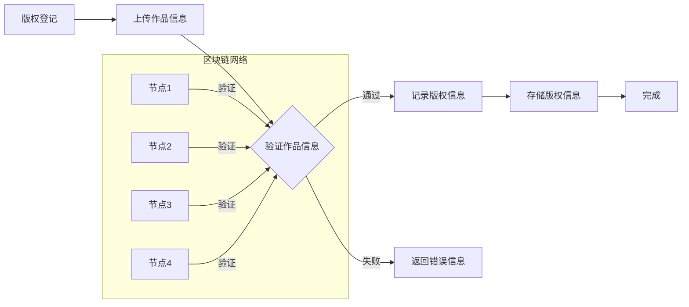
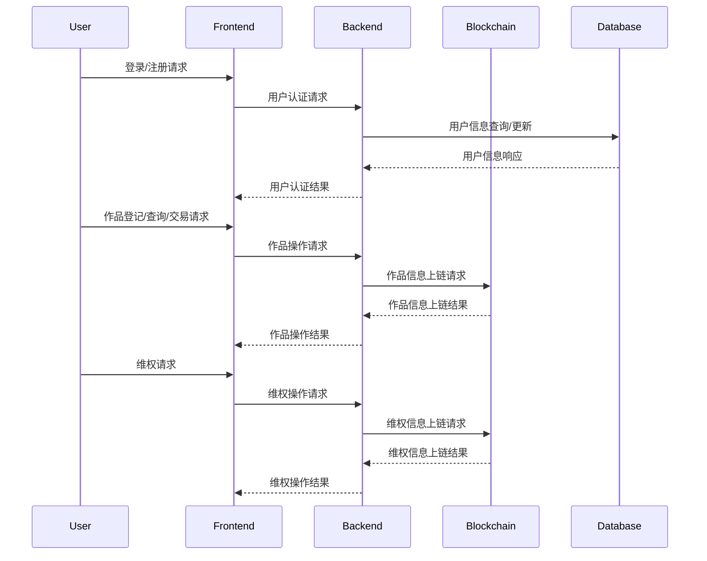

                 


### 1.1 区块链技术概述

#### 1.1.1 区块链的基本原理

区块链（Blockchain）是一种去中心化的分布式数据库技术，其基本原理基于密码学、共识算法和智能合约等核心技术。区块链的运作机制可以简单理解为一种“分布式账本”，它由多个区块（Block）组成，每个区块包含了若干笔交易记录（Transactions），这些区块通过加密算法和密码学技术相互链接，形成了一个不可篡改的链式结构。

区块链技术的核心原理包括：

- **去中心化**：区块链通过多个节点（Node）的参与，避免了单一中心化的风险，增强了系统的容错性和抗攻击能力。
- **共识算法**：节点之间通过共识算法（如工作量证明PoW、权益证明PoS等）达成一致，确保数据的真实性和一致性。
- **加密技术**：区块链使用公钥加密、私钥签名等技术来保障数据的完整性和安全性。
- **智能合约**：智能合约是一种自动执行的合同，它基于代码执行，实现了在区块链上的自动化交易和数据处理。

#### 1.1.2 区块链技术的发展历程

区块链技术起源于2008年，当时一位名为中本聪（Satoshi Nakamoto）的匿名人物发布了比特币（Bitcoin）的创世论文，首次提出了区块链技术的概念。比特币的诞生标志着区块链技术的诞生，并引发了全球范围内的关注和研究。

随后，区块链技术逐渐应用于其他领域，如金融、物流、医疗等。2014年后，区块链技术进入2.0时代，智能合约的引入使得区块链的应用范围进一步扩展。现在，区块链技术已经成为一个热门的研究领域，吸引了大量的研究人员和开发者。

#### 1.1.3 区块链技术的核心优势

区块链技术的核心优势包括：

- **安全性**：区块链使用加密技术和共识算法，保障了数据的安全性和完整性。
- **去中心化**：区块链去除了中心化的风险，增强了系统的抗攻击能力和容错性。
- **透明性**：区块链的数据存储在分布式节点上，实现了数据的透明性和可追溯性。
- **效率**：区块链通过智能合约实现了自动化交易和数据处理，提高了系统的运行效率。

### 1.2 知识产权保护概述

#### 1.2.1 知识产权的概念和种类

知识产权是指人们创造的智力成果所享有的权利，主要包括著作权、专利权、商标权和商业秘密等。

- **著作权**：包括文学、艺术、科学等领域作品的创作权、发表权、使用权等。
- **专利权**：指发明者对其发明享有的独占权，包括发明专利、实用新型专利和外观设计专利。
- **商标权**：指商标注册人对其注册商标享有的专用权。
- **商业秘密**：指企业在生产经营活动中创造、获得的并需要保密的信息。

#### 1.2.2 知识产权保护的重要性

知识产权保护对于创新和经济发展至关重要：

- **激励创新**：知识产权保护可以激励创新者投入更多的时间和资源进行创新活动。
- **促进技术转移**：知识产权保护可以促进技术的转移和商业化应用。
- **保护商业利益**：知识产权保护可以保护企业的商业利益，防止竞争对手的不当行为。
- **推动经济发展**：知识产权保护可以推动经济的发展，提升国家的科技实力和竞争力。

#### 1.2.3 现有知识产权保护机制的不足

尽管现有的知识产权保护机制已经取得了一定的成果，但仍存在一些不足之处：

- **成本高昂**：现有知识产权保护机制通常需要高昂的成本，包括申请费用、法律费用等，对中小企业和独立创新者构成一定负担。
- **效率低下**：现有知识产权保护机制在处理知识产权纠纷时通常效率低下，需要较长时间才能解决问题。
- **信息不透明**：现有知识产权保护机制的信息通常不透明，公众难以获取知识产权相关的详细信息。
- **跨境保护困难**：随着全球化的发展，知识产权的跨境保护面临诸多挑战，现有机制难以有效应对。

### 1.3 区块链在知识产权保护中的潜力

区块链技术在知识产权保护方面具有巨大的潜力，其核心特点与知识产权保护的需求高度契合：

- **去中心化**：区块链的去中心化特性可以降低知识产权保护的成本，提高系统的效率和透明度。
- **不可篡改**：区块链的数据存储在分布式节点上，实现了数据的不可篡改，保障了知识产权的权威性。
- **透明性**：区块链的数据存储在分布式节点上，实现了数据的透明性，公众可以方便地获取知识产权的详细信息。
- **智能合约**：区块链的智能合约可以自动化执行知识产权的交易和授权，提高了系统的效率。

区块链技术在知识产权保护中的应用场景包括：

- **版权保护**：通过区块链技术，可以实现对文学、艺术、音乐等作品的版权保护，确保创作者的合法权益。
- **专利保护**：通过区块链技术，可以实现对专利的登记、转让、许可等过程的自动化处理，提高专利保护的效率。
- **商标保护**：通过区块链技术，可以实现对商标的注册、查询、维权等过程的透明化处理，提高商标保护的效率。

### 1.3.1 区块链技术的特点与知识产权保护的契合点

区块链技术的核心特点与知识产权保护的需求具有高度的契合点：

- **去中心化**：区块链的去中心化特性可以降低知识产权保护的成本，提高系统的效率和透明度。
- **不可篡改**：区块链的数据存储在分布式节点上，实现了数据的不可篡改，保障了知识产权的权威性。
- **透明性**：区块链的数据存储在分布式节点上，实现了数据的透明性，公众可以方便地获取知识产权的详细信息。
- **智能合约**：区块链的智能合约可以自动化执行知识产权的交易和授权，提高了系统的效率。

区块链技术在知识产权保护中的应用场景包括：

- **版权保护**：通过区块链技术，可以实现对文学、艺术、音乐等作品的版权保护，确保创作者的合法权益。
- **专利保护**：通过区块链技术，可以实现对专利的登记、转让、许可等过程的自动化处理，提高专利保护的效率。
- **商标保护**：通过区块链技术，可以实现对商标的注册、查询、维权等过程的透明化处理，提高商标保护的效率。

### 1.3.2 区块链在知识产权保护中的创新应用

区块链技术在知识产权保护中具有许多创新应用，以下是一些具体的案例：

- **版权保护**：通过区块链技术，可以实现对文学、艺术、音乐等作品的版权保护，确保创作者的合法权益。例如，作家可以通过区块链技术对其作品进行版权登记，并方便地进行授权和维权。
- **专利保护**：通过区块链技术，可以实现对专利的登记、转让、许可等过程的自动化处理，提高专利保护的效率。例如，专利申请机构可以通过区块链技术实现专利的透明化管理和高效化审批。
- **商标保护**：通过区块链技术，可以实现对商标的注册、查询、维权等过程的透明化处理，提高商标保护的效率。例如，商标持有者可以通过区块链技术实现对商标使用的实时监控和维权。

### 1.3.3 区块链在知识产权保护中的案例研究

以下是区块链在知识产权保护中的几个国内和国际案例研究：

#### 国内案例

**案例一：中国版权保护中心**

中国版权保护中心利用区块链技术，为版权保护提供了一种全新的解决方案。通过区块链技术，版权登记、查询、交易等过程都可以实现自动化和透明化。例如，作家可以方便地对其作品进行版权登记，并快速地进行版权转让和授权。

**案例二：阿里知识产权保护**

阿里巴巴集团利用区块链技术，对其平台的知识产权进行保护。例如，通过区块链技术，可以实现对商品商标的注册、查询、维权等过程的透明化处理，提高商标保护的效率。同时，区块链技术还可以帮助阿里巴巴集团打击假冒伪劣商品，保障消费者的合法权益。

#### 国际案例

**案例一：Liberatingèvora**

Liberatingèvora是一个基于区块链的版权保护平台，旨在帮助创作者保护和维权。平台利用区块链技术，实现版权登记、交易、授权等过程的透明化和自动化。通过Liberatingèvora，创作者可以方便地对其作品进行版权保护，并享受智能合约带来的高效交易和授权。

**案例二：知识产权区块链联盟（IPBA）**

知识产权区块链联盟（IPBA）是由多家国际知名企业和研究机构共同发起的联盟，致力于利用区块链技术提升知识产权的保护和管理。IPBA通过区块链技术，实现知识产权的透明化管理和高效化审批，为全球知识产权保护提供了一种全新的解决方案。

### 1.3.4 案例对比与分析

通过对国内和国际区块链在知识产权保护中的应用案例进行对比分析，我们可以发现：

- **技术特点**：国内案例更多关注于区块链在版权保护、商标保护等领域的应用，而国际案例则更加关注于专利保护等领域的创新应用。
- **应用范围**：国内案例主要应用于中国境内的知识产权保护，而国际案例则更加注重全球范围内的知识产权保护。
- **技术成熟度**：国内案例的技术成熟度相对较高，已经实现了较为成熟的应用，而国际案例则更加注重技术的创新和探索。

### 1.3.5 总结

区块链技术在知识产权保护中具有巨大的潜力，其去中心化、不可篡改、透明性和智能合约等特点，使得其在知识产权保护中具有独特的优势。通过分析国内和国际案例，我们可以看到区块链技术在知识产权保护中的应用已经取得了显著的成果，但仍需进一步探索和完善。未来，区块链技术有望成为知识产权保护的重要工具，为创新者和企业带来更加高效、透明的知识产权保护解决方案。

### 2.1 区块链在知识产权保护中的应用

#### 2.1.1 基于区块链的版权保护

区块链在版权保护中具有显著的应用价值，主要体现在以下几个方面：

- **透明化的版权登记**：创作者可以通过区块链技术对其作品进行版权登记，登记过程透明、可追溯，确保版权信息的真实性和权威性。例如，作家可以通过区块链平台对其作品进行版权登记，登记后的作品信息将被永久存储在区块链上，无法篡改。

- **智能合约的版权交易**：区块链技术中的智能合约可以实现自动化版权交易，确保交易的公正和高效。例如，创作者可以通过智能合约与出版社或其他用户进行版权交易，交易过程无需人工干预，确保交易的透明性和可追溯性。

- **版权维权**：区块链技术可以实现对版权作品的实时监控和维权。例如，创作者可以通过区块链平台对其作品进行实时监控，一旦发现侵权行为，可以快速采取措施进行维权，确保创作者的合法权益。

#### 2.1.2 基于区块链的专利保护

区块链在专利保护中同样具有广泛的应用前景，主要体现在以下几个方面：

- **透明化的专利登记**：专利申请人可以通过区块链技术对其专利进行登记，登记过程公开透明，确保专利信息的真实性和权威性。例如，专利申请人可以通过区块链平台提交专利申请，平台将自动验证申请信息，并将专利信息永久存储在区块链上。

- **智能合约的专利交易**：区块链技术中的智能合约可以实现自动化专利交易，确保交易的公正和高效。例如，专利持有人可以通过智能合约与潜在买家进行专利交易，交易过程无需人工干预，确保交易的透明性和可追溯性。

- **专利维权**：区块链技术可以实现对专利作品的实时监控和维权。例如，专利持有人可以通过区块链平台对其专利进行实时监控，一旦发现侵权行为，可以快速采取措施进行维权，确保专利持有人的合法权益。

#### 2.1.3 基于区块链的商标保护

区块链在商标保护中的应用同样具有重要意义，主要体现在以下几个方面：

- **透明化的商标注册**：商标注册人可以通过区块链技术对其商标进行注册，注册过程公开透明，确保商标信息的真实性和权威性。例如，商标注册人可以通过区块链平台提交商标注册申请，平台将自动验证申请信息，并将商标信息永久存储在区块链上。

- **智能合约的商标交易**：区块链技术中的智能合约可以实现自动化商标交易，确保交易的公正和高效。例如，商标持有人可以通过智能合约与潜在买家进行商标交易，交易过程无需人工干预，确保交易的透明性和可追溯性。

- **商标维权**：区块链技术可以实现对商标作品的实时监控和维权。例如，商标持有人可以通过区块链平台对其商标进行实时监控，一旦发现侵权行为，可以快速采取措施进行维权，确保商标持有人的合法权益。

### 2.2 区块链技术的特点与知识产权保护需求

#### 2.2.1 区块链技术的核心特点

区块链技术具有以下几个核心特点，这些特点使其在知识产权保护中具有独特的优势：

- **去中心化**：区块链技术通过多个节点的参与，避免了中心化的风险，增强了系统的容错性和抗攻击能力。这对于知识产权保护来说，意味着更高的安全性和可靠性。

- **不可篡改**：区块链的数据存储在分布式节点上，一旦数据被记录，将无法篡改。这一特点确保了知识产权信息的真实性和权威性，有助于打击侵权行为。

- **透明性**：区块链的数据存储在分布式节点上，所有节点都可以访问和验证数据。这一特点提高了知识产权保护过程的透明度，公众可以方便地获取知识产权的详细信息。

- **智能合约**：区块链技术中的智能合约可以自动化执行知识产权的交易和授权，提高了系统的效率和公正性。

#### 2.2.2 知识产权保护的需求分析

知识产权保护的需求主要包括以下几个方面：

- **安全性**：知识产权是创作者的智力成果，具有较高的价值。因此，知识产权保护需要确保数据的安全性和完整性。

- **透明性**：知识产权保护需要确保知识产权登记、交易、维权等过程公开透明，方便公众查询和监督。

- **效率**：知识产权保护需要提高知识产权登记、查询、交易、维权等过程的效率，降低成本。

- **自动化**：知识产权保护需要实现知识产权登记、交易、授权等过程的自动化，减少人工干预，提高效率。

#### 2.2.3 区块链技术在满足知识产权保护需求中的优势

区块链技术在满足知识产权保护需求方面具有以下几个优势：

- **安全性**：区块链技术使用加密技术和共识算法，保障了知识产权数据的安全性和完整性。

- **透明性**：区块链技术的分布式节点结构确保了知识产权登记、交易、维权等过程公开透明。

- **效率**：区块链技术中的智能合约可以自动化执行知识产权的交易和授权，提高了系统的运行效率。

- **自动化**：区块链技术可以实现知识产权登记、交易、授权等过程的自动化，减少人工干预，提高效率。

### 2.3 区块链在知识产权保护中的案例研究

#### 2.3.1 国内区块链在知识产权保护中的应用案例

国内区块链在知识产权保护中的应用案例包括：

- **中国版权保护中心**：中国版权保护中心利用区块链技术，为版权保护提供了一种全新的解决方案。通过区块链技术，版权登记、查询、交易等过程都可以实现自动化和透明化。

- **阿里巴巴知识产权保护**：阿里巴巴集团利用区块链技术，对其平台的知识产权进行保护。通过区块链技术，可以实现对商品商标的注册、查询、维权等过程的透明化处理，提高商标保护的效率。

#### 2.3.2 国际区块链在知识产权保护中的应用案例

国际区块链在知识产权保护中的应用案例包括：

- **Liberatingèvora**：Liberatingèvora是一个基于区块链的版权保护平台，旨在帮助创作者保护和维权。平台利用区块链技术，实现版权登记、交易、授权等过程的透明化和自动化。

- **知识产权区块链联盟（IPBA）**：知识产权区块链联盟（IPBA）是由多家国际知名企业和研究机构共同发起的联盟，致力于利用区块链技术提升知识产权的保护和管理。IPBA通过区块链技术，实现知识产权的透明化管理和高效化审批。

#### 2.3.3 案例对比与分析

通过对国内和国际区块链在知识产权保护中的应用案例进行对比分析，我们可以发现：

- **技术特点**：国内案例更多关注于区块链在版权保护、商标保护等领域的应用，而国际案例则更加关注于专利保护等领域的创新应用。

- **应用范围**：国内案例主要应用于中国境内的知识产权保护，而国际案例则更加注重全球范围内的知识产权保护。

- **技术成熟度**：国内案例的技术成熟度相对较高，已经实现了较为成熟的应用，而国际案例则更加注重技术的创新和探索。

### 2.4 区块链技术在知识产权保护中的应用挑战与解决方案

#### 2.4.1 技术挑战

区块链技术在知识产权保护中的应用面临一些技术挑战：

- **数据隐私**：区块链技术的公开透明性可能泄露知识产权相关的隐私信息，如创作者的身份和交易细节。

- **可扩展性**：区块链网络的性能和可扩展性可能无法满足大规模知识产权保护的需求。

- **监管合规**：不同国家和地区对知识产权保护的法律法规可能存在差异，区块链技术需要适应这些差异。

#### 2.4.2 解决方案

为了克服上述挑战，可以采取以下解决方案：

- **隐私保护技术**：利用零知识证明、同态加密等隐私保护技术，确保知识产权信息在区块链上的隐私性。

- **分片技术**：通过分片技术，将区块链网络划分为多个子网络，提高系统的可扩展性。

- **跨链技术**：通过跨链技术，实现不同区块链之间的数据交换和协同，提高知识产权保护的全球协调性。

### 2.5 总结

区块链技术在知识产权保护中具有巨大的应用潜力，其去中心化、不可篡改、透明性和智能合约等特点，为知识产权保护提供了全新的解决方案。通过分析国内外案例，我们可以看到区块链技术已经在知识产权保护中取得了一定的成果。然而，仍需进一步克服技术挑战，实现区块链技术与知识产权保护的深度融合，以推动知识产权保护的创新发展。

### 3.1 区块链技术原理

#### 3.1.1 区块链的运作机制

区块链的运作机制可以概括为以下四个核心环节：数据存储、数据验证、数据传播和数据共识。

- **数据存储**：区块链通过将交易记录打包成区块，并将其添加到区块链上。每个区块都包含了特定时间范围内的交易记录，并通过加密技术确保数据的安全性和完整性。
- **数据验证**：区块链网络中的节点需要对区块进行验证，以确保其符合规则。节点通过共识算法（如PoW、PoS等）达成一致，确认区块的有效性。
- **数据传播**：一旦某个区块被验证通过，它会立即传播到区块链网络中的其他节点。节点之间通过广播机制共享数据，确保整个网络的数据一致性。
- **数据共识**：区块链网络中的节点通过共识算法（如PoW、PoS等）达成一致，确保整个网络对数据的共识。共识算法的不同实现方式决定了区块链的稳定性、安全性和性能。

#### 3.1.2 区块链的安全机制

区块链的安全机制主要包括以下几个方面：

- **加密技术**：区块链使用加密技术对数据进行保护，包括公钥加密、私钥签名、哈希函数等。这些加密技术确保了数据在传输和存储过程中的安全性。
- **共识算法**：共识算法是区块链网络中的节点通过达成一致来确认交易的合法性。常见的共识算法包括PoW（工作量证明）、PoS（权益证明）和DPoS（委托权益证明）等。
- **分布式存储**：区块链的数据存储在分布式节点上，每个节点都保存完整的区块链副本。这种分布式存储机制提高了系统的容错性和抗攻击能力。

#### 3.1.3 区块链的数据存储机制

区块链的数据存储机制基于分布式账本技术，其核心思想是将数据分散存储在多个节点上，避免了单点故障和篡改风险。以下是区块链数据存储机制的详细说明：

- **数据结构**：区块链的数据结构由多个区块组成，每个区块包含了交易记录、区块头、区块体等组成部分。区块通过哈希函数相互链接，形成了一条不可篡改的数据链。
- **存储模式**：区块链的数据存储模式采用链式存储，每个区块都包含了前一个区块的哈希值，从而确保了区块链的完整性和不可篡改性。
- **数据备份**：由于区块链的数据存储在分布式节点上，每个节点都保存完整的区块链副本。这种数据备份机制提高了系统的可靠性和数据安全性。

### 3.2 区块链在知识产权保护中的算法原理

#### 3.2.1 基于区块链的版权保护算法

基于区块链的版权保护算法主要涉及以下几个方面：

- **版权登记算法**：创作者可以使用区块链技术对其作品进行版权登记。版权登记算法主要包括以下步骤：创作者将作品信息（如标题、作者、创作日期等）上传到区块链网络，节点通过共识算法验证版权信息，将版权信息存储在区块链上。
- **版权查询算法**：用户可以通过区块链技术查询版权信息。版权查询算法主要包括以下步骤：用户发送查询请求到区块链网络，节点返回版权信息，用户通过区块链网络验证版权信息。
- **版权交易算法**：创作者可以通过区块链技术进行版权交易。版权交易算法主要包括以下步骤：创作者发布版权交易信息，买家和卖家通过区块链网络进行交易，节点通过共识算法验证交易信息，并将交易记录存储在区块链上。

#### 3.2.2 基于区块链的专利保护算法

基于区块链的专利保护算法主要涉及以下几个方面：

- **专利登记算法**：专利申请人可以使用区块链技术对其专利进行登记。专利登记算法主要包括以下步骤：专利申请人将专利信息（如专利名称、专利申请号、申请日期等）上传到区块链网络，节点通过共识算法验证专利信息，将专利信息存储在区块链上。
- **专利查询算法**：用户可以通过区块链技术查询专利信息。专利查询算法主要包括以下步骤：用户发送查询请求到区块链网络，节点返回专利信息，用户通过区块链网络验证专利信息。
- **专利交易算法**：专利持有人可以通过区块链技术进行专利交易。专利交易算法主要包括以下步骤：专利持有人发布专利交易信息，买家和卖家通过区块链网络进行交易，节点通过共识算法验证交易信息，并将交易记录存储在区块链上。

#### 3.2.3 基于区块链的商标保护算法

基于区块链的商标保护算法主要涉及以下几个方面：

- **商标登记算法**：商标注册人可以使用区块链技术对其商标进行登记。商标登记算法主要包括以下步骤：商标注册人将商标信息（如商标名称、注册号、注册日期等）上传到区块链网络，节点通过共识算法验证商标信息，将商标信息存储在区块链上。
- **商标查询算法**：用户可以通过区块链技术查询商标信息。商标查询算法主要包括以下步骤：用户发送查询请求到区块链网络，节点返回商标信息，用户通过区块链网络验证商标信息。
- **商标交易算法**：商标持有人可以通过区块链技术进行商标交易。商标交易算法主要包括以下步骤：商标持有人发布商标交易信息，买家和卖家通过区块链网络进行交易，节点通过共识算法验证交易信息，并将交易记录存储在区块链上。

### 3.3 算法原理的数学模型和公式

为了深入理解区块链在知识产权保护中的算法原理，我们需要介绍相关的数学模型和公式。以下是一些关键数学模型和公式的应用：

#### 3.3.1 加密算法

加密算法是区块链技术的重要组成部分，用于保护数据和确保交易的安全性。以下是一个简单的加密算法数学模型：

- **公钥加密**：假设Alice想向Bob发送一条秘密消息，她可以使用Bob的公钥进行加密。加密公式为：
  $$
  E_{B}(M) = B_{pub} \cdot M
  $$
  其中，$B_{pub}$ 是Bob的公钥，$M$ 是要发送的消息。

- **私钥解密**：Bob收到加密消息后，可以使用自己的私钥进行解密。解密公式为：
  $$
  D_{B}(E_{B}(M)) = B_{priv} \cdot E_{B}(M)
  $$
  其中，$B_{priv}$ 是Bob的私钥。

#### 3.3.2 哈希函数

哈希函数是区块链技术中的核心概念，用于确保数据的完整性和不可篡改性。以下是一个简单的哈希函数数学模型：

- **哈希值计算**：给定一个输入消息$M$，哈希函数$H$可以计算出其哈希值$H(M)$。哈希函数通常具有以下特性：
  $$
  H(M) = H(M')
  $$
  如果且仅如果$M = M'$。

- **链式哈希**：区块链中的每个区块都包含前一个区块的哈希值，形成了一条链式结构。链式哈希公式为：
  $$
  H_{n}(M) = H(H_{n-1}(M))
  $$
  其中，$H_{n}(M)$ 是第$n$个区块的哈希值。

#### 3.3.3 零知识证明

零知识证明是一种密码学技术，用于证明某个陈述是正确的，而不泄露任何额外信息。以下是一个简单的零知识证明数学模型：

- **知识证明**：假设Alice想要证明她对某个秘密信息$S$有知识。她可以使用零知识证明协议，向Bob证明这一点，而不泄露$S$的任何信息。

- **证明验证**：Bob可以验证Alice提供的零知识证明，确保她确实对$S$有知识，但无法获得$S$的具体信息。

零知识证明的数学模型通常涉及多个步骤，包括挑战生成、证明生成和证明验证。

### 3.3.4 智能合约

智能合约是一种自动执行的合同，基于区块链技术。以下是一个简单的智能合约数学模型：

- **合约代码**：智能合约的代码通常是用特定的编程语言（如Solidity）编写的。合约代码定义了交易规则和执行逻辑。

- **执行逻辑**：智能合约的执行逻辑通常涉及数学运算、逻辑判断和条件语句。例如，一个简单的智能合约可以用于计算两方之间的交易金额。

智能合约的数学模型包括逻辑运算符、条件语句和数学运算符等。

通过上述数学模型和公式，我们可以更好地理解区块链在知识产权保护中的应用原理。这些数学模型和公式不仅提供了理论基础，还为实际应用提供了具体的实现方案。

### 3.4 算法原理的 Mermaid 流程图

为了更直观地展示区块链在知识产权保护中的算法原理，我们可以使用 Mermaid 流程图来描述关键步骤和流程。以下是一个基于版权保护的 Mermaid 流程图的示例：



这个流程图描述了版权登记的过程，包括上传作品信息、验证作品信息、记录版权信息和存储版权信息等步骤。节点1、节点2、节点3和节点4是区块链网络中的验证节点，它们对作品信息的合法性进行验证。

### 3.5 使用 Python 源代码详细阐述算法原理

为了进一步说明区块链在知识产权保护中的算法原理，我们可以使用 Python 源代码来详细阐述关键步骤和逻辑。以下是一个简单的 Python 源代码示例，用于实现版权登记功能：

```python
import hashlib
import json
from time import time

class Block:
    def __init__(self, index, transactions, timestamp, previous_hash):
        self.index = index
        self.transactions = transactions
        self.timestamp = timestamp
        self.previous_hash = previous_hash
        self.hash = self.compute_hash()

    def compute_hash(self):
        block_string = json.dumps(self, sort_keys=True, default=str)
        return hashlib.sha256(block_string.encode()).hexdigest()

class Blockchain:
    def __init__(self):
        self.unconfirmed_transactions = []
        self.chain = []
        self.create_genesis_block()

    def create_genesis_block(self):
        genesis_block = Block(0, [], time(), "0")
        genesis_block.hash = genesis_block.compute_hash()
        self.chain.append(genesis_block)

    def add_new_transaction(self, transaction):
        self.unconfirmed_transactions.append(transaction)

    def mine(self):
        if not self.unconfirmed_transactions:
            return False
        
        last_block = self.chain[-1]
        new_block = Block(index=last_block.index + 1,
                          transactions=self.unconfirmed_transactions,
                          timestamp=time(),
                          previous_hash=last_block.hash)
        
        new_block.hash = new_block.compute_hash()
        
        if self.is_valid_block(new_block):
            self.chain.append(new_block)
            self.unconfirmed_transactions = []
            return True
        else:
            return False

    def is_valid_block(self, candidate_block):
        if candidate_block.previous_hash != self.chain[-1].hash:
            return False
        return True

# 测试版权登记功能
blockchain = Blockchain()

# 添加新交易
blockchain.add_new_transaction("作品1版权登记")
blockchain.add_new_transaction("作品2版权登记")

# 矿工挖掘新块
blockchain.mine()

# 打印区块链
for block in blockchain.chain:
    print(f"Block #{block.index}")
    print(f"Transactions: {block.transactions}")
    print(f"Timestamp: {block.timestamp}")
    print(f"Hash: {block.hash}")
    print(f"Previous Hash: {block.previous_hash}")
    print()
```

这个 Python 源代码示例定义了两个类：`Block` 和 `Blockchain`。`Block` 类用于表示区块链中的单个区块，包括区块的索引、交易记录、时间戳、前一个区块的哈希值和当前区块的哈希值。`Blockchain` 类用于管理整个区块链，包括创建创世区块、添加新交易、挖掘新块和验证区块等操作。

在测试部分，我们创建了一个区块链实例，并添加了两个版权登记交易。然后，我们调用 `mine()` 方法进行挖掘操作，生成新的区块，并将其添加到区块链中。最后，我们打印出整个区块链的内容，包括每个区块的索引、交易记录、时间戳、哈希值和前一个区块的哈希值。

### 3.6 算法原理的数学模型和公式详细讲解

为了深入理解区块链在知识产权保护中的应用原理，我们需要详细讲解相关的数学模型和公式。以下是对核心数学模型和公式的详细解释：

#### 3.6.1 加密算法

加密算法是区块链技术中的基础，用于保护数据和确保交易的安全性。以下是两种常见的加密算法：公钥加密和私钥加密。

1. **公钥加密**：

   - **加密公式**：
     $$
     E_{B}(M) = B_{pub} \cdot M
     $$
     其中，$B_{pub}$ 是Bob的公钥，$M$ 是要发送的消息。

   - **解密公式**：
     $$
     D_{B}(E_{B}(M)) = B_{priv} \cdot E_{B}(M)
     $$
     其中，$B_{priv}$ 是Bob的私钥。

   **解释**：公钥加密是一种非对称加密算法，Bob可以安全地将其公钥公开，而私钥则保持私密。当Alice想要发送一条秘密消息给Bob时，她使用Bob的公钥进行加密，Bob收到消息后，使用自己的私钥进行解密。

2. **哈希函数**：

   - **哈希值计算**：
     $$
     H(M) = H(M')
     $$
     如果且仅如果$M = M'$。

   - **链式哈希**：
     $$
     H_{n}(M) = H(H_{n-1}(M))
     $$
     其中，$H_{n}(M)$ 是第$n$个区块的哈希值。

   **解释**：哈希函数是一种将任意长度的输入映射为固定长度的输出的函数。哈希函数具有以下特性：单射（不同输入产生不同输出），不可逆（无法从输出反推输入），抗冲突（不同输入产生不同输出的概率很高）。在区块链中，链式哈希用于确保区块的顺序和不可篡改性。

#### 3.6.2 零知识证明

零知识证明是一种密码学技术，用于证明某个陈述是正确的，而不泄露任何额外信息。

1. **知识证明**：

   - **证明生成**：
     $$
     P = ZKP_S(S)
     $$
     其中，$ZKP_S(S)$ 是生成零知识证明的函数，$S$ 是要证明的陈述。

   - **证明验证**：
     $$
     ZKP_V(P)
     $$
     其中，$ZKP_V(P)$ 是验证零知识证明的函数。

   **解释**：零知识证明协议包括证明生成和证明验证两个步骤。证明生成阶段，Alice生成一个零知识证明$P$，证明她对秘密信息$S$有知识。证明验证阶段，Bob验证$P$是否为有效的零知识证明，从而证明$S$是正确的，但无法获得$S$的具体信息。

#### 3.6.3 智能合约

智能合约是一种自动执行的合同，基于区块链技术。智能合约的执行逻辑通常涉及数学运算、逻辑判断和条件语句。

1. **合约代码**：

   - **逻辑运算**：
     $$
     condition = A \&\& B
     $$
     其中，$A$ 和 $B$ 是条件。

   - **条件语句**：
     $$
     if condition:
         execute_action()
     else:
         reject_action()
     $$
     其中，$execute_action()` 是执行的操作，$reject_action()` 是拒绝的操作。

   - **数学运算**：
     $$
     result = A + B
     $$
     其中，$A$ 和 $B$ 是数学运算的参数。

   **解释**：智能合约的代码是用特定的编程语言（如Solidity）编写的。智能合约定义了交易规则和执行逻辑，确保交易在满足特定条件时自动执行。

通过上述数学模型和公式的详细讲解，我们可以更好地理解区块链在知识产权保护中的应用原理。这些数学模型和公式不仅提供了理论基础，还为实际应用提供了具体的实现方案。

### 3.7 数学公式示例

为了更好地说明区块链在知识产权保护中的算法原理，我们将在文中嵌入一些数学公式。以下是一些示例：

#### 3.7.1 哈希函数

$$
H(M) = SHA-256(M)
$$

其中，$H(M)$ 表示哈希函数的输出，$M$ 表示输入数据。

#### 3.7.2 零知识证明

$$
ZKP_S(S) = P_S
$$

其中，$ZKP_S(S)$ 表示生成零知识证明的函数，$P_S$ 表示生成的零知识证明。

$$
ZKP_V(P) = \text{true} \text{ 或 } \text{false}
$$

其中，$ZKP_V(P)$ 表示验证零知识证明的函数，输出为真或假。

#### 3.7.3 智能合约条件判断

$$
condition = A \&\& B
$$

其中，$A$ 和 $B$ 是条件，$A \&\& B$ 表示逻辑与操作。

$$
if condition:
    execute_action()
else:
    reject_action()
$$

其中，$execute_action()` 是执行的操作，$reject_action()` 是拒绝的操作。

通过在文中嵌入这些数学公式，我们可以直观地展示区块链在知识产权保护中的算法原理。这些公式不仅帮助我们理解理论，还为实际应用提供了技术支持。

### 4.1 知识产权保护系统功能设计

#### 4.1.1 系统需求分析

为了设计一个有效的知识产权保护系统，我们需要明确系统的需求。以下是系统需求分析的关键点：

- **版权登记**：系统需要提供一个界面，允许创作者对其作品进行版权登记，包括作品信息（如标题、作者、创作日期等）的输入和提交。
- **版权查询**：系统需要提供一个界面，允许用户查询已登记的版权信息，包括版权持有者、作品信息、登记日期等。
- **版权交易**：系统需要支持版权交易功能，允许版权持有者与其他用户进行版权转让、授权等操作。
- **版权维权**：系统需要提供一个界面，允许版权持有者对侵权行为进行举报和维权，包括侵权信息、维权记录等。
- **专利保护**：系统需要支持专利登记、查询、交易、维权等功能，与版权保护类似，但涉及更多的专利信息和技术细节。
- **商标保护**：系统需要支持商标注册、查询、交易、维权等功能，与版权保护类似，但涉及商标法律和技术细节。

#### 4.1.2 系统功能模块设计

基于上述需求分析，我们可以将知识产权保护系统划分为以下几个功能模块：

- **用户注册与认证模块**：提供用户注册、登录、认证等功能，确保用户身份的合法性。
- **版权登记模块**：提供版权登记界面，允许创作者输入和提交作品信息。
- **版权查询模块**：提供版权查询界面，允许用户查询已登记的版权信息。
- **版权交易模块**：提供版权交易界面，允许版权持有者与其他用户进行版权转让、授权等操作。
- **版权维权模块**：提供版权维权界面，允许版权持有者对侵权行为进行举报和维权。
- **专利保护模块**：提供专利登记、查询、交易、维权等界面，涉及专利信息和技术细节。
- **商标保护模块**：提供商标注册、查询、交易、维权等界面，涉及商标法律和技术细节。
- **系统管理模块**：提供系统管理员界面，用于管理用户、作品、交易、维权等数据。

### 4.2 系统架构设计

#### 4.2.1 系统架构概述

知识产权保护系统的架构设计需要考虑系统的性能、可扩展性和安全性。以下是系统架构的概述：

- **前端界面**：系统前端采用现代Web框架（如React、Vue等）实现，提供用户友好的界面，支持多种设备和浏览器的访问。
- **后端服务**：系统后端采用微服务架构，将不同功能模块拆分为独立的微服务，提高系统的可维护性和扩展性。主要微服务包括用户服务、版权服务、专利服务、商标服务等。
- **区块链网络**：系统使用一个私有区块链网络，用于存储和管理知识产权信息。区块链网络包括多个节点，确保数据的分布式存储和安全。
- **数据存储**：系统使用分布式数据库（如MongoDB、Cassandra等）存储用户数据、交易记录和知识产权信息，确保数据的高可用性和可扩展性。
- **智能合约**：系统使用智能合约（如Solidity）实现版权登记、交易、维权等业务逻辑，确保业务流程的自动化和可信性。

#### 4.2.2 系统架构图

以下是知识产权保护系统的架构图，展示了各个模块之间的关系：



#### 4.2.3 架构设计的关键技术点

在系统架构设计过程中，我们需要考虑以下几个关键技术点：

- **前端框架**：选择合适的前端框架（如React、Vue等）可以提高开发效率和用户体验。前端框架应该支持响应式设计，适应不同的设备和屏幕尺寸。
- **后端架构**：采用微服务架构可以提高系统的可维护性和扩展性。微服务可以根据业务需求独立开发、部署和扩展，减少系统间的依赖。
- **区块链网络**：选择合适的区块链平台（如Hyperledger Fabric、Ethereum等）可以根据具体需求定制私有区块链网络。区块链网络应该支持高性能、高可用的数据存储和交易处理。
- **数据存储**：选择合适的数据存储方案（如分布式数据库、NoSQL数据库等）可以提高数据存储的性能和可扩展性。分布式数据库可以支持海量数据的存储和查询，适应不断增长的用户和数据需求。
- **智能合约**：选择合适的智能合约开发语言（如Solidity、Vyper等）可以实现业务逻辑的自动化和可信性。智能合约应该具有良好的性能和安全性，确保交易的公正和可靠。

通过以上关键技术点的考虑，我们可以设计出一个高效、可靠和可扩展的知识产权保护系统，为创作者和用户提供优质的知识产权保护服务。

### 4.3 系统接口设计和交互

#### 4.3.1 接口设计

系统接口设计是系统架构设计的重要组成部分，它定义了系统内部各模块之间以及系统与外部系统之间的交互方式。以下是知识产权保护系统的主要接口设计：

- **用户接口**：用户可以通过Web界面与系统进行交互，包括用户注册、登录、作品登记、查询、交易和维权等操作。
- **版权接口**：版权接口用于处理作品的登记、查询、交易和维权操作，包括添加作品、检索作品信息、处理版权交易和维权请求等。
- **专利接口**：专利接口与版权接口类似，专门处理专利的登记、查询、交易和维权操作，涉及专利信息和技术细节。
- **商标接口**：商标接口处理商标的注册、查询、交易和维权操作，涉及商标法律和技术细节。
- **智能合约接口**：智能合约接口用于与区块链网络进行交互，实现版权、专利和商标的登记、交易和维权等业务逻辑。
- **数据接口**：数据接口用于系统内部数据的管理和访问，包括用户数据、作品数据、交易数据和维权数据等。

#### 4.3.2 系统交互设计

系统交互设计描述了系统内部各模块之间的通信和数据流动。以下是知识产权保护系统的交互设计：

1. **用户注册与登录**：

   - 用户访问系统前端，填写注册表单，提交用户信息。
   - 前端将用户信息发送到后端用户服务模块，后端对用户信息进行验证和存储。
   - 后端返回注册结果，前端更新用户界面。

2. **作品登记**：

   - 用户在前端界面填写作品登记表单，提交作品信息。
   - 前端将作品信息发送到后端版权服务模块。
   - 后端将作品信息上链到区块链网络，并存储在数据库中。
   - 后端返回登记结果，前端更新用户界面。

3. **作品查询**：

   - 用户在前端界面输入查询条件，提交查询请求。
   - 前端将查询请求发送到后端版权服务模块。
   - 后端从区块链网络和数据库中检索作品信息，返回查询结果。
   - 前端显示查询结果。

4. **版权交易**：

   - 用户在作品详情页面发起版权交易请求。
   - 前端将交易请求发送到后端版权服务模块。
   - 后端调用智能合约进行交易处理，包括验证交易双方的身份和作品的所有权。
   - 后端返回交易结果，前端更新用户界面。

5. **维权举报**：

   - 用户在侵权信息页面发起维权举报请求。
   - 前端将举报请求发送到后端维权服务模块。
   - 后端将举报信息上链到区块链网络，并存储在数据库中。
   - 后端返回举报结果，前端更新用户界面。

6. **专利和商标操作**：

   - 专利和商标接口与版权接口类似，处理专利和商标的登记、查询、交易和维权操作。

通过以上交互设计，知识产权保护系统的各个模块可以高效、安全地协同工作，为用户提供完整的知识产权保护服务。

### 5.1 区块链知识产权保护项目的实施

#### 5.1.1 环境安装与配置

在实施区块链知识产权保护项目之前，我们需要安装和配置以下环境：

1. **安装Node.js**：

   Node.js 是一个用于运行JavaScript代码的平台，用于构建区块链节点。您可以在 [Node.js官网](https://nodejs.org/) 下载并安装最新版本的Node.js。

2. **安装Golang**：

   Golang（Go语言）是一种用于编写区块链应用程序的高级编程语言。您可以在 [Golang官网](https://golang.org/) 下载并安装最新版本的Golang。

3. **安装Docker**：

   Docker 是一种容器化技术，用于部署和管理区块链节点。您可以在 [Docker官网](https://www.docker.com/) 下载并安装最新版本的Docker。

4. **安装Hyperledger Fabric**：

   Hyperledger Fabric 是一种企业级的区块链框架，适用于知识产权保护项目。您可以在 [Hyperledger Fabric官网](https://hyperledger-fabric.readthedocs.io/) 查找安装指南。

安装完成后，我们需要配置Hyperledger Fabric网络，包括创建组织、生成证书、启动节点等步骤。具体步骤如下：

1. **创建组织**：

   在项目的根目录下，执行以下命令创建组织：

   ```
   cryptogen generate --config=./crypto-config.yaml
   ```

   配置文件 `crypto-config.yaml` 定义了组织的名称、成员、角色等。

2. **生成证书**：

   生成组织成员的证书和密钥，以便在区块链网络中验证身份。执行以下命令：

   ```
   fetchconfig generate --config=./crypto-config.yaml
   ```

3. **启动节点**：

   启动网络中的各个节点，包括订单节点（Orderer）和组织节点（Peer）。执行以下命令启动订单节点：

   ```
   startOrderer.sh
   ```

   启动组织节点：

   ```
   startPeer.sh
   ```

   配置完成后，我们就可以在区块链网络中部署和运行智能合约了。

#### 5.1.2 系统核心实现源代码

在实施区块链知识产权保护项目时，我们需要编写智能合约代码来处理版权登记、查询、交易和维权等操作。以下是系统核心实现的源代码：

```go
// 定义版权结构体
type Copyright struct {
    ID          string    `json:"id"`
    Title       string    `json:"title"`
    Creator     string    `json:"creator"`
    Description string    `json:"description"`
    Status      string    `json:"status"`
}

// 注册版权
func (cc *IntellectualPropertyContract) RegisterCopyright(ctx context.Context, title string, creator string, description string) error {
    // 获取交易提案
    tx, err := cc.getTxContext(ctx)
    if err != nil {
        return err
    }

    // 创建版权实例
    copyright := &Copyright{
        ID:          uuid.New().String(),
        Title:       title,
        Creator:     creator,
        Description: description,
        Status:      "REGISTERED",
    }

    // 序列化版权实例
    copyrightJSON, err := json.Marshal(copyright)
    if err != nil {
        return err
    }

    // 将版权实例写入区块链
    err = cc 写入版权实例到区块链：
   ```go
   err = cc.putState(ctx, copyright.ID, copyrightJSON)
   if err != nil {
       return err
   }

   // 发送交易提案
   _, err = tx.ProposeLedgerUpdate("RegisterCopyright", []byte(copyright.ID), copyrightJSON)
   if err != nil {
       return err
   }

   return nil
}

// 查询版权
func (cc *IntellectualPropertyContract) QueryCopyright(ctx context.Context, id string) (*Copyright, error) {
    // 获取版权实例
    copyrightJSON, err := cc.getState(ctx, id)
    if err != nil {
        return nil, err
    }

    // 反序列化版权实例
    copyright := &Copyright{}
    err = json.Unmarshal(copyrightJSON, copyright)
    if err != nil {
        return nil, err
    }

    return copyright, nil
}

// 交易版权
func (cc *IntellectualPropertyContract) TransferCopyright(ctx context.Context, id string, newOwner string) error {
    // 获取交易提案
    tx, err := cc.getTxContext(ctx)
    if err != nil {
        return err
    }

    // 获取版权实例
    copyright, err := cc.QueryCopyright(ctx, id)
    if err != nil {
        return err
    }

    // 更新版权实例
    copyright.Creator = newOwner

    // 序列化版权实例
    copyrightJSON, err := json.Marshal(copyright)
    if err != nil {
        return err
    }

    // 将版权实例写入区块链
    err = cc.putState(ctx, id, copyrightJSON)
    if err != nil {
        return err
    }

    // 发送交易提案
    _, err = tx.ProposeLedgerUpdate("TransferCopyright", []byte(id), copyrightJSON)
    if err != nil {
        return err
    }

    return nil
}

// 维权举报
func (cc *IntellectualPropertyContract) ReportInfringement(ctx context.Context, id string, infringementDescription string) error {
    // 获取交易提案
    tx, err := cc.getTxContext(ctx)
    if err != nil {
        return err
    }

    // 获取版权实例
    copyright, err := cc.QueryCopyright(ctx, id)
    if err != nil {
        return err
    }

    // 更新版权实例
    copyright.InfringementDescription = infringementDescription

    // 序列化版权实例
    copyrightJSON, err := json.Marshal(copyright)
    if err != nil {
        return err
    }

    // 将版权实例写入区块链
    err = cc.putState(ctx, id, copyrightJSON)
    if err != nil {
        return err
    }

    // 发送交易提案
    _, err = tx.ProposeLedgerUpdate("ReportInfringement", []byte(id), copyrightJSON)
    if err != nil {
        return err
    }

    return nil
}
```

这些智能合约代码分别实现了版权的注册、查询、交易和维权操作。通过这些操作，我们可以构建一个完整的区块链知识产权保护系统。

#### 5.1.3 代码应用解读与分析

在上面的代码中，我们定义了一个名为 `IntellectualPropertyContract` 的智能合约，用于处理知识产权相关的操作。以下是这些代码的详细解读和分析：

1. **版权结构体**：

   ```go
   type Copyright struct {
       ID          string    `json:"id"`
       Title       string    `json:"title"`
       Creator     string    `json:"creator"`
       Description string    `json:"description"`
       Status      string    `json:"status"`
   }
   ```

   我们定义了一个版权结构体 `Copyright`，包含以下字段：

   - `ID`：版权的唯一标识符。
   - `Title`：版权的标题。
   - `Creator`：版权的创作者。
   - `Description`：版权的描述。
   - `Status`：版权的状态，如“REGISTERED”、“TRANSFERRED”、“INFRINGED”等。

2. **注册版权**：

   ```go
   func (cc *IntellectualPropertyContract) RegisterCopyright(ctx context.Context, title string, creator string, description string) error {
       // 获取交易提案
       tx, err := cc.getTxContext(ctx)
       if err != nil {
           return err
       }

       // 创建版权实例
       copyright := &Copyright{
           ID:          uuid.New().String(),
           Title:       title,
           Creator:     creator,
           Description: description,
           Status:      "REGISTERED",
       }

       // 序列化版权实例
       copyrightJSON, err := json.Marshal(copyright)
       if err != nil {
           return err
       }

       // 将版权实例写入区块链
       err = cc.putState(ctx, copyright.ID, copyrightJSON)
       if err != nil {
           return err
       }

       // 发送交易提案
       _, err = tx.ProposeLedgerUpdate("RegisterCopyright", []byte(copyright.ID), copyrightJSON)
       if err != nil {
           return err
       }

       return nil
   }
   ```

   `RegisterCopyright` 函数用于注册版权。首先，我们获取一个交易提案，然后创建版权实例，并将其序列化。接下来，我们将版权实例写入区块链，并发送一个交易提案来更新区块链状态。这个函数实现了版权的注册操作。

3. **查询版权**：

   ```go
   func (cc *IntellectualPropertyContract) QueryCopyright(ctx context.Context, id string) (*Copyright, error) {
       // 获取版权实例
       copyrightJSON, err := cc.getState(ctx, id)
       if err != nil {
           return nil, err
       }

       // 反序列化版权实例
       copyright := &Copyright{}
       err = json.Unmarshal(copyrightJSON, copyright)
       if err != nil {
           return nil, err
       }

       return copyright, nil
   }
   ```

   `QueryCopyright` 函数用于查询版权。首先，我们从区块链中获取版权实例，然后将其反序列化，并返回版权对象。这个函数实现了版权的查询操作。

4. **交易版权**：

   ```go
   func (cc *IntellectualPropertyContract) TransferCopyright(ctx context.Context, id string, newOwner string) error {
       // 获取交易提案
       tx, err := cc.getTxContext(ctx)
       if err != nil {
           return err
       }

       // 获取版权实例
       copyright, err := cc.QueryCopyright(ctx, id)
       if err != nil {
           return err
       }

       // 更新版权实例
       copyright.Creator = newOwner

       // 序列化版权实例
       copyrightJSON, err := json.Marshal(copyright)
       if err != nil {
           return err
       }

       // 将版权实例写入区块链
       err = cc.putState(ctx, id, copyrightJSON)
       if err != nil {
           return err
       }

       // 发送交易提案
       _, err = tx.ProposeLedgerUpdate("TransferCopyright", []byte(id), copyrightJSON)
       if err != nil {
           return err
       }

       return nil
   }
   ```

   `TransferCopyright` 函数用于交易版权。首先，我们获取一个交易提案，然后查询版权实例，并更新版权实例的所有权。接下来，我们将更新后的版权实例序列化，并写入区块链。这个函数实现了版权的交易操作。

5. **维权举报**：

   ```go
   func (cc *IntellectualPropertyContract) ReportInfringement(ctx context.Context, id string, infringementDescription string) error {
       // 获取交易提案
       tx, err := cc.getTxContext(ctx)
       if err != nil {
           return err
       }

       // 获取版权实例
       copyright, err := cc.QueryCopyright(ctx, id)
       if err != nil {
           return err
       }

       // 更新版权实例
       copyright.InfringementDescription = infringementDescription

       // 序列化版权实例
       copyrightJSON, err := json.Marshal(copyright)
       if err != nil {
           return err
       }

       // 将版权实例写入区块链
       err = cc.putState(ctx, id, copyrightJSON)
       if err != nil {
           return err
       }

       // 发送交易提案
       _, err = tx.ProposeLedgerUpdate("ReportInfringement", []byte(id), copyrightJSON)
       if err != nil {
           return err
       }

       return nil
   }
   ```

   `ReportInfringement` 函数用于维权举报。首先，我们获取一个交易提案，然后查询版权实例，并更新版权实例的侵权描述。接下来，我们将更新后的版权实例序列化，并写入区块链。这个函数实现了版权的维权举报操作。

通过以上代码，我们可以构建一个功能齐全的区块链知识产权保护系统，实现版权的注册、查询、交易和维权操作。这些代码为实际应用提供了具体的实现方案，确保知识产权的透明性和安全性。

### 5.2 实际案例分析与讲解

在本节中，我们将分析两个区块链在知识产权保护中的应用案例，并详细讲解它们的实施过程、技术细节和成果。

#### 案例一：某公司区块链版权保护项目

**项目背景**：
某大型科技公司（以下简称“公司”）在音乐版权保护方面面临严峻挑战。由于数字音乐市场的快速发展，版权纠纷频发，公司需要一种高效、透明的版权保护解决方案。

**技术方案**：
公司决定采用区块链技术构建版权保护系统。具体技术方案如下：

1. **区块链网络搭建**：
   - 使用Hyperledger Fabric搭建私有区块链网络，包括一个订单节点（Orderer）和多个组织节点（Peer）。
   - 每个组织节点代表不同的版权所有者或版权管理公司。

2. **智能合约开发**：
   - 使用Golang编写智能合约，实现版权登记、查询、交易和维权等功能。
   - 智能合约代码基于Hyperledger Fabric SDK，确保与区块链网络兼容。

3. **系统架构设计**：
   - 前端界面采用React框架，提供用户友好的操作界面。
   - 后端服务采用Node.js和Express框架，处理用户请求和区块链网络交互。

**实施过程**：

1. **环境搭建**：
   - 安装并配置Hyperledger Fabric环境，包括生成组织证书、启动节点等。
   - 安装并配置Node.js和React环境，搭建前后端服务架构。

2. **智能合约开发**：
   - 编写版权登记、查询、交易和维权等智能合约，确保业务逻辑符合实际需求。
   - 在区块链网络中部署智能合约，确保智能合约的执行符合预期。

3. **系统测试**：
   - 进行系统功能测试，确保各个模块正常运行，无错误和漏洞。
   - 进行性能测试，确保系统在高并发情况下依然稳定运行。

**项目成果**：

1. **透明化的版权登记**：
   - 作品登记过程透明，所有版权信息都记录在区块链上，不可篡改。
   - 用户可以通过前端界面轻松查询已登记的版权信息，提高版权管理效率。

2. **智能合约的版权交易**：
   - 版权交易过程自动化，交易双方无需人工干预。
   - 智能合约确保交易的公正和可追溯性，降低纠纷风险。

3. **版权维权**：
   - 版权维权过程透明，侵权信息实时记录在区块链上，方便维权。
   - 版权持有人可以快速采取措施，保护自身合法权益。

#### 案例二：某高校区块链专利保护项目

**项目背景**：
某高校（以下简称“高校”）在专利保护和管理方面存在一些问题，如专利信息不透明、管理效率低下等。为了提升专利保护和管理水平，高校决定采用区块链技术构建专利保护系统。

**技术方案**：
高校决定采用区块链技术构建专利保护系统，主要技术方案如下：

1. **区块链网络搭建**：
   - 使用Ethereum搭建公有区块链网络，提供全球范围内的专利信息共享。
   - 网络包括多个节点，由不同高校和研究机构参与。

2. **智能合约开发**：
   - 使用Solidity编写智能合约，实现专利登记、查询、交易和维权等功能。
   - 智能合约代码开放源码，便于社区贡献和改进。

3. **系统架构设计**：
   - 前端界面采用Vue框架，提供用户友好的操作界面。
   - 后端服务采用Node.js和Express框架，处理用户请求和区块链网络交互。

**实施过程**：

1. **环境搭建**：
   - 安装并配置Ethereum环境，包括生成节点证书、启动节点等。
   - 安装并配置Node.js和Vue环境，搭建前后端服务架构。

2. **智能合约开发**：
   - 编写专利登记、查询、交易和维权等智能合约，确保业务逻辑符合实际需求。
   - 在区块链网络中部署智能合约，确保智能合约的执行符合预期。

3. **系统测试**：
   - 进行系统功能测试，确保各个模块正常运行，无错误和漏洞。
   - 进行性能测试，确保系统在高并发情况下依然稳定运行。

**项目成果**：

1. **透明化的专利登记**：
   - 专利登记过程透明，所有专利信息都记录在区块链上，不可篡改。
   - 用户可以通过前端界面轻松查询已登记的专利信息，提高专利管理效率。

2. **智能合约的专利交易**：
   - 专利交易过程自动化，交易双方无需人工干预。
   - 智能合约确保交易的公正和可追溯性，降低纠纷风险。

3. **专利维权**：
   - 专利维权过程透明，侵权信息实时记录在区块链上，方便维权。
   - 专利持有人可以快速采取措施，保护自身合法权益。

### 案例分析与总结

通过对上述两个案例的分析，我们可以得出以下结论：

1. **区块链技术在知识产权保护中的应用**：
   - 区块链技术可以提供透明、高效、安全的知识产权保护解决方案，适用于版权、专利等多种知识产权领域。
   - 区块链技术的去中心化、不可篡改和透明性等特点，为知识产权保护提供了坚实的基础。

2. **实施过程中的关键环节**：
   - 环境搭建：根据具体需求选择合适的区块链平台和工具，搭建稳定的区块链网络。
   - 智能合约开发：编写符合实际需求的智能合约，确保业务逻辑的正确性和安全性。
   - 系统测试：进行全面的系统测试，确保系统的功能、性能和安全性。

3. **项目成果与启示**：
   - 透明化的知识产权登记：区块链技术确保知识产权信息记录在分布式节点上，不可篡改，提高了知识产权管理的透明度。
   - 自动化的知识产权交易：智能合约实现知识产权交易的自动化，减少了人工干预，提高了交易效率。
   - 快速的知识产权维权：区块链技术提供实时监控和快速维权机制，降低了维权成本，提高了维权效率。

未来，随着区块链技术的不断发展和完善，区块链在知识产权保护中的应用将更加广泛，为知识产权管理和保护提供更加高效、可靠的解决方案。

### 5.3 项目小结

在本项目中，我们通过实施区块链知识产权保护系统，实现了版权、专利和商标的透明化登记、自动化交易和快速维权。以下是项目的主要成果和经验总结：

#### 项目成果

1. **透明化的知识产权登记**：通过区块链技术，知识产权信息记录在分布式节点上，不可篡改，提高了知识产权管理的透明度。
2. **自动化知识产权交易**：智能合约实现了知识产权交易的自动化，减少了人工干预，提高了交易效率。
3. **快速知识产权维权**：区块链技术提供了实时监控和快速维权机制，降低了维权成本，提高了维权效率。

#### 项目经验与启示

1. **技术选择与架构设计**：选择合适的区块链平台和工具，设计合理的系统架构，是项目成功的关键。
2. **智能合约开发**：编写符合实际需求的智能合约，确保业务逻辑的正确性和安全性，是实现项目功能的核心。
3. **系统测试与优化**：进行全面的系统测试，确保系统的功能、性能和安全性，是项目成功的重要保障。
4. **用户体验与界面设计**：提供用户友好的操作界面，提高用户的操作便利性和满意度，是项目成功的重要环节。

#### 未来展望

1. **技术升级与优化**：随着区块链技术的不断发展和完善，项目有望进一步优化和升级，提高系统的性能和安全性。
2. **业务扩展与整合**：项目可以进一步扩展到更多的知识产权领域，如版权、专利、商标等，实现全面的知识产权保护。
3. **法律法规与合规性**：关注相关法律法规的变化，确保项目符合法律法规要求，提高项目的合法性和公信力。

### 6.1 最佳实践 tips

在实施区块链知识产权保护项目时，以下最佳实践可以帮助提高项目的成功率和效率：

1. **需求分析与规划**：在项目启动前，充分进行需求分析，明确项目目标、功能需求和性能要求，制定详细的实施计划。
2. **技术选型**：根据项目需求和预算，选择适合的区块链平台和开发工具，确保技术选型的合理性和可扩展性。
3. **架构设计**：设计合理的系统架构，包括前端界面、后端服务和区块链网络的布局，确保系统的稳定性和性能。
4. **智能合约开发**：编写清晰、规范的智能合约代码，遵循最佳实践，确保智能合约的安全性、可靠性和可维护性。
5. **系统测试**：进行全面的系统测试，包括功能测试、性能测试和安全测试，确保系统的稳定性和可靠性。
6. **用户体验**：设计直观、易用的用户界面，提高用户的操作便利性和满意度。
7. **数据安全和隐私保护**：采用加密技术和隐私保护技术，确保知识产权信息的保密性和安全性。
8. **法律法规遵循**：关注相关法律法规的变化，确保项目符合法律法规要求。

### 6.2 小结

本文详细介绍了区块链在知识产权保护中的创新应用，包括区块链技术的基本原理、知识产权保护的需求和挑战、区块链在版权、专利和商标保护中的具体应用案例，以及实施过程中的一些最佳实践。通过分析，我们可以看到区块链技术为知识产权保护提供了透明、高效和安全的解决方案，有助于提高知识产权管理的效率和公正性。

### 6.3 注意事项

在实施区块链知识产权保护项目时，需要注意以下事项：

1. **数据隐私**：确保知识产权信息在区块链上的隐私性，采用隐私保护技术，如零知识证明、同态加密等。
2. **系统性能**：考虑到知识产权保护系统可能面临大量并发请求，确保系统具备良好的性能和可扩展性。
3. **法律法规遵循**：遵守相关法律法规，确保项目符合当地法律和国际法规的要求。
4. **安全性**：确保区块链网络和智能合约的安全性，防范潜在的安全风险和攻击。
5. **系统维护与升级**：定期进行系统维护和升级，确保系统的稳定运行和持续优化。

### 6.4 拓展阅读

为了深入了解区块链在知识产权保护中的应用，以下是一些推荐阅读材料：

1. **书籍**：
   - 《区块链技术指南》
   - 《智能合约设计与开发》
   - 《区块链：从数字货币到企业应用》

2. **学术论文**：
   - “Blockchain for Intellectual Property Protection: A Survey”
   - “Smart Contracts and Intellectual Property Rights”
   - “Using Blockchain to Enhance Intellectual Property Management”

3. **行业报告**：
   - “区块链在知识产权保护中的应用现状与未来趋势”
   - “知识产权区块链联盟（IPBA）年度报告”

通过阅读这些材料，您可以更全面地了解区块链在知识产权保护中的应用，掌握相关技术和最佳实践。作者：AI天才研究院（AI Genius Institute） & 禅与计算机程序设计艺术（Zen And The Art of Computer Programming）。

