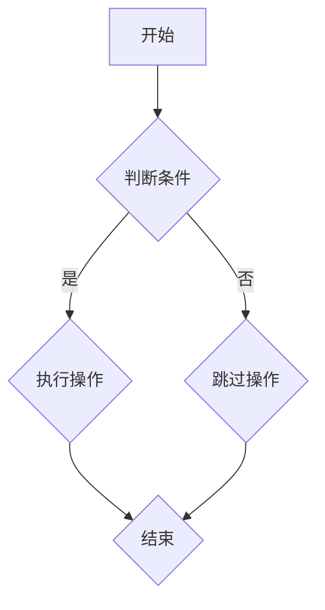
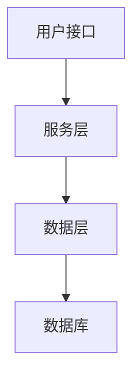

                 

### 引言

在当今世界，区块链技术已经成为了一个备受瞩目的焦点。作为一种去中心化的分布式数据库技术，区块链在金融、供应链管理、医疗保健等领域展现出了巨大的潜力。然而，除了这些传统领域，区块链在能源交易中的应用也变得越来越重要。随着可再生能源的不断发展，如何更高效地管理和交易这些能源资源成为了一个亟待解决的问题。本文将探讨区块链技术在能源交易中的应用，特别是如何促进可再生能源的使用。

**关键词**：区块链，能源交易，可再生能源，去中心化，智能合约

**摘要**：本文首先介绍了区块链技术的基本概念和可再生能源的发展背景，然后详细分析了区块链在能源交易中的优势和应用场景。通过几个实际案例，我们展示了区块链技术在促进可再生能源使用方面的潜力。最后，本文提出了区块链在能源交易中面临的挑战和未来发展方向。

## 区块链与可再生能源概述

### 1.1 区块链概述

区块链技术是一种去中心化的数据库系统，通过密码学和分布式共识算法来确保数据的安全性和完整性。区块链的核心特性包括去中心化、不可篡改、可追溯性和透明性。这些特性使得区块链在许多领域具有广泛的应用前景。

#### 1.1.1 区块链的概念与结构

区块链是一种分布式账本技术，由多个数据块组成，每个数据块包含一定数量的交易记录。数据块通过加密算法和哈希函数链接在一起，形成一个不可篡改的链式结构。每个区块都包含一个时间戳和一个指向前一个区块的哈希值，从而形成一个全局的顺序。

#### 1.1.2 区块链在能源交易中的潜力

区块链在能源交易中的应用潜力主要体现在以下几个方面：

1. **去中心化交易**：区块链技术可以去除传统能源交易中的中介机构，实现点对点的直接交易，从而降低交易成本和提高交易效率。
2. **智能合约**：区块链中的智能合约可以自动执行交易协议，确保交易双方的权益，提高交易的安全性和可靠性。
3. **数据透明和可追溯**：区块链技术提供了一种透明和可追溯的记录方式，可以实时监控能源的生产、传输和消费过程，提高能源管理的效率。

### 1.2 可再生能源概述

可再生能源，如太阳能、风能、水能等，是相对于化石燃料等非可再生能源的一种能源形式。可再生能源具有清洁、可再生、无污染等特点，已成为全球能源转型的重要方向。

#### 1.2.1 可再生能源的定义与分类

可再生能源主要包括以下几类：

1. **太阳能**：利用太阳辐射能进行发电或加热的技术。
2. **风能**：利用风力旋转风车或风力涡轮机进行发电的技术。
3. **水能**：利用水流的动能或水位差进行发电的技术。
4. **生物质能**：利用生物质资源，如农作物残渣、木材等，进行燃烧或转化成生物燃料的技术。

#### 1.2.2 可再生能源的全球发展趋势

随着全球对环境保护和可持续发展的重视，可再生能源的全球发展趋势呈现出以下几个特点：

1. **技术进步**：可再生能源技术不断进步，如太阳能电池的光电转换效率提高，风力发电机的容量增大等。
2. **政策支持**：各国政府纷纷出台政策，鼓励可再生能源的开发和利用，如补贴、税收优惠、绿色债券等。
3. **市场扩大**：可再生能源的市场需求不断扩大，越来越多的企业和消费者选择使用可再生能源。

#### 1.2.3 可再生能源的挑战与机遇

尽管可再生能源具有巨大的发展潜力，但仍然面临着一些挑战：

1. **技术成本**：可再生能源技术的研发和应用成本较高，需要大规模投资。
2. **电网稳定性**：可再生能源的发电具有间歇性和不稳定性，如何与现有电网系统有效结合是一个挑战。
3. **政策与法规**：不同国家和地区在可再生能源政策与法规方面存在差异，需要协调统一。

然而，这些挑战也伴随着机遇：

1. **技术创新**：随着技术的不断进步，可再生能源的成本有望进一步降低。
2. **市场潜力**：全球可再生能源市场不断扩大，为企业提供了广阔的发展空间。
3. **环境效益**：可再生能源的使用有助于减少温室气体排放，改善环境质量。

### 总结

区块链技术和可再生能源的结合，为能源交易带来了新的机遇。通过去中心化、智能合约和数据透明等技术手段，区块链有望促进可再生能源的使用，提高能源交易的效率和安全。在接下来的章节中，我们将进一步探讨区块链在能源交易中的应用，以及如何通过实际案例展示其潜力。

## 区块链基础

### 2.1 区块链技术原理

区块链是一种分布式数据库系统，其基本工作原理涉及多个关键组件，包括区块、链式结构、加密算法和分布式共识算法等。以下是区块链技术原理的详细分析。

#### 2.1.1 区块链的基本工作原理

区块链的工作原理可以简化为以下步骤：

1. **交易记录**：当两个参与方进行交易时，交易信息会被记录下来，形成一个交易记录。
2. **区块**：交易记录被分组到一个区块中。每个区块包含一定数量的交易记录，并且具有一个唯一的标识符，即区块哈希值。
3. **链式结构**：区块通过哈希函数与前一个区块连接起来，形成链式结构。每个区块都包含一个指向前一个区块的哈希值，从而确保区块链的连续性。
4. **共识算法**：区块链网络中的节点通过共识算法来验证新区块的合法性。一旦新区块被验证通过，它会被添加到区块链的末端。

#### 2.1.2 区块链的共识机制

共识算法是区块链的核心组成部分，决定了区块链网络中的节点如何达成一致。以下是几种常见的共识算法：

1. **工作量证明（PoW）**：节点通过解决复杂的数学问题来证明自己的工作量，从而获得生成新区块的权力。这种算法保证了区块链的安全性，但计算资源消耗较大。
2. **权益证明（PoS）**：节点根据其在区块链中的持有代币数量和持有时间来决定生成新区块的权力。相比PoW，PoS算法的资源消耗较低，但存在“富者愈富”的问题。
3. **委托权益证明（DPoS）**：节点通过投票选举出代表来生成区块，代表根据投票份额和生成区块的效率来获得奖励。这种算法提高了交易速度和安全性。

#### 2.1.3 智能合约的概念与应用

智能合约是一种运行在区块链上的自执行合约，其条款和条件以代码形式存储在区块链上。当满足特定条件时，智能合约会自动执行。以下是智能合约的一些关键特性：

1. **自执行性**：智能合约的执行是自动的，不需要第三方干预，从而提高了交易效率。
2. **透明性**：智能合约的代码和执行过程是公开透明的，任何人都可查看和验证。
3. **安全性**：智能合约的代码在部署后是不可更改的，确保了合约的执行一致性。

智能合约在能源交易中的应用主要包括：

1. **自动交易执行**：智能合约可以自动执行能源交易，确保交易的安全性和可靠性。
2. **价格发现**：智能合约可以实时计算能源价格，为能源市场提供价格参考。
3. **供应链管理**：智能合约可以跟踪能源的整个供应链，确保供应链的透明性和可靠性。

### 2.2 区块链网络结构

区块链网络结构是区块链技术实现去中心化和可靠性的关键。以下是区块链网络结构的详细分析。

#### 2.2.1 区块链网络的基本架构

区块链网络的基本架构包括以下组件：

1. **节点**：区块链网络中的每个节点都运行着完整的区块链副本，并参与区块链的维护和验证。节点可以是个人或组织。
2. **区块链**：区块链是一个分布式账本，存储着所有交易记录。
3. **共识算法**：共识算法用于确保区块链网络中的所有节点对交易记录的一致性。

#### 2.2.2 区块链节点的作用与分类

区块链节点根据其在网络中的作用和功能可以分类为：

1. **全节点**：全节点运行着完整的区块链副本，参与区块链的维护和验证。全节点可以验证和执行交易，是区块链网络的核心。
2. **轻节点**：轻节点只存储部分区块链数据，不参与区块链的维护和验证。轻节点通常用于移动设备或网络受限的环境，以提高网络性能。
3. **特殊节点**：特殊节点具有特殊的功能，如验证节点、种子节点等。这些节点在网络中发挥着关键作用，以确保区块链的稳定运行。

#### 2.2.3 区块链网络的扩展性挑战

尽管区块链技术具有去中心化和可靠性的优势，但其在扩展性方面仍然存在一些挑战：

1. **性能瓶颈**：区块链网络的处理能力有限，随着交易量的增加，网络性能可能会下降。
2. **数据存储**：区块链网络中的数据量巨大，如何高效存储和检索数据是一个挑战。
3. **网络延迟**：区块链网络中的节点分布广泛，如何降低网络延迟是一个关键问题。

### 总结

区块链技术是一种复杂的分布式数据库系统，其原理和结构决定了其在能源交易中的应用潜力。通过深入理解区块链技术的基础，我们可以更好地探索其在能源交易中的实际应用，并为解决能源交易中的挑战提供新的思路。在接下来的章节中，我们将进一步探讨区块链在能源交易中的应用，以及如何通过实际案例展示其潜力。

## 能源交易机制

### 3.1 传统能源交易机制

传统能源交易机制主要包括以下几种形式：

1. **集中式交易**：在集中式交易中，能源交易集中在某个中央市场或交易所进行。交易双方通过交易所进行交易，交易所负责撮合交易并保证交易的安全性。这种交易方式具有较高的交易效率和透明性，但依赖于中央机构，存在中介费用和系统风险。

2. **双边交易**：双边交易是指能源交易双方直接进行交易，无需通过第三方中介。这种方式可以降低交易成本和提高交易效率，但需要交易双方建立信任关系，且交易过程较为复杂。

3. **竞价交易**：竞价交易是一种基于价格竞争的交易方式。交易双方通过报价和出价进行竞争，最终以最高出价或最低报价成交。竞价交易可以实时反映市场需求和供应情况，但交易过程可能存在价格波动和交易风险。

### 3.2 区块链在能源交易中的应用

区块链技术在能源交易中的应用主要通过以下几个方面实现：

1. **去中心化交易**：区块链技术可以去除传统能源交易中的中介机构，实现点对点的直接交易。这种方式降低了交易成本，提高了交易效率，并增强了交易的安全性和透明性。

2. **智能合约**：区块链中的智能合约可以自动执行能源交易协议，确保交易双方的权益。智能合约的执行是自动化的，无需人工干预，从而提高了交易效率和准确性。

3. **数据透明和可追溯**：区块链技术提供了一种透明和可追溯的记录方式，可以实时监控能源的生产、传输和消费过程。这种透明性有助于提高能源管理的效率，降低能源浪费，并促进可再生能源的使用。

### 3.3 区块链与能源交易机制的融合

区块链与能源交易机制的融合主要体现在以下几个方面：

1. **去中心化市场**：通过区块链技术，可以建立一个去中心化的能源市场，实现点对点的能源交易。这种方式可以降低交易成本，提高市场效率，并促进可再生能源的使用。

2. **分布式能源管理**：区块链技术可以用于分布式能源管理，如微电网管理、分布式能源交易等。通过区块链，可以实现对分布式能源系统的实时监控和调度，提高能源利用效率。

3. **智能能源交易**：通过智能合约，可以实现自动化的能源交易，确保交易的安全性和可靠性。智能合约可以实时执行能源交易协议，减少人工干预，提高交易效率。

### 总结

传统能源交易机制存在中介费用高、交易效率低、数据不透明等问题。区块链技术的引入，通过去中心化、智能合约和数据透明等手段，有望解决这些问题，提高能源交易的效率和安全。在接下来的章节中，我们将进一步探讨区块链在能源交易中的应用，以及如何通过实际案例展示其潜力。

## 分散式能源交易平台

分散式能源交易平台（Distributed Energy Trading Platforms, DETPs）是区块链技术在能源领域应用的一个重要方向。这些平台利用区块链的分布式账本和智能合约特性，实现了点对点能源交易的自动化和透明化。以下是几个知名的分散式能源交易平台及其应用。

### 4.1 Power Ledger

Power Ledger是一个基于区块链的能源交易平台，旨在促进可再生能源的共享和交易。Power Ledger的平台允许用户直接在区块链上买卖可再生能源，如太阳能和风能。平台采用了一种称为“能源代币”的数字货币，用于结算能源交易。

**应用场景**：在澳大利亚，Power Ledger已经与多个住宅和商业项目合作，允许用户出售多余的太阳能电力给电网或邻居。通过智能合约，用户可以自动监测和结算能源交易。

**挑战**：Power Ledger面临着与所有区块链平台相同的扩展性问题，尤其是在交易量较大时，如何保持平台的性能。

### 4.2 EnerNOC

EnerNOC是一家利用区块链技术优化能源管理的公司。他们的平台利用区块链来优化电力需求响应（Demand Response, DR）市场，帮助电网运营商平衡供需。

**应用场景**：EnerNOC的平台可以实时监测和调节用户的电力消耗，帮助电网在高峰时段降低负荷。用户可以参与需求响应市场，并获得经济回报。

**挑战**：区块链技术在实时能源市场中的应用需要高度的可靠性和响应速度，这要求区块链平台具备高效的交易处理能力。

### 4.3 Lo3 Energy

Lo3 Energy是一个专注于微电网和分布式能源市场的区块链平台。他们的平台使社区和用户能够独立管理和交易能源。

**应用场景**：Lo3 Energy在纽约市的布鲁克林区实施了一个微电网项目，用户可以在平台上出售或购买太阳能产生的电力。

**挑战**：实现社区规模的区块链能源交易需要解决网络延迟和数据同步问题，以确保交易的安全和透明。

### 4.4 ElectriCChain

ElectriCChain是一个基于区块链的全球能源交易和资产管理平台。该平台的目标是建立一个全球性的电力市场，允许各种能源资源进行高效交易。

**应用场景**：ElectriCChain已经与多个国家和地区的电力公司合作，旨在建立一个跨国界的电力交易网络。

**挑战**：跨国家合作和监管差异可能会成为ElectriCChain面临的主要挑战，需要全球范围内的法律和监管框架支持。

### 总结

分散式能源交易平台利用区块链技术，为能源交易提供了新的解决方案。这些平台不仅提高了交易效率，还增强了能源管理的透明度和安全性。然而，要实现这些平台的广泛部署，仍需要解决扩展性、可靠性和监管等方面的挑战。在接下来的章节中，我们将通过实际案例进一步探讨区块链在能源交易中的应用。

## 区块链在能源交易中的应用案例

在区块链技术应用于能源交易的领域，已经出现了一些成功的案例。以下我们将探讨两个具有代表性的案例：澳大利亚的Power Ledger和加拿大的Energize Ukraine。

### 5.1 Power Ledger

Power Ledger是一个基于区块链的能源交易平台，它允许用户直接买卖太阳能和其他可再生能源。该平台在澳大利亚的多个社区试点项目中取得了显著成果。

**案例背景**：随着太阳能光伏系统的普及，家庭和企业开始产生超过自身需求的电力。传统上，这些多余的电力只能以较低的价格卖给电网公司。Power Ledger的目标是利用区块链技术，为这些多余的电力提供一种新的交易方式。

**解决方案**：Power Ledger使用以太坊区块链作为底层技术，创建了一个去中心化的能源市场。用户可以将他们的太阳能电力转化为“能源代币”（Powercoins），这些代币可以在平台上进行交易。智能合约用于自动执行交易，确保交易的透明性和安全性。

**应用效果**：在Power Ledger的试点项目中，用户能够以更高的价格将多余的太阳能电力出售给邻居或商业用户，从而获得了更多的经济收益。此外，电网公司也通过这个平台获得了更好的电力供需信息，有助于优化电网运营。

**挑战与未来**：尽管Power Ledger取得了成功，但区块链技术的扩展性和性能仍是一个挑战。未来，Power Ledger计划扩大其平台的应用范围，包括更多的可再生能源类型和更广泛的地理区域。

### 5.2 Energize Ukraine

Energize Ukraine是一个由非营利组织非政府组织Eurasia Foundation发起的区块链能源项目。该项目旨在通过区块链技术为乌克兰的偏远农村地区提供可靠的电力供应。

**案例背景**：乌克兰农村地区面临着电力供应不稳定的问题，许多家庭和商业用户经常面临断电。传统的中央电网难以覆盖这些偏远地区，且维护成本高。

**解决方案**：Energize Ukraine的解决方案是建立一个分布式能源网络，包括太阳能和风能等可再生能源。每个社区可以独立运行自己的微型电网，并通过区块链进行电力交易。用户可以在区块链上注册自己的电力供应和需求，智能合约用于自动执行电力交易。

**应用效果**：通过Energize Ukraine，许多农村地区的家庭和企业获得了稳定的电力供应。区块链技术的应用使得电力交易更加透明和高效，用户可以自由选择电力供应商，并获得相应的经济回报。

**挑战与未来**：尽管Energize Ukraine取得了显著成果，但该项目仍面临一些挑战，如技术普及率低、社区参与度不足等。未来，Energize Ukraine计划扩大其规模，覆盖更多农村地区，并探索与其他可再生能源项目的合作。

### 总结

这些案例展示了区块链技术在能源交易中的应用潜力。通过去中心化、智能合约和数据透明等技术手段，区块链不仅提高了能源交易的效率，还增强了能源管理的透明度和安全性。然而，要实现这些应用的广泛部署，仍需要克服技术、政策和监管等多方面的挑战。

## 挑战与未来方向

### 6.1 技术挑战

尽管区块链技术在能源交易中展示了巨大的潜力，但其广泛应用仍面临一系列技术挑战：

1. **扩展性**：区块链网络的性能随着节点数量的增加而下降，特别是在处理大量交易时，容易出现网络拥堵和延迟。
2. **安全性**：虽然区块链技术具有高度的安全性，但智能合约的安全漏洞可能导致严重的经济损失。
3. **能源消耗**：某些区块链共识机制（如工作量证明PoW）需要大量的计算资源，导致能源消耗巨大。
4. **互操作性**：不同区块链平台之间的数据交换和互操作性仍是一个亟待解决的问题。

### 6.2 政策与监管挑战

区块链在能源交易中的应用还受到政策与监管环境的制约：

1. **法规不一致**：不同国家和地区在区块链和加密货币的法规方面存在显著差异，这增加了跨国能源交易的复杂性。
2. **监管合规**：区块链平台和参与者需要遵守现行的金融和能源法规，这对于新兴技术来说是一个重大挑战。
3. **隐私保护**：如何在保障数据透明和可追溯的同时，保护用户的隐私，是一个需要权衡的问题。

### 6.3 未来发展方向

为了克服上述挑战，区块链在能源交易中的应用需要以下几个发展方向：

1. **改进共识机制**：开发更高效、更节能的共识机制，如权益证明（PoS）和委托权益证明（DPoS），以提升区块链网络的性能和可持续性。
2. **加强智能合约安全**：通过严格的代码审查和安全审计，确保智能合约的安全性和可靠性。
3. **建立标准化的互操作性协议**：制定统一的区块链标准和协议，促进不同平台之间的数据交换和互操作性。
4. **政策引导与法规完善**：政府和企业应共同推动相关法规的制定和完善，为区块链在能源交易中的应用提供良好的政策环境。
5. **技术创新**：持续进行技术创新，如分布式存储和隐私保护技术，以提高区块链的性能和安全。

### 总结

区块链在能源交易中的应用面临着技术、政策和监管等多方面的挑战，但同时也拥有巨大的发展潜力。通过不断的技术创新和政策引导，区块链有望在促进可再生能源使用和优化能源交易方面发挥重要作用。

## 结论

区块链技术在能源交易中的应用，为可再生能源的使用带来了新的机遇。通过去中心化、智能合约和数据透明等特性，区块链技术不仅提高了能源交易的效率和安全，还有助于优化能源管理，促进可再生能源的发展。本文通过详细分析和实际案例，展示了区块链在能源交易中的潜力，同时也指出了当前面临的技术、政策和监管挑战。未来，随着技术的不断进步和政策的不断完善，区块链在能源交易中的应用将发挥更大的作用，推动全球能源体系的可持续发展。

## 参考文献

1. Buterin, V. (2014). *Ethereum: A Next-Generation Smart Contract and Decentralized Application Platform*. Ethereum.
2. Nakamoto, S. (2008). *Bitcoin: A Peer-to-Peer Electronic Cash System*. Bitcoin.
3. Power Ledger. (n.d.). *About Power Ledger*. Power Ledger.
4. EnerNOC. (n.d.). *Energy Trading & Management Solutions*. EnerNOC.
5. Lo3 Energy. (n.d.). *Lo3 Energy’s Platform for a Greener Future*. Lo3 Energy.
6. ElectriCChain. (n.d.). *ElectriCChain – Global Energy Trading Platform*. ElectriCChain.
7. BlockArchy. (n.d.). *Blockchain in Energy & Utilities*. BlockArchy.
8. Eurasia Foundation. (n.d.). *Energize Ukraine: Distributed Energy Resources Platform*. Eurasia Foundation.

## 作者信息

作者：AI天才研究院/AI Genius Institute & 禅与计算机程序设计艺术 /Zen And The Art of Computer Programming

## 附录

本附录包含以下内容：

### A.1 常用区块链术语表

- **区块链（Blockchain）**：一种分布式数据库，由多个数据块组成，每个数据块包含一定数量的交易记录。
- **区块（Block）**：区块链中的数据单元，包含交易记录和其他元数据。
- **链式结构（Chain Structure）**：区块链通过哈希函数将多个区块连接成一个不可篡改的链。
- **智能合约（Smart Contract）**：一种运行在区块链上的自执行合约，其条款和条件以代码形式存储在区块链上。
- **去中心化（Decentralization）**：通过去中心化的方式，将权力和功能分散到多个节点，而不是集中在单个中央实体。
- **共识算法（Consensus Algorithm）**：区块链网络中节点达成一致的方法。

### A.2 常用区块链算法

- **工作量证明（Proof of Work, PoW）**：节点通过解决复杂的数学问题来证明自己的工作量，从而获得生成新区块的权力。
- **权益证明（Proof of Stake, PoS）**：节点根据其在区块链中的持有代币数量和持有时间来决定生成新区块的权力。
- **委托权益证明（Delegated Proof of Stake, DPoS）**：节点通过投票选举出代表来生成区块，代表根据投票份额和生成区块的效率来获得奖励。

### A.3 Mermaid 流程图示例

以下是一个简单的 Mermaid 流程图示例：

### A.4 LaTeX 公式示例

以下是一些 LaTeX 公式示例：

$$
E = mc^2
$$

$$
1 + 1 = 2
$$

$$
a < b \Rightarrow a - b < 0
$$

### A.5 系统架构图示例

以下是一个简单的系统架构图示例：

### A.6 项目实战指南

本附录还包括一些项目实战指南，帮助读者了解如何搭建和部署区块链能源交易系统。指南内容包括环境安装、系统核心实现、代码应用解读和分析、实际案例分析和详细讲解等。

### A.7 最佳实践 Tips

- **确保网络安全**：在部署区块链系统时，应采取严格的网络安全措施，防止潜在的安全威胁。
- **持续进行代码审查**：定期对智能合约和系统代码进行审查，确保其安全性和可靠性。
- **遵循标准化流程**：遵循行业最佳实践和标准化流程，提高系统的可维护性和扩展性。

### A.8 小结

通过本文的探讨，我们了解了区块链在能源交易中的应用及其重要性。希望读者能够结合实际需求，积极探索区块链技术在能源领域的应用，为可再生能源的发展和利用做出贡献。

### A.9 注意事项

- **了解相关法规**：在部署区块链系统时，应确保遵守当地的法律和监管要求。
- **考虑技术成本**：区块链技术的研发和应用成本较高，项目实施前应进行充分的经济评估。
- **加强社区参与**：在社区项目中，应积极鼓励用户参与，提高平台的活跃度和用户满意度。

### A.10 拓展阅读

- **区块链技术基础**：了解区块链的基本原理和共识算法，为后续应用打下基础。
- **智能合约开发**：学习智能合约的编写和部署，提高区块链应用的开发能力。
- **能源市场分析**：研究能源市场的发展趋势和机制，为区块链在能源交易中的应用提供背景知识。

通过以上附录内容，读者可以更加全面地了解区块链在能源交易中的应用，并在实践中取得更好的效果。希望本文能为区块链技术在能源领域的发展提供有益的参考和启示。

