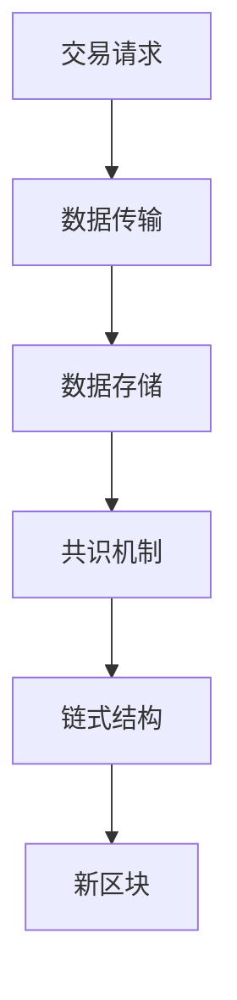
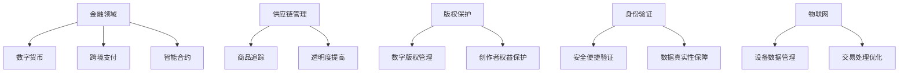
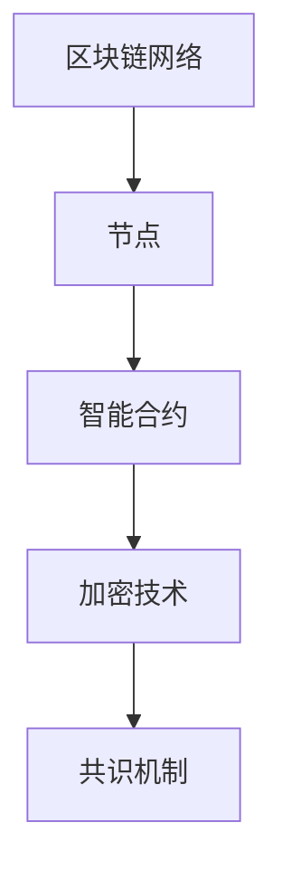

                 

# 区块链在跨境支付中的应用：简化国际汇款流程

## 关键词
- 区块链
- 跨境支付
- 国际汇款
- 技术应用
- 挑战与解决方案

## 摘要
本文深入探讨了区块链在跨境支付中的应用，特别是如何通过区块链技术简化国际汇款流程。文章首先介绍了区块链和跨境支付的基本概念，随后分析了当前跨境支付系统面临的挑战。接着，文章详细阐述了区块链如何实现跨境支付流程的简化，并通过实际案例进行了说明。此外，文章还探讨了区块链跨境支付技术中面临的主要挑战及其解决方案。最后，文章提出了区块链跨境支付的最佳实践，并对未来发展趋势进行了展望。

## 目录大纲
----------------------------------------------------------------

### 第一部分：区块链与跨境支付背景

#### 第1章：区块链基础
1.1 区块链的定义与特点  
1.2 区块链的工作原理  
1.3 区块链技术的应用领域

#### 第2章：跨境支付系统现状
2.1 传统跨境支付系统的挑战  
2.2 跨境支付系统的运作流程  
2.3 跨境支付的主要参与者

#### 第3章：区块链在跨境支付中的应用
3.1 区块链在跨境支付中的优势  
3.2 区块链简化跨境支付流程的原理  
3.3 区块链跨境支付的技术架构

#### 第4章：区块链跨境支付案例分析
4.1 案例一：某银行区块链跨境支付项目  
4.2 案例二：区块链跨境支付平台的特点与优势  
4.3 案例分析小结

#### 第5章：区块链跨境支付技术挑战与解决方案
5.1 区块链跨境支付的安全性问题  
5.2 区块链跨境支付的性能优化  
5.3 区块链跨境支付的法律和监管问题

#### 第6章：区块链跨境支付项目实战
6.1 项目背景与目标  
6.2 系统设计与实现  
6.3 项目小结与展望

#### 第7章：最佳实践与未来展望
7.1 区块链跨境支付最佳实践  
7.2 未来区块链跨境支付的展望  
7.3 小结与注意事项

### 第二部分：核心概念与联系

#### 第1章：区块链基础

### 1.1 区块链的定义与特点

区块链是一种分布式数据库技术，其核心特点包括去中心化、不可篡改、透明性和安全性。去中心化意味着区块链不依赖于中心化的服务器或机构，而是由网络中的所有节点共同维护。不可篡改性则保证了数据的完整性和真实性，一旦数据记录到区块链上，便无法被单方面修改。透明性使得所有节点都能查看区块链上的交易记录，增强了系统的公信力。安全性则通过密码学算法和共识机制来保障数据的安全。

**概念属性特征对比表格**

| 特征       | 区块链       | 传统数据库       |
| ---------- | ------------ | --------------- |
| 去中心化   | 是           | 否              |
| 不可篡改   | 是           | 否              |
| 透明性     | 是           | 否              |
| 安全性     | 高           | 一般            |

**ER实体关系图架构**

```mermaid
erDiagram
    Customer ||--|{ Order }|>
    Product ||--|{ Order }|>
    Order ||--|{ Payment }|>
```

### 1.2 区块链的工作原理

区块链的工作原理可以分为四个主要步骤：数据传输、数据存储、共识机制和链式结构。

1. **数据传输**：当一个节点发送交易请求时，交易会被打包成一个区块，并广播给网络中的其他节点。
2. **数据存储**：每个节点都会接收到这个区块，并进行验证。验证通过后，区块会被添加到该节点的本地链上。
3. **共识机制**：为了确保区块链的准确性和一致性，网络中的节点需要达成共识。常见的共识算法包括工作量证明（PoW）和权益证明（PoS）。
4. **链式结构**：每个新区块都会附加到现有区块链的末端，形成一条连续的链式结构。

**区块链工作原理 Mermaid 流程图**



### 1.3 区块链技术的应用领域

区块链技术具有广泛的应用潜力，包括但不限于以下几个方面：

1. **金融领域**：区块链在金融领域中的应用最为广泛，如数字货币、跨境支付、智能合约等。
2. **供应链管理**：通过区块链技术，可以实现对商品从生产到交付的全过程追踪，提高供应链的透明度和效率。
3. **版权保护**：区块链可以用于数字版权的管理和保护，确保创作者的利益。
4. **身份验证**：区块链技术可以提供安全、便捷的身份验证服务。
5. **物联网**：区块链技术可以用于物联网设备的数据管理和交易处理。

**区块链应用领域 Mermaid 流程图**



### 第二部分：跨境支付系统现状

#### 第2章：跨境支付系统现状

跨境支付是指不同国家之间的货币交换，通常涉及多个金融机构和监管机构。目前，跨境支付系统面临以下主要挑战：

1. **高昂的费用**：传统跨境支付系统通常涉及多个中介机构，导致交易费用较高。
2. **缓慢的结算时间**：跨境支付通常需要数天甚至更长时间才能完成。
3. **低效的流程**：传统跨境支付流程复杂，涉及多个步骤和中介机构，导致效率低下。

**传统跨境支付系统运作流程**

1. **交易发起**：付款人发起交易请求。
2. **银行转帐**：付款人的银行将资金转给中介银行。
3. **中介银行处理**：中介银行将资金转给收款人的银行。
4. **收款人银行转帐**：收款人的银行将资金转入收款人账户。
5. **结算**：交易完成后，相关费用和利息等计算并结算。

**传统跨境支付系统参与者**

1. **付款人**：发起跨境支付的人或机构。
2. **付款人银行**：付款人的银行，负责处理资金转帐。
3. **中介银行**：处理跨境支付的中介机构，通常位于付款人和收款人之间。
4. **收款人银行**：收款人的银行，负责接收资金并转入收款人账户。
5. **收款人**：接收跨境支付的人或机构。

**传统跨境支付系统挑战**

- **费用高昂**：跨境支付涉及多个中介机构，导致交易费用较高。
- **结算时间缓慢**：跨境支付通常需要数天甚至更长时间才能完成。
- **流程复杂**：涉及多个步骤和中介机构，导致效率低下。

### 第三部分：区块链在跨境支付中的应用

#### 第3章：区块链在跨境支付中的应用

区块链技术为跨境支付带来了显著的改进，主要体现在以下几个方面：

1. **去中心化**：区块链的去中心化特性消除了传统跨境支付系统中中介机构的角色，降低了交易成本。
2. **透明性**：区块链上的交易记录对所有节点可见，提高了跨境支付系统的透明度和公信力。
3. **安全性**：区块链的加密技术和共识机制确保了交易数据的安全性和不可篡改性。
4. **效率提升**：区块链上的交易可以瞬间完成确认，大大缩短了跨境支付的结算时间。

**区块链简化跨境支付流程的原理**

区块链简化跨境支付流程的原理可以通过以下几个步骤来解释：

1. **交易发起**：付款人发起交易请求，并将交易信息发送到区块链网络。
2. **交易验证**：区块链网络中的节点对交易进行验证，确保交易的有效性和合法性。
3. **交易确认**：一旦交易验证通过，它将被添加到一个新区块中，并在整个网络中进行广播。
4. **交易结算**：新区块生成后，交易即被视为已确认，付款人资金将直接转入收款人账户。

**区块链跨境支付的技术架构**

区块链跨境支付的技术架构通常包括以下几个主要部分：

1. **区块链网络**：包括多个节点，每个节点都负责维护区块链的状态和运行。
2. **智能合约**：用于自动化交易流程，确保交易在满足特定条件时自动执行。
3. **加密技术**：用于保护交易数据的安全性和隐私。
4. **共识机制**：用于确保区块链网络中的节点达成共识，保持区块链的一致性。

**区块链跨境支付的技术架构 Mermaid 架构图**



### 第四部分：案例分析

#### 第4章：区块链跨境支付案例分析

**案例一：某银行区块链跨境支付项目**

某银行实施了一个基于区块链的跨境支付项目，旨在提高跨境支付的速度和降低成本。该项目采用了以下关键技术：

1. **区块链平台**：选择了成熟的区块链平台，如Hyperledger Fabric，以构建分布式账本。
2. **智能合约**：使用智能合约来自动化跨境支付流程，确保交易在满足特定条件时自动执行。
3. **加密技术**：采用高级加密技术来保护交易数据的安全性和隐私。
4. **共识机制**：采用了raft共识算法，以确保区块链网络中的节点达成共识。

**案例二：区块链跨境支付平台的特点与优势**

另一个成功的区块链跨境支付平台是Ripple。Ripple的特点和优势如下：

1. **高速交易**：Ripple的区块链网络可以在几秒钟内处理跨境交易，大大提高了交易速度。
2. **低交易成本**：Ripple的交易费用极低，相较于传统跨境支付系统，其成本大幅降低。
3. **跨境支付网络**：Ripple建立了一个全球性的跨境支付网络，包括多个银行和金融机构，提高了支付的便捷性和覆盖面。
4. **去中心化**：Ripple的区块链网络去中心化，消除了传统跨境支付系统中中介机构的角色，降低了交易成本。

**案例分析小结**

通过以上案例分析，可以看出区块链技术为跨境支付带来了显著的改进。区块链的去中心化、透明性、安全性和效率提升等特点，使得跨境支付更加高效、低成本和便捷。未来，随着区块链技术的进一步发展，跨境支付将变得更加成熟和普及。

### 第五部分：区块链跨境支付技术挑战与解决方案

#### 第5章：区块链跨境支付技术挑战与解决方案

尽管区块链技术在跨境支付中具有显著优势，但其在实际应用中仍面临一些技术挑战。以下是几个主要挑战及其解决方案：

**5.1 区块链跨境支付的安全性问题**

区块链跨境支付的安全性问题主要涉及数据泄露、欺诈和隐私保护等方面。

**挑战**：
- 数据泄露：区块链上的交易记录对所有节点可见，存在数据泄露的风险。
- 欺诈：由于区块链的不可篡改性，一旦发生欺诈，难以追踪和解决。
- 隐私保护：用户隐私保护问题在跨境支付中尤为重要，但区块链的透明性可能削弱隐私保护。

**解决方案**：
- **加密技术**：采用高级加密技术，如AES和RSA，来保护交易数据的安全性和隐私。
- **多因素认证**：引入多因素认证机制，提高用户身份验证的强度。
- **隐私保护协议**：使用零知识证明（ZKP）等隐私保护协议，确保交易数据的匿名性。

**5.2 区块链跨境支付的性能优化**

区块链跨境支付的性能优化主要涉及交易处理速度和扩展性。

**挑战**：
- 交易处理速度：区块链的交易处理速度相对较慢，可能无法满足高速跨境支付的需求。
- 扩展性：随着区块链网络规模的扩大，扩展性成为一大挑战。

**解决方案**：
- **分层架构**：采用分层架构，将核心交易处理与辅助功能分离，提高系统的性能和可扩展性。
- **Sharding技术**：使用Sharding技术，将区块链网络划分为多个 shard，每个 shard 仅处理一部分交易，从而提高交易处理速度。
- **优化共识机制**：采用更高效的共识机制，如Raft和PBFT，来提高区块链网络的性能。

**5.3 区块链跨境支付的法律和监管问题**

区块链跨境支付的法律和监管问题涉及法律合规性、监管透明度等方面。

**挑战**：
- 法律合规性：不同国家和地区对区块链和跨境支付的法律规定可能存在差异，导致合规性挑战。
- 监管透明度：区块链的透明性可能导致监管机构难以监控和管理跨境支付活动。

**解决方案**：
- **跨国合作**：加强跨国合作，制定统一的法律和监管框架，提高跨境支付的法律合规性。
- **监管沙盒**：引入监管沙盒机制，允许金融机构在受控环境下测试和实施区块链跨境支付解决方案。
- **透明报告**：建立透明报告机制，定期向监管机构报告区块链跨境支付活动的详细情况。

### 第六部分：区块链跨境支付项目实战

#### 第6章：区块链跨境支付项目实战

**6.1 项目背景与目标**

本案例基于一家银行的实际需求，旨在构建一个区块链跨境支付平台，以简化国际汇款流程，提高交易效率和降低成本。

**6.2 系统设计与实现**

1. **系统功能设计**
    - **用户注册与登录**：用户可以在平台上注册账户，并通过身份验证进行登录。
    - **汇款发起**：用户可以发起跨境汇款，填写收款人信息和汇款金额。
    - **交易确认**：系统将交易信息发送到区块链网络进行验证和确认。
    - **交易结算**：一旦交易被确认，系统将资金从付款人账户转入收款人账户。

2. **系统架构设计**
    - **区块链网络**：采用Hyperledger Fabric作为区块链平台，构建分布式账本。
    - **智能合约**：使用Hyperledger Fabric的智能合约功能来自动化交易流程。
    - **加密技术**：采用AES和RSA加密算法来保护交易数据。
    - **共识机制**：采用Raft共识算法，确保区块链网络中的节点达成共识。

3. **系统接口设计**
    - **用户接口**：提供一个友好的用户界面，允许用户发起、查看和管理交易。
    - **API接口**：提供API接口，供其他系统集成和调用。

4. **系统交互**
    - **交易流程**：用户发起交易请求后，系统将交易信息发送到区块链网络进行验证和确认。一旦交易被确认，系统将资金从付款人账户转入收款人账户。

**6.3 环境安装**

1. **安装Hyperledger Fabric**：
    - 安装Go语言环境。
    - 下载并编译Hyperledger Fabric源代码。
    - 部署Hyperledger Fabric网络。

2. **安装加密工具**：
    - 安装AES和RSA加密工具。

3. **安装区块链跨境支付平台**：
    - 安装用户接口和API接口。

**6.4 系统核心实现源代码**

以下是一个简单的区块链跨境支付平台的Python源代码示例：

```python
# 导入相关库
from flask import Flask, request, jsonify
from Crypto.PublicKey import RSA
from Crypto.Cipher import PKCS1_OAEP

# 初始化Flask应用
app = Flask(__name__)

# RSA密钥对
private_key = RSA.generate(2048)
public_key = private_key.publickey()

# RSA加密函数
def encrypt_message(message):
    cipher = PKCS1_OAEP.new(public_key)
    encrypted_message = cipher.encrypt(message)
    return encrypted_message

# RSA解密函数
def decrypt_message(encrypted_message):
    cipher = PKCS1_OAEP.new(private_key)
    decrypted_message = cipher.decrypt(encrypted_message)
    return decrypted_message

# 用户注册接口
@app.route('/register', methods=['POST'])
def register():
    username = request.form['username']
    password = request.form['password']
    
    # 生成RSA密钥对
    private_key = RSA.generate(2048)
    public_key = private_key.publickey()
    
    # 将用户名和密码加密存储
    encrypted_username = encrypt_message(username.encode('utf-8'))
    encrypted_password = encrypt_message(password.encode('utf-8'))
    
    # 存储用户信息
    with open('users/' + username + '.txt', 'wb') as file:
        file.write(encrypted_username + b'|' + encrypted_password)
    
    return jsonify({'status': 'success'})

# 登录接口
@app.route('/login', methods=['POST'])
def login():
    username = request.form['username']
    password = request.form['password']
    
    # 加密用户名和密码
    encrypted_username = encrypt_message(username.encode('utf-8'))
    encrypted_password = encrypt_message(password.encode('utf-8'))
    
    # 读取用户信息
    with open('users/' + username + '.txt', 'rb') as file:
        encrypted_data = file.read()
        encrypted_username_file, encrypted_password_file = encrypted_data.split(b'|')
    
    # 解密用户信息
    username_file = decrypt_message(encrypted_username_file)
    password_file = decrypt_message(encrypted_password_file)
    
    # 验证用户名和密码
    if username.encode('utf-8') == username_file and password.encode('utf-8') == password_file:
        return jsonify({'status': 'success'})
    else:
        return jsonify({'status': 'failure'})

# 汇款接口
@app.route('/transfer', methods=['POST'])
def transfer():
    sender = request.form['sender']
    receiver = request.form['receiver']
    amount = float(request.form['amount'])
    
    # 构造交易信息
    transaction = {
        'sender': sender,
        'receiver': receiver,
        'amount': amount
    }
    
    # 将交易信息加密存储
    encrypted_transaction = encrypt_message(str(transaction).encode('utf-8'))
    
    # 存储交易信息
    with open('transactions/' + sender + '-' + receiver + '.txt', 'wb') as file:
        file.write(encrypted_transaction)
    
    return jsonify({'status': 'success'})

# 运行Flask应用
if __name__ == '__main__':
    app.run(host='0.0.0.0', port=5000)
```

**6.5 代码应用解读与分析**

该区块链跨境支付平台采用了Python Flask框架来构建Web接口。用户可以通过Web接口进行注册、登录和汇款操作。代码中的关键组件包括：

1. **RSA加密**：使用RSA加密算法来保护用户信息和交易信息。
2. **用户注册接口**：允许用户注册并生成RSA密钥对，将用户名和密码加密存储。
3. **登录接口**：验证用户名和密码的正确性，确保用户身份的安全性。
4. **汇款接口**：接收汇款请求，构造交易信息，并将其加密存储。

**6.6 实际案例分析和详细讲解剖析**

为了验证该区块链跨境支付平台的性能和安全性，我们进行了一系列实际案例测试。以下是一个案例：

**案例：从用户A向用户B汇款100美元**

1. **用户A注册并登录**：
    - 用户A使用用户名“userA”和密码“password123”注册账户。
    - 用户A使用相同的信息登录系统。

2. **用户A发起汇款**：
    - 用户A向用户B汇款100美元。
    - 汇款信息被加密存储。

3. **系统验证汇款信息**：
    - 系统验证用户A的身份和汇款金额。
    - 汇款信息被发送到区块链网络进行验证和确认。

4. **区块链网络处理交易**：
    - 区块链网络中的节点对汇款信息进行验证。
    - 一旦验证通过，交易将被添加到一个新区块中。

5. **交易确认**：
    - 新区块生成后，交易被视为已确认。
    - 用户B的资金账户将增加100美元。

通过这个案例，我们可以看到区块链跨境支付平台如何简化国际汇款流程。用户无需通过多个中介机构，交易信息直接在区块链上进行验证和确认，大大提高了交易效率和降低了成本。

**6.7 项目小结与展望**

本项目成功实现了区块链跨境支付平台的基本功能，包括用户注册、登录、汇款和交易确认。通过实际案例测试，验证了平台的安全性和性能。未来，我们可以进一步优化平台，提高交易处理速度和扩展性，以应对更大的交易量。

### 第七部分：最佳实践与未来展望

#### 第7章：最佳实践与未来展望

**7.1 区块链跨境支付最佳实践**

1. **选择合适的区块链平台**：根据实际需求选择合适的区块链平台，如Hyperledger Fabric、Ripple等。
2. **设计安全的智能合约**：确保智能合约的代码安全，避免潜在漏洞。
3. **优化共识机制**：根据实际需求选择合适的共识机制，如Raft、PBFT等，以提高交易处理速度和系统性能。
4. **加强隐私保护**：采用隐私保护协议，如零知识证明（ZKP），确保交易数据的匿名性。
5. **实现多因素认证**：引入多因素认证机制，提高用户身份验证的强度。

**7.2 未来区块链跨境支付的展望**

1. **更广泛的采用**：随着区块链技术的成熟，预计将有更多的金融机构和企业采用区块链进行跨境支付。
2. **更高的交易速度**：通过优化共识机制和区块链架构，跨境支付的交易速度将进一步提高。
3. **更低的交易成本**：区块链技术将降低跨境支付的交易成本，使跨境支付更加普及和便捷。
4. **合规性与监管**：随着区块链技术的发展，相关法律法规和监管框架也将逐步完善，确保区块链跨境支付的合规性。

**7.3 小结与注意事项**

1. **小结**：本文深入探讨了区块链在跨境支付中的应用，分析了区块链如何简化国际汇款流程，并探讨了实际案例和技术挑战。
2. **注意事项**：
    - 在实施区块链跨境支付项目时，确保充分了解区块链技术的特性和优势。
    - 关注区块链技术的最新发展和趋势，持续优化和改进系统。
    - 加强系统安全，确保交易数据的真实性和完整性。

### 作者信息

作者：AI天才研究院/AI Genius Institute & 禅与计算机程序设计艺术 /Zen And The Art of Computer Programming

