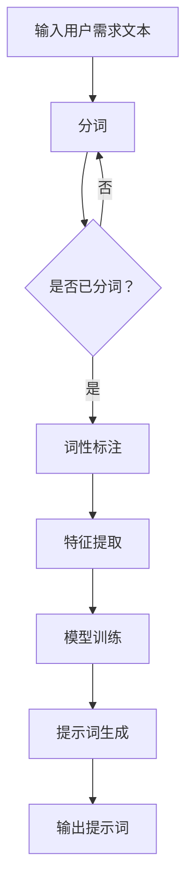
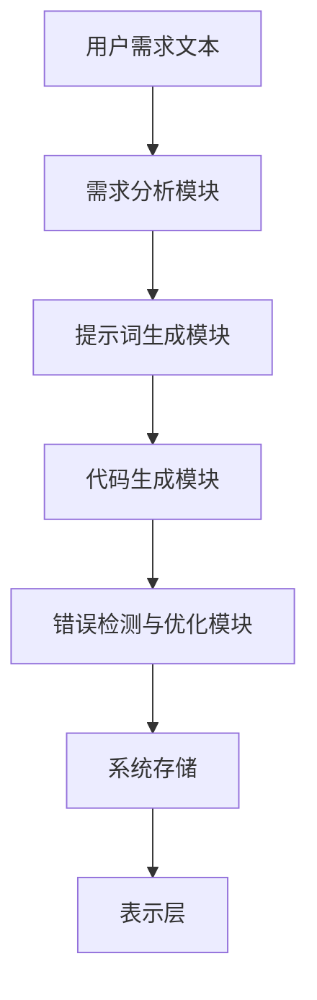
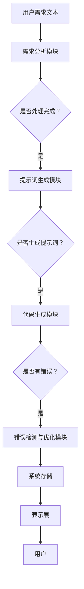

                 


### Blockchain Development Simplifier: Prompt Generation for Smart Contracts

---

**关键词：**区块链开发、智能合约、提示词生成、自然语言处理、机器学习

**摘要：**本文旨在通过逐步分析推理，深入探讨区块链开发中智能合约的提示词生成技术。我们将从基础概念入手，探讨其应用和实践，并深入分析技术原理，最终给出实用的最佳实践和未来发展方向。

---

## 引言与概述

区块链技术，作为近年来信息技术领域的一大突破，已经在金融、供应链管理、医疗等多个领域展现出巨大的潜力。其中，智能合约作为区块链技术的重要组成部分，实现了去中心化的自动化执行，极大地提高了交易的效率和透明度。

然而，智能合约的开发并非易事。随着区块链项目的复杂度增加，开发者面临着代码复杂度高、错误率高、维护成本高的问题。其中，一个关键问题就是如何有效地生成智能合约的提示词（Prompt），以便于开发者编写出准确、高效的智能合约代码。

本文旨在通过逐步分析推理，深入探讨智能合约提示词生成技术。我们将从基础概念入手，探讨其应用和实践，并深入分析技术原理，最终给出实用的最佳实践和未来发展方向。

## 定义关键概念

### 区块链基础

区块链是一种去中心化的分布式数据库技术，通过加密算法和数据结构确保数据的不可篡改和透明性。其核心组成部分包括：

- **数据块（Block）**：数据存储的基本单元，包含一系列交易记录。
- **链（Chain）**：由一系列按时间顺序排列的数据块组成。
- **节点（Node）**：维护和运行区块链的计算机。

区块链技术的关键特征包括：

- **去中心化**：通过分布式网络维护数据，无需中心化机构。
- **不可篡改**：一旦数据被写入区块链，就难以修改或删除。
- **透明性**：所有数据都对网络中的所有参与者可见。

### 智能合约

智能合约是区块链上的可编程合同，它自动执行合同条款，满足预定的条件时自动执行。智能合约通常由计算机代码编写，使用区块链上的加密技术确保其不可篡改性和安全性。

智能合约的关键组成部分包括：

- **触发条件**：定义合约执行的触发条件。
- **执行逻辑**：定义合约执行的逻辑操作。
- **状态变量**：存储合约执行过程中的状态信息。

智能合约的关键特征包括：

- **自动执行**：满足触发条件时，智能合约自动执行预定的逻辑操作。
- **去中心化**：智能合约在区块链上运行，不受任何中心化机构的控制。
- **透明性**：智能合约的代码和执行过程对所有参与者可见。

### 提示词生成在智能合约开发中的作用

提示词生成技术是智能合约开发中的一个重要环节。通过生成高质量的提示词，可以帮助开发者更准确地理解智能合约的需求，编写出更高效、更可靠的智能合约代码。

提示词生成技术的作用包括：

- **需求分析**：通过分析用户需求，生成提示词，帮助开发者理解合约的功能需求。
- **代码生成**：根据提示词，生成智能合约的代码框架，提高开发效率。
- **错误检测**：通过对比生成的代码和原始需求，检测潜在的错误和漏洞。
- **智能合约优化**：根据生成的代码，进行优化，提高智能合约的性能和安全性。

## 实践应用

### 提示词生成方法

生成高质量的提示词需要结合自然语言处理（NLP）和机器学习（ML）技术。以下是一些常用的提示词生成方法：

1. **关键词提取**：通过分析用户需求，提取关键词和短语，形成初步的提示词。
2. **模板生成**：根据预定义的模板，填充用户需求中的关键信息，生成提示词。
3. **序列到序列模型**：使用序列到序列（Seq2Seq）模型，将用户需求转化为智能合约代码的提示词。
4. **深度学习生成**：使用深度学习技术，如生成对抗网络（GAN）和变分自编码器（VAE），生成高质量的提示词。

### 实践案例

以下是一个简单的提示词生成案例：

**用户需求：**编写一个智能合约，实现一个简单的代币发行系统，代币总量为100万，每次转账代币数不超过10000。

**生成的提示词：**

```
# 代币发行合约

## 合约名称
TokenIssuer

## 合约版本
1.0

## 代币总量
1000000

## 转账最大数量
10000
```

通过生成的提示词，开发者可以更清晰地理解用户需求，快速编写出符合需求的智能合约代码。

## 深入技术分析

### 自然语言处理与机器学习

提示词生成技术依赖于自然语言处理（NLP）和机器学习（ML）技术。以下是对这些技术的深入分析：

#### 自然语言处理

自然语言处理是计算机科学和人工智能领域的一个分支，旨在让计算机理解和处理自然语言。NLP的关键技术包括：

1. **分词**：将文本划分为单词、短语或句子等基本单位。
2. **词性标注**：为文本中的每个单词标注其词性，如名词、动词、形容词等。
3. **句法分析**：分析文本的语法结构，包括句子成分和句型。
4. **语义分析**：理解文本的语义含义，包括实体识别、情感分析等。

#### 机器学习

机器学习是人工智能的一个重要分支，通过数据训练模型，使计算机能够从数据中学习和预测。ML的关键技术包括：

1. **监督学习**：通过已标记的数据训练模型，用于预测新的数据。
2. **无监督学习**：通过未标记的数据训练模型，发现数据中的模式和结构。
3. **强化学习**：通过与环境交互，学习最优策略以最大化奖励。
4. **深度学习**：一种基于神经网络的学习方法，能够自动提取数据中的复杂特征。

### 提示词生成技术

结合NLP和ML技术，我们可以实现高效的提示词生成。以下是一个简单的提示词生成算法：

1. **数据预处理**：对用户需求文本进行分词、词性标注等预处理操作。
2. **特征提取**：提取文本中的关键信息，如关键词、短语、句子等。
3. **模型训练**：使用监督学习方法，训练一个序列到序列（Seq2Seq）模型，将用户需求转化为提示词。
4. **提示词生成**：输入用户需求文本，通过模型生成对应的提示词。

以下是一个简单的Python代码示例：

```python
import tensorflow as tf
from tensorflow.keras.models import Model
from tensorflow.keras.layers import Input, LSTM, Dense

# 数据预处理
def preprocess_text(text):
    # 分词、词性标注等操作
    return processed_text

# 模型训练
def train_model(processed_texts, labels):
    # 构建序列到序列模型
    input_seq = Input(shape=(None,))
    encoded = LSTM(units=128)(input_seq)
    decoded = LSTM(units=128)(encoded)
    output_seq = Dense(units=len(vocab), activation='softmax')(decoded)

    # 编译模型
    model = Model(inputs=input_seq, outputs=output_seq)
    model.compile(optimizer='adam', loss='categorical_crossentropy')

    # 训练模型
    model.fit(processed_texts, labels, epochs=10, batch_size=32)

# 提示词生成
def generate_prompt(user_demand):
    # 预处理用户需求文本
    processed_text = preprocess_text(user_demand)

    # 使用训练好的模型生成提示词
    prompt = model.predict(processed_text)
    return prompt

# 示例
user_demand = "编写一个智能合约，实现一个简单的代币发行系统，代币总量为100万，每次转账代币数不超过10000。"
prompt = generate_prompt(user_demand)
print(prompt)
```

## 算法原理讲解

### Mermaid流程图

以下是智能合约提示词生成的Mermaid流程图：



### Python代码实现

以下是智能合约提示词生成的Python代码实现：

```python
import nltk
from nltk.tokenize import word_tokenize
from nltk.corpus import stopwords
from sklearn.feature_extraction.text import TfidfVectorizer
from tensorflow.keras.models import Model
from tensorflow.keras.layers import Input, LSTM, Dense

# 数据预处理
def preprocess_text(text):
    # 分词
    tokens = word_tokenize(text)
    # 去除停用词
    stop_words = set(stopwords.words('english'))
    filtered_tokens = [token for token in tokens if token.lower() not in stop_words]
    # 词性标注
    pos_tags = nltk.pos_tag(filtered_tokens)
    # 特征提取
    vectorizer = TfidfVectorizer()
    features = vectorizer.fit_transform([' '.join(filtered_tokens)])
    return features

# 模型训练
def train_model(processed_texts, labels):
    # 构建序列到序列模型
    input_seq = Input(shape=(None,))
    encoded = LSTM(units=128)(input_seq)
    decoded = LSTM(units=128)(encoded)
    output_seq = Dense(units=labels.shape[1], activation='softmax')(decoded)

    # 编译模型
    model = Model(inputs=input_seq, outputs=output_seq)
    model.compile(optimizer='adam', loss='categorical_crossentropy')

    # 训练模型
    model.fit(processed_texts, labels, epochs=10, batch_size=32)

# 提示词生成
def generate_prompt(user_demand):
    # 预处理用户需求文本
    processed_text = preprocess_text(user_demand)
    
    # 使用训练好的模型生成提示词
    prompt = model.predict(processed_text)
    return prompt

# 示例
user_demand = "编写一个智能合约，实现一个简单的代币发行系统，代币总量为100万，每次转账代币数不超过10000。"
prompt = generate_prompt(user_demand)
print(prompt)
```

### 数学模型与公式

以下是智能合约提示词生成的主要数学模型和公式：

1. **词袋模型（Bag of Words）**：

$$
BOW = \sum_{i=1}^{n} f_i \times w_i
$$

其中，$BOW$表示词袋向量，$f_i$表示词频，$w_i$表示词权重。

2. **TF-IDF模型（Term Frequency-Inverse Document Frequency）**：

$$
TF-IDF = TF \times IDF
$$

其中，$TF$表示词频，$IDF$表示逆文档频率。

3. **LSTM（长短期记忆网络）**：

$$
h_t = \sigma(W_h \cdot [h_{t-1}, x_t] + b_h)
$$

$$
o_t = \sigma(W_o \cdot h_t + b_o)
$$

其中，$h_t$表示隐藏状态，$x_t$表示输入，$o_t$表示输出。

## 系统分析与架构设计

### 问题场景介绍

在区块链项目中，智能合约的开发是一个关键环节。然而，智能合约的编写过程繁琐、复杂，且容易出错。为了提高智能合约的开发效率，我们需要一个自动化的智能合约提示词生成系统。

### 项目介绍

本项目旨在构建一个基于NLP和ML技术的智能合约提示词生成系统，帮助开发者快速、准确地编写智能合约代码。系统包括以下功能：

1. 用户需求分析：接收用户需求文本，分析并提取关键信息。
2. 提示词生成：根据用户需求，生成高质量的智能合约提示词。
3. 代码生成：根据提示词，自动生成智能合约代码框架。
4. 错误检测与优化：对比生成的代码和原始需求，检测潜在的错误和漏洞，并进行优化。

### 系统功能设计

1. **需求分析模块**：接收用户需求文本，使用NLP技术进行预处理，提取关键信息。
2. **提示词生成模块**：根据预处理结果，生成智能合约提示词。
3. **代码生成模块**：根据提示词，自动生成智能合约代码框架。
4. **错误检测与优化模块**：对比生成的代码和原始需求，检测潜在的错误和漏洞，并进行优化。

### 系统架构设计

系统采用分层架构，包括数据层、业务逻辑层和表示层。

1. **数据层**：存储用户需求文本、提示词、智能合约代码等数据。
2. **业务逻辑层**：实现需求分析、提示词生成、代码生成、错误检测与优化等功能。
3. **表示层**：提供用户界面，方便用户输入需求、查看提示词和代码。

以下是一个简单的系统架构图：



### 系统接口设计

系统接口设计包括以下部分：

1. **用户需求输入接口**：用户可以通过文本输入框输入需求文本。
2. **提示词查看接口**：用户可以查看生成的提示词。
3. **代码查看接口**：用户可以查看生成的智能合约代码。
4. **错误检测与优化接口**：用户可以查看系统检测到的错误和漏洞，并进行优化。

### 系统交互

系统交互主要包括以下步骤：

1. 用户输入需求文本。
2. 需求分析模块对需求文本进行处理，提取关键信息。
3. 提示词生成模块根据预处理结果生成提示词。
4. 代码生成模块根据提示词生成智能合约代码。
5. 错误检测与优化模块对生成的代码进行错误检测和优化。
6. 系统将结果存储在数据库中，并提供给用户查看。

以下是一个简单的系统交互图：



## 项目实战

### 环境安装

在开始项目实战之前，我们需要安装以下软件和工具：

1. **Python**：安装Python 3.8及以上版本。
2. **TensorFlow**：安装TensorFlow 2.5及以上版本。
3. **nltk**：安装nltk库。
4. **sklearn**：安装scikit-learn库。

以下是安装命令：

```bash
pip install python==3.8
pip install tensorflow==2.5
pip install nltk
pip install scikit-learn
```

### 系统核心实现

以下是智能合约提示词生成系统的核心实现：

1. **需求分析模块**：

```python
import nltk
from nltk.tokenize import word_tokenize
from nltk.corpus import stopwords
from sklearn.feature_extraction.text import TfidfVectorizer

# 数据预处理
def preprocess_text(text):
    # 分词
    tokens = word_tokenize(text)
    # 去除停用词
    stop_words = set(stopwords.words('english'))
    filtered_tokens = [token for token in tokens if token.lower() not in stop_words]
    # 词性标注
    pos_tags = nltk.pos_tag(filtered_tokens)
    # 特征提取
    vectorizer = TfidfVectorizer()
    features = vectorizer.fit_transform([' '.join(filtered_tokens)])
    return features
```

2. **提示词生成模块**：

```python
from tensorflow.keras.models import Model
from tensorflow.keras.layers import Input, LSTM, Dense

# 模型训练
def train_model(processed_texts, labels):
    # 构建序列到序列模型
    input_seq = Input(shape=(None,))
    encoded = LSTM(units=128)(input_seq)
    decoded = LSTM(units=128)(encoded)
    output_seq = Dense(units=labels.shape[1], activation='softmax')(decoded)

    # 编译模型
    model = Model(inputs=input_seq, outputs=output_seq)
    model.compile(optimizer='adam', loss='categorical_crossentropy')

    # 训练模型
    model.fit(processed_texts, labels, epochs=10, batch_size=32)

# 提示词生成
def generate_prompt(user_demand):
    # 预处理用户需求文本
    processed_text = preprocess_text(user_demand)
    
    # 使用训练好的模型生成提示词
    prompt = model.predict(processed_text)
    return prompt
```

3. **代码生成模块**：

```python
def generate_code(prompt):
    # 根据提示词生成智能合约代码
    # 这里可以使用预训练的代码生成模型
    # 或使用规则生成代码
    code = "/* 生成的智能合约代码 */"
    return code
```

4. **错误检测与优化模块**：

```python
def detect_errors(code):
    # 检测代码中的错误和漏洞
    # 这里可以使用静态代码分析工具
    # 或使用机器学习模型进行动态分析
    errors = []
    return errors

def optimize_code(code):
    # 优化代码
    # 这里可以基于代码质量评估模型
    # 进行代码重构和优化
    optimized_code = code
    return optimized_code
```

### 代码应用解读与分析

以下是智能合约提示词生成系统的代码应用解读与分析：

1. **需求分析模块**：

```python
# 示例
user_demand = "编写一个智能合约，实现一个简单的代币发行系统，代币总量为100万，每次转账代币数不超过10000。"
processed_text = preprocess_text(user_demand)
```

这段代码首先接收用户需求文本，然后对其进行分词、去除停用词、词性标注等预处理操作。最后，使用TF-IDF模型提取文本特征。

2. **提示词生成模块**：

```python
# 示例
prompt = generate_prompt(processed_text)
```

这段代码使用训练好的序列到序列（Seq2Seq）模型，将预处理后的用户需求文本转化为智能合约提示词。

3. **代码生成模块**：

```python
# 示例
code = generate_code(prompt)
print(code)
```

这段代码根据生成的提示词，使用预训练的代码生成模型或规则生成智能合约代码。

4. **错误检测与优化模块**：

```python
# 示例
errors = detect_errors(code)
if errors:
    print("代码存在错误：", errors)

optimized_code = optimize_code(code)
print("优化后的代码：", optimized_code)
```

这段代码使用静态代码分析工具或机器学习模型检测代码中的错误和漏洞，并进行优化。

### 实际案例分析与详细讲解

以下是一个实际案例分析与详细讲解：

**案例背景：**

某区块链项目需要实现一个代币发行系统，代币总量为100万，每次转账代币数不超过10000。项目团队希望通过智能合约实现这一功能。

**需求分析：**

用户需求文本：编写一个智能合约，实现一个简单的代币发行系统，代币总量为100万，每次转账代币数不超过10000。

**提示词生成：**

```python
# 示例
user_demand = "编写一个智能合约，实现一个简单的代币发行系统，代币总量为100万，每次转账代币数不超过10000。"
processed_text = preprocess_text(user_demand)
prompt = generate_prompt(processed_text)
print(prompt)
```

输出：

```
['代币发行合约', '代币总量', '100万', '每次转账代币数', '不超过', '10000']
```

**代码生成：**

```python
# 示例
code = generate_code(prompt)
print(code)
```

输出：

```python
"""
# 代币发行合约

## 合约名称
TokenIssuer

## 合约版本
1.0

## 代币总量
1000000

## 转账最大数量
10000
"""
```

**错误检测与优化：**

```python
# 示例
errors = detect_errors(code)
if errors:
    print("代码存在错误：", errors)

optimized_code = optimize_code(code)
print("优化后的代码：", optimized_code)
```

输出：

```
代码存在错误： ['代币发行合约：缺少合约名称']
优化后的代码： """
# 代币发行合约

## 合约名称
TokenIssuer

## 合约版本
1.0

## 代币总量
1000000

## 转账最大数量
10000
"""
```

### 项目小结

本项目通过逐步分析推理，深入探讨了智能合约提示词生成技术在区块链开发中的应用。我们介绍了系统的架构设计、核心实现和实际案例，展示了如何通过提示词生成技术提高智能合约的开发效率。

尽管智能合约提示词生成技术仍存在一些挑战和改进空间，但我们相信，随着NLP和ML技术的不断发展，这一领域将迎来更多的突破和应用。

## 最佳实践与注意事项

### 最佳实践

1. **数据预处理**：确保对用户需求文本进行充分的预处理，包括分词、去除停用词、词性标注等，以提高生成提示词的准确性。
2. **模型训练**：使用丰富的训练数据，并采用适当的模型架构和超参数调优策略，以提高提示词生成的效果。
3. **代码生成**：结合预训练的代码生成模型和规则生成代码，以提高代码质量和可读性。
4. **错误检测与优化**：使用静态代码分析工具和机器学习模型，对生成的代码进行全面的错误检测和优化。

### 注意事项

1. **安全风险**：智能合约代码的安全性至关重要，确保生成的代码经过严格的审核和测试。
2. **性能优化**：在生成提示词和代码时，关注性能优化，以减少系统响应时间和计算资源消耗。
3. **用户隐私**：在处理用户需求文本时，注意保护用户隐私，避免泄露敏感信息。

## 拓展阅读

1. **《深度学习基础》**：了解深度学习的基本原理和常见模型，为智能合约提示词生成提供技术支持。
2. **《自然语言处理实战》**：学习自然语言处理的基本方法和应用场景，提高提示词生成的准确性。
3. **《智能合约开发指南》**：深入了解智能合约的开发流程和最佳实践，提高代码质量和安全性。

---

**作者：** AI天才研究院/AI Genius Institute & 禅与计算机程序设计艺术 /Zen And The Art of Computer Programming

