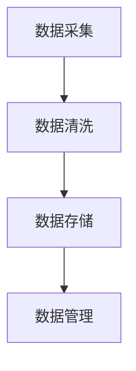
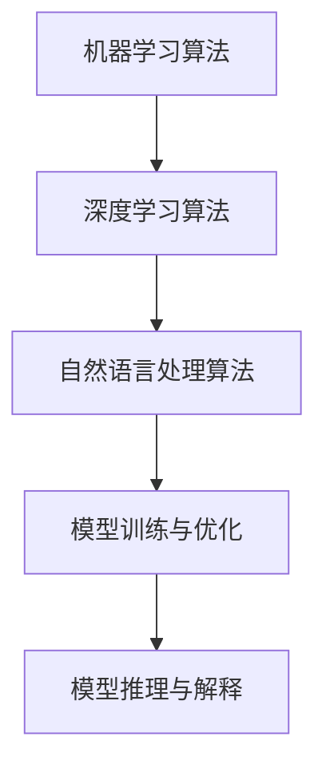
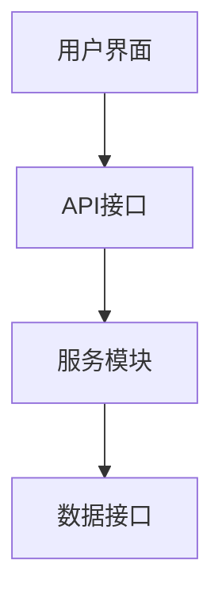
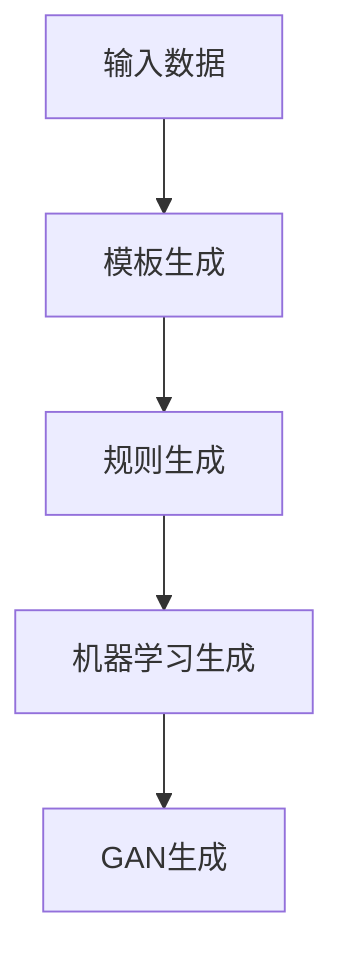
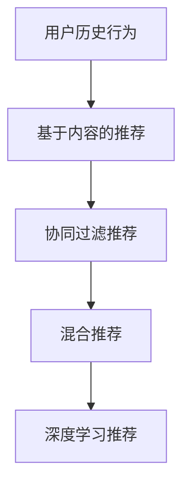
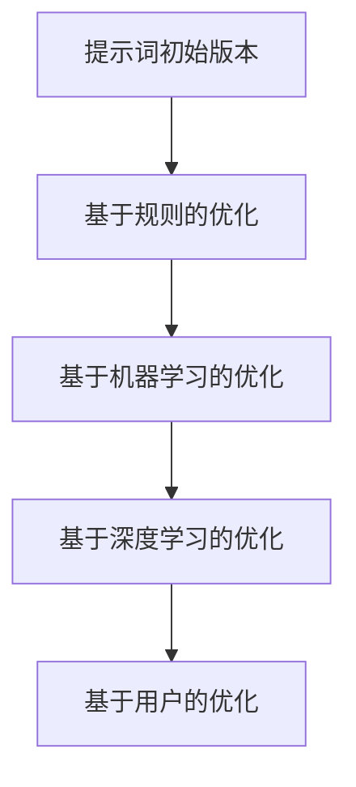
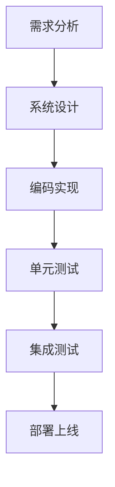
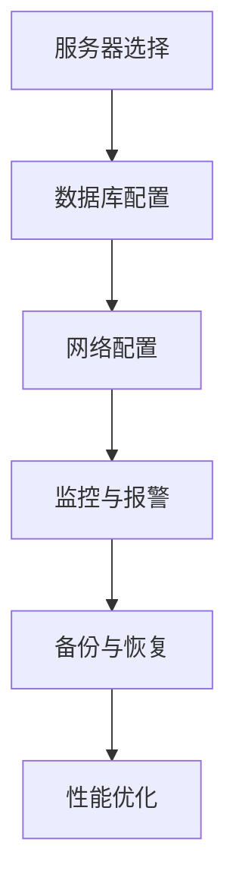
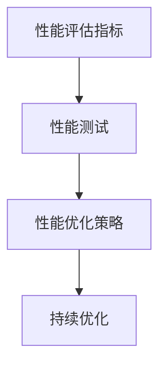

                 


## 第1章：医疗AI的概述

### 1.1 医疗AI的背景

#### 1.1.1 人工智能在医疗领域的崛起

随着科技的迅猛发展，人工智能（AI）技术已经深入到各个行业，医疗领域也不例外。近年来，AI在医疗领域的应用逐渐兴起，主要得益于以下几个因素的推动：

1. **数据处理能力的提升**：随着计算能力的提高和大数据技术的发展，医疗领域积累了大量的数据。这些数据为AI算法提供了丰富的训练资源，使得AI在医疗领域的应用成为可能。
2. **医疗需求的增加**：随着人口老龄化，慢性病患病率的上升以及医疗资源的分配不均等问题，医疗领域对高效、准确的诊断和治疗手段的需求日益增长。AI技术以其强大的数据处理能力和智能分析能力，有望解决这些难题。
3. **政策支持与投资增长**：各国政府纷纷出台支持AI医疗的政策，同时，各大企业、科研机构和投资机构也加大了对AI医疗领域的投资力度，推动了医疗AI的发展。

#### 1.1.2 医疗AI的定义与范围

医疗AI是指利用人工智能技术，对医疗领域中的各种数据进行分析和处理，以辅助医生做出诊断、制定治疗方案、提高医疗效率等。它涵盖了以下几个主要方面：

1. **医学图像分析**：利用深度学习等技术对医学影像进行自动识别和分析，辅助医生进行诊断。
2. **疾病预测与诊断**：通过分析患者的病历、基因数据、生活方式等信息，预测疾病风险，辅助医生进行诊断。
3. **个性化治疗**：根据患者的具体情况，制定个性化的治疗方案，以提高治疗效果。
4. **药物研发**：利用AI技术加速药物研发过程，提高新药的发现速度和成功率。
5. **健康管理等**：利用AI技术对健康数据进行智能分析，提供个性化的健康管理和疾病预防建议。

#### 1.1.3 医疗AI的重要性

医疗AI的重要性体现在以下几个方面：

1. **提高医疗效率**：AI技术可以帮助医生快速处理大量数据，提高诊断和治疗的效率。
2. **降低医疗成本**：通过优化医疗流程、减少误诊率等，AI技术有助于降低医疗成本。
3. **提升医疗质量**：AI技术可以辅助医生做出更准确、更个性化的诊断和治疗决策，提高医疗质量。
4. **推动精准医疗**：AI技术可以帮助实现个性化治疗，推动精准医疗的发展。
5. **改善患者体验**：AI技术可以提供智能化的健康管理和疾病预防建议，提高患者的满意度和生活质量。

### 1.2 医疗AI的关键技术

#### 1.2.1 机器学习和深度学习在医疗中的应用

机器学习和深度学习是医疗AI的核心技术，它们在医疗领域的应用主要体现在以下几个方面：

1. **医学图像分析**：利用深度学习模型，对医学影像进行自动识别和分析，如肿瘤检测、心脏病诊断等。
2. **疾病预测与诊断**：通过分析患者的病历、基因数据、生活方式等信息，利用机器学习算法预测疾病风险，辅助医生进行诊断。
3. **个性化治疗**：根据患者的基因信息、病情数据等，利用机器学习算法为患者制定个性化的治疗方案。

#### 1.2.2 自然语言处理在医疗数据中的应用

自然语言处理（NLP）技术在医疗领域具有广泛的应用，主要体现在以下几个方面：

1. **电子病历处理**：利用NLP技术，对医生写的病历进行结构化处理，提取关键信息，如诊断结果、治疗方案等。
2. **医学文本挖掘**：通过NLP技术，对医学文献、研究报告等进行挖掘，提取有用的信息，辅助医生进行学习和研究。
3. **患者沟通**：利用NLP技术，开发智能助手，帮助医生与患者进行沟通，提供个性化的健康建议。

#### 1.2.3 数据挖掘与健康数据分析

数据挖掘技术在医疗领域具有重要的作用，主要体现在以下几个方面：

1. **疾病趋势分析**：通过分析海量医疗数据，挖掘疾病发生的趋势和规律，为疾病预防和控制提供依据。
2. **患者群体细分**：通过分析患者的数据，将患者群体进行细分，为个性化医疗提供基础。
3. **医疗资源分配**：通过分析医疗数据，优化医疗资源的分配，提高医疗资源的利用效率。

#### 1.2.4 医疗图像处理技术

医疗图像处理技术在医疗AI中具有重要地位，主要体现在以下几个方面：

1. **医学影像重建**：利用图像处理技术，对医学影像进行重建，提高影像的清晰度和对比度。
2. **医学图像分割**：利用图像处理技术，对医学图像进行分割，提取出感兴趣的区域，如肿瘤区域。
3. **医学图像增强**：利用图像处理技术，增强医学图像的视觉效果，提高医生对图像的识别能力。

### 1.3 医疗AI的应用领域

#### 1.3.1 医疗诊断与辅助决策

医疗诊断是医疗AI的重要应用领域之一。通过机器学习和深度学习技术，AI可以帮助医生进行疾病诊断，提高诊断的准确性和效率。例如，AI可以自动分析医学影像，识别出病变区域，辅助医生进行诊断。

#### 1.3.2 精准医疗与个性化治疗

精准医疗是近年来医疗领域的一个重要研究方向。通过基因测序、生物信息学等手段，AI可以帮助医生为患者制定个性化的治疗方案。例如，AI可以根据患者的基因信息和疾病类型，推荐最适合的药物和治疗方案。

#### 1.3.3 药物研发与临床试验

AI在药物研发和临床试验中具有巨大的潜力。通过分析大量的医学数据和临床试验数据，AI可以加速新药的发现和研发过程，提高临床试验的效率。

#### 1.3.4 健康管理与疾病预防

AI技术可以帮助医疗机构提供个性化的健康管理服务，如健康评估、疾病预防建议等。例如，AI可以根据患者的健康数据和生活方式，提供个性化的健康建议，帮助患者改善生活方式，降低患病风险。

#### 1.3.5 医疗机器人

医疗机器人是AI在医疗领域的另一个重要应用。医疗机器人可以帮助医生进行手术、康复训练等操作，提高医疗服务的质量和效率。

### 1.4 医疗AI的发展挑战与伦理问题

#### 1.4.1 数据隐私与安全

医疗AI的发展离不开大量的医疗数据。然而，这些数据的隐私和安全问题需要得到妥善解决。如何保护患者的隐私，防止数据泄露，是医疗AI发展中需要克服的一个重要挑战。

#### 1.4.2 医疗AI的准确性与可靠性

医疗AI的准确性和可靠性是其在医疗领域得到广泛应用的关键。如何提高AI模型的准确性和可靠性，降低误诊率和错误率，是医疗AI发展中的一个重要课题。

#### 1.4.3 医疗AI的伦理问题

医疗AI的快速发展也带来了一系列伦理问题。如何确保AI在医疗领域的应用符合伦理标准，如何平衡AI与医生的关系等，都是医疗AI发展中需要认真思考的问题。

#### 1.4.4 医疗AI的政策与法规

医疗AI的发展需要政策与法规的支持。各国政府需要制定相应的政策与法规，明确医疗AI的应用范围、数据隐私保护措施等，以推动医疗AI的健康发展。

### 1.5 医疗AI的未来发展趋势

#### 1.5.1 新一代医疗AI技术的探索

未来，随着计算能力的提升和算法的改进，新一代医疗AI技术将不断涌现。例如，基于量子计算的AI模型可能会在医疗AI中发挥重要作用。

#### 1.5.2 医疗AI与物联网的结合

医疗AI与物联网的结合将为医疗领域带来新的变革。通过物联网设备，AI可以实时收集和分析患者的健康数据，提供更精准、更及时的医疗服务。

#### 1.5.3 医疗AI在全球化医疗中的应用

随着全球医疗资源的整合，医疗AI将在全球化医疗中发挥重要作用。例如，AI可以帮助发展中国家提高医疗水平，降低医疗成本。

#### 1.5.4 医疗AI的教育与培训

随着医疗AI技术的发展，对医疗专业人士的AI教育与培训将成为一个重要课题。如何让医生、护士等医疗专业人士更好地理解和应用医疗AI，是一个需要关注的问题。

### 1.6 本章小结

本章对医疗AI进行了概述，包括其背景、关键技术、应用领域以及发展挑战和伦理问题。通过本章的介绍，我们可以看到医疗AI在医疗领域的巨大潜力和广泛应用前景。

## 第2章：提示词在医疗AI中的应用

### 2.1 提示词的基本概念

#### 2.1.1 提示词的定义与作用

提示词（Prompt）在人工智能（AI）领域，尤其是在自然语言处理（NLP）中，起着至关重要的作用。提示词是一个输入信号，它能够引导AI模型生成预期的输出。在医疗AI中，提示词的具体定义和作用如下：

**定义**：提示词是指用于引导医疗AI模型进行特定任务处理的一段文本或数据。它可以是关键词、短语或完整的句子，用于提供上下文信息，帮助模型理解任务的目标和预期输出。

**作用**：
1. **任务引导**：提示词能够为AI模型提供明确的任务指令，使其能够针对性地处理特定类型的任务，如诊断、治疗建议等。
2. **上下文增强**：提示词可以提供额外的上下文信息，帮助模型更好地理解输入数据，从而提高任务处理的准确性和效率。
3. **交互式学习**：通过提示词，AI模型可以与医疗专业人士进行交互，获取更多的信息，进一步优化模型性能。

#### 2.1.2 提示词的类型与特点

在医疗AI中，提示词可以分为以下几种类型，每种类型都有其特定的应用场景和特点：

1. **关键词提示词**：这类提示词通常包含一些关键词，用于指示模型关注的重点。例如，在疾病诊断中，关键词提示词可以包含疾病名称、症状等。
   - **特点**：简洁明了，易于理解和实现，但可能缺乏上下文细节。
   
2. **短语提示词**：这类提示词包含一个或多个短语，用于提供更丰富的上下文信息。例如，在治疗建议中，短语提示词可以包含治疗方案名称、药物名称等。
   - **特点**：比关键词提示词更具体，能够提供更多的上下文信息，但可能更复杂。

3. **完整句子提示词**：这类提示词是一个完整的句子，用于提供详细的上下文信息。例如，在病历分析中，完整句子提示词可以是一个完整的病历描述。
   - **特点**：提供最全面的上下文信息，有助于模型更准确地理解和处理任务，但处理成本较高。

### 2.2 提示词在医疗AI中的关键作用

#### 2.2.1 提高医疗AI的准确性与效率

提示词在医疗AI中的关键作用之一是提高其准确性与效率。通过提供明确的任务指令和丰富的上下文信息，提示词可以帮助AI模型更好地理解任务目标，从而提高任务处理的准确性。例如，在疾病诊断中，提示词可以提供患者的症状、病史等信息，帮助模型更准确地识别疾病。

同时，提示词还可以提高医疗AI的效率。通过为AI模型提供明确的任务指令，可以减少模型的计算量和搜索空间，从而提高处理速度。此外，提示词可以提供额外的上下文信息，使模型在处理复杂任务时能够更快地做出决策。

#### 2.2.2 提升用户体验与满意度

提示词在医疗AI中的应用不仅能够提高模型性能，还能够提升用户体验。通过为用户提供更清晰、更具体的提示词，可以帮助用户更好地理解AI模型提供的诊断结果、治疗建议等。例如，在健康咨询应用中，提示词可以提供详细的健康问题解释和针对性的建议，使用户能够更准确地了解自己的健康状况。

此外，提示词还可以提高用户满意度。通过与用户进行交互，获取更多的用户反馈信息，AI模型可以不断优化自身性能，提供更个性化的服务。例如，在智能健康监护中，提示词可以根据用户的生活习惯、健康状况等，提供个性化的健康建议，提高用户的满意度和信任度。

#### 2.2.3 促进医疗AI与医疗专业人士的合作

提示词在医疗AI中的应用不仅有助于模型性能的提升和用户体验的优化，还能够促进医疗AI与医疗专业人士之间的合作。通过为AI模型提供明确的任务指令和丰富的上下文信息，医疗专业人士可以更方便地与AI模型进行沟通，共同制定诊断和治疗计划。

例如，在医学影像诊断中，医生可以使用提示词来指导AI模型关注特定的影像区域，从而提高诊断的准确性。同时，医生还可以通过提示词与AI模型进行交互，获取更多的诊断信息和建议，从而更好地为患者提供医疗服务。

此外，提示词还可以帮助医疗专业人士了解AI模型的工作原理和性能，促进他们对AI技术的理解和接受。通过参与提示词的设计和优化，医疗专业人士可以更深入地了解AI模型的需求和限制，从而更好地利用AI技术为患者提供高质量的医疗服务。

### 2.3 提示词在医疗AI中的具体应用

#### 2.3.1 医疗诊断中的提示词应用

在医疗诊断中，提示词的应用非常广泛。通过提供明确的任务指令和丰富的上下文信息，提示词可以帮助AI模型更准确地识别疾病。以下是几个具体的例子：

1. **疾病诊断**：在疾病诊断中，提示词可以提供患者的症状、病史、实验室检查结果等信息，帮助AI模型识别疾病。例如，在一个肺炎诊断应用中，提示词可以是“患者男性，35岁，发热、咳嗽、咳痰3天，胸片显示双肺感染”。

2. **影像诊断**：在医学影像诊断中，提示词可以指导AI模型关注特定的影像区域，提高诊断的准确性。例如，在一个肺癌诊断应用中，提示词可以是“右上肺叶有可疑结节，请重点分析”。

3. **辅助诊断**：在辅助诊断中，提示词可以提供额外的上下文信息，帮助AI模型更好地理解病情。例如，在一个心脏病诊断应用中，提示词可以是“患者有高血压、糖尿病史，最近出现胸闷、胸痛症状”。

#### 2.3.2 医疗数据分析中的提示词应用

在医疗数据分析中，提示词的应用同样非常重要。通过提供明确的任务指令和丰富的上下文信息，提示词可以帮助AI模型更有效地处理和分析大量医疗数据。以下是几个具体的例子：

1. **病历分析**：在病历分析中，提示词可以提供关键信息，帮助AI模型提取重要的诊断和治疗信息。例如，在一个病历分析应用中，提示词可以是“患者患有慢性肾病，最近一次检查结果显示血清肌酐升高”。

2. **药物反应分析**：在药物反应分析中，提示词可以提供药物名称、剂量、用药时间等信息，帮助AI模型分析药物对患者的效果。例如，在一个药物反应分析应用中，提示词可以是“患者服用阿托伐他汀，每日一次，连续服用3个月后，血脂水平明显下降”。

3. **健康数据分析**：在健康数据分析中，提示词可以提供患者的健康数据，帮助AI模型预测健康风险。例如，在一个健康数据分析应用中，提示词可以是“患者年龄45岁，身高175cm，体重80kg，最近一次体检结果显示血压为140/90mmHg”。

#### 2.3.3 医疗图像处理中的提示词应用

在医疗图像处理中，提示词的应用同样至关重要。通过提供明确的任务指令和丰富的上下文信息，提示词可以帮助AI模型更准确地分析和处理医学图像。以下是几个具体的例子：

1. **病变检测**：在病变检测中，提示词可以提供病变的特征信息，帮助AI模型识别病变区域。例如，在一个肺癌检测应用中，提示词可以是“请注意右上肺叶的结节，直径约为2cm”。

2. **图像分割**：在图像分割中，提示词可以指导AI模型关注特定的图像区域，提高分割的准确性。例如，在一个肿瘤分割应用中，提示词可以是“请重点关注肺部影像中的可疑结节区域”。

3. **图像增强**：在图像增强中，提示词可以提供图像处理的目标和参数，帮助AI模型优化图像质量。例如，在一个医学影像增强应用中，提示词可以是“请对CT图像进行噪声抑制和对比度增强处理”。

### 2.4 提示词设计的原则与方法

#### 2.4.1 提示词设计的基本原则

为了确保提示词在医疗AI中的应用效果，设计高质量的提示词需要遵循以下基本原则：

1. **明确性**：提示词应当清晰明确，避免歧义，确保模型能够准确理解任务指令和上下文信息。
2. **相关性**：提示词应当与任务目标和输入数据紧密相关，提供有助于任务完成的上下文信息。
3. **简洁性**：提示词应当简洁明了，避免冗长和复杂的表述，以提高模型的处理效率。
4. **灵活性**：提示词应当具有一定的灵活性，能够适应不同的应用场景和输入数据。
5. **可扩展性**：提示词的设计应当考虑未来的扩展性，以便于适应新的任务需求和输入数据。

#### 2.4.2 提示词设计的流程与方法

提示词的设计是一个系统化的过程，需要遵循以下流程和方法：

1. **需求分析**：首先，需要明确应用场景和任务目标，了解模型的输入数据类型和特点。
2. **数据收集**：根据需求分析的结果，收集相关的数据，包括文本、图像、病历等。
3. **文本预处理**：对收集到的文本数据进行清洗和预处理，包括去除无关信息、标准化文本格式等。
4. **提示词生成**：利用自然语言处理技术，生成满足基本原则的提示词，可以采用模板生成、规则生成等方法。
5. **提示词评估**：对生成的提示词进行评估，包括准确性、相关性、效率等方面，根据评估结果进行优化。
6. **实际应用**：在实际应用中，根据用户反馈和模型性能，对提示词进行进一步的优化和调整。

#### 2.4.3 提示词设计的实际案例

为了更好地说明提示词设计的方法和原则，下面以一个具体的医疗AI应用为例进行讲解：

**案例：疾病诊断应用**

**需求分析**：该应用的目标是利用AI模型辅助医生进行疾病诊断，输入数据包括患者的症状、病史、实验室检查结果等。

**数据收集**：收集了大量患者的病历数据，包括症状、病史、实验室检查结果等。

**文本预处理**：对病历数据进行清洗和预处理，包括去除无关信息、标准化文本格式等。

**提示词生成**：采用模板生成方法，根据常见的疾病诊断场景，生成以下提示词模板：

- 患者症状提示词：[患者姓名]，[症状1]，[症状2]，[症状3]。
- 病史提示词：[患者姓名]，[疾病史1]，[疾病史2]，[疾病史3]。
- 实验室检查结果提示词：[患者姓名]，[检查项目1]，[检查结果1]，[检查项目2]，[检查结果2]。

**提示词评估**：对生成的提示词进行评估，包括准确性、相关性、效率等方面。根据评估结果，对提示词进行优化，例如增加症状描述的详细程度、调整病史和实验室检查结果的顺序等。

**实际应用**：在实际应用中，医生可以根据提示词，快速了解患者的病情，辅助诊断疾病。同时，AI模型根据提示词，对患者的数据进行综合分析，提供诊断建议。

### 2.5 提示词在医疗AI中的挑战与未来展望

#### 2.5.1 提示词设计中的挑战

尽管提示词在医疗AI中的应用具有重要意义，但在实际设计过程中仍然面临一些挑战：

1. **数据隐私与安全**：医疗AI应用中涉及大量敏感的个人信息，如何保护患者隐私和数据安全是一个重要挑战。
2. **多样性与适应性**：医疗领域的数据和场景具有高度多样性，如何设计出适用于各种场景的通用提示词是一个挑战。
3. **准确性与可靠性**：提示词的质量直接影响AI模型的表现，如何提高提示词的准确性和可靠性是一个重要课题。
4. **可解释性**：医疗AI模型通常具有较高的复杂度，如何提高其可解释性，使医疗专业人士能够理解模型的工作原理和决策过程，是一个挑战。

#### 2.5.2 提示词应用的未来趋势

随着医疗AI技术的发展，提示词在医疗AI中的应用趋势如下：

1. **智能化**：未来的提示词设计将更加智能化，能够根据任务需求和输入数据自动生成，提高应用灵活性。
2. **个性化**：提示词将更加个性化，根据患者的具体情况进行定制，提供更精准的服务。
3. **跨学科融合**：提示词的应用将跨学科融合，结合医学、计算机科学、心理学等多领域知识，提供更全面的医疗服务。
4. **实时性**：提示词的应用将更加实时，能够实时更新和优化，以适应不断变化的患者需求和医疗环境。

#### 2.5.3 提示词在医疗AI中的潜在影响

提示词在医疗AI中的应用将对医疗领域产生深远影响：

1. **提高诊断准确性**：高质量的提示词将有助于AI模型更准确地识别疾病，提高诊断准确性。
2. **优化治疗过程**：个性化的提示词将有助于为患者提供更精准、更有效的治疗方案，优化治疗过程。
3. **提升医疗服务效率**：高效的提示词设计将有助于提高医疗服务的效率，减少医疗资源的浪费。
4. **改善患者体验**：个性化的提示词将有助于提高患者的满意度和生活质量，改善患者体验。

### 2.6 本章小结

本章详细介绍了提示词在医疗AI中的应用，包括其基本概念、关键作用、具体应用、设计原则与方法，以及面临的挑战和未来趋势。通过本章的学习，我们可以更好地理解提示词在医疗AI中的重要作用，为今后的研究与应用提供指导。

## 第3章：医疗AI提示词系统的构建

### 3.1 医疗AI提示词系统的架构设计

#### 3.1.1 系统整体架构

医疗AI提示词系统的整体架构设计需要综合考虑数据流、功能模块以及技术实现等方面。一个典型的医疗AI提示词系统可以划分为以下几个主要模块：

1. **数据层**：负责数据采集、存储和管理。包括原始数据的收集、数据清洗、数据存储和数据管理等。
2. **算法层**：负责AI模型的训练、推理和优化。包括机器学习算法、深度学习算法、自然语言处理算法等。
3. **应用层**：负责实现具体的医疗AI功能，如疾病诊断、个性化治疗建议等。包括用户界面、API接口、服务模块等。

以下是医疗AI提示词系统的整体架构图：

```
+------------------+     +------------------+     +------------------+
|       数据层      |     |      算法层       |     |       应用层      |
+------------------+     +------------------+     +------------------+
| 数据采集         |     | 模型训练与优化    |     | 用户界面与API接口 |
+------------------+     +------------------+     +------------------+
| 数据清洗与处理    |     | 模型推理与解释    |     | 服务模块         |
+------------------+     +------------------+     +------------------+
| 数据存储         |     | 模型评估与反馈    |     |                 |
+------------------+     +------------------+     +------------------+
```

#### 3.1.2 数据层架构

数据层是医疗AI提示词系统的基石，其架构设计需要充分考虑数据的多样性、大规模和高可靠性。以下是数据层的主要组件：

1. **数据采集**：通过多种渠道收集医疗数据，如电子病历、医学影像、基因组数据等。
2. **数据清洗**：对收集到的数据进行清洗和预处理，去除无效数据、填补缺失值、标准化数据格式等。
3. **数据存储**：使用分布式数据库和存储系统，如Hadoop、Spark等，存储和管理大规模的医疗数据。
4. **数据管理**：建立数据字典和数据仓库，实现数据的管理、查询和分析。

以下是数据层架构的Mermaid流程图：



#### 3.1.3 算法层架构

算法层是医疗AI提示词系统的核心，其架构设计需要考虑算法的选择、训练和推理等方面。以下是算法层的主要组件：

1. **机器学习算法**：包括监督学习、无监督学习、半监督学习等，用于疾病诊断、预测等任务。
2. **深度学习算法**：包括卷积神经网络（CNN）、循环神经网络（RNN）、生成对抗网络（GAN）等，用于医学图像处理、文本分析等任务。
3. **自然语言处理算法**：包括词向量模型、序列模型、注意力机制等，用于病历分析、健康咨询等任务。
4. **模型训练与优化**：使用梯度下降、遗传算法、强化学习等方法，优化模型参数，提高模型性能。
5. **模型推理与解释**：实现模型的快速推理和结果解释，为医生和用户提供决策支持。

以下是算法层架构的Mermaid流程图：



#### 3.1.4 应用层架构

应用层是医疗AI提示词系统与用户交互的界面，其架构设计需要考虑用户体验、功能模块和API接口等方面。以下是应用层的主要组件：

1. **用户界面**：提供简洁直观的用户界面，方便医生和患者使用系统功能。
2. **API接口**：提供API接口，方便第三方系统集成和调用。
3. **服务模块**：实现具体的医疗AI功能，如疾病诊断、个性化治疗建议等。
4. **数据接口**：与数据层进行数据交互，实现数据的输入输出。

以下是应用层架构的Mermaid流程图：



### 3.2 医疗AI提示词数据集的收集与处理

#### 3.2.1 数据集的收集方法

医疗AI提示词数据集的收集是系统构建的重要环节，以下是一些常见的数据集收集方法：

1. **公开数据集**：从公共数据库和平台获取已经整理好的医疗数据集，如Kaggle、UCI机器学习库等。
2. **医院合作**：与医院合作，获取临床数据，如电子病历、医学影像等。
3. **在线问卷**：通过在线问卷收集患者数据，如病史、生活方式等。
4. **社交媒体**：从社交媒体平台收集患者分享的健康信息、病例等。

#### 3.2.2 数据清洗与预处理

数据清洗与预处理是数据集质量保障的关键步骤，以下是一些常见的数据清洗和预处理方法：

1. **数据去重**：去除重复的数据，防止数据冗余。
2. **缺失值填补**：对于缺失的数据，采用均值填补、插值等方法进行填补。
3. **异常值处理**：去除异常值，防止对模型训练产生不利影响。
4. **数据标准化**：将不同类型的数据进行统一处理，如将文本数据转换为词向量，数值数据进行归一化处理等。
5. **数据分割**：将数据集分为训练集、验证集和测试集，用于模型训练和评估。

#### 3.2.3 数据标注与质量评估

数据标注是医疗AI提示词系统构建的关键步骤，以下是一些常见的数据标注和质量评估方法：

1. **手动标注**：由专业的医疗人员对数据集进行标注，如疾病诊断结果、治疗方案等。
2. **半监督标注**：利用已标注的数据，通过机器学习算法自动生成部分标注结果，再由医疗人员进行校对和修正。
3. **质量控制**：对标注数据进行质量评估，确保标注结果的准确性、一致性和可靠性。
4. **数据分布分析**：分析数据集中各类数据的分布情况，确保数据集的均衡性和代表性。

### 3.3 医疗AI提示词算法的选择与实现

#### 3.3.1 提示词生成算法

提示词生成算法是医疗AI提示词系统中的核心算法，其目标是根据输入数据生成高质量的提示词。以下是一些常见的提示词生成算法：

1. **模板生成法**：根据预定义的模板，将输入数据填充到模板中生成提示词。
2. **规则生成法**：根据业务规则和逻辑，生成提示词。
3. **机器学习生成法**：使用机器学习算法，如序列模型（RNN、LSTM、GRU等），生成提示词。
4. **生成对抗网络（GAN）**：使用生成对抗网络，生成高质量的提示词。

以下是提示词生成算法的Mermaid流程图：



#### 3.3.2 提示词推荐算法

提示词推荐算法是医疗AI提示词系统中的重要组成部分，其目标是根据用户历史行为和需求，推荐合适的提示词。以下是一些常见的提示词推荐算法：

1. **基于内容的推荐**：根据输入数据的特征，推荐与输入数据相似或相关的提示词。
2. **协同过滤推荐**：根据用户的兴趣和行为，推荐其他用户常用的提示词。
3. **混合推荐**：结合基于内容和协同过滤的推荐方法，提高推荐效果。
4. **深度学习推荐**：使用深度学习算法，如卷积神经网络（CNN）、循环神经网络（RNN）等，生成个性化的提示词推荐。

以下是提示词推荐算法的Mermaid流程图：



#### 3.3.3 提示词优化算法

提示词优化算法是医疗AI提示词系统中用于提升提示词质量的重要算法。以下是一些常见的提示词优化算法：

1. **基于规则的优化**：根据业务规则和逻辑，对提示词进行优化。
2. **基于机器学习的优化**：使用机器学习算法，如梯度下降、遗传算法等，优化提示词。
3. **基于深度学习的优化**：使用深度学习算法，如卷积神经网络（CNN）、循环神经网络（RNN）等，优化提示词。
4. **基于用户的优化**：根据用户反馈和需求，动态调整提示词。

以下是提示词优化算法的Mermaid流程图：



### 3.4 医疗AI提示词系统的开发与部署

#### 3.4.1 系统开发流程

医疗AI提示词系统的开发需要遵循一定的流程，以下是一个典型的系统开发流程：

1. **需求分析**：明确系统功能、性能和安全性等需求。
2. **系统设计**：设计系统的架构、模块和接口。
3. **编码实现**：根据系统设计，编写代码实现各个模块。
4. **单元测试**：对每个模块进行功能测试，确保模块功能的正确性。
5. **集成测试**：将各个模块集成在一起，进行系统级测试，确保系统整体功能的正确性。
6. **部署上线**：将系统部署到生产环境，并进行上线准备。

以下是系统开发流程的Mermaid流程图：



#### 3.4.2 系统部署与运维

医疗AI提示词系统的部署与运维是确保系统稳定运行和高效服务的重要环节，以下是一些关键点：

1. **服务器选择**：根据系统需求和性能要求，选择合适的云服务器或物理服务器。
2. **数据库配置**：配置数据库服务器，确保数据存储的高效性和安全性。
3. **网络配置**：配置网络环境，确保系统的稳定性和可扩展性。
4. **监控与报警**：监控系统运行状态，设置报警机制，及时发现并处理问题。
5. **备份与恢复**：定期备份数据，确保数据的安全性和可靠性。
6. **性能优化**：根据系统运行情况，进行性能优化，提高系统的响应速度和处理能力。

以下是系统部署与运维的关键点Mermaid流程图：



#### 3.4.3 系统性能评估与优化

系统性能评估与优化是确保医疗AI提示词系统稳定运行和高效服务的重要环节，以下是一些关键点：

1. **性能评估指标**：确定系统性能评估指标，如响应时间、吞吐量、延迟等。
2. **性能测试**：进行系统性能测试，收集性能数据，分析系统瓶颈。
3. **性能优化策略**：根据性能测试结果，制定性能优化策略，如代码优化、数据库优化、网络优化等。
4. **持续优化**：持续监控系统性能，根据实际情况进行优化调整。

以下是系统性能评估与优化的关键点Mermaid流程图：



### 3.5 提示词系统在医疗领域的实际应用案例

#### 3.5.1 案例一：智能医疗诊断系统

**项目介绍**：智能医疗诊断系统是一款基于AI技术的诊断辅助工具，通过提示词系统，为医生提供快速、准确的诊断建议。

**系统功能设计**：系统主要包括以下功能模块：
- 病历信息录入与处理：通过自然语言处理技术，对医生输入的病历信息进行结构化处理，提取关键信息。
- 疾病诊断提示词生成：根据病历信息，生成疾病诊断提示词，为医生提供诊断建议。
- 医学影像分析：对医学影像进行分析，提取病变区域，为医生提供诊断依据。

**系统架构设计**：系统采用前后端分离的架构，前端提供用户界面，后端包括数据层、算法层和应用层。

**系统接口设计**：系统提供API接口，方便医生和第三方系统集成使用。

**系统交互流程**：医生输入病历信息，系统通过自然语言处理技术提取关键信息，生成疾病诊断提示词，并提供给医生参考。

#### 3.5.2 案例二：个性化健康管理系统

**项目介绍**：个性化健康管理系统是一款基于AI技术的健康管理工具，通过提示词系统，为用户提供个性化的健康建议和疾病预防指导。

**系统功能设计**：系统主要包括以下功能模块：
- 用户健康数据收集：通过传感器和健康数据收集工具，收集用户的健康数据，如心率、血压、血糖等。
- 健康数据预处理：对收集到的健康数据进行预处理，包括数据清洗、标准化等。
- 提示词生成：根据用户的健康数据，生成个性化的健康建议和疾病预防提示词。
- 用户交互：通过用户界面，与用户进行交互，提供健康建议和指导。

**系统架构设计**：系统采用前后端分离的架构，前端提供用户界面，后端包括数据层、算法层和应用层。

**系统接口设计**：系统提供API接口，方便用户和第三方系统集成使用。

**系统交互流程**：用户输入健康数据，系统通过数据预处理，生成个性化的健康建议和疾病预防提示词，并提供给用户参考。

#### 3.5.3 案例三：医疗数据分析平台

**项目介绍**：医疗数据分析平台是一款基于AI技术的医疗数据分析工具，通过提示词系统，为医疗机构提供全面的医疗数据分析服务。

**系统功能设计**：系统主要包括以下功能模块：
- 数据采集与整合：从不同来源收集医疗数据，包括电子病历、医学影像、实验室报告等。
- 数据清洗与预处理：对收集到的医疗数据进行清洗、标准化和整合。
- 数据分析提示词生成：根据医疗机构的需求，生成相应的数据分析提示词，指导数据分析和报告生成。
- 数据可视化：将分析结果以图表、报表等形式展示，方便医疗机构了解数据情况。

**系统架构设计**：系统采用前后端分离的架构，前端提供用户界面，后端包括数据层、算法层和应用层。

**系统接口设计**：系统提供API接口，方便医疗机构和第三方系统集成使用。

**系统交互流程**：医疗机构输入数据需求，系统根据需求生成数据分析提示词，指导数据分析和报告生成，并将结果展示给医疗机构。

### 3.6 本章小结

本章详细介绍了医疗AI提示词系统的构建，包括系统架构设计、数据集收集与处理、算法选择与实现、系统开发与部署以及实际应用案例。通过本章的学习，我们可以更好地理解医疗AI提示词系统的构建过程，为实际应用提供参考。

## 第4章：提示词应用在精准医疗中的实践

### 4.1 精准医疗的概念与原理

#### 4.1.1 精准医疗的定义

精准医疗（Precision Medicine）是一种基于个体基因组信息、生活方式和环境因素，为患者提供个性化医疗保健和治疗方案的新型医学模式。它强调将遗传学、分子生物学、生物信息学等前沿科学技术与临床医学相结合，实现个性化的预防、诊断和治疗。

#### 4.1.2 精准医疗的关键要素

精准医疗的核心要素包括以下几个方面：

1. **基因组学**：通过基因组学技术，分析患者的遗传信息，识别与疾病相关的基因变异和遗传特征。
2. **生物标记物**：利用生物标记物，如蛋白质、代谢物、DNA甲基化等，监测疾病的进展和治疗效果。
3. **环境因素**：考虑患者的环境因素，如生活方式、地理位置、社会经济状况等，对疾病风险和治疗效果产生影响。
4. **大数据分析**：通过大数据分析技术，整合患者的医疗记录、基因组数据、环境信息等，提供个性化的诊疗方案。
5. **个性化治疗**：根据患者的具体情况，制定个性化的预防、诊断和治疗策略，提高治疗效果。

#### 4.1.3 精准医疗的发展历程

精准医疗的概念最早可以追溯到20世纪90年代，随着基因组学、生物信息学等技术的发展，精准医疗逐渐成为医学研究的热点。以下是精准医疗的发展历程：

1. **基因组计划的启动**（1990年）：人类基因组计划的启动，为基因组学的发展奠定了基础。
2. **基因组测序技术的突破**（2000年代初）：高通量测序技术的出现，使得基因组测序的成本大幅降低。
3. **个性化医疗的提出**（2000年代中期）：科学家和医学专家开始提出个性化医疗的概念。
4. **精准医疗的兴起**（2010年代）：精准医疗的理念逐渐成熟，并被广泛应用于临床实践。
5. **大数据和人工智能的结合**（2010年代至今）：大数据和人工智能技术的发展，为精准医疗提供了强大的技术支持。

### 4.2 提示词在精准医疗中的应用

#### 4.2.1 提示词在疾病诊断中的应用

在疾病诊断中，提示词的应用有助于提高诊断的准确性和效率。通过提供明确的诊断线索和丰富的上下文信息，提示词可以帮助医生快速识别疾病，提高诊断速度。以下是几个应用实例：

1. **癌症诊断**：在癌症诊断中，提示词可以包含癌症类型、症状、影像学特征等信息。例如，对于肺癌的诊断，提示词可以是“患者男性，45岁，吸烟史20年，胸部CT发现右肺上叶结节”。
2. **心血管疾病诊断**：在心血管疾病诊断中，提示词可以包含血压、心电图、超声心动图等检查结果。例如，对于心肌梗死的诊断，提示词可以是“患者男性，60岁，血压150/90mmHg，心电图显示ST段抬高，超声心动图显示室壁运动异常”。
3. **神经系统疾病诊断**：在神经系统疾病诊断中，提示词可以包含症状、影像学特征、实验室检查结果等信息。例如，对于帕金森病的诊断，提示词可以是“患者男性，65岁，动作迟缓、静止性震颤、面具脸，MRI显示中脑黑质萎缩”。

#### 4.2.2 提示词在药物选择中的应用

在药物选择中，提示词的应用有助于为患者提供个性化、精准的药物治疗方案。通过提供患者的遗传信息、生物标记物、病史等信息，提示词可以帮助医生选择最适合患者的药物。以下是几个应用实例：

1. **抗感染药物选择**：在抗感染药物选择中，提示词可以包含病原体类型、药物敏感性测试结果等信息。例如，对于细菌感染的药物选择，提示词可以是“患者女性，30岁，金黄色葡萄球菌感染，药敏测试结果显示对万古霉素敏感”。
2. **抗肿瘤药物选择**：在抗肿瘤药物选择中，提示词可以包含肿瘤类型、基因突变、药物疗效等信息。例如，对于肺癌患者的药物选择，提示词可以是“患者男性，60岁，非小细胞肺癌，EGFR基因突变，药物疗效评估显示对厄洛替尼敏感”。
3. **抗抑郁药物选择**：在抗抑郁药物选择中，提示词可以包含患者的病史、药物过敏史、基因信息等。例如，对于抑郁症患者的药物选择，提示词可以是“患者女性，35岁，抑郁症病史5年，对SSRI类抗抑郁药物过敏，基因检测显示5-HTT基因多态性”。

#### 4.2.3 提示词在治疗方案优化中的应用

在治疗方案优化中，提示词的应用有助于为患者提供最佳的个性化治疗方案。通过提供患者的病情、药物反应、生活质量等信息，提示词可以帮助医生制定和调整治疗方案。以下是几个应用实例：

1. **慢性病管理**：在慢性病管理中，提示词可以包含患者的病情、药物剂量、不良反应等信息。例如，对于糖尿病患者的管理，提示词可以是“患者男性，50岁，糖尿病病史5年，目前使用胰岛素治疗，血糖控制良好，无明显不良反应”。
2. **肿瘤治疗**：在肿瘤治疗中，提示词可以包含肿瘤类型、分期、治疗反应等信息。例如，对于晚期肺癌患者的治疗，提示词可以是“患者男性，65岁，晚期非小细胞肺癌，经过化疗和靶向治疗后，病情稳定，生活质量提高”。
3. **个性化康复计划**：在康复治疗中，提示词可以包含患者的病情、功能恢复情况、康复需求等信息。例如，对于骨折患者的康复，提示词可以是“患者女性，40岁，骨折后1个月，目前行走困难，需要制定个性化的康复计划”。

### 4.3 精准医疗中的提示词应用案例

#### 4.3.1 案例一：基于提示词的肺癌诊断系统

**项目介绍**：基于提示词的肺癌诊断系统是一款利用人工智能技术，为医生提供辅助诊断的工具。该系统通过分析患者的症状、影像学特征、病史等信息，生成提示词，帮助医生快速识别肺癌。

**系统功能设计**：系统主要包括以下功能模块：
- 病历信息录入与处理：医生输入患者的病历信息，系统通过自然语言处理技术提取关键信息。
- 提示词生成：根据病历信息，系统生成肺癌诊断提示词，包括症状、影像学特征、病史等信息。
- 诊断辅助：医生参考提示词，结合自身临床经验，进行肺癌诊断。

**系统架构设计**：系统采用前后端分离的架构，前端提供用户界面，后端包括数据层、算法层和应用层。

**系统接口设计**：系统提供API接口，方便医生和第三方系统集成使用。

**系统交互流程**：
1. 医生输入病历信息。
2. 系统提取关键信息，生成肺癌诊断提示词。
3. 医生参考提示词，结合临床经验，进行肺癌诊断。

**实际应用效果**：通过实际应用，基于提示词的肺癌诊断系统显著提高了诊断的准确性和效率，减少了误诊率。医生表示，系统生成的提示词为他们提供了宝贵的诊断线索，帮助他们更快、更准确地识别肺癌。

#### 4.3.2 案例二：基于提示词的个性化抗癌治疗系统

**项目介绍**：基于提示词的个性化抗癌治疗系统是一款为患者提供个性化抗癌治疗方案的工具。该系统通过分析患者的基因突变、肿瘤类型、治疗反应等信息，生成提示词，帮助医生制定和调整治疗方案。

**系统功能设计**：系统主要包括以下功能模块：
- 基因信息录入与处理：医生输入患者的基因突变信息，系统通过生物信息学技术提取关键信息。
- 提示词生成：根据基因突变信息，系统生成个性化抗癌治疗提示词，包括肿瘤类型、靶向药物选择、治疗方案等。
- 治疗方案制定与调整：医生参考提示词，结合临床经验和患者具体情况，制定和调整治疗方案。

**系统架构设计**：系统采用前后端分离的架构，前端提供用户界面，后端包括数据层、算法层和应用层。

**系统接口设计**：系统提供API接口，方便医生和第三方系统集成使用。

**系统交互流程**：
1. 医生输入患者的基因突变信息。
2. 系统提取关键信息，生成个性化抗癌治疗提示词。
3. 医生参考提示词，制定和调整治疗方案。

**实际应用效果**：通过实际应用，基于提示词的个性化抗癌治疗系统显著提高了治疗的有效性和患者生存率。医生表示，系统生成的提示词为他们提供了宝贵的治疗线索，帮助他们为患者制定更精准、更有效的治疗方案。

#### 4.3.3 案例三：基于提示词的精准健康管理平台

**项目介绍**：基于提示词的精准健康管理平台是一款为用户提供个性化健康管理和疾病预防服务的工具。该平台通过分析用户的健康数据、生活习惯等信息，生成提示词，为用户提供个性化的健康建议。

**系统功能设计**：系统主要包括以下功能模块：
- 用户健康数据录入与处理：用户输入自己的健康数据，如体重、血压、血糖等，系统通过数据预处理技术提取关键信息。
- 提示词生成：根据用户健康数据和生活习惯，系统生成个性化健康提示词，包括饮食建议、运动建议、疾病预防等。
- 健康管理：用户参考提示词，结合自身情况，进行健康管理和疾病预防。

**系统架构设计**：系统采用前后端分离的架构，前端提供用户界面，后端包括数据层、算法层和应用层。

**系统接口设计**：系统提供API接口，方便用户和第三方系统集成使用。

**系统交互流程**：
1. 用户输入自己的健康数据和生活习惯。
2. 系统提取关键信息，生成个性化健康提示词。
3. 用户参考提示词，进行健康管理和疾病预防。

**实际应用效果**：通过实际应用，基于提示词的精准健康管理平台显著提高了用户的健康意识和生活质量。用户表示，系统生成的提示词为他们提供了实用的健康建议，帮助他们更好地管理健康，预防疾病。

### 4.4 提示词在精准医疗中的应用效果与挑战

#### 4.4.1 应用效果

提示词在精准医疗中的应用取得了显著的效果，主要表现在以下几个方面：

1. **提高诊断准确性**：通过提供明确的诊断线索和丰富的上下文信息，提示词帮助医生更快、更准确地识别疾病，减少了误诊率。
2. **优化治疗方案**：通过提供患者的基因信息、生物标记物、病史等信息，提示词帮助医生制定和调整个性化的治疗方案，提高了治疗效果。
3. **提升健康管理水平**：通过提供个性化的健康建议和疾病预防指导，提示词帮助用户更好地管理健康，预防疾病。

#### 4.4.2 面临的挑战

尽管提示词在精准医疗中取得了显著的应用效果，但其在实际应用过程中仍面临一些挑战：

1. **数据隐私与安全**：医疗数据涉及用户的隐私信息，如何确保数据的安全性和隐私保护是一个重要挑战。
2. **算法准确性**：提示词的生成和推荐算法的准确性直接影响到诊断和治疗的准确性，如何提高算法的准确性是一个重要课题。
3. **可解释性**：医疗AI模型通常具有较高的复杂度，如何提高其可解释性，使医生和用户能够理解模型的工作原理和决策过程，是一个挑战。
4. **适应性与扩展性**：提示词的应用场景和数据类型具有高度多样性，如何设计具有良好适应性和扩展性的提示词系统，是一个挑战。

### 4.5 提示词在精准医疗中的未来发展

#### 4.5.1 技术创新

随着人工智能、大数据、生物信息学等技术的不断发展，提示词在精准医疗中的应用前景广阔。未来，可以通过以下技术创新，进一步推动提示词在精准医疗中的应用：

1. **增强学习**：结合增强学习技术，使提示词系统能够根据用户的反馈不断优化自身性能，提供更个性化的服务。
2. **多模态数据融合**：整合不同类型的数据（如基因组数据、影像数据、临床数据等），提高提示词的生成和推荐质量。
3. **知识图谱**：构建医疗知识图谱，为提示词生成提供更丰富的上下文信息，提高诊断和治疗的准确性。

#### 4.5.2 法规与伦理

在提示词在精准医疗中的应用过程中，需要关注法规和伦理问题。未来，需要建立健全的法规体系，明确提示词在精准医疗中的应用范围、数据隐私保护措施等，确保其合法合规。同时，需要关注提示词应用中的伦理问题，如患者隐私保护、算法偏见等，制定相应的伦理规范。

#### 4.5.3 医疗AI与临床实践的融合

未来，提示词在精准医疗中的应用需要更好地与临床实践相结合。通过加强医生与AI系统的合作，使医生能够更好地理解和应用AI技术，共同为患者提供高质量的医疗服务。同时，需要开展更多的临床实践研究，验证提示词在精准医疗中的应用效果，为其实际应用提供依据。

### 4.6 本章小结

本章详细介绍了提示词在精准医疗中的应用，包括其概念、原理、应用领域、案例和实践效果。通过本章的学习，我们可以更好地理解提示词在精准医疗中的重要作用，为未来的研究与应用提供指导。

### 4.7 拓展阅读

1. **《精准医疗：迈向个体化医学》**：本书详细介绍了精准医疗的概念、原理和应用，为读者提供了全面的了解。
2. **《人工智能在医疗中的应用》**：本书探讨了人工智能在医疗领域的各种应用，包括疾病诊断、药物研发、健康管理等。
3. **《医疗大数据技术与应用》**：本书介绍了医疗大数据的采集、处理、分析和应用，为读者提供了大数据在医疗领域的应用案例。
4. **《人工智能伦理与法律》**：本书探讨了人工智能在医疗领域中的伦理和法律问题，为提示词在精准医疗中的应用提供了法规和伦理方面的参考。

