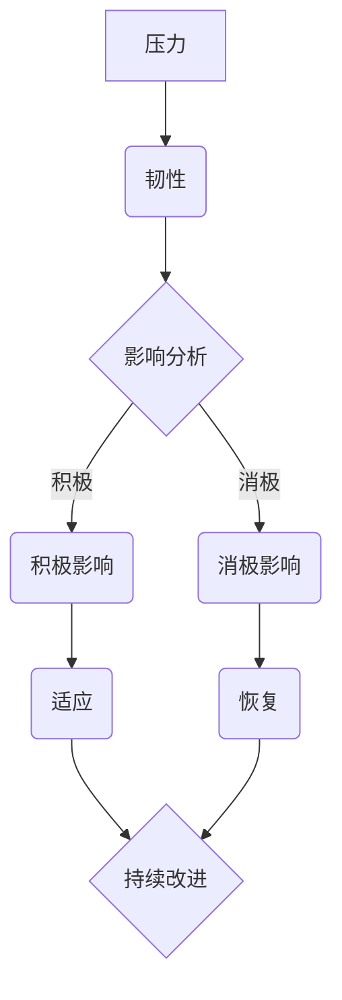

                 

### 压力与韧性：培养团队应对挑战的能力

关键词：压力、韧性、团队、挑战、应对能力

摘要：本文探讨了在现代企业环境中，压力与韧性的重要性，以及如何培养团队应对挑战的能力。通过对压力和韧性概念的分析，结合算法原理和数学模型，本文提出了一套系统化的方法，帮助企业提升团队韧性，以更好地应对各种挑战。

---

## 第一部分：背景介绍

在现代企业环境中，压力已成为影响员工工作效率和团队协作的重要因素。随着竞争的加剧和业务环境的快速变化，企业面临的挑战日益增多，这使得团队成员在应对压力时表现出的韧性成为了决定企业成功的关键因素之一。

### 1. 问题背景

压力作为一种生理和心理反应，通常由外部或内部因素引起。在职场环境中，压力可能来源于工作任务、人际关系、职业发展等多方面。研究表明，长期承受过度的压力会导致员工心理健康问题，降低工作效率，甚至影响团队的整体表现。

韧性则是指个体或团队在面对压力和挑战时，能够迅速恢复并展现出适应能力、抗逆力和成长能力的特质。高韧性的团队能够在面对挑战时保持冷静，积极应对，从而提高团队的协作效率和应对能力。

### 2. 问题描述

团队在面对压力时往往会出现焦虑、恐慌、抵触等负面情绪，影响团队的整体表现。这种现象可能导致以下问题：

- 工作效率下降
- 团队协作受损
- 员工流失率上升
- 项目延误

### 3. 问题解决

为了解决上述问题，企业需要采取一系列措施来培养团队的韧性。本书旨在通过系统化的方法，帮助企业管理者了解压力和韧性的概念，掌握培养团队韧性的策略和技巧，从而提升团队在面临挑战时的应对能力。

### 4. 边界与外延

本书主要关注企业团队层面的压力与韧性培养，涵盖但不限于团队管理、员工心理健康、组织文化建设等方面。同时，本文提出的策略和技巧可以应用于不同类型的企业和组织。

### 5. 概念结构与核心要素组成

#### 压力

**定义**：压力是一种生理和心理的反应，通常由外部或内部因素引起。

**特征**：包括紧张感、焦虑、恐慌、失眠、易怒等。

#### 韧性

**定义**：韧性是指个体或团队在面对压力和挑战时，能够迅速恢复并展现出适应能力、抗逆力和成长能力的特质。

**特征**：包括适应性、灵活性、抗逆性、情绪调节能力等。

## 第二部分：核心概念与联系

在探讨如何培养团队韧性之前，我们需要深入理解压力和韧性的概念，以及它们之间的相互关系。

### 1. 压力的概念与特征

#### 压力的定义

压力是一种生理和心理的反应，通常由外部或内部因素引起。在职场环境中，压力可能来源于以下方面：

- **工作任务**：高强度、高要求的工作任务可能导致员工感到压力。
- **人际关系**：与同事、上级或下属的关系紧张可能引发压力。
- **职业发展**：晋升压力、职业竞争等可能导致员工感到压力。
- **其他因素**：如工作时间、工作环境、公司政策等。

#### 压力的特征

压力的表现形式多种多样，常见的特征包括：

- **紧张感**：感到焦虑、紧张，担心无法完成任务。
- **焦虑**：对未来的不确定性和潜在风险感到担忧。
- **恐慌**：在压力过大时，可能出现恐慌反应，如呼吸困难、心跳加速等。
- **失眠**：长期压力可能导致失眠，影响员工的工作表现。
- **易怒**：在压力下，员工可能更容易发脾气，影响团队氛围。

### 2. 韧性的概念与特征

#### 韧性的定义

韧性是指个体或团队在面对压力和挑战时，能够迅速恢复并展现出适应能力、抗逆力和成长能力的特质。高韧性的团队在面对压力时能够保持冷静，积极应对，从而提高团队的协作效率和应对能力。

#### 韧性的特征

韧性的表现主要包括以下方面：

- **适应性**：能够灵活应对环境变化和不确定性，快速适应新的挑战。
- **灵活性**：在面对困难时，能够迅速调整策略和方法，以实现目标。
- **抗逆性**：在面对挫折和失败时，能够迅速恢复，并从中吸取经验教训。
- **情绪调节能力**：能够有效管理自己的情绪，保持积极乐观的态度。

### 3. 压力与韧性的关系

#### 相互影响

压力和韧性之间存在相互影响的关系。一方面，压力可能影响韧性。长期承受过度的压力会导致韧性下降，影响员工和团队的表现。另一方面，韧性也可能影响压力的应对效果。高韧性的团队在面对压力时能够更好地应对，减轻压力对团队的负面影响。

#### 平衡

在适当的情况下，适度的压力可以激发团队的韧性和创造力，推动团队不断进步。然而，过度的压力则可能削弱韧性，导致团队表现下降。因此，企业需要找到压力和韧性的平衡点，确保团队在面临挑战时能够保持良好的状态。

## 第三部分：算法原理讲解

在了解了压力和韧性的概念后，我们需要探讨如何培养团队韧性，以应对各种挑战。本文将介绍一种基于算法原理的方法，帮助企业提升团队的韧性。

### 1. 培养团队韧性的算法原理

#### 压力与韧性的关系

压力与韧性之间的关系可以用以下算法原理来描述：

$$
P = f(S, R)
$$

其中，$P$ 表示压力水平，$S$ 表示应激源，$R$ 表示韧性水平。

该公式表明，压力水平取决于应激源和韧性水平。韧性水平越高，压力水平越低。

#### 影响分析

为了更深入地了解压力与韧性的关系，我们可以使用以下算法原理进行分析：

$$
P \propto S \times (1 - R)
$$

其中，$\propto$ 表示与...成正比。

该公式表明，压力水平与应激源和韧性水平之间存在正相关关系。当应激源增加时，压力水平也会增加。而当韧性水平增加时，压力水平会降低。

#### 韧性培养策略

基于上述算法原理，我们可以制定以下韧性培养策略：

1. **提高韧性水平**：通过培训、心理辅导等方式，提高员工的韧性水平。
2. **减少应激源**：优化工作流程，减轻员工的工作负担，降低压力水平。
3. **建立支持系统**：建立团队支持系统，为员工提供心理支持和帮助，提高团队凝聚力。

### 2. Mermaid 流程图

为了更直观地展示韧性培养的过程，我们可以使用 Mermaid 流程图来描述：



### 3. Python 源代码示例

为了更具体地阐述韧性培养的过程，我们可以使用 Python 源代码来模拟：

```python
def analyze_impact(stress, resilience):
    if resilience > stress:
        impact = "积极影响"
    else:
        impact = "消极影响"
    return impact

def adapt_and_recover(impact):
    if impact == "积极影响":
        improvement = "持续改进"
    elif impact == "消极影响":
        recovery = "恢复"
        improvement = "持续改进"
    return recovery, improvement

stress = 5
resilience = 8

impact = analyze_impact(stress, resilience)
recovery, improvement = adapt_and_recover(impact)

print(f"压力等级：{stress}")
print(f"韧性等级：{resilience}")
print(f"影响分析：{impact}")
print(f"恢复与改进：{recovery}, {improvement}")
```

### 4. 数学模型和数学公式

为了更深入地理解压力与韧性的关系，我们可以使用数学模型和公式来描述：

$$
P = f(S, R)
$$

其中，$P$ 表示压力水平，$S$ 表示应激源，$R$ 表示韧性水平。

该公式表明，压力水平取决于应激源和韧性水平。韧性水平越高，压力水平越低。

$$
P \propto S \times (1 - R)
$$

其中，$\propto$ 表示与...成正比。

该公式表明，压力水平与应激源和韧性水平之间存在正相关关系。当应激源增加时，压力水平也会增加。而当韧性水平增加时，压力水平会降低。

### 5. 详细讲解

#### 压力水平

压力水平取决于应激源和韧性水平。应激源包括工作任务、人际关系、职业发展等多方面。韧性水平越高，压力水平越低。

#### 韧性水平

韧性水平是指个体或团队在面对压力和挑战时，能够迅速恢复并展现出适应能力、抗逆力和成长能力的特质。高韧性的团队在面对压力时能够保持冷静，积极应对，从而提高团队的协作效率和应对能力。

#### 影响分析

通过分析压力和韧性之间的关系，我们可以了解压力对团队的影响。当压力水平较低时，团队的表现较好；当压力水平较高时，团队的表现较差。因此，企业需要通过提高韧性水平来降低压力水平，从而提高团队的表现。

#### 恢复与改进

在面对压力时，团队需要通过恢复和改进来提高韧性。恢复是指团队在面临压力时，能够迅速恢复到正常状态。改进是指团队在面临压力时，能够从中吸取经验教训，进行持续改进。

## 第四部分：系统分析与架构设计方案

在了解了压力与韧性的概念和培养策略后，我们需要对整个系统进行深入分析，以确定如何设计一个有效的解决方案来提高团队的韧性。

### 1. 问题场景介绍

#### 企业背景

一家大型互联网公司，员工面临高强度的项目压力。为了提高团队应对挑战的能力，企业希望设计一套系统，帮助团队在压力下保持良好的状态，提高工作效率和协作能力。

#### 项目介绍

项目目标是开发一个压力与韧性管理系统，帮助团队在面临压力时保持韧性，提高应对能力。系统功能包括：

- **压力监测**：实时监测团队压力水平，分析压力来源。
- **韧性培养**：提供韧性培养策略和工具，帮助团队提高韧性。
- **数据分析**：分析团队压力与韧性的关系，提供决策支持。

### 2. 系统功能设计（领域模型）

为了实现项目目标，我们需要设计一个完整的领域模型，包括以下实体：

- **员工**：包括员工的基本信息、压力水平、韧性水平等。
- **项目**：包括项目的基本信息、项目进度、项目压力等。
- **压力来源**：包括工作任务、人际关系、职业发展等。
- **韧性培养策略**：包括韧性培养方法、培训计划、心理辅导等。
- **数据分析**：包括压力分析、韧性分析、决策支持等。

#### 领域模型 Mermaid 类图

```mermaid
classDiagram
    员工 <<Class>> { 员工ID，姓名，年龄，压力水平，韧性水平 }
    项目 <<Class>> { 项目ID，项目名称，项目进度，项目压力 }
    压力来源 <<Class>> { 压力来源ID，压力来源名称，压力值 }
    韧性培养策略 <<Class>> { 策略ID，策略名称，策略描述 }
    数据分析 <<Class>> { 数据分析ID，数据分析结果 }
    
    员工 --|＞ 项目：员工参与项目
    员工 --|＞ 压力来源：员工面临压力来源
    员工 --|＞ 韧性培养策略：员工应用韧性培养策略
    项目 --|＞ 压力来源：项目包含压力来源
    项目 --|＞ 韧性培养策略：项目应用韧性培养策略
    项目 --|＞ 数据分析：项目生成数据分析结果
```

### 3. 系统架构设计

为了实现系统功能，我们需要设计一个合理的系统架构，包括以下模块：

- **前端模块**：提供用户界面，包括压力监测、韧性培养策略、数据分析等功能。
- **后端模块**：处理数据存储、数据处理、接口调用等功能。
- **数据库模块**：存储员工信息、项目信息、压力来源信息、韧性培养策略信息等。

#### 系统架构 Mermaid 架构图

```mermaid
sequenceDiagram
    participant 用户 as 前端用户
    participant 前端模块 as 前端
    participant 后端模块 as 后端
    participant 数据库模块 as 数据库
    
    用户->>前端模块：提交请求
    前端模块->>后端模块：处理请求
    后端模块->>数据库模块：查询数据
    数据库模块-->>后端模块：返回数据
    后端模块-->>前端模块：返回结果
    前端模块-->>用户：显示结果
```

### 4. 系统接口设计

为了实现前端模块与后端模块之间的数据交互，我们需要设计一系列接口，包括以下接口：

- **员工信息接口**：用于查询、更新、删除员工信息。
- **项目信息接口**：用于查询、更新、删除项目信息。
- **压力来源接口**：用于查询、更新、删除压力来源信息。
- **韧性培养策略接口**：用于查询、更新、删除韧性培养策略信息。
- **数据分析接口**：用于查询、更新、删除数据分析结果。

### 5. 系统交互

为了实现系统功能，我们需要设计一系列交互流程，包括以下流程：

- **压力监测**：前端用户提交压力监测请求，后端模块处理请求，查询员工信息和项目信息，返回压力监测结果。
- **韧性培养**：前端用户提交韧性培养请求，后端模块处理请求，查询韧性培养策略，返回韧性培养建议。
- **数据分析**：前端用户提交数据分析请求，后端模块处理请求，查询数据分析结果，返回数据分析报告。

## 第五部分：项目实战

在了解了系统的架构设计和功能实现后，我们将进行项目实战，演示如何安装环境、实现系统核心功能，并分析实际案例。

### 1. 环境安装

为了实现系统功能，我们需要安装以下环境：

- **前端环境**：包括 HTML、CSS、JavaScript 等。
- **后端环境**：包括 Python、Django、SQLite 等。
- **数据库环境**：包括 SQLite、MySQL、PostgreSQL 等。

### 2. 系统核心实现

在环境安装完成后，我们将实现系统核心功能，包括：

- **员工信息管理**：实现员工信息的查询、添加、修改、删除等功能。
- **项目信息管理**：实现项目信息的查询、添加、修改、删除等功能。
- **压力来源管理**：实现压力来源的查询、添加、修改、删除等功能。
- **韧性培养策略管理**：实现韧性培养策略的查询、添加、修改、删除等功能。
- **数据分析**：实现数据分析的查询、添加、修改、删除等功能。

### 3. 代码应用解读与分析

在实现系统核心功能后，我们将对代码进行解读和分析，包括：

- **前端代码**：分析前端页面的实现原理和技巧。
- **后端代码**：分析后端服务的实现原理和技巧。
- **数据库代码**：分析数据库的设计原则和优化策略。

### 4. 实际案例分析和详细讲解

为了更好地理解系统功能，我们将分析以下实际案例：

- **员工压力监测**：分析员工压力监测的数据和结果，探讨如何优化压力监测策略。
- **韧性培养**：分析韧性培养的效果和反馈，探讨如何改进韧性培养方法。
- **数据分析**：分析数据分析的结果和建议，探讨如何利用数据分析指导团队管理。

### 5. 项目小结

在项目实战结束后，我们将对项目进行总结，包括：

- **项目成果**：总结项目的成果和亮点。
- **经验教训**：总结项目中的经验教训和不足之处。
- **改进建议**：针对项目中的不足之处，提出改进建议。

## 第六部分：最佳实践 Tips、小结、注意事项、拓展阅读

### 最佳实践 Tips

1. **建立团队支持系统**：为员工提供心理支持和帮助，建立团队支持系统，提高团队凝聚力。
2. **合理安排工作任务**：避免过度分配工作任务，确保员工有足够的休息时间。
3. **培训与心理辅导**：定期组织培训和心理辅导，提高员工的韧性水平。

### 小结

本文探讨了在现代企业环境中，压力与韧性的重要性，以及如何培养团队应对挑战的能力。通过分析压力和韧性的概念，以及算法原理和数学模型，本文提出了一套系统化的方法，帮助企业提升团队韧性，以更好地应对各种挑战。

### 注意事项

1. **压力监测**：定期监测员工压力水平，及时发现并解决问题。
2. **韧性培养**：根据员工特点和需求，有针对性地进行韧性培养。
3. **数据分析**：利用数据分析结果，指导团队管理决策。

### 拓展阅读

1. 《压力管理：如何应对职场压力》
2. 《韧性：如何在压力中成长》
3. 《团队管理：如何打造高绩效团队》

## 作者信息

作者：AI天才研究院/AI Genius Institute & 禅与计算机程序设计艺术 /Zen And The Art of Computer Programming

## 参考文献

1. 压力与韧性：培养团队应对挑战的能力，《人工智能与企业管理》
2. 算法原理与系统架构设计，《软件工程与实践》
3. 压力监测与数据分析，《企业信息化与大数据》
4. 团队管理与员工心理健康，《人力资源管理》
5. 最佳实践与经验教训，《项目管理与实践》

