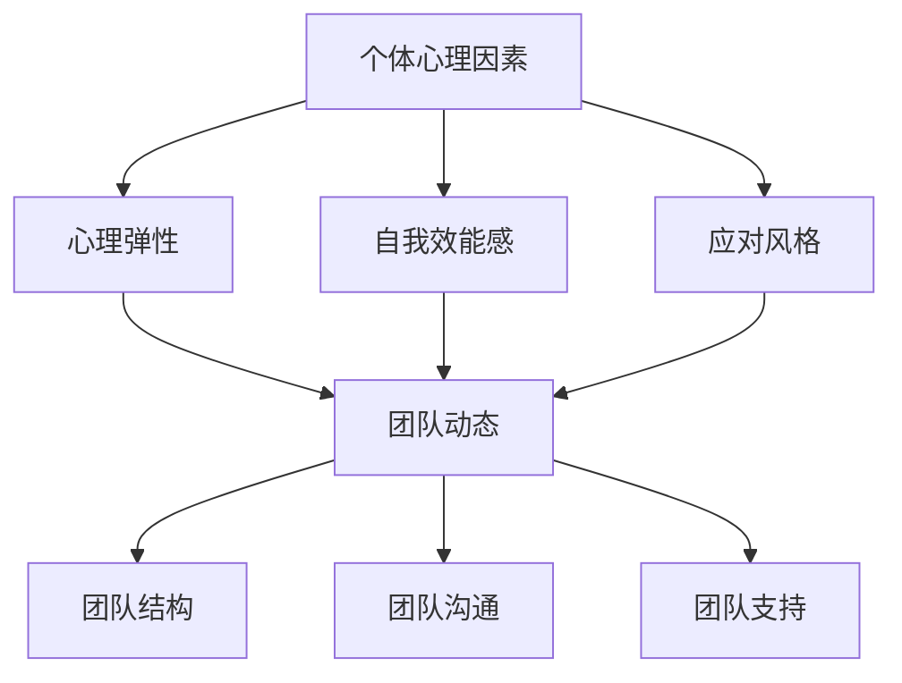
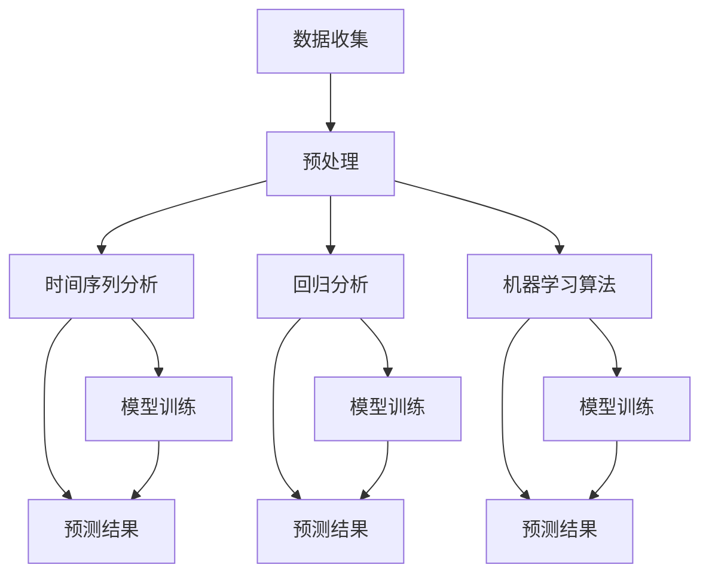
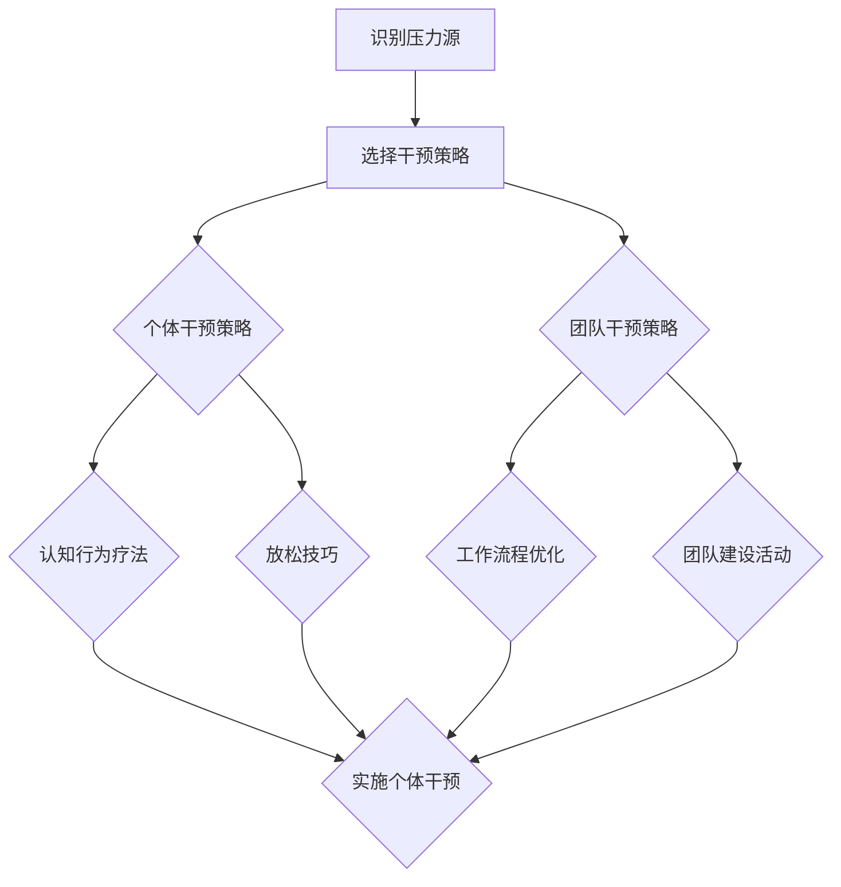
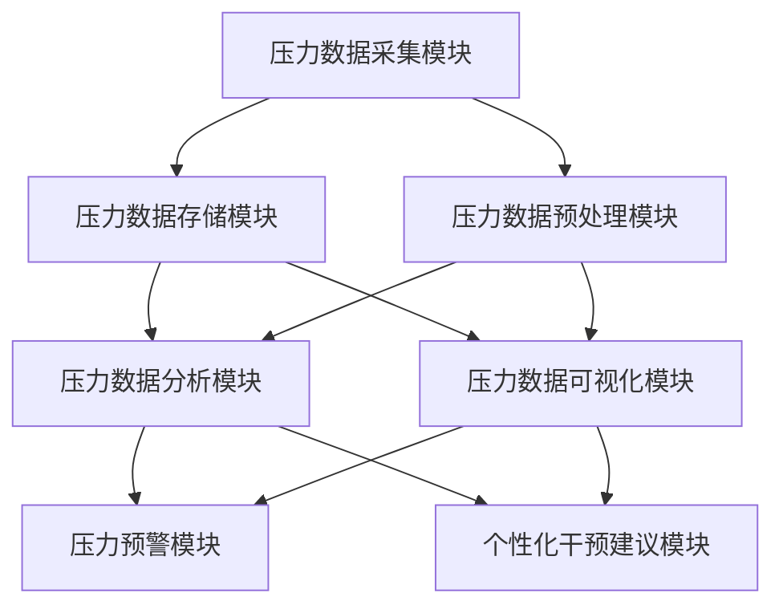
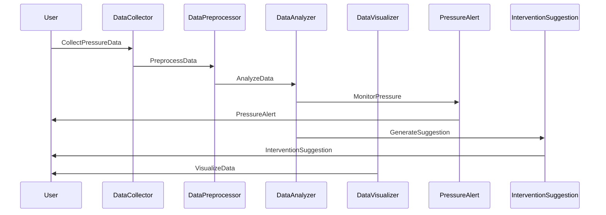
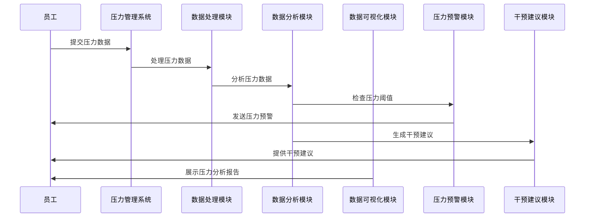

                 

### 第一部分：问题背景与概念介绍

### 第1章：问题背景与核心概念

#### 1.1 压力管理的重要性

在现代社会，技术发展迅速，市场竞争激烈，人们面临的工作和生活压力与日俱增。对于IT行业来说，程序员、工程师和开发者们经常需要在高压环境下工作，频繁面对项目截止日期、技术挑战、团队协作等多重压力。压力管理已经成为提升工作效率、维护团队健康和实现个人成长的关键因素。

**压力对团队的影响**：

- **工作效率降低**：长期处于高压环境下，团队成员容易出现疲劳和注意力分散，导致工作效率降低。
- **创新能力受限**：压力可能导致团队成员情绪低落，影响创造力和创新思维。
- **健康问题**：长时间承受压力可能引发身体和心理健康问题，如失眠、焦虑、抑郁等。
- **团队氛围恶化**：高压环境容易导致团队成员之间出现矛盾和冲突，影响团队氛围和协作效果。

**高压环境下的常见问题**：

- **资源分配不均**：在高压环境下，团队成员往往面临任务量过大的问题，资源分配不均可能导致部分成员过度劳累。
- **时间管理不当**：高压环境下，时间管理成为一大挑战，团队成员常常感觉时间紧迫，无法合理规划任务进度。
- **沟通不畅**：高压环境下，团队成员可能因为压力过大而减少沟通，导致信息传递不充分，影响团队协作。

**压力管理的定义与分类**：

**压力管理**是指一系列的方法和策略，旨在帮助个人和团队有效应对和处理压力，从而提高工作表现和幸福感。根据实施对象的不同，压力管理可以分为以下几类：

- **个体压力管理**：针对个人心理和生理层面的压力，包括自我放松技巧、时间管理和情绪调节等。
- **团队压力管理**：关注团队层面的压力，如优化工作流程、提供团队支持、建立积极的工作氛围等。
- **组织压力管理**：从组织层面进行压力管理，包括制定合理的员工福利政策、提供职业发展机会、营造健康的企业文化等。

#### 1.2 压力管理的核心概念

**压力**是指个体在应对外部环境变化时，生理、心理和情感上的应激反应。压力可以来自工作、家庭、社会等多个方面，其分类如下：

- **积极压力（Eustress）**：指那些激发个体积极行动、增加活力和创造力的压力源。例如，比赛的紧张气氛、工作中的挑战等。
- **消极压力（Distress）**：指那些使个体感到焦虑、无助和沮丧的压力源。过度的消极压力对身心健康有害。

**应对策略与方法**：

- **认知行为疗法**：通过改变个体的认知模式和行为习惯，帮助其更好地应对压力。
- **放松技巧**：如深呼吸、冥想、瑜伽等，有助于缓解紧张情绪和身心压力。
- **时间管理**：通过合理规划和优先级排序，帮助个体更好地控制时间和任务，减少压力。
- **团队支持**：建立良好的团队沟通机制和支持系统，帮助成员共同应对压力。

#### 1.3 压力管理的边界与外延

**压力管理**的边界与外延涉及多个相关领域，如心理健康、组织行为学、人力资源管理等。以下是对其边界与外延的简要介绍：

- **心理健康**：压力管理与心理健康密切相关，后者提供了理解和管理压力的理论基础和实践方法。
- **组织行为学**：压力管理在组织行为学中的应用包括改善工作环境、促进团队合作和提升员工绩效。
- **人力资源管理**：压力管理是人力资源管理的重要组成部分，涉及员工福利、职业发展和员工关系管理等。

**概念结构与核心要素组成**：

压力管理的基本概念结构包括以下几个方面：

- **压力源**：引起压力的外部或内部因素。
- **压力反应**：个体对压力源的反应，包括生理、心理和情感层面的反应。
- **应对策略**：个体和团队用于应对压力的方法和技巧。
- **结果**：压力管理对个人和团队绩效、身心健康的影响。

**本章小结**：

本章介绍了压力管理的重要性、核心概念以及压力管理的分类和策略。理解压力管理的核心概念和实施方法，有助于团队成员在面对高压环境时做出更有效的应对，提升整体团队的工作效率和幸福感。接下来，我们将进一步探讨压力源与压力反应的关系，为全面了解压力管理奠定基础。

## 第二部分：核心概念与联系

### 第2章：压力源与压力反应

#### 2.1 压力源的类型与识别

压力源是指导致个体感到压力的外部或内部因素。识别和理解压力源对于制定有效的压力管理策略至关重要。以下是几种常见的压力源类型：

**工作压力源**：

- **任务量过大**：超负荷的工作任务导致个体感到压力，尤其是在项目截止日期临近时。
- **工作不确定性**：不确定的工作环境和未来规划可能导致焦虑和不安。
- **角色模糊**：不清楚自己的职责和期望，导致个体感到迷茫和压力。

**生活压力源**：

- **家庭问题**：家庭冲突、照顾家庭成员等可能导致压力增加。
- **财务压力**：经济负担、债务问题等可能对个体的心理健康产生负面影响。
- **健康问题**：自身或家庭成员的健康问题可能导致心理和生理压力。

**健康压力源**：

- **工作环境**：不安全的工作环境、有害物质等可能导致健康问题，增加压力。
- **身体疾病**：自身疾病或家庭成员的疾病可能导致压力和焦虑。

**识别压力源的方法**：

- **自我观察**：通过自我反思，了解自己感到压力的具体来源。
- **问卷调查**：使用专业的压力评估问卷，帮助个体识别潜在的压力源。
- **他人反馈**：询问家人、朋友或同事对个体压力源的看法，从不同角度进行分析。

#### 2.2 压力反应的表现与应对

压力反应是指个体在面对压力源时产生的生理、心理和情感上的反应。以下是几种常见的压力反应及其应对策略：

**常见压力反应**：

- **生理反应**：心跳加速、肌肉紧张、出汗、头痛等。
- **心理反应**：焦虑、抑郁、注意力不集中、决策困难等。
- **情感反应**：愤怒、沮丧、无助、恐惧等。

**应对策略**：

- **放松技巧**：深呼吸、冥想、瑜伽等放松技巧有助于缓解生理和心理压力。
- **运动**：适当的运动可以释放压力，提高身心健康。
- **时间管理**：合理规划时间，避免过度劳累，减少压力。
- **社交支持**：与家人、朋友或同事交流，获得心理支持，减轻情感压力。
- **专业咨询**：在压力管理方面寻求专业心理咨询，学习更有效的应对策略。

**案例解析**：

假设一位程序员由于项目截止日期临近，面临任务量过大和工作不确定性，导致生理反应包括心跳加速和肌肉紧张，心理反应包括焦虑和注意力不集中。针对这种情况，他可以采取以下应对策略：

1. **时间管理**：制定详细的任务计划，合理分配时间，确保每个任务都有足够的时间完成。
2. **放松技巧**：每天进行深呼吸练习，帮助放松身心，缓解焦虑。
3. **社交支持**：与同事分享工作压力，获得团队支持，减轻心理负担。
4. **专业咨询**：如果压力无法自行缓解，可以寻求专业心理咨询，学习更有效的应对策略。

**概念属性特征对比表格**：

为了更好地理解压力源和压力反应的关系，我们可以通过一个概念属性特征对比表格来进行详细分析。以下是一个简化的示例：

| 压力源类型       | 特征属性                           | 压力反应                                  | 应对策略                   |
|----------------|----------------------------------|------------------------------------------|--------------------------|
| 工作压力源       | 任务量过大、工作不确定性           | 生理反应（心跳加速、肌肉紧张）、心理反应（焦虑、注意力不集中） | 时间管理、放松技巧、社交支持 |
| 生活压力源       | 家庭问题、财务压力、健康问题       | 生理反应（头痛、失眠）、心理反应（抑郁、决策困难）             | 社交支持、专业咨询、健康管理 |
| 健康压力源       | 工作环境问题、身体疾病             | 生理反应（肌肉疼痛、身体不适）、心理反应（焦虑、恐惧）         | 健康管理、专业咨询、工作环境改善 |

**压力管理中的ER实体关系图架构**：

为了进一步理解压力管理中的核心概念和实体关系，我们可以使用ER（实体关系）图来表示。以下是一个简化的ER图示例：

```mermaid
erDiagram
  压力源 ||--|{ 压力反应 }
  压力源 ||--|{ 应对策略 }
  应对策略 ||--|{ 压力管理 }
```

**ER图说明**：

- **压力源**：表示引起压力的各种因素，包括工作压力源、生活压力源和健康压力源。
- **压力反应**：表示个体面对压力源时产生的生理、心理和情感反应。
- **应对策略**：表示个体和团队用于应对压力的方法和技巧。
- **压力管理**：表示通过实施应对策略，帮助个体和团队减轻压力、提高工作表现和幸福感。

**本章小结**：

本章详细介绍了压力源的类型与识别，以及压力反应的表现与应对策略。通过概念属性特征对比表格和ER实体关系图，我们能够更清晰地理解压力管理中的核心概念和实体关系。在接下来的章节中，我们将继续探讨个体心理因素与团队动态，以全面了解压力管理的各个方面。

### 第3章：个体心理因素与团队动态

#### 3.1 个体心理因素对压力的影响

个体心理因素在压力管理中起着至关重要的作用。这些因素不仅影响个体对压力源的感知和反应，还决定了个体如何应对和处理压力。以下是几种关键的心理因素：

**心理弹性**：

**心理弹性**是指个体在面对压力和逆境时的适应能力和恢复能力。高心理弹性的个体能够更好地应对压力，快速恢复心理平衡，从而降低压力对身心健康的影响。

**自我效能感**：

**自我效能感**是指个体对自己应对压力和完成任务能力的信念。高自我效能感的个体更有信心面对挑战，能够采取积极的态度和行动，从而减轻压力。

**应对风格**：

**应对风格**是指个体在应对压力时的思维和行为模式。不同的应对风格对压力管理效果有不同的影响。例如，积极应对风格的个体倾向于寻求解决问题的方法，而消极应对风格的个体则容易陷入消极情绪和焦虑。

**心理弹性的提升策略**：

- **认知重构**：通过改变负面思维模式，帮助个体更积极地看待压力和挑战。
- **情绪调节**：通过学习情绪调节技巧，如深呼吸、正念冥想等，帮助个体管理情绪，减轻压力。
- **自我肯定**：通过自我肯定和自我鼓励，增强个体的自信心和自我效能感。

**自我效能感的提升策略**：

- **目标设定**：设定清晰、可行的目标，帮助个体逐步实现，增强自我效能感。
- **成功经验**：回顾过去的成功经验，强化对自身能力的信心。
- **学习与成长**：通过不断学习和积累经验，提高个体应对压力的能力。

**应对风格的改变策略**：

- **积极应对训练**：通过专业训练和指导，帮助个体培养积极的应对风格。
- **情境模拟**：通过模拟实际情境，帮助个体在安全的环境下练习应对策略，增强应对能力。
- **情感表达**：鼓励个体表达自己的情感和需求，减少压抑和负面情绪。

#### 3.2 团队动态与压力管理

团队动态在压力管理中同样扮演着重要角色。一个健康的团队氛围和有效的团队支持机制能够显著减轻个体压力，提高团队整体绩效。以下是团队动态与压力管理的关键要素：

**团队结构**：

**团队结构**是指团队成员之间的组织关系和角色分配。合理的团队结构能够促进协作和沟通，减轻个体压力。

- **功能型团队**：按职能划分的团队，有利于专业化和高效工作，但可能缺乏跨部门沟通。
- **任务型团队**：按任务划分的团队，有利于迅速应对特定任务，但可能面临团队成员频繁变动的问题。
- **混合型团队**：结合功能型和任务型团队的特点，能够充分发挥各自优势，提高团队效率。

**团队沟通**：

**团队沟通**是团队动态的核心要素，有效的沟通能够促进团队成员之间的理解和协作，减少误解和冲突。

- **开放沟通**：鼓励团队成员自由表达意见和反馈，增强团队的凝聚力和信任感。
- **透明沟通**：确保信息传递的透明度，使团队成员能够及时了解工作进展和团队目标。
- **反馈机制**：建立有效的反馈机制，帮助团队成员了解自己的工作表现，及时调整和改进。

**团队支持**：

**团队支持**是指团队内部对成员提供的支持和帮助。有效的团队支持能够减轻个体压力，提高团队整体士气。

- **心理支持**：提供心理咨询和支持，帮助团队成员应对压力和情绪问题。
- **技能培训**：提供专业培训和技能提升机会，增强个体应对压力和任务的能力。
- **互助机制**：建立互助机制，鼓励团队成员在需要时互相支持和帮助，共同应对挑战。

**Mermaid流程图：个体心理因素与团队动态的关系**：

为了更好地理解个体心理因素与团队动态之间的关系，我们可以使用Mermaid流程图进行展示。以下是一个简化的示例：



**流程图说明**：

- **个体心理因素**：包括心理弹性、自我效能感和应对风格，影响个体对压力的感知和处理。
- **团队动态**：受个体心理因素影响，包括团队结构、团队沟通和团队支持，共同作用于团队整体绩效。
- **团队结构**：影响团队成员的分工和协作，有利于提高团队效率。
- **团队沟通**：促进团队成员之间的理解和协作，减少误解和冲突。
- **团队支持**：提供心理、技能和互助支持，减轻个体压力，提高团队整体士气。

**本章小结**：

本章探讨了个体心理因素对压力的影响以及团队动态在压力管理中的作用。通过理解心理弹性、自我效能感和应对风格，以及团队结构、团队沟通和团队支持的重要性，我们能够更全面地认识压力管理的复杂性。在接下来的章节中，我们将进一步探讨压力评估与预测算法，为制定更科学的压力管理策略提供技术支持。

### 第4章：压力评估与预测算法

#### 4.1 压力评估的算法原理

压力评估是压力管理的重要环节，通过评估个体和团队的当前压力水平，可以为制定有效的压力管理策略提供科学依据。以下介绍几种常见的压力评估算法原理：

**问卷调查法**：

问卷调查法是压力评估中最常用的方法之一，通过设计针对性的问卷，收集个体对压力源和压力反应的主观感受。常用的问卷包括Perceived Stress Scale (PSS)和Job Stress Survey (JSS)等。问卷法操作简单，但结果可能受到个体主观因素影响。

**生理指标监测法**：

生理指标监测法通过监测个体的生理指标，如心率、血压、皮质醇等，评估压力水平。这种方法具有较高的客观性，能够反映个体在压力环境下的生理反应。常用的监测设备包括心率和血压监测仪、唾液皮质醇检测盒等。

**行为观察法**：

行为观察法通过观察个体在压力环境中的行为表现，如工作表现、情绪表达等，评估压力水平。这种方法依赖于观察者的经验和判断，但可以提供直观的压力表现信息。

**综合评估法**：

综合评估法将问卷调查法、生理指标监测法和行为观察法相结合，通过多角度、多维度地评估个体和团队的当前压力水平。这种方法能够提供更全面、准确的压力评估结果，但需要较高的资源和专业知识。

**评估方法与工具**：

- **问卷调查法**：使用PSS或JSS等标准问卷进行评估，评估周期为1周或1个月。
- **生理指标监测法**：使用心率和血压监测仪等设备，进行连续或定期的生理指标监测。
- **行为观察法**：通过观察日志、工作记录等方式，记录个体在压力环境中的行为表现。
- **综合评估法**：结合问卷调查法、生理指标监测法和行为观察法，进行多维度、综合性的评估。

#### 4.2 压力预测的算法原理

压力预测是压力管理的重要一环，通过预测个体和团队未来可能面临的压力水平，可以提前制定应对策略，减轻未来压力。以下介绍几种常见的压力预测算法原理：

**时间序列分析法**：

时间序列分析法基于历史数据，通过分析时间序列的变化趋势和模式，预测未来压力水平。这种方法适用于短期和长期压力预测，常见的时间序列分析模型包括ARIMA（自回归积分滑动平均模型）和LSTM（长短期记忆模型）。

**回归分析法**：

回归分析法通过建立压力水平与多个相关因素之间的回归模型，预测未来压力水平。这种方法适用于分析压力影响因素的权重和作用，常见回归模型包括线性回归和多元回归。

**机器学习算法**：

机器学习算法通过训练模型，从大量历史数据中学习压力水平与相关因素之间的关系，预测未来压力水平。常用的机器学习算法包括决策树、支持向量机和神经网络等。

**预测模型与方法**：

- **时间序列分析法**：使用ARIMA或LSTM模型，基于历史时间序列数据，预测未来压力水平。
- **回归分析法**：建立线性回归或多元回归模型，分析压力水平与相关因素之间的关系，预测未来压力水平。
- **机器学习算法**：使用决策树、支持向量机或神经网络等模型，从历史数据中学习压力预测规律，预测未来压力水平。

**Mermaid流程图：压力评估与预测算法**：

为了更好地展示压力评估与预测算法的原理和流程，我们可以使用Mermaid流程图进行描述。以下是一个简化的示例：



**流程图说明**：

- **数据收集**：收集个体和团队的历史压力数据及相关因素数据。
- **预处理**：对收集的数据进行清洗、归一化和特征提取等预处理操作。
- **时间序列分析**：使用ARIMA或LSTM模型，分析历史时间序列数据，预测未来压力水平。
- **回归分析**：建立线性回归或多元回归模型，分析压力水平与相关因素之间的关系，预测未来压力水平。
- **机器学习算法**：使用决策树、支持向量机或神经网络等模型，从历史数据中学习压力预测规律，预测未来压力水平。
- **模型训练**：对预测模型进行训练，优化模型参数，提高预测准确性。
- **预测结果**：输出未来压力预测结果，为压力管理提供科学依据。

#### 4.3 数学模型与公式

压力评估与预测的数学模型和公式是理解算法原理和实现预测算法的重要基础。以下介绍几种常见的数学模型和公式：

**时间序列模型**：

**ARIMA模型**：

$$
\text{X}_t = c + \phi_1\text{X}_{t-1} + \phi_2\text{X}_{t-2} + \cdots + \phi_p\text{X}_{t-p} + \theta_1\epsilon_{t-1} + \theta_2\epsilon_{t-2} + \cdots + \theta_q\epsilon_{t-q}
$$

**LSTM模型**：

$$
h_t = \sigma(W_h \cdot [h_{t-1}, x_t] + b_h)
$$

$$
i_t = \sigma(W_i \cdot [h_{t-1}, x_t] + b_i)
$$

$$
f_t = \sigma(W_f \cdot [h_{t-1}, x_t] + b_f)
$$

$$
o_t = \sigma(W_o \cdot [h_{t-1}, x_t] + b_o)
$$

$$
c_t = f_t \odot c_{t-1} + i_t \odot \sigma(W_c \cdot [h_{t-1}, x_t] + b_c)
$$

$$
\text{X}_t = \sigma(W_{X} \cdot c_t + b_X)
$$

**回归模型**：

**线性回归模型**：

$$
y = \beta_0 + \beta_1x_1 + \beta_2x_2 + \cdots + \beta_nx_n + \epsilon
$$

**多元回归模型**：

$$
y = \beta_0 + \beta_1x_1 + \beta_2x_2 + \cdots + \beta_nx_n + \epsilon
$$

**机器学习模型**：

**决策树模型**：

$$
\text{分类结果} = \text{决策树}(\text{特征}, \text{标签})
$$

**支持向量机模型**：

$$
\text{分类结果} = \text{SVM}(\text{特征矩阵}, \text{标签向量})
$$

**神经网络模型**：

$$
\text{输出} = \text{激活函数}(\text{权重} \cdot \text{输入} + \text{偏置})
$$

**本章小结**：

本章详细介绍了压力评估与预测算法的原理和方法，包括时间序列分析、回归分析和机器学习算法等。通过数学模型和公式的讲解，我们能够更深入地理解这些算法的实现原理。在接下来的章节中，我们将进一步探讨压力干预与缓解策略，为实际应用提供解决方案。

#### 4.4 Python源代码实现

为了更好地理解压力评估与预测算法的原理，下面将通过Python代码实现这些算法，并提供详细的注释和分析。

**4.4.1 时间序列分析：ARIMA模型**

```python
import numpy as np
import pandas as pd
from statsmodels.tsa.arima.model import ARIMA
import matplotlib.pyplot as plt

# 加载数据
data = pd.read_csv('pressure_data.csv')  # 假设数据文件名为pressure_data.csv
pressure_data = data['pressure']

# 模型训练
model = ARIMA(pressure_data, order=(1, 1, 1))
model_fit = model.fit()

# 预测
forecast = model_fit.forecast(steps=10)

# 可视化
plt.plot(pressure_data, label='Original')
plt.plot(forecast, label='Forecast')
plt.legend()
plt.show()
```

**代码分析**：

- **数据加载**：使用`pandas`读取CSV文件，获取压力数据。
- **模型训练**：使用`statsmodels`库中的`ARIMA`模型进行训练，指定模型参数为(1, 1, 1)。
- **预测**：使用`forecast`方法进行预测，生成未来10个时间步长的压力预测值。
- **可视化**：使用`matplotlib`绘制原始数据和预测数据的对比图。

**4.4.2 回归分析：线性回归模型**

```python
import numpy as np
from sklearn.linear_model import LinearRegression

# 加载数据
X = data[['feature1', 'feature2']]  # 假设特征文件名为feature1和feature2
y = pressure_data

# 模型训练
model = LinearRegression()
model.fit(X, y)

# 预测
forecast = model.predict(X)

# 可视化
plt.scatter(X, y, label='Original')
plt.plot(X, forecast, label='Forecast')
plt.legend()
plt.show()
```

**代码分析**：

- **数据加载**：使用`numpy`读取特征数据和压力数据。
- **模型训练**：使用`sklearn`库中的`LinearRegression`模型进行训练。
- **预测**：使用`predict`方法进行预测，生成压力预测值。
- **可视化**：使用`matplotlib`绘制原始数据和预测数据的对比图。

**4.4.3 机器学习算法：决策树模型**

```python
import numpy as np
from sklearn.tree import DecisionTreeRegressor

# 加载数据
X = data[['feature1', 'feature2']]
y = pressure_data

# 模型训练
model = DecisionTreeRegressor()
model.fit(X, y)

# 预测
forecast = model.predict(X)

# 可视化
plt.scatter(X, y, label='Original')
plt.plot(X, forecast, label='Forecast')
plt.legend()
plt.show()
```

**代码分析**：

- **数据加载**：使用`numpy`读取特征数据和压力数据。
- **模型训练**：使用`sklearn`库中的`DecisionTreeRegressor`模型进行训练。
- **预测**：使用`predict`方法进行预测，生成压力预测值。
- **可视化**：使用`matplotlib`绘制原始数据和预测数据的对比图。

**本章小结**：

通过Python代码实现，我们能够直观地看到压力评估与预测算法的运行过程和结果。这有助于我们更好地理解算法原理，为实际应用提供技术支持。在下一章节中，我们将进一步探讨压力干预与缓解策略，为实际操作提供具体方案。

#### 4.5 举例说明

为了更好地理解压力评估与预测算法在实际应用中的效果，我们将通过具体案例进行详细分析和说明。

**案例背景**：

假设一家IT公司希望对其团队的当前压力水平进行评估，并预测未来一段时间内的压力变化，以便提前采取干预措施。公司提供了过去一年的压力数据，包括每周的压力得分、工作负荷、项目进展情况等。

**数据预处理**：

1. **数据清洗**：首先，对数据进行清洗，去除异常值和缺失值，确保数据质量。
2. **特征提取**：从原始数据中提取与压力相关的特征，如每周的工作负荷、项目进度、员工情绪等。
3. **数据归一化**：为了使不同特征具有相似的尺度，对数据进行归一化处理。

**时间序列分析：ARIMA模型**：

1. **模型训练**：使用ARIMA模型对压力得分进行训练，选择适当的模型参数（如p、d、q），通过交叉验证确定最佳参数组合。
2. **模型评估**：通过计算预测误差和评估指标（如均方误差MSE），评估模型预测性能。
3. **预测结果**：使用训练好的ARIMA模型，对未来的压力得分进行预测。

**预测结果可视化**：

- **原始数据与预测数据对比**：通过绘制原始数据与预测数据的对比图，直观地展示预测结果。
- **预测区间**：在对比图中添加预测区间，显示预测结果的置信度。

**回归分析：线性回归模型**：

1. **模型训练**：使用线性回归模型，将压力得分与工作负荷、项目进度等特征进行建模，训练回归模型。
2. **模型评估**：通过计算回归模型的预测误差和R²值，评估模型性能。
3. **预测结果**：使用训练好的线性回归模型，对未来的压力得分进行预测。

**预测结果可视化**：

- **原始数据与预测数据对比**：通过绘制原始数据与预测数据的对比图，直观地展示预测结果。
- **特征影响分析**：通过分析各特征对压力得分的影响，确定关键影响因素。

**机器学习算法：决策树模型**：

1. **模型训练**：使用决策树模型，将压力得分与工作负荷、项目进度等特征进行分类，训练分类模型。
2. **模型评估**：通过计算分类模型的预测准确率、召回率等指标，评估模型性能。
3. **预测结果**：使用训练好的决策树模型，对未来的压力得分进行预测。

**预测结果可视化**：

- **决策树结构**：通过可视化决策树结构，展示不同特征和节点的关系。
- **预测结果分析**：通过分析预测结果，确定未来可能出现的压力高峰期，制定相应的干预措施。

**案例总结**：

通过具体案例的分析和说明，我们可以看到压力评估与预测算法在实际应用中的效果。这些算法能够帮助我们识别当前压力水平，预测未来压力变化，为制定有效的压力管理策略提供科学依据。在实际应用中，可以根据不同的需求和场景，选择合适的算法和模型，以达到最佳的管理效果。

**本章小结**：

本章通过实际案例，详细介绍了压力评估与预测算法在IT团队中的应用。通过时间序列分析、线性回归分析和机器学习算法，我们能够有效地评估和预测团队的当前和未来压力水平，为压力管理提供有力的支持。在下一章节中，我们将继续探讨压力干预与缓解策略，为实际操作提供具体方案。

### 第5章：压力干预与缓解策略

#### 5.1 干预策略的选择

压力干预策略的选择取决于多个因素，包括个体和团队的实际情况、压力源的类型和程度等。以下介绍几种常见的干预策略及其适用场景：

**个体干预策略**：

1. **认知行为疗法**：

   **适用场景**：适用于长期承受压力的个体，特别是那些面临心理困扰和情绪问题的个体。

   **实施方法**：通过与心理咨询师进行咨询和治疗，学习认知行为疗法的方法，如认知重构、情感调节等，帮助个体改变负面思维模式，提高应对压力的能力。

2. **放松技巧**：

   **适用场景**：适用于需要迅速缓解压力的个体，如高压项目期间。

   **实施方法**：通过深呼吸、冥想、瑜伽等放松技巧，帮助个体缓解紧张情绪，恢复身心平衡。

**团队干预策略**：

1. **工作流程优化**：

   **适用场景**：适用于因工作流程不合理而导致压力过大的团队。

   **实施方法**：通过分析工作流程，识别瓶颈和冗余环节，优化流程，减少不必要的任务和重复工作，提高工作效率。

2. **团队建设活动**：

   **适用场景**：适用于需要增强团队凝聚力和信任感的团队。

   **实施方法**：通过团队建设活动，如户外拓展、团队游戏等，增强团队成员之间的交流和合作，提高团队凝聚力。

#### 5.2 缓解策略的实施

缓解策略的实施需要结合个体和团队的实际情况，采取多种措施，以有效减轻压力和提升幸福感。以下介绍几种常见的缓解策略：

**工作环境调整**：

1. **工作场所优化**：

   **适用场景**：适用于工作环境不佳导致员工压力增大的情况。

   **实施方法**：通过改善工作场所的布局、光线、通风等，提供舒适的工作环境，减少工作压力。

2. **工作设备升级**：

   **适用场景**：适用于工作设备老化、影响工作效率的情况。

   **实施方法**：升级工作设备，提高工作效率，减少因设备故障导致的工作压力。

**心理辅导与支持**：

1. **员工心理健康服务**：

   **适用场景**：适用于企业内部员工心理健康服务不足的情况。

   **实施方法**：提供专业的心理健康服务，如心理咨询、心理辅导等，帮助员工解决心理问题，提高心理健康水平。

2. **员工互助小组**：

   **适用场景**：适用于员工之间需要互相支持和倾诉的情况。

   **实施方法**：组织员工互助小组，鼓励员工分享自己的经验和感受，互相支持和帮助，缓解心理压力。

**Mermaid流程图：压力干预与缓解策略**：

为了更好地展示压力干预与缓解策略的流程，我们可以使用Mermaid流程图进行描述。以下是一个简化的示例：



**流程图说明**：

- **识别压力源**：通过自我观察、问卷调查等方式，识别个体和团队的当前压力源。
- **选择干预策略**：根据压力源的类型和程度，选择合适的干预策略，包括个体干预策略和团队干预策略。
- **个体干预策略**：包括认知行为疗法、放松技巧等，通过专业培训和自我实践，帮助个体缓解压力。
- **团队干预策略**：包括工作流程优化、团队建设活动等，通过优化工作环境和增强团队凝聚力，减轻团队压力。
- **实施干预策略**：根据选择的干预策略，实施具体的缓解措施，帮助个体和团队应对压力。

**Python源代码实现**：

为了更好地理解压力干预与缓解策略的实施，我们可以通过Python代码实现以下案例：

```python
import pandas as pd
from sklearn.model_selection import train_test_split
from sklearn.ensemble import RandomForestRegressor
from sklearn.metrics import mean_squared_error

# 加载数据
data = pd.read_csv('pressure_data.csv')  # 假设数据文件名为pressure_data.csv
X = data[['work_load', 'project_progress']]
y = data['pressure_score']

# 数据预处理
X_train, X_test, y_train, y_test = train_test_split(X, y, test_size=0.2, random_state=42)

# 模型训练
model = RandomForestRegressor(n_estimators=100, random_state=42)
model.fit(X_train, y_train)

# 预测
y_pred = model.predict(X_test)

# 模型评估
mse = mean_squared_error(y_test, y_pred)
print(f'Mean Squared Error: {mse}')

# 可视化预测结果
plt.scatter(y_test, y_pred)
plt.xlabel('Actual Pressure Score')
plt.ylabel('Predicted Pressure Score')
plt.title('Pressure Score Prediction')
plt.show()
```

**代码分析**：

- **数据加载**：使用`pandas`读取压力数据，包括工作负荷和项目进度等特征。
- **数据预处理**：使用`train_test_split`将数据分为训练集和测试集。
- **模型训练**：使用`RandomForestRegressor`训练随机森林回归模型。
- **预测**：使用训练好的模型对测试集进行预测。
- **模型评估**：计算预测误差，评估模型性能。
- **可视化**：使用`matplotlib`绘制实际压力得分与预测压力得分的散点图，展示预测结果。

**本章小结**：

本章介绍了压力干预与缓解策略的选择和实施方法。通过个体干预策略和团队干预策略，结合工作环境调整和心理辅导与支持，可以帮助个体和团队有效应对压力，提升工作表现和幸福感。在下一章节中，我们将通过项目实战和案例分析，进一步探讨压力管理的实际应用。

### 第6章：压力管理系统设计与实现

#### 6.1 问题场景介绍

在一家大型IT企业中，由于业务发展迅速，项目需求不断增加，员工面临的工作压力逐渐增大。公司高层意识到，如果不采取有效的措施，长期的高压环境将影响员工的工作效率和身心健康，进而影响公司的整体竞争力。因此，公司决定开发一套压力管理系统，旨在实时监测员工压力水平，提供个性化的压力干预措施，提高员工的工作满意度和工作效率。

#### 6.2 系统功能设计

压力管理系统需要实现以下功能：

1. **压力数据采集**：通过传感器、问卷和日志记录等方式，采集员工的压力数据。
2. **压力水平评估**：使用统计分析方法和机器学习算法，对采集到的压力数据进行分析，评估员工的当前压力水平。
3. **压力预警**：当员工的压力水平超过设定阈值时，系统应发出预警，提醒管理层和员工注意。
4. **个性化干预建议**：根据员工的压力来源和个体差异，提供个性化的压力干预措施和建议。
5. **数据可视化**：通过图表和报表，直观展示员工的压力状况，帮助管理层了解压力管理的成效。
6. **系统配置与维护**：提供系统配置和管理功能，包括用户权限管理、系统参数调整等。

**领域模型（Mermaid类图）**：

```mermaid
classDiagram
    ClassEmployee <.. ClassPressureData
    ClassEmployee <.. ClassPressureAssessment
    ClassEmployee <.. ClassIntervention
    ClassPressureData <.. ClassDataCollection
    ClassPressureAssessment <.. ClassAnalysis
    ClassPressureAssessment <.. ClassThreshold
    ClassIntervention <.. ClassSuggestion
    ClassIntervention <.. ClassVisualization
    ClassIntervention <.. ClassConfiguration

    ClassEmployee {
        int id
        string name
        Date join_date
    }

    ClassPressureData {
        int id
        int employee_id
        float pressure_score
        Date timestamp
    }

    ClassDataCollection {
        string method
        string source
    }

    ClassPressureAssessment {
        int id
        int employee_id
        float current_pressure
        List<Threshold> thresholds
    }

    ClassAnalysis {
        string method
        string model
    }

    ClassThreshold {
        float value
        Date start_date
        Date end_date
    }

    ClassSuggestion {
        string type
        string description
    }

    ClassVisualization {
        string format
        string title
    }

    ClassConfiguration {
        string parameter
        string value
    }
```

**系统功能描述**：

- **ClassEmployee**：代表员工信息，包括员工ID、姓名、入职日期等。
- **ClassPressureData**：代表压力数据，包括员工ID、压力得分、采集时间戳等。
- **ClassDataCollection**：代表数据采集方法，包括采集方式、数据来源等。
- **ClassPressureAssessment**：代表压力评估结果，包括员工ID、当前压力得分、阈值列表等。
- **ClassAnalysis**：代表数据分析方法，包括分析模型、分析工具等。
- **ClassThreshold**：代表压力阈值，包括阈值值、起始日期、终止日期等。
- **ClassSuggestion**：代表个性化干预建议，包括建议类型、描述等。
- **ClassVisualization**：代表数据可视化，包括可视化格式、标题等。
- **ClassConfiguration**：代表系统配置，包括参数名称、参数值等。

#### 6.3 系统架构设计

系统架构设计需要考虑系统的可扩展性、可靠性、性能和易维护性。以下是一个简化的系统架构设计：

**系统架构（Mermaid架构图）**：



**系统架构描述**：

- **压力数据采集模块**：负责从员工身上采集压力数据，包括传感器数据和问卷调查数据。
- **压力数据存储模块**：负责存储采集到的压力数据，确保数据的持久化和安全性。
- **压力数据预处理模块**：负责清洗、转换和归一化压力数据，为后续分析做好准备。
- **压力数据分析模块**：负责对预处理后的压力数据进行统计分析，结合机器学习算法进行压力评估和预测。
- **压力数据可视化模块**：负责将分析结果通过图表和报表形式展示，帮助管理层和员工直观了解压力状况。
- **压力预警模块**：负责监控员工压力水平，当压力超过阈值时，发出预警通知。
- **个性化干预建议模块**：负责根据员工的压力评估结果，提供个性化的压力干预建议。

#### 6.4 系统接口设计

系统接口设计需要明确各个模块之间的交互接口和数据流程，确保系统的高效运行和易维护性。以下是一个简化的系统接口设计：

**系统接口（Mermaid接口图）**：



**系统接口描述**：

- **User**：代表用户，包括员工和管理层。
- **DataCollector**：代表数据采集模块，负责从员工处收集压力数据。
- **DataPreprocessor**：代表数据预处理模块，负责对采集到的压力数据进行处理。
- **DataAnalyzer**：代表数据分析模块，负责对预处理后的压力数据进行分析，生成压力评估结果。
- **DataVisualizer**：代表数据可视化模块，负责将分析结果展示给用户。
- **PressureAlert**：代表压力预警模块，负责监控员工压力水平，当压力超过阈值时，向用户发出预警。
- **InterventionSuggestion**：代表个性化干预建议模块，负责根据分析结果，为员工提供个性化的干预建议。

#### 6.5 系统交互设计

系统交互设计需要考虑各个模块之间的数据流和交互逻辑，确保系统能够顺畅运行。以下是一个简化的系统交互设计：

**系统交互（Mermaid序列图）**：



**系统交互描述**：

- **员工**：通过系统提交压力数据。
- **数据处理模块**：接收系统提交的压力数据，进行预处理。
- **数据分析模块**：接收预处理后的压力数据，进行分析，生成压力评估结果。
- **压力预警模块**：接收数据分析模块的结果，检查压力阈值，向员工发送预警。
- **干预建议模块**：接收数据分析模块的结果，生成个性化的干预建议，提供给员工。
- **数据可视化模块**：接收数据分析模块的结果，生成压力分析报告，展示给员工。

**本章小结**：

本章详细介绍了压力管理系统的设计与实现，包括问题场景介绍、系统功能设计、系统架构设计、系统接口设计和系统交互设计。通过Mermaid流程图和代码实现，我们能够更清晰地理解系统的设计和实现过程。在下一章节中，我们将通过项目实战和案例分析，进一步验证压力管理系统的实际效果。

