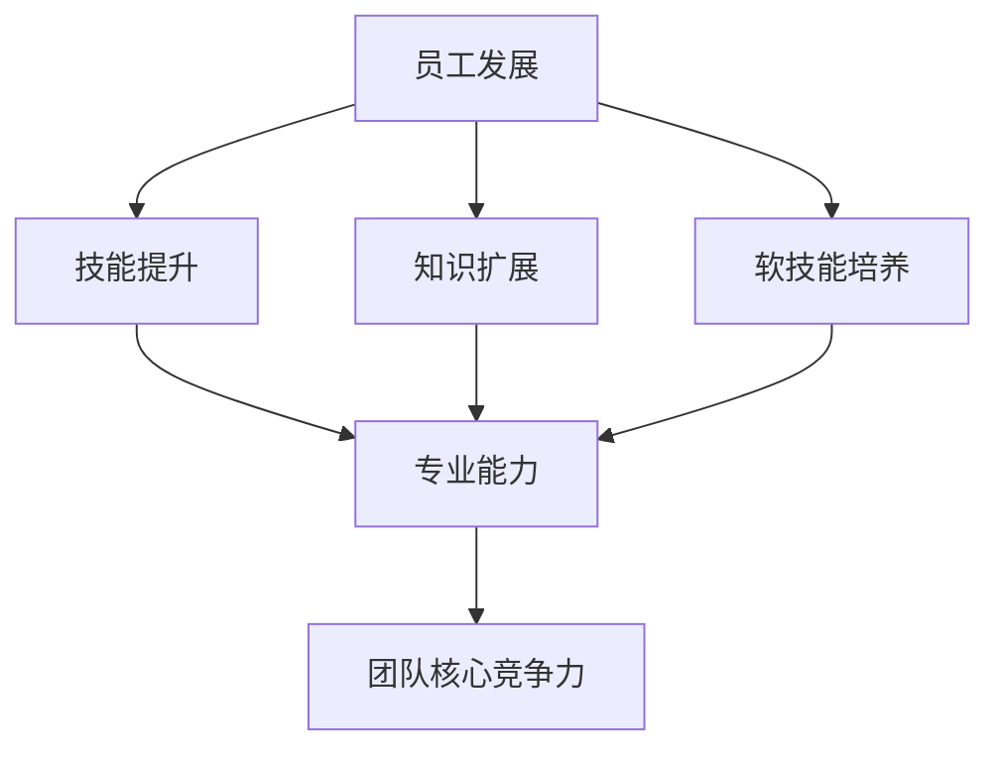

                 

**文章标题：员工发展计划：培养团队核心竞争力**

**关键词：员工发展，团队核心竞争力，培训策略，职业规划，评估与反馈**

**摘要：**
本文旨在深入探讨员工发展计划对于构建团队核心竞争力的关键作用。文章从员工发展的策略、团队核心能力的构建、案例研究以及评估与反馈等方面进行详细分析，旨在为企业管理者提供一套科学、有效的员工发展方案，以提升团队整体竞争力和组织绩效。

## 引言

### 问题背景

在当今快速变化的市场环境中，企业面临的挑战日益严峻。一方面，技术革新不断推动产业升级，要求员工具备更高的技能和更广泛的知识；另一方面，市场竞争的加剧使得企业需要具备强大的核心竞争能力以应对挑战。然而，许多企业在员工发展方面存在诸多问题，如培训效果不佳、职业规划不明确、领导力不足等，这些问题严重制约了团队核心竞争力的提升。

### 员工发展的现状

目前，许多企业已经开始意识到员工发展的重要性，并采取了一系列措施。然而，实际效果却不尽如人意。一方面，企业的培训计划往往缺乏系统性和针对性，难以满足员工的个性化需求；另一方面，职业规划的实施不到位，导致员工缺乏长远发展的方向感。此外，领导力的培养也常常被忽视，影响了团队的整体协作效率。

### 员工发展与团队核心竞争力的关系

员工发展不仅仅是企业的一项内部事务，更是关乎团队核心竞争力的关键因素。一个具备强大核心竞争力的团队，其成员必须具备较高的技能水平、丰富的知识储备、良好的沟通能力和协作精神。而这些能力的培养，离不开系统的员工发展计划。因此，企业需要从战略高度出发，制定科学的员工发展计划，以培养团队核心竞争力。

## 第一部分：员工发展策略

### 培训

#### 培训计划设计

培训计划的设计是员工发展的第一步。企业应根据员工的岗位需求和职业发展规划，制定具有针对性的培训计划。以下是一个简单的培训计划设计流程：

1. **需求分析**：通过问卷调查、访谈等方式，了解员工的需求和期望。
2. **内容规划**：根据需求分析结果，规划培训内容，确保内容实用、有趣、有挑战性。
3. **时间安排**：合理规划培训时间，确保不影响员工的正常工作。
4. **形式选择**：根据培训内容和目标，选择合适的培训形式，如在线课程、现场培训、工作坊等。
5. **效果评估**：培训结束后，对培训效果进行评估，以不断优化培训计划。

#### 培训内容选择

培训内容的选择直接关系到培训的效果。以下是一些常见的培训内容选择策略：

1. **技能培训**：如编程技能、项目管理技能等。
2. **知识更新**：如行业趋势、新技术应用等。
3. **软技能培训**：如沟通技巧、团队协作、时间管理等。

#### 培训效果评估

培训效果评估是检验培训质量的重要环节。以下是一些常见的评估方法：

1. **问卷调查**：通过问卷调查了解员工对培训的满意度。
2. **行为观察**：观察员工在工作中的表现，评估培训效果。
3. **业绩考核**：通过员工的业绩考核，评估培训对工作绩效的影响。

### 师徒关系

#### 师徒关系的建立

师徒关系的建立是员工发展的重要方式之一。以下是一个简单的师徒关系建立流程：

1. **选拔导师**：根据员工的职业发展规划，选拔合适的导师。
2. **签订协议**：导师和学员签订师徒协议，明确双方的责任和义务。
3. **定期沟通**：导师和学员定期进行沟通，分享经验和心得。
4. **考核与评估**：定期对师徒关系进行考核和评估，以确保关系的持续性和有效性。

#### 传承与分享

传承与分享是师徒关系的核心。以下是一些传承与分享的策略：

1. **经验分享**：导师通过亲身经历，向学员传授宝贵的经验和教训。
2. **知识共享**：导师和学员共同学习新知识，相互促进。
3. **实战指导**：导师在学员的实战中给予指导和帮助，提高学员的实战能力。

#### 师徒关系的维护

师徒关系的维护是确保关系长久有效的重要保障。以下是一些维护师徒关系的策略：

1. **定期交流**：导师和学员保持定期交流，分享工作和生活的心得。
2. **共同目标**：导师和学员共同设定职业目标，相互支持，共同进步。
3. **激励机制**：企业可以设立师徒激励机制，鼓励导师和学员积极参与。

### 职业规划

#### 职业规划的重要性

职业规划是员工发展的重要环节，对于员工个人和企业发展具有重要意义。以下是一些职业规划的重要性：

1. **明确发展方向**：职业规划可以帮助员工明确自己的发展方向，避免盲目发展。
2. **提升个人能力**：职业规划可以引导员工有针对性地提升个人能力，提高竞争力。
3. **优化企业资源**：职业规划可以帮助企业优化人力资源配置，提高整体效能。

#### 职业规划的方法

以下是一些常见的职业规划方法：

1. **自我评估**：员工通过自我评估，了解自己的兴趣、优势和不足。
2. **目标设定**：员工根据自我评估结果，设定明确的职业目标。
3. **计划制定**：员工制定详细的职业发展计划，包括短期和长期目标。
4. **行动实施**：员工根据职业发展计划，付诸实践，逐步实现目标。
5. **持续调整**：职业规划不是一成不变的，员工应根据实际情况进行持续调整。

#### 职业规划的实践案例

以下是一个职业规划的实践案例：

**案例：小张的职业规划**

**1. 自我评估**：
- 兴趣：对数据分析感兴趣
- 优势：具备较强的逻辑思维和分析能力
- 不足：沟通技巧有待提升

**2. 目标设定**：
- 短期目标：提升数据分析技能，成为数据分析专家
- 长期目标：成为数据分析团队的负责人

**3. 计划制定**：
- 学习计划：参加数据分析课程，阅读相关书籍，提升数据分析技能
- 沟通计划：参加沟通技巧培训，提升沟通能力
- 实践计划：参与公司项目，积累实战经验

**4. 行动实施**：
- 参加数据分析课程，获得数据分析证书
- 参加沟通技巧培训，提升沟通能力
- 参与公司项目，积累实战经验

**5. 持续调整**：
- 根据实际情况，调整学习计划和实践计划
- 定期评估职业发展情况，确保目标实现

### 第二部分：构建团队核心能力

#### 团队建设

#### 团队建设的目标

团队建设的目标是提升团队的整体协作能力和执行力，以实现团队的高效运作。以下是一些常见的团队建设目标：

1. **提高团队凝聚力**：增强团队成员之间的信任和协作，形成紧密的团队关系。
2. **提升团队执行力**：确保团队能够高效地完成任务，达到预期的目标。
3. **优化团队结构**：合理配置团队成员，确保团队结构的优化和高效运作。

#### 团队建设的方法

以下是一些常见的团队建设方法：

1. **团队活动**：组织团队活动，增强团队成员之间的交流和互动，提高团队凝聚力。
2. **培训与发展**：为团队成员提供培训和发展机会，提升团队成员的技能和知识水平。
3. **绩效考核**：建立科学的绩效考核体系，激励团队成员积极工作，提升团队执行力。
4. **团队沟通**：加强团队内部的沟通与协作，确保信息的畅通和有效传递。

#### 团队建设的实践案例

以下是一个团队建设的实践案例：

**案例：某公司的团队建设实践**

**1. 团队活动**：
- 组织团队成员进行户外拓展训练，增强团队凝聚力
- 定期举办团队聚会，促进团队成员之间的交流

**2. 培训与发展**：
- 为团队成员提供专业技能培训，提升团队整体能力
- 为团队成员提供领导力培训，提升团队执行力

**3. 绩效考核**：
- 建立科学的绩效考核体系，激励团队成员积极工作
- 定期对团队成员进行绩效评估，发现问题及时调整

**4. 团队沟通**：
- 设立团队沟通机制，确保信息的畅通和有效传递
- 定期召开团队会议，讨论工作进展和问题解决方案

#### 领导力发展

#### 领导力的定义

领导力是指个人在团队中通过影响力、沟通能力和决策能力，引导和激励团队成员达成共同目标的能力。以下是一些领导力的定义：

1. **影响力**：领导力通过个人魅力、专业知识、沟通能力等，对团队成员产生积极的影响。
2. **沟通能力**：领导力通过有效的沟通，确保团队目标的明确传达和团队成员之间的协作。
3. **决策能力**：领导力通过准确的判断和果断的决策，推动团队向前发展。

#### 领导力的发展路径

以下是一些领导力的发展路径：

1. **自我认知**：领导者首先需要了解自己的优势和不足，明确自己的领导风格和价值观。
2. **专业知识**：领导者需要不断学习和更新专业知识，提高自己的专业素养。
3. **团队建设**：领导者需要关注团队建设，提升团队凝聚力，确保团队目标的实现。
4. **领导实践**：领导者需要在实际工作中，不断积累经验，提升领导力。

#### 领导力发展的实践案例

以下是一个领导力发展的实践案例：

**案例：某公司的领导力发展实践**

**1. 自我认知**：
- 领导者通过自我反思，了解自己的领导风格和价值观
- 领导者通过参加领导力课程，提升自我认知

**2. 专业知识**：
- 领导者参加专业培训，学习最新的行业知识和技能
- 领导者阅读领导力相关书籍，提升自己的领导能力

**3. 团队建设**：
- 领导者关注团队建设，定期组织团队活动，增强团队凝聚力
- 领导者通过有效沟通，确保团队目标的明确传达和团队成员之间的协作

**4. 领导实践**：
- 领导者在实际工作中，不断积累经验，提升领导力
- 领导者通过实践，不断调整和完善自己的领导风格和决策能力

#### 沟通技巧

#### 有效沟通的重要性

有效沟通是团队协作和领导力的核心要素。以下是一些有效沟通的重要性：

1. **确保信息准确传达**：有效沟通可以确保信息准确无误地传达，避免误解和沟通障碍。
2. **增强团队凝聚力**：有效沟通可以增强团队成员之间的信任和理解，提高团队凝聚力。
3. **提升决策效率**：有效沟通可以确保决策过程中的信息畅通，提高决策效率。
4. **解决冲突**：有效沟通可以帮助团队解决冲突，减少内部矛盾。

#### 沟通障碍与解决策略

以下是一些常见的沟通障碍及其解决策略：

1. **语言障碍**：解决策略：使用简单、清晰的语言，避免使用专业术语和行话。
2. **文化差异**：解决策略：尊重不同文化背景，了解和适应不同文化的沟通方式。
3. **情绪影响**：解决策略：保持冷静，理性分析问题，避免情绪化的沟通。

#### 沟通技巧的实践应用

以下是一些沟通技巧的实践应用：

1. **倾听**：积极倾听对方的观点，确保理解对方的意图。
2. **提问**：通过提问，了解对方的需求和想法，促进有效沟通。
3. **反馈**：及时给予反馈，确保沟通的双向性。
4. **非语言沟通**：使用肢体语言、面部表情等非语言手段，增强沟通效果。

### 第三部分：案例研究与最佳实践

#### 案例研究

#### 企业A的员工发展计划

**案例背景**：
企业A是一家快速发展的互联网公司，为了保持竞争力，决定实施一套全面的员工发展计划。

**实施策略**：
1. **定制化培训**：根据员工的不同岗位和职业发展阶段，制定个性化的培训计划。
2. **导师制度**：设立导师制度，帮助新员工快速融入团队，提升专业技能。
3. **职业发展规划**：为员工提供明确的职业发展路径，鼓励员工制定个人职业规划。
4. **绩效激励**：建立绩效激励机制，奖励在工作中表现突出的员工。

**成效**：
通过员工发展计划的实施，企业A的员工满意度显著提升，员工流失率降低，团队整体绩效得到显著提高。

#### 企业B的团队建设实践

**案例背景**：
企业B是一家制造业公司，为了提升团队协作效率，决定实施一系列团队建设活动。

**实施策略**：
1. **团队活动**：定期组织户外拓展、团队建设培训等活动，增强团队凝聚力。
2. **沟通机制**：建立高效的沟通机制，确保信息畅通无阻。
3. **绩效合作**：推动跨部门合作，提高整体协作效率。
4. **反馈机制**：建立定期反馈机制，及时解决团队问题和冲突。

**成效**：
企业B的团队协作效率显著提升，内部沟通顺畅，员工满意度提高，公司业绩稳步增长。

#### 企业C的领导力培养案例

**案例背景**：
企业C是一家大型跨国公司，为了提升领导力，决定实施一系列领导力培养计划。

**实施策略**：
1. **领导力培训**：为各级领导者提供专业的领导力培训，提升领导技能。
2. **领导力实践**：鼓励领导者参与实际项目，提升领导力和决策能力。
3. **领导力辅导**：为领导者提供一对一辅导，解决领导力发展中的问题。
4. **领导力评估**：定期对领导力进行评估，确保领导力的持续提升。

**成效**：
企业C的领导力水平显著提升，领导者能够更好地激励和带领团队，公司整体竞争力得到增强。

### 第四部分：评估与反馈

#### 评估方法

#### 成果评估

成果评估是衡量员工发展计划效果的重要手段。以下是一些成果评估的方法：

1. **绩效评估**：通过员工的绩效评估，衡量员工在工作中的表现和进步。
2. **技能评估**：通过技能评估，衡量员工在专业技能方面的提升。
3. **员工满意度调查**：通过员工满意度调查，了解员工对员工发展计划的满意度和反馈。

#### 反馈机制

#### 反馈的类型

反馈机制是员工发展计划的重要组成部分。以下是一些反馈的类型：

1. **正面反馈**：对员工的优点和进步给予肯定和鼓励。
2. **建设性反馈**：对员工的不足之处提出具体的改进建议。
3. **负面反馈**：对员工的问题进行指出，帮助其认识并改进。

#### 反馈的时机

反馈的时机对于反馈效果具有重要影响。以下是一些反馈的时机：

1. **即时反馈**：在员工表现或行为出现问题时，及时给予反馈。
2. **定期反馈**：定期对员工的表现进行评估和反馈，确保员工持续进步。
3. **项目反馈**：在项目结束后，对项目过程中的表现进行反馈。

#### 反馈的有效性

为了确保反馈的有效性，以下是一些建议：

1. **明确反馈目标**：在反馈前明确反馈的目标和目的，确保反馈具有针对性。
2. **具体且客观**：反馈时应具体且客观，避免模糊和主观的评价。
3. **鼓励双向沟通**：鼓励员工在反馈过程中发表意见，促进双向沟通。

### 第五部分：结论与展望

#### 员工发展计划的重要性

员工发展计划是提升团队核心竞争力的重要手段。通过系统的员工发展策略，企业可以培养员工的技能、知识和软技能，提升团队的整体协作能力和执行力。

#### 未来展望

随着企业竞争的加剧和技术的不断进步，员工发展计划的重要性将愈发凸显。未来，企业需要更加注重个性化员工发展计划的设计和实施，以适应不同员工的需求和职业发展目标。同时，企业还需要关注新兴技术的应用，如人工智能、大数据等，以提升员工发展的效率和质量。

**总结**

员工发展计划对于提升团队核心竞争力和组织绩效具有重要意义。通过科学、系统的员工发展策略，企业可以培养员工的技能、知识和软技能，提升团队的整体协作能力和执行力。在未来，企业需要不断创新和优化员工发展计划，以适应不断变化的市场环境和技术发展。

**作者：AI天才研究院/AI Genius Institute & 禅与计算机程序设计艺术 /Zen And The Art of Computer Programming****文章标题：员工发展计划：培养团队核心竞争力**

**关键词：员工发展，团队核心竞争力，培训策略，职业规划，评估与反馈**

**摘要：**
本文深入探讨了员工发展计划对于构建团队核心竞争力的关键作用。文章从员工发展的策略、团队核心能力的构建、案例研究以及评估与反馈等方面进行详细分析，为企业管理者提供了科学、有效的员工发展方案，以提升团队整体竞争力和组织绩效。

**目录**

**第一部分：引言**

1.1 问题背景
1.1.1 组织发展的挑战
1.1.2 员工发展的现状
1.1.3 员工发展与团队核心竞争力的关系
1.2 核心概念
1.2.1 员工发展
1.2.2 团队核心竞争力
1.2.3 员工发展与团队核心竞争力联系图

**第二部分：员工发展策略**

2.1 培训
2.1.1 培训计划设计
2.1.2 培训内容选择
2.1.3 培训效果评估
2.2 师徒关系
2.2.1 师徒关系的建立
2.2.2 传承与分享
2.2.3 师徒关系的维护
2.3 职业规划
2.3.1 职业规划的重要性
2.3.2 职业规划的方法
2.3.3 职业规划的实践案例

**第三部分：构建团队核心能力**

3.1 团队建设
3.1.1 团队建设的目标
3.1.2 团队建设的方法
3.1.3 团队建设的实践案例
3.2 领导力发展
3.2.1 领导力的定义
3.2.2 领导力的发展路径
3.2.3 领导力发展的实践案例
3.3 沟通技巧
3.3.1 有效沟通的重要性
3.3.2 沟通障碍与解决策略
3.3.3 沟通技巧的实践应用

**第四部分：案例研究与最佳实践**

4.1 案例研究
4.1.1 企业A的员工发展计划
4.1.2 企业B的团队建设实践
4.1.3 企业C的领导力培养案例
4.2 最佳实践
4.2.1 员工发展计划的设计与实施
4.2.2 团队核心能力的构建策略
4.2.3 领导力发展的实用技巧

**第五部分：评估与反馈**

5.1 评估方法
5.1.1 成果评估
5.1.2 过程评估
5.1.3 反馈机制
5.2 反馈机制
5.2.1 反馈的类型
5.2.2 反馈的时机
5.2.3 反馈的有效性
5.3 评估与反馈的整合
5.3.1 评估与反馈的连续性
5.3.2 评估与反馈的系统化

**第六部分：结论与展望**

6.1 员工发展计划的重要性
6.2 未来展望
6.3 总结

**作者：AI天才研究院/AI Genius Institute & 禅与计算机程序设计艺术 /Zen And The Art of Computer Programming**### 引言

在当今的竞争激烈的市场环境中，企业要想持续保持领先地位，就必须不断适应环境变化，提升自身的核心竞争力。员工发展计划作为企业战略的重要组成部分，其重要性不言而喻。本文将围绕员工发展计划，探讨如何通过培养团队核心竞争力，提升企业整体绩效。

#### 问题背景

随着技术的迅猛发展，企业面临的市场环境变得越来越复杂。新兴技术的应用、市场竞争的加剧以及客户需求的多样化，都对企业的运营能力和员工素质提出了更高的要求。在这种背景下，员工的发展不再仅仅是个人成长的问题，而是关系到企业整体竞争力的问题。

首先，技术革新不断推动产业升级，要求员工具备更高的技能和更广泛的知识。比如，人工智能、大数据等新兴技术的普及，使得传统的数据处理和分析方法面临挑战，企业需要拥有一批具备数据处理和分析能力的高素质人才。

其次，市场竞争的加剧使得企业必须具备强大的核心竞争能力以应对挑战。这种能力不仅体现在产品和服务的创新上，还包括企业内部的运营效率和管理水平。而这一切，都离不开员工的积极参与和贡献。

然而，当前许多企业在员工发展方面存在诸多问题。一方面，培训效果不佳。许多企业的培训计划缺乏系统性和针对性，难以满足员工的个性化需求。另一方面，职业规划的实施不到位，导致员工缺乏长远发展的方向感。此外，领导力的培养也常常被忽视，影响了团队的整体协作效率。

#### 员工发展的现状

目前，许多企业已经开始认识到员工发展的重要性，并采取了一系列措施。例如，一些企业设立了专门的员工发展部门，制定系统的培训计划；一些企业引入了导师制度，帮助新员工快速融入团队；还有一些企业通过绩效激励，鼓励员工不断学习和提升自我。

然而，实际效果却不尽如人意。一方面，企业的培训计划往往缺乏系统性和针对性，难以满足员工的个性化需求。比如，一些培训内容过于理论化，与实际工作脱节；一些培训形式单一，缺乏互动和参与感。另一方面，职业规划的实施不到位，导致员工在职业发展上缺乏明确的目标和方向。此外，领导力的培养也常常被忽视，导致团队协作效率低下，员工满意度不高。

#### 员工发展与团队核心竞争力的关系

员工发展不仅仅是企业的一项内部事务，更是关乎团队核心竞争力的关键因素。一个具备强大核心竞争力的团队，其成员必须具备较高的技能水平、丰富的知识储备、良好的沟通能力和协作精神。而这些能力的培养，离不开系统的员工发展计划。

首先，员工发展计划可以帮助企业培养高素质的人才。通过系统的培训和职业规划，员工可以不断提升自己的专业技能和知识水平，从而为企业提供更有价值的服务。

其次，员工发展计划可以提高团队的协作效率。通过师徒关系和团队建设活动，员工可以增强彼此的信任和理解，提高团队的整体协作能力。

最后，员工发展计划可以激发员工的潜力和积极性。通过合理的激励和反馈机制，员工可以感受到企业的关怀和认可，从而更加投入到工作中，为企业创造更大的价值。

总之，员工发展计划对于构建团队核心竞争力具有重要意义。通过系统的员工发展策略，企业可以培养员工的技能、知识和软技能，提升团队的整体协作能力和执行力。在未来，企业需要更加重视员工发展，将其纳入企业战略的核心，以应对不断变化的市场环境和技术挑战。

### 核心概念

在深入探讨员工发展计划对构建团队核心竞争力的作用之前，我们需要明确一些核心概念。这些概念不仅帮助我们理解员工发展的本质，也为后续的讨论提供了基础。

#### 员工发展

员工发展是指通过一系列有组织的学习和培训活动，帮助员工提升技能、知识和软技能，以适应岗位需求和市场变化的过程。员工发展不仅仅是培训，还包括职业规划、技能提升、能力发展等多个方面。

**定义：**
员工发展是企业为提高员工的工作绩效和职业满意度而实施的一系列计划和措施。

**属性：**
1. **针对性**：员工发展计划应针对员工的岗位需求和职业发展阶段进行个性化设计。
2. **持续性**：员工发展是一个持续的过程，需要定期评估和调整。
3. **系统性**：员工发展计划应与企业战略和文化相匹配，形成系统化的培训和管理体系。

**对比：**
与传统的培训不同，员工发展更注重长远规划和系统性的培养，不仅仅是短期的技能提升，还包括职业成长和软技能的发展。

#### 团队核心竞争力

团队核心竞争力是指一个团队在长期竞争中形成的独特能力，这种能力使得团队能够在市场中脱颖而出，保持持续的竞争优势。

**定义：**
团队核心竞争力是团队在特定领域内具有的、能显著区别于其他团队的能力，是企业长期竞争优势的源泉。

**属性：**
1. **独特性**：核心竞争力是团队特有的，不易被竞争对手模仿。
2. **持久性**：核心竞争力能够在长时间内保持，且随着团队发展而不断提升。
3. **可积累性**：核心竞争力可以通过团队协作和持续学习不断积累和增强。

**对比：**
团队核心竞争力与团队的一般能力不同，它不仅是成员个人能力的简单叠加，更是在团队内部通过协作和沟通形成的一种综合能力。

#### 员工发展与团队核心竞争力的关系

员工发展是构建团队核心竞争力的重要手段。通过系统的员工发展计划，企业可以培养出具备高素质、高技能、高协同能力的团队成员，从而提升团队的整体竞争力。

**联系图：**

**核心要素：**
1. **专业技能**：员工发展通过培训和实践，提升员工的专业技能，形成团队的核心竞争力。
2. **知识储备**：广泛的知识储备使得团队能够应对复杂的市场变化和挑战。
3. **软技能**：良好的沟通、协作和领导能力是团队高效运作的关键。

### 结论

通过上述对核心概念的解析，我们可以看到，员工发展不仅是提升个人能力的手段，更是构建团队核心竞争力的重要途径。一个具备强大核心竞争力的团队，能够在市场中保持持续的竞争优势。因此，企业需要重视员工发展，通过系统的培训和职业规划，培养出高素质的团队成员，从而提升团队的整体竞争力。

### 第一部分：员工发展策略

#### 培训

**培训计划设计**

培训计划设计是员工发展的基础环节，其目的是通过系统的培训活动，提升员工的专业技能和软技能，以满足岗位需求和企业战略目标。

**1. 需求分析**

需求分析是培训计划设计的首要步骤，通过深入了解员工的实际需求和期望，确保培训内容具有针对性和实用性。以下是一些常见的需求分析方法：

- **问卷调查**：通过设计详细的问卷，收集员工对培训内容、形式和时间的建议。
- **一对一访谈**：与员工进行面对面的交流，了解他们在工作中的痛点和成长需求。
- **数据统计**：分析员工的工作表现和绩效数据，识别需要提升的技能和能力。

**2. 内容规划**

在需求分析的基础上，进行培训内容规划。内容规划应考虑以下几个方面：

- **技能培训**：根据岗位需求，提供与工作相关的专业技能培训，如编程、数据分析、项目管理等。
- **知识更新**：针对行业最新趋势和技术发展，提供知识更新培训，如新兴技术的应用、行业规范等。
- **软技能培训**：提升员工的沟通、团队协作、时间管理等软技能，增强团队整体协作能力。

**3. 时间安排**

合理的时间安排是培训计划成功的关键。以下是一些时间安排的注意事项：

- **集中培训**：在一段时间内集中进行培训，提高培训效果。
- **灵活安排**：考虑员工的实际情况，灵活安排培训时间和形式，如线上课程、现场培训等。
- **持续跟进**：培训结束后，通过定期复习和实践，巩固培训效果。

**4. 形式选择**

培训形式的选择应结合培训内容和目标，以达到最佳效果。以下是一些常见的培训形式：

- **在线课程**：适用于知识更新和技能提升，方便灵活。
- **现场培训**：适用于实战技能和团队合作能力的提升，具有互动性。
- **工作坊**：通过实际操作和小组讨论，增强参与感和实操能力。
- **外部培训**：邀请行业专家和外部培训机构进行培训，拓宽视野和提升专业水平。

**5. 效果评估**

培训效果评估是检验培训计划有效性的重要环节。以下是一些常见的评估方法：

- **问卷调查**：通过设计详细的问卷，收集员工对培训的满意度和建议。
- **行为观察**：通过观察员工在工作中的表现，评估培训效果。
- **绩效提升**：通过员工的绩效数据，评估培训对工作绩效的影响。
- **反馈机制**：建立反馈机制，收集员工对培训的建议和反馈，不断优化培训计划。

**培训内容选择**

培训内容的选择直接关系到培训的效果。以下是一些常见的培训内容选择策略：

- **技能培训**：根据员工的岗位需求和职业发展目标，选择与工作紧密相关的技能培训内容。
- **知识更新**：针对行业最新趋势和技术发展，选择与工作相关的知识更新内容。
- **软技能培训**：根据员工的实际情况，选择与团队合作和工作效率相关的软技能培训内容。

**培训效果评估**

培训效果评估是衡量培训质量的重要手段。以下是一些常见的评估方法：

- **短期效果评估**：通过问卷调查、行为观察等方式，评估培训在短期内对员工技能和知识提升的影响。
- **长期效果评估**：通过绩效数据、员工晋升和离职率等指标，评估培训对员工长期发展的贡献。
- **反馈机制**：建立反馈机制，收集员工对培训的反馈和建议，不断优化培训计划和内容。

**师徒关系**

**师徒关系的建立**

师徒关系是一种传统的员工发展方式，通过经验丰富的导师指导新员工，帮助他们快速融入团队并提升专业技能。建立良好的师徒关系对于员工的发展和团队的稳定至关重要。

**1. 选拔导师**

选拔合适的导师是建立师徒关系的关键。以下是一些选拔导师的注意事项：

- **专业能力**：导师应具备较强的专业技能和丰富的实践经验。
- **领导能力**：导师应具备良好的沟通和领导能力，能够指导新员工。
- **责任心**：导师应具备高度的责任心，愿意投入时间和精力指导新员工。

**2. 签订协议**

签订师徒协议是明确双方责任和义务的重要步骤。师徒协议应包括以下内容：

- **培训目标和计划**：明确培训的目标和具体内容，确保培训的针对性和有效性。
- **培训时间和地点**：明确培训的时间和地点，确保导师和学员能够按时参加。
- **考核和评估**：建立考核和评估机制，确保培训效果的监督和反馈。

**3. 定期沟通**

定期沟通是保持师徒关系有效性的关键。以下是一些定期沟通的注意事项：

- **分享经验**：导师应定期与学员分享工作经验和教训，帮助他们快速成长。
- **解决问题**：导师应及时解决学员在工作中遇到的问题，提供有效的指导。
- **反馈与支持**：导师应定期收集学员的反馈，给予支持和鼓励，帮助他们克服困难。

**4. 考核与评估**

对师徒关系进行定期考核和评估，可以确保培训效果的持续性和有效性。以下是一些考核与评估的注意事项：

- **定期评估**：建立定期评估机制，评估导师和学员的培训效果。
- **反馈机制**：建立反馈机制，收集导师和学员的反馈，及时调整培训计划和内容。
- **奖励与激励**：对表现优秀的导师和学员进行奖励和激励，提高他们的积极性和满意度。

**传承与分享**

师徒关系中的传承与分享是培养团队核心能力的重要手段。以下是一些传承与分享的策略：

- **经验传承**：导师通过亲身经历，向学员传授宝贵的工作经验和职业发展技巧。
- **知识共享**：导师和学员共同学习新知识，提升团队整体知识水平。
- **实践指导**：导师在学员的实战中给予指导和帮助，提高学员的实战能力。

**师徒关系的维护**

良好的师徒关系有助于员工的发展和团队的稳定。以下是一些维护师徒关系的策略：

- **持续关注**：企业应持续关注师徒关系的进展，提供必要的支持和资源。
- **文化营造**：营造尊重导师、尊重学习的企业文化，提高员工对师徒关系的重视。
- **激励机制**：建立激励机制，鼓励导师和学员积极参与师徒关系，提高双方的积极性。

**职业规划**

**职业规划的重要性**

职业规划是员工发展的重要组成部分，它不仅关系到个人的职业发展，也对企业的人力资源管理具有重要意义。

**1. 明确发展方向**

职业规划可以帮助员工明确自己的职业发展方向，避免盲目发展。以下是一些明确发展方向的策略：

- **自我评估**：员工应通过自我评估，了解自己的兴趣、优势和不足，明确职业目标。
- **市场调研**：了解行业趋势和市场需求，选择适合自己的职业发展方向。
- **咨询专家**：请教职业规划专家或导师，获取专业的建议和指导。

**2. 提升个人能力**

职业规划不仅需要明确发展方向，还需要不断提升个人能力，以适应职业发展的需求。以下是一些提升个人能力的策略：

- **技能培训**：参加与职业发展相关的培训课程，提升专业技能。
- **知识更新**：通过阅读专业书籍、参加行业研讨会等方式，更新知识和技能。
- **实践经验**：通过实际项目和工作经历，积累实战经验，提升综合素质。

**3. 职业发展路径**

职业发展路径是职业规划的核心内容，它包括短期目标和长期目标。以下是一些制定职业发展路径的策略：

- **短期目标**：明确短期目标，如提升某项技能、完成某个项目等，确保职业规划的落地实施。
- **长期目标**：制定长期目标，如晋升、担任重要职位等，为职业发展提供方向和动力。
- **计划实施**：制定详细的实施计划，包括时间安排、行动步骤等，确保职业目标的实现。

**职业规划的方法**

**1. 自我评估**

自我评估是职业规划的第一步，通过深入了解自己的兴趣、优势和不足，为职业发展提供基础。以下是一些自我评估的方法：

- **性格测试**：通过性格测试，了解自己的性格特点和优势。
- **能力评估**：通过能力评估，识别自己在工作中的优势和不足。
- **职业兴趣测试**：通过职业兴趣测试，了解自己感兴趣的职业领域。

**2. 目标设定**

目标设定是职业规划的核心，明确的目标可以指导员工的职业发展。以下是一些目标设定的策略：

- **SMART原则**：设定具体（Specific）、可衡量（Measurable）、可实现（Achievable）、相关性（Relevant）和时限性（Time-bound）的目标。
- **长期目标与短期目标**：明确长期和短期目标，确保职业规划的全面性和可行性。
- **目标调整**：根据实际情况和环境变化，及时调整目标，确保职业规划的有效性。

**3. 行动实施**

行动实施是将职业规划转化为实际行动的关键步骤。以下是一些行动实施的方法：

- **制定计划**：制定详细的行动计划，包括时间安排、行动步骤等。
- **分阶段实施**：将职业规划分解为短期目标，分阶段实施，确保目标的逐步实现。
- **持续跟进**：定期检查职业规划的实施情况，及时调整计划，确保目标的实现。

**4. 持续调整**

职业规划不是一成不变的，员工应根据实际情况和环境变化，持续调整职业规划。以下是一些持续调整的策略：

- **定期评估**：定期评估职业规划的实施情况，评估目标的实现程度。
- **反馈机制**：建立反馈机制，收集员工对职业规划的反馈和建议，及时调整规划。
- **灵活应变**：面对环境变化，灵活调整职业规划，确保目标的实现。

**职业规划的实践案例**

以下是一个职业规划的实践案例：

**案例：小张的职业规划**

**1. 自我评估**：
- 兴趣：对数据分析感兴趣
- 优势：具备较强的逻辑思维和分析能力
- 不足：沟通技巧有待提升

**2. 目标设定**：
- 短期目标：提升数据分析技能，成为数据分析专家
- 长期目标：成为数据分析团队的负责人

**3. 计划制定**：
- 学习计划：参加数据分析课程，阅读相关书籍，提升数据分析技能
- 沟通计划：参加沟通技巧培训，提升沟通能力
- 实践计划：参与公司项目，积累实战经验

**4. 行动实施**：
- 参加数据分析课程，获得数据分析证书
- 参加沟通技巧培训，提升沟通能力
- 参与公司项目，积累实战经验

**5. 持续调整**：
- 根据实际情况，调整学习计划和实践计划
- 定期评估职业发展情况，确保目标实现

通过以上案例，我们可以看到，职业规划是一个系统性的过程，需要从自我评估、目标设定、计划制定、行动实施到持续调整，各个环节都需要充分考虑和精心策划。只有这样，员工才能在职业发展中明确方向，不断提升自我，实现职业目标。

### 第二部分：构建团队核心能力

#### 团队建设

**团队建设的目标**

团队建设是企业提升团队协作能力和执行力的关键措施。通过有效的团队建设，企业可以实现以下目标：

1. **提高团队凝聚力**：通过共同的目标和价值观，增强团队成员之间的信任和协作，形成紧密的团队关系。
2. **提升团队执行力**：确保团队成员能够高效地完成任务，实现团队目标。
3. **优化团队结构**：通过合理的角色分配和协作机制，优化团队结构，提高团队运作效率。

**团队建设的方法**

团队建设的方法多种多样，以下是一些常见的团队建设方法：

1. **团队活动**：通过组织团队建设活动，增强团队成员之间的交流和互动，提高团队凝聚力。常见的团队活动包括团队拓展训练、团队聚餐、团队旅游等。

2. **培训与发展**：为团队成员提供培训和发展机会，提升团队成员的技能和知识水平。通过培训，团队成员可以更好地理解企业的战略和目标，提高工作效率。

3. **绩效考核**：建立科学的绩效考核体系，激励团队成员积极工作，提升团队执行力。绩效考核应结合团队成员的工作表现、团队贡献等多个方面，确保公平、公正。

4. **团队沟通**：加强团队内部的沟通与协作，确保信息的畅通和有效传递。建立有效的沟通机制，如定期团队会议、内部邮件、即时通讯工具等，确保团队成员之间的信息交流。

**团队建设的实践案例**

以下是一个团队建设的实践案例：

**案例：某互联网公司的团队建设实践**

**1. 团队活动**：
- 定期组织团队拓展训练，增强团队成员之间的信任和协作。
- 每季度举办团队聚餐，加强团队成员之间的沟通和交流。

**2. 培训与发展**：
- 为新入职员工提供入职培训，帮助他们快速了解企业的文化和业务。
- 定期举办专业技能培训，提升团队成员的技能和知识水平。

**3. 绩效考核**：
- 建立绩效考核体系，将团队成员的工作表现与绩效奖金挂钩。
- 定期进行绩效评估，鼓励团队成员积极工作，提升团队执行力。

**4. 团队沟通**：
- 设立定期团队会议，讨论工作进展和问题解决方案。
- 使用企业内部的即时通讯工具，确保团队成员之间的信息畅通。

通过上述实践，该互联网公司显著提高了团队凝聚力、执行力和工作效率，取得了良好的业务成果。

#### 领导力发展

**领导力的定义**

领导力是指个人在团队中通过影响力、沟通能力和决策能力，引导和激励团队成员达成共同目标的能力。领导力不仅仅是管理者的专利，每个团队成员都可以通过提升自身的领导力，更好地完成工作任务和实现个人职业发展。

**1. 影响力**：领导力通过个人的魅力、专业知识、沟通能力等，对团队成员产生积极的影响，使他们愿意跟随和信任领导者。

**2. 沟通能力**：领导力通过有效的沟通，确保团队目标的明确传达和团队成员之间的协作，减少误解和冲突。

**3. 决策能力**：领导力通过准确的判断和果断的决策，推动团队向前发展，应对各种挑战和变化。

**领导力的发展路径**

领导力的发展是一个长期的过程，需要通过不断的学习和实践来提升。以下是一些领导力的发展路径：

1. **自我认知**：领导者首先需要了解自己的优势和不足，明确自己的领导风格和价值观。

2. **专业知识**：领导者需要不断学习和更新专业知识，提高自己的专业素养，以便更好地指导和管理团队。

3. **团队建设**：领导者需要关注团队建设，提升团队凝聚力，确保团队目标的实现。

4. **领导实践**：领导者需要在实际工作中，不断积累经验，提升领导力。

**领导力发展的实践案例**

以下是一个领导力发展的实践案例：

**案例：某公司的领导力发展实践**

**1. 自我认知**：
- 领导者通过自我反思，了解自己的领导风格和价值观。
- 领导者通过参加领导力培训课程，提升自我认知。

**2. 专业知识**：
- 领导者参加行业研讨会，学习最新的行业知识和技能。
- 领导者阅读领导力相关书籍，提升自己的领导能力。

**3. 团队建设**：
- 领导者定期组织团队活动，增强团队凝聚力。
- 领导者通过有效沟通，确保团队目标的明确传达和团队成员之间的协作。

**4. 领导实践**：
- 领导者在实际工作中，不断积累经验，提升领导力。
- 领导者通过实践，不断调整和完善自己的领导风格和决策能力。

通过以上实践，该公司的领导者成功提升了自身的领导力，带领团队取得了显著的业绩提升。

#### 沟通技巧

**有效沟通的重要性**

有效沟通是团队协作和领导力的核心要素。通过有效沟通，团队可以确保信息准确传达，减少误解和冲突，提高工作效率和团队凝聚力。

**1. 确保信息准确传达**：有效沟通可以确保信息准确无误地传达，避免因误解导致的错误和决策失误。

**2. 增强团队凝聚力**：有效沟通可以增强团队成员之间的信任和理解，提高团队的凝聚力。

**3. 提升决策效率**：有效沟通可以确保决策过程中的信息畅通，提高决策效率。

**4. 解决冲突**：有效沟通可以帮助团队解决冲突，减少内部矛盾，保持团队和谐。

**沟通障碍与解决策略**

沟通障碍是有效沟通的常见问题，以下是一些常见的沟通障碍及其解决策略：

1. **语言障碍**：解决策略：使用简单、清晰的语言，避免使用专业术语和行话。

2. **文化差异**：解决策略：尊重不同文化背景，了解和适应不同文化的沟通方式。

3. **情绪影响**：解决策略：保持冷静，理性分析问题，避免情绪化的沟通。

4. **信息过载**：解决策略：合理规划沟通内容和频率，确保信息传递的有效性。

**沟通技巧的实践应用**

以下是一些沟通技巧的实践应用：

1. **倾听**：积极倾听对方的观点，确保理解对方的意图。

2. **提问**：通过提问，了解对方的需求和想法，促进有效沟通。

3. **反馈**：及时给予反馈，确保沟通的双向性。

4. **非语言沟通**：使用肢体语言、面部表情等非语言手段，增强沟通效果。

5. **积极表达**：清晰、明确地表达自己的想法和意见，避免误解和冲突。

**实践案例**

以下是一个沟通技巧的实践案例：

**案例：某团队的沟通技巧提升实践**

**1. 倾听训练**：
- 定期组织倾听训练，提高团队成员的倾听能力。
- 通过角色扮演和案例分析，增强团队成员的倾听技巧。

**2. 提问技巧**：
- 鼓励团队成员在会议中积极提问，促进信息的双向流动。
- 定期举办提问技巧培训，提高团队成员的提问能力。

**3. 反馈机制**：
- 建立定期的反馈机制，确保团队成员能够及时表达意见和建议。
- 鼓励团队成员在反馈中提供具体、建设性的意见。

**4. 非语言沟通**：
- 提高团队成员的非语言沟通能力，如肢体语言、面部表情等。
- 通过情景模拟和实际演练，增强团队成员的非语言沟通技巧。

通过以上实践，该团队的沟通效率显著提升，团队成员之间的信任和理解增强，团队凝聚力得到提高。

### 第四部分：案例研究与最佳实践

#### 案例研究

**企业A的员工发展计划**

**案例背景**：

企业A是一家大型高科技公司，致力于创新产品的研发和推广。为了保持企业的竞争力，公司决定实施一套全面的员工发展计划。

**实施策略**：

1. **定制化培训**：根据员工的不同岗位和职业发展阶段，公司设计了多层次的培训计划，包括新员工入职培训、专业技能提升培训和领导力发展培训等。

2. **导师制度**：公司为每个新员工安排一位经验丰富的导师，帮助他们在工作中迅速成长。

3. **职业发展规划**：公司鼓励员工制定个人职业发展规划，并定期进行评估和调整。

4. **绩效激励**：通过绩效激励机制，公司奖励在工作中表现突出的员工，激励他们持续提升自我。

**成效**：

通过实施员工发展计划，企业A的员工满意度显著提升，员工流失率降低，团队的整体绩效也得到显著提高。公司的创新能力不断增强，市场份额稳步提升。

**企业B的团队建设实践**

**案例背景**：

企业B是一家跨国制造业公司，面对市场竞争的加剧，公司决定通过团队建设提升团队的协作效率和执行力。

**实施策略**：

1. **团队活动**：公司定期组织团队建设活动，如户外拓展、团队聚餐和团队旅游等，增强团队成员之间的交流和互动。

2. **培训与发展**：公司为团队成员提供各种专业技能和软技能培训，提升团队的整体素质。

3. **绩效考核**：公司建立了科学的绩效考核体系，激励团队成员积极工作，提高团队执行力。

4. **沟通机制**：公司建立了高效的沟通机制，确保团队成员之间的信息畅通和有效传递。

**成效**：

通过团队建设实践，企业B的团队协作效率显著提升，内部沟通顺畅，员工满意度提高，公司业绩稳步增长。团队的凝聚力得到增强，公司在市场上的竞争力得到显著提升。

**企业C的领导力培养案例**

**案例背景**：

企业C是一家大型消费品公司，为了提升领导力，公司决定实施一系列领导力培养计划。

**实施策略**：

1. **领导力培训**：公司为各级领导者提供专业的领导力培训，包括沟通技巧、团队管理和决策能力等。

2. **领导力实践**：公司鼓励领导者参与实际项目，通过实践提升领导力。

3. **领导力辅导**：公司为领导者提供一对一的辅导，解决他们在领导力发展过程中遇到的问题。

4. **领导力评估**：公司定期对领导力进行评估，确保领导力的持续提升。

**成效**：

通过领导力培养计划，企业C的领导力水平显著提升，领导者能够更好地激励和带领团队。公司的管理水平得到提升，运营效率显著提高。公司的市场份额和品牌影响力得到进一步增强。

#### 最佳实践

**员工发展计划的设计与实施**

1. **需求分析**：首先进行全面的员工需求分析，了解员工的兴趣、优势和不足，为培训计划的制定提供依据。

2. **培训内容规划**：根据需求分析结果，设计有针对性的培训内容，确保培训的实用性和针对性。

3. **培训形式选择**：结合培训内容，选择合适的培训形式，如在线课程、现场培训、工作坊等，以提高培训效果。

4. **培训效果评估**：通过问卷调查、行为观察等方式，评估培训效果，不断优化培训计划。

**团队核心能力的构建策略**

1. **团队建设活动**：定期组织团队建设活动，增强团队成员之间的信任和协作。

2. **专业技能培训**：为团队成员提供专业技能培训，提升团队的整体能力。

3. **沟通机制建设**：建立高效的沟通机制，确保团队成员之间的信息畅通和有效传递。

4. **领导力发展**：通过领导力培训和实践，提升领导者的管理水平，带领团队实现目标。

**领导力发展的实用技巧**

1. **自我认知**：领导者需要了解自己的优势和不足，明确自己的领导风格和价值观。

2. **沟通技巧**：领导者需要具备良好的沟通技巧，确保团队目标的明确传达和团队成员之间的协作。

3. **决策能力**：领导者需要具备果断的决策能力，推动团队向前发展。

4. **团队建设**：领导者需要关注团队建设，提升团队凝聚力，确保团队目标的实现。

通过以上最佳实践，企业可以更好地实施员工发展计划，构建团队核心能力，提升整体竞争力和组织绩效。

### 第五部分：评估与反馈

#### 评估方法

**成果评估**

成果评估是衡量员工发展计划效果的重要手段。以下是一些成果评估的方法：

1. **绩效评估**：通过员工的绩效评估，衡量员工在工作中的表现和进步。绩效评估应结合员工的岗位职责、工作目标和绩效考核标准，确保评估的公正性和准确性。

2. **技能评估**：通过技能评估，衡量员工在专业技能方面的提升。技能评估可以采用在线测试、实操考核等方式，确保评估的全面性和实用性。

3. **员工满意度调查**：通过员工满意度调查，了解员工对员工发展计划的满意度和反馈。满意度调查可以采用问卷、访谈等方式，收集员工对培训内容、形式和效果的看法。

**过程评估**

过程评估是评估员工发展计划实施过程的重要环节。以下是一些过程评估的方法：

1. **培训参与率**：通过统计员工参加培训的次数和比例，评估员工对培训的参与度。

2. **培训反馈**：收集员工对培训过程的反馈，了解员工对培训内容、形式和组织的意见和建议。

3. **培训资源利用情况**：评估培训资源的利用情况，包括培训场地、教材、设备等，确保资源的有效配置。

4. **培训效果跟踪**：通过跟踪员工在培训后的工作表现，评估培训对员工工作绩效的影响。

**反馈机制**

**反馈的类型**

反馈机制是员工发展计划的重要组成部分。以下是一些反馈的类型：

1. **正面反馈**：对员工的优点和进步给予肯定和鼓励。正面反馈可以激励员工保持积极的工作态度和持续提升自我。

2. **建设性反馈**：对员工的不足之处提出具体的改进建议。建设性反馈可以帮助员工认识到自己的不足，并有针对性地进行改进。

3. **负面反馈**：对员工的问题进行指出，帮助其认识并改进。负面反馈应避免情绪化和指责，以建设性和鼓励性的方式提出。

**反馈的时机**

反馈的时机对于反馈效果具有重要影响。以下是一些反馈的时机：

1. **即时反馈**：在员工表现或行为出现问题时，及时给予反馈。即时反馈可以帮助员工迅速认识到问题，并及时进行调整。

2. **定期反馈**：定期对员工的表现进行评估和反馈，确保员工持续进步。定期反馈可以形成良好的工作习惯，提高员工的自我管理能力。

3. **项目反馈**：在项目结束后，对项目过程中的表现进行反馈。项目反馈可以总结项目过程中的经验教训，为未来的项目提供参考。

**反馈的有效性**

为了确保反馈的有效性，以下是一些建议：

1. **明确反馈目标**：在反馈前明确反馈的目标和目的，确保反馈具有针对性。

2. **具体且客观**：反馈时应具体且客观，避免模糊和主观的评价。

3. **鼓励双向沟通**：鼓励员工在反馈过程中发表意见，促进双向沟通。

4. **反馈与激励相结合**：将反馈与激励机制相结合，激励员工积极改进和提升。

#### 评估与反馈的整合

**评估与反馈的连续性**

评估与反馈的连续性是确保员工发展计划有效性的关键。以下是一些实现连续性的策略：

1. **定期评估**：建立定期的评估机制，确保员工发展计划的持续跟进和优化。

2. **持续反馈**：通过日常沟通和定期反馈，确保员工在发展过程中能够及时获得反馈和建议。

3. **反馈循环**：建立反馈循环机制，将员工的反馈纳入下一次评估和培训计划中，确保反馈的持续性和有效性。

**评估与反馈的系统化**

为了实现评估与反馈的系统化，企业可以采取以下措施：

1. **建立评估体系**：建立完善的评估体系，包括评估标准、评估方法和评估流程等，确保评估的规范性和科学性。

2. **整合反馈机制**：将反馈机制纳入员工发展计划中，确保反馈能够及时、有效地传递和落实。

3. **培训与评估相结合**：将培训与评估相结合，通过评估结果指导培训内容的调整和优化，确保培训的针对性和有效性。

通过以上策略，企业可以确保评估与反馈的连续性和系统化，从而实现员工发展的长远目标。

### 结论

#### 员工发展计划的重要性

员工发展计划是提升团队核心竞争力的关键措施。通过系统的员工发展策略，企业可以培养员工的技能、知识和软技能，提升团队的整体协作能力和执行力。员工发展不仅关系到个人的职业成长，更对企业的人力资源管理和整体绩效具有深远影响。

#### 未来展望

随着技术的不断进步和市场环境的日益复杂，员工发展计划的重要性将愈发凸显。未来，企业需要更加注重个性化员工发展计划的设计和实施，以满足不同员工的需求和职业发展目标。同时，企业还应关注新兴技术的应用，如人工智能、大数据等，以提升员工发展的效率和质量。

#### 总结

员工发展计划对于提升团队核心竞争力和组织绩效具有重要意义。通过科学、系统的员工发展策略，企业可以培养员工的技能、知识和软技能，提升团队的整体协作能力和执行力。在未来，企业需要不断创新和优化员工发展计划，以适应不断变化的市场环境和技术挑战。

### 作者介绍

**AI天才研究院/AI Genius Institute**：作为全球领先的人工智能研究机构，AI天才研究院致力于推动人工智能技术的创新和应用，为全球企业提供人工智能解决方案。

**禅与计算机程序设计艺术 /Zen And The Art of Computer Programming**：作者是一位在计算机科学和人工智能领域享有盛誉的专家，他的作品《禅与计算机程序设计艺术》被广泛认为是计算机编程的经典之作。他的研究成果和著作对推动计算机科学和人工智能技术的发展起到了重要作用。

