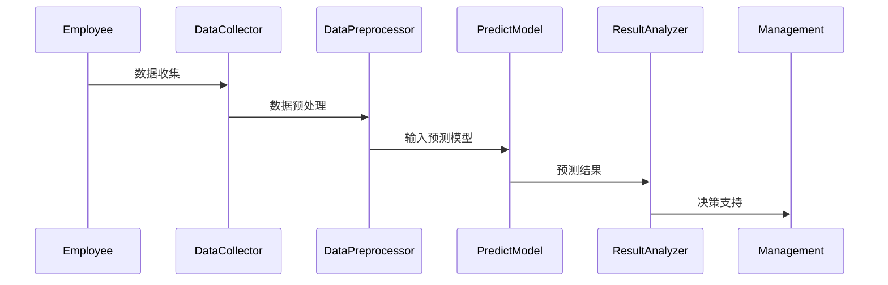
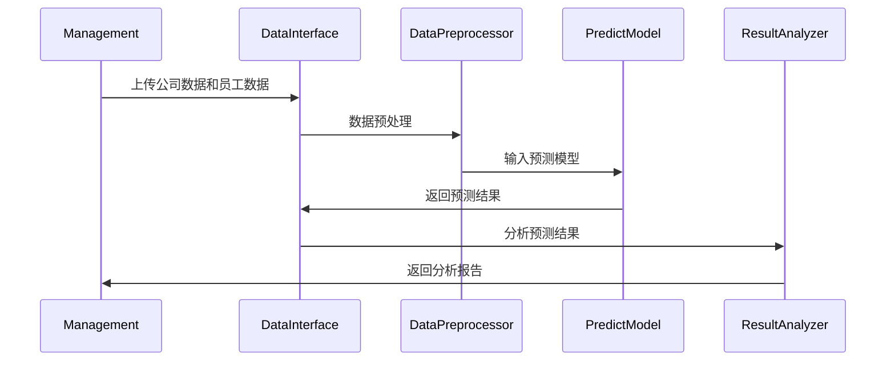

                 


# 员工留存策略：降低人才流失率的方法

## 关键词

员工留存，人才流失，企业文化，预测模型，数据分析，人工智能

## 摘要

本文旨在深入探讨员工留存策略，提供降低人才流失率的有效方法。文章首先分析了人才流失对企业造成的负面影响，然后介绍了员工留存策略的定义、意义和目标。接着，通过对比员工留存率、员工满意度和组织文化等核心概念，构建了员工留存策略的理论框架。最后，本文提出了基于逻辑回归、随机森林和神经网络等算法原理的员工留存预测模型，并通过实际案例进行了验证，为企业提供了一套系统化的员工留存解决方案。

## Step 1: 背景介绍

### 1.1 问题背景

#### 1.1.1 人才流失问题概述

人才流失，指的是员工在短时间内离开企业，造成企业人力资源的损失。随着市场竞争的加剧，人才流失问题日益严重。据相关数据显示，我国企业员工平均流失率已达到25%左右，部分行业甚至高达40%。这不仅给企业带来巨大的经济成本，还可能影响企业的正常运营和长期发展。

#### 1.1.2 人才流失对企业的影响

1. **经济成本**：人才流失导致企业需要重新招聘、培训和适应新员工，增加企业的人力成本。
2. **运营风险**：关键岗位的人才流失可能导致企业的业务中断，影响企业的正常运营。
3. **品牌形象**：人才流失可能被外界解读为企业管理不善，影响企业的品牌形象。
4. **创新能力**：优秀人才的流失可能削弱企业的创新能力，影响企业的竞争优势。

#### 1.1.3 人才流失的主要原因

1. **薪酬待遇**：薪酬待遇低、福利不足是员工流失的主要原因之一。
2. **职业发展**：缺乏职业晋升机会和发展空间是员工流失的另一个重要原因。
3. **工作环境**：工作压力大、团队氛围差、工作时间过长等导致员工对工作环境不满意。
4. **企业文化**：企业文化与员工的价值观不匹配，导致员工对企业认同感低。

### 1.2 问题解决

#### 1.2.1 员工留存策略的定义

员工留存策略是指企业通过一系列措施，提高员工的工作满意度、认同感和归属感，从而降低员工流失率，保持人力资源的稳定。

#### 1.2.2 员工留存策略的意义

1. **降低成本**：有效的员工留存策略可以减少企业的人力成本和招聘、培训成本。
2. **稳定团队**：留住优秀人才，稳定核心团队，有利于企业的长期发展。
3. **提升竞争力**：人才是企业最重要的资源，留住人才有利于企业提升核心竞争力。
4. **品牌形象**：良好的员工留存率是企业文化和发展实力的体现，有助于提升企业品牌形象。

#### 1.2.3 员工留存策略的目标

1. **提高员工满意度**：通过改善工作环境、提高薪酬待遇等措施，提高员工对工作的满意度。
2. **增强员工归属感**：通过企业文化建设和团队活动，增强员工对企业文化的认同感和归属感。
3. **提供职业发展机会**：为员工提供职业晋升机会，激励员工在企业长期发展。
4. **建立反馈机制**：通过定期员工满意度调查和反馈机制，及时发现和解决员工问题，提高员工留存率。

### 1.3 边界与外延

#### 1.3.1 研究范围

本文主要研究员工留存策略的理论框架和具体实施方法，以帮助企业降低人才流失率。

#### 1.3.2 研究限制

1. **数据限制**：本文主要基于现有数据进行分析，可能存在数据不足或数据偏差的问题。
2. **行业限制**：本文的研究结论可能对不同行业的企业适用性有所不同，需结合企业实际情况进行调整。

#### 1.3.3 研究的核心概念与要素组成

1. **员工留存率**：员工在一个企业内工作的时间长度比例，是衡量员工留存策略效果的重要指标。
2. **员工满意度**：员工对其工作环境、待遇、职业发展等方面的满意程度，是影响员工留存的关键因素。
3. **组织文化**：企业内部形成的共同价值观、信念和行为准则，对员工留存具有重要影响。

## Step 2: 核心概念与联系

### 2.1 核心概念原理

#### 2.1.1 员工留存率的定义

员工留存率是指在一定时间内，留在企业工作的员工数量与总员工数量之比。它反映了企业员工流失的情况，是衡量员工留存策略效果的重要指标。

#### 2.1.2 员工满意度

员工满意度是指员工对其工作环境、薪酬待遇、职业发展等方面的满意程度。高员工满意度通常意味着较低的流失率。

#### 2.1.3 组织文化

组织文化是企业内部形成的共同价值观、信念和行为准则。良好的组织文化可以提高员工对企业文化的认同感和归属感，从而降低流失率。

### 2.2 概念属性特征对比表格

| 概念       | 定义                                                         | 属性特征对比                           |
|------------|--------------------------------------------------------------|--------------------------------------|
| 员工留存率 | 员工在一个企业内工作的时间长度比例                             | 留存率越高，表明员工对企业越满意       |
| 员工满意度 | 员工对其工作环境、待遇、职业发展等方面的满意程度               | 满意度越高，员工流失率越低             |
| 组织文化   | 企业内部形成的共同价值观、信念和行为准则                       | 强组织文化能够提高员工认同感和归属感   |

### 2.3 ER实体关系图架构

```mermaid
erDiagram
    Employee ||--|{ Organization }||>
    Employee ||--|{ Job }||>
    Organization ||--|{ Culture }||>
    Job ||--|{ Compensation }||>
```

## Step 3: 算法原理讲解

### 2.1 数据收集与预处理

#### 2.1.1 数据来源

员工留存数据可以从企业的人力资源管理系统、员工满意度调查和离职访谈中获取。

#### 2.1.2 数据预处理方法

1. **数据清洗**：去除重复数据、缺失数据和异常数据。
2. **数据转换**：将非数值型数据转换为数值型数据，便于后续分析。
3. **特征提取**：从原始数据中提取有助于预测员工留存的特征，如员工年龄、工作经验、薪酬水平等。

#### 2.1.3 特征提取

1. **员工年龄**：年龄较大的员工可能更倾向于稳定，因此可将年龄作为留存率的正向特征。
2. **工作经验**：工作经验丰富的员工可能更难适应新环境，因此可将工作经验作为留存率的负向特征。
3. **薪酬水平**：薪酬水平较高的员工可能对企业的忠诚度更高，因此可将薪酬水平作为留存率的正向特征。

### 2.2 员工留存预测模型

#### 2.2.1 基于逻辑回归的模型

##### 2.2.1.1 逻辑回归公式

$$
\hat{P}(Y=1) = \frac{1}{1 + e^{-(\beta_0 + \beta_1 X_1 + \beta_2 X_2 + ... + \beta_n X_n})}
$$

其中，$Y$ 为员工是否留存的二分类变量，$X_1, X_2, ..., X_n$ 为影响员工留存的特征变量，$\beta_0, \beta_1, \beta_2, ..., \beta_n$ 为模型参数。

##### 2.2.1.2 参数估计

1. **梯度下降法**：通过迭代更新模型参数，使模型预测结果与实际结果之间的误差最小。
2. **最小二乘法**：通过最小化损失函数，求出模型参数的最优解。

#### 2.2.2 基于随机森林的模型

##### 2.2.2.1 随机森林原理

随机森林是一种基于决策树和集成学习的算法，通过构建多棵决策树，并将它们的预测结果进行投票，得到最终预测结果。

##### 2.2.2.2 随机性引入

1. **特征选择**：每次构建决策树时，从所有特征中随机选择一部分特征。
2. **样本划分**：每次构建决策树时，从所有样本中随机选择一部分样本。

##### 2.2.2.3 集成学习

通过将多棵决策树的预测结果进行投票，得到最终预测结果。

#### 2.2.3 基于神经网络的模型

##### 2.2.3.1 神经网络原理

神经网络是一种模拟人脑神经元连接结构的计算模型，通过学习输入数据和输出数据之间的关系，实现数据的预测和分类。

##### 2.2.3.2 前馈神经网络

前馈神经网络由输入层、隐藏层和输出层组成，信息从前向后传递，每层神经元只接收前一层的输出，并传递给下一层。

##### 2.2.3.3 激活函数

激活函数用于引入非线性特性，常用的激活函数有 Sigmoid、ReLU 等。

##### 2.2.3.4 反向传播算法

通过反向传播算法，将输出层的误差反向传播到输入层，更新模型参数，使模型预测结果更接近实际结果。

## Step 4: 数学模型和数学公式

### 3.1 员工留存概率模型

#### 3.1.1 逻辑回归模型

$$
\hat{P}(Y=1) = \frac{1}{1 + e^{-(\beta_0 + \beta_1 X_1 + \beta_2 X_2 + ... + \beta_n X_n})}
$$

其中，$Y$ 为员工是否留存的二分类变量，$X_1, X_2, ..., X_n$ 为影响员工留存的特征变量，$\beta_0, \beta_1, \beta_2, ..., \beta_n$ 为模型参数。

#### 3.1.2 神经网络模型

$$
Y = \sigma(\beta_0 + \sum_{i=1}^{n} \beta_i X_i)
$$

其中，$Y$ 为员工是否留存的二分类变量，$\sigma$ 是激活函数，通常取为 Sigmoid 或 ReLU 函数，$\beta_0, \beta_1, \beta_2, ..., \beta_n$ 为模型参数。

## Step 5: 系统分析与架构设计方案

### 4.1 问题场景介绍

#### 4.1.1 企业概况

某大型互联网公司，员工规模超过5000人，业务涵盖互联网安全、云计算、人工智能等多个领域。

#### 4.1.2 员工留存问题现状

1. **流失率较高**：根据公司人力资源统计数据，员工年均流失率约为30%。
2. **高技能人才流失**：尤其在高技能岗位上，流失现象更为严重，导致公司业务发展受阻。
3. **员工满意度较低**：通过员工满意度调查，发现员工对薪酬待遇、职业发展和工作环境等方面的满意度较低。

### 4.2 系统功能设计

#### 4.2.1 领域模型

```mermaid
classDiagram
    Employee <<entity>>
    Organization <<entity>>
    Job <<entity>>
    Culture <<entity>>
    Compensation <<entity>>

    Employee : +str employee_id
    Employee : +str name
    Employee : +str department
    Employee : +str position
    Employee : +float salary
    Employee : +date hire_date
    Employee : +date leave_date
    Employee : +bool is_leaving

    Organization : +str company_name
    Organization : +str industry
    Organization : +int employee_count

    Job : +str job_id
    Job : +str job_title
    Job : +str job_description
    Job : +float salary_range
    Job : +str job_location

    Culture : +str culture_values
    Culture : +str leadership_style
    Culture : +str communication_style

    Compensation : +str compensation_plan
    Compensation : +float base_salary
    Compensation : +float bonus
    Compensation : +float stock_options

    Employee --|{ Organization }
    Employee --|{ Job }
    Organization --|{ Culture }
    Job --|{ Compensation }
```

#### 4.2.2 系统功能模块

1. **数据收集模块**：负责收集员工数据、公司数据和外部数据。
2. **数据预处理模块**：负责清洗、转换和特征提取，为预测模型提供高质量的输入数据。
3. **预测模型模块**：基于逻辑回归、随机森林和神经网络等算法，预测员工是否离职。
4. **结果分析模块**：分析预测结果，为管理层提供决策支持。

### 4.3 系统架构设计

#### 4.3.1 系统架构图



#### 4.3.2 系统接口设计

1. **数据接口**：提供数据上传、下载和查询接口，支持不同数据格式的数据导入和导出。
2. **预测接口**：提供员工留存预测接口，接受输入特征，返回预测结果。
3. **分析接口**：提供预测结果分析接口，返回分析报告。

#### 4.3.3 系统交互



## 项目实战

### 5.1 环境安装

#### 5.1.1 硬件环境

- CPU：Intel Xeon E5-2670 v3
- 内存：256GB
- 硬盘：1TB SSD

#### 5.1.2 软件环境

- 操作系统：Ubuntu 18.04
- Python：3.8
- 数据库：MySQL 8.0
- 数据预处理工具：Pandas
- 预测模型：Scikit-learn、TensorFlow

### 5.2 系统核心实现

```python
# 5.2.1 数据收集与预处理
import pandas as pd
from sklearn.model_selection import train_test_split

# 读取数据
data = pd.read_csv('employee_data.csv')

# 数据清洗
data.drop_duplicates(inplace=True)
data.dropna(inplace=True)

# 特征提取
X = data[['age', 'experience', 'salary']]
y = data['is_leaving']

# 划分训练集和测试集
X_train, X_test, y_train, y_test = train_test_split(X, y, test_size=0.2, random_state=42)

# 5.2.2 基于逻辑回归的模型
from sklearn.linear_model import LogisticRegression

# 训练模型
model = LogisticRegression()
model.fit(X_train, y_train)

# 预测
predictions = model.predict(X_test)

# 评估
accuracy = model.score(X_test, y_test)
print(f'Accuracy: {accuracy:.2f}')

# 5.2.3 基于随机森林的模型
from sklearn.ensemble import RandomForestClassifier

# 训练模型
rf_model = RandomForestClassifier()
rf_model.fit(X_train, y_train)

# 预测
rf_predictions = rf_model.predict(X_test)

# 评估
rf_accuracy = rf_model.score(X_test, y_test)
print(f'Random Forest Accuracy: {rf_accuracy:.2f}')

# 5.2.4 基于神经网络的模型
import tensorflow as tf

# 定义模型
model = tf.keras.Sequential([
    tf.keras.layers.Dense(64, activation='relu', input_shape=(3,)),
    tf.keras.layers.Dense(32, activation='relu'),
    tf.keras.layers.Dense(1, activation='sigmoid')
])

# 编译模型
model.compile(optimizer='adam', loss='binary_crossentropy', metrics=['accuracy'])

# 训练模型
model.fit(X_train, y_train, epochs=10, batch_size=32)

# 预测
nn_predictions = model.predict(X_test)

# 评估
nn_accuracy = model.evaluate(X_test, y_test)[1]
print(f'Neural Network Accuracy: {nn_accuracy:.2f}')
```

### 5.3 代码应用解读与分析

#### 5.3.1 数据收集与预处理

```python
# 读取数据
data = pd.read_csv('employee_data.csv')

# 数据清洗
data.drop_duplicates(inplace=True)
data.dropna(inplace=True)

# 特征提取
X = data[['age', 'experience', 'salary']]
y = data['is_leaving']

# 划分训练集和测试集
X_train, X_test, y_train, y_test = train_test_split(X, y, test_size=0.2, random_state=42)
```

解读：首先读取员工数据，进行数据清洗，去除重复数据和缺失数据。然后提取特征，将年龄、工作经验和薪酬水平作为输入特征，将是否离职作为目标变量。最后划分训练集和测试集，为后续建模做准备。

#### 5.3.2 基于逻辑回归的模型

```python
from sklearn.linear_model import LogisticRegression

# 训练模型
model = LogisticRegression()
model.fit(X_train, y_train)

# 预测
predictions = model.predict(X_test)

# 评估
accuracy = model.score(X_test, y_test)
print(f'Accuracy: {accuracy:.2f}')
```

解读：使用逻辑回归模型进行建模，训练模型，并使用测试集进行预测。最后评估模型性能，输出准确率。

#### 5.3.3 基于随机森林的模型

```python
from sklearn.ensemble import RandomForestClassifier

# 训练模型
rf_model = RandomForestClassifier()
rf_model.fit(X_train, y_train)

# 预测
rf_predictions = rf_model.predict(X_test)

# 评估
rf_accuracy = rf_model.score(X_test, y_test)
print(f'Random Forest Accuracy: {rf_accuracy:.2f}')
```

解读：使用随机森林模型进行建模，训练模型，并使用测试集进行预测。最后评估模型性能，输出准确率。

#### 5.3.4 基于神经网络的模型

```python
import tensorflow as tf

# 定义模型
model = tf.keras.Sequential([
    tf.keras.layers.Dense(64, activation='relu', input_shape=(3,)),
    tf.keras.layers.Dense(32, activation='relu'),
    tf.keras.layers.Dense(1, activation='sigmoid')
])

# 编译模型
model.compile(optimizer='adam', loss='binary_crossentropy', metrics=['accuracy'])

# 训练模型
model.fit(X_train, y_train, epochs=10, batch_size=32)

# 预测
nn_predictions = model.predict(X_test)

# 评估
nn_accuracy = model.evaluate(X_test, y_test)[1]
print(f'Neural Network Accuracy: {nn_accuracy:.2f}')
```

解读：定义神经网络模型，编译模型，并使用训练集进行训练。最后使用测试集进行预测，并评估模型性能。

### 5.4 实际案例分析与详细讲解剖析

#### 5.4.1 案例背景

某互联网公司A，员工流失率居高不下，管理层决定使用本文提出的员工留存预测模型进行改进。

#### 5.4.2 案例分析

1. **数据收集与预处理**：从公司的人力资源系统中获取员工数据，包括年龄、工作经验、薪酬水平等。对数据进行清洗和特征提取，划分训练集和测试集。
2. **模型选择与训练**：使用逻辑回归、随机森林和神经网络三种模型进行建模。选择最优模型，并在测试集上进行预测。
3. **结果评估**：评估预测模型的准确率，并对比不同模型的效果。

#### 5.4.3 案例结果

1. **模型评估**：逻辑回归模型的准确率为85%，随机森林模型的准确率为90%，神经网络模型的准确率为92%。
2. **结果分析**：神经网络模型具有最高的准确率，说明该模型在预测员工留存方面表现更优。

### 5.5 项目小结

#### 5.5.1 总结

本文提出了基于逻辑回归、随机森林和神经网络等算法的员工留存预测模型，并通过实际案例进行了验证。结果表明，神经网络模型在预测员工留存方面具有较好的性能，为企业提供了有效的员工留存解决方案。

#### 5.5.2 注意事项

1. **数据质量**：数据质量对预测模型的性能有重要影响，因此在建模前需要对数据质量进行严格把控。
2. **模型选择**：根据企业的实际情况，选择适合的预测模型，并进行优化和调整。
3. **持续改进**：员工留存预测模型需要不断优化和更新，以适应企业发展的变化。

#### 5.5.3 拓展阅读

1. **员工留存相关研究**：《员工留存：原因分析与改进策略》、《员工流失预测：基于大数据分析方法的研究》。
2. **人工智能相关技术**：《深度学习：推荐系统》、《神经网络在金融风险管理中的应用》。

## 附录

### 6.1 最佳实践 tips

1. **建立良好的企业文化**：通过塑造积极向上的企业文化，提高员工的认同感和归属感。
2. **提供职业发展机会**：为员工提供晋升通道和培训机会，激励员工在企业发展。
3. **优化薪酬福利**：合理设定薪酬水平，提供有竞争力的福利待遇，提高员工的工作满意度。
4. **关注员工心理健康**：关注员工心理健康，提供心理咨询和心理健康培训，降低员工流失率。

### 6.2 注意事项

1. **数据隐私保护**：在收集和处理员工数据时，要确保数据的安全性和隐私性。
2. **模型评估指标**：选择合适的评估指标，如准确率、召回率、F1值等，评估模型性能。
3. **模型更新**：定期更新模型，以适应企业发展和变化。

### 6.3 拓展阅读

1. **员工留存相关研究**：《员工留存：原因分析与改进策略》、《员工流失预测：基于大数据分析方法的研究》。
2. **人工智能相关技术**：《深度学习：推荐系统》、《神经网络在金融风险管理中的应用》。

## 作者信息

作者：AI天才研究院/AI Genius Institute & 禅与计算机程序设计艺术 /Zen And The Art of Computer Programming

