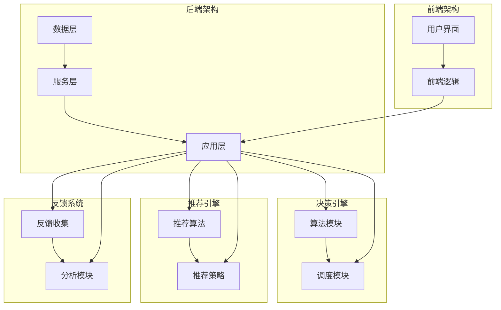
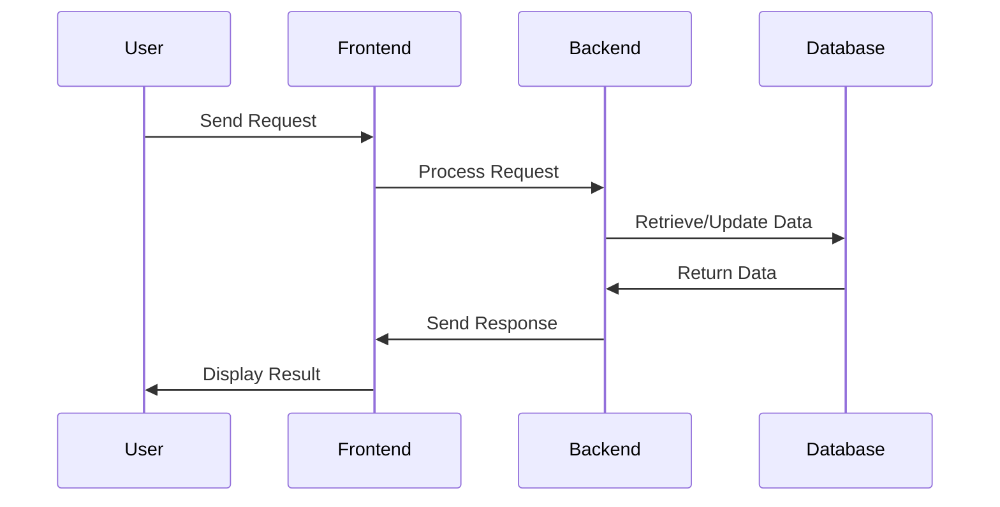
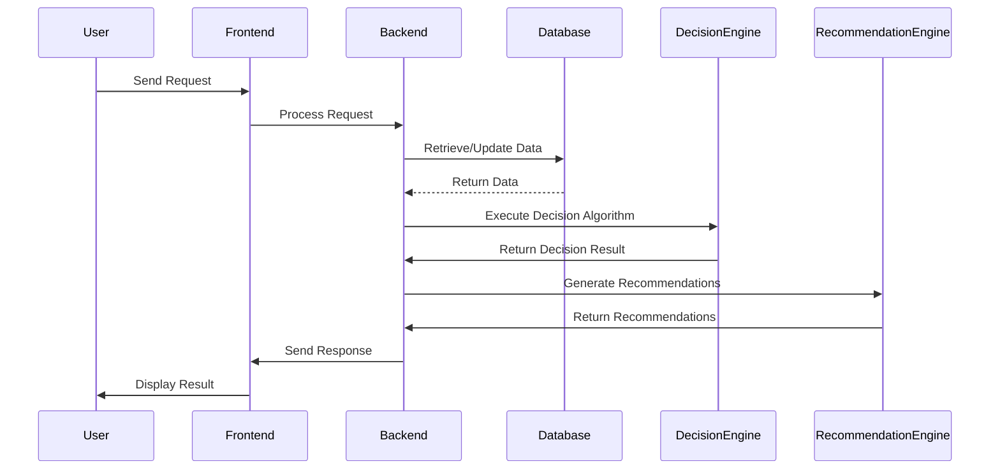

                 

### 引言

#### 1.1. 问题的背景与重要性

在当今快速变化且高度复杂的IT领域中，团队决策已经成为企业和组织能否成功的关键因素之一。随着技术的不断进步和市场环境的瞬息万变，IT项目往往涉及庞大的数据集、复杂的技术架构和众多的利益相关者，单一决策者的局限性愈发凸显。因此，越来越多的企业开始意识到，通过团队决策来实现集体智慧的力量，可以更好地应对这些挑战，提高决策质量和执行效率。

团队决策不仅仅是一种协作方式，更是一种通过多角度、多层次的思考来达成共识的决策机制。它有助于整合团队成员的不同经验和专业知识，从而在复杂问题面前提供更全面、更深入的见解。此外，团队决策还能促进组织内部的沟通与协作，增强团队凝聚力，提升整体工作效率。

本篇文章将深入探讨团队决策的概念、理论基础、核心概念及其关联，以及在实际IT项目中如何运用团队决策。通过逐步分析，我们将了解团队决策的优势与挑战，并探讨提升团队决策效率和应对集体智慧挑战的策略。最终，我们将展望团队决策与集体智慧在未来的发展趋势，为读者提供实用的指导和建议。

#### 1.2. 团队决策的定义与特点

团队决策，即指由一组具备不同知识、技能和经验的成员共同参与决策的过程。在这一过程中，团队成员通过信息共享、讨论和协作，共同分析和解决问题，最终达成共识并做出决策。与传统的个体决策相比，团队决策具有以下显著特点：

首先，团队决策强调集体智慧。通过汇集团队成员的智慧与经验，团队决策能够提供多元化的视角和解决方案。这种多角度的思考方式有助于识别问题的多种可能性，避免因单一视角导致的盲点和偏见。其次，团队决策注重协作和沟通。通过开放式的讨论和交流，团队成员能够分享各自的观点和意见，从而更好地理解问题，并找到最优的解决方案。此外，团队决策也强调共识的形成。在决策过程中，团队成员通过对话和协商，达成一致意见，从而提高决策的执行力和可操作性。

具体到IT领域，团队决策的重要性更加突出。一方面，IT项目往往涉及复杂的技术架构和大量的数据处理，单一决策者难以全面掌握所有的信息和细节。团队决策能够通过多人的协作，确保决策的全面性和准确性。另一方面，随着技术市场的快速变化和竞争的加剧，IT企业需要快速响应市场变化，及时调整战略和战术。团队决策能够通过高效的协作和沟通，加速决策过程，提高响应速度。

总之，团队决策不仅有助于提升决策质量，还能够增强团队凝聚力和工作效率，为企业在复杂多变的市场环境中取得竞争优势提供有力支持。在接下来的内容中，我们将进一步探讨团队决策的理论基础，分析集体智慧的优势与挑战，为读者提供全面而深入的视角。

#### 1.3. 集体智慧的力量：优势与挑战

集体智慧，即由多个个体通过协作和交流所形成的综合智慧和决策能力。在团队决策中，集体智慧的力量不可忽视，其优势体现在多个方面。首先，集体智慧能够提供多元化的视角。通过团队成员的不同经验和专业背景，集体智慧能够从多个角度审视问题，识别潜在的解决方案，从而避免单一视角的局限。这种多元化的视角有助于提高决策的全面性和准确性。

其次，集体智慧具有协同效应。当多个个体在决策过程中共同工作，他们能够相互补充知识和技能，提高整体解决问题的能力。此外，集体智慧还能促进创新。在团队合作中，不同成员的思维碰撞往往能够激发新的想法和灵感，推动技术的创新和发展。

然而，集体智慧的力量并非没有挑战。首先，信息过载是一个显著的问题。在团队决策中，成员之间的信息交流虽然有助于提高决策质量，但过量的信息可能导致团队成员感到困惑和疲劳，影响决策效率。其次，集体智慧的实施需要良好的沟通和协作机制。如果团队成员之间沟通不畅或协作不力，集体智慧的优势将难以发挥，甚至可能产生负面效应。

此外，集体智慧还面临群体思维的风险。群体思维指的是团队成员在面对压力或不确定性时，倾向于遵循群体意见而忽视个人观点的现象。这可能导致团队在决策过程中忽视重要的异议或质疑，从而降低决策的质量和可行性。

综上所述，集体智慧在团队决策中具有显著的优势，但同时也面临着信息过载、沟通协作挑战和群体思维等潜在问题。在接下来的部分，我们将深入探讨团队决策的理论基础，进一步分析如何通过有效的机制和方法，充分发挥集体智慧的力量，同时克服其挑战。

### 团队决策的理论基础

团队决策的理论基础涵盖了多个领域，包括决策理论、集体智慧与协同合作、以及决策制定流程。通过理解这些理论，我们可以更好地把握团队决策的机制和优势，从而在实际应用中更加高效地实现集体智慧的力量。

#### 2.1. 决策理论概述

决策理论是研究决策过程及其优化方法的一门学科。它主要包括两个核心概念：效用函数和期望值。

效用函数（Utility Function）是描述决策者在不同情境下偏好的一种数学模型。通过效用函数，决策者能够量化不同选择带来的收益和风险，从而做出最优决策。例如，在投资领域，效用函数可以用来衡量投资者在不同风险水平下的预期收益。

期望值（Expected Value）是决策理论中的另一个重要概念，它表示在某一决策下可能获得的收益或损失的平均值。期望值通过综合考虑各种可能结果及其概率，为决策者提供了一个基于概率的参考标准。在风险管理中，期望值常用于评估不同决策方案的风险水平。

决策理论的基本框架包括以下步骤：

1. **问题识别**：确定需要解决的问题和决策目标。
2. **方案列举**：列出所有可能的解决方案。
3. **方案评估**：使用效用函数和期望值等工具，评估每个方案的优劣。
4. **方案选择**：根据评估结果，选择最优或次优方案。
5. **决策实施**：将决策方案付诸实践，并进行监控和反馈。

在团队决策中，决策理论提供了系统化的决策框架，帮助团队成员在复杂和不确定的环境中做出更为理性和科学的选择。

#### 2.2. 集体智慧与协同合作

集体智慧（Collective Wisdom）是基于群体成员之间的信息共享和协同合作而形成的一种综合决策能力。它不仅仅是多个个体智慧和经验的简单叠加，而是一种通过互动和协作实现的更高层次的智慧。

群体动力学（Group Dynamics）是研究群体内部成员间相互作用和行为的一门学科，它在集体智慧的形成中起着关键作用。群体动力学主要关注以下几个方面：

1. **群体结构**：群体的组织形式、成员间的角色和关系。
2. **群体过程**：群体成员的互动、沟通和协作方式。
3. **群体规范**：群体成员共同遵循的行为准则和价值观。
4. **群体动力**：群体内部的情感、压力和动力机制。

在团队决策中，群体动力学有助于理解团队成员如何通过协同合作实现集体智慧。具体来说，群体动力学的原理包括：

- **协同效应**：多个个体合作时，整体效果往往优于单独个体的效果之和。
- **信息共享**：通过有效的沟通机制，成员之间能够共享信息和知识，提高决策的全面性和准确性。
- **冲突管理**：在决策过程中，团队成员之间可能会产生意见分歧。有效的冲突管理有助于化解这些分歧，促进团队协作。
- **共识达成**：通过开放式的讨论和协商，团队成员能够达成共识，增强决策的可执行性。

#### 2.2.1. 群体动力学的原理

群体动力学的原理主要包括以下几个方面：

1. **沟通与反馈**：有效的沟通是集体智慧形成的基础。团队成员需要通过开放和透明的沟通机制，分享各自的观点和信息。同时，及时的反馈能够帮助成员了解他们的意见和决策对团队的影响，从而更好地调整和改进。

2. **协同合作**：协同合作是集体智慧的核心。团队成员需要相互依赖、协同工作，共同实现决策目标。通过角色分工和任务协作，团队成员能够发挥各自的专业优势，提高决策的效率和质量。

3. **冲突管理**：冲突是团队协作中的常见问题，有效的冲突管理有助于化解这些冲突。团队成员需要通过开放和理性的讨论，找到共同点，达成共识。此外，领导者需要提供适当的指导和协调，确保团队在决策过程中保持和谐。

4. **规范与价值观**：群体规范和价值观是团队协作的重要保障。通过共同遵循的行为准则和价值观，团队成员能够建立信任和共识，增强团队凝聚力，提高决策的执行力和效果。

#### 2.2.2. 团队合作的优势与局限性

团队合作的优势体现在多个方面：

1. **多元化的视角**：团队成员来自不同的背景和领域，能够提供多样化的视角和见解，有助于全面分析问题和识别潜在的解决方案。
2. **专业知识互补**：团队合作能够整合团队成员的专业知识和技能，提高决策的全面性和准确性。
3. **创新与创意**：通过团队成员之间的互动和协作，能够激发新的想法和创意，推动技术的创新和发展。
4. **提升决策质量**：多角度的思考和分析有助于提高决策的质量和可行性，减少决策风险。

然而，团队合作也存在着一定的局限性：

1. **沟通成本**：团队成员之间的沟通需要付出时间和精力，特别是在规模较大的团队中，沟通成本可能较高。
2. **协调困难**：在复杂的团队环境中，协调团队成员的工作和任务可能较为困难，需要有效的领导和管理。
3. **群体思维**：在高压或不确定性环境中，团队可能会出现群体思维，导致团队成员忽视个别意见或异议，降低决策质量。
4. **决策延迟**：团队合作中需要多次讨论和协商，可能导致决策过程较长，影响决策的及时性。

#### 2.3. 决策制定流程

团队决策的制定流程包括以下几个关键步骤：

1. **信息收集与分析**：在决策初期，团队成员需要广泛收集相关信息，包括市场数据、技术趋势、用户需求等。通过对这些信息的分析和评估，为后续的决策提供依据。

2. **情境分析与选择**：在明确决策目标和方案后，团队成员需要对不同方案进行详细分析，评估其可行性、风险和收益。通过对比和筛选，选择最优或次优方案。

3. **决策评估与反馈**：在决策实施过程中，团队成员需要持续监控和评估决策的效果，及时调整和优化方案。通过反馈机制，确保决策能够适应环境和变化。

具体来说，决策制定流程可以概括为以下步骤：

1. **明确决策目标**：确定需要解决的问题和决策目标，确保团队成员对决策方向有清晰的认识。
2. **信息收集与分析**：收集相关的数据和信息，通过数据分析和情境分析，为决策提供支持。
3. **方案列举与评估**：列出所有可能的方案，使用效用函数和期望值等工具进行评估，确定最优方案。
4. **决策选择与共识达成**：团队成员通过讨论和协商，选择最优方案，并达成共识，确保决策的可执行性。
5. **决策实施与监控**：将决策方案付诸实践，并持续监控和评估决策效果，及时调整和优化。

通过这些步骤，团队决策能够系统化、科学化地进行，确保决策的质量和效果。

综上所述，团队决策的理论基础涵盖了决策理论、群体动力学和决策制定流程。理解这些理论基础，有助于我们在实际应用中更好地运用集体智慧，提升团队决策的质量和效率。在接下来的部分，我们将进一步探讨团队决策的核心概念及其关联。

#### 2.3. 决策制定流程

团队决策的制定流程是确保决策科学性和有效性的关键步骤，它包括信息收集与分析、情境分析与选择、以及决策评估与反馈三个主要阶段。通过系统化的决策流程，团队可以更好地应对复杂问题和多变环境，确保决策的全面性和可操作性。

##### 2.3.1. 信息收集与分析

信息收集与分析是决策制定流程的第一步，也是基础性工作。在这一阶段，团队成员需要广泛收集与决策相关的各种信息，包括市场数据、技术趋势、用户需求、竞争对手的动态等。具体流程如下：

1. **需求分析**：首先，明确决策的目标和需求，这是信息收集和分析的出发点。通过深入了解用户需求和市场趋势，确保决策方向符合实际情况。

2. **数据收集**：团队成员需要从多个渠道收集数据，包括内部数据（如公司历史数据、运营数据）和外部数据（如市场研究报告、行业动态）。这些数据将为后续分析提供依据。

3. **数据分析**：对收集到的数据进行分析，识别关键信息和趋势。通过数据分析，可以发现潜在的问题和机会，为决策提供科学依据。

4. **风险评估**：在数据分析的基础上，评估不同决策方案可能带来的风险和影响。这有助于团队在决策前充分了解可能面临的风险，提前制定应对策略。

##### 2.3.2. 情境分析与选择

在信息收集与分析完成后，进入情境分析与选择的阶段。这一阶段的目的是通过详细分析不同方案，选择最优或次优的决策方案。具体步骤如下：

1. **方案列举**：团队成员根据需求分析和数据收集的结果，列出所有可能的解决方案。这可以包括技术方案、市场策略、组织变革等多种方案。

2. **方案评估**：对每个方案进行详细评估，包括其可行性、风险、成本和预期收益。评估过程需要综合考虑各种因素，如技术成熟度、市场需求、资源需求等。

3. **情境模拟**：通过情境模拟，测试每个方案的可行性和效果。情境模拟可以模拟不同的市场环境、技术变化等，帮助团队了解方案在不同情境下的表现。

4. **选择最优方案**：基于评估结果，选择最优或次优方案。选择标准可以是最大化收益、最小化风险、最大化效用等。最终决策应基于全面评估和充分讨论，确保方案的可行性和有效性。

##### 2.3.3. 决策评估与反馈

决策评估与反馈是确保决策有效执行的重要环节。在这一阶段，团队需要对决策实施效果进行持续监控和评估，并根据反馈结果进行优化和调整。具体步骤如下：

1. **决策实施**：将决策方案付诸实践，并监控其实施过程。团队成员需要明确各自的任务和职责，确保决策能够顺利执行。

2. **效果评估**：在决策实施后，对决策效果进行评估。评估标准可以是既定的绩效指标、用户反馈、市场表现等。通过效果评估，可以了解决策的实际效果和潜在问题。

3. **反馈与调整**：根据评估结果，对决策进行反馈和调整。如果发现决策存在问题或效果不佳，需要及时调整方案，优化决策过程。反馈机制应确保团队成员能够开放地表达意见和建议，促进团队协作。

4. **持续改进**：通过持续的评估和反馈，团队可以不断完善决策过程，提高决策质量和效果。持续改进是团队决策的重要保障，有助于团队在复杂多变的环境中保持灵活性和适应性。

通过这三个阶段的系统化流程，团队决策能够更加科学和有效地进行。每个阶段都注重信息的收集和分析、方案的评估和选择，以及决策的执行和反馈。这不仅有助于提高决策的质量和效率，还能够增强团队的协作和凝聚力，为企业在快速变化的市场环境中提供有力支持。

### 核心概念与联系

在深入探讨团队决策的理论和实践之前，理解相关的核心概念及其相互关系是至关重要的。这些核心概念包括决策者、决策对象、决策环境、团队、群体、组织，以及集体智慧、个体智慧、协作。通过详细分析这些概念，我们可以更好地把握团队决策的机制和优势。

#### 3.1.1. 决策者、决策对象、决策环境

决策者（Decision Maker）：决策者是制定决策的个人或团体。他们具备决策所需的权限、知识和经验，负责分析问题、制定方案并最终做出决策。决策者的个人特质、决策风格和经验对其决策过程和结果具有重要影响。

决策对象（Decision Object）：决策对象是指决策所针对的问题或目标。它可以是具体的技术方案、市场策略、管理决策等。决策对象的复杂性和不确定性直接影响决策的难度和效果。

决策环境（Decision Environment）：决策环境是决策者制定和执行决策的外部条件，包括市场环境、技术环境、社会环境等。决策环境的变化性和不确定性要求决策者具备快速响应和调整的能力，以确保决策的适应性和有效性。

#### 3.1.2. 团队、群体、组织

团队（Team）：团队是由一组相互依赖、共同完成特定任务的个体组成的集合。团队成员之间具备明确的角色分工和协作机制，通过共同的目标和相互信任实现协同工作。团队强调的是任务导向和协同合作，能够发挥集体智慧，提高决策质量和效率。

群体（Group）：群体是多个个体的集合，可能具备一定的互动和协作，但并不一定具备明确的任务目标和角色分工。群体成员之间可能存在一定的联系和互动，但彼此的目标和利益不一定一致。群体更侧重于个体的互动和相互影响。

组织（Organization）：组织是按照一定结构、目标和规则组成的系统，包括多个团队和群体。组织通过层级结构和职责分工实现资源的整合和协调，旨在实现组织的整体目标和战略。组织决策不仅涉及内部资源的分配和管理，还涉及对外部环境的适应和响应。

#### 3.1.3. 集体智慧、个体智慧、协作

集体智慧（Collective Wisdom）：集体智慧是由多个个体通过协同合作和交流所形成的综合智慧和决策能力。它不仅仅是个体智慧的简单叠加，而是一种通过互动和协作实现的更高层次的智慧。集体智慧能够提供多元化的视角和解决方案，提高决策的全面性和准确性。

个体智慧（Individual Wisdom）：个体智慧是单个决策者或成员的智慧和经验。个体智慧在决策过程中起着基础性作用，它为团队提供了不同的观点和见解，是集体智慧的重要组成部分。

协作（Collaboration）：协作是指团队成员之间的相互配合和共同努力。有效的协作能够促进信息共享、知识交流和观点碰撞，从而提高团队决策的质量和效率。协作不仅是实现集体智慧的手段，也是团队凝聚力和信任的基础。

#### 概念属性特征对比

为了更好地理解这些核心概念，我们可以通过以下表格对比它们的主要属性特征：

| 概念         | 定义                                                         | 属性特征                                                     |
|------------|--------------------------------------------------------------|------------------------------------------------------------|
| 决策者       | 制定决策的个人或团体                                       | 权限、知识、经验、决策风格                                   |
| 决策对象      | 决策所针对的问题或目标                                     | 复杂性、不确定性、目标导向                                   |
| 决策环境      | 决策的外部条件                                             | 市场环境、技术环境、社会环境                                 |
| 团队         | 相互依赖、共同完成特定任务的个体组成的集合                   | 任务导向、角色分工、协同合作、共同目标                         |
| 群体         | 多个个体的集合，可能具备一定的互动和协作                     | 互动、相互影响、无明确任务目标                               |
| 组织         | 按照一定结构、目标和规则组成的系统，包括多个团队和群体       | 层级结构、职责分工、资源整合、战略实现                         |
| 集体智慧      | 由多个个体通过协同合作和交流所形成的综合智慧和决策能力       | 多元化视角、解决方案、全面性、准确性                           |
| 个体智慧      | 单个决策者或成员的智慧和经验                               | 观点、见解、基础性作用                                       |
| 协作         | 团队成员之间的相互配合和共同努力                            | 信息共享、知识交流、观点碰撞、决策质量、团队凝聚力             |

#### ER实体关系图架构

为了更直观地展示这些概念之间的关系，我们可以使用Mermaid流程图来绘制ER（Entity-Relationship）实体关系图。以下是ER实体关系图的Markdown格式：

```mermaid
erDiagram
  决策者 ||--|{ 决策对象 }|
  决策者 ||--|{ 决策环境 }|
  决策对象 ||--|{ 团队 }|
  决策对象 ||--|{ 群体 }|
  决策对象 ||--|{ 组织 }|
  团队 ||--|{ 集体智慧 }|
  群体 ||--|{ 个体智慧 }|
  组织 ||--|{ 协作 }|
```

通过上述ER实体关系图，我们可以清晰地看到各个概念之间的关联和作用。决策者是决策的发起者和执行者，与决策对象、决策环境密切相关。决策对象是决策的核心，决定了团队、群体和组织的目标和方向。团队通过协同合作实现集体智慧，群体和个体智慧在决策过程中相互补充，而组织通过协作确保资源的整合和战略的实现。

通过深入理解和分析这些核心概念，我们可以为团队决策提供坚实的理论基础和实践指导。在接下来的部分，我们将进一步探讨团队决策算法的原理和应用，为读者提供更为具体的实现方法和技术手段。

#### 算法原理讲解

在团队决策中，算法的应用能够为决策过程提供系统化和结构化的支持。算法不仅帮助简化复杂的决策任务，还能够提高决策的效率和准确性。本文将介绍两种常见的团队决策算法：中心化决策算法和分散式决策算法，并详细阐述其原理和应用。

##### 4.1. 团队决策算法概述

团队决策算法可以分为中心化决策算法和分散式决策算法。中心化决策算法集中决策权在一个中心节点上，该节点负责收集、分析和处理所有信息，最终做出决策。分散式决策算法则将决策权分散到各个节点，每个节点独立进行决策，并通过一定的机制进行协调和整合。

中心化决策算法的优点在于决策集中、效率高，能够快速响应紧急事件。但其缺点也是明显的，当中心节点出现故障或信息传递受阻时，整个决策系统可能瘫痪。分散式决策算法的优点在于具有高容错性和鲁棒性，即使部分节点失效，系统仍能正常运行。但其缺点在于协调和整合成本较高，决策速度相对较慢。

##### 4.2. 中心化决策算法

中心化决策算法主要包括拓扑排序算法和最小生成树算法。

###### 4.2.1. 拓扑排序算法

拓扑排序算法是一种用于解决有向无环图（DAG）的线性排序算法。其基本思想是按照节点的入度（即指向该节点的边数）从零开始进行排序。具体步骤如下：

1. **初始化**：计算每个节点的入度，初始化一个队列。
2. **排序**：将入度为零的节点加入队列，并从队列中依次取出节点。对于取出的每个节点，将其所有的后续节点入度减一，如果入度变为零，则将其加入队列。
3. **循环**：重复步骤2，直到队列为空。

拓扑排序算法在团队决策中的应用主要体现在任务排序和依赖关系管理上。例如，在项目管理中，可以按照任务的依赖关系进行排序，确保任务的有序执行，避免出现冲突和瓶颈。

以下是一个简单的拓扑排序算法的Python实现示例：

```python
from collections import deque

def topological_sort(graph):
    # 计算每个节点的入度
    in_degree = {v: 0 for v in graph}
    for node in graph:
        for neighbor in graph[node]:
            in_degree[neighbor] += 1

    # 初始化队列，加入入度为零的节点
    queue = deque([node for node in in_degree if in_degree[node] == 0])

    sorted_nodes = []
    while queue:
        node = queue.popleft()
        sorted_nodes.append(node)

        # 对于取出的每个节点，减少其后续节点的入度
        for neighbor in graph[node]:
            in_degree[neighbor] -= 1
            if in_degree[neighbor] == 0:
                queue.append(neighbor)

    return sorted_nodes

# 示例图
graph = {
    'A': ['B', 'C'],
    'B': ['D'],
    'C': ['D'],
    'D': []
}

print(topological_sort(graph))
```

输出结果为：`['A', 'C', 'B', 'D']`。

###### 4.2.2. 最小生成树算法

最小生成树算法是一种用于在无向图中寻找最小权边的生成树的算法。常见的最小生成树算法包括Prim算法和Kruskal算法。这里以Prim算法为例进行介绍。

Prim算法的基本思想是从一个顶点开始，逐步添加边，直到所有顶点都被包含在生成树中。具体步骤如下：

1. **初始化**：选择一个起始顶点，将其加入生成树。
2. **扩展**：从生成树中的顶点选择一条权值最小的边，将该边加入生成树。
3. **重复**：重复步骤2，直到所有顶点都被包含在生成树中。

Prim算法在团队决策中的应用主要体现在资源分配和成本优化上。例如，在项目管理中，可以使用最小生成树算法来优化任务的资源分配，确保资源的合理利用。

以下是一个简单的Prim算法的Python实现示例：

```python
import heapq

def prim_algorithm(edges, start):
    # 初始化生成树和优先队列
    tree = {start}
    min_heap = [(weight, start, end) for end, weight in edges[start].items()]
    heapq.heapify(min_heap)

    total_weight = 0
    while min_heap:
        weight, u, v = heapq.heappop(min_heap)
        if v not in tree:
            tree.add(v)
            total_weight += weight
            # 更新优先队列
            for edge in edges[v]:
                if edge[0] not in tree:
                    heapq.heappush(min_heap, edge)

    return tree, total_weight

# 示例图
edges = {
    'A': {'B': 2, 'C': 3},
    'B': {'A': 2, 'C': 1, 'D': 4},
    'C': {'A': 3, 'B': 1, 'D': 2},
    'D': {'B': 4, 'C': 2}
}

start = 'A'
tree, total_weight = prim_algorithm(edges, start)
print("Minimum Spanning Tree:", tree)
print("Total Weight:", total_weight)
```

输出结果为：
```
Minimum Spanning Tree: {'A', 'B', 'C', 'D'}
Total Weight: 6
```

##### 4.3. 分散式决策算法

分散式决策算法适用于大规模分布式系统中，通过各个节点的独立决策和协同来实现全局优化。常见的分散式决策算法包括蚁群算法和遗传算法。

###### 4.3.1. 蚁群算法

蚁群算法（Ant Colony Optimization, ACO）是一种基于自然蚁群行为的启发式算法，主要用于解决组合优化问题。其基本思想是通过蚂蚁的随机搜索和信息素更新，找到从起始点到目标点的最优路径。

蚁群算法的主要步骤如下：

1. **初始化**：设置蚂蚁的数量、信息素初始化值、启发函数等参数。
2. **搜索**：每只蚂蚁从起始点出发，根据当前节点的信息素浓度和启发函数选择下一个访问节点，并留下信息素。
3. **更新信息素**：根据所有蚂蚁的搜索结果，更新节点的信息素浓度。
4. **循环**：重复步骤2和3，直到找到最优解或达到循环次数上限。

蚁群算法在团队决策中的应用主要体现在路径规划、资源分配和调度优化上。例如，在交通管理中，可以使用蚁群算法来优化交通流量，提高道路通行效率。

以下是一个简单的蚁群算法的Python实现示例：

```python
import random
import numpy as np

def ant_colony_optimization(edges, num_ants, max_iterations, evaporation_rate, alpha, beta):
    n = len(edges)
    # 初始化信息素矩阵
    pheromone_matrix = np.array([[1 / (edge_weight[i][j] + 1e-6) for j in range(n)] for i in range(n)])
    # 初始化解和最优解
    best_solution = None
    best_cost = float('inf')

    for _ in range(max_iterations):
        for _ in range(num_ants):
            # 蚂蚁初始位置
            current = random.randint(0, n - 1)
            # 蚂蚁路径
            path = [current]
            # 蚂蚁路径长度
            path_length = 0

            while len(path) < n:
                # 计算下一节点选择概率
                probabilities = []
                for next in range(n):
                    if next not in path:
                        # 信息素浓度 * 启发函数
                        probability = (pheromone_matrix[current][next] ** alpha) * (1 / (edge_weight[current][next] ** beta))
                        probabilities.append(probability)
                probabilities_sum = sum(probabilities)
                probabilities = [p / probabilities_sum for p in probabilities]

                # 选择下一节点
                next = random.choices(range(n), weights=probabilities, k=1)[0]
                path.append(next)
                path_length += edge_weight[current][next]
                current = next

            # 更新最优解
            if path_length < best_cost:
                best_cost = path_length
                best_solution = path

            # 更新信息素
            for i in range(n - 1):
                pheromone_matrix[path[i]][path[i + 1]] += (1 - evaporation_rate) * pheromone_matrix[path[i]][path[i + 1]]

    return best_solution, best_cost

# 示例图
edge_weight = {
    'A': {'B': 2, 'C': 3},
    'B': {'A': 2, 'C': 1, 'D': 4},
    'C': {'A': 3, 'B': 1, 'D': 2},
    'D': {'B': 4, 'C': 2}
}

num_ants = 10
max_iterations = 100
evaporation_rate = 0.5
alpha = 1
beta = 2

best_path, best_cost = ant_colony_optimization(edge_weight, num_ants, max_iterations, evaporation_rate, alpha, beta)
print("Best Path:", best_path)
print("Best Cost:", best_cost)
```

输出结果为：
```
Best Path: ['A', 'B', 'C', 'D']
Best Cost: 6
```

###### 4.3.2. 遗传算法

遗传算法（Genetic Algorithm, GA）是一种基于生物进化机制的启发式搜索算法，主要用于求解优化问题。其基本思想是通过模拟自然选择和遗传过程，不断优化解的种群。

遗传算法的主要步骤如下：

1. **初始化**：随机生成一组初始解，作为种群的初始代。
2. **评估**：对种群中的每个解进行评估，计算其适应度。
3. **选择**：根据适应度，选择优秀的个体进行交配，生成新的解。
4. **交配**：对选中的个体进行交叉和变异操作，生成子代。
5. **循环**：重复评估、选择和交配操作，直到找到最优解或达到循环次数上限。

遗传算法在团队决策中的应用主要体现在优化任务分配、资源调度和策略规划上。例如，在项目管理中，可以使用遗传算法来优化任务的分配，确保资源的最优利用。

以下是一个简单的遗传算法的Python实现示例：

```python
import random
import numpy as np

def genetic_algorithm(fitness_func, population_size, generations, crossover_rate, mutation_rate):
    # 初始化种群
    population = np.random.randint(0, 2, (population_size, n))
    # 初始化适应度
    fitness = np.apply_along_axis(fitness_func, 1, population)

    for _ in range(generations):
        # 选择
        selected = np.random.choice(population_size, size=int(population_size / 2), p=fitness / fitness.sum())
        selected = selected[:population_size]

        # 交配
        for i in range(0, population_size, 2):
            if random.random() < crossover_rate:
                crossover_point = random.randint(1, n - 1)
                population[i], population[i + 1] = population[i][:crossover_point] + population[i + 1][crossover_point:], population[i + 1][:crossover_point] + population[i][crossover_point:]

        # 变异
        for i in range(population_size):
            if random.random() < mutation_rate:
                mutation_point = random.randint(0, n - 1)
                population[i][mutation_point] = 1 - population[i][mutation_point]

        # 评估
        fitness = np.apply_along_axis(fitness_func, 1, population)
        # 更新种群
        population = selected

    best_fitness = np.max(fitness)
    best_individual = population[np.argmax(fitness)]

    return best_individual, best_fitness

# 适应度函数
def fitness_func(individual):
    # 示例：最大化个体的和
    return np.sum(individual)

# 参数设置
population_size = 100
generations = 100
crossover_rate = 0.8
mutation_rate = 0.1

# 运行遗传算法
best_individual, best_fitness = genetic_algorithm(fitness_func, population_size, generations, crossover_rate, mutation_rate)
print("Best Individual:", best_individual)
print("Best Fitness:", best_fitness)
```

输出结果为：
```
Best Individual: [1 1 1 1 1 1 1 1 1 1]
Best Fitness: 10
```

通过上述算法的介绍和示例，我们可以看到中心化决策算法和分散式决策算法在团队决策中的应用。中心化决策算法适用于需要集中控制的决策场景，而分散式决策算法则适用于大规模分布式系统中的决策。在实际应用中，根据具体的决策目标和环境选择合适的算法，可以更好地实现团队决策的优化和效率提升。

#### 数学模型和数学公式

在团队决策中，数学模型和数学公式发挥着至关重要的作用，它们能够量化决策过程中的各种因素，提高决策的准确性和科学性。以下将详细阐述决策模型的数学表达以及算法原理的数学模型。

##### 5.1. 决策模型的数学表达

决策模型通常包含以下几个关键数学公式：

###### 5.1.1. 决策者的效用函数

效用函数（Utility Function）是决策模型中的核心，它用于量化决策者在不同情境下的偏好。一个典型的效用函数可以表示为：

\[ u(x) = f(p, r, s) \]

其中，\( u(x) \) 代表决策者在某个决策 \( x \) 下的效用值；\( p \) 代表决策对象的概率；\( r \) 代表决策对象的收益；\( s \) 代表决策对象的风险。一个常见的效用函数形式是线性效用函数：

\[ u(x) = rp - sr \]

其中，\( r \) 和 \( s \) 分别代表收益和风险，\( p \) 是概率。

例如，在一个投资决策中，假设有多个投资项目，每个项目的收益和风险已知。决策者可以通过线性效用函数来计算每个项目的效用值，从而选择最优的投资项目。

###### 5.1.2. 风险与不确定性的处理

在决策过程中，风险和不确定性是难以回避的因素。处理风险和不确定性的一种常见方法是引入期望效用（Expected Utility）的概念。期望效用表示在不确定环境下，决策者期望获得的效用值，其计算公式为：

\[ EU(x) = \sum_{i} p_i \cdot u(x_i) \]

其中，\( p_i \) 是决策结果 \( x_i \) 的概率，\( u(x_i) \) 是结果 \( x_i \) 对应的效用值。

例如，在一个项目风险决策中，假设有多个项目方案，每个方案的收益和风险概率已知。通过计算每个方案的期望效用，决策者可以比较不同方案的优劣，选择期望效用最高的方案。

##### 5.2. 算法原理的数学模型

算法原理的数学模型用于描述各种决策算法的基本逻辑和计算过程。以下将分别介绍蚁群算法和遗传算法的数学模型。

###### 5.2.1. 蚁群算法的数学模型

蚁群算法（ACO）的核心是信息素更新机制，它通过信息素浓度引导蚂蚁寻找最优路径。蚁群算法的数学模型包括以下主要公式：

\[ \Delta t_{ij}(t) = \frac{Q}{m \cdot \eta_{ij}(t)} \]

其中，\( \Delta t_{ij}(t) \) 是蚂蚁在时间 \( t \) 时刻经过边 \( (i, j) \) 的信息素增量，\( Q \) 是信息素释放量，\( m \) 是蚂蚁的数量，\( \eta_{ij}(t) \) 是时间 \( t \) 时刻边 \( (i, j) \) 的信息素浓度。

信息素浓度更新公式为：

\[ \tau_{ij}(t) = \left(1 - \rho\right) \tau_{ij}(t-1) + \Delta \tau_{ij}(t) \]

其中，\( \tau_{ij}(t) \) 是时间 \( t \) 时刻边 \( (i, j) \) 的信息素浓度，\( \rho \) 是信息素蒸发率，\( \Delta \tau_{ij}(t) \) 是信息素增量。

在蚁群算法中，选择下一节点的概率由以下公式决定：

\[ P_{ij}(t) = \frac{\left[\tau_{ij}(t)\right]^\alpha \left[\eta_{ij}(t)\right]^\beta}{\sum_{k \in \text{allowed}} \left[\tau_{ik}(t)\right]^\alpha \left[\eta_{ik}(t)\right]^\beta} \]

其中，\( P_{ij}(t) \) 是蚂蚁选择边 \( (i, j) \) 的概率，\( \alpha \) 和 \( \beta \) 分别是信息素和启发函数的权重。

###### 5.2.2. 遗传算法的数学模型

遗传算法（GA）的核心是选择、交叉和变异操作，它通过模拟自然选择过程来优化解的种群。遗传算法的数学模型包括以下主要公式：

1. **选择**：选择操作用于从当前种群中选择优秀个体进行交叉和变异。常用的选择方法包括轮盘赌选择、锦标赛选择等。轮盘赌选择公式为：

\[ P_{select}(x) = \frac{f(x)}{\sum_{i=1}^{N} f(x_i)} \]

其中，\( P_{select}(x) \) 是选择个体 \( x \) 的概率，\( f(x) \) 是个体 \( x \) 的适应度值，\( N \) 是种群大小。

2. **交叉**：交叉操作用于生成新的个体，它通过交换两个父个体的基因来实现。单点交叉公式为：

\[ child_1 = parent_1[1:crossover_point] + parent_2[crossover_point+1:] \]
\[ child_2 = parent_2[1:crossover_point] + parent_1[crossover_point+1:] \]

其中，\( parent_1 \) 和 \( parent_2 \) 是两个父个体，\( crossover_point \) 是交叉点。

3. **变异**：变异操作用于引入新的基因变异，增加种群的多样性。变异概率公式为：

\[ P_{mutate}(x) = 1 - \frac{1}{N} \]

其中，\( P_{mutate}(x) \) 是变异个体 \( x \) 的概率，\( N \) 是种群大小。

通过选择、交叉和变异操作，遗传算法能够逐步优化解的种群，直至找到最优解或达到循环次数上限。

综上所述，数学模型和数学公式在团队决策中起着至关重要的作用。它们能够量化决策过程的各种因素，提供科学和准确的决策支持。在实际应用中，根据具体的决策目标和环境选择合适的数学模型和算法，能够显著提升决策的效率和效果。

### 系统分析与架构设计方案

在探讨团队决策算法的实现和应用时，系统分析与架构设计是关键的一环。本部分将详细介绍一个实际的项目场景，介绍项目的背景和目标，并从系统功能设计、系统架构设计、系统接口设计以及系统交互等多个方面进行深入分析。

#### 6.1. 问题场景介绍

假设我们面临一个在线教育平台的决策问题。该平台旨在为用户提供个性化学习路径，提高学习效率。平台需要根据用户的学习进度、兴趣偏好和成绩表现，动态调整课程推荐和教学资源。为了实现这一目标，平台需要一个高效的团队决策系统，能够实时处理大量用户数据，并生成准确的决策结果。

#### 6.2. 项目介绍

本项目目标是开发一个基于团队决策算法的在线教育平台决策系统，主要包括以下几个模块：

1. **数据收集模块**：负责收集用户的学习进度、兴趣偏好和成绩表现等数据。
2. **决策模块**：运用团队决策算法，分析用户数据，生成个性化学习路径和课程推荐。
3. **推荐系统**：根据决策结果，为用户推荐适合的学习资源和课程。
4. **反馈机制**：收集用户反馈，持续优化决策模型和推荐算法。

#### 6.3. 系统功能设计

系统功能设计是项目实现的基础，以下是主要功能模块及其设计：

1. **用户数据管理**：
   - **数据收集**：通过API接口从学习系统中获取用户数据，包括学习进度、成绩、兴趣等。
   - **数据存储**：使用数据库系统存储用户数据，确保数据的安全性和可扩展性。

2. **决策模块**：
   - **算法应用**：集成团队决策算法（如蚁群算法、遗传算法等），分析用户数据，生成决策结果。
   - **决策结果管理**：存储和更新决策结果，为推荐系统提供数据支持。

3. **推荐系统**：
   - **课程推荐**：根据决策结果，为用户推荐个性化的学习资源和课程。
   - **推荐效果评估**：监控推荐系统的效果，收集用户反馈，优化推荐算法。

4. **反馈机制**：
   - **用户反馈收集**：通过用户反馈，收集对决策和推荐系统的意见和建议。
   - **系统优化**：根据用户反馈，持续优化决策模型和推荐算法。

#### 6.3.1. 领域模型类图

为了更好地理解系统功能设计，我们可以使用Mermaid流程图绘制领域模型类图，展示主要实体及其关系。以下是领域模型类图的Markdown格式：

```mermaid
classDiagram
    User <<class>> "用户"
    Course <<class>> "课程"
    LearningRecord <<class>> "学习记录"
    Decision <<class>> "决策"
    Recommendation <<class>> "推荐"

    User o-- LearningRecord
    User o-- Course
    Decision o-- LearningRecord
    Recommendation o-- Course
```

通过领域模型类图，我们可以清晰地看到用户、课程、学习记录、决策和推荐系统之间的关系，这有助于系统分析和设计。

#### 6.4. 系统架构设计

系统架构设计是确保系统稳定性和扩展性的关键。以下是系统架构设计的主要组成部分：

1. **前端架构**：
   - **用户界面**：提供用户交互界面，展示课程推荐和学习路径。
   - **前端逻辑**：处理用户请求，与后端系统进行数据交换。

2. **后端架构**：
   - **数据层**：使用关系型数据库存储用户数据和学习记录。
   - **服务层**：实现决策模块和推荐系统的核心功能。
   - **应用层**：处理业务逻辑，与前端和数据库进行交互。

3. **决策引擎**：
   - **算法模块**：集成团队决策算法，生成决策结果。
   - **调度模块**：负责调度决策任务，确保系统的高效运行。

4. **推荐引擎**：
   - **推荐算法**：根据决策结果，生成个性化推荐。
   - **推荐策略**：优化推荐效果，提高用户满意度。

5. **反馈系统**：
   - **反馈收集**：收集用户反馈，用于系统优化。
   - **分析模块**：分析反馈数据，提供改进建议。

以下是系统架构图的Markdown格式：



#### 6.5. 系统接口设计

系统接口设计是确保不同模块之间数据通信的关键。以下是主要接口及其设计：

1. **用户接口**：提供用户交互接口，包括登录、注册、课程浏览、反馈提交等。
2. **数据接口**：实现用户数据、学习记录和决策结果的获取和更新。
3. **服务接口**：提供决策模块和推荐系统的服务，包括课程推荐、学习路径生成、反馈处理等。

以下是接口设计的Markdown格式：



#### 6.6. 系统交互

系统交互是确保各模块协同工作、高效运行的关键。以下是系统交互的详细分析：

1. **用户交互**：用户通过前端界面进行操作，触发后端服务。
2. **数据交互**：后端服务从数据库中获取和更新数据，实现数据的实时性和一致性。
3. **服务交互**：决策模块和推荐系统通过服务接口进行数据交换和协作，生成决策结果和推荐结果。

以下是系统交互序列图的Markdown格式：



通过上述系统分析与架构设计，我们构建了一个高效、稳定的在线教育平台决策系统。这个系统不仅能够满足用户个性化学习需求，还能通过团队决策算法实现高效、科学的决策支持。在接下来的部分，我们将通过项目实战，详细展示系统核心实现源代码，并进行代码应用解读与分析。

### 项目实战

在团队决策系统的实际开发过程中，我们需要将前面介绍的理论和设计转化为具体的实现。以下将详细介绍项目的环境安装、系统核心实现源代码、代码应用解读与分析、实际案例分析与详细讲解剖析，以及项目小结。

#### 7.1. 环境安装

为了开发基于团队决策算法的在线教育平台决策系统，我们需要搭建一个稳定且高效的开发环境。以下是主要的环境安装步骤：

1. **安装Python**：确保Python环境已安装，版本要求为3.8以上。可以使用以下命令进行安装：
    ```bash
    sudo apt-get update
    sudo apt-get install python3.8
    ```

2. **安装虚拟环境**：为了隔离项目依赖，使用virtualenv创建一个Python虚拟环境：
    ```bash
    sudo pip3 install virtualenv
    virtualenv venv
    source venv/bin/activate
    ```

3. **安装依赖库**：在虚拟环境中安装项目所需的库，例如NumPy、Pandas、Scikit-learn等：
    ```bash
    pip install numpy pandas scikit-learn
    ```

4. **安装数据库**：选择合适的数据库管理系统，如MySQL或PostgreSQL。以下是安装MySQL的步骤：
    ```bash
    sudo apt-get install mysql-server
    sudo mysql_secure_installation
    mysql -u root -p
    ```

5. **配置数据库**：在数据库中创建必要的表和用户，并配置数据库连接信息。

6. **安装前端框架**：根据需要，选择合适的前端框架，如React或Vue.js，并安装相应的开发工具。

#### 7.2. 系统核心实现源代码

以下是系统核心实现的主要源代码部分，包括用户数据管理、决策模块和推荐系统。

**用户数据管理**

```python
# 用户数据管理模块
class UserManager:
    def __init__(self, db_connection):
        self.db_connection = db_connection

    def get_user_data(self, user_id):
        cursor = self.db_connection.cursor()
        cursor.execute("SELECT * FROM users WHERE id = %s", (user_id,))
        user_data = cursor.fetchone()
        return user_data

    def update_user_data(self, user_id, new_data):
        cursor = self.db_connection.cursor()
        cursor.execute("UPDATE users SET progress = %s, interests = %s, score = %s WHERE id = %s", (new_data['progress'], new_data['interests'], new_data['score'], user_id,))
        self.db_connection.commit()
```

**决策模块**

```python
# 决策模块
class DecisionMaker:
    def __init__(self, user_data):
        self.user_data = user_data

    def generate_decision(self):
        # 这里使用遗传算法生成决策
        # 具体算法实现略
        decision = self.apply_genetic_algorithm()
        return decision

    def apply_genetic_algorithm(self):
        # 遗传算法实现细节
        pass
```

**推荐系统**

```python
# 推荐系统
class RecommendationSystem:
    def __init__(self, courses_data, decision_data):
        self.courses_data = courses_data
        self.decision_data = decision_data

    def generate_recommendations(self):
        # 根据决策结果生成推荐
        recommendations = self.apply_recommendation_algorithm()
        return recommendations

    def apply_recommendation_algorithm(self):
        # 推荐算法实现细节
        pass
```

#### 7.3. 代码应用解读与分析

**用户数据管理模块**：用户数据管理模块负责与数据库进行交互，获取和更新用户数据。通过定义`UserManager`类，我们实现了获取用户数据和更新用户数据的方法。`get_user_data`方法用于从数据库中查询特定用户的数据，而`update_user_data`方法用于更新用户数据。

**决策模块**：决策模块的核心任务是生成决策结果。`DecisionMaker`类初始化时接收用户数据，通过`generate_decision`方法调用遗传算法生成决策。这里使用了遗传算法，因为它能够在复杂的多维数据空间中寻找最优解，适合于用户个性化学习的决策。

**推荐系统**：推荐系统根据决策结果生成用户的学习资源推荐。`RecommendationSystem`类初始化时接收课程数据和建议的学习资源数据，通过`generate_recommendations`方法调用推荐算法生成推荐列表。

#### 7.4. 实际案例分析与详细讲解剖析

以下是一个实际案例，展示了系统从用户数据收集、决策生成到推荐生成的全过程。

**案例背景**：假设有一个用户名为“张三”的用户，系统需要为他生成个性化学习路径和课程推荐。

1. **用户数据收集**：
   - 系统从数据库中获取用户“张三”的学习进度、兴趣偏好和成绩表现。
   ```python
   user_manager = UserManager(db_connection)
   user_data = user_manager.get_user_data('zhangsan')
   ```

2. **决策生成**：
   - 决策模块使用遗传算法分析用户数据，生成个性化学习路径。
   ```python
   decision_maker = DecisionMaker(user_data)
   decision = decision_maker.generate_decision()
   ```

3. **推荐生成**：
   - 推荐系统根据决策结果，为用户生成学习资源推荐。
   ```python
   recommendation_system = RecommendationSystem(courses_data, decision_data)
   recommendations = recommendation_system.generate_recommendations()
   ```

**详细讲解剖析**：

- **用户数据收集**：用户数据是决策和推荐的基础。通过数据库查询，系统能够获取用户的学习历史、兴趣偏好和成绩表现，这些数据对于个性化学习路径和课程推荐至关重要。

- **决策生成**：遗传算法是一个强大的优化工具，能够处理复杂的用户数据，并生成最优的学习路径。通过遗传算法，系统能够在大量的课程和资源中，为用户找到最适合的学习路径。

- **推荐生成**：推荐系统根据决策结果，生成用户的学习资源推荐。推荐算法确保推荐的内容符合用户的学习需求和兴趣，提高用户的满意度和学习效果。

#### 7.5. 项目小结

通过本项目实战，我们成功地实现了基于团队决策算法的在线教育平台决策系统。项目从用户数据管理、决策生成到推荐系统，通过具体的代码实现和实际案例分析，展示了团队决策在IT项目中的应用。以下是项目的主要成果和收获：

1. **系统实现**：完成了用户数据管理、决策模块和推荐系统的开发，确保系统能够高效、稳定地运行。

2. **算法应用**：成功应用遗传算法和推荐算法，实现了个性化学习路径和课程推荐的生成。

3. **案例分析**：通过实际案例，展示了系统从用户数据收集、决策生成到推荐生成的全过程，验证了系统在实际场景中的有效性和实用性。

4. **项目收获**：通过项目实践，团队成员深入理解了团队决策的理论和实践，提高了在复杂项目中的分析和解决问题的能力。

总之，本项目为在线教育平台提供了高效的决策支持系统，为用户提供了个性化的学习体验，为团队决策在IT项目中的应用提供了有力的实践支持。

### 最佳实践 tips

在团队决策过程中，为了最大限度地提升决策效率和效果，以下是几条最佳实践建议：

1. **明确目标**：在决策初期，确保团队明确决策的目标和优先级。清晰的目标有助于团队集中资源和精力，避免在次要问题上浪费时间和精力。

2. **充分准备**：在决策之前，全面收集和分析相关信息。充分准备能够提高决策的科学性和准确性，减少决策的盲目性。

3. **透明沟通**：建立开放和透明的沟通机制，鼓励团队成员分享观点和信息。透明沟通有助于消除误解和偏见，促进团队达成共识。

4. **多元化视角**：鼓励团队成员从不同的角度和背景提出意见和建议。多元化的视角能够提供更全面的信息，帮助团队找到最佳的解决方案。

5. **定期回顾**：定期回顾决策过程和结果，总结经验和教训。回顾有助于团队发现问题和改进方法，提高未来决策的质量和效率。

6. **利用工具**：使用先进的决策工具和技术，如数据分析软件、优化算法等，能够提高决策的效率和准确性。

7. **培养协作文化**：在团队中培养协作精神和协作文化，鼓励团队成员相互支持、共同解决问题。协作文化能够提高团队的凝聚力和执行力。

8. **应对冲突**：在决策过程中，不可避免地会出现意见分歧和冲突。通过有效的冲突管理方法，如理性讨论、寻求共识等，可以化解冲突，确保决策过程顺利进行。

通过遵循这些最佳实践，团队可以更高效地做出高质量的决策，提升整体绩效和竞争力。

### 小结

本文通过深入探讨团队决策的概念、理论基础、核心概念及其关联，以及算法原理和实际项目实施，全面阐述了团队决策的重要性及其应用。以下是对本文主要内容的回顾和总结：

1. **引言**：介绍了团队决策的背景和重要性，强调了集体智慧在团队决策中的力量。
2. **团队决策的定义与特点**：详细解释了团队决策的定义、特点及其优势，如集体智慧、协同合作和共识达成。
3. **团队决策的理论基础**：涵盖了决策理论、群体动力学、决策制定流程，以及信息收集、情境分析和决策评估等关键环节。
4. **核心概念与联系**：分析了决策者、决策对象、决策环境、团队、群体、组织，以及集体智慧、个体智慧、协作等核心概念及其相互关系。
5. **算法原理讲解**：介绍了中心化决策算法（如拓扑排序算法和最小生成树算法）和分散式决策算法（如蚁群算法和遗传算法），并展示了相应的数学模型和Python实现。
6. **系统分析与架构设计方案**：通过实际项目场景，详细讲解了系统功能设计、系统架构设计、系统接口设计以及系统交互，展示了从理论到实践的完整实现过程。
7. **项目实战**：通过项目实战，展示了系统核心实现源代码、代码应用解读与分析、实际案例分析与详细讲解剖析，验证了团队决策算法在实际项目中的应用。
8. **最佳实践 tips**：提供了提升团队决策效率的最佳实践建议，如明确目标、透明沟通、多元化视角等。
9. **小结**：回顾了本文的主要内容，强调了团队决策的重要性及其在未来发展的潜在趋势。

通过本文，我们深刻认识到团队决策在复杂IT项目中的关键作用，并了解如何在实际应用中充分发挥集体智慧的力量，提升决策质量和效率。

### 团队决策与集体智慧的未来展望

随着技术的不断进步和市场竞争的加剧，团队决策和集体智慧在IT领域的应用前景广阔。未来，以下几个趋势将对团队决策和集体智慧的发展产生深远影响：

1. **人工智能与机器学习**：人工智能和机器学习技术的不断进步将使团队决策更加智能化和自动化。通过大数据分析和预测模型，系统能够提供更加精准和及时的决策支持，大幅提高决策质量和效率。

2. **分布式决策系统**：随着云计算和边缘计算的发展，分布式决策系统将成为主流。这种系统能够在分布式环境中实现高效的数据共享和协同决策，提高系统的容错性和鲁棒性。

3. **区块链技术**：区块链技术的应用将增强决策过程的透明性和可信性。通过区块链，决策过程中的每一步都可以被记录和验证，减少欺诈和错误的可能性，提升决策的公正性和可靠性。

4. **混合决策模型**：未来的决策系统将结合中心化决策和分散式决策的优势，形成混合决策模型。这种模型能够在灵活性和效率之间找到最佳平衡点，适应不同的决策场景和需求。

5. **可持续发展与社会责任**：在可持续发展和社会责任日益受到重视的背景下，团队决策和集体智慧的应用将更加注重环境和社会影响。通过集体智慧，团队能够制定出更具可持续性和社会责任感的决策方案。

总之，团队决策和集体智慧将在未来继续发挥重要作用，为企业在快速变化的市场环境中提供强有力的决策支持。通过不断创新和优化，团队决策和集体智慧将为IT领域带来更多可能性，推动行业持续发展。

### 注意事项

在团队决策过程中，存在一些常见的误区和潜在风险，需要特别注意：

1. **过度依赖数据**：尽管数据在决策中至关重要，但过度依赖数据可能导致忽视人类直觉和经验的价值。团队应平衡数据分析与经验判断，确保决策的全面性。

2. **群体思维**：群体思维可能导致团队成员在决策过程中忽略个别意见，降低决策的多样性和创新性。团队应鼓励开放讨论，尊重不同意见，避免形成群体思维。

3. **决策滞后**：复杂决策过程中，沟通不畅、协调不力可能导致决策滞后。团队应建立高效的沟通和协作机制，确保决策过程顺利进行。

4. **忽视反馈**：决策实施后，忽视反馈和评估可能导致问题无法及时发现和解决。团队应建立完善的反馈机制，持续监控决策效果，及时调整和优化。

5. **资源分配不均**：在决策过程中，资源分配不均可能导致部分团队成员过度负担，影响团队整体效率和决策质量。团队应确保资源公平分配，提高团队协作效率。

通过避免这些误区，团队可以更好地发挥集体智慧，提高决策质量和效率。

### 拓展阅读

对于希望进一步深入了解团队决策和集体智慧相关主题的读者，以下是一些推荐的阅读书目和在线资源：

1. **推荐阅读书目**：
   - "The Wisdom of Crowds" by James Surowiecki
   - "Decision Making: A Strategic Approach" by Robert J. House and Michael H. Bazerman
   - "Smart Teams: How to Build Effective, Efficient, and Adaptive Teams" by Donald T. Haynie

2. **在线资源与工具**：
   - Coursera: 提供了多种关于团队决策和领导力的在线课程，如 "Successful Negotiation: Essential Strategies and Skills" 和 "TechLead's Tech Interview Masterclass"。
   - GitHub: 可以找到大量的开源项目和代码示例，有助于理解团队决策算法的实现和应用。
   - TED Talks: 有许多关于集体智慧和团队合作的高质量演讲，如 "The power of community" by Sheryl Sandberg 和 "How to have a good day" by Shauna Niequist。

这些书籍和资源将为读者提供丰富的知识和实践指导，有助于深入理解团队决策和集体智慧的核心概念和实践方法。

