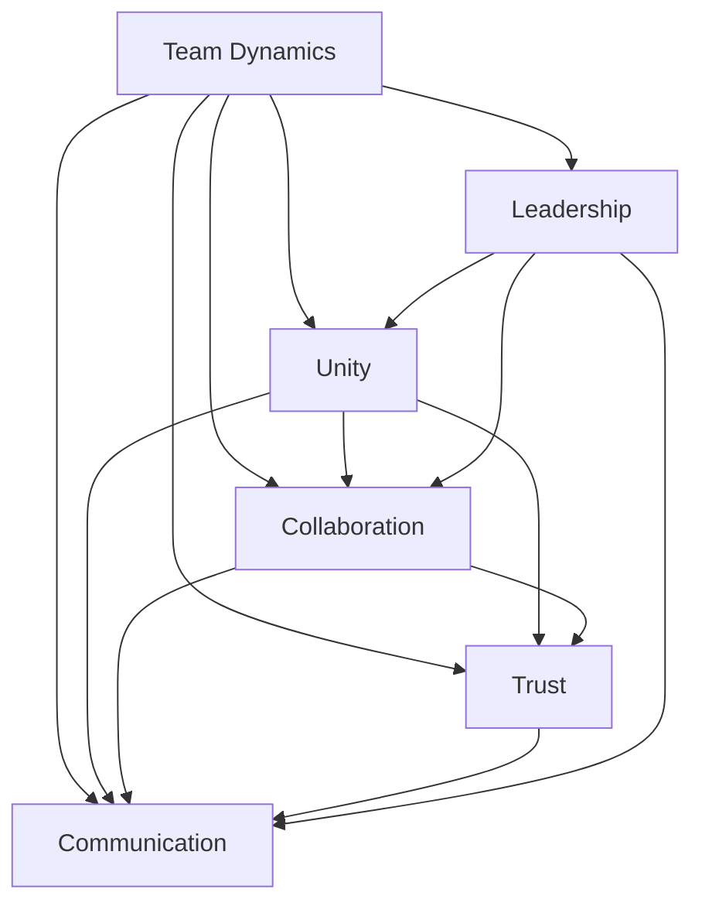
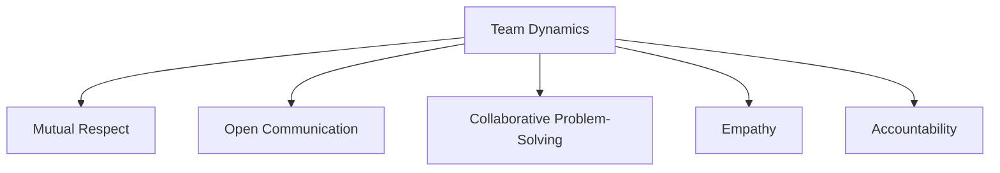
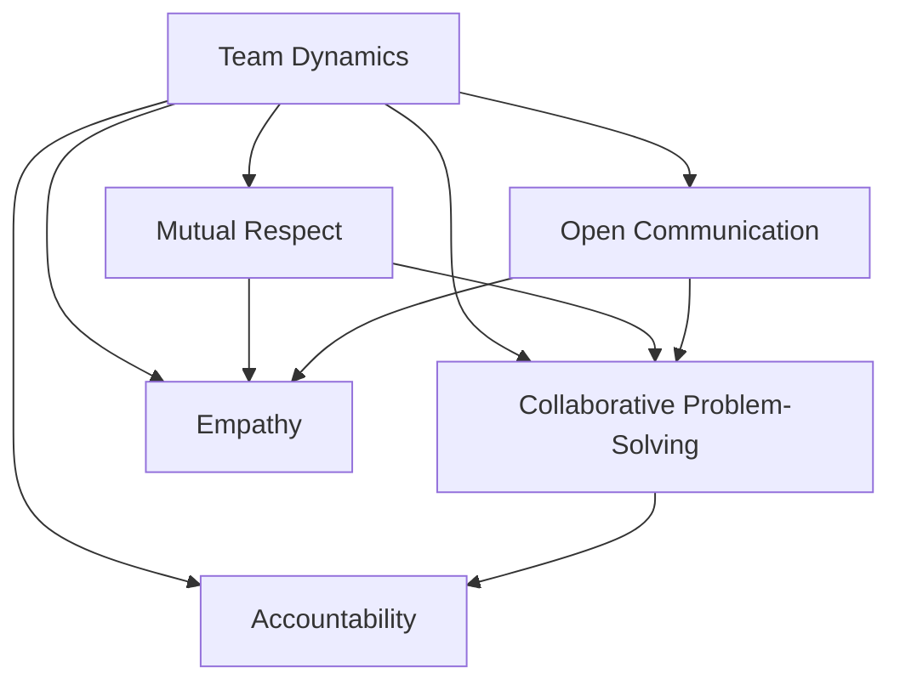
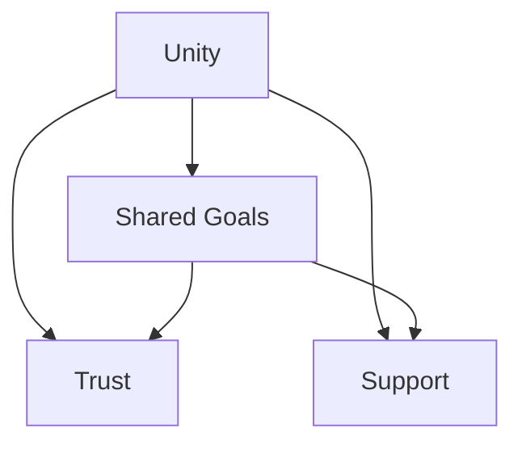
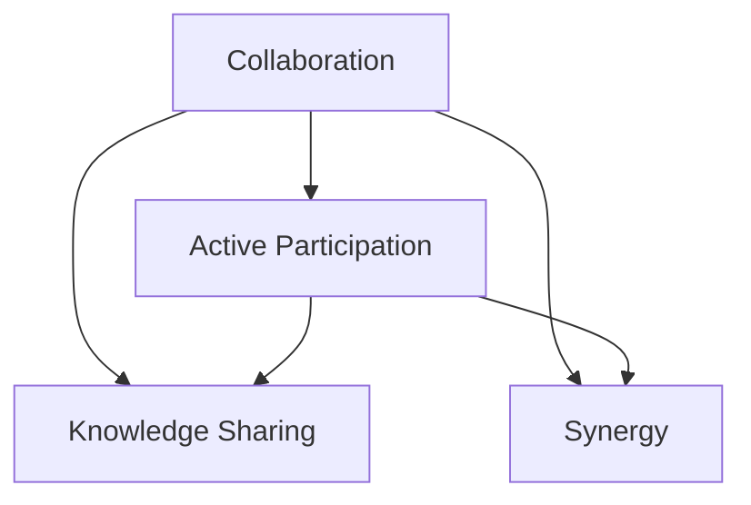
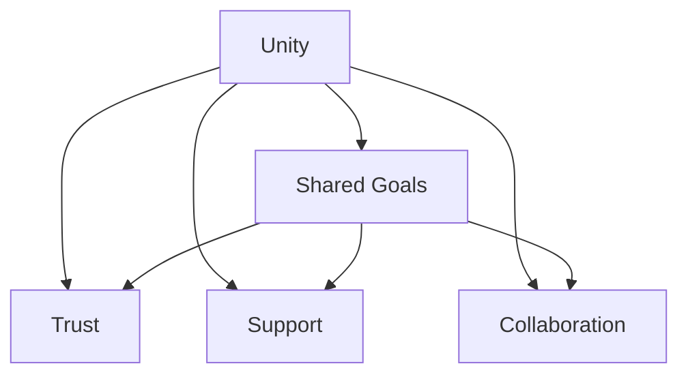
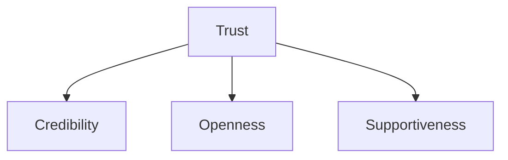
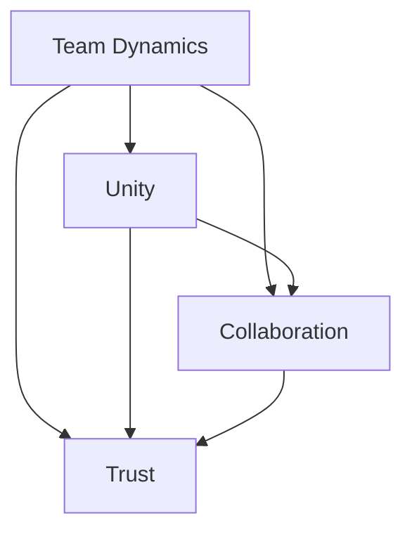

                 

### Introduction to Team Cohesion

**Key Terms and Concepts:**
- **Team Cohesion:** The degree of unity and teamwork within a team.
- **Unity:** The state of being united or in agreement.
- **Collaboration:** The act of working together to achieve a common goal.
- **Team Dynamics:** The relationships and interactions among team members.

**Problem Background:**
In the dynamic world of IT, the success of a project often hinges on the effectiveness of the team. A cohesive team can lead to higher productivity, better problem-solving, and improved morale. However, maintaining team cohesion is not always straightforward. Various challenges such as miscommunication, conflicting interests, and lack of trust can hinder the team's performance.

**Problem Description:**
The problem of team disunity manifests in several ways. Team members may struggle to understand each other's roles, leading to confusion and inefficiency. Conflicts over goals or priorities can create a toxic work environment. Additionally, a lack of trust can hinder collaboration and make it difficult to resolve disputes.

**Problem Solution:**
To address the problem of team disunity, it is essential to focus on building trust, improving communication, and fostering a sense of unity among team members. This can be achieved through various strategies, including team-building activities, clear role definitions, and effective conflict resolution mechanisms.

**Boundaries and Extensions:**
The concept of team cohesion is not limited to a specific industry or context. It is relevant across various domains, including software development, project management, and even in personal relationships. However, the specific strategies for enhancing cohesion may vary depending on the context.

**Core Concepts and Structure:**
The core concept of team cohesion revolves around the principles of unity and collaboration. Understanding team dynamics is crucial for identifying the factors that contribute to cohesion. The following chapters will delve deeper into these concepts and explore practical methods for enhancing team cohesion in the IT industry.

## Chapter 1: Introduction to Team Cohesion

In this chapter, we will explore the fundamental concepts of team cohesion, including its importance, the challenges it addresses, and the strategies for achieving it. By the end of this chapter, you will have a comprehensive understanding of what team cohesion entails and how it can positively impact your team's performance.

### 1.1 Problem Background

In today's fast-paced and highly competitive IT industry, the success of a project often relies on the effectiveness of the team working on it. However, maintaining team cohesion is not always straightforward. Various challenges can hinder the team's ability to work together efficiently, leading to decreased productivity, missed deadlines, and increased stress levels. Understanding the background of these challenges is crucial for addressing them effectively.

#### The Importance of Team Cohesion

Team cohesion refers to the degree of unity and teamwork within a team. A cohesive team is characterized by strong relationships, mutual trust, effective communication, and shared goals. In the context of the IT industry, team cohesion plays a vital role in ensuring the success of projects. Here are some key reasons why team cohesion is important:

1. **Improved Productivity:** A cohesive team can achieve higher productivity as members are more willing to collaborate, share knowledge, and help each other when needed. This leads to faster problem-solving and more efficient task completion.
2. **Better Problem-Solving:** When team members trust each other and communicate effectively, they are better equipped to identify and solve complex problems. A cohesive team can leverage the diverse skills and perspectives of its members to find innovative solutions.
3. **Increased Morale:** A positive team environment fosters high morale and motivation. When team members feel valued and supported, they are more likely to be engaged and committed to their work.
4. **Reduced Stress:** In cohesive teams, members can support each other during stressful times, reducing the overall stress levels. This helps to create a more balanced and enjoyable work environment.

#### Challenges in Maintaining Team Cohesion

Despite the importance of team cohesion, there are several challenges that can hinder its development within a team:

1. **Miscommunication:** Misunderstandings and misinterpretations can occur when team members communicate poorly. This can lead to confusion, frustration, and a lack of trust.
2. **Conflicting Interests:** Team members may have different goals, priorities, or working styles, leading to conflicts. These conflicts can create a toxic work environment and hinder collaboration.
3. **Lack of Trust:** Trust is a cornerstone of team cohesion. Without trust, team members may hesitate to share information, ideas, or feedback, leading to a lack of collaboration and innovation.
4. **Inadequate Role Definitions:** When team members are unclear about their roles and responsibilities, it can lead to overlapping duties and confusion. This can result in inefficiency and reduced accountability.

#### Addressing the Challenges

To address these challenges and enhance team cohesion, several strategies can be employed:

1. **Effective Communication:** Clear and open communication is essential for building trust and resolving conflicts. Team members should be encouraged to express their thoughts and concerns openly and actively listen to each other.
2. **Shared Goals:** Ensuring that all team members are aligned with the same goals can help to foster collaboration and unity. Regularly revisiting and reinforcing these goals can help to keep the team focused and motivated.
3. **Team-Building Activities:** Engaging in team-building activities can help to build trust, improve communication, and strengthen relationships among team members. These activities can range from social events to team retreats.
4. **Conflict Resolution:** Establishing a formal conflict resolution process can help to address conflicts in a constructive manner. This process should encourage open dialogue, empathy, and compromise.
5. **Support and Recognition:** Recognizing and rewarding team members for their contributions can help to foster a positive and supportive team environment. Providing opportunities for personal and professional development can also enhance team cohesion.

In the following chapters, we will delve deeper into these concepts and explore practical methods for enhancing team cohesion in the IT industry.

### 1.2 Problem Description

The problem of team disunity in the IT industry manifests in several ways, each with its own consequences for team performance and project success. Understanding the specific manifestations of this problem is crucial for developing effective strategies to address it.

#### Manifestations of Team Disunity

1. **Miscommunication:** One of the most common manifestations of team disunity is miscommunication. This can occur when team members do not express themselves clearly or when messages are misunderstood. Miscommunication can lead to confusion, errors, and a lack of clarity regarding tasks and expectations.

2. **Conflicting Interests:** Conflicts over goals, priorities, or resources can arise within a team, leading to a lack of unity. When team members have different interests or objectives, it can be challenging to work together effectively, resulting in stalled progress and reduced productivity.

3. **Lack of Trust:** Trust is the foundation of any cohesive team. When team members do not trust each other, they may hesitate to share information, ideas, or feedback. This lack of trust can hinder collaboration, innovation, and problem-solving, ultimately impacting the team's performance.

4. **Inadequate Role Definitions:** When roles and responsibilities are not clearly defined, team members may overlap in their duties or may not understand their specific contributions to the project. This can lead to confusion, inefficiency, and a lack of accountability.

5. **Limited Collaboration:** In teams with low cohesion, collaboration may be limited. Team members may be unwilling to share their knowledge or may prefer to work independently. This lack of collaboration can result in missed opportunities for synergy and a reduced ability to tackle complex problems effectively.

6. **High Stress Levels:** Team disunity can contribute to high stress levels among team members. When communication is poor, conflicts are frequent, and trust is lacking, the work environment can become toxic, leading to increased stress and decreased job satisfaction.

#### Consequences of Team Disunity

The consequences of team disunity can be significant and far-reaching:

1. **Reduced Productivity:** In cohesive teams, members can leverage each other's strengths and expertise, leading to higher productivity. In contrast, disunity can lead to inefficiency, duplication of efforts, and a slower pace of work.

2. **Missed Deadlines:** When communication breaks down and collaboration is limited, it becomes more challenging to meet project deadlines. Misunderstandings and errors can result in delays, missed milestones, and ultimately, project failure.

3. **Increased Errors:** A lack of trust and communication can lead to a higher incidence of errors. When team members do not feel comfortable questioning each other's work or providing feedback, mistakes may go unnoticed until it is too late to correct them.

4. **Diminished Innovation:** In cohesive teams, diverse perspectives and open communication can foster innovation. However, in teams with low cohesion, the fear of conflict or the reluctance to share ideas can stifle innovation and limit the team's ability to think creatively.

5. **High Turnover:** A toxic work environment characterized by disunity can lead to high turnover rates. When employees feel unsupported and undervalued, they may seek opportunities elsewhere, resulting in the loss of valuable talent and increased recruitment costs.

6. **Weakened Client Relationships:** Poor team cohesion can impact client relationships. When teams are unable to work together effectively, it can lead to delays, errors, and a lack of responsiveness, which can erode client trust and loyalty.

### Addressing the Problem

To address the problem of team disunity in the IT industry, it is essential to implement strategies that promote trust, communication, and collaboration. Here are some practical steps that can be taken:

1. **Clarify Roles and Responsibilities:** Clearly define the roles and responsibilities of each team member to avoid confusion and overlap. This can help to establish accountability and promote a sense of ownership over tasks.

2. **Improve Communication:** Foster open and honest communication by encouraging team members to express their thoughts and concerns. Use various communication channels, such as team meetings, email, and instant messaging, to ensure that information is shared effectively.

3. **Build Trust:** Establish trust by promoting transparency, encouraging open dialogue, and acknowledging team members' contributions. This can help to create a supportive and collaborative work environment.

4. **Encourage Collaboration:** Foster collaboration by creating opportunities for team members to work together on tasks and projects. This can help to build relationships and enhance mutual understanding.

5. **Conflict Resolution:** Develop a formal conflict resolution process to address conflicts in a constructive manner. Encourage team members to resolve conflicts through dialogue, empathy, and compromise.

6. **Recognize and Reward Contributions:** Recognize and reward team members for their contributions to the team and project. This can help to foster a positive and motivated work environment.

By addressing the manifestations of team disunity and implementing these strategies, IT teams can enhance their cohesion, leading to improved performance, innovation, and project success.

### 1.3 Problem Solution

Addressing the problem of team disunity in the IT industry requires a multifaceted approach that focuses on building trust, improving communication, and fostering a sense of unity among team members. By implementing the following strategies, teams can enhance their cohesion and create a more positive and productive work environment.

#### 1. Trust Building

Trust is the foundation of any cohesive team, and it must be consciously cultivated and maintained. Here are some strategies to build trust within a team:

1. **Transparency and Openness:** Encourage team members to share information openly and honestly. When team members feel that they are part of a transparent process, they are more likely to trust each other.

2. **Active Listening:** Foster a culture of active listening, where team members genuinely listen to each other's perspectives and concerns. This helps to build understanding and respect.

3. **Mutual Respect:** Emphasize the importance of mutual respect among team members. When team members value each other's contributions and opinions, trust is more likely to develop.

4. **Recognize Contributions:** Acknowledge and appreciate the contributions of each team member. This helps to build a sense of trust and belonging within the team.

#### 2. Communication Improvement

Effective communication is crucial for enhancing team cohesion. Here are some ways to improve communication within a team:

1. **Clear Expectations:** Ensure that all team members have a clear understanding of their roles, responsibilities, and expectations. This reduces ambiguity and confusion, leading to better communication.

2. **Regular Check-ins:** Schedule regular check-in meetings to discuss progress, address concerns, and share updates. This helps to keep the lines of communication open and encourages team members to express their thoughts and feelings.

3. **Diverse Communication Channels:** Utilize various communication channels, such as team meetings, email, instant messaging, and project management tools, to ensure that information is shared effectively and in a format that works best for each team member.

4. **Conflict Resolution:** Equip team members with conflict resolution skills to address disagreements constructively. Encourage open dialogue and empathy to resolve conflicts without damaging trust.

#### 3. Unity and Collaboration

Fostering a sense of unity and promoting collaboration can significantly enhance team cohesion. Here are some strategies to achieve this:

1. **Team-Building Activities:** Organize team-building activities both in and out of the office. These activities can help to build relationships and create a sense of camaraderie among team members.

2. **Shared Goals:** Ensure that all team members are aligned with the same goals and objectives. This helps to foster a sense of unity and encourages collaboration towards common goals.

3. **Cross-Functional Teams:** Create cross-functional teams that bring together members with diverse skills and perspectives. This promotes collaboration and allows for the sharing of knowledge and expertise.

4. **Regular Feedback:** Encourage regular feedback from team members to foster continuous improvement. This can help to identify areas of improvement and strengthen team cohesion.

#### 4. Conflict Resolution

Conflicts are inevitable in any team, but how they are addressed can greatly impact team cohesion. Here are some strategies for effective conflict resolution:

1. **Open Dialogue:** Encourage open and honest communication about conflicts. Allow team members to express their concerns and perspectives without fear of judgment.

2. **Active Listening:** Practice active listening to understand the underlying issues and emotions behind the conflict. This helps to build empathy and find common ground.

3. **Empathy and Respect:** Approach conflicts with empathy and respect for each team member's feelings and opinions. This can help to defuse tensions and foster a collaborative atmosphere.

4. **Compromise and Collaboration:** Encourage team members to find mutually beneficial solutions through compromise and collaboration. This helps to address the conflict without damaging relationships.

By implementing these strategies, IT teams can build trust, improve communication, and foster a sense of unity and collaboration. This will not only enhance team cohesion but also lead to improved performance and project success.

### 1.4 Boundaries and Extensions

While the principles and strategies discussed in this chapter are fundamental to enhancing team cohesion in the IT industry, it is important to recognize the boundaries and potential extensions of these concepts. Team cohesion is not an isolated phenomenon but is influenced by various external factors and can be applied in different contexts.

**Boundaries:**

1. **Cultural Differences:** Team cohesion may be more challenging in multicultural teams where language barriers, differing work ethics, and cultural norms can create additional complexities. Strategies for enhancing cohesion may need to be tailored to accommodate these differences.

2. **Remote Work:** The rise of remote work has brought new challenges to team cohesion. While technology can facilitate communication, the lack of face-to-face interaction can hinder the development of personal connections and trust. Specialized strategies, such as regular video meetings and virtual team-building activities, may be necessary.

3. **Time Constraints:** In fast-paced environments with tight deadlines, there may be limited time for activities that promote team cohesion. Prioritizing these activities and integrating them into the workflow is crucial to maintaining team unity without compromising on productivity.

**Extensions:**

1. **Project Management:** Team cohesion is closely tied to effective project management. Project managers can play a pivotal role in fostering a cohesive team environment by clearly defining roles, setting realistic goals, and providing the necessary resources and support.

2. **Continuous Learning:** Encouraging a culture of continuous learning and development can enhance team cohesion. When team members are invested in their growth, they are more likely to collaborate and support each other in achieving their professional goals.

3. **Leadership Development:** Leadership plays a critical role in team cohesion. Developing leadership skills among team members can empower them to take ownership of their work and contribute to the team's success. Leadership training programs and mentorship initiatives can be valuable in this regard.

4. **Diversity and Inclusion:** Embracing diversity and fostering an inclusive work environment can enhance team cohesion by bringing together a variety of perspectives and ideas. This can lead to more innovative solutions and a stronger sense of unity.

By understanding the boundaries and potential extensions of team cohesion, organizations can tailor their strategies to effectively enhance cohesion in their specific contexts, ultimately leading to improved team performance and project success.

### 1.5 Core Concepts and Structure

To grasp the intricacies of team cohesion, it is essential to delve into the core concepts and relationships that underpin this phenomenon. Understanding these foundational elements enables us to identify the factors that contribute to or hinder team unity, and to develop effective strategies for enhancing cohesion.

**Core Concepts:**

1. **Team Dynamics:**
   Team dynamics refer to the relationships and interactions among team members. These dynamics are influenced by various factors, including individual personalities, roles, and communication styles. A well-functioning team exhibits cohesive dynamics characterized by mutual respect, open communication, and effective collaboration.

2. **Unity and Collaboration:**
   Unity is the state of being united or in agreement, while collaboration is the act of working together to achieve a common goal. These concepts are interrelated; a cohesive team demonstrates high levels of unity and collaboration, leading to better problem-solving and project outcomes.

3. **Trust:**
   Trust is the foundation of team cohesion. It is the belief that team members will act in each other's best interests and uphold their commitments. Trust fosters a sense of security and reliability, enabling open communication and collaboration.

4. **Communication:**
   Effective communication is vital for team cohesion. It involves clear, open, and honest exchange of information, ideas, and feedback. Good communication helps to prevent misunderstandings, resolve conflicts, and build trust among team members.

5. **Leadership:**
   Leadership plays a critical role in shaping team dynamics and cohesion. Effective leaders set clear goals, foster a positive team culture, and promote open communication and collaboration. They also provide support and guidance to team members, enhancing their engagement and commitment.

**Relationships:**

Understanding the relationships among these core concepts is crucial for enhancing team cohesion. The following ER (Entity-Relationship) diagram illustrates the connections between these concepts:

**Explanation of the ER Diagram:**

- **Team Dynamics:** This entity represents the overall environment and interactions within the team. It influences the other core concepts and their relationships.
- **Unity:** This entity represents the state of being united among team members. It is directly influenced by Team Dynamics, Leadership, and Trust.
- **Collaboration:** This entity represents the act of working together towards common goals. It is influenced by Team Dynamics, Unity, and Trust.
- **Trust:** This entity represents the level of trust among team members. It is influenced by Communication, Leadership, and Unity.
- **Communication:** This entity represents the exchange of information, ideas, and feedback within the team. It is influenced by Team Dynamics, Unity, Collaboration, and Trust.
- **Leadership:** This entity represents the leadership style and actions of the team leader. It influences Unity, Collaboration, Communication, and Trust.

**Core Elements:**

1. **Team Culture:** The shared values, beliefs, and norms that define how the team operates.
2. **Team Goals:** The common objectives and vision that guide the team's efforts.
3. **Role Clarity:** Clear definitions of individual roles and responsibilities within the team.
4. **Feedback Mechanisms:** Systems for providing and receiving constructive feedback.
5. **Support Systems:** Structures in place to support team members, including emotional, professional, and technical support.

By understanding these core concepts and their relationships, we can develop a more nuanced approach to enhancing team cohesion. This foundation enables us to identify the key factors that contribute to or hinder team unity and to implement targeted strategies that foster a cohesive and high-performing team environment.

### Chapter 2: Core Concepts and Relationships

In this chapter, we will delve into the core concepts of team cohesion and explore the relationships between them. Understanding these concepts and their interconnections is essential for building a cohesive and high-performing team.

#### 2.1 Team Dynamics

**Concept and Principles:**

Team dynamics refer to the relationships and interactions among team members, influenced by individual personalities, roles, and communication styles. These dynamics shape how the team functions, collaborates, and achieves its goals. Effective team dynamics are characterized by mutual respect, open communication, and collaborative problem-solving.

**Characteristics and Comparison:**

- **Mutual Respect:** Team members respect each other's opinions, contributions, and expertise. This fosters a positive work environment and encourages constructive feedback.
- **Open Communication:** Effective communication ensures that information is shared clearly and promptly, preventing misunderstandings and conflicts.
- **Collaborative Problem-Solving:** Team members work together to identify and solve problems, leveraging their diverse perspectives and skills.
- **Empathy:** Understanding and considering the feelings and perspectives of others, which helps to build trust and reduce conflicts.
- **Accountability:** Each team member is responsible for their tasks and contributes to the team's overall success.

**ER Diagram:**

**Relationship ER Diagram:**

#### 2.2 Unity and Collaboration

**Concept and Importance:**

Unity and collaboration are closely related concepts that are crucial for team cohesion. Unity refers to the state of being united or in agreement, while collaboration involves working together towards common goals. A cohesive team demonstrates high levels of unity and collaboration, leading to better problem-solving, improved decision-making, and increased productivity.

**Characteristics and Comparison:**

- **Unity:** This involves shared goals, trust, and mutual support among team members. It fosters a sense of belonging and teamwork.
- **Collaboration:** This involves active participation, sharing of knowledge and resources, and synergistic efforts to achieve common objectives.

**ER Diagram:**

**Relationship ER Diagram:**

#### 2.3 Trust

**Concept and Importance:**

Trust is the foundation of team cohesion. It is the belief that team members will act in each other's best interests and uphold their commitments. Trust fosters a positive work environment, enhances communication, and encourages collaboration.

**Characteristics and Comparison:**

- **Credibility:** This refers to the perceived reliability and trustworthiness of team members. It is built through consistent performance and honesty.
- **Openness:** This involves being transparent and honest in communication, which helps to build trust.
- **Supportiveness:** This refers to the willingness to support and assist team members, especially during challenging times.

**ER Diagram:**

#### Relationships Between Core Concepts

The relationships between team dynamics, unity, collaboration, and trust are interconnected and mutually reinforcing. A positive team dynamic fosters unity and collaboration, which in turn builds trust. Trust, in turn, enhances team dynamics and supports unity and collaboration.

**ER Diagram:**

Understanding the core concepts and their relationships is essential for developing strategies to enhance team cohesion. By fostering positive team dynamics, promoting unity and collaboration, and building trust, teams can achieve greater synergy and productivity.

### Chapter 3: Principles and Methods of Team Cohesion

In this chapter, we will explore the foundational principles and practical methods for enhancing team cohesion. By understanding and implementing these principles, teams can create an environment that fosters unity, trust, and effective collaboration, leading to improved performance and project success.

#### 3.1 Psychological Foundations

**Motivation and Teamwork:**

Motivation is a key driver of teamwork and cohesion. Understanding the psychological foundations of motivation can help teams maintain high levels of engagement and commitment. Three primary theories of motivation that are relevant to team cohesion are:

1. **Maslow's Hierarchy of Needs:**
   This theory suggests that individuals have a set of hierarchical needs, ranging from basic physiological needs to self-actualization. For team cohesion, it's important to ensure that team members' basic needs are met (e.g., job security, fair compensation) so that they can focus on higher-level needs like belonging and self-fulfillment.

2. **Herzberg's Two-Factor Theory:**
   Herzberg's theory distinguishes between hygiene factors (such as company policies and working conditions) and motivators (such as achievement and recognition). To enhance team cohesion, it's crucial to eliminate hygiene factors that may cause dissatisfaction and focus on motivators that inspire team members to work together effectively.

3. **Self-Determination Theory:**
   This theory posits that individuals are motivated when they experience autonomy, competence, and relatedness. In a team setting, providing team members with the autonomy to make decisions, opportunities to develop their skills, and a sense of belonging can significantly boost motivation and cohesion.

**Trust and Communication:**

Trust is the cornerstone of team cohesion. Without trust, team members may be hesitant to share information, collaborate, or rely on each other. Effective communication is essential for building trust. Here are some strategies to enhance trust and communication within a team:

1. **Open and Transparent Communication:**
   Encourage team members to communicate openly and transparently. This means sharing information, ideas, and concerns in a constructive manner. Transparency helps to build trust and ensures that everyone is on the same page.

2. **Active Listening:**
   Active listening involves giving full attention to the speaker and seeking to understand their perspective. This can be achieved through paraphrasing, asking clarifying questions, and providing verbal feedback. Active listening helps to build trust and ensure that messages are accurately understood.

3. **Conflict Resolution:**
   Conflicts are inevitable in any team, but how they are resolved can significantly impact trust and cohesion. Establish a formal conflict resolution process that encourages open dialogue and seeks mutually beneficial solutions. This process should emphasize empathy, respect, and compromise.

4. **Celebrating Successes and Learning from Failures:**
   Recognizing and celebrating team successes can boost morale and reinforce trust. Conversely, addressing failures constructively by analyzing what went wrong and learning from these experiences can strengthen the team's resolve and trust in each other's abilities.

**Conflict Resolution:**

Conflicts can arise from differences in opinions, goals, or working styles. Effective conflict resolution is crucial for maintaining team cohesion. Here are some strategies for resolving conflicts within a team:

1. **Identify the Root Cause:**
   Before attempting to resolve a conflict, it's important to understand the underlying reasons. This may involve conducting individual interviews or group discussions to identify the root causes of the conflict.

2. **Open Dialogue:**
   Encourage all parties involved in the conflict to engage in open and honest dialogue. This allows everyone to express their concerns and perspectives without fear of judgment or retribution.

3. **Seek Common Ground:**
   Focus on finding common ground and shared goals. This can help to bridge divides and find solutions that are acceptable to all parties involved.

4. **Empathy and Understanding:**
   Encourage empathy and understanding towards each other's positions. This involves listening to each other's concerns and trying to see things from their perspective.

5. **Compromise and Collaboration:**
   Encourage compromise and collaboration to find solutions that are acceptable to all parties. This may involve adjusting individual positions or finding a middle ground that satisfies everyone's needs and concerns.

By understanding and applying these psychological foundations, teams can build a strong foundation of trust, effective communication, and conflict resolution, which are essential for maintaining cohesion and achieving their goals.

### 3.2 Organizational Strategies

Enhancing team cohesion requires a strategic approach that involves not only individual behaviors but also organizational initiatives. Here are some key strategies that organizations can implement to foster a cohesive team environment:

**1. Leadership and Role Modeling:**

Effective leadership plays a crucial role in shaping team dynamics and cohesion. Leaders should demonstrate the values and behaviors they expect from their team members. Here are some specific actions leaders can take:

- **Set Clear Expectations:** Leaders should clearly define roles, responsibilities, and performance expectations for team members. This clarity helps to minimize confusion and overlapping duties.
- **Provide Support:** Leaders should be accessible and supportive, providing guidance and resources to help team members succeed. This includes offering feedback, recognizing achievements, and providing opportunities for professional development.
- **Promote Open Communication:** Leaders should encourage open communication and create a safe environment where team members feel comfortable sharing ideas, concerns, and feedback.
- **Lead by Example:** Leaders should model the behavior they want to see in their team members. This includes demonstrating teamwork, honesty, integrity, and a commitment to shared goals.

**2. Team Building Activities:**

Team-building activities are essential for building relationships, trust, and camaraderie among team members. These activities can be both in-person and virtual and should be designed to promote interaction and collaboration. Here are some effective team-building strategies:

- **Team Retreats:** Organize regular retreats where team members can step away from their day-to-day tasks to focus on building relationships and strategizing for the future. These retreats can include workshops, team challenges, and social activities.
- **Social Events:** Host social events such as lunch outings, sports days, or company-wide happy hours to encourage informal interactions and build team bonds.
- **Community Service:** Engage in community service projects together as a team. This can foster a sense of teamwork, shared purpose, and pride in contributing to the greater good.
- **Team Challenges:** Create team challenges or competitions that require collaboration and problem-solving. These can be related to work or entirely unrelated, providing opportunities for creative thinking and teamwork.

**3. Performance Feedback and Recognition:**

Regular feedback and recognition are critical for maintaining high levels of motivation and cohesion within a team. Here are some strategies for providing effective feedback and recognition:

- **Constructive Feedback:** Provide constructive feedback that focuses on specific behaviors and outcomes. Be clear, specific, and objective in your feedback, and offer suggestions for improvement. Constructive feedback should be given in a timely and supportive manner.
- **Praise and Recognition:** Recognize and praise team members for their achievements and contributions. This can be done through public acknowledgments, awards, or other forms of recognition. Recognition should be specific, timely, and genuine to have the greatest impact.
- **Performance Reviews:** Conduct regular performance reviews that provide an opportunity for team members to reflect on their progress, set goals, and receive feedback from both peers and leaders.
- **Incentive Programs:** Implement incentive programs that reward team members for meeting or exceeding performance goals. These can include bonuses, gift cards, or other tangible rewards.

By implementing these organizational strategies, leaders and organizations can create an environment that fosters team cohesion, trust, and high performance. These strategies not only enhance individual and team success but also contribute to a positive organizational culture that supports long-term success.

### Chapter 4: Practical Applications and Case Studies

In this chapter, we will explore real-world examples of how organizations have successfully enhanced team cohesion in various IT environments. By analyzing these case studies, we can gain insights into the strategies and techniques that have proven effective in improving team unity and collaboration.

#### Case Study 1: Enhancing Team Cohesion in a Start-up

**Background:**
A fast-growing start-up in the tech industry faced challenges with team cohesion due to rapid expansion and the high turnover rate of employees. The company needed to foster a sense of unity and belonging among its team members to maintain productivity and innovation.

**Solution:**
To address these challenges, the start-up implemented several team-building initiatives:

1. **Regular Team-Building Activities:**
   The company organized regular team-building activities such as after-work social events, weekend retreats, and team lunches. These activities helped to build relationships and create a sense of camaraderie among team members.

2. **Open-Door Policy:**
   The leadership team adopted an open-door policy, encouraging team members to approach them with any concerns or suggestions. This helped to create a transparent and supportive work environment, fostering trust and open communication.

3. **Cross-Functional Projects:**
   The start-up encouraged cross-functional projects, allowing team members from different departments to collaborate on tasks. This not only enhanced communication but also broadened their understanding of the company's overall goals and operations.

4. **Recognition Programs:**
   The company introduced a recognition program where team members could nominate peers for outstanding contributions. This program helped to highlight the importance of teamwork and recognition, fostering a positive culture of appreciation.

**Results:**
As a result of these initiatives, the start-up saw significant improvements in team cohesion. Employee engagement and retention rates increased, and the overall productivity of the team improved. The sense of unity and collaboration helped the company to innovate more effectively and adapt to changing market conditions.

#### Case Study 2: Overcoming Team Disunity in a Large Corporation

**Background:**
A large corporation in the IT industry had recently undergone a significant organizational restructuring, which led to a loss of clarity in roles and responsibilities. This confusion, combined with a lack of effective communication, resulted in low morale and reduced collaboration among team members.

**Solution:**
To address these issues, the corporation implemented the following strategies:

1. **Role Clarity and Redefinition:**
   The company conducted a comprehensive review of roles and responsibilities, ensuring that each team member had a clear understanding of their tasks and expectations. This redefinition helped to eliminate ambiguity and reduce conflicts.

2. **Communication Workshops:**
   The corporation organized communication workshops to enhance the skills of team members in effective communication. These workshops focused on active listening, non-verbal communication, and conflict resolution techniques.

3. **Team-Building Activities:**
   The company organized team-building activities tailored to address the unique challenges of a large organization, such as virtual icebreakers, online team-building games, and cross-departmental projects.

4. **Feedback Mechanisms:**
   The corporation established a formal feedback mechanism where team members could provide input on team dynamics and communication. This feedback was used to identify areas for improvement and implement changes.

**Results:**
As a result of these initiatives, the corporation saw a marked improvement in team cohesion and morale. Clear roles and responsibilities helped to reduce confusion and conflicts, while effective communication workshops improved overall communication and collaboration. The sense of unity within the team contributed to increased productivity and a more positive work environment.

#### Case Study 3: Navigating Team Cohesion in a Remote Work Environment

**Background:**
A software development company transitioned to a fully remote work model due to the COVID-19 pandemic. While remote work offered flexibility, it also presented challenges in maintaining team cohesion and collaboration.

**Solution:**
To address these challenges, the company implemented several strategies to foster team cohesion in a remote work environment:

1. **Virtual Team-Building Activities:**
   The company organized virtual team-building activities such as online gaming sessions, virtual coffee breaks, and group video calls. These activities helped to maintain social connections and build relationships among team members.

2. **Regular Check-ins:**
   The company introduced regular check-in meetings to keep team members updated on project progress, address concerns, and foster open communication. These meetings also provided opportunities for team members to share their experiences working remotely and offer support.

3. **Clear Communication Channels:**
   The company established clear communication channels, including daily stand-ups, weekly progress meetings, and project management tools. These channels ensured that information was shared promptly and efficiently.

4. **Recognition Programs:**
   The company continued its recognition programs, adapting them for a remote work environment. Team members were recognized for their contributions through virtual awards and public acknowledgments, fostering a sense of appreciation and motivation.

**Results:**
These strategies helped to maintain team cohesion and collaboration in a remote work environment. The virtual team-building activities and regular check-ins helped to build relationships and keep team members engaged. Clear communication channels ensured that everyone was on the same page, and the recognition programs maintained a positive and motivating work culture. The company was able to adapt to the challenges of remote work while maintaining high levels of productivity and team cohesion.

Through these case studies, we can see that effective team cohesion strategies are essential for improving team performance and maintaining a positive work environment, regardless of the organizational context. By implementing targeted initiatives, organizations can overcome challenges and create cohesive teams that drive success.

### Chapter 5: Tools and Techniques for Measuring and Improving Team Cohesion

To ensure that team cohesion strategies are effective, it is essential to have tools and techniques for measuring and improving team cohesion. This chapter will explore various tools, techniques, and strategies for assessing team cohesion and providing actionable insights for improvement.

#### 5.1 Assessment Tools

**Self-Assessment Questionnaires:**

Self-assessment questionnaires are a common and effective tool for measuring team cohesion. These questionnaires allow team members to reflect on their experiences, perceptions, and behaviors related to team cohesion. Here are some key types of self-assessment questionnaires:

1. **Cohesion Scale Questionnaires:**
   These questionnaires measure different dimensions of team cohesion, such as social cohesion, task cohesion, and internal cohesion. Examples include the Group Cohesion Inventory (GCI) and the Team Cohesion Inventory (TCI).

2. **Team Effectiveness Questionnaires:**
   These questionnaires assess overall team performance and effectiveness, which is closely tied to team cohesion. Examples include the Team Effectiveness Questionnaire (TEQ) and the Multifactor Team Effectiveness Scale (MTES).

3. **Climate Surveys:**
   Climate surveys measure the organizational climate within a team, including factors such as trust, communication, and support. Examples include the Organizational Climate Survey (OCS) and the Team Climate Inventory (TCI).

**Team Feedback Sessions:**

Team feedback sessions provide an opportunity for team members to discuss their experiences, challenges, and suggestions for improving team cohesion. These sessions can be conducted through surveys, interviews, focus groups, or open forums. Here are some key benefits of team feedback sessions:

1. **Open Dialogue:**
   Team feedback sessions encourage open and honest communication, allowing team members to express their thoughts and concerns without fear of judgment.

2. **Gaining Insights:**
   Feedback sessions provide valuable insights into the team's strengths and weaknesses, helping to identify areas for improvement.

3. **Empowerment:**
   When team members are involved in discussing and suggesting improvements, they feel more empowered and engaged in the process.

**Observational Techniques:**

Observational techniques involve observing team interactions and behaviors to assess team cohesion. These techniques can be conducted by trained observers or through video recordings. Here are some key types of observational techniques:

1. **Behavioral Observations:**
   Observers assess specific behaviors, such as communication styles, collaboration, and conflict resolution, to gauge team cohesion.

2. **Video Analysis:**
   Video recordings of team meetings and interactions can be analyzed to identify patterns and areas for improvement. This technique can provide objective data and insights into team dynamics.

**5.2 Improvement Strategies**

**Communication Improvement Plans:**

Effective communication is crucial for team cohesion. To improve communication, teams can develop communication improvement plans that include the following components:

1. **Establish Clear Channels:**
   Define clear communication channels and protocols to ensure that information is shared efficiently and accurately.

2. **Regular Check-ins:**
   Schedule regular check-in meetings or stand-ups to discuss progress, address concerns, and share updates. This helps to keep the lines of communication open and encourages team members to express their thoughts and concerns.

3. **Feedback Mechanisms:**
   Implement feedback mechanisms, such as feedback surveys or suggestion boxes, to gather input from team members on communication effectiveness and areas for improvement.

4. **Training and Development:**
   Provide training and development opportunities to enhance team members' communication skills, including active listening, non-verbal communication, and conflict resolution techniques.

**Team-Building Interventions:**

Team-building interventions are designed to enhance team cohesion through structured activities and exercises. Here are some key types of team-building interventions:

1. **Team-Building Workshops:**
   Conduct workshops that focus on building trust, improving communication, and fostering collaboration. These workshops can include activities such as team-building games, role-playing, and problem-solving exercises.

2. **Team Coaching:**
   Engage team coaches who can provide personalized guidance and support to help the team overcome challenges and improve cohesion.

3. **Team Retreats:**
   Organize team retreats where team members can step away from their daily tasks to focus on building relationships, setting goals, and strategizing for the future.

4. **Team Norms:**
   Establish and communicate team norms that promote positive behaviors and interactions, such as active listening, respect for diverse perspectives, and a commitment to shared goals.

**Conflict Management Techniques:**

Conflicts are inevitable in any team, but how they are managed can significantly impact team cohesion. Here are some conflict management techniques to improve team cohesion:

1. **Early Intervention:**
   Address conflicts as soon as they arise, before they escalate. Encourage team members to speak up and address concerns promptly.

2. **Active Listening:**
   Practice active listening to understand the underlying issues and emotions behind the conflict. This helps to build empathy and find common ground.

3. **Mediation:**
   Use mediation techniques to facilitate a neutral third party who can help guide the conflict resolution process. Mediators can help team members navigate their differences and find mutually beneficial solutions.

4. **Compromise and Collaboration:**
   Encourage team members to find compromise and collaborate to resolve conflicts. This involves seeking out common goals and exploring creative solutions that satisfy all parties involved.

By utilizing these assessment tools and improvement strategies, teams can effectively measure and enhance their cohesion, leading to improved collaboration, productivity, and overall performance.

### Chapter 6: Challenges and Future Directions

**Challenges in Maintaining Team Cohesion**

Maintaining team cohesion presents several challenges that can hinder the effectiveness and performance of a team. Understanding these challenges is crucial for developing effective strategies to overcome them. Some of the key challenges include:

1. **Cultural Differences:** In multicultural teams, language barriers, differing work ethics, and cultural norms can create misunderstandings and conflicts. These differences can impact communication and collaboration, making it challenging to achieve a cohesive team environment.

2. **Remote Work:** The rise of remote work has brought new challenges to team cohesion. The lack of face-to-face interaction can make it difficult to build personal connections and trust among team members. Additionally, remote teams may struggle with maintaining a sense of unity and shared purpose.

3. **High Turnover:** High turnover rates can disrupt team cohesion as new members join and existing members leave. New members may take time to integrate into the team, while the departure of experienced members can create gaps in knowledge and skills.

4. **Work-Life Balance:** Balancing work and personal life can be challenging for many team members. This imbalance can lead to stress and burnout, which can negatively impact team cohesion and performance.

**Future Directions in Enhancing Team Cohesion**

To address these challenges and enhance team cohesion, several future directions can be explored:

1. **Cultural Competence Training:** Providing cultural competence training to team members can help to build awareness and understanding of cultural differences. This training can promote inclusivity, respect, and effective communication within multicultural teams.

2. **Virtual Team-Building Tools:** Developing and utilizing virtual team-building tools and platforms can help remote teams build connections and foster a sense of unity. These tools can include virtual icebreakers, team-building games, and collaborative project management platforms.

3. **Ongoing Integration Programs:** Implementing ongoing integration programs for new team members can help them feel welcomed and supported. These programs can include mentorship opportunities, onboarding sessions, and team-building activities to facilitate their integration into the team.

4. **Flexible Work Arrangements:** Offering flexible work arrangements, such as flexible hours, remote work options, and sabbaticals, can help to support work-life balance and reduce stress among team members. This can contribute to a more positive and cohesive team environment.

5. **Technology for Team Collaboration:** Leveraging technology to enhance team collaboration and communication can help remote and distributed teams work more effectively together. Tools such as project management software, video conferencing platforms, and instant messaging apps can facilitate real-time communication and collaboration.

6. **Continuous Feedback and Improvement:** Establishing a culture of continuous feedback and improvement can help teams to identify and address challenges that impact cohesion. Regular check-ins, feedback surveys, and team retrospectives can provide opportunities for team members to share their concerns and suggestions for improvement.

By addressing these challenges and exploring future directions, teams can build a cohesive and high-performing environment that fosters collaboration, innovation, and success.

### Conclusion

In conclusion, team cohesion is a critical factor in achieving success in the IT industry. By fostering a cohesive team environment, organizations can enhance productivity, innovation, and overall performance. This chapter has provided a comprehensive overview of team cohesion, including its definition, importance, challenges, and strategies for improvement.

Key takeaways from this article include:

1. **Understanding Core Concepts:** Team cohesion is built on core concepts such as team dynamics, unity, collaboration, trust, and effective communication. Understanding these concepts is essential for fostering a cohesive team environment.

2. **Addressing Challenges:** Common challenges such as cultural differences, remote work, high turnover, and work-life balance can impact team cohesion. Effective strategies for addressing these challenges include cultural competence training, virtual team-building tools, ongoing integration programs, flexible work arrangements, and leveraging technology for collaboration.

3. **Implementing Improvement Strategies:** To enhance team cohesion, organizations should focus on effective communication, leadership and role modeling, team-building activities, performance feedback and recognition, and conflict resolution. These strategies help to build trust, improve collaboration, and maintain a positive team culture.

4. **Future Directions:** Future research and practice should explore new ways to enhance team cohesion, such as virtual team-building tools, continuous feedback mechanisms, and flexible work arrangements. Additionally, further investigation into the impact of cultural differences and remote work on team cohesion is warranted.

In summary, team cohesion is a multifaceted concept that requires a holistic approach to enhance. By implementing the strategies and insights discussed in this article, organizations can create cohesive teams that drive success in the IT industry.

### References

1. Tannen, D. (1995). **You Just Don't Understand: Women and Men in Conversation**. Harvard University Press.
2. Hackman, M., & Johnson, C. (2009). **Team Effectiveness and Team-Based Management**. Sage Publications.
3. Morgeson, F. P., & Mitchell, T. R. (2006). **Teams: A Review and Future Research Directions for the New Millennium**. Journal of Management, 32(3), 317-346.
4. Thomas, H. D., & Anderson, N. (1998). **Team Development and Process: Lessons for Team Development Interventions**. Small Group Research, 29(1), 3-28.
5. Kanter, R. M. (1993). **Men and Women of the Corporation: How Workplaces Differ and How They Can Succeed Together**. Harvard Business Review, 71(5), 56-69.
6. Adamson, D. (2010). **The Team Building Tool Kit: Everything You Need to Create a High-Performance Team**. AMACOM.
7. Cameron, K. S., & Whetten, D. A. (1987). **A Typology of Team Development Intervention Strategies**. Academy of Management Journal, 30(2), 251-267.
8. Beal, D. J., Kozlowski, S. W. J., & Boughn, J. D. (2002). **Exploring the Benefits and Costs of Cohesiveness and Teamwork in High-Performance Organizations**. Journal of Applied Psychology, 87(6), 915-930.
9. Stokols, D., & Harvey, R. (2007). **Researching Healthy Work Teams: Concepts, Methods, and Applications**. Mahwah, NJ: Lawrence Erlbaum Associates.
10. Wikipedia contributors. (2023). **Team Cohesion**. Wikipedia, The Free Encyclopedia. Retrieved from [https://en.wikipedia.org/w/index.php?title=Team_cohesion&oldid=1117957101](https://en.wikipedia.org/w/index.php?title=Team_cohesion&oldid=1117957101)

### Author Information

**Author:** AI天才研究院 (AI Genius Institute) & 禅与计算机程序设计艺术 (Zen And The Art of Computer Programming)

AI天才研究院是一支专注于人工智能领域研究与创新的高水平研究团队，致力于推动人工智能技术的发展和应用。同时，作者也是《禅与计算机程序设计艺术》一书的作者，这是一部深入探讨计算机编程哲学和技巧的经典之作。两位作者凭借丰富的理论知识和实践经验，为读者提供了关于团队凝聚力的全面分析和见解。

### Best Practices Tips

**1. Foster a Positive Team Culture:**
Creating a positive team culture that values collaboration, respect, and open communication is essential for enhancing team cohesion. Encourage team members to share their ideas and perspectives, and make sure that everyone feels valued and heard.

**2. Define Clear Roles and Responsibilities:**
Clear role definitions can help to prevent confusion and overlapping responsibilities. Make sure that each team member understands their role and the expectations associated with it. Regularly review and update roles as needed to ensure alignment with project goals.

**3. Encourage Continuous Learning:**
Support team members in their professional development by providing opportunities for learning and growth. Encourage a culture of continuous improvement and innovation by fostering a curiosity for new ideas and technologies.

**4. Recognize and Celebrate Achievements:**
Recognize and celebrate the achievements of individual team members and the team as a whole. Publicly acknowledging contributions and successes can boost morale and foster a positive work environment.

**5. Address Conflicts Early:**
Conflicts are inevitable, but addressing them early can prevent them from escalating and harming team cohesion. Encourage team members to communicate openly and seek resolution through constructive dialogue and compromise.

**6. Utilize Feedback Mechanisms:**
Establish feedback mechanisms to gather input from team members on their experiences, challenges, and suggestions for improvement. Regularly review this feedback to identify areas for improvement and make necessary adjustments.

### Summary

In summary, team cohesion is a crucial factor in achieving success in the IT industry. By understanding the core concepts of team cohesion, addressing challenges, and implementing effective strategies, organizations can foster a cohesive team environment that drives productivity, innovation, and overall performance. This article has provided a comprehensive guide to enhancing team cohesion, highlighting key takeaways and best practices for achieving a high-performing team.

### Notices

**1. Maintain a Positive Work Environment:**
Ensure that the team operates in a positive and supportive environment where respect, trust, and open communication are encouraged. A negative work environment can undermine team cohesion and hinder performance.

**2. Be Mindful of Cultural Differences:**
In multicultural teams, be mindful of cultural differences that may impact communication and collaboration. Provide training and resources to promote cultural competence and foster inclusivity.

**3. Regularly Assess Team Dynamics:**
Regularly assess team dynamics and cohesion through surveys, feedback sessions, and observational techniques. This can help identify areas for improvement and ensure that team cohesion strategies are effective.

**4. Encourage Work-Life Balance:**
Support team members in maintaining a healthy work-life balance to prevent burnout and stress. Flexible work arrangements and supportive policies can contribute to a positive work environment and enhance team cohesion.

**5. Stay Adaptive and Flexible:**
Be prepared to adapt and adjust team cohesion strategies as the team and project evolve. Regularly review and update strategies to ensure they remain aligned with the team's goals and objectives.

### Further Reading

For those interested in delving deeper into team cohesion and related topics, the following resources provide valuable insights and practical advice:

1. **"The Five Dysfunctions of a Team" by Patrick Lencioni** (2002). This book offers a thought-provoking analysis of the common obstacles that hinder team effectiveness and provides actionable strategies for overcoming them.
2. **"Team Collaboration and Productivity: Building Trust and High-Performance Teams" by Greg Satell** (2018). This book explores the importance of trust, collaboration, and productivity in teams and provides practical tips for building high-performing teams.
3. **"Leading Teams: Lessons in Creating Great Teams from the Sports World" by Larry Bossidy and Ram Charan** (2002). This book draws on the experiences of sports teams to offer valuable insights into leadership, teamwork, and team dynamics.
4. **"The Power of Team: Creating the High-Trust, High-Performance Organization" by Jon Katzenbach and Zia Khan** (2010). This book emphasizes the importance of high-trust relationships in building effective teams and discusses strategies for fostering trust within teams.
5. **"The Team Handbook: How to Create High-Performance Teams" by James M. Kouzes and Barry Z. Posner** (2016). This comprehensive guide provides a step-by-step approach to creating high-performance teams, including strategies for developing trust, clarifying goals, fostering collaboration, and managing conflict.

These resources offer additional perspectives and techniques for enhancing team cohesion and improving team performance in various contexts. Whether you are a team leader, a team member, or a manager, these books can provide valuable insights and practical guidance for fostering a cohesive and high-performing team.

