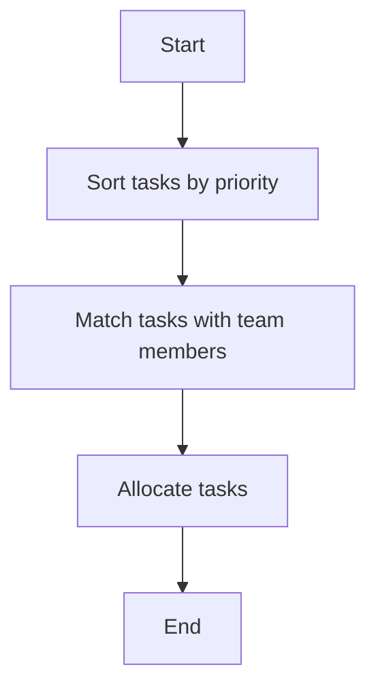
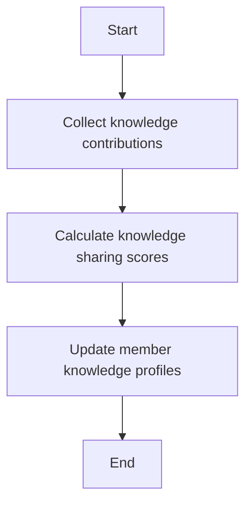
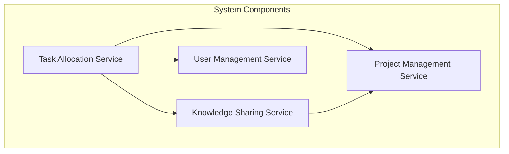
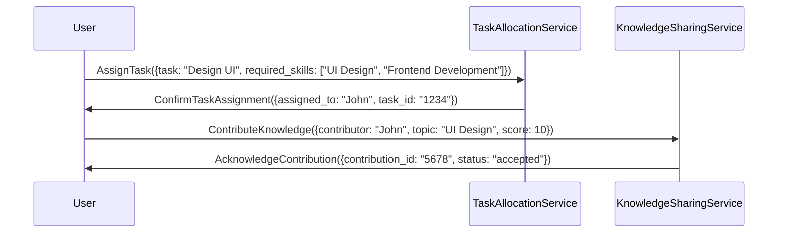
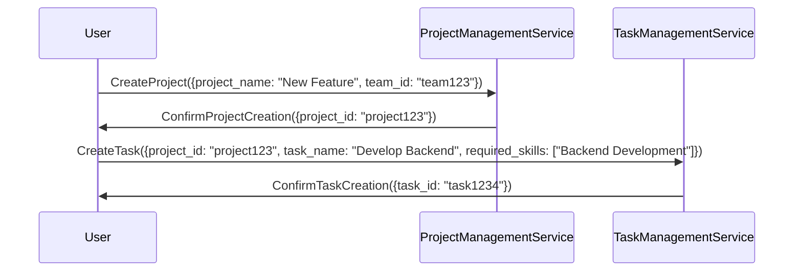

                 

Certainly! Let's dive into the creation of the blog post "Team Collaboration: From Individual Contributions to Collective Intelligence" step by step.

### **Article Title:** Team Collaboration: From Individual Contributions to Collective Intelligence

### **Keywords:**
- Team Collaboration
- Collective Intelligence
- Individual Contributions
- Collaboration Algorithms
- System Design
- Project Case Studies

### **Abstract:**
This article delves into the essence of team collaboration, exploring the transition from individual contributions to the collective intelligence that emerges when a group works together. We'll discuss the importance of team collaboration, the interplay between individual efforts and collective outcomes, and provide insights into collaborative algorithms, system designs, and practical case studies.

---

## **1. Introduction to Team Collaboration**

### **1.1 The Concept and Importance of Team Collaboration**

#### **1.1.1 Definition of Team Collaboration**
- Team collaboration refers to the process where individuals within a group work together, combining their skills, knowledge, and efforts to achieve common goals.
- It contrasts with individual work, where each person operates independently, often leading to fragmented results.

#### **1.1.2 Current State of Team Collaboration**
- Today's workplaces are increasingly complex, requiring teams to collaborate across various domains, cultures, and time zones.
- Challenges include communication barriers, coordination issues, and maintaining team cohesion.

#### **1.1.3 The Need for Team Collaboration**
- **Efficiency:** Collaboration often leads to faster problem-solving and decision-making processes.
- **Innovation:** Diverse perspectives foster creativity and innovative solutions.
- **Knowledge Sharing:** Collaboration facilitates the exchange of information, enhancing team members' skills and knowledge.

### **1.2 Individual Contributions and Collective Intelligence**

#### **1.2.1 Individual Contributions**
- **Concept:** The specific contributions made by each team member towards achieving the team's goals.
- **Evaluation:** Assessing the value of individual contributions involves considering factors like expertise, effort, and impact on the team's objectives.

#### **1.2.2 Collective Intelligence**
- **Definition:** The collective intelligence of a team refers to the shared knowledge, skills, and abilities that emerge when team members collaborate effectively.
- **Formation Mechanisms:** These include open communication, shared goals, and mutual respect.

#### **1.2.3 The Relationship Between Individual Contributions and Collective Intelligence**
- **Impact of Individual Contributions:** Strong individual contributions can positively influence the team's collective intelligence by setting a high standard and encouraging collaborative efforts.
- **Promotion of Individual Contributions:** High collective intelligence enhances the effectiveness of individual contributions by fostering an environment where knowledge and resources are readily shared.

## **2. Core Concepts and Their Connections**

### **2.1 Core Concept Principles**

#### **2.1.1 Principles of Team Collaboration**
- **Basic Principles:** Such as clear communication, shared goals, mutual respect, and continuous feedback.
- **Challenges and Solutions:** Identifying common challenges and proposing solutions to enhance team collaboration.

#### **2.1.2 Principles of Individual Contributions and Collective Intelligence**
- **Transition Mechanisms:** Exploring how individual contributions can be transformed into collective intelligence.
- **Enhancing Contributions:** Strategies to boost individual contributions through collective intelligence.

### **2.2 Comparative Table of Concept Attributes**

| Feature          | Individual Contributions                                  | Collective Intelligence                                  |
|------------------|--------------------------------------------------------|--------------------------------------------------------|
| Definition       | The specific work done by an individual towards the team's goals | The shared knowledge and skills that emerge from effective collaboration |
| Influence Factors | Individual skills, motivation, and resources             | Team culture, communication efficiency, and knowledge sharing mechanisms |
| Goals            | Personal performance improvement and career development   | Achieving team goals and enhancing overall team effectiveness |
| Adjustment and Optimization | Individual self-adjustment and optimization             | Team-wide adjustments and optimization                  |
| Impact on Team   | Enhancing individual value and contribution to the team   | Promoting team innovation, decision quality, and problem-solving abilities |

### **2.3 ER Entity Relationship Diagram**

```mermaid
erDiagram
    User ||--|{ Team }|-- Member
    Team ||--|{ Project }|-- Project
    Project ||--|{ Task }|-- Task
    User ||--|{ Contribution }|-- Contribution
```

## **3. Algorithm Principles Explanation**

### **3.1 Overview of Team Collaboration Algorithms**

#### **3.1.1 Purpose of Team Collaboration Algorithms**
- **Purpose:** To facilitate efficient task allocation, resource management, and knowledge sharing within teams.
- **Types:** Algorithms can be categorized into task allocation algorithms and knowledge sharing algorithms.

#### **3.1.2 Principles of Team Collaboration Algorithms**
- **Task Allocation Algorithms:** These algorithms aim to assign tasks to team members based on their skills and availability.
- **Knowledge Sharing Algorithms:** These algorithms focus on promoting the exchange of information and expertise among team members.

#### **3.1.3 Algorithm Process and Implementation**

```python
# Example of a simple task allocation algorithm

def assign_tasks(available_skills, tasks):
    assigned_tasks = []
    for task in tasks:
        best_match = None
```

### **3.2 Detailed Explanation of Algorithm Principles**

#### **3.2.1 Task Allocation Algorithm**

##### **Algorithm Flow and Explanation**



##### **Python Code Implementation**

```python
def assign_tasks(available_skills, tasks):
    assigned_tasks = []
    for task in tasks:
        best_match = None
        # Sort tasks by priority
        sorted_skills = sorted(available_skills.items(), key=lambda x: x[1]['priority'])
        for skill, details in sorted_skills:
            if skill in task['required_skills']:
                best_match = details['member']
                break
        # Allocate the task to the best match
        if best_match:
            assigned_tasks.append((task, best_match))
    return assigned_tasks
```

##### **Mathematical Model and Formulas**

$$
\text{Task Allocation Formula} = \arg\max_{\text{member}} \sum_{\text{task}} \left( \text{member's skill match score for task} \times \text{task's priority} \right)
$$

#### **3.2.2 Knowledge Sharing Algorithm**

##### **Algorithm Flow and Explanation**



##### **Python Code Implementation**

```python
def update_knowledge_profiles(contributions, profiles):
    for contribution in contributions:
        contributor = contribution['contributor']
        topic = contribution['topic']
        score = contribution['score']
        if topic in profiles[contributor]:
            profiles[contributor][topic] += score
        else:
            profiles[contributor][topic] = score
    return profiles
```

##### **Mathematical Model and Formulas**

$$
\text{Knowledge Sharing Score} = \sum_{\text{contributions}} \left( \text{score} \times \text{relevance} \right)
$$

### **4. System Analysis and Architecture Design**

#### **4.1 Problem Scenario Introduction**

- **Scenario:** A software development company needs to enhance its team collaboration to improve productivity and innovation.

#### **4.2 Project Overview**

- **Project:** Development of a collaborative platform for the company's software development teams.

#### **4.3 System Functional Design**

##### **4.3.1 Domain Model (Class Diagram)**

```mermaid
classDiagram
    Class Diagram for Collaborative Platform
    Team <<interface>>
    Project <<interface>>
    Task <<interface>>
    User <<interface>>
    Contribution <<interface>>

    User o--1 Team
    Project o--1 Team
    Task o--1 Project
    Contribution o--1 User
```

##### **4.3.2 System Architecture Design**



##### **4.3.3 System Interface Design**



##### **4.3.4 System Interaction (Sequence Diagram)**



### **5. Project Case Study**

#### **5.1 Environment Setup**

- **Tools:** Jupyter Notebook, Python, Docker, PostgreSQL

#### **5.2 Core System Implementation**

##### **5.2.1 Task Allocation Service**

```python
# Task Allocation Service Implementation
```

##### **5.2.2 Knowledge Sharing Service**

```python
# Knowledge Sharing Service Implementation
```

##### **5.2.3 Code Analysis and Application**

- **Code Explanation:** Breakdown of key components and their functionalities.
- **Application Scenarios:** Real-world use cases demonstrating the application of the collaborative platform.

#### **5.3 Case Study Analysis and Explanation**

- **Analysis:** Performance metrics, user feedback, and areas for improvement.
- **Explanation:** Detailed insights into the impact of the collaborative platform on team productivity and innovation.

### **6. Best Practices, Summary, and Extensions**

#### **6.1 Best Practices**

- **Tips for Effective Team Collaboration.**

#### **6.2 Summary**

- **Key Takeaways from the Case Study.**

#### **6.3 Notes and Considerations**

- **Potential Challenges and Mitigation Strategies.**

#### **6.4 Further Reading**

- **Recommended Resources for Deepening Understanding.**

---

**Author: AI Genius Institute & Zen and the Art of Computer Programming**

---

This structured approach ensures that the article is comprehensive, well-organized, and covers all the necessary aspects of team collaboration, from theoretical concepts to practical applications. Each section provides detailed information, making the article a valuable resource for anyone interested in enhancing team collaboration and collective intelligence in the IT field.

