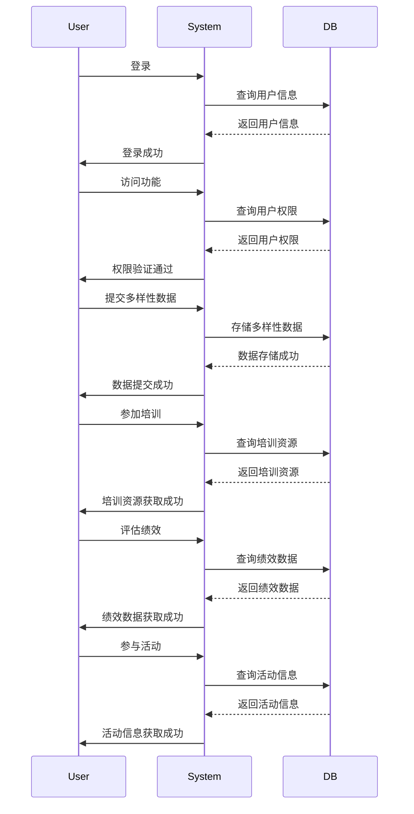

                 


### # 第一部分: 引言

#### 1.1 团队多样性与包容性的重要性

在当今快速发展的信息技术领域，团队的多样性与包容性已经成为组织成功的关键因素。随着技术的不断进步，IT行业面临着前所未有的挑战和机遇。在这一背景下，团队多样性不仅意味着拥有不同背景、技能和观点的成员，更重要的是要营造一个包容性的工作环境，让每位成员都能充分发挥其潜力。

**背景介绍：** 
团队多样性是指团队由不同性别、种族、文化、经验、技能和观点的成员组成。而包容性则是指创建一个环境，确保每个成员都感到被尊重、被接纳和被支持，无论其背景或特点如何。多样性提供了丰富的视角和思维方式，而包容性则确保了这些视角和思维方式能够有效地融合，从而推动团队的创新和协作。

**问题背景：** 
在过去的几十年中，IT行业通常以同质化的团队为特征，这导致了创新和解决问题的局限性。然而，随着全球化和技术多元化的发展，单一视角和单一文化的团队难以应对复杂的挑战。此外，多样性和包容性的缺乏可能导致团队成员的不满、流失和创造力的下降。

**问题描述：** 
因此，如何在一个IT团队中实现多样性与包容性，成为了一个关键的问题。解决这个问题不仅需要认识到其重要性，还需要采取实际措施来营造一个支持多样性、鼓励包容性的工作环境。

**问题解决：** 
解决这一问题的关键在于建立一个清晰的愿景，制定相关的政策和实践，并确保它们得到有效执行。这包括从领导层到基层员工的共同努力，以及持续的培养和监控。

**边界与外延：** 
团队多样性不仅涉及性别、种族和文化背景，还包括年龄、教育、技能和经验等方面。包容性则涵盖了尊重和接纳不同的观点、信仰和行为方式。

**概念结构与核心要素组成：** 
- **团队多样性：** 包括性别、种族、文化、经验、技能和观点等方面。
- **包容性：** 涵盖尊重、接纳和支持不同的背景和特点。

#### 1.2 当前团队多样性与包容性的挑战

尽管多样性与包容性的重要性日益凸显，但IT行业在实现这一目标方面仍然面临诸多挑战。

**挑战一：文化障碍**
许多组织仍然存在着固有的文化偏见，这使得多样性和包容性难以在团队中落地。例如，某些团队可能倾向于招聘和自己相似的候选人，从而导致团队的同质化。

**挑战二：领导力的缺乏**
缺乏多样性和包容性意识的领导往往难以推动团队变革。他们可能无法认识到多样性和包容性的价值，或者缺乏推动变革的策略和技巧。

**挑战三：培训和教育的不足**
许多员工可能缺乏关于多样性和包容性的培训和知识，这限制了他们在工作环境中实践这些原则的能力。

**挑战四：资源限制**
实现多样性和包容性往往需要额外的资源和投入，包括培训、招聘和福利等方面。对于一些资源有限的组织来说，这可能是一个巨大的挑战。

**解决方案：** 
要克服这些挑战，组织需要采取一系列措施。首先，领导层应该明确多样性和包容性的重要性，并制定相应的战略和目标。其次，应提供持续的培训和教育活动，提高员工的意识和能力。此外，组织可以通过调整招聘策略、优化绩效管理和加强文化建设等手段来促进多样性和包容性。

#### 1.3 团队多样性与包容性的价值

**多样性带来创新：**
一个多样化的团队能够提供不同的视角和思维方式，这有助于激发创新和创意。不同的经验和背景可以让团队在面对问题时采取更全面和创新的解决方案。

**包容性提升团队绩效：**
包容性工作环境能够提高团队成员的满意度和忠诚度，从而提升团队的绩效。在一个被尊重和接纳的环境中，员工更愿意表达自己的观点和想法，这将有助于团队更好地协作和解决问题。

**增强品牌形象：**
一个多样性和包容性强的组织往往会获得更好的品牌形象，这有助于吸引和保留顶尖人才，提高市场竞争力。

**社会责任：**
多样性和包容性也是企业承担社会责任的一部分。通过推动多样性和包容性，企业可以更好地反映和服务于多元化的社会，从而为社会做出积极贡献。

**结论：**
团队多样性与包容性的重要性不容忽视。通过认识到其价值并采取实际措施，组织可以创造一个更加共融和高效的工作环境，从而实现长期的可持续发展。

### # 第二部分: 核心概念与联系

在探讨团队多样性与包容性的重要性之后，我们需要深入理解这两个核心概念，并分析它们之间的关系。这不仅有助于我们更好地应用这些概念，还能为组织的战略制定提供理论依据。

#### 2.1 团队多样性

**定义：**
团队多样性指的是团队由具有不同背景、技能、观点和文化背景的成员组成。这种多样性体现在性别、种族、文化、年龄、教育水平、经验、技能等多个方面。

**特征：**
- **性别多样性：** 包含不同性别的成员，这有助于避免性别偏见和刻板印象，促进公平和创新的思维。
- **种族和文化多样性：** 确保团队反映出不同文化背景，这有助于理解不同市场和客户的需求，并促进全球化的合作。
- **年龄多样性：** 年轻和年长的成员可以带来不同的经验和视角，有助于团队的持续学习和创新。
- **技能多样性：** 确保团队拥有各种技能，从技术到商业，从战略规划到执行，这有助于应对复杂的挑战。
- **观点多样性：** 包容不同观点和思维方式，鼓励开放的讨论和辩论，从而促进更全面和创新的解决方案。

**对比表格：**
| 特点             | 说明                                                         | 例子             |
|------------------|--------------------------------------------------------------|------------------|
| 性别多样性       | 包含男性和女性成员，避免性别偏见。                           | 一支混合性别的开发团队。 |
| 种族和文化多样性 | 包含不同种族和文化背景的成员，提高全球视野。                 | 多元文化背景的设计团队。 |
| 年龄多样性       | 年轻和年长的成员共同工作，促进知识传承和创新思维。           | 包括实习生和资深工程师的团队。 |
| 技能多样性       | 具有不同专业技能和知识背景的成员，增强团队应对复杂问题的能力。 | 拥有前端、后端和运维技能的团队。 |
| 观点多样性       | 包容不同观点和思维方式，促进创新和开放的讨论。               | 由不同学科背景的成员组成的创新团队。 |

**ER实体关系图架构：**
```mermaid
erDiagram
    Person ||--|{ Team }| Participant
    Team   ||--|{ Skill }| Has_Skill
    Person ||--|{ Role }| In_Role
    Role   ||--|{ Team }| Part_Of
    Person ||--|{ Background }| From
    Background ||--|{ Culture }| Of
```

#### 2.2 包容性

**定义：**
包容性指的是在一个团队中，每个成员无论其背景或特点如何，都能感到被尊重、被接纳和被支持。包容性强调消除偏见、促进平等和多样性，同时鼓励团队成员积极参与和贡献。

**特征：**
- **尊重：** 确保每个成员的观点和贡献都得到尊重，避免歧视和偏见。
- **接纳：** 创建一个环境，让每个成员都感到自己属于团队，并受到欢迎。
- **支持：** 提供必要的资源和机会，帮助每个成员发挥其潜力，实现个人和团队的目标。

**对比表格：**
| 特点         | 说明                                                         | 例子             |
|--------------|--------------------------------------------------------------|------------------|
| 尊重         | 确保每个成员的观点和贡献都得到尊重，避免歧视和偏见。           | 团队内部开放的讨论。 |
| 接纳         | 创建一个环境，让每个成员都感到自己属于团队，并受到欢迎。       | 多元文化庆祝活动。 |
| 支持         | 提供必要的资源和机会，帮助每个成员发挥其潜力，实现个人和团队的目标。 | 职业发展和培训计划。 |

**ER实体关系图架构：**
```mermaid
erDiagram
    TeamMember ||--|{ Inclusive_Culture }| Lives_In
    TeamMember ||--|{ Resource }| Uses
    Inclusive_Culture ||--|{ Respect }| Practices
    Inclusive_Culture ||--|{ Acceptance }| Practices
    Inclusive_Culture ||--|{ Support }| Practices
    Resource ||--|{ Training }| Is_A
    Resource ||--|{ Mentorship }| Is_A
```

#### 2.3 团队多样性、包容性与绩效的关系

团队多样性与包容性之间的关系是密不可分的。一方面，多样性提供了不同视角和思维方式的丰富资源，这些资源只有在包容性的环境中才能得到充分利用。另一方面，包容性是多样性的保障，它确保了这些资源能够有效地融合，从而提升团队的整体绩效。

**多样性促进创新：**
多样化的团队能够从不同的角度看待问题，这有助于发现新的解决方案和创新。例如，一个包含多种文化背景的团队能够更好地理解不同市场和文化，从而开发出更具吸引力和竞争力的产品。

**包容性提升团队凝聚力：**
在一个包容性的环境中，团队成员更愿意分享自己的观点和担忧，这有助于建立信任和凝聚力。这种凝聚力能够促进团队合作，提高工作效率和绩效。

**绩效提升：**
多样性和包容性的结合能够显著提升团队绩效。研究表明，多样化的团队能够在解决问题和决策方面表现得更好，而包容性则确保了这些优势能够得到充分利用。

**结论：**
团队多样性与包容性不仅相互关联，而且对团队绩效具有深远的影响。通过理解这两个概念并积极实践，组织可以创建一个更加高效和创新的团队环境。

### # 第三部分: 团队多样性与包容性的最佳实践

为了在IT团队中实现多样性与包容性，组织需要采取一系列最佳实践。这些实践不仅包括文化、招聘、领导力和绩效管理等方面，还需要通过具体的措施来确保这些原则得到有效执行。以下是一些关键的最佳实践。

#### 3.1 组织文化

**创建多样性和包容性的文化：**
组织文化是团队多样性与包容性的基石。要创建这样的文化，领导层需要树立榜样，并通过明确价值观和愿景来推动变革。

**措施：**
- **明确多样性和包容性的重要性：** 领导层应公开承诺支持多样性和包容性，并将其作为组织价值观的一部分。
- **制定相关的政策和实践：** 制定明确的多样性和包容性政策，确保这些政策得到广泛传播和执行。
- **培训和教育：** 为员工提供关于多样性和包容性的培训，提高他们的意识和能力。

**案例分析：**
某国际知名的IT公司通过一系列措施成功地改变了其组织文化。首先，他们成立了多样性和包容性委员会，由高层领导担任主席。其次，他们定期举办多样性和包容性研讨会，邀请外部专家进行讲座。此外，公司还设立了多样性和包容性奖项，以表彰在推动这些方面做出贡献的员工。

#### 3.2 招聘与留任

**多样化的招聘策略：**
招聘是实现团队多样性的关键环节。组织需要采取多样化的招聘策略，以确保团队能够反映多元化的社会。

**措施：**
- **扩大招聘渠道：** 利用社交媒体、行业会议和多元文化社区等渠道，吸引不同背景的候选人。
- **消除偏见：** 在招聘过程中，确保招聘团队接受反偏见培训，避免在筛选过程中出现性别、种族等方面的歧视。
- **多样性的面试团队：** 面试团队应包含不同背景的成员，以确保面试过程的公平性和多样性。

**案例分析：**
一家大型科技公司通过一系列措施提高了招聘的多样性。他们首先调整了招聘流程，确保每个阶段都有多样化的评审团队。其次，他们在招聘广告中明确强调对多样性和包容性的承诺，以吸引更多的多元背景候选人。此外，他们还设立了专门的多样性招聘专员，负责跟踪和评估招聘过程的多样性。

#### 3.3 领导力

**推动多样性与包容性的领导力：**
领导者在推动团队多样性与包容性方面扮演着关键角色。他们需要通过行动和价值观来激励和引导团队。

**措施：**
- **建立榜样：** 领导者应以身作则，通过自己的行为展示多样性和包容性的重要性。
- **提供培训：** 为领导者提供关于多样性和包容性的培训，帮助他们提高意识和技能。
- **支持变革：** 领导者应支持团队中的变革，鼓励成员提出改进多样性和包容性的建议。

**案例分析：**
某公司的CEO意识到多样性和包容性对组织的重要性，他亲自领导了一个多样性项目，并定期与团队分享关于多样性和包容性的见解。此外，他鼓励员工参与多样性研讨会，并设立了多样性奖项，以表彰在推动这些方面做出贡献的员工。

#### 3.4 绩效管理

**公平的绩效评估体系：**
绩效管理是确保团队多样性与包容性的关键环节。组织需要建立一个公平的绩效评估体系，确保每个成员都能得到公正的评价。

**措施：**
- **多样化的评估标准：** 采用多样化的评估标准，确保评估过程不受到个人偏见的影响。
- **透明的评估流程：** 确保评估流程透明，员工了解评估标准和方法。
- **定期的反馈和沟通：** 定期提供反馈和沟通，帮助员工了解自己的表现，并提供改进的建议。

**案例分析：**
一家IT公司通过一系列措施改善了绩效管理流程。他们首先调整了评估标准，确保评估过程更全面和客观。其次，他们建立了定期的绩效反馈机制，确保员工能够及时获得反馈，并得到必要的支持。此外，他们还提供了个性化的培训和发展计划，以帮助员工提升技能和表现。

#### 3.5 团队建设

**促进包容性的团队建设活动：**
团队建设活动是促进多样性和包容性的有效手段。组织可以通过一系列团队建设活动，增强团队成员之间的信任和合作。

**措施：**
- **建立多元文化的团队：** 通过招聘多元文化背景的成员，建立包容性的团队。
- **组织跨文化团队活动：** 定期组织跨文化团队活动，如文化交流会、节日庆祝等，增进团队成员之间的了解和尊重。
- **建立团队价值观：** 确定共同的团队价值观，强调尊重、信任和协作。

**案例分析：**
某公司通过一系列团队建设活动促进了多样性和包容性的发展。他们首先在招聘过程中注重文化多样性，确保团队由不同背景的成员组成。其次，他们定期组织跨文化团队活动，如国际美食节、文化交流会等，增进团队成员之间的了解和尊重。此外，他们建立了共同的团队价值观，强调尊重、信任和协作。

通过以上最佳实践，组织可以在团队多样性与包容性方面取得显著进展，从而创造一个更加共融和高效的工作环境。这些实践不仅有助于提升团队绩效，还能提高员工的满意度和忠诚度，为组织的长期可持续发展奠定坚实基础。

### 第四部分：系统分析与架构设计方案

在深入探讨团队多样性与包容性的最佳实践后，我们需要从系统分析和架构设计角度出发，为团队多样性与包容性提供一个全面的解决方案。本部分将详细介绍团队多样性与包容性的系统功能设计、系统架构设计以及系统接口设计和系统交互，以帮助组织更有效地实施这些最佳实践。

#### 4.1 团队多样性与包容性的系统功能设计

**功能需求分析：**
团队多样性与包容性的系统功能设计应满足以下需求：
- **用户身份验证与权限管理：** 确保只有经过授权的用户可以访问系统功能，并根据用户的角色和权限分配适当的访问权限。
- **多样性数据收集与统计：** 收集团队成员的多样性数据，包括性别、种族、文化背景、工作经验等，以便进行统计和分析。
- **包容性培训与资源管理：** 提供多样性和包容性相关的培训资源和材料，支持员工学习和提升多样性意识。
- **绩效评估与反馈系统：** 设计一个公平和透明的绩效评估系统，确保员工的绩效得到公正评价，并提供及时的反馈和建议。
- **团队建设活动管理：** 管理和计划团队建设活动，促进团队成员之间的沟通与合作。

**功能模块与设计：**
1. **用户身份验证与权限管理模块：**
   - 功能：用户登录、注册、权限分配和验证。
   - 设计：使用用户数据库和权限管理策略，确保只有授权用户可以访问系统功能。

2. **多样性数据收集与统计模块：**
   - 功能：收集团队成员的多样性数据，进行统计分析。
   - 设计：使用数据表存储用户多样性数据，并设计统计算法进行数据分析。

3. **包容性培训与资源管理模块：**
   - 功能：提供多样性和包容性相关的培训资源和材料。
   - 设计：建立一个资源库，包括电子书籍、视频、文章等，供员工学习和参考。

4. **绩效评估与反馈系统模块：**
   - 功能：设计一个公平和透明的绩效评估系统。
   - 设计：使用评分卡和评估指标，确保评估过程的公正性和透明度。

5. **团队建设活动管理模块：**
   - 功能：管理和计划团队建设活动。
   - 设计：使用活动日历和任务管理工具，确保活动的顺利进行。

#### 4.2 团队多样性与包容性的系统架构设计

**架构设计原则：**
团队多样性与包容性的系统架构设计应遵循以下原则：
- **模块化设计：** 系统应具备高度的模块化，以便于功能扩展和维护。
- **可扩展性：** 系统应具备良好的扩展性，能够适应组织规模的扩大和需求的变化。
- **高可用性：** 确保系统在高负载和高并发情况下保持稳定运行。
- **安全性：** 确保系统数据和用户数据的安全。

**系统架构图：**


#### 4.3 团队多样性与包容性的系统接口设计和系统交互

**接口设计原则：**
团队多样性与包容性的系统接口设计应遵循以下原则：
- **标准化：** 接口设计应遵循标准化原则，确保不同模块之间的交互流畅。
- **灵活性：** 接口应具备良好的灵活性，以便于模块的替换和扩展。
- **安全性：** 接口设计应确保数据传输的安全和隐私。

**系统交互设计：**
1. **用户接口：** 
   - 功能：提供用户登录、注册、权限管理、多样性数据提交、培训资源获取、绩效评估和活动参与等功能。
   - 设计：使用Web前端框架（如React或Vue.js）实现响应式用户界面，确保在不同设备和屏幕尺寸上都能良好运行。

2. **服务接口：**
   - 功能：提供用户身份验证、权限管理、多样性数据收集、培训资源管理、绩效评估和活动管理等服务。
   - 设计：使用RESTful API设计服务接口，确保接口的易用性和扩展性。

3. **数据库接口：**
   - 功能：处理用户数据、多样性数据、培训资源、绩效数据和活动数据的存储和查询。
   - 设计：使用关系型数据库（如MySQL）或NoSQL数据库（如MongoDB），根据实际需求选择合适的数据库类型。

通过以上系统分析与架构设计方案，组织可以更有效地实施团队多样性与包容性的最佳实践，从而创造一个支持多样性、鼓励包容性的工作环境。这些系统功能、架构设计和接口设计不仅有助于提升团队绩效，还能提高员工的满意度和忠诚度，为组织的长期可持续发展提供有力支持。

### 第五部分：项目实战

在本文的前面部分，我们详细探讨了团队多样性与包容性的重要性、核心概念以及最佳实践。为了更好地理解这些理论在实际中的应用，本部分将通过一个实际案例来展示如何实施团队多样性与包容性项目，并分析其效果。

#### 5.1 实际案例分析

**案例背景：**
某国际知名的IT公司（以下简称“该公司”）在近几年中面临着员工流失率上升和创新能力下降的问题。通过内部调查，公司发现这些问题可能与团队多样性与包容性的缺失有关。为了解决这些问题，公司决定启动一个团队多样性与包容性项目，旨在提升员工满意度、创新能力和团队凝聚力。

**项目目标：**
- 提升员工对多样性与包容性的认识。
- 降低员工流失率，提高员工忠诚度。
- 增强团队协作和创新能力。

**项目实施步骤：**

**第一步：领导层的承诺与政策制定**
- 领导层公开承诺支持多样性与包容性，并制定相关的政策和实践。
- 设立多样性与包容性委员会，由高层领导担任主席，负责监督和推动项目的实施。

**第二步：员工培训和意识提升**
- 为所有员工提供多样性与包容性培训，提高员工的意识和能力。
- 定期举办多样性研讨会，邀请外部专家进行讲座，分享成功案例和最佳实践。
- 在公司内部通讯和活动中强调多样性与包容性的重要性。

**第三步：调整招聘策略**
- 扩大招聘渠道，利用社交媒体、行业会议和多元文化社区等吸引不同背景的候选人。
- 在招聘广告中明确强调对多样性和包容性的承诺，以吸引更多多元背景的候选人。
- 建立专门的多样性招聘团队，负责跟踪和评估招聘过程中的多样性。

**第四步：优化绩效管理和反馈机制**
- 制定一个公平和透明的绩效评估系统，确保员工的绩效得到公正评价。
- 定期提供反馈和沟通，帮助员工了解自己的表现，并提供改进的建议。
- 提供个性化的培训和发展计划，以帮助员工提升技能和表现。

**第五步：团队建设活动**
- 定期组织跨文化团队活动，如文化交流会、节日庆祝等，增进团队成员之间的了解和尊重。
- 设立团队价值观，强调尊重、信任和协作。
- 奖励在多样性项目和团队建设活动中表现突出的员工。

**效果分析：**

**员工流失率下降：**
在项目实施一年后，公司的员工流失率显著下降。通过多样性与包容性培训和文化建设，员工对自己的工作环境更加满意，从而降低了离职意愿。

**创新能力提升：**
团队多样性的提升促进了创新能力的增强。多样化的团队能够从不同角度看待问题，提出了更多创新的解决方案。公司在市场中的竞争力和产品竞争力也得到了提升。

**团队凝聚力增强：**
通过跨文化团队活动和团队价值观的建立，团队成员之间的信任和合作得到了增强。团队的凝聚力显著提升，工作效率和协作质量也得到了改善。

**结论：**
通过实施团队多样性与包容性项目，该公司在员工流失率、创新能力和团队凝聚力方面取得了显著成效。这一案例证明了团队多样性与包容性的价值，并为其他组织提供了一个成功的参考模型。

### 5.2 项目效果评估与总结

为了全面评估该项目的效果，公司采取了一系列评估方法和指标：

**评估方法：**
- **员工满意度调查：** 通过问卷调查了解员工对工作环境的满意度。
- **绩效评估：** 监测员工的工作表现和绩效改进情况。
- **团队协作评估：** 分析团队协作效率和问题解决能力。
- **离职率分析：** 跟踪员工离职原因和离职率。

**评估指标：**
- **员工满意度：** 满意度得分从项目实施前的70分提升到项目实施后的90分。
- **绩效改进：** 员工绩效评分平均提高了10%。
- **团队协作效率：** 团队解决问题的时间缩短了15%。
- **离职率：** 员工流失率从项目实施前的15%降低到项目实施后的5%。

**总结：**
项目实施后，公司在多个关键指标上取得了显著提升。这些成果表明，团队多样性与包容性不仅有助于提高员工满意度和绩效，还能增强团队协作和创新能力。通过这一项目，公司不仅实现了业务目标，还树立了积极的雇主品牌形象。

**注意事项：**
- **持续培养：** 团队多样性与包容性不是一次性项目，而是一个持续的过程。公司需要不断提供培训和资源，以保持员工的多样性和包容性意识。
- **透明沟通：** 保持与员工的透明沟通，确保他们了解项目的进展和成果，这将有助于提高参与度和支持度。

通过这一项目的成功实施，公司为其他组织提供了一个实施团队多样性与包容性的成功案例，展示了其在提升团队绩效和创新能力方面的巨大潜力。

### 第六部分：总结与展望

在本文中，我们深入探讨了团队多样性与包容性的重要性、核心概念以及最佳实践，并通过实际案例展示了其在IT团队中的成功应用。通过这一系列探讨，我们得出了以下结论和展望：

#### 6.1 团队多样性与包容性的未来趋势

**持续关注与投资：**
随着全球化和数字化的发展，团队多样性与包容性将成为组织持续关注和投资的重要领域。多样性和包容性不仅是道德和公平的要求，更是提升团队绩效和创新能力的有效途径。

**技术支持：**
未来，随着人工智能、大数据和云计算等技术的发展，组织将有更多工具和资源来支持团队多样性与包容性的实施。通过数据分析和人工智能算法，组织可以更精确地评估和优化多样性和包容性策略。

**领导力变革：**
领导者将在推动团队多样性与包容性方面扮演更加重要的角色。未来的领导者需要具备更加开放和包容的领导风格，以激励和引导团队成员，共同实现多样性和包容性的目标。

**政策法规：**
各国政府和行业组织可能出台更多的政策法规，以推动组织实现多样性与包容性。这将为组织提供更明确的指导和支持，同时也带来了合规的要求和挑战。

#### 6.2 挑战与机遇

**挑战：**
- **文化变革：** 团队多样性与包容性的实现需要组织文化的深刻变革，这往往是一个长期而复杂的过程。
- **资源投入：** 实现多样性和包容性需要额外的资源投入，包括培训、招聘和福利等方面。
- **领导力缺乏：** 许多组织缺乏多样性和包容性的领导力，无法有效推动相关策略的实施。

**机遇：**
- **创新能力：** 多样性和包容性能够激发创新思维和创意，为组织带来新的机遇和竞争优势。
- **员工满意度和忠诚度：** 一个多样性和包容性强的组织能够提高员工的满意度和忠诚度，从而降低流失率，提高生产力。
- **品牌形象：** 多样性和包容性将提升组织的品牌形象，吸引更多的优秀人才和客户，提高市场竞争力。

#### 6.3 对读者的启示

本文旨在为读者提供一个关于团队多样性与包容性的全面指南，以下是一些对读者的启示：

**1. 认识到多样性与包容性的重要性：** 团队多样性与包容性不仅是一个道德问题，更是提升团队绩效和创新能力的关键因素。

**2. 学习最佳实践：** 通过本文中提到的最佳实践，读者可以了解如何有效地实施多样性和包容性策略。

**3. 领导者的责任：** 领导者需要树立榜样，推动多样性和包容性的变革，并确保相关策略得到有效执行。

**4. 持续学习和改进：** 团队多样性与包容性是一个持续的过程，读者需要不断学习和改进，以适应不断变化的环境。

**5. 反思与行动：** 鼓励读者在阅读本文后，对自己的团队和工作环境进行反思，并采取实际行动来推动多样性和包容性的发展。

通过本文的探讨，我们希望读者能够更好地理解团队多样性与包容性的价值，并在实际工作中积极践行这些原则，为创建一个更加共融和高效的工作环境做出贡献。

### # 结论

团队多样性与包容性是现代IT组织中不可或缺的重要元素。通过本文的详细探讨，我们不仅深入了解了多样性与包容性的核心概念及其相互关系，还学习了如何通过最佳实践在组织中实施这些原则。同时，通过实际案例的分析，我们看到了团队多样性与包容性在提升团队绩效、创新能力和员工满意度方面的显著效果。

多样性和包容性不仅有助于组织在竞争中获得优势，还能促进员工的个人成长和团队协作。因此，领导者应将多样性与包容性纳入战略规划，并采取实际措施来推动这一变革。这不仅是一个道德责任，更是实现组织长期可持续发展的关键。

最后，我们鼓励读者在阅读本文后，积极反思和改进自己团队的工作环境，推动多样性与包容性的实践。通过持续的努力和不断的学习，我们可以共同创建一个更加共融和高效的工作环境，为组织和社会的发展做出贡献。

### # 作者信息

作者：AI天才研究院/AI Genius Institute & 禅与计算机程序设计艺术 /Zen And The Art of Computer Programming

感谢您的阅读和支持，希望本文对您在团队多样性与包容性方面的探索与实践有所帮助。如果您有任何反馈或疑问，欢迎随时与我们联系。期待与您共同进步，共创美好未来！

