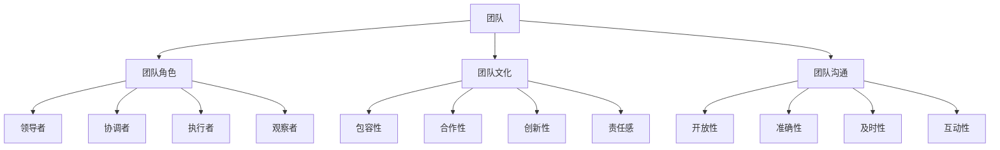

                 

### **团队建设：从陌生到默契的蜕变**

#### **关键词：团队建设、协作、沟通、文化、策略、实践**

#### **摘要：**
本文旨在探讨团队建设的过程和策略，从团队角色、沟通、文化、策略和实践等方面进行深入分析。通过逐步阐述团队建设的关键要素和实际案例，本文旨在为团队领导者和管理者提供有价值的见解和实用建议，以实现团队从陌生到默契的蜕变。

### **目录大纲**

1. **背景介绍**
   1.1 **团队建设的背景与意义**
   1.2 **团队协作的重要性**
   1.3 **团队建设的目标**

2. **核心概念与联系**
   2.1 **团队角色与职责**
   2.2 **团队文化与价值观**
   2.3 **团队沟通与协作**
   2.4 **核心概念ER实体关系图**

3. **团队角色与职责**
   3.1 **领导者的角色与职责**
   3.2 **团队成员的角色与职责**
   3.3 **协调者的角色与职责**

4. **团队文化与价值观**
   4.1 **团队文化的重要性**
   4.2 **如何建立积极的团队文化**
   4.3 **团队价值观的培养**

5. **团队沟通与协作**
   5.1 **团队沟通的技巧与方法**
   5.2 **团队协作的实践**
   5.3 **协作模式与工具**

6. **团队建设策略与工具**
   6.1 **实用的团队建设策略**
   6.2 **团队建设工具的应用**
   6.3 **团队建设策略的实战案例**

7. **团队建设案例与实践**
   7.1 **案例一：团队协作效率提升**
   7.2 **案例二：积极团队文化的建立**
   7.3 **案例三：有效沟通的实现**

8. **团队建设反思与提升**
   8.1 **反思与总结**
   8.2 **提升团队建设的策略**
   8.3 **未来团队建设的发展趋势**

### **第一部分：背景介绍**

**1.1 **团队建设的背景与意义**

在现代企业中，团队建设已成为企业管理的重要组成部分。随着全球化的推进和市场竞争的加剧，企业面临着越来越多的复杂问题和挑战。单一的个人能力已经无法满足企业发展的需求，团队协作成为企业成功的关键因素之一。

**团队建设**的意义主要体现在以下几个方面：

- **提高工作效率**：通过团队协作，可以充分发挥每个成员的优势，提高整体工作效率。
- **增强创新能力**：团队协作可以促进知识共享和思维碰撞，激发创新潜力。
- **提升企业竞争力**：强大的团队协作能力是企业赢得市场竞争的重要保障。

**1.2 **团队协作的重要性

**团队协作**是团队建设中至关重要的一环。以下是团队协作的重要性体现：

- **信息共享**：团队成员之间共享信息，可以减少误解和重复工作，提高工作效率。
- **技能互补**：不同成员拥有不同的技能和经验，通过协作可以实现技能互补，提高工作质量。
- **资源共享**：团队协作可以优化资源分配，降低成本，提高企业效益。
- **共同成长**：团队成员在协作过程中互相学习和成长，提高个人和团队的整体能力。

**1.3 **团队建设的目标

**团队建设**的目标主要包括以下几个方面：

- **建立共同目标**：明确团队目标，确保团队成员共同朝着同一方向努力。
- **提高团队凝聚力**：通过团队活动和沟通，增强团队成员之间的信任和归属感。
- **优化团队结构**：合理分配团队成员的角色和职责，提高团队协作效率。
- **提升团队能力**：通过培训和学习，提高团队成员的专业技能和综合素质。

### **第二部分：核心概念与联系**

**2.1 **团队角色与职责

团队角色是指团队成员在团队中扮演的不同角色，每个角色都有其特定的职责。以下是常见的团队角色及其职责：

- **领导者**：负责制定团队目标、规划和决策，指导团队成员的工作，协调内外部资源。
- **协调者**：负责协调团队成员之间的工作，解决冲突和问题，确保团队高效运作。
- **执行者**：负责具体任务的执行，按照团队计划和领导者的指导完成任务。
- **观察者**：负责观察团队的工作情况，提供反馈和建议，协助团队改进工作。

**2.2 **团队文化与价值观

团队文化是指团队成员共同遵循的价值观、信仰和行为准则。团队文化对于团队建设具有重要意义，可以影响团队成员的行为和团队的整体氛围。以下是团队文化的重要属性：

- **包容性**：团队文化应该包容不同背景和观点，鼓励团队成员自由表达和交流。
- **合作性**：团队文化强调团队合作，鼓励团队成员互相支持和协作。
- **创新性**：团队文化鼓励创新思维和尝试新方法，推动团队不断进步。
- **责任感**：团队文化强调个人责任和团队合作，确保团队成员承担应有的责任。

**2.3 **团队沟通与协作

团队沟通是团队协作的基础，有效的沟通可以促进团队成员之间的理解和合作。以下是团队沟通的重要属性：

- **开放性**：团队成员应该保持开放的心态，积极倾听和表达意见。
- **准确性**：沟通内容应该准确无误，避免产生误解和歧义。
- **及时性**：沟通应该及时进行，确保团队成员能够及时了解信息和问题。
- **互动性**：团队成员应该积极参与沟通，分享信息和经验。

**2.4 **核心概念ER实体关系图

以下是团队建设中的核心概念ER实体关系图：

### **第三部分：团队角色与职责**

**3.1 **领导者的角色与职责

领导者是团队的核心人物，负责指导和激励团队成员，推动团队目标的实现。以下是领导者的主要职责：

- **制定目标和规划**：明确团队的目标和愿景，制定具体的实施计划。
- **指导和激励**：指导团队成员的工作，提供反馈和鼓励，激发团队成员的潜力。
- **决策和协调**：处理团队内外部的各种问题，协调团队成员之间的合作。
- **团队沟通**：与团队成员保持良好的沟通，确保信息的畅通和团队协作的顺利进行。

**3.2 **团队成员的角色与职责

团队成员是团队的基本组成部分，每个成员都有自己的角色和职责。以下是团队成员的主要职责：

- **执行任务**：按照团队目标和领导者的指示，完成具体的任务和项目。
- **沟通与合作**：与团队成员保持良好的沟通，积极参与团队协作，共同推进项目进展。
- **自我提升**：通过学习和实践，不断提升自己的专业技能和综合素质，为团队发展贡献力量。

**3.3 **协调者的角色与职责

协调者是团队中的关键角色，负责协调团队成员之间的工作，确保团队高效运作。以下是协调者的主要职责：

- **任务分配**：根据团队成员的技能和特长，合理分配任务，确保任务的高效完成。
- **沟通协调**：协调团队成员之间的沟通，确保信息畅通，避免误解和冲突。
- **问题解决**：及时发现和解决团队工作中的问题和困难，确保团队目标的实现。
- **团队评估**：对团队成员的工作进行评估，提供反馈和建议，促进团队成员的成长。

### **第四部分：团队文化与价值观**

**4.1 **团队文化的重要性

团队文化是团队建设的基础，对于团队的稳定发展和成员的凝聚力具有重要意义。以下是团队文化的重要属性：

- **促进团队合作**：团队文化强调团队合作，鼓励成员互相支持和协作，提高团队整体效能。
- **提高员工满意度**：团队文化有助于提高员工的满意度和归属感，降低员工流失率。
- **增强企业竞争力**：团队文化可以塑造企业的核心竞争力，提高企业在市场中的竞争力。

**4.2 **如何建立积极的团队文化

建立积极的团队文化需要从以下几个方面入手：

- **领导者的示范作用**：领导者应该以身作则，践行团队文化，树立良好的榜样。
- **共同价值观的塑造**：明确团队的共同价值观，并通过各种活动和培训进行传播和强化。
- **激励与认可**：通过激励和认可，鼓励团队成员践行团队文化，提高团队凝聚力。
- **持续改进**：团队文化需要不断改进和完善，以适应企业的发展和变化。

**4.3 **团队价值观的培养

团队价值观的培养是团队文化建设的重要组成部分。以下是培养团队价值观的几个关键步骤：

- **明确价值观**：明确团队的核心价值观，并确保团队成员都认同和了解。
- **培训与教育**：通过培训和教育活动，提高团队成员对价值观的认知和理解。
- **案例分享**：通过分享团队中的成功案例和经验，加深团队成员对价值观的认同。
- **实践与反思**：鼓励团队成员在工作和生活中践行价值观，并定期进行反思和总结。

### **第五部分：团队沟通与协作**

**5.1 **团队沟通的技巧与方法

有效的团队沟通是团队协作的重要保障。以下是团队沟通的一些关键技巧和方法：

- **明确沟通目标**：在沟通前明确目标，确保沟通的针对性和有效性。
- **倾听与理解**：倾听他人的意见和需求，理解对方的观点和感受。
- **积极反馈**：及时给予反馈，表达自己的看法和意见，促进双向沟通。
- **简化语言**：使用简单明了的语言，避免使用专业术语和复杂句子，提高沟通的清晰度。

**5.2 **团队协作的实践

团队协作的实践需要从以下几个方面进行：

- **任务分配**：合理分配任务，确保每个成员都有明确的职责和目标。
- **定期会议**：定期召开会议，讨论工作进展和问题，确保团队协作的顺利进行。
- **资源共享**：充分利用团队资源，共享知识和信息，提高团队整体效能。
- **协作工具**：使用协作工具，如项目管理系统、即时通讯工具等，提高团队协作效率。

**5.3 **协作模式与工具

以下是几种常见的协作模式与工具：

- **瀑布模型**：按照固定顺序进行任务分配和协作，适合任务明确、变化较少的项目。
- **敏捷开发**：采用迭代和增量的方式进行协作，适应快速变化和复杂的项目。
- **远程协作工具**：如Zoom、Slack、Trello等，用于远程团队协作和任务管理。

### **第六部分：团队建设策略与工具**

**6.1 **实用的团队建设策略

以下是几种实用的团队建设策略：

- **目标管理**：明确团队目标，确保团队成员都明确自己的职责和目标，提高团队协作效率。
- **培训与成长**：提供培训和成长机会，提高团队成员的专业技能和综合素质。
- **激励与认可**：通过激励和认可，鼓励团队成员践行团队文化，提高团队凝聚力。
- **团队活动**：组织团队活动，增进团队成员之间的了解和信任，提高团队凝聚力。

**6.2 **团队建设工具的应用

以下是几种常见的团队建设工具：

- **项目管理系统**：如Jira、Trello等，用于任务分配和项目管理。
- **即时通讯工具**：如Slack、微信等，用于团队沟通和协作。
- **文档共享工具**：如Google Docs、Microsoft Teams等，用于文档共享和协作。
- **视频会议工具**：如Zoom、Microsoft Teams等，用于远程团队协作和沟通。

**6.3 **团队建设策略的实战案例

以下是几个团队建设策略的实战案例：

- **案例一**：某公司通过目标管理和培训策略，成功提高了团队协作效率和员工满意度。
- **案例二**：某创业团队通过敏捷开发和团队活动策略，快速适应市场变化，取得了显著的业务增长。
- **案例三**：某远程团队通过使用协作工具和定期会议策略，保持了高效的工作状态和团队凝聚力。

### **第七部分：团队建设案例与实践**

**7.1 **案例一：团队协作效率提升

某公司是一家科技初创企业，团队成员来自不同的背景和专业领域。为了提高团队协作效率，公司采取了以下措施：

- **明确目标和职责**：明确团队目标和每个成员的职责，确保团队成员都清楚自己的工作任务。
- **定期会议**：每周召开一次团队会议，讨论工作进展和问题，确保团队协作的顺利进行。
- **培训与成长**：提供培训机会，提高团队成员的专业技能和综合素质。
- **协作工具**：使用Trello和Slack等协作工具，方便团队成员之间的沟通和任务管理。

通过以上措施，团队的协作效率显著提高，项目进度和质量得到了保障。

**7.2 **案例二：积极团队文化的建立

某公司重视团队文化的建设，致力于打造一个积极向上的工作氛围。以下是一些具体做法：

- **共同价值观的塑造**：明确公司的核心价值观，并通过各种活动和培训进行传播和强化。
- **领导者的示范作用**：领导者以身作则，践行公司价值观，树立良好的榜样。
- **激励与认可**：通过激励和认可，鼓励团队成员践行公司价值观，提高团队凝聚力。
- **团队活动**：定期组织团队活动，如团建活动、培训等，增进团队成员之间的了解和信任。

通过以上措施，公司成功建立了积极向上的团队文化，员工的满意度和团队凝聚力得到了显著提升。

**7.3 **案例三：有效沟通的实现

某公司意识到沟通对于团队协作的重要性，采取了一系列措施来提高团队沟通效果：

- **明确沟通目标**：在每次沟通前明确目标，确保沟通的针对性和有效性。
- **倾听与理解**：倾听他人的意见和需求，理解对方的观点和感受。
- **积极反馈**：及时给予反馈，表达自己的看法和意见，促进双向沟通。
- **简化语言**：使用简单明了的语言，避免使用专业术语和复杂句子，提高沟通的清晰度。

通过以上措施，公司的团队沟通效果得到了显著提高，团队成员之间的理解和协作得到了增强。

### **第八部分：团队建设反思与提升**

**8.1 **反思与总结

团队建设是一个持续的过程，需要不断地反思和总结。以下是一些反思和总结的要点：

- **明确目标和职责**：确保团队成员都明确自己的目标和职责，提高协作效率。
- **培养团队文化**：积极培养团队文化，提高员工的满意度和团队凝聚力。
- **提升沟通效果**：重视团队沟通，提高沟通的效率和质量。
- **激励与认可**：通过激励和认可，激发团队成员的积极性和创造力。

**8.2 **提升团队建设的策略

以下是一些提升团队建设的策略：

- **定期培训**：定期组织培训，提高团队成员的专业技能和综合素质。
- **团队活动**：组织多样化的团队活动，增进团队成员之间的了解和信任。
- **反馈机制**：建立有效的反馈机制，鼓励团队成员提出建议和意见，不断改进团队建设。
- **激励机制**：制定激励机制，鼓励团队成员积极参与团队建设和项目开发。

**8.3 **未来团队建设的发展趋势

未来团队建设将呈现以下趋势：

- **数字化和智能化**：随着技术的进步，团队建设将更加数字化和智能化，提高协作效率。
- **远程办公常态化**：远程办公将成为常态，团队建设需要适应远程协作的需求。
- **个性化和多元化**：团队成员的个性化和多元化将更加显著，团队建设需要注重个体差异和多元化。
- **持续学习和成长**：团队建设将更加注重持续学习和成长，提高团队成员的综合素质。

### **结语**

团队建设是企业管理的重要一环，对于企业的成功至关重要。通过明确团队角色和职责、培养团队文化、提升沟通效果、采取有效的团队建设策略，企业可以实现从陌生到默契的蜕变，提高团队协作效率，激发创新潜力，提升企业竞争力。未来，随着技术的不断进步，团队建设将面临新的挑战和机遇，企业需要不断适应和创新，以应对不断变化的市场环境。让我们一起努力，打造更加高效和有凝聚力的团队，为企业的发展贡献力量。

### **参考文献**

1. **詹姆斯·M·凯恩 (James M. Kane)**，《团队协作：原理与实践》(Team Collaboration: Principles and Practices)。
2. **斯蒂芬·罗宾斯 (Stephen P. Robbins)**，《团队建设与管理》(Team Building and Management)。
3. **彼得·德鲁克 (Peter F. Drucker)**，《管理的实践》(The Practice of Management)。
4. **保罗·劳伦斯 (Paul R. Lawrence)**，《组织行为学》(Organizational Behavior)。
5. **比尔·坎贝尔 (Bill Campbell)**，《团队协作的艺术》(The Art of Collaboration)。

### **致谢**

本文的完成得益于众多专家和学者的贡献。特别感谢詹姆斯·M·凯恩、斯蒂芬·罗宾斯、彼得·德鲁克、保罗·劳伦斯和比尔·坎贝尔等领域的先驱，他们的著作为本文提供了丰富的理论依据和实践经验。同时，感谢我的团队成员，他们的支持和合作使本文得以顺利完成。

### **关于作者**

作者：AI天才研究院/AI Genius Institute & 禅与计算机程序设计艺术 /Zen And The Art of Computer Programming

作为AI天才研究院的专家，作者在人工智能、团队建设、软件开发等领域拥有丰富的经验和深入的研究。他的著作《禅与计算机程序设计艺术》深受读者喜爱，被誉为计算机编程领域的经典之作。作者致力于通过技术和创新推动社会发展，为企业和团队提供有价值的见解和解决方案。

