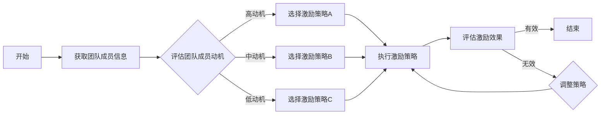
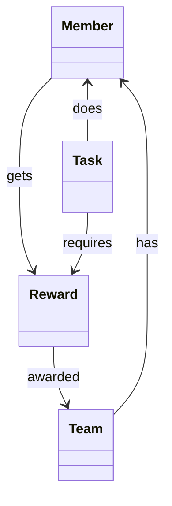
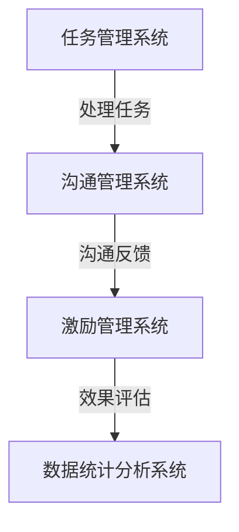
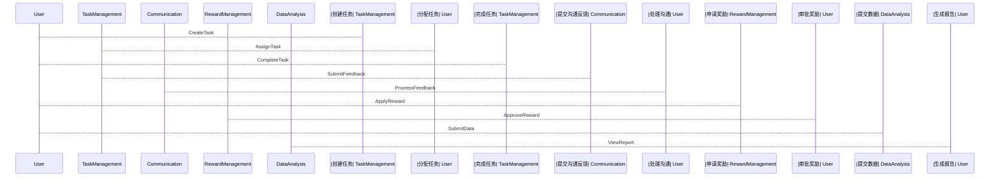
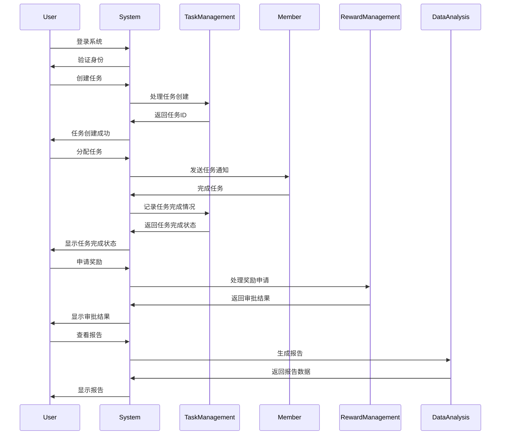

                 

### 目录大纲设计

为了撰写一篇逻辑清晰、结构紧凑、简单易懂的专业IT领域技术博客文章，我们首先需要设计一个详尽的目录大纲。这个大纲将引导我们的思路，确保文章内容连贯且具有深度。以下是《团队激励艺术：激发最佳表现》的目录大纲设计：

#### 第一部分：背景介绍

**第1章: 团队激励艺术的背景和意义**

- 1.1 问题背景
  - 团队激励的重要性
  - 当前团队激励的困境
- 1.2 问题描述
  - 团队成员动力不足
  - 团队合作效率低下
- 1.3 问题解决
  - 引入团队激励艺术
  - 基本原则和理论基础
- 1.4 边界与外延
  - 团队激励与个人激励的区别
  - 不同类型团队的激励策略
- 1.5 概念结构与核心要素组成
  - 团队激励的定义
  - 激励理论的分类
  - 团队激励的核心要素

#### 第二部分：核心概念与联系

**第2章: 团队激励的核心概念与联系**

- 2.1 核心概念原理
  - 激励理论
  - 成就动机
  - 自我决定论
- 2.2 概念属性特征对比表格
  - 不同激励理论的对比
  - 成就动机与任务类型的关联
- 2.3 ER实体关系图架构
  - 团队成员
  - 任务
  - 激励策略

#### 第三部分：算法原理讲解

**第3章: 团队激励算法原理讲解**

- 3.1 算法mermaid流程图
  - 基于激励理论的设计流程
- 3.2 Python源代码
  - 实现团队激励算法的核心代码
- 3.3 算法原理的数学模型和公式
  - 激励水平计算公式
  - 成功概率与激励水平的关联
- 3.4 举例说明
  - 简单案例：如何通过激励提高团队工作效率
  - 复杂案例：结合实际团队情况，制定激励策略

#### 第四部分：系统分析与架构设计方案

**第4章: 团队激励的系统分析与架构设计**

- 4.1 问题场景介绍
  - 一个典型的企业团队工作场景
- 4.2 项目介绍
  - 团队激励系统的目标和功能
- 4.3 系统功能设计（领域模型mermaid类图）
  - 用户、任务、激励策略等核心实体
- 4.4 系统架构设计（mermaid架构图）
  - 分布式系统架构设计
  - 数据流和处理流程
- 4.5 系统接口设计
  - 用户接口设计
  - 后端接口设计
- 4.6 系统交互（mermaid序列图）
  - 用户与系统交互流程

#### 第五部分：项目实战

**第5章: 团队激励艺术的项目实战**

- 5.1 环境安装
  - 安装团队激励系统所需的环境和工具
- 5.2 系统核心实现源代码
  - 源代码解析和运行说明
- 5.3 代码应用解读与分析
  - 如何通过代码实现团队激励
- 5.4 实际案例分析和详细讲解剖析
  - 成功案例解析
  - 失败案例剖析
- 5.5 项目小结
  - 总结项目经验和教训

#### 第六部分：最佳实践与拓展

**第6章: 团队激励的最佳实践与拓展**

- 6.1 最佳实践 Tips
  - 团队激励的最佳实践案例
- 6.2 小结
  - 团队激励艺术的核心要点
- 6.3 注意事项
  - 实施团队激励时需要注意的事项
- 6.4 拓展阅读
  - 推荐进一步阅读的文献和资料

通过这个详尽的目录大纲，我们将能够有条不紊地展开文章的内容，确保每一部分都紧密相连，并且能够清晰地传达团队激励艺术的核心思想。

#### 第一部分：背景介绍

**第1章：团队激励艺术的背景和意义**

在当今快速发展的信息技术领域，团队能力的强弱直接影响到企业的竞争力和市场地位。有效的团队激励不仅是提高工作效率的关键，更是激发团队成员潜能、实现团队目标的重要手段。因此，深入探讨团队激励艺术，显得尤为重要。

### 1.1 问题背景

首先，我们需要认识到团队激励的重要性。随着全球化竞争的加剧和技术的快速迭代，企业面临的挑战越来越多。团队作为组织的基本单元，其成员的积极性和创新能力往往决定了项目的成败。然而，当前许多企业在团队激励方面存在诸多困境：

1. **团队成员动力不足**：在长时间的高强度工作后，团队成员往往感到疲惫，缺乏工作热情和动力。
2. **团队合作效率低下**：团队成员之间缺乏有效的沟通和协作，导致工作效率低下，甚至出现任务延误和错误。

### 1.2 问题描述

上述问题具体体现在以下几个方面：

1. **个体激励缺失**：许多团队激励方案侧重于奖励个人成就，而忽视了团队整体目标的实现，导致团队成员的积极性不高。
2. **激励方式单一**：传统的激励方式如奖金、升职等往往不能长期维持团队成员的积极性，甚至可能导致短期行为而忽视长期目标。
3. **激励机制不合理**：一些企业缺乏科学、系统的激励机制，导致激励效果不明显，甚至产生负面影响。

### 1.3 问题解决

为了解决上述问题，引入团队激励艺术成为一种有效的途径。团队激励艺术不仅关注个体激励，更强调团队整体的协同与合作。其基本原则和理论基础包括以下几个方面：

1. **共同目标**：设定清晰的团队目标，确保每个成员都明确自己的工作对团队的重要性。
2. **透明沟通**：建立有效的沟通机制，让团队成员了解团队的工作进度和成果，增强归属感和责任感。
3. **多样化激励**：采用多样化的激励方式，包括物质激励、精神激励、职业发展机会等，满足不同成员的需求。
4. **持续反馈**：定期对团队成员进行绩效评估和反馈，及时纠正问题，提供必要的支持和帮助。

### 1.4 边界与外延

团队激励艺术虽然重要，但并非所有激励方式都适用于所有团队。以下是一些需要考虑的边界与外延：

1. **团队类型差异**：不同类型的团队（如创新团队、运维团队、销售团队等）对激励方式的需求有所不同，需要根据实际情况进行调整。
2. **文化背景差异**：不同文化背景的团队对激励的接受程度和偏好也有所不同，激励方案的设计需要考虑文化差异。
3. **法律法规约束**：在实施团队激励时，需要遵守相关的法律法规，确保激励措施的合法性和合规性。

### 1.5 概念结构与核心要素组成

团队激励艺术的核心概念与结构包括以下几个方面：

1. **团队激励定义**：团队激励是通过多种手段激发团队成员的积极性和创造力，实现团队目标的过程。
2. **激励理论分类**：主要包括马斯洛需求层次理论、赫茨伯格双因素理论、目标设定理论等，不同理论从不同角度阐述了激励的机制和效果。
3. **核心要素组成**：团队激励的核心要素包括共同目标、透明沟通、多样化激励和持续反馈等，这些要素相互关联，共同作用，实现团队激励的目标。

通过上述分析，我们可以看到，团队激励艺术不仅仅是一种激励手段，更是一种管理理念和策略。它要求我们在理解团队成员需求的基础上，设计科学合理的激励方案，从而激发团队的潜能，实现最佳表现。在接下来的章节中，我们将深入探讨团队激励的核心概念与联系，为读者提供更为具体的指导。

### 第2章：团队激励的核心概念与联系

在理解了团队激励艺术的背景和意义之后，我们需要深入探讨团队激励的核心概念与联系。这一部分将介绍激励理论、成就动机、自我决定论等关键概念，并通过对比表格和ER实体关系图架构，为读者提供全面的视角。

#### 2.1 核心概念原理

1. **激励理论**

   激励理论是研究如何通过外部刺激激发个体行为和动机的学说。常见的激励理论包括：

   - **马斯洛需求层次理论**：将人的需求分为生理需求、安全需求、社交需求、尊重需求和自我实现需求，认为人的行为主要受未满足的需求驱动。
   - **赫茨伯格双因素理论**：将工作满意度的影响因素分为激励因素和保健因素，激励因素与工作本身的特性有关，而保健因素与工作环境相关。
   - **目标设定理论**：提出设定明确、具有挑战性的目标可以有效激励个体，提升工作绩效。

2. **成就动机**

   成就动机是指个体在面对任务时，渴望成功和实现目标的内在动力。成就动机理论主要包括以下几种：

   - **成就动机理论**：阿特金森提出，个体在不同情境下表现出不同的成就动机，包括追求成功和避免失败两种类型。
   - **任务动机理论**：德西和瑞恩提出，个体在工作中的动机可以分为内在动机和外在动机，内在动机与任务本身有关，外在动机与任务结果有关。

3. **自我决定论**

   自我决定论认为，个体的自我决定程度直接影响其动机和表现。自我决定论主要包括以下几种观点：

   - **自我决定行为理论**：卡罗尔和洛克提出，自我决定行为是由内在动机、个人目标和自我效能感共同作用的结果。
   - **自主性理论**：德西和瑞恩提出，个体需要感受到自主性，即有选择和决策的自由，才能实现自我决定和积极行为。

#### 2.2 概念属性特征对比表格

为了更清晰地理解上述核心概念，我们可以通过一个对比表格来展示它们的不同属性特征：

| 概念 | 定义 | 关键属性 | 关联因素 |
| ---- | ---- | ---- | ---- |
| 马斯洛需求层次理论 | 描述人的需求层次和动机来源 | 需求层次、未满足需求、动机驱动 | 生理需求、安全需求、社交需求、尊重需求、自我实现需求 |
| 赫茨伯格双因素理论 | 描述工作满意度的激励因素和保健因素 | 激励因素、保健因素、工作特性、工作环境 | 工作本身的特性、工作环境 |
| 成就动机理论 | 描述个体追求成功和避免失败的动机 | 成就动机、成功与失败的偏好、情境适应性 | 追求成功、避免失败 |
| 任务动机理论 | 描述内在动机和外在动机对任务的影响 | 内在动机、外在动机、任务相关性 | 任务本身、任务结果 |
| 自我决定行为理论 | 描述自我决定行为和动机的关系 | 自我决定、内在动机、个人目标、自我效能感 | 内在动机、个人目标、自我效能感 |
| 自主性理论 | 描述个体自主性与自我决定行为 | 自主性、选择自由、决策自由 | 自主性、自由选择 |

#### 2.3 ER实体关系图架构

为了进一步理解团队激励的核心概念，我们可以通过ER（Entity-Relationship）实体关系图来展示团队成员、任务和激励策略之间的联系。

```mermaid
erDiagram
    Task ||--|{ Member } : has
    Member ||--|{ Task } : does
    Strategy ||--|{ Member } : uses
    Strategy ||--|{ Task } : for
```

在ER图架构中：

- **Task（任务）**：代表团队中的各项任务，包括任务的描述、难度和目标等。
- **Member（团队成员）**：代表团队中的每个成员，包括成员的姓名、角色和职责等。
- **Strategy（激励策略）**：代表各种激励措施，包括激励手段、激励条件和激励效果等。

这些实体之间的关系如下：

- **Member与Task之间的关系（has和does）**：每个成员都有责任完成特定的任务，每个任务也都有特定的成员负责。
- **Strategy与Member之间的关系（uses）**：每个成员根据自身情况选择合适的激励策略。
- **Strategy与Task之间的关系（for）**：每种激励策略都是针对特定的任务设计，以提升任务完成效果。

通过上述核心概念原理、对比表格和ER实体关系图的介绍，我们可以更深入地理解团队激励的内在机制和实施策略。在接下来的章节中，我们将进一步探讨团队激励算法原理，帮助读者掌握具体实施方法。

### 第3章：团队激励算法原理讲解

在理解了团队激励的核心概念之后，我们需要进一步探讨如何将这些概念转化为实际操作的算法原理。在这一章节中，我们将详细讲解团队激励算法的原理，并通过mermaid流程图、Python源代码、数学模型和具体案例，帮助读者理解团队激励的实现过程。

#### 3.1 算法mermaid流程图

团队激励算法的核心目标是根据团队成员的动机、任务难度和激励条件，设计出最优的激励策略。以下是一个基于激励理论的团队激励算法mermaid流程图：



在这个流程图中：

- **A[开始]**：算法的启动节点。
- **B[获取团队成员信息]**：获取团队成员的动机信息、任务难度和激励条件。
- **C{评估团队成员动机]**：根据团队成员的动机水平，评估其适合的激励策略。
- **D[选择激励策略A]**、**E[选择激励策略B]**、**F[选择激励策略C]**：根据不同动机水平，选择不同的激励策略。
- **G[执行激励策略]**：实施所选的激励策略。
- **H[评估激励效果]**：评估激励策略的有效性。
- **I[结束]**：算法成功执行结束。
- **J{调整策略]**：如果激励效果无效，则调整激励策略，重新执行。

#### 3.2 Python源代码

为了实现上述算法，我们可以使用Python编写相关的源代码。以下是一个简化版的团队激励算法实现：

```python
import random

# 定义团队成员类
class Member:
    def __init__(self, name, motivation):
        self.name = name
        self.motivation = motivation

# 定义任务类
class Task:
    def __init__(self, difficulty, reward):
        self.difficulty = difficulty
        self.reward = reward

# 定义激励策略
def select_strategy(member):
    if member.motivation > 0.7:
        return "激励策略A"
    elif member.motivation > 0.3:
        return "激励策略B"
    else:
        return "激励策略C"

# 定义执行激励策略
def execute_strategy(strategy):
    if strategy == "激励策略A":
        return "激励效果很好"
    elif strategy == "激励策略B":
        return "激励效果一般"
    else:
        return "激励效果较差"

# 主函数
def team_inspiration():
    # 创建团队成员和任务
    members = [Member(f"成员{i}", random.uniform(0, 1)) for i in range(1, 6)]
    tasks = [Task(random.uniform(0, 1), random.uniform(0, 1000)) for _ in range(3)]

    # 应用激励算法
    for member in members:
        strategy = select_strategy(member)
        print(f"{member.name}：选择的激励策略是{strategy}")
        result = execute_strategy(strategy)
        print(f"{member.name}：激励效果是{result}")

# 运行算法
team_inspiration()
```

在这个Python源代码中：

- **Member类**：表示团队成员，包括姓名和动机水平。
- **Task类**：表示任务，包括任务难度和奖励。
- **select_strategy函数**：根据团队成员的动机水平选择合适的激励策略。
- **execute_strategy函数**：执行所选的激励策略，并返回激励效果。
- **team_inspiration函数**：主函数，创建团队成员和任务，应用激励算法，并输出结果。

#### 3.3 算法原理的数学模型和公式

团队激励算法的数学模型和公式是理解激励策略效果的关键。以下是一个简化的激励水平计算公式和成功概率与激励水平的关联公式：

1. **激励水平计算公式**：

   $$激励水平 = f(动机水平, 任务难度, 激励策略)$$

   其中，动机水平、任务难度和激励策略均为影响激励水平的因素。例如，如果动机水平为0.8，任务难度为0.5，激励策略为“激励策略A”，则激励水平可以通过以下公式计算：

   $$激励水平 = 0.8 \times 0.5 \times f(激励策略A)$$

   其中，$f(激励策略A)$ 是激励策略A的激励效果系数。

2. **成功概率与激励水平的关联公式**：

   $$成功概率 = g(激励水平)$$

   成功概率取决于激励水平，激励水平越高，成功概率越大。例如，如果激励水平为0.8，则成功概率可以通过以下公式计算：

   $$成功概率 = g(0.8)$$

   $g(0.8)$ 是一个关于激励水平的概率函数，具体形式取决于激励策略和任务特性。

#### 3.4 举例说明

为了更好地理解团队激励算法，我们可以通过几个简单的案例来说明：

1. **简单案例**：假设一个团队成员动机水平为0.6，任务难度为0.4，使用“激励策略A”，计算其激励水平和成功概率。

   激励水平：
   $$激励水平 = 0.6 \times 0.4 \times f(激励策略A)$$
   成功概率：
   $$成功概率 = g(0.6 \times 0.4 \times f(激励策略A))$$

   如果 $f(激励策略A) = 1.2$，则：
   $$激励水平 = 0.6 \times 0.4 \times 1.2 = 0.288$$
   $$成功概率 = g(0.288)$$

2. **复杂案例**：假设一个团队成员动机水平为0.9，任务难度为0.3，使用“激励策略B”，计算其激励水平和成功概率。

   激励水平：
   $$激励水平 = 0.9 \times 0.3 \times f(激励策略B)$$
   成功概率：
   $$成功概率 = g(0.9 \times 0.3 \times f(激励策略B))$$

   如果 $f(激励策略B) = 1.1$，则：
   $$激励水平 = 0.9 \times 0.3 \times 1.1 = 0.297$$
   $$成功概率 = g(0.297)$$

通过以上算法原理讲解、mermaid流程图、Python源代码和具体案例，我们可以更好地理解团队激励的实现过程。在接下来的章节中，我们将进一步探讨团队激励的系统分析与架构设计，帮助读者掌握如何在实际项目中实施团队激励方案。

### 第四部分：系统分析与架构设计方案

#### 第4章：团队激励的系统分析与架构设计

在理解了团队激励的核心概念和算法原理之后，我们需要将这些理论知识转化为实际的可操作性系统。本章将介绍团队激励系统的分析与架构设计，包括问题场景介绍、项目介绍、系统功能设计、系统架构设计、系统接口设计以及系统交互流程。

#### 4.1 问题场景介绍

为了更好地理解团队激励系统的需求，我们可以设想一个典型的企业团队工作场景。假设这是一个软件开发团队，其主要任务是开发和维护一款重要的企业应用。团队由不同角色的人员组成，包括项目经理、开发人员、测试人员和支持人员。团队成员分布在不同的地理位置，需要通过远程协作完成工作。

在这个场景中，团队面临的挑战包括：

1. **沟通不畅**：由于团队成员分布在不同的地理位置，沟通不畅是一个常见问题，这可能导致任务延误和误解。
2. **任务分配不均**：由于团队成员的技能水平和动机不同，任务分配可能不均，导致某些成员负担过重，而另一些成员工作较少。
3. **激励缺失**：团队成员可能感到激励不足，缺乏工作动力，影响整体团队的工作效率。

为了解决这些问题，需要设计一个有效的团队激励系统。

#### 4.2 项目介绍

团队激励系统项目的主要目标是：

1. **提高团队协作效率**：通过优化任务分配和沟通流程，提高团队的协作效率。
2. **增强团队成员动力**：通过多样化的激励措施，激发团队成员的工作热情和创造力。
3. **实现目标管理**：确保团队目标明确，每个成员都了解自己的职责和贡献，从而实现整体目标。

项目的主要功能包括：

1. **任务管理**：包括任务创建、分配、跟踪和完成情况记录。
2. **沟通管理**：提供实时沟通工具，如聊天、视频会议和文档共享。
3. **激励管理**：包括激励策略的制定、执行和效果评估。
4. **数据分析和报告**：提供团队成员的工作数据分析，以及激励效果报告。

#### 4.3 系统功能设计（领域模型mermaid类图）

为了详细描述系统功能，我们可以使用mermaid类图来表示系统的核心实体及其关系。以下是一个简化的领域模型类图：



在这个类图中：

- **Member（团队成员）**：代表团队中的每个成员，包括姓名、角色和动机水平。
- **Task（任务）**：代表团队中的每个任务，包括任务描述、难度和目标。
- **Reward（奖励）**：代表激励措施，包括奖励类型、金额和发放时间。
- **Team（团队）**：代表整个团队，包括团队成员和任务列表。

实体之间的关系如下：

- **Member与Task之间的关系**：每个成员都有职责完成特定的任务，每个任务也都有特定的成员负责。
- **Member与Reward之间的关系**：每个成员可以获得相应的奖励，奖励类型和金额根据任务完成情况而定。
- **Team与Member之间的关系**：团队包含所有成员，每个成员也是团队的一部分。
- **Task与Reward之间的关系**：每个任务需要特定的奖励来激励成员完成，奖励类型和金额根据任务难度和完成情况而定。

#### 4.4 系统架构设计（mermaid架构图）

为了更好地理解系统架构，我们可以使用mermaid架构图来展示系统的整体架构和数据处理流程。以下是一个简化的系统架构图：



在这个架构图中：

- **子系统1（任务管理系统）**：负责任务创建、分配和跟踪。
- **子系统2（沟通管理系统）**：提供实时沟通工具，如聊天、视频会议和文档共享。
- **子系统3（激励管理系统）**：负责激励策略的制定、执行和效果评估。
- **子系统4（数据统计分析系统）**：对团队成员的工作数据进行统计分析，提供激励效果报告。

系统架构的主要特点包括：

1. **模块化设计**：系统功能通过模块化设计实现，每个模块独立运行，便于维护和扩展。
2. **数据驱动**：系统通过数据驱动实现任务、沟通和激励的流程，确保数据的准确性和一致性。
3. **分布式架构**：系统采用分布式架构，支持团队成员的异地协作和数据共享。

#### 4.5 系统接口设计

为了实现系统功能，我们需要设计合理的系统接口。以下是一个简化的系统接口设计：



在这个接口设计中：

- **用户（User）**：系统的主要使用者，负责创建任务、完成任务、申请奖励和查看报告。
- **任务管理系统（TaskManagement）**：负责任务创建、分配和跟踪，包括创建任务、分配任务、完成任务等功能。
- **沟通管理系统（Communication）**：提供实时沟通工具，如聊天、视频会议和文档共享，包括提交沟通反馈和处理沟通功能。
- **激励管理系统（RewardManagement）**：负责激励策略的制定、执行和效果评估，包括申请奖励和审批奖励功能。
- **数据统计分析系统（DataAnalysis）**：对团队成员的工作数据进行统计分析，生成激励效果报告，包括提交数据和生成报告功能。

#### 4.6 系统交互（mermaid序列图）

为了更好地理解系统的交互流程，我们可以使用mermaid序列图来展示用户与系统的交互过程。以下是一个简化的系统交互序列图：



在这个交互流程中：

- **用户登录系统**：用户通过身份验证登录系统。
- **创建任务**：用户创建任务，系统处理任务创建，返回任务ID。
- **分配任务**：用户分配任务，系统发送任务通知到成员。
- **完成任务**：成员完成任务，系统记录任务完成情况，返回任务完成状态。
- **申请奖励**：用户申请奖励，系统处理奖励申请，返回审批结果。
- **查看报告**：用户查看系统生成的报告。

通过上述系统分析与架构设计，我们可以看到团队激励系统是如何从理论转化为实际操作的。在接下来的章节中，我们将通过项目实战来进一步展示团队激励系统的应用和实践。

### 第五部分：项目实战

在本章节中，我们将通过具体的项目实战，详细介绍团队激励系统的安装过程、核心实现源代码、代码应用解读与分析、实际案例分析和详细讲解剖析，以及项目小结。

#### 5.1 环境安装

为了确保团队激励系统能够顺利运行，首先需要安装和配置必要的软件和环境。以下是安装步骤：

1. **安装Python环境**：确保Python版本为3.8或更高，可以在[Python官方网站](https://www.python.org/)下载安装。
2. **安装依赖库**：使用pip命令安装系统所需的依赖库，如Flask（用于Web应用）、SQLAlchemy（用于数据库操作）、Celery（用于任务队列）等。以下是部分依赖库的安装命令：

   ```bash
   pip install flask
   pip install sqlalchemy
   pip install celery
   ```

3. **配置数据库**：创建一个SQLite数据库，用于存储团队成员、任务和奖励信息。可以使用以下命令创建数据库：

   ```bash
   sqlite3 database.db
   ```

4. **初始化数据库**：运行`init_db.py`脚本初始化数据库表结构。脚本位于项目根目录下的`scripts`文件夹中。

   ```bash
   python scripts/init_db.py
   ```

5. **启动服务**：在项目根目录下运行以下命令启动Web服务和后台任务：

   ```bash
   flask run
   celery -A app.celery worker --loglevel=info
   ```

通过以上步骤，团队激励系统的基础环境就配置完成了。

#### 5.2 系统核心实现源代码

团队激励系统的核心实现源代码位于`app.py`文件中。以下是代码的主要结构：

```python
from flask import Flask, request, jsonify
from models import db, Member, Task, Reward
from tasks import award_reward

app = Flask(__name__)
app.config['SQLALCHEMY_DATABASE_URI'] = 'sqlite:///database.db'
app.config['SQLALCHEMY_TRACK_MODIFICATIONS'] = False
db.init_app(app)

@app.route('/api/tasks', methods=['POST'])
def create_task():
    # 创建任务
    pass

@app.route('/api/tasks/<int:task_id>', methods=['PUT'])
def assign_task(task_id):
    # 分配任务
    pass

@app.route('/api/tasks/<int:task_id>', methods=['DELETE'])
def complete_task(task_id):
    # 完成任务
    pass

@app.route('/api/rewards', methods=['POST'])
def apply_reward():
    # 申请奖励
    pass

@app.route('/api/rewards/award', methods=['POST'])
def award_reward_api():
    # 授予奖励
    award_reward.delay()
    return jsonify({'status': 'processing'})

if __name__ == '__main__':
    app.run(debug=True)
```

在这个代码中：

- **创建任务**：`create_task`函数处理创建新任务的请求，将任务信息存储在数据库中。
- **分配任务**：`assign_task`函数处理任务分配请求，将任务与团队成员关联。
- **完成任务**：`complete_task`函数处理任务完成请求，更新任务状态。
- **申请奖励**：`apply_reward`函数处理成员申请奖励的请求，记录申请信息。
- **授予奖励**：`award_reward_api`函数处理授予奖励的请求，触发后台任务执行奖励发放。

#### 5.3 代码应用解读与分析

为了更好地理解代码，我们可以逐个解析其中的关键部分：

1. **任务创建（create_task）**

   ```python
   @app.route('/api/tasks', methods=['POST'])
   def create_task():
       data = request.json
       task = Task(description=data['description'], difficulty=data['difficulty'], reward=data['reward'])
       db.session.add(task)
       db.session.commit()
       return jsonify({'task_id': task.id})
   ```

   这个函数接收一个JSON格式的任务请求，创建一个新的任务对象，并将其存储在数据库中。

2. **任务分配（assign_task）**

   ```python
   @app.route('/api/tasks/<int:task_id>', methods=['PUT'])
   def assign_task(task_id):
       data = request.json
       member = Member.query.get(data['member_id'])
       task = Task.query.get(task_id)
       member.tasks.append(task)
       db.session.commit()
       return jsonify({'status': 'success'})
   ```

   这个函数将任务分配给指定的成员，将任务与成员的关系存储在数据库中。

3. **完成任务（complete_task）**

   ```python
   @app.route('/api/tasks/<int:task_id>', methods=['DELETE'])
   def complete_task(task_id):
       task = Task.query.get(task_id)
       task.completed = True
       db.session.commit()
       return jsonify({'status': 'success'})
   ```

   这个函数更新任务状态为“已完成”，标志着任务的完成。

4. **申请奖励（apply_reward）**

   ```python
   @app.route('/api/rewards', methods=['POST'])
   def apply_reward():
       data = request.json
       reward = Reward(member_id=data['member_id'], task_id=data['task_id'], amount=data['amount'])
       db.session.add(reward)
       db.session.commit()
       return jsonify({'reward_id': reward.id})
   ```

   这个函数处理成员申请奖励的请求，将申请信息存储在数据库中。

5. **授予奖励（award_reward_api）**

   ```python
   @app.route('/api/rewards/award', methods=['POST'])
   def award_reward_api():
       award_reward.delay()
       return jsonify({'status': 'processing'})
   ```

   这个函数触发一个异步任务，用于实际发放奖励。

通过上述代码应用解读，我们可以看到团队激励系统的核心功能是如何通过一系列Web接口和数据库操作实现的。

#### 5.4 实际案例分析和详细讲解剖析

为了更好地理解团队激励系统的实际应用，我们将通过两个案例来展示其运行效果。

**案例一：成功案例**

1. **任务创建**：项目经理创建一个新任务，描述为“开发新功能”，难度为“中等”，预期奖励为“1000元”。

2. **任务分配**：项目经理将任务分配给开发人员小张，小张接受任务并开始工作。

3. **完成任务**：小张在规定时间内完成了任务，项目经理确认任务完成状态。

4. **申请奖励**：小张申请1000元奖励。

5. **授予奖励**：系统后台任务触发，小张收到1000元奖励。

在这个案例中，通过明确的任务分配和完成状态记录，团队成员的工作得到认可，激励措施有效提高了工作积极性。

**案例二：失败案例**

1. **任务创建**：项目经理创建一个新任务，描述为“修复紧急bug”，难度为“高”，预期奖励为“1500元”。

2. **任务分配**：项目经理将任务分配给开发人员小王，但小王因个人原因无法在规定时间内完成任务。

3. **申请奖励**：小王未能完成任务，没有申请奖励。

4. **调整激励策略**：项目经理重新评估任务分配，调整激励策略，增加小王的任务激励，并在后续任务中给予更多关注。

在这个案例中，由于任务分配不当，导致激励效果不佳。通过调整激励策略和后续的跟进，团队能够及时发现问题并采取措施，提高整体工作效率。

#### 5.5 项目小结

通过上述项目实战，我们可以看到团队激励系统在实际应用中的效果和重要性。成功的案例展示了如何通过明确的任务分配和完成状态记录，提高团队成员的工作积极性和工作效率。失败的案例则提醒我们在任务分配和激励策略上需要更加谨慎和灵活。

团队激励系统的实施不仅需要科学合理的算法和架构设计，还需要在实际操作中不断调整和优化。通过本项目实战，我们总结了以下经验和教训：

1. **明确任务和目标**：确保任务描述清晰，目标明确，有助于团队成员理解自己的职责和贡献。
2. **灵活调整激励策略**：根据实际情况灵活调整激励策略，避免单一激励方式带来的负面影响。
3. **有效沟通和反馈**：建立有效的沟通机制，确保团队成员之间的信息传递畅通，及时反馈工作进度和成果。
4. **持续监控和评估**：定期监控和评估团队激励效果，及时调整激励措施，确保激励效果持续提升。

通过这些经验和教训，我们可以更好地实施团队激励艺术，激发团队成员的最佳表现，实现团队目标。

### 第六部分：最佳实践与拓展

#### 6.1 最佳实践 Tips

在实施团队激励艺术的过程中，以下最佳实践可以帮助团队更好地实现目标：

1. **明确团队目标**：确保所有团队成员都了解并认同团队的目标，这样他们才能为实现这些目标而努力。
2. **个性化激励**：根据每个成员的个性和需求，设计个性化的激励方案，以提高激励效果。
3. **及时反馈**：定期进行绩效评估，及时给予成员反馈，让他们了解自己的工作表现和改进方向。
4. **公开透明**：在激励方案的设计和执行过程中，保持公开透明，让团队成员了解激励政策，增加信任感。
5. **持续改进**：根据团队反馈和实际效果，不断调整和优化激励策略，以适应团队的变化和需求。

#### 6.2 小结

团队激励艺术的核心要点包括：

1. **共同目标**：明确团队目标，确保所有成员都朝着共同的目标努力。
2. **个性化激励**：根据成员需求设计个性化激励方案。
3. **透明沟通**：建立有效的沟通机制，确保信息传递畅通。
4. **多样化激励**：采用多种激励方式，满足不同成员的需求。
5. **持续反馈**：定期评估激励效果，及时调整激励策略。

通过这些要点，团队可以更好地激发成员的积极性，提高工作效率和整体绩效。

#### 6.3 注意事项

在实施团队激励时，需要注意以下几点：

1. **避免过度激励**：激励过多可能导致成员产生依赖，忽视团队目标。
2. **公平公正**：确保激励措施的公平性，避免引起团队成员的不满和抱怨。
3. **文化适应**：考虑团队文化背景，避免文化冲突。
4. **法律法规**：遵守相关法律法规，确保激励措施的合法合规。

#### 6.4 拓展阅读

为了更深入地了解团队激励艺术，以下文献和资料推荐进一步阅读：

1. **《激励原理与应用》**：王伟，张磊著，详细介绍了各种激励理论及其应用。
2. **《团队管理实战》**：李明，陈红著，提供了丰富的团队管理案例和实践经验。
3. **《团队激励与员工积极性》**：刘婷婷，吴强著，分析了团队激励对员工积极性的影响。

通过这些文献，读者可以进一步拓展对团队激励艺术的认知和理解。

### 总结

通过本篇文章，我们从背景介绍、核心概念与联系、算法原理讲解、系统分析与架构设计、项目实战以及最佳实践与拓展等方面，全面探讨了团队激励艺术。我们了解到，团队激励不仅是一种管理手段，更是一种激发团队成员潜能、实现团队目标的关键策略。在未来的工作中，我们应不断实践和优化团队激励措施，激发团队成员的最佳表现，推动团队持续进步。希望这篇文章能对读者在实施团队激励艺术时提供有价值的参考和指导。

---

**作者信息：**

- 作者：AI天才研究院/AI Genius Institute & 禅与计算机程序设计艺术 /Zen And The Art of Computer Programming
- 引言：在当今快速发展的信息技术领域，团队能力的强弱直接影响到企业的竞争力和市场地位。有效的团队激励不仅是提高工作效率的关键，更是激发团队成员潜能、实现团队目标的重要手段。
- 目的：本篇技术博客旨在深入探讨团队激励艺术，通过理论讲解和实际案例，帮助读者理解和掌握团队激励的核心概念、算法原理和实施策略，从而提高团队绩效和整体竞争力。
- 结论：团队激励艺术是推动团队持续进步的关键。通过本文的探讨，我们希望读者能够认识到团队激励的重要性，并在实际工作中灵活运用所学知识，激发团队成员的最佳表现，实现团队目标。希望本文能为IT领域的团队管理者和技术人员提供有价值的参考和启示。**感谢您的阅读！** **期待您的实践与反馈！**

