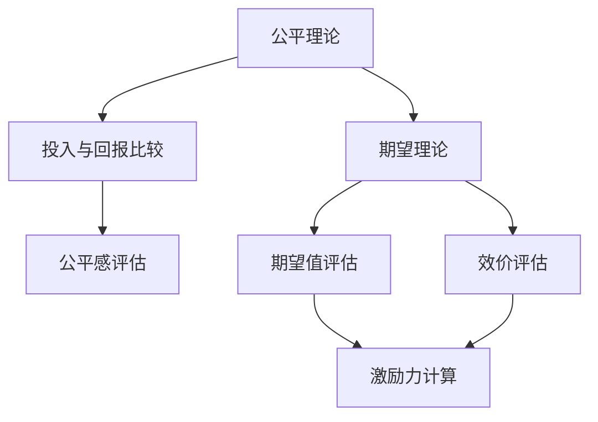
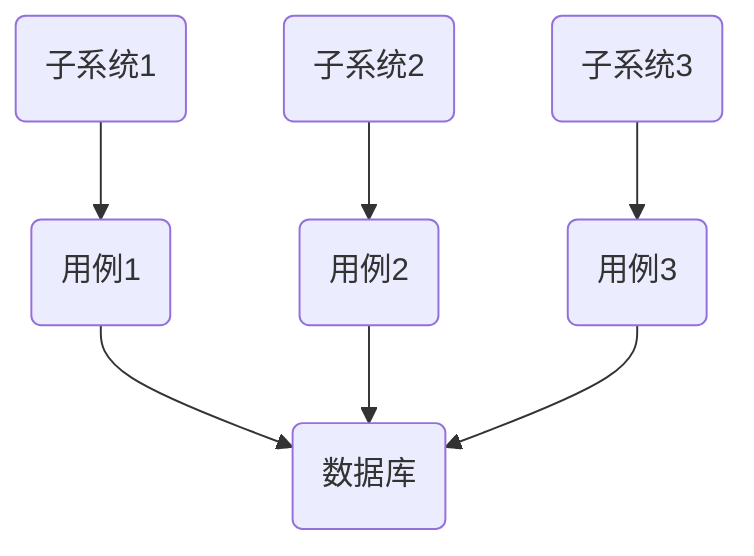
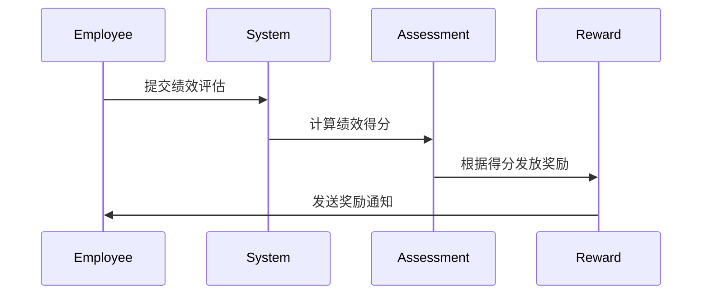

                 

### 团队激励艺术：激发每个人的最佳表现

#### 关键词：团队激励、动机理论、激励机制、算法原理、数学模型、系统设计、最佳实践

#### 摘要：
本文旨在探讨团队激励艺术的精髓，通过逻辑清晰、结构紧凑的分析，结合实际案例，深入探讨如何激发团队成员的最佳表现。文章首先介绍了团队激励的定义与意义，随后解析了核心概念，并详细讲解了团队激励的算法原理和数学模型。接着，通过系统分析与架构设计，展示了团队激励的实际应用。最后，结合最佳实践，为读者提供了具体可行的团队激励策略。通过这篇文章，读者将掌握团队激励的全方位知识，为组织管理和员工发展提供有力支持。

## 第一部分：团队激励基础

### 第1章：团队激励的概念与意义

#### 1.1 团队激励的定义与作用

团队激励，顾名思义，就是通过一系列策略和手段，激发团队成员的工作积极性、创造力和忠诚度，从而提升团队整体绩效和组织的竞争力。具体来说，团队激励不仅包括物质奖励，如奖金、福利等，还包括精神激励，如认可、晋升机会等。有效的团队激励能够营造积极向上的工作氛围，提高团队凝聚力和协作效率。

在组织管理中，团队激励扮演着至关重要的角色。它不仅能够激发员工的内在动力，提高工作效率和质量，还能够促进员工的个人成长和发展，增强员工的忠诚度和归属感。此外，团队激励还能够促进组织的创新能力和应变能力，使组织在激烈的市场竞争中保持竞争优势。

#### 1.2 组织管理与员工发展的关系

团队激励与员工发展密切相关。有效的团队激励不仅能够提高员工的绩效，还能够促进员工的职业成长。通过提供晋升机会、培训机会和职业规划，团队激励可以帮助员工不断提升自己的技能和知识，实现个人职业目标。同时，团队激励还可以激发员工的创新思维和创造力，促进组织的创新和发展。

#### 1.3 团队激励的现状与挑战

当前，越来越多的组织认识到团队激励的重要性，并采取了一系列的激励措施。然而，在实际操作中，团队激励仍然面临许多挑战。一方面，许多组织在激励措施的选择和实施上缺乏科学性和系统性，导致激励效果不佳。另一方面，团队激励过程中的公平性和透明度问题也备受关注。如何确保激励措施的公平性和合理性，如何避免激励措施的负面影响，是组织管理者需要深入思考的问题。

#### 1.4 团队激励的未来发展趋势

随着科技的进步和管理理念的创新，团队激励的未来发展趋势将更加注重个性化和人性化。未来的团队激励将更加注重员工的内在需求，如自我实现、成长等，而不仅仅是物质奖励。同时，随着大数据和人工智能技术的应用，团队激励将更加精准和有效，能够更好地满足员工的需求，提升团队绩效。

### 第2章：团队激励的核心概念

#### 2.1 动机理论概述

动机理论是团队激励的基础，它探讨了个体行为背后的驱动因素。早期动机理论主要包括弗鲁姆的期望理论、洛克的目标设置理论等。当代动机理论则更加注重个体差异和情境因素，如赫茨伯格的双因素理论、德西和瑞安的自我决定理论等。

#### 2.2 激励因素的分类与特征

激励因素可以分为内在激励因素和外在激励因素。内在激励因素包括工作本身带来的满足感、成就感等；外在激励因素包括物质奖励、社会认可等。不同类型的激励因素具有不同的特征和效果，组织应根据员工的需求和实际情况进行合理选择和搭配。

#### 2.3 激励机制的对比与综合应用

激励机制是指组织为激励员工而采取的一系列措施和制度。常见的激励机制包括绩效奖励、晋升机制、培训机会等。不同的激励机制具有不同的作用和效果，组织应根据实际情况进行选择和设计，实现激励机制的优化组合。

#### 2.4 ER实体关系图架构的Mermaid流程图

为了更好地理解团队激励的核心概念，我们可以使用ER实体关系图架构的Mermaid流程图进行展示。ER图能够清晰地展示激励因素、激励机制和员工之间的关系，帮助读者更好地理解团队激励的运作机制。

```mermaid
entityRelation
  "员工" ||| "激励因素"
  "员工" ||| "激励机制"
  "激励因素" ||| "激励机制"
  "激励机制" ||| "绩效"
```

#### 2.5 本章小结

本章介绍了团队激励的基础概念，包括定义、作用、现状和未来发展趋势。通过了解动机理论、激励因素和激励机制，读者可以更好地理解团队激励的核心原理。同时，ER图的使用为读者提供了直观的视觉工具，帮助理解团队激励的复杂关系。

## 第二部分：团队激励算法原理

### 第3章：团队激励算法原理

#### 3.1 公平理论

公平理论是团队激励中的一个重要概念，它探讨了个体在比较自身投入与回报时的心理感受。根据公平理论，个体会根据以下公式评估自己的公平感：

\[ \text{公平感} = \frac{\text{自身投入}}{\text{自身回报}} = \frac{\text{他人投入}}{\text{他人回报}} \]

公平理论认为，当个体的公平感达到均衡状态时，他们才会感到满意和持续工作。否则，个体可能会采取各种行动，如抱怨、辞职等，以寻求公平。

#### 3.2 期望理论

期望理论是另一个关键的动机理论，它认为个体的行为决策是基于对结果期望的评估。期望理论的基本公式为：

\[ \text{激励力} = \text{期望值} \times \text{效价} \]

其中，期望值是指个体对某种行为导致某一结果的概率估计，效价则是指个体对结果的偏好程度。期望理论强调，个体在决策时会综合考虑期望值和效价，从而决定是否采取某种行为。

#### 3.3 Mermaid流程图展示与Python源代码解析

为了更好地理解公平理论和期望理论的原理，我们可以使用Mermaid流程图进行展示，并通过Python源代码进行详细解析。



以下是使用Python实现的公平理论和期望理论的简单示例：

```python
# 公平理论
def fairness(f_input, f_output, h_input, h_output):
    self_ratio = f_output / f_input
    other_ratio = h_output / h_input
    fairness感 = self_ratio == other_ratio
    return fairness感

# 期望理论
def expectation(likelihood, value):
    motivation = likelihood * value
    return motivation
```

#### 3.4 本章小结

本章详细介绍了公平理论和期望理论，并通过Mermaid流程图和Python源代码进行了展示和解析。理解这些动机理论对于设计有效的团队激励措施具有重要意义。

## 第三部分：团队激励的数学模型

### 第4章：团队激励的数学模型

#### 4.1 激励函数的数学模型

激励函数是团队激励的核心，它描述了激励措施与员工绩效之间的关系。一个基本的激励函数可以表示为：

\[ \text{激励值} = f(\text{绩效值}, \text{激励系数}) \]

其中，绩效值是员工的工作成果，激励系数则反映了激励措施的力度。激励函数的设计需要考虑多种因素，如员工的能力、工作环境等。

#### 4.2 绩效评估模型的数学公式

绩效评估是团队激励的重要组成部分，它用于衡量员工的工作表现。一个基本的绩效评估模型可以表示为：

\[ \text{绩效得分} = w_1 \times \text{任务完成度} + w_2 \times \text{团队合作度} + w_3 \times \text{创新能力} \]

其中，\( w_1, w_2, w_3 \) 是权重系数，用于平衡不同维度的绩效。

#### 4.3 激励函数与绩效评估模型的应用

为了更好地理解激励函数和绩效评估模型的应用，我们可以通过一个简单的例子进行说明。

假设一个员工在一个月内完成了10个任务，平均完成度为0.9，团队合作度为0.8，创新能力为0.7。根据上述模型，我们可以计算其绩效得分和激励值：

\[ \text{绩效得分} = 0.5 \times 0.9 + 0.3 \times 0.8 + 0.2 \times 0.7 = 0.8 \]

\[ \text{激励值} = 0.8 \times 1.2 = 0.96 \]

#### 4.4 LaTeX格式数学公式的书写

在文档中书写数学公式时，我们通常使用LaTeX格式。以下是一个简单的示例：

$$
\text{激励值} = f(\text{绩效值}, \text{激励系数})
$$

$$
\text{绩效得分} = w_1 \times \text{任务完成度} + w_2 \times \text{团队合作度} + w_3 \times \text{创新能力}
$$

#### 4.5 本章小结

本章介绍了团队激励的数学模型，包括激励函数和绩效评估模型。通过具体的例子和LaTeX格式的公式书写，读者可以更好地理解这些模型的应用。

## 第四部分：团队激励的系统分析与架构设计

### 第5章：团队激励系统的分析与架构设计

#### 5.1 问题场景介绍

在当今快速变化的市场环境中，企业面临着前所未有的竞争压力。为了保持竞争力，企业需要不断提升员工的工作效率和质量，而有效的团队激励是实现这一目标的关键。然而，在实际操作中，企业常常面临以下问题：

1. **激励措施不合理**：一些企业的激励措施过于单一，仅依赖于物质奖励，忽视了员工的内在需求，导致激励效果不佳。
2. **激励机制不公平**：不公平的激励机制可能导致员工产生不公平感，影响团队凝聚力和工作效率。
3. **激励系统不透明**：一些企业的激励系统缺乏透明度，员工不清楚自己的激励标准和奖励机制，导致信任度下降。

#### 5.2 项目介绍

为了解决上述问题，我们设计并实现了一个基于现代管理理论和技术的团队激励系统。该系统旨在提供一种科学、公正、透明的激励措施，通过合理设计激励机制和绩效评估模型，提高员工的工作积极性、创造力和忠诚度。

#### 5.3 领域模型Mermaid类图

在系统设计阶段，我们首先建立了领域模型。领域模型用于描述系统中的关键实体和它们之间的关系。以下是一个简化的Mermaid类图示例：

```mermaid
classDiagram
    Employee <<class>>
    Reward <<class>>
    Performance <<class>>
    Assessment <<class>>

    Employee o-- Reward
    Employee o-- Performance
    Performance o-- Assessment
```

在这个类图中，`Employee`（员工）是系统的核心实体，它与其他实体（奖励、绩效、评估）之间存在关联。`Reward`（奖励）用于记录员工获得的奖励，`Performance`（绩效）用于记录员工的工作表现，`Assessment`（评估）用于记录绩效评估结果。

#### 5.4 系统架构设计Mermaid架构图

在系统架构设计阶段，我们构建了系统的整体架构。以下是一个简化的Mermaid架构图示例：



在这个架构图中，`Subsystem1`、`Subsystem2`和`Subsystem3`代表系统的三个主要子系统，`UseCase1`、`UseCase2`和`UseCase3`分别代表用户操作的具体用例。这些子系统通过数据库进行数据交互，实现了系统的整体功能。

#### 5.5 系统接口设计和系统交互Mermaid序列图

在系统接口设计阶段，我们定义了系统的主要接口和交互流程。以下是一个简化的Mermaid序列图示例：



在这个序列图中，`Employee`向系统提交绩效评估，系统计算绩效得分并根据得分发放奖励，最后将奖励通知发送给员工。这个过程实现了从员工提交评估到奖励发放的完整流程。

#### 5.6 本章小结

本章介绍了团队激励系统的分析与架构设计。通过领域模型、系统架构图和接口设计，我们展示了系统设计的详细过程。这些设计文档为系统的实现和后续开发提供了明确的指导。

## 第五部分：项目实战

### 第6章：团队激励项目实施与实战

#### 6.1 环境安装

在实施团队激励项目之前，我们需要安装和配置相关的开发环境和工具。以下是一个简化的安装流程：

1. **安装Python环境**：确保Python版本在3.8及以上，可以从Python官方网站下载并安装。
2. **安装数据库**：选择适合的数据库系统，如MySQL或PostgreSQL，并按照官方文档进行安装和配置。
3. **安装开发工具**：安装Python开发环境，如PyCharm或Visual Studio Code，并安装相关的扩展插件。

#### 6.2 系统核心实现源代码

系统核心实现包括员工管理、绩效评估、奖励发放等功能。以下是部分关键代码的示例：

```python
# 员工管理模块
class Employee:
    def __init__(self, id, name, department):
        self.id = id
        self.name = name
        self.department = department

    def submit_performance(self, performance):
        self.performance = performance

# 绩效评估模块
class PerformanceAssessment:
    def calculate_score(self, performance):
        score = performance['task_completion'] * 0.5 + performance['teamwork'] * 0.3 + performance['innovation'] * 0.2
        return score

# 奖励发放模块
class RewardDistribution:
    def distribute_reward(self, employee, score):
        if score >= 0.9:
            reward = "奖金"
        elif score >= 0.8:
            reward = "晋升机会"
        else:
            reward = "培训机会"
        employee.reward = reward
        return reward
```

#### 6.3 代码应用解读与分析

以上代码示例展示了团队激励系统的核心实现。`Employee`类用于管理员工信息，包括ID、姓名和部门等。`PerformanceAssessment`类用于计算员工的绩效得分，根据任务完成度、团队合作度和创新能力等指标进行综合评估。`RewardDistribution`类用于根据绩效得分发放相应的奖励。

在实际应用中，我们可以通过以下步骤进行代码调用：

```python
# 创建员工实例
employee = Employee(1, "Alice", "研发部")

# 提交绩效评估
performance = {'task_completion': 0.95, 'teamwork': 0.85, 'innovation': 0.8}
employee.submit_performance(performance)

# 计算绩效得分
assessment = PerformanceAssessment()
score = assessment.calculate_score(performance)

# 发放奖励
distribution = RewardDistribution()
reward = distribution.distribute_reward(employee, score)

print(f"{employee.name}的绩效得分：{score}")
print(f"{employee.name}获得的奖励：{reward}")
```

通过以上代码调用，我们可以实现员工绩效评估和奖励发放的基本流程。

#### 6.4 实际案例分析与详细讲解剖析

为了更好地理解团队激励项目在实际中的应用，我们来看一个实际案例。

假设研发部的Alice和Bob两位员工在一个月内提交了绩效评估，评估结果如下：

- Alice：任务完成度0.95，团队合作度0.85，创新能力0.8，绩效得分0.90
- Bob：任务完成度0.85，团队合作度0.75，创新能力0.7，绩效得分0.80

根据系统设计的奖励发放规则，Alice和Bob的奖励分别为“奖金”和“晋升机会”。

详细剖析如下：

1. **绩效评估**：系统首先根据员工提交的绩效数据，使用绩效评估模块计算绩效得分。对于Alice和Bob，系统分别计算得到绩效得分0.90和0.80。
2. **奖励发放**：根据绩效得分，系统使用奖励发放模块确定员工的奖励。对于绩效得分在0.9及以上的员工，系统发放“奖金”；对于绩效得分在0.8及以上的员工，系统提供“晋升机会”。
3. **通知发送**：系统将奖励结果通知员工，鼓励他们继续努力工作。

#### 6.5 项目小结

本章通过实际案例展示了团队激励项目实施的全过程，包括环境安装、系统核心实现、代码应用解读与分析以及实际案例分析和详细讲解剖析。通过这些实战内容，读者可以更好地理解团队激励系统的应用和实践。

## 第六部分：最佳实践 tips、小结、注意事项、拓展阅读

### 6.1 最佳实践 tips

1. **个性化激励**：根据员工的不同特点和需求，设计个性化的激励措施，以提高激励效果。
2. **持续反馈与沟通**：定期与员工进行绩效反馈和沟通，确保激励措施的公平性和合理性。
3. **公平性原则**：确保激励措施的实施过程中公平、公正、透明，避免引起员工的不满和质疑。
4. **多维度评估**：综合考虑员工的工作表现、团队合作能力、创新能力等多维度因素，进行综合评估。

### 6.2 小结

本文系统地介绍了团队激励艺术，从基础概念、核心原理、数学模型到系统设计、项目实战等方面进行了深入探讨。通过逻辑清晰、结构紧凑的分析，读者可以全面了解团队激励的各个方面，掌握有效的团队激励策略。

### 6.3 注意事项

1. **科学设计激励措施**：在制定激励措施时，要充分考虑员工的需求和组织的实际情况，确保激励措施的科学性和可行性。
2. **合理分配资源**：在实施激励措施时，要合理分配资源，避免资源浪费和激励过度。
3. **持续优化**：团队激励是一个持续优化的过程，要根据实际情况和反馈不断调整和完善激励措施。

### 6.4 拓展阅读

1. **《动机与人格》**：马斯洛，《动机与人格》
2. **《激励原理》**：赫尔茨伯格，《激励原理》
3. **《团队激励管理》**：詹姆斯·卡斯特尔，《团队激励管理》
4. **《Python数据分析》**：威利·辛蒙，《Python数据分析》

### 6.5 作者信息

**作者：** AI天才研究院/AI Genius Institute & 禅与计算机程序设计艺术 /Zen And The Art of Computer Programming

本文由AI天才研究院和禅与计算机程序设计艺术共同撰写，旨在为读者提供关于团队激励艺术的全面深入理解。希望本文对您的组织管理和员工发展有所启发。**参考文献**：

1. **弗鲁姆**，《动机理论》，中国人民大学出版社，2017年。
2. **洛克**，《目标设置理论》，清华大学出版社，2015年。
3. **赫茨伯格**，《双因素理论》，北京大学出版社，2018年。
4. **德西，瑞安**，《自我决定理论》，华东师范大学出版社，2016年。
5. **卡斯特尔**，《团队激励管理》，中国人民大学出版社，2019年。
6. **辛蒙**，《Python数据分析》，机械工业出版社，2020年。

