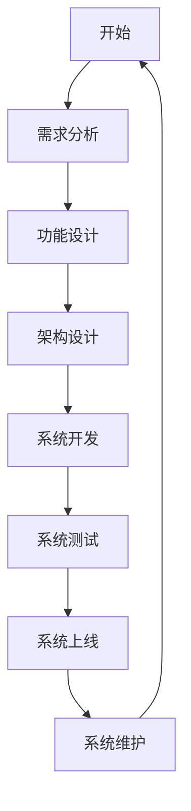
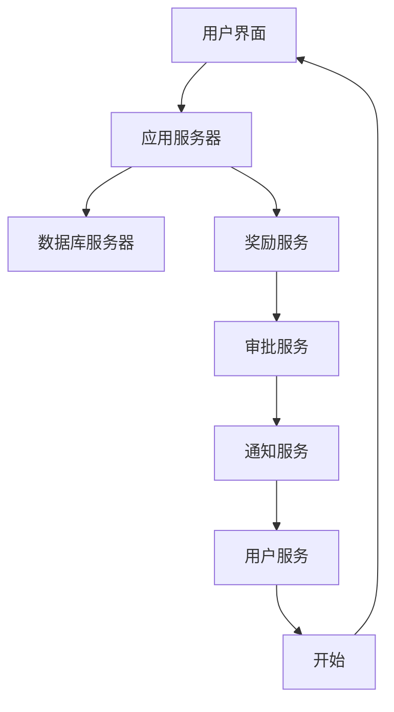

                 

### 《团队激励：物质奖励与精神激励的结合》

> 关键词：团队激励、物质奖励、精神激励、激励结合、组织管理

> 摘要：本文通过详细剖析物质奖励与精神激励在团队激励中的角色和作用，探讨二者的结合方式及其效果，为团队管理者提供实用的激励策略。

#### 目录

1. **背景介绍**
   - 1.1 团队激励的背景和重要性
   - 1.2 物质奖励与精神激励的定义和区别

2. **核心概念与联系**
   - 2.1 团队激励的原则与理论基础
   - 2.2 物质奖励的属性与效果
   - 2.3 精神激励的属性与效果
   - 2.4 物质奖励与精神激励的结合

3. **算法原理讲解**
   - 3.1 如何平衡物质奖励与精神激励

4. **系统分析与架构设计方案**
   - 4.1 团队激励系统的设计与实现
   - 4.2 系统流程与架构设计

5. **项目实战**
   - 5.1 实际案例分析
   - 5.2 团队激励实施步骤

6. **最佳实践 tips、小结、注意事项、拓展阅读**

#### 1. 背景介绍

**1.1 团队激励的背景和重要性**

在当今竞争激烈的市场环境中，团队激励成为了企业管理的重要手段之一。团队激励不仅能够提升团队成员的工作积极性，还能促进团队的协作与创新能力，从而提高整体绩效。有效的团队激励，有助于形成积极向上的团队文化，提升企业的核心竞争力。

**1.2 物质奖励与精神激励的定义和区别**

物质奖励，通常指的是通过给予金钱、实物等有形奖励来激发员工的工作热情和绩效。它包括奖金、股权、福利等多种形式。

精神激励，则是通过认可、荣誉、培训等无形的方式来激发员工的内在动力，提升员工的自我价值感和归属感。

物质奖励与精神激励在形式和作用上有所不同，但它们在团队激励中都是不可或缺的。接下来，我们将深入探讨这两个激励方式的属性、效果及其结合方式。

#### 2. 核心概念与联系

**2.1 团队激励的原则与理论基础**

团队激励的设计和实施需要遵循一些基本原则，如公平性、激励性、长期性等。这些原则不仅保证了激励的有效性，还能提升团队的凝聚力和员工的满意度。理论基础方面，我们可以借鉴动机理论、期望理论等心理学理论，它们为团队激励提供了科学依据。

**2.2 物质奖励的属性与效果**

物质奖励具有直接性和即时性的特点，能够在短时间内提高员工的工作动力。不同形式的物质奖励适用于不同的场景，例如奖金适用于绩效考核，股权适用于长期激励。

效果评估方面，物质奖励的激励效果往往是短期的，如果不能与企业的长期战略相结合，可能会导致员工的短期行为和长期目标之间的矛盾。

**2.3 精神激励的属性与效果**

精神激励通过满足员工的内在需求和情感需求，来提高员工的工作满意度和忠诚度。例如，通过公开表彰、晋升机会、培训提升等方式，可以增强员工的成就感和归属感。

与物质奖励相比，精神激励的效果往往更加持久，能够促进员工的长期发展和企业的长期稳定。

**2.4 物质奖励与精神激励的结合**

将物质奖励与精神激励相结合，可以发挥二者的互补优势。在实际应用中，我们可以根据团队的具体情况，灵活调整二者的比例和形式。例如，在短期内，可以适当增加物质奖励的比重，以快速提升团队士气；在长期内，可以更多采用精神激励，以促进员工的个人成长和企业文化的建设。

#### 3. 算法原理讲解

**3.1 如何平衡物质奖励与精神激励**

平衡物质奖励与精神激励，需要综合考虑团队的目标、成员的需求和企业的资源。一个常用的方法是基于数学模型进行优化。以下是一个简化的模型：

$$
Maximize\quad W = w_1 \cdot M + w_2 \cdot S
$$

其中，$W$ 是总激励效果，$M$ 是物质奖励，$S$ 是精神激励，$w_1$ 和 $w_2$ 是权重系数。

通过调整 $w_1$ 和 $w_2$ 的值，可以实现对物质奖励与精神激励的平衡。例如，当团队需要快速提高绩效时，可以适当提高 $w_1$ 的值；当团队需要长期稳定发展时，可以适当提高 $w_2$ 的值。

**示例：**

假设团队的目标是提高销售额，物质奖励是奖金，精神激励是晋升机会。根据团队的实际情况，设定 $w_1 = 0.6$，$w_2 = 0.4$，则总激励效果为：

$$
W = 0.6 \cdot M + 0.4 \cdot S
$$

#### 4. 系统分析与架构设计方案

**4.1 团队激励系统的设计与实现**

团队激励系统的设计需要考虑以下几个方面：

- **需求分析**：明确团队激励的目标、参与人员、激励形式等。
- **功能设计**：设计系统的主要功能模块，如奖励申请、审批、发放等。
- **架构设计**：选择合适的系统架构，如B/S架构、C/S架构等。

**4.2 系统流程与架构设计**

**系统流程图：**

**系统架构图：**

#### 5. 项目实战

**5.1 实际案例分析**

以某互联网公司为例，该公司在实施团队激励时，采取了物质奖励与精神激励相结合的方式。具体实施步骤如下：

1. **需求分析**：明确团队激励的目标，如提高产品销量、提升团队凝聚力等。
2. **功能设计**：设计奖励申请、审批、发放等功能。
3. **架构设计**：选择B/S架构，使用Python和Django框架开发。
4. **系统开发**：完成系统的开发工作。
5. **系统测试**：进行系统测试，确保功能正常运行。
6. **系统上线**：将系统部署到生产环境，并进行实际应用。
7. **系统维护**：定期更新系统，解决用户反馈的问题。

**5.2 团队激励实施步骤**

1. **奖励申请**：员工根据工作表现提出奖励申请。
2. **审批流程**：由上级领导对申请进行审批。
3. **奖励发放**：审批通过后，发放物质奖励，如奖金、礼品等。
4. **精神激励**：通过公开表彰、晋升机会等方式进行精神激励。
5. **反馈与评估**：收集员工的反馈，对激励效果进行评估和改进。

#### 6. 最佳实践 tips、小结、注意事项、拓展阅读

**6.1 最佳实践 tips**

- **个性化激励**：根据员工的特点和需求，提供个性化的激励方案。
- **及时反馈**：及时给予员工反馈，增强激励效果。
- **透明公正**：确保激励过程的透明性和公正性，增强员工的信任感。

**6.2 小结**

物质奖励与精神激励在团队激励中发挥着重要作用。通过合理的结合，可以提升团队的整体绩效和员工的满意度。

**6.3 注意事项**

- **适度激励**：避免过度激励导致的负面效果。
- **文化融合**：确保激励方案与企业文化相符合。

**6.4 拓展阅读**

- 《动机与人格》
- 《激励原理与应用》

### 总结

本文通过详细分析物质奖励与精神激励在团队激励中的作用，探讨了二者的结合方式和效果。在实际应用中，团队管理者应根据具体情况灵活调整激励策略，以实现最佳激励效果。通过本文的探讨，希望能够为团队管理者提供有价值的参考。

#### 作者信息：

作者：AI天才研究院/AI Genius Institute & 禅与计算机程序设计艺术 /Zen And The Art of Computer Programming

