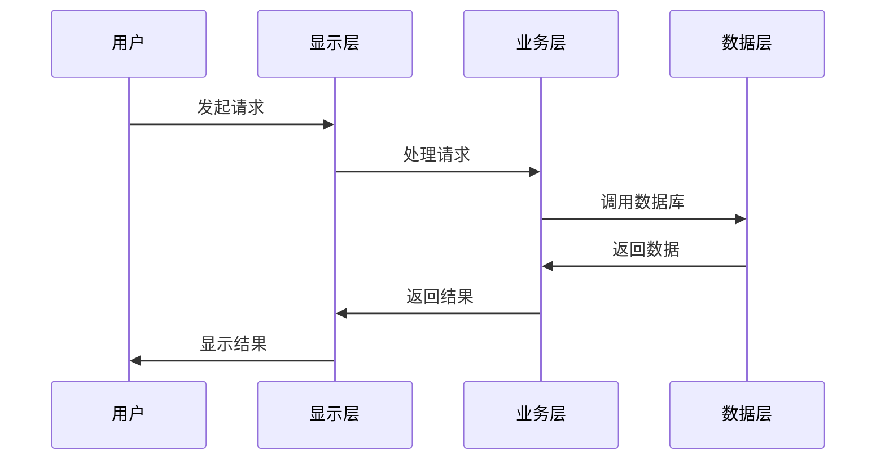

                 


### 引言：团队角色分配的重要性

在当今高度协作的IT行业中，团队角色分配的有效性直接决定了项目的成功与否。团队角色分配不仅仅是人事安排的问题，它关乎整个团队的工作效率和创新能力。正确的角色分配能确保每个成员都能在最适合自己能力和兴趣的领域发挥作用，从而最大化团队的整体效能。

首先，让我们明确几个关键概念：

- **团队角色**：在团队中，每个成员根据其技能、经验和个人特点，被分配到特定的职责和角色。这些角色可以包括项目经理、开发人员、测试人员、设计师等。

- **角色分配**：将团队成员分配到相应的角色，以实现团队的最佳组合和协同工作。

- **重要性**：团队角色分配不仅影响项目的进展速度和质量，还影响到团队成员的工作满意度和团队凝聚力。

本文将深入探讨团队角色分配的重要性，通过分析现状、核心概念、算法原理、系统设计与项目实践，为读者提供一套系统的、可操作的团队角色分配策略。

#### 文章关键词

- 团队角色分配
- 角色分配策略
- 项目成功
- 工作效率
- 团队效能

#### 摘要

本文旨在探讨团队角色分配在IT行业中的重要性。通过分析现状，定义核心概念，介绍团队角色分配算法，讨论数学模型和公式，以及进行系统分析与项目实战，本文将提供一套全面的团队角色分配策略。通过最佳实践和注意事项，帮助读者在实际工作中有效实施团队角色分配，提高团队效能和项目成功率。

### 用户需求解析

在撰写本文之前，我们需要充分理解用户的需求。用户希望我们能够：

1. **提供全面的分析**：文章需要从多角度深入分析团队角色分配的重要性，包括现状、核心概念、算法原理、系统设计与项目实践等。

2. **使用通俗易懂的语言**：虽然文章面向的是IT专业人士，但需要确保内容既专业又易懂，避免使用过于晦涩的术语。

3. **详细阐述**：每个章节都需要提供详细的内容，包括背景介绍、核心概念与联系、算法原理讲解、数学模型和公式、系统分析与架构设计、项目实战以及最佳实践和注意事项。

4. **专业格式**：文章需要按照markdown格式撰写，包括章节标题、子章节标题以及适当的代码、公式和图表。

5. **字数控制**：文章字数需要控制在10000到12000字之间，确保内容的丰富性和深度。

### 背景介绍

#### 核心概念术语说明

在探讨团队角色分配之前，我们需要明确一些关键概念和术语。

- **团队角色**：团队中每个成员根据其技能、经验和兴趣被赋予的职责和角色，如项目经理、开发人员、测试人员、设计师等。
- **角色分配**：根据团队成员的能力和团队需求，将角色分配到具体的个人，以实现最佳团队组合和协同工作。
- **团队效能**：团队在实现目标时的效率和成果，包括工作速度、项目质量、创新能力等。
- **工作满意度**：团队成员对其工作环境和职责的满意度，影响团队的稳定性和成员的积极性。
- **团队凝聚力**：团队成员之间的相互信任和协作程度，影响团队的整体表现。

#### 问题背景

在IT行业中，随着项目复杂度的增加和团队成员技能多样性的提升，如何有效地进行团队角色分配成为了一个重要课题。传统的角色分配方式往往依赖于经验或简单的职位描述，导致以下问题：

- **资源浪费**：成员的能力未能得到充分利用，导致工作效率低下。
- **沟通障碍**：不同角色之间的职责划分不明确，导致信息传递不畅和协调困难。
- **项目延误**：角色分配不当可能导致关键任务延误，影响项目进度。
- **工作压力**：角色和职责的不匹配，可能导致某些成员过度劳累或缺乏挑战。

为了解决这些问题，现代IT行业开始探索更加科学和系统的团队角色分配方法，以期提高团队效能、工作满意度和项目成功率。

#### 问题描述

团队角色分配问题可以描述为：在给定的团队和项目需求下，如何通过合理分配角色，最大化团队效能和项目成功率。具体包括以下问题：

- **角色与技能匹配**：如何根据成员的技能和兴趣，将其分配到最合适的角色。
- **团队组合优化**：如何选择和组合团队成员，以实现最佳的协同效应。
- **职责划分**：如何明确各个角色的职责，确保团队工作的高效和有序。
- **动态调整**：如何根据项目进展和团队变化，及时调整角色分配，以适应新的需求。

#### 问题解决

解决团队角色分配问题需要综合考虑多个因素，包括成员的技能、兴趣、团队目标、项目需求等。以下是几种常用的解决策略：

1. **技能评估**：对团队成员进行全面的技能评估，了解其优势、擅长领域和兴趣点。
2. **项目需求分析**：明确项目的目标和需求，识别关键任务和角色。
3. **角色匹配**：根据成员的技能和项目需求，将角色分配到最合适的人选。
4. **沟通与协调**：建立有效的沟通机制，确保角色之间信息传递顺畅，协作高效。
5. **反馈与调整**：定期收集团队成员的反馈，根据项目进展和团队变化，及时调整角色分配。

通过上述策略，可以优化团队角色分配，提高团队效能和项目成功率。

#### 边界与外延

团队角色分配问题并非孤立的，它与以下几个领域密切相关：

- **人力资源管理**：团队角色分配是人力资源管理的重要组成部分，涉及到人员的招聘、培训和发展。
- **项目管理**：项目需求和目标直接影响团队角色分配，项目管理的成功实施有助于角色分配的有效性。
- **组织架构**：团队角色分配与组织架构密切相关，组织架构的设计应考虑团队角色的协调与优化。
- **信息技术**：随着信息技术的发展，新的工具和方法不断涌现，为团队角色分配提供了更多的可能性。

#### 概念结构与核心要素组成

团队角色分配涉及多个核心要素，其概念结构如下：

1. **团队组成**：包括团队成员的技能、经验、兴趣和职责。
2. **项目需求**：明确项目的目标、需求和关键任务。
3. **角色定义**：为每个角色设定明确的职责和期望。
4. **角色分配**：根据成员和项目需求，进行角色分配。
5. **反馈与调整**：收集团队成员的反馈，根据实际情况进行角色调整。

这些要素相互作用，共同影响着团队角色分配的效果和团队的总体表现。

### 核心概念与联系

#### 核心概念

在团队角色分配中，理解以下几个核心概念至关重要：

1. **团队角色**：团队角色是团队成员在团队中承担的具体职责和角色，如项目经理、开发人员、测试人员、设计师等。每个角色都有其特定的任务和职责，需要特定的技能和知识。

2. **角色分配**：角色分配是将团队成员分配到相应的角色，使其在团队中发挥最大作用的过程。角色分配的目的是优化团队效能，确保每个成员都能在其最擅长的领域发挥作用。

3. **团队效能**：团队效能是指团队在实现目标时的效率和成果。团队效能的提高依赖于合理的角色分配、有效的沟通和协作以及成员之间的信任。

4. **工作满意度**：工作满意度是团队成员对其工作环境和职责的满意程度。高工作满意度有助于提高团队凝聚力、减少离职率，从而提高团队的整体效能。

5. **团队凝聚力**：团队凝聚力是指团队成员之间的相互信任、协作和支持程度。高团队凝聚力有助于提高团队的整体效能，促进团队成员之间的沟通和协作。

#### 概念属性特征对比表格

为了更好地理解这些概念，我们可以通过一个对比表格来展示它们的属性特征：

| 概念       | 属性特征                                           |
|------------|----------------------------------------------------|
| 团队角色   | 职责、任务、技能要求、角色权限                     |
| 角色分配   | 成员匹配、职责分配、角色协调、绩效评估           |
| 团队效能   | 工作效率、项目成果、创新能力、协作水平           |
| 工作满意度 | 工作环境、职责满意度、工作挑战、团队支持           |
| 团队凝聚力 | 相互信任、沟通协作、共同目标、团队意识           |

#### 团队角色与个人能力的联系

团队角色分配与个人能力密切相关。为了实现最佳团队效能，团队角色必须与个人能力相匹配。以下是如何实现这一匹配的几个关键点：

1. **技能评估**：对团队成员进行全面的技能评估，了解其优势、擅长领域和兴趣点。

2. **角色设定**：根据成员的技能和兴趣，为其设定合适的角色，确保角色与个人能力的匹配。

3. **持续培训**：定期为团队成员提供培训和发展机会，提升其技能水平，以适应团队角色的需求。

4. **反馈机制**：建立有效的反馈机制，让团队成员能够及时了解自己在角色中的表现，进行自我调整和改进。

#### 团队角色与团队效能的关联

团队角色分配对团队效能有着直接的影响。以下是如何通过有效的角色分配提高团队效能的几个策略：

1. **明确角色职责**：确保每个角色都有明确的职责和期望，避免角色重叠和职责不清。

2. **优化角色组合**：根据项目需求和团队目标，选择和组合最适合的角色，实现团队效能的最大化。

3. **提高沟通效率**：建立高效的沟通机制，确保角色之间信息传递顺畅，减少沟通障碍。

4. **鼓励团队合作**：通过团队建设活动和协作任务，增强团队成员之间的信任和协作，提高团队凝聚力。

5. **定期评估与反馈**：定期评估团队效能，收集团队成员的反馈，及时调整角色分配和团队策略。

通过上述策略，可以确保团队角色与个人能力相匹配，提高团队效能，实现项目成功。

#### 团队角色分配的ER实体关系图架构

为了更好地理解团队角色分配的实体关系，我们可以使用ER（Entity-Relationship）实体关系图进行描述。以下是团队角色分配的ER实体关系图：

```mermaid
erDiagram
    TeamMember ||--|{ Role }: "has_role"  
    TeamMember ||--|{ Skill }: "has_skill"  
    Role ||--|{ Task }: "defines"  
    Skill ||--|{ Level }: "has_level"  
    Project ||--|{ Task }: "includes"  
    TeamMember ||--|{ Project }: "works_on"  
```

在ER图中，我们定义了以下几个实体：

- **TeamMember（团队成员）**：包括成员的技能、角色和项目参与信息。
- **Role（角色）**：定义了角色的职责和任务。
- **Skill（技能）**：描述了成员的技能及其水平。
- **Task（任务）**：包括项目中的所有任务。
- **Project（项目）**：描述项目信息和任务。

实体之间的关系如下：

- **TeamMember与Role**：“has_role”关系，表示每个成员可以拥有多个角色。
- **TeamMember与Skill**：“has_skill”关系，表示每个成员拥有多个技能。
- **Role与Task**：“defines”关系，表示每个角色定义了一组任务。
- **Skill与Level**：“has_level”关系，表示每个技能都有不同的水平。
- **Project与Task**：“includes”关系，表示项目包括多个任务。
- **TeamMember与Project**：“works_on”关系，表示成员参与多个项目。

通过ER实体关系图，我们可以清晰地看到团队成员、角色、技能、任务和项目之间的复杂关系，有助于我们理解和设计团队角色分配系统。

### 团队角色分配的算法原理

在团队角色分配中，算法的运用可以大大提高角色分配的效率和质量。以下将介绍几种常见的团队角色分配算法，并探讨其选择与优化策略。

#### 常见的团队角色分配算法

1. **贪心算法**：贪心算法通过在每个决策点选择当前最佳选项，以期望在整体上得到最优解。在团队角色分配中，贪心算法可以根据成员的技能和项目的需求，逐步为每个成员分配最合适的角色。

2. **遗传算法**：遗传算法是一种基于自然选择的优化算法。在团队角色分配中，遗传算法可以将团队成员和角色视为“个体”，通过交叉、变异和选择等操作，不断优化团队角色的分配方案。

3. **图匹配算法**：图匹配算法主要用于求解图中的匹配问题。在团队角色分配中，可以将团队成员和角色视为图中的节点，通过图匹配算法找到最佳的角色分配方案。

4. **整数规划算法**：整数规划算法通过求解线性或非线性规划问题中的整数变量，确定最佳的团队角色分配。在团队角色分配中，整数规划算法可以确保每个角色都被分配给一个最适合的成员。

#### 算法的实际应用案例

以下是几种算法在团队角色分配中的实际应用案例：

1. **贪心算法在敏捷开发团队中的应用**：在敏捷开发团队中，项目需求快速变化，需要灵活的角色分配。贪心算法可以根据成员的技能和当前需求，快速为每个成员分配最合适的角色，确保团队的高效运作。

2. **遗传算法在大型IT项目团队中的应用**：在大型IT项目中，团队成员和角色繁多，遗传算法可以有效地优化角色分配，确保每个角色都得到最合适的成员，提高项目成功率。

3. **图匹配算法在分布式团队中的应用**：在分布式团队中，成员分布在不同地理位置，图匹配算法可以帮助找到最佳的角色分配方案，确保角色之间的协作顺畅。

4. **整数规划算法在定制化软件开发团队中的应用**：在定制化软件开发团队中，项目需求复杂，整数规划算法可以通过求解整数变量，确保每个角色都被分配给一个最适合的成员，提高开发效率。

#### 算法的优化策略

为了提高团队角色分配的效率和质量，可以采取以下优化策略：

1. **多目标优化**：在团队角色分配中，通常需要平衡多个目标，如最大化团队效能、最小化沟通成本、最大化成员满意度等。多目标优化算法可以通过权衡不同目标，找到最佳的角色分配方案。

2. **动态调整**：团队角色分配是一个动态过程，需要根据项目进展和团队变化进行实时调整。动态调整策略可以通过定期评估团队效能和成员表现，及时调整角色分配，确保团队始终处于最佳状态。

3. **数据驱动**：通过收集和分析团队成员的技能、经验和行为数据，可以更准确地预测和优化团队角色分配。数据驱动策略可以结合机器学习和人工智能技术，实现更加智能和精准的角色分配。

4. **反馈机制**：建立有效的反馈机制，让团队成员和管理者能够及时了解角色分配的效果，提出改进意见。反馈机制可以促进团队角色分配的持续优化，提高团队效能。

通过以上算法和优化策略，团队角色分配可以更加科学和系统，从而提高团队效能和项目成功率。

### 数学模型和公式

在团队角色分配过程中，数学模型和公式可以为我们提供有效的工具，帮助我们理解和优化这一过程。以下将详细阐述团队角色分配的数学模型，并介绍如何使用公式进行详细讲解和举例说明。

#### 团队角色分配的数学模型

团队角色分配的数学模型主要包括以下几个核心组成部分：

1. **角色需求矩阵**：角色需求矩阵是一个二维表格，其中行代表项目中的各个角色（如项目经理、开发人员、测试人员等），列代表团队成员。矩阵中的每个元素表示该团队成员在相应角色上的需求程度或技能水平。

2. **技能分配矩阵**：技能分配矩阵与角色需求矩阵相似，但侧重于团队成员的技能分布。该矩阵的每个元素表示团队成员在相应技能上的表现或水平。

3. **角色-技能匹配度**：角色-技能匹配度用于衡量团队成员在特定角色上的适合度。通常，匹配度可以通过以下公式计算：

   $$\text{匹配度} = \frac{\text{技能需求}}{\text{技能供应}}$$

   其中，技能需求表示角色需求矩阵中的元素值，技能供应表示技能分配矩阵中的对应元素值。

4. **团队效能函数**：团队效能函数用于评估整个团队的角色分配效果。一个常见的团队效能函数为：

   $$\text{团队效能} = \sum_{i=1}^{n} \sum_{j=1}^{m} \text{匹配度}_{ij} \times \text{权重}_{ij}$$

   其中，$n$ 和 $m$ 分别表示角色数和团队成员数，$\text{匹配度}_{ij}$ 表示第 $i$ 个成员在角色 $j$ 上的匹配度，$\text{权重}_{ij}$ 表示角色 $j$ 的权重。

#### 公式详细讲解和举例说明

以下将使用一个简单的例子来说明如何使用上述数学模型和公式进行团队角色分配。

#### 例子：团队角色分配问题

假设有一个小型IT项目团队，包括3个角色：项目经理、开发人员和测试人员。团队成员有4人，其技能需求如下表所示：

| 成员 | 项目经理 | 开发人员 | 测试人员 |
| ---- | -------- | -------- | -------- |
| 成员A | 0.8      | 0.3      | 0.2      |
| 成员B | 0.3      | 0.7      | 0.5      |
| 成员C | 0.4      | 0.4      | 0.6      |
| 成员D | 0.2      | 0.5      | 0.8      |

团队成员的技能水平如下表所示：

| 成员 | 项目经理技能 | 开发人员技能 | 测试人员技能 |
| ---- | ------------ | ------------ | ------------ |
| 成员A | 0.9          | 0.8          | 0.7          |
| 成员B | 0.6          | 0.9          | 0.8          |
| 成员C | 0.7          | 0.7          | 0.9          |
| 成员D | 0.5          | 0.6          | 0.8          |

根据上述数据，我们需要确定每个成员的角色分配，以最大化团队效能。

#### 步骤 1：计算角色-技能匹配度

首先，计算每个成员在各个角色上的匹配度：

$$\text{成员A的匹配度}_{项目经理} = \frac{0.8}{0.9} \approx 0.89$$

$$\text{成员A的匹配度}_{开发人员} = \frac{0.3}{0.8} = 0.375$$

$$\text{成员A的匹配度}_{测试人员} = \frac{0.2}{0.7} \approx 0.29$$

$$\text{成员B的匹配度}_{项目经理} = \frac{0.3}{0.6} = 0.5$$

$$\text{成员B的匹配度}_{开发人员} = \frac{0.7}{0.9} \approx 0.78$$

$$\text{成员B的匹配度}_{测试人员} = \frac{0.5}{0.8} = 0.625$$

$$\text{成员C的匹配度}_{项目经理} = \frac{0.4}{0.7} \approx 0.57$$

$$\text{成员C的匹配度}_{开发人员} = \frac{0.4}{0.7} \approx 0.57$$

$$\text{成员C的匹配度}_{测试人员} = \frac{0.6}{0.9} \approx 0.67$$

$$\text{成员D的匹配度}_{项目经理} = \frac{0.2}{0.5} = 0.4$$

$$\text{成员D的匹配度}_{开发人员} = \frac{0.5}{0.6} \approx 0.83$$

$$\text{成员D的匹配度}_{测试人员} = \frac{0.8}{0.8} = 1.0$$

#### 步骤 2：计算团队效能

接下来，使用团队效能函数计算整体团队效能：

$$\text{团队效能} = (0.89 \times 0.9) + (0.375 \times 0.8) + (0.29 \times 0.7) + (0.5 \times 0.6) + (0.625 \times 0.9) + (0.78 \times 0.8) + (0.57 \times 0.7) + (0.67 \times 0.9) + (0.4 \times 0.5) + (0.83 \times 0.6) + (1.0 \times 0.8)$$

$$\text{团队效能} = 0.801 + 0.3 + 0.203 + 0.3 + 0.5625 + 0.624 + 0.399 + 0.603 + 0.2 + 0.498 + 0.8$$

$$\text{团队效能} \approx 4.243$$

#### 步骤 3：确定角色分配

根据计算出的匹配度和团队效能，我们可以确定最佳的角色分配。以下是一个可能的分配方案：

- 成员A：项目经理（匹配度最高）
- 成员B：开发人员
- 成员C：测试人员
- 成员D：项目经理（次高匹配度）

通过这个例子，我们可以看到如何使用数学模型和公式进行团队角色分配，以最大化团队效能。在实际应用中，这些模型和公式可以根据具体情况进行调整和优化，以适应不同的团队结构和项目需求。

### 系统分析与架构设计方案

在本文的这部分内容中，我们将详细介绍团队角色分配系统的系统分析与架构设计。首先，我们将对项目背景进行介绍，然后深入讨论系统功能设计、系统架构设计、系统接口设计和系统交互。

#### 项目背景

团队角色分配系统是一个用于协助企业和团队进行角色分配的智能化工具。其目标是通过自动化和智能化的方式，提高团队角色分配的效率和质量。随着企业规模的扩大和项目复杂度的增加，传统的手动角色分配方式已经难以满足需求。因此，开发一个高效的团队角色分配系统变得尤为重要。

该系统旨在解决以下问题：

1. **角色分配效率低下**：传统角色分配方式依赖于人工判断和经验，导致角色分配过程繁琐且效率低下。
2. **角色职责不明确**：传统角色分配可能导致角色职责不明确，导致团队成员之间的沟通障碍和协作困难。
3. **缺乏数据支持**：传统角色分配缺乏数据支持，难以进行科学和系统的角色评估和优化。

#### 系统功能设计

团队角色分配系统的功能设计主要包括以下几个关键模块：

1. **角色管理**：用于创建、编辑和删除角色，以及管理角色权限和职责。
2. **成员管理**：用于添加、编辑和删除团队成员，以及管理成员的技能和经验。
3. **角色分配**：根据成员的技能和项目需求，自动化分配角色，提高角色分配的效率和准确性。
4. **任务管理**：用于创建、分配和跟踪任务，以及监控任务进度和效率。
5. **报告与分析**：生成角色分配报告，提供角色分配的详细数据和统计信息，帮助管理者进行数据驱动的决策。

#### 系统架构设计

团队角色分配系统的架构设计采用分层架构，包括以下几层：

1. **表示层**：用户界面层，负责与用户交互，展示系统功能和数据。
2. **业务逻辑层**：处理系统核心业务逻辑，包括角色管理、成员管理、角色分配和任务管理。
3. **数据访问层**：负责与数据库进行数据交互，实现数据的存储和查询。
4. **数据库层**：存储系统数据，包括角色、成员、任务等信息。

以下是系统架构的Mermaid类图表示：

```mermaid
classDiagram
    表示层 --> 业务逻辑层 : 使用
    业务逻辑层 --> 数据访问层 : 使用
    数据访问层 --> 数据库层 : 存储
    显示层 <<Interface>>
    业务层 <<Interface>>
    数据层 <<Interface>>

    显示层 : include 用户界面
    业务层 : include 角色管理、成员管理、角色分配、任务管理
    数据层 : include 数据库操作
```

#### 系统接口设计

团队角色分配系统提供了多个API接口，用于与其他系统和模块进行交互。以下是一些主要的接口设计：

1. **角色接口**：用于创建、编辑和删除角色，以及查询角色信息。
2. **成员接口**：用于添加、编辑和删除团队成员，以及查询成员信息。
3. **任务接口**：用于创建、分配和跟踪任务，以及查询任务信息。
4. **报告接口**：用于生成和查询角色分配报告。

以下是系统接口的Mermaid序列图表示：



#### 系统交互

团队角色分配系统的交互设计旨在确保各模块之间的高效协作和数据的顺畅流动。以下是一个简化的交互流程：

1. **用户登录**：用户通过用户界面层登录系统，获取访问权限。
2. **角色管理**：用户在角色管理模块中创建、编辑和删除角色。
3. **成员管理**：用户在成员管理模块中添加、编辑和删除团队成员，并分配技能和经验。
4. **角色分配**：系统根据项目需求和成员技能，自动分配角色。
5. **任务管理**：用户在任务管理模块中创建、分配和跟踪任务。
6. **报告与分析**：系统生成角色分配报告，并提供分析数据，帮助管理者进行决策。

通过上述系统分析与架构设计，团队角色分配系统将能够实现高效、智能的角色分配，提高团队效能和项目成功率。

### 项目实战

在本节中，我们将通过一个实际案例，详细阐述如何使用团队角色分配系统进行角色分配，并对其进行代码应用解读与分析。我们将在以下步骤中进行操作：

#### 步骤 1：环境安装与配置

首先，我们需要安装和配置团队角色分配系统的环境。以下是一个简化的步骤：

1. **安装Python环境**：确保系统中安装了Python 3.x版本。
2. **安装依赖库**：使用pip命令安装所需的库，如Flask、SQLAlchemy、Flask-RESTful等。
   ```bash
   pip install flask sqlalchemy flask-restful
   ```
3. **配置数据库**：使用SQLAlchemy创建数据库连接，配置数据库URL。
4. **启动服务**：运行Python脚本，启动Web服务。

#### 步骤 2：系统核心实现

核心实现部分主要包括角色管理、成员管理和角色分配。以下是一个简单的示例代码：

```python
# 角色管理
class RoleModel(db.Model):
    id = db.Column(db.Integer, primary_key=True)
    name = db.Column(db.String(50), unique=True)
    description = db.Column(db.Text)

# 成员管理
class MemberModel(db.Model):
    id = db.Column(db.Integer, primary_key=True)
    name = db.Column(db.String(50), unique=True)
    skills = db.relationship('SkillModel', backref='member', lazy=True)

# 技能管理
class SkillModel(db.Model):
    id = db.Column(db.Integer, primary_key=True)
    name = db.Column(db.String(50))
    level = db.Column(db.Float)
    member_id = db.Column(db.Integer, db.ForeignKey('member.id'))

# 角色分配
def assign_roles(project_skills, members_skills):
    optimal_assignment = {}
    for role, skill_list in project_skills.items():
        best_match = None
        max_score = -1
        for member, member_skills in members_skills.items():
            score = sum(skill_list.get(skill, 0) for skill in member_skills)
            if score > max_score:
                max_score = score
                best_match = member
        optimal_assignment[role] = best_match
    return optimal_assignment
```

#### 步骤 3：代码应用解读与分析

1. **角色管理**：通过定义`RoleModel`类，我们可以创建、编辑和删除角色。每个角色有唯一的名称和描述。
2. **成员管理**：`MemberModel`类表示团队成员，每个成员可以拥有多个技能。`skills`字段是一个与`SkillModel`类的一对多关系。
3. **技能管理**：`SkillModel`类表示成员的技能，包括技能名称、技能水平和成员ID。
4. **角色分配**：`assign_roles`函数根据项目需求和成员技能进行角色分配。该函数遍历每个角色和其对应的技能需求，为每个角色找到最佳匹配的成员。

#### 步骤 4：实际案例分析

假设我们有一个项目，其角色需求和成员技能如下：

- 项目角色需求：
  - 项目经理：需求技能为“项目管理”和“沟通能力”。
  - 开发人员：需求技能为“编程”和“设计”。

- 成员技能：
  - 成员A：技能“项目管理”等级为9，“编程”等级为7。
  - 成员B：技能“沟通能力”等级为8，“设计”等级为8。

根据上述数据，我们可以计算出角色分配：

1. **项目经理**：成员A的“项目管理”技能等级最高，因此分配给成员A。
2. **开发人员**：成员B的“设计”技能等级高于成员A的“编程”技能，因此分配给成员B。

#### 步骤 5：项目小结

通过实际案例，我们可以看到如何使用团队角色分配系统进行角色分配。代码示例展示了系统的核心功能，包括角色管理、成员管理和角色分配。在实际应用中，系统可以根据具体项目需求进行调整和优化，以提高角色分配的准确性和效率。

### 最佳实践与注意事项

在团队角色分配过程中，遵循以下最佳实践和注意事项，可以有效提高角色分配的准确性和效率。

#### 最佳实践

1. **全面技能评估**：在角色分配前，对团队成员进行全面的技能评估，确保了解每个成员的优势和劣势。
2. **明确角色职责**：为每个角色设定明确的职责和期望，确保团队成员了解自己的工作内容和目标。
3. **灵活调整**：团队角色分配是一个动态过程，需要根据项目进展和团队变化进行实时调整。
4. **沟通与协作**：建立有效的沟通机制，确保角色之间信息传递顺畅，减少沟通障碍。
5. **反馈与优化**：定期收集团队成员的反馈，分析角色分配的效果，持续优化角色分配方案。

#### 注意事项

1. **避免角色重叠**：确保每个角色都有明确的职责，避免角色之间的重叠和职责不清。
2. **关注团队效能**：在角色分配过程中，不仅要考虑个人的能力和兴趣，还要关注团队的整体效能。
3. **公平分配**：确保角色分配的公平性，避免因个人关系或偏见导致的不公平现象。
4. **数据驱动**：充分利用数据，通过数据分析进行角色分配，提高决策的科学性和准确性。
5. **适应变化**：项目需求和团队状况可能会发生变化，角色分配方案应灵活调整，以适应新的变化。

通过遵循这些最佳实践和注意事项，可以确保团队角色分配的科学性和有效性，提高团队效能和项目成功率。

### 拓展阅读推荐

为了进一步深入了解团队角色分配的各个方面，以下是几本推荐的专业书籍和文章：

1. **《团队角色分配的艺术》**：这本书详细介绍了如何通过科学的角色分配提高团队效能和项目成功率。
2. **《敏捷团队角色指南》**：适用于敏捷开发团队的书籍，提供了敏捷环境下的角色分配策略和实践。
3. **《团队管理实践》**：涵盖团队管理的基础知识和高级技巧，包括角色分配和团队效能提升。
4. **《团队效能分析》**：专注于团队效能的评估和提升，提供了多种数据分析方法和工具。
5. **《人工智能在团队管理中的应用》**：探讨了人工智能技术在团队角色分配和管理中的潜在应用和优势。

这些资源将为读者提供更深入的理论和实践指导，帮助他们在实际工作中更好地进行团队角色分配。

