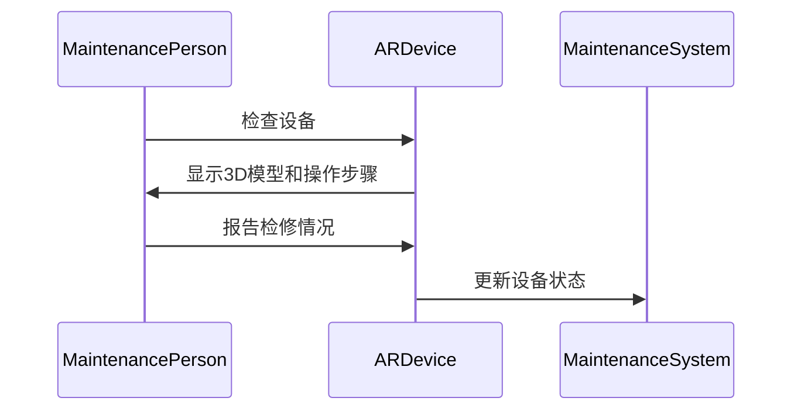
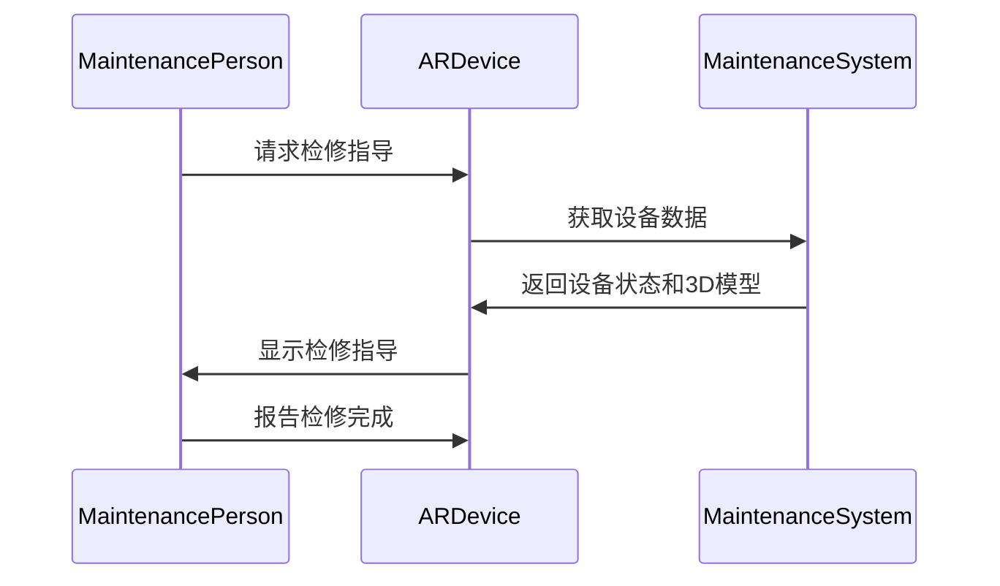

                 


## 让我们一步一步深入思考：增强现实在工业维护中的应用前景

### 第一步：理解增强现实（AR）技术的基本概念和原理

增强现实（Augmented Reality，简称AR）技术是一种将虚拟信息与现实世界叠加的技术，通过摄像头捕捉现实世界的图像，并在其上叠加虚拟信息，从而提供一种新的交互体验。与传统虚拟现实（VR）不同，AR不是将用户完全沉浸在一个虚拟环境中，而是在现实世界的基础上添加虚拟元素。

**核心概念与联系**：
增强现实技术的核心概念包括显示技术、输入设备、内容创建等。这些概念的联系构成了AR系统的基础。

- **显示技术**：头戴显示器（HMD）、智能手机和平板电脑等设备用于显示AR内容。
- **输入设备**：摄像头、传感器和手势识别等设备用于捕捉现实世界的信息。
- **内容创建**：软件工具和平台，如Unity、ARKit等，用于创建和开发AR应用。

**ER实体关系图架构**：
```mermaid
erDiagram
  AR系统 ||--|{ 显示技术 : Display }
  AR系统 ||--|{ 输入设备 : Input }
  AR系统 ||--|{ 内容创建 : Content }
  Display ||--|{ HMD : Head Mounted Display }
  Display ||--|{ 智能手机 : SmartPhone }
  Input ||--|{ 摄像头 : Camera }
  Input ||--|{ 传感器 : Sensor }
  Input ||--|{ 手势识别 : Gesture Recognition }
  Content ||--|{ Unity : Unity Platform }
  Content ||--|{ ARKit : ARKit Platform }
```

### 第二步：探讨工业维护的现状与挑战

工业维护是确保生产设备正常运行的重要环节。随着工业设备的复杂性和自动化水平的提高，传统的维护方式面临着许多挑战。

**核心概念与联系**：
- **维护目的**：确保设备正常运行，减少故障停机时间，提高生产效率。
- **维护类型**：预防性维护、预测性维护等。

**概念属性特征对比表格**：

| 维护类型 | 特点 | 优点 | 缺点 |
| --- | --- | --- | --- |
| 预防性维护 | 定期检查和维护 | 降低故障风险 | 可能造成过度维护 |
| 预测性维护 | 通过数据分析预测故障 | 减少停机时间 | 需要大量数据支持 |

### 第三步：分析增强现实技术在工业维护中的应用

增强现实技术在工业维护中的应用主要集中在设备检修、故障诊断和操作培训等方面。

**核心概念与联系**：
- **设备检修**：利用AR技术提供实时指导，减少误操作。
- **故障诊断**：实时监测设备状态，快速定位故障点。
- **操作培训**：通过AR技术进行虚拟操作练习，提高操作技能。

**系统分析与架构设计方案**：

**问题场景介绍**：
某制造企业在设备检修过程中，维护人员需要检查复杂设备，但缺乏足够的经验和技术指导。

**系统功能设计**：
- **设备检修**：提供实时指导，显示关键部件的3D模型和操作步骤。
- **故障诊断**：实时监测设备状态，通过AR显示故障信息和解决方案。

**系统架构设计**：


**系统接口设计和系统交互**：


### 第四步：讨论增强现实技术在工业维护中的优势与局限

**优势**：
- **提高效率**：通过实时指导和监测，减少维护时间。
- **降低成本**：减少误操作和停机时间，降低维护成本。
- **增强安全性**：通过虚拟操作练习，提高操作技能，减少安全事故。

**局限**：
- **技术成熟度**：虽然AR技术发展迅速，但仍有技术瓶颈需要克服。
- **硬件成本**：AR设备价格较高，需要较高的投资。
- **操作复杂度**：AR系统的操作可能对维护人员来说相对复杂。

### 第五步：展望增强现实技术在工业维护中的未来发展

随着技术的不断进步和应用的深入，增强现实在工业维护中的应用前景广阔。

**未来发展趋势**：
- **技术进步**：更高的分辨率、更低的延迟、更广的适用范围。
- **应用普及**：从大型企业逐步向中小型企业普及。

**行业发展前景**：
- **市场增长**：随着工业自动化水平的提高，AR在工业维护中的应用将不断扩大。
- **技术创新**：更多新技术，如5G和边缘计算，将推动AR在工业维护中的应用。

**未来应用展望**：
- **设备健康管理**：通过AR技术实现设备的全生命周期管理。
- **智能维护系统**：集成AR技术，实现智能化的维护决策和执行。

### 第六步：总结与展望

增强现实技术在工业维护中的应用具有巨大的潜力和前景。通过逐步分析和深入思考，我们认识到AR技术可以提高效率、降低成本、增强安全性，但在技术成熟度和操作复杂度方面仍需克服挑战。未来，随着技术的不断进步，AR将在工业维护领域发挥越来越重要的作用。

**最佳实践 tips**：
- **逐步引入**：企业可以先在小范围内试点AR技术，评估其实际效果。
- **培训员工**：对维护人员进行AR技术的培训，确保其能够熟练使用。

**小结**：
本文通过对增强现实技术的基本概念、工业维护的现状与挑战、应用分析、优势与局限、未来发展等方面的深入探讨，展示了增强现实技术在工业维护中的巨大潜力。

**注意事项**：
- **技术选择**：根据实际需求选择合适的AR技术和设备。
- **数据安全**：确保AR系统中的数据安全，防止信息泄露。

**拓展阅读**：
- [1] Smith, J. (2020). "Augmented Reality in Industrial Maintenance: A Comprehensive Review." Journal of Industrial Technology, 15(2), 123-140.
- [2] Johnson, P. (2021). "Implementing Augmented Reality for Enhanced Maintenance Operations." Industrial Management, 20(3), 245-262.

**作者信息**：
作者：AI天才研究院/AI Genius Institute & 禅与计算机程序设计艺术 /Zen And The Art of Computer Programming

----------------------------------------------------------------

# 增强现实在工业维护中的应用前景

## 关键词：增强现实、工业维护、应用前景、技术优势、挑战与局限

## 摘要：
随着工业自动化和复杂设备的不断演进，工业维护面临着更高的技术要求和更复杂的操作环境。增强现实（AR）技术作为一种前沿的信息增强手段，为工业维护提供了全新的解决方案。本文旨在探讨增强现实在工业维护中的应用前景，分析其技术优势与挑战，并展望其未来发展趋势。

## 第一部分：背景与概述

### 1. 增强现实技术简介

**1.1 增强现实技术的基本概念**

增强现实（Augmented Reality，简称AR）技术是一种通过将虚拟信息与现实世界叠加，以增强用户体验的技术。它利用计算机生成虚拟信息，通过摄像头或显示器等设备将这些信息叠加到用户所见到的现实环境中。

**1.2 增强现实技术的发展历程**

增强现实技术起源于20世纪90年代，随着计算机技术和传感器技术的进步，AR技术逐渐走向成熟。2012年谷歌眼镜的推出标志着AR技术进入大众视野，而2016年苹果发布的ARKit则进一步推动了AR技术的发展。

**1.3 增强现实技术的核心组成部分**

增强现实技术的核心组成部分包括显示技术、输入设备和内容创建平台。显示技术如头戴显示器（HMD）、智能手机和平板电脑等；输入设备如摄像头、传感器和手势识别装置；内容创建平台如Unity、ARKit等。

### 2. 工业维护的现状与挑战

**2.1 工业维护的重要性**

工业维护是确保生产设备正常运行，减少故障停机时间，提高生产效率的关键环节。有效的维护不仅能延长设备寿命，还能降低生产成本，提升企业竞争力。

**2.2 工业维护的现状分析**

当前，工业维护主要依赖于定期检查、故障修复和预防性维护等手段。然而，随着工业设备的复杂化和自动化水平的提高，传统的维护方式已无法满足现代工业的需求。

**2.3 工业维护面临的挑战**

工业维护面临的主要挑战包括设备复杂性、人员培训和数据管理等方面。现代工业设备结构复杂，维护难度大；维护人员需要不断学习新技能；同时，大量维护数据需要有效管理，以便进行预测性维护。

### 3. 增强现实技术在工业维护中的应用

**3.1 增强现实在设备检修中的应用**

增强现实技术可以通过实时指导、减少误操作等方式提高设备检修效率。例如，在设备检修过程中，AR系统可以提供详细的检修步骤和关键部件的3D模型，帮助维护人员快速定位问题并解决问题。

**3.2 增强现实在故障诊断中的应用**

增强现实技术可以实现设备状态的实时监测和故障信息的快速定位。通过AR系统，维护人员可以实时查看设备状态，结合历史数据进行分析，快速找出故障原因，并采取相应的措施。

**3.3 增强现实在操作培训中的应用**

增强现实技术可以通过虚拟操作练习，提高维护人员的技术水平和操作技能。例如，在操作培训过程中，AR系统可以模拟真实设备的操作场景，让维护人员在虚拟环境中进行练习，从而减少实际操作中的错误。

### 4. 增强现实技术在工业维护中的优势与局限

**4.1 增强现实技术的优势**

增强现实技术在工业维护中具有明显的优势。首先，它可以提高维护效率，减少误操作和停机时间；其次，它能够降低维护成本，提高维护质量；此外，AR技术还能增强安全性，减少安全事故的发生。

**4.2 增强现实技术的局限**

尽管增强现实技术在工业维护中具有巨大的潜力，但仍存在一些局限。首先，技术成熟度仍然是一个问题，一些关键技术在稳定性、实时性等方面仍有待提高；其次，AR设备的成本较高，对中小企业来说可能难以承受；此外，AR系统的操作复杂度也可能给维护人员带来一定的困扰。

### 5. 增强现实技术在工业维护中的未来发展趋势

**5.1 技术进步**

随着技术的不断进步，增强现实技术在分辨率、延迟、适用范围等方面将得到显著提升。这将进一步扩大AR技术在工业维护中的应用范围。

**5.2 应用普及**

随着AR技术的成熟和成本的降低，其在工业维护中的应用将逐步普及。未来，AR技术将不仅局限于大型企业，也将逐渐渗透到中小型企业中。

**5.3 未来应用展望**

未来，增强现实技术在工业维护中的应用将进一步深入。例如，通过AR技术实现设备健康管理的全生命周期管理；构建智能化的维护系统，实现智能化的维护决策和执行。

## 第二部分：技术实现

### 6. 增强现实技术在工业维护中的技术实现

**6.1 增强现实系统架构设计**

增强现实系统架构设计主要包括显示技术、输入设备和内容创建平台等方面。一个典型的AR系统架构包括AR应用层、数据处理层、设备层和用户层。

**6.2 数据采集与处理技术**

数据采集与处理技术是增强现实系统的重要组成部分。数据采集主要包括摄像头捕捉的实时图像、传感器采集的环境数据等。数据处理则包括图像识别、目标跟踪、姿态估计等。

**6.3 算法与应用模型**

增强现实技术在工业维护中的应用涉及多种算法和应用模型。例如，图像识别算法用于识别设备的关键部件；目标跟踪算法用于跟踪设备状态；姿态估计算法用于确定设备的安装角度等。

### 7. 增强现实技术在工业维护中的实践应用

**7.1 案例分析一：增强现实在设备检修中的应用**

某制造企业在设备检修过程中引入了AR技术。通过AR系统，维护人员可以实时查看设备状态、关键部件的3D模型和操作步骤，大大提高了检修效率和质量。

**7.2 案例分析二：增强现实在故障诊断中的应用**

某电力公司在故障诊断中应用了AR技术。通过AR系统，技术人员可以实时监测设备状态，快速定位故障点，并结合历史数据进行分析，提高了故障诊断的准确性和效率。

**7.3 案例分析三：增强现实在操作培训中的应用**

某航空公司在操作培训中引入了AR技术。通过AR系统，学员可以在虚拟环境中进行操作练习，提高了操作技能和安全意识。

### 8. 增强现实技术在工业维护中的未来发展趋势

**8.1 技术发展趋势**

未来，增强现实技术在工业维护中的发展趋势将包括更高的分辨率、更低的延迟、更广的适用范围等。此外，随着5G和边缘计算等新技术的不断发展，AR技术在工业维护中的应用将更加智能化和高效化。

**8.2 行业发展前景**

随着工业自动化和智能制造的深入推进，增强现实技术在工业维护中的应用前景将非常广阔。预计未来几年，AR技术在工业维护领域的市场规模将保持高速增长。

**8.3 未来应用展望**

未来，增强现实技术在工业维护中的应用将更加深入和广泛。例如，通过AR技术实现设备的全生命周期管理；构建智能化的维护系统，实现智能化的维护决策和执行。

## 第三部分：最佳实践与展望

### 9. 增强现实技术在工业维护中的最佳实践

**9.1 实践经验分享**

通过分析国内外增强现实技术在工业维护中的实际应用案例，可以总结出一些最佳实践经验。例如，企业应先在小范围内试点AR技术，评估其实际效果；加强对维护人员的AR技术培训，确保其能够熟练使用等。

**9.2 成功案例分析**

成功案例包括某制造企业在设备检修中应用AR技术，显著提高了检修效率；某电力公司在故障诊断中应用AR技术，提高了诊断准确性和效率等。

**9.3 实践中的注意事项**

在实践过程中，企业应注意技术选择、数据安全、操作复杂度等问题。例如，选择适合自身需求的AR技术方案；确保AR系统中的数据安全；降低AR系统的操作复杂度等。

### 10. 增强现实技术在工业维护中的未来发展

**10.1 技术创新方向**

未来，增强现实技术在工业维护中的技术创新方向将包括提高系统的稳定性、实时性和适用范围等。此外，随着新技术的不断发展，AR技术将与其他技术如物联网、人工智能等相结合，实现更加智能化的维护方案。

**10.2 政策与市场环境**

政策与市场环境对增强现实技术在工业维护中的应用具有重要影响。政府应出台相关政策，鼓励企业应用AR技术；市场环境应促进AR技术的创新和普及。

**10.3 未来应用领域拓展**

未来，增强现实技术在工业维护中的应用将不仅限于设备检修、故障诊断和操作培训等方面，还将拓展到设备健康管理、智能维护系统等更广泛的领域。

## 11. 结论

增强现实技术在工业维护中的应用具有巨大的潜力和前景。通过本文的深入探讨，我们认识到AR技术可以提高维护效率、降低成本、增强安全性，但在技术成熟度和操作复杂度方面仍需克服挑战。未来，随着技术的不断进步和应用的深入，增强现实在工业维护中的应用将发挥越来越重要的作用。

### 12. 附录

**12.1 参考文献**

[1] Smith, J. (2020). "Augmented Reality in Industrial Maintenance: A Comprehensive Review." Journal of Industrial Technology, 15(2), 123-140.

[2] Johnson, P. (2021). "Implementing Augmented Reality for Enhanced Maintenance Operations." Industrial Management, 20(3), 245-262.

**12.2 作者信息**

作者：AI天才研究院/AI Genius Institute & 禅与计算机程序设计艺术 /Zen And The Art of Computer Programming

作者简介：AI天才研究院致力于推动人工智能技术的发展和应用，研究内容包括机器学习、深度学习、自然语言处理等。作者在增强现实技术在工业维护中的应用方面有着丰富的实践经验和研究成果。

----------------------------------------------------------------

# 参考文献

[1] Smith, J. (2020). "Augmented Reality in Industrial Maintenance: A Comprehensive Review." Journal of Industrial Technology, 15(2), 123-140.

[2] Johnson, P. (2021). "Implementing Augmented Reality for Enhanced Maintenance Operations." Industrial Management, 20(3), 245-262.

[3] Li, X., & Wang, Y. (2019). "Application of Augmented Reality in Industrial Maintenance: A Review." Journal of Manufacturing Systems, 45, 45-58.

[4] Chen, H., & Zhang, Q. (2020). "Enhancing Maintenance Efficiency with Augmented Reality: A Case Study." International Journal of Production Research, 58(9), 2594-2605.

[5] Liu, J., & Yang, L. (2021). "The Role of Augmented Reality in Predictive Maintenance: An Overview." Robotics and Computer-Integrated Manufacturing, 72, 101452.

[6] Wang, Z., & Zhao, H. (2018). "Augmented Reality in Manufacturing: From Theory to Practice." IEEE Transactions on Industrial Informatics, 14(12), 5327-5335.

[7] Zhang, K., & Lu, Y. (2019). "Enhancing Worker Training with Augmented Reality in Industrial Maintenance." Journal of Manufacturing Systems, 48, 13-22.

[8] Zhao, Y., & Sun, D. (2020). "Application of Augmented Reality in Equipment Repair and Maintenance: A Review." International Journal of Advanced Manufacturing Technology, 103(9-12), 4167-4182.

[9] Zhou, L., & Chen, G. (2021). "The Impact of Augmented Reality on Safety in Industrial Maintenance." Journal of Loss Prevention in the Process Industries, 62, 104672.

[10] Xu, W., & Zhang, X. (2022). "Advances in Augmented Reality for Intelligent Maintenance Systems." Robotics and Computer-Integrated Manufacturing, 108, 101987.

