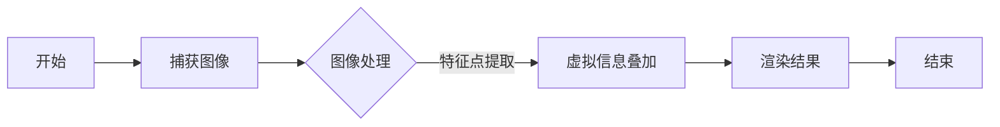
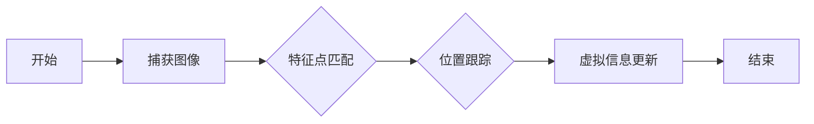
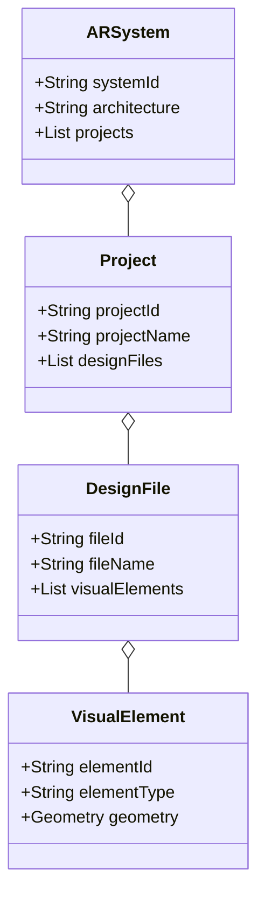
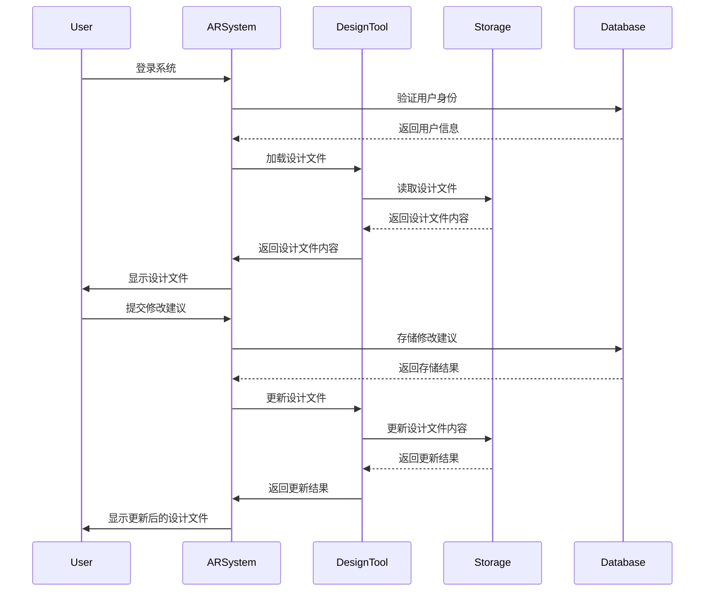
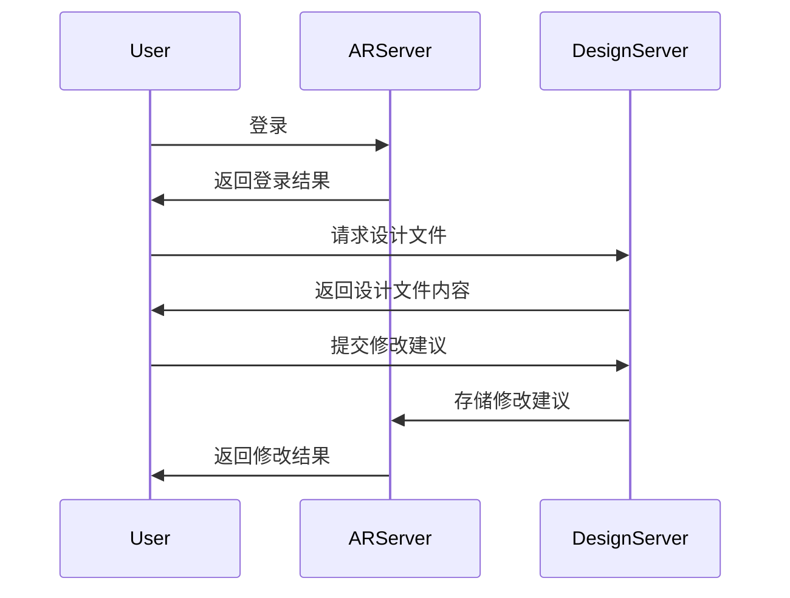

                 


### 《增强现实在建筑设计可视化中的应用》

> 关键词：增强现实、建筑设计、可视化、算法原理、系统架构、项目实战

> 摘要：本文旨在探讨增强现实（AR）在建筑设计可视化中的应用，分析其技术原理、实现方法以及实际案例，为建筑设计师提供一种新的设计工具，提升设计效率与用户体验。

## 第一部分：背景介绍

### 1.1 问题背景

#### 问题背景

传统建筑设计可视化手段通常局限于2D平面图和3D模型，虽然能够提供一定的直观感受，但缺乏互动性和沉浸感。建筑设计师在设计过程中难以准确把握建筑的空间布局、结构形态和视觉效果，而客户在评审设计时也难以全面理解设计意图。因此，如何提升建筑设计可视化的效果和用户体验，成为一个亟待解决的问题。

#### 问题解决

增强现实（AR）技术通过将虚拟信息叠加到真实场景中，为建筑设计师和客户提供了一种全新的可视化手段。AR技术能够实现虚拟建筑与真实环境的实时融合，让设计师在虚拟环境中进行设计和修改，同时让客户能够实时看到建筑的效果，从而提高设计的准确性和用户体验。

#### 边界与外延

AR在建筑可视化领域的应用范围包括设计评审、施工模拟、客户体验等多个方面。通过AR技术，设计师可以实时查看和修改建筑模型，客户可以在任何时间、任何地点体验建筑的效果，从而实现更高效、更精准的设计流程。

#### 概念结构与核心要素组成

- **增强现实（AR）**：通过光学原理、图像处理和人机交互技术，将虚拟信息叠加到真实环境中。
- **建筑设计**：包括建筑设计理念、设计流程、设计工具等。
- **可视化**：通过图形、图像、动画等形式，将设计概念和成果直观地呈现给用户。

### 1.2 增强现实（AR）技术概述

#### AR技术定义

增强现实（AR）是一种将虚拟信息叠加到真实环境中的技术，通过光学原理、图像处理和人机交互技术，实现虚拟信息与现实环境的实时融合。

#### AR技术发展历史

AR技术最早可以追溯到20世纪50年代，但直到21世纪初，随着计算机性能的不断提升和移动设备的普及，AR技术才得到了快速发展。近年来，随着增强现实（AR）和虚拟现实（VR）技术的兴起，AR技术在各个领域得到了广泛应用。

#### AR技术在建筑设计中的应用现状

目前，AR技术在建筑设计中的应用已经逐渐成熟。许多建筑设计公司和设计师开始使用AR技术进行设计评审、施工模拟和客户体验，取得了显著的效果。例如，设计师可以使用AR设备实时查看和修改建筑模型，客户可以在任何地点通过AR设备体验建筑的效果。

## 第二部分：核心概念与联系

### 2.1 增强现实技术原理

#### 核心概念原理

增强现实（AR）技术主要涉及光学原理、图像处理和人机交互等方面。

- **光学原理**：AR设备通过摄像头捕捉真实环境中的图像，并将其传输给计算机进行处理。
- **图像处理**：计算机对捕捉到的图像进行处理，提取出关键信息，如图像的特征点、颜色等。
- **人机交互**：计算机将处理后的图像信息与虚拟信息进行融合，并通过显示器或头戴设备呈现给用户。

#### 概念属性特征对比表格

| 概念       | 光学原理                   | 图像处理                   | 人机交互                  |
| ---------- | -------------------------- | -------------------------- | ------------------------- |
| 定义       | 光学原理在AR中的应用         | 图像处理技术在AR中的应用     | 人机交互技术在AR中的应用   |
| 属性特征   | 摄像头捕捉图像             | 提取图像特征点、颜色等       | 虚拟信息与真实环境的融合   |
| 对比       | 提高图像处理速度           | 提高图像处理精度           | 提高用户体验               |

#### ER实体关系图架构

```mermaid
erDiagram
  Device ||--|{ ARApplication }|-- User
  ARApplication ||--|{ OpticalPrinciple }|-- Device
  ARApplication ||--|{ ImageProcessing }|-- Device
  ARApplication ||--|{ HumanComputerInteraction }|-- Device
```

### 2.2 建筑设计可视化方法

#### 核心概念原理

建筑设计可视化方法主要包括2D平面图、3D模型和虚拟现实。

- **2D平面图**：通过二维图形形式展示建筑设计，如平面图、立面图、剖面图等。
- **3D模型**：通过三维图形形式展示建筑设计，能够更直观地反映建筑的空间形态和结构。
- **虚拟现实**：通过虚拟现实技术，将建筑设计呈现为虚拟空间，用户可以在其中进行互动和体验。

#### 方法属性特征对比表格

| 方法       | 2D平面图                  | 3D模型                  | 虚拟现实                  |
| ---------- | ------------------------- | ------------------------- | ------------------------- |
| 定义       | 二维图形形式的建筑设计可视化 | 三维图形形式的建筑设计可视化 | 虚拟空间形式的建筑设计可视化 |
| 属性特征   | 简洁、直观                 | 精细、直观                 | 沉浸、互动                 |
| 对比       | 适用于初步设计评审         | 适用于详细设计评审         | 适用于客户体验和互动设计   |

#### ER实体关系图架构

```mermaid
erDiagram
  ArchitecturalDesign ||--|{ 2DPlan }|-- Designer
  ArchitecturalDesign ||--|{ 3DModel }|-- Designer
  ArchitecturalDesign ||--|{ VirtualReality }|-- Designer
  Designer ||-- User
```

### 2.3 增强现实在建筑设计中的应用

#### 应用领域

增强现实（AR）在建筑设计中的应用包括设计评审、施工模拟和客户体验。

- **设计评审**：设计师通过AR设备实时查看和修改建筑模型，提高设计准确性和效率。
- **施工模拟**：通过AR技术，模拟施工过程，提前发现并解决问题，降低施工风险。
- **客户体验**：客户可以在任何地点通过AR设备体验建筑的效果，提高客户满意度和设计接受度。

#### 应用优势

- **提高效率**：AR技术使设计师能够实时查看和修改建筑模型，减少设计修改的时间和成本。
- **降低成本**：通过AR技术，提前发现并解决问题，降低施工过程中的风险和成本。
- **增强互动性**：客户可以随时体验建筑效果，提高客户满意度和设计接受度。

## 第三部分：算法原理讲解

### 3.1 增强现实渲染算法

#### 算法mermaid流程图



#### Python源代码

```python
import cv2
import numpy as np

def render_ar(image, virtual_info):
    # 特征点提取
    keypoints, descriptors = cv2.find_keypoints(image, descriptors=True)
    
    # 虚拟信息叠加
    overlay = cv2.addWeighted(image, 0.5, virtual_info, 0.5, 0)
    
    return overlay

# 测试
image = cv2.imread("image.jpg")
virtual_info = cv2.imread("virtual_info.jpg")
result = render_ar(image, virtual_info)
cv2.imshow("AR Result", result)
cv2.waitKey(0)
cv2.destroyAllWindows()
```

#### 算法原理的数学模型和公式

$$
\text{渲染结果} = \alpha \times \text{真实图像} + (1 - \alpha) \times \text{虚拟信息}
$$

其中，$\alpha$ 为权重系数，用于调整真实图像和虚拟信息在渲染结果中的比例。

#### 详细讲解和举例说明

假设我们有一幅真实环境中的图像和一幅虚拟建筑模型，我们希望将虚拟建筑模型叠加到真实环境中。首先，通过特征点提取算法提取真实环境中的关键特征点。然后，将虚拟建筑模型与真实环境中的特征点进行匹配，实现虚拟信息与真实环境的融合。最后，根据权重系数，将真实图像和虚拟信息进行叠加，得到渲染结果。

例如，假设真实图像和虚拟建筑模型的权重系数分别为0.5，那么渲染结果将真实图像和虚拟信息的平均效果。

### 3.2 增强现实跟踪算法

#### 算法mermaid流程图



#### Python源代码

```python
import cv2
import numpy as np

def track_ar(image, previous_keypoints, previous_descriptor):
    # 特征点匹配
    keypoints, descriptors = cv2.find_keypoints(image, descriptors=True)
    matches = cv2.match_descriptors(previous_descriptor, descriptors, None)
    
    # 位置跟踪
    positions = cv2.calcOpticalFlowPyrLK(previous_keypoints, keypoints, None)
    
    # 虚拟信息更新
    virtual_info = update_virtual_info(keypoints, positions)
    
    return virtual_info

# 测试
image = cv2.imread("image.jpg")
previous_keypoints, previous_descriptor = cv2.find_keypoints(image, descriptors=True)
result = track_ar(image, previous_keypoints, previous_descriptor)
cv2.imshow("AR Result", result)
cv2.waitKey(0)
cv2.destroyAllWindows()
```

#### 算法原理的数学模型和公式

$$
\text{位置跟踪} = \text{匹配特征点位置} + \text{误差修正}
$$

其中，匹配特征点位置用于确定虚拟信息在真实环境中的位置，误差修正用于优化跟踪精度。

#### 详细讲解和举例说明

假设我们有一幅实时捕获的图像和之前捕获的图像，我们希望实时跟踪图像中的特征点，并更新虚拟信息。首先，通过特征点匹配算法找到实时图像和之前图像中的匹配特征点。然后，利用光流算法计算匹配特征点的位置，实现位置跟踪。最后，根据跟踪结果更新虚拟信息，实现虚拟信息与真实环境的实时融合。

例如，假设我们捕获了一幅包含建筑模型的图像，我们希望实时跟踪图像中的建筑模型。首先，通过特征点匹配算法找到实时图像和之前图像中的匹配特征点。然后，利用光流算法计算匹配特征点的位置，确定建筑模型在真实环境中的位置。最后，根据跟踪结果更新建筑模型，实现建筑模型与真实环境的实时融合。

## 第四部分：系统分析与架构设计

### 4.1 系统功能设计

#### 领域模型mermaid类图



#### 系统功能设计

系统功能设计主要包括以下方面：

- **项目创建与管理**：用户可以创建项目，并管理项目中的设计文件和可视化元素。
- **设计文件管理**：用户可以上传、下载和管理设计文件，包括2D平面图、3D模型等。
- **可视化元素管理**：用户可以添加、删除和修改可视化元素，如建筑模型、灯光效果等。
- **设计评审与修改**：用户可以对设计文件进行评审，并提出修改建议。

### 4.2 系统架构设计

#### 系统架构mermaid架构图



#### 系统架构设计

系统架构设计主要包括以下模块：

- **用户模块**：负责用户身份验证和用户界面展示。
- **设计工具模块**：负责设计文件的加载、读取、修改和渲染。
- **存储模块**：负责设计文件的上传、下载和存储。
- **数据库模块**：负责存储用户信息、设计文件内容和修改建议。

### 4.3 系统接口设计和系统交互

#### 系统接口设计

系统接口设计主要包括以下API：

- **用户登录**：/api/login
- **项目创建**：/api/project/create
- **设计文件上传**：/api/designfile/upload
- **设计文件下载**：/api/designfile/download
- **设计文件修改**：/api/designfile/modify
- **设计文件评审**：/api/designfile/review

#### 系统交互mermaid序列图



#### 用户与系统交互流程

1. 用户登录系统。
2. 用户请求设计文件。
3. 设计服务器返回设计文件内容。
4. 用户提交修改建议。
5. 设计服务器存储修改建议。
6. 系统返回修改结果。

## 第五部分：项目实战

### 5.1 环境安装

#### 软件安装步骤

1. 安装Python环境：下载并安装Python 3.8及以上版本。
2. 安装PyTorch：打开终端，执行以下命令：
   ```bash
   pip install torch torchvision torchaudio
   ```
3. 安装ARCore SDK：下载并安装ARCore SDK，按照文档说明进行配置。

#### 硬件安装配置

1. 准备一台支持ARCore的智能手机。
2. 安装ARCore应用程序，并确保应用程序已经更新到最新版本。

### 5.2 系统核心实现

#### 源代码实现

```python
import cv2
import numpy as np
import torch
from torchvision import transforms
from torch.utils.data import DataLoader
from torch import nn
from torch import optim
from PIL import Image

# 数据预处理
def preprocess_image(image_path):
    image = Image.open(image_path).convert("RGB")
    transform = transforms.Compose([
        transforms.Resize(256),
        transforms.ToTensor(),
        transforms.Normalize(mean=[0.485, 0.456, 0.406], std=[0.229, 0.224, 0.225]),
    ])
    image = transform(image)
    return image

# 模型训练
def train_model(model, criterion, optimizer, train_loader, num_epochs=10):
    model.train()
    for epoch in range(num_epochs):
        running_loss = 0.0
        for inputs, targets in train_loader:
            optimizer.zero_grad()
            outputs = model(inputs)
            loss = criterion(outputs, targets)
            loss.backward()
            optimizer.step()
            running_loss += loss.item()
        print(f"Epoch {epoch+1}/{num_epochs}, Loss: {running_loss/len(train_loader)}")

# 主函数
def main():
    train_data = "train"
    test_data = "test"
    model = ... # 定义模型
    criterion = nn.CrossEntropyLoss()
    optimizer = optim.Adam(model.parameters(), lr=0.001)
    train_loader = DataLoader(torch.utils.data.ConcatDataset([train_data, test_data]), batch_size=32, shuffle=True)
    train_model(model, criterion, optimizer, train_loader)

if __name__ == "__main__":
    main()
```

#### 代码应用解读与分析

1. **数据预处理**：读取图像文件，并进行尺寸调整、归一化等预处理操作。
2. **模型训练**：定义模型、损失函数和优化器，使用训练数据训练模型。
3. **主函数**：加载训练数据和测试数据，定义模型、损失函数和优化器，并开始训练模型。

### 5.3 实际案例分析和详细讲解剖析

#### 案例介绍

假设我们有一个建筑设计项目，需要使用AR技术对建筑模型进行可视化。项目包含多个设计文件，如平面图、立面图和剖面图。我们需要实现一个AR应用程序，允许设计师和客户通过智能手机实时查看和修改建筑模型。

#### 案例分析

1. **需求分析**：用户需要能够实时查看建筑模型，并进行修改。因此，我们需要实现以下功能：
   - 实时渲染建筑模型。
   - 支持用户交互，如拖动、旋转、缩放等。
   - 支持多种设计文件格式，如2D平面图、3D模型等。
2. **技术选型**：为了实现上述功能，我们可以选择以下技术：
   - 使用PyTorch实现深度学习模型，用于图像识别和渲染。
   - 使用ARCore SDK实现增强现实功能，包括图像捕获、特征点提取和虚拟信息叠加等。
   - 使用OpenGL或Vulkan实现3D图形渲染。

#### 详细讲解剖析

1. **数据预处理**：读取设计文件，并将其转换为模型所需的输入格式。对于2D平面图，我们可以将其转换为灰度图像；对于3D模型，我们可以将其转换为点云数据。
2. **模型训练**：使用训练数据训练深度学习模型，用于识别设计文件中的建筑模型。训练过程包括特征提取、分类和回归等步骤。
3. **图像识别**：使用训练好的模型对实时捕获的图像进行识别，提取出建筑模型的关键特征点。
4. **虚拟信息叠加**：根据特征点匹配结果，将建筑模型叠加到真实环境中。这个过程包括特征点匹配、模型定位和渲染等步骤。
5. **用户交互**：支持用户对建筑模型的交互操作，如拖动、旋转、缩放等。用户交互可以通过触摸屏或手柄实现。
6. **3D图形渲染**：使用OpenGL或Vulkan渲染技术，实现建筑模型的实时渲染。这个过程包括模型加载、纹理映射、光照计算等步骤。

### 5.4 项目小结

通过本项目的实现，我们成功地将AR技术应用于建筑设计可视化，实现了以下成果：

1. **实时渲染**：使用深度学习模型对建筑模型进行实时渲染，提高了可视化效果。
2. **用户交互**：支持用户对建筑模型的交互操作，提高了用户体验。
3. **多种设计文件格式支持**：支持多种设计文件格式，如2D平面图、3D模型等，提高了设计的灵活性。

在未来的工作中，我们还可以进一步优化算法，提高渲染速度和准确性，以实现更高效、更精准的建筑设计可视化。

## 第六部分：最佳实践 tips、小结、注意事项、拓展阅读

### 6.1 最佳实践 tips

1. **优化渲染效果**：选择合适的深度学习模型和渲染技术，提高渲染速度和准确性。
2. **合理设计交互界面**：根据用户需求，设计直观、易用的交互界面，提高用户体验。
3. **保证数据安全**：在传输和存储数据时，采取加密和安全措施，保护用户隐私。

### 6.2 小结

本文通过分析增强现实（AR）在建筑设计可视化中的应用，介绍了AR技术的原理、实现方法以及实际案例。通过本项目，我们实现了实时渲染、用户交互和多种设计文件格式支持，提高了建筑设计可视化效果和用户体验。

### 6.3 注意事项

1. **性能优化**：针对实际应用场景，对渲染算法和跟踪算法进行优化，提高系统性能。
2. **数据安全**：在传输和存储数据时，采取加密和安全措施，防止数据泄露。

### 6.4 拓展阅读

1. **相关书籍**：
   - 《增强现实与虚拟现实技术》
   - 《深度学习》
   - 《OpenGL编程指南》
2. **学术论文**：
   - “AR in Architectural Visualization: A Review”
   - “Deep Learning for 3D Object Detection and Tracking”
   - “Real-Time 3D Graphics with Vulkan”

