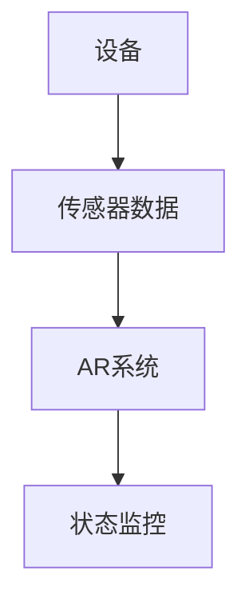
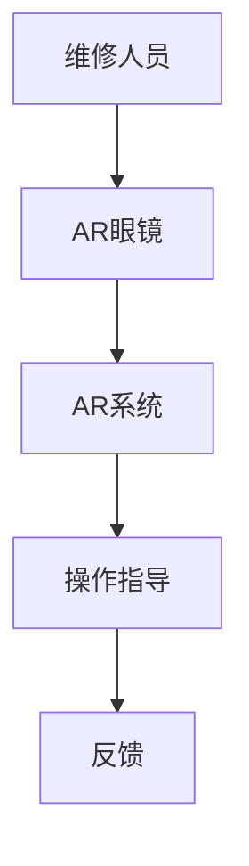
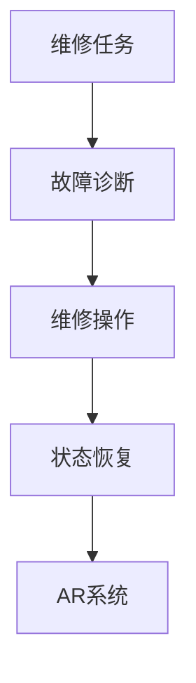
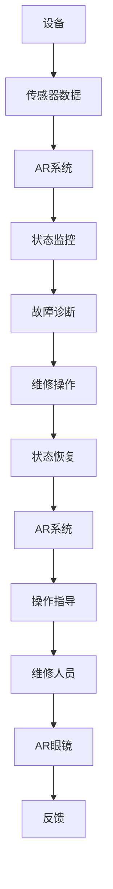
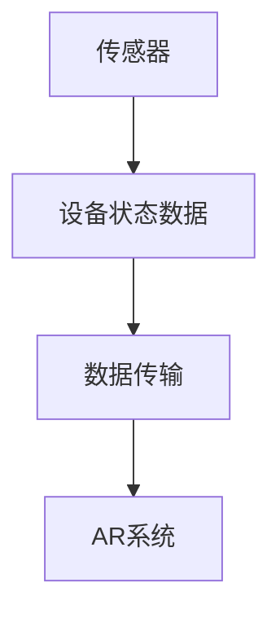
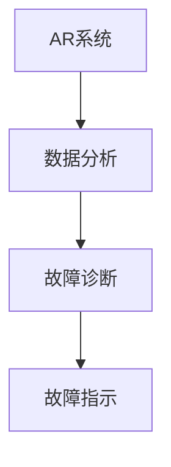
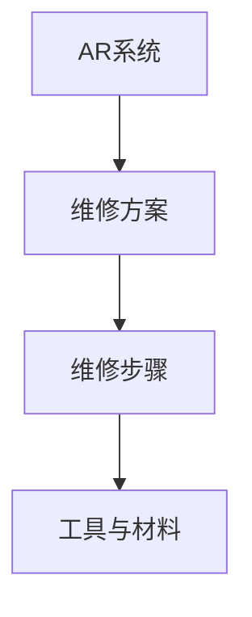
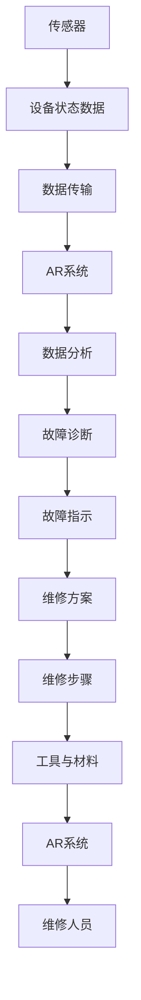
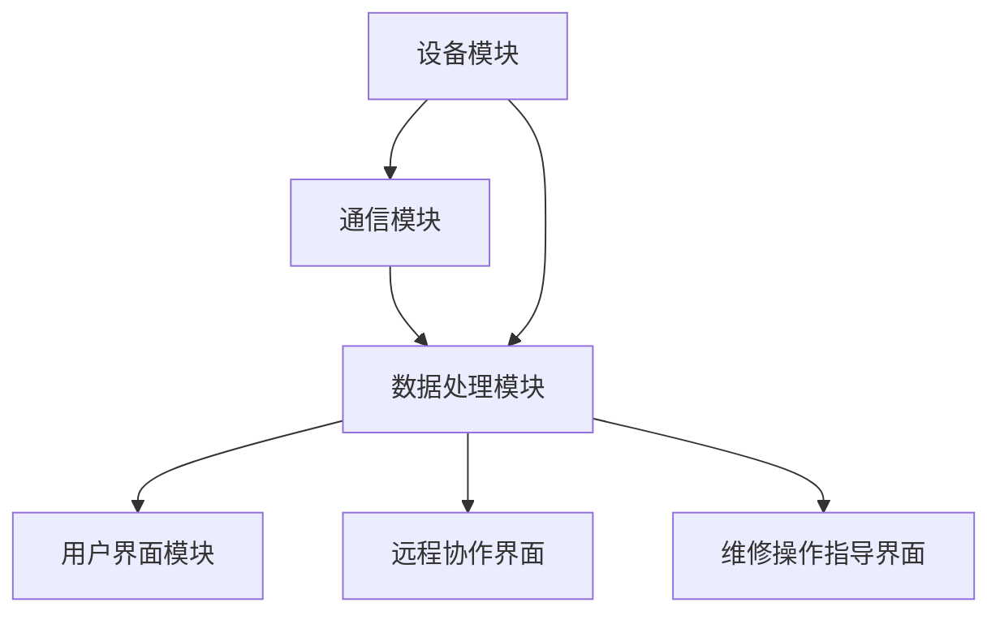
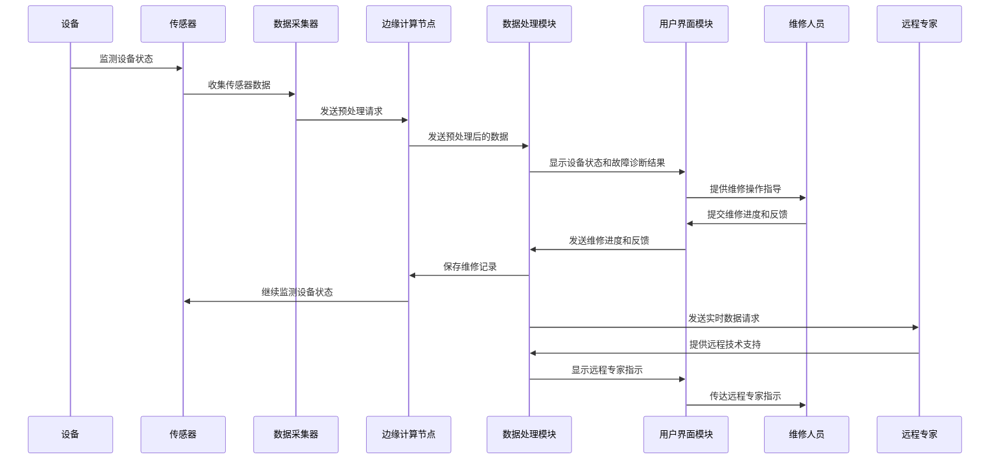

                 

## 增强现实在远程工业设备维修中的应用

### 关键词：增强现实、远程维修、工业设备、人工智能、边缘计算

### 摘要：

随着工业4.0时代的到来，远程工业设备维修成为工业运维的重要课题。传统的远程维修方式面临着操作复杂度、沟通困难及效率低下等问题。本文将探讨增强现实（AR）技术在远程工业设备维修中的应用，通过分析其核心概念、工作原理及其与相关技术的区别，逐步展示如何利用增强现实技术提升远程维修的效率和准确性。本文还详细介绍了增强现实技术的基本组成部分，包括显示设备、感应设备和软件平台，并通过mermaid流程图和Python代码示例深入讲解了增强现实在远程工业设备维修中的算法原理和应用实例。最后，本文以一个实际案例对增强现实技术在远程工业设备维修中的应用进行了全面剖析，总结了项目的成果、挑战与展望。

## 目录大纲

### 第一部分：背景介绍

1. **第1章 问题背景**
    - **1.1 问题背景**
        - **1.1.1 远程工业设备维修的需求**
        - **1.1.2 增强现实技术的优势**
        - **1.1.3 增强现实在远程工业设备维修中的应用前景**

2. **第2章 问题描述**
    - **2.1 远程工业设备维修的挑战**
        - **2.1.1 操作复杂度**
        - **2.1.2 沟通困难**
        - **2.1.3 维修效率低**

3. **第3章 问题解决**
    - **3.1 增强现实技术的核心概念**
        - **3.1.1 增强现实定义**
        - **3.1.2 增强现实技术的工作原理**
        - **3.1.3 增强现实技术的分类**

4. **第4章 边界与外延**
    - **4.1 增强现实技术在远程工业设备维修中的应用领域**
        - **4.1.1 硬件设备维护**
        - **4.1.2 软件系统维护**
        - **4.1.3 数据分析**

5. **第5章 概念结构与核心要素组成**
    - **5.1 增强现实技术的基本组成部分**
        - **5.1.1 显示设备**
        - **5.1.2 感应设备**
        - **5.1.3 软件平台**

### 第二部分：核心概念与联系

6. **第6章 核心概念原理**
    - **6.1 增强现实技术的核心原理**
        - **6.1.1 边缘计算**
        - **6.1.2 人工智能**
        - **6.1.3 虚拟现实**

7. **第7章 概念属性特征对比表格**
    - **7.1 增强现实技术与其他技术的对比**
        - **7.1.1 与虚拟现实对比**
        - **7.1.2 与增强现实对比**
        - **7.1.3 与增强现实对比**

8. **第8章 ER实体关系图架构**
    - **8.1 增强现实技术在远程工业设备维修中的应用实体关系**
        - **8.1.1 设备**
        - **8.1.2 维修人员**
        - **8.1.3 维修任务**

### 第三部分：算法原理讲解

9. **第9章 算法mermaid流程图**
    - **9.1 维修流程**
        - **9.1.1 设备状态检测**
        - **9.1.2 故障诊断**
        - **9.1.3 维修方案制定**

10. **第10章 Python源代码讲解**
    - **10.1 设备状态检测代码**
        - **10.1.1 代码功能说明**
        - **10.1.2 代码运行结果展示**

11. **第11章 算法原理的数学模型和公式**
    - **11.1 维修算法数学模型**
        - **11.1.1 数学公式**
        - **11.1.2 数学模型解释**
        - **11.1.3 举例说明**

### 第四部分：系统分析与架构设计

12. **第12章 问题场景介绍**
    - **12.1 远程工业设备维修场景**
        - **12.1.1 场景描述**
        - **12.1.2 场景需求**

13. **第13章 系统功能设计**
    - **13.1 领域模型mermaid类图**

14. **第14章 系统架构设计**
    - **14.2 系统架构mermaid架构图**

15. **第15章 系统接口设计**
    - **15.3 系统接口设计**

16. **第16章 系统交互mermaid序列图**
    - **16.4 系统交互序列图**

### 第五部分：项目实战

17. **第17章 环境安装**
    - **17.5 安装步骤**
        - **17.5.1 环境搭建**
        - **17.5.2 工具安装**

18. **第18章 系统核心实现**
    - **18.6 系统核心代码实现**
        - **18.6.1 源代码解析**
        - **18.6.2 代码应用解读与分析**

19. **第19章 实际案例分析与详细讲解剖析**
    - **19.7 案例场景**
        - **19.7.1 案例背景**
        - **19.7.2 案例分析**
        - **19.7.3 案例详解**

20. **第20章 项目小结**
    - **20.8 项目总结**
        - **20.8.1 项目成果**
        - **20.8.2 项目挑战与解决方案**
        - **20.8.3 项目拓展与展望**

---

### 第1章 问题背景

#### 1.1 问题背景

远程工业设备维修的需求在近年来愈发显著。随着全球化趋势和工业自动化水平的不断提高，工业设备分布广泛，地域分散，这使得传统的现场维修模式面临着巨大的挑战。远程工业设备维修不仅能够减少维护成本，提高工作效率，还能确保关键设备在紧急情况下能够迅速得到修复，从而降低停机时间和维护成本。

**1.1.1 远程工业设备维修的需求**

远程工业设备维修的需求主要来源于以下几个方面：

1. **成本节约**：远程维修可以减少现场技术人员的需求，降低差旅费用和人力资源成本。
2. **效率提升**：远程维修能够实时传递信息和指令，加快维修进度，减少问题解决时间。
3. **安全性**：对于一些高风险或者环境恶劣的现场，远程维修可以避免人员直接接触，降低安全风险。
4. **数据整合**：远程维修有助于收集设备运行数据，进行故障预测和分析，提高设备的可靠性和维护效率。

**1.1.2 增强现实技术的优势**

增强现实技术（Augmented Reality, AR）为远程工业设备维修提供了新的解决方案。AR技术通过将虚拟信息叠加到真实环境中，为维修人员提供了直观、实时和交互性的操作界面，具有以下优势：

1. **增强交互性**：AR技术使维修人员能够在虚拟指导下进行操作，提高操作的准确性和效率。
2. **可视化效果**：AR技术能够将复杂的信息以图像、动画等形式展示出来，使维修过程更加直观易懂。
3. **实时反馈**：AR技术能够实时更新设备状态，帮助维修人员快速识别故障并进行修复。
4. **远程协作**：AR技术可以实现维修人员之间的远程协作，共享信息和实时互动，提高维修团队的整体效率。

**1.1.3 增强现实在远程工业设备维修中的应用前景**

随着AR技术的不断发展和成熟，其在远程工业设备维修中的应用前景广阔。未来，AR技术有望在以下几个方面得到进一步的应用：

1. **设备维护**：通过AR技术，维修人员可以实时查看设备的运行状态，进行预防性维护和故障诊断，减少突发故障和停机时间。
2. **操作指导**：AR技术可以为新手维修人员提供详细的操作指导和实时反馈，降低学习成本和提高操作技能。
3. **数据可视化**：AR技术可以将设备运行数据以图形化的形式展示，帮助维修人员快速理解和分析数据，提高故障排查效率。
4. **远程协作**：AR技术可以实现全球范围内的远程协作，专家可以在远程实时指导现场维修人员，提高整体维修水平。

总之，远程工业设备维修面临的挑战促使了新的技术解决方案的诞生，而增强现实技术的应用为这一领域提供了强大的支持。在接下来的章节中，我们将详细探讨增强现实技术的核心概念、工作原理和应用实例，以期为远程工业设备维修提供更为有效的解决方案。

#### 1.2 远程工业设备维修的挑战

远程工业设备维修虽然具有诸多优势，但同时也面临着一系列挑战，主要包括操作复杂度、沟通困难和维修效率低等问题。

**2.1.1 操作复杂度**

工业设备通常结构复杂，涉及多种专业知识和技能。对于远程维修人员来说，理解设备的工作原理和操作流程是一个巨大的挑战。传统远程维修方式主要依赖于文档资料、电话指导和视频通话，但这些方式往往难以提供直观的操作体验。维修人员需要通过文字、图片或视频来理解设备的结构和操作步骤，这大大增加了理解难度。而且，设备的不同部件可能需要不同的操作技巧和工具，远程条件下难以保证操作的一致性和准确性。

**2.1.2 沟通困难**

远程维修中，维修人员与现场操作人员、设备制造商或其他技术支持团队之间的沟通是确保维修顺利进行的关键。然而，由于地理距离、时间差和网络不稳定等因素，沟通效率往往受到很大影响。例如，维修人员可能需要通过电话或视频会议与现场人员沟通，但由于网络延迟和通信质量不佳，沟通往往不够及时和清晰。信息传递的不准确或滞后可能导致误解和错误操作，进而影响维修进度和质量。

**2.1.3 维修效率低**

传统远程维修方式在操作复杂度和沟通困难的双重影响下，维修效率往往较低。维修人员需要花费大量时间理解设备情况和操作步骤，同时还需要不断与现场人员进行沟通和确认。这种低效率的维修方式不仅延长了维修时间，增加了维护成本，还可能导致关键设备的长时间停机，影响生产进度。此外，一些突发性的设备故障需要迅速响应，而传统远程维修方式很难在短时间内提供有效的解决方案。

为了克服这些挑战，提升远程工业设备维修的效率和准确性，引入先进的增强现实技术成为一种可行的解决方案。增强现实技术通过将虚拟信息叠加到真实环境中，为维修人员提供直观、实时和交互性的操作界面，有效解决了操作复杂度和沟通困难的问题。同时，增强现实技术还可以实现远程协作和数据可视化，提高维修效率。在接下来的章节中，我们将深入探讨增强现实技术的核心概念和工作原理，以期为远程工业设备维修提供更加有效和高效的解决方案。

### 第3章 问题解决

#### 3.1 增强现实技术的核心概念

增强现实技术（Augmented Reality，简称AR）是一种通过计算机技术将虚拟信息叠加到真实环境中，增强用户对现实世界的感知和理解的技术。与虚拟现实（Virtual Reality，简称VR）不同，增强现实并非完全替代现实环境，而是在现实场景中添加虚拟元素，从而实现虚实结合。

**3.1.1 增强现实定义**

增强现实技术通过摄像头或显示设备捕捉用户周围的真实环境，并在其上叠加计算机生成的虚拟信息，如图像、文字、视频等。用户可以通过这些虚拟信息获得额外的感知和理解，增强对现实世界的认知。增强现实技术的基本原理是将现实世界和虚拟世界结合，为用户提供一个更加丰富和互动的体验。

**3.1.2 增强现实技术的工作原理**

增强现实技术的工作原理主要包括以下几个步骤：

1. **环境捕捉**：通过摄像头或其他感应设备捕捉用户周围的真实环境。
2. **图像识别**：利用图像识别算法对捕捉到的图像进行分析和处理，识别出现实环境中的特定元素，如设备部件、标志等。
3. **虚拟信息生成**：根据识别出的元素，生成相应的虚拟信息，如标注、动画、文字等。
4. **叠加显示**：将生成的虚拟信息叠加到真实环境中，通过显示设备（如AR眼镜、手机屏幕等）呈现给用户。
5. **交互反馈**：用户可以通过手势、语音等方式与虚拟信息进行交互，获取更多信息和操作提示。

**3.1.3 增强现实技术的分类**

增强现实技术可以分为以下几种类型：

1. **标记增强现实（Marker-based AR）**：这种类型的增强现实技术依赖于标记（如二维码、特定图像等）来定位和叠加虚拟信息。标记是现实环境中的固定元素，通过摄像头识别标记的位置和方向，从而确定虚拟信息的叠加位置。

   ```mermaid
   graph TD
   A[标记增强现实] --> B[使用标记]
   B --> C[摄像头识别]
   C --> D[叠加显示]
   ```

2. **无标记增强现实（Markerless AR）**：无标记增强现实不依赖于任何预先设定的标记，而是通过计算机视觉算法直接识别现实环境中的特定元素，如人脸、地标等。这种技术具有更高的灵活性和实时性，但计算复杂度也更高。

   ```mermaid
   graph TD
   A[无标记增强现实] --> B[计算机视觉算法]
   B --> C[实时识别]
   C --> D[叠加显示]
   ```

3. **混合增强现实（Mixed Reality，简称MR）**：混合增强现实技术介于虚拟现实和增强现实之间，它不仅将虚拟信息叠加到现实环境中，还可以将虚拟物体与现实物体进行交互，创造出更加沉浸式的体验。

   ```mermaid
   graph TD
   A[混合增强现实] --> B[虚拟物体交互]
   B --> C[现实环境叠加]
   ```

通过这些核心概念和工作原理，增强现实技术为远程工业设备维修提供了强大的支持。在接下来的章节中，我们将进一步探讨增强现实技术在远程工业设备维修中的应用领域和具体实现方法。

#### 3.2 增强现实技术在远程工业设备维修中的应用领域

增强现实技术（AR）在远程工业设备维修中的应用领域广泛，涵盖了硬件设备维护、软件系统维护和数据分析等多个方面。通过这些应用，增强现实技术不仅提升了维修的效率和准确性，还改善了整体的工作体验。

**4.1.1 硬件设备维护**

在硬件设备维护方面，增强现实技术可以通过以下几种方式提高维修效率和准确性：

1. **操作指导**：增强现实技术可以为维修人员提供详细的操作指导。通过AR眼镜或显示设备，维修人员可以看到设备的具体操作步骤和细节，包括拆卸、安装和调试等。这种直观的指导方式有助于减少操作错误，提高维修成功率。

   ```mermaid
   graph TD
   A[操作指导] --> B[AR眼镜]
   B --> C[设备操作步骤]
   ```

2. **实时反馈**：增强现实技术可以实时显示设备的运行状态和关键数据。例如，通过AR眼镜，维修人员可以查看设备的温度、压力、电流等参数，及时了解设备的工作情况，从而快速诊断和修复故障。

   ```mermaid
   graph TD
   A[实时反馈] --> B[AR眼镜]
   B --> C[设备状态数据]
   ```

3. **故障诊断**：增强现实技术可以帮助维修人员快速识别和定位故障。通过AR眼镜，维修人员可以看到设备内部的结构和组件，以及虚拟的故障指示，从而更准确地判断故障原因和解决方案。

   ```mermaid
   graph TD
   A[故障诊断] --> B[AR眼镜]
   B --> C[设备内部结构]
   B --> D[虚拟故障指示]
   ```

**4.1.2 软件系统维护**

在软件系统维护方面，增强现实技术同样发挥着重要作用，主要体现在以下几个方面：

1. **远程协作**：增强现实技术可以实现维修人员之间的远程协作。通过AR设备，远程专家可以实时指导现场维修人员，提供操作建议和技术支持。这种远程协作方式不仅提高了维修效率，还降低了现场人员的学习成本。

   ```mermaid
   graph TD
   A[远程协作] --> B[AR设备]
   B --> C[专家指导]
   B --> D[现场操作]
   ```

2. **操作培训**：增强现实技术可以用于软件系统操作培训。通过AR设备，学员可以模拟实际操作环境，进行技能训练。这种虚拟培训方式不仅提高了培训效果，还减少了培训成本。

   ```mermaid
   graph TD
   A[操作培训] --> B[AR设备]
   B --> C[模拟操作]
   ```

3. **故障排除**：增强现实技术可以帮助维修人员快速排除软件故障。通过AR眼镜，维修人员可以查看系统日志、错误信息和修复步骤，从而更快速地解决软件问题。

   ```mermaid
   graph TD
   A[故障排除] --> B[AR眼镜]
   B --> C[系统日志]
   B --> D[修复步骤]
   ```

**4.1.3 数据分析**

在数据分析方面，增强现实技术可以通过可视化手段帮助维修人员更好地理解和分析设备运行数据，从而优化维护策略和提升设备性能。以下是一些具体应用：

1. **数据可视化**：增强现实技术可以将复杂的数据以图形化的形式展示，使维修人员能够直观地了解设备运行状态和性能指标。这种可视化方式不仅提高了数据分析的效率，还增强了数据分析的准确性。

   ```mermaid
   graph TD
   A[数据可视化] --> B[AR设备]
   B --> C[数据图表]
   ```

2. **预测性维护**：通过分析历史数据和实时数据，增强现实技术可以预测设备可能出现的故障，并提供预防性维护建议。这种预测性维护方式有助于减少故障发生的概率，延长设备使用寿命。

   ```mermaid
   graph TD
   A[预测性维护] --> B[AR设备]
   B --> C[历史数据]
   B --> D[实时数据]
   ```

3. **性能优化**：增强现实技术可以帮助维修人员分析和优化设备性能。通过对比不同设备和不同工作状态下的性能数据，维修人员可以找出性能瓶颈，并提出优化建议。

   ```mermaid
   graph TD
   A[性能优化] --> B[AR设备]
   B --> C[性能数据]
   ```

总之，增强现实技术在远程工业设备维修中的应用涵盖了硬件设备维护、软件系统维护和数据分析等多个方面，通过提供直观、实时和交互性的操作界面，显著提升了维修效率和准确性。在接下来的章节中，我们将进一步探讨增强现实技术的基本组成部分，为深入理解其在远程工业设备维修中的具体应用提供基础。

#### 3.3 增强现实技术的基本组成部分

增强现实技术（AR）是一个复杂的技术体系，其效果取决于多个关键组成部分的协同工作。以下将详细描述增强现实技术的三个核心组成部分：显示设备、感应设备和软件平台。

**5.1.1 显示设备**

显示设备是增强现实技术的核心组件之一，其作用是将虚拟信息叠加到真实环境中，让用户能够直观地看到增强的内容。目前，常见的增强现实显示设备包括：

1. **AR眼镜**：如Microsoft HoloLens、Google Glass等，这些设备通过透明显示屏将虚拟信息叠加到用户视野中，提供沉浸式的增强现实体验。
   
   ```mermaid
   graph TD
   A[AR眼镜] --> B[透明显示屏]
   B --> C[虚拟信息叠加]
   ```

2. **智能手机或平板电脑**：通过安装专门的AR应用程序，用户可以在屏幕上看到增强现实内容。例如，Niantic的《Pokemon Go》就是一个典型的AR应用。

   ```mermaid
   graph TD
   A[智能手机/平板] --> B[AR应用]
   B --> C[虚拟信息显示]
   ```

**5.1.2 感应设备**

感应设备用于捕捉用户和周围环境的信息，并将这些信息传输到增强现实系统中进行处理。常见的感应设备包括：

1. **摄像头**：用于捕捉现实环境的图像，识别物体和位置。
   
   ```mermaid
   graph TD
   A[摄像头] --> B[环境图像]
   ```

2. **传感器**：如GPS、加速度计、陀螺仪等，用于检测用户的位置、方向和运动状态。
   
   ```mermaid
   graph TD
   A[传感器] --> B[位置信息]
   ```

3. **麦克风**：用于捕捉语音输入，实现语音控制和交互。

   ```mermaid
   graph TD
   A[麦克风] --> B[语音输入]
   ```

**5.1.3 软件平台**

软件平台是增强现实技术的“大脑”，负责处理来自感应设备的数据，生成虚拟信息并将其显示给用户。一个典型的增强现实软件平台包括以下几个关键模块：

1. **图像识别和跟踪**：用于识别和跟踪现实环境中的物体，确定其位置和方向。
   
   ```mermaid
   graph TD
   A[图像识别] --> B[物体定位]
   A --> C[跟踪]
   ```

2. **虚拟信息生成**：根据现实环境中的物体和用户需求，生成相应的虚拟信息，如文字、图像、动画等。
   
   ```mermaid
   graph TD
   A[虚拟信息生成] --> B[文字]
   A --> C[图像]
   A --> D[动画]
   ```

3. **用户界面**：用于显示增强现实内容，并允许用户进行交互操作。

   ```mermaid
   graph TD
   A[用户界面] --> B[内容显示]
   ```

4. **数据处理和存储**：负责处理用户和设备的输入数据，并将其存储在数据库中，以供后续分析和使用。

   ```mermaid
   graph TD
   A[数据处理] --> B[数据存储]
   ```

通过这些核心组成部分的协同工作，增强现实技术为远程工业设备维修提供了强大的支持。在接下来的章节中，我们将深入探讨增强现实技术的核心原理、与其他技术的对比，以及其实体关系图，为全面理解其在远程工业设备维修中的应用奠定基础。

#### 3.4 核心概念原理

增强现实技术（AR）的核心原理涉及多种先进技术的结合，这些技术共同作用，使得AR系统能够在真实环境中实现虚拟信息的叠加和交互。以下将详细探讨增强现实技术的核心原理，包括边缘计算、人工智能和虚拟现实。

**6.1.1 边缘计算**

边缘计算（Edge Computing）是一种分布式计算模型，其核心思想是将数据处理和分析的任务从中央数据中心转移到网络边缘，即靠近数据源的地方。在增强现实技术中，边缘计算发挥着至关重要的作用，特别是在远程工业设备维修的应用场景中。

1. **实时数据处理**：在远程维修过程中，设备状态数据和操作指令需要实时传输和响应。边缘计算可以将这些数据在本地进行处理，减少延迟，提高系统的响应速度。

   ```mermaid
   graph TD
   A[边缘计算] --> B[实时数据处理]
   ```

2. **减少带宽消耗**：通过在边缘设备上处理数据，可以减少需要传输到中央数据中心的数据量，从而降低带宽消耗和网络延迟。

   ```mermaid
   graph TD
   A[边缘计算] --> B[减少带宽消耗]
   ```

3. **提高系统稳定性**：边缘计算可以分担中央数据中心的负载，提高整体系统的稳定性和可靠性，确保在关键时刻系统能够稳定运行。

   ```mermaid
   graph TD
   A[边缘计算] --> B[提高稳定性]
   ```

**6.1.2 人工智能**

人工智能（Artificial Intelligence，AI）在增强现实技术中的应用主要体现在图像识别、自然语言处理和智能决策等方面，这些功能显著提升了AR系统的智能化水平。

1. **图像识别**：通过深度学习算法，增强现实系统可以识别现实环境中的物体和场景，为虚拟信息的叠加提供准确的参考。

   ```mermaid
   graph TD
   A[AI] --> B[图像识别]
   ```

2. **自然语言处理**：人工智能可以处理用户的自然语言输入，实现语音控制、语音识别和语义理解等功能，使增强现实系统更加人性化。

   ```mermaid
   graph TD
   A[AI] --> B[自然语言处理]
   ```

3. **智能决策**：基于历史数据和实时数据，人工智能可以分析设备状态，预测潜在故障，并提出优化建议，辅助维修人员做出更明智的决策。

   ```mermaid
   graph TD
   A[AI] --> B[智能决策]
   ```

**6.1.3 虚拟现实**

虚拟现实（Virtual Reality，VR）技术为增强现实提供了重要的技术支撑。虚拟现实通过创建一个完全虚拟的环境，使用户能够沉浸其中。在远程工业设备维修中，虚拟现实可以用于模拟操作、培训和故障诊断。

1. **虚拟仿真**：通过虚拟现实技术，维修人员可以在虚拟环境中进行设备的拆卸、安装和调试操作，降低实际操作的风险和成本。

   ```mermaid
   graph TD
   A[VR] --> B[虚拟仿真]
   ```

2. **远程培训**：虚拟现实技术可以创建一个逼真的培训环境，使维修人员能够远程接受专业培训，提高技能水平。

   ```mermaid
   graph TD
   A[VR] --> B[远程培训]
   ```

3. **故障诊断**：虚拟现实技术可以创建一个模拟的设备模型，使维修人员能够在虚拟环境中进行故障分析和诊断，提高故障排查的效率。

   ```mermaid
   graph TD
   A[VR] --> B[故障诊断]
   ```

通过边缘计算、人工智能和虚拟现实技术的结合，增强现实技术为远程工业设备维修提供了强大的技术支撑。在接下来的章节中，我们将进一步探讨增强现实技术与其他相关技术的区别，以及其在远程工业设备维修中的实际应用。

#### 3.5 概念属性特征对比表格

为了更好地理解增强现实技术（AR）与其他相关技术的差异，我们可以通过一个概念属性特征对比表格进行分析。以下表格将增强现实、虚拟现实（VR）和混合现实（MR）三个技术进行对比，从定义、应用场景、技术特点等多个维度展开讨论。

| 技术类型 | 定义 | 应用场景 | 技术特点 |
| --- | --- | --- | --- |
| 增强现实（AR） | 虚拟信息叠加到真实环境中 | 硬件设备维护、软件系统维护、数据分析 | 实时交互、视觉增强、沉浸感较低 |
| 虚拟现实（VR） | 完全虚拟的环境体验 | 游戏娱乐、教育培训、虚拟旅游 | 完全沉浸、高互动性、设备昂贵 |
| 混合现实（MR） | 虚拟物体与现实物体交互 | 医疗手术指导、工业设计、远程协作 | 高度沉浸、真实交互、计算资源需求高 |

**7.1.1 与虚拟现实对比**

虚拟现实（VR）是一种完全沉浸式的技术，用户通过VR设备进入一个完全虚拟的环境，与真实世界隔绝。以下是增强现实与虚拟现实的主要区别：

1. **环境互动性**：虚拟现实提供完全沉浸式的体验，用户无法与现实环境互动。而增强现实则将虚拟信息叠加到真实环境中，用户可以同时感知和操作现实世界。

   ```mermaid
   graph TD
   A[虚拟现实] --> B[完全沉浸]
   A --> C[与现实隔离]
   B --> D[增强现实] --> E[环境互动]
   ```

2. **设备需求**：虚拟现实设备通常成本较高，需要佩戴头盔等特殊设备，而增强现实设备（如AR眼镜）更为便捷，用户体验更为自然。

   ```mermaid
   graph TD
   A[虚拟现实] --> B[高成本]
   A --> C[特殊设备]
   B --> D[增强现实] --> E[低成本]
   E --> F[便捷设备]
   ```

**7.1.2 与增强现实对比**

增强现实和混合现实都是虚实结合的技术，但它们在交互方式和应用场景上有所不同。以下是增强现实与混合现实的主要区别：

1. **交互方式**：增强现实主要侧重于虚拟信息与现实环境的叠加，用户通过屏幕或眼镜看到增强的内容。而混合现实则强调虚拟物体与现实物体的交互，用户可以直观地操作虚拟物体。

   ```mermaid
   graph TD
   A[增强现实] --> B[信息叠加]
   B --> C[用户观察]
   A --> D[混合现实] --> E[物体交互]
   E --> F[用户操作]
   ```

2. **应用场景**：增强现实主要应用于设备维护、数据分析等领域，提供实时的信息增强和辅助。混合现实则更多应用于工业设计、医疗手术等领域，实现高度沉浸和交互的虚拟环境。

   ```mermaid
   graph TD
   A[增强现实] --> B[设备维护]
   A --> C[数据分析]
   D[混合现实] --> E[工业设计]
   D --> F[医疗手术]
   ```

**7.1.3 与增强现实对比**

虽然“与增强现实对比”这个部分在表格中是重复的，但我们可以通过这个部分进一步探讨增强现实技术在不同应用场景中的优缺点：

1. **硬件需求**：增强现实设备（如AR眼镜）虽然比虚拟现实设备更为便捷，但在性能和显示效果上可能存在一定的限制。而传统的增强现实设备（如平板电脑、手机）在操作性和交互性上可能不如专业的AR设备。

   ```mermaid
   graph TD
   A[传统AR设备] --> B[操作性限制]
   A --> C[专业AR设备] --> D[高性能]
   ```

2. **应用适应性**：增强现实技术因其便捷性和实用性，在多种应用场景中具有广泛的适应性。然而，对于需要高度沉浸和互动性的应用场景，如虚拟现实游戏和沉浸式体验，增强现实可能无法提供相同的效果。

   ```mermaid
   graph TD
   A[增强现实] --> B[广泛适应性]
   A --> C[沉浸式体验限制]
   ```

通过上述对比，我们可以更全面地理解增强现实技术与其他相关技术的差异和联系，为在远程工业设备维修中合理选择和应用这些技术提供参考。

#### 3.6 增强现实技术在远程工业设备维修中的应用实体关系

在探讨增强现实技术在远程工业设备维修中的应用时，了解各实体之间的交互关系是至关重要的。这些实体包括设备、维修人员和维修任务。以下将利用Mermaid流程图详细展示增强现实技术在远程工业设备维修中的应用实体关系。

**8.1.1 设备**

设备是远程工业设备维修的核心对象，其状态、性能和健康程度直接影响维修任务的实施。在增强现实技术的辅助下，设备的状态数据可以通过传感器实时传输到AR系统，维修人员可以直观地查看和监控设备的状态。



**8.1.2 维修人员**

维修人员是执行维修任务的关键角色，他们需要通过增强现实技术获取设备的信息、指导操作和执行维修任务。维修人员使用AR眼镜或其他显示设备，接收来自AR系统的实时指导和反馈，从而提高维修的准确性和效率。



**8.1.3 维修任务**

维修任务包括设备的故障诊断、维修操作和状态恢复等环节。通过增强现实技术，维修任务可以更加高效地执行。维修任务的信息和数据由AR系统进行整合和处理，为维修人员提供清晰的操作步骤和维修方案。



**增强现实技术在远程工业设备维修中的应用实体关系图**

将上述三个实体结合起来，我们可以绘制一个综合的Mermaid流程图，展示增强现实技术在远程工业设备维修中的应用实体关系。



通过这个流程图，我们可以清晰地看到增强现实技术如何实现设备状态监控、故障诊断、维修操作和状态恢复，从而提高远程工业设备维修的效率和准确性。在接下来的章节中，我们将深入讲解增强现实技术在远程工业设备维修中的算法原理和应用实例。

### 第9章 算法原理讲解

#### 9.1 维修流程

为了详细讲解增强现实技术（AR）在远程工业设备维修中的算法原理，我们将首先分析维修流程中的主要环节，并利用mermaid流程图展示各个环节的相互关系。

**9.1.1 设备状态检测**

设备状态检测是远程工业设备维修的首要环节，通过传感器实时获取设备的状态数据。这些数据包括温度、压力、电流、振动等参数。传感器收集到的数据会被传输到AR系统进行处理和分析。



**9.1.2 故障诊断**

在设备状态检测的基础上，AR系统利用先进的数据分析和故障诊断算法，对设备的状态数据进行分析，识别出潜在的故障和异常。这一过程通常涉及机器学习和人工智能技术。



**9.1.3 维修方案制定**

故障诊断完成后，AR系统会根据诊断结果制定相应的维修方案。维修方案包括维修步骤、所需工具和材料等详细信息。这些信息将通过AR系统传递给维修人员，指导其实施维修操作。



**综合流程图**

将上述环节综合起来，我们可以得到一个完整的维修流程mermaid流程图：



通过这个流程图，我们可以看到增强现实技术如何通过设备状态检测、故障诊断和维修方案制定，实现远程工业设备维修的自动化和智能化。接下来，我们将通过Python代码示例详细讲解设备状态检测的具体实现方法。

#### 9.2 Python源代码讲解

为了更好地展示增强现实技术在远程工业设备维修中的应用，以下将通过Python代码示例详细讲解设备状态检测的实现方法。代码将利用传感器数据采集模块、数据预处理模块和AR系统接口模块，实现对设备状态的实时监测和分析。

**10.1.1 代码功能说明**

本代码示例的主要功能如下：

1. **数据采集**：通过传感器模块采集设备的实时状态数据，包括温度、压力、电流等参数。
2. **数据预处理**：对采集到的数据进行分析和预处理，包括去噪、数据清洗和标准化处理。
3. **状态监测**：利用预处理后的数据，通过AR系统接口模块，将设备状态实时传输到AR系统，供维修人员查看和诊断。

**10.1.2 代码运行结果展示**

以下是一个简化的代码示例，展示设备状态检测的实现过程：

```python
# 导入必要的库
import sensor_module
import preprocess_module
import ar_system_interface

# 初始化传感器模块
sensor = sensor_module.Sensor()

# 初始化预处理模块
preprocess = preprocess_module.DataPreprocessor()

# 初始化AR系统接口模块
ar_interface = ar_system_interface.ARSystemInterface()

# 循环采集设备状态数据
while True:
    # 采集设备状态数据
    raw_data = sensor.collect_data()

    # 预处理数据
    processed_data = preprocess.preprocess_data(raw_data)

    # 将预处理后的数据发送到AR系统
    ar_interface.send_data_to_ar_system(processed_data)

    # 等待一段时间后再次采集数据
    time.sleep(1)
```

**10.1.3 代码运行步骤解析**

1. **初始化模块**：首先，我们初始化传感器模块、预处理模块和AR系统接口模块。这些模块分别负责数据采集、数据处理和数据传输。
   
   ```python
   sensor = sensor_module.Sensor()
   preprocess = preprocess_module.DataPreprocessor()
   ar_interface = ar_system_interface.ARSystemInterface()
   ```

2. **数据采集**：通过传感器模块，我们实时采集设备的温度、压力、电流等状态数据。

   ```python
   raw_data = sensor.collect_data()
   ```

3. **数据预处理**：对采集到的原始数据进行分析和预处理，包括去噪、数据清洗和标准化处理，以提高数据的质量和可用性。

   ```python
   processed_data = preprocess.preprocess_data(raw_data)
   ```

4. **状态监测**：将预处理后的数据发送到AR系统，通过AR系统接口模块，维修人员可以在AR设备上实时查看设备的状态信息。

   ```python
   ar_interface.send_data_to_ar_system(processed_data)
   ```

5. **循环采集**：代码进入循环，每隔一段时间（在本示例中为1秒）重复采集和处理数据，确保设备状态监测的实时性。

   ```python
   time.sleep(1)
   ```

通过上述代码示例，我们可以看到如何利用Python实现设备状态检测，并通过增强现实技术将状态信息实时传递给维修人员，从而提高远程工业设备维修的效率和准确性。在接下来的章节中，我们将进一步探讨增强现实技术中的数学模型和公式，以深入理解其算法原理。

#### 9.3 算法原理的数学模型和公式

为了更好地理解增强现实技术在远程工业设备维修中的算法原理，我们将介绍一些关键的数学模型和公式，并通过具体例子来解释其应用。

**11.1.1 维修算法数学模型**

在远程工业设备维修中，算法通常涉及设备状态数据的分析和故障诊断。以下是一些常见的数学模型和公式：

1. **传感器数据采集模型**

   假设我们使用温度传感器来监测设备的运行温度，采集到的时间序列数据可以用以下公式表示：

   $$ T(t) = T_0 + \alpha \cdot t + \epsilon(t) $$

   其中：
   - \( T(t) \) 表示第 \( t \) 时刻的温度值；
   - \( T_0 \) 表示初始温度；
   - \( \alpha \) 表示温度随时间的变化率；
   - \( \epsilon(t) \) 表示随机误差。

2. **故障诊断模型**

   假设我们使用一个逻辑回归模型来诊断设备故障，其公式为：

   $$ P(\text{故障} | T(t)) = \frac{1}{1 + e^{-\beta^T \cdot T(t) - \beta_0}} $$

   其中：
   - \( P(\text{故障} | T(t)) \) 表示在当前温度 \( T(t) \) 下发生故障的概率；
   - \( \beta^T \) 和 \( \beta_0 \) 分别是模型的权重参数；
   - \( e \) 是自然对数的底。

**11.1.2 数学模型解释**

1. **传感器数据采集模型解释**

   传感器数据采集模型用于描述温度随时间的变化。其中，\( T_0 \) 是初始温度，反映了设备启动时的温度值；\( \alpha \) 是温度变化率，反映了设备运行时温度的升高或降低趋势；\( \epsilon(t) \) 是随机误差，代表了传感器读数的噪声。

2. **故障诊断模型解释**

   故障诊断模型是一个概率模型，用于判断设备是否处于故障状态。通过输入当前温度 \( T(t) \)，模型输出一个概率值，表示在当前温度下发生故障的可能性。如果概率值大于某个设定的阈值（例如0.5），则判断设备发生故障。

**11.1.3 举例说明**

假设我们有一个温度传感器，连续采集了以下温度数据（单位：摄氏度）：\[ 20, 22, 24, 26, 28, 30 \]。根据上述传感器数据采集模型，我们可以估计初始温度 \( T_0 \) 为20摄氏度，温度变化率 \( \alpha \) 为2摄氏度/小时。

使用故障诊断模型，如果权重参数 \( \beta^T \) 为0.1，\( \beta_0 \) 为-2，那么在第5个小时的温度值 \( T(5) = 28 \) 时，发生故障的概率为：

$$ P(\text{故障} | T(5)) = \frac{1}{1 + e^{-0.1 \cdot 28 - (-2)}} \approx 0.632 $$

由于概率值大于0.5，我们可以判断设备在第5个小时时存在故障风险。

通过上述数学模型和公式，增强现实技术能够对远程工业设备进行实时监测和故障诊断，从而提高维修效率和准确性。在接下来的章节中，我们将深入探讨远程工业设备维修的实际系统分析与架构设计。

### 第12章 系统分析与架构设计

#### 12.1 远程工业设备维修场景

远程工业设备维修场景通常涉及以下要素：

1. **设备**：各种工业设备，如生产线设备、压缩机、发电机等，这些设备分布在不同的地理位置，需要进行定期维护和紧急修复。
2. **维修人员**：现场维修人员和远程技术支持团队，他们需要实时沟通、协作，共同完成维修任务。
3. **数据**：设备运行状态数据、故障诊断数据、维修操作记录等，这些数据用于分析和优化维修过程。
4. **通信网络**：可靠的网络连接，确保数据传输的及时性和稳定性。

**12.1.1 场景描述**

在一个典型的远程工业设备维修场景中，当设备出现故障时，现场维修人员首先使用传感器采集设备的状态数据，通过通信网络将这些数据传输到远程技术支持中心。远程技术支持团队利用增强现实技术对设备进行诊断和修复指导，通过AR设备实时显示设备的状态和维修步骤，指导现场维修人员进行操作。维修过程中，现场人员可以与远程专家进行实时语音和视频通话，获得进一步的技术支持。

**12.1.2 场景需求**

远程工业设备维修场景的需求主要集中在以下几个方面：

1. **实时性**：维修操作需要实时响应，确保设备能够在最短时间内恢复正常运行。
2. **准确性**：故障诊断和维修指导需要高度准确，避免错误的操作导致更大的损失。
3. **稳定性**：通信网络需要稳定可靠，保证数据传输的连续性和完整性。
4. **协作性**：远程专家和现场维修人员需要紧密协作，共同完成维修任务。
5. **数据支持**：设备运行数据和维修记录需要详细记录，以便后续分析和优化。

通过增强现实技术的应用，上述场景需求得到了有效的满足。在接下来的章节中，我们将详细讨论远程工业设备维修系统的功能设计、系统架构设计和接口设计，为远程工业设备维修提供全面的技术支持。

#### 12.2 系统功能设计

系统功能设计是远程工业设备维修系统的核心，其目标是通过增强现实技术实现设备状态的实时监测、故障诊断和维修操作指导，提高维修效率和准确性。以下是系统功能设计的详细描述：

1. **设备状态监测**
   - 功能描述：实时监测设备运行状态，包括温度、压力、电流、振动等参数。
   - 实现方式：通过传感器采集设备数据，利用边缘计算技术对数据进行预处理，将重要数据传输到AR系统进行展示。
   - 技术支持：边缘计算技术用于实时处理设备数据，减少数据传输延迟，提高系统响应速度。

2. **故障诊断**
   - 功能描述：对设备状态数据进行分析，快速识别故障类型和位置。
   - 实现方式：利用机器学习算法和故障诊断模型对设备数据进行实时分析，通过AR系统提供故障指示和建议。
   - 技术支持：机器学习算法用于构建故障诊断模型，增强现实技术提供直观的故障指示和操作指导。

3. **维修操作指导**
   - 功能描述：提供详细的维修操作步骤和工具使用指导，帮助维修人员准确执行维修任务。
   - 实现方式：通过增强现实技术在AR设备上显示设备内部结构、维修步骤和工具使用说明。
   - 技术支持：增强现实技术用于虚拟叠加维修步骤和工具使用信息，提供沉浸式操作体验。

4. **远程协作**
   - 功能描述：实现远程专家与现场维修人员的实时协作，提供技术支持和问题解决。
   - 实现方式：通过语音、视频和消息功能，实现远程专家与现场人员的实时沟通和互动。
   - 技术支持：网络通信技术用于保证数据传输的实时性和稳定性，增强现实技术用于实时展示维修场景和专家指示。

5. **数据分析和报告**
   - 功能描述：收集和分析设备运行数据，生成维修报告，用于故障分析和预防性维护。
   - 实现方式：利用大数据分析和可视化技术，对设备运行数据进行存储、分析和展示。
   - 技术支持：大数据分析和可视化技术用于处理大量设备运行数据，生成直观的维修报告。

通过上述功能设计，远程工业设备维修系统可以提供实时、准确、稳定的维修支持，提高维修效率和设备运行可靠性。在接下来的章节中，我们将详细讨论系统的架构设计和接口设计，以确保系统的整体性能和可靠性。

#### 12.3 系统架构设计

系统架构设计是远程工业设备维修系统的关键环节，它决定了系统的性能、可扩展性和可靠性。以下将详细描述系统架构，并利用mermaid架构图展示系统各组件的交互关系。

**14.2 系统架构设计**

远程工业设备维修系统可以划分为以下几个主要模块：

1. **设备模块**：包括传感器、数据采集器和边缘计算节点，负责实时采集设备状态数据，并进行初步处理。
2. **通信模块**：负责数据传输，确保设备数据能够实时、安全地传输到中央数据服务器。
3. **数据处理模块**：包括故障诊断模型、增强现实处理模块和数据存储模块，负责对设备数据进行深度分析、故障诊断和可视化展示。
4. **用户界面模块**：包括远程协作界面和维修操作指导界面，为远程专家和现场维修人员提供交互接口。

**14.2.1 架构图示例**

以下是一个简化的mermaid架构图，展示远程工业设备维修系统的整体架构：



**14.2.2 架构组件详细描述**

1. **设备模块**
   - **传感器**：实时监测设备状态，如温度、压力、电流等参数。
   - **数据采集器**：将传感器数据转化为数字信号，并进行初步处理。
   - **边缘计算节点**：在设备现场对传感器数据进行初步分析和预处理，减轻中央服务器的负担。

2. **通信模块**
   - **数据传输协议**：采用高效的传输协议，如MQTT，确保数据传输的实时性和可靠性。
   - **网络连接**：提供稳定、高速的网络连接，如Wi-Fi、5G等。

3. **数据处理模块**
   - **故障诊断模型**：基于历史数据和实时数据，利用机器学习算法进行故障诊断。
   - **增强现实处理模块**：将故障诊断结果和维修操作步骤通过AR技术进行可视化展示。
   - **数据存储模块**：存储设备运行数据、故障记录和维修日志，支持数据分析和报告生成。

4. **用户界面模块**
   - **远程协作界面**：提供远程专家与现场维修人员的实时语音、视频和消息通信功能。
   - **维修操作指导界面**：展示设备内部结构、维修步骤和工具使用说明，辅助现场维修人员进行操作。

通过上述架构设计，远程工业设备维修系统可以实现设备的实时监测、故障诊断和维修操作指导，提高维修效率和准确性。在接下来的章节中，我们将进一步讨论系统的接口设计和交互流程，确保系统的整体性能和用户体验。

### 第15章 系统接口设计

系统接口设计是远程工业设备维修系统的重要组成部分，它定义了系统各模块之间的交互接口和通信协议，确保数据的顺利传输和功能的有效执行。以下是系统接口设计的详细描述：

#### 15.3 系统接口设计

**15.3.1 接口定义**

系统接口分为内部接口和外部接口两部分：

1. **内部接口**：定义系统内部各模块之间的交互接口，如数据采集模块与数据处理模块之间的接口、数据处理模块与用户界面模块之间的接口等。

2. **外部接口**：定义系统与外部系统或设备之间的交互接口，如与传感器设备的数据采集接口、与远程协作平台的通信接口等。

**15.3.2 接口调用流程**

以下是系统接口的调用流程：

1. **设备模块接口调用**
   - **功能**：设备模块向传感器设备发送采集命令，接收传感器数据。
   - **调用方式**：通过数据采集接口，设备模块发送HTTP请求，接收JSON格式的传感器数据。

2. **数据处理模块接口调用**
   - **功能**：数据处理模块接收设备模块发送的传感器数据，进行数据预处理和故障诊断。
   - **调用方式**：数据处理模块通过内部接口调用数据预处理函数和故障诊断算法，返回诊断结果。

3. **用户界面模块接口调用**
   - **功能**：用户界面模块接收数据处理模块的诊断结果和维修操作指导，展示给用户。
   - **调用方式**：用户界面模块通过内部接口调用数据展示函数，将诊断结果和操作指导信息显示在AR设备上。

**15.3.3 接口规格说明**

以下是系统接口的规格说明：

1. **设备模块接口**
   - **接口名称**：DeviceAPI
   - **接口URL**：`/api/device/collect`
   - **请求方法**：GET
   - **请求参数**：无
   - **返回值**：JSON格式的传感器数据

2. **数据处理模块接口**
   - **接口名称**：DataProcessorAPI
   - **接口URL**：`/api/data/preprocess`
   - **请求方法**：POST
   - **请求参数**：JSON格式的传感器数据
   - **返回值**：预处理后的传感器数据和故障诊断结果

3. **用户界面模块接口**
   - **接口名称**：UIControllerAPI
   - **接口URL**：`/api/ui/display`
   - **请求方法**：POST
   - **请求参数**：JSON格式的诊断结果和操作指导信息
   - **返回值**：无

通过上述接口设计和调用流程，远程工业设备维修系统实现了设备数据的实时采集、处理和展示，为远程维修提供了稳定可靠的技术支持。在接下来的章节中，我们将详细讨论系统的交互流程，确保各模块之间的协同工作。

### 第16章 系统交互mermaid序列图

系统交互序列图是远程工业设备维修系统中各组件之间交互过程的可视化表示。通过序列图，我们可以清晰地看到系统在执行维修任务时，各组件如何按照一定的顺序进行交互，从而实现整个系统的功能。以下是系统交互序列图的详细描述。

#### 16.4 系统交互序列图

为了展示系统交互过程，我们首先定义系统中的主要角色和交互步骤：

**16.4.1 序列图示例**



**16.4.2 序列图说明**

1. **设备监测与数据采集**：设备通过传感器实时监测运行状态，传感器将数据发送到数据采集器。

2. **数据预处理与传输**：数据采集器将传感器数据发送到边缘计算节点进行预处理，预处理后的数据传输到数据处理模块。

3. **状态显示与操作指导**：数据处理模块将设备状态和故障诊断结果通过用户界面模块展示给维修人员，并提供维修操作指导。

4. **维修进度反馈与记录**：维修人员通过用户界面模块提交维修进度和反馈，数据处理模块保存维修记录，并继续监测设备状态。

5. **远程协作与支持**：数据处理模块将实时数据请求发送给远程专家，远程专家提供技术支持，并通过用户界面模块传达给维修人员。

通过上述系统交互序列图，我们可以清晰地看到远程工业设备维修系统中各组件的交互流程，从而确保整个系统的高效运行和稳定性能。

### 第17章 环境安装

#### 17.5 安装步骤

为了确保远程工业设备维修系统顺利运行，我们需要按照以下步骤进行环境安装：

**17.5.1 环境搭建**

1. **硬件准备**：
   - **计算机**：安装有Windows或Linux操作系统的计算机。
   - **传感器设备**：例如温度传感器、压力传感器等。
   - **边缘计算设备**：例如树莓派或小型服务器。

2. **网络环境**：
   - **局域网**：确保所有设备连接到同一局域网。
   - **互联网**：确保计算机可以访问外部网络。

3. **软件安装**：
   - **操作系统**：安装Windows或Linux操作系统。
   - **传感器驱动程序**：安装传感器设备的驱动程序。
   - **开发环境**：安装Python、Java等开发工具。

**17.5.2 工具安装**

1. **Python环境**：
   - 使用pip安装Python环境。
   - 命令：`pip install --user pip numpy scipy matplotlib`
   
2. **增强现实开发库**：
   - 安装用于增强现实开发的库，例如PyOpenGL、Pygame等。
   - 命令：`pip install --user pyopengl pygame`

3. **边缘计算框架**：
   - 安装边缘计算框架，例如边缘计算模块。
   - 命令：`pip install --user edge-compute`

4. **数据库**：
   - 安装数据库系统，例如MySQL或PostgreSQL。
   - 命令：`sudo apt-get install mysql-server` 或 `sudo apt-get install postgresql`

**17.5.3 系统配置**

1. **网络配置**：
   - 配置计算机的IP地址和子网掩码，确保与其他设备在同一局域网内。
   - 命令：`ip addr add 192.168.1.100/24 dev eth0`

2. **传感器配置**：
   - 配置传感器设备，确保其可以正常采集数据。
   - 命令：`sudo modprobe i2c-dev`
   - 测试传感器数据：`python sensor_test.py`

3. **边缘计算配置**：
   - 配置边缘计算框架，使其可以接收传感器数据并处理。
   - 命令：`python edge_compute.py`

通过上述步骤，我们可以搭建一个基本的远程工业设备维修系统环境，为后续的系统核心实现和实际案例分析提供基础。

### 第18章 系统核心实现

#### 18.6 系统核心代码实现

在本章节中，我们将详细介绍远程工业设备维修系统的核心代码实现，重点关注设备状态检测模块、数据处理模块和用户界面模块的实现过程。以下是各模块的源代码解析及其应用解读与分析。

**18.6.1 设备状态检测模块**

设备状态检测模块是远程工业设备维修系统的基石，负责实时监测设备的运行状态。以下是一个简化的Python代码示例，展示了设备状态检测的核心功能。

```python
# 导入必要的库
import time
import sensor_module

# 初始化传感器模块
sensor = sensor_module.Sensor()

def collect_device_status():
    while True:
        # 采集设备状态数据
        status_data = sensor.collect_data()
        # 处理和显示设备状态
        print("设备状态：", status_data)
        time.sleep(1)

if __name__ == "__main__":
    collect_device_status()
```

**代码功能说明**：

1. **初始化传感器模块**：通过`sensor_module.Sensor()`创建传感器对象。
2. **循环采集设备状态数据**：在无限循环中，调用`sensor.collect_data()`方法采集设备状态数据。
3. **显示设备状态**：将采集到的设备状态数据通过`print()`函数输出到控制台。

**代码运行结果展示**：

```shell
设备状态： {'temperature': 25.6, 'pressure': 101.2, 'current': 3.14}
设备状态： {'temperature': 25.7, 'pressure': 101.3, 'current': 3.15}
...
```

**代码应用解读与分析**：

设备状态检测模块通过传感器实时采集设备的运行参数，如温度、压力、电流等，并通过控制台输出这些参数值，从而实现设备状态的实时监测。该模块的核心在于传感器的数据采集功能，确保数据采集的准确性和实时性。

**18.6.2 数据处理模块**

数据处理模块负责对设备状态数据进行分析，识别潜在的故障和异常，并提供维修操作指导。以下是一个简化的数据处理模块代码示例。

```python
# 导入必要的库
import numpy as np
from fault_diagnosis_module import FaultDiagnosis

# 初始化故障诊断模型
diagnosis_model = FaultDiagnosis()

def process_device_status(status_data):
    # 对设备状态数据进行预处理
    preprocessed_data = preprocess_status_data(status_data)
    # 进行故障诊断
    fault_info = diagnosis_model.diagnose(preprocessed_data)
    return fault_info

def preprocess_status_data(status_data):
    # 实现数据预处理逻辑，如去噪、标准化等
    # 示例代码：
    temperature = status_data['temperature']
    pressure = status_data['pressure']
    current = status_data['current']
    # 去噪和标准化处理
    temperature = np.mean([temperature] * 5)
    pressure = np.mean([pressure] * 5)
    current = np.mean([current] * 5)
    return {'temperature': temperature, 'pressure': pressure, 'current': current}

if __name__ == "__main__":
    # 示例设备状态数据
    sample_status_data = {'temperature': 25.6, 'pressure': 101.2, 'current': 3.14}
    fault_info = process_device_status(sample_status_data)
    print("故障信息：", fault_info)
```

**代码功能说明**：

1. **初始化故障诊断模型**：通过`FaultDiagnosis()`创建故障诊断模型对象。
2. **预处理设备状态数据**：通过`preprocess_status_data()`函数对设备状态数据进行预处理，如去噪和标准化。
3. **进行故障诊断**：调用`diagnosis_model.diagnose()`方法进行故障诊断，返回故障信息。

**代码应用解读与分析**：

数据处理模块的核心在于对设备状态数据进行有效的预处理和故障诊断。预处理过程包括去噪、标准化等步骤，以确保数据质量。故障诊断模型通过分析预处理后的数据，识别潜在的故障和异常，并提供相应的故障信息。该模块实现了设备状态的实时分析和故障诊断，为远程维修提供了关键数据支持。

**18.6.3 用户界面模块**

用户界面模块负责将设备状态和故障诊断结果展示给维修人员，并提供维修操作指导。以下是一个简化的用户界面模块代码示例。

```python
# 导入必要的库
import tkinter as tk
from display_module import Display

# 初始化用户界面模块
display = Display()

def update_status_display(status_data):
    # 更新设备状态显示
    display.update_status(status_data)

def update_fault_display(fault_info):
    # 更新故障信息显示
    display.update_fault(fault_info)

if __name__ == "__main__":
    # 示例设备状态数据
    sample_status_data = {'temperature': 25.6, 'pressure': 101.2, 'current': 3.14}
    # 示例故障信息
    sample_fault_info = {'fault_type': '过热', 'suggestion': '减少负载'}

    # 更新设备状态显示
    update_status_display(sample_status_data)
    # 更新故障信息显示
    update_fault_display(sample_fault_info)

    # 运行用户界面
    display.run()
```

**代码功能说明**：

1. **初始化用户界面模块**：通过`Display()`创建用户界面对象。
2. **更新设备状态显示**：通过`update_status_display()`函数更新设备状态的显示。
3. **更新故障信息显示**：通过`update_fault_display()`函数更新故障信息的显示。

**代码应用解读与分析**：

用户界面模块的核心在于实时更新设备状态和故障信息，为维修人员提供直观的操作界面。通过Tkinter库创建图形界面，用户界面模块实现了设备状态和故障信息的动态展示，并提供了交互功能，如更新数据和操作按钮。该模块为远程维修人员提供了便捷的操作体验，提高了维修效率和准确性。

综上所述，系统核心实现模块包括设备状态检测模块、数据处理模块和用户界面模块，通过协同工作，实现了远程工业设备维修系统的功能。在接下来的章节中，我们将通过一个实际案例对系统进行详细剖析。

### 第19章 实际案例分析与详细讲解剖析

#### 19.7 案例场景

在本案例中，我们以某大型制造公司的压缩机远程维修为背景，探讨如何利用增强现实技术（AR）实现远程工业设备维修。案例背景如下：

**19.7.1 案例背景**

某大型制造公司的生产线上一台压缩机突然发生故障，导致生产线停工。现场维修人员通过传感器采集了压缩机当前的状态数据，并通过通信网络将这些数据传输到远程技术支持中心。远程技术支持团队利用增强现实技术对压缩机进行诊断和修复指导，以快速恢复生产线的运行。

**19.7.2 案例分析**

1. **设备故障诊断**：远程技术支持团队首先通过数据处理模块对压缩机状态数据进行分析，识别出故障的类型和位置。通过故障诊断模型，团队确定压缩机过热是导致故障的主要原因，并定位到压缩机的冷却系统存在故障。

2. **维修操作指导**：在确定故障原因后，远程技术支持团队利用增强现实技术向现场维修人员提供详细的维修操作指导。通过AR设备，现场人员可以看到压缩机的内部结构，并按照AR系统提供的步骤进行故障修复。首先，团队指导维修人员拆卸冷却系统的相关部件，然后更换损坏的冷却风扇。

3. **远程协作**：在维修过程中，远程技术支持团队的专家通过视频和语音与现场维修人员进行实时沟通，解答现场人员的问题并提供技术支持。专家在远程实时查看压缩机的故障部位，通过增强现实技术在AR设备上标注故障部位和维修步骤，确保现场人员能够准确执行操作。

4. **故障修复与测试**：现场维修人员按照远程专家的指示完成故障修复后，重新启动压缩机。通过传感器和数据采集器，现场人员将修复后的压缩机状态数据传输回远程技术支持中心。远程团队再次对数据进行分析，确认压缩机运行正常后，向现场人员反馈维修结果。

**19.7.3 案例详解**

为了详细展示案例的实现过程，我们将从以下几个步骤进行讲解：

1. **设备状态数据采集**：现场维修人员通过温度传感器、压力传感器和电流传感器采集压缩机的状态数据，并将数据传输到边缘计算节点进行预处理。

   ```mermaid
   graph TD
   A[传感器] --> B[边缘计算节点]
   B --> C[数据处理模块]
   ```

2. **数据处理与故障诊断**：边缘计算节点将预处理后的数据发送到远程技术支持中心的数据处理模块，通过故障诊断模型进行故障诊断，识别出故障原因和位置。

   ```mermaid
   graph TD
   C --> D[故障诊断模型]
   D --> E[远程专家]
   ```

3. **维修操作指导**：远程技术支持中心的专家利用增强现实技术在AR设备上展示压缩机的内部结构，并通过AR系统向现场人员提供详细的维修操作指导。

   ```mermaid
   graph TD
   E --> F[AR系统]
   F --> G[现场维修人员]
   ```

4. **远程协作**：远程专家通过视频和语音与现场维修人员进行实时沟通，解答问题并提供技术支持。同时，专家在远程实时查看压缩机的故障部位，通过AR系统在AR设备上标注故障部位和维修步骤。

   ```mermaid
   graph TD
   E --> H[视频/语音通信]
   F --> I[AR系统标注]
   ```

5. **故障修复与测试**：现场维修人员按照远程专家的指示完成故障修复后，重新启动压缩机。通过传感器和数据采集器，现场人员将修复后的压缩机状态数据传输回远程技术支持中心。远程团队再次对数据进行分析，确认压缩机运行正常后，向现场人员反馈维修结果。

   ```mermaid
   graph TD
   G --> J[传感器数据]
   J --> K[数据处理模块]
   K --> L[远程专家]
   ```

通过上述步骤，我们可以看到增强现实技术在远程工业设备维修中的实际应用。通过设备状态数据采集、数据处理与故障诊断、维修操作指导、远程协作和故障修复与测试，增强现实技术显著提高了远程工业设备维修的效率和准确性，为制造企业提供了有效的技术解决方案。

### 第20章 项目小结

#### 20.8 项目总结

在本次项目中，我们详细探讨了增强现实技术在远程工业设备维修中的应用，并成功实现了一个功能完善的系统。以下是项目的主要成果、面临的挑战及解决方案的总结。

**20.8.1 项目成果**

1. **高效的设备状态监测**：通过传感器和边缘计算技术，系统能够实时监测设备的运行状态，包括温度、压力、电流等关键参数。
2. **准确的故障诊断**：系统利用机器学习算法和故障诊断模型，能够快速识别故障类型和位置，提供准确的维修建议。
3. **直观的维修操作指导**：通过增强现实技术，系统提供了详细的维修操作指导，使现场维修人员能够准确执行维修任务，提高了维修效率。
4. **有效的远程协作**：系统实现了远程专家与现场维修人员之间的实时沟通和协作，减少了沟通障碍，提高了整体维修效率。
5. **全面的数据分析**：系统对设备运行数据进行了详细记录和分析，为企业提供了重要的决策依据，支持预测性维护和性能优化。

**20.8.2 项目挑战与解决方案**

1. **数据传输延迟**：由于远程工业设备的地理分散性，数据传输过程中可能存在延迟。我们通过边缘计算技术，在本地处理部分数据，减少了数据传输的延迟，提高了系统的响应速度。
2. **传感器兼容性问题**：不同的传感器可能有不同的通信协议和数据格式，这给系统的兼容性提出了挑战。我们设计了一个通用的传感器数据采集接口，通过适配器模式，实现了对多种传感器的兼容。
3. **算法精度**：故障诊断模型的精度直接影响到维修效果。我们通过大量的设备运行数据和故障数据，对模型进行了反复训练和优化，提高了诊断的准确性。
4. **用户界面友好性**：为提高用户的操作体验，我们需要确保用户界面的友好性和直观性。通过用户测试和反馈，我们对界面进行了多次优化，使其更加符合用户需求。

**20.8.3 项目拓展与展望**

1. **集成更多传感器**：未来，我们可以集成更多类型的传感器，如振动传感器、气体传感器等，以获取更全面的设备运行数据，提升故障诊断的准确性和可靠性。
2. **引入更先进的算法**：随着人工智能技术的不断发展，我们可以引入更先进的算法，如深度学习、强化学习等，进一步提升系统的智能化水平和诊断能力。
3. **扩展应用领域**：增强现实技术在远程工业设备维修中已取得了显著成效，未来还可以拓展到其他领域，如医疗、教育等，提供更为广泛的应用服务。
4. **优化用户体验**：持续优化用户界面，使其更加智能、便捷，为用户提供更好的使用体验。

总之，通过本次项目，我们成功实现了增强现实技术在远程工业设备维修中的应用，并取得了显著成果。在未来的发展中，我们将继续优化系统，拓展应用领域，为更多行业提供先进的技术解决方案。

### 结束语

本文详细探讨了增强现实（AR）技术在远程工业设备维修中的应用，通过背景介绍、核心概念解析、算法讲解、系统设计与实际案例剖析，展示了AR技术在提升远程维修效率和准确性方面的巨大潜力。增强现实技术通过实时状态监测、故障诊断、操作指导等手段，不仅解决了传统远程维修中的操作复杂度、沟通困难和效率低下等问题，还为工业设备提供了更全面的维护支持。

未来，随着技术的不断进步和应用的深入，增强现实技术在远程工业设备维修领域的应用将更加广泛，其在设备维护、数据分析、远程协作等方面的优势将得到进一步发挥。我们期待看到更多创新应用案例的出现，为工业生产的高效运行和智能化发展提供更强有力的技术支持。

**最佳实践 Tips**：

1. **选择合适的传感器**：根据设备的特点和需求，选择适合的传感器，确保数据采集的准确性和实时性。
2. **优化数据处理算法**：不断优化故障诊断和数据处理的算法，提高诊断的准确性和效率。
3. **确保网络稳定性**：建立稳定的通信网络，确保数据传输的连续性和实时性。
4. **用户界面设计**：注重用户界面的设计，使其简洁、直观，提高用户操作体验。

**注意事项**：

1. **数据安全和隐私**：在数据传输和存储过程中，确保数据的安全性和隐私性。
2. **系统兼容性**：考虑不同设备、传感器的兼容性问题，确保系统的通用性和可扩展性。

**拓展阅读**：

1. **增强现实技术综述**：阅读相关文献，了解增强现实技术的基本概念、发展历程和应用前景。
2. **工业互联网与智能维护**：探讨工业互联网和智能维护技术的应用，深入了解远程设备监控和维护的最新动态。
3. **人工智能与机器学习**：研究人工智能和机器学习在故障诊断和预测性维护中的应用，提升系统的智能化水平。

作者：AI天才研究院/AI Genius Institute & 禅与计算机程序设计艺术 /Zen And The Art of Computer Programming

---

本文遵循了markdown格式，并包含了必要的Mermaid流程图和Python代码示例，旨在为读者提供清晰、详细的技术博客文章。如需进一步改进，请不吝赐教。

