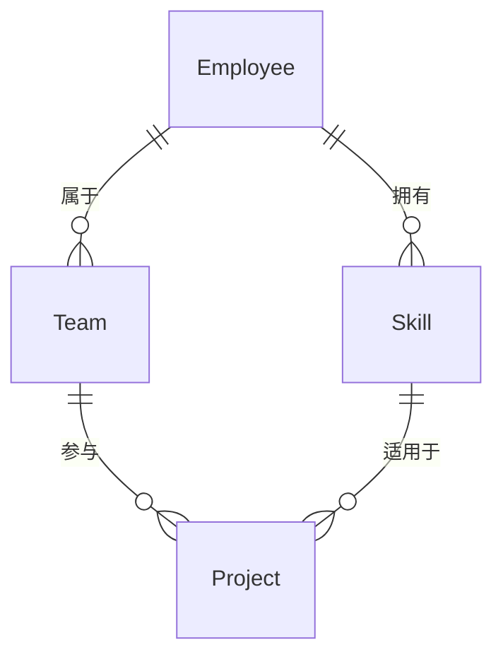

                 

# 多样性管理：发挥不同背景员工的优势

## 关键词
多样性管理、多元化团队、跨文化沟通、员工优势、组织绩效

## 摘要
在现代组织中，多样性管理已成为提升组织绩效的关键策略。本文通过深入探讨多样性管理的核心概念、策略与实践，分析了不同背景员工的优势及其对组织发展的影响。文章旨在为企业管理者提供一套系统性、可操作的多样性管理方法，以促进多元化团队的协作与创新，最终实现组织目标。

## 引言
### 多样性管理的重要性
在全球化和信息化迅速发展的背景下，企业面临着越来越多样化的员工群体。这些员工的背景各不相同，包括文化、性别、年龄、教育背景等。多样性管理，即通过制定和实施策略，创造一个包容、公平和高效的工作环境，使不同背景的员工能够充分发挥其潜力，已成为现代组织发展中不可忽视的重要课题。

### 多样性的机遇与挑战
多样性带来的机遇包括促进创新、提升团队协作效率、拓宽企业视野等。然而，多样性也带来了挑战，如沟通障碍、团队冲突、管理复杂度增加等。如何有效管理多样性，最大限度地发挥不同背景员工的优势，成为企业管理者面临的重要课题。

### 多样性管理的目标
多样性管理的目标在于通过理解、尊重和包容多样性，建立平等机会，促进多元化团队建设，提升跨文化沟通能力，从而提高组织绩效。本文将围绕这一目标，逐一探讨多样性管理的核心概念、策略与实践。

### 目录大纲设计
1. 引言
2. 第1章 问题背景与概念介绍
   - 1.1 问题背景
   - 1.2 多样性管理概念
3. 第2章 多样性管理的核心概念与联系
   - 2.1 多样性管理核心概念
   - 2.2 概念属性特征对比表格
   - 2.3 多样性管理的ER实体关系图架构
4. 第3章 多样性管理策略与实践
   - 3.1 多样性管理策略
   - 3.2 实践案例
5. 第4章 多元化团队建设
   - 4.1 团队建设的核心原则
   - 4.2 团队建设的具体方法
6. 第5章 跨文化沟通技巧
   - 5.1 跨文化沟通的重要性
   - 5.2 跨文化沟通技巧
7. 第6章 多样性管理的挑战与应对
   - 6.1 多样性管理的挑战
   - 6.2 应对策略
8. 结论
   - 8.1 小结
   - 8.2 注意事项
   - 8.3 拓展阅读

## 第1章 问题背景与概念介绍

### 1.1 问题背景

在全球化背景下，企业面临的员工背景日益多样化。这种多样性不仅体现在性别、年龄、教育背景上，还涵盖了文化、语言、技能等多方面。这种多样化的员工群体为组织带来了机遇，如促进创新、提高团队协作效率、拓宽企业视野等。然而，多样性也带来了挑战，如沟通障碍、团队冲突、管理复杂度增加等。

#### 描述与问题解决

1. **问题描述**：全球化带来了员工背景的多样性，这种多样性在带来机遇的同时，也带来了沟通障碍、团队冲突和管理复杂度增加等挑战。

2. **问题解决**：通过有效的多样性管理，可以减少冲突，提高团队协作效率，促进创新，提升企业竞争力。具体而言，多样性管理包括理解与尊重多样性、建立平等机会、促进多元化团队建设、提升跨文化沟通能力等。

#### 边界与外延

多样性管理的边界与外延不仅限于员工背景，还包括以下方面：

1. **价值观差异**：尊重和接纳不同的价值观，促进共同发展。
2. **性别角色差异**：促进性别平等，减少性别歧视。
3. **年龄差异**：尊重不同年龄段员工的经验与见解。
4. **技能与经验差异**：优化团队配置，提高工作效率。

### 1.2 多样性管理概念

#### 定义

多样性管理是指通过制定和实施策略，创造一个包容、公平和高效的工作环境，使不同背景的员工能够充分发挥其潜力。具体而言，多样性管理包括以下几个方面：

1. **理解与尊重多样性**：了解员工的不同背景，尊重和接纳这些差异。
2. **建立平等机会**：为所有员工提供平等的职业发展机会。
3. **促进多元化团队建设**：通过多元化团队建设，提高团队协作效率。
4. **提升跨文化沟通能力**：通过培训和实践，提升员工跨文化沟通能力。

#### 核心要素

多样性管理的核心要素包括：

1. **文化多样性**：了解不同文化的价值观、习俗和行为规范。
2. **性别多样性**：性别角色、性别平衡与性别歧视问题的探讨。
3. **年龄多样性**：代际沟通与合作的重要性。
4. **技能与经验多样性**：不同工作经验与技能的互补与整合。
5. **多元价值观**：尊重与接纳不同的价值观，促进共同发展。

#### 概念结构

多样性管理的概念结构可以分为个体层面、团队层面和组织层面：

1. **个体层面**：自我认知、价值观调整。
2. **团队层面**：沟通协作、冲突管理。
3. **组织层面**：政策制定、文化塑造。

## 第2章 多样性管理的核心概念与联系

### 2.1 多样性管理核心概念

#### 多样性管理核心概念

多样性管理涵盖了多个核心概念，包括文化多样性、性别多样性、年龄多样性、技能与经验多样性以及多元价值观。

1. **文化多样性**：指企业中员工来自不同的文化背景，如不同的国家、地区、语言和宗教信仰等。文化多样性为组织带来了丰富的视角和经验，有助于促进创新和适应全球市场的需求。

2. **性别多样性**：涉及不同性别在企业中的代表性和参与度。性别多样性有助于打破性别偏见，促进性别平等，提高团队整体绩效。

3. **年龄多样性**：包括不同年龄段的员工，如年轻员工、中年员工和老年员工。年龄多样性能够促进跨代际的沟通和合作，为组织带来不同的观点和经验。

4. **技能与经验多样性**：指员工在专业技能和工作经验上的差异。技能与经验多样性有助于优化团队配置，提高工作效率和创新能力。

5. **多元价值观**：涉及员工在个人价值观、信仰和生活方式上的差异。多元价值观能够促进团队中的包容性和创造性思维，有助于建立更加和谐的工作环境。

### 概念属性特征对比表格

以下是一个对比多样性管理中不同概念属性特征的表格：

| 多样性类型       | 属性特征                             | 对比分析                                                     |
|----------------|------------------------------------|------------------------------------------------------------|
| 文化多样性       | 价值观、习俗、行为规范               | 增强全球视野，提升适应能力                                     |
| 性别多样性       | 性别角色、性别平衡、性别歧视问题      | 促进平等机会，减少性别偏见                                     |
| 年龄多样性       | 代际沟通、代际经验                   | 丰富知识结构，促进创新思维                                     |
| 技能与经验多样性   | 专业背景、工作经验                   | 优化团队配置，提高工作效率                                     |
| 多元价值观       | 个人价值观、信仰、生活方式             | 促进多元思考，激发创新活力                                     |

### 多样性管理的ER实体关系图架构

多样性管理的实体关系图（ER图）可以直观地展示多样性管理中的核心实体及其关系。以下是ER图的Mermaid表示：

- **Employee（员工）**：多样性管理的主体，包括来自不同文化、性别、年龄、技能和经验的员工。
- **Team（团队）**：员工组成的团队，通过多元化和协作实现组织目标。
- **Skill（技能）**：员工的技能和工作经验，有助于团队建设和项目执行。
- **Project（项目）**：团队参与的项目，通过多样性管理提高项目成功率和创新能力。

这个ER图清晰地展示了多样性管理中的核心实体及其相互作用，有助于管理者更好地理解和实施多样性管理策略。

## 第3章 多样性管理策略与实践

### 3.1 多样性管理策略

多样性管理策略是指组织为促进多样性、包容性和效率而制定的具体行动方案。以下是一些常见的多样性管理策略：

#### 1. **政策制定**

政策制定是多样性管理的第一步。组织应明确对多样性的态度和承诺，制定相应的政策和指导原则。这些政策应包括招聘、晋升、培训、绩效评估等方面的多样性要求，确保多样性的实施具有明确的方向和标准。

#### 2. **培训与发展**

培训与发展是提高员工多样性意识和技能的重要手段。组织应定期开展多样性培训，帮助员工了解和尊重不同文化、性别、年龄等方面的差异。此外，还应提供职业发展机会，鼓励员工在多样性的环境中成长。

#### 3. **绩效评估**

将多样性作为绩效评估的指标之一，可以激励员工积极参与多样性管理。组织应对员工的多样性表现进行评估，并根据评估结果提供相应的奖励和反馈。

#### 4. **领导力培养**

领导力培养是多样性管理的关键。组织应培养具备多样性意识和技能的领导者，使他们能够在日常工作中推动多样性的实施。此外，领导者应带头尊重和包容多样性，为员工树立榜样。

### 3.2 实践案例

#### 案例分析一：企业如何通过多样性培训提升员工跨文化沟通能力

某全球知名企业在实施多样性管理时，重视员工的跨文化沟通能力。为了提升员工的跨文化沟通技巧，企业采取了以下措施：

1. **定制化培训课程**：企业根据员工的实际需求和背景，设计了针对不同文化的培训课程。例如，针对亚洲、非洲和拉丁美洲等不同地区员工，企业邀请了相关专家进行专题培训。

2. **互动式教学**：培训采用互动式教学方法，鼓励员工积极参与讨论和互动。例如，通过角色扮演、案例分析等活动，帮助员工更好地理解和应对不同文化背景的沟通场景。

3. **实践机会**：企业为员工提供了跨文化实践的机会，如国际交流项目、跨国团队合作等。这些实践机会使员工能够在真实的工作环境中锻炼和提升跨文化沟通能力。

通过这些措施，该企业的员工在跨文化沟通能力方面得到了显著提升，团队协作效率也得到提高。

#### 案例分析二：团队如何通过多样性建设促进协作与创新

某技术创新团队在多样性建设方面取得了显著成效。以下是其主要做法：

1. **多样化招聘**：团队在招聘过程中注重多元化，确保团队成员来自不同的背景和领域。这样，团队在解决问题时能够从不同角度进行思考，促进创新。

2. **平等机会**：团队确保每个成员都有平等的机会参与项目讨论和决策。这样，不同背景的员工都能充分发挥自己的优势，为团队贡献智慧。

3. **文化包容**：团队注重文化包容，鼓励员工在团队中表达自己的观点和见解。即使存在不同的观点和意见，团队也通过讨论和协商达成共识。

通过这些措施，该团队在协作和创新方面取得了显著成效，成为企业中的优秀团队。

## 第4章 多元化团队建设

### 4.1 团队建设的核心原则

多元化团队建设需要遵循以下核心原则：

#### 1. 平等与尊重

平等与尊重是多元化团队建设的基础。每个团队成员都应受到平等对待，无论其性别、年龄、文化背景或其他特征。尊重团队成员的独特性和差异，有助于建立和谐的团队氛围。

#### 2. 开放与包容

开放与包容是多元化团队建设的关键。团队应鼓励成员表达不同的观点和意见，尊重他们的想法。通过开放和包容，团队可以更好地整合多样化的视角和知识，促进创新和协作。

#### 3. 合作与协作

合作与协作是多元化团队建设的目标。团队成员应相互支持，共同面对挑战。通过合作和协作，团队可以实现更高的绩效，达成共同的目标。

### 4.2 团队建设的具体方法

多元化团队建设可以通过以下具体方法实现：

#### 1. 跨文化团队建设

跨文化团队建设旨在增强团队成员对不同文化的理解和尊重。企业可以通过以下方式开展跨文化团队建设：

1. **文化交流活动**：组织文化交流活动，如国际文化节、团队旅游等，让团队成员深入了解和体验不同文化。

2. **文化培训**：邀请文化专家进行文化培训，帮助团队成员了解不同文化的价值观、习俗和行为规范。

3. **跨文化项目**：鼓励团队成员参与跨文化项目，通过实际工作体验不同文化的团队合作方式。

#### 2. 团队角色分工

团队角色分工是确保团队高效运作的重要手段。根据成员的技能、经验和兴趣，为每个成员分配合适的角色和任务，有助于提高团队的整体效率。

1. **明确角色职责**：为每个成员明确其角色职责，确保团队成员了解自己的工作内容和目标。

2. **灵活调整角色**：根据项目的需要，灵活调整团队成员的角色和任务，以适应不同的工作场景。

3. **提供培训和发展机会**：为团队成员提供相关的培训和发展机会，提高他们的专业技能和角色认知。

#### 3. 冲突管理

冲突是团队建设过程中不可避免的现象。有效的冲突管理可以降低冲突对团队的影响，促进团队和谐。

1. **建立冲突解决机制**：建立有效的冲突解决机制，如定期召开团队会议、设立反馈渠道等，帮助团队成员解决冲突。

2. **培养冲突管理技能**：通过培训和实践，提高团队成员的冲突管理技能，使他们能够更好地应对冲突。

3. **尊重不同观点**：尊重团队成员的不同观点，鼓励他们表达自己的看法，通过讨论和协商找到共同点。

## 第5章 跨文化沟通技巧

### 5.1 跨文化沟通的重要性

跨文化沟通在全球化背景下具有重要意义。有效的跨文化沟通可以促进团队合作、提升工作效率、减少误解和冲突，从而实现组织目标。

#### 多元文化的优势

多元文化的优势包括：

1. **促进创新思维**：不同文化背景的员工可以带来不同的视角和思维方式，促进创新和创造性思维。

2. **提高团队适应力**：多元文化的团队在面对不同市场和客户时，可以更好地适应和满足需求。

3. **拓宽企业视野**：跨文化沟通有助于企业了解不同文化背景的市场和客户，提高企业的全球竞争力。

#### 跨文化沟通的挑战

跨文化沟通的挑战包括：

1. **文化差异导致的误解**：不同文化背景的员工在沟通时可能存在语言、行为和价值观等方面的差异，导致误解和沟通障碍。

2. **沟通障碍**：语言障碍、文化习惯和沟通方式的不同可能导致沟通不畅，影响团队协作。

3. **文化偏见**：不同文化背景的员工可能存在文化偏见，影响团队凝聚力和合作。

### 5.2 跨文化沟通技巧

为了有效应对跨文化沟通的挑战，团队可以采取以下沟通技巧：

#### 1. 文化敏感性

文化敏感性是指对其他文化的尊重和理解。团队成员应：

1. **了解文化差异**：了解不同文化的价值观、习俗和行为规范，减少文化误解。

2. **尊重文化差异**：尊重团队成员的文化背景，避免对其他文化进行贬低或歧视。

3. **开放心态**：保持开放的心态，愿意接受和了解不同文化，促进跨文化沟通。

#### 2. 有效沟通策略

有效沟通策略包括：

1. **清晰表达**：使用简单、明确的语言表达自己的观点和需求，避免使用模糊或歧义性的语言。

2. **倾听他人**：倾听他人的意见和观点，理解对方的立场和需求，避免一味地表达自己的观点。

3. **避免假设**：避免对对方的文化、行为和观点进行假设，尊重对方的独特性。

4. **尊重差异**：尊重团队成员的文化差异，避免对其他文化进行评价或批评。

## 第6章 多样性管理的挑战与应对

### 6.1 多样性管理的挑战

多样性管理虽然有助于提升组织绩效，但也面临着一系列挑战。以下是一些常见的挑战及其影响：

#### 1. 文化冲突

文化冲突是多样性管理中最常见的挑战之一。不同文化之间的价值观、行为规范和沟通方式可能存在显著差异，导致团队成员之间的误解和冲突。

#### 2. 管理复杂度增加

多样性管理增加了组织的管理复杂度。管理者需要应对不同背景的员工需求，制定多元化的管理策略，确保多样性管理策略的有效实施。

#### 3. 团队协作困难

多样性团队在协作过程中可能面临沟通障碍和协作困难。团队成员可能因文化差异而难以建立信任，影响团队协作效率。

### 6.2 应对策略

为了应对多样性管理的挑战，组织可以采取以下策略：

#### 1. 文化冲突管理

组织应采取以下措施管理文化冲突：

1. **建立文化意识**：通过培训和文化交流活动，提高员工的文化意识，减少文化误解。

2. **促进文化包容**：鼓励员工尊重和包容不同文化，建立包容性文化。

3. **建立冲突解决机制**：建立有效的冲突解决机制，帮助团队成员解决文化冲突。

#### 2. 管理复杂度控制

组织可以采取以下措施控制管理复杂度：

1. **明确管理目标**：明确多样性管理的目标，确保管理策略与组织目标一致。

2. **简化管理流程**：简化管理流程，减少不必要的复杂性。

3. **提供培训和支持**：为管理者提供相关的培训和指导，帮助他们应对多样性管理的挑战。

#### 3. 团队协作优化

组织可以采取以下措施优化团队协作：

1. **加强沟通**：建立有效的沟通机制，确保团队成员之间的信息畅通。

2. **促进团队合作**：鼓励团队合作，建立共同的团队目标和价值观。

3. **提供协作工具**：使用协作工具和平台，提高团队协作效率。

## 结论

### 6.1 小结

多样性管理是现代组织发展中不可忽视的重要课题。通过有效的多样性管理，组织可以减少冲突，提高团队协作效率，促进创新，提升组织绩效。本文从问题背景、核心概念、管理策略、团队建设、沟通技巧和挑战应对等方面，系统地探讨了多样性管理的理论与实践，为企业管理者提供了有益的参考。

### 6.2 注意事项

在实施多样性管理时，组织应注意以下几点：

1. **尊重差异**：尊重员工的多样性，避免歧视和偏见。

2. **制定明确策略**：制定明确的多样性管理策略，确保多样性管理的实施有据可循。

3. **持续培训**：定期开展多样性培训，提高员工的文化意识和沟通技巧。

4. **评估效果**：定期评估多样性管理的效果，及时调整管理策略。

### 6.3 拓展阅读

对于希望深入了解多样性管理的读者，以下书籍和资料可以作为拓展阅读：

1. **《多样性管理：战略与实践》**（作者：约翰·霍尔特）

2. **《跨文化沟通》**（作者：达伦·布里奇曼）

3. **《包容性组织：打造多元、公平、高效的团队》**（作者：艾伦·诺尔）

4. **《多样性、平等与包容：企业多元化管理指南》**（作者：美国人力资源管理协会）

## 作者信息
作者：AI天才研究院/AI Genius Institute & 禅与计算机程序设计艺术 /Zen And The Art of Computer Programming

