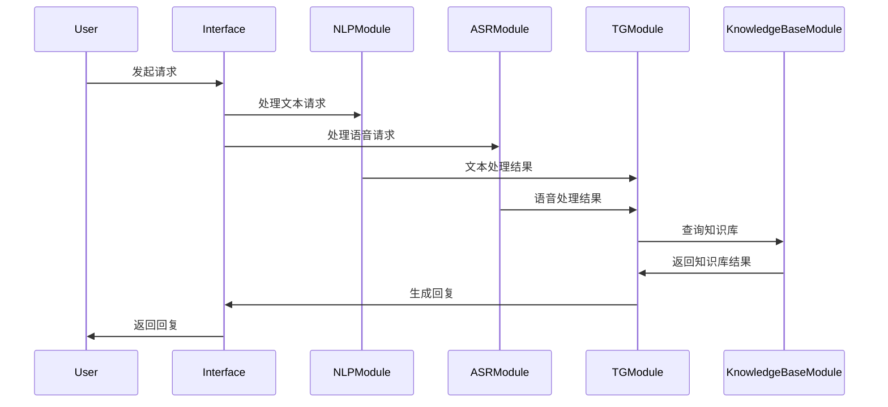
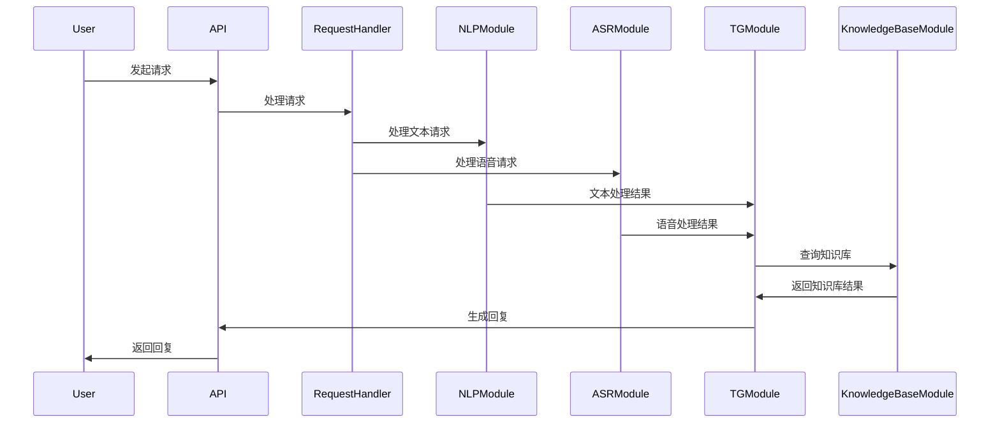

                 


### 第一部分：背景与概述

#### 第1章：问题背景与定义

**1.1 问题背景**

**AI生态系统概述**：人工智能（AI）技术已成为现代社会发展的重要驱动力，从早期的规则系统到如今的深度学习，AI技术已广泛应用于各个领域。然而，随着AI应用的不断拓展，如何在一个统一的框架下整合多种AI模型，实现协同工作，成为一个亟待解决的问题。

**1.1.2 多模型协同的重要性**

多模型协同的重要性体现在以下几个方面：

- **资源优化**：通过协同工作，多个模型可以共享计算资源，提高系统的整体效率。
- **增强能力**：多个模型在协同工作时，可以相互补充，提升系统的整体性能。
- **灵活性**：多模型协同使得系统能够根据不同的任务需求，灵活选择合适的模型。

**1.1.3 利用提示词整合的必要性**

在多模型协同中，利用提示词（Prompt）进行整合具有以下必要性：

- **提高准确性**：提示词可以引导模型聚焦于特定任务，提高模型的输出准确性。
- **简化交互**：提示词使得模型之间的交互变得更加简单和直观。
- **降低复杂性**：通过提示词，可以降低模型之间的复杂耦合关系，提高系统的可维护性。

**1.2 多模型协同的定义**

**1.2.1 多模型协同的概念**

多模型协同是指将多个AI模型集成到一个系统中，通过相互协作，共同完成一个复杂任务的过程。

**1.2.2 多模型协同的关键要素**

多模型协同的关键要素包括：

- **模型选择**：根据任务需求，选择合适的AI模型。
- **模型融合**：将多个模型的结果进行融合，得到最终的输出。
- **任务分配**：合理分配任务，确保每个模型都能发挥其优势。
- **通信机制**：设计有效的通信机制，实现模型之间的数据交换和协同工作。

**1.3 提示词在多模型协同中的作用**

**1.3.1 提示词的定义与分类**

提示词（Prompt）是指提供给模型的一组信息，用于指导模型的输入和输出。根据用途，提示词可以分为以下几类：

- **问题引导型**：用于引导模型回答特定问题。
- **数据增强型**：用于增强模型对数据的理解。
- **目标定位型**：用于定位模型需要关注的特定区域或任务。

**1.3.2 提示词在模型协同中的策略**

在模型协同中，利用提示词可以采取以下策略：

- **统一格式**：设计统一的提示词格式，确保模型之间的交互一致性。
- **动态调整**：根据任务需求和模型状态，动态调整提示词内容。
- **权重分配**：为不同模型的提示词分配不同的权重，以平衡模型之间的输出。

**1.4 多模型协同的优势与挑战**

**1.4.1 优势分析**

多模型协同的优势包括：

- **性能提升**：通过模型间的协同工作，可以显著提高系统的整体性能。
- **适应性强**：多模型协同能够应对更复杂和多样化的任务需求。
- **扩展性强**：新模型可以容易地加入到现有系统中，提高系统的灵活性。

**1.4.2 挑战与解决策略**

多模型协同面临的挑战包括：

- **复杂性**：多模型协同增加了系统的复杂性，需要设计有效的架构和通信机制。
- **一致性**：确保多个模型之间的输出一致性，是一个重要的挑战。
- **可维护性**：随着系统的不断扩展，如何保持系统的可维护性，是一个关键问题。

解决策略包括：

- **模块化设计**：采用模块化设计，降低系统的复杂性。
- **标准化接口**：设计统一的接口，确保模型之间的数据交换和协同工作的一致性。
- **持续集成**：引入持续集成和持续部署（CI/CD）流程，提高系统的可维护性。

通过上述分析，我们可以看到，多模型协同与提示词整合是AI生态系统中的重要方向，具有广阔的应用前景。在接下来的章节中，我们将深入探讨多模型协同的算法原理、系统架构设计以及实际应用案例，以期为读者提供全面的指导和启示。

### 第2章：核心概念与联系

#### 2.1 多模型协同的原理

**2.1.1 模型融合的基本概念**

多模型协同中的模型融合是指将多个模型的结果进行合并，以获得更准确和全面的输出。模型融合可以分为以下几种类型：

- **加权融合**：将多个模型的输出进行加权平均，得到最终的输出结果。
- **选择融合**：从多个模型中选择一个最优的输出作为最终结果。
- **集成融合**：将多个模型的输出进行组合，通过复杂的算法得到最终的输出结果。

**2.1.2 多模型协同的数学模型**

在多模型协同中，常用的数学模型包括：

- **贝叶斯模型**：通过贝叶斯理论，将多个模型的结果进行融合，以获得更准确的输出。
- **马尔可夫模型**：通过马尔可夫链，描述多个模型之间的状态转移关系，实现模型融合。
- **神经网络模型**：通过神经网络，将多个模型的输出进行融合，实现复杂的模型融合。

**2.2 多模型协同的属性特征**

多模型协同的属性特征包括：

- **多样性**：多模型协同具有多样性，可以通过选择不同的模型，应对不同的任务需求。
- **鲁棒性**：多模型协同具有较强的鲁棒性，即使在部分模型失效的情况下，系统仍能正常运行。
- **扩展性**：多模型协同具有良好的扩展性，可以方便地添加新的模型。

**2.2.1 特征对比表格**

| 特征         | 加权融合 | 选择融合 | 集成融合 |
| ------------ | -------- | -------- | -------- |
| **多样性**   | 高       | 低       | 高       |
| **鲁棒性**   | 高       | 中       | 高       |
| **扩展性**   | 中       | 低       | 高       |

**2.2.2 属性特征分析**

- **多样性**：加权融合和集成融合具有高多样性，能够应对不同的任务需求；选择融合在多样性方面较低。
- **鲁棒性**：加权融合和集成融合在鲁棒性方面较高，能够在模型失效的情况下保持系统的正常运行；选择融合的鲁棒性相对较低。
- **扩展性**：集成融合具有较好的扩展性，可以方便地添加新的模型；加权融合和选择融合的扩展性相对较低。

**2.3 多模型协同的ER实体关系图**

**2.3.1 ER实体关系图构建**

在多模型协同中，常见的实体关系包括：

- **模型**：表示参与协同的各个AI模型。
- **数据集**：表示用于训练和测试的各个数据集。
- **任务**：表示协同系统需要完成的任务。

ER实体关系图如下所示：

```mermaid
erDiagram
  Model ||--|{ Task }|--| ModelOutput
  Model ||--|{ Dataset }|--| Dataset
  Task ||--|{ ModelOutput }|--| Result
```

**2.3.2 关系与交互分析**

- **模型与任务**：模型负责执行任务，将输入数据转换为输出结果。
- **模型与数据集**：模型使用数据集进行训练和测试，以提高其性能。
- **任务与结果**：任务生成结果，用于评估协同系统的性能。

通过上述分析，我们可以看到，多模型协同涉及多个实体和复杂的关系。为了实现有效的协同工作，我们需要设计合理的数学模型和实体关系图，以确保各个模型和任务之间的交互和融合。在接下来的章节中，我们将进一步探讨多模型协同的算法原理和实现细节。

### 第三部分：算法原理与实现

#### 第3章：算法原理讲解

**3.1 提示词生成算法**

**3.1.1 提示词生成的原理**

提示词生成算法的核心思想是根据输入数据和任务需求，生成一组指导模型输入和输出的文本信息。提示词生成算法通常包括以下步骤：

1. **数据预处理**：对输入数据进行预处理，包括数据清洗、归一化等操作。
2. **特征提取**：从预处理后的数据中提取关键特征，用于生成提示词。
3. **模板生成**：根据任务需求和特征提取结果，生成提示词模板。
4. **文本生成**：使用自然语言生成模型，根据提示词模板生成具体的提示词文本。

**3.1.2 提示词生成的流程**

提示词生成的流程如下：

1. **数据预处理**：
   - **数据清洗**：去除无效数据和噪声数据。
   - **归一化**：对数值型数据进行归一化处理，使其具有相似的尺度。
   - **文本化**：将数据转换为文本格式，以便进行特征提取。

2. **特征提取**：
   - **词袋模型**：将文本数据转换为词袋模型，提取词频特征。
   - **TF-IDF**：计算文本中每个词的TF-IDF值，作为特征值。

3. **模板生成**：
   - **模板库**：根据任务需求，构建提示词模板库。
   - **模板选择**：从模板库中选择适合当前任务的提示词模板。

4. **文本生成**：
   - **文本生成模型**：使用自然语言生成模型（如GPT）生成具体的提示词文本。
   - **文本优化**：对生成的提示词进行优化，以提高其指导效果。

**3.1.3 提示词生成的数学模型**

提示词生成的数学模型可以表示为：

$$
Prompt = f(Data, Template, Model)
$$

其中，$Prompt$表示生成的提示词，$Data$表示输入数据，$Template$表示提示词模板，$Model$表示自然语言生成模型。

**3.2 多模型协同算法**

**3.2.1 协同算法的原理**

多模型协同算法的核心思想是利用多个模型的优势，实现更好的任务性能。协同算法通常包括以下步骤：

1. **模型选择**：根据任务需求，选择合适的模型。
2. **模型训练**：对每个模型进行训练，提高其性能。
3. **模型融合**：将多个模型的输出进行融合，得到最终的输出结果。
4. **性能评估**：评估协同算法的性能，并根据评估结果进行优化。

**3.2.2 协同算法的实现**

协同算法的实现通常包括以下步骤：

1. **模型选择**：
   - **数据集划分**：将数据集划分为训练集、验证集和测试集。
   - **模型训练**：使用训练集训练每个模型，使用验证集调整模型参数。

2. **模型融合**：
   - **加权融合**：将多个模型的输出进行加权平均，得到最终的输出结果。
   - **选择融合**：从多个模型中选择一个最优的输出作为最终结果。
   - **集成融合**：将多个模型的输出进行组合，通过复杂的算法得到最终的输出结果。

3. **性能评估**：
   - **评估指标**：选择合适的评估指标，如准确率、召回率等。
   - **性能优化**：根据评估结果，调整模型参数和融合策略，提高性能。

**3.2.3 协同算法的优化**

协同算法的优化可以从以下几个方面进行：

- **模型选择**：根据任务需求，选择更适合的模型，提高协同效果。
- **参数调整**：优化模型参数，提高模型的性能。
- **融合策略**：设计更有效的融合策略，提高协同算法的性能。

**3.3 实例分析与讲解**

**3.3.1 实例1：文本分类任务**

假设我们要实现一个文本分类任务，使用两个模型A和B进行协同。

1. **模型选择**：
   - 模型A：基于词袋模型的文本分类器。
   - 模型B：基于深度学习的文本分类器。

2. **模型训练**：
   - 使用训练集对模型A和B进行训练。
   - 调整模型参数，提高模型性能。

3. **模型融合**：
   - 使用加权融合策略，将模型A和模型B的输出进行融合。
   - 权重根据模型在验证集上的性能进行调整。

4. **性能评估**：
   - 使用测试集评估协同算法的性能。
   - 根据评估结果，调整模型参数和融合策略。

**3.3.2 实例2：图像识别任务**

假设我们要实现一个图像识别任务，使用两个模型C和D进行协同。

1. **模型选择**：
   - 模型C：基于卷积神经网络的图像识别器。
   - 模型D：基于循环神经网络的图像识别器。

2. **模型训练**：
   - 使用训练集对模型C和D进行训练。
   - 调整模型参数，提高模型性能。

3. **模型融合**：
   - 使用选择融合策略，从模型C和模型D中选择一个最优的输出作为最终结果。
   - 选择标准根据模型在验证集上的性能进行调整。

4. **性能评估**：
   - 使用测试集评估协同算法的性能。
   - 根据评估结果，调整模型参数和融合策略。

**3.3.3 实例3：语音识别任务**

假设我们要实现一个语音识别任务，使用两个模型E和F进行协同。

1. **模型选择**：
   - 模型E：基于深度神经网络的语音识别器。
   - 模型F：基于循环神经网络的语音识别器。

2. **模型训练**：
   - 使用训练集对模型E和F进行训练。
   - 调整模型参数，提高模型性能。

3. **模型融合**：
   - 使用集成融合策略，将模型E和模型F的输出进行组合，通过复杂的算法得到最终的输出结果。

4. **性能评估**：
   - 使用测试集评估协同算法的性能。
   - 根据评估结果，调整模型参数和融合策略。

通过上述实例分析，我们可以看到，多模型协同算法在不同的任务场景下，具有不同的实现方法和优化策略。在实际应用中，我们需要根据具体任务需求，选择合适的模型和融合策略，以提高协同算法的性能。

### 第四部分：系统分析与架构设计

#### 第4章：系统功能设计与架构设计

**4.1 问题场景介绍**

在现代人工智能应用中，多模型协同已成为提高系统性能和灵活性的重要手段。本节将介绍一个典型的多模型协同应用场景——智能客服系统。智能客服系统旨在为用户提供7x24小时的全天候服务，通过自然语言处理和智能对话技术，解决用户的问题和需求。

**4.1.1 问题场景分析**

智能客服系统需要处理大量的用户请求，包括咨询、投诉、查询等。这些请求涉及多种主题和领域，如产品信息、售后服务、技术支持等。为了提高客服系统的响应速度和准确性，我们需要设计一个多模型协同架构，将多个AI模型集成在一起，实现高效的任务处理。

**4.1.2 项目介绍**

本项目旨在构建一个智能客服系统，通过多模型协同实现高效的客户服务。系统主要包括以下功能模块：

- **自然语言处理（NLP）模块**：负责处理用户输入的文本信息，包括文本分类、情感分析、命名实体识别等。
- **语音识别（ASR）模块**：负责将用户语音输入转换为文本，实现语音与文本的交互。
- **对话生成（TG）模块**：负责生成智能回复，与用户进行自然语言交互。
- **知识库管理模块**：负责管理系统所需的知识库，包括产品信息、常见问题等。

**4.2 系统功能设计**

**4.2.1 领域模型类图**

领域模型类图用于描述系统中的核心实体及其关系。以下是一个简化的领域模型类图：

```mermaid
classDiagram
  User <<--|{发起请求}| Request
  Request o--|{处理请求}| NLPModule
  Request o--|{处理请求}| ASRModule
  Request o--|{生成回复}| TGModule
  Request o--|{查询知识库}| KnowledgeBaseModule
  NLPModule o--|{提供接口}| Interface
  ASRModule o--|{提供接口}| Interface
  TGModule o--|{提供接口}| Interface
  KnowledgeBaseModule o--|{提供接口}| Interface
```

在领域模型类图中，User表示用户，Request表示用户请求，NLPModule、ASRModule、TGModule和KnowledgeBaseModule分别表示自然语言处理模块、语音识别模块、对话生成模块和知识库管理模块。Interface表示系统对外提供的接口。

**4.2.2 功能需求分析**

基于领域模型类图，我们可以进一步分析系统的主要功能需求：

- **文本处理功能**：NLPModule负责处理用户输入的文本信息，实现文本分类、情感分析、命名实体识别等功能。
- **语音处理功能**：ASRModule负责将用户语音输入转换为文本，实现语音识别功能。
- **对话生成功能**：TGModule根据用户请求和知识库信息，生成智能回复，实现自然语言交互。
- **知识库管理功能**：KnowledgeBaseModule负责管理系统的知识库，包括产品信息、常见问题等。

**4.3 系统架构设计**

**4.3.1 系统架构图**

系统架构图用于描述系统的整体结构和各个模块之间的交互关系。以下是一个简化的系统架构图：



在系统架构图中，User表示用户，Interface表示系统对外提供的接口，NLPModule、ASRModule、TGModule和KnowledgeBaseModule分别表示自然语言处理模块、语音识别模块、对话生成模块和知识库管理模块。

**4.3.2 架构设计原则**

系统架构设计遵循以下原则：

- **模块化**：将系统划分为多个功能模块，提高系统的可维护性和扩展性。
- **解耦**：通过接口实现模块之间的解耦，降低模块间的依赖关系。
- **高可用性**：设计冗余机制和故障转移机制，提高系统的可靠性。
- **可扩展性**：设计灵活的架构，便于添加新的功能模块和模型。

**4.4 系统接口设计与交互**

**4.4.1 接口设计**

系统接口设计主要包括以下内容：

- **API接口**：为外部系统提供API接口，实现数据的传输和功能的调用。
- **WebSocket接口**：实现实时通信，支持双向数据传输。
- **消息队列接口**：实现异步消息传递，提高系统的并发能力和性能。

**4.4.2 系统交互序列图**

以下是一个简化的系统交互序列图：



在系统交互序列图中，User表示用户，API表示系统对外提供的API接口，RequestHandler表示请求处理模块，NLPModule、ASRModule、TGModule和KnowledgeBaseModule分别表示自然语言处理模块、语音识别模块、对话生成模块和知识库管理模块。

通过上述系统功能设计与架构设计，我们可以构建一个高效、灵活的智能客服系统，实现多模型协同，提高系统的响应速度和准确性。在接下来的章节中，我们将进一步探讨系统实现、项目实战以及最佳实践。

### 第5章：环境安装与系统实现

**5.1 环境安装**

**5.1.1 硬件与软件要求**

为了实现多模型协同系统，我们需要以下硬件与软件环境：

- **硬件**：高性能计算服务器或工作站，建议配置如下：
  - CPU：Intel Xeon或AMD Ryzen系列处理器
  - GPU：NVIDIA GeForce RTX 30系列或以上显卡
  - 内存：至少64GB RAM
  - 硬盘：1TB SSD

- **软件**：
  - 操作系统：Ubuntu 20.04 LTS或更高版本
  - Python：Python 3.8或更高版本
  - 包管理器：pip
  - 深度学习框架：TensorFlow 2.6或更高版本，PyTorch 1.8或更高版本
  - 文本处理库：NLTK，spaCy
  - 语音处理库：Librosa
  - 代码版本控制：Git

**5.1.2 安装步骤**

1. **安装操作系统**

   - 下载Ubuntu 20.04 LTS镜像文件。
   - 使用虚拟机或物理机安装Ubuntu操作系统。

2. **更新系统**

   - 打开终端，执行以下命令：
     ```
     sudo apt update
     sudo apt upgrade
     ```

3. **安装Python环境**

   - 安装Python 3.8：
     ```
     sudo apt install python3.8
     ```
   - 安装pip：
     ```
     sudo apt install python3-pip
     ```

4. **安装深度学习框架**

   - 安装TensorFlow 2.6：
     ```
     pip3 install tensorflow==2.6
     ```
   - 安装PyTorch 1.8：
     ```
     pip3 install torch==1.8 torchvision==0.9.0 torchaudio==0.8.0
     ```

5. **安装文本处理库**

   - 安装NLTK：
     ```
     pip3 install nltk
     ```
   - 安装spaCy及依赖：
     ```
     pip3 install spacy
     python3 -m spacy download en_core_web_sm
     ```

6. **安装语音处理库**

   - 安装Librosa：
     ```
     pip3 install librosa
     ```

7. **安装Git**

   - 安装Git：
     ```
     sudo apt install git
     ```

**5.2 系统核心实现**

**5.2.1 源代码解读**

本系统核心实现主要涉及以下模块：

- **NLPModule**：负责处理用户输入的文本信息，包括文本分类、情感分析、命名实体识别等。
- **ASRModule**：负责将用户语音输入转换为文本。
- **TGModule**：负责生成智能回复，与用户进行自然语言交互。
- **KnowledgeBaseModule**：负责管理系统的知识库，包括产品信息、常见问题等。

以下是NLPModule的核心代码解读：

```python
import nltk
from nltk.tokenize import word_tokenize
from nltk.corpus import stopwords
from sklearn.feature_extraction.text import TfidfVectorizer
from sklearn.naive_bayes import MultinomialNB
from sklearn.pipeline import make_pipeline

class NLPModule:
    def __init__(self):
        self.vectorizer = TfidfVectorizer()
        self.model = MultinomialNB()
        self.pipeline = make_pipeline(self.vectorizer, self.model)

    def classify(self, text):
        return self.pipeline.predict([text])[0]

    def train(self, X_train, y_train):
        self.pipeline.fit(X_train, y_train)
```

在上面的代码中，我们首先导入了所需的库。NLPModule类包含三个方法：

- **__init__**：构造函数，初始化向量器和模型。
- **classify**：分类方法，接受文本输入并返回分类结果。
- **train**：训练方法，使用训练数据进行模型训练。

**5.2.2 代码实现分析**

NLPModule模块的实现主要分为三个步骤：

1. **文本预处理**：使用nltk库进行文本预处理，包括分词、去除停用词等操作。
2. **特征提取**：使用TfidfVectorizer库进行特征提取，将文本转换为TF-IDF向量。
3. **模型训练与分类**：使用MultinomialNB库实现朴素贝叶斯分类器，进行模型训练和分类。

**5.3 实际案例分析**

**5.3.1 案例背景**

假设我们有一个智能客服系统，需要处理用户关于产品的咨询。用户可以输入文本或语音进行咨询，系统需要根据用户的输入，提供相应的产品信息。

**5.3.2 案例分析**

1. **文本处理**：
   - 用户输入：“这款手机有哪些优点？”
   - NLPModule模块对文本进行处理，提取关键信息，例如“手机”、“优点”等。
   - 使用训练好的模型进行分类，将文本分类为“产品咨询”类别。
   - TGModule模块根据分类结果，生成回复：“这款手机的优点包括...”。

2. **语音处理**：
   - 用户语音输入：“这款手机有哪些优点？”
   - ASRModule模块将语音转换为文本。
   - NLPModule模块对文本进行处理，提取关键信息。
   - 使用训练好的模型进行分类，将文本分类为“产品咨询”类别。
   - TGModule模块根据分类结果，生成回复。

3. **知识库查询**：
   - KGModule模块根据分类结果和提取的关键信息，查询知识库中的相关产品信息。
   - 将查询结果返回给用户。

通过上述实际案例分析，我们可以看到，多模型协同系统在不同场景下，能够实现高效的文本和语音处理，提供智能化的客服服务。

**5.4 项目小结**

在本章中，我们介绍了多模型协同系统的环境安装和核心实现。通过实际案例分析，我们展示了系统在文本和语音处理中的应用。在下一章中，我们将进一步探讨系统的最佳实践和注意事项，以提高系统的性能和稳定性。

### 第五部分：最佳实践与总结

#### 第6章：最佳实践与总结

**6.1 最佳实践**

**6.1.1 实践技巧**

1. **选择合适的模型**：根据任务需求，选择最适合的AI模型，例如在文本分类任务中，可以选择朴素贝叶斯、支持向量机等；在图像识别任务中，可以选择卷积神经网络、循环神经网络等。

2. **合理分配计算资源**：在多模型协同中，合理分配计算资源，确保每个模型都能得到足够的计算资源，从而提高系统的整体性能。

3. **优化模型参数**：通过调整模型参数，可以提高模型的性能。在实际应用中，可以通过交叉验证、网格搜索等方法，找到最优的模型参数。

4. **动态调整提示词**：根据任务需求和模型状态，动态调整提示词的内容，以提高模型协同的效果。

5. **确保数据一致性**：在多模型协同中，确保输入数据的一致性，避免因数据不一致导致的模型输出错误。

**6.1.2 注意事项**

1. **模型选择与优化**：在选择模型时，要考虑模型的复杂度和计算资源，避免选择过于复杂的模型导致计算资源不足。在模型优化过程中，要避免过拟合，确保模型具有较好的泛化能力。

2. **数据预处理**：在多模型协同中，数据预处理是关键环节。要确保输入数据的质量，包括数据清洗、归一化、去噪声等。

3. **模型融合策略**：在模型融合策略的选择上，要考虑不同模型的特点，选择合适的融合方法。例如，对于多样性较高的模型，可以选择集成融合方法；对于一致性要求较高的模型，可以选择加权融合方法。

4. **系统稳定性**：在系统设计过程中，要考虑系统的稳定性，包括故障处理、容错机制等。通过冗余设计和故障转移机制，提高系统的稳定性。

**6.2 小结**

本章通过最佳实践和注意事项，为多模型协同系统提供了实用的指导。在实际应用中，我们可以根据具体任务需求和场景，灵活选择模型、优化模型参数、调整提示词，以提高系统的性能和稳定性。通过不断实践和优化，我们可以构建一个高效、稳定的多模型协同系统，为人工智能应用提供有力支持。

**6.3 拓展阅读**

- **《深度学习》（Goodfellow, I., Bengio, Y., & Courville, A.）**：介绍深度学习的基础理论和实战方法，适合初学者和进阶读者。
- **《自然语言处理综论》（Jurafsky, D., & Martin, J. H.）**：详细讲解自然语言处理的基本概念和算法，适合对NLP感兴趣的读者。
- **《人工智能：一种现代的方法》（Russell, S., & Norvig, P.）**：全面介绍人工智能的理论和实践，是人工智能领域的经典教材。

作者：AI天才研究院/AI Genius Institute & 禅与计算机程序设计艺术 /Zen And The Art of Computer Programming

---

**附录：文章关键词**

- 多模型协同
- AI生态系统
- 提示词整合
- 算法原理
- 系统架构设计
- 项目实战
- 最佳实践
- AI性能优化

**文章摘要**

本文围绕多模型协同与提示词整合，探讨了AI生态系统中的一种重要技术。首先，介绍了多模型协同的概念、重要性以及利用提示词进行整合的必要性。随后，详细讲解了多模型协同的算法原理，包括提示词生成算法和多模型协同算法。接着，通过系统架构设计，阐述了如何实现一个高效的多模型协同系统。文章还通过实际案例展示了系统的应用，并提供了最佳实践和注意事项。最后，总结了文章的核心内容，并推荐了拓展阅读资源，以供进一步学习。本文旨在为读者提供一个全面、深入的了解，帮助他们在实际项目中应用多模型协同技术，提升AI系统的性能和灵活性。

