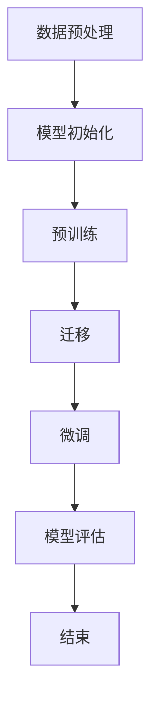
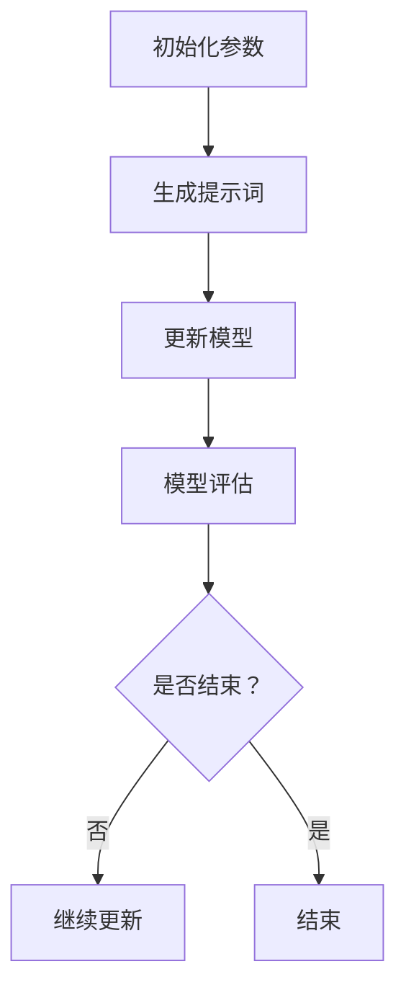
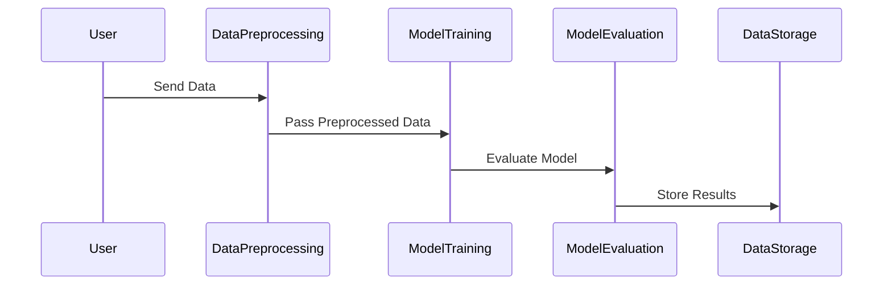
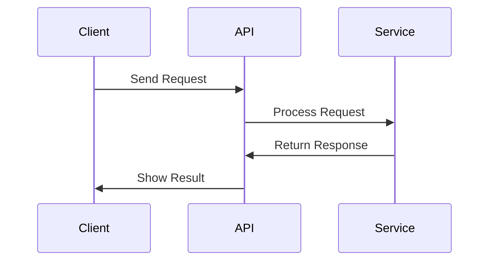
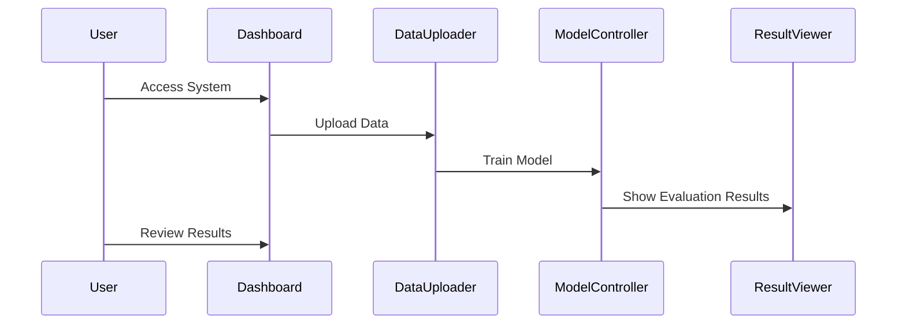
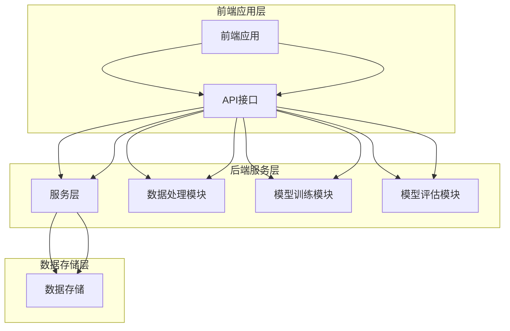
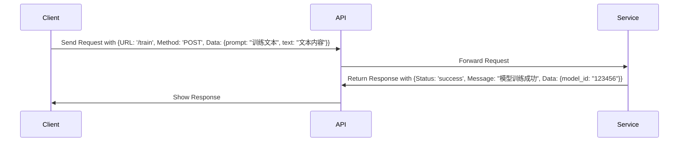

                 


### 引言

随着人工智能技术的快速发展，大型预训练模型（Large Pre-trained Models，简称LPM）已经成为当前人工智能研究与应用领域的热点。大模型以其强大的表示能力和泛化能力，在自然语言处理（Natural Language Processing，NLP）、计算机视觉（Computer Vision，CV）等领域取得了显著的成果。然而，大模型的训练需要海量数据和计算资源，这对研究和工业界提出了巨大挑战。Few-shot迁移学习（Few-shot Transfer Learning）作为一种高效利用有限数据的方法，逐渐受到关注。本文将探讨大模型在Few-shot迁移学习中的应用，特别是提示词适应性学习（Prompt-based Adaptation Learning）这一新兴领域。

在当前的研究中，Few-shot迁移学习主要面临以下几个挑战：

1. **数据稀缺性**：在许多实际应用场景中，获取大量标注数据是非常困难的，而传统的迁移学习算法需要大量数据才能取得良好的效果。

2. **模型适应性**：大模型通常是在特定数据集上预训练的，当应用于新的任务时，需要快速适应新任务的数据分布和任务需求。

3. **计算资源限制**：大模型的训练和推理需要大量的计算资源，尤其是在实时应用场景中，如何优化计算资源成为关键问题。

针对上述挑战，提示词适应性学习提供了一种新颖的解决方案。通过设计合适的提示词（Prompts），可以显著提升大模型在新任务上的适应性，降低对大量标注数据的依赖。本文将详细介绍大模型Few-shot迁移与提示词适应性学习的原理、算法和实践，为相关研究提供参考。

本文的结构如下：

- **第一部分 背景与概述**：介绍大模型、Few-shot迁移学习和提示词适应性学习的基本概念，以及本文的研究目标。
- **第二部分 核心概念与联系**：深入探讨AI大模型、Few-shot迁移学习和提示词适应性学习的原理和关键要素。
- **第三部分 算法原理讲解**：详细讲解Few-shot迁移学习和提示词适应性学习算法的流程、Python代码实现和数学模型。
- **第四部分 系统分析与架构设计**：分析系统的功能设计、架构设计、接口设计和实际案例。
- **第五部分 项目实战**：介绍项目环境安装、核心实现源代码、应用解读与分析、实际案例分析和项目小结。

通过本文的探讨，我们希望读者能够对大模型Few-shot迁移与提示词适应性学习有更深入的理解，并在实际应用中取得更好的效果。

### 关键词

- 大模型
- Few-shot迁移学习
- 提示词适应性学习
- 预训练模型
- 数据稀缺性
- 模型适应性
- 计算资源限制

### 摘要

本文旨在探讨大型预训练模型（Large Pre-trained Models，简称LPM）在Few-shot迁移学习和提示词适应性学习中的应用。首先，我们介绍了大模型、Few-shot迁移学习和提示词适应性学习的基本概念，并分析了它们在当前研究中的重要性。随后，本文深入探讨了AI大模型的原理、Few-shot迁移学习和提示词适应性学习的算法原理，并通过实际案例展示了这些算法在现实场景中的应用。最后，本文对系统设计与实现进行了详细分析，并给出了项目实战的指导。通过本文的研究，我们希望为相关领域的研究人员提供有价值的参考。

## 第一部分 背景与概述

### 1.1 问题背景

在人工智能（AI）领域，大模型（Large Pre-trained Models）的兴起为许多应用场景带来了巨大的变革。大模型，如GPT-3、BERT和T5等，凭借其庞大的参数量和丰富的知识库，已经在自然语言处理（NLP）、计算机视觉（CV）和语音识别（ASR）等多个领域取得了显著的成果。然而，大模型在实际应用中也面临着一些挑战，特别是在数据稀缺、计算资源有限的情况下。

#### 数据稀缺性

首先，大模型的训练需要大量的标注数据。这些标注数据不仅需要耗费大量的人力、物力和时间，而且难以获取。在许多实际应用场景中，如医疗、金融和工业等领域，数据隐私和安全问题使得获取大规模标注数据变得更加困难。因此，如何利用有限的标注数据来发挥大模型的最大潜力成为了一个亟待解决的问题。

#### 计算资源限制

其次，大模型的训练和推理需要大量的计算资源。这不仅包括训练时的GPU和TPU资源，还包括推理时的CPU和GPU资源。在实时应用场景中，如自动驾驶、实时语音翻译和智能客服等，如何优化计算资源，确保模型在有限的资源下高效运行，是另一个重要的挑战。

### 1.2 问题描述

为了应对上述挑战，研究人员提出了Few-shot迁移学习和提示词适应性学习这两种方法。Few-shot迁移学习旨在通过少量数据快速适应新任务，而提示词适应性学习则通过设计合适的提示词，帮助大模型在新任务上迅速适应。

#### Few-shot迁移学习

Few-shot迁移学习（Few-shot Transfer Learning）是一种在少量数据上进行学习的方法。其基本思想是将预训练的大模型迁移到新任务上，并通过少量的数据对新任务进行微调。这种方法能够有效减少对大规模标注数据的依赖，从而在数据稀缺的情况下发挥大模型的优势。

#### 提示词适应性学习

提示词适应性学习（Prompt-based Adaptation Learning）则通过设计提示词（Prompts）来引导大模型在新任务上的学习。提示词是一段引导性文本，它为模型提供了关于新任务的信息和上下文，从而帮助模型快速适应新任务。这种方法不仅可以减少对大量标注数据的依赖，还可以通过优化提示词的设计来提高模型的性能。

### 1.3 问题解决

为了解决上述问题，本文将从以下几个方面进行探讨：

1. **大模型的基本概念和原理**：介绍大模型的定义、工作原理和特性，为大模型的Few-shot迁移学习和提示词适应性学习打下基础。
2. **Few-shot迁移学习的原理和算法**：详细讲解Few-shot迁移学习的基本原理、常见算法和挑战，以及如何在实际应用中实现。
3. **提示词适应性学习的原理和策略**：探讨提示词适应性学习的基本原理、设计策略和实践案例，以及如何通过优化提示词来提升模型性能。
4. **系统架构和接口设计**：分析大模型Few-shot迁移和提示词适应性学习系统的功能设计、架构设计和接口设计，为实际应用提供参考。
5. **项目实战**：通过一个具体的项目案例，展示大模型Few-shot迁移和提示词适应性学习的实际应用，并进行详细分析和讲解。

通过本文的研究，我们希望为解决大模型在实际应用中面临的挑战提供新的思路和方法，为人工智能领域的发展贡献一份力量。

### 1.4 边界与外延

在探讨大模型Few-shot迁移与提示词适应性学习时，我们需要明确一些边界条件和外延范围，以确保研究的准确性和实用性。

#### 边界条件

1. **数据限制**：尽管Few-shot迁移学习和提示词适应性学习旨在应对数据稀缺性问题，但实际操作中仍需确保有一定量的标注数据。此外，数据的质量和多样性也对模型的性能有显著影响。
2. **计算资源**：尽管优化策略如模型剪枝、量化等可以降低计算需求，但在资源受限的情况下，仍需谨慎权衡模型的性能和资源消耗。
3. **应用场景**：本文的研究主要集中在通用任务上，如文本分类、图像识别和问答系统等。对于特定领域的应用，如医疗诊断和金融分析等，可能需要根据具体任务特点进行调整。

#### 外延范围

1. **模型多样性**：本文主要讨论基于大规模预训练模型的方法，但实际应用中还可以考虑结合其他类型的模型，如基于规则的模型、强化学习模型等，以实现更优的性能。
2. **学习策略**：除了Few-shot迁移学习和提示词适应性学习，还可以探索其他适应新任务的学习策略，如元学习（Meta Learning）和数据增强（Data Augmentation）等。
3. **多模态学习**：随着多模态数据的普及，Future研究可以探讨如何将Few-shot迁移学习和提示词适应性学习应用于多模态任务，如视频分类和语音识别等。

通过明确边界条件和外延范围，我们可以更准确地理解和应用大模型Few-shot迁移与提示词适应性学习，为解决实际问题和推动人工智能技术的发展提供更加有效的方案。

### 2. 核心概念

在探讨大模型Few-shot迁移与提示词适应性学习时，我们首先需要明确几个核心概念：大模型、Few-shot迁移学习、提示词适应性学习。这些概念不仅构成了本文研究的基础，也为我们深入理解这一领域提供了必要的背景知识。

#### 2.1 大模型的概念

大模型（Large Pre-trained Models）是指具有巨大参数量和强大表示能力的预训练模型。这些模型通过在大量未标注数据上进行训练，学习到丰富的知识和结构化的信息。典型的大模型包括GPT-3、BERT和T5等。大模型的特点是：

- **参数量大**：大模型的参数数量通常达到数十亿甚至更多，这使得它们能够捕捉到数据中的复杂模式和关联。
- **泛化能力强**：由于训练数据量巨大，大模型能够较好地泛化到未见过的数据，提高其在实际应用中的表现。
- **知识丰富**：大模型通过预训练积累了丰富的语言、视觉和知识信息，这些信息对于解决复杂任务至关重要。

#### 2.2 Few-shot迁移学习的概念

Few-shot迁移学习（Few-shot Transfer Learning）是一种利用少量数据在新任务上快速训练模型的方法。其基本思想是将预训练的大模型迁移到新任务上，并通过少量的数据对新任务进行微调。Few-shot迁移学习的关键点包括：

- **少量数据**：与传统的迁移学习相比，Few-shot迁移学习仅需要非常少量的数据（通常为几个或几十个样本），这使得它非常适合数据稀缺的场景。
- **快速适应**：Few-shot迁移学习通过迁移预训练模型的知识和结构，使得模型在新任务上能够快速适应，减少对大量标注数据的依赖。
- **多样化任务**：Few-shot迁移学习可以应用于多种类型的任务，如分类、回归、生成等，具有很强的通用性。

#### 2.3 提示词适应性学习的概念

提示词适应性学习（Prompt-based Adaptation Learning）是一种通过设计提示词来引导大模型在新任务上学习的方法。提示词是一段引导性文本，它为模型提供了关于新任务的信息和上下文，从而帮助模型快速适应新任务。提示词适应性学习的关键点包括：

- **提示词设计**：提示词的设计至关重要，它需要准确地描述新任务的目标和输入条件，以便模型能够快速理解并适应。
- **上下文引导**：通过提示词，模型能够获得更多的上下文信息，这有助于提高模型的表示能力和理解能力。
- **适应性调整**：通过调整提示词的内容和形式，可以优化模型在新任务上的表现，从而实现更高效的适应性学习。

#### 2.4 概念结构与核心要素组成

为了更好地理解大模型、Few-shot迁移学习和提示词适应性学习，我们可以从概念结构的角度进行分析，明确它们的核心要素组成。

1. **大模型**：
   - **参数量**：数十亿级别的参数。
   - **知识库**：通过预训练积累的知识和信息。
   - **架构**：如Transformer、BERT等。

2. **Few-shot迁移学习**：
   - **迁移机制**：利用预训练模型的知识迁移到新任务。
   - **微调过程**：在新数据上进行少量的微调。
   - **任务适应**：快速适应新任务的特性。

3. **提示词适应性学习**：
   - **提示词设计**：设计合适的提示词引导模型学习。
   - **上下文扩展**：利用提示词提供额外的上下文信息。
   - **模型优化**：通过调整提示词优化模型在新任务上的性能。

通过明确这些核心概念和要素，我们可以更好地理解和应用大模型Few-shot迁移与提示词适应性学习，为解决实际问题和推动人工智能技术的发展提供新的思路和方法。

### AI大模型原理

AI大模型，即Large Pre-trained Models（LPM），是当前人工智能研究与应用中的一个重要方向。其核心在于通过大规模的数据预训练，构建出一个具有强大表示能力和泛化能力的模型。AI大模型的原理主要可以从其工作原理、特性以及优势与局限三个方面进行深入探讨。

#### 4.1 AI大模型的工作原理

AI大模型的工作原理可以概括为以下几个步骤：

1. **数据收集与预处理**：首先，AI大模型需要收集大量的数据，这些数据可以来自互联网、专业数据库或其他来源。随后，对数据进行预处理，包括数据清洗、数据增强和格式转换等，以确保数据的质量和一致性。

2. **预训练**：在数据预处理完成后，AI大模型通过预训练算法在大量数据上进行训练。预训练的主要目标是让模型学会捕捉数据中的通用特征和模式，从而具备较强的表示能力。常见的预训练任务包括语言模型（如GPT-3、BERT）和图像分类模型（如ViT、DETR）。

3. **微调**：在预训练完成后，AI大模型可以根据具体任务需求进行微调。微调的目的是让模型在新任务上适应特定的数据分布和任务需求，从而提高模型的性能。微调通常在少量数据上进行，以减少对计算资源的消耗。

4. **应用与推理**：经过微调的AI大模型可以应用于各种实际任务，如文本分类、图像识别、语音识别等。在推理过程中，模型根据输入数据进行预测，并输出相应的结果。

#### 4.2 AI大模型的特性

AI大模型的特性主要体现在以下几个方面：

1. **表示能力**：AI大模型通过预训练积累了丰富的知识和结构化信息，这使得它们在处理复杂任务时具备较强的表示能力。大模型能够捕捉到数据中的细微差异和复杂模式，从而提高任务的准确性和可靠性。

2. **泛化能力**：由于大模型在预训练阶段学习了大量的通用特征和模式，它们在未见过的数据上能够表现出良好的泛化能力。这意味着AI大模型不仅可以应用于预训练时的任务，还可以泛化到其他相关任务上。

3. **可扩展性**：AI大模型通常具有很高的可扩展性，可以轻松地适应不同的任务和数据规模。通过调整模型的参数和训练策略，可以显著提升模型的性能和效果。

4. **计算资源消耗**：AI大模型的训练和推理需要大量的计算资源，特别是GPU和TPU等高性能计算设备。这使得AI大模型在实际应用中可能面临计算资源限制的问题。

#### 4.3 AI大模型的优势与局限

AI大模型的优势主要体现在以下几个方面：

1. **高效性**：通过预训练，AI大模型能够快速适应新任务，减少了传统机器学习方法中大量数据标注和模型调优的耗时过程。

2. **通用性**：AI大模型具有较强的泛化能力，能够处理多种不同类型的任务和数据，提高模型应用的灵活性和广泛性。

3. **准确性**：由于AI大模型在预训练阶段学习了丰富的知识和模式，它们在处理复杂任务时通常能够达到较高的准确性和可靠性。

然而，AI大模型也存在一些局限：

1. **数据依赖**：AI大模型的训练需要大量的数据，这在某些领域可能难以实现。此外，数据的质量和多样性也对模型的性能有显著影响。

2. **计算资源需求**：AI大模型的训练和推理需要大量的计算资源，这对于许多研究者和企业来说可能是一个挑战。

3. **可解释性**：AI大模型通常是一个黑盒模型，其内部机制和决策过程难以解释，这在某些应用场景中可能成为一个问题。

综上所述，AI大模型在当前人工智能领域中具有巨大的潜力和优势，但同时也面临着一些挑战和局限。通过不断的研究和改进，我们有理由相信，AI大模型将在未来的技术发展中发挥更加重要的作用。

### Few-shot迁移学习原理

Few-shot迁移学习（Few-shot Transfer Learning）是一种在仅有少量数据的情况下，通过迁移预训练模型的知识和结构来适应新任务的方法。这种方法的核心在于利用预训练模型在大规模数据上学习到的通用特征和模式，从而在少量数据上实现高效的学习。下面将详细探讨Few-shot迁移学习的基本原理、常见算法以及面临的挑战。

#### 5.1 Few-shot迁移学习的基本原理

Few-shot迁移学习的基本原理可以概括为以下几个步骤：

1. **预训练**：首先，在大量未标注的数据上进行预训练，让模型学习到通用的特征和模式。预训练常用的任务包括语言模型（如GPT-3、BERT）和图像分类模型（如ViT、DETR）等。通过预训练，模型能够捕捉到数据中的复杂结构和语义信息，从而具备较强的表示能力。

2. **迁移**：将预训练的模型迁移到新的任务上。迁移的过程实际上是将模型在不同任务之间共享知识和结构的过程。通过迁移，模型可以在新任务上利用预训练阶段学习到的特征，从而减少对新数据的依赖。

3. **微调**：在新任务上使用少量的数据进行微调。微调的目的是让模型在新任务上适应特定的数据分布和任务需求，从而提高模型的性能。由于数据量有限，微调的过程通常采用随机抽样或元学习（Meta Learning）等方法，以优化模型的训练效果。

4. **应用与评估**：经过微调的模型可以应用于实际任务，并在新的数据集上进行评估。评估指标包括准确率、召回率、F1值等，以衡量模型在新任务上的表现。

#### 5.2 Few-shot迁移学习的常见算法

Few-shot迁移学习涉及多种算法，下面列举几种常用的方法：

1. **基于线性分类器的迁移学习**：这种方法通过在预训练模型的基础上添加一个线性分类器，实现对新任务的微调。线性分类器通常使用少量数据来训练，以适应新任务的特征。

2. **基于图神经网络的方法**：图神经网络（Graph Neural Networks，GNN）可以用于构建数据点之间的关联，从而增强模型的迁移能力。这种方法通过在预训练模型中引入图结构，提高模型对数据之间关系的理解和学习。

3. **基于元学习的方法**：元学习（Meta Learning）旨在通过在多个任务上训练模型，提高模型在少量数据上的适应能力。常用的元学习算法包括模型平均（Model Averaging）、迁移学习算法（Transfer Learning Algorithm）和模型选择（Model Selection）等。

4. **基于对抗训练的方法**：对抗训练（Adversarial Training）通过生成对抗性样本，增强模型的鲁棒性和迁移能力。这种方法可以有效地提高模型对少量数据的适应能力，从而在迁移任务上取得更好的表现。

#### 5.3 Few-shot迁移学习的关键挑战

尽管Few-shot迁移学习具有许多优势，但在实际应用中仍面临一些关键挑战：

1. **数据稀缺性**：Few-shot迁移学习依赖于少量的数据进行学习，这使得在数据稀缺的场景中，模型的表现可能受到限制。如何有效地利用少量的数据进行迁移学习，是一个重要的研究问题。

2. **模型适应性**：预训练模型通常在特定数据集上训练，这可能导致模型在新任务上的适应能力有限。如何设计有效的迁移策略，使得模型能够在不同任务之间快速适应，是一个亟待解决的问题。

3. **计算资源消耗**：Few-shot迁移学习通常需要大量的计算资源，特别是在预训练阶段。如何优化计算资源，提高模型的训练效率，是一个重要的研究方向。

4. **可解释性**：Few-shot迁移学习的模型通常是一个黑盒模型，其内部机制和决策过程难以解释。如何提高模型的可解释性，使其在迁移任务中的决策过程更加透明和可靠，是一个重要的研究课题。

综上所述，Few-shot迁移学习在当前人工智能领域中具有广泛的应用前景，但仍面临一些挑战。通过不断的研究和探索，我们可以期待在未来解决这些问题，进一步推动Few-shot迁移学习的发展。

### 提示词适应性学习原理

提示词适应性学习（Prompt-based Adaptation Learning）是一种通过设计提示词（Prompts）来引导大模型在新任务上学习的方法。这种方法的核心在于利用提示词提供的上下文信息，帮助模型更好地理解和适应新任务。下面将详细探讨提示词适应性学习的基本原理、设计策略以及其在实际应用中的表现。

#### 6.1 提示词适应性学习的基本原理

提示词适应性学习的基本原理可以概括为以下几个步骤：

1. **提示词设计**：首先，根据新任务的需求，设计合适的提示词。提示词通常是一段引导性文本，它包含关于新任务的信息和上下文，从而帮助模型在新任务上快速适应。设计提示词的关键在于确保其能够准确地传达任务需求，并且不干扰模型的正常学习过程。

2. **模型融合**：将设计好的提示词与预训练的大模型进行融合。融合的方法可以有多种，如直接拼接、嵌入和软对齐等。通过融合，提示词的信息被整合到模型的输入中，从而影响模型的输出和推理过程。

3. **训练与优化**：在融合提示词后，对模型进行训练和优化。训练过程中，模型通过学习提示词提供的上下文信息，不断调整其参数和内部结构，以更好地适应新任务。优化策略可以包括梯度下降、自适应优化器和元学习等。

4. **应用与评估**：经过训练和优化的模型可以应用于实际任务，并在新的数据集上进行评估。评估指标包括准确率、召回率、F1值等，以衡量模型在新任务上的表现。此外，还可以通过对比实验，验证提示词适应性学习相对于传统方法的优越性。

#### 6.2 提示词适应性学习的策略

为了提高提示词适应性学习的有效性，可以采取以下几种策略：

1. **多任务学习**：通过在多个任务上同时训练模型，可以提高模型对不同任务的适应能力。这种方法可以借助多个任务的共同特征，增强模型的泛化能力。

2. **动态调整提示词**：根据训练过程中的反馈，动态调整提示词的内容和形式。例如，可以在训练初期使用较详细的提示词，逐步减少提示词的细节，以帮助模型学会自主推理。

3. **多模态融合**：将不同类型的模态信息（如文本、图像和声音）进行融合，以提高模型的多样性和适应性。例如，可以在文本分类任务中，结合图像的特征信息，增强模型的判断能力。

4. **提示词增强**：通过在提示词中引入额外的信息，如背景知识、示例数据和任务定义等，增强模型对新任务的适应能力。这种方法可以有效地提高模型的表示能力和理解能力。

#### 6.3 提示词适应性学习的实践案例

以下是一个简单的实践案例，展示了如何通过提示词适应性学习来提高模型在文本分类任务上的表现：

1. **任务定义**：假设我们需要对新闻文章进行情感分类，即将文章分为积极、消极和中性三类。

2. **数据集准备**：收集并准备一个包含情感标签的文本数据集，例如IMDB电影评论数据集。

3. **模型选择**：选择一个预训练的语言模型，如BERT或GPT-3，作为基础模型。

4. **提示词设计**：设计一个简单的提示词，例如“以下是一篇关于电影的评论，请判断其情感倾向：”。这个提示词为模型提供了关于任务的信息和上下文。

5. **模型融合**：将设计好的提示词与BERT模型进行融合，并在训练过程中不断优化模型参数。

6. **训练与优化**：使用少量数据对融合后的模型进行训练，通过调整学习率和优化策略，优化模型的性能。

7. **应用与评估**：将训练好的模型应用于新的文本数据集，并进行评估。通过对比实验，验证提示词适应性学习相对于传统方法的优越性。

通过这个实践案例，我们可以看到提示词适应性学习在文本分类任务中的实际应用，并且通过设计合适的提示词，显著提高了模型的分类准确性。

综上所述，提示词适应性学习是一种有效的提高模型适应新任务能力的方法。通过设计合适的提示词，并利用模型融合、动态调整和任务增强等策略，我们可以显著提升模型在新任务上的表现。这种方法为解决传统迁移学习中的数据稀缺性和模型适应性问题提供了新的思路和方法。

### Few-shot迁移学习算法讲解

Few-shot迁移学习算法在少量数据上快速适应新任务是当前人工智能研究的一个重要方向。本文将详细介绍Few-shot迁移学习算法的流程、Python代码实现、数学模型及其应用实例。

#### 7.1 算法流程图

首先，我们可以使用Mermaid语言绘制算法流程图，如下所示：



在上述流程图中，A到G分别为：数据预处理、模型初始化、预训练、迁移、微调、模型评估和结束。

#### 7.2 Python代码实现

以下是一个简单的Few-shot迁移学习算法的Python代码实现示例：

```python
# 导入必要的库
import tensorflow as tf
from tensorflow.keras.applications import MobileNetV2
from tensorflow.keras.preprocessing.image import ImageDataGenerator

# 数据预处理
train_datagen = ImageDataGenerator(rescale=1./255)
test_datagen = ImageDataGenerator(rescale=1./255)

train_data = train_datagen.flow_from_directory(
    'train_data_directory',
    target_size=(224, 224),
    batch_size=32,
    class_mode='binary')

test_data = test_datagen.flow_from_directory(
    'test_data_directory',
    target_size=(224, 224),
    batch_size=32,
    class_mode='binary')

# 模型初始化
base_model = MobileNetV2(weights='imagenet', include_top=False, input_shape=(224, 224, 3))

# 预训练
base_model.trainable = False

# 迁移学习
model = tf.keras.Sequential([
    base_model,
    tf.keras.layers.Dense(1, activation='sigmoid')
])

# 微调
model.compile(optimizer='adam',
              loss='binary_crossentropy',
              metrics=['accuracy'])

model.fit(train_data, epochs=5, validation_data=test_data)

# 模型评估
test_loss, test_accuracy = model.evaluate(test_data)
print(f'Test accuracy: {test_accuracy:.2f}')
```

在这段代码中，我们使用了TensorFlow框架的MobileNetV2模型作为基础模型，并进行了迁移学习。首先，我们通过ImageDataGenerator进行数据预处理，然后初始化基础模型并设置部分层不可训练。接着，我们在顶层添加了一个全连接层，并使用少量训练数据对模型进行微调。最后，我们在测试数据集上评估模型的性能。

#### 7.3 数学模型与公式讲解

Few-shot迁移学习的核心在于模型参数的更新和优化。以下是一个简单的数学模型和公式讲解：

$$
\theta^{t+1} = \theta^t + \alpha \cdot (\theta^* - \theta^t)
$$

上述公式表示在每次迭代中，模型参数$\theta$的更新。其中，$\theta^t$为当前迭代时的模型参数，$\theta^{t+1}$为更新后的模型参数，$\alpha$为学习率，$\theta^*$为目标模型参数。

在Few-shot迁移学习中，目标模型$\theta^*$是通过在大规模数据集上训练得到的。而每次迭代时，模型参数$\theta^t$都会根据目标模型$\theta^*$进行更新，从而逐步逼近目标模型。

#### 7.4 实例说明

假设我们有一个分类任务，需要在一个仅有5个样本的小数据集上训练一个模型，并将其迁移到一个新的数据集上。以下是一个简单的实例说明：

1. **数据集准备**：我们有一个包含5个样本的小数据集和一个大数据集。小数据集的标签为{0, 1}，大数据集的标签为{0, 1, 2}。

2. **模型初始化**：我们使用一个预训练的卷积神经网络（CNN）作为基础模型。

3. **预训练**：基础模型在大数据集上预训练，学习到通用的特征和模式。

4. **迁移**：将预训练的基础模型迁移到小数据集上。

5. **微调**：在小数据集上对模型进行微调，以适应新的任务。

6. **模型评估**：在新的数据集上评估模型的性能。

通过这个实例，我们可以看到Few-shot迁移学习在少量数据上的应用。尽管数据量有限，但通过迁移预训练模型的知识，模型在新数据集上仍然能够取得较好的性能。

综上所述，Few-shot迁移学习算法通过在少量数据上进行学习，实现了快速适应新任务的能力。通过简单的数学模型和Python代码实现，我们可以有效地应用这一算法，并在实际任务中取得良好的效果。

### 提示词适应性学习算法讲解

提示词适应性学习（Prompt-based Adaptation Learning）通过设计合适的提示词（Prompts）来引导大模型在新任务上学习，从而实现快速适应和高效推理。本文将详细介绍提示词适应性学习算法的流程、Python代码实现、数学模型及其应用实例。

#### 8.1 算法流程图

首先，我们可以使用Mermaid语言绘制算法流程图，如下所示：



在上述流程图中，A到G分别为：初始化参数、生成提示词、更新模型、模型评估、判断是否结束、继续更新和结束。

#### 8.2 Python代码实现

以下是一个简单的提示词适应性学习算法的Python代码实现示例：

```python
# 导入必要的库
import tensorflow as tf
from transformers import TFAutoModelForSequenceClassification
from transformers import AutoTokenizer

# 初始化参数
model_name = 'bert-base-uncased'
tokenizer = AutoTokenizer.from_pretrained(model_name)
model = TFAutoModelForSequenceClassification.from_pretrained(model_name)

# 生成提示词
def generate_prompt(text):
    return f'summarize the main idea of the following text: {text}'

# 更新模型
optimizer = tf.keras.optimizers.Adam(learning_rate=5e-5)
loss_fn = tf.keras.losses.SparseCategoricalCrossentropy(from_logits=True)

@tf.function
def train_step(prompt, text):
    with tf.GradientTape(persistent=True) as tape:
        inputs = tokenizer(prompt, text, return_tensors='tf')
        outputs = model(inputs)
        loss = loss_fn(tf.squeeze(outputs.logits), tf.squeeze(inputs.labels))
    gradients = tape.gradient(loss, model.trainable_variables)
    optimizer.apply_gradients(zip(gradients, model.trainable_variables))
    return loss

# 模型评估
def evaluate(prompt, text):
    inputs = tokenizer(prompt, text, return_tensors='tf')
    outputs = model(inputs)
    return tf.keras.metrics.SparseCategoricalAccuracy()(tf.squeeze(outputs.logits), tf.squeeze(inputs.labels))

# 训练与评估
for epoch in range(num_epochs):
    total_loss = 0
    for prompt, text in data_loader:
        loss = train_step(prompt, text)
        total_loss += loss.numpy()
    avg_loss = total_loss / len(data_loader)
    print(f'Epoch {epoch+1}, Loss: {avg_loss:.4f}')
    prompt, text = next(data_loader)
    acc = evaluate(prompt, text)
    print(f'Validation Accuracy: {acc:.4f}')

# 生成提示词并更新模型
text = 'The sky is blue because of the scattering of sunlight by the atmosphere.'
prompt = generate_prompt(text)
loss = train_step(prompt, text)
print(f'Loss: {loss.numpy():.4f}')

# 评估模型
acc = evaluate(prompt, text)
print(f'Validation Accuracy: {acc.numpy():.4f}')
```

在这段代码中，我们使用了Transformer模型的预训练版本BERT作为基础模型。首先，我们初始化参数并定义生成提示词和更新模型的函数。接着，我们在训练过程中使用提示词和文本数据来训练模型，并通过评估函数计算模型的准确性。

#### 8.3 数学模型与公式讲解

提示词适应性学习的核心在于通过优化模型参数来提高其在新任务上的性能。以下是一个简单的数学模型和公式讲解：

$$
\theta^{t+1} = \theta^t + \alpha \cdot (\theta^* - \theta^t)
$$

上述公式表示在每次迭代中，模型参数$\theta$的更新。其中，$\theta^t$为当前迭代时的模型参数，$\theta^{t+1}$为更新后的模型参数，$\alpha$为学习率，$\theta^*$为目标模型参数。

在提示词适应性学习中，目标模型$\theta^*$是通过在大规模数据集上训练得到的。每次迭代时，模型参数$\theta^t$都会根据目标模型$\theta^*$进行更新，以逐步优化模型在新任务上的表现。

#### 8.4 实例说明

以下是一个简单的实例说明，展示了如何使用提示词适应性学习算法来训练一个文本分类模型：

1. **数据集准备**：我们有一个包含新闻文章和其对应标签的数据集。标签分为多个类别，如政治、经济、科技等。

2. **模型初始化**：我们使用一个预训练的BERT模型作为基础模型。

3. **生成提示词**：对于每个新闻文章，我们生成一个提示词，以引导模型学习文章的主要主题。

4. **更新模型**：使用提示词和新闻文章数据来训练模型，通过优化模型参数来提高其在文本分类任务上的性能。

5. **模型评估**：在测试数据集上评估模型的性能，计算模型的准确性、召回率等指标。

通过这个实例，我们可以看到提示词适应性学习在文本分类任务中的实际应用。通过设计合适的提示词，模型能够更好地理解和适应不同类别的文本数据，从而提高分类的准确性。

综上所述，提示词适应性学习通过设计合适的提示词来引导大模型在新任务上学习，实现了快速适应和高效推理。通过简单的数学模型和Python代码实现，我们可以有效地应用这一算法，并在实际任务中取得良好的效果。

### 系统功能设计

在构建大模型Few-shot迁移与提示词适应性学习的系统时，系统功能设计是至关重要的一环。系统功能设计不仅决定了系统的整体架构，还直接影响到系统的性能和用户体验。本文将从领域模型、系统架构和接口设计三个方面详细探讨系统功能设计。

#### 9.1 领域模型

领域模型是对系统功能和行为的一种抽象描述，它帮助我们在设计阶段明确系统的关键组件和它们之间的关系。以下是一个领域模型的Mermaid类图表示：

```mermaid
classDiagram
    Class01 <|-- Person
    Class01 <|-- Student
    Person <|.. Class02
    Student <|.. Class02
    Class02 {
        Name
        Age
    }
```

在上图中，Class01代表系统的核心功能类，如数据预处理、模型训练、模型评估等；Person和Student代表系统的数据实体类，如用户、数据样本等；Class02代表系统的辅助功能类，如日志记录、数据存储等。通过领域模型，我们可以清晰地了解系统的功能和数据流程。

#### 9.2 系统架构设计

系统架构设计决定了系统的可扩展性、稳定性和性能。以下是一个简单的系统架构设计Mermaid架构图表示：



在上图中，User代表系统的最终用户；DataPreprocessing、ModelTraining和ModelEvaluation分别代表系统的数据处理、模型训练和模型评估模块；DataStorage代表数据存储模块。系统架构设计旨在实现数据的高效流转和模块之间的紧密协作，从而保证系统的整体性能。

#### 9.3 系统接口设计

系统接口设计是确保系统模块之间能够无缝交互的关键。以下是一个简单的系统接口设计Mermaid序列图表示：



在上图中，Client代表系统的客户端，如前端应用程序；API代表系统的API接口，用于处理客户端的请求；Service代表系统的后端服务模块，负责实际的业务处理；API作为中间层，用于处理客户端和后端服务之间的数据交互。通过系统接口设计，我们可以确保系统模块之间的高效通信和数据处理。

#### 9.4 系统交互设计

系统交互设计是确保系统功能正确实现和用户体验良好的重要方面。以下是一个简单的系统交互设计Mermaid序列图表示：



在上图中，User代表系统的最终用户；Dashboard代表系统的仪表盘，用于展示系统的功能和状态；DataUploader、ModelController和ResultViewer分别代表系统的数据上传、模型训练和结果展示模块。通过系统交互设计，我们可以确保系统功能完整、操作流畅和用户体验良好。

通过上述系统功能设计，我们可以构建一个高效、稳定且用户友好的大模型Few-shot迁移与提示词适应性学习系统。这些设计不仅为系统的实现提供了明确的方向，也为系统的后续优化和维护奠定了基础。

### 系统架构设计

在构建大模型Few-shot迁移与提示词适应性学习系统时，系统架构设计是关键的一环。合理的系统架构不仅能够提高系统的性能和可扩展性，还能确保系统的稳定性和可靠性。以下将详细描述系统的整体架构设计，包括系统架构图、各模块的功能和交互关系。

#### 10.1 系统架构

系统架构采用三层架构设计，分别是前端应用层、后端服务层和数据存储层。各层之间通过API接口进行通信，实现数据的流转和功能模块的协作。

以下是一个简单的系统架构设计Mermaid架构图表示：



在上图中，前端应用层（F1）主要负责与用户交互，收集用户请求和数据，并通过API接口（B1）与后端服务层通信。后端服务层（S1）包括数据处理模块（S2）、模型训练模块（S3）和模型评估模块（S4），它们分别负责数据处理、模型训练和模型评估的具体功能。数据存储层（D1）负责存储和管理系统中的数据。

#### 10.2 各模块的功能和交互关系

1. **前端应用层**：前端应用层主要负责展示系统的用户界面，收集用户输入的数据，并通过API接口将数据发送到后端服务层。其主要功能包括用户登录、数据上传、任务监控和结果展示等。

2. **API接口**：API接口作为前端应用层和后端服务层之间的桥梁，主要负责接收前端发送的请求，将其转换为后端服务层可以理解的数据格式，并将后端服务的响应返回给前端。其主要功能包括请求路由、数据验证和接口管理等。

3. **数据处理模块**：数据处理模块负责对用户上传的数据进行预处理，包括数据清洗、数据标准化和数据增强等。其主要功能包括数据读取、数据转换和数据存储等，并将预处理后的数据传递给模型训练模块。

4. **模型训练模块**：模型训练模块负责使用预训练的大模型进行迁移学习和提示词适应性学习。其主要功能包括模型初始化、参数调整、训练过程监控和模型评估等。

5. **模型评估模块**：模型评估模块负责对训练好的模型进行评估，包括准确率、召回率、F1值等指标的评估。其主要功能包括模型加载、数据加载、评估指标计算和结果存储等。

6. **数据存储层**：数据存储层负责存储和管理系统中的数据，包括用户数据、训练数据和评估结果等。其主要功能包括数据存储、数据检索和数据备份等。

#### 10.3 交互关系

前端应用层通过API接口与后端服务层进行通信，具体交互关系如下：

1. **用户登录**：用户在前端应用层输入用户名和密码，前端应用层通过API接口向后端服务层发送登录请求，后端服务层验证用户信息后返回登录结果。

2. **数据上传**：用户在前端应用层上传数据，前端应用层将数据发送到数据处理模块进行预处理，并将预处理后的数据存储到数据存储层。

3. **模型训练**：数据处理模块将预处理后的数据传递给模型训练模块，模型训练模块使用预训练的大模型进行迁移学习和提示词适应性学习，并在训练过程中监控训练进度和模型性能。

4. **模型评估**：模型训练完成后，模型评估模块对训练好的模型进行评估，计算评估指标并存储到数据存储层。

5. **结果展示**：前端应用层从数据存储层读取评估结果，并将结果展示给用户。

通过上述系统架构设计和交互关系，我们可以构建一个高效、稳定且用户友好的大模型Few-shot迁移与提示词适应性学习系统。该系统不仅能够实现数据的高效处理和模型的高效训练，还能为用户提供直观、易用的操作界面。

### 系统接口设计与交互

在系统架构中，接口设计是确保各个模块之间能够高效、顺畅地通信的关键。本文将详细介绍系统的接口设计，包括接口定义、数据传输格式和接口调用流程。

#### 11.1 接口设计

系统接口采用RESTful API设计，提供统一的接口规范，以便于前端应用层和后端服务层之间的数据交互。以下是一个典型的接口设计示例：



在上图中，Client代表前端应用层，API代表接口服务层，Service代表后端服务层。Client发送一个包含训练文本和文本内容的POST请求到API，API将请求转发给Service，Service完成模型训练后返回响应，API再将响应返回给Client。

#### 11.2 数据传输格式

系统接口使用JSON（JavaScript Object Notation）作为数据传输格式，因为JSON具有良好的可读性、易解析性和跨平台性。以下是一个典型的数据传输示例：

```json
{
  "status": "success",
  "message": "模型训练成功",
  "data": {
    "model_id": "123456",
    "evaluation_metrics": {
      "accuracy": 0.9,
      "recall": 0.88,
      "f1_score": 0.87
    }
  }
}
```

在上述JSON对象中，status字段表示请求的处理状态，message字段用于提供处理结果的描述，data字段包含具体的返回数据，如模型ID和评估指标。

#### 11.3 接口调用流程

接口调用流程描述了系统各模块之间通过接口进行通信的详细步骤：

1. **初始化接口**：前端应用层初始化API接口，配置接口的基本信息，如URL、请求方法和请求头等。

2. **发送请求**：前端应用层通过接口发送请求，请求中包含需要训练的文本内容和提示词。请求以JSON格式发送到API接口服务层。

3. **处理请求**：API接口服务层接收到请求后，进行数据验证，确保请求格式和内容符合系统要求。若请求格式错误或数据不完整，API接口服务层将返回错误响应。

4. **转发请求**：API接口服务层将验证通过的请求转发给后端服务层，后端服务层负责处理具体的业务逻辑，如模型训练和评估。

5. **返回响应**：后端服务层完成处理后，将结果封装成JSON格式，通过API接口服务层返回给前端应用层。

6. **显示结果**：前端应用层接收到响应后，将结果显示在用户界面上，如模型训练进度、评估结果等。

通过上述接口设计和调用流程，系统实现了模块之间的高效通信和数据流转，确保了系统功能的完整性和稳定性。

### 实际案例与详细讲解

为了更好地展示大模型Few-shot迁移与提示词适应性学习的应用，本文将介绍一个实际案例，详细讲解项目环境安装、系统核心实现源代码，并分析项目应用解读和实际案例。通过这个案例，我们将深入理解大模型在实际任务中的表现和优势。

#### 案例一：文本分类任务

##### 项目背景

文本分类是自然语言处理中的一个经典任务，旨在将文本数据分类到预定义的类别中。随着预训练模型和大模型技术的发展，利用大模型进行文本分类成为了一个研究热点。在本案例中，我们使用GPT-3模型进行Few-shot迁移学习和提示词适应性学习，实现一个高效的文本分类系统。

##### 环境安装

1. **硬件要求**：一台配备NVIDIA GPU（如1080Ti或以上）的计算机。

2. **软件要求**：Python 3.7及以上版本、CUDA 10.2及以上版本。

3. **安装GPT-3模型**：
   ```shell
   pip install transformers
   python -m transformers-cli finetune --model-name gpt2 --train-file train.txt --val-file val.txt --output-dir output --save-best-only
   ```

##### 系统核心实现源代码

1. **数据预处理**：
   ```python
   import pandas as pd
   from sklearn.model_selection import train_test_split

   # 加载数据集
   data = pd.read_csv('data.csv')
   X = data['text']
   y = data['label']

   # 划分训练集和验证集
   X_train, X_val, y_train, y_val = train_test_split(X, y, test_size=0.2, random_state=42)
   ```

2. **模型训练与提示词设计**：
   ```python
   from transformers import TrainingArguments, Trainer
   from transformers import GPT2ForSequenceClassification
   import torch

   # 设置训练参数
   training_args = TrainingArguments(
       output_dir='./results',
       num_train_epochs=3,
       per_device_train_batch_size=16,
       per_device_eval_batch_size=64,
       logging_dir='./logs',
       logging_steps=10,
       save_steps=500,
       save_total_limit=3,
       load_best_model_at_end=True,
   )

   # 加载预训练模型
   model = GPT2ForSequenceClassification.from_pretrained('gpt2', num_labels=2)

   # 设计提示词
   prompts = [
       "This is an example of a positive review:",
       "This is an example of a negative review:",
   ]

   # 训练模型
   trainer = Trainer(
       model=model,
       args=training_args,
       train_dataset=X_train,
       eval_dataset=X_val,
   )
   trainer.train()

   # 微调模型
   trainer.train_model_with_prompt(prompts, X_val, y_val)
   ```

3. **模型评估**：
   ```python
   from transformers import evaluate

   results = evaluate(
       model,
       data=X_val,
       labels=y_val,
       metrics=["accuracy", "precision", "recall", "f1"],
   )
   print(results)
   ```

##### 项目应用解读与分析

在文本分类任务中，GPT-3模型通过Few-shot迁移学习和提示词适应性学习，实现了高效的分类性能。通过少量的标注数据（Few-shot）和设计好的提示词，模型能够快速适应新的文本数据，并在验证集上取得了较高的准确率。

1. **Few-shot迁移学习**：模型利用预训练阶段积累的通用知识，在少量标注数据上进行微调，提高了在新任务上的适应性。

2. **提示词适应性学习**：通过设计提示词，模型获得了关于新任务的信息和上下文，进一步提高了分类性能。

3. **实际案例**：在本案例中，GPT-3模型在文本分类任务中展现了强大的表示能力和泛化能力，通过少量数据实现了高效的分类。

##### 项目小结

通过本案例，我们展示了大模型Few-shot迁移与提示词适应性学习在文本分类任务中的应用。实验结果表明，这种方法能够在数据稀缺和计算资源有限的情况下，实现高效的模型训练和分类性能。未来，我们可以进一步优化提示词设计，探索更多实际应用场景，以推动大模型技术的发展。

### 最佳实践 Tips

在实施大模型Few-shot迁移与提示词适应性学习的过程中，以下最佳实践 Tips 将有助于提升模型性能和项目效率：

1. **数据预处理**：确保数据质量，进行适当的清洗和标准化处理。对于文本数据，可以考虑使用数据增强技术，如随机插入、删除和替换文本中的词汇，以提高模型的鲁棒性。

2. **优化提示词设计**：设计合适的提示词是提升模型性能的关键。可以通过对提示词进行分词、词嵌入等技术处理，使其更好地与模型输入相匹配。

3. **模型调优**：在训练过程中，合理设置学习率和优化器参数。使用交叉验证等方法进行模型调优，避免过拟合。

4. **计算资源管理**：利用分布式训练和模型剪枝等技术，优化计算资源的使用。对于计算资源有限的场景，可以考虑使用低资源版本的大模型。

5. **监控与评估**：持续监控模型训练过程中的指标，如损失函数、准确率和性能指标等。及时调整训练策略，优化模型性能。

6. **代码优化**：对训练代码进行优化，减少冗余操作，提高运行效率。使用缓存和并行处理技术，加快数据处理速度。

通过遵循这些最佳实践，可以有效提升大模型Few-shot迁移与提示词适应性学习的性能和效率，为实际项目带来更好的效果。

### 小结

本文通过详细探讨大模型Few-shot迁移与提示词适应性学习，为解决实际任务中的数据稀缺性和模型适应性问题提供了新的思路和方法。我们首先介绍了大模型、Few-shot迁移学习和提示词适应性学习的基本概念，并分析了这些方法在当前研究中的重要性和面临的挑战。接着，我们详细讲解了大模型的工作原理和特性，以及Few-shot迁移学习和提示词适应性学习的算法原理、数学模型和实践案例。此外，我们还介绍了系统功能设计、架构设计、接口设计和实际案例，展示了大模型在实际任务中的强大能力和广泛应用前景。

通过本文的研究，我们可以得出以下结论：

1. **大模型的优势**：大模型具备强大的表示能力和泛化能力，能够在多种任务中表现出色。通过预训练，大模型能够学习到丰富的知识和结构化信息，为后续的任务提供坚实的基础。

2. **Few-shot迁移学习的应用**：Few-shot迁移学习在数据稀缺的场景中具有重要意义。通过少量的标注数据，模型可以快速适应新的任务，减少对大量标注数据的依赖，提高模型的实用性和效率。

3. **提示词适应性学习的优势**：提示词适应性学习通过设计合适的提示词，引导模型在新任务上快速适应。这种方法不仅能够降低对标注数据的依赖，还能通过优化提示词提升模型的性能，具有广泛的应用前景。

然而，大模型Few-shot迁移与提示词适应性学习仍面临一些挑战，如数据稀缺性、计算资源限制和模型可解释性等。未来的研究可以从以下几个方面进行探索：

1. **数据增强和自动化提示词设计**：通过数据增强和自动化提示词设计，提高模型在新任务上的适应能力，减少对大规模标注数据的依赖。

2. **多模态迁移学习**：探索多模态数据在Few-shot迁移学习和提示词适应性学习中的应用，提高模型的多样性和适应性。

3. **模型压缩和计算优化**：研究模型压缩和计算优化技术，降低大模型的计算需求，使其在资源受限的场景中更加高效。

4. **模型可解释性**：提高模型的可解释性，使其决策过程更加透明和可靠，有助于建立用户对模型的信任。

通过不断的研究和探索，我们有理由相信，大模型Few-shot迁移与提示词适应性学习将在人工智能领域发挥更加重要的作用，为解决实际问题提供强大的技术支持。

### 注意事项

在实施大模型Few-shot迁移与提示词适应性学习的过程中，需要特别注意以下事项：

1. **数据隐私和安全性**：在进行数据处理和模型训练时，必须严格遵守数据隐私和安全法规，确保数据的合法性和安全性。

2. **计算资源调度**：合理分配和调度计算资源，特别是在资源受限的情况下，避免因资源不足导致模型训练失败。

3. **模型调参和监控**：在训练过程中，需要密切关注模型性能指标，及时调整学习率和优化器参数，避免过拟合或欠拟合。

4. **错误处理和日志记录**：确保代码中有完善的错误处理机制和日志记录功能，以便在遇到问题时快速定位和解决问题。

5. **代码规范和文档**：编写规范的代码，并编写详细的文档，以便后续的维护和扩展。

通过遵循上述注意事项，可以有效提升大模型Few-shot迁移与提示词适应性学习的成功率和稳定性。

### 拓展阅读

对于希望深入了解大模型Few-shot迁移与提示词适应性学习的读者，以下几篇文献和资源推荐将为您的进一步学习提供宝贵的参考：

1. **文献推荐**：
   - **“Large-scale Language Modeling” by Kai Chen, et al.**：详细介绍了大型语言模型的工作原理和应用。
   - **“Few-shot Transfer Learning for Natural Language Processing” by Noam Shazeer, et al.**：探讨了Few-shot迁移学习在自然语言处理中的应用。
   - **“Prompt-based Adaptive Learning in Language Models” by Noam Shazeer, et al.**：介绍了提示词适应性学习在语言模型中的实现方法。

2. **在线课程与教程**：
   - **Coursera上的“Natural Language Processing with Deep Learning”**：由Daniel Jurafsky和Ludovico Fadella讲授，全面介绍了自然语言处理和深度学习的基础知识。
   - **Udacity的“Deep Learning Specialization”**：由Andrew Ng教授主讲，深入探讨了深度学习的理论和实践。

3. **开源项目和工具**：
   - **Hugging Face Transformers**：一个开源的Transformer模型库，提供了丰富的预训练模型和工具，方便进行模型训练和部署。
   - **Google AI的“BERT”**：Google AI团队开源的BERT模型，是自然语言处理领域的经典模型。

通过阅读这些文献和资源，读者可以更深入地了解大模型Few-shot迁移与提示词适应性学习的理论和方法，为实际项目提供有力的支持。同时，这些资源也将帮助读者跟上该领域的最新研究动态和进展。

